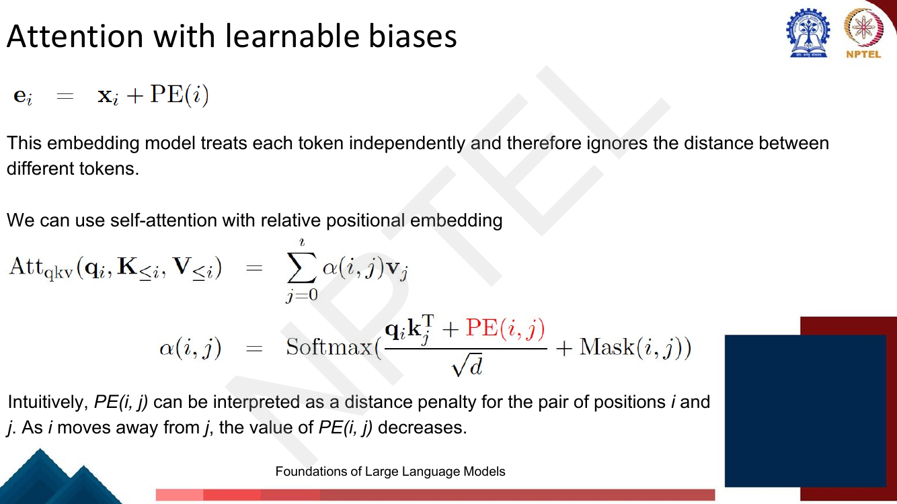
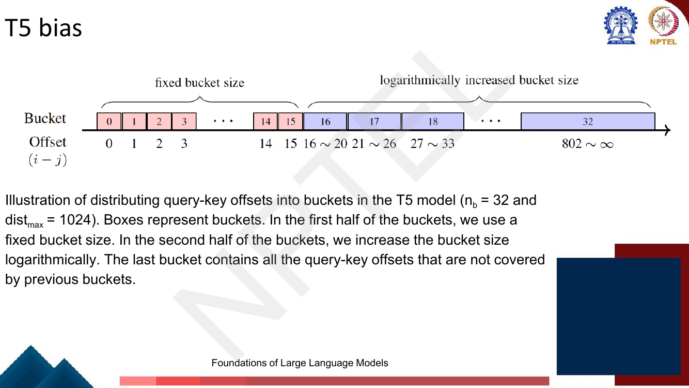
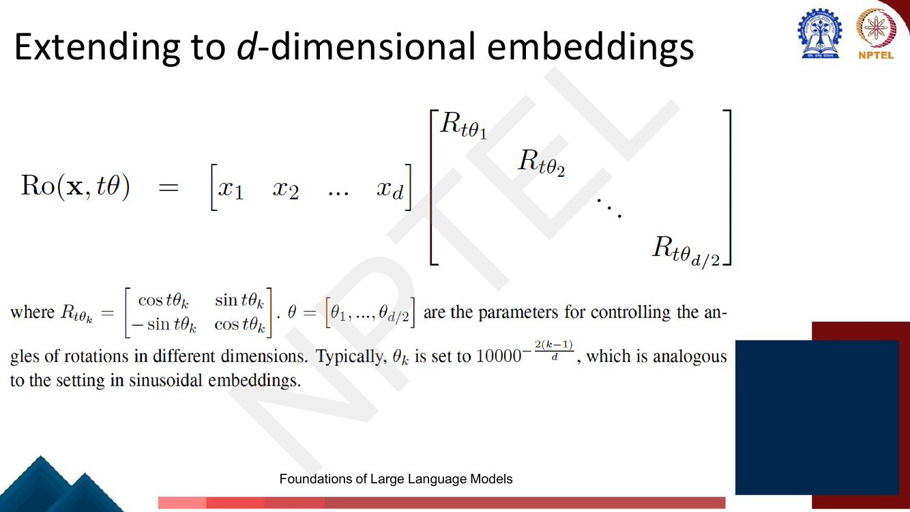

# Lec 53 — Modern Positional Embeddings: RoPE and ALiBi

> **Source:** `Week11.pdf` pp. 44–68 · **Week 11** · **Playlist:** Lec 53
> **Prereqs:** [Lec 23 — Positional Encoding and the Encoder](../week-05/23-positional-encoding-and-encoder.md), [Lec 52 — Modern LLMs and Activations](52-modern-llms-and-activations.md)
> **Feeds into:** [Lec 54 — Long Sequence Modeling](54-long-sequence-modeling.md)

## Why this lecture exists

You train a model on sequences of at most 2048 tokens because attention costs $O(n^2)$ and you cannot
afford more. Then you deploy it and someone pastes in a 30,000-token contract. What happens at
position 5000?

With the schemes [Lec 23](../week-05/23-positional-encoding-and-encoder.md) taught, something bad. A
*learned* position embedding table has 2048 rows; row 5000 does not exist, so there is literally
nothing to add. A *sinusoidal* encoding is a closed-form function of position, so it technically
returns a vector for position 5000 — but the model has never seen that vector and attention scores
blow up. Both failures have the same root: they encode **absolute** position, while attention only
ever cares about how *far apart* two tokens are. This lecture fixes the root. It gives you four
modern schemes — T5's learned bias, ALiBi, RoPE, and the two ways to stretch RoPE past its training
length — and RoPE is the one every current open LLM uses.

## The ideas

### What Lec 23 left you with, and why it is not enough

Two schemes, both **additive at the input only**: sinusoidal encoding (a fixed function of position,
added once to the token embedding before layer 1) and learned encoding (a trainable matrix
$\mathbf{E}_{\text{pos}} \in \mathbb{R}^{n_{\max} \times d_{\text{model}}}$, one row per position).
Both are derived in [Lec 23](../week-05/23-positional-encoding-and-encoder.md); do not re-derive them
here. The only thing you need carried forward is the *shape* of the operation:

$$\mathbf{e}_i = \mathbf{x}_i + \text{PE}(i)$$

The deck prints exactly this line (p. 48) and then says the damning thing about it: **"this embedding
model treats each token independently and therefore ignores the distance between different tokens."**
Each token gets its own position stamp; nothing in the architecture ever computes $i - j$.

### Towards long sequence modeling: extrapolate or interpolate

The deck's framing (p. 46). You restrict training length to control cost but want inference on much
longer inputs. Two ways out:

- **Extrapolate** — fit a function on positions $[0, L]$ and apply it *outside* that range to
  estimate positions $> L$.
- **Interpolate** — map the larger range $[0, L']$ *back into* the observed range $[0, L]$. The deck
  marks this **(preferred)**, and the reason becomes concrete at the end of the lecture.


*Fig. — Read this as the whole lecture in one picture. (a) is a learned table: past 1024 the blue points simply have no fitted curve under them. (b) extrapolates the fitted function into untrained territory. (c) rescales so every test position lands inside the trained window — nothing is ever evaluated outside what training covered. Page 47 of `Week11.pdf`.*

Panel (a) is the learned-embedding failure stated visually: **there is no fitted curve past the
training length at all**, because each position was an independent parameter. Panel (b) is the
sinusoidal case — a curve exists, it just has never been checked against data.

### Absolute versus relative: the organising idea

Here is the design insight that generates everything else in this chapter. When attention scores
token $i$ against token $j$ it computes one number, $\mathbf{q}_i \cdot \mathbf{k}_j$. What should
that number depend on? Not on $i$ and $j$ separately — a verb three words after its subject behaves
the same whether that happens at positions 2 and 5 or at positions 902 and 905. It should depend on
the **offset** $d(i,j) = i - j$.

So instead of stamping absolute positions onto tokens and hoping attention recovers the difference,
encode the difference directly. Two families do this, and the deck organises the lecture by them:

| Family | How position enters | Examples |
|---|---|---|
| **Additive bias on the score** | a scalar added to $\mathbf{q}_i\mathbf{k}_j^\top$, indexed by $i-j$ | T5 bias (learned), ALiBi (fixed) |
| **Rotation of $\mathbf{q}$ and $\mathbf{k}$** | a position-dependent rotation applied to the vectors | RoPE |

### Attention with learnable biases

The deck's generic relative-attention form (p. 48), which both bias schemes instantiate:

$$\text{Att}_{\text{qkv}}(\mathbf{q}_i, \mathbf{K}_{\le i}, \mathbf{V}_{\le i}) = \sum_{j=0}^{i}\alpha(i,j)\,\mathbf{v}_j, \qquad
\alpha(i,j) = \text{Softmax}\!\left(\frac{\mathbf{q}_i\mathbf{k}_j^\top + \text{PE}(i,j)}{\sqrt{d}} + \text{Mask}(i,j)\right)$$


*Fig. — Notice where the deck puts the bias: **inside** the numerator, so it is divided by $\sqrt{d}$ along with the dot product. The T5 and ALiBi papers add their bias **after** scaling. See the erratum note below. Page 48.*

Three things to read off that formula:

1. $\text{PE}$ is now a function of **two** indices, not one. Position has moved out of the token
   representation and into the score.
2. It sits in the **same additive slot as the causal mask**. [Lec 24](../week-05/24-decoder-and-transformer-lm.md)
   presents masking as adding a matrix $\mathbf{M}$ with $-\infty$ above the diagonal
   (`Week5.pdf` p. 88); a relative bias is the same move with finite numbers. The sparse and local
   attention patterns of [Lec 25](../week-05/25-efficient-transformers.md) live there too.
3. The deck's intuition: *"$\text{PE}(i,j)$ can be interpreted as a distance penalty for the pair of
   positions $i$ and $j$. As $i$ moves away from $j$, the value of $\text{PE}(i,j)$ decreases."*
   Far-apart tokens get pushed down before the softmax.

> **Erratum worth knowing.** The deck writes $\big(\mathbf{q}_i\mathbf{k}_j^\top + \text{PE}(i,j)\big)/\sqrt{d}$
> on pp. 48, 52, 53 and 54. Both source papers add the bias *outside* the scaling:
> $\mathbf{q}_i\mathbf{k}_j^\top/\sqrt{d} + \text{PE}(i,j)$. For ALiBi this matters — it changes the
> effective slope by a factor of $\sqrt{d}$. Follow the deck if the exam quotes the deck's line;
> know that implementations do the other thing.

### T5 bias: one learned scalar per bucket

T5 [Raffel et al., 2020] takes the simplest possible learnable design and then fixes its one flaw.

**The simple design:** share a learnable scalar across all query–key pairs with the same offset,
$\text{PE}(i,j) = u_{i-j}$. The deck states the flaw immediately: *"simply assigning a unique value to
each offset will restrict this model to observed offsets. When $i - j$ is larger than the maximum
trained offset, the model cannot generalize."* You have moved the extrapolation problem, not solved it.

**The fix:** group offsets into **buckets**, each bucket owning one learnable parameter. Nearby
offsets get their own bucket (you need fine resolution at short range); distant offsets share
increasingly wide buckets (you only need to know "far"). With $n_b$ buckets and a cut-off
$\text{dist}_{\max}$ the deck gives (p. 52):

$$b(i-j) = \begin{cases}
i-j & 0 \le i-j < \tfrac{n_b+1}{2}\\
\min\!\left(n_b,\; \tfrac{n_b+1}{2} + \left\lfloor \dfrac{\log(i-j) - \log\frac{n_b+1}{2}}{\log(\text{dist}_{\max}) - \log\frac{n_b+1}{2}}\cdot\tfrac{n_b+1}{2}\right\rfloor\right) & i-j \ge \tfrac{n_b+1}{2}
\end{cases}$$

$$\alpha(i,j) = \text{Softmax}\!\left(\frac{\mathbf{q}_i\mathbf{k}_j^\top + u_{b(i-j)}}{\sqrt{d}} + \text{Mask}(i,j)\right)$$

and says the parameters $\{u_0,\ldots,u_{n_b}\}$ are *"learned as common parameters during training"* —
shared across all positions, which is the entire point.


*Fig. — The two regimes, with $n_b = 32$, $\text{dist}_{\max} = 1024$. Buckets 0–15 are exact (offset 7 means bucket 7). From bucket 16 the width grows geometrically, and bucket 32 is a catch-all that absorbs every offset from 802 upward — **that is what gives T5 bias unbounded range with finitely many parameters**. Page 51.*

The last bucket is the quiet hero: because it absorbs *everything* beyond 802, a T5-bias model at
offset 50,000 still has a defined bias. It does not have a *useful* one — it just reads "very far" —
but it does not crash.

### ALiBi: a fixed linear penalty, and no position embeddings at all

The deck's alternative (p. 53): *"give these biases fixed values via heuristics, rather than training
them on a particular dataset… it does not rely on a training process and thus can be directly applied
to any sequences once the biases are set."*

**Attention with Linear Biases (ALiBi)** sets the bias to the negative scaled offset:

$$\text{PE}(i,j) = -\beta\cdot(i-j) = \beta\cdot(j-i), \qquad
\alpha(i,j) = \text{Softmax}\!\left(\frac{\mathbf{q}_i\mathbf{k}_j^\top + \beta\cdot(j-i)}{\sqrt{d}} + \text{Mask}(i,j)\right)$$

Under causal masking $j \le i$, so $j - i \le 0$ and the bias is a non-positive penalty growing
linearly with distance. The deck's reading: *"adding a fixed penalty whenever $j$ moves one step away
from $i$."* One step further back costs you exactly $\beta$ of logit, every time. That is the entire
mechanism.

Three consequences you must be able to state:

- **ALiBi uses no position embeddings whatsoever.** Nothing is added to $\mathbf{x}_i$; nothing is
  rotated. The token representation at the input is position-free, and position lives only in the
  attention score. This is what makes it so cheap.
- **It adds zero learned parameters.** $\beta$ is a constant, chosen by formula.
- **It extrapolates for free.** A linear function of distance is defined at every distance. A model
  trained at 1024 and run at 4096 just gets larger penalties for the new, further pairs — no
  untrained quantity is ever evaluated. This is ALiBi's headline claim and the reason it exists.

**The head-specific slope.** One global $\beta$ would give every head the same effective context
length, which wastes the heads. Press et al. [2022] give each head its own:


*Fig. — The deck prints $\beta_k = 1/2^{8/k}$ for the $k$-th head. **Note that $n_{\text{head}}$ does not appear in it** — a head-slope schedule that ignores how many heads there are cannot be right, and the printed values are not geometric. The paper's formula is $\beta_k = 2^{-8k/n_{\text{head}}}$. See the erratum below. Page 54.*

> **Erratum — this one is examinable.** The slide says the slopes decrease *geometrically*, then
> prints $\beta_k = 1/2^{8/k}$. Evaluate it for 8 heads: $0.0039,\,0.0625,\,0.1575,\,0.25,\,0.3299,\,
> 0.3969,\,0.4529,\,0.5$. Successive ratios are $16,\,2.52,\,1.59,\,1.32,\dots$ — **not geometric**,
> contradicting the sentence directly above it. The ALiBi paper's schedule is
> $$\beta_k = 2^{-\frac{8k}{n_{\text{head}}}}, \qquad k = 1,\ldots,n_{\text{head}}$$
> which for $n_{\text{head}} = 8$ gives $\tfrac12, \tfrac14, \tfrac18, \ldots, \tfrac1{256}$ — ratio
> exactly $\tfrac12$, a true geometric sequence starting at $2^{-8/n_{\text{head}}}$ and ending at
> $2^{-8}$. The deck's expression is the paper's with $8k/n_{\text{head}}$ miscopied as $8/k$; it
> coincides only at $k \in \{1,2,4,8\}$ when $n_{\text{head}} = 8$. Learn the paper's form, and if an
> MCQ quotes "$1/2^{8/k}$" recognise it as the slide.

Why a *spread* of slopes? A head with $\beta = 1/2$ loses half a logit per step and effectively sees
only a few dozen tokens; a head with $\beta = 1/256$ barely decays and sees thousands. The model gets
a bank of attention spans for free. This is the deck's only mechanism for multi-scale context in the
whole lecture.

Also note what ALiBi's slope encodes: **a fixed preference for recency**. That is a strong prior.
It works brilliantly for language modelling, where the next token mostly depends on the recent past,
and it is exactly wrong if the information you need sits 10,000 tokens back. That trade is why RoPE,
not ALiBi, won.

### Rotary Positional Embeddings (RoPE)

The deck's own framing of the contrast (p. 55): sinusoidal embeddings are hard-coded values added to
every dimension — **additive**. RoPE *"instead model[s] positional context as rotations to token
embeddings in a complex space. This leads to a model expressed in the form of multiplicative
embeddings"*:

$$\mathbf{e}_i = \mathbf{x}_i \mathbf{R}(i), \qquad \mathbf{R}(i) \in \mathbb{R}^{d\times d}$$

#### The 2-D case

Take a 2-dimensional token embedding $\mathbf{x} = [x_1 \; x_2]$. Rotating by angle $\theta$:

$$\text{Ro}(\mathbf{x},\theta) = \mathbf{x}\mathbf{R}_\theta = [x_1\;\;x_2]\begin{bmatrix}\cos\theta & \sin\theta\\ -\sin\theta & \cos\theta\end{bmatrix} = [\cos\theta\cdot x_1 - \sin\theta\cdot x_2 \quad \sin\theta\cdot x_1 + \cos\theta\cdot x_2]$$


*Fig. — The single most important line in the lecture: **additive becomes multiplicative**. Note the deck's row-vector convention, $\mathbf{x}\mathbf{R}_\theta$ with $\mathbf{R}_\theta$ as printed; p. 56 and p. 62 switch to the column convention $\mathbf{R}\mathbf{v}$ with the signs transposed. Both describe the same rotation. Page 55.*

Why does this deserve the name "positional"? Page 57 answers it as a walk:

> Interpret $t$ as the position of a token. We start at position 0. Each time we move one step
> forward, the vector is rotated by the angle $\theta$. At position $t$ the representation is
> $\text{Ro}(\mathbf{x}, t\theta)$.

So the rotation angle is **proportional to the position index**, and the deck's crucial observation
is that *"rotations do not change the magnitude of the embedding"* — unlike addition, which moves the
vector to a different length and can swamp the semantic content. RoPE injects position purely as a
*direction change*. The word's meaning (magnitude) is untouched; only its orientation records where
it sits.

#### Why it works: the dot product sees only the offset

This is the whole trick, and it is one line of trigonometry. Work with the column convention
$\mathbf{R}_\phi = \begin{bmatrix}\cos\phi & -\sin\phi\\ \sin\phi & \cos\phi\end{bmatrix}$, which the
deck uses on p. 56. Two facts about rotation matrices:

$$\mathbf{R}_\phi^\top = \mathbf{R}_{-\phi}, \qquad \mathbf{R}_a\mathbf{R}_b = \mathbf{R}_{a+b}$$

(The second is the angle-sum identity written as a matrix product: the deck derives exactly this on
p. 56 by writing $\mathbf{v} = (r\cos\phi, r\sin\phi)$ and showing
$\mathbf{R}_\theta\mathbf{v} = r\,(\cos(\phi+\theta), \sin(\phi+\theta))$.) Now put the query at
position $m$ and the key at position $n$:

$$\langle \mathbf{R}_{m\theta}\mathbf{q},\; \mathbf{R}_{n\theta}\mathbf{k}\rangle
= (\mathbf{R}_{m\theta}\mathbf{q})^\top \mathbf{R}_{n\theta}\mathbf{k}
= \mathbf{q}^\top \mathbf{R}_{m\theta}^\top \mathbf{R}_{n\theta}\mathbf{k}
= \mathbf{q}^\top \mathbf{R}_{-m\theta}\mathbf{R}_{n\theta}\mathbf{k}
= \mathbf{q}^\top \mathbf{R}_{(n-m)\theta}\mathbf{k}$$

**The absolute positions $m$ and $n$ have cancelled.** What survives is a function of $\mathbf{q}$,
$\mathbf{k}$ and the offset $n - m$ alone. Say it in the form the exam wants:

> **RoPE applies an absolute encoding and obtains relative behaviour.** Each token is rotated by its
> own absolute position — no pairwise bookkeeping, no $n \times n$ bias table — yet every attention
> score it produces depends only on the relative distance.

That is why RoPE beat T5 bias (which needs a learned table) and ALiBi (which hard-codes a recency
prior): it is relative *for free*, as an algebraic identity.

#### The deck's cat-and-sleeping picture


*Fig. — "cat" and "sleeping" are 2 apart in both sentences. Moving from (2,4) to (9,11) rotates **both** vectors by the same $7\theta$, so the angle between them — and therefore their dot product — is unchanged. This picture **is** the proof above, drawn. Page 59.*

Make the correspondence explicit, because the exam can ask it either way. The pair $(2,4)$ and the
pair $(9,11)$ both have offset 2. Rotating the whole scene by $7\theta$ is a rigid motion; rigid
motions preserve inner products. So $\langle \mathbf{R}_{2\theta}\mathbf{q}, \mathbf{R}_{4\theta}\mathbf{k}\rangle
= \langle \mathbf{R}_{9\theta}\mathbf{q}, \mathbf{R}_{11\theta}\mathbf{k}\rangle$, and the model
scores "cat"→"sleeping" identically in both sentences. Numerical N1 below does this with real numbers.

#### Extending to $d$ dimensions

Real embeddings are 128- or 4096-dimensional, not 2. RoPE chops the vector into $d/2$ consecutive
pairs, treats each pair as a 2-D plane, and rotates each by a **different** frequency:

$$\text{Ro}(\mathbf{x}, t\theta) = [x_1\;x_2\;\ldots\;x_d]\begin{bmatrix}\mathbf{R}_{t\theta_1} & & &\\ & \mathbf{R}_{t\theta_2} & &\\ & & \ddots &\\ & & & \mathbf{R}_{t\theta_{d/2}}\end{bmatrix},\qquad
\mathbf{R}_{t\theta_k} = \begin{bmatrix}\cos t\theta_k & \sin t\theta_k\\ -\sin t\theta_k & \cos t\theta_k\end{bmatrix}$$


*Fig. — A **block-diagonal** matrix of $d/2$ independent 2-D rotations. All off-block entries are zero, so dimension pair 1 never mixes with pair 2 — which is why the relative-offset proof above, done once in 2-D, carries over to all $d$ dimensions verbatim. Page 60.*

The frequency schedule the deck gives is

$$\theta_k = 10000^{-\frac{2(k-1)}{d}}, \qquad k = 1,\ldots,d/2$$

and it says this is *"analogous to the setting in sinusoidal embeddings"* — which it is: the same
$10000$ base, the same geometric spread of wavelengths. Early pairs ($k$ small) spin fast and resolve
one- and two-token offsets; late pairs ($k$ near $d/2$) spin so slowly they barely move over the
whole sequence and encode coarse, long-range position. Numerical N2 computes the spread.

**The practical form** (p. 61) avoids ever materialising the $d\times d$ matrix. Since each block only
mixes two coordinates, the whole rotation is two element-wise products and an add:

$$\text{Ro}(\mathbf{x}, t\theta) = \begin{bmatrix}x_1\\x_2\\\vdots\\x_{d-1}\\x_d\end{bmatrix}\odot\begin{bmatrix}\cos t\theta_1\\\cos t\theta_1\\\vdots\\\cos t\theta_{d/2}\\\cos t\theta_{d/2}\end{bmatrix} + \begin{bmatrix}-x_2\\x_1\\\vdots\\-x_d\\x_{d-1}\end{bmatrix}\odot\begin{bmatrix}\sin t\theta_1\\\sin t\theta_1\\\vdots\\\sin t\theta_{d/2}\\\sin t\theta_{d/2}\end{bmatrix}$$

Note each $\cos t\theta_k$ appears **twice** (once per coordinate of its pair) and the second vector
is the first with each pair swapped and negated. Cost: $O(d)$ per token, not $O(d^2)$.

#### Rotary embeddings and self-attention: where it is applied


*Fig. — Read the order of operations off the first line: **project first with $\mathbf{W}_q$, then rotate**. The last line is the payoff — the score reduces to $\mathbf{x}_m^\top\mathbf{W}_q\mathbf{R}^d_{\Theta,n-m}\mathbf{W}_k\mathbf{x}_n$, carrying the index $n-m$ and nothing else. The lecturer's note pins $d = d_{\text{model}}/n_{\text{head}} = 4096/32 = 128$ for LLaMA-7B. Page 62.*

$$f_{\{q,k\}}(\mathbf{x}_m, m) = \mathbf{R}^d_{\Theta,m}\mathbf{W}_{\{q,k\}}\mathbf{x}_m, \qquad
\mathbf{q}_m^\top\mathbf{k}_n = \mathbf{x}_m^\top\mathbf{W}_q\mathbf{R}^d_{\Theta,n-m}\mathbf{W}_k\mathbf{x}_n$$

Everything else about the attention block is unchanged — the $\mathbf{W}_q,\mathbf{W}_k,\mathbf{W}_v$
projections, the $\sqrt{d_k}$ scaling, the softmax and the multi-head split are all exactly as
[Lec 22](../week-05/22-self-attention-and-multihead.md) derived them. RoPE inserts one orthogonal
matrix between the projection and the dot product, and nothing else moves.

Four implementation facts, all examinable, two of them stated only by the slide's structure:

| Question | Answer |
|---|---|
| Applied to what? | $\mathbf{q}$ and $\mathbf{k}$ **only** — never to $\mathbf{v}$ |
| Applied when? | **after** the $\mathbf{W}_q/\mathbf{W}_k$ projection, just before the dot product |
| Applied where? | **at every layer**, inside every attention block |
| What is $d$ here? | the **head** dimension $d_k = d_{\text{model}}/n_{\text{head}}$, not $d_{\text{model}}$ |

The "$\mathbf{v}$" point has a reason: the relative-offset cancellation is a property of the *inner
product* $\mathbf{q}^\top\mathbf{k}$. $\mathbf{v}$ is never dotted with anything — it is summed with
weights — so rotating it would inject absolute position into the output with nothing to cancel it.

The "every layer" point is the sharp contrast with [Lec 23](../week-05/23-positional-encoding-and-encoder.md):
sinusoidal and learned encodings are added **once**, at the input, and the signal has to survive
every residual and LayerNorm after that (`Week5.pdf` p. 77 is the deck's only statement of this).
RoPE is re-applied in every attention computation, so the positional signal cannot decay.


*Fig. — The two axes of RoPE in one picture. **Across a row** (one token): different dimension pairs carry different constant frequencies $\theta_1,\ldots,\theta_{d/2}$. **Down a column** (one dimension pair): the rotation angle grows with position, $1\theta_1, 2\theta_1, \ldots, 6\theta_1$ — the lecturer has written these in. The colours on the right are the same vectors after rotation; the magnitudes are unchanged, only the mix. Page 63.*

### Extending the context window

You have a RoPE model trained to $L = 2048$ and you want 8192. What breaks?


*Fig. — The middle panel is the argument for interpolation. Trained to $L = 2048$; at a positional difference of ~3400 the attention score before softmax reaches **8000**, against a trained range of about $\pm 3$. A single score that large makes the softmax a one-hot — attention collapses onto one token and the model outputs garbage. The right panel, interpolated, stays inside $\pm 0.25$. Page 64.*

This is the lecture's empirical punchline, and the deck states it plainly: *"L=2048, out of this
region it may cause catastrophic issues in attention computation. Interpolation is much more
stable."* Two fixes follow.

#### Position interpolation (PI)

![Slide titled Position Interpolation with the lecturer's handwriting: suppose training length is 0 to L, at test time maximum position L' > L, we represent positions in [0,L'] so representations fit [0,L]. The boxed formula f'(x, m) = f(x, mL/L') is circled, with annotations L'=4096, 2048 theta_1, and the block-diagonal R matrix below](../../assets/pages/lec53/p-065.png)
*Fig. — The whole method is the circled box: **scale the position index down before you rotate**. The lecturer's annotations work the case $L = 2048 \to L' = 4096$, where $m = 2048$ becomes $mL/L' = 1024$. The pink footnote is the other half: a short fine-tune on ~1000s of examples from the Pile. Page 65.*

$$\mathbf{f}'(\mathbf{x}, m) = \mathbf{f}\!\left(\mathbf{x}, \frac{mL}{L'}\right)$$

Nothing about the model changes. You simply feed position $mL/L'$ where you would have fed $m$, so the
entire extended range $[0, L']$ is squeezed into $[0, L]$ — the range the model actually saw. Every
rotation angle is now one the model was trained on. The cost is **resolution**: with $L'/L = 4$,
adjacent tokens are $0.25$ apart instead of $1$, so fine positional distinctions get blurred. The deck
says you then *"fine-tune the interpolated model using the next token prediction task with
interpolated position encodings… using a pre-training corpus such as the Pile (~1000s of examples)"* —
remarkably cheap, which is exactly why PI took over.

#### Adjusted base frequency (ABF)


*Fig. — Change the **base**, not the position. The table is the result: on 32,768-token sequences, RoPE 6.548 / 6.816 / 3.802 → RoPE ABF **6.323 / 6.780 / 3.771**, beating PI on all three corpora. The plot shows why — ABF (green) keeps attention scores high at 30,000 tokens' distance where plain RoPE (blue) has decayed. Page 66.*

The other knob. Instead of shrinking $m$, enlarge the base $b$ in $\theta_k = b^{-2(k-1)/d}$:

$$10{,}000 \longrightarrow 500{,}000$$

The deck's reasoning: LLaMA-2 *"was unable to effectively attend beyond 4,000–6,000 tokens even after
extensive long-context continual pretraining"*, so they modified RoPE *"to reduce the decaying
effect — increasing the base frequency $b$… which essentially **reduces the rotation angles of each
dimension**."* A larger base makes every $\theta_k$ (for $k > 1$) smaller, so wavelengths lengthen and
the slow dimensions stop wrapping around within the context. N5 computes the effect: at $d = 128$, the
slowest pair's wavelength goes from 54,410 to 2.56 million tokens. This is the idea generally called
**NTK-aware scaling**.

**PI versus ABF in one line:** PI rescales the *position* ($m \to mL/L'$) and leaves $\theta$ alone;
ABF rescales $\theta$ (via the base $b$) and leaves $m$ alone. Both shrink the rotation angle actually
used; they differ in whether every dimension is shrunk by the same factor (PI) or the slow dimensions
more than the fast ones (ABF).

### Which model uses which scheme

The roll-call, which `Week5.pdf` p. 70 already gave you inside Lec 23's range. Reproduced here because
it is this chapter's content; for what the models *are*, see [Lec 52](52-modern-llms-and-activations.md).

| Scheme | Models | Learned params | Extrapolates? |
|---|---|---|---|
| Learned absolute | BERT, GPT (GPT-2/3) | $n_{\max}\times d_{\text{model}}$ | **No** — no row exists past $n_{\max}$ |
| Sinusoidal absolute | original Transformer | 0 | Defined, but performs badly |
| Relative bias (T5 bias) | T5 | $n_b$ scalars per head | Degrades gracefully (catch-all bucket) |
| ALiBi | BLOOM, MPT | **0** | **Yes**, by construction |
| RoPE | LLaMA, Mistral, Falcon, PaLM, Gemma | **0** | Not natively — needs PI or ABF |

## Worked numericals

> **No "Try this problem" page exists in `Week11.pdf` pp. 44–68.** All 25 pages were opened as
> images; the range contains a title slide, a contents slide, 21 teaching slides, a references slide
> and a thank-you slide, with no in-deck exercise, blank question slide or handwritten solution. The
> re-swept exercise table lists no page for Lec 53, and that is correct. The lecturer's handwritten
> annotations on pp. 62, 64 and 65 pose arithmetic in all but name, so N5 works his own numbers.
> N1–N7 below are mine.

### N1. The RoPE thesis: same offset, same dot product
**Given:** 2-D query $\mathbf{q} = (1, 2)$ at position $m$, key $\mathbf{k} = (3, 1)$ at position $n$,
rotation angle per step $\theta = \pi/6 = 30°$. Column convention,
$\mathbf{R}_\phi = \begin{bmatrix}\cos\phi & -\sin\phi\\ \sin\phi & \cos\phi\end{bmatrix}$.
**Find:** $\langle \mathbf{R}_{m\theta}\mathbf{q}, \mathbf{R}_{n\theta}\mathbf{k}\rangle$ at
$(m,n) = (3,7)$ and at $(m,n) = (10,14)$ — both offset 4.

**Case A, $m = 3$, $n = 7$.**

1. Query angle $= 3\times 30° = 90°$. $\cos 90° = 0$, $\sin 90° = 1$.
2. $\mathbf{R}_{90°}\mathbf{q} = (1\cdot 0 - 2\cdot 1,\; 1\cdot 1 + 2\cdot 0) = (-2,\; 1)$.
3. Key angle $= 7\times 30° = 210°$. $\cos 210° = -0.866025$, $\sin 210° = -0.5$.
4. $\mathbf{R}_{210°}\mathbf{k} = (3(-0.866025) - 1(-0.5),\; 3(-0.5) + 1(-0.866025))$
   $= (-2.598076 + 0.5,\; -1.5 - 0.866025) = (-2.098076,\; -2.366025)$.
5. Dot: $(-2)(-2.098076) + (1)(-2.366025) = 4.196152 - 2.366025 = \mathbf{1.830127}$.

**Case B, $m = 10$, $n = 14$.**

6. Query angle $= 300°$. $\cos 300° = 0.5$, $\sin 300° = -0.866025$.
7. $\mathbf{R}_{300°}\mathbf{q} = (1(0.5) - 2(-0.866025),\; 1(-0.866025) + 2(0.5)) = (2.232051,\; 0.133975)$.
8. Key angle $= 420° \equiv 60°$. $\cos 60° = 0.5$, $\sin 60° = 0.866025$.
9. $\mathbf{R}_{60°}\mathbf{k} = (3(0.5) - 1(0.866025),\; 3(0.866025) + 1(0.5)) = (0.633975,\; 3.098076)$.
10. Dot: $(2.232051)(0.633975) + (0.133975)(3.098076) = 1.415064 + 0.415063 = \mathbf{1.830127}$.

**Check via the identity.** $\mathbf{q}^\top\mathbf{R}_{(n-m)\theta}\mathbf{k}$ with $(n-m)\theta = 120°$:
$\mathbf{R}_{120°}\mathbf{k} = (3(-0.5) - 1(0.866025),\; 3(0.866025) + 1(-0.5)) = (-2.366025,\; 2.098076)$,
and $1(-2.366025) + 2(2.098076) = 1.830127$ ✓ — one computation replaces both.

**Answer:** **1.830127 in both cases, exactly.** Compare the unrotated dot product
$\mathbf{q}\cdot\mathbf{k} = 3 + 2 = 5$: rotation *did* change the score (position matters), but it
changed it to the same value for every pair at offset 4. At offset 5 (e.g. $m=3, n=8$) you get
$-1.830127$ — a different number, as it must be.

### N2. The RoPE frequency schedule
**Given:** $\theta_k = 10000^{-2(k-1)/d}$ with $d = 8$, so $k = 1,2,3,4$.
**Find:** each $\theta_k$ and its wavelength $\lambda_k = 2\pi/\theta_k$ (the number of positions for
a full $360°$ turn of that dimension pair).

1. $k=1$: exponent $-2(0)/8 = 0$, $\theta_1 = 10000^0 = \mathbf{1}$. $\lambda_1 = 2\pi = 6.28$.
2. $k=2$: exponent $-2(1)/8 = -0.25$, $\theta_2 = 10000^{-0.25} = (10^4)^{-1/4} = 10^{-1} = \mathbf{0.1}$. $\lambda_2 = 62.83$.
3. $k=3$: exponent $-0.5$, $\theta_3 = 10^{-2} = \mathbf{0.01}$. $\lambda_3 = 628.3$.
4. $k=4$: exponent $-0.75$, $\theta_4 = 10^{-3} = \mathbf{0.001}$. $\lambda_4 = 6283$.
5. Ratio between consecutive: $10000^{-2/d} = 10000^{-0.25} = 0.1$ — constant, so the schedule is
   **geometric**, spanning $10^3$ across just 4 pairs.

**Answer:** $\theta = (1,\,0.1,\,0.01,\,0.001)$, wavelengths $(6.3,\,62.8,\,628,\,6283)$. Pair 1 turns
fully every 6 tokens — it resolves immediate neighbours. Pair 4 turns once in 6283 tokens — over a
2048-token context it sweeps only a third of a circle, giving a near-monotonic coarse position signal.
At the real $d = 128$ the slowest pair ($k = 64$) has $\theta = 1.155\times10^{-4}$, wavelength 54,410.

### N3. An ALiBi bias matrix, and what it does to the softmax
**Given:** 4 tokens, causal masking, head slope $\beta = 1/4$. Raw scores
$\mathbf{q}_i\mathbf{k}_j^\top$ (lower triangle):

| | $j=0$ | $j=1$ | $j=2$ | $j=3$ |
|---|---|---|---|---|
| $i=0$ | 2.0 | | | |
| $i=1$ | 1.0 | 2.0 | | |
| $i=2$ | 0.5 | 1.0 | 2.0 | |
| $i=3$ | 0.0 | 0.5 | 1.0 | 2.0 |

**Find:** the bias matrix $\beta(j-i)$, the biased scores, and row 3's attention weights with and
without ALiBi. (Scaling by $\sqrt{d}$ omitted — it multiplies every entry of a row alike and is not
what is being examined.)

1. Bias $= \tfrac14(j-i)$: row 0 → $[0]$; row 1 → $[-0.25, 0]$; row 2 → $[-0.5, -0.25, 0]$;
   row 3 → $[-0.75, -0.5, -0.25, 0]$. The diagonal is always 0 and each step back costs $0.25$.
2. Biased row 3: $0.0-0.75 = -0.75$; $0.5-0.5 = 0$; $1.0-0.25 = 0.75$; $2.0-0 = 2.0$.
3. Exponentiate (subtracting the max 2.0): $e^{-2.75} = 0.063928$, $e^{-2} = 0.135335$,
   $e^{-1.25} = 0.286505$, $e^0 = 1$. Sum $= 1.485768$.
4. Weights: $0.043027,\; 0.091088,\; 0.192833,\; 0.673053$.
5. Without ALiBi, row 3 is $[0.0, 0.5, 1.0, 2.0]$: $e^{-2}=0.135335$, $e^{-1.5}=0.223130$,
   $e^{-1}=0.367879$, $e^0=1$, sum $1.726344$ → $0.078394,\; 0.129250,\; 0.213097,\; 0.579259$.

**Answer:** the furthest token's weight falls $0.0784 \to 0.0430$ (**−45%**) while the current token's
rises $0.5793 \to 0.6731$. Note what this is *not*: the penalty is not a cut-off, it is a smooth tilt,
so the far token still gets some mass. And note the bias is independent of content — every head
applies the same recency tilt to every sequence.

### N4. The ALiBi head-slope schedule for 8 heads
**Given:** $n_{\text{head}} = 8$, paper schedule $\beta_k = 2^{-8k/n_{\text{head}}}$.
**Find:** all eight slopes, the common ratio, and the effective reach of the extreme heads.

1. With $n_{\text{head}} = 8$ the exponent simplifies: $-8k/8 = -k$, so $\beta_k = 2^{-k}$.
2. $k=1\ldots 8$: $\tfrac12,\ \tfrac14,\ \tfrac18,\ \tfrac1{16},\ \tfrac1{32},\ \tfrac1{64},\ \tfrac1{128},\ \tfrac1{256}$
   $= 0.5,\,0.25,\,0.125,\,0.0625,\,0.03125,\,0.015625,\,0.0078125,\,0.00390625$.
3. Ratio $\beta_{k+1}/\beta_k = 0.5$ for every $k$ — **geometric**, as advertised.
4. Reach: head 1 ($\beta = 0.5$) loses $e^{-0.5} = 0.607$ of weight per step back, so weight at
   distance 20 is down by $e^{-10} = 4.5\times10^{-5}$ — effectively a 10–20 token window.
   Head 8 ($\beta = 0.00390625$) loses only $e^{-0.0039}$ per step; at distance 2000 the penalty is
   $e^{-7.81} = 4.1\times10^{-4}$ — still attending across thousands of tokens.
5. The deck's printed $1/2^{8/k}$ instead gives $0.0039,\,0.0625,\,0.1575,\,0.25,\,0.3299,\,0.3969,\,
   0.4529,\,0.5$ — ratios $16, 2.52, 1.59, 1.32, 1.20, 1.14, 1.10$, **not** geometric.

**Answer:** $\beta_k = 2^{-k}$ for 8 heads, spanning $\tfrac12$ down to $\tfrac1{256}$ — a 256-fold
spread of effective context lengths across the heads of a single layer. For $n_{\text{head}} = 16$ the
ratio becomes $2^{-1/2} = 0.7071$ and the sequence runs $0.7071, 0.5, 0.3536, \ldots, 0.00391$ — the
endpoint $2^{-8}$ is fixed, only the step size changes.

### N5. Position interpolation (the lecturer's own annotation, extended)
**Given:** a RoPE model trained to $L = 2048$. **Find:** the scaling factor and effective positions
for (a) the deck's annotated case $L' = 4096$, (b) an extension to $L' = 8192$.

**(a) $L' = 4096$** — the lecturer writes $L' = 4096$ and $m = 2048$ on p. 65.

1. Scale factor $L/L' = 2048/4096 = \mathbf{0.5}$.
2. $m = 2048 \mapsto 2048\times 0.5 = \mathbf{1024}$ ✓ matches his annotation.
3. Largest position $m = 4095 \mapsto 2047.5$ — inside $[0, 2048]$ ✓.
4. Effect on the fastest dimension ($\theta_1 = 1$): angle at $m = 4095$ was $4095$ rad before
   interpolation, now $2047.5$ rad — exactly what the model trained on.

**(b) $L' = 8192$.**

5. Scale factor $= 2048/8192 = \mathbf{0.25}$.
6. $m = 8191 \mapsto 2047.75$ — inside the trained range ✓.
7. Resolution: adjacent tokens are now $0.25$ positions apart instead of 1, so the angular gap on
   dimension pair $k$ shrinks from $\theta_k$ to $0.25\theta_k$. Pair 1's per-token turn drops from
   $57.3°$ to $14.3°$ — four tokens now occupy the angular space one used to.

**Answer:** scale factors $0.5$ and $0.25$; the largest effective positions are $2047.5$ and
$2047.75$, both inside $[0, 2048]$. **Nothing is ever evaluated outside the trained range** — that is
the guarantee, and it is bought with a $1/4$ loss of positional resolution, which the ~1000s-of-example
fine-tune on the Pile is there to recover.

### N6. T5 bucket assignment
**Given:** the deck's figure settings, $n_b = 32$, $\text{dist}_{\max} = 1024$: buckets 0–15 exact,
then 17 logarithmically widening buckets 16–32.
**Find:** the bucket for offsets $0,\ 7,\ 15,\ 16,\ 20,\ 21,\ 27,\ 33,\ 100,\ 802,\ 50000$.

1. Offsets below 16 are exact: $0\to 0$, $7\to \mathbf{7}$, $15\to \mathbf{15}$.
2. For $i-j \ge 16$ the figure's rule is
   $b = 16 + \left\lfloor \dfrac{\log\!\left(\frac{i-j}{16}\right)}{\log\!\left(\frac{1024}{16}\right)}\cdot 17\right\rfloor$,
   capped at 32. Denominator: $\log 64 = 4.158883$.
3. $i-j = 16$: $\log 1 = 0$ → $16 + 0 = \mathbf{16}$.
4. $i-j = 20$: $\log(1.25) = 0.223144$; $0.223144/4.158883 = 0.053655$; $\times 17 = 0.9121$ →
   $\lfloor\cdot\rfloor = 0$ → $\mathbf{16}$.
5. $i-j = 21$: $\log(1.3125) = 0.271934$; ratio $0.065387$; $\times 17 = 1.1116$ → $1$ → $\mathbf{17}$.
6. $i-j = 27$: $\log(1.6875) = 0.523248$; ratio $0.125814$; $\times 17 = 2.1388$ → $2$ → $\mathbf{18}$.
7. $i-j = 33$: $\log(2.0625) = 0.723919$; ratio $0.174063$; $\times 17 = 2.9591$ → $2$ → $\mathbf{18}$.
8. $i-j = 100$: $\log(6.25) = 1.832581$; ratio $0.440647$; $\times 17 = 7.4910$ → $7$ → $\mathbf{23}$.
9. $i-j = 802$: $\log(50.125) = 3.914475$; ratio $0.941237$; $\times 17 = 16.001$ → $16$ → $\mathbf{32}$.
10. $i-j = 50000$: the formula exceeds 32, so the $\min(n_b, \cdot)$ caps it at $\mathbf{32}$.

**Answer:** $0,\,7,\,15,\,16,\,16,\,17,\,18,\,18,\,23,\,32,\,32$. Steps 3–7 and 9 reproduce the
slide's printed intervals **16~20, 21~26, 27~33 and 802~∞ exactly**, which confirms the figure uses
$16$ exact buckets and $17$ log buckets. (The deck's printed formula uses $\frac{n_b+1}{2} = 16.5$ in
all three places, which is not an integer and does not reproduce the figure — see "Cut from the
slides".) The real lesson is step 10: **every offset, however large, lands in a bucket that has a
trained parameter.**

### N7. Positional parameter counts: the clean examinable contrast
**Given:** a LLaMA-7B-shaped model — $d_{\text{model}} = 4096$, 32 layers, 32 heads
($d_k = 128$), context 4096.
**Find:** the positional parameters each scheme adds.

1. **Learned absolute:** one row per position, $n_{\max}\times d_{\text{model}} = 4096\times 4096
   = \mathbf{16{,}777{,}216}$ (16.8 M). To extend to 32,768 context you would need
   $32768\times 4096 = 134{,}217{,}728$ — **and those rows are untrained**.
2. **Sinusoidal absolute:** closed-form, $\mathbf{0}$ learned parameters.
3. **T5 bias:** $n_b + 1 = 33$ scalars per head. T5 shares the bias across layers, so
   $33\times 32 = \mathbf{1{,}056}$ — about 1 kB, 16,000× smaller than the learned table.
   Per-layer instead of shared, it would be $33\times 32\times 32 = 33{,}792$. Still negligible.
4. **ALiBi:** the slope is a constant from a formula. $\mathbf{0}$.
5. **RoPE:** $\theta_k = 10000^{-2(k-1)/d}$ is a constant from a formula; the $\cos/\sin$ tables are
   precomputed buffers, not parameters. $\mathbf{0}$.

**Answer:** learned 16.78 M · sinusoidal 0 · T5 bias ~1 K · ALiBi **0** · RoPE **0**. For comparison,
BERT-base's learned table is $512\times 768 = 393{,}216$ and GPT-2-small's is
$1024\times 768 = 786{,}432$. **RoPE and ALiBi add zero learned parameters** — memorise that pair.

## Code

```python
import numpy as np

# ---------------------------------------------------------------- RoPE
def rope_angles(d, pos, base=10000.0):
    """theta_i = base^{-2(i-1)/d} for i = 1..d/2, times the position."""
    i = np.arange(1, d // 2 + 1)                 # 1-indexed, as the deck writes it
    theta = base ** (-2.0 * (i - 1) / d)
    return pos * theta                            # shape (d/2,)

def apply_rope(x, pos, base=10000.0):
    """Rotate each adjacent pair (x_1,x_2), (x_3,x_4), ... by pos*theta_i."""
    a = rope_angles(len(x), pos, base)
    c, s = np.cos(a), np.sin(a)
    even, odd = x[0::2], x[1::2]                  # x_1,x_3,...  and  x_2,x_4,...
    out = np.empty_like(x)
    out[0::2] = even * c - odd * s
    out[1::2] = even * s + odd * c
    return out

rng = np.random.default_rng(0)
q, k = rng.normal(size=8), rng.normal(size=8)     # d = 8 -> 4 rotation blocks

print("offset  (m,n)        <R_m q, R_n k>")
for m, n in [(0, 4), (3, 7), (10, 14), (100, 104), (997, 1001)]:
    print(f"   {n-m}    ({m:4d},{n:4d})      {apply_rope(q, m) @ apply_rope(k, n): .10f}")
for m, n in [(3, 8), (50, 55)]:                   # a different offset, for contrast
    print(f"   {n-m}    ({m:4d},{n:4d})      {apply_rope(q, m) @ apply_rope(k, n): .10f}")
print(f"  raw (no rotation)            {q @ k: .10f}")

# ---------------------------------------------------------------- ALiBi
def alibi_slopes(n_head):
    """Press et al. 2022: beta_k = 2^{-8k/n_head}, k = 1..n_head."""
    k = np.arange(1, n_head + 1)
    return 2.0 ** (-8.0 * k / n_head)

def alibi_bias(n, slope, causal=True):
    i, j = np.arange(n)[:, None], np.arange(n)[None, :]
    B = slope * (j - i).astype(float)             # = -slope * (i - j)
    return np.where(j <= i, B, -np.inf) if causal else B

def softmax_rows(Z):
    Z = Z - Z.max(axis=1, keepdims=True)
    E = np.exp(Z)
    return E / E.sum(axis=1, keepdims=True)

print("\n8-head slopes:", np.round(alibi_slopes(8), 6))
B = alibi_bias(4, 0.25)                           # head 2 of 8
S = np.array([[2.0, 0, 0, 0], [1.0, 2.0, 0, 0],
              [0.5, 1.0, 2.0, 0], [0.0, 0.5, 1.0, 2.0]])
masked = np.where(np.tril(np.ones((4, 4))) > 0, S, -np.inf)
print("ALiBi bias, slope 1/4:\n", B)
print("softmax WITHOUT ALiBi:\n", np.round(softmax_rows(masked), 6))
print("softmax WITH ALiBi:\n",    np.round(softmax_rows(S + B), 6))
```

Printed output:

```
offset  (m,n)        <R_m q, R_n k>
   4    (   0,   4)      -1.8335958448
   4    (   3,   7)      -1.8335958448
   4    (  10,  14)      -1.8335958448
   4    ( 100, 104)      -1.8335958448
   4    ( 997,1001)      -1.8335958448
   5    (   3,   8)      -1.8121995210
   5    (  50,  55)      -1.8121995210
  raw (no rotation)            -1.4679870486

8-head slopes: [0.5      0.25     0.125    0.0625   0.03125  0.015625 0.007812 0.003906]
ALiBi bias, slope 1/4:
 [[ 0.    -inf  -inf  -inf]
 [-0.25  0.    -inf  -inf]
 [-0.5  -0.25  0.    -inf]
 [-0.75 -0.5  -0.25  0.  ]]
softmax WITHOUT ALiBi:
 [[1.       0.       0.       0.      ]
 [0.268941 0.731059 0.       0.      ]
 [0.140244 0.231224 0.628532 0.      ]
 [0.078394 0.12925  0.213097 0.579259]]
softmax WITH ALiBi:
 [[1.       0.       0.       0.      ]
 [0.2227   0.7773   0.       0.      ]
 [0.095183 0.201503 0.703314 0.      ]
 [0.043027 0.091088 0.192833 0.673053]]
```

The first block is the chapter's thesis as an experiment: **five different absolute position pairs,
one identical dot product to ten decimal places** — including $(997, 1001)$, a thousand tokens from
where the others sit. Offset 5 gives a different number, so the score genuinely carries positional
information; it just carries only the *relative* part. The last two blocks match N3 exactly.

## Exam pack

### Must-memorise

| Item | Exactly this |
|---|---|
| Relative-attention form (deck) | $\alpha(i,j) = \text{Softmax}\!\left(\frac{\mathbf{q}_i\mathbf{k}_j^\top + \text{PE}(i,j)}{\sqrt{d}} + \text{Mask}(i,j)\right)$ |
| T5 offset | $d(i,j) = i - j$; simple design $\text{PE}(i,j) = u_{i-j}$ |
| T5 bias score | $\mathbf{q}_i\mathbf{k}_j^\top + u_{b(i-j)}$, with $b(\cdot)$ the bucket index |
| T5 bucketing | first $\frac{n_b+1}{2}$ buckets exact (one offset each); rest widen **logarithmically**; last bucket is a catch-all |
| ALiBi bias | $\text{PE}(i,j) = -\beta(i-j) = \beta(j-i)$ |
| ALiBi slope (deck) | $\beta_k = 1/2^{8/k}$ |
| ALiBi slope (paper, correct) | $\beta_k = 2^{-8k/n_{\text{head}}}$; for $n_{\text{head}}=8$ that is $2^{-k}$ |
| ALiBi position embeddings | **none at all** |
| RoPE, additive vs multiplicative | sinusoidal $\mathbf{e}_i = \mathbf{x}_i + \text{PE}(i)$; RoPE $\mathbf{e}_i = \mathbf{x}_i\mathbf{R}(i)$ |
| 2-D rotation (deck's row form) | $\text{Ro}(\mathbf{x},\theta)=[x_1\;x_2]\begin{bmatrix}\cos\theta & \sin\theta\\ -\sin\theta & \cos\theta\end{bmatrix}$ |
| RoPE frequency | $\theta_k = 10000^{-2(k-1)/d}$, $k = 1,\ldots,d/2$ |
| RoPE $d$-dim form | **block-diagonal**, $d/2$ independent $2\times2$ rotations |
| **The key property** | $\mathbf{q}_m^\top\mathbf{k}_n = \mathbf{x}_m^\top\mathbf{W}_q\mathbf{R}^d_{\Theta,n-m}\mathbf{W}_k\mathbf{x}_n$ — depends on $n-m$ only |
| Why it cancels | $\mathbf{R}_a^\top\mathbf{R}_b = \mathbf{R}_{b-a}$ |
| RoPE slogan | **absolute encoding applied, relative behaviour obtained** |
| RoPE applied to | $\mathbf{q}$ and $\mathbf{k}$ only (**not** $\mathbf{v}$), after projection, at **every** layer |
| RoPE preserves | the **magnitude** of the embedding |
| Position interpolation | $\mathbf{f}'(\mathbf{x},m) = \mathbf{f}(\mathbf{x}, mL/L')$ |
| Adjusted base frequency | base $b$: $10{,}000 \to 500{,}000$, which **reduces** every rotation angle |
| Extrapolate vs interpolate | extrapolate = apply outside the fitted range; interpolate = map back inside it (**preferred**) |

### Numbers worth knowing

| Quantity | Value |
|---|---|
| RoPE base (default) | 10,000 |
| RoPE base after ABF (LLaMA-2 long) | **500,000** |
| LLaMA-2's effective attention limit before ABF | **4,000–6,000 tokens** |
| T5 bias figure settings | $n_b = 32$, $\text{dist}_{\max} = 1024$; exact buckets 0–15; last bucket covers 802 → ∞ |
| ALiBi slope factor | $\tfrac1{2^a}$; for 8 heads, $\tfrac12$ down to $\tfrac1{256}$ |
| LLaMA-7B head dimension | $d = d_{\text{model}}/n_{\text{head}} = 4096/32 = \mathbf{128}$ |
| Training length in the deck's PI plots | $L = 2048$ |
| Attention-score blow-up on extrapolation | up to **~8000** at offset ~3400, vs a trained range of $\pm3$ |
| ABF validation perplexity (32,768-token seqs) | RoPE 6.548 / 6.816 / 3.802 → RoPE ABF **6.323 / 6.780 / 3.771** (Books / CC / Wikipedia) |
| RoPE PI perplexity | 6.341 / 6.786 / 3.775 |
| PI fine-tuning cost | **~1000s of examples** from the Pile |
| Learned PE params at $4096\times4096$ | 16,777,216 |
| RoPE / ALiBi learned params | **0** |
| $\theta$ at $d = 8$ | $1,\ 0.1,\ 0.01,\ 0.001$ (wavelengths 6.3, 63, 628, 6283) |

### Likely MCQ traps

- **"RoPE is added to the embedding."** No. RoPE is **multiplicative** — a rotation applied to
  $\mathbf{q}$ and $\mathbf{k}$. Sinusoidal is the additive one. The deck's p. 55 is built entirely
  around this contrast.
- **"RoPE is applied to $\mathbf{q}$, $\mathbf{k}$ and $\mathbf{v}$."** Only $\mathbf{q}$ and
  $\mathbf{k}$. $\mathbf{v}$ is never dotted with anything, so a rotation on it would never cancel.
- **"RoPE is applied once at the input, like sinusoidal."** No — **every layer**, every attention
  block. Sinusoidal/learned is the once-at-the-input one.
- **"RoPE is a relative encoding."** Careful. It *applies* an absolute rotation (position $m$ only
  needs to know $m$) but *behaves* relatively. Both halves of that sentence can be the right answer
  depending on wording; the safe phrasing is "absolute encoding, relative behaviour".
- **"RoPE changes the embedding's magnitude."** It cannot — rotations are orthogonal. The deck says
  so explicitly on p. 57.
- **"ALiBi uses learned slopes."** No. ALiBi is the **non-learnable** branch; the slopes come from a
  formula. T5 bias is the learnable branch.
- **"ALiBi has position embeddings as well as the bias."** It has **none**. That is its defining claim.
- **ALiBi slope direction.** The slope is *larger* for heads with *shorter* reach. $\beta = 1/2$ is a
  harsh penalty (near-local head); $\beta = 1/256$ is gentle (long-range head).
- **Sign of the ALiBi bias.** $\text{PE}(i,j) = -\beta(i-j)$. Under causal masking $i \ge j$, so the
  bias is $\le 0$ — a penalty. Writing $+\beta(i-j)$ would *reward* distance.
- **"T5 bias assigns one parameter per offset."** That is the naive design the deck rejects, because
  it cannot generalise past the maximum trained offset. T5 assigns one parameter per **bucket**.
- **"T5's buckets are all the same size."** The first half are (size 1); the second half widen
  logarithmically, and the last absorbs everything beyond $\text{dist}_{\max}$.
- **PI vs ABF.** PI scales the **position index** ($m \to mL/L'$) and leaves the base alone; ABF scales
  the **base** ($10^4 \to 5\times10^5$) and leaves positions alone. Swapping them is the obvious trap.
- **Direction of the base change.** ABF *increases* the base, which *decreases* every rotation angle
  and *lengthens* the wavelengths. "Increase the base to increase the angles" is wrong.
- **"Extrapolation is preferred."** The deck marks **interpolation** as preferred, and p. 64 shows why.
- **"Sinusoidal encodings cannot be evaluated past the training length."** They can — they are a
  closed-form function. They just *perform* badly. It is the **learned** table that literally has no
  entry.

### Self-test

1. Why does a learned positional embedding fail completely at position 5000 when trained to 2048, while a sinusoidal one does not fail in the same way?
2. State the RoPE property that makes it work, in one equation.
3. A query sits at position 40 and a key at position 46; another query sits at position 300 and the same key-vector at 306. What can you say about the two RoPE attention scores?
4. Compute $\theta_1$ and $\theta_2$ for RoPE with $d = 4$.
5. ALiBi, 4 heads, paper schedule. Give all four slopes.
6. For a causal ALiBi head with $\beta = 1/8$, what bias is added to the score between query at position 20 and key at position 12?
7. How many learned parameters does RoPE add to a 32-layer model? ALiBi?
8. A model trained to $L = 4096$ is extended to $L' = 16384$ by position interpolation. What effective position does token 16000 get?
9. Name the two levers for extending a RoPE context window and say which quantity each one scales.
10. Why is RoPE *not* applied to the value vectors?
11. In T5 bias, what happens to an offset of 5000 when $\text{dist}_{\max} = 1024$?
12. Which of sinusoidal, learned, T5 bias, ALiBi, RoPE are applied *inside* the attention score rather than to the token embedding?

<details><summary>Answers</summary>

1. The learned table has one row per trained position, so row 5000 does not exist — there is nothing to add. Sinusoidal is a closed-form function of position, so it returns a vector for any index; the model has simply never been trained on those values and attention degrades badly (the deck's p. 64 shows scores reaching ~8000).
2. $\langle \mathbf{R}_{m\theta}\mathbf{q}, \mathbf{R}_{n\theta}\mathbf{k}\rangle = \mathbf{q}^\top\mathbf{R}_{(n-m)\theta}\mathbf{k}$ — a function of the offset $n-m$ only, because $\mathbf{R}_{m\theta}^\top\mathbf{R}_{n\theta} = \mathbf{R}_{(n-m)\theta}$.
3. They are **identical**. Both pairs have offset 6, and RoPE scores depend only on the offset.
4. $\theta_k = 10000^{-2(k-1)/4}$: $\theta_1 = 10000^0 = 1$; $\theta_2 = 10000^{-0.5} = 0.01$.
5. $\beta_k = 2^{-8k/4} = 2^{-2k}$: $\tfrac14,\ \tfrac1{16},\ \tfrac1{64},\ \tfrac1{256}$.
6. $-\beta(i-j) = -\tfrac18(20-12) = -1$.
7. **Zero** in both cases. $\theta_k$ and $\beta_k$ come from formulas; nothing is trained.
8. Scale factor $L/L' = 4096/16384 = 0.25$; $16000\times 0.25 = \mathbf{4000}$, which is inside $[0, 4096]$.
9. **Position interpolation** scales the position index, $m \to mL/L'$. **Adjusted base frequency / NTK-aware scaling** scales the base $b$ in $\theta_k = b^{-2(k-1)/d}$, from 10,000 to 500,000.
10. Because the offset cancellation is an identity about the **inner product** $\mathbf{q}^\top\mathbf{k}$. Values are combined by weighted sum, never dotted, so a rotation on $\mathbf{v}$ would leave absolute position in the output with nothing to cancel it.
11. It falls in the final catch-all bucket ($n_b$), which absorbs every offset beyond those covered — so the model still has a trained bias parameter for it, just a coarse one.
12. **T5 bias, ALiBi and RoPE.** Sinusoidal and learned act on the token embedding before layer 1. (RoPE acts on $\mathbf{q}$/$\mathbf{k}$ inside the attention computation, so it belongs with the first group even though it is not an additive bias.)

</details>

## Beyond the slides

**Gap: the deck never says that RoPE's relative property is *exact only within a head*, and silently
assumes $d_k$ is even.**
**Why it matters:** the block-diagonal construction needs $d/2$ whole pairs, so an odd head dimension
has no RoPE. Every production model therefore uses an even $d_k$ (LLaMA's 128). It also means the
rotation is applied *per head*, $d_k$-dimensionally — not once to the $d_{\text{model}}$-wide vector.
An MCQ asking "what is $d$ in $\theta_k = 10000^{-2(k-1)/d}$" wants $d_k$, and the lecturer's own
handwriting on p. 62 ($d = d_k = d_q = 128$) is the only place the deck says so.

**Gap: two incompatible pair-orderings exist in real implementations.**
**Why it matters:** the deck (and the RoPE paper) pair *adjacent* coordinates — $(x_1,x_2), (x_3,x_4),
\ldots$ — which is what p. 61's element-wise form does. HuggingFace's `rotate_half` instead pairs
$(x_1, x_{d/2+1}), (x_2, x_{d/2+2}), \ldots$. The two produce different vectors but are related by a
fixed permutation, so a model is self-consistent either way — and checkpoints are **not**
interchangeable between them. This is the single most common bug when porting RoPE code.

**Gap: ALiBi's and RoPE's cost profiles differ, and neither is free.**
**Why it matters:** ALiBi's bias is an $n\times n$ matrix added to the score, so it is $O(n^2)$ memory
on top of attention's own; RoPE is $O(nd)$ and touches only $\mathbf{q},\mathbf{k}$. RoPE also
composes cleanly with the KV cache ([Lec 25](../week-05/25-efficient-transformers.md)) because the
rotation can be baked into the cached keys. ALiBi's bias must be recomputed or extended each step.
This, plus RoPE's lack of a hard recency prior, is why RoPE won the architecture race despite ALiBi's
better free extrapolation.

**Gap: what "effective context" means, and why a bigger number on a spec sheet is not a capability.**
**Why it matters:** the deck's own evidence — LLaMA-2 "unable to effectively attend beyond 4,000–6,000
tokens" at a nominal 4096 window, and the PI paper's blow-up plot — says a model can *accept* a
sequence length it cannot *use*. The standard probe is the needle-in-a-haystack retrieval test. Expect
this distinction in any question that pairs a context-window figure with a performance claim.

**Gap: the rotation-matrix facts this chapter leans on.**
**Why it matters:** $\mathbf{R}_\phi^\top = \mathbf{R}_\phi^{-1} = \mathbf{R}_{-\phi}$ and
$\mathbf{R}_a\mathbf{R}_b = \mathbf{R}_{a+b}$ are the only two things making RoPE work, and the deck
assumes them. If they are not reflex, read the companion course's
[linear algebra chapter](../../../GenAIforCV/notes/week-01/04-linear-algebra.md) first — orthogonal
matrices, norm preservation, and the angle-sum identity are all there.

## Cut from the slides

Nothing conceptual was dropped — the range is 21 teaching slides and all of them are taught above.
What was compressed: the deck's p. 56 rederives the 2-D angle-sum identity in polar coordinates
($\mathbf{v} = (r\cos\phi, r\sin\phi) \Rightarrow \mathbf{R}_\theta\mathbf{v} = r(\cos(\phi+\theta),
\sin(\phi+\theta))$), which is stated in one line here rather than reprinted, because the
offset-cancellation derivation uses it directly and that is the form the exam will want. Pages 58 and
59 are a two-stage reveal of the same figure; only the second (annotated) stage is embedded. Pages 44,
45, 67 and 68 are the title, contents, references and thank-you slides. The ABF plot on p. 66 is
summarised by its table rather than described curve by curve.

Three divergences from the slides are flagged in place rather than followed silently: the
bias-inside-$\sqrt{d}$ convention (pp. 48, 52–54), the ALiBi slope misprint $1/2^{8/k}$ (p. 54), and
the T5 bucket formula's use of $\frac{n_b+1}{2} = 16.5$ with $n_b = 32$ (p. 50) — a non-integer that
does not reproduce the deck's own p. 51 figure. The figure's printed intervals (16~20, 21~26, 27~33,
802~∞) are reproduced exactly by 16 exact buckets and 17 logarithmic ones, verified in N6, and that is
the version taught here. Finally, the deck uses $\beta$ for the ALiBi slope while the ALiBi paper
writes $m$; $\beta$ is kept, because $m$ is this chapter's position index.
