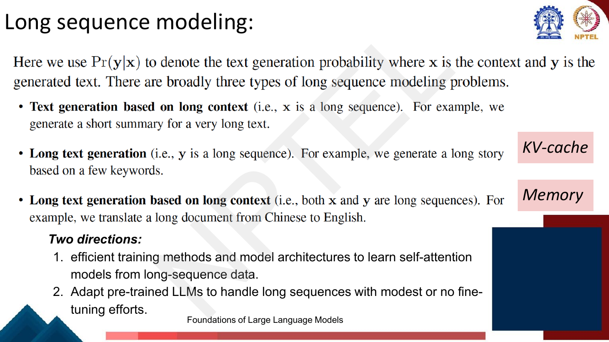
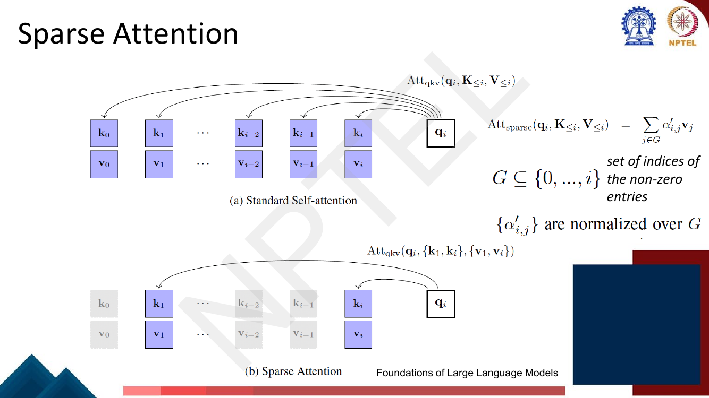
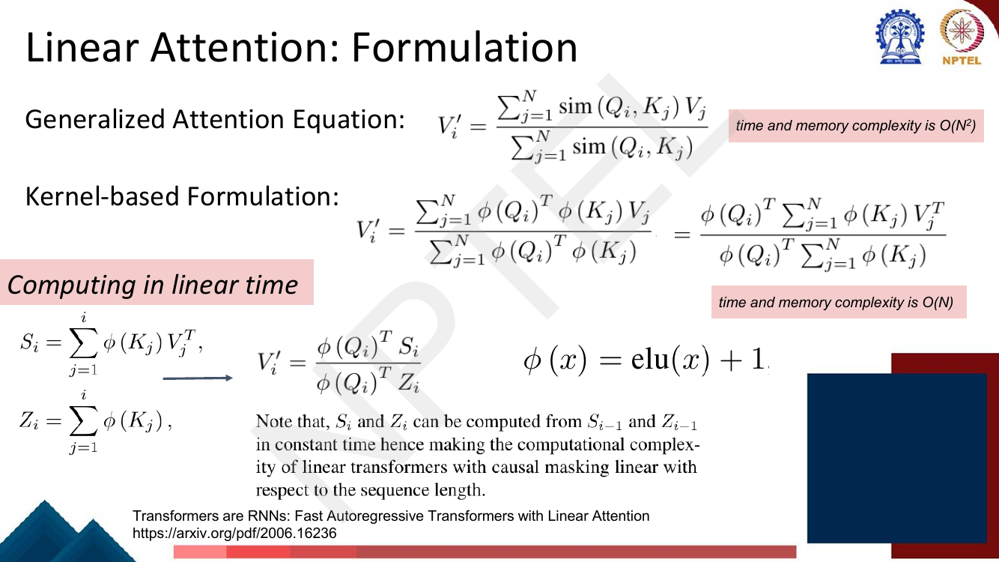
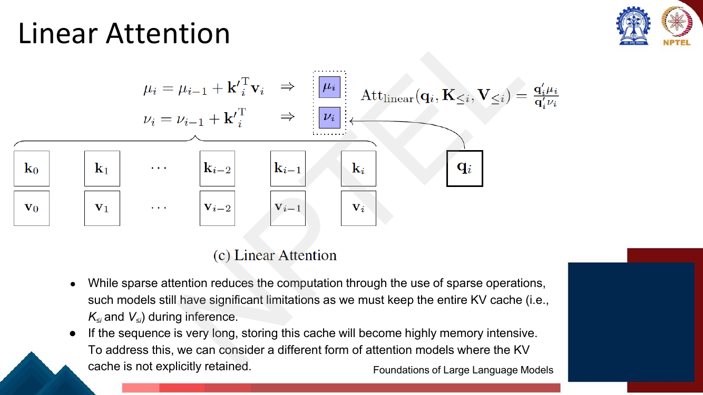
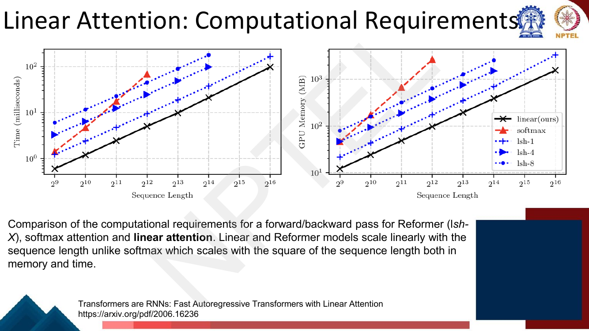
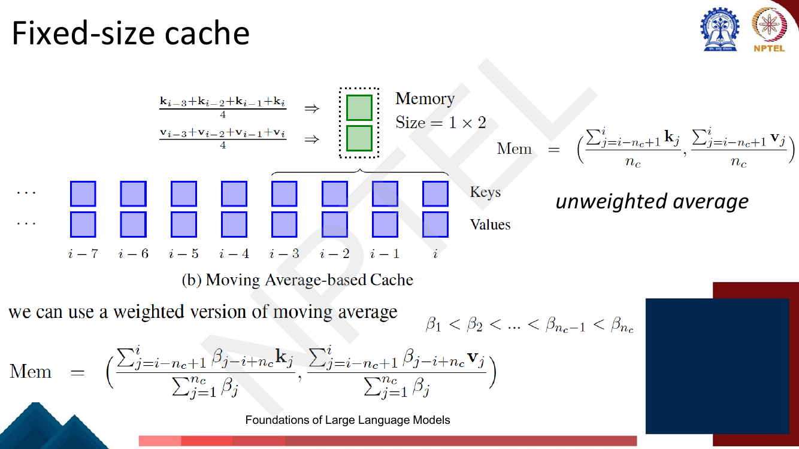
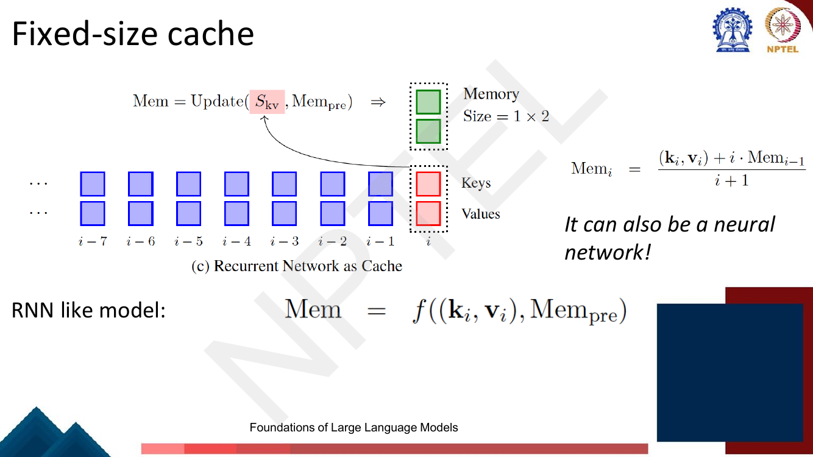
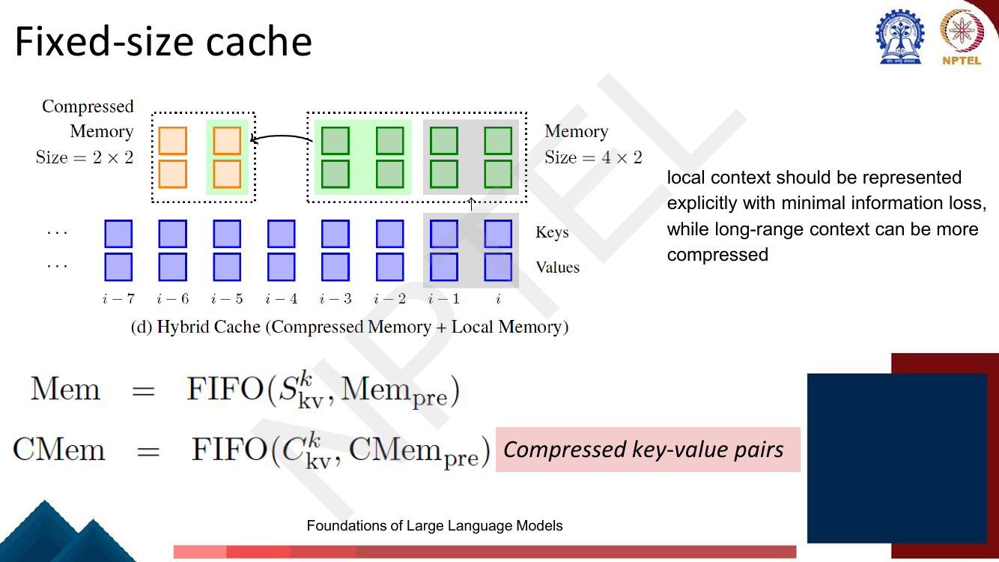
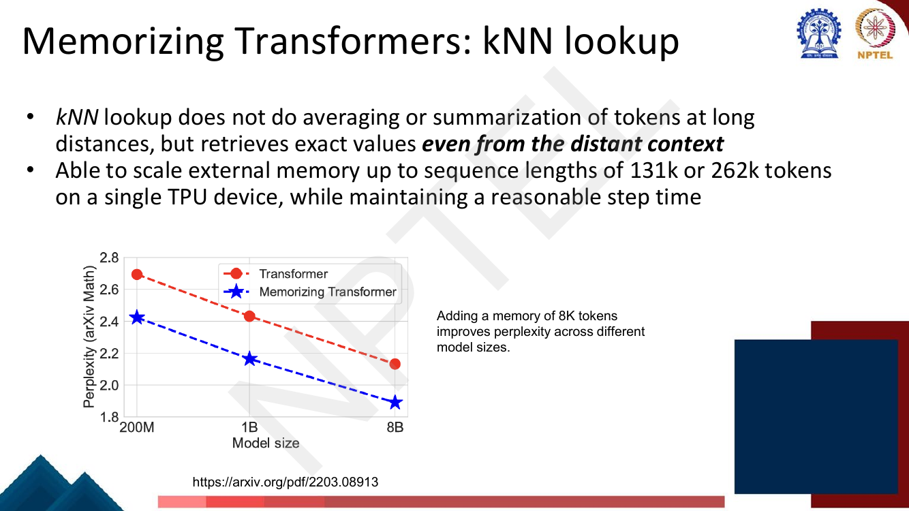
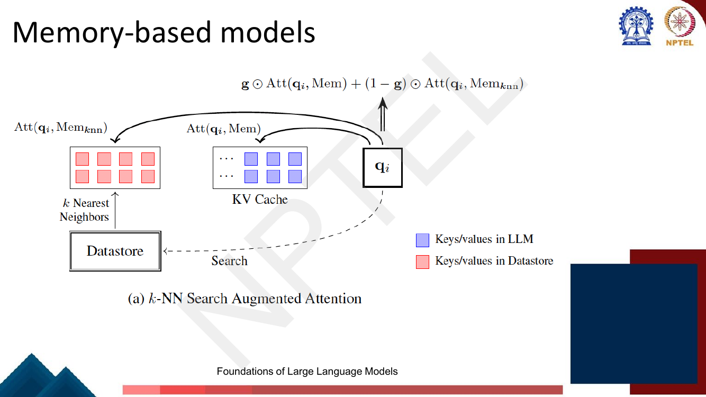

# Lec 54 — Long Sequence Modeling

> **Source:** `Week11.pdf` pp. 69–91 · **Week 11** · **Playlist:** Lec 54
> **Prereqs:** [Lec 53 — Positional Embeddings: RoPE, ALiBi](53-positional-embeddings-rope-alibi.md), [Lec 25 — Efficient Transformers](../week-05/25-efficient-transformers.md)
> **Feeds into:** [Lec 55 — Retrieval-Augmented Generation](55-retrieval-augmented-generation.md)

## Why this lecture exists

[Lec 53](53-positional-embeddings-rope-alibi.md) made *positions* extrapolate: RoPE and ALiBi let a
model index token 100,000 without the embedding table falling apart. That fixes the addressing. It does
not fix the arithmetic. Self-attention still compares every token with every other token, so the work
and the memory grow with the square of the length, and the KV cache still grows without bound as you
decode. A model that can *name* position 100,000 may still be unable to *afford* it.

This lecture is the architectural half of the answer. [Lec 25](../week-05/25-efficient-transformers.md)
already thinned the attention matrix by making it sparse; here the deck goes further and removes the
$n \times n$ matrix altogether (linear attention), then removes the unbounded cache (fixed-size
caches), then adds an external, non-differentiable memory you can search (memorizing transformers).
The last of these quietly reinvents the RNN.

## The ideas

### The problem, restated with a number

The deck's opening slide splits long-sequence modelling by *where* the length lives. Writing
$\Pr(\mathbf{y} \mid \mathbf{x})$ for generation with context $\mathbf{x}$ and output $\mathbf{y}$:


*Fig. — Three problem shapes, and the deck's two margin tags telling you which machinery each needs: a long **x** stresses the attention matrix, a long **y** stresses the **KV-cache**, and both at once needs **Memory**. Page 71 of Week11.pdf.*

| Problem type | Which is long | Example on the deck |
|---|---|---|
| Text generation based on long context | $\mathbf{x}$ | summarise a very long document |
| Long text generation | $\mathbf{y}$ | write a long story from a few keywords |
| Long generation from long context | both | translate a long document Chinese → English |

And the deck's **two directions**: (1) efficient training methods and architectures that learn
self-attention from long-sequence data; (2) adapt an already-pretrained LLM to long sequences with
modest or no fine-tuning. Lec 53's position interpolation is direction 2; everything in this chapter is
direction 1.

Now the number that drives all of it. For sequence length $n$ and model width $d$, self-attention
computes $\mathbf{Q}\mathbf{K}^\top$ — an $n \times n$ matrix, each entry a $d$-dimensional dot product
— and then multiplies that by $\mathbf{V}$:

$$\text{time } O(n^2 d), \qquad \text{memory } O(n^2)$$

**Neither the [Lec 22](../week-05/22-self-attention-and-multihead.md) deck — which owns
$\mathbf{Q},\mathbf{K},\mathbf{V}$, scaled dot-product attention and the softmax — nor this one ever
states this**, but it is the premise of both Lec 25 and this lecture, so memorise it. Counting multiply–accumulates, $\mathbf{Q}\mathbf{K}^\top$ costs $n^2 d$
and $\mathbf{A}\mathbf{V}$ costs another $n^2 d$, giving $2n^2 d$ in total. The consequence is the
sentence to carry into the exam: **doubling the context quadruples the attention cost.** Ten times the
context is a hundred times the work.

### Sparse attention — one page, because Lec 25 owns it

The deck revisits sparse attention as the first lever. The idea is to attend over only a chosen index
set $G \subseteq \{0, \dots, i\}$ instead of all of the past:

$$\text{Att}_{\text{sparse}}(\mathbf{q}_i, \mathbf{K}_{\le i}, \mathbf{V}_{\le i}) = \sum_{j \in G} \alpha'_{ij}\,\mathbf{v}_j$$

where $G$ is the set of indices of the non-zero entries and the weights $\alpha'_{ij}$ are **normalised
over $G$ only** — the softmax denominator sums over the retained positions, not over all $i+1$.


*Fig. — Panel (b) is the whole idea: the greyed-out keys are never scored. Notice that the keys and values still physically **exist** — sparsity saves score computation, not cache memory. Page 72.*

That last observation is the hinge into the rest of the lecture, and the deck states it explicitly:
sparse attention reduces computation, but **you must still keep the entire KV cache** $(\mathbf{K}_{\le i},
\mathbf{V}_{\le i})$ at inference, and for a very long sequence storing that cache is highly memory
intensive. The concrete schemes — local/windowed attention, Longformer's dilated windows plus global
tokens, BigBird's window + global + random pattern, and Linformer's low-rank projection of the sequence
— are taught in full in [Lec 25](../week-05/25-efficient-transformers.md) and are not repeated here.

### Linear attention: the associativity trick

This is the centrepiece. Start from the deck's **generalized attention equation**, which writes
attention with an arbitrary similarity function instead of a softmax:

$$\mathbf{v}'_i = \frac{\sum_{j=1}^{n} \text{sim}(\mathbf{q}_i, \mathbf{k}_j)\,\mathbf{v}_j}{\sum_{j=1}^{n} \text{sim}(\mathbf{q}_i, \mathbf{k}_j)}$$

Standard attention is the case $\text{sim}(\mathbf{q},\mathbf{k}) = \exp(\mathbf{q}^\top\mathbf{k}/\sqrt{d_k})$,
and the denominator is exactly the softmax normaliser. Complexity $O(n^2)$ in both time and memory,
because the double sum forces you to evaluate $\text{sim}$ for all $n^2$ pairs.

Now **replace the similarity by a kernel**. Choose a feature map $\phi$ and set
$\text{sim}(\mathbf{q},\mathbf{k}) = \phi(\mathbf{q})^\top \phi(\mathbf{k})$:

$$\mathbf{v}'_i = \frac{\sum_{j=1}^{n} \phi(\mathbf{q}_i)^\top \phi(\mathbf{k}_j)\,\mathbf{v}_j}{\sum_{j=1}^{n} \phi(\mathbf{q}_i)^\top \phi(\mathbf{k}_j)}
= \frac{\phi(\mathbf{q}_i)^\top \sum_{j=1}^{n} \phi(\mathbf{k}_j)\mathbf{v}_j^\top}{\phi(\mathbf{q}_i)^\top \sum_{j=1}^{n} \phi(\mathbf{k}_j)}$$


*Fig. — The single step that matters is the second equals sign: $\phi(\mathbf{q}_i)^\top$ is pulled out of the sum over $j$. Nothing is approximated there — it is pure associativity. The deck's feature map is $\phi(x) = \text{elu}(x) + 1$. Page 74.*

**Why that step changes everything.** $\phi(\mathbf{q}_i)^\top$ does not depend on $j$, so it factors
out of the sum. But once it is outside, the sum $\sum_j \phi(\mathbf{k}_j)\mathbf{v}_j^\top$ no longer
mentions the query at all — it is the *same* matrix for every query, so you compute it **once**. And it
is a $d \times d$ matrix, not an $n \times n$ one. The $n^2$ term simply never appears.

Matrix form, which is the version to memorise:

$$\underbrace{\big(\phi(\mathbf{Q})\phi(\mathbf{K})^\top\big)\mathbf{V}}_{\text{materialises } n \times n,\ O(n^2 d)} \;=\; \underbrace{\phi(\mathbf{Q})\big(\phi(\mathbf{K})^\top\mathbf{V}\big)}_{\text{materialises } d \times d,\ O(n d^2)}$$

Matrix multiplication is associative, so these are **exactly equal** — not an approximation, not a
bound. Only the bracketing changed. N1 below works it out by hand on a $4 \times 2$ example and counts
the multiplications both ways.

The deck names the two running sums:

$$\mathbf{S}_i = \sum_{j=1}^{i} \phi(\mathbf{k}_j)\mathbf{v}_j^\top, \qquad \mathbf{Z}_i = \sum_{j=1}^{i} \phi(\mathbf{k}_j), \qquad \mathbf{v}'_i = \frac{\phi(\mathbf{q}_i)^\top \mathbf{S}_i}{\phi(\mathbf{q}_i)^\top \mathbf{Z}_i}$$

and makes the key remark: $\mathbf{S}_i$ and $\mathbf{Z}_i$ are computable from $\mathbf{S}_{i-1}$ and
$\mathbf{Z}_{i-1}$ **in constant time**, so a *causal* linear transformer is linear in sequence length
too. (Causal masking is what usually ruins these tricks — a prefix sum rescues it here.) The deck's
earlier slide writes the same recurrence with $\mu$ and $\nu$ in place of $\mathbf{S}$ and $\mathbf{Z}$:


*Fig. — The same equations under different letters ($\mu \equiv \mathbf{S}$, $\nu \equiv \mathbf{Z}$, primes denoting $\phi(\cdot)$). Note the picture: all the keys and values on the left collapse into **two small boxes**. The KV cache is gone. Page 73.*

**What it costs you.** The softmax is not just a normaliser — its exponential makes the attention
distribution *sharp*, so a head can put nearly all its mass on one token. A kernel feature map like
$\text{elu}(x)+1$ is smooth and positive but not peaky, so linear attention produces flatter, less
selective distributions. That is the standard explanation for why linear attention has historically
underperformed softmax attention at equal size, and why the deck presents it as a trade rather than a
free win.


*Fig. — The empirical payoff. On log–log axes a slope-1 line is linear and a slope-2 line is quadratic: softmax (red) is visibly steeper and **cannot be run past $2^{12}$**, while linear attention (black) reaches $2^{16}$ and is cheaper than every Reformer LSH variant. Page 75.*

### Cache and memory

The deck now switches from compute to storage. Inference stores the entire left context so it can
predict future tokens, which means a KV cache whose cost **grows as the inference proceeds**. Writing
attention against a generic memory,

$$\text{Att}(\mathbf{q}_i, \text{Mem}) = \text{Att}_{\text{qkv}}(\mathbf{q}_i, \mathbf{K}_{\le i}, \mathbf{V}_{\le i}), \qquad \text{Mem} = (\mathbf{K}_{\le i}, \mathbf{V}_{\le i})$$

So "the KV cache" is just one choice of Mem: the trivial one that keeps everything. (The KV cache
itself — why it exists, what it saves — is [Lec 25](../week-05/25-efficient-transformers.md)'s.) Once
you see it that way, two routes open: optimise the cache with efficient attention (sparse, linear), or
**explicitly encode the context with an additional memory model**. The rest of the lecture is the
second route.

### Fixed-size caches

Keep Mem at a **bounded** size no matter how long the sequence gets. The deck gives four designs.

**(a) Window-based cache** (p. 77). Keep the last $n_c$ positions verbatim and throw the rest away:
$\text{Mem} = (\mathbf{K}_{[i-n_c+1,\,i]}, \mathbf{V}_{[i-n_c+1,\,i]})$, where $n_c$ is the window size.
Memory $4 \times 2$ in the deck's picture (4 positions, keys and values). Simple, exact for recent
tokens, and blind beyond the window.

**(b) Moving-average cache.** Instead of dropping the old entries, **average** them down to a single
slot — memory $1 \times 2$:

$$\text{Mem} = \left(\frac{\sum_{j=i-n_c+1}^{i}\mathbf{k}_j}{n_c},\ \frac{\sum_{j=i-n_c+1}^{i}\mathbf{v}_j}{n_c}\right)$$


*Fig. — Four positions compress into one. The deck labels the top formula "unweighted average" and then generalises it with weights ordered $\beta_1 < \beta_2 < \dots < \beta_{n_c}$ — **larger weight on more recent tokens** — normalised by $\sum_j \beta_j$. Page 78.*

**(c) Recurrent network as cache.** Make the update a general function of the new pair and the previous
memory:

$$\text{Mem} = f\big((\mathbf{k}_i, \mathbf{v}_i), \text{Mem}_{\text{pre}}\big), \qquad \text{e.g.}\quad \text{Mem}_i = \frac{(\mathbf{k}_i, \mathbf{v}_i) + i \cdot \text{Mem}_{i-1}}{i+1}$$


*Fig. — The deck's own words: **"RNN like model"**. The printed instance is a running average (worked in N6); the margin note "It can also be a neural network!" says $f$ may be any learned update. Page 79.*

**This is the full-circle moment of the course.** Look at what you have: a state that is carried
forward, updated by one token at a time, with no access to the raw past. That is precisely the RNN of
[Lec 16](../week-04/16-rnn-language-models.md) — $\mathbf{h}_t = f(\mathbf{x}_t, \mathbf{h}_{t-1})$ —
and linear attention's $\mathbf{S}_i = \mathbf{S}_{i-1} + \phi(\mathbf{k}_i)\mathbf{v}_i^\top$ is
exactly such an update. The paper the deck cites is called *Transformers are RNNs* for this reason. Two
differences are worth stating precisely:

| | RNN (Lec 16) | Linear attention |
|---|---|---|
| State | vector $\mathbf{h}_t \in \mathbb{R}^{d}$ | **matrix** $\mathbf{S}_i \in \mathbb{R}^{d \times d}$ |
| Update | $f(\mathbf{W}\mathbf{x}_t + \mathbf{U}\mathbf{h}_{t-1})$, non-linear | $\mathbf{S}_{i-1} + \phi(\mathbf{k}_i)\mathbf{v}_i^\top$, **additive and linear** |
| Training | sequential over $t$ | parallel over all $i$ (use the $n^2$ form at train time, the recurrent form at inference) |

The matrix state is the reason linear attention is more expressive than a vanilla RNN at the same $d$:
it stores $d^2$ numbers, not $d$. The linear, additive update is the reason it can still be trained in
parallel. You get recurrence's constant memory *and* the Transformer's parallel training — which is why
this family (and its descendants, RWKV, RetNet, Mamba) is still an active research line.

**(d) Hybrid cache.** The deck's closing design, and the principle behind it is quotable: *local context
should be represented explicitly with minimal information loss, while long-range context can be more
compressed.*


*Fig. — Two tiers with FIFO updates: recent pairs sit uncompressed in Mem, and as they age they are squeezed into CMem as **compressed key–value pairs**. The arrow direction is the examinable detail — compression happens on eviction, not on arrival. Page 80.*

### Memory-based models: internal vs external

The deck draws a line here and names both sides. Everything so far — KV cache, windows, moving
averages, recurrent states — updates the model's own cache, and these are **internal memories**.
**External memories** are independent models that give the LLM access to large-scale context: *one might
view the entire dataset as the context for predicting tokens*, retrieving the closest context situation
in a set of sequences rather than from a given sequence prefix. The access method is $k$-nearest
neighbours.

### Memorizing Transformers

The concrete external-memory architecture (Wu et al., arXiv 2203.08913). The design claim on the deck:

- kNN lookup **does not average or summarise** distant tokens — it retrieves **exact values even from
  the distant context**. Contrast this directly with the moving-average cache above, which is pure
  summarisation. That is the whole selling point.
- It scales external memory to sequence lengths of **131k or 262k tokens on a single TPU device** while
  keeping step time reasonable.
- Adding a memory of **8K tokens improves perplexity across model sizes** (200M, 1B, 8B on arXiv Math).


*Fig. — The gap between the two curves barely narrows with scale: at 8B the memory-augmented model still wins, so memory is not just a crutch for small models. Read off roughly 2.69 → 2.43 at 200M and 2.13 → 1.89 at 8B. Page 82.*

**The architecture.** One transformer layer **near the top of the stack** is replaced by a
**kNN-augmented attention layer** combining two forms of attention: (1) like every other layer, standard
dense self-attention over the **local context** — the input subsequence for the current training step;
(2) unlike the other layers, an **approximate $k$-nearest-neighbour search** into the external memory.


*Fig. — Trace the two arrows into the middle block: one comes up the stack (local), one comes in from the left (memory). The faint box at the bottom left says the current step's (key, value) pairs **will be added to external memory after the current training step** — the memory writes itself. Page 83.*

**The kNN-augmented attention layer**, three facts from p. 84:

- The **same queries** serve both the local context and the external memory. No separate query
  projection.
- Keys and values **belong to the same distribution**: after each training step the local context's
  (key, value) pairs are appended to the end of the external memory. The model is retrieving its own
  earlier activations.
- For each head, the memory keeps a cache of the prior **$M$ (key, value) pairs**, $M$ = memory size;
  when a document is long, old pairs are dropped FIFO to make room.

**The lookup and the merge** (p. 85). The lookup returns the top-$k$ (key, value) pairs for each query.
Then, exactly as in dense attention, you dot each query against the **retrieved keys only**, softmax
those $k$ scores, and return the weighted sum of retrieved values — call it $\mathbf{V}_m$. Local
attention proceeds as usual, giving $\mathbf{V}_c$. The two are combined with a **learned gate**:

$$g = \sigma(b_g), \qquad \mathbf{V}_a = \mathbf{V}_m \odot g + \mathbf{V}_c \odot (1-g)$$

where $b_g$ is a **learned per-head scalar**, letting each head choose between local and long-range
attention. The deck's striking empirical note: **over time, most heads learned to attend almost
exclusively to external memory.**

Two properties follow and both are examinable. First, the softmax is over the $k$ retrieved keys, not
over the whole memory — so the normaliser is tiny and the cost of the merge is $O(kd)$. Second, the
memory is a plain vector index that you **do not backpropagate through**: it is non-differentiable, so
it can be enormous (hundreds of thousands of pairs) without any gradient or optimiser state attached.
That is the entire reason millions of tokens of memory are affordable.


*Fig. — The textbook's version of the same gate, written $\mathbf{g} \odot \text{Att}(\mathbf{q}_i,\text{Mem}) + (1-\mathbf{g}) \odot \text{Att}(\mathbf{q}_i,\text{Mem}_{k\text{nn}})$. **Mind the convention flip:** here $\mathbf{g}$ multiplies the *local* cache term, whereas on p. 85 $g$ multiplies the *memory* term. Page 86.*

### The boundary with Lec 55 — state this precisely

Pages 87–89 continue into $k$-NN language modelling (a distribution
$\Pr_{k\text{nn}}(\cdot \mid \mathbf{h}_i) = \text{softmax}([-d_0 \cdots -d_{|V|}])$ over the vocabulary,
built from distances to retrieved datastore entries and interpolated as
$\Pr = \lambda \Pr_{k\text{nn}} + (1-\lambda)\Pr_{\text{lm}}$) and then into retrieval-augmented
generation. Both belong to [Lec 55](55-retrieval-augmented-generation.md), which revisits kNN-LM
explicitly, so they get no more than this sentence here.

The distinction is subtle, easy to blur, and exactly the kind of thing an MCQ keys on:

| | This chapter's kNN memory | Lec 55's retrieval |
|---|---|---|
| What is stored | the model's **own past keys and values** (activations) | **external** documents or (context, next-token) pairs |
| Where it comes from | the **same document**, earlier in the same sequence | a separate corpus, usually Wikipedia-scale |
| What is retrieved | (key, value) vectors, fed into an attention layer | text passages (RAG) or next-token distributions (kNN-LM) |
| Where it enters the model | **inside** one attention layer, mid-stack | at the **input** (RAG prompt) or the **output** distribution (kNN-LM) |
| What it buys | effective context length | external/updatable knowledge |

Nearest-neighbour search machinery itself — dense vectors, approximate indexes — was introduced in
[Lec 31](../week-07/31-question-answering-1.md).

## Worked numericals

**There are no "Try this problem" pages in `Week11.pdf` pp. 69–91.** All 23 pages were opened as
images; the range contains no exercise, no "Solution" slide and no blank-with-a-question slide. The
re-swept exercise table lists none for Lec 54, and that is confirmed. The six below are built to the
exam's pattern, and N6 uses a formula printed on the deck.

### N1. The associativity re-ordering, by hand
**Given:** $n = 4$, $d = 2$, and (taking $\phi$ = identity for clarity)

$$\mathbf{Q} = \begin{bmatrix}1&0\\0&1\\1&1\\2&-1\end{bmatrix},\quad
\mathbf{K} = \begin{bmatrix}1&1\\2&0\\0&1\\1&-1\end{bmatrix},\quad
\mathbf{V} = \begin{bmatrix}1&2\\0&1\\3&0\\1&1\end{bmatrix}$$

**Find:** $(\mathbf{Q}\mathbf{K}^\top)\mathbf{V}$, $\mathbf{Q}(\mathbf{K}^\top\mathbf{V})$, and the
multiply count of each.

1. **Left order, step 1.** $\mathbf{Q}\mathbf{K}^\top$ is $4\times4$. Row 1 of $\mathbf{Q}$ is $(1,0)$:
   dotted with the four key rows gives $1,\,2,\,0,\,1$. Row 2 $(0,1)$: $1,\,0,\,1,\,-1$. Row 3 $(1,1)$:
   $2,\,2,\,1,\,0$. Row 4 $(2,-1)$: $1,\,4,\,-1,\,3$.

$$\mathbf{Q}\mathbf{K}^\top = \begin{bmatrix}1&2&0&1\\1&0&1&-1\\2&2&1&0\\1&4&-1&3\end{bmatrix}$$

2. **Left order, step 2.** Multiply by $\mathbf{V}$ ($4\times2$). Row 1:
   $1(1,2) + 2(0,1) + 0(3,0) + 1(1,1) = (1+0+0+1,\; 2+2+0+1) = (2,5)$.
   Row 2: $1(1,2)+0+1(3,0)-1(1,1) = (1+3-1,\; 2+0-1) = (3,1)$.
   Row 3: $2(1,2)+2(0,1)+1(3,0)+0 = (2+0+3,\; 4+2+0) = (5,6)$.
   Row 4: $1(1,2)+4(0,1)-1(3,0)+3(1,1) = (1+0-3+3,\; 2+4+0+3) = (1,9)$.

$$(\mathbf{Q}\mathbf{K}^\top)\mathbf{V} = \begin{bmatrix}2&5\\3&1\\5&6\\1&9\end{bmatrix}$$

3. **Right order, step 1.** $\mathbf{K}^\top\mathbf{V}$ is $2\times2$. Entry $(1,1)$ = column 1 of
   $\mathbf{K}$ dotted with column 1 of $\mathbf{V}$ $= 1(1)+2(0)+0(3)+1(1) = 2$.
   $(1,2) = 1(2)+2(1)+0(0)+1(1) = 5$.
   $(2,1) = 1(1)+0(0)+1(3)+(-1)(1) = 3$.
   $(2,2) = 1(2)+0(1)+1(0)+(-1)(1) = 1$.

$$\mathbf{K}^\top\mathbf{V} = \begin{bmatrix}2&5\\3&1\end{bmatrix}$$

4. **Right order, step 2.** $\mathbf{Q}$ times that $2\times2$: row 1 $(1,0) \to (2,5)$; row 2 $(0,1)
   \to (3,1)$; row 3 $(1,1) \to (2+3,\,5+1) = (5,6)$; row 4 $(2,-1) \to (4-3,\,10-1) = (1,9)$.

$$\mathbf{Q}(\mathbf{K}^\top\mathbf{V}) = \begin{bmatrix}2&5\\3&1\\5&6\\1&9\end{bmatrix}$$

5. **Identical**, entry for entry — as associativity guarantees.
6. **Multiply counts.** Left: $n{\cdot}n{\cdot}d = 4{\cdot}4{\cdot}2 = 32$ for $\mathbf{Q}\mathbf{K}^\top$,
   then $n{\cdot}n{\cdot}d = 32$ for the product with $\mathbf{V}$: **64**. Right:
   $d{\cdot}n{\cdot}d = 2{\cdot}4{\cdot}2 = 16$ for $\mathbf{K}^\top\mathbf{V}$, then
   $n{\cdot}d{\cdot}d = 16$: **32**.
7. The largest object built is $4\times4 = 16$ numbers on the left and $2\times2 = 4$ on the right.

**Answer:** both orderings give $\begin{bmatrix}2&5\\3&1\\5&6\\1&9\end{bmatrix}$; 64 multiplications the
quadratic way, **32 the linear way** — a 2× saving already at $n=4, d=2$, and it is $n/d$ in general.

### N2. The complexity crossover
**Given:** $2n^2d$ MACs for softmax attention, $2nd^2$ for linear attention, at $d = 512$.
**Find:** both costs at $n = 128, 512, 2048, 8192$, and the crossover.

1. Set $2n^2d = 2nd^2 \Rightarrow n = d$. **The crossover is exactly $n = d$.**
2. $n=128$: $2(128^2)(512) = 2(16{,}384)(512) = 16{,}777{,}216$. Linear: $2(128)(512^2) = 2(128)(262{,}144) = 67{,}108{,}864$.
3. $n=512$: $2(262{,}144)(512) = 268{,}435{,}456$. Linear: $2(512)(262{,}144) = 268{,}435{,}456$. Equal ✓
4. $n=2048$: $2(4{,}194{,}304)(512) = 4{,}294{,}967{,}296$. Linear: $2(2048)(262{,}144) = 1{,}073{,}741{,}824$.
5. $n=8192$: $2(67{,}108{,}864)(512) = 68{,}719{,}476{,}736$. Linear: $2(8192)(262{,}144) = 4{,}294{,}967{,}296$.

| $n$ | softmax $2n^2d$ | linear $2nd^2$ | ratio |
|---|---|---|---|
| 128 | 16,777,216 | 67,108,864 | **0.25× (linear is 4× worse)** |
| 512 | 268,435,456 | 268,435,456 | 1.00× |
| 2048 | 4,294,967,296 | 1,073,741,824 | 4.00× |
| 8192 | 68,719,476,736 | 4,294,967,296 | 16.00× |

**Answer:** crossover at $n = d = 512$; the ratio is exactly $n/d$, so linear attention is **4× slower**
at $n=128$ and **16× faster** at $n=8192$. Linear attention is not a free win — it only pays once the
sequence is longer than the model is wide.

### N3. Fixed-size state vs a growing KV cache
**Given:** $d = 512$, fp16 (2 bytes/number), one layer, one head. Linear-attention state $= \mathbf{S}$
($d\times d$) $+\ \mathbf{Z}$ ($d$). KV cache $= 2nd$ numbers.
**Find:** bytes for each at $n = 256, 1024, 8192, 131072$.

1. Linear state: $(512 \times 512) + 512 = 262{,}144 + 512 = 262{,}656$ numbers $\times 2 = 525{,}312$ bytes $= 513$ KiB. **Independent of $n$.**
2. KV cache at $n$: $2n(512)(2) = 2048n$ bytes.
3. $n=256$: $524{,}288$ B $= 0.50$ MiB. $n=1024$: $2{,}097{,}152$ B $= 2$ MiB. $n=8192$: $16{,}777{,}216$ B $= 16$ MiB. $n=131072$: $268{,}435{,}456$ B $= 256$ MiB.
4. Break-even: $2048n = 525{,}312 \Rightarrow n \approx 256$, i.e. $n \approx d/2$.

| $n$ | KV cache | linear state | cache / state |
|---|---|---|---|
| 256 | 0.50 MiB | 0.513 MiB | 1.0× |
| 1,024 | 2 MiB | 0.513 MiB | 4.0× |
| 8,192 | 16 MiB | 0.513 MiB | 32× |
| 131,072 | 256 MiB | 0.513 MiB | **511×** |

**Answer:** the KV cache is **linear in $n$**, the linear-attention state is **constant at 513 KiB**.
At 131k tokens the cache is 511× larger — per layer, per head, per sequence in the batch.

### N4. kNN memory cost
**Given:** $M = 65{,}536$ memorised (key, value) pairs per head, $d = 512$, fp16, top-$k = 32$.
**Find:** storage, exact-search cost per query, and the cost of the memory-attention merge.

1. Storage $= 2 M d$ numbers (keys and values) $= 2(65{,}536)(512) = 67{,}108{,}864$ numbers.
2. $\times 2$ bytes $= 134{,}217{,}728$ bytes $= \mathbf{128}$ **MiB** per head.
3. Exact search: one dot product per stored key $= Md = 65{,}536 \times 512 = 33{,}554{,}432$ MACs per query — this is why the paper uses **approximate** kNN.
4. The merge: softmax over $k=32$ scores, then a weighted sum of 32 value vectors $= 2kd = 2(32)(512) = 32{,}768$ MACs — **1024× cheaper than the search**, so the index dominates.
5. Doubling to $M = 131{,}072$ (the deck's quoted 131k scale) doubles storage to **256 MiB** and search to 67.1M MACs: both are **linear** in $M$, which is why memory can grow to millions of tokens where attention could not.

**Answer:** 128 MiB and 33.6M MACs per query at $M = 65{,}536$; the retrieval, not the attention, is the
bottleneck, and everything scales linearly in $M$. None of it carries gradients.

### N5. A kNN retrieval worked by hand
**Given:** query $\mathbf{q} = (1, 2)$; five stored keys and values

| $j$ | $\mathbf{k}_j$ | $\mathbf{v}_j$ |
|---|---|---|
| 1 | $(2,1)$ | $(1,0)$ |
| 2 | $(0,3)$ | $(0,2)$ |
| 3 | $(1,2)$ | $(2,2)$ |
| 4 | $(-1,0)$ | $(1,1)$ |
| 5 | $(3,-2)$ | $(0,-1)$ |

**Find:** the top-2 retrieved pairs and the memory-attention output $\mathbf{V}_m$.

1. Dot-product similarities: $\mathbf{k}_1\!\cdot\!\mathbf{q} = 2+4 = 4$; $\mathbf{k}_2\!\cdot\!\mathbf{q} = 0+6 = 6$; $\mathbf{k}_3\!\cdot\!\mathbf{q} = 1+4 = 5$; $\mathbf{k}_4\!\cdot\!\mathbf{q} = -1+0 = -1$; $\mathbf{k}_5\!\cdot\!\mathbf{q} = 3-4 = -1$.
2. Ranked: $j=2$ (6), $j=3$ (5), $j=1$ (4), then $j=4,5$ (−1). **Top-2 = $\{2, 3\}$.**
3. Softmax **over the retrieved scores only**: $e^{6} = 403.4288$, $e^{5} = 148.4132$; sum $= 551.8420$.
4. $\alpha_2 = 403.4288/551.8420 = 0.7311$; $\alpha_3 = 148.4132/551.8420 = 0.2689$. (Sum $= 1$ ✓)
5. $\mathbf{V}_m = 0.7311(0,2) + 0.2689(2,2) = (0 + 0.5379,\; 1.4622 + 0.5378) = (0.5379,\; 2.0000)$.

**Answer:** $\mathbf{V}_m = (0.5379,\ 2.0000)$. The trap: if you softmax over **all five** keys the
weights become $(0.2369,\,0.6439,\,0.0872,\,\dots)$ and the answer changes — the retrieved set defines
the normaliser. If the gate has $b_g = 0.5$ and local attention returned $\mathbf{V}_c = (1,1)$, then
$g = \sigma(0.5) = 0.6225$ and $\mathbf{V}_a = 0.6225(0.5379, 2) + 0.3775(1,1) = (0.7124,\ 1.6225)$.

### N6. The deck's recurrent cache (p. 79)
**Given:** $\text{Mem}_i = \dfrac{(\mathbf{k}_i,\mathbf{v}_i) + i \cdot \text{Mem}_{i-1}}{i+1}$ with
$i$ counted from 0, and keys $\mathbf{k}_0 = (1,0)$, $\mathbf{k}_1 = (0,2)$, $\mathbf{k}_2 = (3,1)$,
$\mathbf{k}_3 = (2,-1)$ (the value half behaves identically).
**Find:** the memory after each token, and what the recurrence computes.

1. $i=0$: $\text{Mem}_0 = \dfrac{(1,0) + 0}{1} = (1,\,0)$.
2. $i=1$: $\text{Mem}_1 = \dfrac{(0,2) + 1(1,0)}{2} = \dfrac{(1,2)}{2} = (0.5,\,1)$.
3. $i=2$: $\text{Mem}_2 = \dfrac{(3,1) + 2(0.5,1)}{3} = \dfrac{(4,3)}{3} = (1.3333,\,1)$.
4. $i=3$: $\text{Mem}_3 = \dfrac{(2,-1) + 3(1.3333,1)}{4} = \dfrac{(6,2)}{4} = (1.5,\,0.5)$.
5. Check against the plain mean: $\frac{1}{4}\big((1,0)+(0,2)+(3,1)+(2,-1)\big) = \frac{1}{4}(6,2) = (1.5,\,0.5)$ ✓

**Answer:** $\text{Mem}_3 = (1.5,\ 0.5)$. The recurrence is an **online running mean** — it reproduces
the average of all tokens so far using $O(d)$ memory and $O(d)$ work per step, never revisiting the
past. That is the simplest possible instance of the deck's "RNN like model", and the margin note says
you may replace this fixed arithmetic with a learned neural update.

## Code

```python
import numpy as np
rng = np.random.default_rng(0)

def phi(x):                      # the deck's feature map: elu(x) + 1, always > 0
    return np.where(x > 0, x + 1.0, np.exp(x))

def quadratic(Q, K, V):          # (phi(Q) phi(K)^T) V   -- materialises n x n
    return (phi(Q) @ phi(K).T) @ V

def linear(Q, K, V):             # phi(Q) (phi(K)^T V)   -- materialises d x d
    return phi(Q) @ (phi(K).T @ V)

n, d = 6, 3
Q, K, V = rng.normal(size=(n, d)), rng.normal(size=(n, d)), rng.normal(size=(n, d))
print("max |difference| between the two orderings:",
      np.abs(quadratic(Q, K, V) - linear(Q, K, V)).max())

# multiply-accumulate counts: (n x n x d) + (n x n x d)  vs  (n x d x d) + (n x d x d)
print(f"\n{'n':>7} {'d':>5} {'(QK^T)V MACs':>16} {'Q(K^T V) MACs':>16} {'speed-up':>9}")
d = 512
for n in (128, 256, 512, 1024, 2048, 8192):
    quad, lin = 2 * n * n * d, 2 * n * d * d
    print(f"{n:>7} {d:>5} {quad:>16,} {lin:>16,} {quad / lin:>8.2f}x")

# ---- toy kNN memory lookup (matches N5) --------------------------------
q    = np.array([1.0, 2.0])
keys = np.array([[2, 1], [0, 3], [1, 2], [-1, 0], [3, -2]], float)
vals = np.array([[1, 0], [0, 2], [2, 2], [1, 1], [0, -1]], float)

sims = keys @ q                               # dot-product similarity
top  = np.argsort(-sims)[:2]                  # top-k, k = 2
w    = np.exp(sims[top]); w /= w.sum()        # softmax over retrieved keys ONLY
print("\nsimilarities:", sims, "\ntop-2 indices:", top, "weights:", np.round(w, 4))
print("memory-attention output V_m:", w @ vals[top])

g   = 1 / (1 + np.exp(-0.5))                  # learned gate, b_g = 0.5
V_c = np.array([1.0, 1.0])                    # pretend local-attention output
print(f"gate g = sigmoid(0.5) = {g:.4f}  ->  V_a =",
      np.round(g * (w @ vals[top]) + (1 - g) * V_c, 4))
```

```
max |difference| between the two orderings: 3.552713678800501e-15

      n     d     (QK^T)V MACs    Q(K^T V) MACs  speed-up
    128   512       16,777,216       67,108,864      0.25x
    256   512       67,108,864      134,217,728      0.50x
    512   512      268,435,456      268,435,456      1.00x
   1024   512    1,073,741,824      536,870,912      2.00x
   2048   512    4,294,967,296    1,073,741,824      4.00x
   8192   512   68,719,476,736    4,294,967,296     16.00x

similarities: [ 4.  6.  5. -1. -1.] 
top-2 indices: [1 2] weights: [0.7311 0.2689]
memory-attention output V_m: [0.53788284 2.        ]
gate g = sigmoid(0.5) = 0.6225  ->  V_a = [0.7124 1.6225]
```

Three things to read off. The difference between the two orderings is $3.6\times10^{-15}$ — floating
point noise, not approximation error; they are the same computation. The speed-up column crosses 1.00×
exactly at $n = d = 512$, matching N2. And the kNN block reproduces N5 to four decimals.

## Exam pack

### Must-memorise

| Item | Exactly this |
|---|---|
| Attention complexity | $O(n^2 d)$ time, $O(n^2)$ memory; $2n^2d$ MACs — **doubling $n$ quadruples the cost** |
| Sparse attention | $\text{Att}_{\text{sparse}}(\mathbf{q}_i,\mathbf{K}_{\le i},\mathbf{V}_{\le i}) = \sum_{j\in G}\alpha'_{ij}\mathbf{v}_j$, $G \subseteq \{0,\dots,i\}$, weights normalised **over $G$** |
| Sparse attention's limit | reduces computation but **still keeps the whole KV cache** |
| Generalized attention | $\mathbf{v}'_i = \dfrac{\sum_j \text{sim}(\mathbf{q}_i,\mathbf{k}_j)\mathbf{v}_j}{\sum_j \text{sim}(\mathbf{q}_i,\mathbf{k}_j)}$ — $O(n^2)$ |
| Kernel substitution | $\text{sim}(\mathbf{q},\mathbf{k}) = \phi(\mathbf{q})^\top\phi(\mathbf{k})$ |
| The re-ordering | $(\phi(\mathbf{Q})\phi(\mathbf{K})^\top)\mathbf{V} = \phi(\mathbf{Q})(\phi(\mathbf{K})^\top\mathbf{V})$ — **exact**, by associativity |
| Linear complexity | $O(nd^2)$ time, $O(d^2)$ state; crossover at $n = d$ |
| Deck's feature map | $\phi(x) = \text{elu}(x) + 1$ |
| Running sums | $\mathbf{S}_i = \sum_{j\le i}\phi(\mathbf{k}_j)\mathbf{v}_j^\top$ ($d\times d$), $\mathbf{Z}_i = \sum_{j\le i}\phi(\mathbf{k}_j)$; $\mathbf{v}'_i = \phi(\mathbf{q}_i)^\top\mathbf{S}_i / \phi(\mathbf{q}_i)^\top\mathbf{Z}_i$ |
| Why causal masking is still linear | $\mathbf{S}_i, \mathbf{Z}_i$ computable from $\mathbf{S}_{i-1},\mathbf{Z}_{i-1}$ in **constant time** |
| Cost of linear attention | no softmax ⇒ **flatter, less selective** attention distribution |
| Mem = KV cache | $\text{Att}(\mathbf{q}_i,\text{Mem}) = \text{Att}_{\text{qkv}}(\mathbf{q}_i,\mathbf{K}_{\le i},\mathbf{V}_{\le i})$, $\text{Mem} = (\mathbf{K}_{\le i},\mathbf{V}_{\le i})$ |
| Four fixed-size caches | (a) window, (b) moving average, (c) recurrent network, (d) hybrid (compressed + local) |
| Window cache | $\text{Mem} = (\mathbf{K}_{[i-n_c+1,i]}, \mathbf{V}_{[i-n_c+1,i]})$, $n_c$ = window size |
| Moving-average cache | unweighted $\frac{1}{n_c}\sum_j \mathbf{k}_j$; weighted version uses $\beta_1 < \dots < \beta_{n_c}$ (recent gets more) |
| RNN-like cache | $\text{Mem} = f((\mathbf{k}_i,\mathbf{v}_i), \text{Mem}_{\text{pre}})$; deck's instance $\text{Mem}_i = \frac{(\mathbf{k}_i,\mathbf{v}_i)+i\,\text{Mem}_{i-1}}{i+1}$ |
| Hybrid principle | local context explicit with minimal loss; long-range context more compressed |
| Internal vs external memory | internal = updates to the KV cache; external = independent model accessing large-scale context |
| Memorizing Transformer layer | **one layer near the top** = kNN-augmented: dense local self-attention **+** approximate kNN search into external memory |
| Memory write rule | after each training step, the local context's (key, value) pairs are **appended**; oldest dropped; size $M$ per head |
| Merge gate | $g = \sigma(b_g)$, $\mathbf{V}_a = \mathbf{V}_m \odot g + \mathbf{V}_c \odot (1-g)$; $b_g$ = **learned per-head scalar** |
| kNN softmax scope | over the **top-$k$ retrieved keys only** |
| Why memory can be huge | the index is **non-differentiable** — no backprop, no optimiser state |

### Numbers worth knowing

| Quantity | Value |
|---|---|
| Linear-vs-softmax crossover | $n = d$ exactly |
| Speed-up ratio | $n/d$ |
| Deck's feature map | $\phi(x) = \text{elu}(x)+1$ |
| Linear attention paper | *Transformers are RNNs*, arXiv **2006.16236** (Katharopoulos et al., 2020) |
| Memorizing Transformers paper | arXiv **2203.08913** (Wu et al., 2022) |
| Memory scale on one TPU | **131k or 262k** tokens |
| Memory size that helps | **8K** tokens improves perplexity at every model size |
| Perplexity gains (arXiv Math) | 200M: 2.69 → 2.43 · 1B: 2.43 → 2.16 · 8B: 2.13 → 1.89 |
| Model sizes tested | 200M, 1B, 8B |
| Softmax attention's wall in the deck's plot | cannot be run past sequence length $2^{12}$ |
| Linear attention's reach in the plot | $2^{16}$ |
| Baselines in the plot | Reformer LSH-1, LSH-4, LSH-8 |
| Deck's cache picture sizes | window $4\times2$ → moving average $1\times2$ → hybrid $4\times2$ + $2\times2$ |
| What most heads learn | to attend **almost exclusively to external memory** |

### Likely MCQ traps

- **"Linear attention approximates softmax attention."** The *re-ordering* is exact — associativity, no
  error. The approximation is in replacing $\exp(\mathbf{q}^\top\mathbf{k})$ with
  $\phi(\mathbf{q})^\top\phi(\mathbf{k})$, which happens **before** any re-ordering. Keep the two steps
  apart: kernel substitution = approximation; re-bracketing = exact.
- **"Linear attention is always faster."** Only for $n > d$. At $n = 128, d = 512$ it is **4× slower**.
- **"Sparse attention shrinks the KV cache."** No — the deck says explicitly that sparse models must
  still keep the entire cache. Only linear attention and fixed-size caches shrink storage.
- **Computing $\phi(\mathbf{K})^\top\mathbf{V}$ as $n \times n$.** It is $d \times d$:
  $\phi(\mathbf{K})^\top$ is $d \times n$ and $\mathbf{V}$ is $n \times d$.
- **"The linear-attention state is a vector like an RNN's."** It is a $d \times d$ **matrix** ($\mathbf{S}$)
  plus a $d$-vector ($\mathbf{Z}$). That extra capacity is the point.
- **Confusing $\mathbf{S}_i$ with $\mathbf{Z}_i$.** $\mathbf{S}$ accumulates outer products
  $\phi(\mathbf{k})\mathbf{v}^\top$ (the numerator); $\mathbf{Z}$ accumulates $\phi(\mathbf{k})$ alone
  (the normaliser).
- **"The kNN-augmented layer replaces every layer."** It is **one** layer near the top of the stack.
  All others remain plain local attention + FFN.
- **"kNN memory summarises the distant past."** The deck's exact wording is the opposite: it does *not*
  average or summarise, it retrieves **exact values**. The moving-average cache summarises.
- **Softmaxing over all $M$ memory entries.** The softmax runs over the **$k$ retrieved** keys only
  (see N5's trap).
- **Gate direction.** On p. 85, $g$ multiplies $\mathbf{V}_m$ (memory). On p. 86 the textbook figure
  writes $\mathbf{g}$ on the *local* term. Read which term the symbol sits on.
- **"External memory is trained end-to-end."** It is non-differentiable; nothing backpropagates into it.
  That is why it can be huge.
- **"This is the same as RAG."** No. This retrieves the model's own keys/values from **inside the same
  document** into an attention layer. RAG and kNN-LM retrieve **external** text or token distributions
  — [Lec 55](55-retrieval-augmented-generation.md).
- **"Memorizing Transformers fix positional extrapolation."** They fix capacity, not addressing. RoPE
  and ALiBi are [Lec 53](53-positional-embeddings-rope-alibi.md)'s.

### Self-test

1. State self-attention's time and memory complexity, and say what happens to the cost when the context doubles.
2. In $\text{Att}_{\text{sparse}} = \sum_{j \in G}\alpha'_{ij}\mathbf{v}_j$, over what set are the $\alpha'$ normalised?
3. Which cost does sparse attention *not* reduce, and why does that motivate linear attention?
4. Write the kernel-based attention numerator and show which factor can be pulled out of the sum.
5. At $d = 256$, for which sequence lengths is linear attention cheaper than softmax attention?
6. What are the shapes of $\mathbf{S}_i$ and $\mathbf{Z}_i$, and why is causal linear attention still $O(n)$?
7. Name the deck's four fixed-size cache designs, and which one preserves recent tokens exactly.
8. Compute $\text{Mem}_2$ from $\text{Mem}_i = \frac{(\mathbf{k}_i,\mathbf{v}_i)+i\,\text{Mem}_{i-1}}{i+1}$ with $\mathbf{k}_0=(2,0)$, $\mathbf{k}_1=(0,4)$, $\mathbf{k}_2=(1,2)$.
9. Where in the stack does the kNN-augmented layer sit, and what two attention outputs does it combine and how?
10. Give two reasons the external memory can hold hundreds of thousands of tokens when attention cannot.
11. In one sentence each, distinguish this lecture's kNN memory from Lec 55's retrieval.

<details><summary>Answers</summary>

1. $O(n^2 d)$ time, $O(n^2)$ memory. Doubling $n$ **quadruples** the cost.
2. Over $G$ only — the set of retained (non-zero) indices, not over all $i+1$ positions.
3. Memory: the full KV cache $(\mathbf{K}_{\le i}, \mathbf{V}_{\le i})$ must still be stored. Linear attention removes the cache entirely by keeping a $d\times d$ running state instead.
4. $\sum_j \phi(\mathbf{q}_i)^\top\phi(\mathbf{k}_j)\mathbf{v}_j = \phi(\mathbf{q}_i)^\top\sum_j \phi(\mathbf{k}_j)\mathbf{v}_j^\top$ — $\phi(\mathbf{q}_i)^\top$ has no $j$ in it, so it factors out.
5. $n > 256$ (crossover at $n = d$).
6. $\mathbf{S}_i$ is $d\times d$, $\mathbf{Z}_i$ is $d\times 1$. Each is obtained from its predecessor by adding one term, i.e. constant work per step, so $n$ steps cost $O(n d^2)$.
7. (a) window-based, (b) moving-average, (c) recurrent network as cache, (d) hybrid (compressed + local). The **window** cache (and the local tier of the hybrid) keeps recent tokens exactly.
8. $\text{Mem}_0 = (2,0)$; $\text{Mem}_1 = ((0,4)+1(2,0))/2 = (1,2)$; $\text{Mem}_2 = ((1,2)+2(1,2))/3 = (3,6)/3 = (1,2)$.
9. One layer near the **top** of the stack. It combines kNN attention over retrieved memory ($\mathbf{V}_m$) with dense local self-attention ($\mathbf{V}_c$) via a learned gate $g = \sigma(b_g)$: $\mathbf{V}_a = \mathbf{V}_m\odot g + \mathbf{V}_c\odot(1-g)$.
10. (i) It is non-differentiable — no gradients, no optimiser state. (ii) Cost grows **linearly** in $M$ (storage $2Md$, approximate search sublinear), not quadratically, and only top-$k$ entries ever enter the softmax.
11. This chapter: retrieve the model's **own** past keys/values from the **same document**, inject inside an attention layer. Lec 55: retrieve **external** documents (RAG, at the input) or external (context, token) pairs (kNN-LM, at the output distribution).

</details>

## Beyond the slides

**Gap:** The deck shows the linear-attention recurrence but never says that training uses the *other*
form.
**Why it matters:** In practice you train with the parallel $n \times n$-free batched form (or a chunked
hybrid) and only *infer* with the recurrence. This dual nature — parallel training, recurrent inference
— is the single property that makes the family attractive and the thing an exam question about
"advantages over an RNN" is fishing for. A plain RNN cannot do the first; a plain Transformer cannot do
the second.

**Gap:** The feature map $\phi(x) = \text{elu}(x)+1$ is printed with no justification.
**Why it matters:** $\phi$ must be **non-negative** or the denominator $\phi(\mathbf{q})^\top\mathbf{Z}$
can hit zero or go negative and the "attention weights" stop being a distribution. $\text{elu}(x)+1$ is
the cheapest smooth function that is strictly positive everywhere. Performer's alternative, positive
random features, approximates the actual softmax kernel instead — the same trick with a better $\phi$.

**Gap:** No mention of the modern descendants.
**Why it matters:** RetNet, RWKV, GLA and Mamba/S4 are all "linear attention with a better state
update" — typically adding a decay or a gate so old information fades instead of accumulating forever
(the un-decayed $\mathbf{S}_i$ saturates on long sequences). If the course's closing "exciting
frontiers" slides mention state-space models, this is the bridge to them.

**Gap:** Approximate nearest-neighbour search is named but never explained.
**Why it matters:** N4 shows exact search costs $Md$ per query, which is prohibitive. Real systems use
HNSW or IVF-PQ indexes with sublinear query time, and the "approximate" in the deck's phrase
"approximate k-nearest-neighbor search" is doing real work. Retrieval machinery is
[Lec 31](../week-07/31-question-answering-1.md)'s.

**Gap:** Nothing is said about *staleness*.
**Why it matters:** The external memory stores keys and values produced by **older versions of the
weights**, which drift during training. The Memorizing Transformer paper handles this by freezing or
slowly refreshing the memory; naively ignoring it degrades the retrieved vectors. It is the main
practical reason external memory is harder than it looks.

## Cut from the slides

Pages 69, 90 and 91 are the title, reference and thank-you slides and carry no content. Page 70
("Concepts Covered") is folded into the chapter's section structure. Page 72's sparse-attention content
is deliberately compressed to one subsection with the normalisation rule and the "still keeps the full
KV cache" limitation, because [Lec 25](../week-05/25-efficient-transformers.md) owns Longformer,
BigBird, Linformer and windowed attention in full and re-teaching them would duplicate a whole chapter.
Page 76's KV-cache definition gets two sentences for the same reason. Pages 87–89 — kNN language
modelling's $\Pr_{k\text{nn}}$ over the vocabulary, the $\lambda$-interpolation with $\Pr_{\text{lm}}$,
and the retrieval-augmented-generation figure — are named and bounded against this chapter's kNN
memory, but belong to [Lec 55](55-retrieval-augmented-generation.md), whose own deck revisits kNN-LM
explicitly. Page 73 and page 74 state the same recurrence under two notations ($\mu,\nu$ versus
$\mathbf{S},\mathbf{Z}$); both are shown, once, with the correspondence stated rather than derived
twice. Nothing about linear attention, fixed-size caches or memorizing transformers was dropped.
