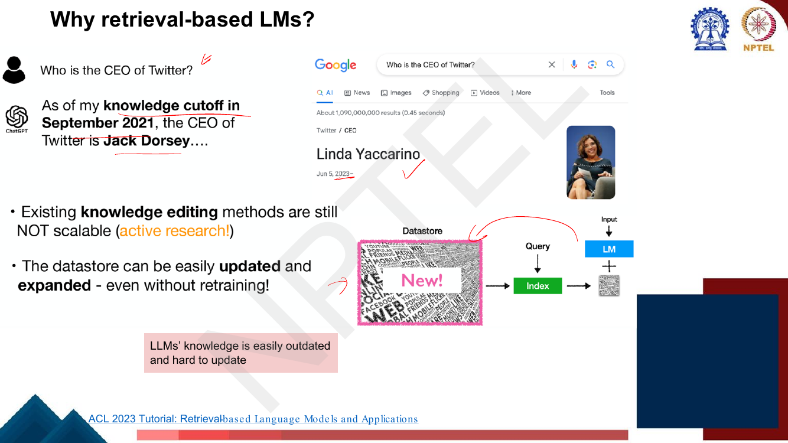
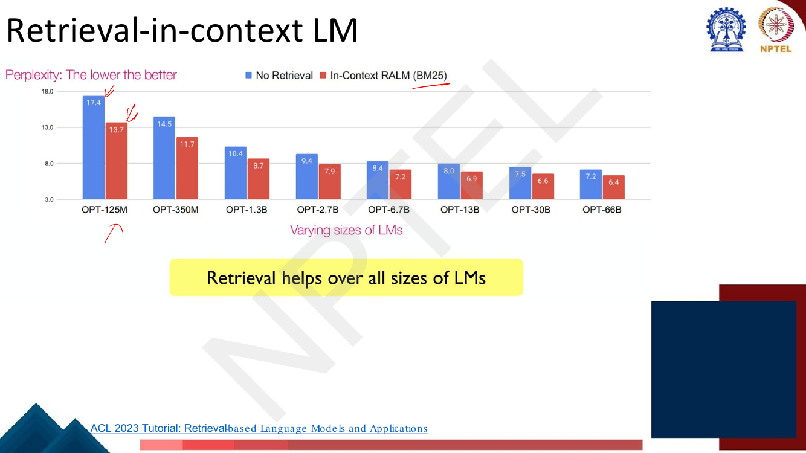
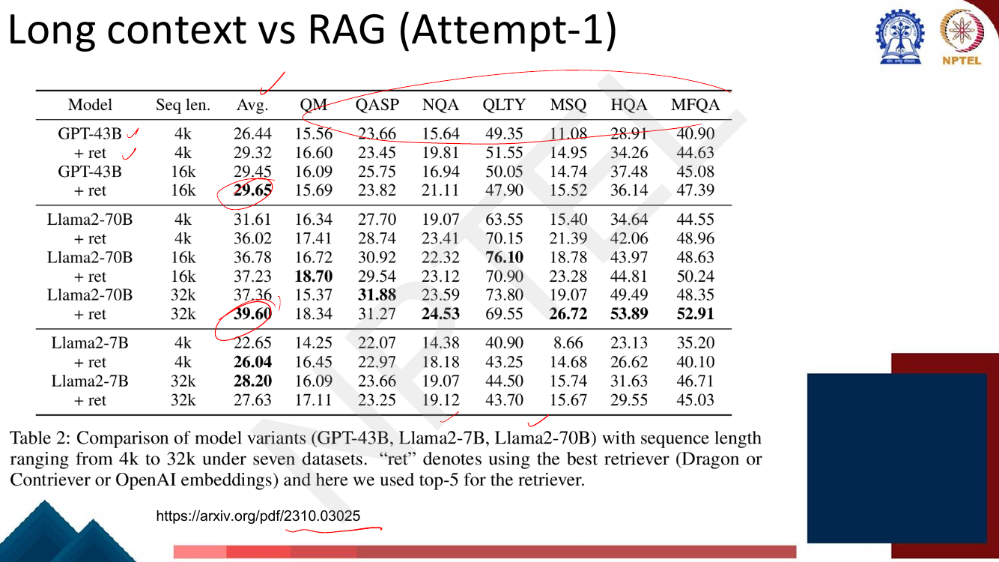

# Lec 55 — Retrieval Augmented Generation

> **Source:** `Week11.pdf` pp. 92–127 · **Week 11** · **Playlist:** Lec 55
> **Prereqs:** [Lec 31 — Question Answering I](../week-07/31-question-answering-1.md), [Lec 54 — Long Sequence Modeling](54-long-sequence-modeling.md)
> **Feeds into:** [Lec 59 — Trustworthy LLMs: Taxonomy](../week-12/59-trustworthy-llms-taxonomy.md)

## Why this lecture exists

Every lecture since Week 6 has made the model bigger and the training corpus larger, on the assumption
that knowledge should live in the weights. This lecture says that assumption is wrong for a large class
of facts, and it closes the retrieval arc that opened in Lec 31.

A model's weights are a lossy compression of its training corpus, frozen at the moment training
stopped. It cannot tell you where an answer came from, it cannot learn that Twitter changed CEO last
June, and it has seen rare facts too few times to store them. Lec 54 made contexts longer; this lecture
asks the complementary question — instead of carrying everything, why not *fetch* the few passages you
need, at query time, from a datastore you can edit? That is Retrieval Augmented Generation, and the
deck spends its last four pages on whether long contexts have made it unnecessary.

## The ideas

### Parametric knowledge and why it is not enough

The deck opens with a definition worth memorising verbatim:

> A LM's **parametric knowledge**: the information that the model has encoded within its
> parameters/weights during training that it can then use to do tasks for which that knowledge is
> required.

Everything in the rest of the lecture is a complaint about that definition. The same page sets up the
three architectures the course has now seen, left to right:


*Fig. — The lecturer's annotation names the middle column "(RAG)". Notice that the retriever is identical in both of the first two columns; what changes is whether the downstream module **points at a span** (reader) or **writes free text** (generator). The right column is the parametric-only baseline this lecture is arguing against. Page 94.*

The left column — retriever plus an extractive reader with start/end pointers, BM25 or dense vectors in
the retriever — is [Lec 31](../week-07/31-question-answering-1.md)'s material and is not re-derived here.
What is new is the middle column.

**Failure 1 — parametric knowledge cannot cover the long tail.** The deck's example asks ChatGPT for
five Hinton papers; two are right, two are confidently wrong (*Deep Learning* is a book, *Attention Is
All You Need* is not Hinton's). Alongside it sits the result that makes the point quantitatively.


*Fig. — The crossover is the examinable part. Below ~$10^3$ popularity, retrieval wins by a wide margin; above ~$10^4$ the **unassisted LM wins** — retrieval can actively hurt on head entities the model already knows. GPT-3 davinci-003 posts only 20–30% accuracy overall. Page 95.*

So the honest claim is not "retrieval is always better". It is: **LLMs cannot memorise all (long-tail)
knowledge in their parameters**, and retrieval buys the most exactly where memorisation fails.

**Failure 2 — parametric knowledge is frozen.** The deck asks "Who is the CEO of Twitter?" and gets
"As of my knowledge cutoff in September 2021 … Jack Dorsey", against a Google result of Linda Yaccarino
dated Jun 5, 2023. Two bullets follow, and they are the argument:

- Existing **knowledge editing** methods are still NOT scalable (active research — see
  [Lec 58](../week-12/58-interpretability-ffn-and-causal-tracing.md) for ROME-style factual editing).
- The **datastore** can be easily updated and expanded — **even without retraining**.


*Fig. — The repair is an `INSERT` into a text store, not a gradient step. This is the single cheapest argument for RAG and the one most likely to be examined. Page 97.*

**Failure 3 — parametric output is unverifiable.** The deck gives this two pages. A parametric answer
is a sample from a distribution with no provenance; a retrieval-augmented one can **trace the knowledge
source from the retrieval results**, giving *interpretability* and *control*. The examples are a
generated history paragraph with inline `[1][2][3]` citations into the corpus, and a Bing itinerary for
Toronto whose every claim links to `cntower.ca`, `rom.on.ca`, `tripadvisor.com`. Note the direction of
the benefit: the citation is not a post-hoc explanation, it is the passage the model actually
conditioned on.

**Failure 4 — parametric knowledge cannot reach private data.** Your company wiki was not in The Pile.
This one is *not* stated on the deck; it follows directly from the "datastore can be updated and
expanded" bullet and is the dominant commercial use of RAG, so treat it as an editorial addition rather
than a slide fact.

### Hallucination and factuality

The deck gives this its own page and its own definition:

> A **hallucination** is a response that is **not faithful to the facts of the world**.


*Fig. — Read the tree as two questions in sequence: **is it verifiable?** then **does it contradict?** The left half are *factual errors* (deleted or replaced for correctness); the right half *cannot be factually verified* (highlighted to convey unverifiability). The unit-of-error split 1(a)/1(b)/1(c) — entity / relationship / sentence — is the part an MCQ can key on. Page 96.*

| Type | Condition | Fix on the slide |
|---|---|---|
| Factual statement | verifiable, entailed by evidence | — |
| Type 1(a) | verifiable, contradicts, error at **entity** level | delete / replace |
| Type 1(b) | verifiable, contradicts, error in the **relationship** | delete / replace |
| Type 1(c) | verifiable, contradicts, error at **sentence** level | delete / replace |
| Type 2 | not verifiable, about an **invented entity** | highlight |
| Type 3 | not verifiable, not a fact-based statement → **subjective** | highlight |
| Type 4 | not verifiable, is fact-based → **unverifiable statement** | highlight |

Hallucination appears twice in this course by design. Here it is the *motivation for retrieval*;
[Lec 59](../week-12/59-trustworthy-llms-taxonomy.md) owns it as a category in the trustworthiness
taxonomy. Retrieval does not eliminate hallucination — it grounds the generation in evidence and makes
the remaining errors checkable, which is a weaker and more honest claim.

### Retrieval Augmented Generation

You have seen the picture once already: `Week11.pdf` p. 89, inside
[Lec 54](54-long-sequence-modeling.md)'s range, is panel (c) of the memory-based-models taxonomy,
labelled *Retrieval-augmented Generation* — a datastore searched by the input context $x$ = "What is deep
learning?", the $k$ nearest chunks $\mathbf{c}_1, \mathbf{c}_2, \dots$ concatenated in front of the
question, and the whole thing handed to an LLM. This section fills in what that one figure asserted.

The architecture is three boxes: a **datastore**, an **index** that answers queries against it, and an
**LM** that conditions on what comes back.

```
   datastore ──► INDEX ──► retrieved passages ─┐
                   ▲                           ├──► LM ──► output
                 query                   input ┘
```

Two things on the deck's pages that look like decoration but are not:

- The datastore is a **raw text corpus** — "at least billions~trillions of tokens", **not labeled
  datasets**, **not structured data (knowledge bases)**. RAG is not question answering over a knowledge
  graph; it is nearest-neighbour search over unannotated text.
- The **query is the retrieval input, and is not necessarily the input to the LM**. The deck circles
  this. It is the hinge for the retrieval-in-context section below: you are free to retrieve with a
  *different* string than the one you generate from.

### RAG: Retrieval

Retrieval has one goal — *find a small subset of elements in a datastore that are most similar to the
query* — and two components.

**The similarity function** $\mathrm{sim}(i,j)$, a score between two pieces of text. The deck gives two
examples and nothing else:

$$\mathrm{sim}(i,j) = \mathrm{tf}_{i,j} \times \log \frac{N}{\mathrm{df}_i}
\qquad\qquad
\mathrm{sim}(i,j) = \mathrm{Encoder}(i)\cdot\mathrm{Encoder}(j)$$

with $\mathrm{tf}_{i,j}$ the occurrences of $i$ in $j$, $N$ the total documents, $\mathrm{df}_i$ the
documents containing $i$, and the encoder mapping text to an $h$-dimensional vector. These are TF-IDF
and a dense bi-encoder; BM25, ColBERT and the whole sparse-vs-dense story belong to
[Lec 31](../week-07/31-question-answering-1.md), and training the encoder (in-batch and hard negatives)
to [Lec 32](../week-07/32-question-answering-2.md).

**The index**, which given a query $q$ returns

$$\operatorname*{argTop-}k_{\,d \in \mathcal{D}}\ \mathrm{sim}(q, d)$$

through **fast nearest-neighbour search**. The deck names the software: **FAISS, Distributed FAISS,
SCaNN**. The reason the index is a named component and not an implementation detail becomes clear in the
training section — it is the thing that goes stale.

### Retrieval-based LMs: the three design axes


*Fig. — Memorise the three axes and one example per cell: **what** → passages (REALM, in-context) vs tokens (kNN-LM); **how** → input layer (in-context) vs output distribution (kNN-LM); **when** → once (REALM) vs every token (kNN-LM). The three "w/ retrieval" rows under the sentence are retrieval once, every token, and every few tokens. Page 104.*

Every method in the rest of the lecture is a point in this three-dimensional space, which is the
cleanest way to hold them in your head.

### REALM

REALM (Guu et al. 2020) retrieves **text chunks**, uses them at the **input**, and retrieves **once**.
Its datastore is Wikipedia, **13M chunks** (passages — "called *documents* in the paper").

**Retrieval stage.** Both the input $x$ and every chunk $z$ go through an encoder, giving
$\mathbf{x} = \mathrm{Encoder}(x)$ and $\mathbf{z} = \mathrm{Encoder}(z)$, and the top-$k$ chunks are

$$z_1,\dots,z_k = \operatorname*{argTop-}k\ (\mathbf{x}\cdot\mathbf{z})$$

by fast nearest-neighbour search. The deck's running example is
$x =$ "World Cup 2022 was … the increase to `[MASK]` in 2026." This two-tower setup is not new to you:
`Week7.pdf` pp. 15–17 already gave the ORQA/REALM-style retriever–reader score decomposition, so recall
it from [Lec 31](../week-07/31-question-answering-1.md) rather than re-learning it.

**Read stage.** Each retrieved chunk is pasted in front of the input and read separately:
`[MASK] `$z_i$` [SEP] `$x$ → LM → $P(y \mid x, z_i)$, and the $k$ predictions are combined by a
**weighted average**.


*Fig. — The formula is the whole idea: the retrieved chunk is a **latent variable** that is marginalised out. $P(z\mid x)$ comes from the retriever, $P(y\mid x,z)$ from the reader, and the sum over the full datastore is approximated by keeping only the top $k$ and setting everything else to zero. Page 106.*

$$P(y \mid x) = \sum_{z \in \mathcal{D}} P(z \mid x)\, P(y \mid x, z) \;\approx\; \sum_{i=1}^{k} P(z_i \mid x)\, P(y \mid x, z_i)$$

The significant property — and the reason REALM matters historically — is that writing the retriever's
score *inside* a differentiable expression makes $P(z\mid x)$ trainable. Because $P(z \mid x) \propto
\exp(\mathbf{x}\cdot\mathbf{z})$ is a softmax over the retriever's own scores, the gradient of the LM
loss flows back through it into the document encoder. REALM therefore **trains the retriever jointly
with the LM**, backpropagating through retrieval — approximately, because the sum is truncated to the
top $k$ and because the index must be periodically rebuilt (the next section). This is what separates
REALM from a pipeline that bolts a frozen search engine onto a frozen LM.

### Retrieval-in-context LM

The simplest design, and the one essentially every production system uses: **concatenate the retrieved
text into the prompt**. Nothing about the model changes. The deck's example retrieves "FIFA World Cup
2026 will expand to 48 teams." and prepends it to "World Cup 2022 was the last with 32 teams, before
the increase to", after which the LM correctly continues "48 in the 2026 tournament." References: Ram
et al. 2023 (*In-Context RALM*) and Shi et al. 2023 (*REPLUG: Retrieval-Augmented Black-Box Language
Models*) — "black-box" is the point, you need no access to the weights.


*Fig. — Read it diagonally, not vertically: **OPT-2.7B with retrieval (7.9) beats OPT-13B without (8.0)** — retrieval bought roughly a 5× parameter saving. The gap narrows with scale (17.4→13.7 at 125M, 7.2→6.4 at 66B) but never closes. Page 108.*

The deck then uses this architecture to answer two design questions with experiments, both on GPT-2.

**Is $q = x$ necessary?** No, and it should not be. If the query is the whole prefix, you retrieve
passages about what you have already said, not about what comes next — the deck shows a long Team-USA
prefix retrieving "The U.S. national team defeated Iran 1-0", which *does not cover "tokens that will
come next"*, while the last clause alone retrieves the 2026-expansion fact that does. Measured over
retrieval query length $\ell$:

| Model | $\ell=16$ | $\ell=32$ | $\ell=64$ |
|---|---|---|---|
| GPT-2 117M (S) | 31.0 | **30.2** | 31.3 |
| GPT-2 345M (M) | 22.4 | **21.8** | 22.4 |
| GPT-2 762M (L) | 18.9 | **18.4** | 18.9 |
| GPT-2 1.5B (XL) | 17.1 | **16.7** | 17.1 |

A **shorter prefix (more recent tokens) as a query helps — but not too short**. The optimum is 32 tokens
for all four sizes, and the curve is a U, not a slope.

**How frequent should retrieval be?** Perplexity against retrieval stride $s$ (retrieve once every $s$
tokens):

| Model | $s=64$ | 32 | 16 | 8 | 4 | 2 | 1 |
|---|---|---|---|---|---|---|---|
| GPT-2 S | 34.7 | 32.9 | 31.6 | 30.8 | 30.2 | 29.8 | **29.5** |
| GPT-2 M | 24.6 | 23.5 | 22.6 | 22.1 | 21.8 | 21.5 | **21.4** |
| GPT-2 L | 20.6 | 19.7 | 19.0 | 18.6 | 18.4 | 18.2 | **18.1** |
| GPT-2 XL | 18.6 | 17.9 | 17.3 | 16.9 | 16.7 | 16.5 | **16.4** |

**Retrieving more frequently monotonically helps — with cost in inference time.** Note the diminishing
returns: for GPT-2 XL, going $64 \to 8$ buys 1.7 perplexity, $8 \to 1$ buys only 0.5 for eight times the
retrieval calls.

The advantage of retrieval-in-context is that it works with *any* off-the-shelf model, including one you
can only call through an API. The cost is **context length**: the retrieved passages occupy the window,
and attention is quadratic in it ([Lec 54](54-long-sequence-modeling.md)). N4 below puts a number on
that, and the long-context-vs-RAG section turns it into an argument.

### kNN-LM (revisited)

The outline page says "k-NN LM **revisited**", and it means it literally. `Week11.pdf` pp. 86–89 — inside
[Lec 54](54-long-sequence-modeling.md)'s range — are a three-panel taxonomy of memory-based models, and
**two of the three panels are this lecture's material**: panel (b) on pp. 87–88 is kNN-LM in full,
*including both of its equations*, and panel (c) on p. 89 is a labelled Retrieval-augmented Generation
figure. So the interpolation rule is already in your hands. Collect the debt rather than re-deriving it:

$$\Pr(\cdot \mid \mathbf{h}_i) = \lambda \Pr\nolimits_{k\text{nn}}(\cdot \mid \mathbf{h}_i) + (1-\lambda)\Pr\nolimits_{\text{lm}}(\cdot \mid \mathbf{h}_i)$$

is p. 88's form, written over the hidden state $\mathbf{h}_i$ of the prefix. What is new *here* is the
datastore construction, the fact that the method needs **no training at all**, this deck's results, and
the external-versus-internal boundary.

That boundary is the examinable part, and [Lec 54](54-long-sequence-modeling.md) draws it as a
five-row table (panel (a), kNN-search-augmented attention, against panel (b), kNN-LM) — **go and read it
there rather than here**. Your side of those five rows, to keep straight: the store holds an **external
corpus** — a **separate** body of text, not the current document — of **passages or token-level
distributions**, injected **at the input or the output** rather than inside an attention layer, and its
purpose is to supply **external knowledge**, not to extend the effective context length.

> **Notation clash between the two decks, worth flagging.** p. 88 writes
> $\Pr_{k\text{nn}}(\cdot\mid\mathbf{h}_i) = \mathrm{Softmax}\big([-d_0 \;\cdots\; -d_{|V|}]\big)$, where
> $d_v$ is the distance between $\mathbf{h}_i$ and $\mathbf{z}_j$ if $w_j$ is the $v$-th vocabulary entry
> **and 0 otherwise** — a softmax over a full $\lvert V\rvert$-length vector. Taken literally that is
> wrong: a token with *no* retrieved neighbour gets $d_v = 0$ and therefore weight $e^{0} = 1$, more than
> any genuine neighbour at $d_v > 0$. Lec 55's p. 115 pipeline gives the correct and standard procedure —
> normalise $\exp(-d_i)$ over the **top-$k$ neighbours only**, then aggregate, leaving every unretrieved
> token at exactly 0. **Use the p. 115 form.** It is the one that reproduces the deck's own printed
> numbers (N1).

The datastore is built in one pass over a corpus. For every training context $c_i$ you store the key
$k_i = f(c_i)$ — the LM's own hidden representation of that context — paired with the target $v_i$, the
token that actually followed. At test time you encode the test context as $q = f(x)$ and ask: *which
vectors in the datastore are close to the vector we have?* The deck's chain of equivalences is worth
quoting, because it is why this works at all:

> Which **tokens** in a datastore are close to the next token?
> = Which **prefixes** in a datastore are close to the prefix we have?
> = Which **vectors** in a datastore are close to the vector we have?


*Fig. — Follow one row: "Obama was born in / Hawaii" sits at distance 5, "Obama is a native of / Hawaii" at distance 3, "Barack is married to / Michelle" at distance 100 and never makes the top-$k$. The **aggregation** step is where two neighbours with the same target get summed (0.7 + 0.1 → 0.8). The deck's $\lambda$ is circled as a hyperparameter. Page 115.*

The pipeline, in order:

1. **Distances.** $d_i = d(q, k_i)$ to every datastore key — squared $L_2$ in the original paper.
2. **Nearest $k$.** Keep the $k$ smallest.
3. **Normalization.** $p(k_i) \propto \exp(-d_i)$ — a softmax over *negative* distances, so a closer
   neighbour gets more weight.
4. **Aggregation.** $p_{\text{kNN}}(y) = \sum_i \mathbf{1}[y = v_i]\, p(k_i)$ — sum the weights of all
   retrieved neighbours whose target token is $y$. Any token not retrieved gets exactly zero.
5. **Interpolation** with the LM's own softmax $p_{\text{LM}}(y)$:

$$p(y) = \lambda\, p_{\text{kNN}}(y) + (1-\lambda)\, p_{\text{LM}}(y)$$

**No training happens anywhere in that list.** You run a *trained* LM over a corpus to dump vectors,
build a FAISS index, and interpolate at inference. $\lambda$ is a single hyperparameter tuned on dev
data. That is the whole method, and it is why kNN-LM is the cheapest way to add knowledge to a frozen
model.

> **Symbol warning.** The deck writes datastore keys as $k_i$ *and* the number of neighbours as $k$ on
> the same slide. They are unrelated.

### kNN-LM: results

Three findings, all on Wikitext/Wiki data, all "lower perplexity is better":

**It beats a model 30× its size.** A no-retrieval LM trained on Wiki-100M sits at perplexity ≈ 21. A
no-retrieval LM trained on Wiki-3B — **30× more data** — sits at ≈ 16.1. kNN-LM, using the *Wiki-100M*
model plus a kNN datastore, crosses that 16.1 line at a datastore of about 1.1B tokens and reaches
≈ 14.6 at 3B. **Better with a bigger datastore**, and the curve has not flattened at 3B.

**Better with bigger $k$.** On Wikitext-103: $k=1 \to 17.6$, $k=2 \to 17.26$, $k=8 \to 16.73$,
$k=64 \to 16.29$, $k=256 \to 16.15$, $k=1024 \to 16.10$. Monotone, with sharply diminishing returns past
$k \approx 64$.


*Fig. — The right-hand chart is the one to remember. The **in-domain** optimum is around $\lambda \approx 0.25$; the **domain-adaptation** optimum is around $\lambda \approx 0.65$. Both curves turn up at the extremes, so neither pure source wins: $\lambda = 1$ (kNN only) and $\lambda = 0$ (LM only) are both worse than the mixture. Page 117.*

**It helps more out of domain.** When the LM was trained on Wiki-3B and the datastore is Books, the best
$\lambda$ more than doubles — you should trust the datastore more precisely when the parametric model is
out of its depth. This is the same shape as the long-tail finding on page 95.

### Training retrieval-based LMs

Two challenges, stated plainly on the deck:

- The **external datastore is huge** ⇒ expensive to update the index, because updating it means
  **recomputing dense vectors for all documents**.
- **LLMs are large** ⇒ expensive to fine-tune an LLM to generate answers.

The first is the one with teeth. If you train the retriever's encoder, every vector in the index was
produced by a *stale* version of that encoder the moment you take a gradient step. The index is
therefore wrong, and recomputing it means a forward pass over the entire corpus. Four options follow.

| Option | What it does | Index cost |
|---|---|---|
| **1 — Independent** | retriever and LM trained separately, never see each other | none |
| **2 — Sequential** | one component trained and **frozen**, the other trained against it (either order; "retrievers are trained to provide text that helps LMs the most") | none |
| **3 — Joint, async index update** | trained jointly; allow the index to be **"stale"**, rebuild **every $T$ steps** | rebuild every $T$ steps |
| **4 — Joint, in-batch approximation** | trained jointly; use an **"in-batch index"** instead of the full index | computed on the fly per batch |

Option 4's slide carries the lecturer's numbers in the margin: the full index is **>100M** entries and
"re-indexing will be very expensive", while an in-batch index is **~10K** and is "computed on the fly
for each batch". Four orders of magnitude is why the approximation is worth its bias.


*Fig. — The table groups options 1–2 against 3–4 and gives each pair one pro and one con column. Page 122.*

Reproduced in full:

| Training method | Pros (deck: thumbs-up column) | Cons (deck: thumbs-down column) |
|---|---|---|
| **Independent training** (Ram et al 2023; Khandelwal et al 2020)<br>**Sequential training** (Borgeaud et al 2021; Shi et al 2023) | Easy to implement: off-the-shelf models<br>Easy to improve: sub-module can be separately improved | Models are not end-to-end trained — suboptimal performance |
| **Joint training: async update** (Guu et al 2020; Izacard et al 2022)<br>**Joint training: in-batch approx.** (Zhong et al 2022; Min et al 2023; Rubin and Berant 2023) | End-to-end trained — very good performance! | Training may be complicated (overhead, batching methods, etc)<br>Train–test discrepancy still remains |

Place the methods: kNN-LM and retrieval-in-context are **independent** (Khandelwal, Ram); REPLUG is
**sequential** (Shi); REALM is **joint with async update** (Guu). "Train–test discrepancy still remains"
means even joint training uses an approximate index at train time and the exact one at test time.

### Long context vs RAG

The deck gives this **four pages**, which tells you how live the question is. The two attempts reach
different conclusions, and the deck presents both rather than picking.

**Attempt-1** (Xu et al., arXiv 2310.03025) asks: *given a long-context model, does retrieval still
help?*


*Fig. — Read the Avg. column only; it is the exact mean of the seven dataset scores (verified: GPT-43B 4k $=185.10/7 = 26.44$). "+ ret" is the best retriever — Dragon, Contriever or OpenAI embeddings — with **top-5**. Page 123.*

| Model | 4k | 4k + ret | 16k | 16k + ret | 32k | 32k + ret |
|---|---|---|---|---|---|---|
| GPT-43B | 26.44 | **29.32** | 29.45 | **29.65** | — | — |
| Llama2-70B | 31.61 | **36.02** | 36.78 | **37.23** | 37.36 | **39.60** |
| Llama2-7B | 22.65 | **26.04** | — | — | 28.20 | 27.63 |

Three readings, in order of how likely they are to be asked:

1. **A 4k model with retrieval matches a 16k model without it.** GPT-43B: 29.32 vs 29.45. Llama2-70B:
   36.02 vs 36.78. Retrieval buys roughly a 4× context extension for a fraction of the compute.
2. **Retrieval still helps the longest models.** Llama2-70B at 32k gains +2.24 by retrieving, so long
   context does not make retrieval redundant.
3. **It is not universal.** Llama2-7B at 32k gets *worse* with retrieval (28.20 → 27.63) — the only
   regression in the table, and worth remembering as the counterexample.

**Attempt-2** (Li et al., arXiv 2407.16833) asks the sharper question: *if you can afford to stuff
everything in, should you?* Nine datasets, Contriever retriever, three frontier models.

| Model | LC | RAG | Self-Route | RAG token cost | Self-Route token cost |
|---|---|---|---|---|---|
| Gemini-1.5-Pro | **49.70** | 37.33 | 46.41 | 17% | 38% |
| GPT-4O | 48.67 | 32.60 | **48.89** | 17% | 61% |
| GPT-3.5-Turbo | 32.07 | 30.33 | **35.32** | 17% | 39% |

**LC consistently outperforms RAG** — by 12.4 points on Gemini, 16.1 on GPT-4O — *while RAG uses only
17% of the tokens*. That is the trade in one line: long context is more accurate, RAG is ~6× cheaper.

**Self-Route** is the deck's reconciliation, and it is two steps:

1. **RAG-and-Route.** Give the model the query and the retrieved chunks, exactly as in standard RAG,
   with one difference: it may decline, via the prompt *"Write unanswerable if the query can not be
   answered based on the provided text"*. If it answers, accept the RAG prediction.
2. **Long-context prediction.** For queries deemed unanswerable, feed the full context to the
   long-context model.


*Fig. — The caption states the finding: "While long-context LLMs (LC) surpass RAG in long-context understanding, RAG is significantly more cost-efficient. Our approach, SELF-ROUTE, achieves comparable performance to LC at a much lower cost." The routing fraction varies a lot by model — GPT-4O declines far more often (only 57.4% deemed answerable) than Gemini (76.8%). Page 125.*

The trade-offs to carry into an exam, with neither side favoured:

| | Long context | RAG |
|---|---|---|
| Accuracy on long documents | higher (Attempt-2) | lower |
| Cost per query | quadratic attention in the full length | ~17% of the tokens |
| Failure mode | lost-in-the-middle; evidence in the centre of a huge window is under-used | cannot answer what the retriever failed to fetch |
| Provenance | none — the whole document was in context | citations fall out for free |
| Dependency | context-window extension, RoPE scaling ([Lec 53](53-positional-embeddings-rope-alibi.md)) | retriever quality, which upper-bounds it (N6) |

One memory point that belongs here and that students routinely get backwards: the Week-11 deck states
explicitly on p. 73 ([Lec 54](54-long-sequence-modeling.md)'s range) that **sparse attention does not
reduce the KV cache**. Making attention sub-quadratic in *compute* does not make the cache you must hold
in GPU memory any smaller — every past token still has a key and a value. So "just use an efficient
attention variant" does not dissolve the long-context cost argument, and shortening the prompt by
retrieving is the only one of the two options that shrinks the cache too.

## Worked numericals

**No "Try this problem" page exists in pp. 92–127.** Every one of the 36 pages was opened as an image;
the re-swept exercise table lists nothing for Lec 55, and that is correct. The deck does pose two
rhetorical questions on slides — *"Is $q = x$ necessary?"* (p. 109) and *"How frequent should retrieval
be?"* (pp. 111–112) — but each is answered by the results chart on the following page rather than left
to the student. N1 and N2 below reverse-engineer the deck's own kNN-LM figure instead, which is the
closest thing to a worked example it contains.

### N1. Building $p_{\text{kNN}}$ from the deck's neighbour distances (page 115)
**Given:** the three nearest neighbours of the test context "Obama's birthplace is" are
(Hawaii, $d=3$), (Illinois, $d=4$), (Hawaii, $d=5$). The normalization rule is
$p(k_i) \propto \exp(-d_i)$.
**Find:** the per-neighbour weights and the aggregated $p_{\text{kNN}}$, and check them against the
deck's printed 0.7 / 0.2 / 0.1 and 0.8 / 0.2.

1. Un-normalised weights: $e^{-3} = 0.049787$, $e^{-4} = 0.018316$, $e^{-5} = 0.006738$.
2. Sum $= 0.049787 + 0.018316 + 0.006738 = 0.074841$.
3. Normalise: $0.049787/0.074841 = 0.6652$; $\;0.018316/0.074841 = 0.2447$;
   $\;0.006738/0.074841 = 0.0900$.
4. To 1 d.p. that is **0.7 / 0.2 / 0.1** — exactly the deck's Normalization column. The deck's figures
   really are a softmax over negative distances.
5. Aggregate by target token: Hawaii gets $0.6652 + 0.0900 = 0.7553$; Illinois gets $0.2447$.
6. The deck prints **0.8 / 0.2**, because it aggregates its *already rounded* column: $0.7 + 0.1 = 0.8$.

**Answer:** $p_{\text{kNN}} = (\text{Hawaii } 0.7553,\ \text{Illinois } 0.2447)$ exactly, which the deck
rounds to $(0.8, 0.2)$. Flagging the 0.755-vs-0.8 gap: both are defensible, the slide is
self-consistent, and an exam quoting the slide wants 0.8.

### N2. Recovering the deck's $\lambda$ from its interpolation row
**Given:** on the same page, $p_{\text{kNN}}(\text{Hawaii}) = 0.8$, $p_{\text{LM}}(\text{Hawaii}) = 0.2$,
and the Interpolation column prints $p(\text{Hawaii}) = 0.6$. Illinois is 0.2 in both columns and 0.2
after interpolation.
**Find:** the $\lambda$ the slide used.

1. $p(y) = \lambda p_{\text{kNN}}(y) + (1-\lambda) p_{\text{LM}}(y)$, so
   $0.6 = 0.8\lambda + 0.2(1-\lambda)$.
2. $0.6 = 0.2 + 0.6\lambda$.
3. $\lambda = 0.4/0.6 = 0.6667$.
4. Check Illinois: $0.2\lambda + 0.2(1-\lambda) = 0.2$ for **any** $\lambda$ — consistent, and a useful
   sanity rule: tokens on which the two distributions agree are unaffected by $\lambda$.

**Answer:** $\lambda = 2/3 \approx \mathbf{0.667}$. Note it sits close to the deck's *out-of-domain*
optimum ($\approx 0.65$, page 117) and far above the in-domain one ($\approx 0.25$).

### N3. Sweeping $\lambda$ until the top-1 token flips
**Given:** a four-word vocabulary with
$p_{\text{LM}} = (\text{Hawaii } 0.20,\ \text{Illinois } 0.45,\ \text{Chicago } 0.25,\ \text{other } 0.10)$
and $p_{\text{kNN}} = (0.75,\ 0.15,\ 0.05,\ 0.05)$.
**Find:** the interpolated distribution at $\lambda = 0.25$ and $\lambda = 0.65$, and the exact
$\lambda^{*}$ at which the argmax changes.

1. Each component is a straight line in $\lambda$: $p(y) = p_{\text{LM}}(y) + \lambda\,
   [p_{\text{kNN}}(y) - p_{\text{LM}}(y)]$. Hawaii rises with slope $+0.55$, Illinois falls with slope
   $-0.30$.
2. At $\lambda = 0$: Illinois 0.45 is top — the LM alone would say Illinois.
3. At $\lambda = 0.25$ (the deck's in-domain optimum):
   Hawaii $= 0.20 + 0.25(0.55) = 0.3375$; Illinois $= 0.45 - 0.25(0.30) = 0.3750$;
   Chicago $= 0.25 - 0.25(0.20) = 0.2000$; other $= 0.10 - 0.25(0.05) = 0.0875$. Sum $= 1.0$ ✓.
   **Illinois still wins** — a quarter-weight datastore is not enough to overturn the LM.
4. Flip condition: $0.20 + 0.55\lambda = 0.45 - 0.30\lambda$.
5. $0.85\lambda = 0.25 \Rightarrow \lambda^{*} = 0.25/0.85 = 5/17 = 0.294118$.
6. At $\lambda^{*}$ both sit at $0.3618$; Chicago is $0.1912$, so no third token interferes.
7. At $\lambda = 0.65$ (the deck's out-of-domain optimum):
   Hawaii $= 0.5575$, Illinois $= 0.2550$, Chicago $= 0.1200$, other $= 0.0675$. Sum $= 1.0$ ✓.
   Hawaii now wins by more than 2×.

**Answer:** $\lambda^{*} = 5/17 \approx \mathbf{0.294}$. Below it the LM's prediction survives; above it
the datastore overrules it. This is precisely what the deck's $\lambda$-sweep chart is measuring — and
why the in-domain optimum (0.25) sits *below* a typical flip point while the out-of-domain one (0.65)
sits well above it.

### N4. RAG versus long context: prompt tokens and attention FLOPs
**Given:** a corpus of 100 documents of 250 tokens each and a 50-token question. Option A stuffs all
100 documents into the context; option B retrieves the top 5. Model: 32 layers, $d_{\text{model}} =
4096$. Count attention FLOPs as $4n^2 d_{\text{model}}$ per layer ($2n^2 d$ for $\mathbf{Q}\mathbf{K}^\top$,
$2n^2 d$ for $\alpha\mathbf{V}$).
**Find:** the prompt length and attention cost of each, and the ratio.

1. Long context: $n_{\text{LC}} = 100 \times 250 + 50 = 25{,}050$ tokens.
2. RAG: $n_{\text{RAG}} = 5 \times 250 + 50 = 1{,}300$ tokens.
3. Token ratio $= 25{,}050 / 1{,}300 = 19.27\times$.
4. LC FLOPs $= 4 \times 25{,}050^2 \times 4096 \times 32 = 4 \times 6.275\times10^{8} \times 4096 \times
   32 = 3.290 \times 10^{14}$.
5. RAG FLOPs $= 4 \times 1{,}300^2 \times 4096 \times 32 = 4 \times 1.69\times10^{6} \times 4096 \times
   32 = 8.860 \times 10^{11}$.
6. Ratio $= 3.290\times10^{14} / 8.860\times10^{11} = 371.3$, which is exactly $19.27^2$ — attention is
   quadratic, so the token saving is **squared**.

**Answer:** 25,050 vs 1,300 prompt tokens (**19.3×**) and $3.29\times10^{14}$ vs $8.86\times10^{11}$
attention FLOPs (**371×**). The linear parts of the model (projections, FFN) only save 19.3×, so the
true end-to-end saving sits between the two — which is why Attempt-2 measures 17% rather than 0.3%.

### N5. How big is a kNN-LM datastore?
**Given:** a datastore stores one $h$-dimensional vector per corpus token, at $h = 1024$, in fp16
(2 bytes per number). Corpora: Wikitext-103 ($N = 103$M tokens) and the deck's Wiki-3B
($N = 3\times10^9$ tokens). Comparison model: 247M parameters, also fp16.
**Find:** the storage in GB, and the ratio to the model.

1. Bytes $= N \times h \times 2$.
2. Wikitext-103: $103\times10^6 \times 1024 \times 2 = 2.109\times10^{11}$ bytes $= \mathbf{210.9\ GB}$
   (196 GiB).
3. Wiki-3B: $3\times10^9 \times 1024 \times 2 = 6.144\times10^{12}$ bytes $= \mathbf{6{,}144\ GB}
   = 6.14$ TB.
4. In fp32 both double: 421.9 GB and 12.29 TB.
5. The model itself: $247\times10^6 \times 2 = 4.94\times10^8$ bytes $= 0.494$ GB.
6. Ratio for Wikitext-103: $210.9 / 0.494 = \mathbf{427\times}$ the size of the model it augments.

**Answer:** 210.9 GB for Wikitext-103, 6.14 TB for Wiki-3B at $h=1024$ in fp16. **This is kNN-LM's real
cost** — it needs no training, but it needs a datastore hundreds of times larger than the model, plus a
nearest-neighbour search over it at every single token.

### N6. Retrieval quality upper-bounds end-to-end accuracy
**Given:** a RAG system with recall@5 $= 0.80$ (the gold passage is among the top 5 in 80% of queries),
accuracy $0.85$ when it *is* retrieved, and accuracy $0.10$ when it is not (the model falls back on
parametric knowledge).
**Find:** end-to-end accuracy; the ceiling imposed by the retriever; and whether it is better to improve
the retriever or the reader.

1. Law of total probability:
   $\text{acc} = P(\text{ret})\,P(\text{correct}\mid\text{ret}) + P(\neg\text{ret})\,P(\text{correct}\mid\neg\text{ret})$.
2. $= 0.80 \times 0.85 + 0.20 \times 0.10 = 0.68 + 0.02 = \mathbf{0.70}$.
3. Ceiling with a *perfect* reader: $0.80 \times 1.00 + 0.20 \times 0.10 = 0.82$. **No reader
   improvement can take this system past 82%.**
4. Improve the retriever to recall 0.90: $0.90 \times 0.85 + 0.10 \times 0.10 = 0.765 + 0.01 = 0.775$,
   a gain of **+7.5 points**.
5. Improve the reader to 0.95 instead: $0.80 \times 0.95 + 0.02 = 0.78$, a gain of **+8.0 points**.
6. Both at once: $0.90 \times 0.95 + 0.10 \times 0.10 = 0.865$.

**Answer:** 70.0% end-to-end, ceiling 82.0%. The two upgrades are worth about the same here (+7.5 vs
+8.0), but only the retriever upgrade also *raises the ceiling* (to 91%). **RAG is bounded by what its
retriever can find** — the formal version of "it cannot answer what it failed to fetch".

## Code

```python
import numpy as np
vocab = ["Hawaii", "Illinois", "Chicago", "other"]

# ---- 1. p_kNN from neighbour distances: softmax over NEGATIVE distances ----
def knn_distribution(tokens, distances, vocab):
    w = np.exp(-np.asarray(distances, float))      # p(k_i) proportional to exp(-d_i)
    w /= w.sum()                                   # normalisation
    p = np.zeros(len(vocab))
    for tok, wi in zip(tokens, w):
        p[vocab.index(tok)] += wi                  # aggregation: sum_i 1[y = v_i] p(k_i)
    return w, p

w, p_knn_deck = knn_distribution(["Hawaii", "Illinois", "Hawaii"], [3, 4, 5], vocab)
print("neighbour weights :", np.round(w, 4), " (deck prints 0.7 / 0.2 / 0.1)")
print("aggregated p_kNN  :", np.round(p_knn_deck, 4), " (deck prints 0.8 / 0.2)")

# ---- 2. recover the deck's lambda from its printed interpolation row -------
print("lambda implied by deck (0.8, 0.2 -> 0.6):",
      round((0.6 - 0.2) / (0.8 - 0.2), 4))

# ---- 3. sweep lambda and find where the top-1 token flips ------------------
p_lm  = np.array([0.20, 0.45, 0.25, 0.10])         # the LM's own softmax
p_knn = np.array([0.75, 0.15, 0.05, 0.05])         # from a datastore lookup
interp = lambda lam: lam * p_knn + (1 - lam) * p_lm

prev = vocab[int(np.argmax(p_lm))]
for lam in np.arange(0.0, 1.001, 0.05):
    p   = interp(lam)
    top = vocab[int(np.argmax(p))]
    if lam in (0.0, 0.25, 0.65, 1.0) or top != prev:
        print(f"  lambda={lam:4.2f}  p={np.round(p,4)}  top={top}"
              + ("   <-- FLIP" if top != prev else ""))
    prev = top

# exact crossover p(Hawaii) = p(Illinois)
lam_star = (p_lm[1]-p_lm[0]) / ((p_knn[0]-p_lm[0]) - (p_knn[1]-p_lm[1]))
print(f"exact flip point lambda* = {lam_star:.6f}  -> p = {np.round(interp(lam_star),4)}")
```

```
neighbour weights : [0.6652 0.2447 0.09  ]  (deck prints 0.7 / 0.2 / 0.1)
aggregated p_kNN  : [0.7553 0.2447 0.     0.    ]  (deck prints 0.8 / 0.2)
lambda implied by deck (0.8, 0.2 -> 0.6): 0.6667
  lambda=0.00  p=[0.2  0.45 0.25 0.1 ]  top=Illinois
  lambda=0.25  p=[0.3375 0.375  0.2    0.0875]  top=Illinois
  lambda=0.30  p=[0.365 0.36  0.19  0.085]  top=Hawaii   <-- FLIP
  lambda=0.65  p=[0.5575 0.255  0.12   0.0675]  top=Hawaii
  lambda=1.00  p=[0.75 0.15 0.05 0.05]  top=Hawaii
exact flip point lambda* = 0.294118  -> p = [0.3618 0.3618 0.1912 0.0853]
```

Three things to take from the output. The exact softmax gives 0.6652/0.2447/0.0900, which rounds to the
deck's printed 0.7/0.2/0.1 — the slide's arithmetic is reproducible. The aggregated kNN mass on *Chicago*
and *other* is exactly **0.0**: a token no neighbour voted for gets zero from $p_{\text{kNN}}$ and
survives only through the $(1-\lambda) p_{\text{LM}}$ term, which is the structural reason $\lambda = 1$
is a bad idea. And the grid sweep first reports Hawaii at $\lambda = 0.30$ while the exact crossover is
at $0.294118$ — a coarse grid will always locate a flip one step late.

## Exam pack

### Must-memorise

| Item | Exactly this |
|---|---|
| Parametric knowledge | information encoded in the model's **parameters/weights during training**, used for tasks needing it |
| Hallucination | "a response that is **not faithful to the facts of the world**" |
| Four motivations for retrieval | long tail · outdated/hard to update · hard to interpret and verify · (editorial) private data |
| RAG datastore | **raw text corpus**, billions~trillions of tokens; **not** labeled data, **not** a knowledge base |
| Query | the **retrieval input** — *not necessarily* the input to the LM |
| Retrieval goal | find a small subset of datastore elements most similar to the query |
| TF-IDF sim | $\mathrm{sim}(i,j) = \mathrm{tf}_{i,j}\times\log\frac{N}{\mathrm{df}_i}$ |
| Dense sim | $\mathrm{sim}(i,j) = \mathrm{Encoder}(i)\cdot\mathrm{Encoder}(j)$, into $h$ dimensions |
| Index | $\operatorname*{argTop-}k_{d\in\mathcal{D}} \mathrm{sim}(q,d)$ by fast NN search; FAISS / Distributed FAISS / SCaNN |
| Three design axes | **What** to retrieve · **How** to use it · **When** to retrieve |
| REALM retrieval | $z_1,\dots,z_k = \operatorname*{argTop-}k(\mathbf{x}\cdot\mathbf{z})$ over 13M Wikipedia chunks |
| REALM read | `[MASK]` $z_i$ `[SEP]` $x$ → LM → $P(y\mid x,z_i)$, weighted average |
| REALM marginal | $\sum_{z\in\mathcal{D}} P(z\mid x)P(y\mid x,z)$, approximated by top $k$ (0 otherwise) |
| kNN-LM datastore entry | $(k_i, v_i) = (f(c_i),\ \text{next token})$ |
| kNN-LM normalization | $p(k_i) \propto \exp(-d_i)$ — softmax over **negative** distance |
| kNN-LM aggregation | $p_{\text{kNN}}(y) = \sum_i \mathbf{1}[y = v_i]\,p(k_i)$ |
| kNN-LM interpolation | $p(y) = \lambda\,p_{\text{kNN}}(y) + (1-\lambda)\,p_{\text{LM}}(y)$ |
| Same rule, p. 88's notation | $\Pr(\cdot\mid\mathbf{h}_i) = \lambda\Pr_{k\text{nn}}(\cdot\mid\mathbf{h}_i) + (1-\lambda)\Pr_{\text{lm}}(\cdot\mid\mathbf{h}_i)$ |
| Memory-based taxonomy (pp. 86–89) | (a) kNN-search-augmented **attention** · (b) **kNN-LM** · (c) **RAG** |
| kNN-LM training | **none** — datastore built from a frozen LM, $\lambda$ tuned on dev |
| Training challenge | updating the index = **recomputing dense vectors for all documents** |
| Four training options | independent · sequential · joint w/ async index update (every $T$ steps) · joint w/ in-batch approximation |
| Self-Route | step 1 RAG-and-Route ("write unanswerable if…"), step 2 long-context prediction for the declined queries |

### Numbers worth knowing

| Quantity | Value |
|---|---|
| REALM datastore | **13M** Wikipedia chunks ("documents" in the paper) |
| In-context RALM, OPT-125M | perplexity **17.4 → 13.7** with BM25 retrieval |
| In-context RALM, OPT-66B | **7.2 → 6.4** |
| The crossover worth quoting | OPT-2.7B **+ret 7.9** beats OPT-13B **no-ret 8.0** |
| Best retrieval query length $\ell$ | **32** tokens (GPT-2 XL: 17.1 / **16.7** / 17.1 at 16/32/64) |
| Retrieval stride $s$ | smaller is better; GPT-2 XL 18.6 at $s=64$ → **16.4** at $s=1$ |
| kNN-LM vs scale | Wiki-100M LM ≈ 21 ppl; Wiki-3B LM ≈ 16.1; kNN-LM (100M + 3B datastore) ≈ **14.6** |
| Datastore needed to match the 30× model | ≈ **1.1B** tokens |
| kNN-LM vs $k$ | 17.6 ($k{=}1$) → 16.73 ($k{=}8$) → 16.29 ($k{=}64$) → **16.10** ($k{=}1024$) |
| Best $\lambda$ | **≈ 0.25 in-domain**, **≈ 0.65 out-of-domain** |
| Full index vs in-batch index | **>100M** entries vs **~10K** |
| Attempt-1 best cell | Llama2-70B **32k + ret = 39.60**; top-5 retriever |
| Attempt-1 headline | GPT-43B **4k+ret 29.32 ≈ 16k no-ret 29.45** |
| Attempt-1 regression | Llama2-7B 32k: **28.20 → 27.63** with retrieval |
| Attempt-2 LC vs RAG | Gemini-1.5-Pro **49.70 vs 37.33**; GPT-4O **48.67 vs 32.60**; GPT-3.5 **32.07 vs 30.33** |
| Attempt-2 Self-Route | Gemini 46.41 · GPT-4O **48.89** · GPT-3.5 **35.32** |
| Attempt-2 cost | RAG = **17%** of LC tokens for all three; Self-Route = 61% / 39% / 38% |
| GPT-3 davinci-003 on PopQA | **20–30%** accuracy |

### Likely MCQ traps

- **"kNN-LM retrieves the model's own past keys and values."** No — that is **panel (a)** of the
  memory-based-models taxonomy (`Week11.pdf` p. 86, [Lec 54](54-long-sequence-modeling.md)): kNN-*search-
  augmented attention*, which attends over the model's own activations from **the same document**.
  **Panel (b)** (pp. 87–88) is kNN-LM, which retrieves $(\text{context}, \text{next token})$ pairs from
  an **external corpus** and mixes them into the **output distribution**. Same three letters, two
  different panels of one slide.
- **Softmaxing over the whole vocabulary to build $p_{\text{kNN}}$.** p. 88's printed form writes a
  $\lvert V\rvert$-length softmax with $d_v = 0$ for tokens no neighbour predicted, which would give them
  *more* weight than real neighbours. Normalise over the **top-$k$ retrieved neighbours only**, as p. 115
  does.
- **"kNN-LM requires training the retriever."** It requires **no training at all**. Only $\lambda$ is
  tuned, on dev data.
- **"$p(k_i) \propto \exp(+d_i)$."** It is $\exp(-d_i)$. A *smaller* distance must give a *larger*
  weight.
- **"Larger $\lambda$ means trust the LM more."** Backwards. $\lambda$ multiplies $p_{\text{kNN}}$, so
  larger $\lambda$ trusts the **datastore** more. (The deck writes the formula with $(1-\lambda)$ on
  $P_{\text{LM}}$ — read which term carries $\lambda$ before answering.)
- **"Retrieval always improves accuracy."** The deck's own page 95 shows the **unassisted LM winning on
  high-popularity entities**, and Attempt-1's Llama2-7B at 32k gets worse with retrieval.
- **"RAG's datastore is a knowledge base."** The slide explicitly says **not** structured data and
  **not** labeled datasets — raw text.
- **"The retrieval query is always the model's input."** The deck circles "not necessarily input to the
  LM", and shows a 32-token suffix beating the full prefix.
- **"REALM sums over the top $k$ because the full sum is wrong."** The full sum
  $\sum_{z\in\mathcal{D}}$ is correct but intractable over 13M chunks; top-$k$ is an **approximation**
  that sets the rest to 0.
- **Confusing the two joint-training options.** Option 3 rebuilds the **full index every $T$ steps**
  (async update); option 4 never builds the full index, using an **in-batch** one instead.
- **"Long context beat RAG, so RAG is dead."** Attempt-2 says LC is more *accurate*; it also says RAG
  uses **17%** of the tokens, and Attempt-1 says retrieval still helps a 32k model. The deck presents
  both and endorses the hybrid.
- **Retriever–reader vs retriever–generator.** The reader **points at a span** (BERT start/end,
  [Lec 31](../week-07/31-question-answering-1.md)); the generator **writes text**. RAG is the second.
- **Hallucination types.** Types 1(a)/(b)/(c) are all *contradictions* split by unit of error; Types
  2/3/4 are all *unverifiable*. "Invented entity" is Type 2, not Type 1.

### Self-test

1. State the deck's definition of parametric knowledge, and of hallucination.
2. kNN-LM's three nearest neighbours are at distances 1, 2 and 4, with targets *Delhi*, *Mumbai*, *Delhi*. Compute $p_{\text{kNN}}$.
3. With $p_{\text{LM}}(\text{Delhi}) = 0.30$ and the $p_{\text{kNN}}$ from Q2, what is $p(\text{Delhi})$ at $\lambda = 0.5$?
4. Why does kNN-LM need no training, while REALM does?
5. Which training option rebuilds the index every $T$ steps, and what problem is it solving?
6. A system has recall@5 $= 0.6$, accuracy 0.9 given retrieval and 0.2 otherwise. End-to-end accuracy?
7. You stuff 40 documents of 500 tokens into a context versus retrieving the top 4. By what factor does the attention cost drop?
8. Name the two settings in which retrieval *hurt* on these slides.
9. Give the optimal retrieval query length and the direction of the stride effect from the In-Context RALM experiments.
10. State Self-Route's two steps and the one prompt sentence that makes step 1 different from plain RAG.

<details><summary>Answers</summary>

1. Parametric knowledge = "the information that the model has encoded within its parameters/weights during training that it can then use to do tasks for which that knowledge is required." Hallucination = "a response that is not faithful to the facts of the world."
2. $e^{-1} = 0.3679$, $e^{-2} = 0.1353$, $e^{-4} = 0.0183$; sum $= 0.5215$. Weights 0.7055 / 0.2595 / 0.0351. Aggregating: **Delhi 0.7406, Mumbai 0.2595** (rounding to 4 d.p.; they sum to 1.0001).
3. $0.5(0.7406) + 0.5(0.30) = 0.3703 + 0.15 = \mathbf{0.5203}$.
4. kNN-LM reads out a *frozen* LM's hidden states to build a datastore and only interpolates two distributions at inference — nothing is differentiated. REALM makes the retrieved chunk a latent variable inside a differentiable marginal, so the LM loss backpropagates into the document encoder, which changes the vectors the index was built from.
5. **Option 3, joint training with asynchronous index update.** It solves the fact that training the retriever's encoder invalidates every precomputed vector in the index, which is far too expensive to recompute at every step.
6. $0.6(0.9) + 0.4(0.2) = 0.54 + 0.08 = \mathbf{0.62}$.
7. Tokens: $40\times500 = 20{,}000$ vs $4\times500 = 2{,}000$, a 10× ratio. Attention is quadratic, so the cost drops by $10^2 = \mathbf{100\times}$.
8. (a) High-popularity (head) entities on the Mallen et al. chart, page 95, where the unassisted LM beats the retrieval-augmented one; (b) Llama2-7B at 32k in Attempt-1, 28.20 → 27.63.
9. Query length $\ell = 32$ tokens is optimal for all four GPT-2 sizes — "shorter prefix helps, but not too short". Stride: smaller stride (more frequent retrieval) monotonically lowers perplexity, at a cost in inference time.
10. Step 1 **RAG-and-Route**: give the query plus retrieved chunks and accept the answer if the model answers. Step 2 **long-context prediction**: for declined queries, feed the full context to the long-context model. The distinguishing prompt is *"Write unanswerable if the query can not be answered based on the provided text"*.

</details>

## Beyond the slides

**Gap:** The deck never names **chunking** — how you cut a corpus into datastore units — even though it
casually says "13M chunks".
**Why it matters:** Chunk size is the single most consequential knob in a production RAG system and it
is invisible on these slides. Too small and a passage loses the context that makes it interpretable;
too large and the embedding averages several topics into a vector that matches nothing well. Overlapping
windows (so a fact straddling a boundary survives) and chunk-level metadata are standard practice. If an
exam asks "what determines RAG quality", the deck's answer is the retriever; the real answer includes
how you cut the text.

**Gap:** **Lost-in-the-middle** is implied by the long-context-vs-RAG section but never stated or
measured. The deck gives no position-wise accuracy numbers at all.
**Why it matters:** Liu et al. (2023) showed that a model's accuracy on a fact placed in a long context
follows a **U-shape** — high at the start, high at the end, worst in the middle — so a 32k window is not
32k of usable attention. It is the strongest argument *against* "just stuff everything in", and it
explains why Attempt-1's retrieval gains survive at 32k. See
[Lec 53](53-positional-embeddings-rope-alibi.md) for the positional-interpolation machinery that makes
these long windows possible in the first place.

**Gap:** No **re-ranking** stage, and no mention of hybrid sparse+dense retrieval.
**Why it matters:** Real systems retrieve top-100 cheaply (BM25 or a bi-encoder) and then re-rank with a
cross-encoder that reads query and passage *together*. Given N6 — RAG is capped by its recall — raising
the top-$k$ and then re-ranking is the standard way to lift the ceiling without lengthening the prompt.
The cross-encoder/bi-encoder distinction is [Lec 31](../week-07/31-question-answering-1.md)'s, but the
two-stage pipeline that exploits it is not on any deck in this course.

**Gap:** Retrieval is presented as an architecture, never as a **tool call**.
**Why it matters:** [Lec 44](../week-09/44-tool-aided-lms.md)'s Toolformer treats search as one tool
among many, learned self-supervised; modern agentic systems let the model decide *when* to retrieve
rather than retrieving on a fixed stride. Self-Route on page 125 is a one-bit version of exactly that
decision, which is a nice way to see the two lectures as the same idea at different granularities.

**Gap:** No evaluation metric for RAG itself.
**Why it matters:** Every number on these slides is either perplexity ([Lec 4](../week-01/04-ngram-lm-2-smoothing-perplexity.md))
or downstream task accuracy. Neither tells you whether the generated text is *supported by* the retrieved
passage — the property RAG is sold on. Faithfulness/attribution metrics (does each claim entail from a
cited passage?) are a separate axis and are what [Lec 59](../week-12/59-trustworthy-llms-taxonomy.md)
will need.

## Cut from the slides

Two of this chapter's topics are **pre-introduced outside its page range**, and that shaped what is
taught here. `Week11.pdf` pp. 86–89 (Lec 54's) are a three-panel memory-based-models taxonomy whose
panel (b) gives kNN-LM in full — both equations — and whose panel (c) is a labelled RAG figure. Neither
is re-derived from scratch: the interpolation rule is collected as a debt, p. 88's $\lvert V\rvert$-wide
softmax is flagged against p. 115's correct top-$k$ normalisation, and the space is spent on datastore
construction, the training-free property and the results. Likewise `Week7.pdf` pp. 15–17 already carried
the ORQA/REALM-style two-tower formulation, so REALM's retrieval stage is stated and linked rather than
rebuilt, and the space is spent on the joint training that is genuinely new.

Page 92 is the title card, 93 the four-item "Concepts Covered" list, 126 a one-line references page and
127 "Thank You" — none carry content. Pages 98 and 99 make the same point (output is hard to interpret
and verify) with two different screenshots, the citation-generation example and a Bing Toronto
itinerary; they are compressed into one paragraph since the second adds no new claim. Pages 100 and 101
are the same datastore→index→LM diagram twice, the second with the query annotated; both facts are kept,
the duplicate figure is not. Pages 102 and 103 split the retrieval section across two slides (similarity
on one, index on the other) and are merged into one subsection with both formulas intact. Pages 107 and
109–113 are a six-page incremental build of the retrieval-in-context idea plus its two ablations; the
narrative build is compressed and both results tables are reproduced in full, because the numbers are the
examinable part. Pages 118–121 are one option per page and are reproduced as a four-row table plus the
deck's >100M-vs-10K margin numbers. Nothing on the long-context-vs-RAG pages (123–125) is dropped — both
result tables and the Self-Route description are given verbatim. Neither TF-IDF nor BM25 nor dense
retriever training is re-derived here — those belong to [Lec 31](../week-07/31-question-answering-1.md)
and [Lec 32](../week-07/32-question-answering-2.md), and only the two `sim` formulas the deck actually
prints are reproduced.
