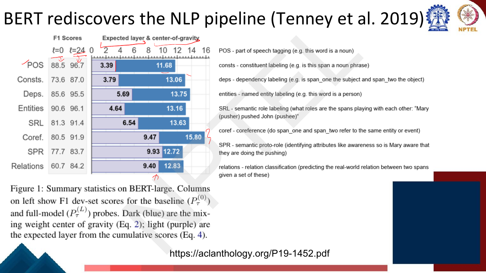
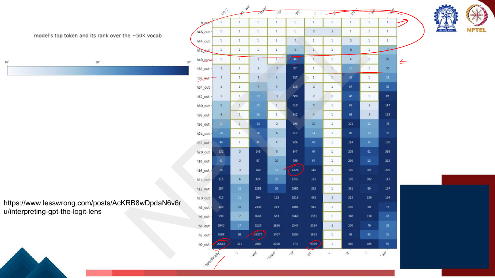
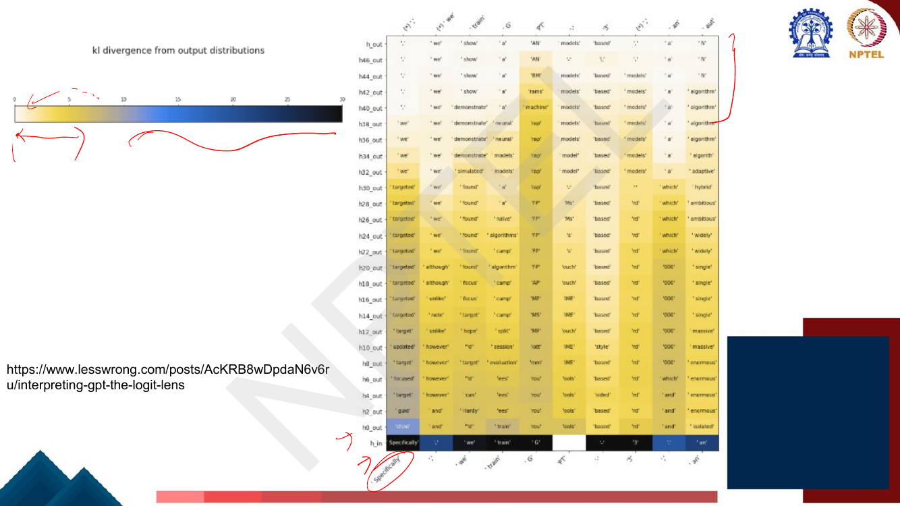
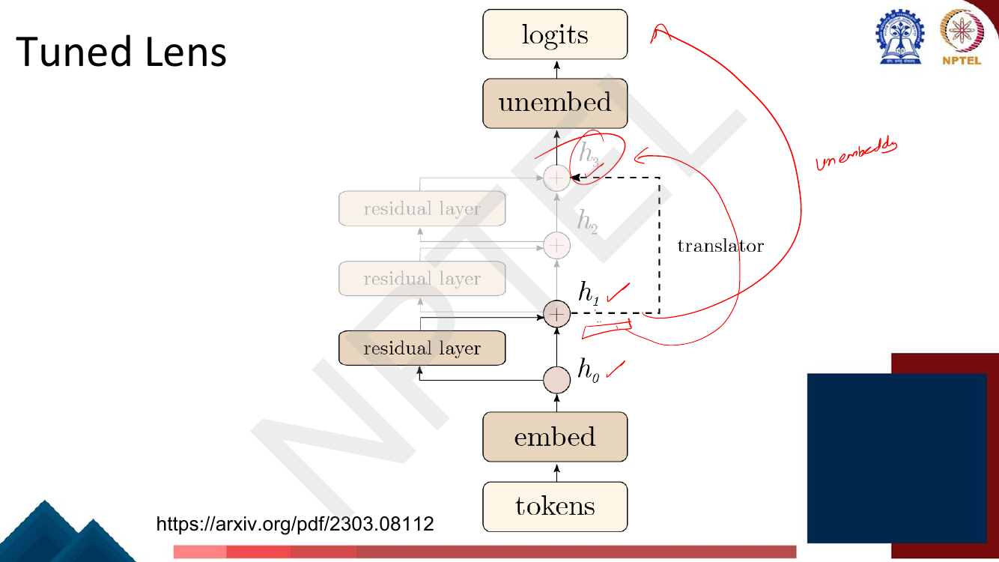

# Lec 56 — Model Interpretability: Probing and the Logit Lens

> **Source:** `Week12.pdf` pp. 1–28 · **Week 12** · **Playlist:** Lec 56
> **Prereqs:** [Lec 27 — BERT and Masked Language Modelling](../week-06/27-bert-masked-lm.md), [Lec 22 — Self-Attention and Multi-Head Attention](../week-05/22-self-attention-and-multihead.md)
> **Feeds into:** [Lec 57 — Multilingual Internals](57-interpretability-multilingual.md), [Lec 58 — FFN Memories and Causal Tracing](58-interpretability-ffn-and-causal-tracing.md)

## Why this lecture exists

Fifty-five lectures have been spent making models work. This one asks what they are *doing*.

The question is forced on us by scale. A logistic regression has one weight per feature and you can
read the weights; a decision tree is a flowchart you can print. A 175-billion-parameter Transformer is
a stack of identical blocks, each shuffling a vector that means nothing to a human. The model gets the
answer right, and you have no account of why — which matters when you want to debug it, trust it, or
edit it.

So this lecture introduces the two oldest and most portable tools for looking inside. **Probing** asks
*what information is sitting in a layer* by training a tiny classifier on its frozen activations.
**The logit lens** asks *what the model would say if it stopped here* by applying the output
unembedding to intermediate states. Probing is the lens pointed sideways at representations; the logit
lens is the same model's own decoder pointed inward. Both are correlational, which is exactly the
limitation [Lec 58](58-interpretability-ffn-and-causal-tracing.md) exists to fix.

## The ideas

### What interpretability means

The deck's definition, worth memorising verbatim (page 3):

> **Interpretability:** *the study of understanding the decisions that AI systems make and putting them
> into easily human-understandable terms.*

And the **why**: *to use that understanding to iteratively better design systems that are more
**performant** and **human-understandable**.* Note that performance is one of the two stated goals —
interpretability is not presented here as an ethics add-on but as an engineering instrument. (The
trustworthiness framing — harms, safety, fairness — is [Lec 59](59-trustworthy-llms-taxonomy.md)'s.)

### Historically models were small


*Fig. — Every model here is inspectable by reading its parameters: a Bayes net's edges are causal claims you can argue with, and a linear model's coefficient is "how much this feature matters". Note the deck's largest "small" model is a two-layer MLP. Page 4.*

This is the deck's whole historical argument and it is worth stating sharply. For the models on page 4,
**interpretability was free**. The parameters *were* the explanation:

| Model | What you read off | Why it is interpretable |
|---|---|---|
| Bayes net | the graph edges | structure is a hypothesis about dependence |
| Linear / multivariate linear regression | the coefficients | one number per input feature |
| Logistic regression | the coefficients | same, through a monotone squashing function |
| 2-layer MLP w/ ReLU | — | already borderline: hidden units have no names |

Then page 5 shows a six-block Transformer stack — embedding layer, six copies of
(self-attention → layer norm → feed-forward → layer norm), LM head — and asks **"How do we make sense
of this huge model?"** Nothing in that picture has a name. There is one weight matrix per sublayer and
no feature it corresponds to. Scale breaks the free lunch: at 175 billion parameters there is no
parameter you can usefully read, so you must *probe the behaviour of the representations* instead.

### Probing: the first attempt

The deck's definition (page 6):

> **Probe:** *a classifier that is specifically trained to predict some property from a pretrained
> model's representations.*
>
> **How?** Given a pretrained model, use the representations it produces to train a classifier
> **(without further fine-tuning the model)** to predict a linguistic property of the input text.

The motivation, spelled out on page 7: *if we can train a classifier to predict a property of the
input text based on its representation, it means the property is encoded somewhere in the
representation.* That inference — decodability implies encoding — is the load-bearing assumption of
the whole method, and §"the methodological caveat" below is where it gets attacked.


*Fig. — The two icons are the entire method: snowflake below (frozen pretrained model), flame above (the only thing that trains). Note the arrow comes out of the top layer's token vectors, not out of the model's own output head. Page 7.*

Mechanically:

1. Freeze a pretrained model $\theta$ ([BERT](../week-06/27-bert-masked-lm.md), GPT, T5 — the
   lecturer's annotation names all three).
2. Run your labelled corpus through it and cache the representations $\mathbf{h}_i^{(\ell)}$ for token
   $i$ at layer $\ell$.
3. Train a small supervised classifier — the **probe** — to map $\mathbf{h}_i^{(\ell)} \mapsto y_i$,
   where $y_i$ is the linguistic label (POS tag, entity type, dependency relation).
4. Report probe accuracy or $F_1$. High score $\Rightarrow$ the property is **linearly decodable**
   (if the probe is linear) from that layer.

Page 8 gives the simplest possible instance: predict the **sentence length** (number of tokens) of $s$
from BERT's frozen `[CLS]` vector using a feed-forward net trained from scratch. Length is not a
linguistic property anyone cares about; it is a sanity probe. If the `[CLS]` vector cannot even tell
you how long the sentence was, nothing subtler is in there either.

Three design knobs matter and the exam can key on any of them: **which layer** you read, **how
powerful** the probe is, and **what the labels are**.

### Edge probing: spans and pairs

A per-token classifier can only ask per-token questions. "Is this word a noun?" is per-token; "is this
span the agent of that verb?" is not. **Edge probing** (Tenney et al., *What do you learn from
context?*, arXiv 1905.06316) generalises probing to **spans and pairs of spans**, which is what lets
you probe *relational* structure — dependency arcs, coreference, semantic roles.


*Fig. — Everything inside the dashed box is frozen; only span pooling and the MLP train. The two spans are the predicate "eat" and the argument "strawberry ice cream", and the probe is a **set of independent binary classifiers**, one per label — not a softmax. For entity and constituent labelling only a single span is used. Page 9.*

The architecture, in order: contextual vectors $\rightarrow$ **span pooling** (a learned pooling over
the tokens in span $s^{(1)}$, and again for $s^{(2)}$) $\rightarrow$ **MLP** $\rightarrow$ independent
binary classifiers, one per candidate label. The deck's example is semantic role labelling with
$s^{(1)} = [1,2)$ = "eat" (the predicate) and $s^{(2)} = [2,5)$ = "strawberry ice cream" (the
argument); label `A1` is positive, every other role is negative.

Two details that are easy to lose and easy to examine:

- **Span indices are half-open.** $[2,5)$ covers tokens 2, 3, 4 — "strawberry ice cream" — not four
  tokens.
- **Single-span vs two-span.** Entity labelling and constituent labelling use one span; dependencies,
  SRL, coreference and relations use two.


*Fig. — The task suite. Notice everything has been rewritten into the same shape — "given one or two marked spans, emit a label" — which is precisely what makes a single probe architecture comparable across eight linguistically different tasks. Coref-W is the Winograd pair, where the same sentence with a different second span flips the answer. Page 10.*

### How to combine representations across layers?

A $24$-layer encoder gives you $25$ candidate representations per token (counting the embedding
layer). Which one do you probe? The deck's page 11 gives the paper's three options:

| Name | What the probe sees |
|---|---|
| **Lexical baseline** | the learned subword embeddings only — no context at all |
| **cat** | subword embeddings **concatenated** with the top layer's activations |
| **mix** | a **learned linear combination of all layer activations**, including the embeddings, using task-specific scalars — "similar to ELMo" |

The **mix** option is the one that matters, and it is literally ELMo's device
([Lec 26](../week-06/26-pretraining-and-elmo.md) owns it):

$$\mathbf{h}_{i,\tau} = \gamma_\tau \sum_{\ell=0}^{L} s_\tau^{(\ell)}\, \mathbf{h}_i^{(\ell)}$$

where $\tau$ indexes the task, $s_\tau^{(\ell)}$ are **softmax-normalised scalars** (so
$\sum_\ell s_\tau^{(\ell)} = 1$) and $\gamma_\tau$ is a single scale factor. The scalars are learned
*jointly with the probe*. Two consequences the deck states explicitly on page 14:

- It lets the probe **extract information from many layers without adding a large number of
  parameters** — one scalar per layer plus $\gamma$, so $L+2$ extra numbers.
- After training, you **read the learned coefficients off** to estimate each layer's contribution to
  that task. The mixture weights are not a nuisance; they are the measurement.

The lexical baseline is the control that makes the whole table meaningful: it is what a probe can do
from *static* embeddings alone, so (full model − lexical) is the part attributable to **context**.


*Fig. — Read the three F1 columns left to right for any row: lexical → cat → mix. BERT-large macro average goes 75.2 → 84.2 → 87.3. Note the one negative delta on the slide (SPR1, −0.3 for large over base) — bigger is not uniformly better. Page 12.*

The headline from page 12: **mix beats cat**, and by a lot — +1.5 macro F1 on BERT-base (84.8 → 86.3)
and +3.1 on BERT-large (84.2 → 87.3). The information you want is *spread across layers*, so a probe
restricted to the top layer is leaving it on the table. This is the same empirical fact as the
layer-choice table in [Lec 27](../week-06/27-bert-masked-lm.md) (where, on CoNLL NER, the
second-to-last layer beats the last and concatenating the last four beats everything) — read that
table alongside this one; they are two views of the same phenomenon and this chapter does not repeat
it.

### The methodological caveat the deck does not raise

This is the single most important thing in the chapter and it is **not on the slides**. State it in
any exam answer about probing.

A probe's accuracy conflates two things: how much the *representation* encodes, and how much the
*probe* can learn on its own. Push the probe's capacity far enough — a deep MLP with many hidden units
— and it will learn POS tagging from almost any sufficiently high-dimensional vector, including
**random** ones, simply by memorising the word identity that any contextual vector trivially carries.
A 97% probe accuracy then tells you about the probe, not about BERT.

The standard fix (Hewitt & Liang, EMNLP 2019) is a **control task**:

- Keep the same inputs and the same probe architecture.
- Replace the real labels with **randomly assigned labels, fixed per word type**. There is no
  linguistic structure left to find; the only way to score well is to memorise the word→random-label
  map.
- A representation that genuinely *encodes* the real property should support the real task and
  **fail** the control task.

**Selectivity** is the gap:

$$\text{selectivity} = \text{accuracy}_{\text{real task}} - \text{accuracy}_{\text{control task}}$$

A probe is trustworthy when selectivity is **high**. A high-accuracy, low-selectivity probe proves
nothing — it has shown only that it can memorise. This is why the field favours *weak* probes (linear,
or low-rank, or with a bounded parameter budget) over strong ones, which is counterintuitive and
therefore examinable: here, a **worse** classifier is a **better** instrument. Worked in N1.

### BERT rediscovers the classical NLP pipeline

The headline result of the lecture (Tenney, Das & Pavlick, ACL 2019). The classical hand-built NLP
pipeline ran tokenization → POS tagging → parsing → named entities → semantic roles → coreference,
each stage consuming the previous one's output. Run edge probes at every layer of BERT-large and that
same ordering falls out of the layers — **nobody designed it in**.


*Fig. — The light purple bar is the **expected layer**, the dark blue the **center of gravity**; the printed numbers are 3.39/11.68 for POS up to 9.93/12.72 for SPR. Note the row order (POS, Consts, Deps, Entities, …) is **not** the expected-layer order — Entities at 4.64 actually resolves before Deps at 5.69. Page 13.*

Two quantities summarise a layer profile, and you must not confuse them.

**Center of gravity** — page 15 — is the mixture-weight-weighted mean layer index:

$$\bar{E}_s[\ell] = \sum_{\ell=0}^{L} \ell \cdot s_\tau^{(\ell)}$$

It uses the *learned scalar mixture weights* $s_\tau^{(\ell)}$ directly. The deck's gloss: **a higher
center of gravity means the information needed for that task is captured by higher layers.**

**Expected layer** — page 16 — is built from *performance differences* instead. Define the
**differential score** at layer $\ell$:

$$\Delta_\tau^{(\ell)} = \text{Score}(P_\tau^{(\ell)}) - \text{Score}(P_\tau^{(\ell-1)})$$

i.e. how much better the probe does when it is allowed to see one more layer. Then

$$\bar{E}_\Delta[\ell] = \frac{\sum_{\ell=1}^{L} \ell \cdot \Delta_\tau^{(\ell)}}{\sum_{\ell=1}^{L} \Delta_\tau^{(\ell)}}$$

which the paper describes as *approximately the expected layer at which the probing model correctly
labels an example, assuming that example is resolved at some layer $\ell \ge 1$*. It is the mean of
$\ell$ under the distribution $\Delta_\tau^{(\ell)} / \sum \Delta_\tau$.


*Fig. — The two formulas to memorise. Centre of gravity weights by **mixture scalars**; expected layer weights by **score gains**. They can disagree: SPR has the highest expected layer (9.93) but almost the lowest centre of gravity (12.72). Page 16.*

The ordering by expected layer, which is the result everyone quotes:

| Task | $F_1$ at $\ell{=}0$ | $F_1$ at $\ell{=}24$ | Expected layer | Centre of gravity |
|---|---|---|---|---|
| POS | 88.5 | 96.7 | **3.39** | 11.68 |
| Constituents | 73.6 | 87.0 | 3.79 | 13.06 |
| Entities | 90.6 | 96.1 | 4.64 | 13.16 |
| Dependencies | 85.6 | 95.5 | 5.69 | 13.75 |
| SRL | 81.3 | 91.4 | 6.54 | 13.63 |
| Relations | 60.7 | 84.2 | 9.40 | 12.83 |
| Coreference | 80.5 | 91.9 | 9.47 | **15.80** |
| SPR | 77.7 | 83.7 | 9.93 | 12.72 |

Read it as: **syntax early, semantics late.** POS is settled by layer ~3 of 24; constituents and
entities just after; dependencies and semantic roles in the middle; coreference and semantic
proto-roles — the tasks that need discourse-level reasoning — not until layer ~9–10 of the *expected*
scale and layer ~16 by centre of gravity.

Page 17 adds the per-layer profiles with a third statistic, $K(\star) = \mathrm{KL}(\star \,\|\,
\text{Uniform})$, measuring how *concentrated* a task's layer distribution is. The printed values:
$K(\Delta) = 1.60$ (POS), $1.57$ (Consts), $1.15$ (Deps), $1.61$ (Entities), $1.31$ (SRL), $0.60$
(Coref). Low $K(\Delta)$ means the task is resolved diffusely across many layers — coreference, at
0.60, is the most spread-out, which fits the picture of it being assembled gradually rather than
decided at one depth.

One honest caveat the deck does not state: this is **correlational**. "A probe can read dependency
labels off layer 6" does not mean the model *uses* layer 6's dependency information when it predicts.
Establishing that requires intervention — causal mediation analysis and causal tracing, which is
exactly what [Lec 58](58-interpretability-ffn-and-causal-tracing.md) owns.

### The logit lens

Second centrepiece, and a completely different idea. The deck's one-line definition (page 18):

> A technique that **directly decodes hidden states into vocabulary space using the model's pretrained
> unembedding matrix.**

Page 19's framing — "**GPT schematically looks like**" — strips the model to three moves:

1. Project the input tokens from vocab space into the (for GPT-2-XL) **1600-dim** embedding space.
2. **Modify this 1600-dim vector many times.**
3. Project the final 1600-dim vector back into vocab space.

So we own a "dictionary" $\mathbf{W}$ that converts between vocabulary space and embedding space, and
we already know two of its applications make sense: the very first vectors are the input tokens, the
very last are the output logits. The question is step 2 — the vectors in the middle. **If we convert
the output of layer 12, or layer 33, to vocab space, does the result make sense? The deck's answer:
yes.**

That running vector is the **residual stream**: the model's state at a token position, which each
block *adds to* rather than replaces — introduced in [Lec 42](../week-09/42-why-icl-works.md), which
owns the abstraction. Because every block writes into the same space, the unembedding $\mathbf{W}_U$
trained on the *final* state is at least approximately meaningful at every intermediate depth. So the
logit lens at layer $\ell$ is just

$$\boldsymbol{\ell}^{(\ell)} = \mathbf{W}_U\,\mathbf{h}^{(\ell)}, \qquad
p^{(\ell)} = \mathrm{softmax}\!\left(\boldsymbol{\ell}^{(\ell)}\right)$$

— the ordinary LM head of [Lec 24](../week-05/24-decoder-and-transformer-lm.md), applied early. No
training, no extra parameters.


*Fig. — Read a column bottom-to-top to watch one prediction form. At the "worst" column the model says "best" around layer 9 and only flips to "worst" by layer 11, after which it locks in and darkens. Note the bottom rows are near-copies of the input token — the residual stream starts as the embedding. Page 18.*

**The top token and its logit** (page 20). The first view: at each layer and position, print the
argmax token and colour it by its logit. You see the prediction *crystallise* — early layers output
near-random tokens at low logit, and somewhere in the upper-middle of the stack the final answer
appears and its logit climbs.

**Looking at the ranks** (pages 21–22). The deck is explicit that top-1 is "a reductive window on the
full distributions". The refinement: keep reducing the *final* output to its top-1 guess, but score
each intermediate layer by the **rank of that final top-1 token** in the intermediate distribution.

> Even if the middle of the model hasn't yet converged to the final answer, maybe it's got that answer
> somewhere in its top 3, top 10, etc. That's a lot better than "top 50257."
>
> (Remember: these are ranks of the model's **final top-1 prediction**, not the true token.)


*Fig. — The ranks collapse from five digits at layer 0 to 1 in the top rows — the circled 20608 at the bottom left becomes 1 well before the output. The log colour scale is what makes this readable; a linear scale would be solid dark. Page 22.*

That parenthetical is the most examinable sentence on these two pages. The rank plot measures
**convergence to the model's own answer**, not correctness.

**KL divergence** (pages 23–24). Ranks are still a reduction. The holistic version compares the whole
intermediate distribution against the whole final one:

$$D_{\mathrm{KL}}\!\left(p^{(\ell)} \,\big\|\, p^{(L)}\right)$$

The deck's words: *taking the KL divergence of the intermediate probabilities w.r.t. the final
probabilities, we get a more continuous view of how the distributions smoothly converge to the model's
output.* A large KL means this layer's "opinion" is far from the model's; KL falls monotonically-ish
with depth and hits exactly 0 at the final layer, where the two distributions are the same thing.
[Lec 39](../week-08/39-rlhf-2-ppo.md) owns KL's definition and the forward/reverse distinction — note
only that KL is **asymmetric**, so the order of the arguments is part of the claim, and the deck's
order is intermediate-against-final.


*Fig. — The dark row at the bottom is `h_in` — the raw embeddings, maximally far from the output distribution. Everything above it is already pale, i.e. the big KL drop happens in the very first block, and the rest of the stack refines. Page 24.*

### The tuned lens

The raw logit lens has a real failure mode: it assumes every layer's residual stream lives in the same
basis as the final layer's. For GPT-2 that is roughly true; for other models it is not, and the logit
lens returns gibberish.


*Fig. — The translator is the only new piece: it maps an intermediate $\mathbf{h}_\ell$ into the place in the stream where the unembedding expects to find it. Everything else is the model, unchanged and frozen. Page 25.*

The fix (Belrose et al., arXiv 2303.08112) is to learn, **per layer**, a small **affine** map — the
**translator** $(\mathbf{A}_\ell, \mathbf{b}_\ell)$ — that converts that layer's representation into
the final layer's basis before unembedding:

$$\text{TunedLens}_\ell(\mathbf{h}_\ell) = \text{LogitLens}\!\left(\mathbf{A}_\ell \mathbf{h}_\ell + \mathbf{b}_\ell\right)$$

Trained by minimising the KL between the tuned-lens logits and what the rest of the real model would
have produced from this state:

$$\arg\min\; \mathbb{E}_{\mathbf{x}}\left[D_{\mathrm{KL}}\!\left(f_{>\ell}(\mathbf{h}_\ell) \,\big\|\, \text{TunedLens}_\ell(\mathbf{h}_\ell)\right)\right]$$

where $f_{>\ell}$ is the model's remaining layers. So the tuned lens is itself a probe — an affine one
— and inherits the probing caveat: it is deliberately kept affine so that it *translates* rather than
*computes* the answer.


*Fig. — This is the whole argument for the tuned lens in one picture: **the logit lens fails to elicit interpretable predictions before layer 21** on GPT-Neo-2.7B, where the tuned lens works from near the bottom. The repeated junk token in the top panel is the diagnostic signature of a basis mismatch. Page 26.*

### Where this leaves you

Probing and the logit lens both answer "what is in there?" by **reading**. Neither shows that the
model *uses* what you read. The next two lectures split the remaining ground:
[Lec 57](57-interpretability-multilingual.md) asks the same reading questions of multilingual models,
and [Lec 58](58-interpretability-ffn-and-causal-tracing.md) switches from reading to **intervening** —
ablate or patch an activation and see whether the output changes, which is the causal claim probing
cannot make.

## Worked numericals

> **Note on `Week12.pdf` p. 14.** The re-swept exercise table in `_build/OWNERSHIP.md` lists page 14
> for this lecture. **It is a false positive.** Page 14 is the Tenney summary figure plus the scalar-
> mixture equation and two explanatory paragraphs; there is no question asked and nothing to solve.
> **Pages 1–28 contain no exercise of any kind** — all 28 opened and checked as images. The numericals
> below are therefore all constructed, except N6 which works the deck's own printed figures.

### N1. Probe accuracy vs a control task — computing selectivity
**Given:** two probes read the *same* frozen representations for POS tagging. Probe A is linear; probe
B is a 2-hidden-layer MLP with 1000 units per layer.

| Probe | Accuracy, real POS task | Accuracy, control task (random labels fixed per word type) |
|---|---|---|
| A (linear) | 97.3% | 71.2% |
| B (MLP-2, 1000 units) | 97.5% | 92.1% |

**Find:** the selectivity of each probe, and which probe's result is evidence about the representation.

1. Selectivity $=$ (real-task accuracy) $-$ (control-task accuracy).
2. Probe A: $97.3 - 71.2 = \mathbf{26.1}$ points.
3. Probe B: $97.5 - 92.1 = \mathbf{5.4}$ points.
4. Compare the real-task column alone: $97.5 > 97.3$, so a naive reading says **B is the better
   probe** and "BERT encodes POS at 97.5%".
5. Now read the control column. B scores **92.1%** on labels that carry *no linguistic information
   whatsoever* — they are random draws, fixed per word type. B is therefore capable of memorising a
   word→label lookup table from the representation on its own. Its 97.5% on the real task is
   substantially its own doing.
6. A scores only 71.2% on the control, i.e. it largely **cannot** memorise. So most of A's 97.3% must
   have come from structure already present in the vectors.

**Answer:** selectivity $26.1$ (A) vs $5.4$ (B). **Probe A's result is the evidence; probe B's is
nearly worthless** despite the higher headline accuracy. The exam phrasing to recognise: *a
high-accuracy probe with low selectivity proves nothing.* Pick the probe with the **highest
selectivity**, not the highest accuracy.

### N2. A logit-lens computation at three depths
**Given:** a toy model with $d = 2$ and vocabulary $V = \{\text{was},\ \text{the},\ \text{worst}\}$.
The unembedding matrix (one row per token) is

$$\mathbf{W}_U = \begin{bmatrix} 2.0 & 0.0 \\ 0.0 & 2.0 \\ 1.5 & 1.5 \end{bmatrix}$$

The residual stream at one token position, read after layers 4, 8 and 12 (12 is the final layer):
$\mathbf{h}^{(4)} = (1.0,\ 0.2)$, $\mathbf{h}^{(8)} = (0.8,\ 0.8)$, $\mathbf{h}^{(12)} = (1.2,\ 1.2)$.

**Find:** the logits, the softmax distribution and the top-1 token at each depth.

1. **Layer 4.** $\boldsymbol{\ell}^{(4)} = \mathbf{W}_U\mathbf{h}^{(4)}$:
   was $= 2.0(1.0) + 0.0(0.2) = 2.0$; the $= 0.0(1.0) + 2.0(0.2) = 0.4$;
   worst $= 1.5(1.0) + 1.5(0.2) = 1.5 + 0.3 = 1.8$.
2. Exponentiate: $e^{2.0} = 7.3891$, $e^{0.4} = 1.4918$, $e^{1.8} = 6.0496$. Sum $= 14.9305$.
3. $p^{(4)} = (7.3891,\ 1.4918,\ 6.0496)/14.9305 = (\mathbf{0.4949},\ 0.0999,\ 0.4052)$.
   **Top-1 = "was"** — and only just, by $0.0897$ over "worst".
4. **Layer 8.** $\boldsymbol{\ell}^{(8)}$: was $= 1.6$; the $= 1.6$; worst $= 1.5(0.8)+1.5(0.8) = 2.4$.
5. $e^{1.6} = 4.9530$ (twice), $e^{2.4} = 11.0232$. Sum $= 20.9292$.
6. $p^{(8)} = (0.2367,\ 0.2367,\ \mathbf{0.5267})$. **Top-1 = "worst"** — the prediction has flipped.
7. **Layer 12.** $\boldsymbol{\ell}^{(12)}$: was $= 2.4$; the $= 2.4$; worst $= 1.5(1.2)+1.5(1.2) = 3.6$.
8. $e^{2.4} = 11.0232$ (twice), $e^{3.6} = 36.5982$. Sum $= 58.6446$.
9. $p^{(12)} = (0.1880,\ 0.1880,\ \mathbf{0.6241})$. **Top-1 = "worst"**, now with $0.6241$ instead of
   $0.5267$.

**Answer:** top-1 goes **was → worst → worst**, with the winner's probability $0.4949 \to 0.5267 \to
0.6241$. Note what happened between layers 8 and 12: the *direction* of $\mathbf{h}$ never changed
(both are multiples of $(1,1)$) — only its **norm** grew from $1.131$ to $1.697$. Growing the norm
sharpens the softmax without changing the ranking. That is the second half of "the prediction
crystallises": first the argmax moves, then the model becomes confident about it.

### N3. KL divergence from the final distribution
**Given:** the three distributions from N2, with $p^{(12)}$ as the final one.
**Find:** $D_{\mathrm{KL}}(p^{(\ell)} \,\|\, p^{(12)})$ at $\ell = 4, 8, 12$, in nats.

Use $D_{\mathrm{KL}}(p\,\|\,q) = \sum_k p_k \ln (p_k/q_k)$ (definition owned by
[Lec 39](../week-08/39-rlhf-2-ppo.md)).

1. **$\ell = 4$.** Ratios $p^{(4)}_k / p^{(12)}_k$:
   $0.4949/0.1880 = 2.6329$; $0.0999/0.1880 = 0.5316$; $0.4052/0.6241 = 0.6493$.
2. Logs: $\ln 2.6329 = 0.9681$; $\ln 0.5316 = -0.6319$; $\ln 0.6493 = -0.4319$.
3. Weighted terms: $0.4949(0.9681) = 0.4791$; $0.0999(-0.6319) = -0.0631$;
   $0.4052(-0.4319) = -0.1750$.
4. Sum: $0.4791 - 0.0631 - 0.1750 = \mathbf{0.2410}$ nats.
5. **$\ell = 8$.** Ratios: $0.2367/0.1880 = 1.2590$ (twice); $0.5267/0.6241 = 0.8440$.
6. Logs: $\ln 1.2590 = 0.2303$ (twice); $\ln 0.8440 = -0.1697$.
7. Terms: $0.2367(0.2303) = 0.0545$ (twice); $0.5267(-0.1697) = -0.0894$.
8. Sum: $0.0545 + 0.0545 - 0.0894 = \mathbf{0.0197}$ nats.
9. **$\ell = 12$.** $p^{(12)}$ against itself: every ratio is 1, every log is 0, so
   $D_{\mathrm{KL}} = \mathbf{0}$ exactly.

**Answer:** $0.2410 \to 0.0197 \to 0$. The distributions converge on the model's output, and KL
reaching exactly zero at the last layer is the structural guarantee — it is the same distribution.
Note that individual **terms can be negative** (steps 3 and 7) even though the total cannot; a trap if
you check your work term by term.

### N4. Layer-wise mixture weights: the mixed representation and the centre of gravity
**Given:** a 12-layer encoder, so $\ell = 0 \ldots 12$ (13 representations, counting the embedding
layer). The probe learned these softmax-normalised scalars $s^{(\ell)}$, with $\gamma = 2$:

| $\ell$ | 0 | 1 | 2 | 3 | 4 | 5 | 6 | 7 | 8 | 9 | 10 | 11 | 12 |
|---|---|---|---|---|---|---|---|---|---|---|---|---|---|
| $s^{(\ell)}$ | 0.02 | 0.03 | 0.04 | 0.05 | 0.06 | 0.08 | 0.10 | 0.12 | **0.14** | 0.13 | 0.10 | 0.08 | 0.05 |

and (for a clean check) $\mathbf{h}^{(\ell)} = (\ell,\ 1)$ for every $\ell$.

**Find:** that the weights are a valid distribution, which layer dominates, the centre of gravity, and
the mixed representation $\mathbf{h} = \gamma \sum_\ell s^{(\ell)} \mathbf{h}^{(\ell)}$.

1. **Normalisation check.** $0.02+0.03+0.04+0.05+0.06+0.08+0.10+0.12+0.14+0.13+0.10+0.08+0.05$.
   Running total: $0.05,\ 0.09,\ 0.14,\ 0.20,\ 0.28,\ 0.38,\ 0.50,\ 0.64,\ 0.77,\ 0.87,\ 0.95,\ 1.00$. ✓
2. **Dominant layer:** the largest scalar is $0.14$ at $\ell = \mathbf{8}$.
3. **Centre of gravity** $\bar{E}_s[\ell] = \sum_\ell \ell\, s^{(\ell)}$. Term by term:
   $0,\ 0.03,\ 0.08,\ 0.15,\ 0.24,\ 0.40,\ 0.60,\ 0.84,\ 1.12,\ 1.17,\ 1.00,\ 0.88,\ 0.60$.
4. Sum: $0.03+0.08 = 0.11$; $+0.15 = 0.26$; $+0.24 = 0.50$; $+0.40 = 0.90$; $+0.60 = 1.50$;
   $+0.84 = 2.34$; $+1.12 = 3.46$; $+1.17 = 4.63$; $+1.00 = 5.63$; $+0.88 = 6.51$; $+0.60 = 7.11$.
5. $\bar{E}_s[\ell] = \mathbf{7.11}$.
6. **Mixed representation.** $\sum_\ell s^{(\ell)}(\ell, 1) = \left(\sum_\ell \ell s^{(\ell)},\ \sum_\ell s^{(\ell)}\right) = (7.11,\ 1.00)$.
7. Apply $\gamma = 2$: $\mathbf{h} = (14.22,\ 2.00)$.

**Answer:** dominant layer **8**, centre of gravity **7.11**, mixed representation
$\mathbf{h} = (14.22,\ 2.00)$. Note two things the exam likes. First, **the dominant layer (8) and the
centre of gravity (7.11) are different numbers** — the CoG is a mean, pulled down here by the mass on
low layers. Second, $\gamma$ scales the vector but **does not affect the centre of gravity at all**,
because CoG is computed from the $s^{(\ell)}$ alone.

### N5. Expected layer from differential scores
**Given:** a 6-layer encoder. Probing $F_1$ when the probe may use layers $0 \ldots \ell$:

| $\ell$ | 0 | 1 | 2 | 3 | 4 | 5 | 6 |
|---|---|---|---|---|---|---|---|
| $\text{Score}(P^{(\ell)})$ | 70.0 | 74.0 | 80.0 | 86.0 | 88.0 | 89.0 | 89.0 |

**Find:** the differential scores $\Delta^{(\ell)}$ and the expected layer $\bar{E}_\Delta[\ell]$.

1. $\Delta^{(\ell)} = \text{Score}(P^{(\ell)}) - \text{Score}(P^{(\ell-1)})$ for $\ell \ge 1$:
   $\Delta^{(1)} = 74.0 - 70.0 = 4.0$; $\Delta^{(2)} = 6.0$; $\Delta^{(3)} = 6.0$;
   $\Delta^{(4)} = 2.0$; $\Delta^{(5)} = 1.0$; $\Delta^{(6)} = 0.0$.
2. Denominator $\sum_\ell \Delta^{(\ell)} = 4 + 6 + 6 + 2 + 1 + 0 = 19.0$. (Sanity check: this must
   equal $\text{Score}(P^{(6)}) - \text{Score}(P^{(0)}) = 89.0 - 70.0 = 19.0$ ✓ — the sum telescopes.)
3. Numerator $\sum_\ell \ell \Delta^{(\ell)} = 1(4) + 2(6) + 3(6) + 4(2) + 5(1) + 6(0)$
   $= 4 + 12 + 18 + 8 + 5 + 0 = 47.0$.
4. $\bar{E}_\Delta[\ell] = 47.0 / 19.0 = \mathbf{2.4737}$.

**Answer:** expected layer $\approx \mathbf{2.47}$ out of 6 — this task is resolved in the lower
third of the stack, so by Tenney's reading it is a "shallow", syntax-like property. Note $\ell = 0$ is
**excluded** from both sums (the formula starts at $\ell = 1$), because $\Delta^{(0)}$ is undefined;
the layer-0 score is the lexical baseline against which everything is measured.

### N6. Reading the deck's Tenney table (page 13/14)
**Given:** the printed $F_1$ at $\ell = 0$ and $\ell = 24$ for BERT-large.
**Find:** which task gains most from contextualisation, and whether expected layer and centre of
gravity give the same ordering.

1. Gain $= F_1(\ell{=}24) - F_1(\ell{=}0)$:
   POS $96.7 - 88.5 = 8.2$; Consts $87.0 - 73.6 = 13.4$; Deps $95.5 - 85.6 = 9.9$;
   Entities $96.1 - 90.6 = 5.5$; SRL $91.4 - 81.3 = 10.1$; Coref $91.9 - 80.5 = 11.4$;
   SPR $83.7 - 77.7 = 6.0$; **Relations $84.2 - 60.7 = 23.5$**.
2. Largest gain: **Relations, +23.5** — and it also has the *lowest* lexical baseline (60.7), which is
   the point: relation classification is almost impossible from static embeddings and is the task that
   context buys you most.
3. Smallest gain: **Entities, +5.5**, because a lexical baseline already gets 90.6 — "Disney" is an
   organisation whatever the sentence.
4. Order by **expected layer** (ascending): POS 3.39, Consts 3.79, Entities 4.64, Deps 5.69, SRL 6.54,
   Relations 9.40, Coref 9.47, SPR 9.93.
5. Order by **centre of gravity** (ascending): POS 11.68, SPR 12.72, Relations 12.83, Consts 13.06,
   Entities 13.16, SRL 13.63, Deps 13.75, Coref 15.80.
6. The two orders agree only at the ends (POS first, and coreference high). **SPR is 8th by expected
   layer but 2nd by centre of gravity.**

**Answer:** Relations gains the most (+23.5); Entities the least (+5.5); and **the two layer
statistics do not induce the same ordering.** The famous "classical pipeline" ordering is the
**expected-layer** one. Also note the figure's *row* order (POS, Consts, Deps, Entities, SRL, Coref,
SPR, Relations) is neither — Entities genuinely resolves before Deps.

## Code

A NumPy logit-lens simulation. It takes a residual-stream vector at three depths plus an unembedding
matrix, and prints the top token, the rank of the final answer, and the KL to the final distribution
at each layer — the three views from pages 20, 22 and 24 in one table. The numbers match N2 and N3
exactly.

```python
import numpy as np

vocab = ["was", "the", "worst"]
# the model's unembedding (output) matrix: one row per vocabulary item
W_U = np.array([[2.0, 0.0],
                [0.0, 2.0],
                [1.5, 1.5]])
# residual stream at the same token position, read off after layers 4, 8, 12
H = {4:  np.array([1.0, 0.2]),
     8:  np.array([0.8, 0.8]),
     12: np.array([1.2, 1.2])}      # layer 12 is the final layer

def softmax(z):
    e = np.exp(z - z.max())          # shift for numerical stability
    return e / e.sum()

def kl(p, q):                        # D_KL(p || q), natural log -> nats
    return float(np.sum(p * np.log(p / q)))

p_final   = softmax(W_U @ H[12])
final_top = int(p_final.argmax())

print(f"final top-1 token = '{vocab[final_top]}'\n")
print("layer | logits        | probabilities        | top-1  | rank of final top-1 | KL to final")
for l in sorted(H):
    z = W_U @ H[l]                   # the logit lens: unembed an INTERMEDIATE state
    p = softmax(z)
    rank = 1 + int((p > p[final_top]).sum())
    print(f"{l:5d} | {np.round(z,3)} | {np.round(p,4)} | "
          f"{vocab[int(p.argmax())]:6s} | {rank:^19d} | {kl(p, p_final):.4f}")
```

```
final top-1 token = 'worst'

layer | logits        | probabilities        | top-1  | rank of final top-1 | KL to final
    4 | [2.  0.4 1.8] | [0.4949 0.0999 0.4052] | was    |          2          | 0.2410
    8 | [1.6 1.6 2.4] | [0.2367 0.2367 0.5267] | worst  |          1          | 0.0197
   12 | [2.4 2.4 3.6] | [0.188  0.188  0.6241] | worst  |          1          | 0.0000
```

Three things to read off. The **top-1 flips** between layers 4 and 8 — that is the heatmap on page 18.
The **rank** of the final answer is 2 at layer 4, i.e. the model already has the right token in second
place long before it commits — that is page 22's point about "top 3, top 10" being much better than
"top 50257". And **KL falls monotonically to exactly 0** — page 24. The one line doing the actual work
is `W_U @ H[l]`: the logit lens is a single matrix–vector product that the model already contains.

## Exam pack

### Must-memorise

| Item | Exactly this |
|---|---|
| Interpretability (deck's definition) | *the study of understanding the decisions that AI systems make and putting them into easily human-understandable terms* |
| Why interpretability (deck) | to iteratively design systems that are more **performant** and **human-understandable** |
| Probe (deck's definition) | *a classifier specifically trained to predict some property from a pretrained model's representations* |
| Probing: what trains | **the classifier only**; the pretrained model is **frozen, no further fine-tuning** |
| Probing's inference | if a classifier can predict the property from the representation, the property is **encoded** in it |
| Edge probing | probing over **spans and pairs of spans**; span pooling → MLP → **independent binary** classifiers |
| Three layer-combination options | **lexical baseline** / **cat** (embeddings ⊕ top layer) / **mix** (learned scalar combination of all layers, ELMo-style) |
| Scalar mixture | $\mathbf{h}_{i,\tau} = \gamma_\tau \sum_{\ell=0}^{L} s_\tau^{(\ell)} \mathbf{h}_i^{(\ell)}$, $s$ softmax-normalised |
| Extra parameters for the mixture | $L+2$ (one scalar per layer, $\ell = 0 \ldots L$, plus $\gamma$) |
| Centre of gravity | $\bar{E}_s[\ell] = \sum_{\ell=0}^{L} \ell \cdot s_\tau^{(\ell)}$ — weighted by **mixture scalars** |
| Differential score | $\Delta_\tau^{(\ell)} = \text{Score}(P_\tau^{(\ell)}) - \text{Score}(P_\tau^{(\ell-1)})$ |
| Expected layer | $\bar{E}_\Delta[\ell] = \dfrac{\sum_{\ell=1}^{L}\ell\,\Delta_\tau^{(\ell)}}{\sum_{\ell=1}^{L}\Delta_\tau^{(\ell)}}$ — weighted by **score gains** |
| Higher CoG means | the information is captured by **higher layers** |
| Control task | same probe, same inputs, **random labels fixed per word type** |
| Selectivity | accuracy(real task) − accuracy(control task); **higher is better** |
| Logit lens | $\mathrm{softmax}(\mathbf{W}_U \mathbf{h}^{(\ell)})$ — the model's **pretrained unembedding matrix** applied to an **intermediate** hidden state |
| Rank view | the rank of the **final layer's top-1 token** in each intermediate distribution (not the true token) |
| KL view | $D_{\mathrm{KL}}(p^{(\ell)} \| p^{(L)})$ — intermediate w.r.t. final; 0 at the last layer |
| Tuned lens | $\text{TunedLens}_\ell(\mathbf{h}_\ell) = \text{LogitLens}(\mathbf{A}_\ell \mathbf{h}_\ell + \mathbf{b}_\ell)$ |
| Translator | the per-layer **affine** pair $(\mathbf{A}_\ell, \mathbf{b}_\ell)$ |
| Tuned-lens training objective | $\arg\min\ \mathbb{E}_{\mathbf{x}}[D_{\mathrm{KL}}(f_{>\ell}(\mathbf{h}_\ell) \,\|\, \text{TunedLens}_\ell(\mathbf{h}_\ell))]$ |
| Probing is… | **correlational**, not causal — see [Lec 58](58-interpretability-ffn-and-causal-tracing.md) |

### Numbers worth knowing

| Quantity | Value |
|---|---|
| Tenney et al. year / venue | **2019**, ACL (`aclanthology.org/P19-1452`); edge probing paper arXiv **1905.06316** |
| Tuned lens paper | *Eliciting Latent Predictions from Transformers with the Tuned Lens*, arXiv **2303.08112** |
| Encoder probed in "BERT rediscovers…" | **BERT-large**, 24 layers ($\ell = 0 \ldots 24$) |
| Expected layer: POS / Consts / Entities / Deps | **3.39 / 3.79 / 4.64 / 5.69** |
| Expected layer: SRL / Relations / Coref / SPR | **6.54 / 9.40 / 9.47 / 9.93** |
| Centre of gravity: POS / Coref | **11.68** (lowest) / **15.80** (highest) |
| $F_1$ at $\ell{=}0 \to \ell{=}24$: POS | 88.5 → 96.7 |
| $F_1$ at $\ell{=}0 \to \ell{=}24$: Relations | 60.7 → 84.2 (**largest gain, +23.5**) |
| $F_1$ at $\ell{=}0 \to \ell{=}24$: Entities | 90.6 → 96.1 (smallest gain, +5.5) |
| Edge-probe macro average, BERT-large: Lex / cat / mix | **75.2 / 84.2 / 87.3** |
| Edge-probe macro average, BERT-base: Lex / cat / mix | 75.1 / 84.8 / 86.3 |
| $K(\Delta) = \mathrm{KL}(\Delta \| \text{Uniform})$, page 17 | POS 1.60, Consts 1.57, Deps 1.15, Entities 1.61, SRL 1.31, **Coref 0.60** |
| GPT-2-XL embedding width used in the logit-lens post | **1600** |
| GPT-2 vocabulary size quoted on page 21 | **50,257** ("~50K vocab" on page 22) |
| Layer below which the logit lens fails on GPT-Neo-2.7B | **21** |
| GPT-Neo size in the tuned-lens figure | **2.7B** |
| Edge-probing example span indices | $s^{(1)} = [1,2)$ ("eat"), $s^{(2)} = [2,5)$ ("strawberry ice cream") |

### Likely MCQ traps

- **"Probing fine-tunes the model."** It does not. The pretrained weights are **frozen** (the slide's
  snowflake); only the probe's weights update (the flame). If you fine-tune, you are no longer
  measuring the representation.
- **Centre of gravity vs expected layer.** CoG is weighted by the **learned mixture scalars**;
  expected layer is weighted by **score differences** between consecutive layers. They have different
  formulas and give different orderings — SPR is 8th by expected layer and 2nd by CoG.
- **"Higher probe accuracy means the representation encodes more."** Only if the probe is weak or the
  selectivity is high. A powerful probe can learn the task from almost anything. Compare against a
  **control task**.
- **"A good probe should also score well on the control task."** Backwards. A good probe should
  **fail** the control task — that is what high selectivity means.
- **The rank plot shows ranks of the correct token.** No — ranks of the **model's own final top-1
  prediction**. The deck puts this in a parenthetical specifically because people get it wrong. It
  measures convergence, not accuracy.
- **"The logit lens needs training."** It needs none — it reuses the pretrained unembedding. The
  **tuned lens** is the one that trains (one affine translator per layer).
- **Confusing the tuned lens's translator with a full fine-tune.** The translator is **affine**
  ($\mathbf{A}_\ell\mathbf{h}_\ell + \mathbf{b}_\ell$), per layer, and the model stays frozen.
- **"mix means concatenating all layers."** No — **cat** concatenates (embeddings with the top layer);
  **mix** takes a *weighted sum* with scalars that sum to 1. Mix wins.
- **KL direction.** The deck takes KL of the **intermediate** distribution *with respect to* the
  **final** one. KL is asymmetric; swapping the arguments changes the number
  ([Lec 39](../week-08/39-rlhf-2-ppo.md)).
- **"Probing proves the model uses the information."** It proves only that the information is
  *present*. Use is a causal claim requiring intervention —
  [Lec 58](58-interpretability-ffn-and-causal-tracing.md).
- **Edge probing uses a softmax over labels.** The deck's figure shows **independent binary**
  classifiers (the `0 1 0 0 …` row over `<A0> <A1> <A2> <A3>`), which is what allows multiple labels.
- **Half-open spans.** $s^{(2)} = [2,5)$ is three tokens, not four.

### Self-test

1. State the deck's definition of a probe in one sentence, and say exactly which parameters are updated during probing.
2. What does edge probing add over ordinary probing, and name two tasks that require it.
3. Write the scalar-mixture formula and say how many extra parameters it costs for a 24-layer encoder.
4. A probe scores 96.0% on POS and 93.5% on a control task. What is its selectivity, and what should you conclude?
5. Give the two layer statistics from Tenney et al. and say which one is weighted by mixture scalars.
6. Scores for a 4-layer encoder are 60, 70, 76, 78, 78 at $\ell = 0,1,2,3,4$. Compute the expected layer.
7. In one sentence, what is the logit lens and what does it reuse?
8. The rank plot reports the rank of which token?
9. Why does the tuned lens exist, and what exactly is trained?
10. State the ordering of the five classical pipeline stages as they emerge across BERT's layers.
11. Why is probing not evidence that the model *uses* the probed information?

<details><summary>Answers</summary>

1. *A classifier specifically trained to predict some property from a pretrained model's representations.* **Only the classifier's weights update**; the pretrained model is frozen with no further fine-tuning.
2. It probes **spans and pairs of spans** rather than single tokens, so it can test relational properties. Dependency labelling and coreference (also SRL, relation classification) require it.
3. $\mathbf{h}_{i,\tau} = \gamma_\tau \sum_{\ell=0}^{L} s_\tau^{(\ell)}\mathbf{h}_i^{(\ell)}$. For $L = 24$ that is 25 scalars plus $\gamma$ = **26** extra parameters.
4. Selectivity $= 96.0 - 93.5 = \mathbf{2.5}$ points. Very low — the probe can nearly solve a random-label task, so its 96% says more about the probe's memorisation capacity than about the representation. Use a weaker probe.
5. **Centre of gravity** $\bar{E}_s[\ell] = \sum \ell\, s^{(\ell)}$ (weighted by the **mixture scalars**) and **expected layer** $\bar{E}_\Delta[\ell]$ (weighted by the differential scores $\Delta^{(\ell)}$).
6. $\Delta = (10, 6, 2, 0)$; denominator $= 18$; numerator $= 1(10)+2(6)+3(2)+4(0) = 28$; expected layer $= 28/18 = \mathbf{1.556}$.
7. Applying the model's **pretrained unembedding matrix** to an intermediate hidden state to decode it into vocabulary space — it reuses the model's own LM head and trains nothing.
8. The rank of the **model's final top-1 prediction** within each intermediate layer's distribution — not the ground-truth token.
9. Because intermediate representations are not always in the final layer's basis, so the raw logit lens returns uninterpretable output (before layer 21 on GPT-Neo-2.7B). A small **affine translator** $(\mathbf{A}_\ell, \mathbf{b}_\ell)$ per layer is trained to minimise KL against what the rest of the model would have predicted; the model itself stays frozen.
10. POS → constituents/parsing → entities → dependencies → semantic roles → coreference. By expected layer: 3.39, 3.79, 4.64, 5.69, 6.54, 9.47.
11. Probing is **correlational** — it shows the information is decodable, not that any downstream computation reads it. Demonstrating use requires intervening on the activation (causal tracing, [Lec 58](58-interpretability-ffn-and-causal-tracing.md)).

</details>

## Beyond the slides

**Gap:** The deck never mentions **control tasks or selectivity**.
**Why it matters:** This is the central methodological critique of probing (Hewitt & Liang, EMNLP
2019) and it reverses the naive reading of every probing table in the lecture. Without a control, a
high probe score is uninterpretable, because probe capacity and representation quality are confounded.
It also explains an otherwise baffling practice — deliberately using *weak* probes. Worked in N1; if
an exam asks "what is the main criticism of probing", this is the answer.

**Gap:** The deck shows the probe architecture but never says **what you compare the number against**
beyond the lexical baseline.
**Why it matters:** Three baselines make a probing result meaningful, and the deck gives only one.
(i) The **lexical baseline** (on the slides) isolates the contribution of context. (ii) A **random
encoder** — identical architecture, untrained weights — isolates the contribution of pretraining, and
random Transformers probe surprisingly well. (iii) A **control task** isolates the contribution of the
probe. Quoting a probe accuracy with no baseline is the most common error in this literature.

**Gap:** Nothing is said about **why** the logit lens works at all.
**Why it matters:** It works because of the **residual stream** — every block *adds* to a running
vector rather than overwriting it, so the space the unembedding was trained on is approximately the
same space at every depth. If Transformers did not have residual connections, the logit lens would be
meaningless. That also predicts exactly when it fails (a model whose layers rotate the basis), which
is the tuned lens's whole motivation. The residual stream is owned by
[Lec 42](../week-09/42-why-icl-works.md); the connection to the lens is not drawn on either deck.

**Gap:** The deck does not mention the **information-theoretic reformulation** of probing.
**Why it matters:** Voita & Titov (2020) recast probing as **minimum description length**: instead of
asking "how accurately can a probe read property $y$ from $\mathbf{h}$", ask "how many bits does it
cost to transmit the labels given the representations, *including the cost of the probe itself*". A
probe that must be huge to succeed costs more bits, so the measure penalises probe capacity
automatically rather than needing a separate control. It is the cleanest answer to the caveat above,
and it is where the field went after 2019.

**Gap:** The probe's **layer indexing is ambiguous** on the slides.
**Why it matters:** $\ell = 0$ means the **embedding layer** (no Transformer block applied), which is
why the scalar mixture sums from $\ell = 0$ and why a 24-layer BERT-large has 25 representations. Get
this wrong and every centre-of-gravity and expected-layer computation is off by one. Note also the
asymmetry baked into the formulas: the centre of gravity sums from $\ell = 0$, the expected layer from
$\ell = 1$.

## Cut from the slides

Pages 1, 2, 27 and 28 are the title, the contents list, a one-line "Various papers cited in the
slides" reference page and a blank "Thank you" slide; nothing was lost. Page 8's sentence-length probe
is folded into the probing section as a one-sentence example rather than given its own treatment,
since it exists only to make the method concrete. Pages 13, 14, 15, 16 and 17 all reproduce the *same*
Tenney Figure 1 with different annotations beside it — a five-page progressive reveal — so they are
taught once as a single table plus the two formulas, with two of the five pages shown. Pages 20, 22
and 24 are three heatmaps of the same GPT run under three different measurements (top-token logit,
rank, KL); all three are kept because the *measurement* differs each time, which is the examinable
content. The layer-choice table on `Week6.pdf` p. 44 (CoNLL NER by layer: first 91.0, last 94.9,
sum-all-12 95.5, second-to-last 95.6, sum-last-4 95.9, concat-last-4 96.1) is deliberately **not**
reproduced — it belongs to [Lec 27](../week-06/27-bert-masked-lm.md) and is linked instead. The Voita
et al. attention-head taxonomy on `Week5.pdf` p. 43 is likewise left to
[Lec 22](../week-05/22-self-attention-and-multihead.md). Nothing in pages 1–28 was dropped on grounds
of difficulty.
