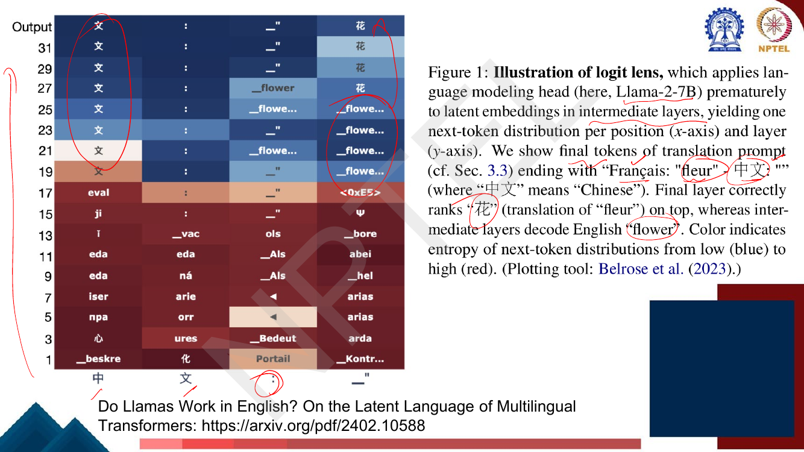
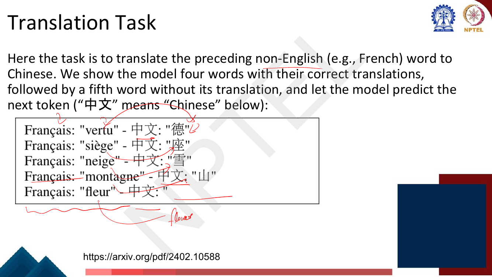
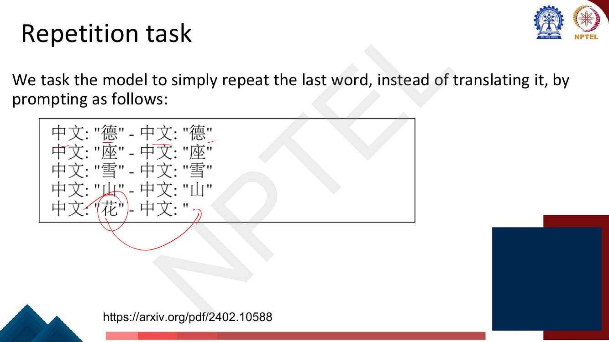
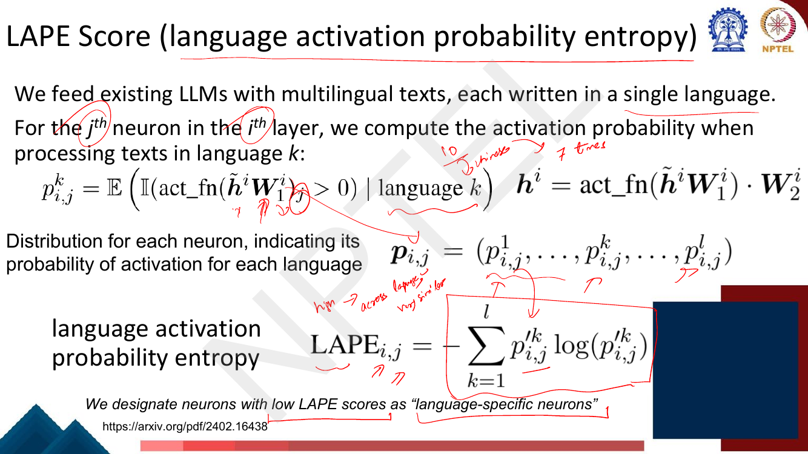
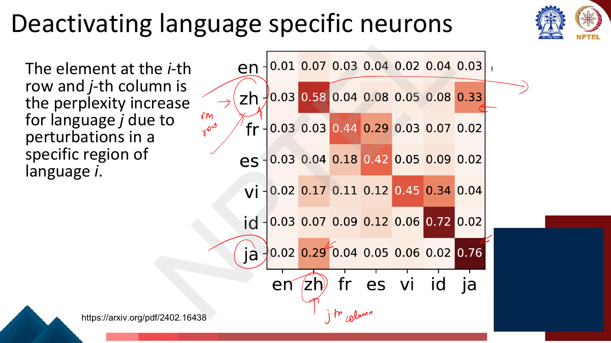
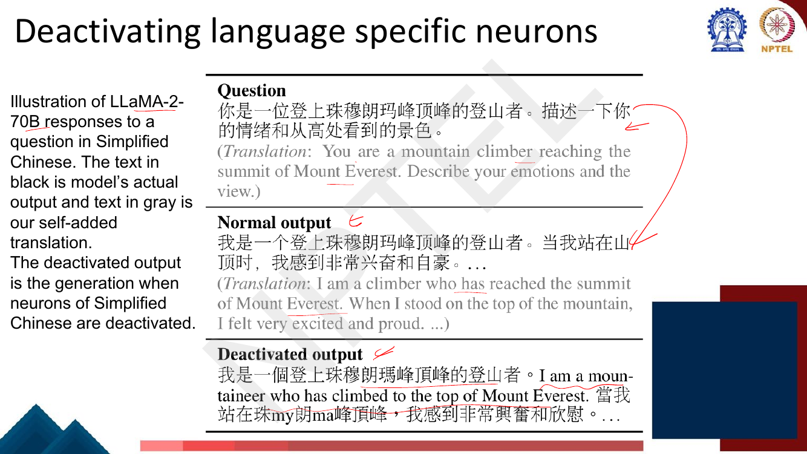
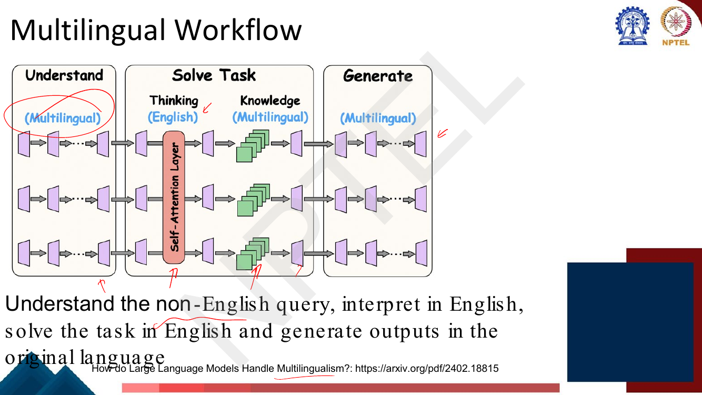
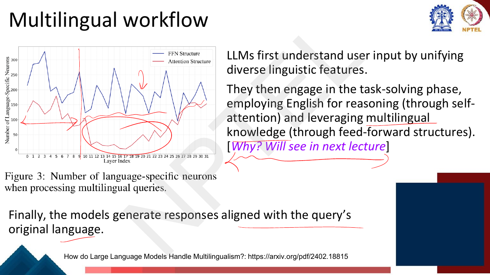

# Lec 57 — Model Interpretability: Multilingual

> **Source:** `Week12.pdf` pp. 29–46 · **Week 12** · **Playlist:** Lec 57
> **Prereqs:** [Lec 56 — Interpretability: Probing](56-interpretability-probing.md), [Lec 30 — Domain and Multilingual Pretraining](../week-06/30-domain-and-multilingual-pretraining.md)
> **Feeds into:** [Lec 58 — Interpretability: FFN and Causal Tracing](58-interpretability-ffn-and-causal-tracing.md)

## Why this lecture exists

[Lec 30](../week-06/30-domain-and-multilingual-pretraining.md) established *that* a single transformer
trained on a hundred languages can answer in all of them — mBERT, XLM-R, mT5, plus the curse of
multilinguality. It never said *how*. One model, one hundred languages: is there a separate French
machine hiding inside, or one machine that French is routed through?

This lecture answers with two pieces of evidence. The first, from the paper *Do Llamas Work in
English?*, takes a model prompted in French, answering in Chinese, and uses the logit lens of
[Lec 56](56-interpretability-probing.md) to read out what every intermediate layer is "thinking".
English shows up in the middle — in a prompt that contains no English at all. The second isolates
**neurons** that fire for one language and almost nothing else, and shows that switching off a few
hundred of them makes a 70B model answer a Chinese question in English.

## The ideas

### The question, and why the logit lens can answer it

The deck's three headings are: *How do multilingual transformers work?*, *Language-specific neurons*,
and *Multilingual workflow*.

The tool is the **logit lens**: take the hidden state $\mathbf{h}^{(i)}$ at layer $i$, skip the
remaining layers, and apply the final layer-norm and unembedding matrix directly to it, yielding a
next-token distribution per layer. [Lec 56](56-interpretability-probing.md) owns the method, its
tuned-lens repair, and the caveats — this chapter only *uses* it.


*Fig. — The whole lecture in one picture. The prompt contains French and Chinese and no English, yet the top token in the last column at layers 19–25 is the English `_flower`; only at layer 27 does it become the correct Chinese 花. Colour is the entropy of each layer's next-token distribution, red = high, blue = low. Page 31 of `Week12.pdf`.*

### The two tasks, and why the design matters

You cannot just prompt a model and look. You need a task where (a) the correct output is known in
advance, (b) the output language is pinned by the prompt, and (c) the input language is *not* English.
Then "is the intermediate representation closest to English?" becomes a measurable question rather
than an impression. The deck gives each task its own page.


*Fig. — Four in-context examples pin the format and the output language; the fifth is the probe. The answer is a single token in both English (`flower`) and Chinese (花), so the two can be compared head-to-head. Page 32.*


*Fig. — The control. Same format, same target token, but now the input is already Chinese and the task is copying. If English still appears here, it is not a translation artefact. Page 33.*

Four properties make this design work. The prompt is **non-English throughout**, so any English that
appears is produced by the model, not copied from the input. The target is a **single token** in both
languages, so you can compare $P(\text{flower})$ against $P(花)$ at every layer without worrying about
multi-token alignment. The **four-shot format** fixes the output language, so the model is not free to
answer in English. And the repetition task removes translation from the equation entirely while
keeping everything else identical.

### Language probabilities for latents during the forward pass

For each layer, apply the lens, then sum the probability mass on the target token's English form and
on its target-language form. Plot both against layer index.


*Fig. — Columns are 7B (32 layers), 13B (40) and 70B (80); the shape is the same in all three, scaled to depth. Notice the bottom row: on the **repetition** task Chinese rises alongside English from the start and English never dominates — so the English bump is tied to the task, not to the tokenizer. Page 34.*

The deck's own summary, worth quoting: *"Neither the correct Chinese token nor its English analog
garner any noticeable probability mass during the first half of layers. Then, around the middle layer,
English begins a sharp rise followed by a decline, while Chinese slowly grows and, after a crossover
with English, spikes on the last five layers."*

Three facts to take from the figure. English **peaks** around 0.65–0.75 — it is not a trace, it is the
top of the distribution for a quarter of the network. The **crossover** sits very late: roughly layer
29 of 32, layer 38 of 40, layer 73 of 80 — around 90% of the way through. And on the repetition task
the ordering is reversed from the start, which is the control working.

### The anatomy of the forward pass — and what it does *not* show


*Fig. — Entropy stays near 14 bits for the whole of Phase 1 and collapses to ~2 bits at the Phase 1/2 boundary: the model is not even trying to predict a token until then. Token energy (how much of the hidden state lies in the span of the output embeddings) climbs through Phase 3. Page 35.*

| Phase | Layers (70B) | Entropy | What the deck says is happening |
|---|---|---|---|
| **I** | ~0–45 | high, ~14 bits | **Building good token representations.** Neither `en` nor `zh` has mass. |
| **II** | ~45–70 | falls to ~2 bits | **Concept space, with higher probability to tokens in English.** `en` ↑, `zh` ↓. |
| **III** | ~70–80 | low | **Predict concepts in the chosen target language.** `en` ↓, `zh` ↑. |

Now the careful part, because this is where an exam will try to catch you. The result is **not** that
Llama internally translates French to English, solves the problem in English words, and translates
back. What is measured is that the middle-layer hidden state, when read through the output embedding
matrix, is *closer to English token embeddings than to Chinese ones*. The honest claim is about the
geometry of the **representation space**: the model's abstract "concept" region is **English-aligned** —
biased toward English, presumably because English dominates the pretraining corpus — while still being
more abstract than any particular language. The deck's own wording keeps the hedge: Phase II is a
"**concept space** with higher probability to tokens in English", not "an English translation". Hedge
with it.

Two cheap sanity checks on the overclaim. First, if the model really translated, the repetition task
(Chinese in, Chinese out, nothing to translate) would not need English — and the bottom row of the
figure shows English does *not* dominate there. Second, the English probability peaks well below 1.0,
so Chinese never actually vanishes from the representation.

### Language-specific neurons

The second thread is finer-grained: not "what language is the layer in" but "which individual units
are responsible for a language". A **neuron** here is one coordinate of the FFN hidden layer — one row
of $\mathbf{W}_1$ — so a model with $L$ layers and width $d_{\text{ff}}$ has $L \cdot d_{\text{ff}}$ of
them.


*Fig. — The hypothesis in one image: a large shared pool fires for every language, plus a small language-tagged pool. Cross out the Chinese pool (⊗, bottom row) and the same Chinese input yields "hand" rather than 手. Page 36.*

### The LAPE score

**Entropy** of a probability distribution $\mathbf{p} = (p_1,\dots,p_L)$ is
$H(\mathbf{p}) = -\sum_k p_k \log p_k$: a measure of how spread out it is, maximal when every outcome
is equally likely and zero when one outcome is certain. That single quantity is the whole method.


*Fig. — The deck's formula page. The lecturer's margin note on the left ("high → across languages very similar") fixes the direction: **high entropy = fires everywhere = language-agnostic**. Page 37.*

Feed the model monolingual text, one language at a time. For the $j$-th neuron in the $i$-th layer and
language $k$, the **activation probability** is how often that neuron is on:

$$p^k_{i,j} = \mathbb{E}\big(\mathbb{I}(\text{act\_fn}(\tilde{\mathbf{h}}^{(i)}\mathbf{W}_1^{(i)})_j > 0) \mid \text{language } k\big),
\qquad \mathbf{h}^{(i)} = \text{act\_fn}(\tilde{\mathbf{h}}^{(i)}\mathbf{W}_1^{(i)}) \cdot \mathbf{W}_2^{(i)}$$

In words: run a lot of language-$k$ text through, count the fraction of tokens for which this neuron's
post-activation value exceeds zero. The lecturer's margin arithmetic on the slide is exactly this — out
of 10 Chinese inputs the neuron fired 7 times, so $p^{\text{zh}} = 0.7$.

Collect one such number per language into a vector, $\mathbf{p}_{i,j} = (p^1_{i,j},\dots,p^l_{i,j})$.
This is **not** yet a distribution — the entries are independent probabilities and need not sum to 1 —
so normalise it, $\mathbf{p}'_{i,j} = \mathbf{p}_{i,j} / \lVert \mathbf{p}_{i,j}\rVert_1$, and take its
entropy:

$$\text{LAPE}_{i,j} = -\sum_{k=1}^{l} p'^{k}_{i,j} \log\big(p'^{k}_{i,j}\big)$$

**Low LAPE = the activation mass is concentrated on few languages = language-specific. High LAPE =
spread evenly = language-agnostic.** The deck states the selection rule verbatim: *"We designate
neurons with low LAPE scores as 'language-specific neurons'."* Getting this backwards is the single
most likely way to lose a mark on this lecture. The bounds give you a ruler: $0 \le \text{LAPE} \le \log l$,
with 0 for a neuron that fires in exactly one language and $\log l$ for one that fires equally in all.

### Turning the neurons off

Rank neurons by LAPE, take the lowest-scoring ones for each language, and clamp their activations to
zero at inference.


*Fig. — Row $i$ = which language's neurons were switched off; column $j$ = whose perplexity rose. The diagonal dominates, which is the whole claim. Two anomalies to notice: the **en/en** cell is 0.01, the smallest number on the slide, and the off-diagonal bright spots are all **related-language** pairs. Page 38.*

The diagonal being dark is the evidence that the neurons are genuinely language-specific rather than
generally important. The off-diagonal structure is a bonus finding: zh↔ja (0.33 / 0.29) share a script,
fr↔es (0.29 / 0.18) share a family, vi→id is 0.34. English is the exception that proves the first half
of the lecture — deactivating "English-specific" neurons barely dents English (0.01) and in fact hurts
Chinese more (0.07), which is what you expect if English is carried by the *shared* pool rather than by
a private one.


*Fig. — LLaMA-2-70B. The deactivated output starts in Chinese, flips to "I am a mountaineer who has climbed to the top of Mount Everest", then returns in **Traditional** characters (頂峰, 興奮) rather than the Simplified ones it was asked for. The content survives; only the language channel breaks. Page 39.*

This is the practical payoff, and it is worth remembering as a result in its own right: **if a few
hundred neurons out of hundreds of thousands control which language comes out, then language is a
steerable knob**, not a property diffused across all the weights. Clamp them on to force an output
language; clamp them off to suppress one. It is the cheapest form of model editing in this course — no
gradients, no retraining, and it generalises the "intervene on a component and watch the output change"
logic that [Lec 58](58-interpretability-ffn-and-causal-tracing.md) develops into causal tracing.

### A second method for finding them, and the evidence they exist

The paper *How do Large Language Models Handle Multilingualism?* finds the same neurons a different
way — by **ablation impact** rather than by activation statistics, and in **attention as well as FFN**
sublayers.

For a neuron $N^{(i)}$ in layer $i$ and input $c$, with $T_i$ the layer's transform:

$$\text{Imp}(N^{(i)} \mid c) = \big\lVert T_i \backslash N^{(i)}(\mathbf{h}^{(i)}) - T_i(\mathbf{h}^{(i)})\big\rVert_2$$

and the language-specific set is $\{N^{(i)} \mid \text{Imp}(N^{(i)} \mid c_l) \ge \epsilon,\ \forall c_l \in \mathcal{C}\}$ —
neurons that matter for *every* corpus in that language, not just one document. Two things separate
this from LAPE: the quantity measured is a **difference in the hidden state**, not a difference in
activation frequency; and the $\forall c_l \in \mathcal{C}$ quantifier is what makes the neuron
language-specific rather than example-specific (page 42).

The existence evidence is a clean controlled experiment: deactivate the identified neurons, versus
deactivating *the same number* of randomly chosen ones. That number is **0.13% of all neurons**.

| Model | Method | Fr | Zh | Es | Ru | **Avg.** |
|---|---|---|---|---|---|---|
| **Vicuna** | Original | 14.2 | 61.1 | 10.4 | 20.8 | **26.6** |
| | Deactivate Random | 14.1 | 61.6 | 10.4 | 20.8 | **26.7** |
| | Deactivate Lang-Spec | 0.83 | 0.00 | 0.24 | 0.42 | **0.37** |
| **Mistral** | Original | 15.2 | 56.4 | 10.6 | 21.0 | **25.8** |
| | Deactivate Random | 15.4 | 55.9 | 10.2 | 21.2 | **25.7** |
| | Deactivate Lang-Spec | 0.21 | 0.39 | 0.15 | 0.07 | **0.21** |

*(Page 43. The random control is the point: 0.13% of neurons chosen at random changes nothing at all —
26.6 → 26.7 — while the same count chosen by the criterion destroys performance, 26.6 → 0.37. Zh on
Vicuna goes to exactly 0.00.)*

### The multilingual workflow

The deck gives this synthesis twice, which is a strong hint that it is the examinable summary.


*Fig. — The caption is the sentence to memorise: "Understand the non-English query, interpret in English, solve the task in English and generate outputs in the original language." Page 40.*


*Fig. — The same measurement as page 34, but aggregated over many languages and reduced to a binary English / non-English ratio. Vicuna: non-English for layers 0–10, English for 11–38, non-English again at 39–40. The late flip back is sharp and occupies only the last layer or two. Page 41.*


*Fig. — This is why the workflow diagram splits "thinking" from "knowledge". Language-specific neurons in the **attention** sublayers almost disappear in the middle of the network, while the **FFN** count stays high everywhere. Page 44.*

The deck's three-stage account, with the mechanism attached to each stage:

1. **Understand** — the model unifies diverse linguistic features into a shared representation.
2. **Solve the task** — reasoning happens in English, carried by **self-attention** (whose
   language-specific neuron count collapses in the middle layers), while **feed-forward** sublayers
   supply multilingual knowledge (their count stays high). The deck adds *"[Why? Will see in next
   lecture]"* — that is [Lec 58](58-interpretability-ffn-and-causal-tracing.md)'s FFN-as-key-value-memory
   account.
3. **Generate** — the response is produced back in the query's original language.

Line this up against the latent-language phases and they agree: Phase I ↔ Understand, Phase II ↔ Solve
in English, Phase III ↔ Generate in the target language. Two different papers, two different
measurements, one picture.

## Worked numericals

The ownership map lists **page 37** as a candidate exercise page. It is **not one** — it is the
teaching slide that defines the LAPE score, and the re-sweep matched its phrase "we compute the
activation probability". **There is no "Try this problem" page anywhere in pp. 29–46**; all eighteen
pages were opened and checked. The numericals below are therefore constructed, but the LAPE score is
highly computable and is exactly what an exam would ask.

### N1. LAPE for three neurons, by hand
**Given:** $l = 5$ languages (en, fr, es, zh, hi). Three neurons' activation probabilities
$\mathbf{p}_{i,j}$, measured on monolingual corpora:

| Neuron | en | fr | es | zh | hi |
|---|---|---|---|---|---|
| A | 0.45 | 0.01 | 0.01 | 0.01 | 0.02 |
| B | 0.18 | 0.18 | 0.02 | 0.01 | 0.01 |
| C | 0.12 | 0.12 | 0.12 | 0.12 | 0.12 |

**Find:** each LAPE score (natural log, nats) and the ranking by language-specificity.

1. **Normalise.** The rows are probabilities *of activation*, not a distribution — they do not sum to 1.
   Row sums: A $= 0.45+0.01+0.01+0.01+0.02 = 0.50$; B $= 0.18+0.18+0.02+0.01+0.01 = 0.40$;
   C $= 5 \times 0.12 = 0.60$.
2. Divide each row by its sum:
   A$' = (0.90,\ 0.02,\ 0.02,\ 0.02,\ 0.04)$;
   B$' = (0.45,\ 0.45,\ 0.05,\ 0.025,\ 0.025)$;
   C$' = (0.20,\ 0.20,\ 0.20,\ 0.20,\ 0.20)$. Each sums to 1 ✓
3. **Neuron A.** $-\sum p'\log p'$:
   $0.90\ln 0.90 = 0.90(-0.10536) = -0.09482$;
   $0.02\ln 0.02 = 0.02(-3.91202) = -0.07824$, and there are **three** such terms $= -0.23472$;
   $0.04\ln 0.04 = 0.04(-3.21888) = -0.12876$.
   Sum $= -0.45830$, so $\text{LAPE}_A = \mathbf{0.4583}$.
4. **Neuron B.** $0.45\ln 0.45 = 0.45(-0.79851) = -0.35933$, twice $= -0.71866$;
   $0.05\ln 0.05 = 0.05(-2.99573) = -0.14979$;
   $0.025\ln 0.025 = 0.025(-3.68888) = -0.09222$, twice $= -0.18444$.
   Sum $= -1.05289$, so $\text{LAPE}_B = \mathbf{1.0529}$.
5. **Neuron C.** Uniform over 5, so $\text{LAPE}_C = \ln 5 = \mathbf{1.6094}$ — exactly the ceiling.
6. **Rank.** Lower LAPE = more language-specific: $A\ (0.458) < B\ (1.053) < C\ (1.609)$.

**Answer:** A is the most language-specific (an English neuron — 90% of its normalised mass is on en),
B is a two-language neuron, C is perfectly language-agnostic. As fractions of the $\ln 5$ ceiling:
0.285, 0.654, 1.000. **A would be selected as a "language-specific neuron"; C never would.**

### N2. Entropy bounds — calibrating any LAPE you are handed
**Given:** $l$ languages.
**Find:** the maximum and minimum LAPE, and the score of a neuron that fires equally in exactly $m$ of
the $l$ languages.

1. **Minimum.** All mass on one language: $\mathbf{p}' = (1,0,\dots,0)$, and
   $-1\ln 1 = 0$ (terms with $p' = 0$ contribute 0, since $x\ln x \to 0$). $\text{LAPE}_{\min} = \mathbf{0}$.
2. **Maximum.** Uniform, $p'_k = 1/l$ for all $k$:
   $-\sum_{k=1}^{l} \frac{1}{l}\ln\frac{1}{l} = -l \cdot \frac{1}{l}(-\ln l) = \ln l$.
   $\text{LAPE}_{\max} = \mathbf{\ln l}$.
3. **Uniform over $m$ of $l$.** The $l-m$ zeros drop out and the rest are $1/m$ each, giving $\ln m$.
4. Numbers for the deck's seven-language set (en, zh, fr, es, vi, id, ja), $l = 7$:
   ceiling $\ln 7 = \mathbf{1.9459}$ nats $= \log_2 7 = \mathbf{2.8074}$ bits;
   a two-language neuron scores $\ln 2 = \mathbf{0.6931}$; a three-language neuron $\ln 3 = 1.0986$.

**Answer:** $0 \le \text{LAPE} \le \ln l$; a neuron spread over $m$ languages scores $\ln m$. So a raw
LAPE is meaningless without $l$ — always compare against $\ln l$, or report $\text{LAPE}/\ln l$.
**And check the log base**: the same neuron scores 1.9459 in nats and 2.8074 in bits.

### N3. The crossover layer in the latent-language plot
**Given:** Llama-2-7B (32 layers) on the translation task. Logit-lens probability mass on the English
and Chinese forms of the target:

| Layer | 16 | 18 | 20 | 22 | 24 | 26 | 28 | 30 | 32 |
|---|---|---|---|---|---|---|---|---|---|
| `en` | 0.00 | 0.30 | 0.55 | 0.67 | 0.65 | 0.55 | 0.40 | 0.25 | 0.03 |
| `zh` | 0.00 | 0.02 | 0.07 | 0.12 | 0.17 | 0.22 | 0.25 | 0.40 | 0.66 |

**Find:** the crossover layer, its position as a fraction of depth, and what each phase corresponds to.

1. Form the gap $g = P(\text{en}) - P(\text{zh})$: layer 22 $\to +0.55$; layer 26 $\to +0.33$;
   layer 28 $\to 0.40-0.25 = +0.15$; layer 30 $\to 0.25-0.40 = -0.15$.
2. The sign flips between 28 and 30. Interpolate linearly:
   crossover at $28 + 2 \times \dfrac{0.15}{0.15+0.15} = 28 + 2(0.5) = \mathbf{29}$.
3. Position in the stack: $29/32 = 0.906$, i.e. **90.6% of the way through**. Only the last 3 layers
   run with Chinese on top.
4. English peaks at layer 22 with $P = 0.67$, then *falls* for 8 layers while Chinese climbs —
   consistent with the deck's "sharp rise followed by a decline".
5. Reading off the phases: layers 0–16 are Phase I (both $\approx 0$, nothing predicted yet);
   18–28 Phase II (English on top); 29–32 Phase III (Chinese on top, spiking $0.40 \to 0.66$).

**Answer:** crossover at **layer 29 of 32**, at 90.6% depth; English owns roughly layers 18–28 and
peaks at 0.67. The interpretation is **not** "the model translated into English" — it is that the
layer-22 hidden state sits closer to English token embeddings than to Chinese ones.

### N4. Neuron-intervention arithmetic
**Given:** Llama-2-7B — 32 layers, $d_{\text{model}} = 4096$, FFN width $d_{\text{ff}} = 11008$, 6.74B
parameters. The deck's criterion selects **0.13%** of neurons as language-specific.
**Find:** how many neurons that is, and how many parameters they own.

1. Total FFN neurons $= 32 \times 11008 = \mathbf{352{,}256}$.
2. $0.13\% = 0.0013 \times 352{,}256 = 457.93 \approx \mathbf{458}$ neurons per language.
3. Each neuron owns one **row** of $\mathbf{W}_1^{(i)}$ and one **column** of $\mathbf{W}_2^{(i)}$
   (the deck's two-matrix FFN on page 37), i.e. $2 d_{\text{model}} = 2 \times 4096 = 8192$ weights.
4. Weights touched $= 458 \times 8192 = \mathbf{3{,}751{,}936} \approx 3.75$M.
5. As a fraction of the model: $3{,}751{,}936 / 6.74\times10^9 = 5.57\times10^{-4} = \mathbf{0.056\%}$.
6. **Cost of the intervention: zero.** You do not delete anything — you clamp 458 activations to 0 at
   inference. No retraining, no gradients, no change to the checkpoint.
7. Caveat for Llama's actual SwiGLU FFN (three matrices: gate, up, down): a neuron owns
   $3 \times 4096 = 12{,}288$ weights, giving $458 \times 12{,}288 = 5{,}627{,}904 \approx 5.63$M, or
   0.084% of the model.

**Answer:** **458 neurons, ~3.75M weights, 0.056% of the model** on the deck's two-matrix FFN
(~5.63M / 0.084% for a SwiGLU FFN). Two thousandths of one percent of the *neurons* flips the output
language of a 7B model.

### N5. Reading the perplexity-increase matrix (page 38)
**Given:** the heatmap on page 38. Row = language whose neurons were deactivated, column = language
whose perplexity rose.
**Find:** the diagonal-to-off-diagonal ratio for `zh` and for `en`, and the mean diagonal.

1. **zh row:** diagonal $0.58$; off-diagonal entries $0.03, 0.04, 0.08, 0.05, 0.08, 0.33$.
2. Off-diagonal sum $= 0.03+0.04+0.08+0.05+0.08+0.33 = 0.61$; mean $= 0.61/6 = 0.1017$.
3. Ratio $= 0.58 / 0.1017 = \mathbf{5.70}$. Chinese neurons hurt Chinese ~5.7× more than the average
   other language — the specificity claim, quantified.
4. **en row:** diagonal $0.01$; off-diagonal $0.07, 0.03, 0.04, 0.02, 0.04, 0.03$, sum $0.23$,
   mean $0.0383$. Ratio $= 0.01/0.0383 = \mathbf{0.26}$ — **less than 1**.
5. Mean diagonal over all seven $= (0.01+0.58+0.44+0.42+0.45+0.72+0.76)/7 = 3.38/7 = \mathbf{0.483}$;
   excluding English, $3.37/6 = 0.562$.

**Answer:** zh ratio **5.70**, en ratio **0.26**, mean diagonal **0.483**. English is the one language
whose "specific" neurons are not specific — exactly what the first half of the lecture predicts, since
English is the language the shared middle of the network is already aligned to.

## Code

```python
import numpy as np

# rows = neurons, cols = languages (en, fr, es, zh, hi)
# entry = p^k_{i,j}: probability that this neuron's activation is > 0
#                    while the model reads text in that language
P = np.array([
    [0.45, 0.01, 0.01, 0.01, 0.02],   # A: fires almost only on English
    [0.18, 0.18, 0.02, 0.01, 0.01],   # B: fires on English and French
    [0.12, 0.12, 0.12, 0.12, 0.12],   # C: fires equally on everything
])
langs = ["en", "fr", "es", "zh", "hi"]
names = ["A", "B", "C"]

Pn   = P / P.sum(axis=1, keepdims=True)    # L1-normalise -> a distribution
LAPE = -(Pn * np.log(Pn)).sum(axis=1)      # entropy, in nats
L    = P.shape[1]

print("raw sums        :", np.round(P.sum(axis=1), 4))
print("normalised rows :")
for n, row in zip(names, Pn):
    print(f"   {n}: " + "  ".join(f"{l}={v:.4f}" for l, v in zip(langs, row)))
print(f"\nmax possible LAPE = ln L = ln {L} = {np.log(L):.4f}\n")
for n, h in zip(names, LAPE):
    print(f"neuron {n}: LAPE = {h:.4f} nats   ({h/np.log(L):.3f} of the ceiling)")

order = np.argsort(LAPE)                   # LOW LAPE = language-specific
print("\nmost -> least language-specific:",
      " > ".join(names[i] for i in order))
print("dominant language of the most specific neuron:",
      langs[int(np.argmax(Pn[order[0]]))])
```

```
raw sums        : [0.5 0.4 0.6]
normalised rows :
   A: en=0.9000  fr=0.0200  es=0.0200  zh=0.0200  hi=0.0400
   B: en=0.4500  fr=0.4500  es=0.0500  zh=0.0250  hi=0.0250
   C: en=0.2000  fr=0.2000  es=0.2000  zh=0.2000  hi=0.2000

max possible LAPE = ln L = ln 5 = 1.6094

neuron A: LAPE = 0.4583 nats   (0.285 of the ceiling)
neuron B: LAPE = 1.0529 nats   (0.654 of the ceiling)
neuron C: LAPE = 1.6094 nats   (1.000 of the ceiling)

most -> least language-specific: A > B > C
dominant language of the most specific neuron: en
```

Matches N1 exactly. The two lines that carry the whole method are the L1 normalisation (the raw row
is *not* a distribution) and `np.argsort`, which sorts **ascending** — in LAPE the smallest score wins.
A real run replaces `P` with a $(L\cdot d_{\text{ff}}) \times l$ matrix of hit-rates collected by a
forward hook over monolingual corpora; nothing else changes.

## Exam pack

### Must-memorise

| Item | Exactly this |
|---|---|
| The deck's three topics | How do multilingual transformers work? · Language-specific neurons · Multilingual workflow |
| The latent-language paper | *Do Llamas Work in English? On the Latent Language of Multilingual Transformers* (arXiv 2402.10588) |
| The two tasks | **translation** (French word → Chinese) and **repetition** (Chinese word → same Chinese word) |
| Tool used | the **logit lens** of [Lec 56](56-interpretability-probing.md) — unembed an intermediate layer |
| The finding | English dominates the **middle** layers; the target language takes over in the **last few** |
| Phase I | building good token representations; high entropy; neither language has mass |
| Phase II | **concept space with higher probability to tokens in English**; entropy collapses |
| Phase III | predict concepts in the chosen target language |
| What it does **not** mean | not literal translation into English — the **representation space** is English-*aligned* |
| Activation probability | $p^k_{i,j} = \mathbb{E}(\mathbb{I}(\text{act\_fn}(\tilde{\mathbf{h}}^{(i)}\mathbf{W}_1^{(i)})_j > 0) \mid \text{language } k)$ |
| LAPE | $\text{LAPE}_{i,j} = -\sum_{k=1}^{l} p'^k_{i,j}\log p'^k_{i,j}$, with $\mathbf{p}'$ the **L1-normalised** $\mathbf{p}$ |
| LAPE direction | **LOW LAPE = language-specific.** High = language-agnostic |
| LAPE bounds | $0$ (one language) to $\log l$ (uniform); uniform over $m$ of $l$ gives $\log m$ |
| LAPE paper | *Language-Specific Neurons: The Key to Multilingual Capabilities in LLMs* (arXiv 2402.16438) |
| Second method | $\text{Imp}(N^{(i)}\mid c) = \lVert T_i\backslash N^{(i)}(\mathbf{h}^{(i)}) - T_i(\mathbf{h}^{(i)})\rVert_2$, require $\ge\epsilon$ for **all** $c_l \in \mathcal{C}$ (arXiv 2402.18815) |
| Workflow, one line | understand the non-English query, interpret in English, solve in English, generate in the original language |
| Where each happens | reasoning in English via **self-attention**; multilingual knowledge via **feed-forward** |
| Intervention payoff | clamping a few hundred neurons changes the **output language**, no retraining |

### Numbers worth knowing

| Quantity | Value |
|---|---|
| Fraction of neurons that are language-specific | **0.13%** |
| Vicuna avg: original / random ablation / lang-spec ablation | 26.6 / 26.7 / **0.37** |
| Mistral avg: original / random / lang-spec | 25.8 / 25.7 / **0.21** |
| Vicuna Zh after lang-spec ablation | **0.00** |
| Models in the latent-language figure | Llama-2 **7B (32 layers) / 13B (40) / 70B (80)** |
| Crossover layer (7B / 13B / 70B) | ≈ 29/32 · 38/40 · 73/80 — about **90% depth** |
| Peak English probability (translation task) | ≈ **0.65–0.75** |
| Entropy in Phase I → Phase II (70B) | ≈ **14 bits → ~2 bits** |
| Perplexity-increase diagonal (en/zh/fr/es/vi/id/ja) | 0.01 / **0.58** / 0.44 / 0.42 / 0.45 / 0.72 / **0.76** |
| Largest off-diagonal cells | zh→ja **0.33**, vi→id **0.34**, fr→es **0.29**, ja→zh **0.29** |
| Models in the English-ratio heatmaps | **Vicuna-13b-v1.5** (41 layers), **BLOOMZ-7b1** (31 layers) |
| Deactivation demo model | **LLaMA-2-70B**, Simplified-Chinese question |
| Three source papers | 2402.10588 · 2402.16438 · 2402.18815 |

### Likely MCQ traps

- **"High LAPE means language-specific."** Backwards. LAPE is an **entropy**; low entropy = mass
  concentrated on few languages = specific. The deck says it in one line: *neurons with **low** LAPE
  scores are language-specific*.
- **"The model translates the input into English internally."** No. The claim is that the mid-layer
  representation is **closer to English token embeddings** than to the target language's — an alignment
  of the representation space, not a translation step. The repetition-task control is the evidence.
- **"English dominates the last layers."** The opposite: English peaks in the **middle** and *declines*;
  the **target** language spikes over the last few layers.
- **Confusing the two tasks.** Translation = non-English in, different language out, English bump
  present. Repetition = same language in and out, Chinese rises **alongside** English from the start.
- **"LAPE is computed on the raw activation probabilities."** You must **L1-normalise** first — the raw
  vector is a list of independent probabilities and need not sum to 1.
- **Forgetting the log base.** $\text{LAPE}_{\max} = \ln l$ in nats but $\log_2 l$ in bits; for $l=7$,
  1.9459 vs 2.8074. A LAPE quoted without $l$ and the base is uninterpretable.
- **"0.13% of parameters."** It is 0.13% of **neurons**. Each neuron carries $2d_{\text{model}}$ (or
  $3d_{\text{model}}$ with SwiGLU) weights — a different number.
- **Reading the page-38 matrix the wrong way round.** Row $i$ = the language whose neurons were
  *switched off*; column $j$ = the language whose *perplexity rose*. The matrix is **not** symmetric
  (vi→id is 0.34, id→vi is 0.06).
- **"Deactivating English neurons breaks English worst."** The en/en cell is 0.01, the smallest number
  on the slide — English is carried by the shared, language-agnostic pool.
- **"Language-specific neurons live only in the FFN."** The second method (page 42) searches
  **attention and FFN**. Page 44's plot shows attention's count collapsing only in the *middle* layers.
- **Crediting the random-ablation control to the wrong row.** Random ablation of the same 0.13% changes
  essentially nothing (26.6 → 26.7). That contrast is the experiment.

### Self-test

1. Why is the repetition task necessary? What would its absence allow a sceptic to argue?
2. A neuron's activation probabilities over 4 languages are $(0.30, 0.10, 0.05, 0.05)$. Compute its LAPE.
3. State the LAPE selection rule and the direction of the inequality.
4. For $l = 10$ languages, what is the largest possible LAPE in nats? In bits?
5. On page 38, the cell (row `ja`, column `zh`) is 0.29. Say precisely what was done and what was measured.
6. In which phase of the forward pass does entropy collapse, and which language is on top during it?
7. Name the two sublayer types the multilingual workflow assigns to "reasoning" and to "knowledge".
8. A 32-layer model with $d_{\text{ff}} = 11008$: how many neurons are 0.13% of the total?
9. Why is "the model thinks in English" an overstatement of the latent-language result?
10. What single number in the page-43 table makes the experiment a controlled one, and why?

<details><summary>Answers</summary>

1. Without it, the English bump could be an artefact of translation itself (or of the tokenizer favouring
   English pieces). The repetition task keeps the format and the target token identical but removes the
   translation, and there English does **not** dominate — so the bump is tied to the task.
2. Sum $= 0.50$; normalised $(0.6, 0.2, 0.1, 0.1)$.
   $-[0.6\ln0.6 + 0.2\ln0.2 + 2(0.1\ln0.1)] = -[-0.30643 - 0.32189 - 0.46052] = \mathbf{1.0888}$ nats.
   (Ceiling $\ln 4 = 1.3863$, so this neuron is only mildly specific.)
3. Neurons with **low** LAPE are designated language-specific; rank ascending and take the lowest.
4. $\ln 10 = 2.3026$ nats; $\log_2 10 = 3.3219$ bits.
5. Japanese-specific neurons were deactivated, and **Chinese** perplexity rose by 0.29 — cross-language
   leakage between two script-related languages.
6. Phase II (around the middle of the stack, ~45–70 of 80 for the 70B). **English** is on top.
7. Reasoning → **self-attention**; multilingual knowledge → **feed-forward**.
8. $32 \times 11008 = 352{,}256$; $0.0013 \times 352{,}256 = 457.9 \approx \mathbf{458}$.
9. All that is measured is that the mid-layer hidden state decodes, through the output embedding matrix,
   to English tokens. That makes the **representation space English-aligned**; it does not show a
   discrete English string is formed, and the probability never reaches 1.
10. **0.13%** — the random ablation uses *the same number* of neurons. Matching the count is what rules
    out "you just broke the model by removing capacity".

</details>

## Beyond the slides

**Gap:** The deck never says *why* the middle of the model is English-aligned.
**Why it matters:** The obvious cause is pretraining-corpus imbalance — English is the plurality of
almost every web-scale corpus, so the shared representation gets pulled toward it. That makes the
finding a **property of the data, not of transformers**, and it predicts that a model pretrained
mostly on Chinese would show a Chinese-aligned middle. Page 41's BLOOMZ panel (a deliberately
multilingual model) is a hint in that direction. An exam framing "is this a universal property of
transformers?" wants **no**.

**Gap:** The logit lens is used as if it were a neutral readout, but it is biased.
**Why it matters:** Unembedding an intermediate layer assumes that layer's basis matches the final
layer's — which is exactly the assumption the **tuned lens** ([Lec 56](56-interpretability-probing.md))
was invented to fix. Part of the English bump could be the lens, not the model. The paper's defence is
the repetition-task control; know that the objection exists.

**Gap:** No mention of what this means for **low-resource languages**, which is the practical reason
anyone cares.
**Why it matters:** If every query is routed through an English-aligned concept space, a language
poorly represented in pretraining gets two chances to fail — on the way in and on the way out — while
its "reasoning" quality inherits English's. It also explains why **translate-then-prompt** is often
competitive with native-language prompting, and connects to multilingual QA
([Lec 32](../week-07/32-question-answering-2.md)) and to the cross-lingual embedding alignment of
[Lec 15](../week-03/15-cross-lingual-representations.md), which pursued the same shared space
explicitly rather than hoping it emerged.

**Gap:** Nothing is said about *adding to* the language-specific neurons rather than removing them.
**Why it matters:** The intervention is symmetric. Amplifying a language's neurons steers generation
*into* that language, which is a near-free fix for the common failure of a chat model drifting into
English mid-answer — and it is a one-line change at inference. It also makes language-specific neurons
a natural target for **fine-tuning only those weights**, a 0.056%-parameter PEFT method nobody on this
deck names.

## Cut from the slides

Page 29 is the title card, page 30 the three-item "Concepts Covered" list (reproduced at the top of
"The ideas"), page 45 a references page and page 46 blank — four of the eighteen pages carry no
content. Page 43's results table is reproduced as markdown rather than embedded as an image, to keep
the figure count proportionate; nothing was dropped from it. The page-41 heatmaps are described
qualitatively because the slide prints no axis values beyond the layer index and the 0–1 colour bar.
The three source papers are cited by arXiv number but not read beyond what the deck shows — in
particular the latent-language paper's full 2-D-projection analysis and the LAPE paper's
language-steering experiments are outside the slides and outside this chapter. Everything else on
pp. 31–44 is taught above.
