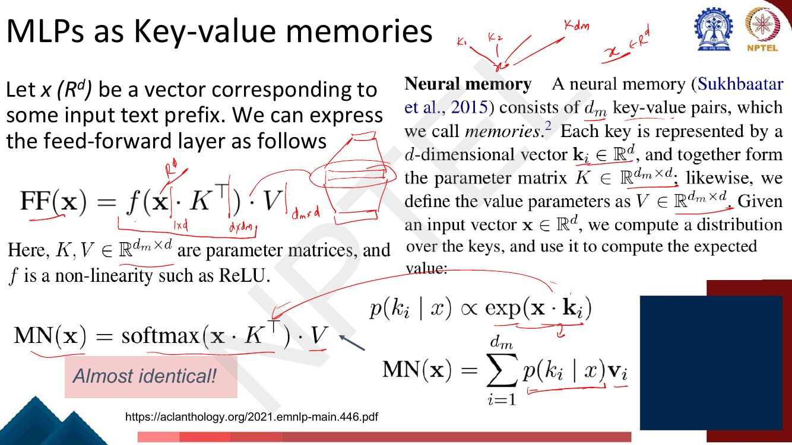
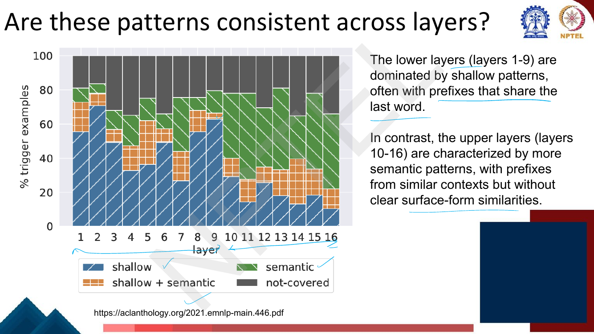
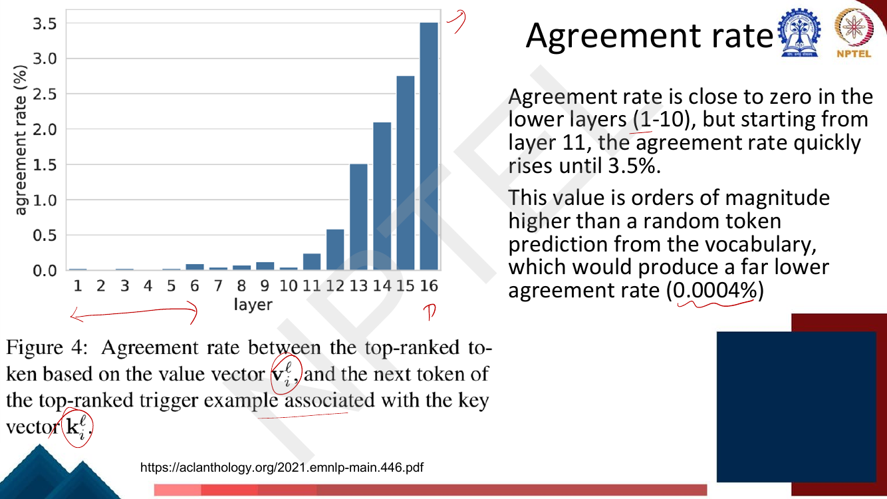
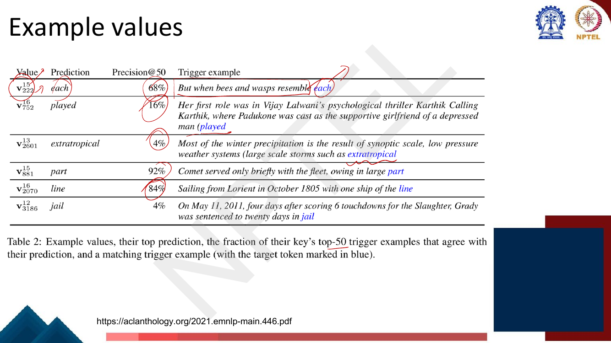
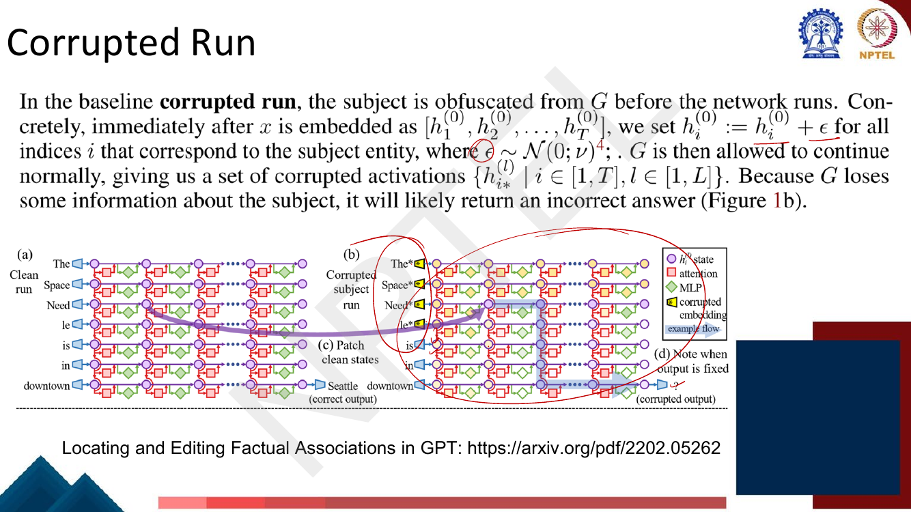

# Lec 58 — Interpretability III: FFN as Key-Value Memories and Causal Tracing

> **Source:** `Week12.pdf` pp. 47–77 · **Week 12** · **Playlist:** Lec 58
> **Prereqs:** [Lec 56 — Interpretability: Probing](56-interpretability-probing.md), [Lec 22 — Self-Attention and Multi-Head Attention](../week-05/22-self-attention-and-multihead.md)
> **Feeds into:** [Lec 60 — Machine Unlearning](60-machine-unlearning.md)

## Why this lecture exists

Probing ([Lec 56](56-interpretability-probing.md)) tells you that a property is *decodable* from a
representation. It cannot tell you that the model *uses* it. A probe is a correlation: you fit a
classifier on frozen activations and report its accuracy. If the accuracy is high, the information is
present — but it might be a side effect the network never reads.

This lecture takes the next step. Instead of reading the model, you **intervene** on it: you break a
part, or repair a part, and watch what happens to the output. That is a causal claim, and it is the
only kind of claim that supports editing. The lecture does this twice. First it reinterprets the
feed-forward sublayer — half of every Transformer's parameters, and the half nobody looked at — as a
**key-value memory**. Then it localises a single stored fact to a specific layer and token with
**causal tracing**. Both results are the machinery [Lec 60](60-machine-unlearning.md) needs: you
cannot remove a fact until you know where it lives.

## The ideas

### Where this sits: correlational vs causal interpretability

| | Probing ([Lec 56](56-interpretability-probing.md)) | This lecture |
|---|---|---|
| What you do | train a classifier on frozen activations | change an activation and re-run the model |
| What you learn | the property **is encoded** somewhere | the state **caused** the output |
| Failure mode | a powerful probe finds structure the model never uses | expensive; needs many forward passes |
| Supports editing? | no | yes — that is the point |

The deck opens by restating the **induction-head hypothesis** (p. 49): a head that, on seeing
`A B … A`, predicts `B`, via *prefix matching* then *copying*. That is attention-side mechanistic
interpretability and it is owned as the explanation of in-context learning by
[Lec 42](../week-09/42-why-icl-works.md) — one sentence is all it gets here. Neuron-level
multilingual analysis (LAPE, language-specific neurons) is
[Lec 57's](57-interpretability-multilingual.md). What is new in *this* lecture is the other sublayer
and the intervention method.

---

### Part 1 — Feed-forward layers are key-value memories

#### The reframing

Recall the Transformer block's feed-forward sublayer from
[Lec 22](../week-05/22-self-attention-and-multihead.md): two linear maps with a non-linearity between
them, applied independently at every position. Geva, Schuster, Berant and Levy (EMNLP 2021) write it,
dropping biases, as

$$\mathrm{FF}(\mathbf{x}) = f(\mathbf{x}\mathbf{K}^\top)\,\mathbf{V}$$

with $\mathbf{x} \in \mathbb{R}^{d}$ a single position's vector and
$\mathbf{K}, \mathbf{V} \in \mathbb{R}^{d_m \times d}$ the two parameter matrices
($\mathbf{K}$ is the first weight matrix, transposed; $\mathbf{V}$ is the second). $f$ is a
non-linearity such as ReLU ([Lec 52](../week-11/52-modern-llms-and-activations.md) owns the modern
activation catalogue; this layer's mechanism is [Lec 22's](../week-05/22-self-attention-and-multihead.md)).

Nothing has changed except the names. But the names are the insight:

- **Row $i$ of $\mathbf{K}$ is a key $\mathbf{k}_i \in \mathbb{R}^d$.** Computing
  $\mathbf{x}\cdot\mathbf{k}_i$ asks "how well does the input match pattern $i$?"
- **Row $i$ of $\mathbf{V}$ is a value $\mathbf{v}_i \in \mathbb{R}^d$** — what memory $i$ writes into
  the residual stream when it fires.
- $\mathbf{m} = f(\mathbf{x}\mathbf{K}^\top) \in \mathbb{R}^{d_m}$ — the hidden layer — is a vector of
  **memory coefficients**, one per memory. The deck is precise about its character: it holds an
  **unnormalized non-negative coefficient for each memory** (p. 53). Non-negative because ReLU clips;
  unnormalized because nothing divides by a sum.
- $d_m$ — the FFN's inner width, usually $4d$ — is therefore literally **the number of memories in
  the layer**.

The output is a **weighted sum of the values**, weighted by how strongly each key matched.


*Fig. — The whole claim in one picture. Memory 2 fires hardest (coefficient 1.5) on prefixes ending "… take a", "… once in a", "… and for a", and its value $\mathbf{v}_2$ puts probability on **while**. Memory $d_m$ is silent (coefficient 0) and contributes nothing. The deck shows this slide **twice**, at pages 51 and 54; page 51 adds the lecturer's hand-drawn shapes — keys $d_m \times d$ on the way up, values $d_m \times d$ on the way down. Page 54.*

#### Why this makes the FFN the same shape as attention

This is the part worth stating out loud, because the deck's own slide says it in two words. A **neural
memory** (Sukhbaatar et al., 2015) with $d_m$ key-value pairs computes

$$p(\mathbf{k}_i \mid \mathbf{x}) \propto \exp(\mathbf{x}\cdot\mathbf{k}_i), \qquad
\mathrm{MN}(\mathbf{x}) = \sum_{i=1}^{d_m} p(\mathbf{k}_i \mid \mathbf{x})\,\mathbf{v}_i
= \mathrm{softmax}(\mathbf{x}\mathbf{K}^\top)\,\mathbf{V}$$

Set that beside $\mathrm{FF}(\mathbf{x}) = f(\mathbf{x}\mathbf{K}^\top)\mathbf{V}$. The deck's verdict:
**"Almost identical!"** The *only* difference is the normalisation — softmax (a probability
distribution over memories) versus ReLU (unnormalized, non-negative coefficients).


*Fig. — The two equations differ in exactly one symbol: $f$ versus softmax. Note the shapes, which the exam can key on: $\mathbf{K}, \mathbf{V} \in \mathbb{R}^{d_m \times d}$, $\mathbf{x} \in \mathbb{R}^{d}$. Page 52.*

Now compare with self-attention from [Lec 22](../week-05/22-self-attention-and-multihead.md),
$\mathrm{Attn}(\mathbf{Q},\mathbf{K},\mathbf{V}) = \mathrm{softmax}(\mathbf{Q}\mathbf{K}^\top/\sqrt{d_k})\mathbf{V}$.
The *structure is the same*: score a query against a set of keys, turn the scores into weights, return
the weighted sum of the matching values. The difference is where $\mathbf{K}$ and $\mathbf{V}$ come
from:

| | Self-attention | FFN as memory |
|---|---|---|
| Query | $\mathbf{x}\mathbf{W}^Q$, from the input | $\mathbf{x}$ itself |
| Keys / values | **computed from other tokens** in this sequence | **fixed parameters**, learned at training time |
| Number of slots | $T$ (sequence length) | $d_m$ (FFN width) |
| Normalisation | softmax, scaled by $\sqrt{d_k}$ | ReLU, unnormalized |
| What it retrieves | context | memorised training-corpus patterns |

So a Transformer block is **two lookups in a row**: one over the current context, one over a static
store baked into the weights. That is why the FFN — which [Lec 22](../week-05/22-self-attention-and-multihead.md)
pins at exactly twice the attention sublayer's parameter count — is where facts end up.

#### The conjecture, and the four experiments that test it

The paper's conjecture, verbatim from page 53:

> each key vector $\mathbf{k}_i$ captures a particular pattern (or set of patterns) in the input
> sequence, and its corresponding value vector $\mathbf{v}_i$ represents the **distribution of tokens
> that follow said pattern**.

Two halves, tested separately.

**Experiment 1 — how to retrieve trigger examples (p. 56).** Fix a key $\mathbf{k}_i^{\ell}$ (memory
$i$ of layer $\ell$). For **every prefix of every sentence in the training set**, compute the memory
coefficient

$$m_i^{\ell}(x_1\ldots x_j) = \mathrm{ReLU}\!\left(\mathbf{x}_j^{\ell}\cdot\mathbf{k}_i^{\ell}\right)$$

where $\mathbf{x}_j^{\ell}$ is the layer-$\ell$ self-attention output at position $j$. The deck's
example: "I love dogs" yields **three** coefficients, for the prefixes "I", "I love", "I love dogs" —
prefixes, not tokens, because the representation at position $j$ has already absorbed everything to
its left. Then keep the **top-$t$** prefixes by inner product. Those are the key's **trigger
examples**.

Note what this is *not*: it is not a probe and not a gradient method. It is a plain ranking of real
training inputs by one scalar, which is why the result is so readable.

**Experiment 2 — pattern analysis (p. 57).** Human experts (NLP graduate students) annotate the
**top-25** prefixes retrieved for each key and (a) identify repetitive patterns occurring in **at
least 3** of the 25 — the threshold is chosen because three co-occurrences would be very unlikely
under random sentences — (b) describe each pattern, and (c) classify it as **shallow** (recurring
n-grams, surface form) or **semantic** (recurring topic, no surface similarity).


*Fig. — Read the superscript as the layer and the subscript as the memory index. Notice the trend already visible in five rows: the layer-1 key is pure surface ("ends with the word *substitutes*"), the layer-13 and layer-16 keys are topical ("ends with a time range", "TV shows") with no shared words at all. A key may be both — $\mathbf{k}^6_{2546}$ is shallow **and** semantic. Page 58.*

**Experiment 3 — are these patterns consistent across layers? (p. 59).** This is the chapter's single
most examinable empirical finding.


*Fig. — The crossover is between layer 9 and layer 10. The deck's wording: **lower layers (1–9) are dominated by shallow patterns, often with prefixes that share the last word**; **upper layers (10–16) are characterized by more semantic patterns, with prefixes from similar contexts but without clear surface-form similarities.** The grey "not-covered" band is the fraction of trigger examples no annotated pattern explains — it is never zero, so the story is a tendency, not a law. Page 59.*

This mirrors, from a completely different method, the depth story probing found in
[Lec 56](56-interpretability-probing.md): surface form low, meaning high. Two methods agreeing is
worth more than either alone.

**Experiment 4 — what about values? (p. 60).** Keys are only half the conjecture. To test whether
$\mathbf{v}_i^{\ell}$ really encodes "what comes next", cast each value as a distribution over the
vocabulary by pushing it through the output (un)embedding matrix $\mathbf{E}$:

$$\mathbf{p}_i^{\ell} = \mathrm{softmax}\!\left(\mathbf{v}_i^{\ell}\cdot \mathbf{E}\right)$$

(This is the same move as the logit lens — [Lec 56](56-interpretability-probing.md) owns it — applied
to a *parameter* rather than a hidden state.) Then, for every layer and memory $i$, compare the
**top-ranked token** of $\mathbf{p}_i^{\ell}$ with the **next token $w_i$** of that memory's **top-1
trigger example**. The fraction that match is the **agreement rate**.


*Fig. — Agreement is near zero in layers 1–10, then rises sharply from layer 11 to **3.5%** at layer 16. Compare the random baseline of **0.0004%** quoted on the slide — the upper layers beat chance by a factor of ~8,750. The number looks small in absolute terms; that is the honest reading of the result, and it is exactly why the deck prints the baseline next to it. Page 61.*

So the value half of the conjecture holds, but **only in the upper layers**. The lecture's own
interpretation: lower-layer values are not yet in a space the output embedding can read, so their
"next token" claim is not testable this way — not that it is false.


*Fig. — Precision@50 is the fraction of the **key's top-50 trigger examples** whose actual next token equals the value's top prediction. $\mathbf{v}^{15}_{881}$ predicts "part" and is right for 46 of 50 triggers; $\mathbf{v}^{13}_{2601}$ predicts "extratropical" and is right for 2. A single memory can be a near-deterministic rule or a weak hint. Page 62.*

#### What the reframing buys you

The FFN stops being "a nonlinearity for capacity" and becomes an **addressable store**. Each forward
pass is a soft lookup over $L \times d_m$ memories; whichever keys match the current prefix write
their values into the residual stream, additively, in proportion to the match. That is a mechanism you
can *point at* — and pointing is the prerequisite for the next half of the lecture, and for
[Lec 60](60-machine-unlearning.md).

---

### Part 2 — Causal mediation analysis (causal tracing)

#### The question

![Grid diagram: tokens "The Space Need le is in downtown" down the left, layers 1 to L across, each cell a hidden state h_i^(l) with an attention box and an MLP box feeding it; the final state emits "Seattle" and the slide notes we can measure P[o] = P[Seattle]](../../assets/pages/lec58/p-068.png)
*Fig. — The computation graph causal tracing operates on. Read it as a **grid**: rows are tokens (information flows downward through attention), columns are layers (information flows rightward through the residual stream). Every cell has **two** contributors — an attention module (red) and an MLP (green). The measured quantity is the probability the last token assigns to the object, $\mathbb{P}[o] = \mathbb{P}[\text{Seattle}]$. Page 68.*

Meng, Bau, Andonian and Belinkov (arXiv 2202.05262 — "ROME") ask: given that GPT reliably completes
*"The Space Needle is located in the city of ___"* with *"Seattle"*, **where in the model is that
association stored?**

They formalise a fact as a **knowledge tuple** $t = (s, r, o)$ — **subject**, **relation**, **object**.
The deck's example is $s =$ Edmund Neupert, $r =$ plays the instrument, $o =$ piano. To elicit the
fact you supply a natural-language prompt $p$ describing $(s, r)$ and read off the model's probability
of $o$. (Memorise the order: the tuple is written $(s, r, o)$ with the object last, even though the
*prompt* contains $s$ and $r$ and the *answer* is $o$.)

The internal computation of the autoregressive model $G$ is, per page 67,

$$\mathbf{h}_i^{(l)} = \mathbf{h}_i^{(l-1)} + \mathbf{a}_i^{(l)} + \mathbf{m}_i^{(l)}$$
$$\mathbf{a}_i^{(l)} = \mathrm{attn}^{(l)}\!\left(\mathbf{h}_1^{(l-1)}, \ldots, \mathbf{h}_i^{(l-1)}\right)$$
$$\mathbf{m}_i^{(l)} = \mathbf{W}_{proj}^{(l)}\,\sigma\!\left(\mathbf{W}_{fc}^{(l)}\,\gamma\!\left(\mathbf{a}_i^{(l)} + \mathbf{h}_i^{(l-1)}\right)\right)$$

Three things to extract. First, each layer contributes an **attention** term and an **MLP** term, and
they are **added** — so you can ask about each separately. Second, $\mathbf{m}_i^{(l)}$ is exactly the
key-value memory of Part 1 ($\mathbf{W}_{fc}$ holds the keys, $\mathbf{W}_{proj}$ the values), so the
two halves of this lecture are about the same object. Third, the attention term reads from *other
tokens* ($\mathbf{h}_1 \ldots \mathbf{h}_i$) while the MLP term reads only from *this token* — global
versus local. That asymmetry is what the final experiment exploits.

#### The three runs

This is the heart of the method. Learn it as three runs, in this order.

**1. Clean run.** Pass the factual prompt $x$ into $G$ and **collect every hidden activation**
$\{\mathbf{h}_i^{(l)} \mid i \in [1,T],\, l \in [1,L]\}$ — all $T \times L$ of them. The model
predicts $o$ correctly; record $\mathbb{P}[o]$. This is your reference recording.

**2. Corrupted run.** Immediately *after* embedding, add Gaussian noise to the embeddings of **the
subject tokens only**:

$$\mathbf{h}_i^{(0)} := \mathbf{h}_i^{(0)} + \boldsymbol{\epsilon}, \qquad
\boldsymbol{\epsilon} \sim \mathcal{N}(0; \nu), \quad i \in \text{subject indices}$$

Then let $G$ run normally, producing corrupted activations $\mathbf{h}_{i*}^{(l)}$. Because $G$ has
lost information about *who the subject is*, it will likely return the wrong answer; call the damaged
probability $\mathbb{P}_*[o]$. Two details that are exam-grade: the noise goes on the **embeddings**
(layer 0), not deeper, and it goes on the **subject tokens**, not the whole prompt — you want to
destroy the *fact lookup*, not the grammar.


*Fig. — The yellow markers on "The\*, Space\*, Need\*, le\*" are the corrupted subject-token embeddings; "is / in / downtown" are untouched. The output becomes "?" — the corrupted output. Note that the subject spans **four** tokens here, because "Needle" tokenises into "Need" + "le". Page 71.*

**3. Corrupted-with-restoration run.** Run the corrupted model again, *identically*, **except** at one
chosen token $\hat{i}$ and one chosen layer $\hat{l}$, where you **force** the state to be the clean
value $\mathbf{h}_{\hat{i}}^{(\hat{l})}$ recorded in run 1. Everything downstream then executes
without further intervention. Record $\mathbb{P}_{\text{restore}}[o]$.


*Fig. — Panel (c), "Patch clean states": one state is lifted out of the clean run (left) and pasted into the corrupted run (right). "Future computations execute without further intervention" is the load-bearing clause — you patch **once**, then let the model finish by itself. Page 72.*

The quantity of interest is the **indirect effect** of that one state:

$$\mathrm{IE}(\hat{i}, \hat{l}) = \mathbb{P}_{\text{restore}}[o] - \mathbb{P}_*[o]$$

averaged over many prompts to give the **Average Indirect Effect (AIE)**. If restoring one state
recovers the correct answer despite everything around it still being corrupted, that state **carries
the fact**. The deck writes the question on the slide as literally
$\mathbb{P}_{\text{restore}}[o] - \mathbb{P}_*[o]$.

Why this is a *causal* measurement and probing is not: you are not asking whether the fact is readable
from the state, you are asking whether the rest of the network's behaviour **changes** when you set
the state. Only the second question has an answer that implies "this is where to edit".

A short warning about what the word "corrupted" is doing. The corrupted run is the **baseline**, not
the thing being studied. Everything is measured as a *recovery from* it. If the corruption fails to
damage the prediction ($\mathbb{P}_* \approx \mathbb{P}_{\text{clean}}$) there is no gap left to
recover and every IE is ~0 — the experiment is void, not "the fact is nowhere".

#### What is the impact of restoration?


*Fig. — The single most important picture in the chapter, and it is purely visual. Averaged over **1000 prompts** on **GPT-2-XL**. Left: restoring any single hidden state. Two bright regions — an **early site** at the **last subject token** around layers 10–20, and a **late site** at the **last token** in the final layers. Middle (MLP modules only, in intervals of 10): the **early site survives**. Right (attention only): only the **late site** survives. AIE peaks around 0.15. Page 74.*

Read the three panels together and the division of labour falls out:

- **Early-layer MLPs at the last subject token** carry most of the causal effect. This is where the
  fact is *stored* — the key-value memory of Part 1, looked up by the subject.
- **Late-layer attention at the last token** carries the rest. This is not storage; it is
  **transport** — moving the already-retrieved object to the position that has to emit it.

The "last subject token" detail is not incidental and it is the most likely MCQ discriminator in this
lecture. In an autoregressive model the subject's representation is only complete at its **final**
token, because earlier subject tokens have not yet seen the rest of the name. So the lookup can only
happen there.

That localisation is the whole point. A fact that lives in identifiable weights at an identifiable
layer and position is a fact you can rewrite — which is what ROME does, and what
[Lec 60](60-machine-unlearning.md) builds on.

#### What if we sever the MLP after restoration?

A correlation remains possible: maybe the early site is bright only because the MLPs sit on the path
to the attention modules that do the real work. The paper settles it with an **ablation on the
computation graph**.


*Fig. — Severing means: after patching the clean state, **cut the MLP out of the downstream path** so it cannot propagate. Purple = unmodified, red = attention severed, green = MLP severed. At the early site (around layers 10–20) the purple peak is ≈8.7% and the green bars collapse to roughly half that, while the red bars track purple almost exactly. **The gap appears only when MLPs are severed.** The bracket labels (d) input / (e) mapping / (f) output split the depth into three regimes. Page 75.*

The deck's conclusion, verbatim: *comparing Average Indirect Effects with and without severing MLP
implicates the computation of **mid-layer MLP modules** in the causal effects. **No similar gap is
seen when attention is similarly severed.*** The MLPs are not on the path to the mechanism; they
**are** the mechanism.

#### Where this goes

Put the two halves together. The FFN is a key-value memory (Part 1). Causal tracing says a given fact
is mediated by a specific MLP, at a specific mid-range layer, at the last subject token (Part 2).
Therefore writing a *new* key-value pair into that one matrix — a rank-one update to
$\mathbf{W}_{proj}^{(l)}$, which is what the R in ROME stands for — should change that one fact and
leave the rest alone. Editing and removing facts is [Lec 60's](60-machine-unlearning.md); this chapter
stops at "we now know where to point".

## Worked numericals

The re-swept exercise table lists `Week12.pdf` **p. 56** for this lecture. **It is a false positive.**
Page 56 is the teaching slide *"How to retrieve trigger examples?"*; the sweep matched the phrase
"we compute the memory coefficient". All 31 pages of the range were opened and checked: **this deck
contains no exercise of any kind.** The numericals below are therefore all constructed, in the shapes
this material is examined in.

### N1. The FFN as a key-value lookup, computed by hand
**Given:** a feed-forward layer with $d = 3$ and $d_m = 2$ memories, ReLU activation, and

$$\mathbf{K} = \begin{bmatrix} 1 & 0 & -1 \\ 0 & 1 & 1 \end{bmatrix}, \qquad
\mathbf{V} = \begin{bmatrix} 2 & 0 & 0 \\ 0 & 3 & -1 \end{bmatrix}$$

so $\mathbf{k}_1 = (1,0,-1)$, $\mathbf{k}_2 = (0,1,1)$, $\mathbf{v}_1 = (2,0,0)$,
$\mathbf{v}_2 = (0,3,-1)$.
**Find:** $\mathrm{FF}(\mathbf{x}) = f(\mathbf{x}\mathbf{K}^\top)\mathbf{V}$ for
$\mathbf{x}_A = (2,1,-1)$ and $\mathbf{x}_B = (-1,2,1)$, and say which memory fires in each case.

1. **Key-match scores for $\mathbf{x}_A$.**
   $\mathbf{x}_A \cdot \mathbf{k}_1 = (2)(1) + (1)(0) + (-1)(-1) = 2 + 0 + 1 = 3$.
   $\mathbf{x}_A \cdot \mathbf{k}_2 = (2)(0) + (1)(1) + (-1)(1) = 0 + 1 - 1 = 0$.
2. **Activation.** $\mathbf{m}_A = \mathrm{ReLU}([3, 0]) = [3, 0]$. Memory 1 fires with coefficient 3;
   memory 2 is silent.
3. **Weighted sum of values.**
   $\mathrm{FF}(\mathbf{x}_A) = 3\,\mathbf{v}_1 + 0\,\mathbf{v}_2 = 3(2,0,0) = (6, 0, 0)$.
4. **Key-match scores for $\mathbf{x}_B$.**
   $\mathbf{x}_B \cdot \mathbf{k}_1 = (-1)(1) + (2)(0) + (1)(-1) = -1 + 0 - 1 = -2$.
   $\mathbf{x}_B \cdot \mathbf{k}_2 = (-1)(0) + (2)(1) + (1)(1) = 0 + 2 + 1 = 3$.
5. **Activation.** $\mathbf{m}_B = \mathrm{ReLU}([-2, 3]) = [0, 3]$ — ReLU has **deleted** the
   negative match entirely. Memory 2 fires.
6. $\mathrm{FF}(\mathbf{x}_B) = 0\,\mathbf{v}_1 + 3\,\mathbf{v}_2 = 3(0,3,-1) = (0, 9, -3)$.

**Answer:** $\mathrm{FF}(\mathbf{x}_A) = (6,0,0)$, driven entirely by memory 1;
$\mathrm{FF}(\mathbf{x}_B) = (0,9,-3)$, driven entirely by memory 2. **Two different inputs addressed
two different memories and wrote two completely different vectors into the residual stream** — which
is the key-value-memory claim, in four dot products.

### N2. The same layer with both memories firing, and the softmax contrast
**Given:** the $\mathbf{K}, \mathbf{V}$ of N1 and $\mathbf{x}_C = (2, 1, 0)$.
**Find:** $\mathrm{FF}(\mathbf{x}_C)$, then $\mathrm{MN}(\mathbf{x}_C) = \mathrm{softmax}(\mathbf{x}_C\mathbf{K}^\top)\mathbf{V}$, and compare.

1. Scores: $\mathbf{x}_C\cdot\mathbf{k}_1 = 2 + 0 + 0 = 2$; $\mathbf{x}_C\cdot\mathbf{k}_2 = 0 + 1 + 0 = 1$.
2. ReLU: $\mathbf{m}_C = [2, 1]$ — both positive, so both memories contribute, memory 1 twice as hard.
3. $\mathrm{FF}(\mathbf{x}_C) = 2(2,0,0) + 1(0,3,-1) = (4,0,0) + (0,3,-1) = (4, 3, -1)$.
4. Softmax version: $e^2 = 7.389056$, $e^1 = 2.718282$, sum $= 10.107338$.
5. $p_1 = 7.389056/10.107338 = 0.731059$; $p_2 = 2.718282/10.107338 = 0.268941$. (They sum to 1.)
6. $\mathrm{MN}(\mathbf{x}_C) = 0.731059(2,0,0) + 0.268941(0,3,-1)
   = (1.462117,\ 0.806823,\ -0.268941)$.
7. The **direction** is near-identical in spirit — memory 1 dominates in both — but the ReLU version's
   output has unbounded magnitude ($\|\mathbf{m}\|$ scales with the match strength) while the softmax
   version's coefficients always sum to 1.

**Answer:** $\mathrm{FF}(\mathbf{x}_C) = (4, 3, -1)$;
$\mathrm{MN}(\mathbf{x}_C) = (1.4621, 0.8068, -0.2689)$. The *only* difference between a Transformer
FFN and a classical neural memory is this normalisation — "almost identical", page 52.

### N3. Causal tracing: indirect effect of each restoration
**Given:** for one factual prompt, the clean run gives $\mathbb{P}_{\text{clean}}[o] = 0.68$ and the
corrupted run gives $\mathbb{P}_*[o] = 0.04$. Restoring the hidden state at the **last subject token**
at five different layers gives:

| Restored layer | 5 | 10 | 15 | 20 | 35 |
|---|---|---|---|---|---|
| $\mathbb{P}_{\text{restore}}[o]$ | 0.09 | 0.21 | 0.52 | 0.30 | 0.07 |

**Find:** each restoration's indirect effect, each as a fraction of the clean–corrupted gap, and the
layer carrying the fact.

1. **The gap.** $\mathbb{P}_{\text{clean}} - \mathbb{P}_* = 0.68 - 0.04 = 0.64$. This is the total
   damage the corruption did, and the most any single restoration could undo.
2. $\mathrm{IE}(5) = 0.09 - 0.04 = 0.05$; as a fraction, $0.05/0.64 = 0.078125 = 7.8\%$.
3. $\mathrm{IE}(10) = 0.21 - 0.04 = 0.17$; $\;0.17/0.64 = 0.265625 = 26.6\%$.
4. $\mathrm{IE}(15) = 0.52 - 0.04 = 0.48$; $\;0.48/0.64 = 0.75 = 75.0\%$.
5. $\mathrm{IE}(20) = 0.30 - 0.04 = 0.26$; $\;0.26/0.64 = 0.40625 = 40.6\%$.
6. $\mathrm{IE}(35) = 0.07 - 0.04 = 0.03$; $\;0.03/0.64 = 0.046875 = 4.7\%$.
7. The profile rises to a peak and falls — a single **early-to-mid site**, not a plateau.

**Answer:** the peak is at **layer 15**, with $\mathrm{IE} = 0.48$, recovering **75%** of the
clean–corrupted gap. The fact is mediated there. Note that **you must subtract $\mathbb{P}_*$, not
$\mathbb{P}_{\text{clean}}$** — the indirect effect is a recovery above the corrupted baseline, and
subtracting the wrong reference is the standard way to get this question wrong.

### N4. How many runs does a full causal trace cost?
**Given:** GPT-2-XL, $L = 48$ layers. The prompt "The Space Needle is in downtown" tokenises to
$T = 7$ tokens (`The`, `Space`, `Need`, `le`, `is`, `in`, `downtown`). The paper produces **three**
maps per prompt — all hidden states, MLP-only, attention-only — and averages over **1000** prompts.
**Find:** the number of restoration runs.

1. One map requires patching **every (token, layer) cell** once: $T \times L = 7 \times 48 = 336$
   restoration runs.
2. Three maps: $3 \times 336 = 1008$ restoration runs per prompt.
3. Add the two baselines (one clean, one corrupted): $1008 + 2 = 1010$ forward passes per prompt.
4. Over 1000 prompts: $1008 \times 1000 = 1{,}008{,}000$ restoration runs, or $1{,}010{,}000$ forward
   passes in total.
5. Scaling: the cost is $\Theta(T \cdot L)$ **per prompt per map**. Doubling the context length or the
   depth doubles it; both together quadruple it.

**Answer:** ≈**1.01 million forward passes**. This is why causal tracing is a research instrument and
not something you run per query — and why the heatmaps on page 74 are averaged over a fixed 1000-prompt
set rather than computed on demand. (The real paper is more expensive still: it averages over several
noise draws $\boldsymbol{\epsilon}$ per corrupted run.)

### N5. The agreement-rate arithmetic
**Given:** page 61 — the top-layer agreement rate is **3.5%** and a random next-token prediction would
agree **0.0004%** of the time. The analysed LM has $L = 16$ layers and $d_m = 4096$ memories per layer.
**Find:** the improvement factor, the vocabulary size the baseline implies, and how many layer-16
memories agree.

1. **Improvement factor.** $3.5 / 0.0004 = 8750$. The deck's phrase "orders of magnitude higher" is
   $\log_{10} 8750 \approx 3.94$ — almost exactly **four** orders of magnitude.
2. **Implied vocabulary.** A random guess agrees with probability $1/|V|$, so
   $0.0004\% = 0.000004 = 1/|V|$, giving $|V| = 1/0.000004 = 250{,}000$. That is the right order for
   a word-level WikiText-103 vocabulary, so the baseline is internally consistent.
3. **Agreeing memories in layer 16.** $3.5\% \times 4096 = 0.035 \times 4096 = 143.36 \approx
   \mathbf{143}$ memories.
4. **Under chance.** $0.000004 \times 4096 = 0.0164$ memories — i.e. you would expect roughly **one
   agreeing memory per 61 layers** by luck.
5. **Across the whole model**, total memories $= 16 \times 4096 = 65{,}536$; since layers 1–10
   contribute ≈0, essentially all agreements come from the top six layers.

**Answer:** ≈**8,750×** chance; implied $|V| = 250{,}000$; ≈**143** of layer 16's 4,096 memories have
a top value-token matching their key's top trigger's next word. The honest reading: 3.5% is a *small*
absolute number, so values encode next-token distributions **weakly and only in upper layers** — the
conjecture is supported, not proved.

### N6. FFN memory capacity of a real model
**Given:** a Transformer with $N$ layers, model dimension $d$, and the standard $d_{ff} = d_m = 4d$.
**Find:** the number of key-value memories and the FFN parameter count, for GPT-2-XL ($d = 1600$,
$N = 48$).

1. **Memories per layer** $= d_m = 4d = 4 \times 1600 = 6400$.
2. **Total memories** $= N \times 4d = 48 \times 6400 = \mathbf{307{,}200}$ key-value pairs.
3. **Parameters.** $\mathbf{K}$ and $\mathbf{V}$ are each $d_m \times d = 6400 \times 1600 =
   10{,}240{,}000$ weights, so $2 \times 10{,}240{,}000 = 20{,}480{,}000 = 8d^2$ per layer.
4. Over 48 layers: $48 \times 20{,}480{,}000 = \mathbf{983{,}040{,}000} \approx 0.98$B weights.
5. **As a share.** GPT-2-XL has $\approx 1.558$B parameters, so the key-value store is
   $983{,}040{,}000 / 1{,}557{,}611{,}200 = 63.1\%$ of the model.
6. **Cross-check with [Lec 22](../week-05/22-self-attention-and-multihead.md):** the attention
   sublayer is $4d^2$ per block and the FFN $8d^2$ — exactly $2\times$, as that chapter pins.

**Answer:** **307,200 memories**, **983,040,000 FFN weights**, **≈63%** of GPT-2-XL. The general
formula to carry into the exam: **memories $= 4dN$**, **FFN weights $= 8d^2N$**. This is the quantitative
form of "the FFN is where the model's knowledge sits — most of the parameters are a lookup table".

## Code

```python
import numpy as np
np.set_printoptions(precision=4, suppress=True)

# ---------- 1. The FFN as a key-value memory --------------------------------
# d = 3 model dimension, d_m = 2 memories.  Geva et al.'s layout:
#   K, V in R^{d_m x d}  -- row i is key k_i / value v_i
K = np.array([[ 1., 0., -1.],      # k_1
              [ 0., 1.,  1.]])     # k_2
V = np.array([[ 2., 0.,  0.],      # v_1  (what memory 1 writes)
              [ 0., 3., -1.]])     # v_2  (what memory 2 writes)

def ff(x):                    # FF(x) = f(x . K^T) . V ,  f = ReLU
    scores = x @ K.T          # raw key-match scores
    m = np.maximum(scores, 0) # memory coefficients: unnormalised, non-negative
    return scores, m, m @ V

def mn(x):                    # MN(x) = softmax(x . K^T) . V  -- "almost identical"
    s = x @ K.T
    p = np.exp(s - s.max()); p /= p.sum()
    return p, p @ V

for x in (np.array([2., 1., -1.]), np.array([-1., 2., 1.]), np.array([2., 1., 0.])):
    s, m, out = ff(x)
    print(f"x={x}  scores={s}  ReLU m={m}  FF(x)={out}")
print()
p, out = mn(np.array([2., 1., 0.]))
print(f"softmax coefficients {p}   MN(x) = {out}")

# ---------- 2. FFN memory capacity ------------------------------------------
print("\nmemories and FFN parameters, d_ff = 4d")
for name, d, L in [("GPT-2 small", 768, 12), ("GPT-2 XL", 1600, 48), ("Geva et al. LM", 1024, 16)]:
    d_ff = 4 * d
    print(f"  {name:15s} d={d:5d} L={L:3d}  memories/layer={d_ff:5d} "
          f" total={L*d_ff:7d}  FFN params={2*L*d*d_ff:,}")

# ---------- 3. Causal tracing: indirect effect of each restoration ----------
P_clean, P_corr = 0.68, 0.04
gap = P_clean - P_corr
restored = {5: 0.09, 10: 0.21, 15: 0.52, 20: 0.30, 35: 0.07}
print(f"\nclean P[o]={P_clean}  corrupted P[o]={P_corr}  gap={gap:.2f}")
best = None
for layer, p in sorted(restored.items()):
    ie = p - P_corr
    frac = ie / gap
    print(f"  restore layer {layer:2d}: P={p:.2f}  IE={ie:.2f}  "
          f"recovers {frac*100:5.1f}% of the gap")
    if best is None or ie > best[1]:
        best = (layer, ie)
print(f"  -> the fact localises at layer {best[0]} (IE = {best[1]:.2f})")

# ---------- 4. Cost of a full causal trace ----------------------------------
T, L, maps, prompts = 7, 48, 3, 1000
per_prompt = T * L * maps
print(f"\nT={T} tokens x L={L} layers x {maps} maps = {per_prompt} restoration runs/prompt")
print(f"  + 1 clean + 1 corrupted = {per_prompt + 2} forward passes/prompt")
print(f"  over {prompts} prompts: {per_prompt * prompts:,} restoration runs")
```

Printed output:

```
x=[ 2.  1. -1.]  scores=[3. 0.]  ReLU m=[3. 0.]  FF(x)=[6. 0. 0.]
x=[-1.  2.  1.]  scores=[-2.  3.]  ReLU m=[0. 3.]  FF(x)=[ 0.  9. -3.]
x=[2. 1. 0.]  scores=[2. 1.]  ReLU m=[2. 1.]  FF(x)=[ 4.  3. -1.]

softmax coefficients [0.7311 0.2689]   MN(x) = [ 1.4621  0.8068 -0.2689]

memories and FFN parameters, d_ff = 4d
  GPT-2 small     d=  768 L= 12  memories/layer= 3072  total=  36864  FFN params=56,623,104
  GPT-2 XL        d= 1600 L= 48  memories/layer= 6400  total= 307200  FFN params=983,040,000
  Geva et al. LM  d= 1024 L= 16  memories/layer= 4096  total=  65536  FFN params=134,217,728

clean P[o]=0.68  corrupted P[o]=0.04  gap=0.64
  restore layer  5: P=0.09  IE=0.05  recovers   7.8% of the gap
  restore layer 10: P=0.21  IE=0.17  recovers  26.6% of the gap
  restore layer 15: P=0.52  IE=0.48  recovers  75.0% of the gap
  restore layer 20: P=0.30  IE=0.26  recovers  40.6% of the gap
  restore layer 35: P=0.07  IE=0.03  recovers   4.7% of the gap
  -> the fact localises at layer 15 (IE = 0.48)

T=7 tokens x L=48 layers x 3 maps = 1008 restoration runs/prompt
  + 1 clean + 1 corrupted = 1010 forward passes/prompt
  over 1000 prompts: 1,008,000 restoration runs
```

Blocks 1, 3 and 4 reproduce N1/N2, N3 and N4 exactly. Block 2 confirms N6's 307,200 memories and
983,040,000 FFN weights for GPT-2-XL. Two things are worth noticing in the first block: ReLU turned
the score $-2$ into a coefficient of exactly 0, so a *negatively* matching key contributes **nothing**
— the memory is addressable only by positive match; and the softmax coefficients sum to 1 while the
ReLU coefficients do not, which is the entire difference between $\mathrm{FF}$ and $\mathrm{MN}$.

## Exam pack

### Must-memorise

| Item | Exactly this |
|---|---|
| FFN as memory | $\mathrm{FF}(\mathbf{x}) = f(\mathbf{x}\mathbf{K}^\top)\,\mathbf{V}$, $f$ = ReLU |
| Shapes | $\mathbf{K}, \mathbf{V} \in \mathbb{R}^{d_m \times d}$; $\mathbf{x} \in \mathbb{R}^{d}$; row $i$ = $\mathbf{k}_i$ / $\mathbf{v}_i$ |
| Neural memory | $\mathrm{MN}(\mathbf{x}) = \mathrm{softmax}(\mathbf{x}\mathbf{K}^\top)\mathbf{V} = \sum_i p(\mathbf{k}_i\mid \mathbf{x})\mathbf{v}_i$ — "almost identical" |
| The one difference | softmax (normalised) vs ReLU (**unnormalized, non-negative**) |
| Memory coefficient | $m_i = f(\mathbf{x}\cdot\mathbf{k}_i)$; $d_m$ = **number of memories in the layer** |
| The conjecture | $\mathbf{k}_i$ captures a **pattern** in the input; $\mathbf{v}_i$ is the **distribution of tokens that follow** that pattern |
| Trigger example | a training **prefix** $x_1\ldots x_j$ with the highest memory coefficient for $\mathbf{k}_i^{\ell}$ |
| Layer trend (keys) | layers **1–9 shallow** (surface n-grams, shared last word); layers **10–16 semantic** (shared topic, no surface similarity) |
| Values as distributions | $\mathbf{p}_i^{\ell} = \mathrm{softmax}(\mathbf{v}_i^{\ell}\cdot \mathbf{E})$ |
| Fact tuple | $t = (s, r, o)$ — subject, relation, object |
| Residual update | $\mathbf{h}_i^{(l)} = \mathbf{h}_i^{(l-1)} + \mathbf{a}_i^{(l)} + \mathbf{m}_i^{(l)}$ |
| MLP term | $\mathbf{m}_i^{(l)} = \mathbf{W}_{proj}^{(l)}\sigma(\mathbf{W}_{fc}^{(l)}\gamma(\mathbf{a}_i^{(l)}+\mathbf{h}_i^{(l-1)}))$ |
| The three runs | **clean** (record all states) → **corrupted** (noise on subject-token *embeddings*) → **corrupted-with-restoration** (patch **one** clean state) |
| Corruption | $\mathbf{h}_i^{(0)} := \mathbf{h}_i^{(0)} + \boldsymbol{\epsilon}$, $\boldsymbol{\epsilon}\sim\mathcal{N}(0;\nu)$, **subject indices only**, **layer 0** |
| Indirect effect | $\mathbb{P}_{\text{restore}}[o] - \mathbb{P}_*[o]$; averaged = **AIE** |
| The result | **early-site MLP at the LAST SUBJECT TOKEN** stores the fact; **late-site attention at the last token** transports it |
| Severing ablation | severing **MLP** after restoration kills the early-site effect; severing **attention** does not |
| Why it matters | correlational probing cannot support editing; a causal localisation can |

### Numbers worth knowing

| Quantity | Value |
|---|---|
| Geva et al. venue / year | EMNLP **2021**, `2021.emnlp-main.446` |
| ROME paper | Meng, Bau, Andonian, Belinkov — arXiv **2202.05262**, `rome.baulab.info` |
| Analysed LM in Part 1 | **16** layers |
| Shallow / semantic split | layers **1–9** shallow · layers **10–16** semantic |
| Prefixes annotated per key | top-**25** |
| Pattern threshold | occurs in at least **3** of the 25 prefixes |
| Agreement rate at layer 16 | **3.5%** |
| Agreement rate, layers 1–10 | ≈ **0** |
| Agreement rate rises from | layer **11** |
| Random-prediction baseline | **0.0004%** (≈8,750× worse) |
| Precision@50 examples | $\mathbf{v}^{15}_{881}$ "part" **92%** · $\mathbf{v}^{16}_{2070}$ "line" **84%** · $\mathbf{v}^{15}_{222}$ "each" **68%** · $\mathbf{v}^{16}_{752}$ "played" **16%** · $\mathbf{v}^{13}_{2601}$ "extratropical" **4%** · $\mathbf{v}^{12}_{3186}$ "jail" **4%** |
| Causal tracing model | **GPT-2-XL** (48 layers) |
| Prompts averaged | **1000** |
| Peak AIE (single hidden state) | ≈ **0.15** |
| Peak AIE at early site (severing chart) | ≈ **8.7%**, halved to ≈4% with MLP severed |
| Deck's running examples | "The Space Needle is in downtown ___" → Seattle; (Edmund Neupert, plays the instrument, piano); Miles Davis → trumpet; Paganini → violin; Hendrix → guitar |
| Example key patterns | $\mathbf{k}^1_{449}$ ends with "substitutes" (shallow) · $\mathbf{k}^{10}_{2997}$ "part of" relation (semantic) · $\mathbf{k}^{16}_{1935}$ TV shows (semantic) |
| GPT-2-XL memories / FFN weights | **307,200** / **983,040,000** (≈63% of the model) |

### Likely MCQ traps

- **"The keys are the first matrix's *columns*."** In the deck's layout
  $\mathbf{K} \in \mathbb{R}^{d_m \times d}$ and keys are its **rows** — each $\mathbf{k}_i$ is
  $d$-dimensional so it can be dotted with $\mathbf{x}$. The expression is
  $\mathbf{x}\mathbf{K}^\top$, with the transpose.
- **"$\mathbf{V}$ is the first matrix."** No. The **first** weight matrix supplies the keys
  (pattern-matching the input); the **second** supplies the values (written to the output).
- **"The memory coefficients are a probability distribution."** They are **unnormalized** and
  non-negative. Only the *idealised* neural memory $\mathrm{MN}$ uses softmax; the real FFN uses ReLU
  and the coefficients do not sum to anything in particular.
- **"The FFN is nothing like attention."** Structurally it is the same lookup. The discriminating fact
  is that attention's keys and values are **computed from the input sequence** while the FFN's are
  **fixed parameters**.
- **Inverting the layer trend.** **Lower** layers = shallow/surface; **upper** layers = semantic. The
  agreement rate follows the same direction (near zero below layer 11, 3.5% at 16). An option saying
  "upper layers capture n-grams" is wrong.
- **"3.5% agreement is a weak result, so values don't encode next tokens."** Compare it with the
  **0.0004%** baseline the slide prints beside it. The absolute number is small; the ratio is ~8,750.
- **Confusing trigger examples with tokens.** A trigger example is a **prefix** ($x_1\ldots x_j$), not
  a single token. "I love dogs" yields **three** of them.
- **"Corruption adds noise to the whole prompt."** Only the **subject** tokens, and only at the
  **embedding** layer (layer 0). Corrupting the relation words would destroy the question, not the
  lookup.
- **"The restoration run patches the clean state at every layer."** **One** state, one token, one
  layer, per run — that is why it localises, and why it costs $T \times L$ runs.
- **"The indirect effect is $\mathbb{P}_{\text{clean}} - \mathbb{P}_{\text{restore}}$."** It is
  $\mathbb{P}_{\text{restore}} - \mathbb{P}_*$ — recovery **above the corrupted baseline**. Sign and
  reference both matter.
- **"The fact lives at the first subject token."** The **last** subject token. An autoregressive
  model's subject representation is only complete once the whole name has been read.
- **"The late site is where the fact is stored."** The late site (last token, final layers, attention)
  **transports** the already-retrieved answer. Storage is the early-site **MLP**.
- **"Severing attention and severing the MLP both reduce the effect."** The deck says explicitly: **no
  similar gap** when attention is severed. The asymmetry is the whole experiment.
- **"Causal tracing and probing both establish causality."** Probing
  ([Lec 56](56-interpretability-probing.md)) is **correlational**. Only intervention is causal.

### Self-test

1. Write $\mathrm{FF}(\mathbf{x})$ in the key-value form and name the shape of $\mathbf{K}$.
2. What is the single mathematical difference between a Transformer FFN and a classical neural memory?
3. With $d = 4$, $\mathbf{k}_1 = (1,1,0,0)$, $\mathbf{k}_2 = (0,0,1,-1)$, $\mathbf{v}_1 = (1,0)$,
   $\mathbf{v}_2 = (0,2)$ and $\mathbf{x} = (2,1,1,3)$, compute $\mathrm{FF}(\mathbf{x})$ with ReLU.
4. For the sentence "The cat sat", how many memory coefficients does the retrieval procedure compute
   for one key, and what are they computed over?
5. Which layers of the analysed 16-layer LM are dominated by shallow patterns, and what surface cue do
   those prefixes typically share?
6. State the three runs of causal mediation analysis, in order, in one sentence each.
7. Where exactly is the noise added in the corrupted run — which tokens, and at which layer?
8. Clean $\mathbb{P}[o] = 0.80$, corrupted $= 0.10$, restoring layer 12 gives 0.59. What fraction of
   the gap does layer 12 recover?
9. Which component carries the early site and which carries the late site, and at which token position
   each?
10. Why does severing the MLP after restoration, but not severing attention, reduce the measured
    causal effect?
11. How many restoration runs does one $T$-token, $L$-layer hidden-state map require, and why does
    that make the method expensive?
12. In one sentence, why does Lec 60's unlearning need this lecture's result?

<details><summary>Answers</summary>

1. $\mathrm{FF}(\mathbf{x}) = f(\mathbf{x}\mathbf{K}^\top)\mathbf{V}$ with
   $\mathbf{K} \in \mathbb{R}^{d_m \times d}$ (rows are keys, $d_m$ = number of memories = FFN width).
2. The normalisation of the coefficients: the neural memory applies **softmax** (coefficients sum to
   1), the FFN applies **ReLU** (unnormalized, non-negative). Everything else is the same.
3. $\mathbf{x}\cdot\mathbf{k}_1 = 2+1+0+0 = 3$; $\mathbf{x}\cdot\mathbf{k}_2 = 0+0+1-3 = -2 \to 0$
   after ReLU. $\mathrm{FF}(\mathbf{x}) = 3(1,0) + 0(0,2) = (3, 0)$.
4. **Three**, one for each prefix: "The", "The cat", "The cat sat". They are computed over *prefixes
   of training sentences*, not individual tokens.
5. Layers **1–9**. The prefixes typically **share the last word** (surface n-gram overlap).
6. **Clean run:** run the factual prompt normally and record every hidden state $\mathbf{h}_i^{(l)}$.
   **Corrupted run:** add Gaussian noise to the subject tokens' embeddings and run on, damaging the
   prediction. **Corrupted-with-restoration run:** rerun corrupted but force one chosen state back to
   its clean value and see how much of the correct answer returns.
7. On the **subject tokens only**, at the **embedding layer** ($\mathbf{h}_i^{(0)}$), as
   $\boldsymbol{\epsilon}\sim\mathcal{N}(0;\nu)$.
8. Gap $= 0.80 - 0.10 = 0.70$; $\mathrm{IE} = 0.59 - 0.10 = 0.49$; $0.49/0.70 = 0.70 = \mathbf{70\%}$.
9. Early site: an **MLP**, early-to-mid layers, at the **last subject token**. Late site:
   **attention**, final layers, at the **last token** of the prompt.
10. Because the mid-layer MLPs *are* the mechanism carrying the restored fact forward, not merely a
    path to it. Cutting them removes the effect; cutting attention leaves it intact, so attention is
    not doing the storing.
11. $T \times L$ runs — one patch per (token, layer) cell — plus the clean and corrupted baselines,
    repeated for the MLP-only and attention-only maps and averaged over many prompts. For GPT-2-XL on
    a 7-token prompt that is 336 per map, ≈1 million restoration runs over 1000 prompts.
12. Because you cannot remove or rewrite a fact until you know **which weights, at which layer and
    token, cause it** — and causal tracing is what supplies that address.

</details>

## Beyond the slides

**Gap:** The deck never says what ROME actually *does* with the localisation — it stops at the
heatmaps, despite the paper's title promising "**and Editing**".
**Why it matters:** The payoff is a **rank-one update** to the located MLP's second matrix
$\mathbf{W}_{proj}^{(l)}$ (hence "Rank-One Model Editing"), chosen to make the subject's key retrieve a
new value. Knowing this closes the loop on why Part 1 and Part 2 are in the same lecture: the key-value
reframing tells you *what shape* the edit must take, and causal tracing tells you *where* to apply it.
[Lec 60](60-machine-unlearning.md) picks this up.

**Gap:** Causal tracing is presented as if it unambiguously finds "where the fact is stored", with no
mention of its known limitations.
**Why it matters:** A 2023 follow-up (Hase et al., "Does localization inform editing?") showed that
**the layer causal tracing identifies is not necessarily the best layer to edit** — you can edit
successfully at layers tracing says are unimportant. The honest summary is that tracing localises
*where the fact is retrieved during this forward pass*, which is related to but not identical with
*where it is stored in the weights*. Worth one line if a question asks what the method does not prove.

**Gap:** The pattern-analysis experiment's statistical weakness is never named.
**Why it matters:** The annotators saw the **top-25** prefixes — the most extreme tail of the
coefficient distribution — and needed only **3** of 25 to declare a pattern. That is a low bar, and the
grey "not-covered" band on page 59 (often 20–35%) shows the method frequently fails. The key-value
story is a well-supported *tendency*, not a clean decomposition, and an exam answer that says "every
key corresponds to exactly one human-readable pattern" overstates the deck.

**Gap:** Modern LLMs do not use the two-matrix ReLU FFN this analysis assumes.
**Why it matters:** LLaMA-style models use a **gated** FFN (SwiGLU) with **three** matrices — see
[Lec 52](../week-11/52-modern-llms-and-activations.md). The key-value picture survives with the gate
and the up-projection jointly forming the "key" computation, but the clean
$\mathrm{FF} = f(\mathbf{x}\mathbf{K}^\top)\mathbf{V}$ identity no longer holds literally. If a
question gives you a three-matrix FFN, the memory count is still the inner width $d_{ff}$, but the
parameter count is $3 d d_{ff}$, not $2 d d_{ff}$.

**Gap:** Nothing is said about **polysemantic** memories — one key firing on several unrelated patterns.
**Why it matters:** The deck's own table hints at it ($\mathbf{k}^6_{2546}$ is labelled "shallow +
semantic") and the paper's conjecture hedges with "a particular pattern **(or set of patterns)**". The
reason $d_m$ memories can store more than $d_m$ concepts is superposition, and it is why single-neuron
interpretations are fragile — the same caveat that applies to
[Lec 57's](57-interpretability-multilingual.md) language-specific neurons.

## Cut from the slides

Dropped the title page (47), the concepts-covered page (48), the two paper title-cards (50, 63), the
references page (76) and the thank-you page (77) — six of the thirty-one pages carry no teaching
content. Page 49 restates the **induction-head hypothesis** with the "She owns vintage cars … He
dreams of owning vintage ___" figure; that is
[Lec 42's](../week-09/42-why-icl-works.md) as the mechanistic account of in-context learning, so it
gets the one sentence the ownership map allows and no more. Pages 51 and 54 are the **same slide
shown twice** (page 51 carries the lecturer's extra hand-drawn shape annotations for $\mathbf{K}$ and
$\mathbf{V}$); embedded once, with the duplication noted. Pages 70, 71 and 72 share **one** three-panel
ROME figure with different text above it, so the figure is embedded twice (corrupted, restoration) and
the clean run's text is given in prose rather than re-showing the identical picture. Page 67's
equations are transcribed into LaTeX rather than screenshotted. The FFN's *standard* definition and
the Transformer block are [Lec 22's](../week-05/22-self-attention-and-multihead.md) and are referenced,
not re-derived; the logit-lens machinery reused on page 60 is
[Lec 56's](56-interpretability-probing.md); ROME's actual editing algorithm is deliberately left to
[Lec 60](60-machine-unlearning.md). Nothing on the key-value conjecture, its four experiments, the
three runs, the AIE result or the severing ablation was dropped.
