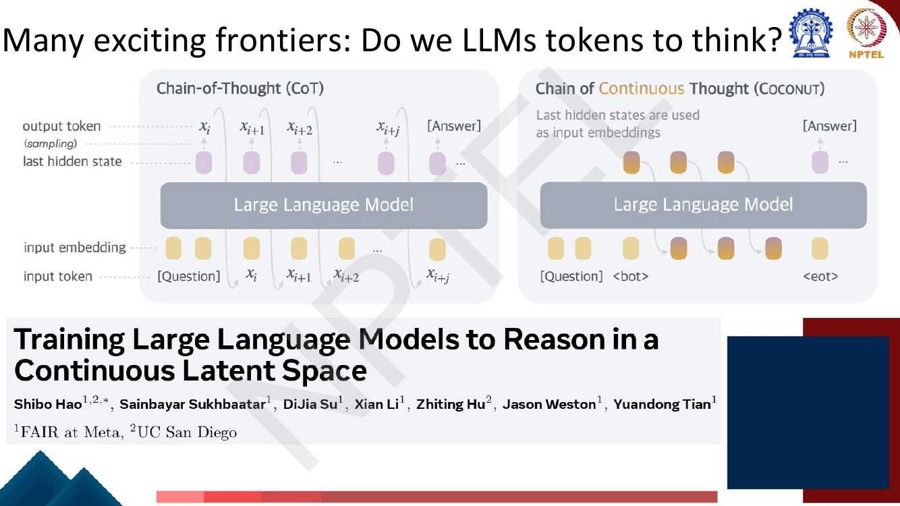

# Lec 60 — Trustworthy LLMs: Machine Unlearning

> **Source:** `Week12.pdf` pp. 102–131 · **Week 12** · **Playlist:** Lec 60
> **Prereqs:** [Lec 59 — Trustworthy LLMs: Taxonomy](59-trustworthy-llms-taxonomy.md), [Lec 39 — RLHF II: PPO](../week-08/39-rlhf-2-ppo.md)
> **Feeds into:** none — this is the final lecture of the course.

## Why this lecture exists

[Lec 59](59-trustworthy-llms-taxonomy.md) catalogued what can go wrong with a deployed LLM and named
unlearning as one of the repairs. It did not say how to do it. That is this lecture.

The problem is sharp. A model has memorised something it must not have — a copyrighted novel, a
person's private data, a recipe for harm. Retraining from scratch without that data is the only
guaranteed fix, and for a 7B model it costs roughly 184,000 GPU-hours. Unlearning asks whether you
can instead *edit* the trained model: run a few thousand gradient steps that remove the target
behaviour while leaving everything else intact. The lecture's answer is a single method built in
three attempts, each one a repair for a failure of the last, and the failures are the examinable
part. It closes the course, so the final pages step back to survey what comes next.

## The ideas

### What "success" means: the four goals

The deck opens with four criteria. Memorise all four — they are the natural MCQ.

| Goal | What it demands |
|---|---|
| **Unlearn effectiveness** | the model actually forgets the data with issues. *"Evaluation will be context-dependent"* — there is no single metric |
| **Utility preservation** | performance on "normal" tasks is preserved |
| **Generalization** | forgetting transfers to **other unseen but relevant questions**, not just the exact strings you trained on |
| **Low cost** | **no retraining** |

The first clause is easy. Any procedure that smashes the weights will stop the model reciting Harry
Potter. The second clause is the entire difficulty: you must destroy one specific behaviour inside a
set of parameters that encodes every behaviour the model has, with no mechanism that isolates them.
Every failure in this lecture is a failure of goal 2, not goal 1.

Goal 3 is the one students skip. If you unlearn the literal prompt *"How do I make a bomb?"* and the
model still answers *"What household chemicals combine dangerously?"*, you have learned a string, not
unlearned a capability. The deck reports both an **unlearned** (seen during unlearning) and an
**unseen** evaluation split for exactly this reason.

### First trial: gradient ascent

Training does gradient **descent** on the loss for data you want learned. So for data you want
forgotten, flip the sign and do gradient **ascent**:

$$\theta_{t+1} \leftarrow \theta_t \;{+}\; \eta \, \nabla_{\theta_t} \ell\big(h_\theta(x), y\big)$$

(the deck writes the learning rate $\lambda$; this book writes $\eta$ — [Lec 10](../week-02/10-gradient-descent-and-init.md)).
The deck boxes the `+` in red, because that plus sign *is* the method. In its words: **"revert the
change during gradient descent on forgetting samples."**


*Fig. — The arrow is the mechanism: ascent pushes mass off the harmful tokens, but the slide already shows where it lands — on `[whitespace]`, not on "sorry". Nothing in the objective says where the mass should go. Page 105.*

The loss $\ell$ here is ordinary cross-entropy ([Lec 8](../week-02/08-deep-neural-networks.md)), and
the gradient is the one backpropagation already computes. Gradient ascent is free to implement: one
sign change in the training loop.

### Practical Lesson 1: unlearning longer

Run it and watch the loss. The deck's plot is the centrepiece of the lecture.

![Slide titled Practical Lesson 1: Unlearning Longer, with a table of three harmful prompts all answered "[Only whitespaces]" after ~1000 steps, and a plot of loss against step showing the loss on unlearned samples exploding from about 3 to about 60 between step 100 and step 300 and then staying there, while the loss on normal validation samples stays flat near 3](../../assets/pages/lec60/p-106.png)
*Fig. — The blue curve has no ceiling. Note the caption's real warning: the model now answers **every** harmful prompt with whitespace — forgetting succeeded and the model became useless. Page 106.*

Two things to read off it.

**The forget loss is unbounded.** Cross-entropy is $-\log p(y \mid x)$, and as $p \to 0$ it goes to
$+\infty$. So "maximise the loss on the forget set" has **no optimum** — there is no $\theta$ at
which the objective is satisfied, and the gradient never shrinks. Compare ordinary training, where
descent on a loss bounded below by 0 slows down as it approaches the floor and tells you when to
stop. Ascent has no such signal: the loss rises forever and the parameters drift forever.

**So the loss is not a stopping criterion.** The deck states it directly: *"loss on negative samples
are not a good indicator"*, because *"continuing to unlearn since the loss rises dramatically"* for
**3×–5× more steps** than needed — **200 steps vs. 1000 steps**. You see a big number and conclude it
is working, while all the extra steps buy is collateral damage. N1 below makes the divergence
numerical, and shows that a *retained* example's loss climbs at the same rate.

### Solution 1: random mismatch

Fix the objective rather than the optimiser. Instead of pushing $p(y^{\text{fgt}} \mid x^{\text{fgt}})$
down without bound, push the model *toward* a **random, mismatched** answer — a response drawn from
elsewhere, unrelated to the forget input:

$$\mathcal{L}_{\text{rdn}} := \sum_{(x^{\text{fgt}},\,\cdot\,) \in \mathcal{D}^{\text{fgt}}} \frac{1}{|\mathcal{Y}^{\text{rdn}}|} \sum_{y^{\text{rdn}} \in \mathcal{Y}^{\text{rdn}}} L\big(x^{\text{fgt}}, y^{\text{rdn}}; \theta_t\big)$$

This is a *descent* objective: an ordinary cross-entropy toward targets you chose. It is therefore
**bounded below** — by $\log |\mathcal{Y}^{\text{rdn}}|$, since the best the model can do when asked
to predict several unrelated answers at once is spread its mass evenly over them (N3). A bounded
objective has a minimum, so the gradient shrinks as you approach it and the optimisation stops on its
own. That is the whole argument.

The deck claims two benefits: it **(1) helps the LLM forget unwanted outputs on $x^{\text{fgt}}$**,
and **(2) helps preserve normal utility (empirical)** — the second marked *empirical*, i.e. observed,
not derived.

### Practical Lesson 2: cross-entropy is limited for preserving utility

The obvious way to protect normal behaviour is to keep training on normal data while you unlearn —
add a cross-entropy term on a retained set. It does not work.


*Fig. — The failure is symmetric. The right-hand column is the point: these are ordinary TruthfulQA questions and the model emits `###` strings. Page 108, Table 2 of the source paper.*

The deck's exact claim: **"optimizing the cross-entropy loss on a normal dataset does not maintain
the normal performance well."** Its caption calls this a **failed case**: after ~1000 batches with
gradient ascent, *"both the unlearning LLMs output nonsense on both harmful and normal (TruthfulQA)
prompts."*

Why does cross-entropy fail here? Because it only constrains the *argmax*. Cross-entropy on a retained
example is happy as long as the gold token keeps enough probability; it says nothing about the shape
of the rest of the distribution. Meanwhile ascent is tearing that distribution apart. You need a
constraint on the **whole distribution**, not on one token of it.

### Solution 2: a KL term against the original model

So constrain the whole distribution, by pinning it to the model you started with:

$$\mathcal{L}_{\text{nor}} := \sum_{(x^{\text{nor}}, y^{\text{nor}}) \in \mathcal{D}^{\text{nor}}} \; \sum_{i=1}^{|y^{\text{nor}}|} D_{\mathrm{KL}}\Big( h_{\theta^{o}}\big(x^{\text{nor}}, y^{\text{nor}}_{<i}\big) \;\Big\|\; h_{\theta_t}\big(x^{\text{nor}}, y^{\text{nor}}_{<i}\big) \Big)$$

$h_{\theta^{o}}$ is the **original (reference) model**, frozen; $h_{\theta_t}$ is the model being
updated. KL divergence is defined and its forward/reverse asymmetry explained in
[Lec 39](../week-08/39-rlhf-2-ppo.md) — do not re-derive it, just apply it. The sum runs over every
position $i$ of the retained response, so the constraint is per-token, over the full next-token
distribution.


*Fig. — Read the annotation. The deck is explicit that this is **forward** KL, with the original model first, and contrasts it with RLHF's backward KL. Page 113.*

**This is the same leash as RLHF's KL penalty**, and the connection is worth holding on to.
[Lec 38–39](../week-08/38-rlhf-1.md) tether the policy $\pi_\theta$ to a reference $\pi_{\text{ref}}$
so that chasing reward does not wreck the language model; here you tether $\theta_t$ to $\theta^{o}$
so that chasing forgetting does not wreck it. Same architecture of the problem, same fix: an
aggressive objective plus a KL anchor.

But **the direction differs, and the deck says so**: *"forward KL (i.e. supervised learning) rather
than backward KL in RLHF (i.e. sampling)."* Forward KL $D_{\mathrm{KL}}(p_{\text{orig}} \| p_{\text{new}})$
is computable in closed form from the two models' output distributions on data you already have —
supervised. Backward KL $D_{\mathrm{KL}}(p_{\text{new}} \| p_{\text{orig}})$ needs an expectation
under the *new* model, so you must sample from it, which is why RLHF needs rollouts. Forward KL is
also **mode-covering**: it is punished hardest where the original model put mass and the new one does
not — exactly the capability-loss you are trying to prevent. The same direction choice appears in
distillation ([Lec 50](../week-10/50-pruning-and-distillation.md)).

### Practical Lesson 3: the format of the normal dataset matters

The deck's third lesson, under the heading *"to best preserve normal utility"*:

- the normal dataset should have the **same format** as the forgetting dataset;
- e.g. **both** to be Q&A, or **both** text completion.

The reason: *"prevent LLMs from learning 'shortcuts' from formatting that easily distinguish between
normal and forgetting data."* If every forget example is a question and every retained example is raw
prose, the cheapest way to satisfy both objectives is to learn "question ⇒ emit garbage", which
satisfies the loss and fails the goal — it will not generalize (goal 3) and it breaks ordinary Q&A.
This is a data-leakage trap, not an optimisation one.

### The method, assembled


*Fig. — The detail that is easy to miss: the loss is taken over the **response tokens only**, not the prompt. Page 114.*

$$\theta_{t+1} \leftarrow \theta_t \;-\; \underbrace{\epsilon_1 \cdot \nabla_{\theta_t}\mathcal{L}_{\text{fgt}}}_{\text{Unlearn Harm}} \;-\; \underbrace{\epsilon_2 \cdot \nabla_{\theta_t}\mathcal{L}_{\text{rdn}}}_{\text{Random Mismatch}} \;-\; \underbrace{\epsilon_3 \cdot \nabla_{\theta_t}\mathcal{L}_{\text{nor}}}_{\text{Maintain Performance}}$$

with

$$\mathcal{L}_{\text{fgt}} := -\!\!\sum_{(x^{\text{fgt}}, y^{\text{fgt}}) \in \mathcal{D}^{\text{fgt}}} \!\! L\big(x^{\text{fgt}}, y^{\text{fgt}}; \theta_t\big), \qquad L(x, y; \theta) := \sum_{i=1}^{|y|} \ell\big(h_\theta(x, y_{<i}), y_i\big)$$

Three points of mechanics that the slides make and students miss:

1. **The update is a single descent step on a sum of three losses.** The ascent lives entirely in the
   *minus sign* inside $\mathcal{L}_{\text{fgt}}$ — the deck prints it in red. Descending on a
   negated loss *is* ascent.
2. **All three terms act on the $y$ part only**, not on $(x, y)$ as in RLHF. You never ask the model
   to unlearn how to *read* the prompt, only how to *answer* it.
3. **Three weights, three jobs.** $\epsilon_1$ buys forgetting, $\epsilon_3$ buys utility, and they
   trade off directly (N4). $\epsilon_2$ is what makes the forgetting term well-posed.

### Application 1: unlearning copyrighted data

| Item | The deck's setting |
|---|---|
| Unlearned data | the text of **Harry Potter and the Sorcerer's Stone** |
| Normal data | **BookCorpus** |
| Evaluation metric | **leak rate** |
| How leak rate works | BLEU similarity between the generated completion and the ground-truth text; **flag the completion if the score is above a threshold** |

BLEU is [Lec 35](../week-07/35-text-summarization.md)'s; note the deck's own non-standard brevity
penalty flagged there. The experimental protocol, verbatim from the deck:

- **first fine-tune the pretrained LLMs on the HP data** so they are certainly trained on it — these
  fine-tuned models then serve as the "original LLMs";
- **split the HP data into an unlearned set and a test set**;
- each prompt starts at the beginning of a sentence in the HP corpus and runs for the **next 200
  characters**;
- compare the completion under **greedy sampling (temperature 0)** to the ground-truth text.

That first step is the methodological heart: you cannot measure removal unless you can prove the
knowledge was there. The *test* split (held out from unlearning) is what tests goal 3.


*Fig. — Read the green GA bars: they are invisible because they are zero. Both unlearning methods drive the leak rate to ~0 on **unseen** prompts too, which is the generalization goal. Page 118.*

| Leak rate (%) | OPT-1.3b | OPT-2.7b | Llama2-7b |
|---|---|---|---|
| **Unlearned** — Original / Finetuning / GA / GA+Mismatch | 15 / 78 / 0 / 0 | 74 / 80 / 0 / 0 | 81 / 81 / 0 / ~1 |
| **Unseen** — Original / Finetuning / GA / GA+Mismatch | 20 / 76 / 0 / 0 | 70 / 71 / 0 / 0 | 81 / 81 / 0 / ~1 |

Two observations. **Fine-tuning on HP raises the leak rate** (OPT-1.3b: 15 → 78) — that is the step
that installs the problem. And the *Llama2-7B* qualitative table shows what the unlearned model says
instead: against the original and fine-tuned models' verbatim HP continuations ("*amburgers! I want
pork chops!Dudley!…*"), both GA and GA+Mismatch answer **"I can't assist it."** on every prompt.

### Application 2: unlearning harmfulness, on PKU-SafeRLHF

| Item | The deck's setting |
|---|---|
| Unlearned data | **PKU-SafeRLHF** |
| Normal data | **BookCorpus** |
| Evaluation metric | **harmful rate** |
| Judge | the **moderation model released by the PKU team** who published the dataset |


*Fig. — Note the labels are **meta-labels on Q-A pairs**, not on questions: the same question can be answered safely or unsafely. Page 120.*

**The numbers to hold:** 265.2k Q-A pairs, **54.0% safe (143.3k) / 46.0% unsafe (121.9k)**; severity
**Minor 13.5% / Moderate 72.5% / Severe 14%**; the three largest harm categories **Cybercrime 14.05%,
Economic Crime 11.2%, Privacy Violation 10.59%**; responses generated roughly evenly by **Alpaca-7B
(34.13%), Alpaca2-7B (32.47%), Alpaca3-8B (33.4%)**. Copyright Issues is one of the smallest
categories at **1.29%**.


*Fig. — The arrows in the headers matter: Harmful Rate ↓, Diversity ↑, Fluency ↓, Utility Reward ↑, Similarity ↑. **NM** means the fluency was not measurable because the output had collapsed. Page 121.*

| Model | Method | Harmful (unlearned) ↓ | Harmful (unseen) ↓ | Diversity ↑ | Fluency ↓ | Utility reward ↑ | Similarity ↑ |
|---|---|---|---|---|---|---|---|
| OPT-1.3B | Original | 47% | 53% | 0.787 | 2.655 | −3.599 | −0.778 |
| | Finetuning | 34.5% | 34.5% | 0.582 | 2.687 | −5.260 | −1.136 |
| | GA | **1%** | **3%** | 0.118 | NM | −3.838 | −1.034 |
| | GA+Mismatch | 6% | 7% | **0.832** | **1.509** | **−2.982** | **−0.943** |
| OPT-2.7B | Original | 52.5% | 52.5% | 0.823 | 2.720 | −3.610 | −0.825 |
| | Finetuning | 15% | 16% | 0.572 | 3.799 | −5.408 | −1.466 |
| | GA | **1.5%** | **4%** | 0.206 | NM | −3.281 | **−1.004** |
| | GA+Mismatch | 3% | **4%** | 0.275 | NM | **−2.959** | −1.164 |
| Llama 2 (7B) | Original | 54% | 51.5% | 0.355 | 0.799 | −3.338 | −0.421 |
| | Finetuning | 51% | 52.5% | 0.394 | **0.801** | **−2.936** | **−0.436** |
| | GA | 2% | **1%** | **0.953** | 1.288 | −4.252 | −0.689 |
| | GA+Mismatch | **1%** | 3% | 0.240 | NM | −3.438 | −1.319 |

The story the table tells: **plain GA wins on harmful rate and loses on everything else.** Its
diversity collapses (0.787 → 0.118 on OPT-1.3B) and its fluency becomes **NM** — the outputs are the
whitespace and `###` strings of Lesson 1. Adding the mismatch term costs a few points of harmful rate
(1% → 6% on OPT-1.3B) and buys back the model: diversity 0.832, fluency 1.509, and a utility reward
of −2.982 that is *better than the original model's* −3.599. N6 works the trade-off numerically.

Note the honest wrinkle: **on Llama 2 the pattern partly inverts** — GA posts the better diversity
(0.953 vs 0.240) while GA+Mismatch posts NM fluency. The deck bolds both. Do not learn "mismatch
always wins on every column"; learn "mismatch buys utility at a small cost in forgetting."

### Unlearning versus the alternatives

This is the most examinable framing in the chapter.

| | Unlearning | RLHF / DPO ([Lec 38–40](../week-08/40-dpo.md)) | Retraining |
|---|---|---|---|
| Goal | **remove** a behaviour | teach **better** behaviour | a clean model |
| Data needed | only the data to **forget** (plus any normal data) | **pairwise preference** data, human-labelled | the whole corpus minus the forget set |
| Cost | ~10³ gradient steps | reward model + rollouts + PPO | full pretraining |
| Guarantee | none — empirical | none | exact |
| Failure mode | collateral capability loss | reward hacking |  — |

Unlearning is cheap because it is *negative*: you need only point at what is wrong, and no human has
to say what the right answer would have been. That is why it is the natural tool for a takedown
request. The price is that it gives no guarantee and the removed knowledge may be recoverable.

One cousin is worth a sentence: [Lec 58](58-interpretability-ffn-and-causal-tracing.md)'s causal
tracing locates *where* in the weights a specific fact lives and edits those weights directly
(ROME-style). Targeted editing is the interpretability-driven version of the same ambition — surgical
rather than gradient-based — and the two literatures are converging.

### Concluding remarks: the course in one page

The deck closes by restating what the twelve weeks built.

**Background (Weeks 1–6).** Introduction to NLP · introduction to deep learning and representation
learning · word representation (Word2Vec, GloVe, fastText, multilingual) · models and architectures:
recurrent neural networks (RNNs, LSTMs, sequence-to-sequence) · attention mechanism and Transformers
(attention in RNNs, self-attention in Transformers). **Methods:** pretraining — self-supervised
objectives, ELMo, BERT, GPT, T5, BART, fine-tuning.

**Weeks 7–12.** *Tasks:* question answering, text summarization, dialogue; domain- and
language-specific applications and challenges. *Methods (LLMs):* towards building LLMs as chat
assistants — instruction fine-tuning, RLHF, alignment techniques; in-context learning,
chain-of-thought prompting, prompt learning; parameter-efficient fine-tuning, LoRA, QLoRA;
architecture variations and handling long context. *Conclusion:* analysis and interpretability,
ethical considerations.

The arc is worth seeing as one line: **represent words → represent context → pretrain the
representation → instruct it → align it → compress it → scale it → inspect it → repair it.** Every
week is one step along that line, and this lecture is the last one.

### Many exciting frontiers

Five open questions the lecturer leaves you with. Each is cheap to remember and exactly the kind of
"what's next" an exam closes on.

**Is normalization required?** *Transformers without Normalization* (Zhu, Chen, He, LeCun, Liu —
FAIR/Meta, NYU, MIT, Princeton) replaces LayerNorm ([Lec 22](../week-05/22-self-attention-and-multihead.md))
or RMSNorm ([Lec 52](../week-11/52-modern-llms-and-activations.md)) with a one-line **Dynamic Tanh
(DyT)** layer, $\tanh(\alpha \mathbf{x})$ followed by a learned scale and shift. The point is that
normalization's benefit may be mostly the *squashing* of outliers, not the statistics; transformers
with DyT **match or exceed** their normalized counterparts.

**Do LLMs need tokens to think?** Chain-of-thought ([Lec 43](../week-09/43-advanced-prompting.md))
forces reasoning through the discrete token bottleneck: each thought must be sampled into a word
before the next step can use it. **Coconut** (*Training LLMs to Reason in a Continuous Latent Space*,
Hao et al., FAIR at Meta / UC San Diego) feeds the **last hidden state straight back in as the next
input embedding**, between `<bot>` and `<eot>` markers, so the reasoning chain never leaves continuous
space.


*Fig. — The difference is one arrow: CoT routes through the sampling step, Coconut skips it. Page 126 (the slide's title has a typo: "Do we LLMs tokens to think?").*

**Large reasoning models.** A "regular" LLM maps question → answer. A "reasoning" LLM emits *thought
process 1 … thought process n* and only then the answer — it **reasons before answering**, as a
trained-in behaviour rather than a prompting trick. This is the o1/R1 family; the lecture's framing is
that test-time compute becomes a scaling axis of its own, alongside parameters and data
([Lec 51](../week-11/51-scaling-laws.md)).

**Beyond transformers: state-space models.** A state space model carries a recurrent state
$\mathbf{h}$ updated by matrices $\mathbf{A}, \mathbf{B}$, read out by $\mathbf{C}$ with a skip
$\mathbf{D}$ — an RNN with structured, trainable dynamics. **Mamba** (*Linear-Time Sequence Modeling
with Selective State Spaces*, Gu & Dao, CMU / Princeton) makes those matrices **input-dependent**, so
the model can choose what to keep. The promise is in the title: **linear** scaling in sequence length
and a **fixed-size** state at inference, against attention's quadratic cost and growing KV cache
([Lec 25](../week-05/25-efficient-transformers.md), [Lec 54](../week-11/54-long-sequence-modeling.md)).


*Fig. — Compare with an LSTM cell: same recurrent skeleton, but $\mathbf{A},\mathbf{B},\mathbf{C}$ are structured matrices chosen so the recurrence can be computed in parallel across time. Page 128.*

**Beyond autoregressive models: diffusion for text.** The deck's comparison is the clearest summary
you will find:

| | High quality | Arbitrary length | KV caching | Parallelizable |
|---|---|---|---|---|
| **Autoregression** | ✓ | ✓ | ✓ | ✗ |
| **Diffusion** | ✗ | ✗ | ✗ | ✓ |
| **Block Diffusion** | ✓ | ✓ | ✓ | ✓ |


*Fig. — Block Diffusion (Arriola et al.) interpolates: autoregressive **across** blocks, diffusion **within** a block, so it keeps the KV cache and gains parallelism inside each block. Page 129.*

Autoregression's single weakness is that generation is inherently sequential — token $t+1$ needs token
$t$. Diffusion generates all positions at once by iterative denoising, so it parallelises, but it
fixes the length in advance and cannot cache. Block diffusion is the obvious hybrid, and it is where
the field currently sits.

## Worked numericals

> **On the exercise table.** The ownership map lists `Week12.pdf` pp. **107** and **109** as candidate
> exercise pages for this lecture. **Both are false positives** — the sweep matched the word
> "Solution" in the slide titles *"Solution 1: Random Mismatch"* and *"Solution 2: Using KL to
> preserve utility"*. Both are teaching slides with an equation and bullet points; neither poses a
> question. **All 30 pages of this range were opened and checked: there is no "Try this problem" page
> and no in-deck exercise of any kind in Lec 60.** The numericals below are built from the deck's
> own equations and results.

### N1. Gradient ascent diverges — and takes a retained example with it
**Given:** a two-parameter toy model, $\theta = (\theta_1, \theta_2)$, predicting a binary next token
with $p(y{=}1 \mid \mathbf{h}) = \sigma(\theta \cdot \mathbf{h})$ and loss $\ell = -\log p$.
A forget example has $\mathbf{h}_f = (1, 0)$, a retained example has $\mathbf{h}_r = (1, 1)$; both
have gold token $y = 1$. Start at $\theta = (2, 1)$, learning rate $\eta = 10$.
**Find:** the forget loss and the retained loss after five ascent steps.

1. The gradient of $\ell_f = -\log \sigma(\theta_1)$ is $\nabla_\theta \ell_f = -(1 - \sigma(\theta_1))\,\mathbf{h}_f$.
   Ascent is $\theta \leftarrow \theta + \eta \nabla_\theta \ell_f$, so $\theta_1 \leftarrow \theta_1 - \eta(1-\sigma(\theta_1))$.
   $\theta_2$ never moves, because $\mathbf{h}_f$ has a zero in that slot.
2. **Step 0.** $\sigma(2) = 0.880797$, so $\ell_f = -\ln 0.880797 = 0.1269$.
   Retained: $\theta\cdot\mathbf{h}_r = 3$, $\sigma(3) = 0.952574$, $\ell_r = 0.0486$.
3. **Step 1.** $\theta_1 = 2 - 10(1 - 0.880797) = 2 - 1.19203 = 0.80797$.
   $\sigma(0.80797) = 0.691677 \Rightarrow \ell_f = 0.3686$. Retained: $\sigma(1.80797) = 0.859100 \Rightarrow \ell_r = 0.1519$.
4. **Step 2.** $\theta_1 = 0.80797 - 10(1 - 0.691677) = 0.80797 - 3.08323 = -2.27526$.
   $\sigma(-2.27526) = 0.093194 \Rightarrow \ell_f = 2.3731$. Retained: $\sigma(-1.27526) = 0.218357 \Rightarrow \ell_r = 1.5216$.
5. **Step 3.** $1 - \sigma = 0.906806$, so $\theta_1 = -2.27526 - 9.06806 = -11.3433$;
   $\ell_f = 11.3433$, $\ell_r = 10.3434$.
6. **Step 4.** $1 - \sigma \approx 0.99999$, so $\theta_1 = -21.3432$; $\ell_f = 21.3432$, $\ell_r = 20.3432$.
7. **Step 5.** $\theta_1 = -31.3432$; $\ell_f = 31.3432$, $\ell_r = 30.3432$.
8. Once $\sigma(\theta_1) \approx 0$ the factor $(1-\sigma)$ saturates at 1, so **every further step
   subtracts exactly $\eta$ from $\theta_1$ and adds exactly $\eta$ to the loss.** The loss grows
   linearly and forever.

**Answer:** $\ell_f$: 0.1269 → 0.3686 → 2.3731 → 11.3433 → 21.3432 → 31.3432, growing by $\eta = 10$
per step with no limit. $\ell_r$ tracks it one unit below: 0.0486 → … → **30.3432**. **The retained
example is destroyed at the same rate as the forget example** — the collateral damage of Practical
Lesson 1, and the reason the deck says the forget loss is not a stopping criterion.

### N2. How much damage the extra steps do
**Given:** the deck says unlearning typically continues for **3×–5× more steps** than needed —
**200 steps vs. 1000 steps** — because the rising loss is misread as progress.
**Find:** the extra collateral damage, using N1's saturated regime.

1. In the saturated regime each step adds $\eta$ to **both** losses. Take N1's $\eta = 10$.
2. Useful steps: 200. Wasted steps: $1000 - 200 = 800$.
3. Extra retained-loss increase: $800 \times 10 = \mathbf{8000}$ nats.
4. As a probability, the retained gold token's probability is multiplied by $e^{-8000}$ — numerically
   zero. The model has no distribution left on retained data.
5. Ratio of wasted to useful work: $800/200 = 4\times$, inside the deck's stated 3×–5× band.

**Answer:** 80% of the compute is spent making the model worse. **Answer: 8000 nats of avoidable
damage**, which is exactly the "[Only whitespaces]" column of page 106.

### N3. The random-mismatch objective is bounded below
**Given:** a three-token vocabulary {gun, pancake, sorry} with logits $\mathbf{z} = (3, 2, 0)$.
The forget target is "gun"; the mismatch set is $\mathcal{Y}^{\text{rdn}} = \{\text{pancake},
\text{sorry}\}$, so $|\mathcal{Y}^{\text{rdn}}| = 2$.
**Find:** $\mathcal{L}_{\text{rdn}}$ now, and its infimum.

1. $e^3 = 20.0855$, $e^2 = 7.3891$, $e^0 = 1$; sum $= 28.4746$.
2. $\mathbf{p} = (0.705385,\; 0.259496,\; 0.035119)$.
3. Forget cross-entropy: $-\ln 0.705385 = 0.349012$. Under ascent this is driven to $+\infty$ — **no
   bound**.
4. $\mathcal{L}_{\text{rdn}} = \tfrac{1}{2}\big[-\ln 0.259496 - \ln 0.035119\big] = \tfrac{1}{2}[1.349012 + 3.349012] = \tfrac{1}{2}(4.698024)$.
5. $= \mathbf{2.349012}$ nats.
6. The infimum: $\tfrac{1}{2}\sum_{y \in \mathcal{Y}^{\text{rdn}}} -\ln p(y)$ is minimised subject to
   $\sum p = 1$ by putting $p = \tfrac{1}{2}$ on each mismatch target and 0 on "gun", giving
   $\tfrac{1}{2}[\ln 2 + \ln 2] = \ln 2 = 0.693147$.
7. In general the floor is $\ln|\mathcal{Y}^{\text{rdn}}|$.

**Answer:** $\mathcal{L}_{\text{rdn}} = 2.3490$ nats now, with a floor of $\ln 2 = \mathbf{0.6931}$.
**Bounded below, so it has a minimiser and the gradient vanishes there** — unlike ascent, whose
gradient magnitude saturates at a constant and never stops.

### N4. The KL utility term, and the $\epsilon_3$ trade-off
**Given:** on one retained input the original model outputs $\mathbf{p}_{\text{orig}} = (0.7, 0.2, 0.1)$
and the partially unlearned model outputs $\mathbf{p}_{\text{new}} = (0.5, 0.3, 0.2)$.
**Find:** $\mathcal{L}_{\text{nor}}$, the reverse KL for contrast, and which of two candidate updates
the combined objective prefers at $\epsilon_3 = 1$ and $\epsilon_3 = 10$.

1. Forward KL (the deck's direction, original first):
   $D_{\mathrm{KL}}(\mathbf{p}_{\text{orig}} \| \mathbf{p}_{\text{new}}) = \sum_k p^{o}_k \ln(p^{o}_k / p^{t}_k)$.
2. $0.7\ln(0.7/0.5) = 0.7 \times 0.336472 = 0.235531$.
3. $0.2\ln(0.2/0.3) = 0.2 \times (-0.405465) = -0.081093$.
4. $0.1\ln(0.1/0.2) = 0.1 \times (-0.693147) = -0.069315$.
5. Sum: $0.235531 - 0.081093 - 0.069315 = \mathbf{0.085123}$ nats.
6. Reverse KL, for contrast: $0.5\ln(0.5/0.7) + 0.3\ln(0.3/0.2) + 0.2\ln(0.2/0.1) = -0.168236 + 0.121640 + 0.138629 = 0.092033$.
   **Different number — KL is not symmetric** ([Lec 39](../week-08/39-rlhf-2-ppo.md)), and the deck
   specifies the forward one.
7. Now two candidate updates, each reported as (forget CE, $\mathcal{L}_{\text{rdn}}$, KL):
   **aggressive** $(3.000,\,0.800,\,0.900)$, **gentle** $(1.200,\,1.500,\,0.150)$.
   Remember $\mathcal{L}_{\text{fgt}} = -(\text{forget CE})$, and take $\epsilon_1 = \epsilon_2 = 1$.
8. At $\epsilon_3 = 1$: aggressive $= -3.000 + 0.800 + 0.900 = \mathbf{-1.300}$;
   gentle $= -1.200 + 1.500 + 0.150 = \mathbf{0.450}$. Lower is better → **aggressive wins**.
9. At $\epsilon_3 = 10$: aggressive $= -3.000 + 0.800 + 9.000 = \mathbf{6.800}$;
   gentle $= -1.200 + 1.500 + 1.500 = \mathbf{1.800}$. → **gentle wins**.

**Answer:** $\mathcal{L}_{\text{nor}} = 0.0851$ nats. The preferred update **flips** between
$\epsilon_3 = 1$ and $\epsilon_3 = 10$: $\epsilon_3$ is the dial that sets how much forgetting you are
willing to buy with utility, and the ranking of two updates is not a property of the updates alone.

### N5. Unlearning versus retraining: the cost argument
**Given:** Llama 2 7B — $N = 7 \times 10^9$ parameters, pretrained on $D = 2.0 \times 10^{12}$ tokens
for a reported **184,320 A100-GPU-hours**. Unlearning runs **1,000 steps** at batch 32 sequences ×
512 tokens. Use the standard $C \approx 6ND$ FLOPs for training.
**Find:** the ratio of compute, and the GPU-hours to unlearn.

1. Pretraining: $C_{\text{pre}} = 6 \times (7\times10^9) \times (2.0\times10^{12}) = 8.4 \times 10^{22}$ FLOPs.
2. Unlearning tokens: $1000 \times 32 \times 512 = 1.6384 \times 10^{7}$.
3. $C_{\text{un}} = 6 \times (7\times10^9) \times (1.6384\times10^{7}) = 6.88128 \times 10^{17}$ FLOPs.
4. Ratio: $8.4\times10^{22} \,/\, 6.88128\times10^{17} = 1.2207 \times 10^{5}$.
5. GPU-hours: $184{,}320 / 122{,}070 = \mathbf{1.51}$ GPU-hours.
6. In steps: pretraining at ~4M tokens per batch is $2\times10^{12}/4\times10^{6} = 500{,}000$ steps,
   against 1,000 — a **500× reduction in steps**.

**Answer:** unlearning costs about **1.5 GPU-hours against 184,320** — roughly **1/122,000** of a
retrain, or about \$3 of rented compute against \$370,000. **That ratio is the entire practical
argument for unlearning**, and it is why goal 4 ("low cost: no retraining") is listed as a goal rather
than a nicety.

### N6. Forget quality against utility retention, from the deck's table
**Given:** page 121, the **unlearned** harmful rate and the **utility reward** on normal prompts.
**Find:** for each model, how much forgetting and how much utility each method buys.

1. **OPT-1.3B.** Forget quality $=$ harmful-rate drop from the original 47%:
   GA $= 47 - 1 = 46$ points ($97.9\%$ relative); GA+Mismatch $= 47 - 6 = 41$ points ($87.2\%$).
2. Utility change from the original $-3.599$: GA $= -3.838 - (-3.599) = \mathbf{-0.239}$;
   GA+Mismatch $= -2.982 - (-3.599) = \mathbf{+0.617}$ — **it improves**.
3. Diversity: GA $0.787 \to 0.118$ (a $85\%$ collapse); GA+Mismatch $0.787 \to 0.832$ (up).
4. **Llama 2 (7B).** Forget: GA $= 54 - 2 = 52$ points ($96.3\%$); GA+Mismatch $= 54 - 1 = 53$ points ($98.1\%$).
5. Utility change from $-3.338$: GA $= -0.914$; GA+Mismatch $= -0.100$. Ratio $0.914/0.100 = 9.1$.

**Answer:** on **Llama 2, GA+Mismatch forgets *more* (53 vs 52 points) while losing 9.1× less
utility.** On **OPT-1.3B it forgets 5 points less but *raises* the utility reward by 0.617 and takes
diversity from 0.118 to 0.832.** Plotted as forget-quality (x) against utility-retention (y), the
GA points sit far right and low; the GA+Mismatch points sit slightly left and far higher. That
up-and-left shift is the whole contribution of the mismatch term.

## Code

```python
import numpy as np

sig = lambda z: 1.0 / (1.0 + np.exp(-z))

# A two-parameter toy "LM". theta = (t1, t2).
#   forget example  : features h_f = (1, 0), target token y = 1
#   retained example: features h_r = (1, 1), target token y = 1
# p(y=1 | h) = sigma(theta . h);  loss = -log p   (cross-entropy)
h_f, h_r = np.array([1.0, 0.0]), np.array([1.0, 1.0])
ce = lambda th, h: -np.log(sig(th @ h))

# ---- 1. GRADIENT ASCENT on the forget loss: unbounded ----------
th, eta = np.array([2.0, 1.0]), 10.0
print("step |  theta1  | forget loss | retained loss  (GRADIENT ASCENT)")
for k in range(6):
    print(f" {k}   | {th[0]:8.4f} | {ce(th,h_f):11.4f} | {ce(th,h_r):9.4f}")
    g = -(1.0 - sig(th @ h_f)) * h_f      # d(forget CE)/d(theta)
    th = th + eta * g                     # ASCENT: theta <- theta + eta * grad

# ---- 2. RANDOM MISMATCH on the same forget input: bounded ------
th = np.array([2.0, 1.0])
mis = lambda th, h: -np.log(1.0 - sig(th @ h))   # CE toward the WRONG token
print("\nstep |  theta1  | mismatch loss | retained loss  (RANDOM MISMATCH)")
for k in range(6):
    print(f" {k}   | {th[0]:8.4f} | {mis(th,h_f):13.6f} | {ce(th,h_r):9.4f}")
    g = sig(th @ h_f) * h_f               # d(mismatch CE)/d(theta)
    th = th - eta * g                     # DESCENT on a bounded loss

# ---- 3. the KL utility term, deck's direction: KL(original||updating)
p_orig = np.array([0.7, 0.2, 0.1])        # reference model h_{theta^o}
p_new  = np.array([0.5, 0.3, 0.2])        # unlearned model h_{theta_t}
kl = lambda p, q: float(np.sum(p * np.log(p / q)))
print(f"\nforward  KL(orig||new) = {kl(p_orig, p_new):.6f} nats   <- the deck's L_nor")
print(f"reverse  KL(new||orig) = {kl(p_new, p_orig):.6f} nats   <- RLHF's direction")

# ---- 4. the combined objective at two utility weights ----------
cand = {"aggressive": (3.000, 0.800, 0.900), "gentle": (1.200, 1.500, 0.150)}
for e3 in (1.0, 10.0):
    print(f"\n eps3 = {e3:4.1f}")
    for name, (fgt_ce, rdn, klv) in cand.items():
        J = -1.0 * fgt_ce + 1.0 * rdn + e3 * klv   # L_fgt := -(forget CE)
        print(f"   {name:10s}  J = {J:8.4f}")

# ---- 5. why the mismatch loss is bounded BELOW -----------------
z = np.array([3.0, 2.0, 0.0])             # logits for (gun, pancake, sorry)
p = np.exp(z) / np.exp(z).sum()
print(f"\np = {np.round(p,6)}   forget CE = {-np.log(p[0]):.6f}")
L_rdn = 0.5 * (-np.log(p[1]) - np.log(p[2]))
print(f"L_rdn (average over the 2 mismatched targets) = {L_rdn:.6f}")
print(f"infimum of L_rdn = ln|Y_rdn| = {np.log(2):.6f}  (reached at p=(0,.5,.5))")
```

Printed output:

```
step |  theta1  | forget loss | retained loss  (GRADIENT ASCENT)
 0   |   2.0000 |      0.1269 |    0.0486
 1   |   0.8080 |      0.3686 |    0.1519
 2   |  -2.2753 |      2.3731 |    1.5216
 3   | -11.3433 |     11.3433 |   10.3434
 4   | -21.3432 |     21.3432 |   20.3432
 5   | -31.3432 |     31.3432 |   30.3432

step |  theta1  | mismatch loss | retained loss  (RANDOM MISMATCH)
 0   |   2.0000 |      2.126928 |    0.0486
 1   |  -6.8080 |      0.001104 |    5.8110
 2   |  -6.8190 |      0.001092 |    5.8220
 3   |  -6.8299 |      0.001080 |    5.8329
 4   |  -6.8407 |      0.001069 |    5.8436
 5   |  -6.8514 |      0.001057 |    5.8543

forward  KL(orig||new) = 0.085123 nats   <- the deck's L_nor
reverse  KL(new||orig) = 0.092033 nats   <- RLHF's direction

 eps3 =  1.0
   aggressive  J =  -1.3000
   gentle      J =   0.4500

 eps3 = 10.0
   aggressive  J =   6.8000
   gentle      J =   1.8000

p = [0.705385 0.259496 0.035119]   forget CE = 0.349012
L_rdn (average over the 2 mismatched targets) = 2.349012
infimum of L_rdn = ln|Y_rdn| = 0.693147  (reached at p=(0,.5,.5))
```

Three things to read off it. The ascent trajectory adds **exactly $\eta = 10$** to both losses per
step once the sigmoid saturates — divergence, not convergence, and the retained example suffers
identically. The mismatch trajectory **converges in one step** and then creeps: its loss is $0.0011$
and its gradient has essentially vanished. And the mismatch run's retained loss settles near 5.8 and
drifts by $0.011$ per step — still damage, but *bounded* drift instead of linear divergence. That
residual damage is precisely why the method needs its third term, $\mathcal{L}_{\text{nor}}$.

## Exam pack

### Must-memorise

| Item | Exactly this |
|---|---|
| The four goals | **unlearn effectiveness · utility preservation · generalization · low cost (no retraining)** |
| GA update | $\theta_{t+1} \leftarrow \theta_t + \eta\,\nabla_{\theta_t}\ell(h_\theta(x), y)$ — the deck writes $\lambda$ for $\eta$ |
| Practical Lesson 1 | *"Unlearning longer"* — **loss on negative samples is not a good indicator**; it rises for **3×–5× more steps** |
| Why ascent diverges | $-\log p \to \infty$ as $p \to 0$: no optimum, gradient never vanishes, no stopping point |
| Practical Lesson 2 | *"**Cross-entropy is limited for preserving utility**"* — CE on a normal dataset does **not** maintain normal performance |
| Practical Lesson 3 | **format of the normal dataset matters** — same format as the forget set, to block formatting shortcuts |
| Solution 1 | $\mathcal{L}_{\text{rdn}} = \sum_{(x^{\text{fgt}},\cdot)} \frac{1}{\lvert\mathcal{Y}^{\text{rdn}}\rvert}\sum_{y^{\text{rdn}}} L(x^{\text{fgt}}, y^{\text{rdn}}; \theta_t)$ — bounded below by $\ln\lvert\mathcal{Y}^{\text{rdn}}\rvert$ |
| Solution 2 | $\mathcal{L}_{\text{nor}} = \sum_{(x^{\text{nor}},y^{\text{nor}})}\sum_{i} D_{\mathrm{KL}}\big(h_{\theta^{o}} \,\|\, h_{\theta_t}\big)$, per token |
| KL direction | **forward** (original first) = supervised; RLHF uses **backward** = requires sampling |
| The full update | $\theta_{t+1} \leftarrow \theta_t - \epsilon_1\nabla\mathcal{L}_{\text{fgt}} - \epsilon_2\nabla\mathcal{L}_{\text{rdn}} - \epsilon_3\nabla\mathcal{L}_{\text{nor}}$ |
| Term names | $\epsilon_1$ **Unlearn Harm** · $\epsilon_2$ **Random Mismatch** · $\epsilon_3$ **Maintain Performance** |
| $\mathcal{L}_{\text{fgt}}$ | $:= -\sum L(x^{\text{fgt}}, y^{\text{fgt}}; \theta_t)$ — the **minus** is where ascent lives |
| Sequence loss | $L(x,y;\theta) := \sum_{i=1}^{\lvert y\rvert}\ell(h_\theta(x, y_{<i}), y_i)$ |
| Where the losses apply | **the $y$ part only**, not $(x,y)$ as in RLHF |
| Copyright metric | **leak rate** = BLEU between completion and ground truth, flagged above a threshold |
| Harmfulness metric | **harmful rate**, judged by the **PKU team's moderation model** |
| Unlearning vs RLHF | unlearning **removes** behaviour, needs only the forget data; RLHF teaches **better** behaviour, needs preference pairs |

### Numbers worth knowing

| Quantity | Value |
|---|---|
| Source paper | *Large Language Models Unlearning*, arXiv **2310.10683** |
| Models evaluated | **OPT-1.3B, OPT-2.7B, Llama 2 (7B)** |
| Wasted-steps band | **3×–5×**; concretely **200 steps vs 1000 steps** |
| Copyright setup | Harry Potter and the Sorcerer's Stone vs **BookCorpus**; prompts = **next 200 characters**; greedy, **temperature 0** |
| Leak rate, unlearned (Orig / FT / GA / GA+Mis) | OPT-1.3b **15 / 78 / 0 / 0**; OPT-2.7b **74 / 80 / 0 / 0**; Llama2-7b **81 / 81 / 0 / ~1** |
| Leak rate, unseen | OPT-1.3b **20 / 76 / 0 / 0**; OPT-2.7b **70 / 71 / 0 / 0**; Llama2-7b **81 / 81 / 0 / ~1** |
| Unlearned Llama 2 output | **"I can't assist it."** |
| PKU-SafeRLHF size | **265.2k** Q-A pairs: **54.0% safe (143.3k)** / **46.0% unsafe (121.9k)** |
| PKU severity split | Minor **13.5%** · Moderate **72.5%** · Severe **14%** |
| PKU top harm categories | Cybercrime **14.05%** · Economic Crime **11.2%** · Privacy Violation **10.59%** · Mental Manipulation **9.03%**; Copyright Issues **1.29%** |
| PKU response sources | Alpaca-7B **34.13%** · Alpaca2-7B **32.47%** · Alpaca3-8B **33.4%** |
| Harmful rate, OPT-1.3B (unlearned) | Original **47%** · Finetuning **34.5%** · GA **1%** · GA+Mismatch **6%** |
| Harmful rate, OPT-2.7B | Original **52.5%** · Finetuning **15%** · GA **1.5%** · GA+Mismatch **3%** |
| Harmful rate, Llama 2 (7B) | Original **54%** · Finetuning **51%** · GA **2%** · GA+Mismatch **1%** |
| OPT-1.3B diversity | Original 0.787 → GA **0.118** → GA+Mismatch **0.832** |
| OPT-1.3B utility reward | Original −3.599 → GA −3.838 → GA+Mismatch **−2.982** |
| Column directions | Harmful Rate ↓ · Diversity ↑ · Fluency ↓ · Utility Reward ↑ · Similarity ↑; **NM** = not measurable |
| Frontier papers | DyT (*Transformers without Normalization*, Zhu/Chen/He/LeCun/Liu) · **Coconut** (Hao et al.) · **Mamba** (Gu & Dao) · **Block Diffusion** (Arriola et al.) |

### Likely MCQ traps

- **"Gradient ascent means using a negative learning rate."** It means a **plus** in the update, or
  equivalently descent on a **negated** loss. The deck implements it the second way, via the red minus
  in $\mathcal{L}_{\text{fgt}}$.
- **"A high loss on the forget set means unlearning succeeded."** The deck says the opposite:
  *"loss on negative samples are not a good indicator."* It rises without bound whether or not the
  model is still usable.
- **"Random mismatch means random *labels* from the forget set."** It means a **random response
  unrelated to $x^{\text{fgt}}$**, averaged over a set $\mathcal{Y}^{\text{rdn}}$.
- **Reversing the KL arguments.** The deck writes $D_{\mathrm{KL}}(h_{\theta^{o}} \| h_{\theta_t})$ —
  **original first**, i.e. **forward** KL. RLHF's is backward. Different numbers (N4), different
  behaviour.
- **"The KL term is on the forget data."** No — $\mathcal{L}_{\text{nor}}$ sums over
  $\mathcal{D}^{\text{nor}}$, the **normal/retained** set. Putting it on the forget set would fight
  the first two terms.
- **"The normal dataset should look as different from the forget set as possible."** Exactly
  backwards. Practical Lesson 3 says **same format**, to prevent formatting shortcuts.
- **Confusing the two applications' metrics.** Copyright → **leak rate** (BLEU-threshold);
  harmfulness → **harmful rate** (moderation model). Both use **BookCorpus** as normal data.
- **"GA+Mismatch always beats GA on harmful rate."** It does on Llama 2 (1% vs 2%) but not on
  OPT-1.3B (6% vs 1%). What it reliably buys is **diversity, fluency and utility**, not forgetting.
- **"Fine-tuning reduces the leak rate."** Fine-tuning on HP is the step that **installs** the leak
  (OPT-1.3b: 15% → 78%). It is the *problem*, not a baseline fix.
- **Confusing unlearning with alignment.** Unlearning needs only the data to forget; RLHF/DPO need
  human **preference pairs**. Unlearning removes; alignment teaches.
- **"Block Diffusion is a diffusion model."** It is a hybrid: autoregressive **across** blocks,
  diffusion **within** a block, which is how it keeps KV caching and arbitrary length.
- **"DyT is a new normalization layer."** It is a **replacement for** normalization —
  $\tanh(\alpha\mathbf{x})$ with a learned scale and shift, computing no statistics at all.

### Self-test

1. Name the four goals for LLM unlearning, in the deck's order.
2. Write the gradient-ascent update and say which single symbol distinguishes it from training.
3. Why is "the forget loss is very high" not evidence that unlearning worked?
4. The deck quantifies the over-unlearning problem with two step counts. What are they?
5. State Practical Lesson 2 in the deck's words, and give one reason cross-entropy fails at it.
6. Write $\mathcal{L}_{\text{nor}}$ and say which model goes in the first argument of the KL.
7. On a retained input the original model gives $(0.6, 0.4)$ and the unlearned model $(0.4, 0.6)$. Compute the deck's KL term.
8. Which two terms of the three-term objective act on $\mathcal{D}^{\text{fgt}}$, and which on $\mathcal{D}^{\text{nor}}$?
9. Why must the normal dataset share the forget set's format?
10. Give the evaluation metric for each of the deck's two applications, and the normal dataset both use.
11. On OPT-1.3B, which method gives the lower harmful rate, and which gives the better utility reward?
12. One sentence each: how does unlearning differ from RLHF in what data it needs and what it achieves?

<details><summary>Answers</summary>

1. Unlearn effectiveness (context-dependent evaluation), utility preservation, generalization to unseen but relevant questions, low cost (no retraining).
2. $\theta_{t+1} \leftarrow \theta_t + \eta\nabla_{\theta_t}\ell(h_\theta(x),y)$ — the **plus** sign (the deck boxes it in red).
3. Cross-entropy is unbounded above, so the loss rises forever regardless of whether the model is still usable; the deck's plot shows it saturating around 60 while the model emits only whitespace.
4. **200 steps vs 1000 steps** — a 3×–5× overshoot.
5. *"Cross-entropy is limited for preserving utility"*: optimizing CE on a normal dataset does not maintain normal performance well. CE constrains only the gold token's probability, not the shape of the whole distribution, which is what ascent is destroying.
6. $\mathcal{L}_{\text{nor}} = \sum_{(x^{\text{nor}},y^{\text{nor}})\in\mathcal{D}^{\text{nor}}}\sum_{i=1}^{|y^{\text{nor}}|} D_{\mathrm{KL}}(h_{\theta^{o}}(x^{\text{nor}},y^{\text{nor}}_{<i}) \| h_{\theta_t}(x^{\text{nor}},y^{\text{nor}}_{<i}))$. The **original (reference) model $\theta^{o}$** goes first — forward KL.
7. $0.6\ln(0.6/0.4) + 0.4\ln(0.4/0.6) = 0.6(0.405465) + 0.4(-0.405465) = 0.243279 - 0.162186 = \mathbf{0.081093}$ nats.
8. $\mathcal{L}_{\text{fgt}}$ and $\mathcal{L}_{\text{rdn}}$ act on $\mathcal{D}^{\text{fgt}}$; $\mathcal{L}_{\text{nor}}$ acts on $\mathcal{D}^{\text{nor}}$.
9. Otherwise the model learns a formatting shortcut — "this looks like a question, so emit garbage" — which satisfies both losses, fails to generalize, and breaks normal Q&A.
10. Copyright → **leak rate** (BLEU similarity above a threshold); harmfulness → **harmful rate** (PKU moderation model). Both use **BookCorpus** as normal data.
11. GA gives the lower harmful rate (1% vs 6%); GA+Mismatch gives the better utility reward (−2.982 vs −3.838) and far better diversity (0.832 vs 0.118).
12. Unlearning needs only the data to be forgotten and *removes* a behaviour; RLHF needs human pairwise preference data and *teaches* a better behaviour.

</details>

## Beyond the slides

**Gap:** The deck never asks whether unlearning is *verifiable*.
**Why it matters:** Nothing in this method certifies that the knowledge is gone — only that the model
no longer emits it under the prompts tested. Relearning attacks (a handful of fine-tuning steps on
related data) and jailbreak prompts routinely recover "unlearned" content, which is why the research
literature distinguishes *exact* unlearning (provably equivalent to retraining, e.g. SISA-style data
sharding) from the *approximate* unlearning taught here. If a question asks "does unlearning
guarantee removal", the answer is **no**.

**Gap:** No hyperparameter values are given — $\epsilon_1$, $\epsilon_2$, $\epsilon_3$ and $\eta$ all
appear only as symbols.
**Why it matters:** N4 shows the choice of $\epsilon_3$ can flip which update you prefer, so the
method's behaviour is entirely a function of numbers the slides never state. If an exam asks for a
value, there is none to give; the examinable content is the *role* of each weight.

**Gap:** The deck gives no stopping criterion, having told you the forget loss is not one.
**Why it matters:** In practice you stop on a *held-out* signal — leak rate or harmful rate on an
unseen split, plus a utility benchmark — not on a training loss. This is the same discipline as
[Lec 4](../week-01/04-ngram-lm-2-smoothing-perplexity.md)'s dev set, applied to a destructive
objective.

**Gap:** "Unlearning" and the **right to be forgotten** (GDPR Art. 17) are never connected.
**Why it matters:** The legal demand is what makes this a real engineering requirement rather than a
curiosity, and it also explains the fourth goal: a regulator's takedown request arrives on a
timescale where retraining is not an option.

**Gap:** Unlearning as a *defence* assumes you know what to remove.
**Why it matters:** Red-teaming ([Lec 59](59-trustworthy-llms-taxonomy.md)) is what produces the
forget set. The two lectures are halves of one pipeline — find the failure, then remove it — and the
pipeline's coverage is bounded by the red team's imagination.

## Cut from the slides

Dropped the title page (102), the "Concepts Covered" page (103, which lists only "LLM Unlearning" and
"Concluding Remarks"), the section divider (122), and the References / Thank You pages (130, 131).
Pages **111–114** are a four-stage reveal of one slide — the same three-term update rule with a
different term zoomed in each time — so they are taught as a single assembled equation plus the three
annotations the reveals add, with page 114 as the figure since it carries the per-sequence loss
definition and the "$y$ part only" note; pages 111 and 112 add nothing beyond $\mathcal{L}_{\text{fgt}}$
and $\mathcal{L}_{\text{rdn}}$, which are reproduced in full. Page **107** duplicates page 112's
content and page **109** duplicates page 113's, so each pair is taught once. Page 117's qualitative
Harry Potter completions are summarised in one sentence rather than reproduced as a table, since the
examinable content is the single string "I can't assist it." The frontier slides (125–129) are kept
in full — the map flags them as cheap and examinable — but each is compressed to the two or three
sentences that carry the claim, with DyT described in prose rather than given a figure. Nothing about
the method, the two applications or the results tables was dropped.
