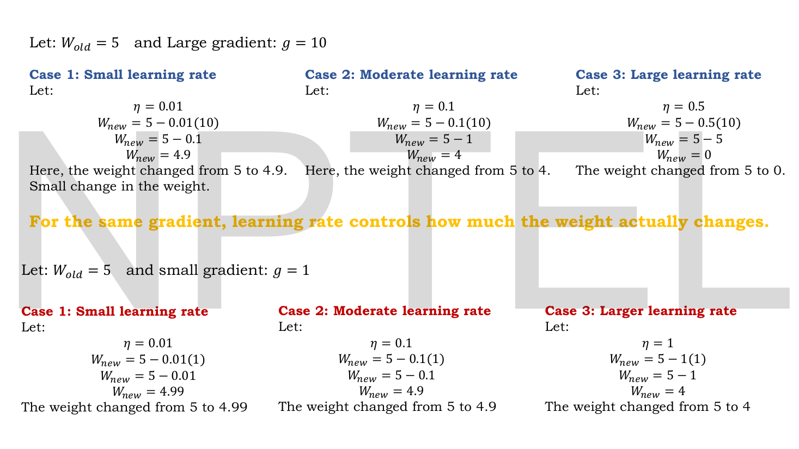

# Note-Writing Contract — binding on every author

You are writing **one chapter of one book**, not a standalone document. Other authors are writing the
chapter before yours and the chapter after yours, right now, from this same contract. Uniformity is not
a nicety here; it is the deliverable.

Read this whole file before writing a word.

---

## 0. THE ONE RULE THAT MATTERS MOST HERE

**These PDFs have NO text layer. Zero. `pdftotext` returns nothing at all.**

There is no `extracted/` directory for this course because extraction is impossible. Every word,
equation, table and diagram exists **only** as a rendered image. You cannot grep this course, you cannot
skim it, and you cannot shortcut it.

**You must open and read every page of your lecture as an image** (`Read` the PNGs in
`assets/pages/lecNN/`). That is not a quality suggestion; it is the only way to know what the lecture
says. A chapter written any other way will be empty or invented.

The good news: the renders are clean and highly legible, and this lecturer is unusually fond of **fully
worked numerical examples**. Those are gold for an exam. Find every one.

---

## 1. The reader

One specific person. Calibrate everything to them:

- Can use `sklearn` — `fit`, `predict`, `train_test_split`. Knows what overfitting *is* as a word.
- Has **not** done: matrix calculus, backprop by hand, any PyTorch, probability beyond "P(A and B)".
- **Has already studied two companion courses** and has complete notes for both (see §5). Build on them.
- Is sitting an **NPTEL end-term exam** and wants 95+. MCQ + short numerical. **Exact definitions, exact
  formulas, and the ability to compute small numbers by hand** matter more than vibes.
- Is reading these notes *instead of* the lectures. If you leave something out, they never see it.

## 2. Non-negotiable file shape

Exactly these seven H2 sections, exactly these names, in exactly this order. No extras, none omitted.

```markdown
# Lec NN — <Title>

> **Source:** `<pdf filename>` (<N> pages) · **Week N** · **Playlist:** Lec NN
> **Prereqs:** [Lec MM — Title](MM-slug.md), ...   (or "none")
> **Feeds into:** [Lec PP — Title](PP-slug.md), ...

## Why this lecture exists

## The ideas

## Worked numericals

## Code

## Exam pack

## Beyond the slides

## Cut from the slides
```

**Why this lecture exists** — 100–150 words of prose. The problem solved, and why it follows the last.

**The ideas** — the body and the bulk. Free use of `###`. Every concept on the slides, taught properly.
Derive the math; don't assert it. Embed figures (§4).

**Worked numericals** — 3–6 fully worked examples, every arithmetic step shown, landing on a number.

> **THIS LECTURER WORKS EXAMPLES ON THE SLIDES.** Numerical examples, case comparisons, step-by-step
> arithmetic — several lectures are *built* around them, and two lecture titles are literally
> "Numerical Example". **Every worked example in your page range must be reproduced here, with its
> arithmetic verified independently.** If your answer disagrees with the slide, say so and show both.
> Then add your own numericals on top until you have 3–6.

Format each as:

```markdown
### N1. <What is being computed>
**Given:** ...
**Find:** ...
<numbered steps, each showing the arithmetic>
**Answer:** <final line>
```

**Code** — runnable NumPy/PyTorch making an idea concrete. 10–40 lines, commented, with the real printed
output beneath. No `...` placeholders — it must actually run. **Two lectures in this course have
companion Jupyter notebooks** (`assets/notebooks/`); if yours does, read it and let it inform your code.

**Exam pack** — four labelled subsections, in this order:

```markdown
### Must-memorise
<table: | Item | Exactly this |>

### Numbers worth knowing
<table of figures an MCQ can key on>

### Likely MCQ traps
<bulleted; each states the confusion AND the correct discrimination>

### Self-test
<6–10 questions, answers in <details><summary>Answers</summary> ... </details>>
```

**Beyond the slides** — 2–5 real gaps, each a `**Gap:**` / `**Why it matters:**` pair.

**Cut from the slides** — one paragraph naming what you compressed or dropped. The audit trail.

## 3. Notation — identical across all chapters

| Thing | Write | Not |
|---|---|---|
| scalar | $x$, $\eta$ | |
| vector | $\mathbf{x}$, $\mathbf{h}$ | $\vec{x}$ |
| matrix | $\mathbf{W}$ | $W$ |
| layer index | $\mathbf{W}^{(l)}$ | $W_l$ |
| time / position | $\mathbf{h}_t$, $\mathbf{x}_t$ | $h(t)$ |
| loss | $\mathcal{L}$ | $L$, $J$, $E$ |
| dataset | $\mathcal{D}$ | $D$ |
| expectation | $\mathbb{E}_{p(x)}[\cdot]$ | $E[\cdot]$ |
| learning rate | $\eta$ | $\alpha$, `lr` |
| params (generic) | $\theta$ | $\phi$ |
| **Gaussian** | $\mathcal{N}(\mu, \sigma^2)$ — **variance** second | $\mathcal{N}(\mu,\sigma)$ |
| KL | $D_{\mathrm{KL}}(q\,\|\,p)$ | $KL(q,p)$ |
| VAE | encoder $q_\phi(\mathbf{z}\mid\mathbf{x})$, decoder $p_\theta(\mathbf{x}\mid\mathbf{z})$, prior $p(\mathbf{z})$ | |
| GAN | generator $G$, discriminator $D$, noise $\mathbf{z}$, $p_{\text{data}}$ / $p_g$ | |
| diffusion | timestep $t$, noise schedule $\beta_t$, $\alpha_t = 1-\beta_t$, $\bar\alpha_t = \prod\alpha_s$ | |
| attention | $\mathbf{Q},\mathbf{K},\mathbf{V}$; $d_k$, $d_{\text{model}}$; $h$ heads; weights $\alpha_{ij}$ | |
| LSTM cell state | $\mathbf{C}_t$ (capital) | $\mathbf{c}_t$ |
| attention context | $\mathbf{c}_t$ — reserved | |
| conv geometry | in $H\times W\times C$, kernel $K$, stride $S$, pad $P$, filters $F$ | |

**If the slides use a different symbol, translate to this table and note the deck's symbol once.**

Math delimiters: `$...$` inline, `$$...$$` display. **Never** `\(...\)` or `\[...\]` in prose.
(Inside fenced code blocks, `\(` is fine — it's a regex, not math.)

## 4. Figures

All pages are rendered at `assets/pages/lecNN/p-NN.png`. There is no second pool — the PDFs contain no
separately extractable images.

```markdown

*Fig. — Notice the weight moves 0.1, 1 and 5 for the identical gradient: the learning rate alone sets the step. Page 3.*
```

Rules:
- **Check the zero-padding width first** — `ls assets/pages/lecNN/` — it varies with page count
  (`p-3.png` vs `p-03.png`). Writing the wrong width is the commonest broken-link cause.
- Every figure gets descriptive alt text and an italic caption saying *what to notice*, ending with the
  page number.
- **No square brackets inside alt text.** A literal `[` or `]` breaks the Markdown image *silently* —
  the figure vanishes from the rendered page and from the validator's count, with no error reported.
  Describe matrices and vectors in words ("a two-by-two patch of 2, 4, 6, 8"), never as `[[2,4],[6,8]]`.
- 4–12 figures per chapter.
- Verify each path exists before referencing it.
- **No downloads, no external URLs.** If a concept needs a picture no page provides, draw a fenced ASCII
  diagram or a Mermaid block.

## 5. The two companion courses — overlap rule

The reader has complete notes for both, at `../../GenAIforCV/notes/` and `../../DLforNLP/notes/`.
From a chapter at `notes/NN-slug.md`, link as `../../GenAIforCV/notes/week-07/25-...md`.

This course sits **between** them and overlaps both:

| This course | Companion |
|---|---|
| Lec 02–06 (activations, optimizers, CNN) | `GenAIforCV` week-02, week-03 · `DLforNLP` week-02 |
| Lec 10–16 (autoencoders) | `GenAIforCV/notes/week-08/29-autoencoders-to-vae.md` |
| Lec 19–24 (KL, VAE, ELBO, reparameterization) | `GenAIforCV/notes/week-08/30-elbo-and-reparameterization.md` |
| Lec 31–42 (GANs) | `GenAIforCV/notes/week-01/03-generative-vision-models.md` (survey only) |
| Lec 54–57, 59 (NLP, RNN, Transformer) | `DLforNLP` weeks 04–05 · `GenAIforCV` week-07 |
| Lec 60–62 (BERT, GPT, prompting) | `DLforNLP/notes/week-06/`, `week-09/41-prompting-1.md` |
| Week 11–12 (LoRA, RAG, multimodal, bias) | `DLforNLP` weeks 10–12 |

**The rule: write your chapter standalone anyway.** This exam is set from *these* slides, with this
lecturer's notation, emphasis and worked examples. A reader who skipped your chapter because "I did VAEs
already" would lose marks.

What the overlap buys is **compression, not omission**: move faster through shared mechanics, say
explicitly "you met this in the vision course — here is what this lecturer does differently", and link
across. Spend the space you save on this deck's worked examples and its own framing.

**Two genuinely valuable things to flag when you see them:** where this course goes *deeper* than the
companions (its GAN and diffusion coverage is far more detailed), and where the three courses *disagree*
on notation or a result.

## 6. Scope discipline

Your assignment names topics you **own** and topics **owned elsewhere**. For owned-elsewhere: one
sentence maximum, then a link. Never re-derive a formula another chapter owns. For what you own: it is
yours completely and no other chapter covers it.

## 7. Voice

- Plain, direct, declarative. Second person for the reader ("you compute", "notice that").
- Define a term the first time it appears in *your* chapter — one clause is enough.
- Explain *why* before *what* wherever a formula appears.
- No filler: no "in today's fast-paced world", no "it is important to note that", no restating the
  heading as the first sentence, no closing pep talk.
- Don't pad. A tight 1,600 words beats a baggy 3,000. But don't clip real content to hit a number —
  completeness beats brevity when they conflict.
- Bold sparingly, for the term being defined. Tables for anything comparative.

## 8. Done means

- [ ] All seven H2 sections, correctly named and ordered.
- [ ] Front matter filled, with working relative links.
- [ ] **You opened and read every page of your lecture as an image.**
- [ ] **Every worked example on the slides is reproduced and independently verified.**
- [ ] Every figure path verified to exist on disk.
- [ ] Notation matches §3; Gaussian uses variance.
- [ ] Numericals land on concrete numbers; code runs as written.
- [ ] Nothing owned by another chapter is re-taught.
- [ ] Written to the exact path your assignment gives. One file. No other files, anywhere.

Report back: path written, word count, figure count, **how many worked examples the slides contained and
whether your arithmetic matched each**, and anything the ownership map did not anticipate.
