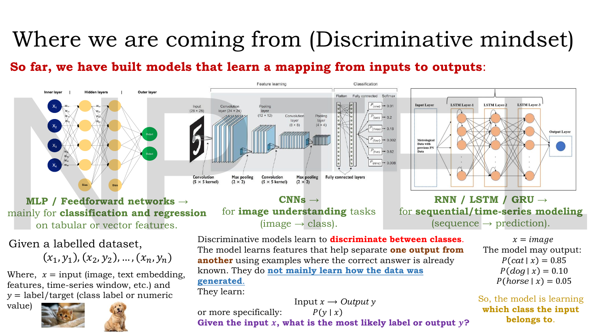
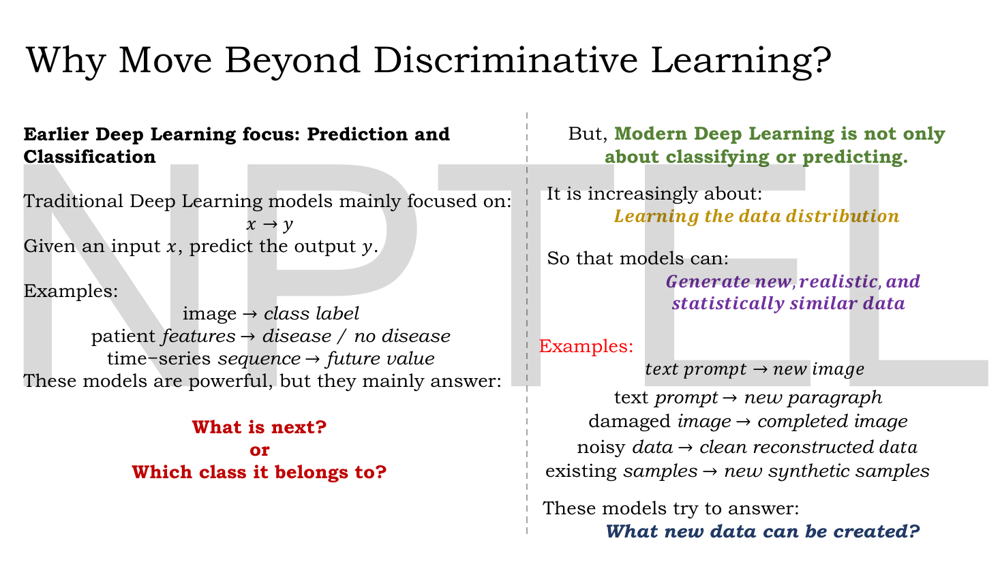
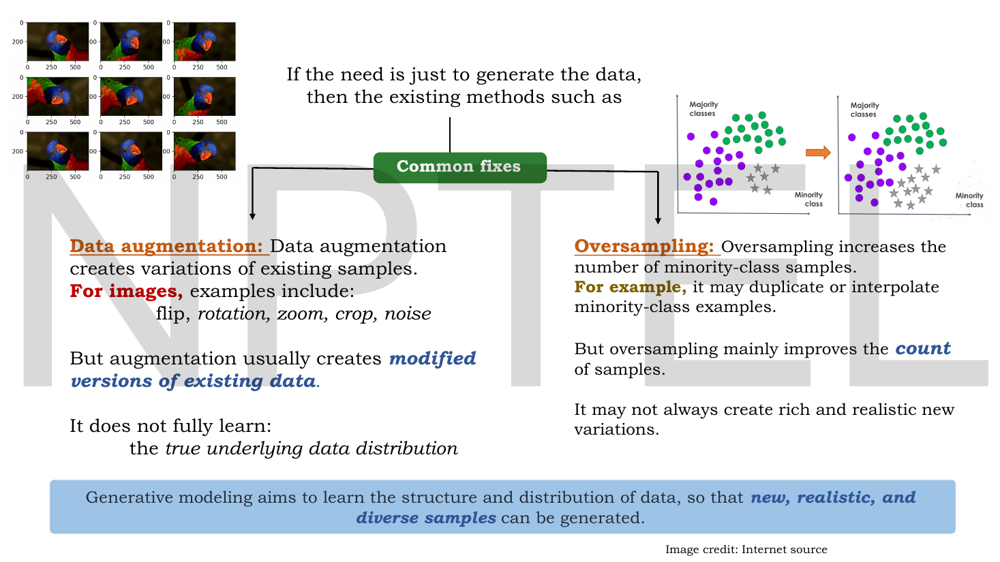
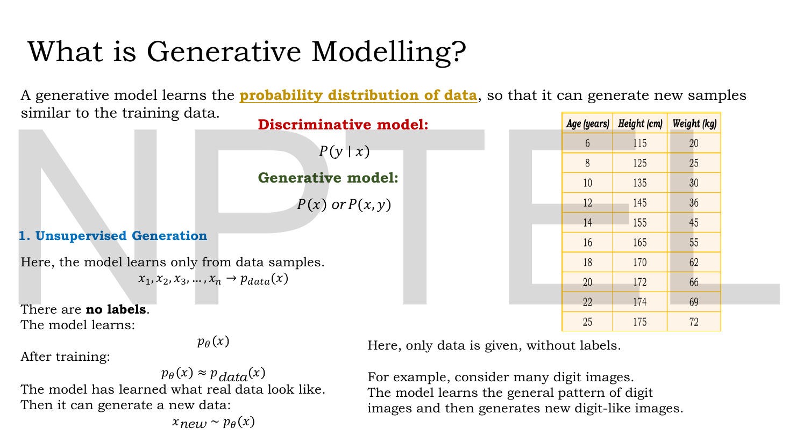
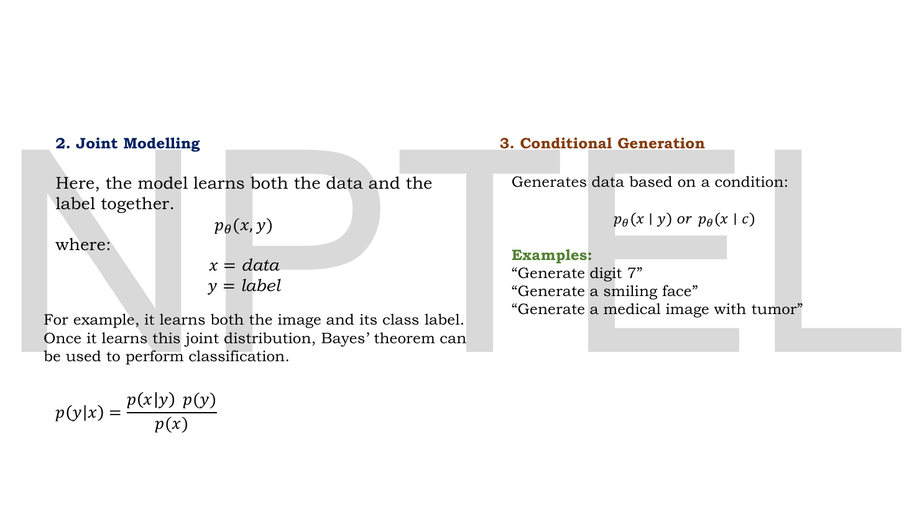
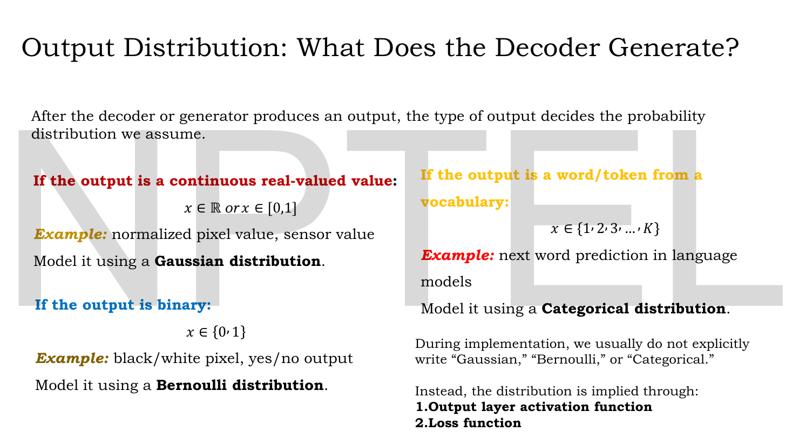
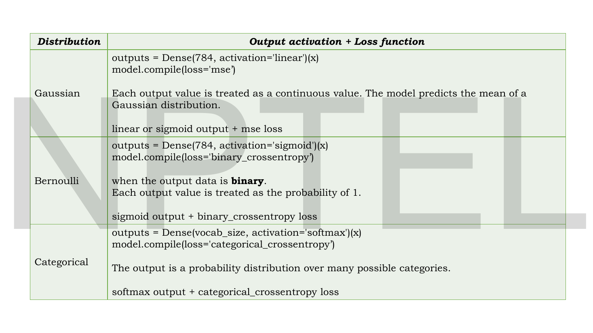
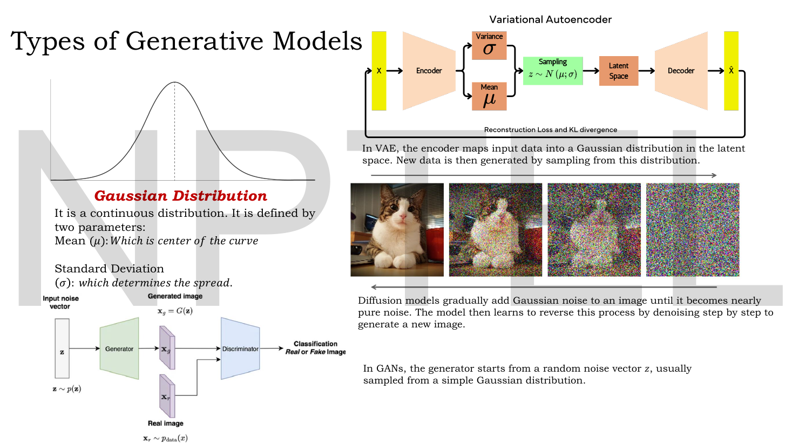
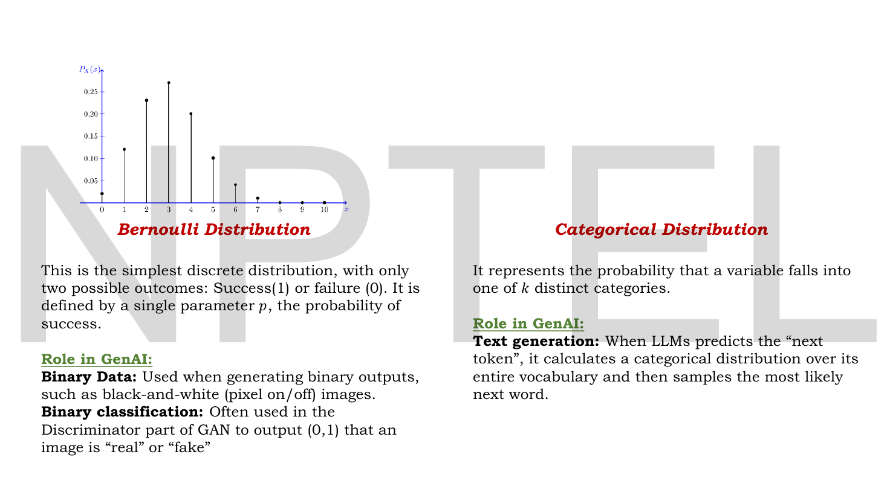
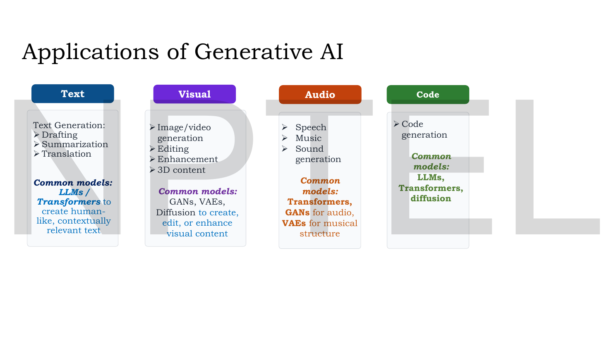

# Lec 01 — Introduction to Generative AI

> **Source:** `Lec 01.pdf` (14 pages) · **Week 1** · **Playlist:** Lec 01
> **Prereqs:** none
> **Feeds into:** [Lec 02 — Activation and Loss Functions](02-activations-and-losses.md), [Lec 10 — Introduction to Autoencoders](10-autoencoder-intro.md), [Lec 21 — Introduction to VAE and the Encoder](21-vae-encoder.md), [Lec 31 — Motivation for GANs](31-gan-motivation.md), [Lec 44 — Introduction to Diffusion Models](44-diffusion-intro.md)

## Why this lecture exists

Everything you have been taught to build so far answers one question: *given this input, which output?* A classifier, a regressor, a time-series forecaster — all of them learn $P(y\mid x)$ and stop there. That model can tell a cat from a dog but cannot draw either.

This lecture performs the pivot the rest of the course depends on. It replaces the target $P(y\mid x)$ with $P(x)$ — the distribution the data itself came from — and shows that once you have $P(x)$ you can *sample* from it, which is what "generating" means. It then fixes the vocabulary used for the next sixty lectures: the three generation modes (unsupervised, joint, conditional), the three output distributions (Gaussian, Bernoulli, categorical) and the rule that an output distribution is never written down in code but *implied* by an activation plus a loss. Get that rule now and Lec 02 onward is bookkeeping.

## The ideas

### Where you are coming from: the discriminative mindset


*Fig. — Notice the bottom-right corner: the model outputs $P(\text{cat}\mid x)=0.85$, $P(\text{dog}\mid x)=0.10$, $P(\text{horse}\mid x)=0.05$. Three numbers summing to 1, **conditioned on an image it was handed**. It never had to invent the image. Page 3.*

The deck opens with an inventory of what you already know how to build, and what each family is *for*:

| Family | Built for | The mapping |
|---|---|---|
| MLP / feedforward | classification and regression on tabular or vector features | features → class or value |
| CNN | image understanding | image → class |
| RNN / LSTM / GRU | sequential and time-series modelling | sequence → prediction |

All three are trained on a **labelled dataset** $\mathcal{D} = \{(\mathbf{x}_1,y_1), (\mathbf{x}_2,y_2), \ldots, (\mathbf{x}_n,y_n)\}$, where $\mathbf{x}$ is an input (image, text embedding, feature vector, time-series window) and $y$ is a label or numeric target.

A **discriminative model** learns to *discriminate between classes*: it learns the features that separate one output from another, using examples where the correct answer is already known. The deck's emphasis, underlined on the slide, is the negative claim — discriminative models **do not mainly learn how the data was generated**. They learn

$$\mathbf{x} \longrightarrow y, \qquad \text{more precisely} \qquad P(y \mid \mathbf{x})$$

and answer exactly one question: *given the input $\mathbf{x}$, what is the most likely label $y$?*

That is a genuine restriction, not a stylistic one. $P(y\mid\mathbf{x})$ is only defined once somebody hands you an $\mathbf{x}$. It contains no opinion about which $\mathbf{x}$ values are plausible, so there is nothing in it to sample from.

### Why move beyond it


*Fig. — Read the two closing questions against each other. Left: "What is next? / Which class does it belong to?" Right: "What new data can be created?" That swap is the whole lecture. Page 4.*

The deck's framing is historical. **Earlier deep learning** focused on prediction and classification, $\mathbf{x}\to y$:

- image → class label
- patient features → disease / no disease
- time-series sequence → future value

**Modern deep learning** is increasingly about **learning the data distribution**, so that models can *generate new, realistic, and statistically similar data*:

- text prompt → new image
- text prompt → new paragraph
- damaged image → completed image
- noisy data → clean reconstructed data
- existing samples → new synthetic samples

Note what the last three have in common with the first two: the *output* is a full data object, not an index into a list of classes. That is the operational definition of generative.

### The honest objection: don't augmentation and oversampling already do this?


*Fig. — The two cheap alternatives, and exactly why each falls short. Augmentation makes **modified versions of existing data**; oversampling improves the **count**. Neither learns $p_{\text{data}}$. Page 5.*

If you only need more data, two standard tools already exist, and the lecturer deals with both before introducing generative models.

**Data augmentation** creates variations of existing samples. For images: flip, rotation, zoom, crop, noise. But augmentation produces *modified versions of existing data*; it does not fully learn **the true underlying data distribution**. A rotated parrot is the same parrot.

**Oversampling** increases the number of minority-class samples, typically by duplicating or interpolating them. But oversampling mainly improves the **count** of samples. It may not always create rich and realistic new variations — a duplicated row carries no information the original did not.

The slide closes with the thesis sentence of the course:

> Generative modeling aims to learn the structure and distribution of data, so that **new, realistic, and diverse samples** can be generated.

Three adjectives, each doing work. *New* rules out duplication. *Realistic* rules out noise. *Diverse* rules out a model that generates one perfect sample forever — a failure that has a name, mode collapse, and a chapter, [Lec 34](34-gan-convergence.md).

### What generative modelling actually is


*Fig. — The single most quotable pair on the slide: discriminative $= P(y\mid x)$, generative $= P(x)$ **or** $P(x,y)$. On the right, ten rows of age, height and weight with no label column — that is what "unsupervised" looks like as a spreadsheet. Page 6.*

**A generative model learns the probability distribution of data**, so that it can generate new samples similar to the training data.

$$\text{Discriminative: } P(y\mid \mathbf{x}) \qquad\qquad \text{Generative: } P(\mathbf{x}) \ \text{ or } \ P(\mathbf{x},y)$$

Memorise that line verbatim; it is the most likely single MCQ in the whole deck. Note the "or" — **a generative model may model $P(\mathbf{x})$ alone or the joint $P(\mathbf{x},y)$**, and the deck's three modes are organised exactly by that choice.

#### Mode 1 — unsupervised generation

The model learns only from data samples. There are **no labels**:

$$\mathbf{x}_1, \mathbf{x}_2, \mathbf{x}_3, \ldots, \mathbf{x}_n \ \longrightarrow\ p_{\text{data}}(\mathbf{x})$$

The model learns a parameterised distribution $p_\theta(\mathbf{x})$, and after training

$$p_\theta(\mathbf{x}) \approx p_{\text{data}}(\mathbf{x})$$

The model has learned what real data look like. Then it can generate new data by **sampling**:

$$\mathbf{x}_{\text{new}} \sim p_\theta(\mathbf{x})$$

Read the symbols carefully, because the exam will. $p_{\text{data}}$ is the true, unknown distribution the world draws from. $p_\theta$ is your model, with learnable parameters $\theta$. Training means pushing $p_\theta$ toward $p_{\text{data}}$; generation means drawing from $p_\theta$. The tilde $\sim$ means "is sampled from", not "is approximately equal to" — the deck uses $\approx$ for that, one line above.

The slide's example: given many digit images, the model learns the general pattern of digit images and then generates new digit-like images.

#### Modes 2 and 3 — joint modelling and conditional generation


*Fig. — The Bayes line in the bottom left is the only equation on the deck that turns a generative model back into a classifier. Notice the conditional examples are phrased as commands — "Generate digit 7" — which is how conditioning feels from the outside. Page 7.*

**Joint modelling.** The model learns the data and the label *together*:

$$p_\theta(\mathbf{x}, y), \qquad \mathbf{x} = \text{data}, \quad y = \text{label}$$

For example, it learns both the image and its class label. Once it has the joint distribution, **Bayes' theorem recovers classification for free**:

$$p(y\mid\mathbf{x}) = \frac{p(\mathbf{x}\mid y)\,p(y)}{p(\mathbf{x})}$$

This is the deck's one structural argument for generative models being *more* than generators: a joint model can do the discriminative model's job, but not the other way round. (A discriminative $P(y\mid\mathbf{x})$ has no $p(\mathbf{x})$ inside it to invert.) N2 works this inversion with numbers.

**Conditional generation.** The model generates data subject to a condition:

$$p_\theta(\mathbf{x}\mid y) \qquad\text{or}\qquad p_\theta(\mathbf{x}\mid c)$$

Examples from the slide: "Generate digit 7", "Generate a smiling face", "Generate a medical image with tumor". The condition $c$ may be a class label, but it may also be a text prompt, a segmentation map or another image — which is precisely what [Lec 38](38-conditional-gan.md) (conditional GAN), [Lec 39](39-pix2pix.md) (Pix2Pix) and [Lec 52](52-stable-diffusion.md) (Stable Diffusion) build.

| Mode | What it models | Needs labels? | Typical course example |
|---|---|---|---|
| Unsupervised generation | $p_\theta(\mathbf{x})$ | no | autoencoder, vanilla GAN, DDPM |
| Joint modelling | $p_\theta(\mathbf{x},y)$ | yes | any model you then invert with Bayes |
| Conditional generation | $p_\theta(\mathbf{x}\mid y)$ or $p_\theta(\mathbf{x}\mid c)$ | yes (or a prompt) | cGAN, CVAE, text-to-image diffusion |

### The output distribution: what does the decoder actually emit?


*Fig. — The bottom-right paragraph is the one to underline: in implementation you never write "Gaussian". You write an **output-layer activation** and a **loss function**, and those two together name the distribution. Page 8.*

After the decoder or generator produces an output, **the type of output decides the probability distribution you assume**.

| Output is | Support | Example | Distribution |
|---|---|---|---|
| continuous real-valued | $x\in\mathbb{R}$ or $x\in[0,1]$ | normalised pixel value, sensor reading | **Gaussian** |
| binary | $x\in\{0,1\}$ | black/white pixel, yes/no output | **Bernoulli** |
| a token from a vocabulary | $x\in\{1,2,3,\ldots,K\}$ | next-word prediction in a language model | **Categorical** |

And then the rule that matters in practice:

> During implementation, we usually do not explicitly write "Gaussian", "Bernoulli" or "Categorical". Instead, the distribution is implied through **(1) the output layer activation function** and **(2) the loss function**.


*Fig. — The implied-distribution rule as code. Memorise the three pairs as units; an MCQ that gives you one half will ask for the other. Page 9.*

$$
\begin{array}{lll}
\textbf{Gaussian} & \texttt{Dense(784, activation='linear')} & \texttt{loss='mse'}\\
\textbf{Bernoulli} & \texttt{Dense(784, activation='sigmoid')} & \texttt{loss='binary\_crossentropy'}\\
\textbf{Categorical} & \texttt{Dense(vocab\_size, activation='softmax')} & \texttt{loss='categorical\_crossentropy'}
\end{array}
$$

The slide's gloss on each row:

- **Gaussian** — each output value is treated as a continuous value; the model predicts the **mean** of a Gaussian. The deck's own wording allows "linear **or sigmoid** output + mse loss", because when your real-valued data has already been scaled to $[0,1]$ a sigmoid is a legal mean-predictor too.
- **Bernoulli** — used when the output data is binary. Each output value is treated as **the probability of 1**.
- **Categorical** — the output is a probability distribution over many possible categories.

Why this pairing is not arbitrary: minimising MSE *is* maximising a Gaussian likelihood, and minimising cross-entropy *is* maximising a Bernoulli or categorical likelihood, in both cases up to additive constants. [Lec 02](02-activations-and-losses.md) gives you the loss formulas and their derivatives; [Lec 11](11-reconstruction-loss.md) works the Gaussian-vs-Bernoulli choice in full inside an autoencoder. Here, just lock in the three-way correspondence.

### The three distributions themselves


*Fig. — One slide, three architectures, one shared ingredient. The VAE samples $\mathbf{z}$ from a Gaussian; diffusion **adds** Gaussian noise and learns to remove it; the GAN generator starts from a Gaussian noise vector. If you remember one reason the Gaussian dominates this course, it is that all three use it as the source of randomness. Page 10.*

**Gaussian.** A continuous distribution defined by two parameters: the mean $\mu$, which is the centre of the curve, and the standard deviation $\sigma$, which determines the spread. Written properly,

$$p(x) = \frac{1}{\sqrt{2\pi\sigma^2}}\exp\!\left(-\frac{(x-\mu)^2}{2\sigma^2}\right), \qquad x\sim\mathcal{N}(\mu,\sigma^2)$$

> **Notation warning — this book's convention versus the slide's.** The deck's VAE diagram writes $z \sim N(\mu;\sigma)$. Throughout these notes a Gaussian's **second argument is the variance**: $\mathcal{N}(\mu,\sigma^2)$. The slide means the same object; the semicolon and the bare $\sigma$ are loose. [Lec 21](21-vae-encoder.md) is where this stops being cosmetic, because the VAE's encoder emits $\log\sigma^2$, not $\sigma$. Read every $\mathcal{N}(\cdot,\cdot)$ in this book as (mean, variance). N5 shows the factor-of-two error you make if you confuse them.

The slide's three uses of the Gaussian, one per architecture:

- **VAE** — the encoder maps input data into a Gaussian distribution in the latent space; new data is generated by sampling from that distribution. The diagram shows $\mathbf{x}\to$ encoder $\to$ ($\mu$, variance) $\to$ sampling $\to$ latent space $\to$ decoder $\to \hat{\mathbf{x}}$, trained with **reconstruction loss and KL divergence**. Unpacked in [Lec 21](21-vae-encoder.md)–[Lec 23](23-reparameterization.md).
- **Diffusion** — gradually adds Gaussian noise to an image until it becomes nearly pure noise, then learns to reverse the process by denoising step by step to generate a new image. Unpacked in [Lec 44](44-diffusion-intro.md)–[Lec 47](47-ddpm-reverse.md).
- **GAN** — the generator starts from a random noise vector $\mathbf{z}$, usually sampled from a simple Gaussian, and produces $\mathbf{x}_g = G(\mathbf{z})$; a discriminator sees $\mathbf{x}_g$ alongside real $\mathbf{x}_r \sim p_{\text{data}}(x)$ and classifies real vs fake. Unpacked in [Lec 32](32-gan-architecture.md)–[Lec 34](34-gan-convergence.md).


*Fig. — Read the text, not the picture: the plot has eleven outcomes and so cannot be a Bernoulli PMF (see "Cut from the slides"). The right-hand column is the one that matters for Week 10 — an LLM's next-token step **is** a categorical distribution over the vocabulary. Page 11.*

**Bernoulli.** The simplest discrete distribution, with only two possible outcomes: success (1) or failure (0). Defined by a single parameter $p$, the probability of success:

$$P(x) = p^x (1-p)^{1-x}, \qquad x\in\{0,1\}$$

Its role in generative AI, per the slide: **binary data** — generating binary outputs such as black-and-white (pixel on/off) images; and **binary classification** — it is what the GAN *discriminator* emits, a number in $(0,1)$ saying whether an image is "real" or "fake".

**Categorical.** Represents the probability that a variable falls into one of $k$ distinct categories; it is the Bernoulli generalised past two outcomes, with $k$ parameters summing to 1. Its role: **text generation**. When an LLM predicts the "next token" it computes a categorical distribution over its entire vocabulary and then draws the next word from it.

> The slide says the model "samples the most likely next word". Those are two different operations. Taking the most likely token is *greedy decoding* (an $\arg\max$); *sampling* draws proportionally to the probabilities and can return a token that was not the maximum. Both are used, and the choice is a decoding hyperparameter — see [Lec 61](61-gpt.md) and the Week 12 chapter on sampling. For this lecture, what matters is that the distribution is categorical.

### Applications, and the shape of the course


*Fig. — Learn this as a lookup table, because "which model family for which modality" is cheap to ask and cheap to get wrong. Note Transformers appear in three of the four columns and diffusion in two. Page 12.*

| Modality | Tasks | Common models (per the slide) |
|---|---|---|
| **Text** | drafting, summarization, translation | LLMs / Transformers, for human-like, contextually relevant text |
| **Visual** | image/video generation, editing, enhancement, 3D content | GANs, VAEs, Diffusion |
| **Audio** | speech, music, sound generation | Transformers; GANs for audio; VAEs for musical structure |
| **Code** | code generation | LLMs, Transformers, diffusion |

The title slide states the course's spine in one line, and it is worth copying into the front of your notes because every later chapter is a station on it:

$$\textbf{AE} \to \textbf{VAE} \to \textbf{GAN} \to \textbf{Diffusion} \to \textbf{Sequence models} \to \textbf{LLMs} \to \textbf{RAG} \to \textbf{Multimodal AI and Ethics}$$

The ordering is not chronological, it is pedagogical. Each step relaxes one limitation of the step before:

```
AE         compress and rebuild           -> latent space is not a distribution, so you cannot sample
VAE        make the latent a distribution -> you can sample, but outputs are blurry
GAN        judge samples with a network   -> sharp, but unstable and mode-collapse prone
Diffusion  many small denoising steps     -> stable and diverse, but slow to sample
Sequence   model order, not just content  -> recurrence cannot see far enough back
LLM        attention + scale              -> fluent, but has no access to facts outside its weights
RAG        retrieve, then generate        -> grounded; then multimodality and ethics
```

Week 1 itself — this lecture plus [Lec 02](02-activations-and-losses.md) through [Lec 06](06-cnn-b.md) — is a deep-learning refresher: activation functions, losses, optimizers, and CNNs, with two hands-on exercises (build a CNN for a real-world dataset; build an ensemble model). Week 2 starts the autoencoder arc at [Lec 10](10-autoencoder-intro.md).

> **You have met part of this before.** If you studied the companion vision course, its [generative vs discriminative chapter](../../GenAIforCV/notes/week-01/02-generative-vs-discriminative.md) and [survey of generative vision models](../../GenAIforCV/notes/week-01/03-generative-vision-models.md) cover the same pivot. What is *new here* is the explicit three-mode taxonomy (unsupervised / joint / conditional) and the implied-distribution rule on pages 8–9. Those two are this lecturer's framing and this exam's.

## Worked numericals

**The slides contain no fully worked numerical example.** The closest thing is the class-probability vector on page 3 and the unlabelled table on page 6, both reproduced and completed below; the remaining numericals are built on this deck's own definitions.

### N1. The slide's class posterior — what it does and does not tell you

**Given:** a discriminative model shown an image $\mathbf{x}$ outputs $P(\text{cat}\mid\mathbf{x}) = 0.85$, $P(\text{dog}\mid\mathbf{x}) = 0.10$, $P(\text{horse}\mid\mathbf{x}) = 0.05$ (page 3).
**Find:** (a) check it is a valid distribution; (b) what this model says about how likely the image itself is.

1. Sum the three numbers: $0.85 + 0.10 + 0.05 = 1.00$. Valid — a conditional distribution over classes must sum to 1 **for each fixed $\mathbf{x}$**.
2. Now ask for $P(\mathbf{x})$. Nothing in the output mentions $\mathbf{x}$'s own probability. Feed the model pure static and it will still return three numbers summing to 1 — it has no mechanism to say "this input is implausible".
3. A generative model trained on the same images would report a single number $p_\theta(\mathbf{x})$, and it would **not** sum to 1 across the three classes; it sums to 1 across *all possible images*, an astronomically larger set (N3).

**Answer:** (a) the vector is valid, summing to $1.00$. (b) a discriminative model gives you $P(y\mid\mathbf{x})$ only; $P(\mathbf{x})$ is unobtainable from it. This asymmetry is the whole reason the course exists.

### N2. Classifying with a joint model via Bayes

The deck writes $p(y\mid\mathbf{x}) = p(\mathbf{x}\mid y)p(y)/p(\mathbf{x})$ on page 7 but never uses it. Here is the arithmetic.

**Given:** a joint model over handwritten digits restricted to two classes. Class priors $p(y=7) = 0.6$, $p(y=1) = 0.4$. For one particular image $\mathbf{x}$ the model reports $p(\mathbf{x}\mid y=7) = 0.002$ and $p(\mathbf{x}\mid y=1) = 0.0005$.
**Find:** $p(y=7\mid\mathbf{x})$ and $p(y=1\mid\mathbf{x})$.

1. Numerator for class 7: $p(\mathbf{x}\mid y{=}7)\,p(y{=}7) = 0.002 \times 0.6 = 0.0012$.
2. Numerator for class 1: $p(\mathbf{x}\mid y{=}1)\,p(y{=}1) = 0.0005 \times 0.4 = 0.0002$.
3. Evidence (marginalise $y$ out of the joint): $p(\mathbf{x}) = 0.0012 + 0.0002 = 0.0014$.
4. $p(y{=}7\mid\mathbf{x}) = 0.0012 / 0.0014 = 0.857142\ldots$
5. $p(y{=}1\mid\mathbf{x}) = 0.0002 / 0.0014 = 0.142857\ldots$

**Answer:** $p(7\mid\mathbf{x}) = 0.8571$, $p(1\mid\mathbf{x}) = 0.1429$, summing to 1 as required. Note step 3: the denominator $p(\mathbf{x})$ never had to be learned separately — it fell out of the joint by summing over $y$. That is the structural advantage of modelling $p(\mathbf{x},y)$.

### N3. How big is $P(\mathbf{x})$, really?

**Given:** binary MNIST-style images, $28\times28$ pixels, each pixel $\in\{0,1\}$.
**Find:** the number of free parameters in an unconstrained table for $P(\mathbf{x})$, versus for a 10-class discriminative $P(y\mid\mathbf{x})$ at one fixed $\mathbf{x}$.

1. Number of pixels: $28\times28 = 784$.
2. Number of distinct images: $2^{784}$.
3. A table assigning a probability to each must sum to 1, so it has $2^{784} - 1$ free entries.
4. Size in decimal: $\log_{10}(2^{784}) = 784 \times 0.30103 = 236.0$, so $2^{784} \approx 1.0\times10^{236}$.
5. The discriminative side: at one fixed $\mathbf{x}$, $P(y\mid\mathbf{x})$ over 10 classes has $10 - 1 = 9$ free numbers.

**Answer:** about $10^{236}$ free parameters versus $9$. The universe holds roughly $10^{80}$ atoms. **This is why generative modelling is always *parametric*** — you never store $P(\mathbf{x})$, you learn a $p_\theta(\mathbf{x})$ with a few million parameters that approximates it. Every architecture in this course is a different answer to "what is a good $\theta$-shaped shortcut?"

### N4. Why oversampling is not generation, counted

**Given:** a binary-classification dataset with 950 majority-class and 50 minority-class samples. You rebalance by random oversampling of the minority class to 950.
**Find:** the duplication factor, the number of *distinct* minority samples afterwards, and the number of augmentation transforms per image needed to reach 950 instead.

1. Duplication factor: $950 / 50 = 19$. Each minority sample appears 19 times.
2. Distinct minority samples afterwards: still $\mathbf{50}$. Oversampling changed the count from 50 to 950 and the distinct count from 50 to 50.
3. Augmentation route: to reach 950 from 50 originals you need $950/50 = 19$ images per original, i.e. the original plus $19 - 1 = 18$ transforms.
4. But all 18 are deterministic functions of the original, so the *support* of the augmented set is still 50 points plus their orbits — not a sample from $p_{\text{data}}$.

**Answer:** duplication factor 19, distinct samples 50, 18 transforms per image. Both routes multiply the count by 19 and the information by roughly 1. A generative model fitted to the 50 and sampled 900 times produces 900 points that were never in the training set — which is exactly what the Code section demonstrates.

### N5. Gaussian density, and the $\sigma$ versus $\sigma^2$ trap

**Given:** a normalised pixel modelled as $x \sim \mathcal{N}(0.5,\ 0.01)$ — mean $0.5$, **variance** $0.01$, so $\sigma = 0.1$.
**Find:** the density at $x = 0.6$, and the value you would get if you misread the second argument as the standard deviation.

1. Correct reading, $\sigma^2 = 0.01$:
$$p(0.6) = \frac{1}{\sqrt{2\pi(0.01)}}\exp\!\left(-\frac{(0.6-0.5)^2}{2(0.01)}\right)$$
2. Normalising constant: $\sqrt{2\pi\times0.01} = \sqrt{0.0628319} = 0.250663$, so $1/0.250663 = 3.98942$.
3. Exponent: $-(0.1)^2 / 0.02 = -0.01/0.02 = -0.5$, and $e^{-0.5} = 0.606531$.
4. Product: $3.98942 \times 0.606531 = 2.419707$.
5. Wrong reading, taking $\sigma = 0.1$ to mean $\sigma^2 = 0.1$ (so $\sigma = 0.31623$): normalising constant $1/\sqrt{0.628319} = 1.26157$; exponent $-0.01/0.2 = -0.05$, $e^{-0.05} = 0.951229$; product $= 1.200039$.

**Answer:** the correct density is $\mathbf{2.4197}$; the mis-parsed version gives $1.2000$ — **a factor of 2.02 wrong**. Also note a density can exceed 1 (it is not a probability); only its integral is 1. This is the error the slide's $N(\mu;\sigma)$ notation invites, and the reason this book always writes $\mathcal{N}(\mu,\sigma^2)$.

## Code

The deck's page-6 table is unlabelled data — the textbook setting for unsupervised generation. Fitting $p_\theta(\mathbf{x}) = \mathcal{N}(\boldsymbol\mu, \boldsymbol\Sigma)$ to it and sampling is the simplest honest generative model there is, and it shows in fifteen lines what oversampling cannot do.

```python
import numpy as np
rng = np.random.default_rng(0)

# The deck's page-6 table: age (years), height (cm), weight (kg). 10 rows, NO labels.
X = np.array([[6,115,20],[8,125,25],[10,135,30],[12,145,36],[14,155,45],
              [16,165,55],[18,170,62],[20,172,66],[22,174,69],[25,175,72]], float)

# --- OVERSAMPLING: make 5 "new" rows by copying existing ones ---------------
over = X[rng.integers(0, len(X), 5)]
print("oversampled rows:\n", over)
print("distinct rows produced:", len({tuple(r) for r in over}), "of 5")
print("all are exact copies of training rows:",
      all(any(np.array_equal(o, x) for x in X) for o in over), "\n")

# --- GENERATIVE: fit p_theta(x) = N(mu, Sigma), then SAMPLE from it ---------
mu, Sig = X.mean(axis=0), np.cov(X, rowvar=False)   # these ARE theta
print("mu    =", np.round(mu, 2))
print("diag(Sigma) =", np.round(np.diag(Sig), 1))
gen = rng.multivariate_normal(mu, Sig, size=5)
print("generated rows:\n", np.round(gen, 1))
print("any generated row identical to a training row:",
      any(np.allclose(g, x) for g in gen for x in X))
```

```
oversampled rows:
 [[ 22. 174.  69.]
 [ 18. 170.  62.]
 [ 16. 165.  55.]
 [ 10. 135.  30.]
 [ 12. 145.  36.]]
distinct rows produced: 5 of 5
all are exact copies of training rows: True 

mu    = [ 15.1 153.1  48. ]
diag(Sigma) = [ 38.8 482.1 375.1]
generated rows:
 [[ 13.6 151.9  45.1]
 [  8.8 122.7  24.5]
 [ 22.1 182.   71.2]
 [ 30.1 204.5  91.9]
 [ 19.2 170.2  60.9]]
any generated row identical to a training row: False
```

Three readings. **Oversampling returned five rows that are byte-for-byte training rows** — the "all are exact copies" check prints `True`. **The generative model returned five rows that appear nowhere in the data** and still respect its structure: age 13.6 goes with height 151.9, age 22.1 with 182.0, because $\boldsymbol\Sigma$ carried the correlation. That is "new, realistic, statistically similar" made literal.

And the fourth generated row, **age 30.1, height 204.5 cm**, is the lesson in the failure mode. A Gaussian has unbounded support, so $p_\theta$ puts mass on two-metre children. The model is too simple for the data, and every later architecture in this course — VAE, GAN, diffusion — exists to give $p_\theta$ enough flexibility that samples like this stop appearing.

## Exam pack

### Must-memorise

| Item | Exactly this |
|---|---|
| Discriminative model | $P(y\mid \mathbf{x})$ |
| Generative model | $P(\mathbf{x})$ **or** $P(\mathbf{x},y)$ |
| Discriminative models do not | mainly learn *how the data was generated* |
| Unsupervised generation | learn $p_\theta(\mathbf{x})$ from unlabelled $\mathbf{x}_1\ldots\mathbf{x}_n$ |
| After training | $p_\theta(\mathbf{x}) \approx p_{\text{data}}(\mathbf{x})$ |
| Generation step | $\mathbf{x}_{\text{new}} \sim p_\theta(\mathbf{x})$ |
| Joint modelling | $p_\theta(\mathbf{x},y)$ |
| Bayes inversion | $p(y\mid\mathbf{x}) = \dfrac{p(\mathbf{x}\mid y)\,p(y)}{p(\mathbf{x})}$ |
| Conditional generation | $p_\theta(\mathbf{x}\mid y)$ or $p_\theta(\mathbf{x}\mid c)$ |
| Continuous output → | Gaussian → linear (or sigmoid) activation + MSE |
| Binary output → | Bernoulli → sigmoid activation + binary cross-entropy |
| Token output → | Categorical → softmax activation + categorical cross-entropy |
| How a distribution is specified in code | implicitly, by **output activation + loss function** |
| Gaussian parameters | mean $\mu$ (centre), standard deviation $\sigma$ (spread); write $\mathcal{N}(\mu,\sigma^2)$ |
| Bernoulli | two outcomes, success (1) / failure (0), one parameter $p$ |
| Categorical | probability over $k$ distinct categories |
| Generative modelling aims to | learn structure and distribution so **new, realistic, diverse** samples can be generated |
| Course spine | AE → VAE → GAN → Diffusion → Sequence models → LLMs → RAG → Multimodal AI and Ethics |

### Numbers worth knowing

| Quantity | Value |
|---|---|
| Deck's class posterior (page 3) | $P(\text{cat})=0.85$, $P(\text{dog})=0.10$, $P(\text{horse})=0.05$; sums to $1.00$ |
| Deck's unlabelled table (page 6) | 10 rows × 3 columns (age, height, weight), **no label column** |
| Deck's Keras output width, image case | `Dense(784, ...)` — i.e. $28\times28$ flattened |
| Deck's Keras output width, text case | `Dense(vocab_size, ...)` |
| Distinct $28\times28$ binary images | $2^{784}\approx 1.0\times10^{236}$ |
| Free parameters in an exact table for $P(\mathbf{x})$ | $2^{784}-1$ |
| Gaussian parameter count | 2 ($\mu$ and $\sigma^2$) |
| Bernoulli parameter count | 1 ($p$) |
| Categorical parameter count | $k$ values, $k-1$ free (they sum to 1) |
| Bayes example (N2) | $0.0012 / 0.0014 = 0.8571$ |
| $\mathcal{N}(0.5,0.01)$ density at $0.6$ | $2.4197$ (mis-read as $\sigma$: $1.2000$) |
| Number of generation modes on the deck | 3 — unsupervised, joint, conditional |
| Number of output distributions on the deck | 3 — Gaussian, Bernoulli, categorical |
| Application columns on page 12 | 4 — Text, Visual, Audio, Code |

### Likely MCQ traps

- **"A generative model learns $P(y\mid x)$."** No — that is the discriminative model. Generative is $P(\mathbf{x})$ *or* $P(\mathbf{x},y)$. The "or" is part of the answer; an option offering only $P(\mathbf{x})$ is incomplete if the question says "which of the following does a generative model learn".
- **Confusing conditional generation $p_\theta(\mathbf{x}\mid y)$ with discriminative $P(y\mid\mathbf{x})$.** Look at which side of the bar the *data* is on. Data on the left = you are generating data. Label on the left = you are classifying.
- **Thinking data augmentation is a generative model.** Augmentation produces *modified versions of existing data* and does not learn the true underlying distribution. Oversampling improves the **count** only. Both are named on the slide specifically as the things generative modelling is not.
- **Picking the loss from the activation instead of from the output type.** The causal order on page 8 is output type → distribution → (activation, loss). Binary pixels → Bernoulli → sigmoid + BCE. Reversing it works by luck, not reasoning.
- **Pairing softmax with MSE, or sigmoid with categorical cross-entropy.** The three pairs on page 9 are fixed units: linear+mse, sigmoid+binary\_crossentropy, softmax+categorical\_crossentropy.
- **Reading $N(\mu;\sigma)$ on the VAE diagram as (mean, variance).** The slide's second argument is the standard deviation. This book — and most textbooks — put the **variance** second. N5 shows the error costs you a factor of about 2 in a density.
- **"A joint model cannot classify."** It can, and better than you might expect: Bayes' theorem turns $p(\mathbf{x},y)$ into $p(y\mid\mathbf{x})$. The reverse is impossible — a discriminative model has no $p(\mathbf{x})$ inside it.
- **"Sampling from a categorical distribution returns the most likely token."** Sampling and $\arg\max$ (greedy decoding) are different operations; the slide's phrasing conflates them.
- **Mixing up the modality-to-model table.** Per page 12: Visual → GANs, VAEs, Diffusion. Audio → Transformers, GANs, VAEs. Text and Code → LLMs/Transformers (and the slide also lists diffusion under Code).
- **Thinking $p_\theta(\mathbf{x}) \approx p_{\text{data}}(\mathbf{x})$ means memorising the training set.** If $p_\theta$ only put mass on training points it would fail the "new" and "diverse" requirements; see the Code section, where no generated row matches a training row.

### Self-test

1. Write the defining probability expression for a discriminative model and for a generative model.
2. Name the three types of generative modelling from the deck and give the distribution each one learns.
3. A dataset has images with no labels. Which mode applies, and what are the three stages (learn, converge, generate) in symbols?
4. Give the activation + loss pair for each of the three output distributions.
5. The deck says augmentation and oversampling are not enough. State the specific limitation of each, in the deck's own words.
6. A joint model gives $p(\mathbf{x}\mid y{=}A)=0.004$, $p(\mathbf{x}\mid y{=}B)=0.001$, with priors $p(A)=0.25$, $p(B)=0.75$. Compute $p(A\mid\mathbf{x})$.
7. Which distribution does an LLM use at its output layer, and over what set?
8. Why can a GAN discriminator's output be called Bernoulli?
9. Compute the density of $\mathcal{N}(2, 4)$ at $x = 3$.
10. List the course's model arc in order, from the title slide.

<details><summary>Answers</summary>

1. Discriminative: $P(y\mid\mathbf{x})$. Generative: $P(\mathbf{x})$ or $P(\mathbf{x},y)$.
2. **Unsupervised generation** → $p_\theta(\mathbf{x})$, no labels. **Joint modelling** → $p_\theta(\mathbf{x},y)$, data and label together. **Conditional generation** → $p_\theta(\mathbf{x}\mid y)$ or $p_\theta(\mathbf{x}\mid c)$.
3. Unsupervised generation. Learn: $\mathbf{x}_1,\ldots,\mathbf{x}_n \to p_\theta(\mathbf{x})$. Converge: $p_\theta(\mathbf{x}) \approx p_{\text{data}}(\mathbf{x})$. Generate: $\mathbf{x}_{\text{new}} \sim p_\theta(\mathbf{x})$.
4. Gaussian → linear (or sigmoid) + MSE. Bernoulli → sigmoid + binary cross-entropy. Categorical → softmax + categorical cross-entropy.
5. Augmentation "usually creates **modified versions of existing data**" and "does not fully learn the true underlying data distribution". Oversampling "mainly improves the **count** of samples" and "may not always create rich and realistic new variations".
6. Numerators: $0.004\times0.25 = 0.001$ and $0.001\times0.75 = 0.00075$. Evidence $= 0.00175$. $p(A\mid\mathbf{x}) = 0.001/0.00175 = 0.5714$ (and $p(B\mid\mathbf{x}) = 0.4286$). Note the likelihood favoured $A$ four-to-one but the prior favoured $B$ three-to-one, so the posterior is close to even.
7. A **categorical** distribution, over the entire vocabulary (the $K$ tokens), produced by a softmax.
8. It emits a single number in $(0,1)$ interpreted as the probability of the outcome "real" — two outcomes, one parameter, which is exactly a Bernoulli.
9. $\mathcal{N}(2,4)$ means $\mu=2$, $\sigma^2=4$, $\sigma=2$. $p(3) = \frac{1}{\sqrt{8\pi}}e^{-1/8} = \frac{1}{5.01326}\times0.882497 = 0.176033$.
10. AE → VAE → GAN → Diffusion → Sequence models → LLMs → RAG → Multimodal AI and Ethics.

</details>

## Beyond the slides

**Gap: the deck never says why $P(\mathbf{x})$ is hard, only that it is the goal.**
**Why it matters:** N3 makes the point — an exact table for a $28\times28$ binary image has $2^{784}-1$ entries. Every architecture in this course is a *parameterisation trick* for dodging that number: an autoencoder compresses to a bottleneck, a VAE assumes a simple latent prior, a GAN avoids writing $p_\theta$ down at all and only learns to sample from it, diffusion factorises it into a thousand easy conditional steps. Reading the course as "four answers to one intractable problem" makes the arc coherent instead of a list.

**Gap: "GAN never writes down $p_\theta(\mathbf{x})$" is a distinction the deck's $P(\mathbf{x})$ framing hides.**
**Why it matters:** there are two kinds of generative model. *Explicit* ones give you a number for $p_\theta(\mathbf{x})$ (VAEs, via a bound; autoregressive LLMs, exactly). *Implicit* ones only give you a sampler — you can draw $\mathbf{x}_{\text{new}}$ but cannot ask "how likely is this image?" GANs are implicit. This is why GAN evaluation needs FID and Inception Score rather than held-out likelihood, and why [Lec 34](34-gan-convergence.md)'s convergence story looks nothing like ordinary loss-goes-down training.

**Gap: the implied-distribution rule is given as Keras idiom, not as a theorem.**
**Why it matters:** the pairings are not conventions, they are maximum-likelihood identities. Minimising MSE equals maximising the likelihood of $\mathcal{N}(\hat{x}, \sigma^2)$ up to constants; minimising BCE equals maximising a Bernoulli likelihood; minimising categorical cross-entropy equals maximising a categorical likelihood. Knowing this means you can *derive* the right loss for any new output type instead of memorising three rows — and it is the bridge to the ELBO in [Lec 22](22-elbo-and-vae-loss.md), where the reconstruction term is literally $\log p_\theta(\mathbf{x}\mid\mathbf{z})$.

**Gap: the deck's Gaussian is univariate; every real model's is multivariate.**
**Why it matters:** the Code section fits $\mathcal{N}(\boldsymbol\mu,\boldsymbol\Sigma)$ with a full covariance and that is why generated rows keep age, height and weight consistent with each other. In VAEs the covariance is forced *diagonal* — the latent dimensions are modelled as independent — which is a real modelling assumption with real consequences for disentanglement ([Lec 26](26-beta-vae.md)). Notice the restriction when you meet it.

**Gap: nothing is said about what "statistically similar" fails to guarantee.**
**Why it matters:** the Code section generates a 204.5 cm child. A model can match the mean and covariance of the data perfectly and still produce samples that are impossible — because matching low-order statistics is not matching the distribution. This is the quality gap the entire course is closing, and it is also the root of the bias and safety discussion in the Week 12 chapter: a model that reproduces a dataset's statistics reproduces its skews too.

## Cut from the slides

Page 1 (title), page 2 (Week 1 outline), page 13 (next-session preview) and page 14 (thank-you) carry no teachable content; the title slide's course-arc line and page 2's Week-1 syllabus are folded into "The ideas" rather than reproduced as slides. Pages 3 through 12 are covered in full, including every bullet of the applications grid and both hands-on exercises named on page 2. Three things on the slides are reported but deliberately not expanded here because another chapter owns them: the VAE block diagram on page 10 (owned by [Lec 21](21-vae-encoder.md)–[Lec 23](23-reparameterization.md)), the GAN generator/discriminator diagram on the same page ([Lec 32](32-gan-architecture.md)), and the diffusion noise strip ([Lec 44](44-diffusion-intro.md)) — each gets a sentence and a link, not a derivation. Likewise the loss formulas behind `mse`, `binary_crossentropy` and `categorical_crossentropy` are named but not derived, because [Lec 02](02-activations-and-losses.md) owns the loss catalogue and [Lec 11](11-reconstruction-loss.md) owns reconstruction loss. Two defects in the source are corrected rather than copied: the plot above the words "Bernoulli Distribution" on page 11 is not a Bernoulli PMF at all — it shows eleven outcomes over $x = 0,\ldots,10$ with the shape of a $\mathrm{Binomial}(10, 0.3)$, whereas a Bernoulli PMF has exactly two bars; and the VAE diagram's $N(\mu;\sigma)$ is restated as $\mathcal{N}(\mu,\sigma^2)$ per this book's notation, with the discrepancy flagged in place. The page-11 claim that an LLM "samples the most likely next word" is quoted and then corrected, since sampling and greedy decoding are different.
