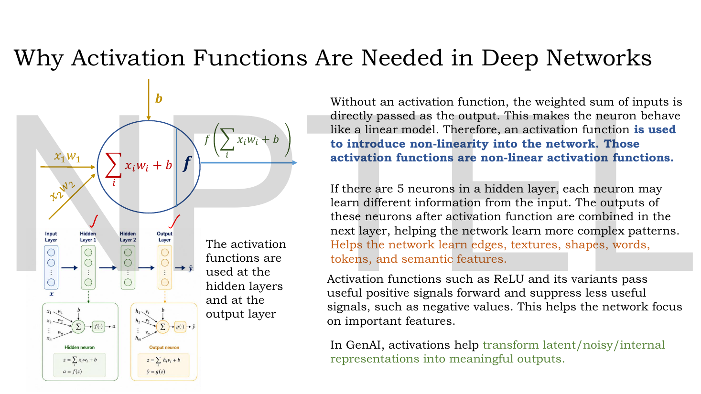
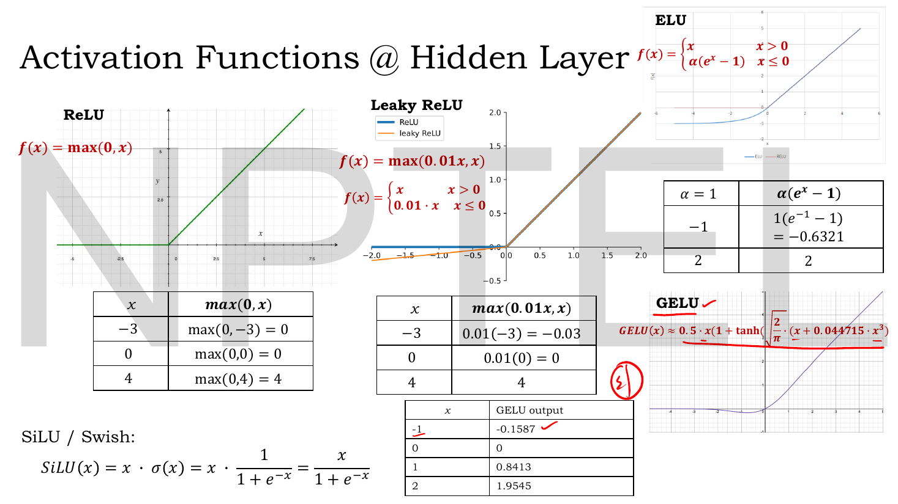
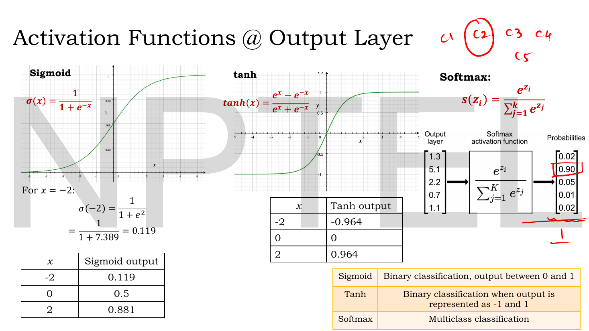
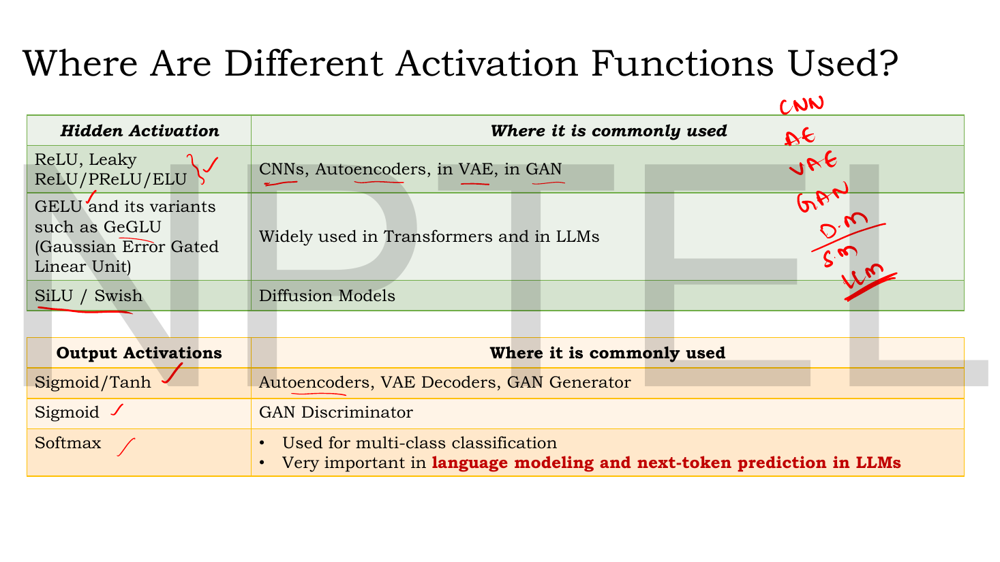
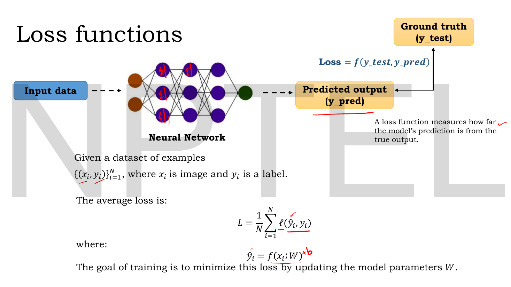
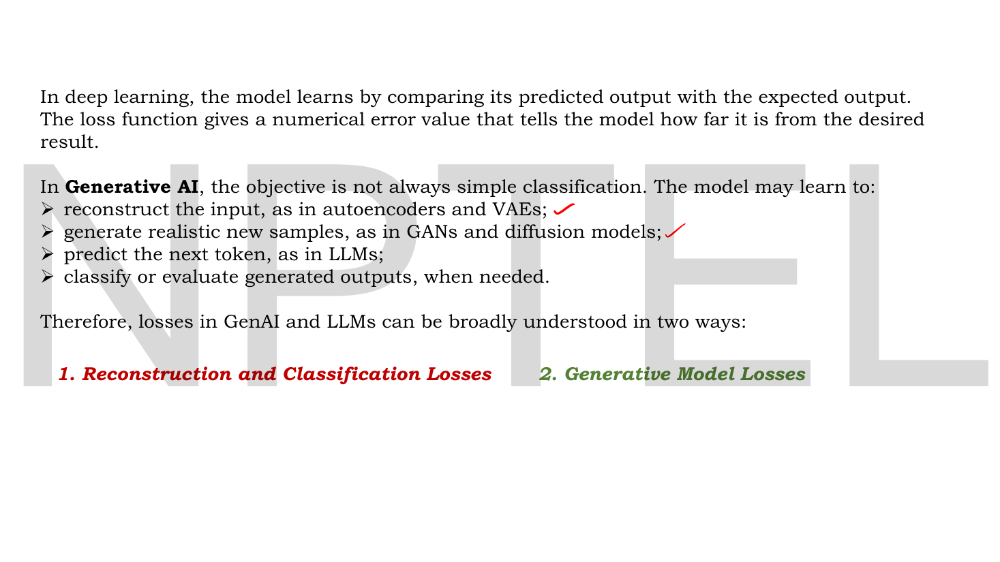
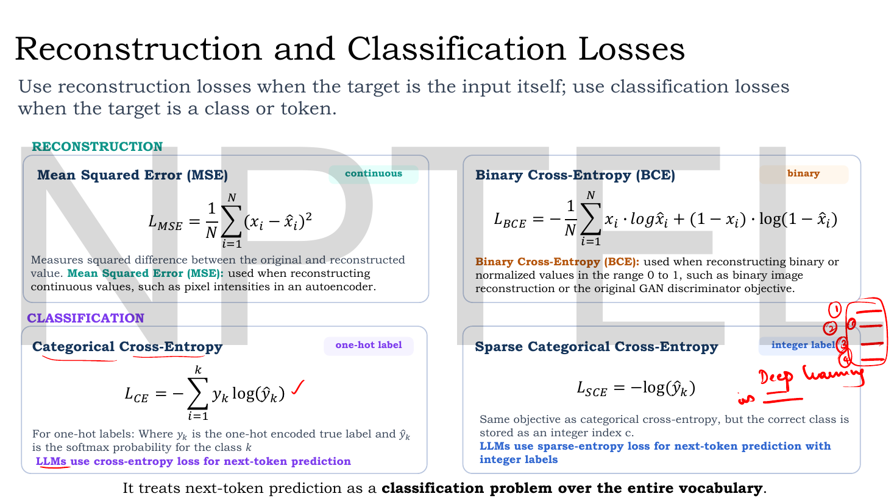
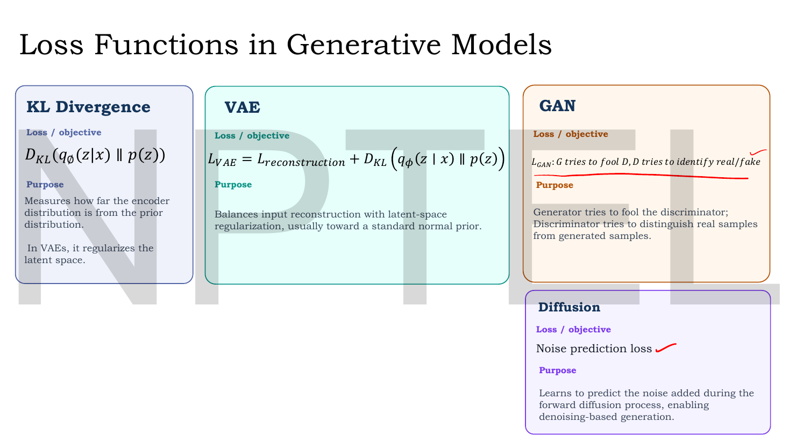

# Lec 02 — Activation and Loss Functions

> **Source:** `Lec 02.pdf` (12 pages) · **Week 1** · **Playlist:** Lec 02
> **Prereqs:** [Lec 01 — Introduction to Generative AI](01-intro-generative-ai.md)
> **Feeds into:** [Lec 03 — Optimizers — Part A](03-optimizers-a.md), [Lec 11 — Reconstruction Loss (MSE, BCE)](11-reconstruction-loss.md), [Lec 33 — GAN Objective and Loss Functions](33-gan-objective.md), [Lec 49 — U-Net for Denoising](49-unet.md), [Lec 57 — Transformer Encoder](57-transformer-encoder.md)

## Why this lecture exists

[Lec 01](01-intro-generative-ai.md) ended on a rule it did not explain: you never write "Gaussian" or "Bernoulli" in code — you write an **output activation** and a **loss**, and those two together declare the distribution. This lecture supplies both halves of that pair.

It is also the only place in the course where the activation catalogue is laid out properly. Every architecture that follows picks from this list and assumes you know why: CNNs and autoencoders use ReLU, Transformers use GELU, diffusion U-Nets use SiLU, a GAN discriminator ends in a sigmoid, an LLM ends in a softmax. Those are not arbitrary brand preferences, and the reason in each case is a property of the function's **derivative** — which the slides show tables of values for but never differentiate. Supplying the derivatives is what turns this from a lookup table into something you can reason with.

## The ideas

### Why a non-linearity is not optional


*Fig. — Two boxes at the bottom left are the whole of forward propagation: the **hidden neuron** computes $z=\sum_i x_i w_i + b$ then $a=f(z)$; the **output neuron** computes $z=\sum_i h_i v_i + b$ then $\hat y = g(z)$. Note the deck uses different letters, $f$ for hidden and $g$ for output — the distinction matters, because they are chosen by different criteria. Page 3.*

A neuron computes a weighted sum and adds a bias:

$$z = \sum_i x_i w_i + b$$

and then applies an **activation function** $f$, giving $a = f(z)$. The deck's argument for why $f$ must exist:

> Without an activation function, the weighted sum of inputs is directly passed as the output. This makes the neuron behave like a **linear model**. Therefore, an activation function is used to introduce **non-linearity** into the network.

Make that concrete. Stack two layers with no activation:

$$\mathbf{h} = \mathbf{W}^{(1)}\mathbf{x} + \mathbf{b}^{(1)}, \qquad \hat{\mathbf{y}} = \mathbf{W}^{(2)}\mathbf{h} + \mathbf{b}^{(2)}$$

Substitute:

$$\hat{\mathbf{y}} = \mathbf{W}^{(2)}\mathbf{W}^{(1)}\mathbf{x} + \big(\mathbf{W}^{(2)}\mathbf{b}^{(1)} + \mathbf{b}^{(2)}\big) = \mathbf{W}'\mathbf{x} + \mathbf{b}'$$

Two layers collapsed to one. A hundred layers would collapse the same way. **Depth buys you nothing without a non-linearity** — the composition of linear maps is a linear map.

The deck's other three points:

- If there are 5 neurons in a hidden layer, each may learn different information from the input; their post-activation outputs are combined in the next layer, helping the network learn more complex patterns. Concretely: **edges, textures, shapes, words, tokens, semantic features**.
- ReLU and its variants **pass useful positive signals forward and suppress less useful signals, such as negative values** — so the network focuses on important features.
- In generative AI, activations **transform latent / noisy / internal representations into meaningful outputs**.

And the structural point: activations are used **at the hidden layers *and* at the output layer**. The deck then splits the catalogue exactly that way, because the two jobs differ. A hidden activation is chosen for **gradient flow**; an output activation is chosen to **match the range of the target**.

### The catalogue: hidden-layer activations


*Fig. — Five functions and four worked tables. Notice all five agree on the positive axis (they are the identity, or nearly) and differ only on the negative axis — that difference is the entire design space of modern hidden activations. Page 4.*

Everything in this family answers one question: *what should a neuron do with a negative pre-activation?* ReLU says "delete it", and each successor says "delete it less harshly".

#### ReLU

$$f(z) = \max(0, z), \qquad f'(z) = \begin{cases} 1 & z > 0\\ 0 & z < 0 \end{cases}$$

**Range of $f$:** $[0,\infty)$. **Range of $f'$:** $\{0, 1\}$.

The derivative at $z = 0$ is undefined (the function has a corner). Every framework silently picks a sub-gradient; PyTorch and TensorFlow both use $0$. This never matters in practice, because $z$ hits exactly $0$ with probability zero in floating point.

Why it works: on the whole positive half-line the gradient is exactly 1, so a gradient can pass through fifty ReLU layers undiminished. Compare the sigmoid's ceiling of 0.25 (N4).

**Failure mode — the dying ReLU.** If a unit's pre-activation is negative for *every* training example, then $f'(z) = 0$ always, so the gradient reaching its weights is exactly zero, so its weights never change, so its pre-activation stays negative. The unit is dead permanently and contributes nothing. N6 constructs one. A large learning rate or a large negative bias is the usual cause. Secondary complaints: ReLU is **not zero-centred** (all outputs $\geq 0$, which biases the next layer's gradients) and **unbounded above**.

#### Leaky ReLU

$$f(z) = \max(0.01z,\ z) = \begin{cases} z & z > 0 \\ 0.01z & z \leq 0\end{cases}, \qquad f'(z) = \begin{cases} 1 & z > 0 \\ 0.01 & z < 0\end{cases}$$

**Range of $f$:** $(-\infty,\infty)$. **Range of $f'$:** $\{0.01, 1\}$.

The deck writes both forms — the compact $\max(0.01z, z)$ and the piecewise definition — and you should be able to recognise either. The leak coefficient $0.01$ is the standard default; the slide hard-codes it.

This exists for exactly one reason: **it cures the dying ReLU.** A dead unit now receives $1\%$ of the gradient instead of $0\%$, which is small but non-zero, so it can climb back out (N6 computes both gradients). The cost is that negative inputs are no longer suppressed, which was one of ReLU's advertised benefits.

**PReLU** (named on page 6, not defined) is the same function with the slope **learned** instead of fixed: $f(z) = \max(az, z)$ with $a$ a trainable parameter, one per channel.

#### ELU — Exponential Linear Unit

$$f(z) = \begin{cases} z & z > 0 \\ \alpha(e^{z} - 1) & z \leq 0\end{cases}, \qquad f'(z) = \begin{cases} 1 & z > 0 \\ \alpha e^{z} = f(z) + \alpha & z < 0\end{cases}$$

**Range of $f$:** $(-\alpha, \infty)$ — it saturates to $-\alpha$ as $z \to -\infty$, rather than running off to $-\infty$ like Leaky ReLU. **Range of $f'$:** $(0, 1]$.

With $\alpha = 1$ the function and its derivative are both continuous at $z=0$ (the derivative approaches $1\cdot e^0 = 1$ from the left), which is why $\alpha=1$ is the default and the value the slide's table uses. ELU's negative saturation pushes mean activations toward zero — closer to zero-centred than ReLU — at the price of an exponential per negative unit.

**Failure mode:** it can still saturate on the negative side ($f' \to 0$ for very negative $z$), and it is more expensive to compute than a comparison.

#### GELU — Gaussian Error Linear Unit

The slide gives the *tanh approximation*:

$$\text{GELU}(z) \approx 0.5\,z\left(1 + \tanh\!\left[\sqrt{\tfrac{2}{\pi}}\,\big(z + 0.044715\,z^3\big)\right]\right)$$

The exact definition, which the slide's own table actually uses, is

$$\text{GELU}(z) = z\,\Phi(z) = z\cdot\tfrac{1}{2}\left(1 + \operatorname{erf}\!\big(z/\sqrt{2}\big)\right)$$

where $\Phi$ is the standard normal CDF. The interpretation is elegant: **ReLU multiplies $z$ by a hard gate $\mathbb{1}[z>0]$; GELU multiplies $z$ by a soft gate $\Phi(z)$**, the probability that a standard normal draw is below $z$. Hence "Gaussian error".

Its derivative (exact form):

$$\text{GELU}'(z) = \Phi(z) + z\,\varphi(z), \qquad \varphi(z) = \tfrac{1}{\sqrt{2\pi}}e^{-z^2/2}$$

**Range of $f$:** $\approx(-0.1700, \infty)$, with the minimum at $z \approx -0.7518$. **Range of $f'$:** $\approx(-0.1289,\ 1.1289)$ — note it **exceeds 1** and goes **negative**, which is the giveaway that GELU is not monotonic. It dips below zero for small negative $z$ and comes back up.

**Where:** Transformers and LLMs. Page 6 also names **GeGLU** (Gaussian Error Gated Linear Unit), a gated variant used in modern feed-forward blocks.

#### SiLU / Swish

$$\text{SiLU}(z) = z\cdot\sigma(z) = z\cdot\frac{1}{1+e^{-z}} = \frac{z}{1+e^{-z}}$$

$$\text{SiLU}'(z) = \sigma(z) + z\,\sigma(z)\big(1-\sigma(z)\big) = \sigma(z)\big(1 + z(1-\sigma(z))\big)$$

**Range of $f$:** $\approx(-0.2785, \infty)$, minimum at $z \approx -1.2785$. **Range of $f'$:** $\approx(-0.0998,\ 1.0998)$.

Same idea as GELU with the normal CDF replaced by a logistic one — they are numerically very close, and SiLU is cheaper. Also non-monotonic. **Where:** diffusion models (page 6), which is why it shows up again in [Lec 49](49-unet.md)'s U-Net.

#### The hidden-layer comparison

| | Formula | $f$ range | $f'$ | $f'$ range | Zero-centred? | Main failure |
|---|---|---|---|---|---|---|
| **ReLU** | $\max(0,z)$ | $[0,\infty)$ | $1$ / $0$ | $\{0,1\}$ | no | **dying ReLU** |
| **Leaky ReLU** | $\max(0.01z,z)$ | $(-\infty,\infty)$ | $1$ / $0.01$ | $\{0.01,1\}$ | nearly | leak coefficient is a guess |
| **PReLU** | $\max(az,z)$, $a$ learned | $(-\infty,\infty)$ | $1$ / $a$ | $\{a,1\}$ | nearly | extra parameters, can overfit |
| **ELU** | $z$ / $\alpha(e^z-1)$ | $(-\alpha,\infty)$ | $1$ / $\alpha e^z$ | $(0,1]$ | nearly | negative saturation; costly $\exp$ |
| **GELU** | $z\Phi(z)$ | $\approx(-0.170,\infty)$ | $\Phi(z)+z\varphi(z)$ | $\approx(-0.13,1.13)$ | nearly | non-monotonic; costly |
| **SiLU/Swish** | $z\sigma(z)$ | $\approx(-0.279,\infty)$ | $\sigma(z)(1+z(1-\sigma(z)))$ | $\approx(-0.10,1.10)$ | nearly | non-monotonic |

> **You met part of this in the vision course.** Its [vanishing-gradients chapter](../../GenAIforCV/notes/week-03/13-vanishing-gradients-activations.md) derives the sigmoid-stack collapse in full and its [MLP chapter](../../GenAIforCV/notes/week-02/08-mlp-and-activations.md) gives the catalogue. **What is new here** is GELU, SiLU/Swish and GeGLU — the three modern activations, absent from the companion courses and *specifically* mapped to Transformers, LLMs and diffusion on page 6. That mapping is this deck's own contribution and is the most examinable thing on the page.

### The catalogue: output-layer activations


*Fig. — The only fully worked derivation on the deck is bottom-left: $\sigma(-2) = 1/(1+e^{2}) = 1/(1+7.389) = 0.119$. The softmax panel shows a five-logit vector becoming five probabilities; the lecturer has ringed $0.90$ and written "1" under the column, marking that the outputs sum to one. Page 5.*

#### Sigmoid (logistic)

$$\sigma(z) = \frac{1}{1+e^{-z}}, \qquad \sigma'(z) = \sigma(z)\big(1-\sigma(z)\big)$$

**Range of $f$:** $(0,1)$, open at both ends — it never reaches 0 or 1. **Range of $f'$:** $(0,\ 0.25]$, with the maximum $0.25$ at $z=0$.

That derivative is worth deriving once, since it is the cleanest in the whole catalogue. Write $\sigma = (1+e^{-z})^{-1}$; then

$$\sigma'(z) = -(1+e^{-z})^{-2}\cdot(-e^{-z}) = \frac{e^{-z}}{(1+e^{-z})^2} = \frac{1}{1+e^{-z}}\cdot\frac{e^{-z}}{1+e^{-z}} = \sigma(z)\big(1-\sigma(z)\big)$$

using $1 - \sigma(z) = e^{-z}/(1+e^{-z})$.

**Use:** binary classification, output between 0 and 1 (the deck's own wording). Also the Bernoulli output head from [Lec 01](01-intro-generative-ai.md).

**Failure mode — saturation.** For $|z|$ large, $\sigma'(z) \to 0$: at $z = 8$ the derivative is $0.000335$. A gradient passing back through such a unit is annihilated. Stack six sigmoid layers and even the *best case* gradient is multiplied by $0.25^6 = 1/4096$ (N4). This is the **vanishing gradient problem**, and it is the reason sigmoid was abandoned as a *hidden* activation. Secondary complaint: not zero-centred, since all outputs are positive.

#### tanh

$$\tanh(z) = \frac{e^{z}-e^{-z}}{e^{z}+e^{-z}}, \qquad \tanh'(z) = 1 - \tanh^2(z)$$

**Range of $f$:** $(-1,1)$. **Range of $f'$:** $(0,\ 1]$, maximum $1$ at $z=0$.

tanh is a rescaled sigmoid: $\tanh(z) = 2\sigma(2z) - 1$. Its advantages over sigmoid are that it is **zero-centred** and that its derivative peaks at $1$ rather than $0.25$ — four times better. **It still saturates**, though: $\tanh'(8) = 4.5\times10^{-7}$, worse than sigmoid's at the same point. tanh delays the vanishing-gradient problem; it does not remove it.

**Use:** per the deck, binary classification **when the output is represented as $-1$ and $1$**; and, from page 6, the output of autoencoders, VAE decoders and GAN generators whose images are scaled to $[-1,1]$.

#### Softmax

$$s(z_i) = \frac{e^{z_i}}{\sum_{j=1}^{k} e^{z_j}}$$

**Range:** each $s(z_i) \in (0,1)$, and $\sum_i s(z_i) = 1$ exactly. It is the only activation here whose outputs are *coupled* — changing one logit changes every output.

Its derivative is a matrix, not a scalar, because output $i$ depends on every input $j$:

$$\frac{\partial s_i}{\partial z_j} = s_i\big(\delta_{ij} - s_j\big) = \begin{cases} s_i(1-s_i) & i = j\\ -s_i s_j & i \neq j\end{cases}$$

where $\delta_{ij}$ is 1 if $i=j$ and 0 otherwise. Notice the diagonal is exactly the sigmoid derivative — softmax with $k=2$ **is** the sigmoid, up to a shift.

**Use:** multiclass classification; and, as page 6 stresses in red, **language modelling and next-token prediction in LLMs**.

**Failure mode — overflow.** $e^{z}$ overflows for $z \gtrsim 710$ in float64 (and $\gtrsim 88$ in float32). Every implementation subtracts the maximum logit first, which leaves the result unchanged because the factor $e^{-z_{\max}}$ cancels between numerator and denominator. The Code section does this.

| | Range | Derivative | Sums to 1? | Deck's stated use |
|---|---|---|---|---|
| **Sigmoid** | $(0,1)$ | $\sigma(1-\sigma)$, max $0.25$ | no | binary classification, output in $[0,1]$ |
| **tanh** | $(-1,1)$ | $1-\tanh^2$, max $1$ | no | binary classification with $\pm1$ targets |
| **Softmax** | $(0,1)$ each | $s_i(\delta_{ij}-s_j)$ | **yes** | multiclass classification |

### Which activation goes where


*Fig. — The lecturer has annotated the right margin with the architecture list — CNN, AE, VAE, GAN, D.M (diffusion models), S.D (Stable Diffusion), LLM — and underlined SiLU and the LLM row. Treat this table as a direct exam prediction. Page 6.*

| Hidden activation | Commonly used in |
|---|---|
| ReLU, Leaky ReLU / PReLU / ELU | CNNs, autoencoders, VAE, GAN |
| GELU and variants such as **GeGLU** (Gaussian Error Gated Linear Unit) | widely used in **Transformers and LLMs** |
| SiLU / Swish | **diffusion models** |

| Output activation | Commonly used in |
|---|---|
| Sigmoid / tanh | autoencoders, VAE decoders, GAN **generator** |
| Sigmoid | GAN **discriminator** |
| Softmax | multi-class classification; **very important in language modelling and next-token prediction in LLMs** |

The generator/discriminator split is a classic MCQ. The generator's output activation must match the *image* range (sigmoid for $[0,1]$, tanh for $[-1,1]$); the discriminator's must produce a *single probability* that the input is real, hence sigmoid regardless. Same function, two completely different reasons.

### Loss functions: the general shape


*Fig. — "A loss function measures how far the model's prediction is from the true output." The lecturer's handwritten "+ b" next to $\hat y_i = f(x_i; W)$ is a reminder that $W$ in these formulas means *all* parameters, biases included. Page 7.*

Given a dataset $\{(\mathbf{x}_i, y_i)\}_{i=1}^{N}$, the **average loss** is

$$\mathcal{L} = \frac{1}{N}\sum_{i=1}^{N}\ell(\hat y_i, y_i), \qquad \hat y_i = f(\mathbf{x}_i; \theta)$$

The deck writes the parameters as $W$; this book writes $\theta$ for generic parameters and reserves $\mathbf{W}$ for a weight matrix. **The goal of training is to minimise $\mathcal{L}$ by updating $\theta$** — how you do the updating is [Lec 03](03-optimizers-a.md) and [Lec 04](04-optimizers-b.md).

Two structural points hidden in that one line. First, $\ell$ is the **per-sample** loss and $\mathcal{L}$ is its **average** — mixing up "sum" and "mean" changes your gradient magnitude by a factor of $N$ and is a standard trap. Second, the loss depends on $\theta$ only through $\hat y$, which is why every gradient in this course factorises as $\partial\mathcal{L}/\partial\theta = (\partial\mathcal{L}/\partial\hat y)(\partial\hat y/\partial\theta)$.


*Fig. — The two-family split that organises the rest of the deck. Notice the four bullets are ordered by architecture — AE/VAE, GAN/diffusion, LLM, evaluator — so the list doubles as a map of which loss you will need in which week. Page 8.*

In generative AI the objective is not always classification. A model may learn to:

- **reconstruct the input**, as in autoencoders and VAEs;
- **generate realistic new samples**, as in GANs and diffusion models;
- **predict the next token**, as in LLMs;
- **classify or evaluate** generated outputs, when needed.

So losses split into two families: **(1) reconstruction and classification losses** and **(2) generative model losses**.

### Family 1 — reconstruction and classification losses


*Fig. — The tags in the corners are the fastest way to remember the four: MSE = **continuous**, BCE = **binary**, CE = **one-hot label**, SCE = **integer label**. Note the top row is indexed by $x$ (you are reconstructing the input) and the bottom row by $y$ (you are predicting a label). Page 9.*

The deck's organising principle, stated on the slide: *use reconstruction losses when the target is the input itself; use classification losses when the target is a class or token.*

#### Mean squared error — continuous targets

$$\mathcal{L}_{\text{MSE}} = \frac{1}{N}\sum_{i=1}^{N}\big(x_i - \hat x_i\big)^2$$

Measures the squared difference between the original and the reconstructed value. Used when reconstructing **continuous** values, such as pixel intensities in an autoencoder.

**Derivative** (the thing the slide omits, and the thing backprop needs):

$$\frac{\partial\mathcal{L}_{\text{MSE}}}{\partial \hat x_i} = -\frac{2}{N}\big(x_i - \hat x_i\big) = \frac{2}{N}\big(\hat x_i - x_i\big)$$

Read it: the gradient is **proportional to the error**. A prediction that is twice as wrong pushes twice as hard. That linearity is MSE's defining behaviour — and its weakness, because an error of $0.01$ produces a gradient of $0.02/N$, which is almost nothing, so MSE learns very slowly near the solution.

Two conventions you will meet: some texts write $\frac{1}{2N}\sum(\cdot)^2$ precisely so the 2 cancels in the derivative. This deck does not. **Use the deck's version in the exam.**

#### Binary cross-entropy — binary or $[0,1]$ targets

$$\mathcal{L}_{\text{BCE}} = -\frac{1}{N}\sum_{i=1}^{N}\Big[x_i\log\hat x_i + (1-x_i)\log(1-\hat x_i)\Big]$$

Used when reconstructing **binary or normalised values in the range 0 to 1** — such as binary image reconstruction, or the original GAN discriminator objective.

Only one of the two bracketed terms is ever live, because $x_i$ is 0 or 1: if $x_i=1$ the cost is $-\log\hat x_i$, and if $x_i=0$ it is $-\log(1-\hat x_i)$. The multiplications are a switch, not a weighting. The leading minus exists because $\hat x_i \in (0,1)$ makes every logarithm negative.

**Derivatives:**

$$\frac{\partial \ell_{\text{BCE}}}{\partial \hat x} = \frac{\hat x - x}{\hat x(1-\hat x)}, \qquad\text{and, if } \hat x = \sigma(z), \qquad \frac{\partial \ell_{\text{BCE}}}{\partial z} = \hat x - x$$

That second identity is the single most useful fact in this chapter. The $\hat x(1-\hat x)$ in the denominator is *exactly* $\sigma'(z)$, so when you chain through the sigmoid the two cancel and you are left with a clean error term. **Pairing sigmoid with BCE removes the sigmoid's saturation from the gradient path entirely.** Pairing sigmoid with MSE does not: there the gradient is $2(\hat x - x)\hat x(1-\hat x)$, which collapses to nearly zero exactly when the model is confidently wrong.

[Lec 11](11-reconstruction-loss.md) owns the MSE-versus-BCE decision in the autoencoder setting — which decoder activation each one forces, the full derivation, and the numerical comparison. Do not duplicate that reasoning here; what you own from *this* lecture is the pair of formulas and their derivatives.

#### Categorical cross-entropy — one-hot labels

$$\mathcal{L}_{\text{CE}} = -\sum_{k=1}^{K} y_k \log(\hat y_k)$$

where $y_k$ is the one-hot encoded true label and $\hat y_k$ is the softmax probability for class $k$.

Because $\mathbf{y}$ is one-hot, every term vanishes except the one for the true class $c$, so this collapses to $-\log(\hat y_c)$ — a point the deck makes implicitly by giving sparse CE as a separate box.

**Derivative, softmax composed with CE:**

$$\frac{\partial\mathcal{L}_{\text{CE}}}{\partial z_i} = \hat y_i - y_i$$

The same beautiful cancellation as sigmoid+BCE, and for the same reason: the log undoes the exponential. This is why softmax and categorical cross-entropy are always implemented as one fused operation (`CrossEntropyLoss` in PyTorch takes **logits**, not probabilities — passing it softmax output is a very common bug).

#### Sparse categorical cross-entropy — integer labels

$$\mathcal{L}_{\text{SCE}} = -\log(\hat y_c)$$

**Same objective** as categorical cross-entropy, but the correct class is stored as an integer index $c$ rather than a one-hot vector. The deck's note: **LLMs use sparse cross-entropy for next-token prediction with integer labels**, and

> It treats next-token prediction as a **classification problem over the entire vocabulary**.

That sentence is the bridge from this lecture to Week 10. An LLM's final layer is `Dense(vocab_size, softmax)` and its loss is $-\log$ of the probability it assigned to the token that actually came next. Nothing more exotic than that.

| | Target | Formula | $\partial/\partial(\text{pre-activation})$ | Paired activation |
|---|---|---|---|---|
| **MSE** | continuous | $\frac{1}{N}\sum(x_i-\hat x_i)^2$ | $\frac{2}{N}(\hat x-x)$ (linear output) | linear |
| **BCE** | binary / $[0,1]$ | $-\frac{1}{N}\sum[x\log\hat x + (1-x)\log(1-\hat x)]$ | $\hat x - x$ | sigmoid |
| **Categorical CE** | one-hot | $-\sum_k y_k\log\hat y_k$ | $\hat y_i - y_i$ | softmax |
| **Sparse CE** | integer index $c$ | $-\log\hat y_c$ | $\hat y_i - y_i$ | softmax |

**Why one is "sparse" and the other is not is purely a storage question.** Identical numbers come out, as N5 verifies. The one-hot form costs $K$ floats per label; the integer form costs one. For a 50,000-token vocabulary that is the difference between 200 KB and 4 bytes per token.

### Family 2 — generative model losses (preview only)


*Fig. — The deck's map of where the course is going. Every one of these four is a full chapter later; here they are signposts. Page 10.*

Four objectives, named and not derived. Each belongs to another chapter and gets exactly one sentence here:

- **KL divergence**, $D_{\mathrm{KL}}\big(q_\phi(\mathbf{z}\mid\mathbf{x})\,\|\,p(\mathbf{z})\big)$ — measures how far the encoder's distribution is from the prior, and in VAEs regularises the latent space; defined and derived in [Lec 19](19-kl-divergence-a.md).
- **VAE**, $\mathcal{L}_{\text{VAE}} = \mathcal{L}_{\text{reconstruction}} + D_{\mathrm{KL}}\big(q_\phi(\mathbf{z}\mid\mathbf{x})\,\|\,p(\mathbf{z})\big)$ — balances input reconstruction against latent-space regularisation toward a standard normal prior; derived from the ELBO in [Lec 22](22-elbo-and-vae-loss.md).
- **GAN** — the generator tries to fool the discriminator while the discriminator tries to distinguish real from generated samples; the minimax objective is [Lec 33](33-gan-objective.md)'s.
- **Diffusion** — a **noise prediction loss**: the model learns to predict the noise added during the forward process, enabling denoising-based generation; [Lec 47](47-ddpm-reverse.md).

Notice that three of the four are built from the losses you already have. The VAE's reconstruction term is MSE or BCE. The GAN objective is BCE applied to a real/fake label. The diffusion loss is MSE between true and predicted noise. **Family 2 is not a new set of formulas; it is Family 1 applied to cleverer targets.** That observation alone will carry you through several exam questions.

## Worked numericals

**The slides contain seven worked blocks** — four activation tables on page 4 (ReLU, Leaky ReLU, ELU, GELU), the sigmoid derivation plus its table, the tanh table, and the softmax vector on page 5. **All seven are reproduced below and all seven of my independent computations agree with the slide**, to the precision printed. N4–N6 are added.

### N1. The deck's four hidden-activation tables, verified

**Given:** the slide's test points.
**Find:** each activation's output, checked independently.

**ReLU, $f(z) = \max(0,z)$:**

| $z$ | slide | check |
|---|---|---|
| $-3$ | $\max(0,-3) = 0$ | $0$ ✓ |
| $0$ | $\max(0,0) = 0$ | $0$ ✓ |
| $4$ | $\max(0,4) = 4$ | $4$ ✓ |

**Leaky ReLU, $f(z) = \max(0.01z, z)$:**

| $z$ | slide | check |
|---|---|---|
| $-3$ | $0.01(-3) = -0.03$ | $-0.03$ ✓ |
| $0$ | $0$ | $0$ ✓ |
| $4$ | $4$ | $4$ ✓ |

**ELU with $\alpha = 1$:**

1. $z = -1$: $z \leq 0$, so $f = 1\cdot(e^{-1} - 1) = 0.3678794 - 1 = -0.6321206$. Slide prints $-0.6321$. ✓
2. $z = 2$: $z > 0$, so $f = 2$. ✓

**GELU:**

| $z$ | slide | exact $z\Phi(z)$ | tanh approximation |
|---|---|---|---|
| $-1$ | $-0.1587$ | $-0.158655$ ✓ | $-0.158808$ |
| $0$ | $0$ | $0$ ✓ | $0$ |
| $1$ | $0.8413$ | $0.841345$ ✓ | $0.841192$ |
| $2$ | $1.9545$ | $1.954500$ ✓ | $1.954598$ |

**Answer:** all four tables are correct. One observation the slide does not make: **its table reports the *exact* GELU $z\Phi(z)$, while the formula printed next to it is the tanh approximation.** The two differ in the fourth decimal ($0.841345$ vs $0.841192$ at $z=1$), so both round to the printed $0.8413$ — no error, but if an exam asks for five decimals, specify which definition you used.

### N2. The deck's sigmoid derivation and the tanh table

**Given:** $z = -2, 0, 2$.
**Find:** $\sigma(z)$ and $\tanh(z)$, following the slide's own arithmetic.

The slide works the first one in full:

1. $\sigma(-2) = \dfrac{1}{1 + e^{-(-2)}} = \dfrac{1}{1+e^{2}}$
2. $e^{2} = 7.389056$
3. $\sigma(-2) = \dfrac{1}{1 + 7.389056} = \dfrac{1}{8.389056} = 0.1192029$ → slide prints $0.119$ ✓
4. $\sigma(0) = 1/(1+1) = 0.5$ ✓
5. $\sigma(2) = 1/(1+e^{-2}) = 1/(1+0.135335) = 1/1.135335 = 0.8807971$ → slide prints $0.881$ ✓
6. $\tanh(-2) = \dfrac{e^{-2}-e^{2}}{e^{-2}+e^{2}} = \dfrac{0.135335 - 7.389056}{0.135335+7.389056} = \dfrac{-7.253721}{7.524391} = -0.9640276$ → slide prints $-0.964$ ✓
7. $\tanh(0) = 0$ ✓, $\tanh(2) = +0.9640276$ → $0.964$ ✓

**Answer:** every value matches. Two symmetries worth banking: $\sigma(-z) = 1-\sigma(z)$ (so $0.119 + 0.881 = 1.000$) and $\tanh(-z) = -\tanh(z)$. If an MCQ gives you $\sigma(2)$ and asks for $\sigma(-2)$, subtract from 1 rather than computing.

### N3. The deck's softmax vector

**Given:** output-layer logits $\mathbf{z} = [1.3,\ 5.1,\ 2.2,\ 0.7,\ 1.1]$, so $k=5$.
**Find:** the softmax probabilities.

1. Exponentiate each logit:

| $i$ | $z_i$ | $e^{z_i}$ |
|---|---|---|
| 1 | 1.3 | 3.669297 |
| 2 | 5.1 | 164.021907 |
| 3 | 2.2 | 9.025013 |
| 4 | 0.7 | 2.013753 |
| 5 | 1.1 | 3.004166 |

2. Sum: $3.669297 + 164.021907 + 9.025013 + 2.013753 + 3.004166 = 181.734136$.
3. Divide each by the sum:

| $i$ | $s(z_i)$ | rounded | slide |
|---|---|---|---|
| 1 | $3.669297/181.734136 = 0.020190$ | 0.02 | 0.02 ✓ |
| 2 | $164.021907/181.734136 = 0.902538$ | 0.90 | 0.90 ✓ |
| 3 | $9.025013/181.734136 = 0.049661$ | 0.05 | 0.05 ✓ |
| 4 | $2.013753/181.734136 = 0.011081$ | 0.01 | 0.01 ✓ |
| 5 | $3.004166/181.734136 = 0.016531$ | 0.02 | 0.02 ✓ |

4. Check: $0.020190+0.902538+0.049661+0.011081+0.016531 = 1.000001$ (rounding), and the printed 2-dp vector also sums to exactly $1.00$ — which is what the lecturer's handwritten "1" under the column is marking.

**Answer:** $[0.0202,\ 0.9025,\ 0.0497,\ 0.0111,\ 0.0165]$, matching the slide at every position. Note how violently softmax amplifies: a logit gap of $5.1 - 2.2 = 2.9$ became a probability ratio of $0.9025/0.0497 \approx 18$, because $e^{2.9} = 18.17$.

### N4. The derivatives the slides omit — and the sigmoid's 0.25 ceiling

**Given:** the same test points as N1 and N2.
**Find:** each activation's derivative, and the gradient surviving six stacked layers.

1. $\sigma'(0) = \sigma(0)(1-\sigma(0)) = 0.5\times0.5 = \mathbf{0.25}$. This is the **maximum possible** value, since $p(1-p)$ peaks at $p = 0.5$.
2. $\sigma'(2) = 0.8808\times(1-0.8808) = 0.8808\times0.1192 = 0.10499$.
3. $\sigma'(8) = 0.99966\times0.00034 = 0.000335$.
4. $\tanh'(0) = 1 - 0^2 = \mathbf{1}$; $\tanh'(2) = 1-0.9640^2 = 1-0.92935 = 0.07065$; $\tanh'(8) = 4.5\times10^{-7}$.
5. Six sigmoid layers, every one at its **best possible** operating point: surviving factor $= 0.25^6 = \dfrac{1}{4096} = 0.000244$.
6. Six tanh layers at their best point: $1^6 = 1$.
7. Six ReLU layers with all units active: $1^6 = 1$.

**Answer:** $0.25^6 = 0.000244$. A gradient entering a six-layer sigmoid stack arrives at the first layer at most $0.024\%$ of its original size — **in the best case**, with every unit sitting exactly at $z=0$. In any realistic case it is orders of magnitude worse. That single number is why ReLU replaced sigmoid in hidden layers, and it is the most quotable figure in this chapter.

### N5. All four Family-1 losses on one tiny example

**Given:** three parallel toy problems.
- Continuous: $\mathbf{x} = [3.0,\ -1.0,\ 2.0]$, $\hat{\mathbf{x}} = [2.5,\ -0.5,\ 2.5]$, $N=3$.
- Binary: $\mathbf{x} = [1,\ 0,\ 1]$, $\hat{\mathbf{x}} = [0.9,\ 0.2,\ 0.6]$, $N=3$.
- 3-class: softmax output $\hat{\mathbf{y}} = [0.1,\ 0.7,\ 0.2]$, true class is the second — one-hot $\mathbf{y} = [0,1,0]$, integer index $c = 2$.

**Find:** $\mathcal{L}_{\text{MSE}}$, $\mathcal{L}_{\text{BCE}}$, $\mathcal{L}_{\text{CE}}$, $\mathcal{L}_{\text{SCE}}$.

**MSE:**
1. Residuals $x_i - \hat x_i$: $0.5,\ -0.5,\ -0.5$.
2. Squares: $0.25,\ 0.25,\ 0.25$. Sum $= 0.75$.
3. $\mathcal{L}_{\text{MSE}} = 0.75/3 = \mathbf{0.25}$.

**BCE:** only one bracketed term is live per feature.
1. $x_1 = 1 \Rightarrow -\log(0.9) = 0.1053605$.
2. $x_2 = 0 \Rightarrow -\log(1-0.2) = -\log(0.8) = 0.2231436$.
3. $x_3 = 1 \Rightarrow -\log(0.6) = 0.5108256$.
4. Sum $= 0.8393297$; divide by $N=3$: $\mathcal{L}_{\text{BCE}} = \mathbf{0.279777}$ nats.

**Categorical CE:**
1. $-\big[0\cdot\log 0.1 + 1\cdot\log 0.7 + 0\cdot\log 0.2\big] = -\log(0.7)$.
2. $= \mathbf{0.356675}$ nats.

**Sparse CE:**
1. $-\log(\hat y_c) = -\log(\hat y_2) = -\log(0.7) = \mathbf{0.356675}$ nats.

**Answer:** MSE $=0.25$, BCE $=0.2798$, CE $=0.3567$, SCE $=0.3567$. **CE and SCE are numerically identical** — they differ only in how the label was stored. Also note the BCE contributions: the feature predicted at $0.6$ contributes $0.511$, more than the other two combined, because cross-entropy punishes unconfidence steeply while MSE would have charged it only $0.16$.

> **Log base.** Natural logs throughout, as everywhere in this course. In $\log_{10}$, $\mathcal{L}_{\text{CE}}$ would read $0.1549$. If an option looks like your answer divided by $2.303$, you used the wrong base.

### N6. A dying ReLU, and how Leaky ReLU revives it

**Given:** a hidden unit with weights $\mathbf{w} = [-0.5,\ -0.3]$ and bias $b = -0.2$, fed by a previous ReLU layer so its inputs are non-negative. Three training samples: $[1,\ 2]$, $[0.5,\ 0.4]$, $[3,\ 1]$. Assume the upstream gradient reaching this unit's output is $g = \partial\mathcal{L}/\partial a = 2.0$ for each sample.
**Find:** the gradient on $w_1$ under ReLU and under Leaky ReLU.

1. Pre-activations $z = \mathbf{w}\cdot\mathbf{x} + b$:
   - $[1,2]$: $-0.5(1) - 0.3(2) - 0.2 = -0.5-0.6-0.2 = -1.3$
   - $[0.5,0.4]$: $-0.25 - 0.12 - 0.2 = -0.57$
   - $[3,1]$: $-1.5 - 0.3 - 0.2 = -2.0$
2. **All three are negative.** Under ReLU the unit outputs $0,0,0$ and $f'(z) = 0,0,0$.
3. Gradient on $w_1$ under ReLU: $\sum_i g\cdot f'(z_i)\cdot x_{i1} = 2.0\times0\times(1 + 0.5 + 3) = \mathbf{0}$.
4. Under Leaky ReLU, $f'(z) = 0.01$ everywhere here, and the unit outputs $-0.013, -0.0057, -0.02$.
5. Gradient on $w_1$: $2.0\times0.01\times(1 + 0.5 + 3) = 0.02\times4.5 = \mathbf{0.09}$.

**Answer:** $0$ versus $0.09$. Under ReLU the weights receive exactly zero gradient, so they never move, so the pre-activations stay negative on the next epoch, and the next, forever — **the unit is dead**. Under Leaky ReLU the gradient is $1\%$ of what an active unit would get, which is small but strictly positive, so $w_1$ drifts upward and the unit can eventually re-activate. That is the entire argument for the $0.01$ leak.

## Code

Every formula and every derivative in this chapter, evaluated on one grid, plus the two failure modes and the deck's softmax example.

```python
import numpy as np
from math import erf, sqrt, pi

sig  = lambda x: 1.0 / (1.0 + np.exp(-x))
ERF  = np.vectorize(erf)

# name -> (f, f')   -- every activation on pages 4 and 5, with its derivative
A = {
 "ReLU"     : (lambda x: np.maximum(0.0, x),           lambda x: (x > 0) * 1.0),
 "LeakyReLU": (lambda x: np.where(x > 0, x, 0.01 * x), lambda x: np.where(x > 0, 1.0, 0.01)),
 "ELU a=1"  : (lambda x: np.where(x > 0, x, np.exp(x) - 1),
               lambda x: np.where(x > 0, 1.0, np.exp(x))),
 "GELU"     : (lambda x: x * 0.5 * (1 + ERF(x / sqrt(2))),
               lambda x: 0.5 * (1 + ERF(x / sqrt(2))) + x * np.exp(-x**2/2)/sqrt(2*pi)),
 "SiLU"     : (lambda x: x * sig(x), lambda x: sig(x) * (1 + x * (1 - sig(x)))),
 "sigmoid"  : (sig,     lambda x: sig(x) * (1 - sig(x))),
 "tanh"     : (np.tanh, lambda x: 1 - np.tanh(x)**2),
}

xs = np.array([-3., -2., -1., 0., 1., 2., 4.])
print("x        ", "".join(f"{v:>8.1f}" for v in xs))
for name, (f, d) in A.items():
    print(f"{name:<10}", "".join(f"{v:>8.4f}" for v in f(xs)))
    print(f"  d/dx    ", "".join(f"{v:>8.4f}" for v in d(xs)))

# --- saturation vs dying ReLU, the two failure modes ----------------------
print("\nsigmoid'(8) =", round(float(A['sigmoid'][1](np.array(8.0))), 8), "<- saturation")
print("tanh'(8)    =", round(float(A['tanh'][1](np.array(8.0))), 8))
print("ReLU'(-8)   =", float(A['ReLU'][1](np.array(-8.0))), "   <- dying ReLU: exactly zero")
print("LeakyReLU'(-8) =", float(A['LeakyReLU'][1](np.array(-8.0))), "<- still learns")

# --- the deck's softmax example, page 5 -----------------------------------
z = np.array([1.3, 5.1, 2.2, 0.7, 1.1])
p = np.exp(z - z.max()); p /= p.sum()          # subtract max: overflow-safe, same answer
print("\nsoftmax(", z, ") =", np.round(p, 4), " sum =", round(p.sum(), 6))
print("slide prints        [0.02 0.90 0.05 0.01 0.02]")
```

```
x             -3.0    -2.0    -1.0     0.0     1.0     2.0     4.0
ReLU         0.0000  0.0000  0.0000  0.0000  1.0000  2.0000  4.0000
  d/dx       0.0000  0.0000  0.0000  0.0000  1.0000  1.0000  1.0000
LeakyReLU   -0.0300 -0.0200 -0.0100  0.0000  1.0000  2.0000  4.0000
  d/dx       0.0100  0.0100  0.0100  0.0100  1.0000  1.0000  1.0000
ELU a=1     -0.9502 -0.8647 -0.6321  0.0000  1.0000  2.0000  4.0000
  d/dx       0.0498  0.1353  0.3679  1.0000  1.0000  1.0000  1.0000
GELU        -0.0040 -0.0455 -0.1587  0.0000  0.8413  1.9545  3.9999
  d/dx      -0.0119 -0.0852 -0.0833  0.5000  1.0833  1.0852  1.0005
SiLU        -0.1423 -0.2384 -0.2689  0.0000  0.7311  1.7616  3.9281
  d/dx      -0.0881 -0.0908  0.0723  0.5000  0.9277  1.0908  1.0527
sigmoid      0.0474  0.1192  0.2689  0.5000  0.7311  0.8808  0.9820
  d/dx       0.0452  0.1050  0.1966  0.2500  0.1966  0.1050  0.0177
tanh        -0.9951 -0.9640 -0.7616  0.0000  0.7616  0.9640  0.9993
  d/dx       0.0099  0.0707  0.4200  1.0000  0.4200  0.0707  0.0013

sigmoid'(8) = 0.00033524 <- saturation
tanh'(8)    = 4.5e-07
ReLU'(-8)   = 0.0    <- dying ReLU: exactly zero
LeakyReLU'(-8) = 0.01 <- still learns

softmax( [1.3 5.1 2.2 0.7 1.1] ) = [0.0202 0.9025 0.0497 0.0111 0.0165]
slide prints        [0.02 0.90 0.05 0.01 0.02]
```

Five things to read off the table. The function rows reproduce **every value on pages 4 and 5** — ReLU$(-3)=0$, LeakyReLU$(-3)=-0.03$, ELU$(-1)=-0.6321$, GELU$(-1)=-0.1587$ and GELU$(2)=1.9545$, $\sigma(-2)=0.1192$, $\tanh(2)=0.9640$. The **sigmoid derivative row peaks at exactly $0.2500$** in the centre column and decays either side, which is N4 drawn as a curve. The **tanh derivative row peaks at $1.0000$**, four times higher, and then falls faster. The **GELU and SiLU derivative rows go negative** ($-0.0852$, $-0.0908$) and exceed 1 ($1.0852$, $1.0908$) — proof they are not monotonic, unlike every other function here. And `ReLU'(-8) = 0.0` against `LeakyReLU'(-8) = 0.01` is the dying-ReLU cure in one line.

## Exam pack

### Must-memorise

| Item | Exactly this |
|---|---|
| Neuron | $z=\sum_i x_i w_i + b$, then $a = f(z)$ |
| Why an activation | to introduce **non-linearity**; without it the network collapses to one linear map |
| ReLU | $f(z)=\max(0,z)$; $f'=1$ if $z>0$, else $0$ |
| Leaky ReLU | $f(z)=\max(0.01z,z)$; $f'=1$ if $z>0$, else $0.01$ |
| PReLU | $\max(az,z)$ with $a$ **learned** |
| ELU | $z$ if $z>0$, else $\alpha(e^{z}-1)$; $f' = 1$ or $\alpha e^{z}$ |
| GELU | $z\,\Phi(z)$; slide's form $0.5z\big(1+\tanh[\sqrt{2/\pi}(z+0.044715z^3)]\big)$ |
| SiLU / Swish | $z\,\sigma(z) = z/(1+e^{-z})$ |
| Sigmoid | $\sigma(z)=\dfrac{1}{1+e^{-z}}$; $\sigma'=\sigma(1-\sigma)$ |
| tanh | $\dfrac{e^{z}-e^{-z}}{e^{z}+e^{-z}}$; $\tanh' = 1-\tanh^2$ |
| Softmax | $s(z_i)=\dfrac{e^{z_i}}{\sum_{j=1}^{k}e^{z_j}}$; $\partial s_i/\partial z_j = s_i(\delta_{ij}-s_j)$ |
| Average loss | $\mathcal{L}=\frac{1}{N}\sum_{i=1}^{N}\ell(\hat y_i,y_i)$, $\hat y_i=f(\mathbf{x}_i;\theta)$ |
| MSE | $\frac{1}{N}\sum_{i=1}^{N}(x_i-\hat x_i)^2$ |
| BCE | $-\frac{1}{N}\sum_{i=1}^{N}[x_i\log\hat x_i+(1-x_i)\log(1-\hat x_i)]$ |
| Categorical CE | $-\sum_{k=1}^{K}y_k\log(\hat y_k)$ |
| Sparse CE | $-\log(\hat y_c)$, $c$ an integer index |
| Sigmoid + BCE gradient | $\partial\ell/\partial z = \hat x - x$ |
| Softmax + CE gradient | $\partial\mathcal{L}/\partial z_i = \hat y_i - y_i$ |
| Transformers / LLMs use | **GELU** (and GeGLU) in hidden layers, **softmax** at the output |
| Diffusion models use | **SiLU / Swish** |
| GAN discriminator output | **sigmoid** |
| GAN generator / VAE decoder output | **sigmoid or tanh** |

### Numbers worth knowing

| Quantity | Value |
|---|---|
| $\max \sigma'(z)$ | $\mathbf{0.25}$, at $z=0$ |
| $\max \tanh'(z)$ | $\mathbf{1}$, at $z=0$ |
| Six sigmoid layers, best case | $0.25^6 = 1/4096 = 0.000244$ |
| $\sigma(-2)$ / $\sigma(0)$ / $\sigma(2)$ | $0.119$ / $0.5$ / $0.881$ (deck's table) |
| $e^{2}$ used in the slide's derivation | $7.389$ |
| $\tanh(-2)$ / $\tanh(0)$ / $\tanh(2)$ | $-0.964$ / $0$ / $0.964$ |
| ReLU at $-3, 0, 4$ | $0,\ 0,\ 4$ |
| Leaky ReLU at $-3$ | $-0.03$ (leak $=0.01$) |
| ELU$(-1)$ with $\alpha=1$ | $e^{-1}-1 = -0.6321$ |
| GELU at $-1, 0, 1, 2$ | $-0.1587,\ 0,\ 0.8413,\ 1.9545$ |
| GELU minimum | $-0.1700$ at $z\approx-0.7518$ |
| SiLU minimum | $-0.2785$ at $z\approx-1.2785$ |
| Deck's softmax logits | $[1.3,5.1,2.2,0.7,1.1]\to[0.02,0.90,0.05,0.01,0.02]$ |
| Softmax output sum | exactly $1$ |
| Sigmoid range / tanh range | $(0,1)$ / $(-1,1)$ |
| ReLU range / ELU range | $[0,\infty)$ / $(-\alpha,\infty)$ |
| $\sigma'(8)$ | $3.35\times10^{-4}$ |
| $\tanh'(8)$ | $4.5\times10^{-7}$ |
| GELU tanh-approximation constant | $0.044715$, with $\sqrt{2/\pi}=0.7979$ |

### Likely MCQ traps

- **"ReLU introduces non-linearity, so a deep linear network is fine without it."** No. Without an activation, $\mathbf{W}^{(2)}(\mathbf{W}^{(1)}\mathbf{x}+\mathbf{b}^{(1)})+\mathbf{b}^{(2)}$ is itself affine. Any number of layers collapses to one.
- **Sigmoid's maximum derivative is $1$.** It is **$0.25$**. That is tanh's figure. The factor of four between them is the whole "tanh is better than sigmoid" argument.
- **Dying ReLU versus vanishing gradient.** They are different failures. *Dying ReLU*: the derivative is **exactly 0** for a specific unit whose pre-activation is always negative — that unit is permanently dead. *Vanishing gradient*: derivatives are **small but non-zero** and their product across many layers shrinks toward zero. Leaky ReLU fixes the first; nothing about it fixes the second.
- **"Leaky ReLU's slope is a learned parameter."** That is **PReLU**. Leaky ReLU's slope is fixed at $0.01$ in the deck.
- **"ELU's range is $(-\infty,\infty)$."** It is $(-\alpha,\infty)$ — ELU saturates on the negative side. Leaky ReLU is the one that is unbounded below.
- **GELU and SiLU are monotonic.** They are **not**. Both dip below zero for small negative inputs; their derivatives go negative and also exceed 1. ReLU, Leaky ReLU, ELU, sigmoid and tanh are all monotonic.
- **Pairing softmax with MSE, or sigmoid with categorical cross-entropy.** The fixed pairs are linear+MSE, sigmoid+BCE, softmax+categorical CE. Sigmoid+MSE is especially tempting and especially bad: the gradient picks up a factor $\hat x(1-\hat x)$ that vanishes exactly when the model is confidently wrong.
- **"Sparse categorical cross-entropy is a different objective."** Same objective, same number. Only the **label encoding** differs — one-hot vector versus integer index. N5 shows both giving $0.356675$.
- **Confusing the GAN generator's and discriminator's output activation.** Generator: sigmoid **or** tanh, chosen to match the image range. Discriminator: sigmoid only, because it emits one probability.
- **Assigning GELU to diffusion and SiLU to Transformers.** Page 6 says the opposite: **GELU/GeGLU → Transformers and LLMs; SiLU/Swish → diffusion models**.
- **Forgetting the $1/N$.** The deck's MSE, BCE formulas all average over $N$; categorical CE does not (it is per-sample). Summing where you should average scales your answer by $N$.
- **Dropping the minus sign in a cross-entropy.** $\log$ of a probability is negative; the minus makes the loss positive.
- **Treating a softmax probability as independent of the others.** Changing one logit changes all $k$ outputs, which is why softmax's derivative is a $k\times k$ matrix and sigmoid's is a scalar.

### Self-test

1. Prove that a two-layer network with no activation function is equivalent to a one-layer network.
2. Give the derivative of the sigmoid, its maximum value, and where that maximum occurs.
3. Evaluate ELU at $z=-2$ with $\alpha=1$, to four decimals.
4. A unit's pre-activation is negative for every training sample. What happens under ReLU, and what happens under Leaky ReLU? Quantify both.
5. Softmax the logits $[2,\ 1,\ 0]$ to four decimals.
6. State the four Family-1 losses with their formulas, and say which output activation each is paired with.
7. Why does `CrossEntropyLoss` in PyTorch take logits rather than softmax probabilities?
8. Compute the BCE for $\mathbf{x}=[1,0]$, $\hat{\mathbf{x}}=[0.8,\ 0.1]$ with $N=2$.
9. Which activation does each of the following use: a Transformer feed-forward block, a diffusion U-Net, a GAN discriminator's output, an LLM's final layer?
10. Give the range of $f$ and of $f'$ for ReLU, ELU, sigmoid and tanh.
11. A model predicts $\hat y_c = 0.25$ for the correct token. What is its sparse cross-entropy loss, in nats?

<details><summary>Answers</summary>

1. $\hat{\mathbf{y}} = \mathbf{W}^{(2)}(\mathbf{W}^{(1)}\mathbf{x}+\mathbf{b}^{(1)})+\mathbf{b}^{(2)} = (\mathbf{W}^{(2)}\mathbf{W}^{(1)})\mathbf{x} + (\mathbf{W}^{(2)}\mathbf{b}^{(1)}+\mathbf{b}^{(2)})$, which is $\mathbf{W}'\mathbf{x}+\mathbf{b}'$ — a single affine map.
2. $\sigma'(z) = \sigma(z)(1-\sigma(z))$; maximum $\mathbf{0.25}$ at $z=0$, because $p(1-p)$ peaks at $p=0.5$.
3. $1\cdot(e^{-2}-1) = 0.135335 - 1 = \mathbf{-0.8647}$.
4. Under ReLU, $f'(z)=0$ for every sample, so the gradient on its weights is exactly $0$, the weights never update, and the unit is permanently dead. Under Leaky ReLU, $f'(z)=0.01$, so it receives $1\%$ of the usual gradient — small but non-zero, so it can recover. N6: $0$ versus $0.09$ on $w_1$.
5. $e^2=7.389056$, $e^1=2.718282$, $e^0=1$; sum $=11.107338$. $[0.6652,\ 0.2447,\ 0.0900]$.
6. MSE $\frac{1}{N}\sum(x-\hat x)^2$ → linear output. BCE $-\frac1N\sum[x\log\hat x+(1-x)\log(1-\hat x)]$ → sigmoid. Categorical CE $-\sum_k y_k\log\hat y_k$ → softmax. Sparse CE $-\log\hat y_c$ → softmax.
7. Because softmax and the log in cross-entropy cancel analytically, giving the stable gradient $\hat y_i - y_i$. Computing them separately risks $\log(0)$ and overflow in $e^{z}$; fusing them avoids both. Passing softmax output in applies softmax twice and flattens the distribution.
8. $-\log(0.8) = 0.223144$ and $-\log(1-0.1) = -\log(0.9) = 0.105361$. Sum $=0.328505$, divide by $N=2$: $\mathbf{0.164253}$ nats.
9. Transformer FFN → **GELU** (or GeGLU). Diffusion U-Net → **SiLU/Swish**. GAN discriminator output → **sigmoid**. LLM final layer → **softmax**.
10. ReLU: $f\in[0,\infty)$, $f'\in\{0,1\}$. ELU: $f\in(-\alpha,\infty)$, $f'\in(0,1]$. Sigmoid: $f\in(0,1)$, $f'\in(0,0.25]$. tanh: $f\in(-1,1)$, $f'\in(0,1]$.
11. $-\log(0.25) = \mathbf{1.3863}$ nats. (Equivalently $\log 4$ — a model assigning $1/4$ to the truth is exactly as surprised as a uniform guess over 4 options.)

</details>

## Beyond the slides

**Gap: the slides give activation *values* but never a single derivative.**
**Why it matters:** the value of an activation determines the forward pass; the *derivative* determines whether the network trains at all. Every claim the deck makes — ReLU is good, sigmoid is for outputs, GELU for Transformers — is a claim about derivatives. Supplying them (and N4's $0.25^6 = 1/4096$) converts the lecture from a list into a reason. Expect at least one numerical exam question on $\sigma'$ or $\tanh'$.

**Gap: "saturation" and "dying ReLU" are never named, let alone distinguished.**
**Why it matters:** they are the two canonical activation failures and the obvious discrimination question. Saturation is gradual, affects sigmoid and tanh, and compounds with depth. Dying ReLU is abrupt, affects individual units, and is permanent. A question offering both as options is testing whether you know that Leaky ReLU fixes one and not the other.

**Gap: the deck's loss formulas are given without their gradients, so the activation–loss pairings look like convention.**
**Why it matters:** they are not convention, they are cancellation. $\partial\ell_{\text{BCE}}/\partial z = \hat x - x$ and $\partial\mathcal{L}_{\text{CE}}/\partial z_i = \hat y_i - y_i$ hold *because* the logarithm's derivative cancels the sigmoid's or the softmax's. Swap in MSE and the cancellation fails, leaving a $\hat x(1-\hat x)$ factor that kills learning on confidently-wrong units. [Lec 11](11-reconstruction-loss.md) measures that effect; it is 13× weaker there.

**Gap: nothing is said about numerical stability, yet both headline operations overflow.**
**Why it matters:** $e^{z}$ overflows in float32 at $z\approx 88$, and $\log(0) = -\infty$. Real implementations subtract the maximum logit before exponentiating (the Code section does) and clamp probabilities to $[\varepsilon, 1-\varepsilon]$ with $\varepsilon\approx10^{-7}$ before taking logs, or use fused `BCEWithLogitsLoss` / `CrossEntropyLoss`. A `nan` loss in practice is nearly always one of these two.

**Gap: GeGLU is named on page 6 and never explained.**
**Why it matters:** it is a *gated* unit, not a plain activation: $\text{GeGLU}(\mathbf{x}) = \text{GELU}(\mathbf{x}\mathbf{W}_1)\odot(\mathbf{x}\mathbf{W}_2)$ — two projections, one passed through GELU and used to gate the other elementwise. That is why modern Transformer feed-forward blocks have **three** weight matrices rather than two, and why their hidden width is usually quoted as $\tfrac{2}{3}$ of the naive $4d_{\text{model}}$. Worth knowing before [Lec 57](57-transformer-encoder.md).

## Cut from the slides

Pages 1 (title), 2 (session overview), 11 (next-session preview) and 12 (thank-you) carry no content. Page 10's four generative objectives are named with their formulas exactly as printed and then handed on: KL divergence to [Lec 19](19-kl-divergence-a.md), the VAE loss to [Lec 22](22-elbo-and-vae-loss.md), the GAN objective to [Lec 33](33-gan-objective.md), the diffusion noise-prediction loss to [Lec 47](47-ddpm-reverse.md) — this chapter owns the general catalogue only, and [Lec 11](11-reconstruction-loss.md) owns MSE-versus-BCE in the autoencoder setting, so its derivation of the tied-weight objective and its decoder-activation argument are not repeated here. The plots on pages 4 and 5 (ReLU, Leaky ReLU, ELU, GELU, sigmoid, tanh curves) are visible in the embedded page images and not redrawn. Three source defects are noted rather than copied. The categorical cross-entropy on page 9 is printed as $L_{CE} = -\sum_{i=1}^{k} y_k\log(\hat y_k)$ — the summation index is $i$ while the summand is indexed by $k$, and $k$ serves as both the running index and the upper limit; it is restated here as $-\sum_{k=1}^{K} y_k\log\hat y_k$. The BCE on the same page omits the brackets around the two summed terms, so as literally written the $-\frac{1}{N}$ applies only to the first; the bracketed form is standard and is what the lecturer means. And page 4's GELU table reports exact $z\Phi(z)$ values while the formula beside it is the tanh approximation — they agree to four decimals, so nothing is wrong, but the two definitions are distinguished in N1. The lecturer's handwritten annotations throughout (the ticks on page 6's ReLU and softmax rows, the architecture list in the right margin, the circled "c2" on page 5, the "1" under the softmax column) are reproduced as emphasis in the prose.
