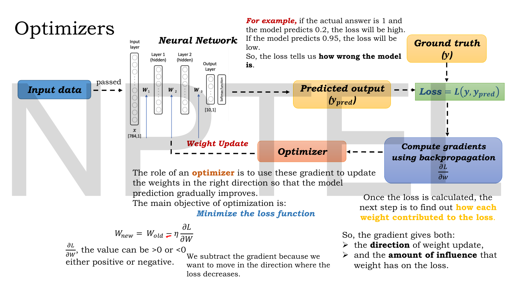
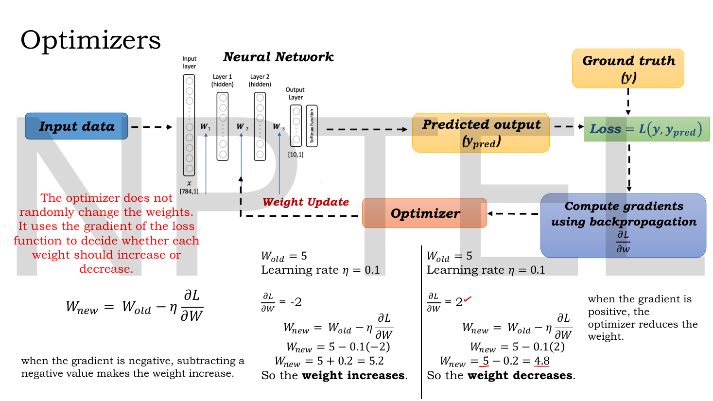
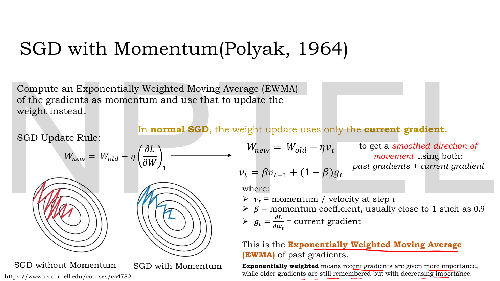
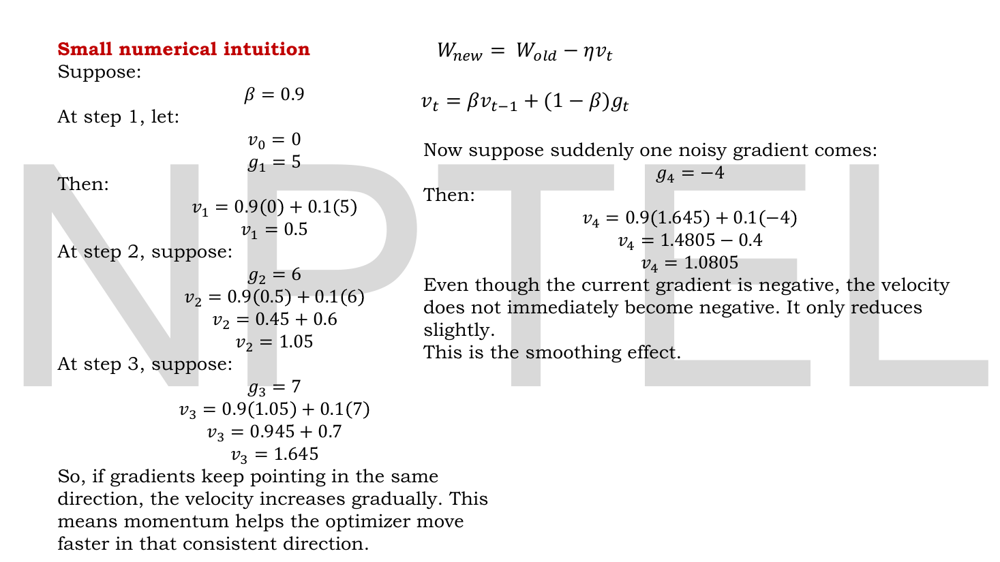

# Lec 03 — Optimizers, Part A

> **Source:** `Lec 03.pdf` (8 pages) · **Week 1** · **Playlist:** Lec 03
> **Prereqs:** [Lec 02 — Activation and Loss Functions](02-activations-and-losses.md)
> **Feeds into:** [Lec 04 — Optimizers, Part B](04-optimizers-b.md), [Lec 05 — Convolutional Neural Network, Part A](05-cnn-a.md)

## Why this lecture exists

Lec 02 gave you a loss — a single number saying how wrong the network is. It did not say what to *do* with that number. Backpropagation turns the loss into a gradient $\partial\mathcal{L}/\partial W$ for every weight; the **optimizer** is the rule that turns those gradients into actual new weight values. That rule is the entire difference between a network that converges in ten epochs and one that oscillates forever.

This lecture builds that rule from nothing. It starts with the one-line update $W_{\text{new}} = W_{\text{old}} - \eta\,\partial\mathcal{L}/\partial W$, shows by arithmetic why the minus sign is there, then asks the two questions that generate every optimizer in this course: *how much data do you look at before each update?* (batch, stochastic, mini-batch) and *should the step depend only on the current gradient?* (momentum). [Lec 04](04-optimizers-b.md) asks the third — *should every weight share one learning rate?* — and answers it with Adam.

## The ideas

### The optimizer's place in the loop


*Fig. — Follow the dashed arrows clockwise: forward to a prediction, compare to ground truth for a loss, backprop for $\partial\mathcal{L}/\partial W$, optimizer, and back into the weights. The optimizer is the only box that **writes**. Everything else just measures. Page 3.*

The loop has four stages and the deck labels them exactly:

1. Input data is passed forward through the layers $W_1, W_2, W_3$ to a predicted output $y_{\text{pred}}$.
2. $y_{\text{pred}}$ is compared against ground truth $y$ to give the **loss** $\mathcal{L}(y, y_{\text{pred}})$ — the deck's example: if the true answer is 1 and the model says 0.2, the loss is high; if it says 0.95, the loss is low. *The loss tells you how wrong the model is.*
3. Backpropagation finds **how each weight contributed to the loss**, i.e. $\partial\mathcal{L}/\partial W$ for every weight.
4. The optimizer uses those gradients to update the weights **in the right direction**.

The deck is precise about what the gradient hands you, and it is two things, not one:

| The gradient gives | Which is |
|---|---|
| its **sign** | the *direction* of the weight update |
| its **magnitude** | the *amount of influence* that weight has on the loss |

> The deck writes the learning rate as $\eta$ throughout, and uses $W$ (capital) for a single scalar weight. This book keeps $\eta$ (never $\alpha$ — see §3 of the contract) and writes $\mathcal{L}$ where the slides write $L$. Those are the only translations needed in this lecture. The deck's $\alpha$, which appears in [Lec 04](04-optimizers-b.md), is *not* a learning rate at all.

### The update rule, and why it subtracts

$$W_{\text{new}} = W_{\text{old}} - \eta\,\frac{\partial\mathcal{L}}{\partial W}$$

**The single objective is to minimise the loss function.** The gradient $\partial\mathcal{L}/\partial W$ points in the direction of *steepest increase* of $\mathcal{L}$. You want to go down, so you go the opposite way — hence the minus. The deck's phrasing: *"we subtract the gradient because we want to move in the direction where the loss decreases."*

The consequence that an MCQ will test is the sign logic, and it is worth doing in your head rather than memorising:


*Fig. — The same $W_{\text{old}} = 5$ and the same $\eta = 0.1$, differing only in the sign of the gradient, and the weight moves in opposite directions by the identical distance $0.2$. Notice also the red note at left: the optimizer **does not randomly change the weights**; the gradient decides. Page 4.*

| $\partial\mathcal{L}/\partial W$ | $-\eta\,\partial\mathcal{L}/\partial W$ | weight | why |
|---|---|---|---|
| positive | negative | **decreases** | increasing $W$ would increase the loss, so back off |
| negative | positive | **increases** | increasing $W$ would decrease the loss, so push on |

Subtracting a negative number adds. That one line is the whole of the deck's left-hand annotation, and it is the most common place for a careless exam slip.

### How much data per update: the three descents

The update rule above never said *which* data the gradient was computed on. That choice gives three named algorithms, and the deck puts them in one table.


*Fig. — Read the middle table left to right: the **only** thing that changes is how many rows go into $\partial\mathcal{L}/\partial W$. The three contour plots at bottom-left are the payoff — batch glides straight in, stochastic zigzags violently, mini-batch is a compromise. Page 5.*

Let $\mathcal{D}$ be the training set with $n$ points.

| Gradient computed on | Name on the deck | Updates per epoch | Path |
|---|---|---|---|
| **one** point of $\mathcal{D}$ | **Stochastic Gradient Descent** | $n$ | violent zigzag |
| a random subset of **$k$** points | **Mini-batch Stochastic Gradient Descent** | $\lceil n/k \rceil$ | mildly noisy |
| **all $n$** points of $\mathcal{D}$ | **Gradient Descent** | $1$ | smooth, direct |

Three things follow, and all three are examinable.

**Why batch gradient descent is smooth.** Averaging over all $n$ points gives the *true* gradient of the training loss. Every step is the genuinely best local direction, so the trajectory is a clean curve into the minimum. The cost is that one step requires a full pass over the data: on 60,000 MNIST images you get one weight update per epoch.

**Why SGD zigzags.** A single point's gradient is a wildly noisy estimate of the true gradient. The expected direction is still correct, but any individual step can point almost anywhere, which is exactly the red scribble on the slide. You get $n$ updates per epoch — enormously more progress per pass — at the cost of never walking in a straight line.

**Why mini-batch is what everyone actually uses.** Averaging $k$ gradients cuts the noise by a factor of roughly $\sqrt{k}$ while costing $k$ times less than a full batch per update. It also maps onto GPU hardware, which multiplies matrices far more efficiently in blocks than one row at a time. Typical $k$: 32, 64, 128, 256.

> **The naming trap.** The slide's table calls the full-data method *"Gradient Descent"*, but the contour plot directly below it is labelled *"Batch Gradient Descent"* — same algorithm, two names on one page. Meanwhile "Mini-batch Stochastic Gradient Descent" is almost always shortened to just "SGD" in practice, including in PyTorch, where `torch.optim.SGD` is mini-batch. If an exam option says "SGD uses one sample", it is using the deck's strict definition and is **correct**; if a code comment says "SGD" it almost certainly means mini-batch. Read the context.

The noise in SGD is not purely a cost. Because each step is a different noisy direction, SGD can rattle out of a shallow local minimum that batch gradient descent would settle into. The deck does not say this; it matters, and it is in *Beyond the slides*.

### Momentum: remember where you were going


*Fig. — Compare the two spirals. Without momentum the path oscillates **across** the valley; with momentum the oscillations cancel and the path runs **along** it. The cancellation is the whole mechanism — opposing gradients average to nearly zero, consistent ones accumulate. Page 6.*

Plain SGD has no memory. The deck states the defect in one sentence: *in normal SGD, the weight update uses only the current gradient.* If that one gradient is noise, you take a step of pure noise.

**Momentum** fixes this by stepping along a smoothed version of the gradient history instead. Define the **velocity** $v_t$ as an **exponentially weighted moving average (EWMA)** of the gradients, and step along $v_t$:

$$v_t = \beta v_{t-1} + (1-\beta)g_t, \qquad W_{\text{new}} = W_{\text{old}} - \eta\, v_t$$

where $g_t = \partial\mathcal{L}/\partial w_t$ is the current gradient, $v_t$ is the velocity at step $t$, and $\beta$ is the **momentum coefficient**, "usually close to 1, such as 0.9". By convention $v_0 = 0$.

**What "exponentially weighted" means.** Expand the recursion once and you see it:

$$v_t = (1-\beta)g_t + \beta(1-\beta)g_{t-1} + \beta^2(1-\beta)g_{t-2} + \cdots$$

Each gradient older by one step is multiplied by one more factor of $\beta$. With $\beta = 0.9$ the current gradient gets weight $0.1$, the previous one $0.09$, the one before $0.081$, and so on — the deck's own words: *recent gradients are given more importance, while older gradients are still remembered but with decreasing importance.* ([Lec 04](04-optimizers-b.md) page 8 writes this expansion out explicitly for squared gradients; the algebra is identical.)

**The memory length.** The weights $(1-\beta)\beta^k$ sum to 1 and decay geometrically, so the EWMA effectively averages the last

$$\frac{1}{1-\beta}\ \text{steps}$$

With $\beta = 0.9$ that is **10 steps**; with $\beta = 0.99$, **100 steps**. This is the number to quote when asked what $\beta$ controls.

**Why it helps, geometrically.** In a long narrow valley the gradient has a large component across the valley (which flips sign every step) and a small component along it (which never does). The across-components alternate and cancel in the average; the along-component is consistent and survives. The EWMA therefore suppresses exactly the oscillation and preserves exactly the progress — that is the blue path on the slide.

### The one thing to be careful about in the deck's momentum formula

There are two momentum conventions in circulation and they differ by a factor of $1/(1-\beta)$:

| | Velocity update | Steady-state velocity under constant $g$ |
|---|---|---|
| **The deck's form** (EWMA / normalised) | $v_t = \beta v_{t-1} + (1-\beta)g_t$ | $v \to g$ |
| Classic Polyak / PyTorch form | $v_t = \beta v_{t-1} + g_t$ | $v \to g/(1-\beta) = 10g$ |

Under the deck's normalised form, $v_t$ climbs from $0$ *up towards* $g$ and never passes it, so the momentum step $\eta v_t$ is never larger than the plain SGD step $\eta g$. The slide's claim that *"momentum helps the optimizer move faster in that consistent direction"* is therefore about building up from a cold start, not about overtaking plain SGD. The classic form really does overtake it, by up to $10\times$ at $\beta = 0.9$.

**Follow the deck in the exam** — it is the deck's equation that will be set. But know both, because N4 below shows the deck's momentum travelling *less* total distance than plain SGD on the deck's own gradients, which looks wrong until you see which convention is in play. PyTorch's `torch.optim.SGD(momentum=0.9)` implements the classic form; multiply its learning rate by about $(1-\beta)$ to match the deck.

### The small numerical the deck works


*Fig. — The last block is the point of the whole slide. A gradient of $-4$ arrives — a complete reversal — and the velocity drops only from $1.645$ to $1.0805$. It stays **positive**. Plain SGD would have turned straight round. Page 7.*

This is reproduced and verified as N2. The two readings the deck wants you to take away:

- **Consistent gradients compound.** $g = 5, 6, 7$ all point the same way, and $v$ climbs $0.5 \to 1.05 \to 1.645$. Momentum accelerates where the terrain agrees.
- **A single noisy gradient cannot derail you.** $g_4 = -4$ reverses sign entirely, but $v_4 = 1.0805$ is still positive and still large. *"Even though the current gradient is negative, the velocity does not immediately become negative. It only reduces slightly. This is the smoothing effect."*

That second property is the whole argument for momentum, and it is why every optimizer from here on — RMSProp, Adam — is built on an EWMA of something.

## Worked numericals

### N1. The deck's two sign cases (page 4)

**Given:** $W_{\text{old}} = 5$, $\eta = 0.1$. Two scenarios: $\partial\mathcal{L}/\partial W = -2$, and $\partial\mathcal{L}/\partial W = +2$.
**Find:** $W_{\text{new}}$ in each case, and the distance moved.

1. **Negative gradient.** $W_{\text{new}} = 5 - 0.1(-2) = 5 - (-0.2) = 5 + 0.2$.
2. So $W_{\text{new}} = 5.2$: the weight **increases**.
3. **Positive gradient.** $W_{\text{new}} = 5 - 0.1(2) = 5 - 0.2$.
4. So $W_{\text{new}} = 4.8$: the weight **decreases**.
5. Distance moved in both cases: $|{-\eta g}| = 0.1 \times 2 = 0.2$.

**Answer:** $5.2$ and $4.8$. Both match the slide exactly. The sign of $g$ chose the direction; $|\eta g| = 0.2$ set the distance, identically in both cases.

### N2. The deck's momentum chain, verified (page 7)

**Given:** $\beta = 0.9$, $v_0 = 0$, gradients $g_1 = 5$, $g_2 = 6$, $g_3 = 7$, then a noisy $g_4 = -4$.
**Find:** $v_1$ through $v_4$.

1. $v_1 = 0.9(0) + 0.1(5) = 0 + 0.5 = \mathbf{0.5}$
2. $v_2 = 0.9(0.5) + 0.1(6) = 0.45 + 0.6 = \mathbf{1.05}$
3. $v_3 = 0.9(1.05) + 0.1(7) = 0.945 + 0.7 = \mathbf{1.645}$
4. $v_4 = 0.9(1.645) + 0.1(-4) = 1.4805 - 0.4 = \mathbf{1.0805}$

**Answer:** $v = 0.5,\ 1.05,\ 1.645,\ 1.0805$. **All four match the slide exactly.**

Sanity check on step 4: the gradient swung by $11$ units (from $+7$ to $-4$), and the velocity moved by only $1.645 - 1.0805 = 0.5645$. The EWMA damped an $11$-unit shock down to a $0.56$-unit one — a factor of about $19.5$. That number *is* the smoothing effect, quantified.

### N3. Moving an actual weight with momentum, and against plain SGD

The deck computes velocities but never applies them to a weight. Do it.

**Given:** everything from N2, plus $W_0 = 5$ and $\eta = 0.1$.
**Find:** the weight trajectory under momentum and under plain SGD on the *same* gradients.

1. **Momentum**, $W_t = W_{t-1} - \eta v_t$:

| $t$ | $g_t$ | $v_t$ | $-\eta v_t$ | $W_t$ |
|---|---|---|---|---|
| 1 | $5$ | $0.5$ | $-0.05$ | $4.95$ |
| 2 | $6$ | $1.05$ | $-0.105$ | $4.845$ |
| 3 | $7$ | $1.645$ | $-0.1645$ | $4.6805$ |
| 4 | $-4$ | $1.0805$ | $-0.10805$ | $4.57245$ |

2. **Plain SGD**, $W_t = W_{t-1} - \eta g_t$: $\ 5 \to 4.5 \to 3.9 \to 3.2 \to 3.6$.

3. Net displacement: momentum $5 - 4.57245 = 0.42755$; plain SGD $5 - 3.6 = 1.4$.

**Answer:** momentum ends at $W_4 = 4.57245$, plain SGD at $W_4 = 3.6$.

Two readings. **Direction:** at step 4 plain SGD *reverses*, moving $+0.4$ back uphill on one noisy gradient; momentum keeps descending, moving $-0.10805$. That is the robustness momentum buys. **Magnitude:** momentum travelled *less* far overall — because the deck's $(1-\beta)$-normalised form caps $v_t$ below $g_t$ while the velocity is still warming up from $v_0 = 0$. With the classic Polyak form the velocities would be $5,\ 10.5,\ 16.45,\ 10.805$ — exactly $10\times$ these, since $1/(1-\beta) = 10$ — and momentum would travel much further.

### N4. Updates per epoch for the three descents

**Given:** the deck's toy training table on page 5 has $n = 5$ samples; separately, MNIST has $n = 60{,}000$. Mini-batch size $k = 2$ for the toy, $k = 128$ for MNIST. Train for 10 epochs.
**Find:** the number of weight updates in each regime.

1. Gradient Descent (all $n$): $1$ update per epoch, regardless of $n$. Toy: $1 \times 10 = \mathbf{10}$. MNIST: $\mathbf{10}$.
2. Stochastic GD (one point): $n$ updates per epoch. Toy: $5 \times 10 = \mathbf{50}$. MNIST: $60{,}000 \times 10 = \mathbf{600{,}000}$.
3. Mini-batch: $\lceil n/k\rceil$ per epoch. Toy: $\lceil 5/2\rceil = 3$, so $3 \times 10 = \mathbf{30}$. MNIST: $\lceil 60000/128\rceil = \lceil 468.75\rceil = 469$, so $469 \times 10 = \mathbf{4{,}690}$.

**Answer:** 10 / 50 / 30 for the toy and 10 / 600,000 / 4,690 for MNIST.

Note the ceiling, not the floor: $60000/128 = 468.75$ means 468 full batches of 128 plus a final partial batch of $60000 - 468\times128 = 96$ samples. Exam questions love this last-batch detail.

### N5. What $\beta$ actually controls

**Given:** $\beta = 0.9$ and $\beta = 0.99$, with $v_0 = 0$.
**Find:** (a) the weight the EWMA puts on the gradient from $k$ steps ago; (b) the effective memory length; (c) the velocity after 30 steps of a constant gradient $g = 7$, at $\beta = 0.9$.

1. (a) Weight on $g_{t-k}$ is $(1-\beta)\beta^k$. At $\beta = 0.9$: $k=0 \to 0.1$, $k=1 \to 0.09$, $k=2 \to 0.081$, $k=3 \to 0.0729$.
2. (b) Memory length $= 1/(1-\beta)$. $\beta = 0.9 \Rightarrow 10$ steps; $\beta = 0.99 \Rightarrow 100$ steps.
3. (c) With constant $g$, the recursion $v_t = \beta v_{t-1} + (1-\beta)g$ has fixed point $v = g$. Starting from $v_0 = 0$, $v_t = g(1 - \beta^t)$. At $t = 30$: $v_{30} = 7(1 - 0.9^{30}) = 7(1 - 0.042391) = 7 \times 0.957609$.

**Answer:** (a) $0.1,\ 0.09,\ 0.081,\ 0.0729$; (b) 10 and 100 steps; (c) $v_{30} = 6.7033$, converging to $7$ from below — confirming that under the deck's convention the velocity approaches the plain gradient and never exceeds it.

### N6. Choosing $\eta$ badly on a quadratic

The deck never shows a *divergent* learning rate. Here is the smallest example that does.

**Given:** $\mathcal{L}(W) = W^2$, so $\partial\mathcal{L}/\partial W = 2W$. Start at $W_0 = 1$. Plain gradient descent.
**Find:** the trajectory for $\eta = 0.1$, $\eta = 0.5$ and $\eta = 1.1$.

1. The update is $W_{t+1} = W_t - \eta(2W_t) = (1 - 2\eta)W_t$. So each step multiplies $W$ by $(1-2\eta)$.
2. $\eta = 0.1$: factor $1 - 0.2 = 0.8$. Trajectory $1 \to 0.8 \to 0.64 \to 0.512 \to \cdots \to 0$. Converges.
3. $\eta = 0.5$: factor $1 - 1 = 0$. Trajectory $1 \to 0$. Reaches the minimum in **one step** — this is the optimal $\eta$ here.
4. $\eta = 1.1$: factor $1 - 2.2 = -1.2$. Trajectory $1 \to -1.2 \to 1.44 \to -1.728 \to \cdots$. $|W|$ grows by $20\%$ per step: **divergence**.

**Answer:** converges, converges instantly, diverges. The threshold is $|1-2\eta| < 1$, i.e. $0 < \eta < 1$. Too large an $\eta$ does not merely slow you down — it makes the loss grow without bound, and that is what a `nan` loss in epoch 1 usually means.

## Code

Running the deck's page-7 numbers against plain SGD, so you can see both the smoothing and the convention issue in one output.

```python
import numpy as np

beta, eta, w0 = 0.9, 0.1, 5.0
grads = np.array([5., 6., 7., -4.])        # the deck's g1..g4, page 7

# --- the deck's EWMA momentum:  v_t = beta*v_{t-1} + (1-beta)*g_t
v, w_m, traj_m, vs = 0.0, w0, [], []
for g in grads:
    v = beta * v + (1 - beta) * g
    w_m -= eta * v
    vs.append(v); traj_m.append(w_m)

# --- plain SGD on the SAME gradients
w_s, traj_s = w0, []
for g in grads:
    w_s -= eta * g
    traj_s.append(w_s)

print("v_t (deck)   =", np.round(vs, 4))
print("W momentum   =", np.round(traj_m, 5))
print("W plain SGD  =", np.round(traj_s, 5))
print("net move, momentum =", round(w0 - traj_m[-1], 5))
print("net move, plain    =", round(w0 - traj_s[-1], 5))

# --- step 4 is the noisy one: who reverses direction?
print("\nstep-4 displacement, momentum =", round(traj_m[-1] - traj_m[-2], 5))
print("step-4 displacement, plain    =", round(traj_s[-1] - traj_s[-2], 5))

# --- steady state: feed a CONSTANT gradient of 7 for 30 steps
v = 0.0
for _ in range(30):
    v = beta * v + (1 - beta) * 7.0
print("\nv after 30 constant g=7 steps:", round(v, 4), " (limit = g = 7.0)")
print("classic Polyak limit g/(1-beta) =", 7.0 / (1 - beta))
```

```
v_t (deck)   = [0.5    1.05   1.645  1.0805]
W momentum   = [4.95    4.845   4.6805  4.57245]
W plain SGD  = [4.5 3.9 3.2 3.6]
net move, momentum = 0.42755
net move, plain    = 1.4

step-4 displacement, momentum = -0.10805
step-4 displacement, plain    = 0.4

v after 30 constant g=7 steps: 6.7033  (limit = g = 7.0)
classic Polyak limit g/(1-beta) = 70.00000000000001
```

The first line reproduces the slide's $v_1 \ldots v_4$ to the digit. The step-4 lines are the headline: on one bad gradient, plain SGD backs up $+0.4$ while momentum continues down $-0.108$. And the final block settles the convention question — the deck's velocity creeps up to $6.7033$ against a limit of exactly $7$, never beyond it.

## Exam pack

### Must-memorise

| Item | Exactly this |
|---|---|
| Gradient-descent update | $W_{\text{new}} = W_{\text{old}} - \eta\,\dfrac{\partial\mathcal{L}}{\partial W}$ |
| Why minus | gradient points **uphill**; you want to minimise $\mathcal{L}$ |
| Gradient's two roles | sign → direction; magnitude → amount of influence |
| Gradient on 1 point | **Stochastic** Gradient Descent |
| Gradient on $k$ points | **Mini-batch** Stochastic Gradient Descent |
| Gradient on all $n$ points | **(Batch) Gradient Descent** |
| Momentum velocity | $v_t = \beta v_{t-1} + (1-\beta)g_t$ |
| Momentum update | $W_{\text{new}} = W_{\text{old}} - \eta\,v_t$ |
| $v_t$ is an | Exponentially Weighted Moving Average (EWMA) of gradients |
| Momentum's attribution | Polyak, 1964 |
| EWMA memory length | $\dfrac{1}{1-\beta}$ steps |
| Weight on gradient $k$ steps old | $(1-\beta)\beta^k$ |
| Updates per epoch, mini-batch | $\lceil n/k \rceil$ |

### Numbers worth knowing

| Quantity | Value |
|---|---|
| Deck's running weight and rate | $W_{\text{old}} = 5$, $\eta = 0.1$ |
| Deck's two sign cases | $g=-2 \Rightarrow 5.2$; $g=+2 \Rightarrow 4.8$ |
| Step size in both | $0.2$ |
| Standard $\beta$ | $0.9$ |
| $1-\beta$ at $\beta=0.9$ | $0.1$ |
| Memory length at $\beta=0.9$ / $0.99$ | 10 / 100 steps |
| Deck's velocity chain | $v = 0.5,\ 1.05,\ 1.645,\ 1.0805$ |
| Deck's gradient chain | $g = 5,\ 6,\ 7,\ -4$ |
| EWMA weights at $\beta=0.9$ | $0.1,\ 0.09,\ 0.081,\ 0.0729,\ldots$ |
| Classic-vs-deck momentum ratio | $1/(1-\beta) = 10$ |
| Typical mini-batch $k$ | 32, 64, 128, 256 |
| Divergence threshold on $\mathcal{L}=W^2$ | $\eta \geq 1$ |

### Likely MCQ traps

- **"Stochastic gradient descent uses a mini-batch."** On this deck, **no**: SGD uses *one* point, mini-batch SGD uses $k$. In PyTorch `torch.optim.SGD` is mini-batch. Answer from the deck's definitions unless the question is explicitly about library code.
- **Getting the sign backwards.** A *negative* gradient makes the weight *increase*, because $-\eta \times(\text{negative})$ is positive. The deck works both cases on page 4 precisely because this is slipped so often.
- **"Gradient Descent" vs "Batch Gradient Descent".** Same thing. The deck's own page 5 uses both names, in the table and the plot respectively.
- **Confusing $\beta$ with $\eta$.** $\eta$ scales the step; $\beta$ sets how long the velocity remembers. Raising $\beta$ does **not** make steps bigger under the deck's formula — it makes them smoother and slower to change.
- **Thinking momentum changes the gradient.** It does not. It changes *what you step along*: $v_t$ instead of $g_t$. The gradient computation is untouched.
- **Forgetting $v_0 = 0$.** Every momentum numerical starts there, which is why $v_1 = (1-\beta)g_1 = 0.1 g_1$ and not $g_1$. If your $v_1$ equals $g_1$ you have used the classic Polyak form.
- **"More updates per epoch means faster convergence."** SGD does $n$ updates per epoch but each is noisy; batch does 1 but it is exact. Wall-clock convergence depends on both, which is why mini-batch wins.
- **Reading the EWMA weights as summing to more than 1.** $\sum_{k\ge0}(1-\beta)\beta^k = 1$ exactly. The velocity is an *average* of gradients, not a sum.
- **Assuming momentum always moves further than plain SGD.** Under the deck's normalised form it never does in a single step (N3). Under Polyak's form it can, by up to $10\times$.

### Self-test

1. $W_{\text{old}} = 2.5$, $\eta = 0.05$, $\partial\mathcal{L}/\partial W = -6$. Find $W_{\text{new}}$.
2. State the deck's three definitions distinguishing GD, SGD and mini-batch SGD by *one* criterion.
3. A dataset has 1,000 samples and you use $k = 64$. How many weight updates in 5 epochs, and how many samples are in the final batch of each epoch?
4. Write the momentum equations and name both hyperparameters with their usual values.
5. With $\beta = 0.9$, $v_0 = 0$ and gradients $2, 2, 2$, compute $v_1, v_2, v_3$. What value is $v_t$ approaching?
6. Why does a gradient of $-4$ arriving after $5, 6, 7$ not flip the sign of the velocity?
7. What weight does an EWMA with $\beta = 0.8$ place on the gradient from 3 steps ago?
8. On $\mathcal{L}(W) = W^2$ starting at $W_0 = 1$, for which $\eta$ does gradient descent diverge?
9. Why does momentum help most in a long narrow valley?
10. Your loss is `nan` after two mini-batches. Name the most likely optimizer-related cause and the first thing to change.

<details><summary>Answers</summary>

1. $W_{\text{new}} = 2.5 - 0.05(-6) = 2.5 + 0.3 = \mathbf{2.8}$. The weight increases, because the gradient was negative.
2. The criterion is **how many points of $\mathcal{D}$ enter $\partial\mathcal{L}/\partial W$**: one point → Stochastic GD; a random subset of $k$ points → Mini-batch SGD; all $n$ points → Gradient Descent.
3. $\lceil 1000/64\rceil = \lceil 15.625\rceil = 16$ updates per epoch, so $16 \times 5 = \mathbf{80}$ updates. Final batch: $1000 - 15\times64 = 1000 - 960 = \mathbf{40}$ samples.
4. $v_t = \beta v_{t-1} + (1-\beta)g_t$ and $W_{\text{new}} = W_{\text{old}} - \eta v_t$. Hyperparameters: $\eta$ the learning rate (e.g. $0.1$) and $\beta$ the momentum coefficient (usually $0.9$).
5. $v_1 = 0.9(0)+0.1(2) = 0.2$; $v_2 = 0.9(0.2)+0.1(2) = 0.18+0.2 = 0.38$; $v_3 = 0.9(0.38)+0.1(2) = 0.342+0.2 = 0.542$. It approaches $g = 2$.
6. Because $v_4 = \beta v_3 + (1-\beta)g_4$ weights the accumulated history by $0.9$ and the new gradient by only $0.1$: $1.4805 - 0.4 = 1.0805$. The history dominates ten to one, so a single reversal cannot overturn it.
7. $(1-0.8)(0.8)^3 = 0.2 \times 0.512 = \mathbf{0.1024}$.
8. The update is $W_{t+1} = (1-2\eta)W_t$, so it diverges when $|1-2\eta| \geq 1$, i.e. $\eta \geq 1$ (and trivially $\eta \leq 0$). It converges fastest at $\eta = 0.5$, which lands on the minimum in one step.
9. Across the valley the gradient alternates sign, so those components cancel in the moving average; along the valley the gradient is consistent, so that component accumulates. Momentum therefore damps the oscillation it should damp and preserves the progress it should preserve.
10. Learning rate too large — the update overshot and the loss grew without bound (N6). First fix: cut $\eta$ by $10\times$. If that is not enough, add gradient clipping, and check that the loss itself is not producing $\log(0)$.

</details>

## Beyond the slides

**Gap: the deck never explains why SGD's noise can be *good*.**
**Why it matters:** the slide shows SGD zigzagging and leaves the impression that noise is purely a defect. It is also the mechanism that lets SGD escape shallow local minima and saddle points, which batch gradient descent — following the exact gradient — walks straight into and stops. This is part of why mini-batch SGD generalises better than full-batch training even when both reach the same training loss, and it is why "just use a bigger batch" is not free. The companion vision course's [gradient-descent notes](../../GenAIforCV/notes/week-02/09-backpropagation.md) make the same point about saddle points in high dimensions, where they vastly outnumber true minima.

**Gap: no learning-rate schedule is mentioned.**
**Why it matters:** $\eta$ is treated as a constant for the whole of training here, and it almost never is in practice. Step decay, cosine annealing and warmup all change $\eta$ over time, and the reason is visible in N6 — a large $\eta$ is right early (fast progress) and wrong late (oscillation around the minimum). [Lec 04](04-optimizers-b.md) gets at the same problem from the opposite direction, by adapting $\eta$ per *parameter* rather than per *step*. The two ideas are complementary and modern training uses both at once.

**Gap: the deck's momentum formula is the normalised EWMA, but every major library implements Polyak's.**
**Why it matters:** the two differ by exactly $1/(1-\beta) = 10$, so a learning rate tuned on one is off by $10\times$ on the other. If you take $\eta = 0.1$ from this lecture into `torch.optim.SGD(lr=0.1, momentum=0.9)` you are effectively running at $\eta = 1.0$, and on most problems that diverges. N3 shows both chains side by side. (There is also Nesterov momentum, which evaluates the gradient at the *look-ahead* point $W - \eta\beta v_{t-1}$ rather than at $W$; the deck does not mention it and it is not examinable here, but it is the `nesterov=True` flag you will meet in code.)

**Gap: nothing is said about where the weights start.**
**Why it matters:** gradient descent is a local method, so the initial $W$ determines which minimum you reach. Initialising all weights to zero makes every neuron in a layer compute the same thing and receive the same gradient forever — the network never breaks symmetry and effectively has one neuron per layer. Xavier and He initialisation exist to fix this, and the NLP companion's [gradient-descent-and-init notes](../../DLforNLP/notes/week-02/10-gradient-descent-and-init.md) cover both schemes properly. This deck's updates all start from a given $W_{\text{old}} = 5$ and never ask where that came from.

## Cut from the slides

Pages 1, 2 and 8 are the title, the one-line session overview ("Optimizers for training deep neural networks") and the thank-you; nothing was lost. Pages 3 and 4 share the same flow diagram, so it is embedded twice only because page 4 adds the two worked sign cases on top of it — the diagram's prose is merged into one reading rather than repeated. The page-3 example about predicting $0.2$ versus $0.95$ against a true label of 1 is folded into the loop description rather than given its own heading, since [Lec 02](02-activations-and-losses.md) owns loss functions. The URL printed on pages 5 and 6 (`cs.cornell.edu/courses/cs4782`) is the source of the contour-plot and momentum-spiral figures and is noted here rather than in the body. The lecturer's handwritten marks — the red circles around $\partial\mathcal{L}/\partial W$ in the page-5 table, the tick beside the positive-gradient case on page 4, the underlines under "Exponentially Weighted Moving Average" on page 6 — are reproduced as emphasis in the prose. Everything else on pages 3 through 7, including every number in the page-4 and page-7 arithmetic, is reproduced in full.
