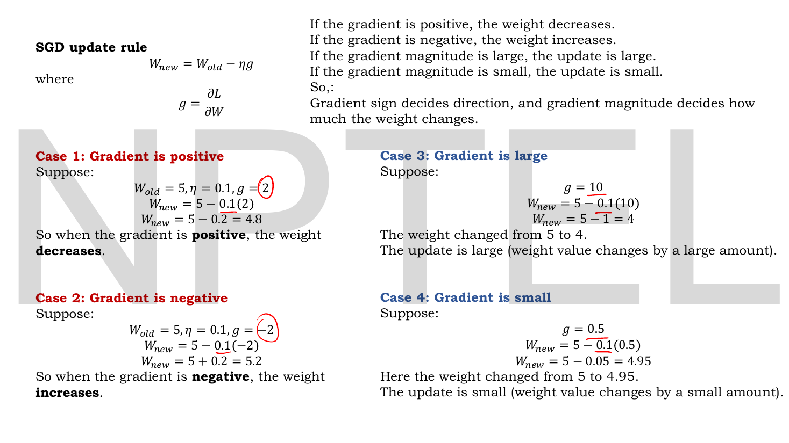
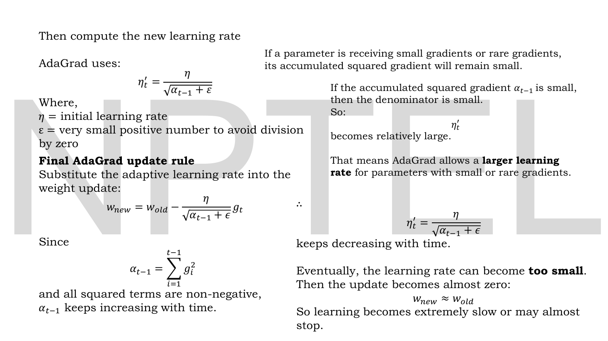
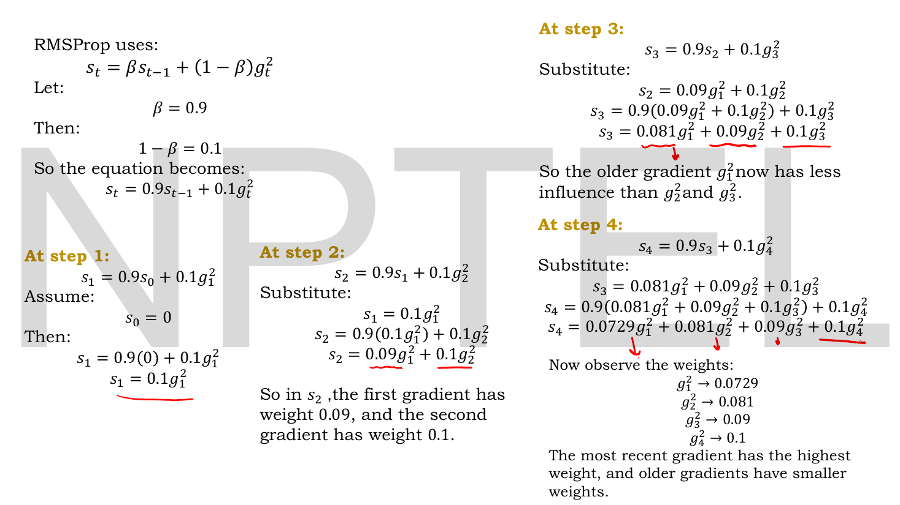

# Lec 04 — Optimizers, Part B

> **Source:** `Lec 04.pdf` (11 pages) · **Week 1** · **Playlist:** Lec 04
> **Prereqs:** [Lec 02 — Activation and Loss Functions](02-activations-and-losses.md), [Lec 03 — Optimizers, Part A](03-optimizers-a.md)
> **Feeds into:** [Lec 05 — Convolutional Neural Network, Part A](05-cnn-a.md), [Lec 16 — Numerical Example, Limitations of AE](16-ae-numerical-and-limits.md)

## Why this lecture exists

[Lec 03](03-optimizers-a.md) left one hyperparameter unexamined: $\eta$. It appeared in every update, was set to $0.1$ every time, and nothing explained how that number was chosen or what happens when it is wrong. This lecture opens with six side-by-side cases that answer the first question arithmetically, then uses them to expose a defect that no single value of $\eta$ can fix.

The defect is this: a real network has millions of weights, and they do not all receive gradients of the same size. One $\eta$ shared by all of them is simultaneously too big for the busy weights and too small for the rare ones. The fix is to give every weight its *own* learning rate, derived from its own gradient history. That idea produces AdaGrad, then RMSProp, then — combined with Lec 03's momentum — **Adam**, the optimizer that trains essentially every model in the rest of this course.

## The ideas

### Where the deck's symbols differ from this book's

Two translations, both important.

| Deck writes | This book writes | Meaning |
|---|---|---|
| $\eta$ | $\eta$ | learning rate — no change; the deck is already correct |
| $\eta'_t$ | $\eta'_t$ | the **adaptive** (per-parameter, per-step) learning rate |
| $\alpha_{t-1}$, $\alpha_t$ | $\alpha_t$ (kept) | **accumulated sum of squared gradients** in AdaGrad |

The third row is the trap. **The deck's $\alpha$ is not a learning rate.** In a great many other textbooks $\alpha$ *is* the learning rate, so a student flipping between sources will read AdaGrad's $\alpha_{t-1}$ as a step size and the formula will make no sense. In this deck $\alpha$ is a running total of $g^2$, which only ever grows. The learning rate is $\eta$ and its adaptive version is $\eta'_t$, exactly as in the contract. The accumulator is written $G_t$ or $v_t$ in most literature; the deck's $\alpha$ is kept here because the exam is set from these slides.

### The learning rate is not the gradient


*Fig. — The canonical learning-rate slide for this whole book. Read the top row across: identical $W_{\text{old}}$, identical gradient, and the weight lands on $4.9$, $4$ and $0$. Then read down the columns: $\eta = 0.01$ with $g=10$ moves the weight $0.1$, while $\eta=0.1$ with $g=1$ also moves it $0.1$. Only the **product** $\eta g$ matters. Page 3.*

The update is still Lec 03's:

$$W_{\text{new}} = W_{\text{old}} - \eta g, \qquad g = \frac{\partial\mathcal{L}}{\partial W}$$

and the step size is the product $\eta g$ — nothing else. The deck fixes $W_{\text{old}} = 5$ and works all six combinations; they are reproduced and verified as **N1**, and you should be able to produce any of them in ten seconds.

| | $\eta = 0.01$ | $\eta = 0.1$ | $\eta = 0.5$ | $\eta = 1$ |
|---|---|---|---|---|
| **Large gradient $g = 10$** | $4.9$ (moved $0.1$) | $4$ (moved $1$) | $0$ (moved $5$) | — |
| **Small gradient $g = 1$** | $4.99$ (moved $0.01$) | $4.9$ (moved $0.1$) | — | $4$ (moved $1$) |

The deck's banner line is the sentence to memorise: **for the same gradient, the learning rate controls how much the weight actually changes.** The bottom-right case is the one to feel: $\eta = 0.5$ with $g = 10$ wipes the weight out entirely, from $5$ to $0$ in a single step. The deck calls this *"too aggressive"*. The top-left case moves the weight by $0.1$ out of $5$ — a $2\%$ change — and the deck calls that *"too slow"*.

### Before that: what the gradient itself contributes


*Fig. — The complementary experiment: $\eta$ is now **fixed** at $0.1$ and the gradient varies. Sign flips the direction (cases 1 and 2); magnitude scales the distance (cases 3 and 4). Page 2.*

This slide restates [Lec 03](03-optimizers-a.md)'s sign analysis and extends it to magnitude. The deck's summary line:

> **Gradient sign decides direction, and gradient magnitude decides how much the weight changes.**

Put page 2 and page 3 together and you have the complete picture of plain SGD's step: $\text{sign}(g)$ sets the direction, and $\eta \times |g|$ sets the distance, with $\eta$ and $|g|$ perfectly interchangeable in that product. All four cases are verified in **N2**.

### Why one global $\eta$ cannot be right


*Fig. — The same two extreme cases from page 3, now reinterpreted as **two different weights in the same network at the same moment**. There is no single $\eta$ that serves both. The red line at the bottom is the thesis of the rest of the lecture. Page 4.*

The argument, in the deck's order:

1. A real network has thousands or millions of weights.
2. They do not all receive gradients of the same magnitude. Some weights receive **large gradients frequently**; others receive **small or rare gradients**. (The textbook example is a word embedding: the row for "the" is updated in every batch, the row for a rare technical term almost never.)
3. **Standard SGD uses the same learning rate for every weight.** This may not be ideal.
4. A weight already taking large steps needs a *small* $\eta$, or it overshoots — the $5 \to 0$ collapse.
5. A weight taking tiny steps needs a *large* $\eta$, or it never arrives — the $5 \to 4.99$ crawl.
6. Therefore: *if a parameter has received large gradients many times in the past, reduce its learning rate; if it has received small or rare gradients, allow it a relatively larger learning rate.*

Point 6 is the specification. Note what it requires: a per-parameter **memory of past gradient magnitudes**. Everything in the rest of this lecture is a different way of storing that memory.

### AdaGrad


*Fig. — The whole idea in one substitution: replace the constant $\eta$ (circled in red at the top) with a quantity $\eta'_t$ that is different for every weight. The accumulator below is how it knows which weights have been busy. Page 5.*

**AdaGrad** (*adaptive gradient*) changes the learning rate separately for each weight by tracking the **sum of squares of past gradients**. For one parameter:

$$\alpha_t = \sum_{i=1}^{t} g_i^2, \qquad g_i = \frac{\partial\mathcal{L}}{\partial w_i}$$

The deck's recipe, verbatim: *at each step, take the gradient, square it, add it to the previous total.* Squaring does two jobs — it discards the sign (so oscillation does not cancel out the way it does in momentum) and it weights large gradients disproportionately.


*Fig. — The two halves of AdaGrad's character are on the same slide. Left column: rare-gradient weights get a small denominator and hence a **large** $\eta'_t$ — the feature. Right column: $\alpha$ only ever grows, so $\eta'_t$ only ever shrinks, until $w_{\text{new}} \approx w_{\text{old}}$ — the fatal bug. Page 6.*

The adaptive rate and the update rule:

$$\eta'_t = \frac{\eta}{\sqrt{\alpha_{t-1} + \varepsilon}}, \qquad w_{\text{new}} = w_{\text{old}} - \frac{\eta}{\sqrt{\alpha_{t-1}+\varepsilon}}\,g_t$$

where $\eta$ is the **initial** learning rate and $\varepsilon$ is "a very small positive number to avoid division by zero" (in practice $10^{-8}$).

**Why it does what the spec asked.** A parameter receiving small or rare gradients accumulates a small $\alpha$; a small denominator makes $\eta'_t$ large, so that parameter is allowed big steps. A parameter hammered by large gradients accumulates a huge $\alpha$ and is throttled. Exactly points 4–6 above, automatically, per weight, with no tuning.

**Why it eventually fails.** Every term $g_i^2$ is non-negative, so $\alpha_t$ is **monotonically increasing** — it can never come down, even if the gradients become tiny. So $\eta'_t$ is monotonically *decreasing*, and it decreases toward zero. The deck is blunt about the consequence: *eventually the learning rate can become too small. Then the update becomes almost zero: $w_{\text{new}} \approx w_{\text{old}}$. So learning becomes extremely slow or may almost stop.* On a deep network this can happen well before the loss has converged. **N3** shows $\eta'_t$ halving in four steps.

> **A real inconsistency on the slides.** Page 6's update rule uses $\alpha_{t-1} = \sum_{i=1}^{t-1}g_i^2$ — the sum over gradients *before* the current one. Page 7 then writes AdaGrad as $\alpha_t = \sum_{i=1}^{t}g_i^2$, which *includes* the current gradient, and that is the standard definition. The difference is not cosmetic. With $\alpha_0 = 0$, the page-6 version gives a first step of $\eta/\sqrt{\varepsilon} = 0.1/10^{-4} = 1000$ — a learning rate of **one thousand**, which detonates the weight on step 1 (N3 shows the explosion). Use $\alpha_t$, including the current gradient. If an exam option hinges on it, the standard and page-7 form is the defensible one.

### RMSProp


*Fig. — One symbol changes everything. AdaGrad **sums**; RMSProp **averages**. A sum has no upper bound; an EWMA does, so the denominator stops growing and the learning rate stops dying. Page 7.*

**RMSProp** (*root mean square propagation*) keeps the same architecture — divide $\eta$ by the square root of a squared-gradient statistic — and changes only how that statistic is maintained. Instead of accumulating all past squared gradients indefinitely, it keeps an **EWMA of recent squared gradients**:

$$s_t = \beta s_{t-1} + (1-\beta)g_t^2$$

with $s_t$ the EWMA of squared gradients at step $t$, $\beta$ a **decay factor** "usually close to 1, such as 0.9", and $s_0 = 0$. The adaptive rate and update:

$$\eta'_t = \frac{\eta}{\sqrt{s_t}+\varepsilon}, \qquad w_{\text{new}} = w_{\text{old}} - \frac{\eta}{\sqrt{s_t + \epsilon}}\,g_t$$

This is structurally identical to [Lec 03](03-optimizers-a.md)'s momentum, with $g_t^2$ in place of $g_t$. The deck spells out the consequence at $\beta = 0.9$: *the previous value is retained with weight $0.9$ and the current squared gradient contributes with weight $0.1$. Older gradients are repeatedly multiplied by $0.9$, so their influence gradually decreases.* That decay is the whole fix — a gradient from 100 steps ago has weight $0.1\times0.9^{100} \approx 2.7\times10^{-6}$ and no longer suppresses the learning rate.

> Notice that the slide writes $\varepsilon$ **outside** the square root in $\eta'_t$ and **inside** it in the update rule, on the same line. The two differ only in the eighth decimal place and no exam can turn on it, but the standard convention is outside: $\eta/(\sqrt{s_t}+\varepsilon)$.


*Fig. — The algebra behind "exponentially weighted", written out. Each step back in time multiplies by another $0.9$. Now add the four weights up: $0.0729+0.081+0.09+0.1 = 0.3439$, not $1$ — the slide does not remark on this, and it is the exact reason Adam needs bias correction. Page 8.*

The expansion is verified in **N4**. The weights the deck lists —

$$g_1^2 \to 0.0729,\quad g_2^2 \to 0.081,\quad g_3^2 \to 0.09,\quad g_4^2 \to 0.1$$

— are a geometric sequence with ratio $0.9$, confirming the deck's reading that *the most recent gradient has the highest weight and older gradients have smaller weights*. But they sum to $0.3439$, which is $1 - 0.9^4$. An "average" whose weights sum to a third is not an average; it is a third of one. Early in training $s_t$ is therefore **badly underestimated**, the denominator $\sqrt{s_t}$ is too small, and the effective learning rate is too *large*. Hold on to that; it is the next section.

### Adam


*Fig. — Adam's entire structure in one equation: the **numerator** is Lec 03's momentum, the **denominator** is RMSProp. Momentum chooses the direction; RMSProp chooses the scale. Note the two different decay rates — $\beta_1 = 0.9$ for gradients, $\beta_2 = 0.999$ for squared gradients. Page 9.*

**Adam** stands for **Adaptive Moment Estimation**, and the deck's one-line summary is exactly right:

$$\textbf{Adam} = \textbf{Momentum} + \textbf{RMSProp}$$

It keeps two running quantities per parameter.

**1) The momentum term — the first moment estimate.** An EWMA of the gradients themselves, giving the *mean* gradient direction:

$$v_t = \beta_1 v_{t-1} + (1-\beta_1)g_t, \qquad \beta_1 = 0.9$$

**2) The RMSProp term — the second moment estimate.** An EWMA of the squared gradients, giving the *uncentred variance*, i.e. the typical gradient magnitude:

$$s_t = \beta_2 s_{t-1} + (1-\beta_2)g_t^2, \qquad \beta_2 = 0.999$$

They are called *moments* because $\mathbb{E}[g]$ is the first moment of the gradient's distribution and $\mathbb{E}[g^2]$ is the second — the name "Adaptive Moment Estimation" is literal, and $v_t$ and $s_t$ are *estimates* of those two moments from the samples seen so far. Both start at zero: $v_0 = s_0 = 0$.

The deck's update rule:

$$w_{\text{new}} = w_{\text{old}} - \eta\,\frac{v_t}{\sqrt{s_t}+\epsilon}$$

**Why $\beta_2 = 0.999$ and not $0.9$.** The second moment is a scale estimate and you want it stable — a noisy denominator makes the step size jitter. Memory length $1/(1-\beta_2) = 1000$ steps, against $1/(1-\beta_1) = 10$ steps for the direction. Direction should react quickly; scale should not.

**What the ratio means.** $v_t/\sqrt{s_t}$ is roughly (mean gradient) / (root-mean-square gradient), a **dimensionless signal-to-noise ratio** bounded near $\pm1$. If a parameter's gradients are consistent, $|v_t| \approx \sqrt{s_t}$ and the ratio is near $1$, so the step is about $\eta$. If they are noisy and cancelling, $|v_t| \ll \sqrt{s_t}$ and the step shrinks. This is why Adam's step size is approximately $\eta$ regardless of gradient scale — and why $\eta = 0.001$ works across wildly different architectures where a raw SGD learning rate would have to be retuned every time.

### Bias correction — the part the deck omits

The slides stop at the update rule above. They are incomplete, and the missing piece is visible in their own page-8 arithmetic.

Both $v_t$ and $s_t$ start at zero. At $t=1$:

$$v_1 = (1-\beta_1)g_1 = 0.1\,g_1, \qquad s_1 = (1-\beta_2)g_1^2 = 0.001\,g_1^2$$

If the true mean gradient is $g_1$, the estimate $v_1$ is a tenth of it; if the true second moment is $g_1^2$, the estimate $s_1$ is a thousandth of it. Both are biased toward zero, and $s_t$ far worse than $v_t$ because $\beta_2$ is closer to 1. In general the EWMA weights sum to $1-\beta^t$, not $1$ — exactly the $0.3439$ you computed off the deck's page-8 slide. So divide by that:

$$\hat{v}_t = \frac{v_t}{1-\beta_1^{\,t}}, \qquad \hat{s}_t = \frac{s_t}{1-\beta_2^{\,t}}$$

$$\boxed{\;w_{\text{new}} = w_{\text{old}} - \eta\,\frac{\hat{v}_t}{\sqrt{\hat{s}_t}+\epsilon}\;}$$

That is the real Adam, as published (Kingma & Ba, 2015) and as implemented in `torch.optim.Adam`. The correction is large at the start and vanishes as $t$ grows: $1-\beta_1^t \to 1$ and $1-\beta_2^t \to 1$, so after a few thousand steps $\hat{v}_t = v_t$ and $\hat{s}_t = s_t$ to many decimal places.

**How wrong is the uncorrected version?** On the very first step, with $\hat{v}_1 = g_1$ and $\hat{s}_1 = g_1^2$, the corrected step is exactly $\eta$ — a beautifully clean property. The uncorrected step is

$$\eta\,\frac{(1-\beta_1)g_1}{\sqrt{(1-\beta_2)g_1^2}} = \eta\,\frac{1-\beta_1}{\sqrt{1-\beta_2}} = \eta\,\frac{0.1}{\sqrt{0.001}} = 3.1623\,\eta$$

**more than three times too large**, in whichever direction the first noisy mini-batch happened to point. **N5 and N6** compute both. Expect bias correction to be examined — it is the one piece of Adam that has a formula you must actually recall.

### The default hyperparameters

| Hyperparameter | Default | What it controls |
|---|---|---|
| $\eta$ | $0.001$ ($10^{-3}$) | overall step scale; roughly the per-step distance |
| $\beta_1$ | $0.9$ | decay for the first moment (direction); memory $\approx 10$ steps |
| $\beta_2$ | $0.999$ | decay for the second moment (scale); memory $\approx 1000$ steps |
| $\epsilon$ | $10^{-8}$ | numerical floor on the denominator |

The deck gives $\beta_1 = 0.9$ and $\beta_2 = 0.999$ but not $\eta$ or $\epsilon$. Learn all four as a block — "one e-minus-three, point nine, point nine nine nine, one e-minus-eight" — because MCQs quote them verbatim.

### The four optimizers side by side

| | Direction stepped along | Step scaled by | Fixes | Breaks |
|---|---|---|---|---|
| **SGD** | $g_t$ | $\eta$ | — | noisy; one $\eta$ for all weights |
| **Momentum** | $v_t$ (EWMA of $g$) | $\eta$ | noise, oscillation | still one $\eta$ for all weights |
| **AdaGrad** | $g_t$ | $\eta/\sqrt{\alpha_t}$, $\alpha_t = \sum g_i^2$ | per-weight rates | $\eta'_t \to 0$; learning stalls |
| **RMSProp** | $g_t$ | $\eta/\sqrt{s_t}$, $s_t$ = EWMA of $g^2$ | AdaGrad's decay | no direction smoothing |
| **Adam** | $\hat{v}_t$ (EWMA of $g$) | $\eta/\sqrt{\hat{s}_t}$ | both, plus the cold start | extra memory, $2\times$ parameters |

Read the "Fixes" column downward and you have the lecture's narrative in five lines. The memory cost is worth stating: Adam stores $v_t$ and $s_t$ for *every* parameter, so optimizer state is $2\times$ the model size. For a 1-billion-parameter model in float32 that is 8 GB of optimizer state on top of 4 GB of weights — a fact that shapes how large language models are trained.

## Worked numericals

### N1. The six learning-rate cases (page 3) — the canonical numerical

**Given:** $W_{\text{old}} = 5$ throughout. Top block: large gradient $g = 10$ at $\eta = 0.01,\ 0.1,\ 0.5$. Bottom block: small gradient $g = 1$ at $\eta = 0.01,\ 0.1,\ 1$.
**Find:** $W_{\text{new}}$ in all six, and the distance moved.

Large gradient, $g = 10$:

1. $\eta = 0.01$: $W_{\text{new}} = 5 - 0.01(10) = 5 - 0.1 = \mathbf{4.9}$. Moved $0.1$. *Small change in the weight.*
2. $\eta = 0.1$: $W_{\text{new}} = 5 - 0.1(10) = 5 - 1 = \mathbf{4}$. Moved $1$.
3. $\eta = 0.5$: $W_{\text{new}} = 5 - 0.5(10) = 5 - 5 = \mathbf{0}$. Moved $5$ — the entire weight.

Small gradient, $g = 1$:

4. $\eta = 0.01$: $W_{\text{new}} = 5 - 0.01(1) = 5 - 0.01 = \mathbf{4.99}$. Moved $0.01$.
5. $\eta = 0.1$: $W_{\text{new}} = 5 - 0.1(1) = 5 - 0.1 = \mathbf{4.9}$. Moved $0.1$.
6. $\eta = 1$: $W_{\text{new}} = 5 - 1(1) = 5 - 1 = \mathbf{4}$. Moved $1$.

**Answer:** $4.9,\ 4,\ 0$ and $4.99,\ 4.9,\ 4$. **All six match the slide exactly.**

Three readings worth having ready.

- **The step is the product.** Case 1 ($\eta=0.01$, $g=10$) and case 5 ($\eta=0.1$, $g=1$) both have $\eta g = 0.1$ and both land on $4.9$. Case 2 and case 6 both have $\eta g = 1$ and both land on $4$. The optimizer cannot tell a large gradient with a small rate from a small gradient with a large rate.
- **The dynamic range is $500\times$.** Smallest step $0.01$, largest $5$, from learning rates spanning only $0.01$ to $1$ and gradients spanning $1$ to $10$.
- **Case 3 is the pathology.** $5 \to 0$ is not a step toward a minimum, it is an erasure. Step sizes comparable to the weight itself are how training diverges.

### N2. The four gradient cases (page 2)

**Given:** $W_{\text{old}} = 5$, $\eta = 0.1$ fixed. $g = 2,\ -2,\ 10,\ 0.5$.
**Find:** $W_{\text{new}}$ in each case.

1. **Positive, $g = 2$:** $5 - 0.1(2) = 5 - 0.2 = \mathbf{4.8}$. Weight **decreases**.
2. **Negative, $g = -2$:** $5 - 0.1(-2) = 5 + 0.2 = \mathbf{5.2}$. Weight **increases**.
3. **Large, $g = 10$:** $5 - 0.1(10) = 5 - 1 = \mathbf{4}$. Large update.
4. **Small, $g = 0.5$:** $5 - 0.1(0.5) = 5 - 0.05 = \mathbf{4.95}$. Small update.

**Answer:** $4.8,\ 5.2,\ 4,\ 4.95$. **All four match the slide exactly.** Cases 1–2 isolate the *sign*; cases 3–4 isolate the *magnitude*.

### N3. AdaGrad over four steps, and the collapse of $\eta'_t$

**Given:** one parameter, $w_0 = 5$, initial $\eta = 0.1$, $\varepsilon = 10^{-8}$, gradients $g = 5,\ 6,\ 7,\ -4$ (the stream from [Lec 03](03-optimizers-a.md) page 7, reused so you can compare optimizers directly).
**Find:** $\alpha_t$, $\eta'_t$, the step and $w$ at each of four steps, using the standard $\alpha_t = \sum_{i=1}^{t}g_i^2$.

1. $t=1$: $\alpha_1 = 5^2 = 25$. $\eta'_1 = 0.1/\sqrt{25} = 0.1/5 = 0.02$. Step $= 0.02 \times 5 = 0.1$. $w = 5 - 0.1 = 4.9$.
2. $t=2$: $\alpha_2 = 25 + 36 = 61$. $\sqrt{61} = 7.8102$. $\eta'_2 = 0.1/7.8102 = 0.012804$. Step $= 0.012804\times6 = 0.076822$. $w = 4.823178$.
3. $t=3$: $\alpha_3 = 61 + 49 = 110$. $\sqrt{110} = 10.4881$. $\eta'_3 = 0.009535$. Step $= 0.009535\times7 = 0.066742$. $w = 4.756436$.
4. $t=4$: $\alpha_4 = 110 + 16 = 126$. $\sqrt{126} = 11.2250$. $\eta'_4 = 0.008909$. Step $= 0.008909\times(-4) = -0.035635$. $w = 4.792071$.

**Answer:** $w$ runs $5 \to 4.9 \to 4.8232 \to 4.7564 \to 4.7921$, and the effective learning rate decays $0.02 \to 0.0128 \to 0.00953 \to 0.00891$ — **less than half its initial value after four steps**, with no sign of levelling off. Extrapolate: after $t$ steps with gradients of typical size $\bar g$, $\alpha_t \approx t\bar g^2$ and $\eta'_t \approx \eta/(\bar g\sqrt{t})$, so the rate falls like $1/\sqrt{t}$ forever. That is AdaGrad's fatal $1/\sqrt{t}$ decay.

> **The deck's $\alpha_{t-1}$ version, for contrast.** Using page 6's literal formula, step 1 has $\alpha_0 = 0$, so $\eta'_1 = 0.1/\sqrt{10^{-8}} = 0.1/10^{-4} = 1000$ and the step is $1000\times5 = 5000$, sending $w$ from $5$ to $-4995$. The weight is destroyed on the first update. This is why the accumulator must include $g_t$.

### N4. RMSProp over the same four steps, and the deck's weight expansion

**Given:** the same stream $g = 5,\ 6,\ 7,\ -4$, $\beta = 0.9$, $s_0 = 0$, $\eta = 0.1$, $w_0 = 5$.
**Find:** (a) $s_t$ and $\eta'_t$ at each step; (b) verify the deck's page-8 weights; (c) what the weights sum to.

(a) Using $s_t = 0.9s_{t-1} + 0.1g_t^2$:

1. $s_1 = 0.9(0) + 0.1(25) = 2.5$. $\eta'_1 = 0.1/\sqrt{2.5} = 0.063246$. Step $= 0.316228$. $w = 4.683772$.
2. $s_2 = 0.9(2.5) + 0.1(36) = 2.25 + 3.6 = 5.85$. $\eta'_2 = 0.1/\sqrt{5.85} = 0.041345$. Step $= 0.248069$. $w = 4.435703$.
3. $s_3 = 0.9(5.85) + 0.1(49) = 5.265 + 4.9 = 10.165$. $\eta'_3 = 0.031365$. Step $= 0.219556$. $w = 4.216147$.
4. $s_4 = 0.9(10.165) + 0.1(16) = 9.1485 + 1.6 = 10.7485$. $\eta'_4 = 0.030502$. Step $= -0.122007$. $w = 4.338155$.

(b) Expanding the recursion symbolically, exactly as the slide does:

- $s_1 = 0.1g_1^2$
- $s_2 = 0.9(0.1g_1^2) + 0.1g_2^2 = 0.09g_1^2 + 0.1g_2^2$
- $s_3 = 0.9(0.09g_1^2 + 0.1g_2^2) + 0.1g_3^2 = 0.081g_1^2 + 0.09g_2^2 + 0.1g_3^2$
- $s_4 = 0.9(0.081g_1^2+0.09g_2^2+0.1g_3^2) + 0.1g_4^2 = 0.0729g_1^2 + 0.081g_2^2 + 0.09g_3^2 + 0.1g_4^2$

Cross-check against (a): $0.0729(25) + 0.081(36) + 0.09(49) + 0.1(16) = 1.8225 + 2.916 + 4.41 + 1.6 = 10.7485$. ✓ Matches $s_4$ exactly.

(c) $0.0729 + 0.081 + 0.09 + 0.1 = 0.3439 = 1 - 0.9^4$.

**Answer:** **every number on the slide checks out.** The effective learning rate decays $0.0632 \to 0.0413 \to 0.0314 \to 0.0305$ and is clearly *flattening* — compare AdaGrad's, which was still falling. And the weights sum to $0.3439$ rather than $1$, which is the bias that N6 corrects.

Contrast the two optimizers on identical gradients: after four steps AdaGrad has moved the weight $0.2079$ and RMSProp $0.6618$. RMSProp stays three times more active because its denominator stopped growing.

### N5. One Adam step, by hand, at the defaults

**Given:** $w_0 = 5$, $\eta = 0.001$, $\beta_1 = 0.9$, $\beta_2 = 0.999$, $\epsilon = 10^{-8}$, $v_0 = s_0 = 0$, and a first gradient $g_1 = 5$.
**Find:** $w_1$, with bias correction and without.

1. First moment: $v_1 = 0.9(0) + 0.1(5) = 0.5$.
2. Second moment: $s_1 = 0.999(0) + 0.001(25) = 0.025$.
3. Bias-correct the first moment: $\hat v_1 = v_1/(1-\beta_1^1) = 0.5/(1-0.9) = 0.5/0.1 = 5$. (Exactly $g_1$, as it must be after one sample.)
4. Bias-correct the second: $\hat s_1 = s_1/(1-\beta_2^1) = 0.025/(1-0.999) = 0.025/0.001 = 25$. (Exactly $g_1^2$.)
5. Step $= \eta\,\hat v_1/(\sqrt{\hat s_1}+\epsilon) = 0.001 \times 5/(5 + 10^{-8}) = 0.001 \times 1.0 = 0.001$.
6. $w_1 = 5 - 0.001 = 4.999$.
7. **Without** correction: step $= 0.001 \times 0.5/(\sqrt{0.025} + 10^{-8}) = 0.001 \times 0.5/0.158114 = 0.0031623$. $w_1 = 4.9968377$.

**Answer:** corrected $w_1 = \mathbf{4.999}$ — a step of exactly $\eta$. Uncorrected $w_1 = 4.99684$, a step of $0.0031623 = 3.1623\,\eta$, **$3.16\times$ too large**.

Step 5 is the single most useful fact about Adam: **on the first step the bias-corrected update is exactly $\eta$, whatever the gradient is.** Had $g_1$ been $500$ instead of $5$, $\hat v_1 = 500$, $\hat s_1 = 250000$, $\sqrt{\hat s_1} = 500$, and the step would still be $0.001$. Adam is scale-invariant in the gradient — that is the property SGD does not have, and the reason $\eta = 0.001$ transfers across architectures.

And the inflation factor is not accidental: $\dfrac{1-\beta_1}{\sqrt{1-\beta_2}} = \dfrac{0.1}{\sqrt{0.001}} = \dfrac{0.1}{0.0316228} = 3.1623$.

### N6. Four Adam steps, corrected and uncorrected

**Given:** everything from N5, with the full stream $g = 5,\ 6,\ 7,\ -4$.
**Find:** both trajectories.

| $t$ | $g_t$ | $v_t$ | $s_t$ | $\hat v_t$ | $\hat s_t$ | corrected step | uncorrected step |
|---|---|---|---|---|---|---|---|
| 1 | $5$ | $0.5000$ | $0.025000$ | $5.0000$ | $25.000$ | $0.0010000$ | $0.0031623$ |
| 2 | $6$ | $1.0500$ | $0.060975$ | $5.5263$ | $30.503$ | $0.0010006$ | $0.0042522$ |
| 3 | $7$ | $1.6450$ | $0.109914$ | $6.0701$ | $36.675$ | $0.0010023$ | $0.0049618$ |
| 4 | $-4$ | $1.0805$ | $0.125804$ | $3.1419$ | $31.498$ | $0.0005598$ | $0.0030463$ |

Working one row to show the pattern — $t=2$: $v_2 = 0.9(0.5)+0.1(6) = 1.05$; $s_2 = 0.999(0.025)+0.001(36) = 0.024975+0.036 = 0.060975$; $\hat v_2 = 1.05/(1-0.81) = 1.05/0.19 = 5.5263$; $\hat s_2 = 0.060975/(1-0.998001) = 0.060975/0.001999 = 30.5028$; step $= 0.001\times5.5263/\sqrt{30.5028} = 0.001\times5.5263/5.5230 = 0.0010006$.

**Answer:** corrected $w_4 = 4.9964372$; uncorrected $w_4 = 4.9845774$. The uncorrected path has travelled $3.3\times$ further.

The corrected column is the thing to stare at: $0.0010000,\ 0.0010006,\ 0.0010023$ — **three consecutive steps of essentially exactly $\eta$**, because the gradients were consistent in sign so $\hat v_t/\sqrt{\hat s_t} \approx 1$. Then step 4 arrives with a sign reversal, the signal-to-noise ratio drops to $3.1419/5.6123 = 0.56$, and Adam automatically halves its step. No tuning, no schedule — that is adaptivity doing its job. Note also that $v_1 \ldots v_4$ here ($0.5,\ 1.05,\ 1.645,\ 1.0805$) are *numerically identical* to Lec 03's momentum chain, because $\beta_1 = \beta$ and the formula is the same.

### N7. How long does bias correction matter?

**Given:** $\beta_1 = 0.9$, $\beta_2 = 0.999$.
**Find:** the step $t$ at which each correction factor $1-\beta^t$ first exceeds $0.99$ (i.e. the correction is below $1\%$).

1. First moment: solve $1 - 0.9^t > 0.99 \Rightarrow 0.9^t < 0.01 \Rightarrow t > \ln(0.01)/\ln(0.9) = (-4.6052)/(-0.10536) = 43.7$. So $t = \mathbf{44}$.
2. Second moment: $0.999^t < 0.01 \Rightarrow t > \ln(0.01)/\ln(0.999) = (-4.6052)/(-0.0010005) = 4602.2$. So $t = \mathbf{4603}$.

**Answer:** $t = 44$ and $t = 4603$. Bias correction on the *first* moment is irrelevant after a few dozen steps; on the *second* moment it matters for the first several thousand — which on a typical mini-batch schedule is most of the first epoch. That asymmetry, caused purely by $\beta_2$ being ten times closer to 1, is why dropping bias correction (as the slides do) is a real error and not a simplification.

## Code

All four adaptive quantities on the same gradient stream, so the decay behaviours line up column by column.

```python
import numpy as np

g = np.array([5., 6., 7., -4.])      # same gradient stream throughout
eta, eps = 0.1, 1e-8
w0 = 5.0

def adagrad(g, eta, eps):            # alpha_t = sum of ALL squared grads so far
    a, w, out = 0.0, w0, []
    for gt in g:
        a += gt**2
        lr = eta / np.sqrt(a + eps)
        w -= lr * gt
        out.append((a, lr, w))
    return out

def rmsprop(g, eta, eps, beta=0.9):  # s_t = EWMA of squared grads
    s, w, out = 0.0, w0, []
    for gt in g:
        s = beta * s + (1 - beta) * gt**2
        lr = eta / np.sqrt(s + eps)
        w -= lr * gt
        out.append((s, lr, w))
    return out

print(" t   AdaGrad a_t   eta'      W        |   RMSProp s_t  eta'      W")
for t, (A, R) in enumerate(zip(adagrad(g, eta, eps), rmsprop(g, eta, eps)), 1):
    print(f" {t}   {A[0]:9.4f}  {A[1]:.6f}  {A[2]:.5f}   |   {R[0]:8.4f}  {R[1]:.6f}  {R[2]:.5f}")

# ---------- Adam, with and without bias correction, at the DEFAULTS ----------
b1, b2, lr, e = 0.9, 0.999, 0.001, 1e-8
v = s = 0.0; w_c = w_u = w0
print("\n t   v_t      s_t        v_hat    s_hat     step(corrected)  step(uncorrected)")
for t, gt in enumerate(g, 1):
    v = b1*v + (1-b1)*gt;  s = b2*s + (1-b2)*gt**2
    vh = v / (1 - b1**t);  sh = s / (1 - b2**t)
    step_c = lr * vh / (np.sqrt(sh) + e)
    step_u = lr * v  / (np.sqrt(s)  + e)
    w_c -= step_c; w_u -= step_u
    print(f" {t}  {v:7.4f}  {s:9.6f}  {vh:7.4f}  {sh:8.4f}   {step_c:.7f}        {step_u:.7f}")
print(f"\nAdam W after 4 steps: corrected {w_c:.7f}   uncorrected {w_u:.7f}")
print("first-step inflation without bias correction = (1-b1)/sqrt(1-b2) =",
      round((1-b1)/np.sqrt(1-b2), 4))
```

```
 t   AdaGrad a_t   eta'      W        |   RMSProp s_t  eta'      W
 1     25.0000  0.020000  4.90000   |     2.5000  0.063246  4.68377
 2     61.0000  0.012804  4.82318   |     5.8500  0.041345  4.43570
 3    110.0000  0.009535  4.75644   |    10.1650  0.031365  4.21615
 4    126.0000  0.008909  4.79207   |    10.7485  0.030502  4.33815

 t   v_t      s_t        v_hat    s_hat     step(corrected)  step(uncorrected)
 1   0.5000   0.025000   5.0000   25.0000   0.0010000        0.0031623
 2   1.0500   0.060975   5.5263   30.5028   0.0010006        0.0042522
 3   1.6450   0.109914   6.0701   36.6747   0.0010023        0.0049618
 4   1.0805   0.125804   3.1419   31.4982   0.0005598        0.0030463

Adam W after 4 steps: corrected 4.9964372   uncorrected 4.9845774
first-step inflation without bias correction = (1-b1)/sqrt(1-b2) = 3.1623
```

Three things to read off. The AdaGrad $\eta'$ column falls by a factor of $2.2$ in four steps and keeps going; the RMSProp column falls by $2.1$ and then nearly stops, dropping only $3\%$ between steps 3 and 4. The Adam corrected-step column sits at $\approx 0.001 = \eta$ for three steps, then halves itself the moment a contradictory gradient arrives. And the uncorrected column is $3.16\times$ too large on step 1 and still $5.4\times$ too large on step 4 — the bias does not wash out on its own anywhere near fast enough.

## Exam pack

### Must-memorise

| Item | Exactly this |
|---|---|
| SGD update | $W_{\text{new}} = W_{\text{old}} - \eta g$ |
| What $\eta$ does | for the same gradient, sets **how much the weight actually changes** |
| AdaGrad accumulator | $\alpha_t = \sum_{i=1}^{t} g_i^2$ |
| AdaGrad adaptive rate | $\eta'_t = \dfrac{\eta}{\sqrt{\alpha_t + \varepsilon}}$ |
| AdaGrad update | $w_{\text{new}} = w_{\text{old}} - \dfrac{\eta}{\sqrt{\alpha_t+\varepsilon}}g_t$ |
| AdaGrad's flaw | $\alpha_t$ only grows $\Rightarrow$ $\eta'_t \to 0$, learning stops |
| RMSProp statistic | $s_t = \beta s_{t-1} + (1-\beta)g_t^2$ |
| RMSProp update | $w_{\text{new}} = w_{\text{old}} - \dfrac{\eta}{\sqrt{s_t}+\varepsilon}g_t$ |
| Adam in words | **Adam = Momentum + RMSProp**; *Adaptive Moment Estimation* |
| Adam first moment | $v_t = \beta_1 v_{t-1} + (1-\beta_1)g_t$ |
| Adam second moment | $s_t = \beta_2 s_{t-1} + (1-\beta_2)g_t^2$ |
| Adam bias correction | $\hat v_t = \dfrac{v_t}{1-\beta_1^{\,t}}$, $\hat s_t = \dfrac{s_t}{1-\beta_2^{\,t}}$ |
| Adam update | $w_{\text{new}} = w_{\text{old}} - \eta\dfrac{\hat v_t}{\sqrt{\hat s_t}+\epsilon}$ |
| Adam defaults | $\eta = 0.001$, $\beta_1 = 0.9$, $\beta_2 = 0.999$, $\epsilon = 10^{-8}$ |
| Adam's first corrected step | exactly $\eta$, for any $g_1$ |

### Numbers worth knowing

| Quantity | Value |
|---|---|
| Deck's running weight | $W_{\text{old}} = 5$ |
| Six LR cases, $g=10$ | $\eta=0.01 \to 4.9$; $\eta=0.1 \to 4$; $\eta=0.5 \to 0$ |
| Six LR cases, $g=1$ | $\eta=0.01 \to 4.99$; $\eta=0.1 \to 4.9$; $\eta=1 \to 4$ |
| Four gradient cases, $\eta=0.1$ | $g=2\to4.8$; $g=-2\to5.2$; $g=10\to4$; $g=0.5\to4.95$ |
| $\beta$ in RMSProp | $0.9$, so $1-\beta = 0.1$ |
| RMSProp weights at $t=4$ | $0.0729,\ 0.081,\ 0.09,\ 0.1$ (sum $0.3439 = 1-0.9^4$) |
| $\beta_1$, $\beta_2$ | $0.9$, $0.999$ |
| $1/(1-\beta_1)$, $1/(1-\beta_2)$ | $10$ and $1000$ steps of memory |
| $\varepsilon$ / $\epsilon$ | $10^{-8}$ |
| Adam $\eta$ default | $0.001$ |
| Uncorrected first step inflation | $(1-\beta_1)/\sqrt{1-\beta_2} = 3.1623$ |
| Bias correction $<1\%$ after | $t = 44$ (first moment), $t = 4603$ (second) |
| AdaGrad rate decay law | $\eta'_t \propto 1/\sqrt{t}$ |
| Adam optimizer state | $2\times$ the parameter count |

### Likely MCQ traps

- **Reading the deck's $\alpha$ as a learning rate.** In this deck $\alpha_t$ is the **accumulated sum of squared gradients**. The learning rate is $\eta$; the adaptive one is $\eta'_t$. Many textbooks use $\alpha$ for the learning rate — do not import that here.
- **AdaGrad vs RMSProp: sum vs average.** AdaGrad *sums* ($\alpha_t = \sum g_i^2$, unbounded). RMSProp takes an *exponentially weighted moving average* ($s_t = \beta s_{t-1} + (1-\beta)g_t^2$, bounded). That one word is the whole difference, and it is the most likely single question on this deck.
- **"AdaGrad's learning rate can increase."** It cannot, for any individual weight — $\alpha_t$ is a sum of non-negative terms. It can be *relatively* larger than another weight's, which is the feature, but it never rises over time.
- **Forgetting bias correction.** The slides omit it; the real algorithm and every library have it. If an option offers $\hat v_t = v_t/(1-\beta_1^t)$, that is Adam. The version without it is "the lecture's simplification".
- **Swapping $\beta_1$ and $\beta_2$.** $\beta_1 = 0.9$ goes with the **gradient** (first moment); $\beta_2 = 0.999$ goes with the **squared gradient** (second moment). The larger exponent goes with the squared term.
- **Exponent in the bias correction.** It is $\beta^{\,t}$ — $\beta$ raised to the *step number* — not $\beta t$ and not $\beta^{t-1}$. At $t=1$, $1-\beta_1^1 = 0.1$.
- **Dividing by $s_t$ instead of $\sqrt{s_t}$.** The square root is essential: it makes $v_t/\sqrt{s_t}$ dimensionless, so the step size is independent of how the loss is scaled. Without it the update has the wrong units.
- **"Adam is just momentum."** Adam is momentum **in the numerator** and RMSProp **in the denominator**. Momentum alone keeps one global $\eta$; Adam does not.
- **Confusing $\varepsilon$'s job with regularisation.** $\varepsilon = 10^{-8}$ exists only to stop division by zero. It is not a penalty and not a hyperparameter you tune.
- **Assuming Adam always beats SGD.** Adam converges faster and needs far less learning-rate tuning, but well-tuned SGD-with-momentum still generalises better on many vision benchmarks. The deck does not claim otherwise and neither should you.
- **Mixing up which optimizer solves which problem.** Momentum fixes *noisy direction*. AdaGrad/RMSProp fix *one rate for all weights*. Adam fixes both. A question naming only one symptom wants only the matching optimizer.

### Self-test

1. $W_{\text{old}} = 5$, $g = 10$, $\eta = 0.5$. Compute $W_{\text{new}}$ and say in one phrase what has gone wrong.
2. Two weights in one network: $A$ has $\eta g = 0.1$, $B$ has $\eta g = 0.01$, both from $W = 5$. Where does each land, and which illustrates "convergence is too slow"?
3. Write AdaGrad's accumulator and adaptive learning rate, and explain in one sentence why the rate must decrease.
4. Gradients $3, 4$ arrive at a parameter. With $\eta = 0.1$, $\varepsilon = 10^{-8}$, give AdaGrad's $\eta'_1$ and $\eta'_2$.
5. State the one structural difference between AdaGrad's and RMSProp's squared-gradient statistic.
6. With $\beta = 0.9$ and $s_0 = 0$, what weight does $s_5$ place on $g_1^2$?
7. Expand "Adam" and give both of its moment equations with their default decay rates.
8. Perform one Adam step with bias correction from $w_0 = 2$, $g_1 = -3$, at the default hyperparameters.
9. Why is the corrected first Adam step equal to $\eta$ regardless of the gradient's size?
10. Your model trains fine with Adam at $\eta = 0.001$ but diverges when you swap in plain SGD at the same $\eta$. Why is that unsurprising?

<details><summary>Answers</summary>

1. $W_{\text{new}} = 5 - 0.5(10) = 5 - 5 = \mathbf{0}$. The step equalled the entire weight — the update is far too aggressive.
2. $A \to 4.9$, $B \to 4.99$. $B$ illustrates "convergence is too slow": a $0.2\%$ change per step.
3. $\alpha_t = \sum_{i=1}^{t}g_i^2$ and $\eta'_t = \eta/\sqrt{\alpha_t+\varepsilon}$. Every $g_i^2$ is non-negative, so $\alpha_t$ is monotonically increasing and the rate, being its reciprocal square root, is monotonically decreasing.
4. $\alpha_1 = 9 \Rightarrow \eta'_1 = 0.1/3 = \mathbf{0.03333}$. $\alpha_2 = 9+16 = 25 \Rightarrow \eta'_2 = 0.1/5 = \mathbf{0.02}$.
5. AdaGrad **sums** all past squared gradients without decay; RMSProp keeps an **exponentially weighted moving average**, so old contributions fade and the denominator stays bounded.
6. $(1-\beta)\beta^{4} = 0.1 \times 0.9^4 = 0.1\times0.6561 = \mathbf{0.06561}$.
7. **Adaptive Moment Estimation.** $v_t = \beta_1 v_{t-1} + (1-\beta_1)g_t$ with $\beta_1 = 0.9$; $s_t = \beta_2 s_{t-1} + (1-\beta_2)g_t^2$ with $\beta_2 = 0.999$.
8. $v_1 = 0.1(-3) = -0.3$; $s_1 = 0.001(9) = 0.009$. $\hat v_1 = -0.3/0.1 = -3$; $\hat s_1 = 0.009/0.001 = 9$; $\sqrt{\hat s_1} = 3$. Step $= 0.001\times(-3)/3 = -0.001$. $w_1 = 2 - (-0.001) = \mathbf{2.001}$. The weight increases, because the gradient was negative, and it moves by exactly $\eta$.
9. After one sample, $\hat v_1 = g_1$ and $\hat s_1 = g_1^2$, so $\hat v_1/\sqrt{\hat s_1} = g_1/|g_1| = \pm 1$. The gradient's magnitude cancels completely, leaving only its sign times $\eta$.
10. Adam's update is $\eta \times$ a dimensionless ratio bounded near $\pm1$, so $\eta$ *is* the step size. Plain SGD's update is $\eta g$, so with gradients of magnitude, say, 50 the step is $0.05$ — fifty times larger than Adam's and quite possibly past the divergence threshold. The two $\eta$'s are not comparable quantities; SGD typically needs $\eta$ in the range $0.01$–$0.1$ with its own gradient scale in mind.

</details>

## Beyond the slides

**Gap: bias correction is entirely absent.**
**Why it matters:** this is the deck's one substantive omission, and it is the piece of Adam most likely to be examined, because it is the only formula in the algorithm that is not simply "momentum" or "RMSProp". Without it, Adam's first step is $3.16\times$ too large (N5) and its second-moment estimate is still materially wrong thousands of steps later (N7). The irony is that the deck's own page 8 contains the proof — the weights $0.0729+0.081+0.09+0.1 = 0.3439 = 1-\beta^4$ do not sum to one. `torch.optim.Adam` and `tf.keras.optimizers.Adam` both implement the correction, so the deck's formula does not describe any Adam you will ever run. The NLP companion's [gradient-descent-and-init notes](../../DLforNLP/notes/week-02/10-gradient-descent-and-init.md) state Adam with the correction and work a step by hand; cross-check your memory against both, since the two courses genuinely disagree on what "Adam" is.

**Gap: the AdaGrad update rule on page 6 uses $\alpha_{t-1}$, excluding the current gradient.**
**Why it matters:** taken literally it makes the first step $\eta/\sqrt{\varepsilon} = 1000\times$ the initial learning rate and destroys the weight (N3). Page 7 of the same deck contradicts it with the standard $\alpha_t = \sum_{i=1}^{t}g_i^2$. Use the inclusive form. Flagging this is also the honest answer if an exam question is built on the page-6 version: both appear in the source, and the inclusive one is the real algorithm.

**Gap: nothing on learning-rate schedules, and nothing on how adaptivity interacts with them.**
**Why it matters:** AdaGrad's $1/\sqrt{t}$ decay *is* a schedule, imposed automatically and non-negotiably — which is why it works beautifully on convex problems with sparse features and badly on deep networks. RMSProp removes it; practitioners then put an *explicit* schedule back on top (cosine decay, warmup). Modern transformer training runs Adam with linear warmup over the first few thousand steps precisely to cover the window where bias correction and an unreliable $\hat s_t$ overlap. [Lec 03](03-optimizers-a.md) flags the same gap from the non-adaptive side.

**Gap: AdamW and the weight-decay subtlety are not mentioned.**
**Why it matters:** adding an L2 penalty $\lambda\lVert w\rVert^2$ to the loss — the regulariser you will meet in [Lec 11](11-reconstruction-loss.md) — does *not* behave like weight decay under Adam, because the penalty's gradient $2\lambda w$ gets divided by $\sqrt{\hat s_t}$ along with everything else, so heavily-updated weights are decayed less. **AdamW** fixes this by subtracting $\eta\lambda w$ outside the adaptive ratio, and it is the default optimizer for essentially every large language model trained since 2019. If a later question asks what optimizer trains GPT-class models, the answer is AdamW, not Adam.

**Gap: no mention of what Adam costs.**
**Why it matters:** Adam stores two full-precision buffers per parameter, so optimizer state is twice the model size — for a 1B-parameter model, 8 GB on top of the 4 GB of weights. This is a first-order constraint on how big a model fits on a GPU and is the direct motivation for memory-efficient variants (8-bit Adam, Adafactor, ZeRO sharding). The deck presents Adam as strictly better than its predecessors; it is strictly heavier too.

## Cut from the slides

Pages 1, 10 and 11 are the title, the next-session preview (Convolutional Neural Networks) and the thank-you; nothing was lost. Page 4's two numerical cases ($\eta = 0.5$ with $g = 10$, and $\eta = 0.01$ with $g = 1$) are *verbatim repeats* of two of page 3's six cases, re-presented there as a motivation rather than as new arithmetic, so they are verified once in N1 and referenced rather than recomputed — the page is embedded for its argument, not its numbers. Page 2's four cases restate [Lec 03](03-optimizers-a.md)'s sign analysis and are reproduced in full as N2 because they fall in this page range, but the surrounding discussion is compressed and cross-linked rather than re-derived. The deck's prose on *why* squaring the gradient is the right statistic is implicit; it has been made explicit in one sentence under AdaGrad. The lecturer's handwritten annotations — the circle around $\eta$ on page 5, the underlines beneath "sum of squares of past gradients", the ticks on page 4's conclusion lines, the arrows into $\sqrt{s_t}$ on pages 7 and 9 — are reproduced as emphasis in the prose. Both of the deck's internal inconsistencies ($\alpha_{t-1}$ versus $\alpha_t$; $\varepsilon$ inside versus outside the square root) are reported rather than silently smoothed over. Everything else on pages 2 through 9, including every number in the page-2, page-3, page-4 and page-8 arithmetic, is reproduced in full.
