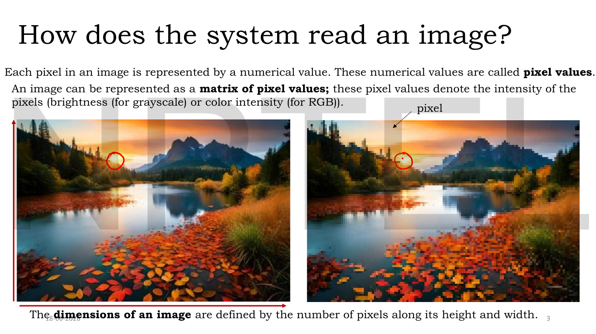
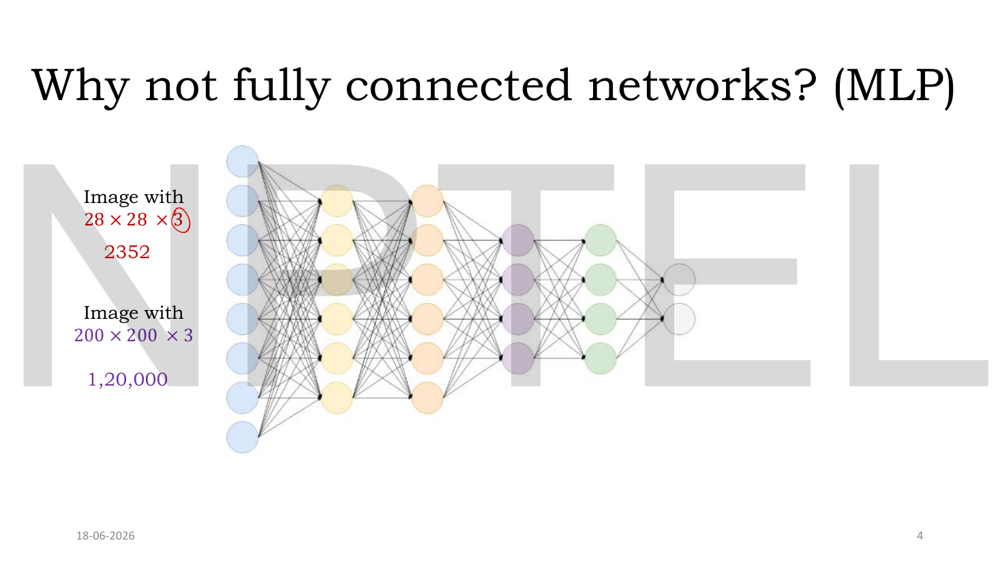
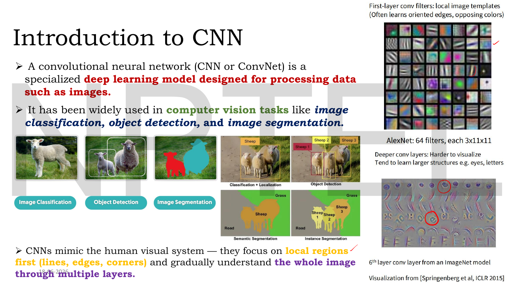
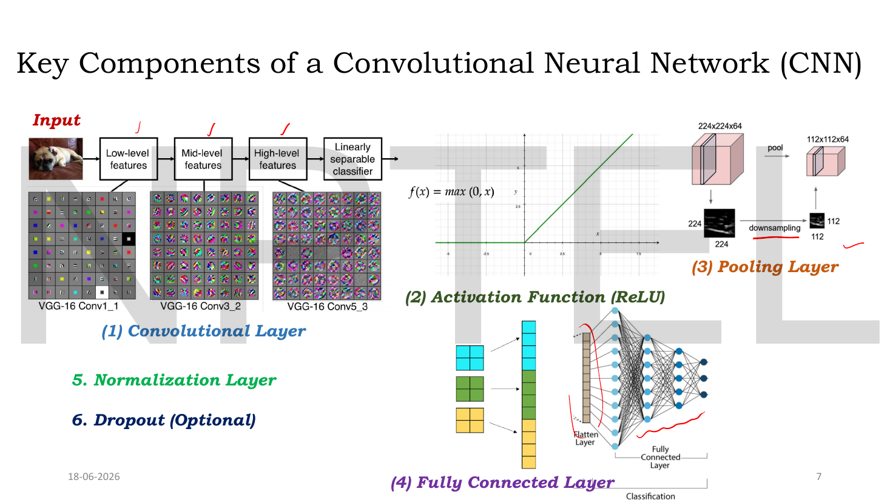
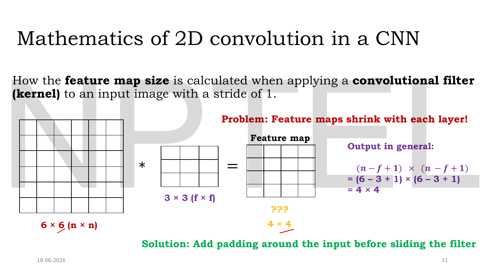
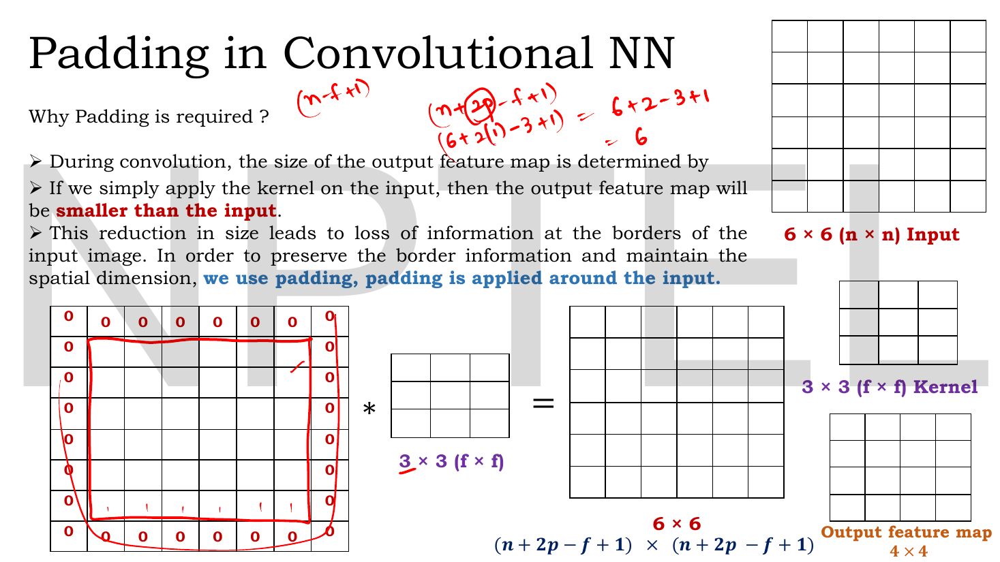
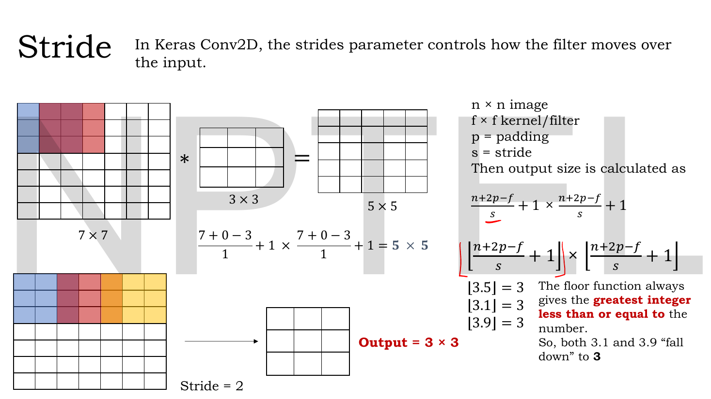
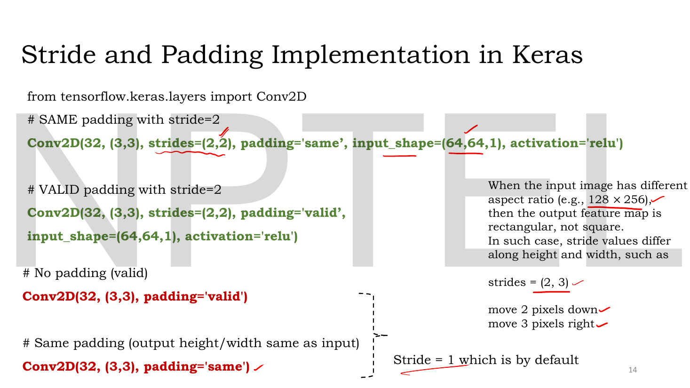

# Lec 05 — Convolutional Neural Network, Part A

> **Source:** `Lec 05.pdf` (16 pages) · **Week 1** · **Playlist:** Lec 05
> **Prereqs:** [Lec 02 — Activation and Loss Functions](02-activations-and-losses.md), [Lec 04 — Optimizers — Part B](04-optimizers-b.md)
> **Feeds into:** [Lec 06 — Convolutional Neural Network, Part B](06-cnn-b.md), [Lec 12 — Types of Autoencoders](12-autoencoder-types.md), [Lec 49 — U-Net for Denoising](49-unet.md)

## Why this lecture exists

Everything you have met so far treats an input as a flat list of numbers. An image is not a flat list. It is a grid, and the fact that pixel $(4,7)$ sits beside pixel $(4,8)$ is *information*. Flatten it and that information is destroyed before training even starts.

This lecture fixes that. It replaces the dense layer's "every input touches every neuron" with a small window that slides across the grid, reusing one set of weights everywhere. That change kills the parameter explosion, preserves spatial structure, and gives you feature detectors for free. The price is that you must now track *geometry*: how big is the output, and how does it move with kernel size, stride and padding? This chapter owns that arithmetic for the whole book — every later chapter that stacks convolutions ([U-Net](49-unet.md), the DCGAN family, [Stable Diffusion](52-stable-diffusion.md)) links back here rather than restating it.

## The ideas

### An image is a matrix of pixel values

A **pixel** is one sample point of the image, and its **pixel value** is a number: brightness for grayscale, or a triple of colour intensities for RGB. An image is therefore a **matrix of pixel values**, and the **dimensions of an image** are the pixel counts along its height and width.


*Fig. — Zoom far enough and the picture dissolves into the grid the computer actually sees. The red circle marks one pixel: one number for grayscale, three for RGB. Page 3.*

Write an image's shape as $H \times W \times C$ — height, width, **channels**. A $28\times28$ grayscale MNIST digit is $28\times28\times1$; a colour version is $28\times28\times3$. The channel count is the depth of the stack, and it is the dimension most often dropped by accident in exam arithmetic.

> **Notation.** This deck uses $n$ for the input side length, $f$ for the filter/kernel side, $p$ for padding, $s$ for stride, and on Lec 06's slides $I$, $D$, $n_c$, $n_f$. This book writes $H\times W\times C$ for the input, $K$ for the kernel size, $S$ for stride, $P$ for padding and $F$ for the number of filters. The deck's symbols are given once here so you can read the slides; everything below uses the book's.

### Why a fully connected network is the wrong tool

Feed an image to an MLP and you must first flatten it into a vector. The deck works the cost directly.


*Fig. — Two input sizes, one lesson. A tiny $28\times28$ colour image is already a 2352-long vector; a modest $200\times200$ colour image is 120,000. The input layer alone has that many nodes, and every one of them connects to every neuron in the first hidden layer. Page 4.*

- $28 \times 28 \times 3 = 2352$ input nodes.
- $200 \times 200 \times 3 = 120{,}000$ input nodes. (The slide writes this in the Indian convention, **1,20,000**.)

A first hidden layer of just 1000 units then needs $120{,}000 \times 1000 = 1.2\times10^8$ weights **in that one layer**. That is the **parameter explosion** the deck labels in red, and it brings two consequences it also spells out: slow training, and a sharply increased risk of overfitting.

![Slide headed "Loss of Spatial Structure", an MNIST digit flattened to a [784,1] vector feeding a three-weight-matrix MLP, with "Parameter Explosion" in red and a 3×3 grid showing horizontal and vertical neighbours](../assets/pages/lec05/p-05.png)
*Fig. — The bottom-left grid is the real argument. In the $3\times3$ patch, 1–2–3 are horizontal neighbours and 1–4–7 are vertical neighbours. Flattened to $[1,2,3,4,5,6,7,8,9]$, 1 and 2 are still adjacent but 1 and 4 are three positions apart — the vertical relationship is gone. Page 5.*

The deck gives three failures of flattening, and they are worth memorising as a list because the discrimination is examinable:

1. Flattening into a 1-D vector **destroys the spatial relationship** — how pixels are positioned relative to each other.
2. A fully connected network **treats every pixel as an independent feature**.
3. **Local dependencies** — edges, corners, textures — **are lost**.

The vertical-neighbour point is the sharpest version. A $28\times28$ image flattens to a 784-vector in which pixels one row apart sit 28 positions apart. The network can in principle relearn that adjacency from data, but it must spend parameters and examples doing so, and it must relearn it separately for every position in the image.

### What a CNN is

A **convolutional neural network** (CNN, or ConvNet) is a deep learning model specialised for data laid out on a grid — above all images. The deck names its headline applications: **image classification, object detection, image segmentation**.


*Fig. — The right-hand column is the payoff. AlexNet's first conv layer learns 64 filters of size $3\times11\times11$, and they come out looking like oriented edges and opposing-colour blobs — nobody designed them that way. The sixth layer's features are object parts (eyes, letters), not edges. Page 6.*

The organising principle the deck states: **CNNs mimic the human visual system — they focus on local regions first (lines, edges, corners) and gradually understand the whole image through multiple layers.** That progression is the **feature hierarchy**, and [Lec 06](06-cnn-b.md) owns it in full.

### The six components of a CNN


*Fig. — The whole course's CNN vocabulary on one page, numbered 1 to 6. Note the pooling cube: $224\times224\times64 \to 112\times112\times64$. Height and width halve; **depth does not change**. Page 7.*

| # | Component | What it does | Taught in |
|---|---|---|---|
| 1 | **Convolutional layer** | slides learnable filters over the input to produce feature maps | this chapter |
| 2 | **Activation (ReLU)** | $f(x) = \max(0, x)$ applied element-wise | [Lec 06](06-cnn-b.md) (catalogue in [Lec 02](02-activations-and-losses.md)) |
| 3 | **Pooling layer** | downsamples height and width, leaves depth alone | [Lec 06](06-cnn-b.md) |
| 4 | **Fully connected layer** | flattens and classifies | [Lec 06](06-cnn-b.md) |
| 5 | **Normalization layer** | — named on the slide, never expanded | neither |
| 6 | **Dropout (optional)** | — named on the slide, never expanded | neither |

Components 1 and the geometry of 3 are this chapter. Everything else is Part B.

### The convolution operation

A **convolutional layer** is the fundamental building block of a CNN. It extracts features from the input by applying a set of **learnable filters** (also called **kernels**). It slides each filter over the input and, at every position, performs an **element-wise multiplication followed by a sum** — one number out per position. The grid of those numbers is the **feature map**.

![Slide "Convolutional Layer": a llama photo, an edge-detecting kernel [[-1,-1,-1],[-1,8,-1],[-1,-1,-1]], the resulting edge map, and a binary 6×6 input with a 1..9 filter producing 31 in the first cell of the feature map](../assets/pages/lec05/p-09.png)
*Fig. — Left: a hand-designed kernel with $8$ in the centre and $-1$ around it is a high-pass filter — it fires on anything that differs from its neighbours, which is exactly an edge. Right: the mechanical version, where the purple $3\times3$ window of the input times the filter $[1..9]$ sums to **31**, the first entry of the feature map. Page 9.*

That $31$ is worked in full in **N1** below. Two things to fix now:

- The filter is **not** applied to one pixel. It is applied to a $K\times K$ **window** of pixels, and it collapses that window to one number. The window is the output unit's **receptive field**.
- The same filter weights are used at **every** position. This is **weight sharing**, and it is where the parameter saving comes from: one $3\times3$ filter is 9 weights no matter whether the image is $28\times28$ or $2000\times2000$.

Formally, for a single-channel input $\mathbf{X}$ and a $K\times K$ kernel $\mathbf{W}$ with stride $S$ and padding $P$, the entry at output position $(i,j)$ is

$$Y_{ij} = \sum_{a=0}^{K-1}\sum_{b=0}^{K-1} W_{ab}\; X_{\,iS+a-P,\; jS+b-P}$$

and for a multi-channel input you sum over channels too:

$$Y_{ij} = \sum_{c=1}^{C}\sum_{a=0}^{K-1}\sum_{b=0}^{K-1} W_{abc}\; X_{\,iS+a-P,\;jS+b-P,\;c} \;+\; b$$

Read the second formula slowly, because it settles the commonest confusion in the whole topic: **a filter is as deep as its input.** A $5\times5$ filter applied to a $32\times32\times3$ RGB image is really $5\times5\times3$, it sees all three channels at once, and it produces **one** 2-D feature map — not three. Stack $F$ such filters and you get $F$ feature maps, i.e. an output of depth $F$.

> **A pedantic but harmless lie.** What CNNs call "convolution" is, in the signal-processing sense, **cross-correlation** — true convolution flips the kernel first. Because the kernel is learned, the flip is absorbed into the learned weights and nobody cares. Every formula and every library (`Conv2D`, `nn.Conv2d`) does the un-flipped version. The deck, correctly for this field, just calls it convolution.

![Slide "CNN: Convolutional operation": a 6×6 integer matrix convolved with [[1,0,-1],[1,0,-1],[1,0,-1]] giving a 4×4 output, the first entry worked as (3×1)+(1×1)+(2×1)+(0×0)+(5×0)+(7×0)+(1×−1)+(8×−1)+(2×−1) = −5, beside a MNIST "4" and its vertical-edge response](../assets/pages/lec05/p-10.png)
*Fig. — The canonical worked example. The kernel is a **vertical edge detector**: $+1$ down the left column, $0$ in the middle, $-1$ down the right. Look at the MNIST "4" at bottom right — the output lights up on the vertical strokes and leaves the horizontal bar almost dark. The nine products land on $-5$; the whole $4\times4$ is reproduced in N2. Page 10.*

### The output-size formula — this book's canonical statement

Here is the formula every later chapter cites. The deck builds it in three stages, so the derivation is below it.

$$\boxed{\;H_{\text{out}} = \left\lfloor \frac{H + 2P - K}{S} \right\rfloor + 1, \qquad W_{\text{out}} = \left\lfloor \frac{W + 2P - K}{S} \right\rfloor + 1, \qquad C_{\text{out}} = F\;}$$

Height and width are computed **independently and identically**; depth is not computed at all — it is simply the number of filters you chose.

**Stage 1 — no padding, stride 1.** How many positions can a $K$-wide window occupy inside an $H$-wide row? Its left edge can sit at $1, 2, \ldots, H-K+1$. So:

$$H_{\text{out}} = H - K + 1$$


*Fig. — $6 - 3 + 1 = 4$. The red line is the motivation for everything on the next slide: stack ten such layers and a $32\times32$ image is down to $12\times12$ before you have done anything useful. The green line names the fix. Page 11.*

**Stage 2 — add padding.** **Padding** means surrounding the input with a border of $P$ extra rows and columns, filled with zeros, *before* convolving. It does two things the deck lists: it preserves the **border information** that a shrinking map throws away, and it maintains the spatial dimension. Padding $P$ on every side turns an $H$-wide input into an $(H + 2P)$-wide one, so substitute:

$$H_{\text{out}} = H + 2P - K + 1$$


*Fig. — The lecturer's handwriting at the top does the whole calculation: $6 + 2(1) - 3 + 1 = 6$. One ring of zeros is exactly enough to cancel a $3\times3$ kernel's shrinkage. Count the ring: the $6\times6$ input becomes $8\times8$, and $8-3+1=6$. Page 12.*

Why a border of **zeros**? Because zero is the additive identity: a padded cell contributes $W_{ab}\times 0 = 0$ to the sum, so it adds nothing rather than inventing content. (Reflection and replication padding exist and are used in style-transfer and generative work; the deck covers only zero padding.)

**Stage 3 — add stride.** **Stride** $S$ is how far the window jumps between positions. With $S=1$ it moves one pixel at a time; with $S=2$ it skips every other position, roughly halving the output. If a run of $H+2P-K$ pixels is traversable in steps of $S$, you get $\lfloor (H+2P-K)/S \rfloor$ full steps, plus the starting position:

$$H_{\text{out}} = \left\lfloor \frac{H+2P-K}{S} \right\rfloor + 1$$


*Fig. — The three floor examples at bottom right are the lecturer insisting on one point: the floor function gives **the greatest integer less than or equal to** the number, so 3.1 and 3.9 both "fall down" to 3. There is no rounding anywhere in this formula. Page 13.*

> **Where the floor goes.** The deck draws $\big\lfloor \frac{n+2p-f}{S} + 1 \big\rfloor$ — the floor wrapped around the whole expression including the $+1$. This book writes $\lfloor\cdot\rfloor + 1$ with the $+1$ outside. The two are identical, because adding the integer 1 inside or outside a floor makes no difference: $\lfloor x + 1\rfloor = \lfloor x\rfloor + 1$ for integer 1. Either form is correct in an exam.

### The floor is not decoration — the edge cases

The floor is where marks are lost. It bites whenever $S$ does not divide $H + 2P - K$ exactly, and when it bites, **pixels at the right and bottom edges are silently never visited by any window**.

| $H$ | $K$ | $S$ | $P$ | $\frac{H+2P-K}{S}$ | $H_{\text{out}}$ | Input columns never seen |
|---|---|---|---|---|---|---|
| 7 | 3 | 1 | 0 | $4.0$ | $4+1=5$ | 0 |
| 7 | 3 | 2 | 0 | $2.0$ | $2+1=3$ | 0 |
| 8 | 3 | 3 | 0 | $1.67 \to 1$ | $1+1=2$ | **2** |
| 10 | 4 | 3 | 0 | $2.0$ | $2+1=3$ | 0 |
| 10 | 3 | 4 | 0 | $1.75 \to 1$ | $1+1=2$ | **3** |

Two rules that follow, and both are MCQ material:

- **The output is never larger than $\lfloor H/S\rfloor + 1$**, and never smaller than 1. If your arithmetic gives $H_{\text{out}} \le 0$ the layer is illegal — the kernel is bigger than the padded input.
- **Truncation discards data, not just resolution.** In the $H=8, K=3, S=3$ row, the windows start at columns 1 and 4, covering columns 1–6. Columns 7 and 8 are never read. No warning is raised; the network simply never sees them.

### `valid` and `same` padding

Libraries hide $P$ behind two names, and the deck shows both in Keras.


*Fig. — Four lines that encode the whole chapter. Note the defaults the lecturer underlines: **stride = 1 by default**, and for a non-square input the stride can itself be non-square — `strides=(2,3)` means move 2 pixels down and 3 pixels right. Page 14.*

| Keras name | Means | Effect at $S=1$ |
|---|---|---|
| `padding='valid'` | $P = 0$ — only "valid" windows, fully inside the input | output shrinks: $H-K+1$ |
| `padding='same'` | $P$ chosen so output height/width equal input | output unchanged: $H$ |

For $S=1$ and odd $K$, `same` is just $P = \dfrac{K-1}{2}$ — so $P=1$ for $K=3$, $P=2$ for $K=5$, $P=3$ for $K=7$. This is why odd kernel sizes dominate in practice: an even $K$ has no integer $P$ that centres the window, and the framework must pad asymmetrically.

> **The trap.** `padding='same'` does **not** mean "output size equals input size" when $S>1$. Keras defines it as $H_{\text{out}} = \lceil H/S\rceil$ — *ceiling*, not floor, and the padding is computed to make that come out. With $H=7, K=3, S=2$: `valid` gives $\lfloor 4/2\rfloor+1 = 3$, while `same` gives $\lceil 7/2 \rceil = 4$. The plain formula with a single symmetric $P$ cannot produce 4 from an odd input, because Keras pads the bottom/right by one more than the top/left. **For exam purposes: use the boxed formula, and read `same` as "$P$ makes the output match the input" only when $S=1$.**

### Pooling, as a geometry problem

Pooling is taught in full — the types, the arithmetic, the worked example — in [Lec 06](06-cnn-b.md), because that is where this deck puts it; page 15 of this deck explicitly defers it. One thing belongs here, though, because it is geometry:

**A pooling window obeys the same output-size formula as a convolution.** Substitute the pool size for $K$ and the pool stride for $S$ and nothing else changes. The only difference is the depth term: pooling has no filters, so

$$C_{\text{out}} = C_{\text{in}} \quad\text{(pooling)} \qquad\text{versus}\qquad C_{\text{out}} = F \quad\text{(convolution)}.$$

That is the content of the $224\times224\times64 \to 112\times112\times64$ cube on page 7: $K=2$, $S=2$, $P=0$ gives $\lfloor(224-2)/2\rfloor + 1 = 112$, and the 64 stays 64.

### Receptive field — the geometry the deck omits

Not on these slides, but it is pure $K$/$S$/$P$ arithmetic, it is this chapter's property, and NPTEL papers ask for it. The **receptive field** $R_l$ of a unit in layer $l$ is the number of input pixels (along one axis) that can influence it. It grows as you stack layers:

$$R_l = R_{l-1} + (K_l - 1)\cdot j_{l-1}, \qquad j_l = j_{l-1}\cdot S_l, \qquad R_0 = 1,\; j_0 = 1$$

where $j_l$ is the **jump** — the input-pixel distance between adjacent units of layer $l$. Three stacked $3\times3$ convolutions at stride 1 give $R = 1 + 2 + 2 + 2 = 7$: the same reach as one $7\times7$ filter, at $3\times(3\times3) = 27$ weights per channel instead of $49$, with two extra non-linearities thrown in. That trade — **small kernels, stacked deep** — is the design rule behind VGG and every modern backbone, and it is worked numerically in N6.

## Worked numericals

The deck contains **six** worked computations in this page range (pages 4, 9, 10, 11, 12, 13). All six are reproduced below; all six were recomputed independently and **all agreed with the slides**.

### N1. The slide's $3\times3$ dot product (page 9)

**Given:** input window $\begin{bmatrix}1&0&1\\0&1&1\\1&0&1\end{bmatrix}$ and filter $\begin{bmatrix}1&2&3\\4&5&6\\7&8&9\end{bmatrix}$.
**Find:** the first entry of the feature map.

1. Multiply element-wise, position by position:

| position | input | filter | product |
|---|---|---|---|
| (1,1) | 1 | 1 | 1 |
| (1,2) | 0 | 2 | 0 |
| (1,3) | 1 | 3 | 3 |
| (2,1) | 0 | 4 | 0 |
| (2,2) | 1 | 5 | 5 |
| (2,3) | 1 | 6 | 6 |
| (3,1) | 1 | 7 | 7 |
| (3,2) | 0 | 8 | 0 |
| (3,3) | 1 | 9 | 9 |

2. Sum: $1 + 0 + 3 + 0 + 5 + 6 + 7 + 0 + 9 = 31$.

**Answer:** $31$ — matching the slide. Note how a binary input turns the convolution into "add up the filter weights wherever the input is 1". That is the cleanest mental model of what a filter does: it is a **template**, and the output is high when the window looks like the template.

### N2. The full $6\times6 \ast 3\times3$ convolution (page 10)

**Given:**
$$\mathbf{X} = \begin{bmatrix}3&0&1&2&7&4\\1&5&8&9&3&1\\2&7&2&5&1&3\\0&1&3&1&7&8\\4&2&1&6&2&8\\2&4&5&2&3&9\end{bmatrix}, \qquad \mathbf{W} = \begin{bmatrix}1&0&-1\\1&0&-1\\1&0&-1\end{bmatrix}, \quad S=1,\ P=0$$
**Find:** the complete feature map, and verify the slide's first entry.

1. **Size first.** $H_{\text{out}} = \lfloor(6 + 0 - 3)/1\rfloor + 1 = 3 + 1 = 4$. The output is $4\times4$.
2. **Entry $(1,1)$** — the window is rows 1–3, columns 1–3, i.e. $\begin{bmatrix}3&0&1\\1&5&8\\2&7&2\end{bmatrix}$. Because the kernel's middle column is all zeros, only columns 1 and 3 of the window matter:
$$(3\times1)+(1\times1)+(2\times1) + (0\times0)+(5\times0)+(7\times0) + (1\times{-1})+(8\times{-1})+(2\times{-1})$$
$$= (3+1+2) + 0 - (1+8+2) = 6 - 11 = -5$$
This is exactly the arithmetic printed on the slide.
3. **Entry $(1,2)$** — shift one column right: window $\begin{bmatrix}0&1&2\\5&8&9\\7&2&5\end{bmatrix}$, so $(0+5+7) - (2+9+5) = 12 - 16 = -4$. ✓
4. **Entry $(2,1)$** — shift one row down: window $\begin{bmatrix}1&5&8\\2&7&2\\0&1&3\end{bmatrix}$, so $(1+2+0) - (8+2+3) = 3 - 13 = -10$. ✓
5. Repeating for all 16 positions:

$$\mathbf{Y} = \begin{bmatrix}-5&-4&0&8\\-10&-2&2&3\\0&-2&-4&-7\\-3&-2&-3&-16\end{bmatrix}$$

**Answer:** the $4\times4$ map above, identical to the slide in every entry. Read the sign: a **positive** output means the left side of the window was brighter than the right (a light-to-dark vertical edge); **negative** means dark-to-light. The $-16$ in the corner is the strongest edge in the image, and the $0$ at $(1,3)$ means that window was left–right balanced — no vertical edge there at all.

### N3. The parameter explosion (page 4)

**Given:** images of $28\times28\times3$ and $200\times200\times3$, fed to an MLP whose first hidden layer has 1000 neurons.
**Find:** the flattened input size in each case, and the first-layer weight count.

1. $28 \times 28 = 784$; $784 \times 3 = 2352$ input nodes. (The slide stops here.)
2. $200 \times 200 = 40{,}000$; $40{,}000 \times 3 = 120{,}000$ input nodes — the slide's **1,20,000**.
3. First-layer parameters, small image: $2352 \times 1000 + 1000 = 2{,}353{,}000$.
4. First-layer parameters, larger image: $120{,}000 \times 1000 + 1000 = 120{,}001{,}000$.
5. Compare against a convolutional alternative: one layer of 64 filters of size $3\times3$ on 3 channels costs $(3\times3\times3 + 1)\times 64 = 1792$ parameters — **for either image**, because weight sharing makes the count independent of $H$ and $W$.

**Answer:** 2352 and 120,000 inputs; 2.35 million and 120 million first-layer weights; versus 1,792 for a conv layer regardless of image size — a factor of about **67,000** on the larger image. That is the number the deck is gesturing at with "Parameter Explosion".

### N4. Shrinkage and the padding that cancels it (pages 11 and 12)

**Given:** $H = W = 6$, $K = 3$, $S = 1$.
**Find:** the output size with $P=0$, the $P$ that preserves the size, and the result after 5 stacked unpadded layers.

1. $P = 0$: $H_{\text{out}} = \lfloor(6 + 0 - 3)/1\rfloor + 1 = 3 + 1 = 4$. Output $4\times4$ — the slide's answer.
2. Set $H_{\text{out}} = 6$ and solve: $6 = (6 + 2P - 3) + 1 \Rightarrow 6 = 4 + 2P \Rightarrow P = 1$.
3. Check directly, as the lecturer's handwriting does: $6 + 2(1) - 3 + 1 = 6$. ✓ The padded input is $8\times8$ and $8-3+1 = 6$.
4. Stacking 5 unpadded $3\times3$ layers on a $32\times32$ input: each layer costs exactly $K-1 = 2$ pixels per side, so $32 \to 30 \to 28 \to 26 \to 24 \to 22$.
5. The same 5 layers with $P=1$ each: $32 \to 32 \to 32 \to 32 \to 32 \to 32$.

**Answer:** $4\times4$ unpadded, $P=1$ restores $6\times6$, and over 5 layers the unpadded stack loses 10 pixels per axis ($32 \to 22$, a 53% loss of area) while the padded stack loses none. **Each $K\times K$ layer with $P=0$ costs $K-1$ pixels per axis** — that is the one-line rule.

### N5. Stride on a $7\times7$ input (page 13)

**Given:** $H = W = 7$, $K = 3$, $P = 0$.
**Find:** the output size at $S=1$ and at $S=2$, and the floor's effect.

1. $S = 1$: $\dfrac{7 + 0 - 3}{1} = 4$, so $H_{\text{out}} = 4 + 1 = 5$. Output $5\times5$ — the slide's answer.
2. $S = 2$: $\dfrac{7 + 0 - 3}{2} = \dfrac{4}{2} = 2$, so $H_{\text{out}} = 2 + 1 = 3$. Output $3\times3$ — the slide's answer.
3. Here the division is exact, so the floor does nothing. Change the input to $8\times8$ to make it bite: $\dfrac{8-3}{2} = 2.5 \to \lfloor 2.5\rfloor = 2$, giving $H_{\text{out}} = 3$ again. The extra input row buys nothing.
4. Windows at $S=2$ on the $8$-wide input start at columns 1, 3, 5 and cover columns 1–7. **Column 8 is never visited.**
5. The slide's own floor drill: $\lfloor 3.5\rfloor = 3$, $\lfloor 3.1 \rfloor = 3$, $\lfloor 3.9 \rfloor = 3$.

**Answer:** $5\times5$ and $3\times3$, both matching the deck. And the key behavioural fact: an $8\times8$ input at $K=3, S=2$ gives the *same* $3\times3$ output as a $7\times7$ input, with one column of pixels thrown away.

### N6. Non-square input, non-square stride, and the receptive field

**Given:** a $128\times256\times3$ input, $F = 16$ filters of size $K=5$, `strides=(2,3)`, $P=0$ — the asymmetric case the deck's page 14 raises but does not compute. Then three $3\times3$ stride-1 conv layers on top.
**Find:** the output shape, and the receptive field after three layers.

1. Height uses $S_H = 2$: $H_{\text{out}} = \left\lfloor \dfrac{128 + 0 - 5}{2} \right\rfloor + 1 = \lfloor 61.5 \rfloor + 1 = 61 + 1 = 62$.
2. Width uses $S_W = 3$: $W_{\text{out}} = \left\lfloor \dfrac{256 + 0 - 5}{3} \right\rfloor + 1 = \lfloor 83.67 \rfloor + 1 = 83 + 1 = 84$.
3. Depth is the filter count: $C_{\text{out}} = F = 16$.
4. Receptive field of three stacked $3\times3$, $S=1$ layers. Start $R_0 = 1$, $j_0 = 1$:
 - Layer 1: $R_1 = 1 + (3-1)\times1 = 3$, $j_1 = 1$.
 - Layer 2: $R_2 = 3 + 2\times1 = 5$, $j_2 = 1$.
 - Layer 3: $R_3 = 5 + 2\times1 = 7$, $j_3 = 1$.
5. Parameter comparison at one channel: three $3\times3$ filters $= 27$ weights; one $7\times7$ filter with the same reach $= 49$ weights.

**Answer:** output $62 \times 84 \times 16$. Three $3\times3$ layers see a $7\times7$ patch of the input using **27 weights instead of 49** — a 45% saving with the same receptive field, plus two extra ReLUs. Note also that the floor truncated in *both* axes here: $0.5$ of a step was lost vertically and $0.67$ horizontally.

## Code

A convolution written out as the four nested loops it actually is, plus the output-size formula, so you can watch them agree. The deck's page-10 example is the test case.

```python
import numpy as np

def conv2d(X, K_mat, S=1, P=0):
    """Valid 2-D cross-correlation (what CNNs call 'convolution')."""
    Xp = np.pad(X, P, mode="constant")          # zero padding, P on every side
    H, W = Xp.shape
    k = K_mat.shape[0]
    Ho = (H - k) // S + 1                        # the output-size formula
    Wo = (W - k) // S + 1
    Y = np.zeros((Ho, Wo), dtype=int)
    for i in range(Ho):
        for j in range(Wo):
            patch = Xp[i*S:i*S+k, j*S:j*S+k]     # the receptive window
            Y[i, j] = (patch * K_mat).sum()      # element-wise product, then sum
    return Y

def out_size(n, K, S, P):
    return (n + 2*P - K) // S + 1                # floor division IS the floor

X = np.array([[3,0,1,2,7,4],[1,5,8,9,3,1],[2,7,2,5,1,3],
              [0,1,3,1,7,8],[4,2,1,6,2,8],[2,4,5,2,3,9]])
Kv = np.array([[1,0,-1],[1,0,-1],[1,0,-1]])      # vertical-edge filter

print("deck page 10, 6x6 * 3x3, S=1, P=0:")
print(conv2d(X, Kv))
print("shape:", conv2d(X, Kv).shape, "formula says:", out_size(6,3,1,0))

print("\nsame input, P=1 (SAME padding):", conv2d(X, Kv, P=1).shape)
print("same input, S=2:", conv2d(X, Kv, S=2).shape, "formula:", out_size(6,3,2,0))

# the floor edge case: 8 wide, K=3, S=3 -> (8-3)/3 = 1.67 -> floor 1 -> 2 columns
print("\nn=8, K=3, S=3, P=0 ->", out_size(8,3,3,0),
      "  actual:", conv2d(np.zeros((8,8),int), np.zeros((3,3),int), S=3).shape)
print("columns of input never visited:", 8 - ((out_size(8,3,3,0)-1)*3 + 3))
```

```
deck page 10, 6x6 * 3x3, S=1, P=0:
[[ -5  -4   0   8]
 [-10  -2   2   3]
 [  0  -2  -4  -7]
 [ -3  -2  -3 -16]]
shape: (4, 4) formula says: 4

same input, P=1 (SAME padding): (6, 6)
same input, S=2: (2, 2) formula: 2

n=8, K=3, S=3, P=0 -> 2   actual: (2, 2)
columns of input never visited: 2
```

Three readings. The hand-written loop reproduces the slide's $4\times4$ exactly, so the formula and the mechanics are the same statement. `(n + 2*P - K) // S + 1` *is* the boxed formula — Python's `//` is floor division, which is why no `math.floor` appears anywhere. And the last two lines make the truncation concrete: with $K=3, S=3$ on an 8-wide input, two whole columns of pixels are never read by any window and no error is raised.

## Exam pack

### Must-memorise

| Item | Exactly this |
|---|---|
| **Output size (the formula)** | $H_{\text{out}} = \left\lfloor \frac{H + 2P - K}{S}\right\rfloor + 1$, same for $W$ |
| Output depth, convolution | $C_{\text{out}} = F$ (number of filters) |
| Output depth, pooling | $C_{\text{out}} = C_{\text{in}}$ (unchanged) |
| No padding, stride 1 | $H_{\text{out}} = H - K + 1$ |
| Padding only, stride 1 | $H_{\text{out}} = H + 2P - K + 1$ |
| `same` padding, $S=1$, odd $K$ | $P = \dfrac{K-1}{2}$ |
| `valid` padding | $P = 0$ |
| Shrinkage per unpadded layer | $K - 1$ pixels per axis |
| Convolution operation | element-wise multiply the window by the filter, then **sum** |
| Filter depth | a filter is always as deep as its input: $K \times K \times C$ |
| Floor function | greatest integer $\le$ the number; $\lfloor 3.1\rfloor = \lfloor 3.9\rfloor = 3$ |
| Receptive field growth | $R_l = R_{l-1} + (K_l-1)\,j_{l-1}$, $j_l = j_{l-1}S_l$ |
| Three failures of flattening | destroys spatial relationships · pixels become independent features · local dependencies lost |

### Numbers worth knowing

| Quantity | Value |
|---|---|
| Deck's MLP input sizes | $28\times28\times3 = 2352$; $200\times200\times3 = 120{,}000$ |
| Deck's conv example | $6\times6 \ast 3\times3$, $S=1$, $P=0$ → $4\times4$ |
| First entry of that map | $-5$ |
| Last entry of that map | $-16$ |
| Deck's $3\times3$ dot product | $31$ |
| Deck's padding example | $6 + 2(1) - 3 + 1 = 6$, so $P=1$ preserves $6\times6$ |
| Deck's stride example | $7\times7$, $K=3$: $S=1 \to 5\times5$; $S=2 \to 3\times3$ |
| Page 7's pooling cube | $224\times224\times64 \to 112\times112\times64$ |
| AlexNet first layer | 64 filters, each $3\times11\times11$ |
| `same` padding for $K=3,5,7$ at $S=1$ | $P = 1, 2, 3$ |
| Keras default stride | $1$ |
| Receptive field of 3 stacked $3\times3$, $S=1$ | $7$ |

### Likely MCQ traps

- **Forgetting the floor.** $\lfloor 2.5\rfloor = 2$, not 3 and not "2.5". If an option is non-integer it is wrong by construction; if an option is one larger than yours, suspect someone rounded.
- **Putting the depth into the height/width formula.** $C$ never enters the $H_{\text{out}}$ computation. A $32\times32\times3$ input with $K=5, S=1, P=0$ gives $28\times28$ whether the input had 1 channel or 300.
- **Thinking a $5\times5$ filter on RGB produces 3 feature maps.** It is a $5\times5\times3$ filter, it sums across channels, and it produces **one** map. $F$ filters produce $F$ maps.
- **Applying $P$ once instead of twice.** The $2P$ is because padding is added to *both* sides. $P=1$ turns a $6\times6$ into $8\times8$, not $7\times7$.
- **Confusing $P$ the symbol with `padding='same'` the keyword.** `same` is a *rule for choosing* $P$, not a value of $P$. At $S>1$, Keras's `same` means $\lceil H/S\rceil$ and uses asymmetric padding — the symmetric formula will not reproduce it.
- **Assuming stride halves the output exactly.** $S=2$ on $H=7, K=3$ gives 3, not 3.5 and not 4. The $-K$ and the $+1$ both matter.
- **Reading "shrinks with each layer" as a property of CNNs.** It is a property of *unpadded* convolution. Modern networks pad, and shrink deliberately via stride or pooling instead.
- **Using the formula backwards for pooling depth.** Pooling preserves depth; only convolution sets it, and it sets it to $F$ regardless of $C_{\text{in}}$.
- **Believing convolution and cross-correlation differ in a CNN.** Mathematically they do (kernel flip); operationally they do not, because the kernel is learned. Any option claiming a CNN flips its kernel is wrong about every real framework.
- **Treating weight sharing as an approximation.** It is exact: the *same* 9 numbers are used at every position, so the parameter count is independent of image size. That is the whole answer to "why not an MLP".

### Self-test

1. An input is $32\times32\times3$. A conv layer has $F=16$ filters of size $K=5$, $S=1$, $P=0$. Give the output shape.
2. Same input and filters, but $P=2$. Give the output shape, and say why $P=2$ was the natural choice.
3. An input is $224\times224$. A conv layer has $K=7$, $S=2$, $P=3$. Give $H_{\text{out}}$.
4. A $9\times9$ input, $K=4$, $S=3$, $P=0$. Give $H_{\text{out}}$ and say how many input columns are never visited.
5. State the three things the deck says flattening an image destroys.
6. Compute the convolution of $\begin{bmatrix}1&2&3\\4&5&6\\7&8&9\end{bmatrix}$ with $\begin{bmatrix}1&0&-1\\1&0&-1\\1&0&-1\end{bmatrix}$ at $S=1$, $P=0$.
7. How many parameters does a $3\times3$ conv layer with 32 filters have, on a 16-channel input? How does the answer change if the input is $64\times64$ instead of $8\times8$?
8. You stack four $3\times3$ stride-1 convolutions with no padding on a $50\times50$ image. What is the final size, and what is the receptive field of one final-layer unit?
9. Why is zero the standard padding value rather than, say, the mean pixel?
10. A pooling layer with window 2, stride 2, applied to $7\times7\times32$ with $P=0$. Give the output shape.

<details><summary>Answers</summary>

1. $H_{\text{out}} = \lfloor(32 + 0 - 5)/1\rfloor + 1 = 27 + 1 = 28$. Shape **$28\times28\times16$**. The 3 input channels vanish into the filters; the 16 is the filter count.
2. $H_{\text{out}} = \lfloor(32 + 4 - 5)/1\rfloor + 1 = 31 + 1 = 32$. Shape **$32\times32\times16$**. $P = (K-1)/2 = (5-1)/2 = 2$ is exactly `same` padding at $S=1$.
3. $\lfloor(224 + 6 - 7)/2\rfloor + 1 = \lfloor 223/2\rfloor + 1 = 111 + 1 = \mathbf{112}$. (This is ResNet's stem layer.)
4. $\lfloor(9 - 4)/3\rfloor + 1 = \lfloor 1.67\rfloor + 1 = 1 + 1 = \mathbf{2}$. Windows start at columns 1 and 4 and cover columns 1–7, so **columns 8 and 9 (2 columns) are never visited**.
5. (i) the spatial relationship between pixels; (ii) it makes the network treat every pixel as an independent feature; (iii) local dependencies — edges, corners, textures.
6. Output size $= 3 - 3 + 1 = 1$, a single number: $(1+4+7) - (3+6+9) = 12 - 18 = \mathbf{-6}$.
7. $(3\times3\times16 + 1)\times32 = (144+1)\times32 = 145\times32 = \mathbf{4640}$. **It does not change** — weight sharing makes the parameter count independent of $H$ and $W$. Only the *activation* memory changes.
8. Each unpadded $3\times3$ layer costs $K-1=2$ per axis: $50 \to 48 \to 46 \to 44 \to 42$, so **$42\times42$**. Receptive field: $R = 1 + 2 + 2 + 2 + 2 = \mathbf{9}$.
9. Because a padded cell contributes $W_{ab}\times 0 = 0$ to the weighted sum — it adds nothing rather than injecting invented intensity that the filter would respond to. Any non-zero constant would create a spurious edge all the way around the border.
10. $\lfloor(7-2)/2\rfloor + 1 = 2 + 1 = 3$, and pooling preserves depth. Shape **$3\times3\times32$**. (Note one row and one column are dropped.)

</details>

## Beyond the slides

**Gap: the deck never states the multi-channel convolution formula.**
**Why it matters:** every slide example is single-channel, so a reader can finish the lecture believing a $5\times5$ filter on an RGB image yields three maps. It yields one — the filter is $5\times5\times3$ and sums across channels. This single misunderstanding wrecks both the output-shape and the parameter-count questions in [Lec 06](06-cnn-b.md), and it is the most common error on this topic.

**Gap: `padding='same'` is shown but never defined for $S>1$.**
**Why it matters:** the deck's Keras slide pairs `padding='same'` with `strides=(2,2)`, which is precisely the case where "same" stops meaning "same size". Keras computes $\lceil H/S\rceil$ and pads asymmetrically. If you plug the symmetric formula into that line you will get 32 where Keras gives 32 (by luck, since 64 is even) but 4 where it gives 4 only if you use the ceiling. Know which convention a question is testing: NPTEL numericals almost always want the explicit-$P$ floor formula.

**Gap: the deck gives no reason why odd kernel sizes are universal.**
**Why it matters:** $K=3,5,7$ dominate because an odd kernel has a well-defined centre pixel, so `same` padding is the integer $P=(K-1)/2$ and the output grid stays aligned with the input grid. An even $K$ forces asymmetric padding and a half-pixel shift in the feature map. It also explains why $1\times1$ convolutions (pure channel mixing, no spatial extent) are legal and useful.

**Gap: receptive field is never mentioned.**
**Why it matters:** it is the answer to "how much of the image does one deep unit actually see?", it is pure $K$/$S$ arithmetic that belongs with the output-size formula, and it is the justification for VGG's "stack $3\times3$s" rule and for the depth of [U-Net](49-unet.md)'s encoder. The recurrence is in *The ideas*; N6 works it.

**Gap: the computational cost of a conv layer is never contrasted with its parameter cost.**
**Why it matters:** weight sharing makes *parameters* independent of image size, which the deck celebrates — but it does **not** make *FLOPs* independent. A conv layer costs roughly $H_{\text{out}}W_{\text{out}} \times K^2 C_{\text{in}} F$ multiply-accumulates, which scales with image area. This is why stride and pooling exist at all: not to save parameters, but to save compute and memory. An MCQ offering "pooling reduces the number of parameters" as an answer is wrong — pooling has no parameters and removes none; it reduces *activations*.

## Cut from the slides

Pages 1, 2, 15 and 16 are the title card, the agenda, the next-session preview and the thank-you, and carry no content — though page 15's "Next session: ReLU, Pooling Layer, Flatten Layer in CNN" is the deck's own statement that **pooling is taught in Lec 06, not here**, which is why this chapter gives pooling only its geometry and hands the types and worked examples to [Lec 06](06-cnn-b.md). Page 8 is two motion-blurred animal photographs with no caption or text at all — in the lecture they illustrate that even a human needs edges and shapes to recognise an object, and nothing is lost by describing rather than embedding them. On page 6 the AlexNet and ImageNet-layer-6 filter visualisations are reproduced in the embedded figure but their citation (Springenberg et al., ICLR 2015) is not discussed further; on page 7 the VGG-16 Conv1_1/Conv3_2/Conv5_3 panels are left for [Lec 06](06-cnn-b.md)'s feature-hierarchy section, which owns that idea. Components 5 (Normalization) and 6 (Dropout) are named on page 7 and never expanded anywhere in either CNN deck, so they are listed in the component table and left there. The lecturer's handwritten annotations — the circled "3" in $28\times28\times3$, the ticks beside the hierarchy bullets, the $(n+2p-f+1)$ worked in the margin of page 12, the red bracket around the floor expression on page 13 — are reproduced as emphasis in the prose. Everything else on pages 3–14 is covered in full.
