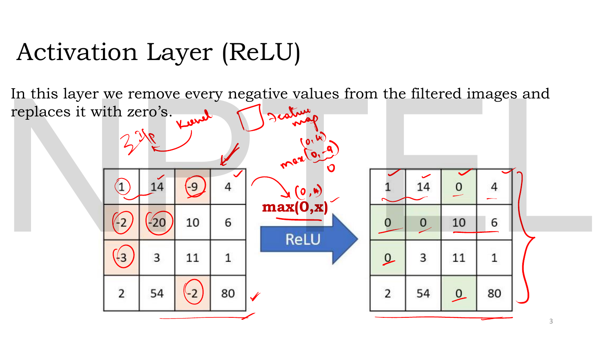
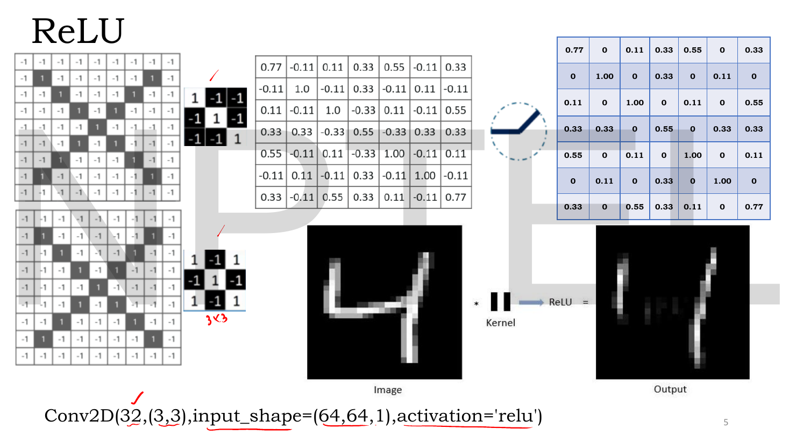
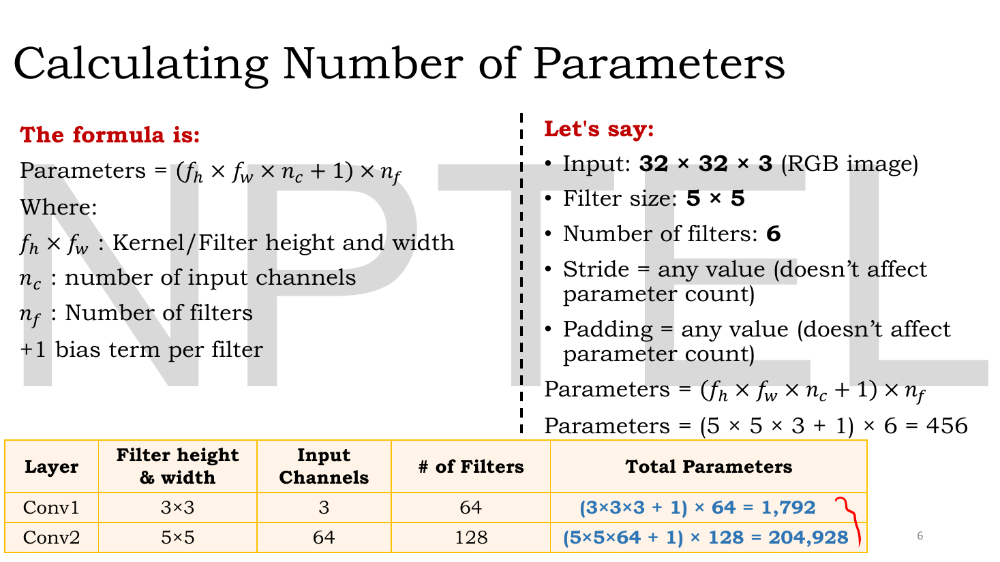
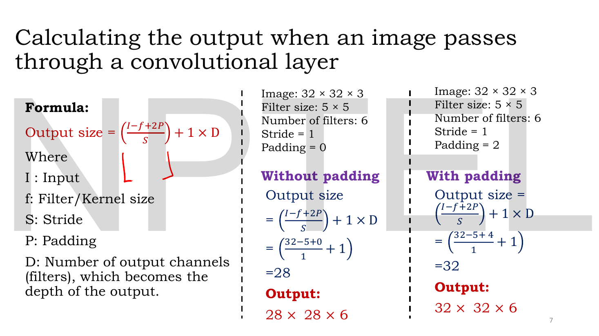
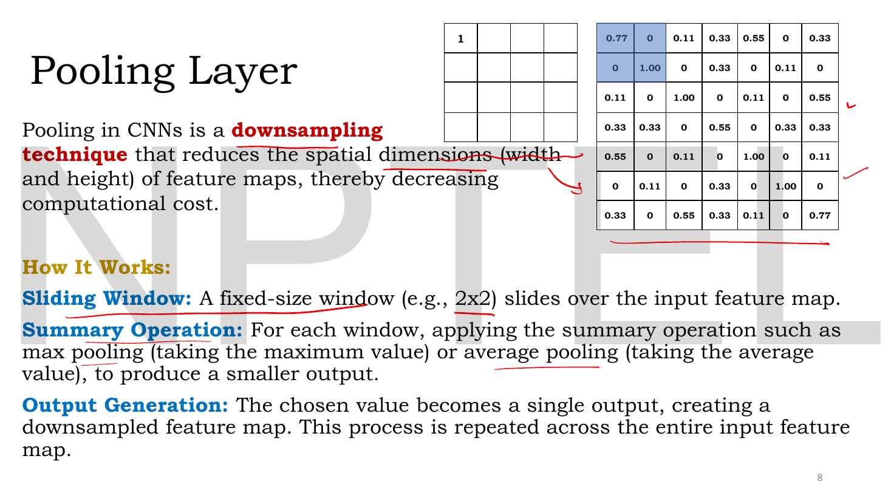
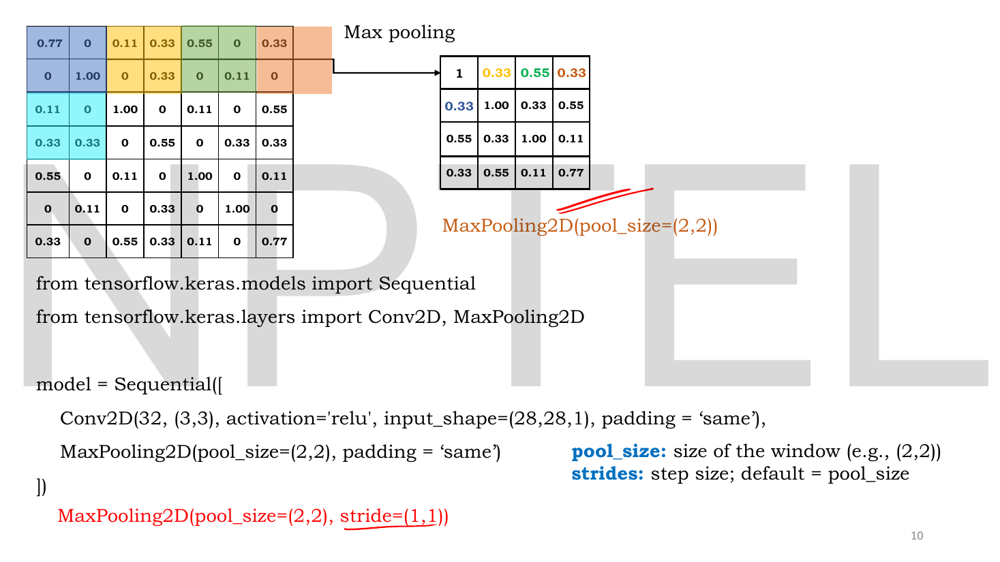
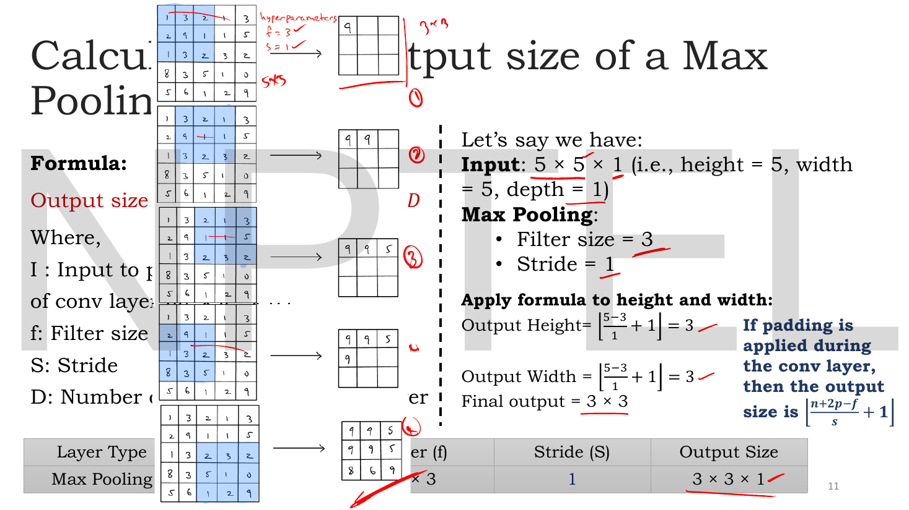
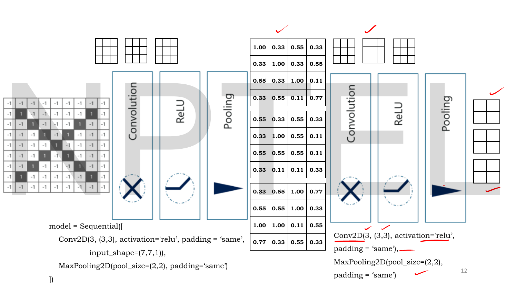
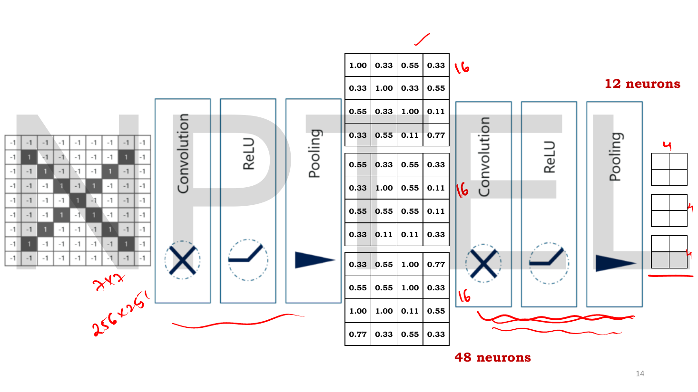
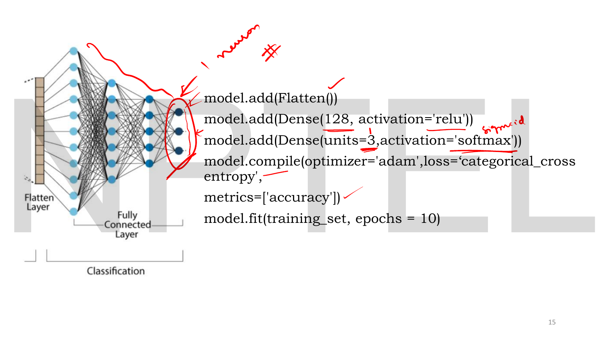

# Lec 06 — Convolutional Neural Network, Part B

> **Source:** `Lec 06.pdf` (17 pages) · **Week 1** · **Playlist:** Lec 06
> **Prereqs:** [Lec 02 — Activation and Loss Functions](02-activations-and-losses.md), [Lec 05 — Convolutional Neural Network, Part A](05-cnn-a.md)
> **Feeds into:** [Lec 12 — Types of Autoencoders](12-autoencoder-types.md), [Lec 13 — Denoising Autoencoders](13-denoising-ae.md), [Lec 49 — U-Net for Denoising](49-unet.md)

## Why this lecture exists

[Lec 05](05-cnn-a.md) gave you one layer: a filter slides, multiplies, sums, and a feature map comes out. A feature map is not a prediction. Something has to squash the negatives, shrink the maps so the next layer is affordable, and eventually turn a three-dimensional block of numbers into a vector of class scores.

This lecture supplies the other four components — ReLU, pooling, flatten, fully connected — and then assembles them into the repeating **conv → ReLU → pool** block that is the architecture of every classical CNN. It also delivers the two numbers an exam will actually ask you for: the **parameter count** of a convolutional layer, and the **output shape** of a layer stack. Those two, plus Lec 05's output-size formula, are the complete numerical content of the CNN topic in this course.

## The ideas

### Where we are in the stack

Lec 05 listed six components. This lecture covers 1 (already done), 2, 3 and 4, in the order they appear in a forward pass:

```
input  →  CONVOLUTION  →  ReLU  →  POOLING  →  …repeat…  →  FLATTEN  →  DENSE  →  softmax
H×W×C      H'×W'×F        same      H''×W''×F              a vector    class scores
          Lec 05        this chapter                      this chapter
```

Notice what changes depth and what does not. **Convolution** sets depth to the filter count $F$. **ReLU** changes nothing but the values. **Pooling** shrinks $H$ and $W$ and leaves depth alone. **Flatten** destroys all three dimensions into one. That table of "what each layer does to the shape" is the single most reusable thing in this chapter.

### The activation layer: ReLU

The **activation layer** applies $f(x) = \max(0, x)$ to every element of the feature map. The deck's own phrasing: *"in this layer we remove every negative value from the filtered images and replace it with zeros."*


*Fig. — Element-wise means element-wise: the $4\times4$ in is a $4\times4$ out, same positions, five entries changed. The lecturer's handwriting works two of them — $\max(0,4)=4$ and $\max(0,-9)=0$. Page 3.*

Three properties to hold onto, since [Lec 02](02-activations-and-losses.md) owns the activation catalogue and its derivatives:

- **It does not change the shape.** $H\times W\times F$ in, $H\times W\times F$ out. An MCQ asking for the shape after ReLU is asking whether you know this.
- **It has no parameters.** Nothing to learn, nothing to count.
- **It is applied after the convolution and before the pooling**, which is why in Keras it is written as an *argument* to `Conv2D` rather than as its own layer: `Conv2D(32,(3,3), activation='relu')`.


*Fig. — The full pipeline on one image. The $3\times3$ kernel is a diagonal template ($+1$ on the diagonal, $-1$ off it), so the $7\times7$ feature map hits $1.00$ exactly where the input's diagonal stroke sits, $0.33$ where it partly matches, and $-0.11$ or $-0.33$ where it anti-matches. After ReLU every negative is 0, leaving only evidence *for* the feature. Page 5.*

**Why zeroing matters conceptually.** A convolution output is a *similarity score* between the window and the template. A negative score means "this window is the opposite of the template", which is not evidence for anything the next layer wants. ReLU discards it, so each feature map carries only positive evidence. That, plus the fact that $\max(0,x)$ has a gradient of exactly 1 for $x>0$ and so does not shrink gradients the way a sigmoid does, is the whole reason ReLU displaced sigmoid inside CNNs.

### Counting the parameters of a convolutional layer

This is the chapter's headline formula.


*Fig. — The two red bullets on the right are the examinable asides: **stride does not affect the parameter count, and neither does padding.** They change the output *size*, not the number of weights. Page 6.*

In this book's notation (the deck writes $f_h \times f_w$ for kernel height and width, $n_c$ for input channels and $n_f$ for filters):

$$\boxed{\;\text{params} = \big(K_h \times K_w \times C_{\text{in}} + 1\big)\times F\;}$$

Unpack it one piece at a time:

- $K_h \times K_w$ — the spatial extent of one filter.
- $\times\, C_{\text{in}}$ — **a filter is as deep as its input.** On a 3-channel image, a "$5\times5$ filter" is really $5\times5\times3 = 75$ weights.
- $+\,1$ — **one bias per filter**, not one per weight and not one per output pixel.
- $\times\, F$ — you have $F$ independent filters, each with its own weights and its own bias.

And three things the formula does *not* contain, each a trap:

| Not in the formula | Why |
|---|---|
| $H$, $W$ of the input | weight sharing — the same filter is reused at every position |
| stride $S$ | changes how often the filter is applied, not what it contains |
| padding $P$ | changes the input's effective size, not the filter's |

The deck's worked case: a $32\times32\times3$ RGB input, $5\times5$ filters, $F=6$. Then $\text{params} = (5\times5\times3 + 1)\times6 = 76\times6 = 456$. The two-layer table beneath it is worked in **N2**.

> **Compare with a dense layer.** A dense layer from $n$ inputs to $m$ outputs has $nm + m$ parameters, which scales with the *input size*. A conv layer's count does not. That asymmetry is the entire content of [Lec 05](05-cnn-a.md)'s "parameter explosion" argument, now in a formula.

### Output shape of a convolutional layer, including depth


*Fig. — The same input, the same filters, the same stride; only $P$ differs, and the output goes from $28\times28\times6$ to $32\times32\times6$. The depth is $6$ in both — it is set by the filter count and nothing else. Page 7.*

The spatial part of this is [Lec 05](05-cnn-a.md)'s formula and is not re-derived here. What this slide adds is the **depth term**: the deck writes the whole thing as

$$\text{Output size} = \left(\frac{I - f + 2P}{S} + 1\right) \times D$$

where $D$ is the number of filters, "which becomes the depth of the output". In this book's notation that reads $H_{\text{out}} \times W_{\text{out}} \times F$.

> **A notation warning about this slide.** As printed, $\left(\frac{I-f+2P}{S}\right)+1 \times D$ is ambiguous — read literally, the $\times D$ binds only to the $+1$. It is not an equation; it is shorthand for "compute $H_{\text{out}}$ and $W_{\text{out}}$ by the formula, then append $D$ as the third dimension". Write it as $H_{\text{out}}\times W_{\text{out}}\times F$ and the ambiguity disappears. The slide also drops the floor that page 13 of [Lec 05](05-cnn-a.md) insisted on; keep the floor.

### The pooling layer

**Pooling** is a **downsampling technique that reduces the spatial dimensions (width and height) of feature maps, thereby decreasing computational cost.** The deck breaks the mechanism into three steps:

1. **Sliding window** — a fixed-size window (e.g. $2\times2$) slides over the input feature map.
2. **Summary operation** — for each window, apply a summary such as max or average to produce a single value.
3. **Output generation** — the chosen value becomes one output cell; repeat across the whole map.


*Fig. — The blue $2\times2$ block on the $7\times7$ map contains $0.77, 0, 0, 1.00$, and it becomes the single value $1$ in the top-left of the $4\times4$ output. Four numbers in, one number out, repeated across the map. Page 8.*

Three facts that are not on the slide but that every pooling MCQ turns on:

- **Pooling has no learnable parameters.** None. It is a fixed function. "Pooling reduces the number of parameters" is false — it reduces the number of *activations*, which reduces the parameters of whatever comes *after* it.
- **Pooling preserves depth.** It is applied to each channel independently: $H\times W\times C \to H'\times W'\times C$.
- **Pooling obeys the same output-size formula as convolution** — see [Lec 05](05-cnn-a.md) — with the pool window as $K$ and the pool stride as $S$. The default in Keras is $S = $ pool size, which is why $2\times2$ pooling halves the map.

Why does throwing away three of every four numbers not destroy the information? Because a feature map answers "is this feature present *near here*?", and the answer survives a shift of one pixel. Max pooling makes that explicit: it reports the strongest response in the neighbourhood regardless of exactly where in the neighbourhood it occurred. That is **local translation invariance**, and it is bought at the price of positional precision.

### Types of pooling

![Slide "Types of Pooling": a 4×4 feature map [[8,1,6,2],[71,0,6,6],[50,30,7,7],[20,60,13,3]] pooled 2×2 at stride 2 four ways — max, average, min and a Max-Avg-Min hybrid — with a flowchart for the hybrid's decision rule](../assets/pages/lec06/p-09.png)
*Fig. — One input, four summary operations, four different answers. Look at the top-left window $\{8,1,71,0\}$: max says 71, average says 20, min says 0. The flowchart at bottom right defines the fourth: if $\text{Max}-\text{Min} > \text{Avg}$ output $\text{Max}-\text{Min}$, else output $\frac{\text{Max}+\text{Avg}}{2}$. Page 9.*

| Type | Summary operation | Keeps | Typical use |
|---|---|---|---|
| **Max pooling** | $\max$ of the window | the strongest activation | the default in practice |
| **Average pooling** | mean of the window | overall intensity | global average pooling at the head of a network |
| **Min pooling** | $\min$ of the window | the weakest activation | rare; useful on inverted/dark-feature data |
| **Max-Avg-Min pooling** | the deck's hybrid rule below | contrast when present, smoothness otherwise | this deck's own addition |

The hybrid's rule, exactly as the flowchart gives it:

$$\text{out} = \begin{cases} \text{Max} - \text{Min} & \text{if } \text{Max}-\text{Min} > \text{Avg} \\ \dfrac{\text{Max}+\text{Avg}}{2} & \text{otherwise}\end{cases}$$

and the deck's justification: *"When the difference between the maximum and minimum value is large, it means the window has a strong feature or sharp change"* — so keep $\text{Max}-\text{Min}$, a contrast measure. *"When the difference is small or moderate, it means the window is more uniform"* — so give a smoother value, $\frac{\text{Max}+\text{Avg}}{2}$. All four pooling types are computed on the deck's own numbers in **N4**.

> This Max-Avg-Min variant is **not standard** and you will not find it in Keras or PyTorch. It is specific to this lecturer, which makes it *more* likely to appear on this exam, not less. Memorise the branch condition: the test is $\text{Max}-\text{Min}$ **strictly greater than** $\text{Avg}$, and ties go to the smoothing branch.


*Fig. — Odd input, even window: $7\times7$ with a $2\times2$ window at stride 2 and `padding='same'` gives $4\times4$, not $3\times3$ — the orange column on the right is a half-window that `same` padding completes. The blue note is the one to memorise: **`strides` defaults to `pool_size`.** Page 10.*


*Fig. — Pooling windows can overlap. Here $K=3$ but $S=1$, so consecutive windows share two of their three columns and the map only shrinks from 5 to 3. The blue note on the right confirms that padding, if applied, enters as $\lfloor \frac{n+2p-f}{s}+1\rfloor$ — the identical formula from [Lec 05](05-cnn-a.md). Page 11.*

### The feature hierarchy

Stack the conv–ReLU–pool block and something structural happens: each block's filters see a larger patch of the original image (its **receptive field** — see [Lec 05](05-cnn-a.md)) while the maps themselves get smaller and deeper. The result is the **feature hierarchy**:

| Depth | What the filters respond to | Spatial size | Depth (channels) |
|---|---|---|---|
| early (Conv1) | edges, corners, colour blobs, oriented lines | large | small |
| middle (Conv3) | textures, motifs, simple shapes | medium | medium |
| late (Conv5) | object parts — eyes, wheels, letters | small | large |
| head | whole-object identity, linearly separable | $1\times1$ | class count |

The two CNN decks give three independent pieces of evidence for this, all shown as figures: [Lec 05](05-cnn-a.md) page 6's AlexNet first layer (64 filters, each $3\times11\times11$, which come out as oriented edges and opposing colours) and its ImageNet sixth layer (object parts); and Lec 05 page 7's VGG-16 panels at Conv1_1, Conv3_2 and Conv5_3, which get visibly more structured left to right. Nobody designed those filters. Gradient descent on a classification loss produces them.

The design trade this implies — **halve the spatial size, double the channels** — is why the classic architectures look the way they do: as the maps shrink, the number of filters grows to keep the representational capacity roughly constant.


*Fig. — The repeating block, twice. Three $3\times3$ filters with `padding='same'` on a $7\times7$ input give three $7\times7$ maps; `MaxPooling2D((2,2), padding='same')` takes them to $4\times4$; the second block takes them to $2\times2$. Maps shrink, count stays at 3. Page 12.*

### Flatten and the fully connected head

The **flatten layer** converts the multi-dimensional output of the convolutional and pooling layers into a **one-dimensional vector**, because fully connected layers — which do the classification — require a 1-D input. It sits **after the final pooling layer and before the first dense layer**.

![Slide "Flatten and Fully Connected layers": three 2×2 colour-coded feature maps being unrolled into a 12-cell column, and a 3×3 feature map [[3,1,1],[2,5,0],[1,4,2]] flattening to the vector [3,1,1,2,5,0,1,4,2]](../assets/pages/lec06/p-13.png)
*Fig. — Flattening is pure bookkeeping — no arithmetic, no parameters, nothing lost or gained. The $3\times3$ map reads out **row by row**: 3, 1, 1, then 2, 5, 0, then 1, 4, 2. Page 13.*

Flatten has **no parameters** and performs **no computation**. It only reinterprets a $H\times W\times C$ block as a vector of length $H\cdot W\cdot C$. (The read-out order — row-major, channel-last in Keras — matters only if you are reimplementing it by hand.)


*Fig. — The lecturer counting out loud. Three $4\times4$ maps = $3\times16 = 48$ values; three $2\times2$ maps = $3\times4 = 12$ values. That 12 is the length of the flattened vector and therefore the input width of the first dense layer. Page 14.*

Then the **fully connected (dense) layers** do the classification, exactly as in an MLP: every element of the flattened vector connects to every neuron, with $n_{\text{in}} \times n_{\text{out}} + n_{\text{out}}$ parameters.


*Fig. — The complete head in five lines. The output layer has **3 units with softmax** because this example has 3 classes, and the loss is **categorical cross-entropy** to match. The lecturer's marginal note "sigmoid" is the reminder that a 2-class problem would use 1 sigmoid unit and binary cross-entropy instead. Page 15.*

The rule the last slide encodes, and the one most likely to be tested:

| Task | Output units | Output activation | Loss |
|---|---|---|---|
| binary classification | 1 | sigmoid | binary cross-entropy |
| multi-class, $k$ classes | $k$ | softmax | categorical cross-entropy |

([Lec 02](02-activations-and-losses.md) owns these losses; this is the CNN-specific wiring of them.)

### Named architectures — what this deck does not contain

The ownership map anticipates "named networks" here. **This deck names none as architectures.** AlexNet appears once on Lec 05 page 6 as the source of a filter visualisation (64 filters, $3\times11\times11$), and VGG-16 appears once on Lec 05 page 7 as the source of three more. Neither is described, diagrammed or counted. There is no LeNet, no ResNet, no Inception anywhere in Week 1.

If you want them — and the vision companion course examines them heavily — they are in [`GenAIforCV` Lec 12, LeNet → GoogLeNet](../../GenAIforCV/notes/week-03/12-cnn-architectures.md) and [Lec 14, ResNet](../../GenAIforCV/notes/week-04/14-resnet.md). For *this* exam, what these slides teach instead is the **generic block structure** plus the arithmetic to analyse any instance of it, which is what N6 does on the deck's own model.

### What this deck adds over the vision course

You met convolution, pooling and the conv–ReLU–pool block in [`GenAIforCV` Lec 11 (CNN Basics)](../../GenAIforCV/notes/week-03/11-cnn-basics.md), so move fast through the mechanics. Three things are genuinely different here and are worth your attention:

1. **The Max-Avg-Min pooling variant** is unique to this lecturer and appears in no standard reference.
2. **The parameter formula is stated explicitly with the $+1$ bias and worked twice numerically** — the vision course derives it more briefly.
3. **The notation differs**: this deck writes $I$, $f$, $S$, $P$, $D$, $n_c$, $n_f$ where the vision course writes $n$, $k$ and $c$. Translate carefully if you revise from both.

## Worked numericals

The deck contains **eight** worked computations in this page range (pages 3, 4/5, 6 twice, 7 twice, 9, 10, 11, 14). All are reproduced below, and **every one agreed with the slide** on independent recomputation.

### N1. ReLU on the deck's $4\times4$ map (page 3)

**Given:** the feature map $\begin{bmatrix}1&14&-9&4\\-2&-20&10&6\\-3&3&11&1\\2&54&-2&80\end{bmatrix}$.
**Find:** the output of the activation layer, and the output's shape.

1. Apply $\max(0,x)$ to each of the 16 entries independently.
2. Row 1: $\max(0,1)=1$, $\max(0,14)=14$, $\max(0,-9)=\mathbf{0}$, $\max(0,4)=4$.
3. Row 2: $\max(0,-2)=\mathbf{0}$, $\max(0,-20)=\mathbf{0}$, $10$, $6$.
4. Row 3: $\max(0,-3)=\mathbf{0}$, $3$, $11$, $1$.
5. Row 4: $2$, $54$, $\max(0,-2)=\mathbf{0}$, $80$.

$$\begin{bmatrix}1&14&0&4\\0&0&10&6\\0&3&11&1\\2&54&0&80\end{bmatrix}$$

**Answer:** the matrix above, shape **$4\times4$ — unchanged**, with 5 of 16 entries zeroed. The magnitudes of the surviving positives are untouched: ReLU is not a normaliser, and $80$ stays $80$.

### N2. Parameter counts (page 6)

**Given:** three convolutional layers:
(a) input $32\times32\times3$, $K=5$, $F=6$;
(b) Conv1: $K=3$, $C_{\text{in}}=3$, $F=64$;
(c) Conv2: $K=5$, $C_{\text{in}}=64$, $F=128$.
**Find:** the trainable parameters of each.

1. **(a)** Weights per filter: $5\times5\times3 = 75$. Add the bias: $75 + 1 = 76$. Times the filter count: $76\times6 = 456$.
2. **(b)** $3\times3\times3 = 27$; $27+1 = 28$; $28\times64 = 1792$.
3. **(c)** $5\times5\times64 = 1600$; $1600+1 = 1601$; $1601\times128 = 204{,}928$.
 (Check: $1601\times128 = 1601\times128 = 1600\times128 + 128 = 204{,}800 + 128 = 204{,}928$.) ✓
4. Where the bias matters: in (c), dropping the $+1$ gives $204{,}800$ — a 128-parameter error, and a very plausible wrong MCQ option.

**Answer:** $456$, $1792$ and $204{,}928$, all matching the slide. Notice the jump from (b) to (c): $114\times$ more parameters, driven almost entirely by $C_{\text{in}}$ rising from 3 to 64. **Input depth, not kernel size, is what makes deep layers expensive.**

### N3. Output shape with and without padding (page 7)

**Given:** input $32\times32\times3$, $K=5$, $F=6$, $S=1$; once with $P=0$ and once with $P=2$.
**Find:** both output shapes.

1. **$P=0$:** $H_{\text{out}} = \left\lfloor\dfrac{32 + 2(0) - 5}{1}\right\rfloor + 1 = 27 + 1 = 28$. Width identically $28$. Depth $= F = 6$.
2. **$P=2$:** $H_{\text{out}} = \left\lfloor\dfrac{32 + 2(2) - 5}{1}\right\rfloor + 1 = \lfloor 31 \rfloor + 1 = 32$. Width $32$. Depth still $6$.
3. Sanity-check $P=2$ against the `same` rule: $P = (K-1)/2 = (5-1)/2 = 2$. ✓ — so $P=2$ is exactly `padding='same'` for a $5\times5$ kernel at stride 1.
4. Parameters in both cases: $(5\times5\times3+1)\times6 = 456$ — **identical**, because padding does not touch the filters.

**Answer:** $28\times28\times6$ without padding, $32\times32\times6$ with $P=2$; both matching the slide, and both with 456 parameters. The input's 3 channels have disappeared from the output and been replaced by 6 — that substitution is what a conv layer *is*.

### N4. All four pooling types on the deck's $4\times4$ (page 9)

**Given:** the feature map $\begin{bmatrix}8&1&6&2\\71&0&6&6\\50&30&7&7\\20&60&13&3\end{bmatrix}$, window $2\times2$, stride 2.
**Find:** the max, average, min and Max-Avg-Min outputs.

1. **Size first:** $\lfloor(4-2)/2\rfloor + 1 = 1+1 = 2$, so every output is $2\times2$. The four windows are disjoint:

| window | cells | Max | Min | Avg |
|---|---|---|---|---|
| top-left | $8, 1, 71, 0$ | 71 | 0 | $80/4 = 20$ |
| top-right | $6, 2, 6, 6$ | 6 | 2 | $20/4 = 5$ |
| bottom-left | $50, 30, 20, 60$ | 60 | 20 | $160/4 = 40$ |
| bottom-right | $7, 7, 13, 3$ | 13 | 3 | $30/4 = 7.5$ |

2. **Max pooling:** $\begin{bmatrix}71&6\\60&13\end{bmatrix}$ ✓
3. **Average pooling:** $\begin{bmatrix}20&5\\40&7.5\end{bmatrix}$ ✓
4. **Min pooling:** $\begin{bmatrix}0&2\\20&3\end{bmatrix}$ ✓
5. **Max-Avg-Min**, applying $\text{Max}-\text{Min} > \text{Avg}$ window by window:

| window | $\text{Max}-\text{Min}$ | vs Avg | branch | value |
|---|---|---|---|---|
| top-left | $71-0 = 71$ | $71 > 20$ ✓ | $\text{Max}-\text{Min}$ | $\mathbf{71}$ |
| top-right | $6-2 = 4$ | $4 > 5$ ✗ | $\frac{\text{Max}+\text{Avg}}{2} = \frac{6+5}{2}$ | $\mathbf{5.5}$ |
| bottom-left | $60-20 = 40$ | $40 > 40$ ✗ (not strict) | $\frac{60+40}{2}$ | $\mathbf{50}$ |
| bottom-right | $13-3 = 10$ | $10 > 7.5$ ✓ | $\text{Max}-\text{Min}$ | $\mathbf{10}$ |

**Answer:** $\begin{bmatrix}71&5.5\\50&10\end{bmatrix}$ — matching the slide in all four cells. The bottom-left window is the one to study: $\text{Max}-\text{Min} = 40$ exactly equals $\text{Avg} = 40$, the strict inequality fails, and the rule takes the *smoothing* branch to give 50. Change the test to $\ge$ and you would get 40 instead. **Ties go to the average branch.**

### N5. Pooling output sizes (pages 10 and 11)

**Given:** (a) a $7\times7$ map, window 2, stride 2, `padding='same'`; (b) a $5\times5\times1$ map, window 3, stride 1, $P=0$.
**Find:** both output sizes.

1. **(a) with `valid` padding** ($P=0$) first, for contrast: $\lfloor(7-2)/2\rfloor + 1 = \lfloor 2.5\rfloor + 1 = 2+1 = 3$, giving $3\times3$ and discarding the last row and column.
2. **(a) with `same`:** Keras computes $\lceil H/S\rceil = \lceil 7/2 \rceil = 4$, padding the bottom and right by one so the half-window is completed. Output $\mathbf{4\times4}$ — the slide's answer.
3. **(b)** Height: $\left\lfloor\dfrac{5-3}{1}\right\rfloor + 1 = 2 + 1 = 3$. Width identically 3. Depth unchanged at 1.
4. The slide lists the window positions: with $K=3, S=1$ on a 5-wide row the window's left edge sits at columns 1, 2, 3 — three positions, overlapping heavily.

**Answer:** (a) $4\times4$ with `same` (versus $3\times3$ with `valid`); (b) $\mathbf{3\times3\times1}$. Both match the slides. The (a) pair is the discrimination worth remembering: on an **odd** input with an **even** window, `same` and `valid` give different answers, and the deck's $4\times4$ is the `same` one.

### N6. The deck's complete model, counted end to end (pages 12, 14, 15)

**Given:** the Keras model the deck builds across three slides, on a $7\times7\times1$ input:

```
Conv2D(3, (3,3), activation='relu', padding='same')
MaxPooling2D(pool_size=(2,2), padding='same')
Conv2D(3, (3,3), activation='relu', padding='same')
MaxPooling2D(pool_size=(2,2), padding='same')
Flatten()
Dense(128, activation='relu')
Dense(3, activation='softmax')
```

**Find:** the shape after every layer, the neuron counts the lecturer writes by hand, and the total trainable parameters.

1. **Conv1.** `same` padding at $S=1$ holds the size: $7\times7\times3$. Parameters $=(3\times3\times1+1)\times3 = 10\times3 = 30$.
2. **Pool1.** $2\times2$, stride defaults to 2, `same`: $\lceil 7/2\rceil = 4$, so $4\times4\times3$. Parameters: $0$.
 Neurons here: $4\times4\times3 = 16\times3 = \mathbf{48}$ — the lecturer's handwritten "48 neurons". ✓
3. **Conv2.** Input now has 3 channels: $4\times4\times3$ out, parameters $=(3\times3\times3+1)\times3 = 28\times3 = 84$.
4. **Pool2.** $\lceil 4/2\rceil = 2$, so $2\times2\times3$. Neurons: $2\times2\times3 = 4\times3 = \mathbf{12}$ — the handwritten "12 neurons". ✓
5. **Flatten.** $2\times2\times3 = 12$ values, one vector of length 12. Parameters: $0$.
6. **Dense(128).** $12\times128 + 128 = 1536 + 128 = 1664$.
7. **Dense(3).** $128\times3 + 3 = 384 + 3 = 387$.
8. Total: $30 + 84 + 0 + 0 + 1664 + 387 = 2165$.

**Answer:** shapes $7\!\times\!7\!\times\!1 \to 7\!\times\!7\!\times\!3 \to 4\!\times\!4\!\times\!3 \to 4\!\times\!4\!\times\!3 \to 2\!\times\!2\!\times\!3 \to 12 \to 128 \to 3$, with **48** and **12** neurons at the two pooling outputs (both matching the lecturer's handwriting), and **2,165 trainable parameters** in total. Note where they live: the two conv layers hold $114$ of them (5%) and the dense head holds $2051$ (95%). **In a small CNN the fully connected head dominates the parameter count** — which is exactly why modern architectures replace it with global average pooling.

## Code

Every pooling variant on the deck, including the non-standard one, plus the layer-by-layer count from N6 — so you can check both against the slides.

```python
import numpy as np

def out_size(n, K, S, P=0):
    return (n + 2*P - K) // S + 1

def pool(X, K=2, S=2, how="max"):
    Ho, Wo = out_size(X.shape[0], K, S), out_size(X.shape[1], K, S)
    Y = np.zeros((Ho, Wo))
    for i in range(Ho):
        for j in range(Wo):
            w = X[i*S:i*S+K, j*S:j*S+K]
            if   how == "max": Y[i, j] = w.max()
            elif how == "avg": Y[i, j] = w.mean()
            elif how == "min": Y[i, j] = w.min()
            else:                                      # the deck's Max-Avg-Min rule
                mx, mn, av = w.max(), w.min(), w.mean()
                Y[i, j] = (mx - mn) if (mx - mn) > av else (mx + av) / 2
    return Y

M = np.array([[ 8,  1,  6, 2],
              [71,  0,  6, 6],
              [50, 30,  7, 7],
              [20, 60, 13, 3]], dtype=float)

for how in ("max", "avg", "min", "mam"):
    print(f"{how:>3} pooling 2x2 S=2:\n{pool(M, how=how)}")

print("\nReLU keeps the shape, zeroes the negatives:")
A = np.array([[1, 14, -9, 4], [-2, -20, 10, 6], [-3, 3, 11, 1], [2, 54, -2, 80]])
print(np.maximum(0, A))

# the deck's page-12/14/15 model, counted layer by layer
def conv_params(K, Cin, F): return (K*K*Cin + 1) * F
h = w = 7; c = 1; total = 0
for name, K, F in [("conv1", 3, 3), ("conv2", 3, 3)]:
    p = conv_params(K, c, F); total += p
    print(f"{name}: same-pad conv -> {h}x{w}x{F}, params {p}")
    c = F
    h, w = -(-h // 2), -(-w // 2)                       # ceil: MaxPool 2x2 'same'
    print(f"       pool 2x2 'same' -> {h}x{w}x{c}  ({h*w*c} neurons)")
flat = h * w * c
for name, nin, nout in [("dense1", flat, 128), ("dense2", 128, 3)]:
    p = nin * nout + nout; total += p
    print(f"{name}: {nin} -> {nout}, params {p}")
print("TOTAL trainable parameters:", total)
```

```
max pooling 2x2 S=2:
[[71.  6.]
 [60. 13.]]
avg pooling 2x2 S=2:
[[20.   5. ]
 [40.   7.5]]
min pooling 2x2 S=2:
[[ 0.  2.]
 [20.  3.]]
mam pooling 2x2 S=2:
[[71.   5.5]
 [50.  10. ]]

ReLU keeps the shape, zeroes the negatives:
[[ 1 14  0  4]
 [ 0  0 10  6]
 [ 0  3 11  1]
 [ 2 54  0 80]]
conv1: same-pad conv -> 7x7x3, params 30
       pool 2x2 'same' -> 4x4x3  (48 neurons)
       pool 2x2 'same' -> 2x2x3  (12 neurons)
conv2: same-pad conv -> 4x4x3, params 84
dense1: 12 -> 128, params 1664
dense2: 128 -> 3, params 387
TOTAL trainable parameters: 2165
```

(The interleaved `conv2` line is just print ordering inside the loop; the arithmetic is sequential.) Three things worth noticing. The four pooling grids reproduce page 9 exactly, hybrid included — and the hybrid's bottom-left cell is 50, confirming that the tie $40 > 40$ fails. The `-(-h // 2)` is integer *ceiling* division, which is what `padding='same'` does to a pooling layer, and it is why a $7\times7$ map becomes $4\times4$ rather than $3\times3$. And the neuron counts land on 48 and 12, the two numbers in the lecturer's handwriting on page 14.

## Exam pack

### Must-memorise

| Item | Exactly this |
|---|---|
| **Conv layer parameters** | $(K_h \times K_w \times C_{\text{in}} + 1)\times F$ |
| Bias count | one per **filter**, hence the single $+1$ inside the bracket |
| Conv layer output | $H_{\text{out}}\times W_{\text{out}}\times F$ — see [Lec 05](05-cnn-a.md) for $H_{\text{out}}$ |
| Dense layer parameters | $n_{\text{in}}\times n_{\text{out}} + n_{\text{out}}$ |
| ReLU | $f(x)=\max(0,x)$; shape unchanged; **0 parameters** |
| Pooling | downsampling; **0 parameters**; depth unchanged |
| Pooling output size | same formula as convolution, with pool size as $K$ |
| Keras pooling stride default | `strides = pool_size` |
| Max-Avg-Min rule | $\text{Max}-\text{Min}$ if $\text{Max}-\text{Min} > \text{Avg}$, else $\frac{\text{Max}+\text{Avg}}{2}$ |
| Flatten | $H\times W\times C \to$ vector of length $HWC$; 0 parameters |
| Flatten's position | after the last pooling layer, before the first dense layer |
| Classification head | $k$ classes → $k$ softmax units + categorical cross-entropy; 2 classes → 1 sigmoid + BCE |
| What does **not** affect parameter count | stride, padding, input height and width |
| Layer order | conv → ReLU → pool (repeat) → flatten → dense → softmax |

### Numbers worth knowing

| Quantity | Value |
|---|---|
| Deck's parameter example | $(5\times5\times3+1)\times6 = 456$ |
| Conv1 in the deck's table | $(3\times3\times3+1)\times64 = 1{,}792$ |
| Conv2 in the deck's table | $(5\times5\times64+1)\times128 = 204{,}928$ |
| Deck's output shapes | $32\times32\times3$, $K=5$, $F=6$: $P=0 \to 28\times28\times6$; $P=2 \to 32\times32\times6$ |
| Deck's pooling input | $\begin{smallmatrix}8&1&6&2\\71&0&6&6\\50&30&7&7\\20&60&13&3\end{smallmatrix}$ |
| Max / Avg / Min / MaxAvgMin results | $\begin{smallmatrix}71&6\\60&13\end{smallmatrix}$ / $\begin{smallmatrix}20&5\\40&7.5\end{smallmatrix}$ / $\begin{smallmatrix}0&2\\20&3\end{smallmatrix}$ / $\begin{smallmatrix}71&5.5\\50&10\end{smallmatrix}$ |
| Pooling a $7\times7$ with $2\times2$, `same` | $4\times4$ (`valid` would give $3\times3$) |
| Pooling a $5\times5$ with $K=3$, $S=1$ | $3\times3\times1$ |
| Neuron counts in the deck's model | **48** after pool 1, **12** after pool 2 |
| Total parameters of that model | $2{,}165$ (30 + 84 + 1664 + 387) |
| Share held by the dense head | $2051/2165 \approx 95\%$ |
| AlexNet first-layer filters (Lec 05 p6) | 64 filters, each $3\times11\times11$ |

### Likely MCQ traps

- **"Pooling reduces the number of parameters."** False. Pooling has zero parameters and removes none. It reduces the number of *activations*, which indirectly shrinks the dense layer that follows. The correct phrasing is "reduces spatial dimensions and computational cost".
- **Forgetting the bias in the parameter formula.** $(5\times5\times64)\times128 = 204{,}800$ is the trap; $(5\times5\times64+1)\times128 = 204{,}928$ is the answer. The difference is exactly $F$.
- **Adding one bias per weight, or per output pixel.** One bias per **filter**. A layer with 128 filters has 128 biases regardless of kernel size or map size.
- **Letting stride or padding into the parameter count.** The deck states this twice in red. They change output size only.
- **Using $C_{\text{out}}$ instead of $C_{\text{in}}$ in the formula.** The filter's depth is the depth of what it *reads*. For Conv2 in the deck's table, $C_{\text{in}} = 64$ (Conv1's output), and $F = 128$.
- **Thinking pooling changes the depth.** $H\times W\times C \to H'\times W'\times C$. Only convolution sets depth.
- **Assuming pooling windows cannot overlap.** Page 11 has $K=3$, $S=1$ — heavily overlapping. Non-overlapping is only the *default* ($S=$ pool size).
- **Getting the Max-Avg-Min tie wrong.** The test is strictly greater. At $\text{Max}-\text{Min} = \text{Avg} = 40$ the rule outputs $\frac{60+40}{2} = 50$, not 40.
- **Assuming `same` pooling preserves the size.** `same` on a pooling layer with stride 2 still halves the map — it means "pad so no input is dropped", i.e. $\lceil H/S\rceil$, not "output = input".
- **Reading flatten as a computation.** It has no weights, no activation and no arithmetic. Any option assigning it parameters is wrong.
- **Choosing softmax for a 2-class problem with 1 output unit.** Softmax over a single unit always returns 1.0. Use sigmoid + BCE for 2 classes, or 2 softmax units + categorical cross-entropy.

### Self-test

1. A $64\times64\times3$ input goes through `Conv2D(32, (3,3), padding='same')`. Give the output shape and the parameter count.
2. The next layer is `Conv2D(64, (3,3), padding='same')`. Parameter count?
3. How many parameters does `MaxPooling2D(pool_size=(2,2))` have?
4. A feature map is $28\times28\times64$. After `MaxPooling2D((2,2))` with default stride, what is the shape, and how many values does `Flatten()` then emit?
5. Apply the Max-Avg-Min rule to the window $\{4, 4, 10, 2\}$.
6. Why does stride not appear in the parameter formula, while it does appear in the output-size formula?
7. A CNN ends with a $4\times4\times256$ block, flattens, then has `Dense(512)`. How many parameters in that dense layer?
8. Order these and say what each does to the shape: Flatten, Pooling, ReLU, Convolution.
9. A 10-class classifier's last two lines are `Dense(?, activation=?)` and a loss. Fill all three in.
10. Why do the deck's two conv layers hold only 5% of the model's parameters while the dense head holds 95%?

<details><summary>Answers</summary>

1. `same` at $S=1$ preserves size, so **$64\times64\times32$**. Parameters $= (3\times3\times3+1)\times32 = 28\times32 = \mathbf{896}$.
2. $C_{\text{in}}$ is now 32: $(3\times3\times32+1)\times64 = (288+1)\times64 = 289\times64 = \mathbf{18{,}496}$.
3. **Zero.** Pooling is a fixed function with nothing to learn.
4. $\lfloor(28-2)/2\rfloor+1 = 13+1 = 14$, depth unchanged: **$14\times14\times64$**. Flatten emits $14\times14\times64 = \mathbf{12{,}544}$ values.
5. $\text{Max}=10$, $\text{Min}=2$, $\text{Avg}=(4+4+10+2)/4 = 5$. $\text{Max}-\text{Min} = 8 > 5$ ✓, so output $= \mathbf{8}$.
6. Because stride controls *how often* the filter is applied, not *what is in it*. The same shared weights are reused at every visited position, so changing the step count changes the number of outputs, never the number of weights.
7. Flattened length $= 4\times4\times256 = 4096$. Dense: $4096\times512 + 512 = 2{,}097{,}152 + 512 = \mathbf{2{,}097{,}664}$.
8. **Convolution** ($H\times W\times C \to H'\times W'\times F$) → **ReLU** (shape unchanged) → **Pooling** ($H'\times W'\times F \to H''\times W''\times F$, depth unchanged) → **Flatten** ($H''\times W''\times F \to$ a vector of length $H''W''F$).
9. `Dense(10, activation='softmax')`, with loss `categorical_crossentropy` (or `sparse_categorical_crossentropy` if the labels are integers rather than one-hot).
10. Because weight sharing makes a conv layer's cost $(K^2C_{\text{in}}+1)F$ — independent of map size and tiny for small $K$ — while a dense layer's cost is $n_{\text{in}}n_{\text{out}}+n_{\text{out}}$, which multiplies the *entire flattened map* by the layer width. Here $12\times128$ already beats both conv layers combined.

</details>

## Beyond the slides

**Gap: the deck never says that pooling has no parameters, nor that it has no gradient to learn.**
**Why it matters:** "which layers have trainable parameters?" is a standard MCQ, and the correct set is {convolutional, dense} — not pooling, not ReLU, not flatten. Pooling does still *backpropagate*: max pooling routes the whole gradient to the window's argmax and sends zero to the other three cells; average pooling splits the gradient evenly. That asymmetry is why max pooling produces sparser, more selective features.

**Gap: ReLU's failure mode is never mentioned.**
**Why it matters:** because $\max(0,x)$ has gradient exactly 0 for all $x<0$, a unit whose pre-activation goes persistently negative stops updating — the **dying ReLU** problem. It is the reason Leaky ReLU and ELU exist, and the reason the DCGAN generator in the GAN chapters uses LeakyReLU rather than ReLU. [Lec 02](02-activations-and-losses.md) owns the alternatives; the CNN-specific point is that a conv layer with a badly scaled initialisation can lose whole feature maps this way.

**Gap: the deck shows a dense head but never mentions global average pooling.**
**Why it matters:** N6 shows the dense head holding 95% of a small model's parameters, and the same ratio in a real network is brutal — VGG-16's first dense layer alone has about 103 million weights. Replacing flatten+dense with **global average pooling** (average each $H\times W$ channel down to one number, giving a vector of length $C$) removes essentially all of them, and is what ResNet, Inception and every architecture since actually do. If an exam asks "how would you cut this model's parameter count", this is the answer.

**Gap: no mention of batch normalization, despite "Normalization Layer" being component 5 on Lec 05's list.**
**Why it matters:** the component is named on [Lec 05](05-cnn-a.md) page 7 and then never appears again in either deck, so the reader is left with a labelled box and no content. In practice the block is `conv → BatchNorm → ReLU → pool`, BatchNorm has $2C$ learnable parameters (a scale and a shift per channel) and so *does* count, and it is a standing component of the U-Net and DCGAN architectures later in this course. Treat it as named-but-untaught, and do not be surprised to see it in a parameter-counting question from another source.

**Gap: the deck gives no named architectures at all.**
**Why it matters:** the ownership map expected them here; there are none. If a question names LeNet, AlexNet, VGG, ResNet or Inception, nothing in Week 1 of this course prepares you for it — go to [`GenAIforCV` Lec 12](../../GenAIforCV/notes/week-03/12-cnn-architectures.md) and [Lec 14](../../GenAIforCV/notes/week-04/14-resnet.md). What Week 1 *does* equip you to do is analyse any architecture handed to you, layer by layer, which is the more common NPTEL question format.

## Cut from the slides

Pages 1, 2, 16 and 17 are the title card, the agenda, the next-session preview (two hands-on exercises that have no deck of their own) and the thank-you. Page 4 is a full-page redraw of the same $7\times7$ ReLU example that page 5 presents in context, so only page 5 is embedded and page 4's content is folded into that figure's caption. Page 11's title and formula box are partially obscured in the render by the lecturer's own handwritten working — the legible content (the $5\times5$ input, the five window positions, $\lfloor\frac{5-3}{1}+1\rfloor = 3$ for both axes, the $3\times3\times1$ result, and the padded variant $\lfloor\frac{n+2p-f}{s}+1\rfloor$) is fully reproduced in N5 and in the figure caption, and nothing readable was dropped. The MNIST "4" photographs on pages 5 and 12 illustrate the same convolve-then-ReLU point as the numeric grids beside them and are described rather than separately embedded. The Keras snippets on pages 10, 12 and 15 are consolidated into the single runnable model of N6 instead of being quoted three times. **One scope note:** the ownership map assigns pooling to [Lec 05](05-cnn-a.md), but this deck is where pooling actually appears — Lec 05's own page 15 defers it to "next session". Lec 05 therefore keeps only pooling's *geometry* (the shared output-size formula and the depth-preservation rule) and this chapter teaches the layer, its four types and all its worked examples. Everything else on pages 3–15 is covered in full.
