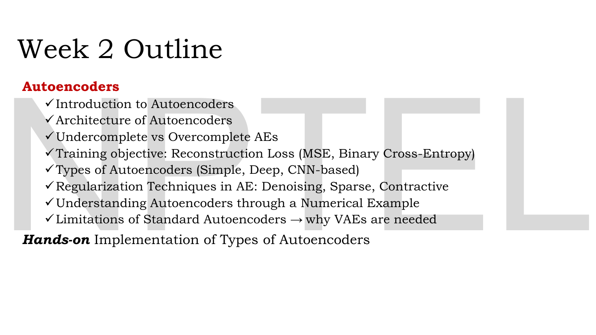
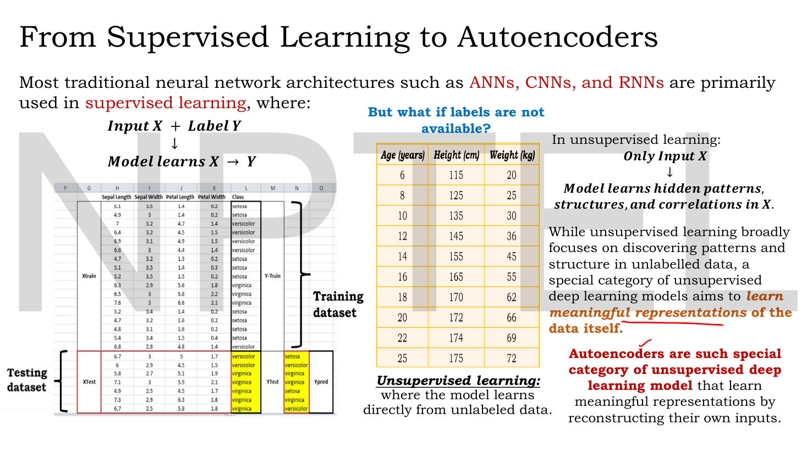
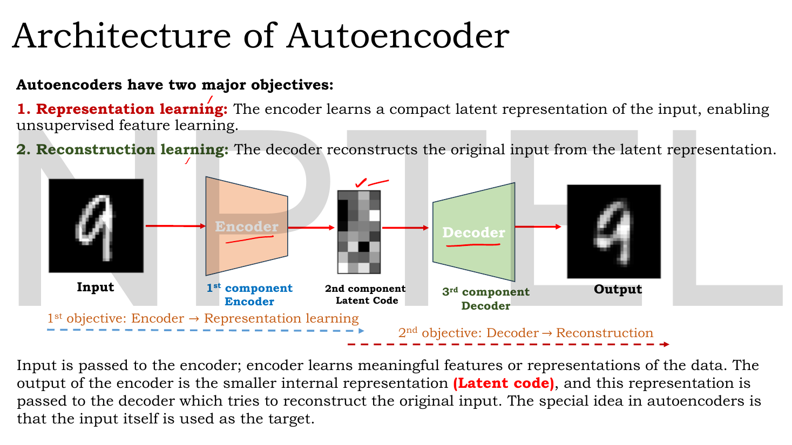
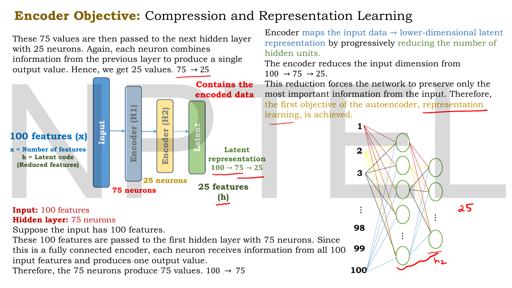
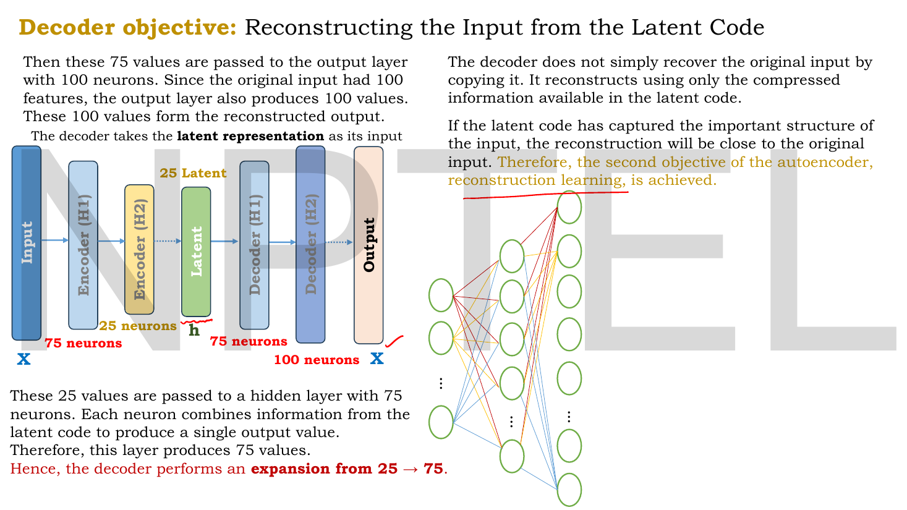
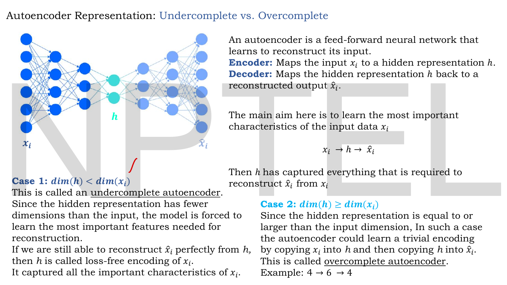

# Lec 10 — Introduction to Autoencoders

> **Source:** `Lec 10.pdf` (10 pages) · **Week 2** · **Playlist:** Lec 10
> **Prereqs:** [Lec 01 — Introduction to Generative AI](01-intro-generative-ai.md), [Lec 02 — Activation and Loss Functions](02-activations-and-losses.md)
> **Feeds into:** [Lec 11 — Reconstruction Loss (MSE, BCE)](11-reconstruction-loss.md), [Lec 12 — Types of Autoencoders](12-autoencoder-types.md), [Lec 13 — Denoising Autoencoders](13-denoising-ae.md), [Lec 16 — Numerical Example, Limitations of AE](16-ae-numerical-and-limits.md)

## Why this lecture exists

Everything in Week 1 was supervised. You had an input $\mathbf{X}$ and a label $\mathbf{Y}$, and the network learned the map between them. That arrangement has a hard dependency: somebody had to label the data. Most data is not labelled, and labelling is the expensive part.

This lecture opens Week 2 by removing the label entirely. If you only have $\mathbf{X}$, what can a neural network still learn? The answer this course builds on for the next six lectures is: make the network reconstruct its own input through a deliberately narrow channel. Nothing is given away by that target — you already have $\mathbf{X}$ — yet the narrowness forces the network to find structure, because a narrow channel cannot carry everything. That model is the **autoencoder**, and it is the architectural ancestor of the VAE, and through the VAE of Stable Diffusion's latent space. This lecture gives you its three parts, its two objectives, and the single dimension choice that decides whether it learns anything at all.

## The ideas


*Fig. — The map of the next seven chapters, in the lecturer's own order. Lines 1–3 are this chapter; line 4 is [Lec 11](11-reconstruction-loss.md); line 5 ("Simple, Deep, CNN-based") is [Lec 12](12-autoencoder-types.md); line 6 splits into [Lec 13](13-denoising-ae.md), [Lec 14](14-sparse-ae.md) and [Lec 15](15-contractive-ae.md); lines 7–8 are [Lec 16](16-ae-numerical-and-limits.md). Notice the arc ends at *"why VAEs are needed"* — the autoencoder is being taught as a stepping stone, not a destination. Page 2.*

### Where autoencoders sit: supervised, unsupervised, representation learning


*Fig. — Read the two tables against each other. Left: Iris, with a `Class` column, split into Xtrain/Y-Train and Xtest/YTest — the model learns $\mathbf{X}\to\mathbf{Y}$. Right: age, height, weight, and **no fourth column** — there is nothing to predict, so the model must learn about $\mathbf{X}$ itself. Page 4.*

The deck's framing, in its own order:

- **Supervised learning.** Input $\mathbf{X}$ *plus* label $\mathbf{Y}$. The model learns $\mathbf{X} \to \mathbf{Y}$. ANNs, CNNs and RNNs are, in the lecturer's phrase, "primarily used in supervised learning".
- **Unsupervised learning.** Only input $\mathbf{X}$. The model learns "hidden patterns, structures, and correlations in $\mathbf{X}$". Clustering is the familiar example.
- **Representation learning.** A *special category* of unsupervised deep learning whose goal is narrower than "find patterns": it is to **learn meaningful representations of the data itself**.

The slide's last line is the definition to carry forward: *autoencoders are such a special category of unsupervised deep learning model that learn meaningful representations by reconstructing their own inputs.*

Notice what makes this legal. An autoencoder is trained with a target, exactly like a supervised model — backpropagation needs one. The trick is that **the target is the input**. You get supervised machinery on unlabelled data for free. Some authors call this *self-supervised* for that reason; this deck says unsupervised, and for the exam you should answer **unsupervised**.

> **Terminology, once.** The deck writes the hidden representation as $h$ and the input/reconstruction as $x_i$ and $\hat{x}_i$. Throughout this book the code is $\mathbf{H}$ (a matrix over a batch, $\mathbf{h}$ for one sample), the encoder matrix is $\mathbf{W}_e$ and the decoder matrix $\mathbf{W}_d$, following [Lec 11](11-reconstruction-loss.md). Later lectures rename the code $\mathbf{z}$ when it becomes a random variable in the VAE; it is the same object.

### The three components and the two objectives


*Fig. — The whole model on one slide. Count the three components left to right — **1st: encoder, 2nd: latent code, 3rd: decoder** — and notice the two dashed arrows underneath split the network in half: the encoder half delivers objective 1, the decoder half objective 2. Also look at the output 9: it is visibly softer than the input. That blur is not a bug, it is the bottleneck. Page 5.*

An autoencoder has **three components**, numbered on the slide:

| # | Component | What it does | Produces |
|---|---|---|---|
| 1 | **Encoder** | compresses the input into a smaller internal representation | the code |
| 2 | **Latent code** $\mathbf{h}$ | the compressed representation itself — the narrowest point | — |
| 3 | **Decoder** | expands the code back out, trying to recover the input | $\hat{\mathbf{x}}$ |

and **two major objectives**, which the deck is careful to name separately:

1. **Representation learning.** The encoder learns a compact latent representation of the input, enabling unsupervised feature learning. This is the *useful* half — the half you keep after training.
2. **Reconstruction learning.** The decoder reconstructs the original input from the latent representation. This is the *training signal* — the half that exists to make objective 1 happen.

That asymmetry is the single most important idea in the lecture and the deck states it plainly: *"the special idea in autoencoders is that the input itself is used as the target."* You do not want the reconstruction. If you wanted the input you would keep the input. You want $\mathbf{h}$, and reconstruction is merely the pressure that makes $\mathbf{h}$ good.

The **latent code** is also called the *bottleneck*, the *code*, the *latent representation* or the *latent space*. All four appear in this course. The term "bottleneck" is literal: it is the narrowest cross-section of the network, and like a bottleneck in a pipe it sets the maximum rate at which information can get through.

### The encoder: progressive compression


*Fig. — Follow the red annotations: $100 \to 75$, then $75 \to 25$, with "Contains the encoded data" pointing at the green latent block. Each arrow is one fully connected layer, and the reduction is **progressive** — the deck never jumps 100 straight to 25. Page 6.*

The deck's running example is a 100-feature input, and it walks the compression one layer at a time:

1. The input has **100 features**.
2. These are passed to a first hidden layer with **75 neurons**. Because the encoder is fully connected, *each neuron receives information from all 100 input features and produces one output value*. So the 75 neurons produce 75 values: $100 \to 75$.
3. Those 75 values go to a second hidden layer with **25 neurons**. Again each neuron combines information from the previous layer into a single value: $75 \to 25$.
4. The 25 values are the **latent representation** $\mathbf{h}$.

Written in the book's notation, with $g(\cdot)$ the encoder activation:

$$\mathbf{h} = g\big(\mathbf{W}_e^{(2)\top}\,g(\mathbf{W}_e^{(1)\top}\mathbf{x})\big)$$

The lecturer's own justification for the narrowing is one sentence and you should be able to reproduce it: *this reduction forces the network to preserve only the most important information from the input.* There is no room for everything, so the optimiser must rank the input's content by usefulness-for-reconstruction and keep the top of that ranking. That is the whole mechanism by which an autoencoder learns features.

At this point, the deck says, **"the first objective of the autoencoder, representation learning, is achieved."**

### The decoder: progressive expansion


*Fig. — The complete network for the first time, and it is a **mirror**: 100-75-25-75-100. Note the labels at the two ends, both marked $\mathbf{X}$ in blue — input and target are the same object. The red note at bottom left reads "the decoder performs an expansion from 25 → 75". Page 7.*

The decoder runs the encoder backwards:

1. It takes the **latent representation** (25 values) as its input.
2. These pass to a hidden layer of **75 neurons**, each combining information from the latent code into one value: an **expansion, $25 \to 75$**.
3. Those 75 values pass to an output layer of **100 neurons** — "since the original input had 100 features, the output layer also produces 100 values". These 100 values form the **reconstructed output** $\hat{\mathbf{x}}$.

With $f(\cdot)$ the decoder activation:

$$\hat{\mathbf{x}} = f\big(\mathbf{W}_d^{(2)\top} f(\mathbf{W}_d^{(1)\top}\mathbf{h})\big)$$

The output layer's width is **forced**: it must equal the input dimension, because the loss compares $\hat{\mathbf{x}}$ with $\mathbf{x}$ element by element. Every other width in the network is a free design choice; this one is not.

The slide then makes a point that is easy to skim past and is examinable:

> *"The decoder does not simply recover the original input by copying it. It reconstructs using only the compressed information available in the latent code."*

The decoder never sees $\mathbf{x}$. It sees 25 numbers. If the reconstruction comes out close to the input, the *only* possible explanation is that those 25 numbers captured the input's important structure — which is why reconstruction error is a valid score for representation quality, and why the deck can say that at this point **"the second objective of the autoencoder, reconstruction learning, is achieved."**

A quick architectural read of the mirror:

```
   100        75         25         75        100
  input  →  enc H1  →  LATENT  →  dec H1  →  output
           (compress)  bottleneck  (expand)
  └──────── encoder ────────┘└──────── decoder ────────┘
            objective 1              objective 2
```

Symmetry is conventional, not required. Nothing stops you giving the decoder a different depth from the encoder; the deck draws a mirror because it is the usual choice and because it makes tied weights ($\mathbf{W}_d = \mathbf{W}_e^\top$, [Lec 11](11-reconstruction-loss.md)) possible layer by layer.

### Undercomplete vs overcomplete — the decision that matters


*Fig. — The two cases are split by a single inequality on $\dim(\mathbf{h})$. Trace the network drawing: it narrows to **two** teal units, so this picture is Case 1. Note that Case 2's boundary is $\geq$, not $>$ — equality is already overcomplete. Page 8.*

The deck first restates the model compactly:

> An autoencoder is a **feed-forward neural network that learns to reconstruct its input**.
> **Encoder:** maps the input $\mathbf{x}_i$ to a hidden representation $\mathbf{h}$.
> **Decoder:** maps the hidden representation $\mathbf{h}$ back to a reconstructed output $\hat{\mathbf{x}}_i$.
> The main aim is to learn the most important characteristics of the input data $\mathbf{x}_i$:
> $$\mathbf{x}_i \to \mathbf{h} \to \hat{\mathbf{x}}_i$$
> Then $\mathbf{h}$ has captured everything that is required to reconstruct $\hat{\mathbf{x}}_i$ from $\mathbf{x}_i$.

Then it splits on the code's dimension.

**Case 1 — $\dim(\mathbf{h}) < \dim(\mathbf{x}_i)$: the undercomplete autoencoder.** The hidden representation has *fewer* dimensions than the input, so the model is forced to learn the most important features needed for reconstruction. The deck adds a definition worth memorising verbatim: if you are *still able to reconstruct $\hat{\mathbf{x}}_i$ perfectly from $\mathbf{h}$*, then $\mathbf{h}$ is called a **loss-free encoding** of $\mathbf{x}_i$ — it captured all the important characteristics of $\mathbf{x}_i$.

Loss-free undercomplete encoding is not a fantasy. It happens exactly when the data occupies a lower-dimensional subspace (or manifold) than its ambient dimension suggests — 1000 columns of a spreadsheet where 40 of them are linear combinations of the others. The Code section below exhibits a dataset in $\mathbb{R}^4$ that a 2-dimensional code reconstructs to machine precision.

**Case 2 — $\dim(\mathbf{h}) \geq \dim(\mathbf{x}_i)$: the overcomplete autoencoder.** The hidden representation is equal to or larger than the input dimension. The deck's warning is blunt: *in such a case the autoencoder could learn a trivial encoding by copying $\mathbf{x}_i$ into $\mathbf{h}$ and then copying $\mathbf{h}$ into $\hat{\mathbf{x}}_i$.* Its example is $4 \to 6 \to 4$.

Take the failure seriously, because it is total. With $\dim(\mathbf{h}) \geq \dim(\mathbf{x})$ there exists a weight setting — the identity on the first $n$ coordinates, zero elsewhere — giving **exactly zero reconstruction loss on every possible input**, including inputs the model has never seen. It is a global minimum of the training objective. The optimiser has found the answer, your loss curve looks superb, and the model has learned nothing whatsoever about your data: $\mathbf{h}$ is just $\mathbf{x}$ with padding. No amount of training fixes it, because there is nothing left to fix.

| | Undercomplete | Overcomplete |
|---|---|---|
| **Condition** | $\dim(\mathbf{h}) < \dim(\mathbf{x})$ | $\dim(\mathbf{h}) \geq \dim(\mathbf{x})$ |
| **Deck's example** | $100 \to 25 \to 100$ | $4 \to 6 \to 4$ |
| **Compression** | yes | none |
| **Failure mode** | underfits if $\dim(\mathbf{h})$ is too small | learns the identity, trivially |
| **Reconstruction error** | $\geq 0$, usually $> 0$ | can be exactly $0$, meaninglessly |
| **Learns features?** | yes, forced to | not unless regularised |
| **Needs a regulariser?** | no | **yes** — this is why Lec 13–15 exist |

That last row is the bridge out of this lecture. An overcomplete autoencoder is not useless; it is useless *unless you stop it copying*. The three ways this course stops it — corrupting the input ([Lec 13](13-denoising-ae.md)), penalising how many latent units fire ([Lec 14](14-sparse-ae.md)), and penalising sensitivity to input changes ([Lec 15](15-contractive-ae.md)) — are the whole content of next week's regularisation arc. Each is a different answer to "the bottleneck is gone, so what replaces it?".

### What an autoencoder is actually used for

The deck motivates autoencoders as representation learners but never lists applications. Since this chapter owns the uses, here they are, each tied back to a part of the architecture you have just met.

**Dimensionality reduction.** Train the full autoencoder, then *throw the decoder away* and keep the encoder. It is now a learned $n \to k$ compressor you can run on new data; $\mathbf{h}$ becomes your feature vector. This is the direct analogue of PCA, and for a linear autoencoder with squared-error loss it is provably the *same subspace* as PCA — the connection [Lec 11](11-reconstruction-loss.md) sets up algebraically and [Lec 16](16-ae-numerical-and-limits.md) names outright. The autoencoder's advantage is that nonlinear activations let it find curved structure PCA cannot.

**Feature learning for a downstream model.** Having compressed with the encoder, feed $\mathbf{h}$ to an ordinary classifier. This pays when you have a mountain of unlabelled data and a handful of labels: train the autoencoder on everything, then fit a small supervised head on $\mathbf{h}$ using the few labels you have. The expensive representation work was done without labels.

**Denoising and signal restoration.** Feed a corrupted input and demand the *clean* one as the target. The model cannot learn the identity, because the identity would return the noise. [Lec 13](13-denoising-ae.md) owns this completely.

**Anomaly detection.** Train on normal data only. The autoencoder gets good at reconstructing normal examples and stays bad at anything else, so a high reconstruction error at test time is a flag. Note that this is the one application where you keep the *decoder* and use the loss itself as the output.

**Compression and generation (with a caveat).** $\mathbf{h}$ is a compact code, so the obvious thought is: invent a new $\mathbf{h}$, run the decoder, get a new sample. This does not work for a plain autoencoder, and the reason it does not work is the entire motivation for the VAE. [Lec 16](16-ae-numerical-and-limits.md) owns the argument; do not let the "latent space" vocabulary lull you into assuming an autoencoder is generative. It is not.

### Training, in one sentence

Both objectives are optimised by one scalar: the **reconstruction loss** $\mathcal{L}(\mathbf{x}, \hat{\mathbf{x}})$, minimised by ordinary backpropagation with the input serving as its own target. Which loss — mean squared error for real-valued data, binary cross-entropy for binary data — and why each forces a particular decoder activation is [Lec 11](11-reconstruction-loss.md)'s subject entirely, and the deck closes by announcing exactly that as the next session.

## Worked numericals

The Lec 10 deck contains **no explicit arithmetic**: its quantitative content is the two dimension chains, $100 \to 75 \to 25$ (page 6) and $25 \to 75 \to 100$ (page 7), plus the overcomplete example $4 \to 6 \to 4$ (page 8). N1 and N3 reproduce and verify those; N2, N4, N5 and N6 are built on top.

### N1. The deck's network, layer by layer, with parameter counts

**Given:** the autoencoder of pages 6–7: input 100 features, encoder hidden layer 75, latent 25, decoder hidden layer 75, output 100. Fully connected throughout, with a bias per neuron.
**Find:** the output width of every layer, and the total number of learnable parameters.

1. **Encoder layer 1**, $100 \to 75$. Weight matrix $\mathbf{W}_e^{(1)}$ is $100\times75$, plus 75 biases.
 $$100 \times 75 + 75 = 7500 + 75 = 7575$$
2. **Encoder layer 2**, $75 \to 25$. Matrix $75\times25$, plus 25 biases.
 $$75 \times 25 + 25 = 1875 + 25 = 1900$$
3. **Decoder layer 1**, $25 \to 75$. Matrix $25\times75$, plus 75 biases.
 $$25 \times 75 + 75 = 1875 + 75 = 1950$$
4. **Decoder layer 2 (output)**, $75 \to 100$. Matrix $75\times100$, plus 100 biases.
 $$75 \times 100 + 100 = 7500 + 100 = 7600$$
5. Total: $7575 + 1900 + 1950 + 7600$.
 $$7575 + 1900 = 9475;\quad 9475 + 1950 = 11425;\quad 11425 + 7600 = 19025$$

**Answer:** widths $100 \to 75 \to 25 \to 75 \to 100$; **19,025 learnable parameters**. Ignoring biases it is $7500+1875+1875+7500 = \mathbf{18{,}750}$ — an exam may ask for either, so read the question for the word "bias". With tied weights ($\mathbf{W}_d^{(l)} = \mathbf{W}_e^{(l)\top}$) only the encoder's matrices are learned, giving $7500+1875 = 9375$ weights plus whatever biases are kept.

### N2. Undercomplete or overcomplete?

**Given:** five architectures.
**Find:** classify each, and give the compression ratio $\dim(\mathbf{x})/\dim(\mathbf{h})$ where it is meaningful.

| Architecture | $\dim(\mathbf{x})$ | $\dim(\mathbf{h})$ | Test $\dim(\mathbf{h}) < \dim(\mathbf{x})$ | Verdict | Ratio |
|---|---|---|---|---|---|
| $100\to25\to100$ | 100 | 25 | $25 < 100$ ✓ | undercomplete | $100/25 = 4\times$ |
| $4\to6\to4$ | 4 | 6 | $6 < 4$ ✗ | **overcomplete** | — |
| $784\to32\to784$ | 784 | 32 | $32 < 784$ ✓ | undercomplete | $784/32 = 24.5\times$ |
| $50\to50\to50$ | 50 | 50 | $50 < 50$ ✗ | **overcomplete** (boundary) | $1\times$ |
| $64\to128\to16\to128\to64$ | 64 | 16 | $16 < 64$ ✓ | undercomplete | $64/16 = 4\times$ |

**Answer:** rows 2 and 4 are overcomplete, the rest undercomplete. Two traps are built in. Row 4: the condition is $\dim(\mathbf{h}) \geq \dim(\mathbf{x})$, so **equality counts as overcomplete** — the identity is still available. Row 5: a hidden layer of 128 is *wider* than the 64-dimensional input, but the classification depends only on the **narrowest** layer, the latent code at 16. A wide intermediate layer inside the encoder is fine and common.

### N3. The $4 \to 6 \to 4$ trivial encoding, made explicit

**Given:** the deck's overcomplete example, $\dim(\mathbf{x}) = 4$, $\dim(\mathbf{h}) = 6$, and the input $\mathbf{x} = [2,\ -1,\ 5,\ 0]$.
**Find:** weights achieving zero reconstruction error without learning anything, and the resulting loss.

1. Set the encoder $\mathbf{W}_e$ ($4\times6$) to the $4\times4$ identity with two arbitrary extra columns $\mathbf{a}, \mathbf{b}$:
 $$\mathbf{W}_e = [\,\mathbf{I}_4 \mid \mathbf{a} \mid \mathbf{b}\,]$$
2. Then $\mathbf{h} = \mathbf{x}\mathbf{W}_e = [2,\ -1,\ 5,\ 0,\ \mathbf{x}\!\cdot\!\mathbf{a},\ \mathbf{x}\!\cdot\!\mathbf{b}]$. The first four entries are literally $\mathbf{x}$.
3. Set the decoder $\mathbf{W}_d$ ($6\times4$) to the $4\times4$ identity stacked on a $2\times4$ block of zeros:
 $$\mathbf{W}_d = \begin{bmatrix}\mathbf{I}_4\\ \mathbf{0}_{2\times4}\end{bmatrix}$$
4. Then $\hat{\mathbf{x}} = \mathbf{h}\mathbf{W}_d = [2,\ -1,\ 5,\ 0]$ — the last two latent entries are multiplied by zero and vanish.
5. Loss: $\lVert \mathbf{x} - \hat{\mathbf{x}}\rVert^2 = 0^2+0^2+0^2+0^2 = 0$.

**Answer:** reconstruction error is **exactly 0**, for this and for every other input in $\mathbb{R}^4$, with no training at all. The model is a global optimum of the reconstruction objective and has extracted zero information. This is why Case 2 is a warning and not a design option.

### N4. Choosing the latent dimension for a target compression

**Given:** MNIST images, $28\times28$ greyscale, flattened. You want at least $20\times$ compression into the code.
**Find:** the largest admissible latent dimension, and check the result is undercomplete.

1. Input dimension: $28 \times 28 = 784$.
2. Need $784 / \dim(\mathbf{h}) \geq 20$, i.e. $\dim(\mathbf{h}) \leq 784/20 = 39.2$.
3. Largest integer: $\dim(\mathbf{h}) = 39$. Check: $784/39 = 20.10 \geq 20$ ✓. And $40$ would give $784/40 = 19.6 < 20$ ✗.
4. Undercomplete check: $39 < 784$ ✓.

**Answer:** $\dim(\mathbf{h}) = \mathbf{39}$. In practice you would round to a power of two and use 32, giving $784/32 = 24.5\times$ — which is exactly the latent size the [Lec 12](12-autoencoder-types.md) code uses.

### N5. Loss-free encoding on a rank-deficient dataset

**Given:** three samples in $\mathbb{R}^3$, every one of which satisfies $x_3 = x_1 + x_2$:
$$\mathbf{x}_1 = [1,\ 2,\ 3],\quad \mathbf{x}_2 = [4,\ 1,\ 5],\quad \mathbf{x}_3 = [-2,\ 6,\ 4]$$
**Find:** a 2-dimensional code that is a loss-free encoding, by the deck's definition.

1. Encoder: keep the first two coordinates. $\mathbf{W}_e = \begin{bmatrix}1&0\\0&1\\0&0\end{bmatrix}$, so $\mathbf{h}_i = [x_{i1},\ x_{i2}]$.
 $$\mathbf{h}_1 = [1,2],\qquad \mathbf{h}_2 = [4,1],\qquad \mathbf{h}_3 = [-2,6]$$
2. Decoder: rebuild the third coordinate from the constraint. $\mathbf{W}_d = \begin{bmatrix}1&0&1\\0&1&1\end{bmatrix}$, so $\hat{\mathbf{x}}_i = [h_{i1},\ h_{i2},\ h_{i1}+h_{i2}]$.
3. Reconstruct: $\hat{\mathbf{x}}_1 = [1, 2, 1+2] = [1,2,3]$ ✓; $\hat{\mathbf{x}}_2 = [4,1,4+1] = [4,1,5]$ ✓; $\hat{\mathbf{x}}_3 = [-2,6,-2+6] = [-2,6,4]$ ✓.
4. Total squared error: $0 + 0 + 0 = 0$.

**Answer:** a $3 \to 2 \to 3$ undercomplete autoencoder achieves **exactly zero** reconstruction error here, so $\mathbf{h}$ is a **loss-free encoding**. The compression is real (3 numbers stored as 2) and nothing was lost, because the data never used its third dimension. Contrast N3: there the zero loss was vacuous; here it is informative — the model discovered the relation $x_3 = x_1+x_2$.

### N6. What a code cannot do: an information-capacity floor

**Given:** 1000 distinct binary images, each $8\times8$ with pixels in $\{0,1\}$, and an autoencoder whose latent code is a **single** unit quantised to 8 bits (256 distinguishable values).
**Find:** the minimum number of images that must be reconstructed wrongly.

1. The code can take at most $256$ distinct values, so the decoder can emit at most $256$ distinct outputs.
2. There are $1000$ distinct inputs to separate.
3. By pigeonhole, at least $1000 - 256 = 744$ inputs must share an output with some other input.
4. At most one member of each collision group can be reconstructed exactly, so at least $744$ are reconstructed wrongly.

**Answer:** at least **744** of the 1000 images are wrong, regardless of training, architecture depth or loss function. The bottleneck is a *capacity* constraint, not an optimisation difficulty — no optimiser beats counting. This is the quantitative content of "the reduction forces the network to preserve only the most important information".

## Code

The deck asserts two things it never demonstrates: that an undercomplete code can be loss-free, and that an overcomplete one can cheat. Both are visible in twenty lines. The optimal *linear* tied autoencoder has a closed form (it is PCA, via the SVD), so no training loop is needed.

```python
import numpy as np
rng = np.random.default_rng(0)

# 200 samples with 4 features, but built from only 2 independent directions:
# the data LOOKS 4-dimensional and is really 2-dimensional.
Z = rng.normal(size=(200, 2)); B = rng.normal(size=(2, 4))
X = Z @ B

def pca_ae(X, k):                      # the OPTIMAL tied linear autoencoder is PCA
    mu = X.mean(0); Xc = X - mu
    _, _, Vt = np.linalg.svd(Xc, full_matrices=False)
    W = Vt[:k].T                       # encoder n x k ; decoder = W.T (tied)
    return Xc @ W, Xc @ W @ W.T + mu   # (code H, reconstruction)

for k in (1, 2, 3, 4):
    H, Xh = pca_ae(X, k)
    err = np.mean(np.sum((X - Xh) ** 2, axis=1))
    print(f"dim(h)={k}  undercomplete={k < 4}   mean per-sample squared error = {err:.3e}")

# the slide's OVERCOMPLETE case, 4 -> 6 -> 4, built by hand -- no training at all
We = np.hstack([np.eye(4), rng.normal(size=(4, 2))])   # 4x6: copy x, append junk
Wd = np.vstack([np.eye(4), np.zeros((2, 4))])          # 6x4: read the copy back
H = X @ We; Xh = H @ Wd
print("\n4 -> 6 -> 4 trivial copy: mean per-sample squared error =",
      np.mean(np.sum((X - Xh) ** 2, axis=1)))
print("x_0 =", np.round(X[0], 3))
print("h_0 =", np.round(H[0], 3), "<- first 4 entries ARE x_0")
```

```
dim(h)=1  undercomplete=True   mean per-sample squared error = 9.171e-01
dim(h)=2  undercomplete=True   mean per-sample squared error = 4.152e-31
dim(h)=3  undercomplete=True   mean per-sample squared error = 6.487e-31
dim(h)=4  undercomplete=False   mean per-sample squared error = 7.602e-31

4 -> 6 -> 4 trivial copy: mean per-sample squared error = 0.0
x_0 = [ 0.132 -0.048 -0.033  0.114]
h_0 = [ 0.132 -0.048 -0.033  0.114 -0.13   0.086] <- first 4 entries ARE x_0
```

Three readings, in order of importance.

**$\dim(\mathbf{h}) = 2$ is a loss-free encoding.** The error is $4\times10^{-31}$ — floating-point zero. The data was secretly two-dimensional and a two-dimensional code caught all of it. This is the deck's Case 1 best outcome, and note the model was *forced* to discover the structure: with only two slots it had no choice but to find the two directions that matter.

**$\dim(\mathbf{h}) = 1$ is where compression bites.** Error jumps to $0.917$ per sample. Below the data's true dimension, loss is unavoidable, and what survives is whichever single direction carries the most variance — the *most important* information, exactly as the slide claims.

**The overcomplete case is a cheat, and it cost nothing.** Error is **identically 0.0**, achieved with hand-written weights and no gradient steps at all. Print $\mathbf{h}_0$ and you can read $\mathbf{x}_0$ straight out of its first four entries. A loss of zero told you nothing about representation quality; it told you the channel was wide enough to copy.

## Exam pack

### Must-memorise

| Item | Exactly this |
|---|---|
| Autoencoder | a feed-forward neural network that learns to reconstruct its input |
| Learning paradigm | **unsupervised** (a special category of unsupervised deep learning) |
| The target | **the input itself** |
| Three components | 1. encoder, 2. latent code, 3. decoder |
| Two objectives | 1. **representation learning** (encoder), 2. **reconstruction learning** (decoder) |
| Encoder | maps $\mathbf{x}_i \to \mathbf{h}$, lower-dimensional |
| Decoder | maps $\mathbf{h} \to \hat{\mathbf{x}}_i$ |
| The pipeline | $\mathbf{x}_i \to \mathbf{h} \to \hat{\mathbf{x}}_i$ |
| Undercomplete | $\dim(\mathbf{h}) < \dim(\mathbf{x}_i)$ |
| Overcomplete | $\dim(\mathbf{h}) \geq \dim(\mathbf{x}_i)$ — note the $\geq$ |
| Loss-free encoding | an $\mathbf{h}$ from which $\hat{\mathbf{x}}_i$ is reconstructed **perfectly** |
| Overcomplete failure | learns a **trivial encoding**: copy $\mathbf{x}_i$ into $\mathbf{h}$, copy $\mathbf{h}$ into $\hat{\mathbf{x}}_i$ |
| Why the bottleneck | "forces the network to preserve only the most important information" |
| Output layer width | must equal the input dimension — not a free choice |
| Training objective | reconstruction loss — see [Lec 11](11-reconstruction-loss.md) |

### Numbers worth knowing

| Quantity | Value |
|---|---|
| Deck's encoder chain | $100 \to 75 \to 25$ |
| Deck's decoder chain | $25 \to 75 \to 100$ |
| Full deck network | $100\text{-}75\text{-}25\text{-}75\text{-}100$ |
| Its parameter count | 19,025 with biases; 18,750 weights only |
| Its compression ratio | $100/25 = 4\times$ |
| Deck's overcomplete example | $4 \to 6 \to 4$ |
| Minimum achievable loss, overcomplete | exactly $0$ |
| MNIST flattened dimension | $28\times28 = 784$ |
| Typical MNIST latent | 32, i.e. $24.5\times$ compression |
| Boundary case | $\dim(\mathbf{h}) = \dim(\mathbf{x})$ is **overcomplete** |

### Likely MCQ traps

- **"Autoencoders are supervised because they have a target."** They are **unsupervised**. The distinction is whether an *external label* was required; the autoencoder's target is the input you already have. The deck says unsupervised; answer unsupervised.
- **$\dim(\mathbf{h}) = \dim(\mathbf{x})$ misclassified.** Case 2's condition is $\geq$, so equality is **overcomplete**. Only strictly fewer dimensions is undercomplete.
- **Judging complete-ness from a hidden layer instead of the latent layer.** $64\to128\to16\to128\to64$ is **undercomplete**: only the narrowest layer — the code — counts. Intermediate layers may be as wide as you like.
- **"Zero reconstruction error means the model is good."** In an overcomplete autoencoder zero error means the model learned the identity and nothing else. Error is only informative *relative to the capacity of the code*.
- **Confusing the two objectives with the two halves of the loss.** There is only **one** loss here, the reconstruction loss. "Representation learning" and "reconstruction learning" are objectives of the encoder and the decoder, not two additive terms. (The VAE's loss genuinely does have two terms — that is [Lec 22](22-elbo-and-vae-loss.md), a different thing.)
- **Thinking the decoder sees the input.** It sees only $\mathbf{h}$. That is precisely why reconstruction quality certifies the code.
- **"Autoencoders can generate new data because they have a latent space."** A plain autoencoder cannot. [Lec 16](16-ae-numerical-and-limits.md) owns the reason; the shared vocabulary with VAEs is the trap.
- **Assuming the encoder and decoder must be mirror images.** Conventional and convenient (it enables tied weights), but not required. Only the output width is forced.
- **Counting "3 layers" as the number of components.** The deck's components are encoder / latent code / decoder — the *latent code* is component 2, not a layer count.

### Self-test

1. Name the three components of an autoencoder and the two objectives, and say which component delivers which objective.
2. An autoencoder is $200 \to 150 \to 40 \to 150 \to 200$. Is it undercomplete? What is the compression ratio? How many learnable parameters (with biases)?
3. State the exact condition for an overcomplete autoencoder, and say what goes wrong.
4. Why can an autoencoder be trained with backpropagation despite having no labels?
5. Define "loss-free encoding" in the deck's sense, and give a dataset on which a $3\to2\to3$ autoencoder achieves it.
6. A student reports an overcomplete autoencoder with training loss $0.0000$. What have they most likely built?
7. Which single layer width in an autoencoder is not a free design choice, and why?
8. You have 500,000 unlabelled images and 800 labelled ones. Describe how an autoencoder helps.
9. Is an autoencoder supervised, unsupervised or reinforcement learning, by this deck's classification?
10. An autoencoder's code is one unit quantised to 4 bits. You feed it 100 distinct inputs. At least how many are reconstructed incorrectly?

<details><summary>Answers</summary>

1. Components: **encoder**, **latent code**, **decoder**. Objectives: **representation learning**, delivered by the encoder, and **reconstruction learning**, delivered by the decoder.
2. Undercomplete, since $40 < 200$. Ratio $200/40 = 5\times$. Parameters: $(200\cdot150+150) + (150\cdot40+40) + (40\cdot150+150) + (150\cdot200+200) = 30150 + 6040 + 6150 + 30200 = \mathbf{72{,}540}$.
3. $\dim(\mathbf{h}) \geq \dim(\mathbf{x}_i)$. The model can learn a **trivial encoding** — copy $\mathbf{x}$ into $\mathbf{h}$, copy $\mathbf{h}$ into $\hat{\mathbf{x}}$ — reaching exactly zero loss while learning nothing. It needs an external regulariser (Lec 13–15) to be useful.
4. Because the input itself is used as the target. Backpropagation needs a target, not a *label*; no human annotation is involved, so the setting is still unsupervised.
5. A code $\mathbf{h}$ from which $\hat{\mathbf{x}}_i$ is reconstructed **perfectly**, so it captured all the important characteristics of $\mathbf{x}_i$. Example: any dataset obeying $x_3 = x_1 + x_2$ — see N5, where all three samples reconstruct exactly.
6. The identity function, with padding. Zero loss in an overcomplete setting is the diagnostic *for* the trivial encoding, not evidence against it.
7. The **output layer**: it must have exactly $\dim(\mathbf{x})$ units, because the reconstruction loss compares $\hat{\mathbf{x}}$ to $\mathbf{x}$ element by element.
8. Train an autoencoder on all 500,800 images with no labels, discard the decoder, encode everything to $\mathbf{h}$, then fit a small supervised classifier on the 800 labelled $\mathbf{h}$ vectors. The representation was learned without labels; the labels are spent only on the cheap final step.
9. **Unsupervised** — specifically, the special category of unsupervised deep learning called representation learning.
10. 4 bits gives $2^4 = 16$ distinct codes, so at most 16 distinct outputs. At least $100-16 = \mathbf{84}$ inputs collide with another and are reconstructed incorrectly.

</details>

## Beyond the slides

**Gap: the deck never says what to *do* with a trained autoencoder.**
**Why it matters:** the whole point is that you keep the **encoder** and discard the decoder — the latent code is the deliverable. Without that sentence a reader can finish the lecture believing the goal was the blurry output image. The *What an autoencoder is actually used for* section above supplies the five standard uses (dimensionality reduction, feature learning for a downstream model, denoising, anomaly detection, and the non-use of generation), each of which this course or its companions returns to.

**Gap: overcomplete autoencoders are described only as a failure, never as a design people deliberately choose.**
**Why it matters:** overcomplete codes are standard in modern practice — sparse dictionary learning, and sparse autoencoders for interpretability of LLMs, both use $\dim(\mathbf{h}) \gg \dim(\mathbf{x})$ on purpose, because an overcomplete-but-sparse code is *more* interpretable than a compressed one. The deck's warning is correct but conditional: overcomplete plus no regulariser is useless; overcomplete plus a regulariser is powerful. That is precisely why [Lec 14](14-sparse-ae.md) exists, and reading page 8 as an unconditional prohibition will cost you on a question about why anyone would widen the code.

**Gap: the bottleneck is presented as a dimension count, never as an information budget.**
**Why it matters:** what limits the code is bits, not units. A 32-unit float code carries far more information than a 32-unit binary code, and N6's pigeonhole argument shows the limit is countable and unbeatable. This framing is what makes the VAE's KL term ([Lec 19](19-kl-divergence-a.md), [Lec 22](22-elbo-and-vae-loss.md)) intelligible: that term is a *rate* penalty — it shrinks the code's information capacity without changing its dimension. If you only ever think "narrow layer", the VAE's regulariser looks arbitrary.

**Gap: no mention that a linear autoencoder is PCA.**
**Why it matters:** it is the cleanest sanity check you have, it makes the Code section above exact rather than approximate, and it tells you what nonlinearity buys — curved manifolds rather than flat subspaces. [Lec 11](11-reconstruction-loss.md) reduces the objective to $\min_\mathbf{W}\lVert\mathbf{X}-\mathbf{X}\mathbf{W}\mathbf{W}^\top\rVert^2$, which is literally PCA's objective, and [Lec 16](16-ae-numerical-and-limits.md) names the connection. Knowing it from the start makes the week cohere.

**Gap: you met this material in the vision course, and it stopped at a different place.**
**Why it matters:** [`GenAIforCV` week-08 — Autoencoders to VAE](../../GenAIforCV/notes/week-08/29-autoencoders-to-vae.md) covers the same encoder/bottleneck/decoder picture but moves to the VAE within a single chapter. This course spends **seven lectures** (10–16) on plain autoencoders before the VAE appears in Lec 21, and it examines details the vision course skips entirely: the undercomplete/overcomplete split by name, the three regularisers as separate models, and a full hand numerical. Treat the overlap as a chance to go faster, not as permission to skip — the exam is set from *this* deck's vocabulary, and "loss-free encoding" is this lecturer's phrase.

## Cut from the slides

Pages 1, 3, 9 and 10 are the course title, the session agenda, the next-session announcement and the thank-you; page 2 is the Week 2 outline, which is reproduced as the figure above because it is the map of this whole arc. Page 4's two spreadsheet screenshots (the Iris table with its `Class` column, and the 11-row age/height/weight table) are reproduced as a figure rather than transcribed, since their content is the *contrast* rather than the numbers — no quantity on either table is used anywhere in the lecture. The lecturer's handwritten annotations — the underlines under "75 → 25", "25 features (h)", "representation learning", the "$h_2$" scrawled beside the right-hand network on page 6, and the integral-like mark next to Case 1 on page 8 — are carried into the prose as emphasis rather than shown as marginalia. Pages 6 and 7 each carry a second, abstract neuron-by-neuron drawing of a fully connected layer on the right-hand side; those are generic MLP illustrations adding nothing beyond the block diagrams, so only page 7's complete block diagram is embedded in full. The reconstruction loss is named on page 9 and deliberately not taught here: it belongs entirely to [Lec 11](11-reconstruction-loss.md). Everything substantive on pages 4 through 8 is reproduced above.
