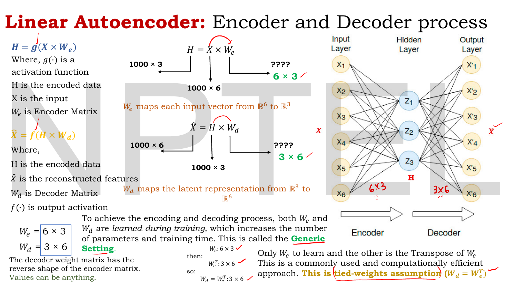
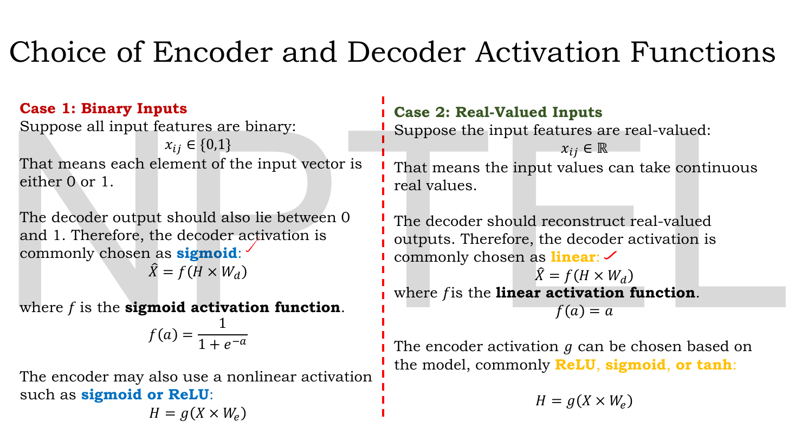
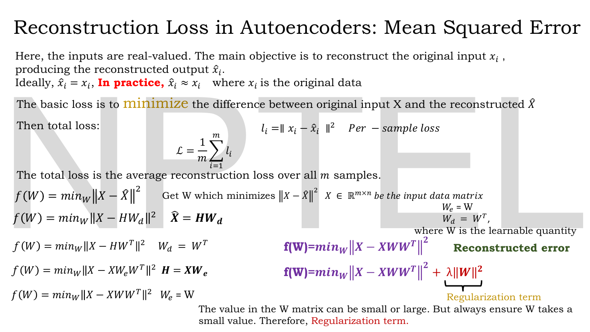
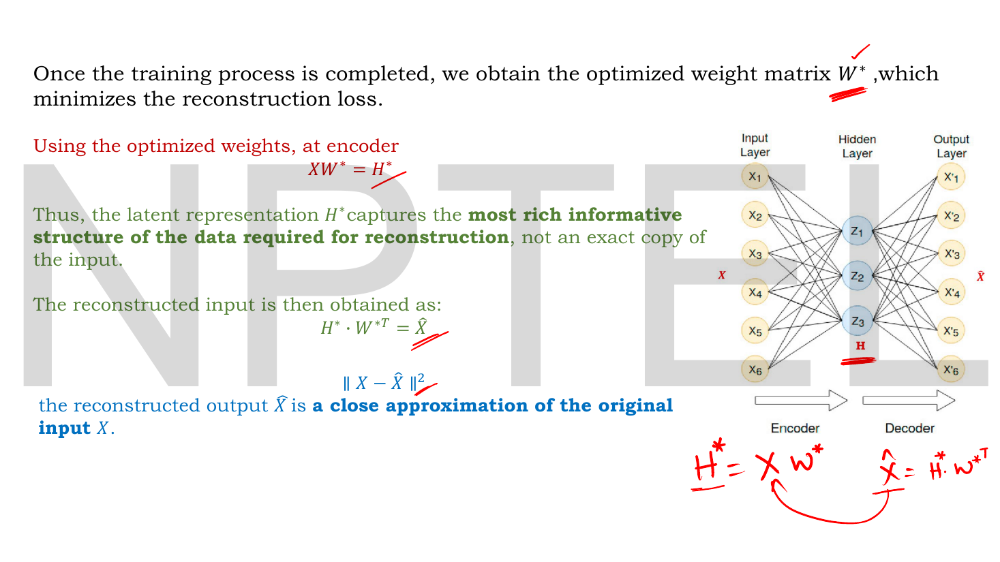
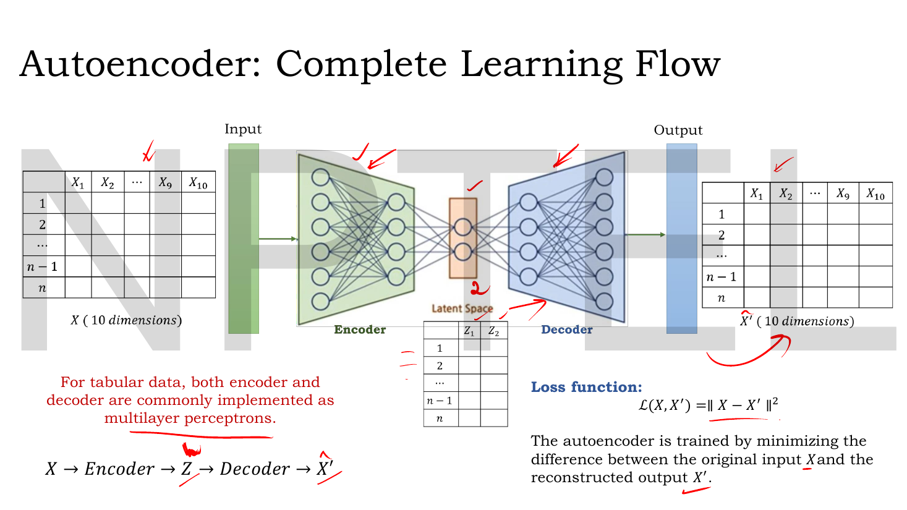
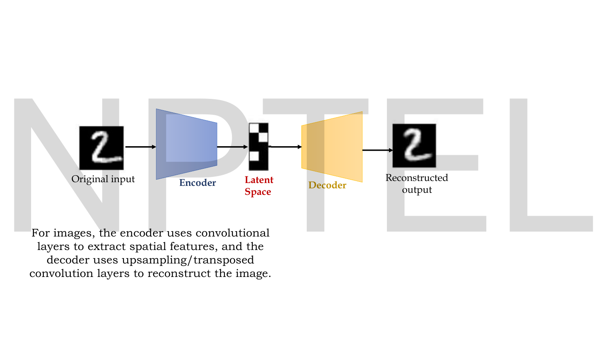

# Lec 11 — Reconstruction Loss (MSE, Binary Cross-Entropy)

> **Source:** `Lec 11.pdf` (11 pages) · **Week 2** · **Playlist:** Lec 11
> **Prereqs:** [Lec 02 — Activation and Loss Functions](02-activations-and-losses.md), [Lec 10 — Introduction to Autoencoders](10-autoencoder-intro.md)
> **Feeds into:** [Lec 12 — Types of Autoencoders](12-autoencoder-types.md), [Lec 13 — Denoising Autoencoders](13-denoising-ae.md), [Lec 16 — Numerical Example, Limitations of AE](16-ae-numerical-and-limits.md), [Lec 22 — Probabilistic Decoder, ELBO, VAE Loss](22-elbo-and-vae-loss.md)

## Why this lecture exists

Lec 10 gave you the autoencoder's shape: squeeze the input through a bottleneck, push it back out, demand that what comes out matches what went in. "Matches" was left vague. This lecture makes it a number you can differentiate.

The whole of autoencoder training is one question — *how wrong is $\hat{\mathbf{x}}$ compared to $\mathbf{x}$?* — and the answer depends entirely on what kind of data you have. Real-valued pixels and binary pixels want different loss functions, and choosing wrong costs you training speed and sometimes convergence. This lecture derives both choices, shows the decoder activation each one forces, and reduces the whole linear autoencoder to a single compact objective $\min_W \|\mathbf{X} - \mathbf{X}\mathbf{W}\mathbf{W}^\top\|^2$ that will reappear in Lec 16 when you discover why this model cannot generate anything.

## The ideas

### The encoder and decoder as two matrix multiplications

Strip the autoencoder down to matrices. With $g(\cdot)$ the encoder activation and $f(\cdot)$ the decoder activation:

$$\mathbf{H} = g(\mathbf{X}\mathbf{W}_e), \qquad \hat{\mathbf{X}} = f(\mathbf{H}\mathbf{W}_d)$$

$\mathbf{H}$ is the **encoded data** (the latent code, also called $\mathbf{Z}$ in later lectures), $\mathbf{W}_e$ the **encoder matrix**, $\mathbf{W}_d$ the **decoder matrix**.


*Fig. — The shape arithmetic is the whole slide. 1000 samples of 6 features, latent dimension 3: $\mathbf{W}_e$ must be $6\times3$ and $\mathbf{W}_d$ must be $3\times6$. Notice the decoder matrix is the **reverse shape** of the encoder's — that is what makes the next idea possible. Page 3.*

Work the shapes yourself, because this is examinable. Input $\mathbf{X}$ is $1000\times6$ — a thousand samples, six features each. You want a 3-dimensional code. Then:

- $\mathbf{H} = \mathbf{X}\mathbf{W}_e$ is $1000\times3$, so $\mathbf{W}_e$ is $\boxed{6\times3}$. It maps each input vector from $\mathbb{R}^6$ to $\mathbb{R}^3$.
- $\hat{\mathbf{X}} = \mathbf{H}\mathbf{W}_d$ is $1000\times6$, so $\mathbf{W}_d$ is $\boxed{3\times6}$. It maps the latent back from $\mathbb{R}^3$ to $\mathbb{R}^6$.

In general, for input dimension $n$ and latent dimension $k$: $\mathbf{W}_e$ is $n\times k$ and $\mathbf{W}_d$ is $k \times n$.

### Tied weights

If you learn $\mathbf{W}_e$ and $\mathbf{W}_d$ separately, you have $nk + kn = 2nk$ parameters to fit. The deck calls this the **generic setting**, and notes the obvious cost: more parameters, more training time.

The alternative exploits the shape coincidence. $\mathbf{W}_e$ is $n\times k$, so $\mathbf{W}_e^\top$ is $k\times n$ — exactly the shape $\mathbf{W}_d$ needs. So just *declare them the same matrix*:

$$\mathbf{W}_d = \mathbf{W}_e^\top$$

This is the **tied-weights assumption**. Now only $\mathbf{W}_e$ is learnable and you have halved the parameter count. The lecturer calls it "a commonly used and computationally efficient approach", and the rest of this lecture assumes it — once tied, you can write a single $\mathbf{W}$ for both.

> **Tied weights are an assumption, not a theorem.** Nothing forces the decoder to be the encoder's transpose; it is a constraint you impose to save parameters and regularise. An MCQ that asks "in a tied-weight autoencoder, what is $\mathbf{W}_d$?" wants $\mathbf{W}_e^\top$, and one that asks *why* wants "fewer parameters / faster training".

### The activation is chosen by the data, not by taste


*Fig. — The single most useful slide in this lecture. The data type on the left forces the decoder activation on the right, and the decoder activation then forces the loss. Page 4.*

The decoder's job is to emit something that could plausibly *be* the input. So the decoder activation must have the same range as the data.

**Case 1 — binary inputs, $x_{ij} \in \{0,1\}$.** Every feature is a 0 or a 1. The reconstruction must therefore lie in $[0,1]$, so the decoder activation is the **sigmoid**:

$$\hat{\mathbf{X}} = \sigma(\mathbf{H}\mathbf{W}_d), \qquad \sigma(a) = \frac{1}{1+e^{-a}}$$

which squashes any real pre-activation into $(0,1)$. Each output is read as a *probability* that the corresponding input bit is 1.

**Case 2 — real-valued inputs, $x_{ij} \in \mathbb{R}$.** The data is unbounded, so squashing would be destructive. The decoder activation is **linear**, $f(a) = a$ — which is to say, no activation at all on the output layer.

The *encoder* activation $g$ is free in both cases; the deck lists sigmoid, ReLU and tanh as the usual choices. Only the output is constrained, because only the output has to match the data's range.

### Mean squared error — the real-valued case


*Fig. — Read the left column downward: each line substitutes one definition until only $\mathbf{W}$ remains. The purple line at the right is the destination. Page 5.*

Ideally $\hat{\mathbf{x}}_i = \mathbf{x}_i$; in practice $\hat{\mathbf{x}}_i \approx \mathbf{x}_i$, and the gap is the loss. The **per-sample loss** is the squared Euclidean distance between input and reconstruction:

$$l_i = \lVert \mathbf{x}_i - \hat{\mathbf{x}}_i \rVert^2$$

and the **total loss** averages it over the $m$ samples in the batch:

$$\mathcal{L} = \frac{1}{m}\sum_{i=1}^{m} l_i$$

Now reduce it. Write $\mathbf{W}_e = \mathbf{W}$ and (tied weights) $\mathbf{W}_d = \mathbf{W}^\top$, and drop the activations — this is the *linear* autoencoder. Then substitute one definition at a time:

$$
\begin{aligned}
f(\mathbf{W}) &= \min_{\mathbf{W}} \lVert \mathbf{X} - \hat{\mathbf{X}} \rVert^2 \\
&= \min_{\mathbf{W}} \lVert \mathbf{X} - \mathbf{H}\mathbf{W}_d \rVert^2 && (\hat{\mathbf{X}} = \mathbf{H}\mathbf{W}_d) \\
&= \min_{\mathbf{W}} \lVert \mathbf{X} - \mathbf{H}\mathbf{W}^\top \rVert^2 && (\mathbf{W}_d = \mathbf{W}^\top) \\
&= \min_{\mathbf{W}} \lVert \mathbf{X} - \mathbf{X}\mathbf{W}_e\mathbf{W}^\top \rVert^2 && (\mathbf{H} = \mathbf{X}\mathbf{W}_e) \\
&= \min_{\mathbf{W}} \lVert \mathbf{X} - \mathbf{X}\mathbf{W}\mathbf{W}^\top \rVert^2 && (\mathbf{W}_e = \mathbf{W})
\end{aligned}
$$

The whole model is now **one matrix**. $\mathbf{W}\mathbf{W}^\top$ is an $n\times n$ matrix of rank at most $k$, and the objective asks for the rank-$k$ projection that loses least. That is precisely what PCA computes — a connection Lec 16 makes explicit, and the reason an autoencoder with linear activations and MSE loss is sometimes described as "PCA with extra steps".

### The regularisation term

$$f(\mathbf{W}) = \min_{\mathbf{W}} \lVert \mathbf{X} - \mathbf{X}\mathbf{W}\mathbf{W}^\top \rVert^2 + \lambda\lVert \mathbf{W} \rVert^2$$

The reasoning on the slide: the entries of $\mathbf{W}$ "can be small or large", and you want to ensure they stay small — so you add a penalty $\lambda\lVert\mathbf{W}\rVert^2$ that grows with the weights' magnitude and let the optimiser trade reconstruction quality against weight size. $\lambda$ is a hyperparameter: $\lambda = 0$ recovers the plain objective, large $\lambda$ drives $\mathbf{W}$ toward zero.

Note this is **weight decay on the parameters** — an L2 penalty of the ordinary kind, nothing autoencoder-specific. It is *not* the same as the sparsity penalty you will meet in [Lec 14](14-sparse-ae.md), which penalises the *activations* $\mathbf{H}$ rather than the weights. The two are easy to confuse because both are "a penalty added to the reconstruction loss".

### After training


*Fig. — The trained model in two lines. The handwriting at the bottom is the lecturer restating exactly these two equations — a strong hint they matter. Page 6.*

Training returns the optimal $\mathbf{W}^*$. Running the model is then two multiplications:

$$\mathbf{X}\mathbf{W}^* = \mathbf{H}^*, \qquad \mathbf{H}^*\mathbf{W}^{*\top} = \hat{\mathbf{X}}$$

and the slide's claim about what you have gained is worth quoting exactly: $\mathbf{H}^*$ captures **"the most rich informative structure of the data required for reconstruction, not an exact copy of the input."** That phrase is the whole justification for the bottleneck. A code that was an exact copy would need $k = n$ and would have learned nothing; a code squeezed to $k < n$ must discard something, and minimising reconstruction error forces it to discard the *least useful* something.

### Binary cross-entropy — the binary case

![Slide deriving BCE: per-sample sum over d features, the example x=[1,0,1,1,0] with x̂=[0.92,0.08,0.81,0.76,0.12], and the total loss with regularisation](../assets/pages/lec11/p-07.png)
*Fig. — Index carefully: $i$ is the sample, $j$ is the feature, $d$ is features per sample. The right-hand column explains the minus sign. Page 7.*

Now the inputs are binary and the decoder ends in a sigmoid, so every $\hat{x}_{ij} \in (0,1)$ and can be read as a probability. Index the features of sample $i$ as $\mathbf{x}_i = [x_{i1}, x_{i2}, \ldots, x_{id}]$, where $d$ is the number of features in one sample. The **per-sample loss** sums over all $d$ features:

$$l_i = -\sum_{j=1}^{d}\Big[x_{ij}\log(\hat{x}_{ij}) + (1-x_{ij})\log(1-\hat{x}_{ij})\Big]$$

and the total averages over the $n$ samples:

$$\mathcal{L}_{\text{BCE}} = \frac{1}{n}\sum_{i=1}^{n} l_i = -\frac{1}{n}\sum_{i=1}^{n}\sum_{j=1}^{d}\Big[x_{ij}\log(\hat{x}_{ij}) + (1-x_{ij})\log(1-\hat{x}_{ij})\Big]$$

**Why the minus sign.** The deck spells this out and it is worth internalising rather than memorising. $\hat{x}_{ij}$ lies strictly between 0 and 1, so $\log(\hat{x}_{ij})$ is *negative*; it reaches 0 only when $\hat{x}_{ij} = 1$. The bracketed expression is therefore always negative, and a loss must be positive and minimised. The leading minus flips it.

**How the two terms switch.** Only one of the two terms is ever live, because $x_{ij}$ is 0 or 1:

| If $x_{ij} =$ | the loss for that feature is | which is small when |
|---|---|---|
| $1$ | $-\log(\hat{x}_{ij})$ | $\hat{x}_{ij} \to 1$ |
| $0$ | $-\log(1-\hat{x}_{ij})$ | $\hat{x}_{ij} \to 0$ |

The multiplication by $x_{ij}$ and $(1-x_{ij})$ is an arithmetic switch, not a weighting. And the same regularisation is attached as before:

$$f(\mathbf{W}) = \min_{\mathbf{W}}\big[\mathcal{L}_{\text{BCE}}(\mathbf{X},\hat{\mathbf{X}})\big] + \lambda\lVert\mathbf{W}\rVert^2$$

### Which loss, and what the architecture looks like

| | MSE | Binary cross-entropy |
|---|---|---|
| **Input type** | real-valued, $x_{ij}\in\mathbb{R}$ | binary, $x_{ij}\in\{0,1\}$ |
| **Decoder activation** | linear, $f(a)=a$ | sigmoid, $\sigma(a)$ |
| **Per-sample loss** | $\lVert\mathbf{x}_i-\hat{\mathbf{x}}_i\rVert^2$ | $-\sum_j[x_{ij}\log\hat{x}_{ij}+(1-x_{ij})\log(1-\hat{x}_{ij})]$ |
| **Units** | squared data units | nats (natural log) |
| **Minimum value** | $0$, attainable | $0$, approached but never attained |
| **Reduces to** | $\min_\mathbf{W}\lVert\mathbf{X}-\mathbf{X}\mathbf{W}\mathbf{W}^\top\rVert^2$ | — |

A caution on "binary". Pixel intensities scaled to $[0,1]$ are *not* binary, yet BCE is routinely used for them anyway (MNIST autoencoders almost always do this) and it works. The deck presents the strict $\{0,1\}$ case; the generalisation is covered in *Beyond the slides*.


*Fig. — The same loss, drawn at the level of a dataset. Ten feature columns in, two latent columns at the waist, ten columns out, and $\mathcal{L}(X,X') = \lVert X - X'\rVert^2$ comparing the two tables entry by entry. For tabular data both halves are ordinary MLPs. Page 8.*


*Fig. — For images the encoder is convolutional and the decoder upsamples or uses transposed convolution, but the loss is unchanged. Notice the reconstructed 2 is visibly softer than the original — that blur is the signature of a squared-error reconstruction and will be the headline complaint against VAEs in [Lec 31](31-gan-motivation.md). Page 9.*

## Worked numericals

### N1. The slide's own BCE example, completed

The deck puts up $\mathbf{x}_i$ and $\hat{\mathbf{x}}_i$ on page 7 but does not finish the arithmetic. Here it is.

**Given:** $\mathbf{x}_i = [1, 0, 1, 1, 0]$ and $\hat{\mathbf{x}}_i = [0.92,\ 0.08,\ 0.81,\ 0.76,\ 0.12]$, so $d = 5$.
**Find:** the per-sample BCE loss $l_i$.

1. Pick the live term for each feature using the switch rule.

| $j$ | $x_{ij}$ | $\hat{x}_{ij}$ | live term | value |
|---|---|---|---|---|
| 1 | 1 | 0.92 | $-\log(0.92)$ | $0.083382$ |
| 2 | 0 | 0.08 | $-\log(1-0.08) = -\log(0.92)$ | $0.083382$ |
| 3 | 1 | 0.81 | $-\log(0.81)$ | $0.210721$ |
| 4 | 1 | 0.76 | $-\log(0.76)$ | $0.274437$ |
| 5 | 0 | 0.12 | $-\log(1-0.12) = -\log(0.88)$ | $0.127833$ |

2. Sum over $j$:
$$l_i = 0.083382 + 0.083382 + 0.210721 + 0.274437 + 0.127833$$

**Answer:** $l_i = 0.779754$ nats. (With a single sample, $\mathcal{L}_{\text{BCE}} = l_i$ too, since $n=1$.)

Two things to notice. Features 1 and 2 contribute *identically* — one is a 1 predicted at 0.92, the other a 0 predicted at 0.08, and both are "0.92 confident and correct". And feature 4, the weakest prediction at 0.76, contributes more than a third of the total: BCE's cost climbs fast as confidence falls.

> **Watch the log base.** These are natural logs, the convention everywhere in this course. Using $\log_{10}$ gives $0.33866$ — the same ranking, a different number. If an exam option looks like your answer divided by about 2.303, you have the wrong base.

### N2. The same reconstruction, scored by MSE

**Given:** the same $\mathbf{x}_i$ and $\hat{\mathbf{x}}_i$ as N1.
**Find:** the per-sample squared error, to compare against $l_i = 0.7798$.

1. Residuals $x_{ij} - \hat{x}_{ij}$: $\ 0.08,\ -0.08,\ 0.19,\ 0.24,\ -0.12$.
2. Squares: $0.0064,\ 0.0064,\ 0.0361,\ 0.0576,\ 0.0144$.
3. Sum: $0.0064+0.0064+0.0361+0.0576+0.0144 = 0.1209$.

**Answer:** $\lVert\mathbf{x}_i - \hat{\mathbf{x}}_i\rVert^2 = 0.1209$, against a BCE of $0.7798$ for the identical reconstruction.

The losses are not comparable in magnitude — different units entirely — so never read "MSE is smaller, therefore better". What *is* comparable is their gradients, which is where the real difference lives (see the Code section).

### N3. Shape arithmetic for a tied-weight autoencoder

**Given:** $\mathbf{X}$ is $1000 \times 6$ and the latent dimension is 3.
**Find:** the shapes of $\mathbf{W}_e$, $\mathbf{H}$, $\mathbf{W}_d$, $\hat{\mathbf{X}}$, and the parameter count with and without tying.

1. $\mathbf{H} = \mathbf{X}\mathbf{W}_e$ must be $1000\times3$. For $(1000\times6)(a\times b) = (1000\times3)$ you need $a=6, b=3$, so $\mathbf{W}_e$ is $6\times3$.
2. $\hat{\mathbf{X}} = \mathbf{H}\mathbf{W}_d$ must be $1000\times6$. For $(1000\times3)(a\times b) = (1000\times6)$: $\mathbf{W}_d$ is $3\times6$.
3. Check the tie: $\mathbf{W}_e^\top$ has shape $3\times6$ — matches $\mathbf{W}_d$ exactly, so $\mathbf{W}_d = \mathbf{W}_e^\top$ is legal.
4. Generic setting: $6\times3 + 3\times6 = 18 + 18 = 36$ parameters.
5. Tied: only $\mathbf{W}_e$ is learned, $= 18$ parameters.

**Answer:** $\mathbf{W}_e: 6\times3$, $\mathbf{H}: 1000\times3$, $\mathbf{W}_d: 3\times6$, $\hat{\mathbf{X}}: 1000\times6$. Tying halves the parameters, 36 → 18. (Note $\mathbf{W}\mathbf{W}^\top$ is $6\times6$ but has rank at most 3.)

### N4. Total loss over a batch

**Given:** a batch of $m=4$ real-valued samples with per-sample squared errors $l_1 = 0.42$, $l_2 = 0.18$, $l_3 = 0.65$, $l_4 = 0.31$. The tied weight matrix has $\lVert\mathbf{W}\rVert^2 = 2.5$ and $\lambda = 0.01$.
**Find:** the regularised objective.

1. Reconstruction term: $\mathcal{L} = \frac{1}{4}(0.42+0.18+0.65+0.31) = \frac{1.56}{4} = 0.39$.
2. Regularisation term: $\lambda\lVert\mathbf{W}\rVert^2 = 0.01 \times 2.5 = 0.025$.
3. Total: $0.39 + 0.025$.

**Answer:** $f(\mathbf{W}) = 0.415$, of which the penalty is $0.025$ — about 6% of the objective. That ratio is the thing to watch when tuning $\lambda$: if the penalty dominates, the model stops reconstructing and just shrinks its weights.

### N5. Why the decoder activation must match the data

**Given:** real-valued data containing the feature value $x = 3.7$, and a decoder that mistakenly ends in a sigmoid.
**Find:** the smallest squared error achievable on this feature.

1. A sigmoid outputs strictly in $(0,1)$, so the best attainable $\hat{x}$ approaches $1$ from below.
2. Best-case residual: $3.7 - 1 = 2.7$.
3. Squared: $2.7^2 = 7.29$.

**Answer:** the error on this feature cannot drop below $7.29$ no matter how long you train — a floor imposed by the architecture, not the data. This is the concrete reason Case 2 demands a linear output activation.

### N6. BCE at the boundary

**Given:** $x = 1$ and a decoder that outputs $\hat{x} = 1.0$ exactly (sigmoid saturated in floating point).
**Find:** the loss, and the loss if instead $\hat{x} = 0.0$ while $x = 1$.

1. $\hat{x}=1$: loss $= -\log(1) = 0$. Perfect, and attainable only in the limit.
2. $\hat{x}=0$, $x=1$: loss $= -\log(0) = +\infty$.

**Answer:** $0$ and $+\infty$. BCE is unbounded above, which is why every implementation clamps $\hat{x}$ into $[\varepsilon, 1-\varepsilon]$ with $\varepsilon \approx 10^{-7}$. A `nan` loss in a real autoencoder is almost always this. MSE, by contrast, is bounded by the data range and never blows up.

## Code

The deck asserts that binary data should use BCE but never shows what goes wrong with MSE. The reason is in the gradients, and it takes ten lines to see.

For a sigmoid output, the gradient that reaches the decoder's pre-activation $a$ is

$$\frac{\partial \mathcal{L}_{\text{BCE}}}{\partial a} = \hat{x} - x, \qquad \frac{\partial \mathcal{L}_{\text{MSE}}}{\partial a} = 2(\hat{x}-x)\,\hat{x}(1-\hat{x})$$

MSE carries an extra factor of $\hat{x}(1-\hat{x})$ — the sigmoid's derivative — which collapses to nearly zero exactly when the model is confidently wrong. BCE's log cancels that factor.

```python
import numpy as np

def sigmoid(a): return 1.0 / (1.0 + np.exp(-a))

# One binary sample with d = 5 features, and the decoder's pre-activation.
x = np.array([1., 0., 1., 1., 0.])
a = np.array([2.4, -2.4, 1.45, 1.15, -2.0])   # decoder pre-activation H @ W_d
xh = sigmoid(a)
print("x_hat      =", np.round(xh, 4))

# --- the two losses on the SAME reconstruction
mse = np.sum((x - xh) ** 2)
bce = -np.sum(x * np.log(xh) + (1 - x) * np.log(1 - xh))
print("MSE  (sum over d) =", round(mse, 6))
print("BCE  (sum over d) =", round(bce, 6))

# --- the gradient each loss sends back to the pre-activation a
# BCE+sigmoid:  dL/da = x_hat - x        (the sigmoid derivative cancels)
# MSE +sigmoid: dL/da = 2(x_hat - x) * x_hat(1 - x_hat)
g_bce = xh - x
g_mse = 2 * (xh - x) * xh * (1 - xh)
print("grad BCE   =", np.round(g_bce, 4))
print("grad MSE   =", np.round(g_mse, 4))

# A confidently WRONG unit: x=1 but the decoder said ~0.04
x_bad, a_bad = 1.0, -3.2
p = sigmoid(a_bad)
print("\nconfidently wrong unit: x =", x_bad, " x_hat =", round(p, 4))
print("  BCE gradient:", round(p - x_bad, 4))
print("  MSE gradient:", round(2 * (p - x_bad) * p * (1 - p), 4))
```

```
x_hat      = [0.9168 0.0832 0.81   0.7595 0.1192]
MSE  (sum over d) = 0.12198
BCE  (sum over d) = 0.786404
grad BCE   = [-0.0832  0.0832 -0.19   -0.2405  0.1192]
grad MSE   = [-0.0127  0.0127 -0.0585 -0.0879  0.025 ]

confidently wrong unit: x = 1.0  x_hat = 0.0392
  BCE gradient: -0.9608
  MSE gradient: -0.0723
```

Two readings. The pre-activations were chosen to reproduce the deck's own $\hat{\mathbf{x}}_i$ (0.9168 against the slide's 0.92, and so on), which is why the losses land near N1 and N2. And the last block is the point: on a feature where the model is badly, confidently wrong, BCE sends back a gradient of $-0.96$ while MSE sends $-0.072$ — **thirteen times weaker**. MSE *stops learning* precisely where learning is most needed. That is the real argument for BCE on binary data, and the deck's range argument is only half of it.

## Exam pack

### Must-memorise

| Item | Exactly this |
|---|---|
| Encoder | $\mathbf{H} = g(\mathbf{X}\mathbf{W}_e)$ |
| Decoder | $\hat{\mathbf{X}} = f(\mathbf{H}\mathbf{W}_d)$ |
| Tied weights | $\mathbf{W}_d = \mathbf{W}_e^\top$ |
| Per-sample MSE | $l_i = \lVert\mathbf{x}_i - \hat{\mathbf{x}}_i\rVert^2$ |
| Total MSE | $\mathcal{L} = \frac{1}{m}\sum_{i=1}^{m} l_i$ |
| Reduced linear objective | $f(\mathbf{W}) = \min_\mathbf{W}\lVert\mathbf{X} - \mathbf{X}\mathbf{W}\mathbf{W}^\top\rVert^2 + \lambda\lVert\mathbf{W}\rVert^2$ |
| Per-sample BCE | $l_i = -\sum_{j=1}^{d}[x_{ij}\log\hat{x}_{ij} + (1-x_{ij})\log(1-\hat{x}_{ij})]$ |
| Total BCE | $\mathcal{L}_{\text{BCE}} = -\frac{1}{n}\sum_{i=1}^{n}\sum_{j=1}^{d}[\cdots]$ |
| Sigmoid | $\sigma(a) = \dfrac{1}{1+e^{-a}}$ |
| Binary data → | sigmoid decoder + BCE |
| Real data → | linear decoder + MSE |
| Trained model | $\mathbf{X}\mathbf{W}^* = \mathbf{H}^*$, then $\mathbf{H}^*\mathbf{W}^{*\top} = \hat{\mathbf{X}}$ |

### Numbers worth knowing

| Quantity | Value |
|---|---|
| Deck's running example | $\mathbf{X}: 1000\times6$, latent 3, $\mathbf{W}_e: 6\times3$, $\mathbf{W}_d: 3\times6$ |
| Parameters, generic vs tied (that example) | 36 vs 18 |
| Parameter saving from tying | exactly half |
| Deck's BCE example | $\mathbf{x}=[1,0,1,1,0]$, $\hat{\mathbf{x}}=[0.92,0.08,0.81,0.76,0.12]$ → $l_i = 0.7798$ nats |
| Same pair under MSE | $0.1209$ |
| Sigmoid range | $(0,1)$, open at both ends |
| Max of $\sigma'(a) = \hat{x}(1-\hat{x})$ | $0.25$, at $a=0$ |
| BCE lower bound / upper bound | $0$ / unbounded |
| Typical BCE clamp $\varepsilon$ | $10^{-7}$ |
| Rank of $\mathbf{W}\mathbf{W}^\top$ | at most $k$, the latent dimension |

### Likely MCQ traps

- **"$\mathbf{W}_d = \mathbf{W}_e$" vs "$\mathbf{W}_d = \mathbf{W}_e^\top$".** Only the transpose has the right shape. If $\mathbf{W}_e$ is $6\times3$, then $\mathbf{W}_e$ cannot also be the $3\times6$ decoder. **The tie is always to the transpose.**
- **Picking the loss from the decoder's activation instead of the data's type.** The causal order is data type → decoder activation → loss. Binary data → sigmoid → BCE; real data → linear → MSE. A question that only tells you "the decoder uses sigmoid" is telling you the data is binary.
- **Thinking the regularisation term penalises the latent code.** $\lambda\lVert\mathbf{W}\rVert^2$ penalises the **weight matrix**. Penalising the activations $\mathbf{H}$ is the *sparse* autoencoder, [Lec 14](14-sparse-ae.md) — a different model.
- **Comparing MSE and BCE values directly.** They have different units (squared data units vs nats). The identical reconstruction scores 0.1209 and 0.7798. Neither number means "better".
- **Dropping the minus sign in BCE.** Without it the quantity is negative and maximising it would be the goal. The minus is not cosmetic.
- **Averaging BCE over $d$ as well as $n$.** The deck's formula sums over the $d$ features and averages over the $n$ samples only. Dividing by $d$ too gives $0.1559$ instead of $0.7798$ for N1 — a plausible-looking wrong option.
- **$\log$ base confusion.** Natural log throughout. $\log_{10}$ scales every answer by $1/2.303$.
- **"Tied weights improve accuracy."** They halve the parameter count and act as a regulariser. The deck's stated motivation is *computational efficiency*, not accuracy — a tied model is strictly less expressive than an untied one.
- **Assuming $\hat{\mathbf{X}} = \mathbf{X}$ is the goal.** The deck is explicit: $\mathbf{H}^*$ captures informative structure, "not an exact copy of the input". A perfect copy would mean the bottleneck learned nothing.

### Self-test

1. An autoencoder takes $\mathbf{X}$ of shape $500\times20$ with a latent dimension of 4 and tied weights. Give the shapes of $\mathbf{W}_e$, $\mathbf{H}$, $\mathbf{W}_d$ and the learnable parameter count.
2. Why must the decoder activation be linear for real-valued inputs?
3. State the tied-weights assumption and give the deck's reason for it.
4. Compute the per-sample BCE for $\mathbf{x}=[1,0]$, $\hat{\mathbf{x}}=[0.9, 0.3]$.
5. Reduce $\min_\mathbf{W}\lVert\mathbf{X}-\hat{\mathbf{X}}\rVert^2$ to an expression in $\mathbf{X}$ and $\mathbf{W}$ alone, naming each substitution.
6. What does $\lambda\lVert\mathbf{W}\rVert^2$ penalise, and what happens as $\lambda\to\infty$?
7. The identical reconstruction gives MSE 0.12 and BCE 0.79. Which loss is doing better?
8. Why does BCE pair naturally with a sigmoid output, in gradient terms?
9. Give the two equations that run a trained autoencoder forward.
10. A model trained with BCE suddenly returns `nan`. What is the likely cause and the standard fix?

<details><summary>Answers</summary>

1. $\mathbf{W}_e: 20\times4$; $\mathbf{H}: 500\times4$; $\mathbf{W}_d: 4\times20$; learnable parameters $= 80$ (only $\mathbf{W}_e$; untied would be 160).
2. Because real data is unbounded. Any squashing activation caps the output range and imposes an irreducible error floor on values outside it — see N5, where a sigmoid guarantees error $\geq 7.29$ on a feature of value 3.7.
3. $\mathbf{W}_d = \mathbf{W}_e^\top$. The deck's reason: learning both matrices separately increases parameter count and training time, so tying is "computationally efficient". It is legal because the transpose already has the decoder's required shape.
4. $-[1\cdot\log(0.9)] - [1\cdot\log(1-0.3)] = 0.10536 + 0.35667 = \mathbf{0.46203}$ nats.
5. $\lVert\mathbf{X}-\hat{\mathbf{X}}\rVert^2 \to \lVert\mathbf{X}-\mathbf{H}\mathbf{W}_d\rVert^2$ (decoder definition) $\to \lVert\mathbf{X}-\mathbf{H}\mathbf{W}^\top\rVert^2$ (tied weights) $\to \lVert\mathbf{X}-\mathbf{X}\mathbf{W}_e\mathbf{W}^\top\rVert^2$ (encoder definition) $\to \lVert\mathbf{X}-\mathbf{X}\mathbf{W}\mathbf{W}^\top\rVert^2$ (writing $\mathbf{W}_e=\mathbf{W}$).
6. The magnitude of the weight matrix. As $\lambda\to\infty$ the penalty dominates, $\mathbf{W}\to\mathbf{0}$, and the model reconstructs nothing — it outputs zeros regardless of input.
7. Neither — the question is malformed. They measure different things in different units and are only comparable against themselves across training runs.
8. Because $\partial\mathcal{L}_{\text{BCE}}/\partial a = \hat{x}-x$: the log's derivative cancels the sigmoid's $\hat{x}(1-\hat{x})$ factor. With MSE that factor survives and shrinks toward 0 exactly when the model is confidently wrong, so MSE's gradient vanishes where it is most needed (13× weaker in the Code example).
9. $\mathbf{X}\mathbf{W}^* = \mathbf{H}^*$ and $\mathbf{H}^*\mathbf{W}^{*\top} = \hat{\mathbf{X}}$.
10. The sigmoid saturated to exactly 0 or 1 in floating point, making $\log(0) = -\infty$. Fix: clamp $\hat{x}$ to $[\varepsilon, 1-\varepsilon]$ with $\varepsilon\approx10^{-7}$, or use a numerically stable fused implementation (`BCEWithLogitsLoss` in PyTorch) that takes logits rather than probabilities.

</details>

## Beyond the slides

**Gap: the deck never says why BCE beats MSE on binary data beyond the range argument.**
**Why it matters:** the range argument alone would be satisfied by MSE on a sigmoid output — outputs would still lie in $[0,1]$. The real reason is the gradient: BCE's log cancels the sigmoid derivative, MSE's does not, and MSE therefore produces vanishing gradients on confidently-wrong units. The Code section makes this concrete. Any question asking "why BCE?" with a gradient-flavoured option wants that answer.

**Gap: the deck presents BCE only for strictly binary $x_{ij}\in\{0,1\}$.**
**Why it matters:** in practice BCE is applied to any $x_{ij}\in[0,1]$, such as pixel intensities divided by 255 — the standard MNIST autoencoder does exactly this. The formula is unchanged and it is then the *cross-entropy between two Bernoulli distributions*, which no longer has a zero minimum (the floor is the data's own entropy). So a well-trained model on $[0,1]$ data plateaus at a positive BCE, and that is correct, not a bug.

**Gap: tied weights are stated but never justified beyond parameter count.**
**Why it matters:** tying is also a regulariser, and it is what makes the linear-autoencoder-to-PCA equivalence clean — $\mathbf{W}\mathbf{W}^\top$ is then a symmetric projection-like operator. Untied linear autoencoders still find the PCA *subspace*, but not an orthonormal basis for it. Lec 16 leans on this.

**Gap: no mention that minimising MSE is maximising a Gaussian likelihood.**
**Why it matters:** this is the bridge to the whole second half of the course. $\lVert\mathbf{x}-\hat{\mathbf{x}}\rVert^2$ is $-\log p(\mathbf{x}\mid\mathbf{z})$ up to constants when $p$ is $\mathcal{N}(\hat{\mathbf{x}}, \sigma^2\mathbf{I})$, and BCE is the same thing for a Bernoulli decoder. When [Lec 22](22-elbo-and-vae-loss.md) writes the VAE's reconstruction term as $\mathbb{E}_{q_\phi}[\log p_\theta(\mathbf{x}\mid\mathbf{z})]$, that term *is* the loss from this lecture, re-read probabilistically. Knowing this in advance makes the ELBO far less mysterious.

**Gap: the regularisation term appears without a word on choosing $\lambda$.**
**Why it matters:** $\lambda$ sets the trade-off between reconstruction and weight size, and N4 shows how to read whether it is biting. It is also the first of three distinct "add a penalty to the reconstruction loss" models in this week — weight decay here, activation sparsity in [Lec 14](14-sparse-ae.md), Jacobian norm in [Lec 15](15-contractive-ae.md). Keeping them straight is the week's main discrimination task.

## Cut from the slides

Pages 1, 2, 10 and 11 are the title, the agenda, the next-session preview and the thank-you; nothing was lost by dropping them. Page 3's network diagram and page 6's are near-duplicates, so only the richer one is embedded and the second appears for its post-training equations. The lecturer's handwritten annotations on pages 3, 5, 6 and 8 — the ticks, the restated $H^* = XW^*$, the circled "tied-weights assumption" — are reproduced as emphasis in the prose rather than as marginal notes. The slides' loose use of $m$ for sample count on page 5 and $n$ on page 7 has been kept as written in the quoted formulas, since both appear verbatim in the deck and either could be set in an exam; they mean the same thing. Everything else on pages 3 through 9 is reproduced in full.
