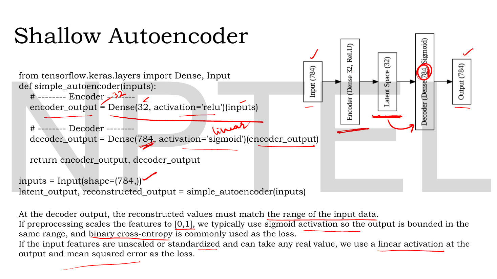
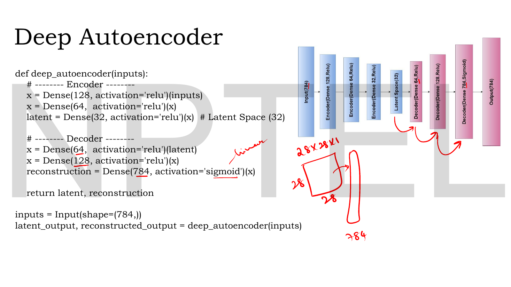
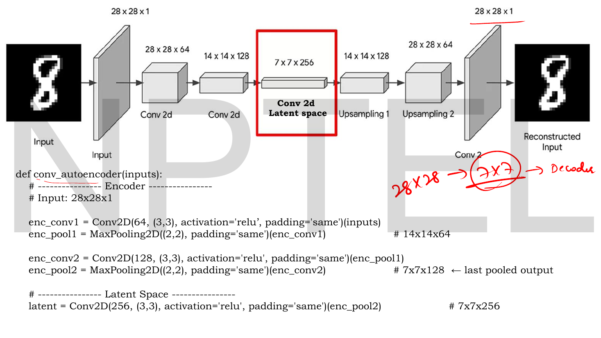
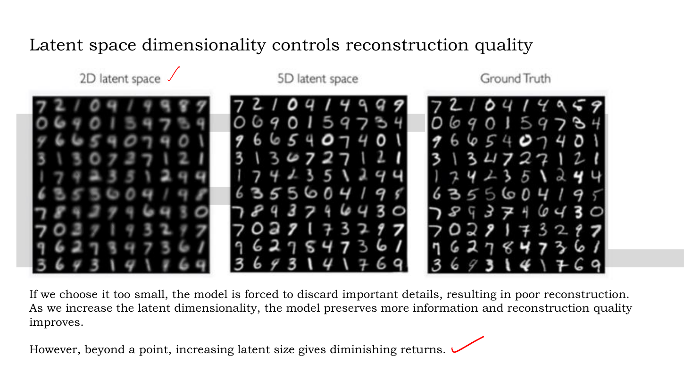

# Lec 12 — Types of Autoencoders

> **Source:** `Lec 12.pdf` (16 pages) · **Week 2** · **Playlist:** Lec 12
> **Prereqs:** [Lec 05 — Convolutional Neural Network, Part A](05-cnn-a.md), [Lec 10 — Introduction to Autoencoders](10-autoencoder-intro.md), [Lec 11 — Reconstruction Loss (MSE, BCE)](11-reconstruction-loss.md)
> **Feeds into:** [Lec 13 — Denoising Autoencoders](13-denoising-ae.md), [Lec 16 — Numerical Example, Limitations of AE](16-ae-numerical-and-limits.md), [Lec 49 — U-Net for Denoising](49-unet.md), [Lec 52 — Stable Diffusion](52-stable-diffusion.md)

## Why this lecture exists

Lec 10 gave you one autoencoder: an input, a narrow middle, an output. Lec 11 gave you the number it minimises. Neither said how many layers to use, or what to do when the input is an image rather than a row of a spreadsheet — and the answer to the second question is not "flatten it", because flattening throws away the fact that neighbouring pixels are neighbours.

This lecture is the deck's own "architecture and code-level understanding" session. It builds three concrete autoencoders — **shallow**, **deep** and **convolutional** — in Keras, with the layer sizes written out, and it spends over a third of its pages on the one operation none of the earlier lectures covered: how a decoder makes an image *bigger*. Convolution and pooling only shrink. Getting from a $7\times7$ feature map back to $28\times28$ needs upsampling or transposed convolution, and the choice between them has a visible consequence — the checkerboard artifact. That machinery reappears in the U-Net ([Lec 49](49-unet.md)) and in Stable Diffusion's decoder ([Lec 52](52-stable-diffusion.md)), so it is worth the pages.

## The ideas

### The taxonomy this deck actually teaches

The session overview names three, and only three, architectures: **CNN autoencoder**, **shallow autoencoder**, **deep autoencoder**, under the heading *"Types of Autoencoders: Architecture and Code-Level Understanding"*. This is an **architectural** taxonomy — it classifies autoencoders by what their layers are made of and how many there are. It is not a taxonomy by *training objective*; denoising, sparse and contractive autoencoders all appear in the deck only as a next-session preview, and each gets a full chapter of its own ([Lec 13](13-denoising-ae.md), [Lec 14](14-sparse-ae.md), [Lec 15](15-contractive-ae.md)).

Keep the two axes apart, because an MCQ will cross them:

| Axis | Values | Owner |
|---|---|---|
| **Architecture** (what the layers are) | shallow · deep · convolutional | **this chapter** |
| **Code dimension** (how wide the waist is) | undercomplete · overcomplete | [Lec 10](10-autoencoder-intro.md) |
| **Regularisation** (what is added to the loss or the input) | denoising · sparse · contractive | Lec 13 / 14 / 15 |

They are independent. A deep convolutional denoising autoencoder is a perfectly ordinary object; "deep" and "denoising" are answers to different questions.

The deck teaches the three architectures in the order CNN → shallow → deep, but builds the two dense ones from simplest upward. This chapter follows the pedagogically sensible order — shallow, deep, then convolutional with its upsampling machinery — and tells you where each slide sits.

### Shallow autoencoder


*Fig. — Count the columns in the diagram: exactly three. The **Encoder** and **Decoder** brackets at the bottom each span **one** weight matrix, which is the entire definition of "shallow". The condition $m < n$ is written into the architecture line, so the deck's shallow autoencoder is undercomplete by construction. Page 10.*

A **shallow autoencoder** is the simplest form, characterised by **only one hidden layer** between the input and the output. The deck's architecture line:

$$\underbrace{\mathbf{x} \in \mathbb{R}^n}_{\text{input layer}} \;\longrightarrow\; \underbrace{\mathbf{h} \in \mathbb{R}^m,\ m < n}_{\text{hidden layer (latent)}} \;\longrightarrow\; \underbrace{\hat{\mathbf{x}} \in \mathbb{R}^n}_{\text{output layer}}$$

and its own gloss: *only ONE hidden layer → hence "shallow"*.

> **The deck writes the code $z$ here**, not $h$ as in Lec 10 and Lec 11. Same object. This book writes $\mathbf{h}$ for the autoencoder code throughout and reserves $\mathbf{z}$ for the VAE's latent *random variable* from [Lec 21](21-vae-encoder.md) onward. If an exam question says $z \in \mathbb{R}^m$ with $m<n$, it means the code.

Counting layers is a reliable source of exam confusion, so fix the convention: the hidden layer is counted, the input layer is not. A shallow autoencoder has **one** hidden layer, **two** weight matrices (one in, one out), and **three** layers of units including input and output. "Shallow" counts hidden layers.


*Fig. — Nine lines of Keras for the whole model. The two numbers that matter are **784** (the flattened $28\times28$ image) and **32** (the code). Red handwriting circles `Dense(784, Sigmoid)` and writes "linear" beside it — the lecturer marking the alternative for unscaled data. Page 11.*

```keras
from tensorflow.keras.layers import Dense, Input

def simple_autoencoder(inputs):
    # -------- Encoder --------
    encoder_output = Dense(32, activation='relu')(inputs)

    # -------- Decoder --------
    decoder_output = Dense(784, activation='sigmoid')(encoder_output)

    return encoder_output, decoder_output

inputs = Input(shape=(784,))
latent_output, reconstructed_output = simple_autoencoder(inputs)
```

Four things to read off this.

**784 is $28\times28$ flattened.** The input is an MNIST-shaped image collapsed into a vector. The flattening is the whole weakness of the dense approach and the reason the convolutional autoencoder exists.

**Encoder activation ReLU, decoder activation sigmoid.** The encoder's activation is a free choice. The decoder's is not, and the slide gives the rule in full:

> *At the decoder output, the reconstructed values must match the range of the input data. If preprocessing scales the features to $[0,1]$, we typically use sigmoid activation so the output is bounded in the same range, and **binary cross-entropy** is commonly used as the loss. If the input features are unscaled or standardized and can take any real value, we use a **linear activation** at the output and **mean squared error** as the loss.*

That is [Lec 11](11-reconstruction-loss.md)'s data type → decoder activation → loss chain restated at the level of a Keras argument. Nothing new; note only that this deck says $[0,1]$-scaled pixels (not strictly binary ones) pair with sigmoid and BCE, which is the practical generalisation Lec 11 flags.

**$32 < 784$, so this is undercomplete** — a $24.5\times$ compression.

**There is no `Dense` layer with 784 units in the encoder.** The `Input(shape=(784,))` is not a layer; the first and only encoder layer is `Dense(32)`. Parameter counts (N5) follow from exactly two weight matrices.

### Deep autoencoder


*Fig. — The diagram's red box marks the **Bottleneck** explicitly, and the neuron columns narrow 5 → 4 → 2 → 4 → 5. Compare with page 10: the only structural change is that the encoder and decoder brackets now span more than one matrix each. Page 12.*

A **deep autoencoder** is an *extension* of the shallow autoencoder, characterised by:

- **Multiple hidden layers** between the input and the output.
- **Ability to learn hierarchical and abstract representations of data.**

$$\mathbf{x} \in \mathbb{R}^n \;\to\; \mathbf{h}_1 \;\to\; \mathbf{h}_2 \;\to\; \cdots \;\to\; \mathbf{h} \in \mathbb{R}^m\ (m<n) \;\to\; \hat{\mathbf{x}} \in \mathbb{R}^n$$

with the three roles named on the slide: the **encoder** progressively compresses the input, the **latent space** captures high-level features, and the **decoder** progressively reconstructs the input. "Progressively" is the operative word and it is the same word Lec 10 used for the $100\to75\to25$ chain.


*Fig. — The mirror is exact: 784-128-64-32 going down, 32-64-128-784 coming back. The handwritten "28×28×1 → 784" at the bottom is the lecturer reminding you where the input width comes from, and "linear" is again pencilled beside the sigmoid as the real-valued alternative. Page 13.*

```keras
def deep_autoencoder(inputs):
    # -------- Encoder --------
    x      = Dense(128, activation='relu')(inputs)
    x      = Dense(64,  activation='relu')(x)
    latent = Dense(32,  activation='relu')(x)      # Latent Space (32)

    # -------- Decoder --------
    x              = Dense(64,  activation='relu')(latent)
    x              = Dense(128, activation='relu')(x)
    reconstruction = Dense(784, activation='sigmoid')(x)

    return latent, reconstruction

inputs = Input(shape=(784,))
latent_output, reconstructed_output = deep_autoencoder(inputs)
```

**Shallow and deep end at the same place.** Both compress 784 to 32. The difference is the *path*: the shallow model jumps $784 \to 32$ in one matrix multiply; the deep model takes three steps, $784 \to 128 \to 64 \to 32$. The same final compression ratio, four times the parameters (N5), and a qualitatively different code.

Why the extra layers help is worth stating, because the slide only asserts "hierarchical and abstract representations". A single `Dense` layer followed by one activation can only express a particular limited family of functions of the input; stacking layers composes nonlinearities, so the model can describe curved structure that one layer cannot. In an image, layer 1 can respond to strokes, layer 2 to combinations of strokes, layer 3 to digit-like wholes — a *hierarchy*. The cost is the usual one: more parameters, slower training, and more opportunity to overfit.

| | Shallow | Deep |
|---|---|---|
| Hidden layers | exactly **one** | **more than one** |
| Weight matrices | 2 | $2L$ for $L$ encoder layers |
| Deck's instance | $784 \to 32 \to 784$ | $784\text{-}128\text{-}64\text{-}32\text{-}64\text{-}128\text{-}784$ |
| Parameters (N5) | 50,992 | 222,384 |
| Representations | one linear map plus one activation | **hierarchical, abstract** |
| Compression | $24.5\times$ | $24.5\times$ — identical |

### Convolutional autoencoder


*Fig. — The red box marks the latent space as the output of the **final convolutional layer**, not a flattened vector. Follow the spatial dimensions down the chain, $28 \to 14 \to 7$, while the channel count climbs $1 \to 64 \to 128 \to 256$: a convolutional encoder trades space for depth. Whether that is actually compression is N6, and the answer may surprise you. Page 3.*

A **convolutional autoencoder** is designed for **image data** and uses:

- **Encoder:** convolutional layers and pooling, to reduce the spatial dimension while extracting features.
- **Latent space representation:** the **output of the final convolutional layer in the encoder**, serving as the compressed representation of the input image, representing its most important features.
- **Decoder:** **transposed convolutions** (often called deconvolution) to upsample the data back to its original dimension.

The structural departure from the dense models is that the latent code is a **feature map**, $7\times7\times256$, not a vector. It keeps spatial layout: position $(3,4)$ of the code still corresponds to a region of the image. That is what the dense models destroy when they flatten, and it is the entire argument of the comparison slide below.


*Fig. — The shape comments in the right margin are the lecturer's own and they are **correct** — check them against N4. Note that every `Conv2D` uses `padding='same'`, so convolution never changes the spatial size: **only the pooling layers shrink the image**. The handwriting compresses the whole encoder to "28×28 → 7×7 → Decoder". Page 4.*

```keras
def conv_autoencoder(inputs):
    # ---------------- Encoder ----------------
    # Input: 28x28x1
    enc_conv1 = Conv2D(64, (3,3), activation='relu', padding='same')(inputs)
    enc_pool1 = MaxPooling2D((2,2), padding='same')(enc_conv1)      # 14x14x64

    enc_conv2 = Conv2D(128, (3,3), activation='relu', padding='same')(enc_pool1)
    enc_pool2 = MaxPooling2D((2,2), padding='same')(enc_conv2)      # 7x7x128  <- last pooled output

    # ---------------- Latent Space ----------------
    latent = Conv2D(256, (3,3), activation='relu', padding='same')(enc_pool2)   # 7x7x256
```

Two layer types are doing the shrinking work, and only one of them is:

- `Conv2D(F, (3,3), padding='same')` — with $K=3$, $S=1$, `'same'` padding, [Lec 05](05-cnn-a.md)'s output-size formula gives $O = I$. The spatial size is **unchanged**; only the channel count becomes $F$.
- `MaxPooling2D((2,2))` — halves each spatial dimension, $O = \lceil I/2\rceil$. Channels unchanged.

So the chain $28 \to 14 \to 7$ is entirely the two pooling layers, and $1 \to 64 \to 128 \to 256$ is entirely the convolutions. Being able to attribute each change to the right layer is the examinable skill here.

### Making an image bigger: upsampling

![Upsampling slide: a blurry cat enlarged by upsampling on the left, with the 28→14→7 chain and the note that the decoder must reconstruct back to 28×28; on the right, nearest-neighbour upsampling of [[1,2],[3,4]] into a 4×4 block-replicated matrix, and bed-of-nails upsampling into a 4×4 zero-inserted matrix](../assets/pages/lec12/p-05.png)
*Fig. — The two schemes side by side on identical input. Nearest neighbour **copies** each value into its $2\times2$ block; bed of nails **writes it once and zeros the other three**. Both obey output size = input size $\times\,S$, and the red line is the one to remember: **no learnable parameters**. Page 5.*

The decoder's problem, stated on the slide: after the last convolutional layer the feature map is smaller than the input, $28\times28 \to 14\times14 \to 7\times7$, but the decoder must reconstruct back to $28\times28$. So you need a way to **increase spatial resolution**. That is upsampling.

$$\boxed{\text{Output size} = \text{Input size} \times S}$$

where $S$ is the **upsampling factor**. For $S=2$, $7\times7 \to 14\times14$. The deck gives two schemes, both on $\mathbf{X} = \begin{bmatrix}1&2\\3&4\end{bmatrix}$ with $S=2$:

**Nearest-neighbour upsampling.** Each element is *copied* into an $S\times S$ block.

$$\begin{bmatrix}1&2\\3&4\end{bmatrix} \Longrightarrow \begin{bmatrix}1&1&2&2\\1&1&2&2\\3&3&4&4\\3&3&4&4\end{bmatrix}$$

**Bed-of-nails upsampling (zero insertion).** Each element is written once into its $S\times S$ block and the remaining $S^2-1$ positions are filled with zeros.

$$\begin{bmatrix}1&2\\3&4\end{bmatrix} \Longrightarrow \begin{bmatrix}1&0&2&0\\0&0&0&0\\3&0&4&0\\0&0&0&0\end{bmatrix}$$

Both have **no learnable parameters** — they are fixed rearrangements, like pooling in reverse. Nearest neighbour preserves total "mass" per block by duplication and produces blocky but continuous output; bed of nails produces a sparse grid that a following convolution is expected to fill in. Keras's `UpSampling2D` implements nearest neighbour by default, which is what the deck's decoder code uses.

### Making an image bigger: transposed convolution

![Transposed convolution slide: input [[1,2],[0,1]] and kernel [[4,3],[2,1]], the output-size formula giving 3×3, the four scaled-kernel grids G1 to G4, their sum giving [[4,11,6],[2,9,5],[0,2,1]], and eight small images showing checkerboard artifacts](../assets/pages/lec12/p-06.png)
*Fig. — The method in one picture: each input value scales the whole kernel, the scaled kernels are pasted at shifted positions, and the overlaps are **added**. Study where the 11 and the 9 come from — those are the cells written by two and three kernels respectively. The uneven overlap is exactly what the eight example images at top right are suffering from. Page 6.*

Unlike upsampling, a **transposed convolution** has learnable weights. The deck writes it as $\text{Transpose Conv} = \text{input} * \text{kernel}$ and gives the output size for stride 1 with no padding:

$$\text{Output size} = (I + K - 1) \times (I + K - 1)$$

For the deck's $I=2$, $K=2$: $(2+2-1) \times (2+2-1) = 3\times3$.

The mechanism: **for each input cell, multiply the entire kernel by that cell's value and paste the result into the output at an offset matching the cell's position; add wherever pastes overlap.** With input $\begin{bmatrix}1&2\\0&1\end{bmatrix}$ and kernel $\mathbf{K} = \begin{bmatrix}4&3\\2&1\end{bmatrix}$ the four pastes are

$$G_1 = 1\cdot\mathbf{K} = \begin{bmatrix}4&3&0\\2&1&0\\0&0&0\end{bmatrix},\quad
G_2 = 2\cdot\mathbf{K} = \begin{bmatrix}0&8&6\\0&4&2\\0&0&0\end{bmatrix},$$
$$G_3 = 0\cdot\mathbf{K} = \begin{bmatrix}0&0&0\\0&0&0\\0&0&0\end{bmatrix},\quad
G_4 = 1\cdot\mathbf{K} = \begin{bmatrix}0&0&0\\0&4&3\\0&2&1\end{bmatrix}$$

and the transposed convolution is their sum, $G_1+G_2+G_3+G_4$ — worked out fully in N2.

**The checkerboard problem.** The deck's warning, which is examinable almost verbatim: transposed convolutions suffer from **checkerboard artifacts** — *unwanted grid-like patterns that appear in images generated using transposed convolutions (deconvolutions)*. They look like **alternating bright/dark pixels, regular square patterns, uneven texture especially in flat regions**. And the line that matters most: *this is **not noise** — it is a **systematic artifact caused by the operation itself***.

The cause is visible in the $G_i$ above and is made numerically explicit in the Code section: output cells receive a *different number* of kernel contributions. Corner cells get one, edge cells two, interior cells four. Even with a perfectly uniform input, the output is modulated by that 1/2/4 pattern — a grid.

### The fix: upsampling followed by convolution

![Upsampling + Convolution slide: the input [[1,2],[0,1]] nearest-neighbour upsampled to a 4×4, then six explicit 2×2 dot products with the kernel [[4,3],[2,1]] giving 10, 14, 20, 7, 11, 17, and the resulting 3×3 convolution output](../assets/pages/lec12/p-07.png)
*Fig. — Two separate steps with a labelled brace over each: **Upsampling** produces the $4\times4$, then **Convolution** slides the kernel over it. The slide shows six of the nine dot products; N3 completes the bottom row. The closing sentence is the whole point: upsampling spreads values uniformly, so the kernel then applies **evenly**. Page 7.*

Split the one operation into two. **First** upsample with a parameter-free scheme (nearest neighbour), **then** apply an ordinary convolution with learnable weights. You still get a bigger output and you still get learnable parameters, but every output cell is now produced by the same number of kernel taps.

The deck's own words: *upsampling first spreads values uniformly, and the subsequent convolution applies the kernel evenly — avoiding the uneven overlap that causes checkerboard artifacts.*

Worked in N3, the result is

$$\text{Conv} = \begin{bmatrix}10&14&20\\7&11&17\\0&4&10\end{bmatrix}$$

and the overlap counts are a uniform grid of 4s rather than the 1/2/4 pattern of the transposed convolution. That uniformity *is* the fix.

| | Upsampling | Transposed convolution | Upsample + Conv |
|---|---|---|---|
| **Learnable parameters** | **none** | yes, the kernel | yes, the kernel |
| **Output size ($S=2$, $K=2$)** | $I \times S$ | $I + K - 1$ | $(I\times S) - K + 1$ |
| **Overlap per output cell** | n/a | **uneven** (1/2/4) | **uniform** |
| **Checkerboard artifacts** | no | **yes** | no |
| **Keras** | `UpSampling2D` | `Conv2DTranspose` | `UpSampling2D` + `Conv2D` |

### The decoder, and the whole model

![Convolutional autoencoder decoder code: UpSampling2D then Conv2D(128), UpSampling2D then Conv2D(64), and a final Conv2D(1, sigmoid) reconstruction, with the shape comments 7×7×256 → 14×14×256 and 14×14×128 → 28×28×128, and the note that sigmoid keeps pixels in [0,1]](../assets/pages/lec12/p-08.png)
*Fig. — The decoder's actual implementation is `UpSampling2D` + `Conv2D`, i.e. page 7's fix, **not** the transposed convolution that page 3's prose promised. The final layer is `Conv2D(1, (3,3), activation='sigmoid')` — one filter, because the input had one channel — and the note on the right is Lec 11's rule once more. Page 8.*

```keras
    # ---------------- Decoder ----------------
    dec_up1   = UpSampling2D((2,2))(latent)                                  # 7x7x256 -> 14x14x256
    dec_conv1 = Conv2D(128, (3,3), activation='relu', padding='same')(dec_up1)

    dec_up2   = UpSampling2D((2,2))(dec_conv1)                               # 14x14x128 -> 28x28x128
    dec_conv2 = Conv2D(64, (3,3), activation='relu', padding='same')(dec_up2)

    reconstruction = Conv2D(1, (3,3), activation='sigmoid', padding='same')(dec_conv2)
    return bottleneck, reconstruction

# -------- Input --------
inputs = Input(shape=(28, 28, 1), name='input_image')
# -------- Outputs --------
latent_output, reconstructed_output = conv_autoencoder(inputs)
```

> **Slide error.** The function defines its code as `latent` (page 4) but returns `bottleneck` (page 8), a name that is never assigned. As printed, this code raises `NameError: name 'bottleneck' is not defined`. The fix is `return latent, reconstruction`. Exams do not test typos, but you should not copy it.
>
> **Slide inconsistency.** Page 3's prose says the decoder "uses transposed convolutions (often called deconvolution)". Page 8's code uses `UpSampling2D` followed by `Conv2D` — which is page 7's *alternative* to transposed convolution, chosen precisely to avoid checkerboarding. The code is the better engineering; the prose is the more common textbook description. If asked "what does the decoder of a convolutional autoencoder use", the deck's stated answer is **transposed convolution**; if asked what *this deck's code* uses, it is **upsampling + convolution**.

The final `sigmoid` gets its own justification on the slide: *sigmoid is used at the output layer of an autoencoder to ensure that reconstructed pixel values lie in the valid intensity range $[0,1]$, matching the normalized input image.* Same rule as the dense models, same rule as [Lec 11](11-reconstruction-loss.md).

### How wide should the code be?


*Fig. — Compare the three panels on the same digits. The 2D reconstructions are blurred and several digits have changed identity; the 5D panel is close to the ground truth. The text's last line is the one to carry away: beyond a point, more latent dimensions give **diminishing returns**. Page 9.*

The deck's three claims, in order:

1. If the latent dimension is **too small**, the model is *forced to discard important details, resulting in poor reconstruction*. This is [Lec 10](10-autoencoder-intro.md)'s capacity floor made visual.
2. As the latent dimensionality **increases**, the model *preserves more information and reconstruction quality improves*.
3. **Beyond a point**, increasing latent size gives **diminishing returns**.

The third claim is the design rule. There is a knee in the curve, roughly where the code's dimension reaches the data's intrinsic dimension; past that, extra units buy progressively less because there is less structure left to encode. Push far enough and you cross into the overcomplete regime, where reconstruction becomes perfect and meaningless — the lesson of [Lec 10](10-autoencoder-intro.md)'s Case 2. Latent width is therefore a genuine hyperparameter with an interior optimum, not a quantity to maximise.

### Dense vs convolutional, on the same images


*Fig. — Three rows per block: original, latent code, reconstruction. In the DNN block the red boxes mark boots and a sandal that have lost their shape entirely, and the circled region is a shirt whose collar has dissolved. In the CNN block the same items keep their outlines, and — look at the middle rows — the CNN's latent maps are visibly **image-shaped** while the DNN's look like static. That difference is the whole slide. Page 14.*

The deck's verdict, side by side:

| | **DNN autoencoder** | **CNN autoencoder** |
|---|---|---|
| Input handling | **flattens the image** ($28\times28 \to 784$) | keeps the $28\times28\times1$ grid |
| Operation | fully connected `Dense` layers | **convolutions** |
| Spatial structure | **fails to preserve spatial relationships** like edges, contours and shapes | **preserves local spatial structure** |
| What it learns | arbitrary pixel-index combinations | **edges, textures, and shapes** |
| Latent code | a vector | a feature map |
| Decoding | `Dense` back to 784 | **reconstructs using learned feature maps** |

The reason behind the headline row is worth one paragraph, because the slide asserts it without explanation. Flattening assigns pixel $(r,c)$ to index $28r + c$. After that, index 100 and index 128 are just two numbers to a `Dense` layer — it has no way of knowing they were vertical neighbours in the image. Every spatial relationship must be re-learned from data, separately for every pair of positions. A convolution is handed that information for free: its kernel only ever looks at a local window, and the same kernel slides everywhere, so "edge" means the same thing in the top-left as in the bottom-right. Fewer parameters, and the right inductive bias.

### What this lecture does not cover

The deck's closing slide previews the **regularisation techniques** — **denoising**, **sparse** and **contractive** autoencoders. Each modifies the training objective rather than the architecture, each is a full chapter, and none is taught here: see [Lec 13](13-denoising-ae.md) for the corrupt-the-input regulariser, [Lec 14](14-sparse-ae.md) for the penalty on latent activations, and [Lec 15](15-contractive-ae.md) for the Jacobian penalty.

## Worked numericals

The slides contain **four** worked computations — two upsampling schemes (page 5), a transposed convolution (page 6), an upsample-plus-convolution (page 7) — plus a shape chain annotated in the margins of pages 4 and 8. All are reproduced and independently verified below; **every one of the deck's answers is correct**. N5 and N6 are new.

### N1. Both upsampling schemes on the deck's matrix

**Given:** $\mathbf{X} = \begin{bmatrix}1&2\\3&4\end{bmatrix}$, upsampling factor $S=2$.
**Find:** the nearest-neighbour and bed-of-nails outputs, and the output size.

1. Output size $=$ input size $\times S = 2\times2 = 4$, so both results are $4\times4$. ✓ matches the slide.
2. **Nearest neighbour** — each element is copied into its whole $2\times2$ block. Element 1 occupies rows 0–1, columns 0–1; element 2 rows 0–1, columns 2–3; element 3 rows 2–3, columns 0–1; element 4 rows 2–3, columns 2–3:
$$\begin{bmatrix}1&1&2&2\\1&1&2&2\\3&3&4&4\\3&3&4&4\end{bmatrix}$$
3. **Bed of nails** — each element goes to the top-left corner of its block and the other $S^2-1 = 3$ cells get zero:
$$\begin{bmatrix}1&0&2&0\\0&0&0&0\\3&0&4&0\\0&0&0&0\end{bmatrix}$$
4. Sanity: nearest neighbour has $16$ non-zeros; bed of nails has $4$, i.e. $1/S^2 = 1/4$ of the cells.

**Answer:** both as printed on page 5 — **the slide is correct**. Note that nearest neighbour multiplies the sum of entries by $S^2$ (from $10$ to $40$) while bed of nails preserves it exactly (still $10$). That is the practical difference: bed of nails is energy-preserving and sparse, nearest neighbour is smooth and energy-amplifying.

### N2. The deck's transposed convolution

**Given:** input $\begin{bmatrix}1&2\\0&1\end{bmatrix}$, kernel $\begin{bmatrix}4&3\\2&1\end{bmatrix}$, stride 1, no padding.
**Find:** the output size and the full output.

1. Output size $= (I+K-1)\times(I+K-1) = (2+2-1)\times(2+2-1) = 3\times3$. ✓
2. Paste each scaled kernel at the offset of its input cell. Input cell $(0,0)=1$ → kernel $\times1$ at rows 0–1, cols 0–1:
$$G_1 = \begin{bmatrix}4&3&0\\2&1&0\\0&0&0\end{bmatrix}$$
3. Cell $(0,1)=2$ → kernel $\times2 = \begin{bmatrix}8&6\\4&2\end{bmatrix}$ at rows 0–1, cols 1–2:
$$G_2 = \begin{bmatrix}0&8&6\\0&4&2\\0&0&0\end{bmatrix}$$
4. Cell $(1,0)=0$ → all zeros: $G_3 = \mathbf{0}_{3\times3}$.
5. Cell $(1,1)=1$ → kernel $\times1$ at rows 1–2, cols 1–2:
$$G_4 = \begin{bmatrix}0&0&0\\0&4&3\\0&2&1\end{bmatrix}$$
6. Add, entry by entry.
 - Row 0: $4+0+0+0 = 4$; $\ 3+8+0+0 = 11$; $\ 0+6+0+0 = 6$.
 - Row 1: $2+0+0+0 = 2$; $\ 1+4+0+4 = 9$; $\ 0+2+0+3 = 5$.
 - Row 2: $0+0+0+0 = 0$; $\ 0+0+0+2 = 2$; $\ 0+0+0+1 = 1$.

**Answer:**
$$\text{Trans Conv} = \begin{bmatrix}4&11&6\\2&9&5\\0&2&1\end{bmatrix}$$
**Matches the slide exactly.** Count the contributions behind each cell: the corner $4$ came from one kernel, the $11$ from two, the $9$ from three (only three because $G_3$ was zeroed by a zero input — with a non-zero input it would be four). That unevenness is the checkerboard mechanism, quantified in the Code section.

### N3. The deck's upsample-plus-convolution, completed

**Given:** the same input $\begin{bmatrix}1&2\\0&1\end{bmatrix}$ and kernel $\begin{bmatrix}4&3\\2&1\end{bmatrix}$. Nearest-neighbour upsample with $S=2$, then convolve with stride 1 and no padding.
**Find:** the full $3\times3$ output. The slide prints the matrix but shows the arithmetic for only six of the nine cells.

1. Upsample: $\begin{bmatrix}1&2\\0&1\end{bmatrix} \Rightarrow \mathbf{U} = \begin{bmatrix}1&1&2&2\\1&1&2&2\\0&0&1&1\\0&0&1&1\end{bmatrix}$ ✓ matches the slide.
2. Output size: $4 - 2 + 1 = 3$, so $3\times3$.
3. Slide the $2\times2$ kernel $\begin{bmatrix}4&3\\2&1\end{bmatrix}$ over $\mathbf{U}$ and take the element-wise sum of products at each of the nine positions.

| Position | Window of $\mathbf{U}$ | Arithmetic | Value |
|---|---|---|---|
| (0,0) | $\begin{bmatrix}1&1\\1&1\end{bmatrix}$ | $1\!\cdot\!4+1\!\cdot\!3+1\!\cdot\!2+1\!\cdot\!1$ | $10$ |
| (0,1) | $\begin{bmatrix}1&2\\1&2\end{bmatrix}$ | $4+6+2+2$ | $14$ |
| (0,2) | $\begin{bmatrix}2&2\\2&2\end{bmatrix}$ | $8+6+4+2$ | $20$ |
| (1,0) | $\begin{bmatrix}1&1\\0&0\end{bmatrix}$ | $4+3+0+0$ | $7$ |
| (1,1) | $\begin{bmatrix}1&2\\0&1\end{bmatrix}$ | $4+6+0+1$ | $11$ |
| (1,2) | $\begin{bmatrix}2&2\\1&1\end{bmatrix}$ | $8+6+2+1$ | $17$ |
| (2,0) | $\begin{bmatrix}0&0\\0&0\end{bmatrix}$ | $0+0+0+0$ | $\mathbf{0}$ |
| (2,1) | $\begin{bmatrix}0&1\\0&1\end{bmatrix}$ | $0+3+0+1$ | $\mathbf{4}$ |
| (2,2) | $\begin{bmatrix}1&1\\1&1\end{bmatrix}$ | $4+3+2+1$ | $\mathbf{10}$ |

**Answer:**
$$\text{Conv} = \begin{bmatrix}10&14&20\\7&11&17\\0&4&10\end{bmatrix}$$
**Matches the slide exactly**, including the three cells (bold above) whose arithmetic the slide omits. Compare with N2's transposed convolution on the identical input and kernel: $\begin{bmatrix}4&11&6\\2&9&5\\0&2&1\end{bmatrix}$ versus $\begin{bmatrix}10&14&20\\7&11&17\\0&4&10\end{bmatrix}$. Same inputs, same kernel, same output size, **completely different numbers** — these are two different operations, not two implementations of one.

### N4. The convolutional autoencoder's shape chain

**Given:** the deck's code, pages 4 and 8. Input $28\times28\times1$. All `Conv2D` use $K=3$, $S=1$, `padding='same'`; all `MaxPooling2D` and `UpSampling2D` use a factor of 2.
**Find:** the output shape after every layer, and verify the slide's margin comments.

1. `Input` → $28\times28\times1$.
2. `Conv2D(64, same)`: [Lec 05](05-cnn-a.md)'s formula with same padding and $S=1$ gives $O=I=28$; channels become 64 → $28\times28\times64$.
3. `MaxPooling2D(2,2)`: $28/2 = 14$ → $14\times14\times64$. ✓ slide comment "# 14x14x64".
4. `Conv2D(128, same)`: spatial unchanged, channels 128 → $14\times14\times128$.
5. `MaxPooling2D(2,2)`: $14/2 = 7$ → $7\times7\times128$. ✓ slide comment "# 7x7x128".
6. `Conv2D(256, same)` (the latent): spatial unchanged, channels 256 → $\mathbf{7\times7\times256}$. ✓ slide comment "# 7x7x256".
7. `UpSampling2D(2,2)`: $7\times2 = 14$, channels unchanged → $14\times14\times256$. ✓ slide comment "7×7×256 → 14×14×256".
8. `Conv2D(128, same)`: → $14\times14\times128$.
9. `UpSampling2D(2,2)`: $14\times2=28$ → $28\times28\times128$. ✓ slide comment "14×14×128 → 28×28×128".
10. `Conv2D(64, same)`: → $28\times28\times64$.
11. `Conv2D(1, same, sigmoid)`: → $\mathbf{28\times28\times1}$ — matches the input shape, as the loss requires.

**Answer:** $28{\times}28{\times}1 \to 28{\times}28{\times}64 \to 14{\times}14{\times}64 \to 14{\times}14{\times}128 \to 7{\times}7{\times}128 \to \mathbf{7{\times}7{\times}256} \to 14{\times}14{\times}256 \to 14{\times}14{\times}128 \to 28{\times}28{\times}128 \to 28{\times}28{\times}64 \to 28{\times}28{\times}1$. **Every margin comment on the slides is correct.** The one place the diagram is loose is that it labels blocks "$28\times28\times64$" and "$14\times14\times128$" without drawing the pooling steps, so the intermediate $14\times14\times64$ is invisible in the picture but explicit in the code.

### N5. Parameter counts for all three architectures

**Given:** the three models as coded. `Dense` costs $(\text{in} \times \text{out}) + \text{out}$; `Conv2D` costs $(K \times K \times C_{\text{in}} \times F) + F$. `MaxPooling2D` and `UpSampling2D` cost **0**.
**Find:** the total learnable parameters of each.

1. **Shallow**, $784 \to 32 \to 784$:
 - $784\times32 + 32 = 25088 + 32 = 25{,}120$
 - $32\times784 + 784 = 25088 + 784 = 25{,}872$
 - Total $= 25120 + 25872 = \mathbf{50{,}992}$
2. **Deep**, $784\text{-}128\text{-}64\text{-}32\text{-}64\text{-}128\text{-}784$:
 - $784\times128+128 = 100352+128 = 100{,}480$
 - $128\times64+64 = 8192+64 = 8{,}256$
 - $64\times32+32 = 2048+32 = 2{,}080$
 - $32\times64+64 = 2048+64 = 2{,}112$
 - $64\times128+128 = 8192+128 = 8{,}320$
 - $128\times784+784 = 100352+784 = 101{,}136$
 - Total $= 100480+8256+2080+2112+8320+101136 = \mathbf{222{,}384}$
3. **Convolutional**, all kernels $3\times3$:
 - $3{\cdot}3{\cdot}1{\cdot}64+64 = 576+64 = 640$
 - $3{\cdot}3{\cdot}64{\cdot}128+128 = 73728+128 = 73{,}856$
 - $3{\cdot}3{\cdot}128{\cdot}256+256 = 294912+256 = 295{,}168$ (latent)
 - $3{\cdot}3{\cdot}256{\cdot}128+128 = 294912+128 = 295{,}040$
 - $3{\cdot}3{\cdot}128{\cdot}64+64 = 73728+64 = 73{,}792$
 - $3{\cdot}3{\cdot}64{\cdot}1+1 = 576+1 = 577$
 - Total $= 640+73856+295168+295040+73792+577 = \mathbf{739{,}073}$

**Answer:** shallow **50,992**; deep **222,384**; convolutional **739,073**. Two readings. The deep model costs $4.4\times$ the shallow one for the *same* $24.5\times$ compression — depth is not free. And the convolutional model is the largest here only because the deck piled on 256 channels; note that its first conv layer costs **640 parameters** while the shallow model's first dense layer costs **25,120** for the same input. Per layer, convolution is enormously cheaper; the total is large because of the channel counts chosen, not the operation.

### N6. Is the deck's "latent space" actually a bottleneck?

**Given:** the convolutional autoencoder's input $28\times28\times1$ and its latent feature map $7\times7\times256$.
**Find:** the number of values in each, their ratio, and the model's classification under [Lec 10](10-autoencoder-intro.md)'s rule.

1. Input values: $28 \times 28 \times 1 = 784$.
2. Latent values: $7 \times 7 \times 256$. Compute: $7\times7 = 49$, then $49 \times 256 = 12{,}544$.
3. Ratio: $12544 / 784 = 16$.
4. Lec 10's test: undercomplete requires $\dim(\mathbf{h}) < \dim(\mathbf{x})$. Here $12544 \geq 784$, so the condition for **overcomplete** holds.

**Answer:** the latent representation holds **12,544** numbers against the input's **784** — it is **16× larger than the input**, and the model is **overcomplete**, not undercomplete. The slide calls it "the compressed representation" and in the spatial dimension it is ($28\times28 \to 7\times7$ is a $16\times$ spatial reduction), but the channel count rose by $256\times$ over the same stretch, and $256/16 = 16$ is exactly the net expansion. Nothing is compressed.

This is not a trick question; it is a real property of the deck's code, and the honest reading is that the convolutional model as presented relies on the $3\times3$ receptive field and the ReLU nonlinearities to limit what gets through, not on a dimensional bottleneck. By [Lec 10](10-autoencoder-intro.md)'s Case 2 it could in principle learn a near-identity. To make it genuinely undercomplete you would reduce the latent channel count: $7\times7\times16 = 784$ is exactly break-even, so $7\times7\times8 = 392$ gives a true $2\times$ compression.

## Code

Both of the deck's decoder operations, implemented from the definition, reproducing the slide's numbers — and then the one diagnostic the deck describes in words but never shows: *why* transposed convolution checkerboards.

```python
import numpy as np
x = np.array([[1, 2], [0, 1]], float)      # the deck's input,  page 6
k = np.array([[4, 3], [2, 1]], float)      # the deck's kernel

def transposed_conv(a, ker):               # stride 1: paste a scaled kernel per input cell
    H, W = a.shape; kh, kw = ker.shape
    out = np.zeros((H + kh - 1, W + kw - 1))
    for i in range(H):
        for j in range(W):
            out[i:i+kh, j:j+kw] += a[i, j] * ker
    return out

def nn_upsample(a, s=2):                   # nearest neighbour: each cell -> s x s block
    return np.kron(a, np.ones((s, s)))

def conv_valid(a, ker):
    kh, kw = ker.shape
    H, W = a.shape[0] - kh + 1, a.shape[1] - kw + 1
    return np.array([[np.sum(a[i:i+kh, j:j+kw] * ker) for j in range(W)] for i in range(H)])

print("transposed conv  =\n", transposed_conv(x, k))
print("nn upsampled     =\n", nn_upsample(x, 2))
print("upsample + conv  =\n", conv_valid(nn_upsample(x, 2), k))

# how many kernel taps hit each output pixel -> the cause of the checkerboard
one_in, one_k = np.ones_like(x), np.ones_like(k)
print("\ncontributions per output pixel, transposed conv =\n", transposed_conv(one_in, one_k))
print("contributions per output pixel, upsample+conv  =\n", conv_valid(nn_upsample(one_in, 2), one_k))
```

```
transposed conv  =
 [[ 4. 11.  6.]
 [ 2.  9.  5.]
 [ 0.  2.  1.]]
nn upsampled     =
 [[1. 1. 2. 2.]
 [1. 1. 2. 2.]
 [0. 0. 1. 1.]
 [0. 0. 1. 1.]]
upsample + conv  =
 [[10. 14. 20.]
 [ 7. 11. 17.]
 [ 0.  4. 10.]]

contributions per output pixel, transposed conv =
 [[1. 2. 1.]
 [2. 4. 2.]
 [1. 2. 1.]]
contributions per output pixel, upsample+conv  =
 [[4. 4. 4.]
 [4. 4. 4.]
 [4. 4. 4.]]
```

The first three blocks reproduce pages 5, 6 and 7 exactly — the slides' arithmetic is right.

The last two blocks are the point. Feed an input of **all ones** through an all-ones kernel, so the output counts how many kernel taps wrote to each cell. The transposed convolution gives

$$\begin{bmatrix}1&2&1\\2&4&2\\1&2&1\end{bmatrix}$$

— a perfectly uniform input comes out **four times brighter in the middle than at the corners**. Tile that $1/2/4$ pattern across a $28\times28$ image and you have a grid of alternating bright and dark cells: the checkerboard, visible on page 6's example images, arising with no noise anywhere in the system. It is, exactly as the slide says, "a systematic artifact caused by the operation itself".

Upsampling followed by convolution gives a uniform grid of 4s. Every output cell is written by the same number of taps, so a flat input produces a flat output, and there is no grid to see. That is the whole fix, and it is why the deck's own decoder code uses it.

## Exam pack

### Must-memorise

| Item | Exactly this |
|---|---|
| Shallow autoencoder | **only one hidden layer** between input and output |
| Shallow architecture | $\mathbf{x}\in\mathbb{R}^n \to \mathbf{h}\in\mathbb{R}^m\,(m<n) \to \hat{\mathbf{x}}\in\mathbb{R}^n$ |
| Deep autoencoder | **multiple hidden layers**; learns **hierarchical and abstract** representations |
| Deep architecture | $\mathbf{x}\in\mathbb{R}^n \to \mathbf{h}_1 \to \mathbf{h}_2 \to \cdots \to \mathbf{h}\in\mathbb{R}^m \to \hat{\mathbf{x}}\in\mathbb{R}^n$ |
| Convolutional AE, encoder | convolutional layers **and pooling** to reduce spatial dimension |
| Convolutional AE, latent | the **output of the final convolutional layer** of the encoder |
| Convolutional AE, decoder | **transposed convolutions** (a.k.a. deconvolution) to upsample back to the original dimension |
| Upsampling output size | $\text{Output} = \text{Input} \times S$ |
| Upsampling parameters | **none — not learnable** |
| Nearest neighbour | each element **copied** into an $S\times S$ block |
| Bed of nails | each element written once, the other $S^2-1$ cells **zero** |
| Transposed conv output size | $(I + K - 1) \times (I + K - 1)$ (stride 1, no padding) |
| Transposed conv method | scale the kernel by each input cell, paste at that cell's offset, **sum the overlaps** |
| Checkerboard artifacts | grid-like patterns from transposed convolution; **systematic, not noise** |
| The fix | **upsampling + convolution** — spreads values uniformly, kernel applies evenly |
| Latent width rule | too small → poor reconstruction; larger → better; **beyond a point, diminishing returns** |
| DNN AE weakness | **flattens** the image, **fails to preserve spatial relationships** (edges, contours, shapes) |
| CNN AE strength | preserves local spatial structure; learns **edges, textures, shapes** |
| Output activation | sigmoid for $[0,1]$ data (BCE loss); linear for real-valued (MSE) — [Lec 11](11-reconstruction-loss.md) |

### Numbers worth knowing

| Quantity | Value |
|---|---|
| Deck's shallow model | $784 \to 32 \to 784$ |
| Deck's deep model | $784\text{-}128\text{-}64\text{-}32\text{-}64\text{-}128\text{-}784$ |
| Both models' compression | $784/32 = 24.5\times$ |
| Shallow parameters | 50,992 |
| Deep parameters | 222,384 |
| Conv AE parameters | 739,073 |
| Conv AE spatial chain | $28 \to 14 \to 7 \to 14 \to 28$ |
| Conv AE channel chain | $1 \to 64 \to 128 \to \mathbf{256} \to 128 \to 64 \to 1$ |
| Conv AE latent shape | $7\times7\times256 = 12{,}544$ values |
| Conv AE latent vs input | $12544 / 784 = \mathbf{16\times\ larger}$ — overcomplete |
| Deck's transposed conv | input $\begin{bmatrix}1&2\\0&1\end{bmatrix}$, kernel $\begin{bmatrix}4&3\\2&1\end{bmatrix}$ → $\begin{bmatrix}4&11&6\\2&9&5\\0&2&1\end{bmatrix}$ |
| Deck's upsample+conv | same inputs → $\begin{bmatrix}10&14&20\\7&11&17\\0&4&10\end{bmatrix}$ |
| Transposed-conv overlap counts | $1/2/4$ — uneven |
| Upsample+conv overlap counts | uniformly $4$ |
| Latent-quality comparison | 2D latent blurred; 5D latent near ground truth |

### Likely MCQ traps

- **Counting layers to decide shallow vs deep.** "Shallow" means **one hidden layer**. A $784\to32\to784$ model has three layers of *units* and two weight matrices, and is shallow. Do not count the input layer.
- **"Upsampling has learnable parameters."** It does not — neither nearest neighbour nor bed of nails. Only `Conv2DTranspose` and ordinary `Conv2D` have weights. The slide puts "No learnable parameters" in red for a reason.
- **Confusing the two output-size formulas.** Upsampling: $O = I \times S$. Transposed convolution (stride 1, no padding): $O = I + K - 1$. Ordinary convolution ([Lec 05](05-cnn-a.md)): $O = (I - K + 2P)/S + 1$. Three different rules; the question will tell you which operation.
- **Thinking checkerboard artifacts are noise or bad data.** They are a **systematic artifact caused by the operation itself** — uneven kernel overlap. More training, more data and a lower learning rate do not remove them; changing the operation does.
- **Assuming transposed convolution and upsample+convolution give the same numbers.** They are different operations. N2 and N3 run both on *identical* inputs and get $\begin{bmatrix}4&11&6\\2&9&5\\0&2&1\end{bmatrix}$ versus $\begin{bmatrix}10&14&20\\7&11&17\\0&4&10\end{bmatrix}$.
- **Attributing the spatial shrink to the convolutions.** With `padding='same'` and stride 1, `Conv2D` does **not** change spatial size — it changes the channel count. $28\to14\to7$ is entirely the two `MaxPooling2D` layers.
- **"More latent dimensions are always better."** The slide's own third claim is **diminishing returns**, and past $\dim(\mathbf{h}) = \dim(\mathbf{x})$ you are overcomplete and the model can learn the identity ([Lec 10](10-autoencoder-intro.md)).
- **Treating "deep" and "denoising" as alternatives on one list.** Shallow/deep/convolutional is an **architecture** taxonomy; denoising/sparse/contractive is a **regularisation** taxonomy. They combine freely.
- **Mixing up "the latent is a vector" with "the latent is a feature map".** The dense models produce a 32-vector; the convolutional model produces a $7\times7\times256$ feature map, which is the output of the final *convolutional* layer, not a flattened `Dense` output.
- **Reading page 3's prose as describing page 8's code.** The prose says the decoder uses transposed convolution; the code uses `UpSampling2D` + `Conv2D`. Both answers can be correct depending on which the question quotes.

### Self-test

1. How many hidden layers does a shallow autoencoder have, and how many weight matrices?
2. Nearest-neighbour upsample $\begin{bmatrix}5&0\\1&2\end{bmatrix}$ with $S=2$, then give the bed-of-nails result for the same input.
3. A transposed convolution has a $5\times5$ input and a $3\times3$ kernel, stride 1, no padding. What is the output size?
4. A $32\times32\times3$ image enters `Conv2D(16, (3,3), padding='same')` then `MaxPooling2D((2,2))`. Give both output shapes.
5. State the cause of checkerboard artifacts and the deck's recommended fix.
6. Compute the transposed convolution of $\begin{bmatrix}1&0\\2&1\end{bmatrix}$ with kernel $\begin{bmatrix}1&2\\3&4\end{bmatrix}$.
7. The deck's convolutional autoencoder has a $7\times7\times256$ latent from a $28\times28\times1$ input. Is it undercomplete? Show the numbers.
8. Why does flattening an image hurt a dense autoencoder, in one sentence?
9. How many learnable parameters are in `Conv2D(32, (5,5))` applied to a $64\times64\times8$ input?
10. A deep autoencoder is $784\text{-}128\text{-}64\text{-}32\text{-}64\text{-}128\text{-}784$ and a shallow one is $784\text{-}32\text{-}784$. Which compresses more?

<details><summary>Answers</summary>

1. **One** hidden layer; **two** weight matrices (input→hidden and hidden→output). Three layers of units in total, but "shallow" counts hidden layers.
2. Nearest neighbour: $\begin{bmatrix}5&5&0&0\\5&5&0&0\\1&1&2&2\\1&1&2&2\end{bmatrix}$. Bed of nails: $\begin{bmatrix}5&0&0&0\\0&0&0&0\\1&0&2&0\\0&0&0&0\end{bmatrix}$.
3. $O = I + K - 1 = 5 + 3 - 1 = \mathbf{7}$, so $7\times7$.
4. After `Conv2D(16, same)`: $\mathbf{32\times32\times16}$ — spatial size unchanged, channels become 16. After `MaxPooling2D((2,2))`: $\mathbf{16\times16\times16}$.
5. **Cause:** uneven kernel overlap — output cells receive different numbers of kernel contributions (1, 2 or 4 for a $2\times2$ kernel), so even a uniform input emerges modulated by a grid. It is systematic, not noise. **Fix:** replace the transposed convolution with **upsampling followed by an ordinary convolution**, which spreads values uniformly so the kernel applies evenly.
6. $G_1 = 1\!\cdot\!\begin{bmatrix}1&2\\3&4\end{bmatrix}$ at (0,0); $G_2 = 0$; $G_3 = 2\!\cdot\!\mathbf{K}$ at (1,0); $G_4 = 1\!\cdot\!\mathbf{K}$ at (1,1). Summing: row 0 $=[1,2,0]$; row 1 $= [3+2,\ 4+4+1,\ 0+2] = [5,9,2]$; row 2 $=[6,\ 8+3,\ 4] = [6,11,4]$. Result $\begin{bmatrix}1&2&0\\5&9&2\\6&11&4\end{bmatrix}$.
7. **No — it is overcomplete.** Latent $= 7\times7\times256 = 12{,}544$ values; input $= 28\times28\times1 = 784$. Since $12544 \geq 784$ it fails [Lec 10](10-autoencoder-intro.md)'s undercomplete test; the latent is $16\times$ *larger* than the input. The spatial dimension shrank $16\times$ but the channels grew $256\times$.
8. Flattening maps pixel $(r,c)$ to index $28r+c$, after which a `Dense` layer has no way to know which indices were spatial neighbours, so it cannot exploit — and therefore **fails to preserve** — edges, contours and shapes.
9. $(5\times5\times8\times32) + 32 = 6400 + 32 = \mathbf{6{,}432}$. The $64\times64$ spatial size does not enter the count at all — that is the weight-sharing property of convolution.
10. **Neither — they compress identically.** Both end at a 32-dimensional code from a 784-dimensional input, $24.5\times$. The deep model takes a longer route and uses $4.4\times$ the parameters (222,384 vs 50,992) to build a *hierarchical* code of the same width.

</details>

## Beyond the slides

**Gap: the deck calls $7\times7\times256$ a "compressed representation" when it holds 16× more numbers than the input.**
**Why it matters:** this is the one place where the lecture's own code contradicts [Lec 10](10-autoencoder-intro.md)'s central rule, and the contradiction is quantitative, not a matter of interpretation (N6). Real convolutional autoencoders either keep the channel growth modest, or end the encoder with a `Flatten` plus a small `Dense` layer to force a genuine vector bottleneck. If an exam asks you to classify the deck's convolutional model as undercomplete or overcomplete, count the values: $12{,}544$ against $784$.

**Gap: pooling is treated as the only way to downsample, and it is not the usual modern one.**
**Why it matters:** `Conv2D(..., strides=2)` halves the spatial size *and* learns how to do it, which is what nearly all modern encoders use — including the ones in [Lec 49](49-unet.md)'s U-Net and Stable Diffusion's encoder ([Lec 52](52-stable-diffusion.md)). Max pooling discards 75% of activations by a fixed rule and has no parameters. Knowing both routes means you can read any architecture diagram you meet later in the course.

**Gap: "transposed convolution" is never explained as a transpose of anything.**
**Why it matters:** the name looks arbitrary from the paste-and-sum recipe, and the deck's parenthetical "often called deconvolution" actively misleads, because the operation does **not** invert a convolution. Any convolution can be written as a matrix multiplication $\mathbf{y} = \mathbf{C}\mathbf{x}$ with a sparse $\mathbf{C}$; the transposed convolution is $\mathbf{C}^\top\mathbf{y}$. It recovers the *shape* of $\mathbf{x}$, never its values. That is also precisely why it is the natural backward pass of a convolution, and why framework authors implemented it in the first place. Knowing this kills the "deconvolution undoes convolution" MCQ instantly.

**Gap: nothing is said about how to choose between the three architectures.**
**Why it matters:** the operative rule is *does your data have spatial or sequential structure?* Images and audio spectrograms → convolutional. Tabular rows, where column order is arbitrary → dense, and shallow first because it is a strong baseline that trains in seconds. Go deep only when a shallow model underfits. The deck presents three architectures as a catalogue; the selection criterion is the examinable engineering judgement behind it.

**Gap: the comparison with the vision course.**
**Why it matters:** [`GenAIforCV` week-08 — Autoencoders to VAE](../../GenAIforCV/notes/week-08/29-autoencoders-to-vae.md) covers convolutional autoencoders but moves straight to the VAE without dwelling on upsampling mechanics. This deck is the one that works transposed convolution and upsample-plus-convolution **by hand, with numbers** — pages 5 to 7 are the most detailed treatment of decoder upsampling in any of the three courses, and exactly the sort of material this lecturer sets numerical questions on. Do not skip them on the grounds of having met convolutional autoencoders before.

## Cut from the slides

Pages 1, 15 and 16 are the course title, the next-session preview (denoising, sparse, contractive — one clause and a link each, per the ownership map) and the thank-you; page 2's session overview is reproduced as the opening taxonomy table rather than as a figure, so that all twelve figure slots go to content pages. The convolutional-autoencoder block diagram appears **three times** in this deck, on pages 3, 4 and 8, identical each time apart from the code printed beneath it; all three are embedded because each carries different code, but the diagram itself is only described once. Page 6's eight small photographs of checkerboard-damaged ships, birds and animals are reproduced inside the page image and discussed as a group rather than individually, since their content is the artifact and not the subjects. Page 14's Fashion-MNIST comparison contains sixty small images across six rows; the per-item differences are summarised in the comparison table and the two most striking failures — the boots and sandal in the DNN row that have lost their outlines, and the shirt the lecturer circled — are called out in the caption rather than enumerated. The lecturer's handwritten marks are carried into prose as emphasis: the circled `Dense(784, Sigmoid)` and the pencilled "linear" alternatives on pages 11 and 13, the "28×28 → 7×7 → Decoder" summary on page 4, the ticks beside the two result matrices on pages 6 and 7, and the "784" and "28×28×1" reminders on pages 13 and 14. The output-size formula for ordinary convolution is used but not re-derived — it belongs to [Lec 05](05-cnn-a.md). The choice of loss and output activation is stated where the deck states it and not developed, because it belongs to [Lec 11](11-reconstruction-loss.md). Everything substantive on pages 3 through 14 is reproduced above.
