# Lec 13 — Denoising Autoencoders

> **Source:** `Lec 13.pdf` (15 pages) · **Week 2** · **Playlist:** Lec 13
> **Prereqs:** [Lec 10 — Introduction to Autoencoders](10-autoencoder-intro.md), [Lec 11 — Reconstruction Loss (MSE, BCE)](11-reconstruction-loss.md), [Lec 12 — Types of Autoencoders](12-autoencoder-types.md)
> **Feeds into:** [Lec 14 — Sparse Autoencoders](14-sparse-ae.md), [Lec 15 — Contractive Autoencoders](15-contractive-ae.md), [Lec 16 — Numerical Example, Limitations of AE](16-ae-numerical-and-limits.md), [Lec 44 — Introduction to Diffusion Models](44-diffusion-intro.md)

## Why this lecture exists

Lec 10 and 12 gave the autoencoder a bottleneck and relied on it: make the code narrower than the input and the model *has* to compress. That argument collapses the moment the hidden layer is wide. An **overcomplete** autoencoder — more hidden units than input features — can route each input straight through to the output and score a perfect reconstruction loss while learning nothing at all. The deck calls this the **trivial identity mapping**, and it is overfitting in its purest form.

This lecture gives the first of three fixes. Rather than shrinking the model, you damage the data: feed the network a deliberately corrupted copy of the input and still demand the *clean* original at the output. Copying is now the wrong answer, so the network must use whatever structure survives the corruption — chiefly, what each pixel's neighbours say about it. The payoff is a code that is robust rather than memorised.

## The ideas

### The problem: an autoencoder that cheats

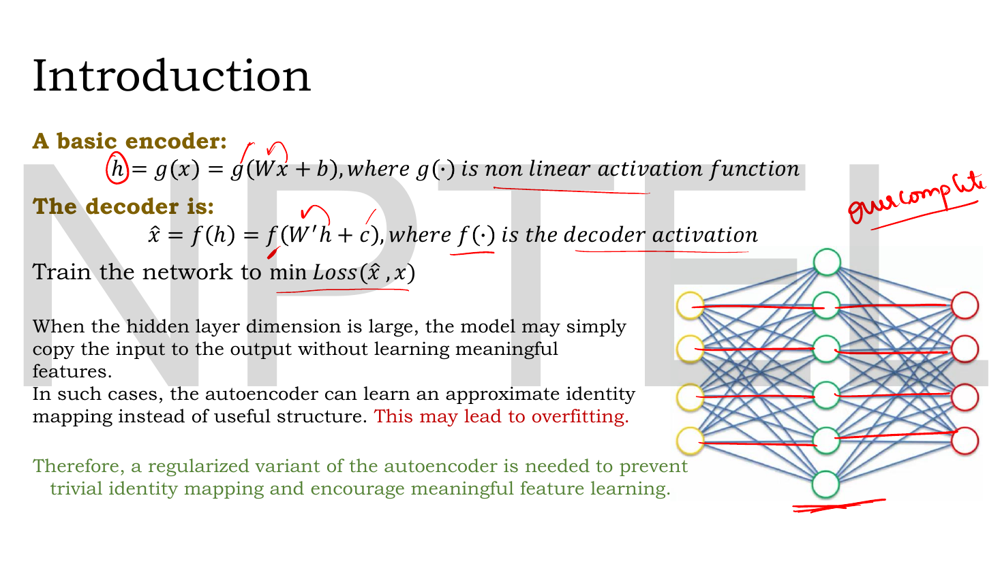
*Fig. — Look at the network on the right: the middle layer has **five** units for **four** inputs. The red lines the lecturer has drawn are the identity shortcut — every input copied straight to its matching output. That is the failure mode the whole lecture is built to prevent. Page 3.*

The deck restates the model you already have, in its per-sample form:

$$\mathbf{h} = g(\mathbf{W}_e\mathbf{x} + \mathbf{b}), \qquad \hat{\mathbf{x}} = f(\mathbf{W}_d\mathbf{h} + \mathbf{c})$$

with $g$ a non-linear encoder activation, $f$ the decoder activation, and training set to $\min \mathcal{L}(\hat{\mathbf{x}}, \mathbf{x})$. (The deck writes $W$ and $W'$ for the two weight matrices and $b$, $c$ for the biases; this book writes $\mathbf{W}_e$ and $\mathbf{W}_d$ throughout, as in [Lec 11](11-reconstruction-loss.md). Note that here the data vector sits on the *right* of the matrix, so $\mathbf{W}_e$ is $k\times n$ — the transpose of Lec 11's row-vector layout. Both conventions appear in this course; read the shapes off the equation, not from memory.)

The deck's diagnosis, in its own words: *"When the hidden layer dimension is large, the model may simply copy the input to the output without learning meaningful features. In such cases, the autoencoder can learn an approximate identity mapping instead of useful structure. This may lead to overfitting."* Hence the conclusion printed in green: a **regularized variant** is needed.

**Regularisation**, as used all week, means adding something to training that makes the easy-but-useless solution expensive. Lec 14 and Lec 15 add a term to the loss. Lec 13 does something different and more surprising: it leaves the loss alone and changes the *input*.

### The corruption process

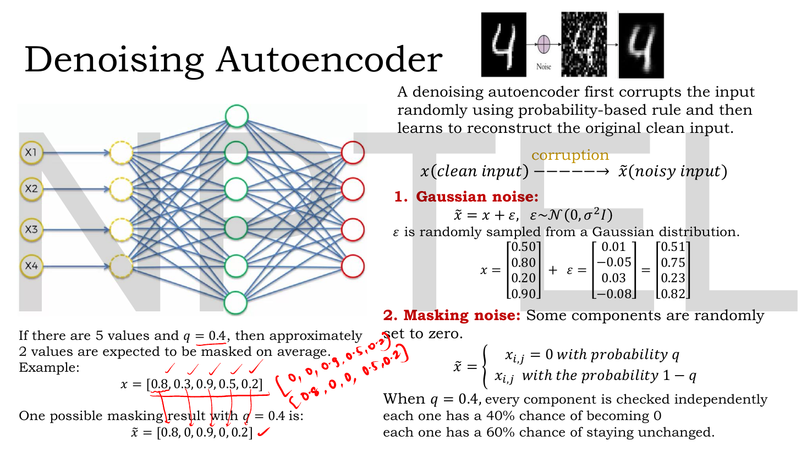
*Fig. — The densest slide in the lecture. Left: the dashed yellow units are the corrupted copies of $x_1\ldots x_4$ — corruption happens **before** the encoder, not inside it. Right: three things to memorise — the corruption arrow, the Gaussian rule, and the masking rule with its per-component independence. Page 4.*

The headline definition, verbatim: *"A denoising autoencoder first corrupts the input randomly using probability-based rule and then learns to reconstruct the original clean input."*

Write the corruption as a stochastic map from the clean vector $\mathbf{x}$ to a noisy vector $\tilde{\mathbf{x}}$:

$$\mathbf{x}\ \xrightarrow{\ \text{corruption}\ }\ \tilde{\mathbf{x}}$$

It is **random** (a fresh draw every time the sample is seen), it is **not learned** (no parameters), and it is applied **only at training time**. The deck gives three concrete rules.

**1. Gaussian noise.** Add a small random real number to every component:

$$\tilde{\mathbf{x}} = \mathbf{x} + \boldsymbol{\epsilon}, \qquad \boldsymbol{\epsilon} \sim \mathcal{N}(0, \sigma^2\mathbf{I})$$

The second argument is the **variance** $\sigma^2$, and $\mathbf{I}$ means every component gets independent noise of the same variance. The deck's example:

$$\mathbf{x} = \begin{bmatrix}0.50\\0.80\\0.20\\0.90\end{bmatrix} + \boldsymbol{\epsilon} = \begin{bmatrix}0.01\\-0.05\\0.03\\-0.08\end{bmatrix} = \begin{bmatrix}0.51\\0.75\\0.23\\0.82\end{bmatrix}$$

Every component moves, each by a different small amount, and some move *down*. That is the signature of Gaussian corruption: nothing is destroyed, everything is blurred.

**2. Masking noise.** Set randomly chosen components to exactly zero:

$$\tilde{x}_{i,j} = \begin{cases} 0 & \text{with probability } q \\ x_{i,j} & \text{with probability } 1-q\end{cases}$$

The crucial sentence, which the lecturer spells out because it is the commonest misreading: *"When $q = 0.4$, every component is checked **independently**; each one has a 40% chance of becoming 0 and each one has a 60% chance of staying unchanged."* So $q$ is **not** "exactly 40% of components get zeroed". It is a per-component coin flip, and the *expected* number masked out of $d$ components is $dq$.

The deck's example makes this concrete. With $d=5$ values and $q=0.4$, *"approximately 2 values are expected to be masked on average"*:

$$\mathbf{x} = [0.8,\ 0.3,\ 0.9,\ 0.5,\ 0.2] \ \longrightarrow\ \tilde{\mathbf{x}} = [0.8,\ 0,\ 0.9,\ 0,\ 0.2]$$

The lecturer's handwriting in the margin shows two *other* legal outcomes of the same rule — $[0,0,0.9,0.5,0.2]$ and $[0.8,0,0,0.5,0.2]$ — reinforcing that the result is a random variable, not a fixed pattern.

**3. Salt-and-pepper noise.** Replace randomly chosen pixels with *extreme* values — "some pixels become completely black and some become completely white, even if they originally had different values."

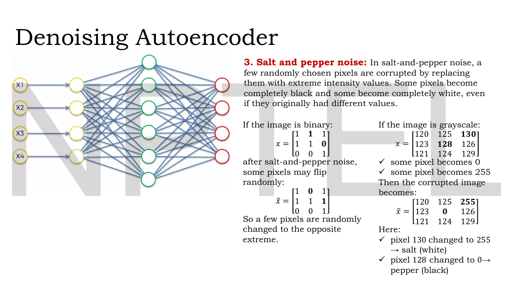
*Fig. — Both halves are one corruption rule read at two bit-depths. Binary: a pixel flips to the opposite extreme. Grayscale: 130 becomes 255 (**salt**, white) and 128 becomes 0 (**pepper**, black). Notice how violent this is compared with the Gaussian example on the previous page — the error on a single pixel is 125 intensity levels, not 0.05. Page 5.*

Binary image, two bits flipped:

$$\mathbf{x} = \begin{bmatrix}1&\mathbf{1}&1\\1&1&\mathbf{0}\\0&0&1\end{bmatrix} \ \longrightarrow\ \tilde{\mathbf{x}} = \begin{bmatrix}1&\mathbf{0}&1\\1&1&\mathbf{1}\\0&0&1\end{bmatrix}$$

Grayscale, two pixels pushed to the rails:

$$\mathbf{x} = \begin{bmatrix}120&125&\mathbf{130}\\123&\mathbf{128}&126\\121&124&129\end{bmatrix} \ \longrightarrow\ \tilde{\mathbf{x}} = \begin{bmatrix}120&125&\mathbf{255}\\123&\mathbf{0}&126\\121&124&129\end{bmatrix}$$

| Corruption | Rule | Controlled by | Leaves a component… |
|---|---|---|---|
| **Gaussian** | $\tilde{\mathbf{x}} = \mathbf{x} + \boldsymbol{\epsilon}$, $\boldsymbol{\epsilon}\sim\mathcal{N}(0,\sigma^2\mathbf{I})$ | variance $\sigma^2$ | slightly wrong, every component affected |
| **Masking** | $\tilde{x}_{i,j} = 0$ w.p. $q$, else $x_{i,j}$ | probability $q$ | missing entirely, or untouched |
| **Salt-and-pepper** | chosen pixels $\to$ min or max intensity | fraction of pixels hit | maximally wrong, or untouched |

### What gets corrupted and what the target is

This is the single most examinable fact in the lecture, and it is worth its own line.

> **The corruption is applied to the INPUT only. The target stays the CLEAN original.**
>
> $$\text{input} = \tilde{\mathbf{x}}, \qquad \text{target} = \mathbf{x}, \qquad \mathcal{L} = \mathcal{L}(\mathbf{x}, \hat{\mathbf{x}})$$

A plain autoencoder trains on the pair $(\mathbf{x}, \mathbf{x})$. A denoising autoencoder trains on the pair $(\tilde{\mathbf{x}}, \mathbf{x})$. If you corrupted the target too, you would be teaching the network to *produce* noise, and the identity shortcut would come straight back.

### Why corruption regularises

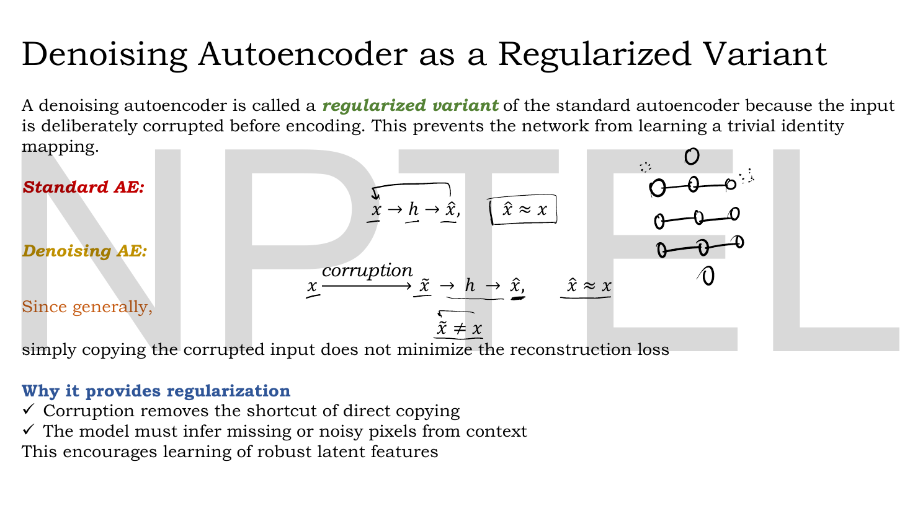
*Fig. — The whole argument in two lines. Top: the standard AE's chain, where $\hat{\mathbf{x}} \approx \mathbf{x}$ can be achieved by copying. Bottom: insert the corruption step and the thing the network receives, $\tilde{\mathbf{x}}$, is no longer the thing it is scored against. Boxed: "$\tilde{\mathbf{x}} \neq \mathbf{x}$". Page 13.*

The deck's argument, compressed to its logical skeleton:

1. The network sees $\tilde{\mathbf{x}}$ and is scored on how close $\hat{\mathbf{x}}$ is to $\mathbf{x}$.
2. Generally $\tilde{\mathbf{x}} \neq \mathbf{x}$.
3. Therefore **copying the input no longer minimises the reconstruction loss** — a copier outputs $\tilde{\mathbf{x}}$ and is charged $\mathcal{L}(\mathbf{x}, \tilde{\mathbf{x}})$, which is strictly positive.
4. To do better than a copier, the network must *undo* the corruption, which it can only do by exploiting structure that the corruption did not destroy.
5. Hence: "corruption removes the shortcut of direct copying", "the model must infer missing or noisy pixels from context", and the result is **robust latent features**.

Step 3 is the one worth internalising — it is the exam answer. Corruption does not make the identity mapping impossible; it makes it *suboptimal*. The optimiser abandons it because it now costs money.

Notice also what this buys structurally: the penalty never appears in the loss function. The denoising autoencoder's objective is byte-for-byte the plain autoencoder's objective. **The regularisation lives entirely in the data pipeline.** That is what makes it the odd one out of the week's three.

> **The one-line discrimination.** Denoising corrupts the **input**; sparse ([Lec 14](14-sparse-ae.md)) penalises the **hidden activations**; contractive ([Lec 15](15-contractive-ae.md)) penalises the **Jacobian** of the hidden layer with respect to the input. Full table: [the three regularisers side by side](15-contractive-ae.md#the-three-regularisers-side-by-side).

### What structure survives corruption: neighbouring-pixel dependency

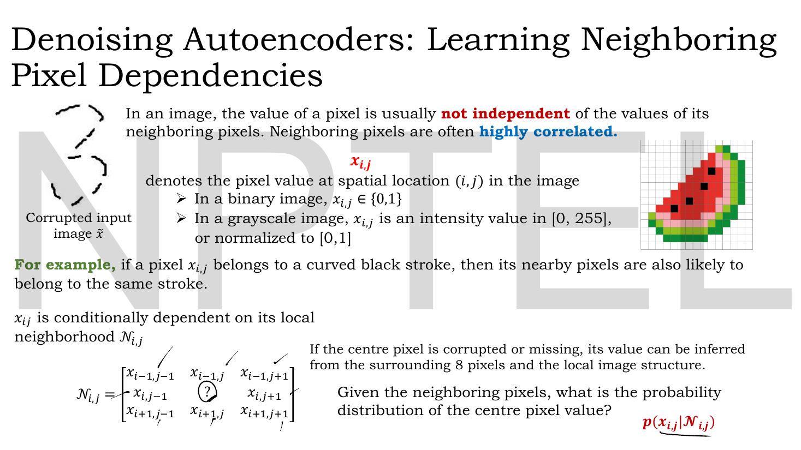
*Fig. — The left-hand "3" is the whole motivation: even with chunks of the stroke deleted, you can still read the digit, because the surviving fragments constrain what the missing ones must have been. Bottom right in red: the quantity the model is implicitly learning, $p(x_{i,j}\mid\mathcal{N}_{i,j})$. Page 6.*

The deck now answers "what structure?" for images. The claim: *"In an image, the value of a pixel is usually **not independent** of the values of its neighboring pixels. Neighboring pixels are often **highly correlated**."* Example given: if a pixel belongs to a curved black stroke, its nearby pixels probably belong to the same stroke.

Write $x_{i,j}$ for the pixel at row $i$, column $j$ — binary $x_{i,j}\in\{0,1\}$, or grayscale $x_{i,j}\in[0,255]$ (often normalised to $[0,1]$). Its **local neighbourhood** $\mathcal{N}_{i,j}$ is the ring of 8 pixels around it:

$$\mathcal{N}_{i,j} = \begin{bmatrix} x_{i-1,j-1} & x_{i-1,j} & x_{i-1,j+1} \\ x_{i,j-1} & \boxed{?} & x_{i,j+1} \\ x_{i+1,j-1} & x_{i+1,j} & x_{i+1,j+1}\end{bmatrix}$$

and the question the network implicitly answers is the conditional distribution

$$p(x_{i,j} \mid \mathcal{N}_{i,j})$$

*"Given the neighbouring pixels, what is the probability distribution of the centre pixel value?"* This is why corruption is survivable: a masked pixel is not information-free, because its neighbours are still there and they are correlated with it.

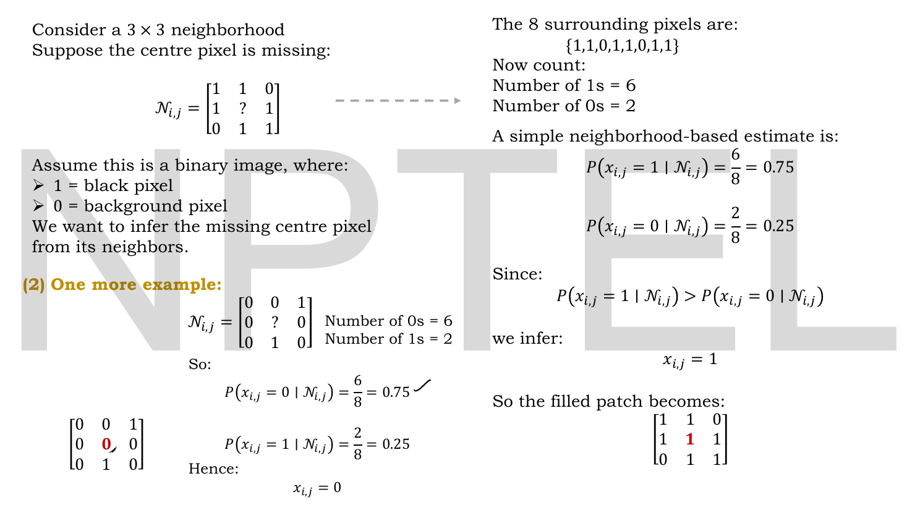
*Fig. — Two worked votes. Top: six 1s and two 0s among the eight neighbours → $P(x_{i,j}=1\mid\mathcal{N}_{i,j}) = 0.75$ → fill in 1. Bottom: the counts reverse → fill in 0. Notice that the *same* arithmetic gives opposite answers; the method is the majority vote, not the number 0.75. Page 7.*

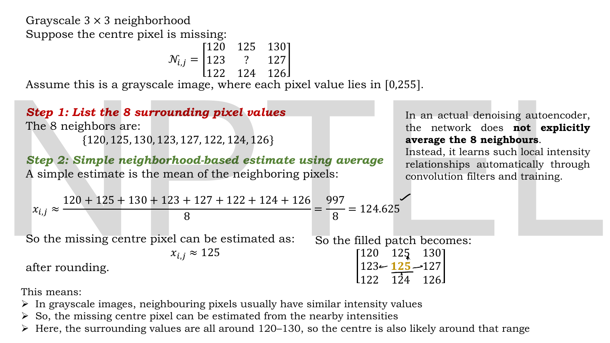
*Fig. — The grayscale analogue: a plain mean of the 8 neighbours. Read the grey box on the right before you over-learn this — "In an actual denoising autoencoder, the network does **not explicitly average the 8 neighbours**." The average is a hand-computable *stand-in* for what the network learns. Page 8.*

The grayscale version replaces the vote with a mean: $x_{i,j} \approx \frac{1}{8}\sum_{\mathcal{N}_{i,j}} = 997/8 = 124.625 \approx 125$. The deck's three takeaways are that neighbouring intensities are similar, so a missing centre can be estimated from them, and here specifically everything is in the 120–130 band so the centre must be too.

### Why a convolutional encoder makes this automatic

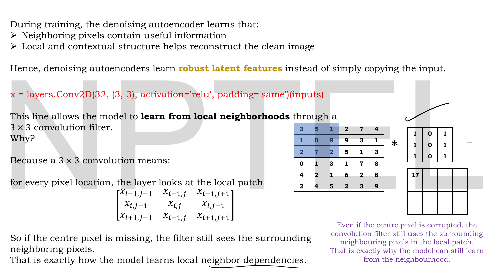
*Fig. — The purple note on the right is the payoff: "Even if the centre pixel is corrupted, the convolution filter still uses the surrounding neighbouring pixels in the local patch." The kernel shown has a **zero centre column**, so the output 17 does not depend on the centre pixel at all — a literal demonstration. Page 9.*

The deck jumps to a line of Keras:

```keras
x = layers.Conv2D(32, (3, 3), activation='relu', padding='same')(inputs)
```

and explains why it is the natural encoder for a denoising autoencoder: a $3\times3$ convolution means that **for every pixel location, the layer looks at exactly the local patch $\mathcal{N}_{i,j}$ plus the centre**. So if the centre pixel has been masked or flipped, the filter still sees the eight survivors and can produce a sensible feature anyway. This is how "learn local neighbour dependencies" becomes an architectural fact rather than an aspiration. (Convolution mechanics — kernels, stride, padding, the output-size formula — belong to [Lec 05](05-cnn-a.md); `padding='same'` just means the output keeps the input's height and width.)

### The formulation, in six steps

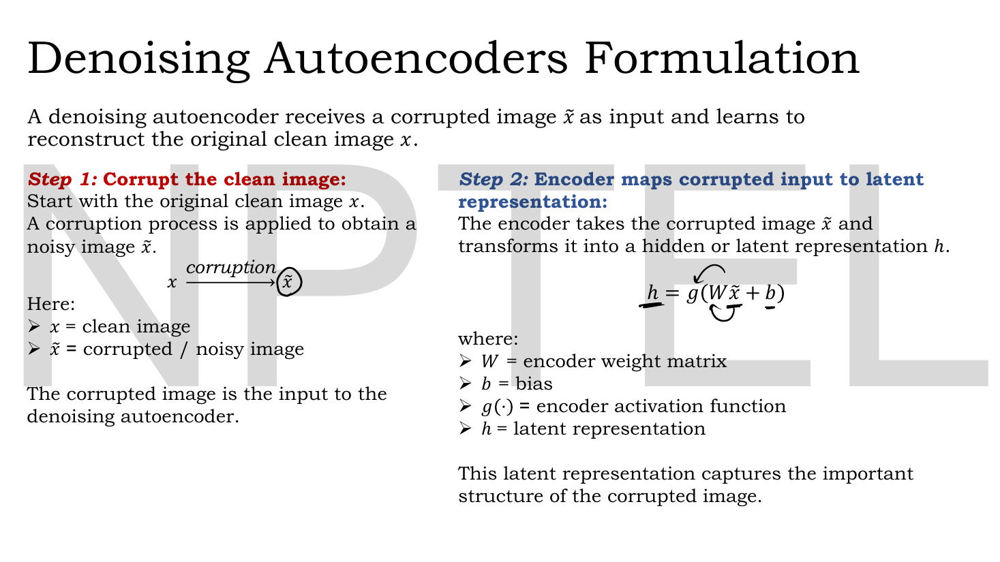
*Fig. — Step 2 is the only equation in the lecture that differs from a plain autoencoder's, and the difference is one tilde: the encoder is fed $\tilde{\mathbf{x}}$, not $\mathbf{x}$. Page 10.*

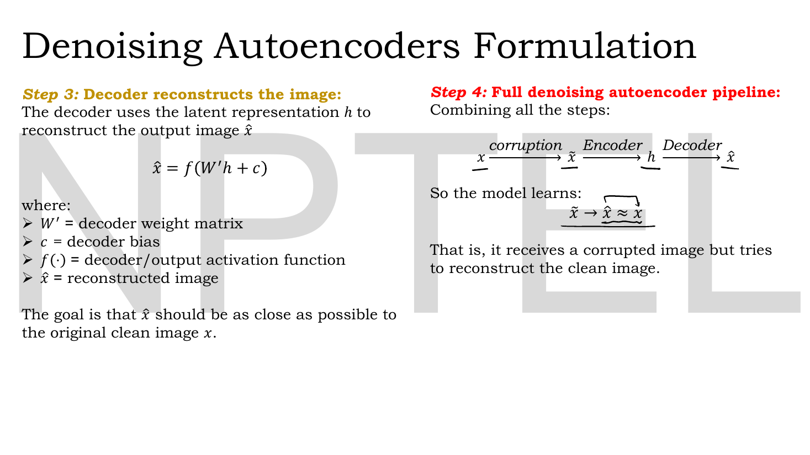
*Fig. — Step 4 is the chapter in one line: $\mathbf{x} \xrightarrow{\text{corruption}} \tilde{\mathbf{x}} \xrightarrow{\text{encoder}} \mathbf{h} \xrightarrow{\text{decoder}} \hat{\mathbf{x}}$, and the model learns $\tilde{\mathbf{x}} \to \hat{\mathbf{x}} \approx \mathbf{x}$. Four arrows, one of which is not learned. Page 11.*

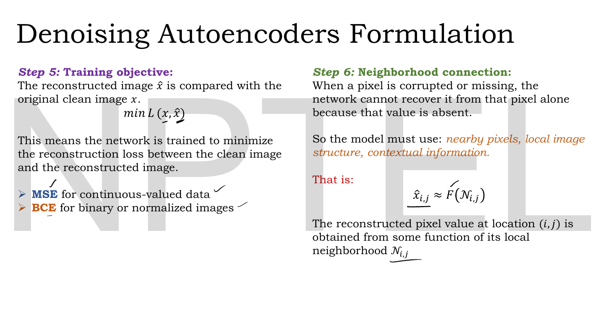
*Fig. — Step 5 confirms that the loss is unchanged from [Lec 11](11-reconstruction-loss.md) — MSE for continuous data, BCE for binary or normalised images. Step 6 states the inference rule the network ends up implementing: $\hat{x}_{i,j} \approx F(\mathcal{N}_{i,j})$. Page 12.*

| Step | What happens | Equation | Learned? |
|---|---|---|---|
| 1 | Corrupt the clean image | $\mathbf{x} \xrightarrow{\text{corruption}} \tilde{\mathbf{x}}$ | **no** |
| 2 | Encode the *corrupted* input | $\mathbf{h} = g(\mathbf{W}_e\tilde{\mathbf{x}} + \mathbf{b})$ | yes |
| 3 | Decode to a reconstruction | $\hat{\mathbf{x}} = f(\mathbf{W}_d\mathbf{h} + \mathbf{c})$ | yes |
| 4 | Full pipeline | $\mathbf{x} \to \tilde{\mathbf{x}} \to \mathbf{h} \to \hat{\mathbf{x}}$, aim $\hat{\mathbf{x}} \approx \mathbf{x}$ | — |
| 5 | Train against the **clean** target | $\min \mathcal{L}(\mathbf{x}, \hat{\mathbf{x}})$; MSE if continuous, BCE if binary | — |
| 6 | What the model ends up doing | $\hat{x}_{i,j} \approx F(\mathcal{N}_{i,j})$ | — |

Step 6 deserves a sentence of its own, because it explains *why* reconstruction is possible at all after a pixel has been destroyed: *"When a pixel is corrupted or missing, the network cannot recover it from that pixel alone because that value is absent."* The information has to come from somewhere else, and $\mathcal{N}_{i,j}$ is where.

## Worked numericals

The deck contains **five** fully worked examples in this page range (Gaussian vector on p.4, masking vector on p.4, salt-and-pepper patches on p.5, two binary neighbourhood votes on p.7, the grayscale neighbourhood mean on p.8, and the convolution on p.9 — six if you count the two binary votes separately). All are reproduced here and all of the arithmetic checked out.

### N1. Gaussian corruption of a 4-vector (deck, page 4)

**Given:** $\mathbf{x} = [0.50,\ 0.80,\ 0.20,\ 0.90]^\top$ and a sampled noise vector $\boldsymbol{\epsilon} = [0.01,\ -0.05,\ 0.03,\ -0.08]^\top$ drawn from $\mathcal{N}(0,\sigma^2\mathbf{I})$.
**Find:** $\tilde{\mathbf{x}}$, and the loss a "copy the input" network would be charged.

1. Componentwise addition:
   - $0.50 + 0.01 = 0.51$
   - $0.80 - 0.05 = 0.75$
   - $0.20 + 0.03 = 0.23$
   - $0.90 - 0.08 = 0.82$
2. A copier outputs $\hat{\mathbf{x}} = \tilde{\mathbf{x}}$, so its squared error against the clean target is $\lVert\tilde{\mathbf{x}} - \mathbf{x}\rVert^2 = \lVert\boldsymbol{\epsilon}\rVert^2$.
3. $0.01^2 + (-0.05)^2 + 0.03^2 + (-0.08)^2 = 0.0001 + 0.0025 + 0.0009 + 0.0064$.

**Answer:** $\tilde{\mathbf{x}} = [0.51,\ 0.75,\ 0.23,\ 0.82]^\top$, matching the slide exactly. A copier pays $\lVert\boldsymbol{\epsilon}\rVert^2 = 0.0099$ — small, but strictly greater than zero, which is the entire mechanism of the lecture. Step 2 is not on the slide; it is the quantitative version of the slide's "copying does not minimise the loss".

### N2. Masking noise: how many components actually get zeroed? (deck, page 4)

**Given:** $\mathbf{x} = [0.8,\ 0.3,\ 0.9,\ 0.5,\ 0.2]$, so $d = 5$, and masking probability $q = 0.4$.
**Find:** the expected number of masked components, the probability that exactly 2 are masked, and the probability that none is.

1. Each of the $d=5$ components is an independent Bernoulli trial with success (= masked) probability $q = 0.4$, so the count $M \sim \text{Binomial}(5, 0.4)$.
2. $\mathbb{E}[M] = dq = 5 \times 0.4 = 2$. This is the slide's "approximately 2 values are expected to be masked on average".
3. $P(M=2) = \binom{5}{2}(0.4)^2(0.6)^3 = 10 \times 0.16 \times 0.216 = 10 \times 0.03456 = 0.3456$.
4. $P(M=0) = (0.6)^5 = 0.07776$.

**Answer:** $\mathbb{E}[M] = \mathbf{2}$, $P(\text{exactly }2) = \mathbf{0.3456}$, $P(\text{none masked}) = \mathbf{0.07776}$. So the slide's displayed outcome $\tilde{\mathbf{x}} = [0.8, 0, 0.9, 0, 0.2]$ (exactly two zeros) happens barely a third of the time, and about 7.8% of the time the "corrupted" vector is the clean vector untouched. Steps 3–4 go beyond the slide and are exactly the kind of numerical NPTEL likes.

### N3. The cost of salt-and-pepper noise (deck, page 5)

**Given:** the deck's grayscale patch $\mathbf{x}$ with $x_{1,3} = 130$ and $x_{2,2} = 128$, corrupted to $\tilde{x}_{1,3} = 255$ (salt) and $\tilde{x}_{2,2} = 0$ (pepper); all other seven pixels unchanged.
**Find:** the squared error a copier would be charged, and the per-pixel MSE.

1. Only two pixels differ, so only two terms are non-zero.
2. Salt: $255 - 130 = 125$, squared $= 15625$.
3. Pepper: $0 - 128 = -128$, squared $= 16384$.
4. Total squared error $= 15625 + 16384 = 32009$.
5. Per-pixel MSE over the $3\times3 = 9$ pixels: $32009/9 = 3556.56$.

**Answer:** total $\mathbf{32009}$, per-pixel MSE $\mathbf{3556.56}$ (in squared intensity units). Compare N1's $0.0099$ on normalised data: salt-and-pepper is **enormously** more aggressive per corrupted element than Gaussian noise, which is why it is used sparingly — a high salt-and-pepper rate destroys the image rather than regularising the model.

### N4. Inferring a missing binary pixel from its neighbourhood (deck, page 7)

**Given:**
$$\mathcal{N}_{i,j} = \begin{bmatrix}1&1&0\\1&?&1\\0&1&1\end{bmatrix}$$
a binary image with $1 = $ black (stroke) and $0 = $ background.
**Find:** the inferred centre value.

1. List the 8 neighbours, reading round the ring: $\{1,1,0,1,1,0,1,1\}$.
2. Count: number of 1s $= 6$, number of 0s $= 2$.
3. $P(x_{i,j}=1 \mid \mathcal{N}_{i,j}) = 6/8 = 0.75$.
4. $P(x_{i,j}=0 \mid \mathcal{N}_{i,j}) = 2/8 = 0.25$.
5. Since $0.75 > 0.25$, take the more probable value.

**Answer:** $x_{i,j} = \mathbf{1}$, and the filled patch is $\begin{bmatrix}1&1&0\\1&\mathbf{1}&1\\0&1&1\end{bmatrix}$. Arithmetic matches the slide.

**Second case (deck, same page).** With
$\mathcal{N}_{i,j} = \begin{bmatrix}0&0&1\\0&?&0\\0&1&0\end{bmatrix}$
the neighbours are $\{0,0,1,0,0,0,1,0\}$: six 0s and two 1s, so $P(x_{i,j}=0\mid\mathcal{N}_{i,j}) = 6/8 = 0.75$ and the fill-in is $x_{i,j} = \mathbf{0}$. Same arithmetic, opposite answer — the method is the majority vote, and 0.75 is a coincidence of these two examples, not a constant.

### N5. Inferring a missing grayscale pixel (deck, page 8)

**Given:**
$$\mathcal{N}_{i,j} = \begin{bmatrix}120&125&130\\123&?&127\\122&124&126\end{bmatrix}, \qquad x_{i,j}\in[0,255]$$
**Find:** a neighbourhood estimate of the centre.

1. The 8 neighbours: $\{120, 125, 130, 123, 127, 122, 124, 126\}$.
2. Sum: $120+125 = 245$; $+130 = 375$; $+123 = 498$; $+127 = 625$; $+122 = 747$; $+124 = 871$; $+126 = 997$.
3. Mean: $997/8 = 124.625$.
4. Round to an integer intensity: $125$.

**Answer:** $x_{i,j} \approx \mathbf{124.625} \approx \mathbf{125}$. Matches the slide, including the intermediate 997. Note the deck's own caveat: a real denoising autoencoder does not compute this mean; it learns an equivalent (and better) local rule through its convolution filters.

### N6. The convolution that ignores the corrupted centre (deck, page 9)

**Given:** the deck's top-left $3\times3$ patch and kernel,
$$\text{patch} = \begin{bmatrix}3&5&1\\1&0&8\\2&7&2\end{bmatrix}, \qquad \mathbf{K} = \begin{bmatrix}1&0&1\\1&0&1\\1&0&1\end{bmatrix}$$
**Find:** the output value, and what happens if the centre pixel is corrupted.

1. Multiply elementwise and sum (cross-correlation, as every deep-learning library implements it):
   - row 1: $3(1) + 5(0) + 1(1) = 3 + 0 + 1 = 4$
   - row 2: $1(1) + 0(0) + 8(1) = 1 + 0 + 8 = 9$
   - row 3: $2(1) + 7(0) + 2(1) = 2 + 0 + 2 = 4$
2. Total: $4 + 9 + 4 = 17$.
3. The centre pixel of the patch is the $0$, multiplied by the kernel's centre weight, also $0$. Its contribution is $0 \times 0 = 0$ regardless of its value.

**Answer:** output $= \mathbf{17}$, matching the slide. And because this particular kernel's middle column is all zeros, **replacing the centre pixel with anything at all — 0, 255, salt, pepper — leaves the output at 17.** That is the slide's purple note made literal: the filter reconstructs from the neighbourhood, so corruption of the centre costs nothing. A real learned filter will not have an exactly-zero centre, but it will learn to down-weight it when trained on corrupted inputs.

### N7. Choosing $q$ for a target number of surviving pixels

**Given:** a $28\times28$ MNIST image ($d = 784$ pixels) under masking noise, and you want roughly 600 pixels to survive each epoch.
**Find:** the masking probability $q$.

1. Expected survivors $= d(1-q) = 784(1-q)$.
2. Set $784(1-q) = 600 \Rightarrow 1-q = 600/784 = 0.7653$.
3. $q = 1 - 0.7653 = 0.2347$.

**Answer:** $q \approx \mathbf{0.235}$, i.e. about 23.5%. Sanity check in the other direction: the course's own $q=0.4$ on 784 pixels destroys $784 \times 0.4 \approx 314$ pixels and leaves $470$ — an aggressive but standard setting for MNIST.

## Code

The deck asserts that corruption blocks the identity shortcut but never shows the loss numbers. Ten lines of NumPy give you the corruption rules exactly as specified, plus the Monte-Carlo check that $\mathbb{E}[M] = dq$.

```python
import numpy as np
rng = np.random.default_rng(0)

x = np.array([0.8, 0.3, 0.9, 0.5, 0.2])          # the deck's clean vector, page 4
q = 0.4                                           # masking probability

# --- 1. Masking noise: each component is zeroed INDEPENDENTLY with prob q
def mask(x, q, rng):
    keep = rng.random(x.shape) >= q               # True with prob 1-q
    return x * keep

print("clean x        =", x)
print("one draw x~    =", mask(x, q, rng))
print("another draw   =", mask(x, q, rng))

# How many components are masked, on average? Binomial(d, q) -> mean d*q
draws = np.array([(mask(x, q, rng) == 0).sum() for _ in range(100_000)])
print("E[#masked]     =", draws.mean(), " theory d*q =", len(x) * q)

# --- 2. Gaussian noise: x~ = x + eps,  eps ~ N(0, sigma^2 I)
sigma = 0.05
xt = x + rng.normal(0.0, sigma, size=x.shape)     # NOTE: numpy takes the STD DEV
print("gaussian x~    =", np.round(xt, 4))

# --- 3. Salt-and-pepper on a grayscale patch: chosen pixels -> 0 or 255
img = np.array([[120,125,130],[123,128,126],[121,124,129]])
sp = img.copy(); sp[0,2] = 255; sp[1,1] = 0       # the deck's own corruption, page 5
print("salt&pepper    =\n", sp)

# --- the target is ALWAYS the clean x, never the corrupted one
print("MSE(x~, x)     =", round(float(((mask(x,q,rng) - x)**2).sum()), 4),
      " <- what a copy-the-input shortcut would score")
```

```
clean x        = [0.8 0.3 0.9 0.5 0.2]
one draw x~    = [0.8 0.  0.  0.  0.2]
another draw   = [0.8 0.3 0.9 0.5 0.2]
E[#masked]     = 1.99677  theory d*q = 2.0
gaussian x~    = [0.8175 0.3678 0.8891 0.5382 0.24  ]
salt&pepper    =
 [[120 125 255]
 [123   0 126]
 [121 124 129]]
MSE(x~, x)     = 0.25  <- what a copy-the-input shortcut would score
```

Three things to read off. The two masking draws are *different* — the second one happens to mask nothing at all, which N2 said occurs 7.8% of the time. The Monte-Carlo mean 1.997 confirms $\mathbb{E}[M] = dq = 2$. And the last line is the mechanism: a network that copies its input pays 0.25 on this draw, while a network that correctly restores the masked values pays 0. That gap is the gradient signal that kills the identity mapping.

> **A `numpy` trap worth flagging.** `rng.normal(loc, scale)` takes the **standard deviation** $\sigma$, not the variance $\sigma^2$. The deck writes $\mathcal{N}(0,\sigma^2\mathbf{I})$. To corrupt with variance $0.01$ you must pass `scale=0.1`.

## Exam pack

### Must-memorise

| Item | Exactly this |
|---|---|
| Corruption map | $\mathbf{x} \xrightarrow{\text{corruption}} \tilde{\mathbf{x}}$, random, unlearned, training-time only |
| Gaussian noise | $\tilde{\mathbf{x}} = \mathbf{x} + \boldsymbol{\epsilon}$, $\boldsymbol{\epsilon}\sim\mathcal{N}(0,\sigma^2\mathbf{I})$ |
| Masking noise | $\tilde{x}_{i,j} = 0$ w.p. $q$; $\ = x_{i,j}$ w.p. $1-q$ |
| Salt-and-pepper | chosen pixels replaced by the **extreme** values (0 or max) |
| Encoder (corrupted input) | $\mathbf{h} = g(\mathbf{W}_e\tilde{\mathbf{x}} + \mathbf{b})$ |
| Decoder | $\hat{\mathbf{x}} = f(\mathbf{W}_d\mathbf{h} + \mathbf{c})$ |
| Objective | $\min\ \mathcal{L}(\mathbf{x}, \hat{\mathbf{x}})$ — **clean** $\mathbf{x}$ as target |
| Full pipeline | $\mathbf{x} \to \tilde{\mathbf{x}} \to \mathbf{h} \to \hat{\mathbf{x}}$, learns $\tilde{\mathbf{x}} \to \hat{\mathbf{x}} \approx \mathbf{x}$ |
| Why it regularises | $\tilde{\mathbf{x}} \neq \mathbf{x}$, so copying no longer minimises the loss |
| What is learned instead | $p(x_{i,j}\mid\mathcal{N}_{i,j})$ / $\hat{x}_{i,j}\approx F(\mathcal{N}_{i,j})$ |
| Loss choice | MSE for continuous data, BCE for binary or normalised ([Lec 11](11-reconstruction-loss.md)) |
| Neighbourhood | the 8 pixels around $(i,j)$, written $\mathcal{N}_{i,j}$ |
| Expected masked count | $\mathbb{E}[M] = dq$ for $d$ components |

### Numbers worth knowing

| Quantity | Value |
|---|---|
| Deck's masking probability | $q = 0.4$ → 40% zeroed, 60% unchanged, **per component** |
| Deck's masking example | $d = 5$, $\mathbb{E}[M] = 5\times0.4 = 2$ |
| Deck's clean / masked vector | $[0.8,0.3,0.9,0.5,0.2] \to [0.8,0,0.9,0,0.2]$ |
| Deck's Gaussian example | $[0.50,0.80,0.20,0.90] + [0.01,-0.05,0.03,-0.08] = [0.51,0.75,0.23,0.82]$ |
| Copier's loss on that Gaussian draw | $\lVert\boldsymbol{\epsilon}\rVert^2 = 0.0099$ |
| Salt example | $130 \to 255$ (white) |
| Pepper example | $128 \to 0$ (black) |
| Salt-and-pepper squared error | $125^2 + 128^2 = 32009$; per-pixel MSE $3556.56$ |
| Binary vote (both deck cases) | majority $6/8 = 0.75$ vs $2/8 = 0.25$ |
| Grayscale neighbourhood mean | $997/8 = 124.625 \approx 125$ |
| Convolution output (deck p.9) | $17$ |
| Deck's Keras encoder | `Conv2D(32, (3,3), activation='relu', padding='same')` |
| Neighbourhood size | 8 neighbours, $3\times3$ patch |
| $P(\text{exactly 2 masked})$, $d=5,q=0.4$ | $0.3456$ |
| $P(\text{nothing masked})$, $d=5,q=0.4$ | $0.07776$ |

### Likely MCQ traps

- **"Which gets corrupted, the input or the target?"** The **input only**. The target is always the clean $\mathbf{x}$, and the loss is $\mathcal{L}(\mathbf{x},\hat{\mathbf{x}})$. An option saying "both are corrupted" or "the loss is $\mathcal{L}(\tilde{\mathbf{x}},\hat{\mathbf{x}})$" is wrong, and would reintroduce the identity shortcut.
- **"$q=0.4$ means exactly 40% of components are zeroed."** No. Each component is an **independent** coin flip; the count is $\text{Binomial}(d,q)$ and only its *expectation* is $dq$. On $d=5$, "exactly 2" has probability 0.3456.
- **Confusing the three week-2 regularisers.** Denoising corrupts the **input**; sparse penalises the **activations**; contractive penalises the **Jacobian**. And [Lec 11](11-reconstruction-loss.md)'s $\lambda\lVert\mathbf{W}\rVert^2$ penalises the **weights** — a fourth thing entirely. See [the table](15-contractive-ae.md#the-three-regularisers-side-by-side).
- **"The denoising autoencoder adds a penalty term to the loss."** It does **not**. Its loss function is identical to a plain autoencoder's; the regularisation is in the data pipeline. This is the single cleanest way to tell it apart from Lec 14 and Lec 15 in an MCQ.
- **Gaussian vs salt-and-pepper.** Gaussian perturbs *every* component by a *small* amount; salt-and-pepper replaces a *few* pixels with *extreme* values. Masking zeroes a few. An option describing "every pixel set to 0 or 255" is describing neither correctly.
- **"$\mathcal{N}(0,\sigma^2\mathbf{I})$ — the second argument is the standard deviation."** It is the **variance**. In code, `np.random.normal` wants the standard deviation, so pass $\sigma$, not $\sigma^2$.
- **Thinking the corruption is learned or applied at test time.** It is a fixed stochastic rule with no parameters, applied only during training. At inference you feed the real (possibly already noisy) input directly.
- **"The network averages its 8 neighbours."** The deck explicitly denies this: the averaging on page 8 is a hand-computable illustration. The real network learns local relationships through convolution filters.
- **Salt vs pepper.** **Salt = white = maximum intensity (255)**; **pepper = black = 0**. The deck's example maps $130\to255$ (salt) and $128\to0$ (pepper).
- **Assuming a denoising AE must be convolutional.** It need not be — the corruption trick works on any architecture, including a plain MLP on tabular data. Convolution is just the natural fit when the surviving structure is spatial.

### Self-test

1. Write the three equations of a denoising autoencoder's forward pass, in order, and say which one has no learnable parameters.
2. Under masking noise with $q = 0.25$ applied to a 400-dimensional vector, what is the expected number of zeroed components, and the expected number surviving?
3. A denoising autoencoder is trained with MSE. State precisely which two vectors enter the loss.
4. Fill in the missing binary centre pixel of $\begin{bmatrix}0&1&1\\1&?&1\\1&1&0\end{bmatrix}$ and give the probability you used.
5. Explain in one sentence why corrupting the input prevents the trivial identity mapping.
6. Which of the three corruption rules changes *every* component of the input, and which change only a few?
7. The grayscale neighbourhood $\{200,198,201,199,202,197,203,200\}$ surrounds a corrupted centre. Estimate the centre.
8. How does the denoising autoencoder's *loss function* differ from a plain autoencoder's?
9. For a $3\times3$ kernel whose centre weight is exactly 0, what happens to the convolution output if the centre pixel is replaced by salt (255)?
10. You corrupt with $\mathcal{N}(0, 0.04\,\mathbf{I})$. What `scale` do you pass to `numpy`'s normal sampler?

<details><summary>Answers</summary>

1. (i) $\mathbf{x}\xrightarrow{\text{corruption}}\tilde{\mathbf{x}}$ — **no learnable parameters**, it is a fixed random rule; (ii) $\mathbf{h} = g(\mathbf{W}_e\tilde{\mathbf{x}}+\mathbf{b})$; (iii) $\hat{\mathbf{x}} = f(\mathbf{W}_d\mathbf{h}+\mathbf{c})$.
2. $\mathbb{E}[M] = dq = 400\times0.25 = \mathbf{100}$ zeroed, $400\times0.75 = \mathbf{300}$ surviving — on average; the actual count varies draw to draw.
3. The **clean** input $\mathbf{x}$ and the reconstruction $\hat{\mathbf{x}}$: $\mathcal{L} = \lVert\mathbf{x}-\hat{\mathbf{x}}\rVert^2$. The corrupted $\tilde{\mathbf{x}}$ appears nowhere in the loss — only as the encoder's input.
4. Neighbours $\{0,1,1,1,1,1,1,0\}$: six 1s, two 0s, so $P(x_{i,j}=1\mid\mathcal{N}_{i,j}) = 6/8 = 0.75 > 0.25$, hence $x_{i,j} = \mathbf{1}$.
5. Because the network is fed $\tilde{\mathbf{x}}$ but scored against $\mathbf{x}$, and $\tilde{\mathbf{x}}\neq\mathbf{x}$ — so copying the input produces $\hat{\mathbf{x}} = \tilde{\mathbf{x}}$ and incurs a strictly positive loss, making the identity mapping suboptimal rather than optimal.
6. **Gaussian** perturbs every component (by a small amount). **Masking** and **salt-and-pepper** touch only a randomly chosen subset, leaving the rest exactly unchanged.
7. Sum $= 200+198+201+199+202+197+203+200 = 1600$; $1600/8 = \mathbf{200}$.
8. It does **not** differ at all. Both minimise the same reconstruction loss; only the *input* to the encoder differs. This is what distinguishes denoising from the penalty-based regularisers of Lec 14 and Lec 15.
9. Nothing — the output is unchanged, because the centre pixel's contribution is $255 \times 0 = 0$ either way. That is the slide's demonstration that a convolutional encoder reconstructs from the neighbourhood.
10. $\sigma^2 = 0.04 \Rightarrow \sigma = 0.2$. Pass `scale=0.2`. Passing `0.04` would give variance $0.0016$, 25× too small.

</details>

## Beyond the slides

**Gap: the deck never says what fraction of corruption is too much.**
**Why it matters:** $q$ and $\sigma^2$ are hyperparameters with a genuine optimum. Too little corruption and the identity shortcut is still nearly optimal, so you have not regularised; too much and the clean signal is gone, so the best achievable reconstruction is the dataset mean and the model learns nothing specific. Practical MNIST values are $q \in [0.2, 0.5]$ or $\sigma \in [0.1, 0.3]$ on $[0,1]$ data. An exam question asking "what happens as $q \to 1$?" wants "the input carries no information; the model can only output the average image".

**Gap: corruption is a *fresh draw every epoch*, and the deck never says so.**
**Why it matters:** if you corrupted the dataset once and saved it, you would have created a fixed, finite noisy dataset — and the network could memorise *that*. Re-sampling $\tilde{\mathbf{x}}$ on every pass makes the training distribution effectively infinite and is why denoising behaves like data augmentation. In code this means the corruption belongs inside the training loop, not in preprocessing.

**Gap: the deck gives no account of what a denoising autoencoder learns in the limit.**
**Why it matters:** the standard result (Vincent et al., 2008; Alain & Bengio, 2014) is that a denoising autoencoder trained with small Gaussian noise learns, up to a constant, the **score** of the data distribution — $\hat{\mathbf{x}} - \mathbf{x} \propto \nabla_{\mathbf{x}}\log p(\mathbf{x})$. That is not an aside: it is the direct mathematical ancestor of the whole diffusion arc in [Lec 44](44-diffusion-intro.md) onward, where a network is trained to predict the noise added to a corrupted sample. If denoising autoencoders feel like a detour now, they are the thing Week 7 turns into a generative model.

**Gap: nothing is said about whether the denoising autoencoder helps at test time.**
**Why it matters:** two separate benefits get conflated in exam options. (a) The *learned representation* is more robust, which is the regularisation argument and is the point of this lecture. (b) The *trained model* can be used as an actual image denoiser, since it was literally trained to map noisy to clean. Both are true, but (a) is what makes it a "regularised variant"; (b) is a bonus application.

**Gap: no mention that masking noise is dropout applied to the input layer.**
**Why it matters:** they are the same operation. Masking noise with probability $q$ *is* input dropout with rate $q$, and recognising that links this lecture to the general regularisation vocabulary the reader already has. The difference is only in framing: dropout is normally described as a network trick, masking noise as a data corruption.

## Cut from the slides

Pages 1, 2, 14 and 15 are the course title, the one-line agenda ("Regularization Techniques in AE: Denoising Autoencoder"), the next-session preview and the thank-you; nothing in them is content. The network diagrams on pages 4 and 5 are the same figure repeated, so only page 4's is embedded; page 5 appears for its salt-and-pepper matrices. Page 6's decorative watermelon-pixel image and the handwritten "3" are described in the caption rather than re-embedded separately. The lecturer's red and black annotations — the circled "overcomplete" on page 3, the two alternative masking outcomes written over page 4, the ticks on pages 7–9, and the underlining on pages 10–13 — are folded into the prose as emphasis. The deck's symbols $W$, $W'$, $b$, $c$ have been translated to $\mathbf{W}_e$, $\mathbf{W}_d$, $\mathbf{b}$, $\mathbf{c}$ per the book's notation table, with the deck's own forms noted once in *The ideas*. Page 9's Keras line is reproduced verbatim but its convolution mechanics are left to [Lec 05](05-cnn-a.md), which owns them. Everything else on pages 3 through 13 is reproduced in full.
