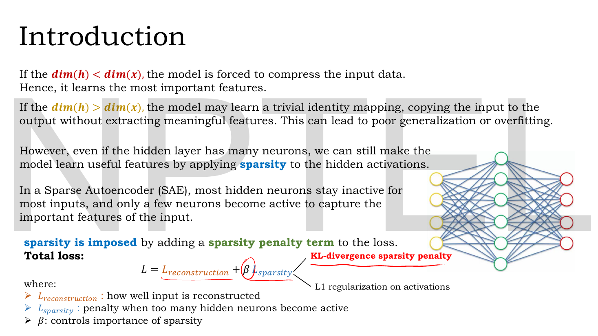
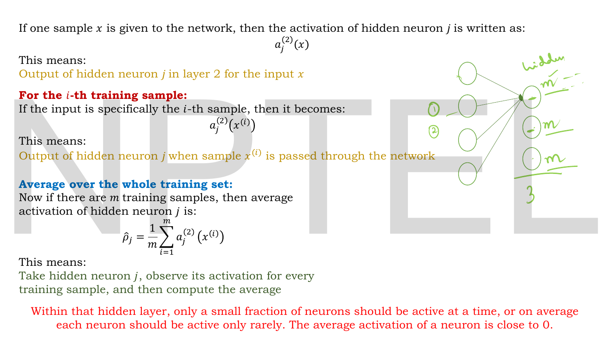
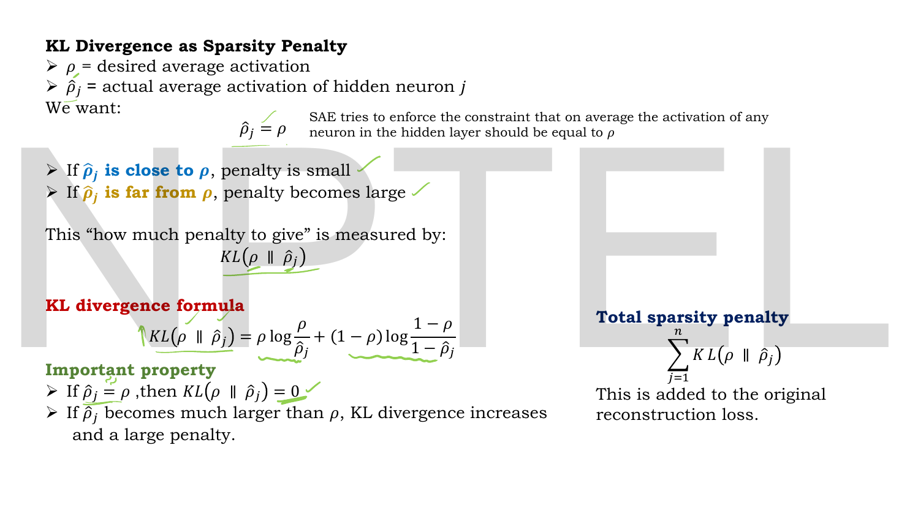
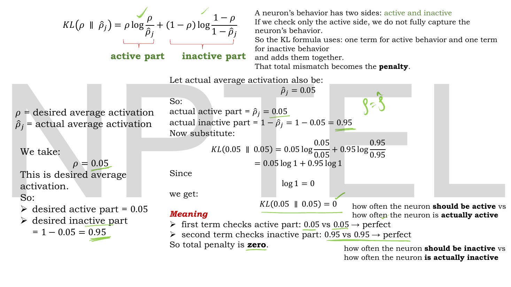
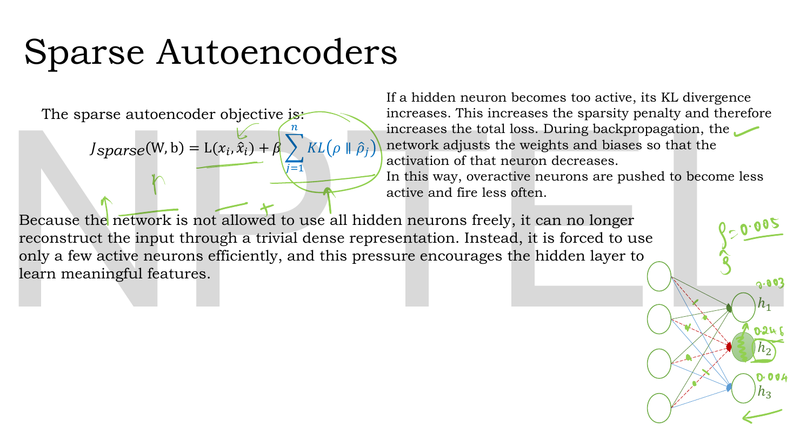
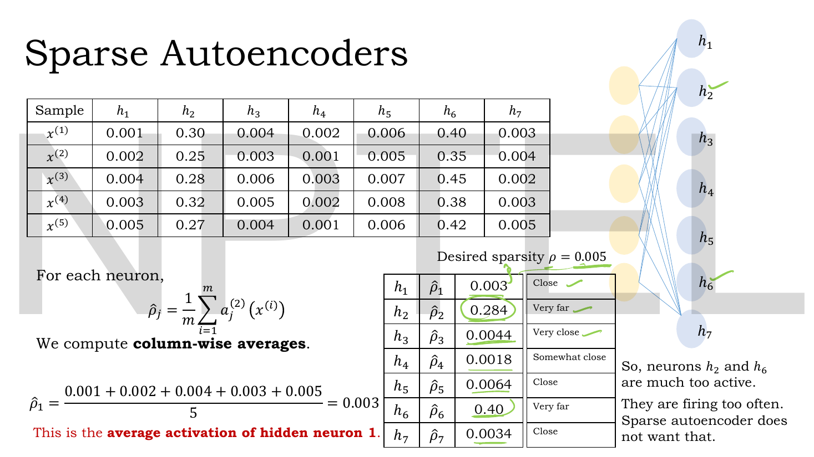
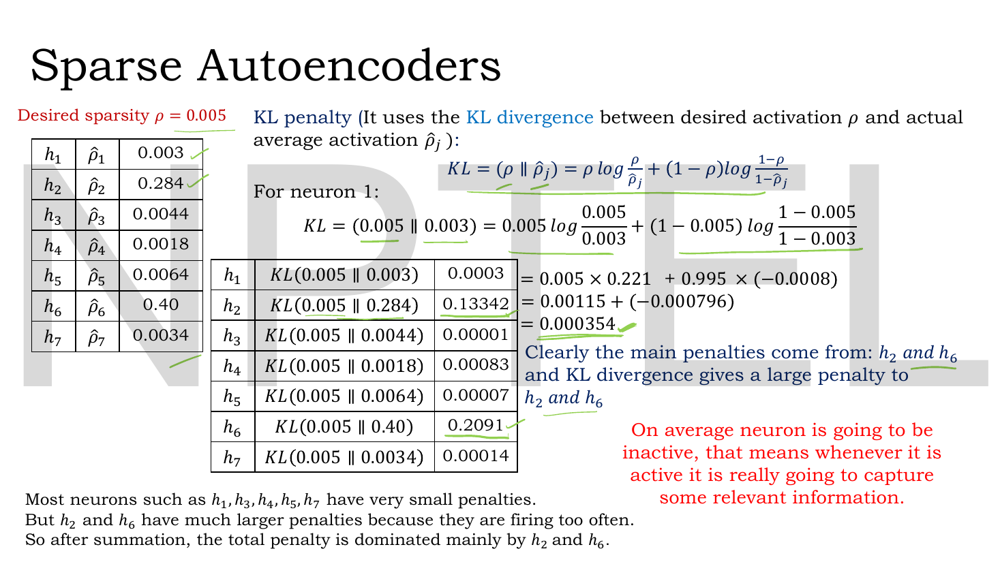

# Lec 14 — Sparse Autoencoders

> **Source:** `Lec 14.pdf` (11 pages) · **Week 2** · **Playlist:** Lec 14
> **Prereqs:** [Lec 10 — Introduction to Autoencoders](10-autoencoder-intro.md), [Lec 11 — Reconstruction Loss (MSE, BCE)](11-reconstruction-loss.md), [Lec 13 — Denoising Autoencoders](13-denoising-ae.md)
> **Feeds into:** [Lec 15 — Contractive Autoencoders](15-contractive-ae.md), [Lec 16 — Numerical Example, Limitations of AE](16-ae-numerical-and-limits.md), [Lec 19 — KL Divergence — Part A](19-kl-divergence-a.md), [Lec 26 — Disentanglement and β-VAE](26-beta-vae.md)

## Why this lecture exists

[Lec 13](13-denoising-ae.md) broke the identity shortcut by damaging the input. This lecture breaks it a second way, without touching the data at all: leave the hidden layer as wide as you like, but forbid most of it from switching on.

The motivating observation is that a narrow bottleneck is a very blunt instrument. Forcing $\dim(\mathbf{h}) < \dim(\mathbf{x})$ limits *how many* numbers the code may use, which also limits how expressive the features can be. A sparse autoencoder separates those two things. It keeps a wide hidden layer — hundreds of possible features — but requires that any single input activates only a handful of them. Capacity stays high; usage stays low. The constraint is imposed by adding a **sparsity penalty** to the loss, measured by how far each neuron's *average* activation across the training set has drifted from a small target $\rho$. That penalty is a KL divergence, which is the first appearance in this course of the quantity the whole VAE arc is built on.

## The ideas

### Wide hidden layers are allowed, if they are mostly off


*Fig. — The architectural setup and the objective on one page. Notice the network on the right: the hidden layer is **wider** than both the input and the output. That is deliberate. The red handwriting circles $\beta$ and labels the penalty; the black note on the right names L1 on activations as the alternative. Page 3.*

The deck opens with the dimension dichotomy:

- If $\dim(\mathbf{h}) < \dim(\mathbf{x})$ — **undercomplete** — the model is *forced* to compress, and so learns the most important features. This is the plain autoencoder of [Lec 10](10-autoencoder-intro.md).
- If $\dim(\mathbf{h}) > \dim(\mathbf{x})$ — **overcomplete** — the model *may* learn a trivial identity mapping, copying input to output without extracting anything. "This can lead to poor generalization or overfitting."

Then the move: *"However, even if the hidden layer has many neurons, we can still make the model learn useful features by applying **sparsity** to the hidden activations."*

**Sparsity**, defined here as the deck does: in a Sparse Autoencoder (SAE), *"most hidden neurons stay inactive for most inputs, and only a few neurons become active to capture the important features of the input."*

Read that carefully, because it contains the entire idea and also the standard misreading. It is a statement about *activations*, per input and averaged over inputs. It is not a statement about weights, and it is not a statement about how many neurons exist.

### The objective

Sparsity is imposed, in the deck's words, "by adding a sparsity penalty term to the loss":

$$\mathcal{L} = \mathcal{L}_{\text{reconstruction}} + \beta\,\mathcal{L}_{\text{sparsity}}$$

with

- $\mathcal{L}_{\text{reconstruction}}$ — how well the input is reconstructed (MSE or BCE, exactly as in [Lec 11](11-reconstruction-loss.md), unchanged);
- $\mathcal{L}_{\text{sparsity}}$ — the penalty paid when too many hidden neurons become active;
- $\beta$ — the hyperparameter controlling how much the sparsity matters.

The deck annotates this equation twice, naming the two things $\mathcal{L}_{\text{sparsity}}$ can be: the **KL-divergence sparsity penalty** (the one it then develops in full) and **L1 regularization on activations** (named only, never developed). Both penalise $\mathbf{h}$; the rest of the lecture is about the KL version.

> **The thing most likely to cost you a mark.** $\lambda\lVert\mathbf{W}\rVert^2$ from [Lec 11](11-reconstruction-loss.md) is **weight decay**: it penalises the **weight matrix**. The sparsity penalty here penalises the **activations** $\mathbf{h}$ — the numbers the hidden layer produces, not the numbers it is built from. They look alike on the page (both are "a term added to the reconstruction loss", both carry a Greek coefficient) and they do completely different things. A network can have large weights and sparse activations, or tiny weights and dense activations. Weight decay is **none** of the three week-2 regularisers.

### The average activation $\hat\rho_j$


*Fig. — Three symbols built in sequence, each adding one piece of specificity. The green handwriting on the right shows what is being averaged: one fixed hidden neuron, watched across every training sample. The red line at the bottom is the goal — "the average activation of a neuron is close to 0". Page 4.*

The deck builds its notation in three steps.

1. $a_j^{(2)}(\mathbf{x})$ — the output of hidden neuron $j$ in layer 2, for input $\mathbf{x}$. (Superscript 2 = the hidden layer; layer 1 is the input.)
2. $a_j^{(2)}(\mathbf{x}^{(i)})$ — the same, for the $i$-th training sample specifically.
3. The **average activation** of hidden neuron $j$ over all $m$ training samples:

$$\hat\rho_j = \frac{1}{m}\sum_{i=1}^{m} a_j^{(2)}\!\left(\mathbf{x}^{(i)}\right)$$

In this book's notation $a_j^{(2)}(\mathbf{x}^{(i)})$ is the $j$-th component of $\mathbf{h}^{(i)}$, so if you stack the codes into the batch matrix $\mathbf{H}$ of [Lec 11](11-reconstruction-loss.md) (one row per sample, one column per hidden unit), then

$$\hat{\boldsymbol\rho} = \text{column means of } \mathbf{H}$$

**Column-wise, not row-wise.** This is the single most common arithmetic slip in the numerical: you are averaging *down* a column (one neuron, all samples), not *across* a row (one sample, all neurons).

The deck's plain-English gloss: "Take hidden neuron $j$, observe its activation for every training sample, and then compute the average." And the goal, in red: *"Within that hidden layer, only a small fraction of neurons should be active at a time, or on average each neuron should be active only rarely. The average activation of a neuron is close to 0."*

Two assumptions are hiding here and both matter. First, $\hat\rho_j$ only makes sense as a "firing rate" if the activation is bounded in $[0,1]$ — i.e. the hidden layer uses a **sigmoid**. Second, "active" is being treated as a probability: $\hat\rho_j$ is read as *how often neuron $j$ fires*, which is why a divergence between distributions is the right tool.

### The target $\rho$ and the KL penalty


*Fig. — The formula to memorise, with its two guard-rails above and below it: small penalty when $\hat\rho_j$ is near $\rho$, large when it is far; and exactly zero when they are equal. The right-hand box sums over all $n$ hidden neurons — the penalty is per-neuron first, then added up. Page 5.*

Define $\rho$ (rho) as the **desired average activation** — a small number you choose, typically 0.01 to 0.05. The deck states the constraint the SAE is enforcing:

$$\hat\rho_j = \rho \quad \text{for every hidden neuron } j$$

*"SAE tries to enforce the constraint that on average the activation of any neuron in the hidden layer should be equal to $\rho$."* With $\rho = 0.05$, each neuron is allowed to be meaningfully on for about 5% of the training set and must be near-off for the other 95%.

You cannot enforce an equality constraint directly with gradient descent, so you penalise the gap. The deck's requirements on that penalty: small when $\hat\rho_j$ is close to $\rho$, large when far. The measure chosen is the **KL divergence**:

$$D_{\mathrm{KL}}(\rho\,\|\,\hat\rho_j) = \rho\log\frac{\rho}{\hat\rho_j} + (1-\rho)\log\frac{1-\rho}{1-\hat\rho_j}$$

and the **total sparsity penalty** sums it over all $n$ hidden neurons:

$$\mathcal{L}_{\text{sparsity}} = \sum_{j=1}^{n} D_{\mathrm{KL}}(\rho\,\|\,\hat\rho_j)$$

(The deck writes $KL(\rho \| \hat\rho_j)$; this book writes $D_{\mathrm{KL}}$ per the notation table.)

### Just enough KL to use it here

**KL divergence is owned by [Lec 19](19-kl-divergence-a.md)**, which you have not reached. It is defined there in general, along with why it is not a distance, why it is never negative, and why it is asymmetric. Do not try to derive it from this chapter. What you need to *use* it here is three facts and one picture.


*Fig. — The reason there are two terms, laid out explicitly. Each hidden neuron is treated as a **coin**: it fires with probability $\rho$ and stays silent with probability $1-\rho$. The first term compares the firing halves, the second compares the silent halves. Checking only the active half "would not fully capture the neuron's behavior". Page 6.*

**Fact 1 — each term compares a desired proportion against an actual one.** The deck splits the formula into an **active part** and an **inactive part**:

$$\underbrace{\rho\log\frac{\rho}{\hat\rho_j}}_{\text{active: should-fire vs does-fire}} \ + \ \underbrace{(1-\rho)\log\frac{1-\rho}{1-\hat\rho_j}}_{\text{inactive: should-be-silent vs is-silent}}$$

This is the KL divergence between two **Bernoulli** distributions: the one you want, $\text{Bernoulli}(\rho)$, and the one the neuron actually realises, $\text{Bernoulli}(\hat\rho_j)$. That is why both halves appear — a coin is described by both of its faces.

**Fact 2 — it is zero exactly when the two match, and positive otherwise.** The deck works this: with $\rho = 0.05$, desired active part $= 0.05$ and desired inactive part $= 1-0.05 = 0.95$. If the neuron happens to achieve $\hat\rho_j = 0.05$ too, then

$$D_{\mathrm{KL}}(0.05\,\|\,0.05) = 0.05\log\frac{0.05}{0.05} + 0.95\log\frac{0.95}{0.95} = 0.05\log 1 + 0.95\log 1 = 0$$

since $\log 1 = 0$. "First term checks active part: 0.05 vs 0.05 → perfect. Second term checks inactive part: 0.95 vs 0.95 → perfect. So total penalty is **zero**." This is the property that makes it usable as a penalty: the minimum is attainable and sits exactly where you want it.

**Fact 3 — it grows, steeply and asymmetrically, as $\hat\rho_j$ drifts.** The deck states the direction that matters: "If $\hat\rho_j$ becomes much larger than $\rho$, KL divergence increases and a large penalty." The asymmetry — $D_{\mathrm{KL}}(\rho\|\hat\rho_j) \neq D_{\mathrm{KL}}(\hat\rho_j\|\rho)$ — is [Lec 19](19-kl-divergence-a.md)'s to explain; here it is enough to know that the argument order is $(\rho\,\|\,\hat\rho_j)$, target first, with the actual value second, and that writing it the other way round gives a different number.

> **Which logarithm?** This deck's worked numbers are computed with $\log_{10}$. That is not a typo on one slide — all seven entries of its page-8 table match $\log_{10}$ and none match $\ln$. The book's default, set by [Lec 19](19-kl-divergence-a.md), is the **natural log** (answers in nats); [Lec 20](20-kl-divergence-b.md) uses $\log_2$ (bits). See N2 and N3, where both values are given for every number. Default to natural log, but recognise the deck's figures if they turn up as exam options.

### The full objective, and what gradient descent does with it


*Fig. — The objective in the deck's own symbols. The handwriting at the right shows the mechanism at neuron level: $\rho = 0.005$ as the target, $h_1$ at 0.003 and $h_3$ at 0.004 sitting quietly near it, and $h_2$ circled at 0.2446 — the one the penalty is pushing down. Page 9.*

$$\mathcal{L}_{\text{sparse}}(\mathbf{W},\mathbf{b}) = \mathcal{L}(\mathbf{x}_i, \hat{\mathbf{x}}_i) + \beta\sum_{j=1}^{n} D_{\mathrm{KL}}(\rho\,\|\,\hat\rho_j)$$

(The deck writes this as $J_{sparse}(W,b)$; this book uses $\mathcal{L}$ for every loss.)

The deck's account of the dynamics is the part worth keeping: *"If a hidden neuron becomes too active, its KL divergence increases. This increases the sparsity penalty and therefore increases the total loss. During backpropagation, the network adjusts the weights and biases so that the activation of that neuron decreases. In this way, overactive neurons are pushed to become less active and fire less often."*

And the consequence: *"Because the network is not allowed to use all hidden neurons freely, it can no longer reconstruct the input through a trivial dense representation. Instead, it is forced to use only a few active neurons efficiently, and this pressure encourages the hidden layer to learn meaningful features."*

The lecturer's spoken aside, written in red on page 8, is the cleanest statement of *why sparsity is good* anywhere in the deck: **"On average the neuron is going to be inactive; that means whenever it is active it is really going to capture some relevant information."** A neuron that fires for everything tells you nothing. A neuron that fires for 5% of inputs is, by construction, a detector for something specific.

$\beta$ sets the exchange rate. $\beta = 0$ gives back a plain overcomplete autoencoder and the identity shortcut returns. Large $\beta$ drives every $\hat\rho_j \to \rho$ regardless of what that costs the reconstruction, and in the limit all neurons go quiet and the decoder outputs a constant.

> **The one-line discrimination.** Sparse penalises the **hidden activations** $\mathbf{h}$ (via their average $\hat\rho_j$); denoising ([Lec 13](13-denoising-ae.md)) corrupts the **input** and adds no penalty at all; contractive ([Lec 15](15-contractive-ae.md)) penalises the **Jacobian** $\partial\mathbf{h}/\partial\mathbf{x}$. Full table: [the three regularisers side by side](15-contractive-ae.md#the-three-regularisers-side-by-side).

### The deck's running example


*Fig. — The numbers the rest of the lecture runs on. Five samples down, seven hidden neurons across. Scan the columns, not the rows: $h_2$ and $h_6$ are wildly larger than everything else in every row, which is exactly what "firing too often" looks like in a table. Page 7.*

Five training samples, seven hidden neurons, desired sparsity $\rho = 0.005$. Taking column means gives

| Neuron | $\hat\rho_j$ | Verdict (deck's own) |
|---|---|---|
| $h_1$ | $0.003$ | Close |
| $h_2$ | $0.284$ | **Very far** |
| $h_3$ | $0.0044$ | Very close |
| $h_4$ | $0.0018$ | Somewhat close |
| $h_5$ | $0.0064$ | Close |
| $h_6$ | $0.40$ | **Very far** |
| $h_7$ | $0.0034$ | Close |

*"So, neurons $h_2$ and $h_6$ are much too active. They are firing too often. Sparse autoencoder does not want that."*


*Fig. — The penalty table. Five of the seven values are below 0.001 and contribute essentially nothing; $h_2$ and $h_6$ together are 99.6% of the total. That concentration is the point — the penalty is a targeted bill sent to the specific neurons that misbehaved, not a flat tax on the layer. Page 8.*

| Neuron | $D_{\mathrm{KL}}(0.005\,\|\,\hat\rho_j)$, deck | …with natural log |
|---|---|---|
| $h_1$ | $0.0003$ | $0.00056$ |
| $h_2$ | $0.13342$ | $0.30722$ |
| $h_3$ | $0.00001$ | $0.00004$ |
| $h_4$ | $0.00083$ | $0.00191$ |
| $h_5$ | $0.00007$ | $0.00017$ |
| $h_6$ | $0.2091$ | $0.48137$ |
| $h_7$ | $0.00014$ | $0.00033$ |
| **Total** | $\mathbf{0.34387}$ | $\mathbf{0.79160}$ |

The deck's reading: "Most neurons such as $h_1, h_3, h_4, h_5, h_7$ have very small penalties. But $h_2$ and $h_6$ have much larger penalties because they are firing too often. So after summation, the total penalty is dominated mainly by $h_2$ and $h_6$."

## Worked numericals

The deck contains **three** fully worked examples in this page range: the $D_{\mathrm{KL}}(0.05\|0.05) = 0$ check on page 6, the column-mean computation on page 7, and the seven-neuron KL table on page 8. All are reproduced. **Two of the three matched my arithmetic exactly; the third (page 8) matched only once I discovered the deck is using base-10 logarithms, and even then one intermediate step on the slide is wrong** — details in N2.

### N1. Column averages of the activation table (deck, page 7)

**Given:** the deck's $5\times7$ table of hidden activations $a_j^{(2)}(\mathbf{x}^{(i)})$, with $m = 5$ samples and $n = 7$ hidden neurons.
**Find:** $\hat\rho_j$ for every neuron.

1. $\hat\rho_j$ averages **down a column** — one neuron, all five samples:
$$\hat\rho_1 = \frac{0.001+0.002+0.004+0.003+0.005}{5} = \frac{0.015}{5} = 0.003$$
2. $\hat\rho_2 = \dfrac{0.30+0.25+0.28+0.32+0.27}{5} = \dfrac{1.42}{5} = 0.284$
3. $\hat\rho_3 = \dfrac{0.004+0.003+0.006+0.005+0.004}{5} = \dfrac{0.022}{5} = 0.0044$
4. $\hat\rho_4 = \dfrac{0.002+0.001+0.003+0.002+0.001}{5} = \dfrac{0.009}{5} = 0.0018$
5. $\hat\rho_5 = \dfrac{0.006+0.005+0.007+0.008+0.006}{5} = \dfrac{0.032}{5} = 0.0064$
6. $\hat\rho_6 = \dfrac{0.40+0.35+0.45+0.38+0.42}{5} = \dfrac{2.00}{5} = 0.40$
7. $\hat\rho_7 = \dfrac{0.003+0.004+0.002+0.003+0.005}{5} = \dfrac{0.017}{5} = 0.0034$

**Answer:** $\hat{\boldsymbol\rho} = [0.003,\ 0.284,\ 0.0044,\ 0.0018,\ 0.0064,\ 0.40,\ 0.0034]$. **All seven match the slide exactly.** Against $\rho = 0.005$, five neurons are within a factor of 3 and two ($h_2$, $h_6$) are 57× and 80× too large.

### N2. The KL penalty for neuron 1 — and a slide error (deck, page 8)

**Given:** $\rho = 0.005$, $\hat\rho_1 = 0.003$.
**Find:** $D_{\mathrm{KL}}(0.005\,\|\,0.003)$.

$$D_{\mathrm{KL}}(0.005\,\|\,0.003) = 0.005\log\frac{0.005}{0.003} + 0.995\log\frac{0.995}{0.997}$$

**With natural logarithms (this book's convention, and [Lec 19](19-kl-divergence-a.md)'s):**

1. $\ln(0.005/0.003) = \ln(1.66667) = 0.510826$; $\ \ 0.005 \times 0.510826 = 0.0025541$.
2. $\ln(0.995/0.997) = \ln(0.997994) = -0.0020081$; $\ \ 0.995 \times (-0.0020081) = -0.0019980$.
3. Sum: $0.0025541 - 0.0019980 = 0.0005561$.

**With base-10 logarithms (what the deck actually used):**

4. $\log_{10}(1.66667) = 0.221849$; $\ \ 0.005 \times 0.221849 = 0.0011092$.
5. $\log_{10}(0.997994) = -0.00087172$; $\ \ 0.995 \times (-0.00087172) = -0.00086736$.
6. Sum: $0.0011092 - 0.00086736 = 0.0002419$.

**Answer:** $\mathbf{0.000556}$ in nats (natural log) or $\mathbf{0.000242}$ in base 10.

**The slide gives neither.** Its chain reads $= 0.005\times0.221 + 0.995\times(-0.0008) = 0.00115 + (-0.000796) = 0.000354$, and its summary table rounds this to $0.0003$. Two things are wrong with it:

- $0.005 \times 0.221 = 0.001105$, **not** $0.00115$. Carrying the slide's own rounded factors correctly gives $0.001105 - 0.000796 = 0.000309$.
- Using unrounded base-10 logs gives $0.000242$.

So the slide's $0.000354$ is an arithmetic slip on top of a rounding choice. The magnitude is irrelevant to the lecture's argument (neuron 1's penalty is negligible either way) but if an exam reproduces the slide's number, now you know where it came from.

### N3. The whole penalty table, in both log bases (deck, page 8)

**Given:** $\rho = 0.005$ and the seven $\hat\rho_j$ from N1.
**Find:** every $D_{\mathrm{KL}}$ and the total.

Using $D_{\mathrm{KL}}(\rho\|\hat\rho_j) = \rho\log\frac{\rho}{\hat\rho_j} + (1-\rho)\log\frac{1-\rho}{1-\hat\rho_j}$ with $\rho = 0.005$, $1-\rho = 0.995$:

| $j$ | $\hat\rho_j$ | base-10 (mine) | slide | natural log (mine) |
|---|---|---|---|---|
| 1 | $0.003$ | $0.000242$ | $0.0003$ | $0.000556$ |
| 2 | $0.284$ | $0.133424$ | $0.13342$ | $0.307220$ |
| 3 | $0.0044$ | $0.000017$ | $0.00001$ | $0.000039$ |
| 4 | $0.0018$ | $0.000831$ | $0.00083$ | $0.001913$ |
| 5 | $0.0064$ | $0.000072$ | $0.00007$ | $0.000167$ |
| 6 | $0.40$ | $0.209058$ | $0.2091$ | $0.481374$ |
| 7 | $0.0034$ | $0.000143$ | $0.00014$ | $0.000330$ |
| | **total** | $\mathbf{0.343787}$ | $0.34387$ | $\mathbf{0.791599}$ |

Worked longhand for the biggest offender, $h_6$ with $\hat\rho_6 = 0.40$, in base 10:
1. $\log_{10}(0.005/0.40) = \log_{10}(0.0125) = -1.903090$; $\ 0.005 \times (-1.903090) = -0.0095155$.
2. $\log_{10}(0.995/0.600) = \log_{10}(1.658333) = 0.219672$; $\ 0.995 \times 0.219672 = 0.2185735$.
3. Sum: $-0.0095154 + 0.2185735 = 0.2090581$.

**Answer:** total sparsity penalty $= \mathbf{0.3438}$ in base 10 (which is what the deck's table sums to, confirming its log base) or $\mathbf{0.7916}$ in nats. **Six of the deck's seven entries match my base-10 computation to the displayed precision; only $h_1$ disagrees, for the reason in N2.** Note the structure either way: $h_2$ and $h_6$ supply $0.3425/0.3438 = 99.6\%$ of the total.

Note also from step 1 the sign: the *active* term is **negative** for an overactive neuron (it fires more than wanted, so $\rho/\hat\rho_j < 1$), and the *inactive* term is positive and larger. The two terms always combine to something $\geq 0$ — that is KL's non-negativity, proved in [Lec 19](19-kl-divergence-a.md).

### N4. The penalty vanishes when the constraint is met (deck, page 6)

**Given:** $\rho = 0.05$ and a neuron that achieves exactly $\hat\rho_j = 0.05$.
**Find:** its KL penalty.

1. Desired active part $= \rho = 0.05$; desired inactive part $= 1 - 0.05 = 0.95$.
2. Actual active part $= \hat\rho_j = 0.05$; actual inactive part $= 1 - 0.05 = 0.95$.
3. $D_{\mathrm{KL}}(0.05\,\|\,0.05) = 0.05\log\dfrac{0.05}{0.05} + 0.95\log\dfrac{0.95}{0.95} = 0.05\log 1 + 0.95\log 1$.
4. $\log 1 = 0$ in **every** base, so both terms vanish.

**Answer:** $\mathbf{0}$. Matches the slide. And because this holds in every base, it is the one KL number in this lecture you can quote without worrying about logarithms.

### N5. The complete objective

**Given:** a batch whose reconstruction loss is $\mathcal{L}_{\text{rec}} = 0.12$, the seven $\hat\rho_j$ of N1, $\rho = 0.005$, and $\beta = 3$.
**Find:** $\mathcal{L}_{\text{sparse}}$, and the share of the objective the penalty takes.

1. Sparsity term (natural log, from N3): $\sum_j D_{\mathrm{KL}} = 0.791599$.
2. Weighted: $\beta \sum_j D_{\mathrm{KL}} = 3 \times 0.791599 = 2.374797$.
3. Total: $\mathcal{L}_{\text{sparse}} = 0.12 + 2.374797 = 2.494797$.
4. Penalty share: $2.374797 / 2.494797 = 0.9519$.

**Answer:** $\mathcal{L}_{\text{sparse}} = \mathbf{2.4948}$, of which the sparsity penalty is **95.2%**. That is $\beta$ set far too high for this batch — the optimiser will spend almost all its effort silencing $h_2$ and $h_6$ and almost none on reconstructing. Re-running with $\beta = 0.1$ gives $0.12 + 0.0792 = 0.1992$, a 40% share, which is a sane working balance. Reading this ratio is the practical way to tune $\beta$.

### N6. KL sparsity versus L1 sparsity on the same table

**Given:** the same $\hat{\boldsymbol\rho}$, and the L1-on-activations penalty $\sum_j |\hat\rho_j|$ that the deck names but never develops.
**Find:** both penalties, and what each one's *minimum* is.

1. L1: $0.003 + 0.284 + 0.0044 + 0.0018 + 0.0064 + 0.40 + 0.0034 = 0.7030$.
2. KL (natural log): $0.7916$ from N3.
3. L1's minimum is at $\hat\rho_j = 0$ for every $j$ — all neurons permanently dead.
4. KL's minimum is at $\hat\rho_j = \rho = 0.005$ for every $j$ — all neurons firing rarely but non-zero.

**Answer:** L1 $= \mathbf{0.7030}$, KL $= \mathbf{0.7916}$. The numbers are coincidentally similar; the behaviour is not. **L1 pushes activations toward zero with no floor; KL pushes them toward a specified non-zero rate $\rho$ and penalises a neuron that is too *quiet* as well as one that is too loud.** Check that last claim: a neuron with $\hat\rho_j = 0.0001$ against $\rho = 0.005$ scores $D_{\mathrm{KL}} = 0.0147$ in nats — a real penalty, where L1 would have rewarded it. That asymmetry of purpose is the reason this deck develops KL and only names L1.

## Code

The deck's two tables are the whole lecture, and reproducing them in nine lines settles the log-base question for good.

```python
import numpy as np

# The deck's activation table, page 7: rows = 5 samples, cols = 7 hidden neurons
A = np.array([
    [0.001, 0.30, 0.004, 0.002, 0.006, 0.40, 0.003],   # x^(1)
    [0.002, 0.25, 0.003, 0.001, 0.005, 0.35, 0.004],   # x^(2)
    [0.004, 0.28, 0.006, 0.003, 0.007, 0.45, 0.002],   # x^(3)
    [0.003, 0.32, 0.005, 0.002, 0.008, 0.38, 0.003],   # x^(4)
    [0.005, 0.27, 0.004, 0.001, 0.006, 0.42, 0.005],   # x^(5)
])
rho = 0.005

rho_hat = A.mean(axis=0)              # COLUMN-wise mean: average over the m samples
print("rho_hat =", np.round(rho_hat, 4))

def kl(p, q, log):                    # Bernoulli KL, per neuron
    return p*log(p/q) + (1-p)*log((1-p)/(1-q))

kl_ln  = kl(rho, rho_hat, np.log)     # natural log  (Lec 19 convention)
kl_log = kl(rho, rho_hat, np.log10)   # base 10      (what this deck actually used)
print("KL per neuron, ln    :", np.round(kl_ln, 5))
print("KL per neuron, log10 :", np.round(kl_log, 5))
print("total penalty  ln    :", round(kl_ln.sum(), 4))
print("total penalty  log10 :", round(kl_log.sum(), 4), " <- matches the deck's table")

# L1 sparsity, the alternative the deck names in the margin of page 3
print("L1 penalty sum|rho_hat| :", round(np.abs(rho_hat).sum(), 4))

# Full objective with beta, assuming a reconstruction loss of 0.12
beta, L_rec = 3.0, 0.12
print("J_sparse =", round(L_rec + beta*kl_ln.sum(), 4), "(ln)")
```

```
rho_hat = [0.003  0.284  0.0044 0.0018 0.0064 0.4    0.0034]
KL per neuron, ln    : [5.6000e-04 3.0722e-01 4.0000e-05 1.9100e-03 1.7000e-04 4.8137e-01
 3.3000e-04]
KL per neuron, log10 : [2.4000e-04 1.3342e-01 2.0000e-05 8.3000e-04 7.0000e-05 2.0906e-01
 1.4000e-04]
total penalty  ln    : 0.7916
total penalty  log10 : 0.3438  <- matches the deck's table
L1 penalty sum|rho_hat| : 0.703
J_sparse = 2.4948 (ln)
```

The `axis=0` in `A.mean(axis=0)` is the whole of the deck's "column-wise averages" instruction; `axis=1` would give five per-sample means and is the wrong quantity entirely. And the two totals, 0.7916 against 0.3438, differ by exactly $\ln(10) = 2.3026$ — the fixed conversion between log bases. If an exam option is your answer divided by 2.303, it was computed in base 10.

## Exam pack

### Must-memorise

| Item | Exactly this |
|---|---|
| Average activation | $\hat\rho_j = \dfrac{1}{m}\sum_{i=1}^{m} a_j^{(2)}(\mathbf{x}^{(i)})$ — **column mean** |
| Target | $\rho$ = desired average activation; the SAE enforces $\hat\rho_j = \rho$ |
| KL sparsity, per neuron | $D_{\mathrm{KL}}(\rho\,\|\,\hat\rho_j) = \rho\log\dfrac{\rho}{\hat\rho_j} + (1-\rho)\log\dfrac{1-\rho}{1-\hat\rho_j}$ |
| Total sparsity penalty | $\displaystyle\sum_{j=1}^{n} D_{\mathrm{KL}}(\rho\,\|\,\hat\rho_j)$ |
| Full objective | $\mathcal{L}_{\text{sparse}}(\mathbf{W},\mathbf{b}) = \mathcal{L}(\mathbf{x}_i,\hat{\mathbf{x}}_i) + \beta\sum_{j} D_{\mathrm{KL}}(\rho\,\|\,\hat\rho_j)$ |
| Generic form | $\mathcal{L} = \mathcal{L}_{\text{reconstruction}} + \beta\,\mathcal{L}_{\text{sparsity}}$ |
| Zero-penalty condition | $\hat\rho_j = \rho \Rightarrow D_{\mathrm{KL}} = 0$ (because $\log 1 = 0$) |
| Two terms | **active part** $\rho\log(\rho/\hat\rho_j)$ · **inactive part** $(1-\rho)\log\frac{1-\rho}{1-\hat\rho_j}$ |
| What is penalised | the **activations** $\mathbf{h}$ — *not* the weights, *not* the input |
| Alternative penalty | L1 on activations (named by the deck, not developed) |
| Architecture allowed | **overcomplete**, $\dim(\mathbf{h}) > \dim(\mathbf{x})$ |
| $\beta$ | controls how much sparsity matters relative to reconstruction |
| Hidden activation required | sigmoid, so $\hat\rho_j\in(0,1)$ reads as a firing rate |

### Numbers worth knowing

| Quantity | Value |
|---|---|
| Deck's running target | $\rho = 0.005$ (and $\rho = 0.05$ in the page-6 illustration) |
| Deck's table size | $m = 5$ samples, $n = 7$ hidden neurons |
| Column means $\hat{\boldsymbol\rho}$ | $[0.003,\ 0.284,\ 0.0044,\ 0.0018,\ 0.0064,\ 0.40,\ 0.0034]$ |
| The two offenders | $h_2$ ($\hat\rho = 0.284$) and $h_6$ ($\hat\rho = 0.40$) |
| $D_{\mathrm{KL}}(0.005\|0.284)$ | $0.13342$ (base 10, as on the slide) · $0.30722$ (nats) |
| $D_{\mathrm{KL}}(0.005\|0.40)$ | $0.2091$ (base 10) · $0.48137$ (nats) |
| Total penalty | $0.3438$ (base 10, the deck's) · $0.7916$ (nats) |
| Share from $h_2 + h_6$ | $99.6\%$ |
| $D_{\mathrm{KL}}(0.05\|0.05)$ | exactly $0$ |
| Log-base conversion factor | $\ln(10) = 2.3026$ |
| L1 penalty on the same table | $0.7030$ |
| Typical $\rho$ in practice | $0.01$–$0.05$ |

### Likely MCQ traps

- **"The sparsity penalty penalises the weights."** It penalises the **activations**. [Lec 11](11-reconstruction-loss.md)'s $\lambda\lVert\mathbf{W}\rVert^2$ is the one that penalises weights, and it is **weight decay**, not any of the three week-2 regularisers. If an option mentions $\lVert\mathbf{W}\rVert^2$ in a sparse-autoencoder question, it is the distractor.
- **Confusing the three week-2 regularisers.** Denoising corrupts the **input** ([Lec 13](13-denoising-ae.md)); sparse penalises the **activations**; contractive penalises the **Jacobian** ([Lec 15](15-contractive-ae.md)). [Full table](15-contractive-ae.md#the-three-regularisers-side-by-side).
- **Row-averaging instead of column-averaging.** $\hat\rho_j$ is one neuron averaged over all $m$ samples. Averaging a *row* gives "the mean activation of sample $i$", which is not $\hat\rho_j$ and is not what the penalty uses.
- **Swapping the KL arguments.** The order is $D_{\mathrm{KL}}(\rho\,\|\,\hat\rho_j)$ — **target first, actual second**. KL is asymmetric ([Lec 19](19-kl-divergence-a.md)), so $D_{\mathrm{KL}}(\hat\rho_j\|\rho)$ is a different number. With $\rho=0.005,\hat\rho=0.40$ the reversed order gives $1.449$ nats instead of $0.481$.
- **Dropping the second KL term.** Both halves are required: one compares the firing rates, the other the silence rates. A one-term "penalty" is not a KL divergence and would not be zero at $\hat\rho_j = \rho$.
- **Log base.** This deck computed in $\log_{10}$. [Lec 19](19-kl-divergence-a.md) sets the book's default — an unqualified $\log$ is the **natural log**, answers in **nats** — and [Lec 20](20-kl-divergence-b.md) works in $\log_2$ (bits). So all three bases appear in this course. Use natural log unless the question hands you the deck's numbers, and **state the base in every numerical answer**.
- **"A sparse autoencoder has few hidden neurons."** The opposite: it typically has **many** — it is designed for the overcomplete case. What is few is the number *active at a time*.
- **"Sparsity means the code vector contains many zeros."** Close but imprecise as the deck states it. The constraint is on each neuron's **average over the training set**, not on how many zeros appear in a single $\mathbf{h}$. A neuron may be strongly on for one input as long as it is near-off for the rest.
- **Treating $\beta$ and $\rho$ as the same knob.** $\rho$ sets *what* sparsity is wanted (the target firing rate); $\beta$ sets *how much you care* (the weight of the penalty against reconstruction). Changing $\rho$ moves the target; changing $\beta$ moves the trade-off.
- **"KL = 0 means the neuron never fires."** No — $D_{\mathrm{KL}} = 0$ means $\hat\rho_j = \rho$, i.e. it fires at exactly the *desired* rate. A permanently dead neuron has $\hat\rho_j = 0$ and is penalised, not rewarded.

### Self-test

1. Write the sparse autoencoder's full objective, defining every symbol.
2. Given the hidden activations $[0.1, 0.9]$, $[0.2, 0.8]$, $[0.3, 0.7]$ for three samples and two neurons, compute $\hat\rho_1$ and $\hat\rho_2$.
3. What quantity does the sparsity penalty act on, and how does that differ from weight decay?
4. Compute $D_{\mathrm{KL}}(0.1\,\|\,0.1)$. Does your answer depend on the log base?
5. A neuron has $\hat\rho_j = 0.5$ against a target $\rho = 0.05$. Compute its KL penalty in nats.
6. Why does the KL sparsity formula have two terms rather than one?
7. Is a sparse autoencoder undercomplete or overcomplete? Why is that allowed?
8. What happens to the model as $\beta \to 0$? As $\beta \to \infty$?
9. Name the one regulariser of the three in Week 2 that adds **no** term to the loss function.
10. The deck's total penalty is 0.3438 but a careful recomputation gives 0.7916. What explains the factor between them?

<details><summary>Answers</summary>

1. $\mathcal{L}_{\text{sparse}}(\mathbf{W},\mathbf{b}) = \mathcal{L}(\mathbf{x}_i,\hat{\mathbf{x}}_i) + \beta\sum_{j=1}^{n} D_{\mathrm{KL}}(\rho\|\hat\rho_j)$, where $\mathcal{L}$ is the reconstruction loss (MSE or BCE), $n$ the number of hidden neurons, $\rho$ the desired average activation, $\hat\rho_j = \frac1m\sum_i a_j^{(2)}(\mathbf{x}^{(i)})$ the actual average activation of neuron $j$, and $\beta$ the weight of the sparsity term.
2. $\hat\rho_1 = (0.1+0.2+0.3)/3 = 0.6/3 = \mathbf{0.2}$; $\hat\rho_2 = (0.9+0.8+0.7)/3 = 2.4/3 = \mathbf{0.8}$. (Column means — the first components across all three samples, then the second components.)
3. It acts on the **hidden activations** $\mathbf{h}$, through their per-neuron averages $\hat\rho_j$. Weight decay acts on the **weight matrix** $\mathbf{W}$ via $\lambda\lVert\mathbf{W}\rVert^2$. Different objects: one is what the layer *outputs*, the other is what the layer is *made of*.
4. $0.1\log(0.1/0.1) + 0.9\log(0.9/0.9) = 0.1\log 1 + 0.9\log 1 = \mathbf{0}$. It does **not** depend on the log base, because $\log 1 = 0$ in every base.
5. $0.05\ln(0.05/0.5) + 0.95\ln(0.95/0.5) = 0.05(-2.302585) + 0.95(0.641854) = -0.115129 + 0.609761 = \mathbf{0.4946}$ nats.
6. Because each neuron is modelled as a Bernoulli variable, and a Bernoulli is described by *both* outcomes. The first term compares the desired firing rate $\rho$ with the actual $\hat\rho_j$; the second compares the desired silence rate $1-\rho$ with the actual $1-\hat\rho_j$. Using only the first would ignore half the neuron's behaviour and would not be zero at $\hat\rho_j = \rho$.
7. **Overcomplete**, $\dim(\mathbf{h}) > \dim(\mathbf{x})$. It is allowed because the sparsity penalty, not the layer width, is what prevents the trivial identity mapping — the network has many neurons but may use only a few per input.
8. $\beta\to 0$: the penalty disappears, you are left with a plain overcomplete autoencoder, and the trivial identity mapping returns. $\beta\to\infty$: sparsity dominates, every $\hat\rho_j$ is driven to $\rho$ regardless of reconstruction quality, and in the limit the hidden layer carries no input-specific information.
9. The **denoising** autoencoder ([Lec 13](13-denoising-ae.md)). Its loss is identical to a plain autoencoder's; the regularisation is applied to the input data instead.
10. The log base. The deck computed in $\log_{10}$; the recomputation is in natural log. $0.7916 / 0.3438 = 2.3026 = \ln 10$. (Separately, the deck's own $h_1$ entry contains an arithmetic slip — see N2.)

</details>

## Beyond the slides

**Gap: the deck never says that $\hat\rho_j$ cannot be computed exactly during mini-batch training.**
**Why it matters:** the definition averages over all $m$ training samples, but you train on batches of 64 or 128. In practice $\hat\rho_j$ is estimated from the current batch, or maintained as an exponential moving average across batches. Batch estimates are noisy for small batches and the sparsity constraint is correspondingly loose. This is also why the penalty's gradient is slightly unusual: $\hat\rho_j$ depends on *every* sample in the batch, so the sparsity term couples the samples together, unlike the reconstruction loss which decomposes per sample.

**Gap: the deck requires $\hat\rho_j \in (0,1)$ but never says this forces a sigmoid hidden layer.**
**Why it matters:** $\log(1-\hat\rho_j)$ is undefined for $\hat\rho_j \geq 1$ and $\log\hat\rho_j$ is undefined for $\hat\rho_j \leq 0$, so the KL formula *only works* with a bounded, strictly-positive activation — sigmoid. With ReLU, activations are unbounded above and the KL penalty is simply not computable; practitioners use the L1 penalty $\sum_j|h_j|$ instead, which is why the deck names it. An MCQ pairing "sparse autoencoder" with "ReLU hidden layer and KL penalty" is describing something that cannot run.

**Gap: the useful modern reading of sparsity is never given.**
**Why it matters:** sparse autoencoders have become the standard tool for *interpreting* large language models — train a very wide sparse autoencoder on a transformer's internal activations and each of its rarely-firing neurons tends to correspond to one human-nameable concept. The lecturer's own aside, "whenever it is active it is really going to capture some relevant information", is exactly this claim. It is the strongest argument for why anyone should care about this architecture in a generative-AI course.

**Gap: no connection is drawn between $\beta$ here and $\beta$ in the β-VAE.**
**Why it matters:** [Lec 26](26-beta-vae.md) will weight a KL term by a coefficient also called $\beta$, in an objective of the same shape — reconstruction plus $\beta$ times a KL divergence. The parallel is worth noticing in advance (both trade reconstruction fidelity against a constraint on the code), but so is the difference: here the KL compares two Bernoulli *firing rates*; there it compares a Gaussian posterior to a Gaussian prior over the whole latent vector. Same letter, same structure, different distributions and a different purpose.

## Cut from the slides

Pages 1, 2, 10 and 11 are the course title, the one-line agenda, the next-session preview and the thank-you. The two network diagrams (pages 3 and 7) and the hand-annotated three-neuron sketch (page 9) are embedded, but the small fan-in doodle on page 4 is described in the caption rather than treated as content. The lecturer's green and red handwriting — the circled $\beta$ on page 3, the "$\rho = \hat\rho$" note on page 6, the ticks beside each $\hat\rho_j$ on page 7, the circled values on page 8 and the per-neuron numbers on page 9 — is folded into the prose as emphasis. The deck's symbols have been translated per the book's notation table: $KL(\rho\|\hat\rho_j) \to D_{\mathrm{KL}}(\rho\,\|\,\hat\rho_j)$ and $J_{sparse}(W,b) \to \mathcal{L}_{\text{sparse}}(\mathbf{W},\mathbf{b})$, with the deck's own forms noted once each. The deck's margin mention of "L1 regularization on activations" is developed in N6 rather than left as a bare label, because it is the obvious contrast question. KL divergence itself is stated and used but not derived — it belongs to [Lec 19](19-kl-divergence-a.md). Everything else on pages 3 through 9 is reproduced in full, including both log-base readings of every number in the page-8 table.
