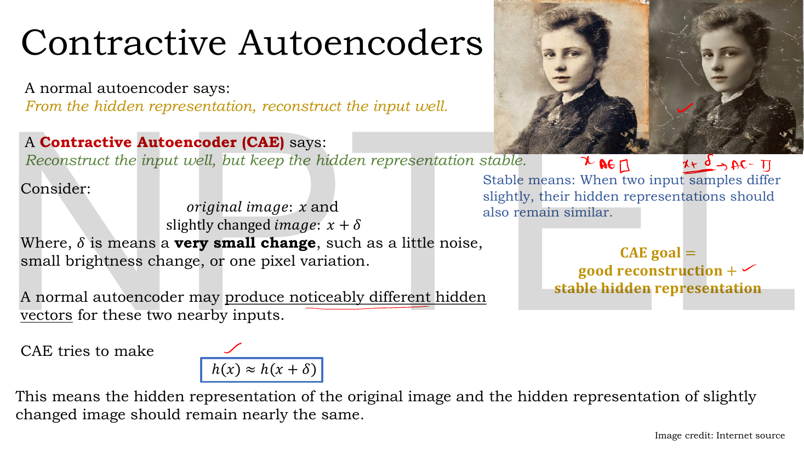
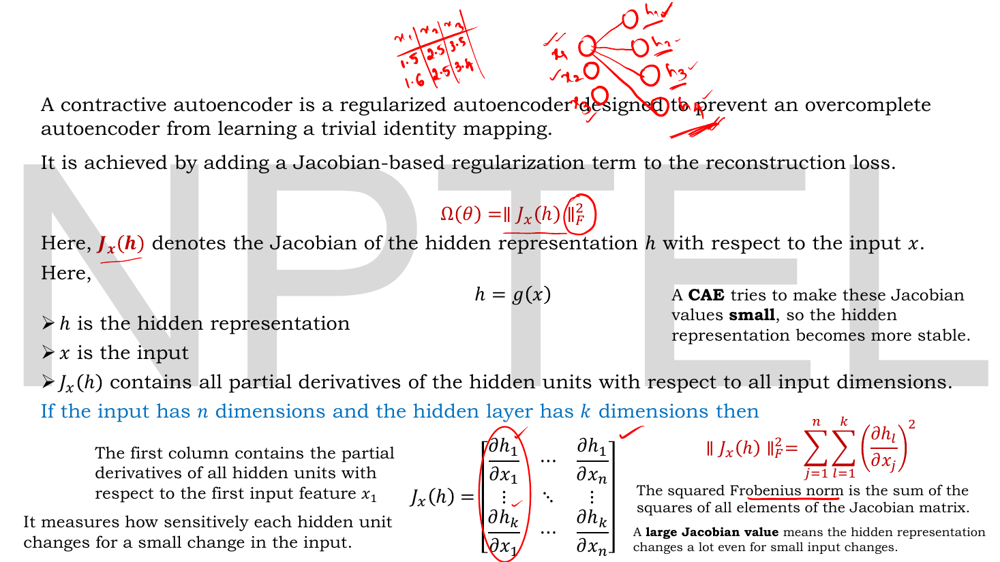
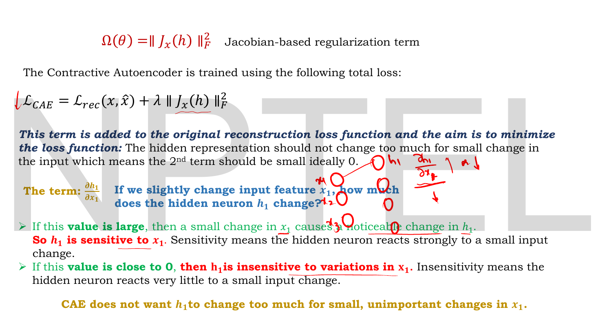
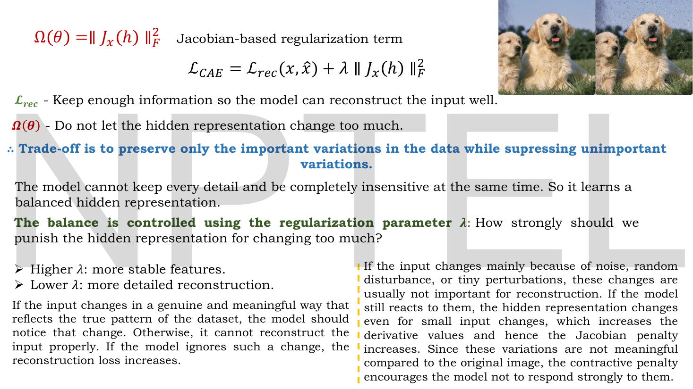

# Lec 15 — Contractive Autoencoders

> **Source:** `Lec 15.pdf` (8 pages) · **Week 2** · **Playlist:** Lec 15
> **Prereqs:** [Lec 10 — Introduction to Autoencoders](10-autoencoder-intro.md), [Lec 11 — Reconstruction Loss (MSE, BCE)](11-reconstruction-loss.md), [Lec 13 — Denoising Autoencoders](13-denoising-ae.md), [Lec 14 — Sparse Autoencoders](14-sparse-ae.md)
> **Feeds into:** [Lec 16 — Numerical Example, Limitations of AE](16-ae-numerical-and-limits.md), [Lec 28 — Latent Space Interpolation](28-latent-interpolation.md)

## Why this lecture exists

[Lec 13](13-denoising-ae.md) made the code robust by showing the network damaged inputs. That works, but it is indirect: you hope that training on noisy copies teaches the encoder to ignore noise. The contractive autoencoder asks for the same thing directly. Instead of corrupting the data and letting the loss sort it out, it writes "be insensitive to small input changes" as an explicit, differentiable term in the objective.

The term is built from the **Jacobian** — the full table of partial derivatives of every hidden unit with respect to every input feature. A large entry means a hidden unit twitches when one input nudges; penalising the sum of the squares of all those entries forces the encoder to flatten out. The result is a code that *contracts* a neighbourhood of inputs to nearly a single point, which is where the name comes from. This is the last of Week 2's three regularisers, so it also carries the table that tells them apart.

## The ideas

### The goal: nearby inputs, nearby codes


*Fig. — The whole motivation in a boxed line: $h(\mathbf{x}) \approx h(\mathbf{x}+\boldsymbol{\delta})$. The gold text on the right states the two-part goal — good reconstruction **and** a stable hidden representation. Notice the "CAE goal =" line uses a plus sign; the two demands pull against each other, which is the subject of the last slide. Page 3.*

Take an input $\mathbf{x}$ and a slightly changed version $\mathbf{x} + \boldsymbol{\delta}$, where $\boldsymbol{\delta}$ is, in the deck's words, "a **very small change**, such as a little noise, small brightness change, or one pixel variation."

A plain autoencoder makes no promises about these two. The deck's observation: it "may produce noticeably different hidden vectors for these two nearby inputs." Nothing in the reconstruction loss forbids a wildly jumpy encoder — if the decoder can undo the jumpiness, the loss is happy.

A **contractive autoencoder (CAE)** adds the missing requirement:

$$\mathbf{h}(\mathbf{x}) \approx \mathbf{h}(\mathbf{x}+\boldsymbol{\delta})$$

*"Stable means: when two input samples differ slightly, their hidden representations should also remain similar."* So the goal is **good reconstruction + stable hidden representation**.

Why would you want that? Because a representation that moves a lot for a meaningless input change is encoding the meaningless change. Stability is a way of saying "the code should depend on what the image *is*, not on the exact value of pixel 417".

### The Jacobian, defined from scratch


*Fig. — The matrix in the middle is the Jacobian. Read it as the lecturer's red annotation does: the **first column** holds the partial derivatives of *all* hidden units with respect to the *first* input feature, and there are $n$ such columns. Right: the squared Frobenius norm is just "square every entry and add them up". Page 4.*

You have not met a Jacobian in this course, so build it concretely.

**One partial derivative.** $\dfrac{\partial h_1}{\partial x_1}$ answers one question, and the deck poses it exactly: *"If we slightly change input feature $x_1$, how much does the hidden neuron $h_1$ change?"* It is a single number, computed at the current input and the current weights. Large means sensitive; near zero means insensitive.

**Many partial derivatives.** There are $k$ hidden units and $n$ input features, so there are $kn$ such questions. Collect every answer into one table and you have the **Jacobian** $\mathbf{J}_\mathbf{x}(\mathbf{h})$ — a $k\times n$ matrix:

$$\mathbf{J}_\mathbf{x}(\mathbf{h}) = \begin{bmatrix}
\dfrac{\partial h_1}{\partial x_1} & \cdots & \dfrac{\partial h_1}{\partial x_n} \\[8pt]
\vdots & \ddots & \vdots \\[8pt]
\dfrac{\partial h_k}{\partial x_1} & \cdots & \dfrac{\partial h_k}{\partial x_n}
\end{bmatrix}$$

Row $l$ is "how hidden unit $l$ responds to each input feature in turn". Column $j$ is "how all hidden units respond to input feature $j$" — the deck's own reading. In the deck's phrase, $\mathbf{J}_\mathbf{x}(\mathbf{h})$ *"contains all partial derivatives of the hidden units with respect to all input dimensions"* and *"measures how sensitively each hidden unit changes for a small change in the input."*

Two things to hold on to:

- The Jacobian is **not** a property of the model alone. It is evaluated at a particular input $\mathbf{x}$, and it changes as you move around the input space (unless the encoder is linear).
- Its shape is **$k \times n$** — hidden dimension by input dimension — because $\mathbf{h} = g(\mathbf{x})$ maps $\mathbb{R}^n \to \mathbb{R}^k$. For MNIST with $n=784$ and $k=64$ that is 50,176 numbers *per input sample*.

**The one-line reason the Jacobian is the right object.** For a small $\boldsymbol{\delta}$, the first-order Taylor expansion says

$$\mathbf{h}(\mathbf{x}+\boldsymbol{\delta}) - \mathbf{h}(\mathbf{x}) \approx \mathbf{J}_\mathbf{x}(\mathbf{h})\,\boldsymbol{\delta}$$

so "the code barely moves when the input barely moves" *is* "the Jacobian is small". The deck does not write this expansion, but it is why the goal on page 3 and the penalty on page 4 are the same statement. (You need no matrix calculus to use it: it says the code's displacement is the Jacobian times the input's displacement, exactly as a gradient times a step size gives a function's change in one dimension.)

### The Frobenius norm and the penalty

The **Frobenius norm** of a matrix is the straightforward generalisation of vector length: flatten the matrix into one long list of numbers and take the usual Euclidean norm. Squared, it is just the sum of the squares of all entries — "the sum of the squares of all elements of the Jacobian matrix", as the deck says. The subscript $F$ distinguishes it from other matrix norms.

$$\Omega(\theta) = \lVert \mathbf{J}_\mathbf{x}(\mathbf{h}) \rVert_F^2 = \sum_{j=1}^{n}\sum_{l=1}^{k}\left(\frac{\partial h_l}{\partial x_j}\right)^2$$

Every entry is squared, so every entry contributes positively — a large *negative* sensitivity is penalised just as hard as a large positive one, and no two entries can cancel. $\Omega(\theta) = 0$ would mean the code does not depend on the input at all.

The deck's summary: *"A CAE tries to make these Jacobian values **small**, so the hidden representation becomes more stable,"* and *"A **large Jacobian value** means the hidden representation changes a lot even for small input changes."*

### The CAE loss


*Fig. — The objective, plus the sentence that makes the penalty intuitive: "The hidden representation should not change too much for small change in the input which means the **2nd term should be small, ideally 0**." The green/red contrast below reads as a definition of sensitivity: large derivative = sensitive, near zero = insensitive. Page 5.*

$$\mathcal{L}_{\text{CAE}} = \mathcal{L}_{\text{rec}}(\mathbf{x},\hat{\mathbf{x}}) + \lambda\lVert \mathbf{J}_\mathbf{x}(\mathbf{h}) \rVert_F^2$$

Same shape as every regularised objective this week: reconstruction plus a weighted penalty. $\mathcal{L}_{\text{rec}}$ is unchanged from [Lec 11](11-reconstruction-loss.md) — MSE or BCE by data type. $\lambda$ is the regularisation strength.

The deck spells out the per-derivative reading, and it is worth keeping because it is how an exam will phrase it:

| $\partial h_1/\partial x_1$ | Meaning | Deck's wording |
|---|---|---|
| **large** | small change in $x_1$ causes a noticeable change in $h_1$ | "$h_1$ is **sensitive** to $x_1$" |
| **close to 0** | $h_1$ barely reacts to a small change in $x_1$ | "$h_1$ is **insensitive** to variations in $x_1$" |

And the slogan: *"CAE does not want $h_1$ to change too much for small, unimportant changes in $x_1$."*

### What the penalty buys, and what it costs


*Fig. — The two terms read as two instructions that contradict each other, and the blue line resolving them. The photograph pair at the top is the point in pictures: the right-hand dog image is the left one plus noise, and a CAE should map both to nearly the same code. Page 6.*

The two terms are pulling in opposite directions, and the deck says so plainly:

- $\mathcal{L}_{\text{rec}}$ — *"Keep enough information so the model can reconstruct the input well."*
- $\Omega(\theta)$ — *"Do not let the hidden representation change too much."*

Taken alone, the second is minimised by a constant encoder — ignore the input entirely, $\mathbf{J} = \mathbf{0}$, penalty zero, and reconstruction is hopeless. Taken alone, the first encourages a maximally reactive encoder. *"The model cannot keep every detail and be completely insensitive at the same time. So it learns a balanced hidden representation."*

The resolution, which is the lecture's headline claim:

> **Trade-off: preserve only the important variations in the data while suppressing unimportant variations.**

What makes a variation "important"? The deck's answer is operational rather than philosophical, and it is a nice piece of reasoning:

- *If the input changes in a genuine, meaningful way that reflects the true pattern of the dataset*, the model must notice — otherwise it cannot reconstruct properly, and **the reconstruction loss increases**. So $\mathcal{L}_{\text{rec}}$ protects the directions that matter.
- *If the input changes because of noise, random disturbance, or tiny perturbations*, reacting is pointless; the derivatives grow and **the Jacobian penalty increases**. So $\Omega(\theta)$ suppresses the directions that do not matter.

Importance is therefore decided by which of the two terms complains louder. The directions the encoder stays responsive to are the ones along which the data genuinely varies — in effect, the local structure of the data manifold.

$\lambda$ sets where the line falls:

| $\lambda$ | Effect (deck's wording) |
|---|---|
| **higher** | more stable features |
| **lower** | more detailed reconstruction |

with the obvious limits: $\lambda = 0$ gives a plain autoencoder, and $\lambda \to \infty$ gives a constant encoder that reconstructs nothing.

<a id="the-three-regularisers-side-by-side"></a>

### The three regularisers side by side

This is the week's single most examinable discrimination, and the three lectures are deliberately parallel so that only one thing differs in each. **The thing that differs is what gets penalised or perturbed.**

| | **Denoising** ([Lec 13](13-denoising-ae.md)) | **Sparse** ([Lec 14](14-sparse-ae.md)) | **Contractive** (Lec 15) |
|---|---|---|---|
| **What is acted on** | the **input** $\mathbf{x}$ | the **hidden activations** $\mathbf{h}$ | the **Jacobian** $\partial\mathbf{h}/\partial\mathbf{x}$ |
| **How** | corrupt it: $\mathbf{x}\to\tilde{\mathbf{x}}$ | penalise each neuron's average $\hat\rho_j$ | penalise the squared Frobenius norm |
| **Penalty term** | **none** — loss is unchanged | $\beta\sum_{j}D_{\mathrm{KL}}(\rho\,\|\,\hat\rho_j)$ | $\lambda\lVert\mathbf{J}_\mathbf{x}(\mathbf{h})\rVert_F^2$ |
| **Objective** | $\mathcal{L}(\mathbf{x},\hat{\mathbf{x}})$, input $=\tilde{\mathbf{x}}$ | $\mathcal{L}(\mathbf{x},\hat{\mathbf{x}}) + \beta\sum_j D_{\mathrm{KL}}$ | $\mathcal{L}(\mathbf{x},\hat{\mathbf{x}}) + \lambda\lVert\mathbf{J}\rVert_F^2$ |
| **Hyperparameters** | $q$ or $\sigma^2$ (corruption level) | $\rho$ (target rate), $\beta$ (weight) | $\lambda$ (weight) |
| **Where the regularisation lives** | the **data pipeline** | the **loss function** | the **loss function** |
| **It buys** | robustness to noise; features that use context | few, specific, interpretable features | insensitivity to small input perturbations |
| **Sensitivity is reduced…** | implicitly, by example | not directly targeted | **explicitly**, by derivative |
| **One-line test** | "Is the input being damaged?" | "Is an activation average being compared to a target?" | "Are derivatives being squared and summed?" |

**And a fourth thing that is none of these.** [Lec 11](11-reconstruction-loss.md)'s $\lambda\lVert\mathbf{W}\rVert^2$ penalises the **weight matrix** — ordinary weight decay. It is not denoising, not sparse, and not contractive. All four look alike on the page; they act on four different objects: the input, the activations, the derivatives, and the weights.

**Denoising vs contractive is the harder half of the discrimination**, because they aim at the same thing. The difference is *how*: denoising achieves insensitivity **stochastically and implicitly** (show the model noisy inputs and let training discover that reacting to noise is unprofitable); contractive achieves it **deterministically and explicitly** (write the derivative into the loss and differentiate it). Denoising's robustness also covers the decoder and is averaged over the corruption distribution; contractive's applies to the encoder alone and holds exactly at each training point.

## Worked numericals

**The slides contain no numerical worked examples at all** — this deck is entirely conceptual, which is unusual for this lecturer and is the one thing the ownership map did not anticipate. The nearest thing is the lecturer's handwritten scrap at the top of page 4, a tiny table of values $1.5, 2.5, 3.5 / 1.6, 2.5, 3.4$ sketched beside a small network, evidently drawn live to illustrate that two nearby inputs should give nearby hidden vectors; it is not developed into arithmetic. Every numerical below is therefore mine, built from the deck's definitions, with N4 formalising that handwritten sketch.

### N1. The Jacobian of a linear encoder

**Given:** a linear encoder $\mathbf{h} = \mathbf{W}_e\mathbf{x}$ with
$$\mathbf{W}_e = \begin{bmatrix}1 & 2 \\ 0 & -3\end{bmatrix}, \qquad n = 2,\ k = 2$$
**Find:** $\mathbf{J}_\mathbf{x}(\mathbf{h})$ and $\lVert\mathbf{J}_\mathbf{x}(\mathbf{h})\rVert_F^2$.

1. Write out the hidden units: $h_1 = 1x_1 + 2x_2$ and $h_2 = 0x_1 - 3x_2$.
2. Differentiate each with respect to each input:
   - $\partial h_1/\partial x_1 = 1$, $\ \partial h_1/\partial x_2 = 2$
   - $\partial h_2/\partial x_1 = 0$, $\ \partial h_2/\partial x_2 = -3$
3. Assemble: $\mathbf{J}_\mathbf{x}(\mathbf{h}) = \begin{bmatrix}1 & 2\\0&-3\end{bmatrix} = \mathbf{W}_e$.
4. Square every entry and sum: $1^2 + 2^2 + 0^2 + (-3)^2 = 1 + 4 + 0 + 9$.

**Answer:** $\mathbf{J}_\mathbf{x}(\mathbf{h}) = \mathbf{W}_e$ and $\lVert\mathbf{J}\rVert_F^2 = \mathbf{14}$.

Two lessons. **For a linear encoder the Jacobian *is* the weight matrix**, so the contractive penalty degenerates into ordinary weight decay $\lambda\lVert\mathbf{W}_e\rVert^2$ — the very thing [Lec 11](11-reconstruction-loss.md) already had. The contractive autoencoder is only a *new* idea because the encoder is non-linear. And note the Jacobian here does not depend on $\mathbf{x}$ at all; with a non-linear $g$ it will.

### N2. The Jacobian of a sigmoid encoder

**Given:** $\mathbf{h} = \sigma(\mathbf{W}_e\mathbf{x} + \mathbf{b})$ with $n=3$, $k=2$,
$$\mathbf{W}_e = \begin{bmatrix}0.5 & -1.0 & 0.2 \\ 1.5 & 0.0 & -0.5\end{bmatrix}, \quad \mathbf{b} = \begin{bmatrix}0.1\\-0.2\end{bmatrix}, \quad \mathbf{x} = \begin{bmatrix}1.0\\2.0\\-1.0\end{bmatrix}$$
**Find:** $\mathbf{h}$, $\mathbf{J}_\mathbf{x}(\mathbf{h})$ and $\lVert\mathbf{J}\rVert_F^2$.

1. Pre-activations: $a_1 = 0.5(1) + (-1.0)(2) + 0.2(-1) + 0.1 = 0.5 - 2.0 - 0.2 + 0.1 = -1.6$; $\ a_2 = 1.5(1) + 0 + (-0.5)(-1) - 0.2 = 1.5 + 0.5 - 0.2 = 1.8$.
2. Activations: $h_1 = \sigma(-1.6) = 0.167982$, $h_2 = \sigma(1.8) = 0.858149$.
3. The chain rule, with $\sigma'(a) = \sigma(a)(1-\sigma(a))$, gives the entry formula
$$\frac{\partial h_l}{\partial x_j} = h_l(1-h_l)\,W_{lj}$$
   so each **row** of $\mathbf{W}_e$ is scaled by that unit's $h_l(1-h_l)$.
4. Scale factors: $h_1(1-h_1) = 0.167982 \times 0.832018 = 0.139764$; $\ h_2(1-h_2) = 0.858149\times0.141851 = 0.121729$.
5. Jacobian:
$$\mathbf{J}_\mathbf{x}(\mathbf{h}) = \begin{bmatrix}0.139764(0.5) & 0.139764(-1.0) & 0.139764(0.2)\\ 0.121729(1.5) & 0.121729(0) & 0.121729(-0.5)\end{bmatrix} = \begin{bmatrix}0.069882 & -0.139764 & 0.027953\\ 0.182594 & 0 & -0.060865\end{bmatrix}$$
6. Squared Frobenius norm — square all six entries and add:
   - row 1: $0.069882^2 + 0.139764^2 + 0.027953^2 = 0.004883 + 0.019534 + 0.000781 = 0.025199$
   - row 2: $0.182594^2 + 0 + 0.060865^2 = 0.033341 + 0.003705 = 0.037045$

**Answer:** $\mathbf{h} = [0.1680,\ 0.8581]^\top$ and $\lVert\mathbf{J}_\mathbf{x}(\mathbf{h})\rVert_F^2 = 0.025199 + 0.037045 = \mathbf{0.062244}$.

A useful shortcut falls out of step 3: $\lVert\mathbf{J}\rVert_F^2 = \sum_l [h_l(1-h_l)]^2 \sum_j W_{lj}^2$. Check it: $0.139764^2(1.29) + 0.121729^2(2.50) = 0.019534(1.29) + 0.014818(2.50) = 0.025199 + 0.037045 = 0.062244$. ✓ Same number, far less arithmetic — and it makes the mechanism visible: because $h(1-h)\leq 0.25$ always, driving activations toward saturation (near 0 or 1) shrinks the penalty automatically. **A contractive penalty pushes sigmoid units into saturation, which is itself a kind of sparsity** — the two regularisers of Lec 14 and Lec 15 are not as independent as the parallel structure suggests.

### N3. The complete CAE objective

**Given:** the encoder of N2, a reconstruction loss $\mathcal{L}_{\text{rec}} = 0.3$, and $\lambda = 0.5$.
**Find:** $\mathcal{L}_{\text{CAE}}$, and the same at $\lambda = 5$.

1. Penalty at $\lambda = 0.5$: $0.5 \times 0.062244 = 0.031122$.
2. Total: $\mathcal{L}_{\text{CAE}} = 0.3 + 0.031122 = 0.331122$; the penalty is $0.031122/0.331122 = 9.4\%$ of the objective.
3. Penalty at $\lambda = 5$: $5 \times 0.062244 = 0.311220$.
4. Total: $0.3 + 0.311220 = 0.611220$; the penalty is now $50.9\%$.

**Answer:** $\mathcal{L}_{\text{CAE}} = \mathbf{0.3311}$ at $\lambda = 0.5$ and $\mathbf{0.6112}$ at $\lambda = 5$. At the higher $\lambda$ the optimiser is spending half its effort flattening the encoder, which is the deck's "higher $\lambda$: more stable features, lower $\lambda$: more detailed reconstruction" turned into a number you can watch while training.

### N4. How far does the code actually move? (formalising the lecturer's page-4 sketch)

**Given:** the encoder of N2 and a small input perturbation $\boldsymbol{\delta} = [0.01,\ -0.01,\ 0.01]^\top$.
**Find:** the predicted code displacement $\mathbf{J}\boldsymbol{\delta}$, and the true one $\mathbf{h}(\mathbf{x}+\boldsymbol{\delta}) - \mathbf{h}(\mathbf{x})$.

1. First component: $0.069882(0.01) + (-0.139764)(-0.01) + 0.027953(0.01) = 0.00069882 + 0.00139764 + 0.00027953 = 0.0023760$.
2. Second component: $0.182594(0.01) + 0(-0.01) + (-0.060865)(0.01) = 0.00182594 - 0.00060865 = 0.0012173$.
3. Magnitude: $\lVert\mathbf{J}\boldsymbol{\delta}\rVert = \sqrt{0.0023760^2 + 0.0012173^2} = \sqrt{5.645\times10^{-6} + 1.482\times10^{-6}} = \sqrt{7.127\times10^{-6}} = 0.0026697$.
4. Recomputing the encoder exactly at $\mathbf{x}+\boldsymbol{\delta}$ gives a true displacement of magnitude $0.0026800$.

**Answer:** predicted $\mathbf{0.002670}$, actual $\mathbf{0.002680}$ — agreeing to better than 0.4%, which is the Taylor approximation doing its job for a small $\boldsymbol{\delta}$. The input moved by $\lVert\boldsymbol{\delta}\rVert = 0.01732$ and the code moved by $0.00268$: a **contraction factor of about 0.155**. That number is what "contractive" means, and it is exactly what $\lambda$ controls.

### N5. Counting the Jacobian

**Given:** an MNIST autoencoder with $n = 784$ input pixels and $k = 64$ hidden units.
**Find:** the Jacobian's shape, its number of entries, and how many entries the penalty sums over for a batch of 128.

1. $\mathbf{h}$ maps $\mathbb{R}^{784}\to\mathbb{R}^{64}$, so $\mathbf{J}_\mathbf{x}(\mathbf{h})$ is $k\times n = 64\times784$.
2. Entries: $64 \times 784 = 50{,}176$ per input sample.
3. Over a batch of 128 samples, each needing its own Jacobian: $128 \times 50{,}176 = 6{,}422{,}528$ partial derivatives per forward pass.

**Answer:** $\mathbf{64\times784}$, $\mathbf{50{,}176}$ entries per sample, $\mathbf{6{,}422{,}528}$ per batch of 128. This is the practical objection to contractive autoencoders and the reason denoising is far more commonly used: the penalty is expensive. (For a one-hidden-layer sigmoid encoder the shortcut in N2 reduces this to $k$ scalars times $k$ precomputed row norms — which is exactly why the method is usually presented for a single layer.)

### N6. Which encoder is more contractive?

**Given:** two trained encoders evaluated at the same input, with Jacobians
$$\mathbf{J}_A = \begin{bmatrix}0.3 & -0.4\\0.1 & 0.2\end{bmatrix}, \qquad \mathbf{J}_B = \begin{bmatrix}0.5 & 0\\0 & 0.1\end{bmatrix}$$
**Find:** both penalties, and which encoder a CAE prefers.

1. $\lVert\mathbf{J}_A\rVert_F^2 = 0.09 + 0.16 + 0.01 + 0.04 = 0.30$.
2. $\lVert\mathbf{J}_B\rVert_F^2 = 0.25 + 0 + 0 + 0.01 = 0.26$.

**Answer:** $A$ pays $\mathbf{0.30}$, $B$ pays $\mathbf{0.26}$, so the CAE prefers **$B$**. Note what that preference ignores: $B$ has the single largest entry of the two matrices ($0.5$ against $A$'s $0.4$), so $B$ is in fact *more* sensitive than $A$ along one particular direction. The Frobenius norm is a total, not a maximum — it will happily accept one very responsive direction in exchange for several dead ones. That is not a bug; it is the "preserve important variations, suppress unimportant ones" trade-off showing up in the arithmetic.

## Code

The deck never shows a Jacobian computed, so here is one, both from the chain rule and numerically, with the agreement checked.

```python
import numpy as np

# A sigmoid encoder with n = 3 inputs and k = 2 hidden units
W = np.array([[ 0.5, -1.0,  0.2],      # row l = weights INTO hidden unit l
              [ 1.5,  0.0, -0.5]])
b = np.array([0.1, -0.2])
x = np.array([1.0, 2.0, -1.0])

sig  = lambda a: 1/(1+np.exp(-a))
enc  = lambda x: sig(W @ x + b)

h = enc(x)
print("h =", np.round(h, 6))

# --- Jacobian, closed form.  h_l = sigma(sum_j W_lj x_j + b_l)
#     dh_l/dx_j = h_l(1-h_l) * W_lj      ->   J = diag(h(1-h)) @ W
J = (h*(1-h))[:, None] * W
print("J (k x n) =\n", np.round(J, 6))

# --- Jacobian, numerically, to prove the formula
eps = 1e-6
Jn = np.column_stack([(enc(x + eps*np.eye(3)[j]) - enc(x - eps*np.eye(3)[j]))/(2*eps)
                      for j in range(3)])
print("max |closed form - numerical| =", f"{np.abs(J-Jn).max():.2e}")

# --- the penalty itself: squared Frobenius norm = sum of squares of ALL entries
print("||J||_F^2 =", round(float((J**2).sum()), 6))
print("same via trace(J J^T) =", round(float(np.trace(J @ J.T)), 6))

# --- what the penalty buys: how far does h move for a small input nudge?
d = np.array([0.01, -0.01, 0.01])
print("||h(x+d) - h(x)|| =", round(float(np.linalg.norm(enc(x+d)-h)), 6),
      " approx ||J d|| =", round(float(np.linalg.norm(J @ d)), 6))
```

```
h = [0.167982 0.858149]
J (k x n) =
 [[ 0.069882 -0.139764  0.027953]
 [ 0.182594  0.       -0.060865]]
max |closed form - numerical| = 6.18e-11
||J||_F^2 = 0.062244
same via trace(J J^T) = 0.062244
||h(x+d) - h(x)|| = 0.00268  approx ||J d|| = 0.00267
```

Three readings. The closed form and the finite-difference estimate agree to $6\times10^{-11}$, so `J = (h*(1-h))[:, None] * W` really is the Jacobian — one line, no autograd needed, for a one-layer sigmoid encoder. $\lVert\mathbf{J}\rVert_F^2$ and $\text{tr}(\mathbf{J}\mathbf{J}^\top)$ give the same 0.062244, which is a definition worth knowing: the squared Frobenius norm *is* the trace of $\mathbf{J}\mathbf{J}^\top$. And the last line is N4: a code displacement of 0.00268 for an input displacement of 0.01732, predicted to three decimals by the Jacobian.

## Exam pack

### Must-memorise

| Item | Exactly this |
|---|---|
| CAE goal | $\mathbf{h}(\mathbf{x}) \approx \mathbf{h}(\mathbf{x}+\boldsymbol{\delta})$ for small $\boldsymbol{\delta}$ |
| Regularisation term | $\Omega(\theta) = \lVert \mathbf{J}_\mathbf{x}(\mathbf{h}) \rVert_F^2$ |
| Full loss | $\mathcal{L}_{\text{CAE}} = \mathcal{L}_{\text{rec}}(\mathbf{x},\hat{\mathbf{x}}) + \lambda\lVert \mathbf{J}_\mathbf{x}(\mathbf{h}) \rVert_F^2$ |
| Squared Frobenius norm | $\displaystyle\lVert\mathbf{J}_\mathbf{x}(\mathbf{h})\rVert_F^2 = \sum_{j=1}^{n}\sum_{l=1}^{k}\left(\frac{\partial h_l}{\partial x_j}\right)^2$ |
| Jacobian shape | $k\times n$ — hidden dimension $\times$ input dimension |
| A Jacobian entry | $\partial h_l/\partial x_j$: how much hidden unit $l$ moves when input feature $j$ moves |
| Column $j$ of $\mathbf{J}$ | all hidden units' sensitivity to input feature $x_j$ |
| Large entry | $h_l$ is **sensitive** to $x_j$ |
| Entry near 0 | $h_l$ is **insensitive** to $x_j$ |
| The trade-off | preserve important variations, suppress unimportant ones |
| $\lambda$ | higher → more stable features; lower → more detailed reconstruction |
| Sigmoid-encoder Jacobian | $\partial h_l/\partial x_j = h_l(1-h_l)W_{lj}$ |
| Linear-encoder Jacobian | $\mathbf{J} = \mathbf{W}_e$ (so the penalty becomes weight decay) |
| vs the other two | corrupt **input** (denoising) · penalise **activations** (sparse) · penalise **Jacobian** (contractive) |

### Numbers worth knowing

| Quantity | Value |
|---|---|
| Jacobian entries for $n$ inputs, $k$ hidden units | $kn$, per input sample |
| MNIST example, $n=784$, $k=64$ | $64\times784 = 50{,}176$ entries |
| $\Omega(\theta)$ when the encoder is constant | $0$ (and the model is useless) |
| $\Omega(\theta)$ when the encoder is the identity, $n=k$ | $n$ (the identity matrix has $n$ ones) |
| Max of $h(1-h)$ for a sigmoid unit | $0.25$, at $h = 0.5$ |
| N2's worked $\lVert\mathbf{J}\rVert_F^2$ | $0.062244$ |
| N1's linear $\lVert\mathbf{J}\rVert_F^2$ | $14$ |
| N4's contraction factor | $0.00268/0.01732 \approx 0.155$ |
| $\lVert\mathbf{J}\rVert_F^2$ in trace form | $\text{tr}(\mathbf{J}\mathbf{J}^\top)$ |
| Number of regularisers in Week 2 | **three** (plus weight decay, which is not one of them) |

### Likely MCQ traps

- **Confusing the three week-2 regularisers.** Denoising corrupts the **input**; sparse penalises the **activations**; contractive penalises the **Jacobian**. [The table above](#the-three-regularisers-side-by-side) is the thing to have memorised walking in.
- **"The contractive penalty is on the weights."** It is on the **derivatives of the hidden layer with respect to the input**. The resemblance to weight decay is real but conditional: they coincide *only* if the encoder is linear (N1). With a non-linear encoder the Jacobian depends on $\mathbf{x}$ and weight decay does not.
- **Getting the Jacobian's shape backwards.** It is $k\times n$, not $n\times k$: one row per hidden unit, one column per input feature. The deck's figure labels the **first column** as "the partial derivatives of all hidden units with respect to the first input feature $x_1$".
- **"Frobenius norm" vs "squared Frobenius norm".** The penalty uses the **squared** norm $\lVert\cdot\rVert_F^2$ — the plain sum of squares, with no square root. An option offering $\sqrt{\sum\sum(\partial h_l/\partial x_j)^2}$ is the unsquared norm.
- **Thinking a smaller Jacobian is always better.** $\Omega(\theta) = 0$ means the code ignores the input entirely. The point is the *balance* against $\mathcal{L}_{\text{rec}}$, which is why $\lambda$ exists.
- **Reading $\lambda$ backwards.** Higher $\lambda$ → **more stable, less detailed**. Lower $\lambda$ → **more detailed, less stable**. The penalty is on instability, so paying more for it buys stability.
- **"Contractive and denoising are the same thing."** They have the same goal and different mechanisms: denoising is stochastic and implicit (corrupt the data), contractive is deterministic and explicit (penalise the derivative). Denoising also regularises the decoder; contractive touches only the encoder.
- **Assuming the Jacobian is fixed for the model.** It is evaluated **at a specific input** and generally differs from sample to sample, which is why the penalty must be recomputed on every forward pass.
- **"CAE works only on undercomplete autoencoders."** The deck's own first line on page 4 says the opposite: it is "designed to prevent an **overcomplete** autoencoder from learning a trivial identity mapping". Like the sparse autoencoder, it is built for the wide-hidden-layer case.
- **Forgetting that the identity encoder is maximally penalised.** If $\mathbf{h} = \mathbf{x}$ then $\mathbf{J} = \mathbf{I}$ and $\lVert\mathbf{J}\rVert_F^2 = n$ — a large, direct penalty. That is the cleanest explanation of *why* the penalty kills the trivial identity mapping, and it is a good short-answer question.

### Self-test

1. State the contractive autoencoder's full loss and define each symbol.
2. An encoder maps $\mathbb{R}^{100} \to \mathbb{R}^{30}$. Give the Jacobian's shape and the number of partial derivatives in it.
3. A linear encoder has $\mathbf{W}_e = \begin{bmatrix}2&0&1\\-1&3&0\end{bmatrix}$. Compute $\lVert\mathbf{J}_\mathbf{x}(\mathbf{h})\rVert_F^2$.
4. What does $\partial h_3/\partial x_7 = 0.002$ tell you about the model?
5. Why does the CAE loss need two terms rather than just the Jacobian penalty?
6. If $\mathbf{h} = \mathbf{x}$ exactly (an identity encoder with $n = 50$), what is the contractive penalty?
7. Name, for each of the three Week 2 regularisers, the object it acts on.
8. A sigmoid hidden unit has $h_l = 0.9$ and its row of $\mathbf{W}_e$ is $[1, -2]$. Compute that row's contribution to $\lVert\mathbf{J}\rVert_F^2$.
9. What happens to reconstruction quality as $\lambda$ increases, and why?
10. Denoising and contractive autoencoders both aim at insensitivity to small input changes. State the mechanical difference in one sentence each.

<details><summary>Answers</summary>

1. $\mathcal{L}_{\text{CAE}} = \mathcal{L}_{\text{rec}}(\mathbf{x},\hat{\mathbf{x}}) + \lambda\lVert\mathbf{J}_\mathbf{x}(\mathbf{h})\rVert_F^2$, where $\mathcal{L}_{\text{rec}}$ is the ordinary reconstruction loss (MSE or BCE), $\mathbf{J}_\mathbf{x}(\mathbf{h})$ is the $k\times n$ matrix of partial derivatives $\partial h_l/\partial x_j$ evaluated at $\mathbf{x}$, $\lVert\cdot\rVert_F^2$ is the sum of squares of all its entries, and $\lambda$ weights stability against reconstruction detail.
2. $30\times100$; $3{,}000$ partial derivatives (per input sample).
3. The Jacobian equals $\mathbf{W}_e$, so $2^2 + 0^2 + 1^2 + (-1)^2 + 3^2 + 0^2 = 4+0+1+1+9+0 = \mathbf{15}$.
4. That hidden unit 3 is essentially **insensitive** to input feature 7 — changing $x_7$ slightly barely moves $h_3$. Its contribution to the penalty is $0.002^2 = 4\times10^{-6}$, i.e. negligible, which is exactly what the CAE wants.
5. Because the Jacobian penalty alone is minimised by a **constant encoder** ($\mathbf{J} = \mathbf{0}$, penalty 0), which ignores the input and cannot reconstruct anything. $\mathcal{L}_{\text{rec}}$ is what forces the encoder to stay responsive to the directions that actually matter.
6. $\mathbf{J} = \mathbf{I}_{50}$, which has fifty 1s and zeros elsewhere, so $\lVert\mathbf{J}\rVert_F^2 = \mathbf{50}$. A large penalty — this is why the contractive term blocks the trivial identity mapping.
7. **Denoising** → the **input** (corrupted before encoding). **Sparse** → the **hidden activations** (via $\hat\rho_j$). **Contractive** → the **Jacobian** $\partial\mathbf{h}/\partial\mathbf{x}$.
8. $h_l(1-h_l) = 0.9\times0.1 = 0.09$. The row of $\mathbf{J}$ is $[0.09(1),\ 0.09(-2)] = [0.09,\ -0.18]$, so its contribution is $0.09^2 + 0.18^2 = 0.0081 + 0.0324 = \mathbf{0.0405}$. (Shortcut: $0.09^2 \times (1^2+2^2) = 0.0081\times5 = 0.0405$.)
9. It **degrades**. A larger $\lambda$ buys more stability by flattening the encoder, so less input-specific information reaches the code and the decoder has less to work with. The deck's wording: higher $\lambda$ → more stable features; lower $\lambda$ → more detailed reconstruction.
10. **Denoising:** feed the encoder randomly corrupted inputs while scoring against the clean target, so insensitivity is learned implicitly, stochastically, averaged over the corruption distribution. **Contractive:** add the squared Frobenius norm of the Jacobian directly to the loss, so insensitivity is enforced explicitly, deterministically, at each training point.

</details>

## Beyond the slides

**Gap: the deck gives the penalty but never a single derivative, so a reader cannot compute $\Omega(\theta)$.**
**Why it matters:** this is the one thing an exam can ask numerically, and the deck leaves you unable to answer. For the standard one-hidden-layer sigmoid encoder the closed form is $\partial h_l/\partial x_j = h_l(1-h_l)W_{lj}$, giving $\lVert\mathbf{J}\rVert_F^2 = \sum_l [h_l(1-h_l)]^2\sum_j W_{lj}^2$ — a sum over $k$ terms, not $kn$. N2 and the Code section do this end to end; it is the most useful thing in this chapter that is not on a slide.

**Gap: no mention of how expensive the penalty is, or that this is why denoising won.**
**Why it matters:** an exact Jacobian costs $k$ backward passes per sample (one per hidden unit) in the general multi-layer case, which is why contractive autoencoders are presented only for a single hidden layer and are rare in practice. Denoising achieves a comparable effect at the cost of one extra random number per input. If a question asks "which regulariser is most computationally expensive?", the answer is contractive.

**Gap: the connection to the data manifold is implied but never named.**
**Why it matters:** the standard interpretation is that minimising $\lVert\mathbf{J}\rVert_F^2$ while keeping reconstruction accurate forces the encoder to be sensitive *only* in directions along which the data actually varies — tangent to the **data manifold** — and flat in every direction off it. The deck's "preserve only the important variations while suppressing unimportant variations" is exactly this statement in non-technical language, and the manifold phrasing is what you will meet in any textbook treatment.

**Gap: the relationship between contractive and denoising is never quantified.**
**Why it matters:** they are not merely analogous. Expanding the denoising objective for small Gaussian corruption of variance $\sigma^2$ gives, to second order, the ordinary reconstruction loss plus a term proportional to $\sigma^2\lVert\mathbf{J}\rVert_F^2$ — the contractive penalty, with $\lambda \approx \sigma^2$. **Denoising with small Gaussian noise is approximately a contractive autoencoder.** The difference is that denoising's Jacobian is that of the whole reconstruction $\hat{\mathbf{x}}(\mathbf{x})$, while the CAE's is that of the encoder alone. Knowing this makes the two lectures one idea with two implementations, and is a far stronger answer to "compare them" than either slide deck offers.

## Cut from the slides

This is an eight-page deck of which only four pages (3–6) carry content; pages 1, 2, 7 and 8 are the course title, the one-line agenda ("Regularization Techniques in AE: Contractive Autoencoders"), the next-session preview and the thank-you. The two stock photographs — the restored portrait on page 3 and the noisy-dog pair on page 6 — are referenced in captions rather than treated as content, since neither carries information the text does not. The lecturer's red handwriting is folded into the prose: the "$\mathbf{x} \to$ AE" and "$\mathbf{x}+\boldsymbol{\delta} \to$ AE" sketch on page 3, the circled first column of the Jacobian on page 4, the arrows on page 5 showing $\partial h_1/\partial x_1$ rising and falling, and the small numeric table at the top of page 4 (values $1.5, 2.5, 3.5$ above $1.6, 2.5, 3.4$) which is formalised as N4 rather than reproduced as a figure. The deck's $J_x(h)$ is written $\mathbf{J}_\mathbf{x}(\mathbf{h})$ here per the book's matrix convention; $\Omega(\theta)$ and $\lambda$ are kept as the deck writes them. Nothing on pages 3 through 6 has been dropped — the deck is conceptual and short, so the chapter adds the Jacobian definition, the closed form, and all six numericals rather than compressing anything.
