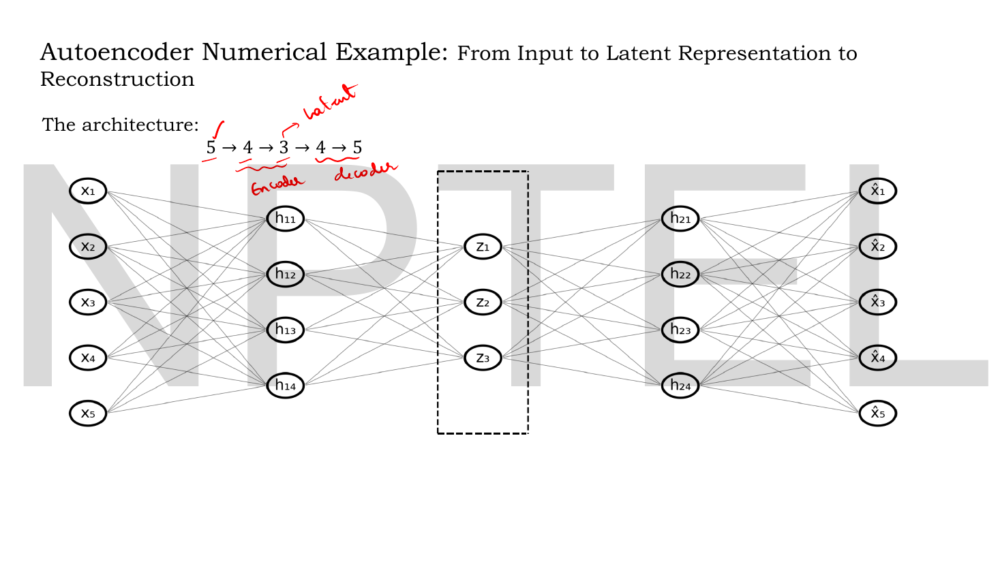
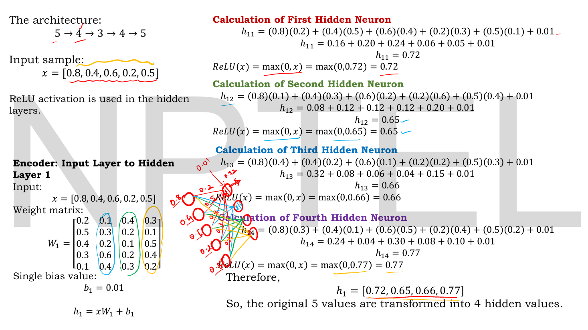
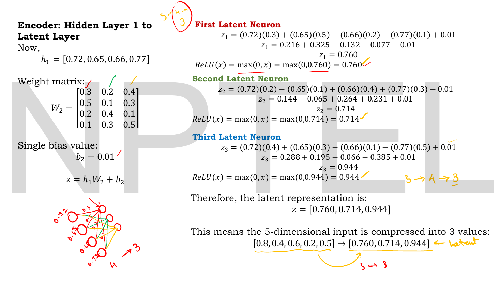
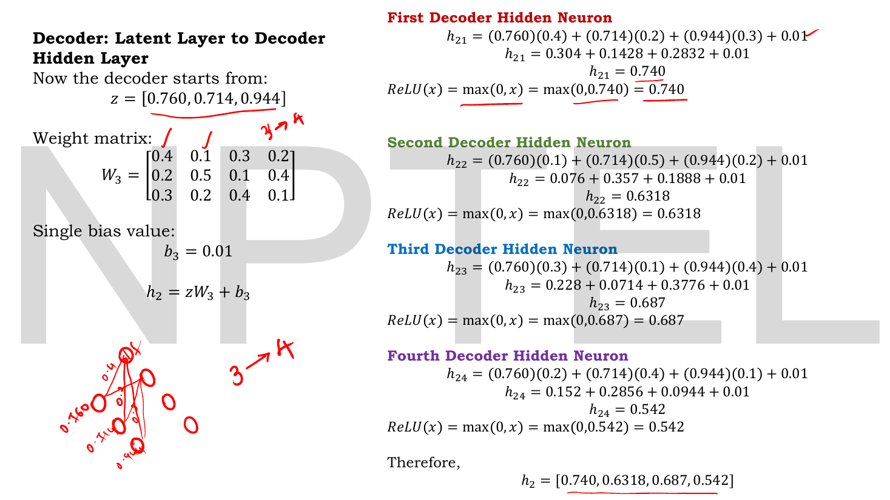
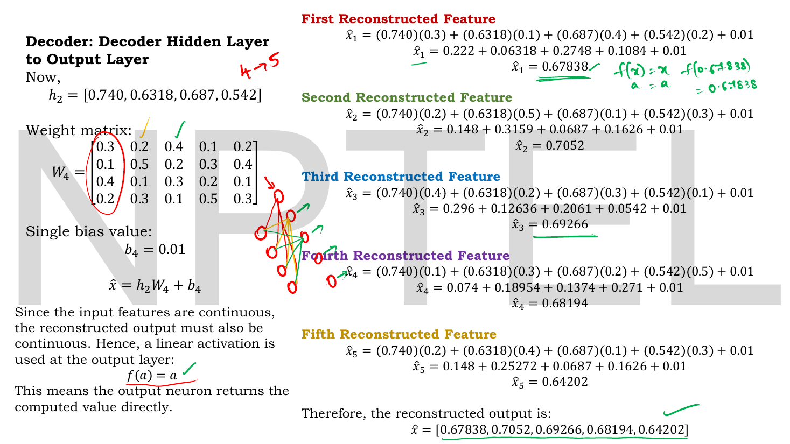
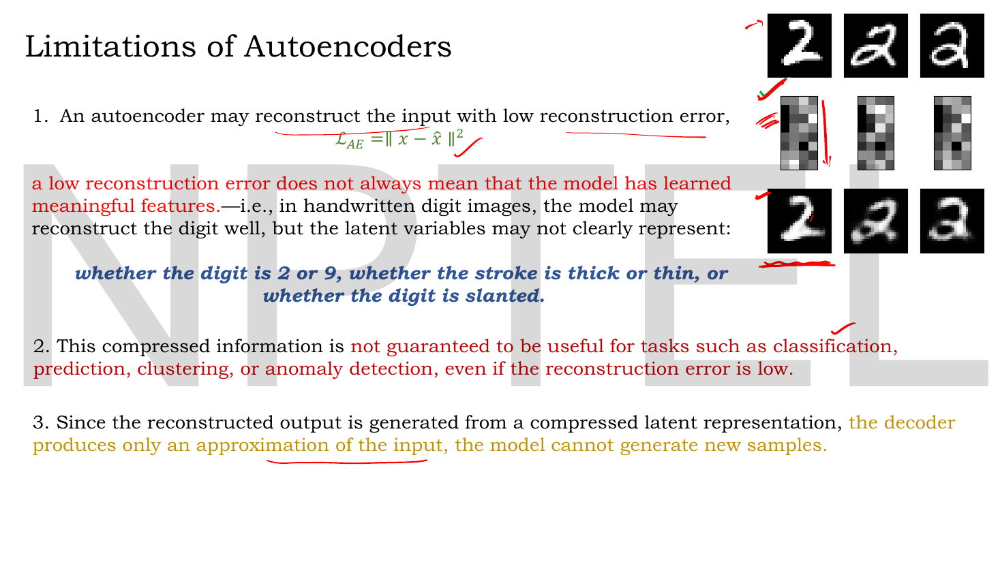
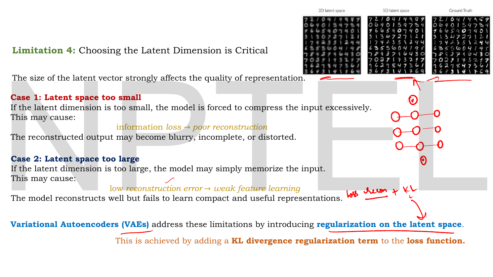

# Lec 16 — Numerical Example, Limitations of AE

> **Source:** `Lec 16.pdf` (12 pages) · **Week 2** · **Playlist:** Lec 16
> **Prereqs:** [Lec 10 — Introduction to Autoencoders](10-autoencoder-intro.md), [Lec 11 — Reconstruction Loss (MSE, BCE)](11-reconstruction-loss.md), [Lec 12 — Types of Autoencoders](12-autoencoder-types.md)
> **Feeds into:** [Lec 19 — KL Divergence Part A](19-kl-divergence-a.md), [Lec 21 — Introduction to VAE and the Encoder](21-vae-encoder.md), [Lec 26 — Disentanglement and β-VAE](26-beta-vae.md), [Lec 28 — Latent Space Interpolation](28-latent-interpolation.md)

## Why this lecture exists

Six lectures of autoencoder theory have given you matrices, losses and three regularisers, but you have never once watched a number travel from the input layer to the output layer. This lecture does nothing else: it takes one 5-dimensional vector, pushes it through a $5\to4\to3\to4\to5$ network by hand, and lands on a reconstruction error. Every multiplication is on the slide. If you can redo this page without the slide, you can answer any autoencoder numerical an exam can set.

Then the lecture turns and knocks the whole model down. A low reconstruction error does not mean the latent code is meaningful; the code is not guaranteed useful for any downstream task; and — the sentence the rest of the course is built on — **the model cannot generate new samples**. The four limitations on pages 9 and 10 are the reason Lec 19 through Lec 24 exist.

## The ideas

### The network, in full


*Fig. — The architecture for the whole lecture. Notice the dashed box around $z_1,z_2,z_3$: that bottleneck is the only place information is forced to narrow. The lecturer's red annotation splits the chain into **encoder** ($5\to4\to3$) and **decoder** ($3\to4\to5$). Page 3.*

The architecture is

$$5 \to 4 \to 3 \to 4 \to 5$$

Four weight matrices, four forward steps:

| Step | Equation | $\mathbf{W}$ shape | Activation |
|---|---|---|---|
| Input → hidden 1 | $\mathbf{h}_1 = \mathbf{x}\mathbf{W}^{(1)} + b_1$ | $5\times4$ | ReLU |
| Hidden 1 → latent | $\mathbf{z} = \mathbf{h}_1\mathbf{W}^{(2)} + b_2$ | $4\times3$ | ReLU |
| Latent → hidden 2 | $\mathbf{h}_2 = \mathbf{z}\mathbf{W}^{(3)} + b_3$ | $3\times4$ | ReLU |
| Hidden 2 → output | $\hat{\mathbf{x}} = \mathbf{h}_2\mathbf{W}^{(4)} + b_4$ | $4\times5$ | **linear** |

Three things to fix in memory before any arithmetic.

**The input is a row vector.** The deck writes $\mathbf{x}\mathbf{W}$, not $\mathbf{W}\mathbf{x}$. So $\mathbf{x}$ is $1\times5$, $\mathbf{W}^{(1)}$ is $5\times4$, and the product is $1\times4$. Column $j$ of $\mathbf{W}^{(1)}$ holds the five incoming weights of hidden neuron $j$. Read the weight matrices **column-wise**, not row-wise — getting this backwards is the single commonest way to fail this numerical.

**Every layer has one scalar bias, shared by all its neurons.** The deck writes "single bias value: $b_1 = 0.01$", and adds the same $0.01$ to all four hidden pre-activations. That is unusual — real networks give each neuron its own bias — but it is what this deck does and what an exam set from this deck will do.

**The output activation is linear, the hidden ones are ReLU.** The deck justifies the output choice explicitly: "since the input features are continuous, the reconstructed output must also be continuous. Hence, a linear activation is used at the output layer: $f(a) = a$." That is [Lec 11](11-reconstruction-loss.md)'s rule — data type picks the output activation, which picks the loss — and it is why the loss here is MSE and not BCE. The lecturer's own margin note on page 8 reads "linear → MSE, sigmoid → BCE".

### Encoder, first step


*Fig. — Follow one colour. The blue ring round column 2 of $\mathbf{W}^{(1)}$ is exactly the five numbers used in the blue "Second Hidden Neuron" block. Each hidden neuron reads one **column**. Page 4.*

$$\mathbf{x} = [0.8,\ 0.4,\ 0.6,\ 0.2,\ 0.5], \qquad
\mathbf{W}^{(1)} = \begin{bmatrix}
0.2 & 0.1 & 0.4 & 0.3\\
0.5 & 0.3 & 0.2 & 0.1\\
0.4 & 0.2 & 0.1 & 0.5\\
0.3 & 0.6 & 0.2 & 0.4\\
0.1 & 0.4 & 0.3 & 0.2
\end{bmatrix}, \qquad b_1 = 0.01$$

The arithmetic is N1. Result: $\mathbf{h}_1 = [0.72,\ 0.65,\ 0.66,\ 0.77]$. Every pre-activation is positive, so ReLU is the identity here and changes nothing — a point worth noticing, because it means this entire worked example never actually exercises the ReLU. It will matter on page 10 and in N8.

### Encoder, second step — the bottleneck


*Fig. — The compression actually happening: $[0.8, 0.4, 0.6, 0.2, 0.5] \to [0.760, 0.714, 0.944]$. Five numbers in, three out. The handwritten "$5 \to 4 \to 3$" and the arrow labelled "$5 \hookrightarrow 3$" are the lecturer underlining that this is the whole point of the encoder. Page 5.*

$$\mathbf{W}^{(2)} = \begin{bmatrix}
0.3 & 0.2 & 0.4\\
0.5 & 0.1 & 0.3\\
0.2 & 0.4 & 0.1\\
0.1 & 0.3 & 0.5
\end{bmatrix}, \qquad b_2 = 0.01 \qquad\Longrightarrow\qquad \mathbf{z} = [0.760,\ 0.714,\ 0.944]$$

This $\mathbf{z}$ is **the latent code** — the deck's $z$, which [Lec 11](11-reconstruction-loss.md) called $\mathbf{H}$ and later lectures call $\mathbf{z}$ throughout. Three numbers now stand in for five. Nothing in the loss says what those three numbers *mean*, and that gap is the subject of the second half of this chapter.

### Decoder


*Fig. — The decoder is structurally identical to the encoder, just run the other way: $3 \to 4$. Nothing is "inverted" and no matrix is transposed — this deck uses **untied** weights, a separate $\mathbf{W}^{(3)}$ and $\mathbf{W}^{(4)}$. Page 6.*

$$\mathbf{W}^{(3)} = \begin{bmatrix}
0.4 & 0.1 & 0.3 & 0.2\\
0.2 & 0.5 & 0.1 & 0.4\\
0.3 & 0.2 & 0.4 & 0.1
\end{bmatrix}, \qquad b_3 = 0.01 \qquad\Longrightarrow\qquad \mathbf{h}_2 = [0.740,\ 0.6318,\ 0.687,\ 0.542]$$


*Fig. — Read the green handwriting at the top right: $f(x) = x$, so $f(0.67838) = 0.67838$. The linear output activation is a no-op, which is exactly why it is easy to forget it is a deliberate choice. Page 7.*

$$\mathbf{W}^{(4)} = \begin{bmatrix}
0.3 & 0.2 & 0.4 & 0.1 & 0.2\\
0.1 & 0.5 & 0.2 & 0.3 & 0.4\\
0.4 & 0.1 & 0.3 & 0.2 & 0.1\\
0.2 & 0.3 & 0.1 & 0.5 & 0.3
\end{bmatrix}, \qquad b_4 = 0.01$$

$$\hat{\mathbf{x}} = [0.67838,\ 0.7052,\ 0.69266,\ 0.68194,\ 0.64202]$$

### The reconstruction error

![Slide comparing x = [0.8, 0.4, 0.6, 0.2, 0.5] against the reconstruction, then computing MSE = 0.36896/5 = 0.07379](../assets/pages/lec16/p-08.png)
*Fig. — Two things to notice. The MSE here divides by 5, the number of **features**, not by a batch size — this is a one-sample loss. And the lecturer's green scrawl at the bottom, $x\cdot w^* \to h^* \to h^*w^{*\top} \to \hat{x}$, is [Lec 11](11-reconstruction-loss.md)'s trained-model equation written over this example. Page 8.*

$$\mathcal{L} = \text{MSE} = \frac{1}{5}\sum_{i=1}^{5}(x_i - \hat{x}_i)^2 = \frac{0.36896}{5} = 0.07379$$

Worked in full in N5. The deck's closing line is the honest summary: *"during training, the autoencoder tries to adjust all weights and biases such that the reconstructed output becomes closer and closer to the original input."* These weights were never trained — they are made-up numbers — so 0.07379 is what an **untrained** autoencoder scores. Keep that in mind when you read N7, which is where this example gets interesting.

### Why the four limitations are not minor caveats


*Fig. — The middle row is the latent representation, shown as a grey patch. Look at the top-left original 2 and the bottom-right reconstruction that reads as a **3**: a low reconstruction error has not stopped the latent code from losing the digit's identity. Page 9.*

The deck gives four. Take them in order, because they escalate.

**1. Low reconstruction error $\ne$ meaningful features.** The objective is $\mathcal{L}_{\text{AE}} = \lVert\mathbf{x}-\hat{\mathbf{x}}\rVert^2$ and nothing else. The deck's example: on handwritten digits "the model may reconstruct the digit well, but the latent variables may not clearly represent **whether the digit is 2 or 9, whether the stroke is thick or thin, or whether the digit is slanted**." The code is optimised to be *sufficient for reconstruction*, not *interpretable*, not *disentangled*. Which of the three listed factors ends up on which latent axis — or whether they are smeared across all axes — is decided by random initialisation, not by the loss. That observation is the entire motivation for [Lec 26](26-beta-vae.md).

**2. The code is not guaranteed useful downstream.** "This compressed information is not guaranteed to be useful for tasks such as classification, prediction, clustering, or anomaly detection, even if the reconstruction error is low." An autoencoder is routinely sold as a feature extractor; the deck is telling you that sale comes with no warranty. Reconstruction and discrimination are different objectives, and optimising one does not optimise the other.

**3. The decoder only approximates — the model cannot generate new samples.** This is the hinge. It gets its own section below.

**4. The latent dimension is a knife-edge hyperparameter.**


*Fig. — Compare the three digit grids at the top. The 2D reconstructions are mush; the 5D ones are legible; the ground truth is crisp. The lecturer's handwritten "loss = recon + KL" in the bottom right is the punchline of the whole week arriving four lectures early. Page 10.*

| | Latent too small | Latent too large |
|---|---|---|
| What the model does | compresses excessively | memorises the input |
| Symptom | information loss → poor reconstruction | low reconstruction error → **weak feature learning** |
| What you see | blurry, incomplete or distorted output | near-perfect output, useless code |

Notice the trap built into the right column: the symptom of over-capacity is a *good-looking loss curve*. You cannot detect this failure from the training loss, which is precisely why "my reconstruction error is low" is not evidence that anything was learned. In the limit $k = n$ the autoencoder can learn the identity map and achieve zero loss while learning nothing at all.

The deck closes: **"Variational Autoencoders (VAEs) address these limitations by introducing regularization on the latent space. This is achieved by adding a KL divergence regularization term to the loss function."** That sentence is the bridge to [Lec 19](19-kl-divergence-a.md).

### Why an autoencoder is not a generative model

This is the argument the rest of the course answers, so it is worth making precisely rather than by slogan.

To *generate*, you need two things:

1. a distribution over codes that you can **sample from** — a prior $p(\mathbf{z})$;
2. a decoder that maps **any** sample from that prior to something that looks like data.

A trained autoencoder has neither. Here is why, in three steps.

**There is no prior.** Train the model and you obtain a decoder $f_\theta$ and a finite cloud of codes $\{\mathbf{z}^{(1)},\dots,\mathbf{z}^{(N)}\}$, one per training point. You do **not** obtain a probability distribution over $\mathbb{R}^k$. If you want to sample, you must invent a distribution — and the loss gave you no information about which one. Fit a Gaussian to the cloud and you are guessing; the cloud may be a crescent, two blobs with a gap, or a 1-dimensional curve coiled inside $\mathbb{R}^3$.

**The loss is blind to the shape of the cloud.** This is the sharp version of the argument, and it is provable rather than hand-wavy. Take the linear autoencoder with untied weights, encoder $\mathbf{A}$ ($n\times k$) and decoder $\mathbf{B}$ ($k\times n$). The loss depends only on the product:

$$\mathcal{L}(\mathbf{A},\mathbf{B}) = \lVert\mathbf{X}-\mathbf{X}\mathbf{A}\mathbf{B}\rVert^2$$

Now pick *any* invertible $k\times k$ matrix $\mathbf{M}$ and replace $\mathbf{A}\to\mathbf{A}\mathbf{M}$, $\mathbf{B}\to\mathbf{M}^{-1}\mathbf{B}$. The product is unchanged, so the loss is **exactly** unchanged — but the latent codes $\mathbf{Z} = \mathbf{X}\mathbf{A}\mathbf{M}$ have been rotated, sheared and rescaled arbitrarily. You can make the code cloud have standard deviation $0.8$ or $10$ or $10^{6}$ along any axis you like, at zero cost in reconstruction error. The Code section does exactly this and prints two models whose losses agree to 15 decimal places and whose latent spreads differ by a factor of twelve. **A quantity the loss cannot see is a quantity training cannot fix.** There is no prior because nothing in the objective was ever asked to produce one.

**Sampling a random $\mathbf{z}$ decodes to garbage.** Push an arbitrary $\mathbf{z}$ through the deck's own decoder and watch (N8): $\mathbf{z}=[-1,-1,-1]$ gives $\hat{\mathbf{x}} = [0.01,0.01,0.01,0.01,0.01]$, a flat constant, because every ReLU in the decoder's hidden layer is dead. An entire half-space of the latent space maps to one single point. Meanwhile $\mathbf{z} = [2.5,-1.0,0.3]$ and $\mathbf{z} = [1.2,0.1,1.9]$ — both "plausible-looking" three-vectors — decode to $[0.62, 0.31, 0.62, 0.33, 0.31]$ and $[0.94, 0.76, 0.94, 0.75, 0.71]$, neither of which resembles anything the model was trained on. The decoder was only ever shown codes the encoder produced. Everywhere else it is extrapolating, and it extrapolates badly, because nothing penalised it for doing so.

```
LATENT SPACE OF A TRAINED AUTOENCODER (schematic, k = 2)

        ·  ·                         ← a hole: no training code ever
      ·  ·  ·        ######             landed here, so the decoder
     ·  ·  ·        ########            has never been scored on it
      ·  ·            ####
        ·                           ← sample z here and the decoder
                  ·  ·  ·              outputs something that is in
   #####         ·  ·  ·  ·            no sense a digit, a face or a
  #######         ·  ·  ·              row of your table
   #####
                            ·  ·
 (· = a training code)      ·  ·  ·
 (# = a region you might      ·  ·
      sample from)
```

The fix, as the deck announces on page 10, is to add a second term to the loss that **forces the code cloud into a known shape** — a term that measures the distance from the encoder's output distribution to a chosen prior $\mathcal{N}(0,1)$. That distance is the KL divergence, and it is [Lec 19](19-kl-divergence-a.md)'s subject.

### The PCA connection

[Lec 11](11-reconstruction-loss.md) reduced the tied linear autoencoder to

$$\min_{\mathbf{W}} \lVert\mathbf{X}-\mathbf{X}\mathbf{W}\mathbf{W}^\top\rVert^2$$

Here is what that objective actually finds. $\mathbf{W}\mathbf{W}^\top$ is $n\times n$ with rank at most $k$, so the model is asking for the rank-$k$ linear map that destroys the least squared error. The Eckart–Young theorem says the answer is the projection onto the span of the top $k$ eigenvectors of the data covariance — which is exactly what PCA computes. So:

> **A linear autoencoder with MSE loss finds the PCA subspace.** Not necessarily the PCA *basis* — $\mathbf{W}$ is determined only up to a $k\times k$ orthogonal rotation, which is the tied-weights special case of the $\mathbf{M}$ argument above — but the same $k$-dimensional subspace, and therefore the same reconstruction error.

Two consequences you should be able to state.

**It makes "nonlinear" the whole value proposition.** If your activations are linear, you have reinvented PCA with a slower algorithm and a worse guarantee (gradient descent to a local optimum, versus an SVD that is exact). The only reason to build an autoencoder is the nonlinearity: ReLU, sigmoid or tanh in the hidden layers let the model fit a curved manifold that no linear subspace can capture.

**It explains the generative failure from a second direction.** PCA does not generate either. It gives you a subspace and a set of projected coordinates; it does not tell you the distribution of those coordinates. Autoencoders inherit the problem and make it worse — at least PCA's coordinates are decorrelated with known variances, whereas a nonlinear autoencoder's codes have no such structure at all. The Code section uses a linear autoencoder precisely because it is the *best case*, and even the best case fails.

This course goes further than the vision companion here: `GenAIforCV`'s [autoencoders-to-VAE chapter](../../GenAIforCV/notes/week-08/29-autoencoders-to-vae.md) asserts the AE-is-not-generative claim, where this deck works it to a number and names all four limitations separately.

## Worked numericals

All five of the deck's worked blocks are reproduced below as N1–N5. Every number was recomputed independently in NumPy; **all of the deck's results are correct**, with one two-decimal rounding display noted in N5. N6–N8 are mine.

### N1. Encoder layer 1 — the slide's computation (page 4)

**Given:** $\mathbf{x} = [0.8, 0.4, 0.6, 0.2, 0.5]$, $\mathbf{W}^{(1)}$ as above ($5\times4$), $b_1 = 0.01$, ReLU.
**Find:** $\mathbf{h}_1$.

Each hidden neuron $j$ uses **column $j$** of $\mathbf{W}^{(1)}$.

1. $h_{11}$, column 1 $= [0.2, 0.5, 0.4, 0.3, 0.1]$:
$$(0.8)(0.2)+(0.4)(0.5)+(0.6)(0.4)+(0.2)(0.3)+(0.5)(0.1)+0.01$$
$$= 0.16+0.20+0.24+0.06+0.05+0.01 = 0.72$$
2. $h_{12}$, column 2 $= [0.1, 0.3, 0.2, 0.6, 0.4]$:
$$= 0.08+0.12+0.12+0.12+0.20+0.01 = 0.65$$
3. $h_{13}$, column 3 $= [0.4, 0.2, 0.1, 0.2, 0.3]$:
$$= 0.32+0.08+0.06+0.04+0.15+0.01 = 0.66$$
4. $h_{14}$, column 4 $= [0.3, 0.1, 0.5, 0.4, 0.2]$:
$$= 0.24+0.04+0.30+0.08+0.10+0.01 = 0.77$$
5. ReLU: all four are positive, so $\max(0,a)=a$ in every case.

**Answer:** $\mathbf{h}_1 = [0.72,\ 0.65,\ 0.66,\ 0.77]$. Matches the slide exactly.

### N2. Encoder layer 2 — the latent code (page 5)

**Given:** $\mathbf{h}_1 = [0.72, 0.65, 0.66, 0.77]$, $\mathbf{W}^{(2)}$ ($4\times3$), $b_2 = 0.01$, ReLU.
**Find:** $\mathbf{z}$.

1. $z_1$, column 1 $= [0.3, 0.5, 0.2, 0.1]$:
$$(0.72)(0.3)+(0.65)(0.5)+(0.66)(0.2)+(0.77)(0.1)+0.01 = 0.216+0.325+0.132+0.077+0.01 = 0.760$$
2. $z_2$, column 2 $= [0.2, 0.1, 0.4, 0.3]$:
$$= 0.144+0.065+0.264+0.231+0.01 = 0.714$$
3. $z_3$, column 3 $= [0.4, 0.3, 0.1, 0.5]$:
$$= 0.288+0.195+0.066+0.385+0.01 = 0.944$$
4. ReLU leaves all three unchanged.

**Answer:** $\mathbf{z} = [0.760,\ 0.714,\ 0.944]$. Matches the slide exactly, and these are *exact* values, not rounded — I verified them to 15 decimal places. Five numbers have become three.

### N3. Decoder hidden layer (page 6)

**Given:** $\mathbf{z} = [0.760, 0.714, 0.944]$, $\mathbf{W}^{(3)}$ ($3\times4$), $b_3 = 0.01$, ReLU.
**Find:** $\mathbf{h}_2$.

1. $h_{21}$: $(0.760)(0.4)+(0.714)(0.2)+(0.944)(0.3)+0.01 = 0.304+0.1428+0.2832+0.01 = 0.740$
2. $h_{22}$: $(0.760)(0.1)+(0.714)(0.5)+(0.944)(0.2)+0.01 = 0.076+0.357+0.1888+0.01 = 0.6318$
3. $h_{23}$: $(0.760)(0.3)+(0.714)(0.1)+(0.944)(0.4)+0.01 = 0.228+0.0714+0.3776+0.01 = 0.687$
4. $h_{24}$: $(0.760)(0.2)+(0.714)(0.4)+(0.944)(0.1)+0.01 = 0.152+0.2856+0.0944+0.01 = 0.542$

**Answer:** $\mathbf{h}_2 = [0.740,\ 0.6318,\ 0.687,\ 0.542]$. Matches the slide exactly. Note the slide keeps four decimals on $h_{22}$ and three elsewhere — $0.740$ and $0.687$ and $0.542$ happen to terminate there, so nothing was rounded away.

### N4. Decoder output layer (page 7)

**Given:** $\mathbf{h}_2 = [0.740, 0.6318, 0.687, 0.542]$, $\mathbf{W}^{(4)}$ ($4\times5$), $b_4 = 0.01$, **linear** output.
**Find:** $\hat{\mathbf{x}}$.

1. $\hat{x}_1$: $(0.740)(0.3)+(0.6318)(0.1)+(0.687)(0.4)+(0.542)(0.2)+0.01$
$$= 0.222+0.06318+0.2748+0.1084+0.01 = 0.67838$$
2. $\hat{x}_2$: $0.148+0.3159+0.0687+0.1626+0.01 = 0.70520$
3. $\hat{x}_3$: $0.296+0.12636+0.2061+0.0542+0.01 = 0.69266$
4. $\hat{x}_4$: $0.074+0.18954+0.1374+0.271+0.01 = 0.68194$
5. $\hat{x}_5$: $0.148+0.25272+0.0687+0.1626+0.01 = 0.64202$
6. Linear activation: $f(a)=a$, so each value passes through untouched.

**Answer:** $\hat{\mathbf{x}} = [0.67838,\ 0.70520,\ 0.69266,\ 0.68194,\ 0.64202]$. Matches the slide exactly.

### N5. Reconstruction loss (page 8)

**Given:** $\mathbf{x} = [0.8, 0.4, 0.6, 0.2, 0.5]$ and $\hat{\mathbf{x}}$ from N4.
**Find:** the MSE.

1. Residuals $x_i - \hat{x}_i$:

| $i$ | $x_i$ | $\hat{x}_i$ | $x_i-\hat{x}_i$ | $(x_i-\hat{x}_i)^2$ |
|---|---|---|---|---|
| 1 | 0.8 | 0.67838 | $+0.12162$ | 0.01479142 |
| 2 | 0.4 | 0.70520 | $-0.30520$ | 0.09314704 |
| 3 | 0.6 | 0.69266 | $-0.09266$ | 0.00858588 |
| 4 | 0.2 | 0.68194 | $-0.48194$ | 0.23226616 |
| 5 | 0.5 | 0.64202 | $-0.14202$ | 0.02016968 |

2. Sum of squares: $0.368960184$.
3. Divide by the number of features, $5$: $0.368960184/5 = 0.0737920368$.

**Answer:** $\text{MSE} = 0.07379$ (and the sum of squared errors is $0.36896$). Matches the slide.

> **One display slip on the slide, not an error.** The slide prints the five squares rounded to five decimals — $0.01479, 0.09315, 0.00859, 0.23227, 0.02017$ — which add to $0.36897$, yet the next line reads $0.36896$. The slide is right and its own rounded addends are not: the exact sum is $0.3689602$, which rounds to $0.36896$. The final MSE, $0.07379$, is correct either way. If an MCQ offers both $0.07379$ and $0.073794$, take whichever matches the precision asked for; if it offers $0.36896$ and $0.36897$ as the *sum of squared errors*, take $0.36896$.

### N6. Parameter count and compression ratio

**Given:** the $5\to4\to3\to4\to5$ architecture with one shared scalar bias per layer, as the deck defines it.
**Find:** the number of learnable parameters, and the compression achieved.

1. Weights: $5{\times}4 + 4{\times}3 + 3{\times}4 + 4{\times}5 = 20+12+12+20 = 64$.
2. Biases, deck's convention (one scalar per layer): $4$.
3. Total: $64+4 = 68$ parameters.
4. For comparison, with the conventional one-bias-per-neuron: $4+3+4+5 = 16$ biases, total $80$.
5. Compression: 5 input numbers → 3 latent numbers, a ratio of $3/5 = 0.6$, i.e. **40% of the input dimensions discarded**.

**Answer:** 68 learnable parameters under the deck's convention (80 under the standard one), compressing $5\to3$, a 40% reduction. Notice the awkward fact: 68 parameters to compress a 5-dimensional vector. An autoencoder only pays for itself across a whole dataset, never on one sample.

### N7. What the untrained network actually did

**Given:** $\mathbf{x} = [0.8, 0.4, 0.6, 0.2, 0.5]$ and $\hat{\mathbf{x}} = [0.67838, 0.70520, 0.69266, 0.68194, 0.64202]$.
**Find:** the spread of the input versus the spread of the reconstruction, and the per-feature errors ranked.

1. Input range: $\max - \min = 0.8 - 0.2 = \mathbf{0.6}$.
2. Reconstruction range: $0.70520 - 0.64202 = \mathbf{0.06318}$.
3. Ratio: $0.06318/0.6 = 0.105$ — the reconstruction's spread is about **one tenth** of the input's.
4. Absolute errors, ranked: $x_4$: $0.482$; $x_2$: $0.305$; $x_5$: $0.142$; $x_1$: $0.122$; $x_3$: $0.093$.
5. Mean of the input: $(0.8+0.4+0.6+0.2+0.5)/5 = 2.5/5 = 0.5$. Mean of the reconstruction: $3.4002/5 = 0.68004$.

**Answer:** the network outputs five nearly identical numbers clustered at $0.68$, regardless of the five quite different numbers that went in. The two features furthest from $0.68$ — $x_4 = 0.2$ and $x_2 = 0.4$ — carry $0.2324 + 0.0931 = 0.3255$ of the $0.36896$ total squared error, i.e. **88% of the loss comes from two of the five features**.

This is what an untrained network looks like: with all-positive random weights, every output is roughly the same weighted average of the input and the model has collapsed to predicting a constant. Training is the process of breaking that symmetry. It is also a useful sanity check in practice — if your autoencoder's outputs all sit near the dataset mean after several epochs, it has not started learning.

### N8. Decoding latent vectors the encoder never produced

**Given:** the deck's decoder, $\mathbf{W}^{(3)}, b_3, \mathbf{W}^{(4)}, b_4$ exactly as on pages 6 and 7.
**Find:** $\hat{\mathbf{x}}$ for three latent vectors that no input in the dataset would have produced.

1. $\mathbf{z} = [-1,-1,-1]$. Pre-activations: $h_{21} = -0.4-0.2-0.3+0.01 = -0.89$, and similarly $-0.79, -0.79, -0.69$. All negative, so **ReLU zeroes all four**: $\mathbf{h}_2 = [0,0,0,0]$, hence $\hat{\mathbf{x}} = [0.01,0.01,0.01,0.01,0.01]$.
2. $\mathbf{z} = [2.5, -1.0, 0.3]$. $\mathbf{h}_2 = [0.90,\ 0,\ 0.78,\ 0.14]$ — the second unit is dead — giving $\hat{\mathbf{x}} = [0.620,\ 0.310,\ 0.618,\ 0.326,\ 0.310]$.
3. $\mathbf{z} = [1.2, 0.1, 1.9]$. $\mathbf{h}_2 = [1.08,\ 0.56,\ 1.14,\ 0.48]$, giving $\hat{\mathbf{x}} = [0.942,\ 0.764,\ 0.944,\ 0.754,\ 0.708]$.

**Answer:** the decoder maps the entire region $\{z_1,z_2,z_3 \lesssim 0\}$ — an infinite volume of latent space — onto the **single constant vector** $[0.01]^5$, and maps other arbitrary codes to outputs with no relationship to each other or to the data. There is no sense in which "any $\mathbf{z}$" decodes to "a plausible sample". That is limitation 3 made arithmetic: *the model cannot generate new samples.*

## Code

The claim that needs code is the one in *Why an autoencoder is not a generative model*: **the reconstruction loss cannot see the shape of the latent cloud.** Two autoencoders, identical loss to 15 decimal places, wildly different latent spaces.

```python
import numpy as np
from sklearn.datasets import load_digits

X  = load_digits().data / 16.0              # 1797 x 64 pixels in [0, 1]
mu = X.mean(0); Xc = X - mu
U, S, Vt = np.linalg.svd(Xc, full_matrices=False)

A = Vt[:2].T                                # encoder 64x2 -- the optimal (PCA) solution
B = A.T                                     # decoder  2x64
rec = lambda A, B: ((Xc - Xc @ A @ B) ** 2).mean()
Z = Xc @ A
print("model 1  recon MSE/pixel = %.6f   latent std = %s" % (rec(A, B), np.round(Z.std(0), 3)))

# Re-gauge: for ANY invertible 2x2 M, (A @ M) and (inv(M) @ B) have the same product A@B.
M = np.array([[12.0, 5.0], [0.0, 0.05]])
A2, B2 = A @ M, np.linalg.inv(M) @ B
Z2 = Xc @ A2
print("model 2  recon MSE/pixel = %.6f   latent std = %s" % (rec(A2, B2), np.round(Z2.std(0), 3)))
print("decoders agree to        : %.2e" % np.abs(A @ B - A2 @ B2).max())

# Now try to GENERATE: draw z from the standard normal prior a VAE would use.
rng = np.random.default_rng(0)
z = rng.normal(0, 1, size=(500, 2))                       # z ~ N(0, I)
for name, Zi, Bi in (("model 1", Z, B), ("model 2", Z2, B2)):
    img = z @ Bi + mu                                      # decode
    d = np.linalg.norm(Zi[None, :, :] - z[:, None, :], axis=2).min(1)
    print("%s: median dist(z, nearest real code) = %7.3f | decoded pixels outside [0,1] = %.1f%%"
          % (name, np.median(d), 100 * np.mean((img < 0) | (img > 1))))
```

```
model 1  recon MSE/pixel = 0.052426   latent std = [0.836 0.799]
model 2  recon MSE/pixel = 0.052426   latent std = [10.032  4.18 ]
decoders agree to        : 3.48e-15
model 1: median dist(z, nearest real code) =   0.043 | decoded pixels outside [0,1] = 9.1%
model 2: median dist(z, nearest real code) =   0.575 | decoded pixels outside [0,1] = 62.1%
```

Read it carefully. Model 1 and model 2 are **the same autoencoder** as far as the loss is concerned: identical reconstruction error to six decimals, identical end-to-end map to $3.5\times10^{-15}$. But model 1's codes have standard deviation $(0.84, 0.80)$ and model 2's have $(10.0, 4.2)$. Sample $\mathbf{z}\sim\mathcal{N}(0,1)$ — a perfectly reasonable thing to try — and in model 1 you land close to real codes and 9% of the decoded pixels are invalid; in model 2 you land thirteen times further away and **62% of the decoded pixels fall outside $[0,1]$**, i.e. are not valid pixel values at all.

Nothing in training chose between these two models. Gradient descent will land on whichever the initialisation steers it to, and you have no way to tell from the loss curve. The VAE's answer is to add a term that *prices* the latent distribution, so that model 1 is cheaper than model 2 — and that term is a KL divergence.

(The SVD here is not a shortcut for its own sake: by the PCA connection, `Vt[:2].T` **is** the converged linear autoencoder, so this is the fully-trained model, not an approximation of one.)

## Exam pack

### Must-memorise

| Item | Exactly this |
|---|---|
| The deck's architecture | $5 \to 4 \to 3 \to 4 \to 5$ |
| Layer rule | $\mathbf{h} = \text{act}(\mathbf{x}\mathbf{W} + b)$, $\mathbf{x}$ a **row** vector, neuron $j$ reads **column** $j$ |
| Hidden activation | ReLU, $\max(0,a)$ |
| Output activation | **linear**, $f(a)=a$, because the inputs are continuous |
| Loss used | MSE, $\frac{1}{5}\sum_{i=1}^{5}(x_i-\hat{x}_i)^2$ (divide by **features**, one sample) |
| Limitation 1 | low reconstruction error $\ne$ meaningful latent features |
| Limitation 2 | the code is not guaranteed useful for classification / clustering / anomaly detection |
| Limitation 3 | the decoder only approximates the input; **the model cannot generate new samples** |
| Limitation 4 | latent too small → information loss → poor reconstruction; latent too large → low error but **weak feature learning** (memorisation) |
| The fix the deck names | VAEs add **regularization on the latent space**, via a **KL divergence term** in the loss |
| Linear AE objective | $\min_\mathbf{W}\lVert\mathbf{X}-\mathbf{X}\mathbf{W}\mathbf{W}^\top\rVert^2$ |
| Linear AE $=$ | PCA — the same rank-$k$ subspace |

### Numbers worth knowing

| Quantity | Value |
|---|---|
| Input | $\mathbf{x} = [0.8, 0.4, 0.6, 0.2, 0.5]$ |
| All four biases | $0.01$ (one scalar per layer) |
| $\mathbf{h}_1$ | $[0.72,\ 0.65,\ 0.66,\ 0.77]$ |
| **Latent $\mathbf{z}$** | $[0.760,\ 0.714,\ 0.944]$ |
| $\mathbf{h}_2$ | $[0.740,\ 0.6318,\ 0.687,\ 0.542]$ |
| $\hat{\mathbf{x}}$ | $[0.67838,\ 0.70520,\ 0.69266,\ 0.68194,\ 0.64202]$ |
| Sum of squared errors | $0.36896$ |
| **MSE** | $0.36896/5 = \mathbf{0.07379}$ |
| Largest per-feature squared error | $0.23227$, on $x_4 = 0.2$ |
| Learnable parameters | 64 weights $+$ 4 biases $= 68$ |
| Compression | $5 \to 3$, 40% of dimensions dropped |
| Deck's MNIST latent comparison | 2D latent = mush, 5D latent = legible |

### Likely MCQ traps

- **Reading the weight matrix by rows instead of columns.** $\mathbf{h} = \mathbf{x}\mathbf{W}$ with a row vector $\mathbf{x}$ means neuron $j$'s weights are **column $j$**. Using row 1 of $\mathbf{W}^{(1)}$ for $h_{11}$ gives $0.8(0.2)+0.4(0.1)+0.6(0.4)+0.2(0.3)+0.5(0.1) + 0.01 = 0.56$, not $0.72$ — and $0.56$ is exactly the kind of number a distractor option contains.
- **Forgetting the bias, or adding it per-neuron.** One shared $0.01$ per layer. Drop it and $\mathbf{h}_1 = [0.71, 0.64, 0.65, 0.76]$; the error compounds through four layers.
- **Dividing the MSE by the wrong thing.** This is a *one-sample* loss and the deck divides by $5$, the number of features. Dividing by 1 gives $0.36896$; dividing by 25 gives $0.01476$. The slide's $\frac{1}{5}\sum_{i=1}^{5}$ is unambiguous.
- **Applying a sigmoid at the output.** The deck is explicit: the features are continuous, so the output activation is linear and the loss is MSE. Sigmoid + BCE is the *binary* branch — [Lec 11](11-reconstruction-loss.md)'s Case 1.
- **"The autoencoder failed because it wasn't trained enough."** Limitation 3 is not about training. A *perfectly* trained autoencoder with zero reconstruction error still cannot generate, because the problem is the absence of a prior over $\mathbf{z}$, not the quality of the decoder.
- **"A larger latent dimension is always better."** It lowers reconstruction error *and* weakens feature learning. At $k=n$ the model can learn the identity and achieve zero loss having learned nothing. Limitation 4, Case 2.
- **Confusing limitation 1 with limitation 2.** 1 says the latent features may not be *meaningful* (not interpretable, not disentangled). 2 says they may not be *useful* (poor for a downstream classifier). They are separate bullets on the slide and an exam can ask for either by number.
- **"A linear autoencoder is strictly worse than PCA."** It finds the same subspace and therefore the same reconstruction error. What it does not give you is PCA's orthonormal, variance-ordered basis — the subspace is identical, the basis is not.
- **ReLU "doesn't matter here".** It is the identity throughout the deck's forward pass because every pre-activation is positive. It is emphatically not the identity in N8, where it collapses a whole half-space of latents to one output.

### Self-test

1. Compute $h_{13}$ from scratch, showing each of the five products.
2. The deck's latent code is $[0.760, 0.714, 0.944]$. How many numbers went in, and what is the compression ratio?
3. Why is the output activation linear and not sigmoid? Give the deck's reason in one sentence.
4. The sum of squared errors is $0.36896$. What is the MSE, and what did you divide by and why?
5. State limitation 3 in the deck's own words, then say in your own words why a *perfectly trained* autoencoder still suffers from it.
6. A colleague doubles the latent dimension and reports the reconstruction loss halved. Is that evidence of better representation learning? Which limitation is in play?
7. A linear autoencoder with MSE loss is trained on data whose covariance has eigenvalues $9, 4, 1, 0.5$. With $k=2$, what fraction of the total variance does the model retain?
8. Take the deck's decoder and feed it $\mathbf{z} = [-1,-1,-1]$. What is $\hat{\mathbf{x}}$, and what mechanism produced it?
9. Two autoencoders have identical reconstruction loss but latent clouds of standard deviation $0.8$ and $10$. Which one is "correct", and what does your answer tell you about the AE objective?
10. The deck ends by naming the fix for all four limitations. What is it, and which term is added to the loss?

<details><summary>Answers</summary>

1. Column 3 of $\mathbf{W}^{(1)}$ is $[0.4, 0.2, 0.1, 0.2, 0.3]$. $h_{13} = (0.8)(0.4)+(0.4)(0.2)+(0.6)(0.1)+(0.2)(0.2)+(0.5)(0.3)+0.01 = 0.32+0.08+0.06+0.04+0.15+0.01 = \mathbf{0.66}$. ReLU leaves it unchanged.
2. Five numbers in, three out; ratio $3/5 = 0.6$, i.e. 40% of the dimensions discarded.
3. "Since the input features are continuous, the reconstructed output must also be continuous" — a squashing activation would cap the output range and impose an error floor, so $f(a)=a$.
4. $0.36896/5 = \mathbf{0.07379}$. Divided by 5, the number of **features**, because this is a single-sample loss; the $\frac{1}{m}$ over a batch is a separate average.
5. "Since the reconstructed output is generated from a compressed latent representation, the decoder produces only an approximation of the input, the model cannot generate new samples." Even with zero reconstruction error you still have no distribution over $\mathbf{z}$ to sample from, and the decoder has only ever been scored on codes the encoder produced — everywhere else it extrapolates. Training fixes the decoder, not the missing prior.
6. No. That is limitation 4, Case 2: a larger latent lowers reconstruction error precisely by memorising, which is *weak* feature learning. The loss curve cannot distinguish the two situations.
7. Total variance $= 9+4+1+0.5 = 14.5$; top two $= 13$; retained fraction $13/14.5 = \mathbf{0.8966}$, about 89.7%. (A linear AE with MSE finds exactly this subspace.)
8. Each decoder-hidden pre-activation is negative ($-0.89, -0.79, -0.79, -0.69$), so **ReLU zeroes all four**, leaving $\mathbf{h}_2 = \mathbf{0}$ and $\hat{\mathbf{x}} = [0.01, 0.01, 0.01, 0.01, 0.01]$ — the output bias alone. An infinite region of latent space collapses to one point.
9. Neither is "correct" — the question has no answer, and that is the point. Replacing encoder $\mathbf{A}\to\mathbf{A}\mathbf{M}$ and decoder $\mathbf{B}\to\mathbf{M}^{-1}\mathbf{B}$ for any invertible $\mathbf{M}$ leaves the loss bit-identical while rescaling the codes arbitrarily. The AE objective is blind to the latent distribution, so training cannot constrain it.
10. Variational Autoencoders, which add **regularization on the latent space** by adding a **KL divergence term** to the loss function.

</details>

## Beyond the slides

**Gap: the deck says "cannot generate new samples" but never says what *would* be needed.**
**Why it matters:** the claim sounds like a limitation of the decoder, and it is not. Generation requires a *prior you can sample from* plus a decoder trained on samples from that prior. An autoencoder gives you neither: the loss is a function of the encoder-decoder composition only, and is provably invariant to any invertible reparameterisation of the latent space (the $\mathbf{M}$ argument, demonstrated in Code). Stating it this way makes [Lec 22](22-elbo-and-vae-loss.md)'s two-term loss obvious before you see it — one term buys reconstruction, the other buys a usable prior.

**Gap: the PCA equivalence is asserted across Lec 11 and Lec 16 but never proved or qualified.**
**Why it matters:** the precise statement is that a *linear* autoencoder with MSE loss recovers the PCA **subspace**, by Eckart–Young, but not PCA's basis — $\mathbf{W}$ is determined only up to a $k\times k$ orthogonal rotation under tied weights, and up to any invertible $k\times k$ matrix when untied. So "autoencoders generalise PCA" is right, "autoencoder components are principal components" is wrong, and the gap between the two is the same latent-indeterminacy that kills generation.

**Gap: the deck gives every layer a single shared scalar bias.**
**Why it matters:** no real framework does this — `nn.Linear(5, 4)` creates four independent biases. The deck's convention keeps the hand-arithmetic clean and you must follow it in the exam, but if you reproduce the numerical in PyTorch you will get different results unless you deliberately tie the biases. Expect at least one question that hinges on counting parameters under the deck's convention (68) rather than the standard one (80).

**Gap: no mention that this forward pass is for an *untrained* network.**
**Why it matters:** the weights are arbitrary, so $0.07379$ is a baseline, not an achievement — and the reconstruction's near-constancy (N7: spread $0.063$ against the input's $0.6$) is the fingerprint of an untrained net, not of autoencoders in general. Reading the example as "this is how well autoencoders do" badly misleads. The useful lesson is the opposite: it shows you what to look for when a real model has not started learning.

**Gap: "the latent dimension is critical" with no method for choosing it.**
**Why it matters:** the deck shows 2D versus 5D MNIST reconstructions and leaves you there. In practice you sweep $k$ and plot validation reconstruction error against $k$, looking for the elbow — the same diagnostic as PCA's explained-variance curve, which is not a coincidence given the equivalence above. For the exam, the examinable content is the two failure directions and their symptoms, not a selection procedure.

## Cut from the slides

Pages 1, 2, 11 and 12 are the title card, the two-bullet session overview, the next-session preview ("Hands-on Implementation of types of AEs") and the thank-you; nothing survives from them. Everything on pages 3 through 10 is reproduced. The lecturer's handwritten marginalia — the red thumbnail network sketches redrawn on pages 4, 5, 6 and 7, the ticks against each ReLU result, the circled $w^*$ and $b^*$ on page 8, the "linear → MSE / sigmoid → BCE" note, the "loss = recon + KL" scrawl on page 10 — are folded into the prose and figure captions rather than transcribed as marginal notes. The deck's symbols $h_1, z, h_2, \hat{x}$ are kept exactly as written (the contract's $\mathbf{z}$ and $\hat{\mathbf{x}}$ in bold); the deck writes $W_1 \ldots W_4$ where this book writes $\mathbf{W}^{(1)} \ldots \mathbf{W}^{(4)}$, noted once here. The MNIST digit grids on pages 9 and 10 are illustrative screenshots with no numbers attached, so they are described rather than re-analysed. The deck's page-9 formula $\mathcal{L}_{AE} = \lVert x - \hat{x}\rVert^2$ duplicates [Lec 11](11-reconstruction-loss.md) and is quoted only in passing.
