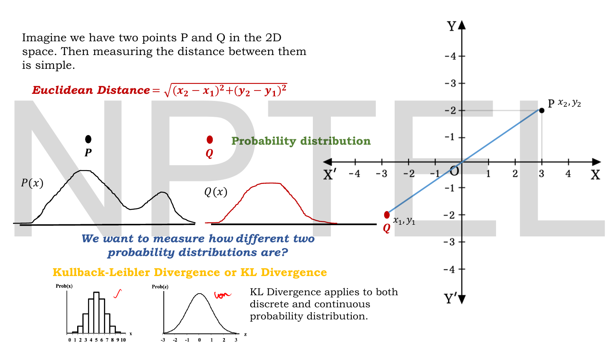
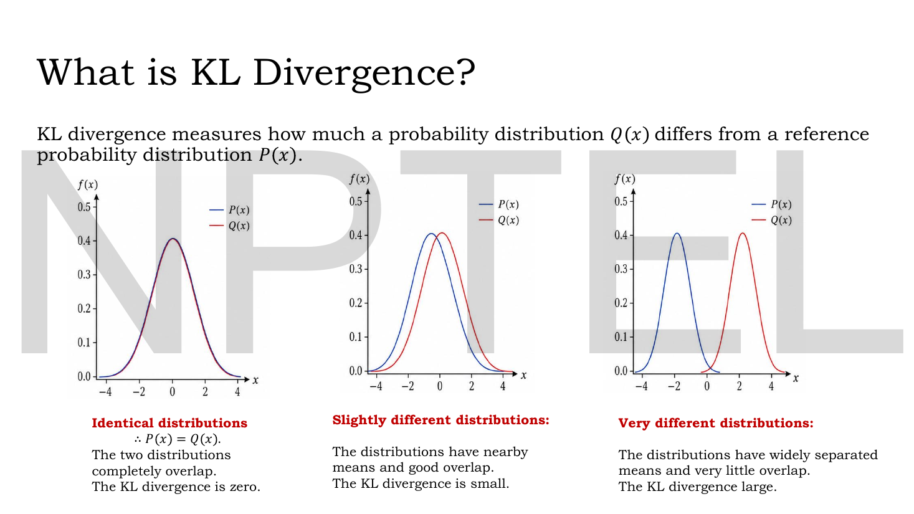
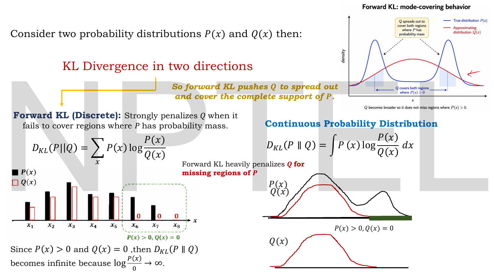
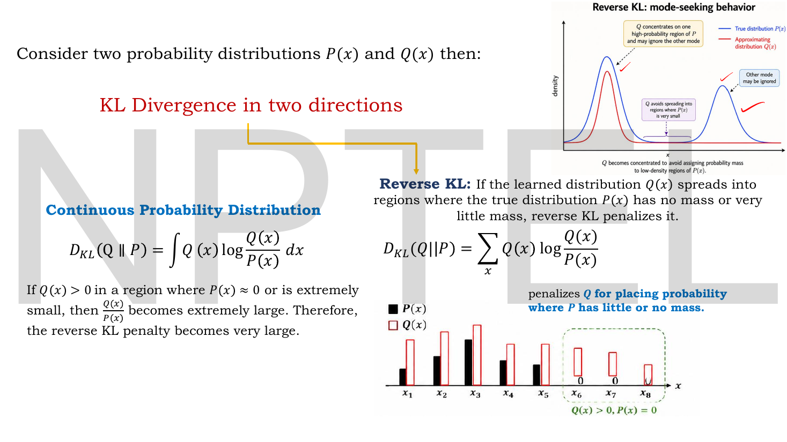
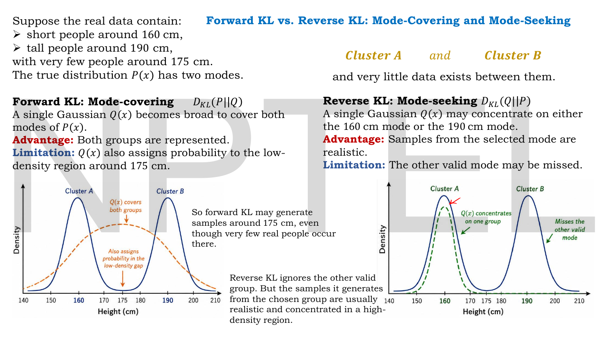
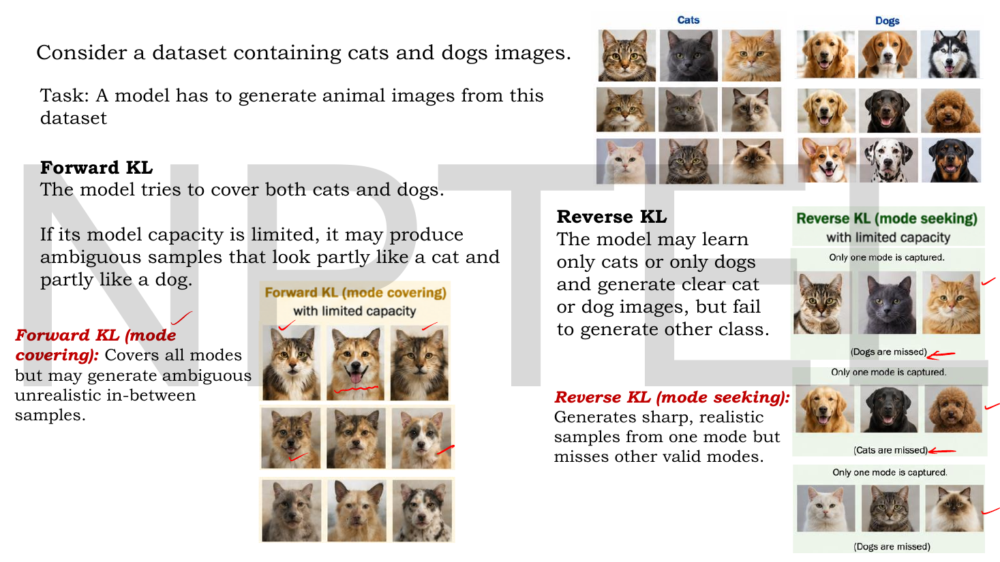
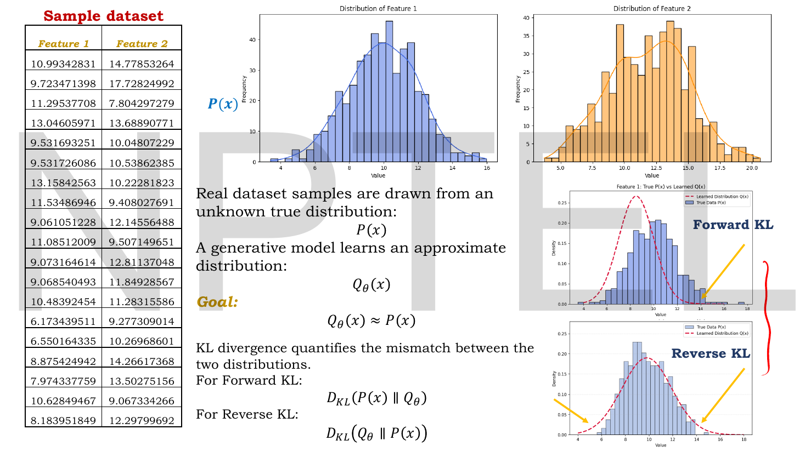

# Lec 19 — KL Divergence, Part A

> **Source:** `Lec 19.pdf` (12 pages) · **Week 3** · **Playlist:** Lec 19
> **Prereqs:** [Lec 16 — Numerical Example, Limitations of AE](16-ae-numerical-and-limits.md)
> **Feeds into:** [Lec 20 — KL Divergence Part B](20-kl-divergence-b.md), [Lec 21 — Introduction to VAE and the Encoder](21-vae-encoder.md), [Lec 22 — Probabilistic Decoder, ELBO, VAE Loss](22-elbo-and-vae-loss.md), [Lec 24 — VAE Numerical Example](24-vae-numerical.md), [Lec 26 — Disentanglement and β-VAE](26-beta-vae.md), [Lec 50 — Classifier-Guided Diffusion](50-classifier-guidance.md)

## Why this lecture exists

[Lec 16](16-ae-numerical-and-limits.md) ended with a diagnosis and a prescription. The diagnosis: an autoencoder's latent space has no structure, so there is no distribution to sample from and the model cannot generate. The prescription, in the deck's own words, was to add "a KL divergence regularization term to the loss function" — a penalty that measures how far the encoder's output distribution has drifted from a prior you *can* sample from.

That penalty is a distance between two probability distributions, and distance between distributions is not a thing you already know how to compute. Euclidean distance works on *points*; a distribution is not a point, and the two distributions you care about may not even live on the same support. This lecture builds the right tool from scratch: what it is, which direction you are measuring in, and what each direction does to a model that cannot fit the target exactly.

**This chapter owns the definition of KL divergence for the whole book.** [Lec 14](14-sparse-ae.md), [Lec 20](20-kl-divergence-b.md), [Lec 22](22-elbo-and-vae-loss.md), [Lec 24](24-vae-numerical.md), [Lec 50](50-classifier-guidance.md) and [Lec 51](51-classifier-free-guidance.md) all link back here rather than redefining it.

## The ideas

### Why ordinary distance fails


*Fig. — The slide's whole rhetorical move is the left-to-right contrast. Two **points** have an obvious distance, $\sqrt{(x_2-x_1)^2+(y_2-y_1)^2}$. Two **curves** do not. The bottom strip makes the second point: KL applies to discrete (histogram) and continuous (smooth density) distributions alike. Page 4.*

Two points in the plane have a distance you learned at school. Two probability distributions are different objects: each is an infinite list of numbers (one per outcome, or a whole function), constrained to be non-negative and to sum or integrate to 1. You could of course treat a discrete distribution as a vector and take the Euclidean distance between the vectors. The deck does not say why that is wrong, so here is the reason, and it is worth understanding because it motivates everything that follows.

**Euclidean distance ignores how improbable the outcomes are.** Compare two pairs of coin-like distributions:

| | $P$ | $Q$ | Euclidean distance | $D_{\mathrm{KL}}(P\,\|\,Q)$ |
|---|---|---|---|---|
| Pair A | $[0.50, 0.50]$ | $[0.40, 0.60]$ | $0.1414$ | $0.0204$ nats |
| Pair B | $[0.98, 0.02]$ | $[0.88, 0.12]$ | $0.1414$ | $0.0696$ nats |

Both pairs differ by $0.10$ in each coordinate, so Euclidean distance calls them *equally* different. But in pair B the second outcome went from a 1-in-50 event to a 1-in-8 event — a sixfold change in how often you expect to see it — while in pair A a coin got slightly biased. A measure that cannot tell those apart is useless for comparing models. KL divergence rates pair B as $3.4$ times more divergent (N1 works this out). What it tracks is the **ratio** $P(x)/Q(x)$, not the difference $P(x)-Q(x)$, and ratios are the right currency for probabilities.

Three more reasons Euclidean distance will not do: it is not invariant to how you bin or reparameterise the variable; it has no interpretation in terms of likelihood or coding; and it stays finite even when $Q$ assigns probability zero to something $P$ says happens all the time — a catastrophe for a model, which KL correctly reports as infinite.

### What KL divergence is


*Fig. — The calibration picture. Read it left to right as a thermometer: complete overlap → $D_{\mathrm{KL}} = 0$; nearby means and good overlap → small; separated means and little overlap → large. The one thing the picture does **not** show is that swapping the blue and red curves would change the number. Page 5.*

> **Kullback–Leibler divergence** measures how much a probability distribution $Q(x)$ differs from a reference probability distribution $P(x)$.

That is the deck's sentence, and the word order matters: $Q$ is the thing being judged, $P$ is the yardstick. In the generative setting $P$ is the unknown true data distribution and $Q_\theta$ is what your model learned.

**The definition.** For discrete distributions over a set of outcomes $x$:

$$\boxed{\;D_{\mathrm{KL}}(P\,\|\,Q) = \sum_x P(x)\log\frac{P(x)}{Q(x)}\;}$$

and for continuous distributions, with the sum becoming an integral:

$$\boxed{\;D_{\mathrm{KL}}(P\,\|\,Q) = \int P(x)\log\frac{P(x)}{Q(x)}\,dx\;}$$

Both forms are on the slides. Read the formula as **an average, taken under $P$, of the log-ratio**:

$$D_{\mathrm{KL}}(P\,\|\,Q) = \mathbb{E}_{P(x)}\!\left[\log\frac{P(x)}{Q(x)}\right]$$

Three readings of that one line, each useful:

- **Per-outcome mismatch.** $\log\frac{P(x)}{Q(x)}$ is zero when the two agree at $x$, positive where $P$ exceeds $Q$, negative where $Q$ exceeds $P$.
- **Weighted by who cares.** The weight is $P(x)$, not $Q(x)$ and not $1$. Outcomes that $P$ says are rare contribute almost nothing *however badly* $Q$ gets them wrong. This single asymmetry in the weighting is the source of everything in the rest of this chapter.
- **It is a divergence, not a distance.** Three properties of a metric: $D \ge 0$ with equality iff the arguments are equal (KL has this); symmetry (KL does **not**); the triangle inequality (KL does **not**). So never write "the KL distance". The deck, and every exam, say *divergence*.

**The log base.** The deck writes $\log$ with no base on page 6 and page 7. [Lec 20](20-kl-divergence-b.md) switches explicitly to $\log_2$ and reports its answers in **bits**. Throughout this book, an unqualified $\log$ is the **natural log** and the unit is **nats**, which is also what every deep-learning framework computes. The conversion is a single constant:

$$D_{\text{bits}} = \frac{D_{\text{nats}}}{\ln 2} = \frac{D_{\text{nats}}}{0.693147}, \qquad D_{\text{nats}} = D_{\text{bits}}\times 0.693147$$

Choosing the base rescales *every* KL value by the same factor, so it never changes which of two models is better — but it absolutely changes the number you write on the exam paper. **State the base in every numerical.** If an option looks like your answer times $1.4427$, you computed in nats and they wanted bits.

### Non-negativity, and when it is zero

$D_{\mathrm{KL}}(P\,\|\,Q) \ge 0$ always, with equality exactly when $P = Q$ everywhere. The deck asserts this through the left panel of page 5 ("the two distributions completely overlap, the KL divergence is zero") without proving it. The proof needs one inequality and no calculus:

$$\log t \le t - 1 \quad\text{for all } t > 0, \text{ with equality only at } t=1$$

Check it on a few values if it is unfamiliar: $t=0.5$ gives $-0.693 \le -0.5$ ✓; $t=1$ gives $0 \le 0$ ✓ (equality); $t=2$ gives $0.693 \le 1$ ✓; $t=5$ gives $1.609 \le 4$ ✓. The log curve sits under its own tangent line at $t=1$, touching only there.

Now put $t = Q(x)/P(x)$ and look at the **negative** of the divergence:

$$-D_{\mathrm{KL}}(P\,\|\,Q) = \sum_x P(x)\log\frac{Q(x)}{P(x)} \;\le\; \sum_x P(x)\left(\frac{Q(x)}{P(x)} - 1\right) = \sum_x Q(x) - \sum_x P(x) = 1 - 1 = 0$$

So $-D_{\mathrm{KL}} \le 0$, i.e. $D_{\mathrm{KL}} \ge 0$. Equality requires $\log t = t-1$ at every outcome, which happens only at $t=1$, i.e. $Q(x) = P(x)$ for all $x$. Done.

Two consequences worth holding on to. First, the individual terms $P(x)\log\frac{P(x)}{Q(x)}$ can be **negative** — only the total is guaranteed non-negative. Every numerical in this chapter has at least one negative term, and seeing one is not a sign you made an arithmetic mistake. Second, because the floor is exactly 0 and is attained only at perfect agreement, $D_{\mathrm{KL}}$ works as a loss: drive it to zero and your model *is* the target.

### Forward KL and the support problem


*Fig. — The green dashed box is the whole slide. At $x_6, x_7, x_8$ the black bars (P) are positive and the red outlines (Q) are flat zero. Each of those three outcomes contributes $P(x)\log\frac{P(x)}{0} = +\infty$. One uncovered outcome is enough to make the total infinite. Page 6.*

**Forward KL** is $D_{\mathrm{KL}}(P\,\|\,Q)$ — true distribution first, model second:

$$D_{\mathrm{KL}}(P\,\|\,Q) = \sum_x P(x)\log\frac{P(x)}{Q(x)} \qquad\text{or}\qquad \int P(x)\log\frac{P(x)}{Q(x)}\,dx$$

The deck's one-line summary: it "strongly penalizes $Q$ when it fails to cover regions where $P$ has probability mass."

Work out why from the formula. Pick an outcome where $P(x) > 0$ but $Q(x) = 0$. The term is $P(x)\log\frac{P(x)}{0}$, and $\log$ of anything divided by zero diverges to $+\infty$. The slide states exactly this: "Since $P(x) > 0$ and $Q(x) = 0$, then $D_{\mathrm{KL}}(P\,\|\,Q)$ becomes infinite because $\log\frac{P(x)}{0} \to \infty$."

The symmetric case is harmless. If $Q(x) > 0$ where $P(x) = 0$, the term is $0\cdot\log\frac{0}{Q(x)}$, which is taken to be $0$ by the standard convention $0\log 0 = 0$ (justified because $t\log t \to 0$ as $t\to 0^+$). Forward KL simply does not look at places $P$ ignores.

So forward KL enforces one hard rule, usually stated as: **$Q$ must be positive wherever $P$ is.** In the jargon, $P$ must be *absolutely continuous* with respect to $Q$. Anything less is an infinite loss. The practical effect, as the slide's margin note puts it: "forward KL pushes $Q$ to spread out and cover the complete support of $P$."

### Reverse KL and the opposite failure


*Fig. — The mirror image of page 6. Now the red outlines (Q) stick up at $x_6, x_7, x_8$ where the black bars (P) are zero, and it is **that** which is punished. The top-right density plot shows the consequence: $Q$ pulls in tight around one peak of $P$ and leaves the other entirely alone. Page 7.*

**Reverse KL** swaps the arguments — model first, truth second:

$$D_{\mathrm{KL}}(Q\,\|\,P) = \sum_x Q(x)\log\frac{Q(x)}{P(x)} \qquad\text{or}\qquad \int Q(x)\log\frac{Q(x)}{P(x)}\,dx$$

Everything flips, because the averaging weight is now $Q(x)$. The deck: "If the learned distribution $Q(x)$ spreads into regions where the true distribution $P(x)$ has no mass or very little mass, reverse KL penalizes it… If $Q(x) > 0$ in a region where $P(x) \approx 0$ or is extremely small, then $\frac{Q(x)}{P(x)}$ becomes extremely large. Therefore, the reverse KL penalty becomes very large."

And the converse: if $Q(x) = 0$ somewhere $P$ has mass, reverse KL pays **nothing**, because the weight $Q(x)$ is zero. Reverse KL lets you ignore entire regions of the truth for free.

| | Forward $D_{\mathrm{KL}}(P\,\|\,Q)$ | Reverse $D_{\mathrm{KL}}(Q\,\|\,P)$ |
|---|---|---|
| Average taken under | $P$ (the truth) | $Q$ (the model) |
| Punishes | $Q$ missing mass that $P$ has | $Q$ putting mass where $P$ has none |
| Costs nothing | $Q>0$ where $P=0$ | $Q=0$ where $P>0$ |
| Infinite when | $Q(x)=0$ and $P(x)>0$ | $P(x)=0$ and $Q(x)>0$ |
| Behaviour of the fitted $Q$ | **mode-covering** — spreads wide | **mode-seeking** — collapses onto one mode |
| Also called | inclusive KL | exclusive KL |
| Used by | maximum likelihood / cross-entropy training | **variational inference, the VAE** |

That last row is the one to carry forward. [Lec 22](22-elbo-and-vae-loss.md)'s VAE loss contains $D_{\mathrm{KL}}\big(q_\phi(\mathbf{z}\mid\mathbf{x})\,\|\,p(\mathbf{z})\big)$ — the learned encoder distribution in the **first** slot, the prior in the second. By the table that is a reverse-KL-flavoured term, and it is exactly what you want there: it forbids the encoder from putting codes anywhere the prior does not reach, which is how the latent space acquires the structure [Lec 16](16-ae-numerical-and-limits.md) showed it was missing.

### Mode-covering and mode-seeking, concretely


*Fig. — The single most examinable picture in this deck. Left: the orange dashed curve (forward KL) is wide, covers both clusters, and dumps probability in the 175 cm gap where almost nobody lives. Right: the green dashed curve (reverse KL) sits neatly on the 160 cm cluster and pretends the 190 cm one does not exist. Page 9.*

The deck's setup: real heights cluster around **160 cm** (short) and **190 cm** (tall), with very few people near **175 cm**. So the true $P(x)$ has two modes. Your model $Q(x)$ is a **single Gaussian** — it cannot possibly represent two separated bumps. Something has to give, and which thing gives is decided by the direction of KL you minimise.

| | Forward KL: mode-covering | Reverse KL: mode-seeking |
|---|---|---|
| What $Q$ does | becomes broad, covering both modes | concentrates on one mode (160 **or** 190) |
| **Advantage** (deck's word) | both groups are represented | samples from the selected mode are realistic |
| **Limitation** (deck's word) | also assigns probability to the low-density region around 175 cm | the other valid mode may be missed |
| Failure you see | generates 175 cm people, who barely exist | never generates tall people at all |

The Code section minimises both directions numerically over this exact example and recovers the slide's picture: forward KL picks $\mathcal{N}(175,\,16^2)$ — dead centre of the gap, enormously wide — and reverse KL picks $\mathcal{N}(190,\,5^2)$, locked onto one cluster and ignoring the other.


*Fig. — The same failure in pixels. Forward KL with limited capacity produces animals that are part cat and part dog — plausible under a smeared-out $Q$, real under nothing. Reverse KL produces crisp cats and no dogs at all ("Dogs are missed"). Page 10.*

The deck's image version makes the stakes obvious. With limited model capacity:

- **Forward KL (mode covering):** "Covers all modes but may generate ambiguous unrealistic in-between samples." The hybrids on the slide are the 175 cm people of image space.
- **Reverse KL (mode seeking):** "Generates sharp, realistic samples from one mode but misses other valid modes."

Hold on to that second line. It is the textbook description of **mode collapse**, the central failure of GAN training that [Lec 34](34-gan-convergence.md) owns — and the fact that it has a precise information-theoretic signature, not just an empirical one, is why this lecture is placed before every generative model in the course rather than only before the VAE.

### Where the two distributions come from


*Fig. — The reality check. You never see $P(x)$; you see a column of numbers drawn from it, here two features of a tabular dataset with their histograms. The two plots on the right show the same learned $Q$ (red dashed) against the same data (blue bars), labelled by which direction of KL would be unhappy about which part of the mismatch. Page 8.*

The framing the deck sets up for the whole of Week 3:

- Real data samples are drawn from an **unknown** true distribution $P(x)$.
- A generative model learns an approximate distribution $Q_\theta(x)$, parameterised by $\theta$.
- The **goal** is $Q_\theta(x) \approx P(x)$.
- KL divergence *quantifies the mismatch*, in either direction: $D_{\mathrm{KL}}(P(x)\,\|\,Q_\theta)$ or $D_{\mathrm{KL}}(Q_\theta\,\|\,P(x))$.

That is the entire research programme of generative modelling in four lines, and it is why KL arrives now. You never have $P(x)$ in closed form — only samples from it — so in practice forward KL is estimated from data (which is what maximum likelihood does) and reverse KL is used when you *can* evaluate the target but want a tractable $Q$ (which is what the VAE does with its prior). The mechanics of that split belong to [Lec 22](22-elbo-and-vae-loss.md).

## Worked numericals

**The slides of Lec 19 contain no worked numerical examples** — the deck is entirely conceptual, with formulas and pictures but not one computed value. All six numericals below are mine, built on the deck's own examples so that nothing is off-syllabus. **All logs are natural logs; answers are in nats, with bits given alongside where the comparison is instructive.**

### N1. Why Euclidean distance misleads

**Given:** two pairs of two-outcome distributions, each pair differing by exactly $0.10$ in both coordinates.
Pair A: $P_A = [0.50, 0.50]$, $Q_A = [0.40, 0.60]$. Pair B: $P_B = [0.98, 0.02]$, $Q_B = [0.88, 0.12]$.
**Find:** the Euclidean distance and the forward KL for each pair.

1. Euclidean, pair A: $\sqrt{(0.50-0.40)^2+(0.50-0.60)^2} = \sqrt{0.01+0.01} = \sqrt{0.02} = 0.141421$.
2. Euclidean, pair B: $\sqrt{(0.98-0.88)^2+(0.02-0.12)^2} = \sqrt{0.02} = 0.141421$. **Identical.**
3. $D_{\mathrm{KL}}(P_A\,\|\,Q_A) = 0.5\ln\frac{0.5}{0.4} + 0.5\ln\frac{0.5}{0.6} = 0.5(0.223144) + 0.5(-0.182322)$
$$= 0.111572 - 0.091161 = 0.020411$$
4. $D_{\mathrm{KL}}(P_B\,\|\,Q_B) = 0.98\ln\frac{0.98}{0.88} + 0.02\ln\frac{0.02}{0.12} = 0.98(0.107631) + 0.02(-1.791759)$
$$= 0.105478 - 0.035835 = 0.069643$$

**Answer:** Euclidean distance is $0.141421$ for both pairs — it cannot tell them apart. KL rates pair B at $0.069643$ nats against pair A's $0.020411$ nats, **3.41 times more divergent**, because a $0.02 \to 0.12$ change is a sixfold change in probability while $0.50\to0.40$ is a 20% change. Note also that both calculations contain a **negative term**, and both totals are still positive, as non-negativity guarantees.

### N2. Asymmetry on two outcomes — the headline result

**Given:** $P = [0.9,\ 0.1]$ and $Q = [0.5,\ 0.5]$ over outcomes $\{x_1, x_2\}$.
**Find:** both directions of KL, and show they differ.

1. Forward, term by term:

| $x$ | $P(x)$ | $Q(x)$ | $\frac{P}{Q}$ | $\ln\frac{P}{Q}$ | $P(x)\ln\frac{P}{Q}$ |
|---|---|---|---|---|---|
| $x_1$ | 0.9 | 0.5 | 1.8 | $+0.587787$ | $+0.529008$ |
| $x_2$ | 0.1 | 0.5 | 0.2 | $-1.609438$ | $-0.160944$ |

$$D_{\mathrm{KL}}(P\,\|\,Q) = 0.529008 - 0.160944 = 0.368064 \text{ nats}$$

2. Reverse, term by term:

| $x$ | $Q(x)$ | $P(x)$ | $\frac{Q}{P}$ | $\ln\frac{Q}{P}$ | $Q(x)\ln\frac{Q}{P}$ |
|---|---|---|---|---|---|
| $x_1$ | 0.5 | 0.9 | 0.5556 | $-0.587787$ | $-0.293893$ |
| $x_2$ | 0.5 | 0.1 | 5.0 | $+1.609438$ | $+0.804719$ |

$$D_{\mathrm{KL}}(Q\,\|\,P) = -0.293893 + 0.804719 = 0.510826 \text{ nats}$$

3. In bits: divide by $\ln 2 = 0.693147$ → $0.531004$ bits and $0.736966$ bits.

**Answer:** $D_{\mathrm{KL}}(P\,\|\,Q) = 0.368064 \ne 0.510826 = D_{\mathrm{KL}}(Q\,\|\,P)$. **KL divergence is not symmetric**, and the gap here is 39%. The two calculations use *the same two logarithms* — $\pm0.587787$ and $\pm1.609438$ — and differ only in the weights applied to them, which is the whole mechanism of asymmetry in one view: the averaging weight is the first argument.

### N3. Asymmetry on three outcomes, both bases

**Given:** $P = [0.5,\ 0.4,\ 0.1]$ and $Q = [0.2,\ 0.3,\ 0.5]$.
**Find:** $D_{\mathrm{KL}}(P\,\|\,Q)$ and $D_{\mathrm{KL}}(Q\,\|\,P)$ in nats and in bits.

1. Forward terms: $0.5\ln 2.5 = 0.5(0.916291) = 0.458145$; $0.4\ln\frac{4}{3} = 0.4(0.287682) = 0.115073$; $0.1\ln 0.2 = 0.1(-1.609438) = -0.160944$.
2. $D_{\mathrm{KL}}(P\,\|\,Q) = 0.458145 + 0.115073 - 0.160944 = 0.412274$ nats.
3. Reverse terms: $0.2\ln 0.4 = -0.183258$; $0.3\ln 0.75 = -0.086305$; $0.5\ln 5 = 0.804719$.
4. $D_{\mathrm{KL}}(Q\,\|\,P) = -0.183258 - 0.086305 + 0.804719 = 0.535156$ nats.
5. Bits: $0.412274/0.693147 = 0.594786$ and $0.535156/0.693147 = 0.772067$.

**Answer:** $0.412274$ nats $= 0.594786$ bits forward; $0.535156$ nats $= 0.772067$ bits reverse. Again unequal. Notice that the *ordering* survives the base change — both bases agree that the reverse direction is larger — because changing base multiplies everything by the same $1/\ln 2 = 1.442695$.

### N4. The support failure, in both directions

**Given:** $P = [0.4,\ 0.4,\ 0.2]$ and $Q = [0.5,\ 0.5,\ 0]$ over $\{x_1, x_2, x_3\}$. $Q$ misses the third outcome entirely.
**Find:** both directions.

1. Forward, $D_{\mathrm{KL}}(P\,\|\,Q)$: the first two terms are finite, $0.4\ln 0.8 = -0.089257$ twice. The third is
$$P(x_3)\ln\frac{P(x_3)}{Q(x_3)} = 0.2\ln\frac{0.2}{0} = 0.2\cdot(+\infty) = +\infty$$
2. Total: $-0.178515 + \infty = \boxed{+\infty}$.
3. Reverse, $D_{\mathrm{KL}}(Q\,\|\,P)$: terms are $0.5\ln\frac{0.5}{0.4} = 0.111572$ twice, and the third is $Q(x_3)\ln\frac{Q(x_3)}{P(x_3)} = 0\cdot\ln\frac{0}{0.2} = 0$ by the convention $0\log 0 = 0$.
4. Total: $0.111572 + 0.111572 + 0 = 0.223144$ nats.

**Answer:** forward KL is $+\infty$, reverse KL is a mild $0.223144$ nats — **for the same pair of distributions.** This is the strongest possible demonstration of asymmetry: the two directions do not merely disagree on the magnitude, they disagree on whether the mismatch is catastrophic or negligible. It also tells you why real implementations clamp probabilities away from zero (adding an $\varepsilon \approx 10^{-12}$) before taking a log.

### N5. The floor, and that terms may be negative

**Given:** $P = [0.3,\ 0.7]$.
**Find:** (a) $D_{\mathrm{KL}}(P\,\|\,P)$; (b) $D_{\mathrm{KL}}(P\,\|\,Q)$ for $Q = [0.31,\ 0.69]$; (c) the sign of each term in (b).

1. (a) Every ratio is $P(x)/P(x) = 1$ and $\ln 1 = 0$, so every term is $0$ and the total is $\mathbf{0}$ — the floor, attained exactly at equality.
2. (b) Term 1: $0.3\ln\frac{0.3}{0.31} = 0.3\times(-0.032790) = -0.009837$.
3. Term 2: $0.7\ln\frac{0.7}{0.69} = 0.7\times(0.014389) = +0.010072$.
4. Total: $-0.009837 + 0.010072 = 0.000235$ nats.

**Answer:** (a) $0$ exactly. (b) $0.000235$ nats — tiny but strictly positive, as required. (c) The first term is **negative** and the second positive; the positive one wins by a hair. A nearly-correct model gives a nearly-zero KL that is still above zero, and if your hand calculation ever produces a negative total you have made an arithmetic error, not discovered a counterexample.

### N6. Mode-covering versus mode-seeking, as numbers

**Given:** a discrete bimodal truth $P = [0.45,\ 0.05,\ 0.45,\ 0.05]$ — mass piled on outcomes 1 and 3, a gap at 2 and 4 — and two candidate models:
$Q_{\text{broad}} = [0.25,\ 0.25,\ 0.25,\ 0.25]$ (covers everything, commits to nothing)
$Q_{\text{narrow}} = [0.80,\ 0.10,\ 0.05,\ 0.05]$ (commits to mode 1, abandons mode 3)
**Find:** which model each direction of KL prefers.

1. Forward, broad: $0.45\ln 1.8 + 0.05\ln 0.2 + 0.45\ln 1.8 + 0.05\ln 0.2 = 2(0.264504) + 2(-0.080472) = 0.368064$.
2. Forward, narrow: $0.45\ln\frac{0.45}{0.80} + 0.05\ln\frac{0.05}{0.10} + 0.45\ln\frac{0.45}{0.05} + 0.05\ln\frac{0.05}{0.05}$
$$= 0.45(-0.575364) + 0.05(-0.693147) + 0.45(2.197225) + 0 = -0.258914 - 0.034657 + 0.988751 = 0.695180$$
3. Reverse, broad: $4\times 0.25\ln\frac{0.25}{P(x)}$ over the four outcomes $= 2[0.25\ln\frac{0.25}{0.45}] + 2[0.25\ln\frac{0.25}{0.05}] = 2(-0.146947)+2(0.402359) = 0.510826$.
4. Reverse, narrow: $0.80\ln\frac{0.80}{0.45} + 0.10\ln\frac{0.10}{0.05} + 0.05\ln\frac{0.05}{0.45} + 0.05\ln\frac{0.05}{0.05}$
$$= 0.80(0.575364) + 0.10(0.693147) + 0.05(-2.197225) + 0 = 0.460291 + 0.069315 - 0.109861 = 0.419745$$

| | $Q_{\text{broad}}$ | $Q_{\text{narrow}}$ | winner |
|---|---|---|---|
| Forward $D_{\mathrm{KL}}(P\,\|\,Q)$ | $0.368064$ | $0.695180$ | **broad** — mode-covering |
| Reverse $D_{\mathrm{KL}}(Q\,\|\,P)$ | $0.510826$ | $0.419745$ | **narrow** — mode-seeking |

**Answer:** the two directions rank the same two models in **opposite orders**. Forward KL prefers the spread-out model by a factor of almost two; reverse KL prefers the committed one. The deck's page-9 picture is this table drawn as curves, and the deck's "ambiguous cat-dog hybrids versus sharp cats only" is the same table drawn as images.

## Code

The deck's height example, minimised numerically in each direction. Everything here is a grid search over a single Gaussian $q$ — no gradients, no training loop — so you can see that the mode-covering / mode-seeking split comes from the *objective*, not from the optimiser.

```python
import numpy as np

# The deck's height example: P is bimodal -- short people ~160 cm, tall ~190 cm.
x  = np.linspace(130, 220, 2001); dx = x[1] - x[0]
g  = lambda m, s: np.exp(-0.5 * ((x - m) / s) ** 2) / (s * np.sqrt(2 * np.pi))
p  = 0.5 * g(160, 5) + 0.5 * g(190, 5); p /= p.sum() * dx      # true P(x)
eps = 1e-12

def kl(a, b):                       # natural log  ->  answer in nats
    return float(np.sum(a * np.log((a + eps) / (b + eps))) * dx)

# Search every single Gaussian q and keep the best under each DIRECTION of KL.
best = {"forward": (9e9, None), "reverse": (9e9, None)}
for m in np.arange(150.0, 201.0, 0.5):
    for s in np.arange(2.0, 30.1, 0.5):
        q = g(m, s); q /= q.sum() * dx
        for name, val in (("forward", kl(p, q)), ("reverse", kl(q, p))):
            if val < best[name][0]:
                best[name] = (val, (m, s))

for name in ("forward", "reverse"):
    val, (m, s) = best[name]
    print("%s KL  best q = N(mu=%5.1f cm, sigma^2=%5.1f)   D = %.4f nats"
          % (name.ljust(7), m, s * s, val))

# Asymmetry on the two-outcome pair of N2, reported in both bases.
P, Q = np.array([0.9, 0.1]), np.array([0.5, 0.5])
f, r = float(np.sum(P * np.log(P / Q))), float(np.sum(Q * np.log(Q / P)))
print("D(P||Q) = %.6f nats = %.6f bits" % (f, f / np.log(2)))
print("D(Q||P) = %.6f nats = %.6f bits" % (r, r / np.log(2)))
```

```
forward KL  best q = N(mu=175.0 cm, sigma^2=256.0)   D = 0.4572 nats
reverse KL  best q = N(mu=190.0 cm, sigma^2= 25.0)   D = 0.6893 nats
D(P||Q) = 0.368064 nats = 0.531004 bits
D(Q||P) = 0.510826 nats = 0.736966 bits
```

The slide's picture, reproduced to the digit. Forward KL's best single Gaussian is centred at **175 cm** — exactly the gap where the deck says "very few people" live — with $\sigma = 16$ cm, more than three times the width of either real cluster. Reverse KL's best is $\mathcal{N}(190, 5^2)$: it has matched one real cluster's mean and variance precisely and discarded the other half of the population.

Two details worth absorbing. The reported divergences, $0.4572$ and $0.6893$ nats, are **not comparable to each other** — they are values of two different functions, so "forward KL is smaller" says nothing. And the $\varepsilon = 10^{-12}$ inside the log is not cosmetic: without it the forward direction hits $\log(p/0)$ in the tails and returns `inf` for every candidate, which is N4 biting in floating point.

## Exam pack

### Must-memorise

| Item | Exactly this |
|---|---|
| KL, discrete | $D_{\mathrm{KL}}(P\,\|\,Q) = \sum_x P(x)\log\dfrac{P(x)}{Q(x)}$ |
| KL, continuous | $D_{\mathrm{KL}}(P\,\|\,Q) = \displaystyle\int P(x)\log\dfrac{P(x)}{Q(x)}\,dx$ |
| As an expectation | $\mathbb{E}_{P(x)}\!\left[\log\dfrac{P(x)}{Q(x)}\right]$ — averaged under the **first** argument |
| Forward KL | $D_{\mathrm{KL}}(P\,\|\,Q)$ — truth first; **mode-covering**; penalises $Q$ for missing $P$'s mass |
| Reverse KL | $D_{\mathrm{KL}}(Q\,\|\,P)$ — model first; **mode-seeking**; penalises $Q$ for mass where $P$ has none |
| Non-negativity | $D_{\mathrm{KL}}(P\,\|\,Q) \ge 0$, $=0$ **iff** $P=Q$ everywhere |
| Asymmetry | $D_{\mathrm{KL}}(P\,\|\,Q) \ne D_{\mathrm{KL}}(Q\,\|\,P)$ in general — **it is a divergence, not a distance** |
| Infinite when | $P(x)>0$ and $Q(x)=0$ for forward KL |
| Convention | $0\log 0 = 0$ |
| Proof tool | $\log t \le t-1$ for $t>0$, equality only at $t=1$ |
| Units | natural log → **nats**; $\log_2$ → **bits**; $1\text{ nat} = 1.442695$ bits |
| Applies to | discrete **and** continuous distributions |

### Numbers worth knowing

| Quantity | Value |
|---|---|
| $\ln 2$ | $0.693147$ — multiply bits by this to get nats |
| $1/\ln 2$ | $1.442695$ — multiply nats by this to get bits |
| $D_{\mathrm{KL}}$ when $P=Q$ | exactly $0$ |
| $P=[0.9,0.1]$, $Q=[0.5,0.5]$: forward | $0.368064$ nats $=0.531004$ bits |
| the same pair: reverse | $0.510826$ nats $=0.736966$ bits |
| $P=[0.5,0.4,0.1]$, $Q=[0.2,0.3,0.5]$: forward / reverse | $0.412274$ / $0.535156$ nats |
| $Q$ missing an outcome $P$ has | forward $=+\infty$, reverse finite |
| Deck's height modes | $160$ cm and $190$ cm, gap at $175$ cm |
| Forward KL's best single Gaussian for it | $\mathcal{N}(175,\ 16^2)$ |
| Reverse KL's best single Gaussian for it | $\mathcal{N}(190,\ 5^2)$ |
| Euclidean distance of both pairs in N1 | $0.141421$, identical — KL differs by $3.41\times$ |

### Likely MCQ traps

- **Calling it a distance.** KL is a **divergence**: non-negative and zero only at equality, but neither symmetric nor obeying the triangle inequality. Any option containing "KL distance" or "KL metric" is wrong by construction.
- **Getting the argument order backwards.** $D_{\mathrm{KL}}(P\,\|\,Q)$ averages under $P$ and has $P$ on top inside the log. If you see $\sum Q(x)\log\frac{P(x)}{Q(x)}$, that is neither direction — it is a mangled formula.
- **Assuming the answer is symmetric because the picture looks symmetric.** Page 5's three-panel figure gives no hint that order matters. N2 and N4 are the corrective: in N4 one direction is infinite and the other is $0.22$ nats.
- **Thinking a negative term means you erred.** Individual terms $P(x)\log\frac{P(x)}{Q(x)}$ are negative wherever $Q(x) > P(x)$. Only the **sum** is guaranteed $\ge 0$.
- **Log base.** Nats unless told otherwise in this book; [Lec 20](20-kl-divergence-b.md)'s deck uses $\log_2$ and reports bits. A factor of $1.442695$ between two offered options is the giveaway.
- **Swapping mode-covering and mode-seeking.** Mnemonic: **forward** KL has the **t**ruth **f**irst, and it is **f**at — it must cover everything $P$ does. Reverse KL has the model first and goes narrow.
- **"Mode-seeking is a bug."** The deck lists an *advantage* for each: mode-seeking gives realistic samples from the mode it picked. Forward KL's covering behaviour has its own cost — unrealistic in-between samples. Neither direction is universally right.
- **Assuming forward KL blows up whenever the supports differ.** It blows up only in one direction of mismatch: $P>0$ with $Q=0$. The opposite case, $Q>0$ with $P=0$, costs forward KL exactly nothing.
- **Comparing a forward value to a reverse value.** $0.4572$ versus $0.6893$ in the Code output does **not** mean forward KL "fits better". They are different objectives; only values of the *same* direction are comparable.
- **Thinking the VAE minimises forward KL.** The VAE's regulariser is $D_{\mathrm{KL}}\big(q_\phi(\mathbf{z}\mid\mathbf{x})\,\|\,p(\mathbf{z})\big)$ — the learned distribution first. See [Lec 22](22-elbo-and-vae-loss.md).

### Self-test

1. Write the discrete definition of $D_{\mathrm{KL}}(P\,\|\,Q)$ and say which distribution the average is taken under.
2. Give two properties of a metric that KL divergence fails.
3. $P = [0.6, 0.4]$, $Q = [0.5, 0.5]$. Compute both directions in nats.
4. Why does Euclidean distance between probability vectors make a poor loss for generative models? Give one concrete numerical reason.
5. $P = [0.3, 0.7, 0.0]$ and $Q = [0.3, 0.6, 0.1]$. Which direction is infinite, which is finite, and why?
6. State the deck's advantage **and** limitation for forward KL, and for reverse KL.
7. Prove $D_{\mathrm{KL}}(P\,\|\,Q) \ge 0$.
8. You compute a KL and get $-0.03$. What went wrong?
9. A model gets $D_{\mathrm{KL}} = 1.5$ bits. What is that in nats?
10. Your single-Gaussian model, fitted to a bimodal truth, ends up centred in the empty valley between the two modes. Which direction of KL did you minimise, and what is this behaviour called?

<details><summary>Answers</summary>

1. $D_{\mathrm{KL}}(P\,\|\,Q) = \sum_x P(x)\log\frac{P(x)}{Q(x)}$. The average is taken under $P$, the **first** argument.
2. Symmetry ($D_{\mathrm{KL}}(P\,\|\,Q) \ne D_{\mathrm{KL}}(Q\,\|\,P)$) and the triangle inequality. It does satisfy non-negativity with equality only at $P=Q$.
3. Forward: $0.6\ln 1.2 + 0.4\ln 0.8 = 0.6(0.182322)+0.4(-0.223144) = 0.109393 - 0.089257 = \mathbf{0.020136}$ nats. Reverse: $0.5\ln\frac{0.5}{0.6}+0.5\ln\frac{0.5}{0.4} = -0.091161+0.111572 = \mathbf{0.020411}$ nats. Close, but not equal.
4. It measures differences, not ratios, so it cannot see that $0.02\to0.12$ is a sixfold change in probability while $0.50\to0.40$ is a 20% change. N1: two pairs with identical Euclidean distance $0.141421$ have KLs of $0.0204$ and $0.0696$ nats.
5. $D_{\mathrm{KL}}(Q\,\|\,P)$ is infinite: $Q(x_3)=0.1>0$ while $P(x_3)=0$, giving $0.1\ln\frac{0.1}{0}=+\infty$. $D_{\mathrm{KL}}(P\,\|\,Q)$ is finite, because the third term is $0\cdot\log\frac{0}{0.1}=0$ by convention and the first two are ordinary numbers.
6. Forward — advantage: both groups are represented; limitation: $Q$ also assigns probability to the low-density region (the 175 cm gap). Reverse — advantage: samples from the selected mode are realistic; limitation: the other valid mode may be missed.
7. Use $\log t \le t-1$ with $t = Q(x)/P(x)$: $-D_{\mathrm{KL}} = \sum_x P(x)\log\frac{Q(x)}{P(x)} \le \sum_x P(x)\left(\frac{Q(x)}{P(x)}-1\right) = \sum_x Q(x) - \sum_x P(x) = 1-1 = 0$. Hence $D_{\mathrm{KL}} \ge 0$, with equality only when $Q(x)/P(x) = 1$ everywhere.
8. An arithmetic error. KL is non-negative by the proof above. The usual culprits: inverting the ratio inside the log, dropping a minus sign, or using the wrong distribution as the weight.
9. $1.5 \times \ln 2 = 1.5 \times 0.693147 = \mathbf{1.03972}$ nats.
10. **Forward** KL, $D_{\mathrm{KL}}(P\,\|\,Q)$. The behaviour is **mode-covering** (also called inclusive, or zero-avoiding): forward KL pays an enormous price for leaving any of $P$'s mass uncovered, so it spreads $Q$ across both modes and accepts putting mass in the empty valley.

</details>

## Beyond the slides

**Gap: the deck never says why Euclidean distance is the wrong tool — it just shows a picture and moves on.**
**Why it matters:** the whole motivation for KL hangs on this, and "distributions are curves, not points" is not an argument (you can perfectly well take the Euclidean distance between two probability vectors). The real reasons are that probabilities compare by **ratio**, that Euclidean distance changes if you rebin or reparameterise the variable, and that it stays finite when a model assigns zero probability to something that actually happens. N1 makes the first point a number.

**Gap: non-negativity is shown in a picture and never proved.**
**Why it matters:** an exam can ask you to prove it, and the proof needs only $\log t \le t-1$ — no calculus, no Jensen's inequality by name. It is also the reason KL works as a loss at all: a quantity with a known floor at exactly the thing you want is trainable, and a quantity that could go negative is not.

**Gap: no mention that KL is unbounded above.**
**Why it matters:** unlike accuracy or a correlation, KL has no maximum — N4 reaches $+\infty$ on a perfectly ordinary pair of distributions. So a KL value is only interpretable *relative to other KL values in the same direction between the same kinds of objects*. If you need a bounded, symmetric alternative, the Jensen–Shannon divergence $\tfrac12 D_{\mathrm{KL}}(P\|M) + \tfrac12 D_{\mathrm{KL}}(Q\|M)$ with $M = \tfrac12(P+Q)$ is the standard one — and it is exactly what the original GAN objective turns out to minimise, which [Lec 34](34-gan-convergence.md) reaches from a different direction.

**Gap: the deck shows mode-seeking behaviour without naming mode collapse.**
**Why it matters:** "generates sharp, realistic samples from one mode but misses other valid modes" *is* mode collapse, the headline GAN pathology ([Lec 34](34-gan-convergence.md) owns it). Seeing it here, as a property of an objective rather than an accident of training, is a significantly better mental model than meeting it later as "sometimes GANs break".

**Gap: which direction the VAE actually uses, and why, is left to a later lecture.**
**Why it matters:** the mode-covering / mode-seeking table is only useful if you know which row applies to your model. The VAE's regulariser puts the *learned* encoder distribution first — $D_{\mathrm{KL}}\big(q_\phi(\mathbf{z}\mid\mathbf{x})\,\|\,p(\mathbf{z})\big)$ — so it is the mode-seeking direction, which is precisely why VAE latent codes stay inside the prior's support and why VAE samples are safe to draw but a little blurry. [Lec 22](22-elbo-and-vae-loss.md) derives the term; [Lec 31](31-gan-motivation.md) blames the blur. The vision companion's [ELBO chapter](../../GenAIforCV/notes/week-08/30-elbo-and-reparameterization.md) assumes this direction without discussing the alternative.

## Cut from the slides

Pages 1, 2, 11 and 12 are the title card, the Week 3 outline, the next-session preview and the thank-you. Page 2's outline is reproduced only as the "Feeds into" line in the front matter, with one fact worth keeping: **there is no hands-on session in Week 3** — the VAE implementation is deferred to Week 4. Page 3 is the three-bullet session overview, folded into this chapter's headings. Pages 4 through 10 are reproduced in full, including both bar-chart panels and both density panels for forward and reverse KL.

The deck writes $D_{KL}(P||Q)$ with upright subscript and a doubled pipe; this book writes $D_{\mathrm{KL}}(P\,\|\,Q)$ per the notation table, and uses $Q_\theta$ where page 8 writes $Q_\theta(x)$. The deck's $P$/$Q$ naming is kept rather than converted to the contract's $q$/$p$, because every slide and therefore every exam question uses $P$ for the truth and $Q$ for the model; the VAE instance $D_{\mathrm{KL}}\big(q_\phi(\mathbf{z}\mid\mathbf{x})\,\|\,p(\mathbf{z})\big)$ is flagged where it appears. Page 4's Cartesian plot has a drafting slip — the upper half of the vertical axis is labelled $-1, -2, -3, -4$ instead of $1, 2, 3, 4$ — which affects nothing but is worth not being confused by. Page 8's table of 20 sampled feature values is illustrative only; no computation is performed on it anywhere in the deck, so it is described rather than tabulated. The entropy / cross-entropy reading of KL, the identity $D_{\mathrm{KL}} = H(P,Q) - H(P)$ and all the information-theoretic machinery are **not** in this deck at all — page 11 explicitly defers them to the next session, and they are [Lec 20](20-kl-divergence-b.md)'s.
