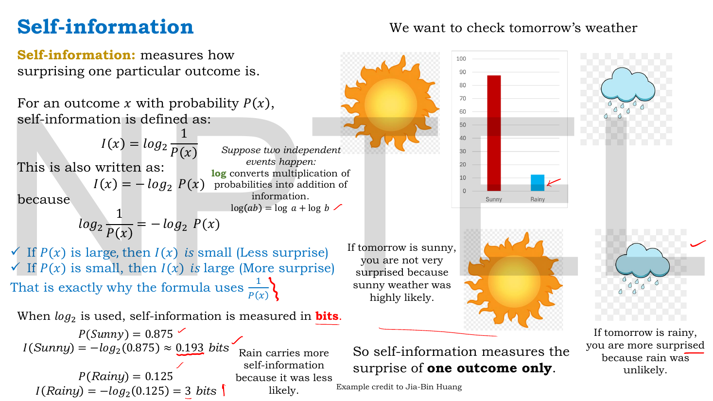
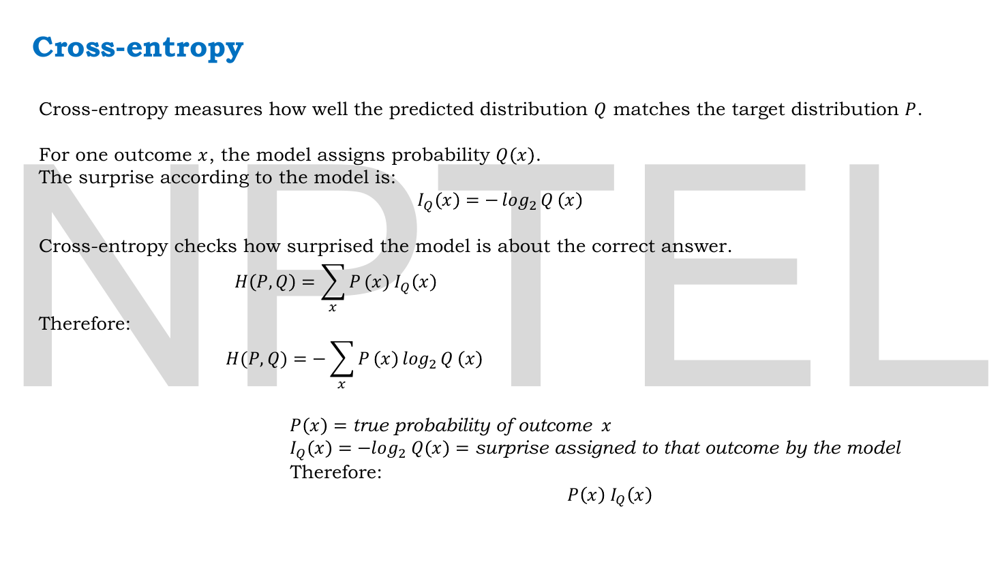
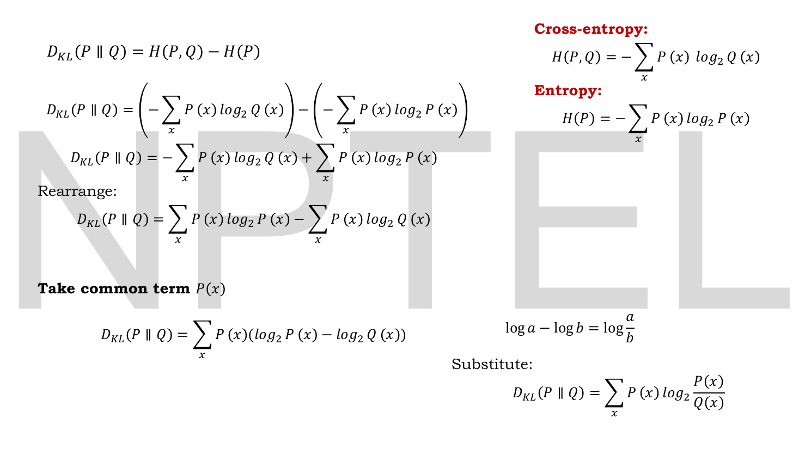

# Lec 20 — KL Divergence, Part B

> **Source:** `Lec 20.pdf` (10 pages) · **Week 3** · **Playlist:** Lec 20
> **Prereqs:** [Lec 19 — KL Divergence Part A](19-kl-divergence-a.md), [Lec 11 — Reconstruction Loss (MSE, BCE)](11-reconstruction-loss.md)
> **Feeds into:** [Lec 21 — Introduction to VAE and the Encoder](21-vae-encoder.md), [Lec 22 — Probabilistic Decoder, ELBO, VAE Loss](22-elbo-and-vae-loss.md), [Lec 24 — VAE Numerical Example](24-vae-numerical.md), [Lec 33 — GAN Objective and Loss Functions](33-gan-objective.md)

## Why this lecture exists

[Lec 19](19-kl-divergence-a.md) handed you $\sum_x P(x)\log\frac{P(x)}{Q(x)}$ and showed you what it does, but never said where the formula comes from. Why a logarithm? Why that weight? Why a ratio? Without an answer those are three arbitrary choices you have to memorise, and memorised formulas do not survive an exam that rearranges them.

This lecture derives KL divergence from scratch out of one idea — **surprise** — in four steps: the surprise of a single outcome (self-information), the average surprise of a distribution (entropy), the average surprise when you use the wrong distribution to predict (cross-entropy), and the difference between the last two, which *is* the KL divergence. The payoff is the identity $D_{\mathrm{KL}}(P\,\|\,Q) = H(P,Q) - H(P)$, which makes KL mean something concrete: **the extra bits you waste by modelling with $Q$ when the truth is $P$.** It also quietly explains why [Lec 11](11-reconstruction-loss.md)'s cross-entropy loss has the shape it does.

The deck works in $\log_2$ throughout, so every number in it is in **bits**.

## The ideas

### Self-information: the surprise of one outcome


*Fig. — The two numbers at the bottom left are the whole idea. Sunny, at probability 0.875, carries 0.193 bits; rainy, at 0.125, carries 3 bits — more than fifteen times as much, for an outcome only seven times rarer. Surprise grows faster than rarity, because the log of a reciprocal is involved. Page 3.*

**Self-information** measures how surprising one particular outcome is. For an outcome $x$ with probability $P(x)$:

$$\boxed{\;I(x) = \log_2\frac{1}{P(x)} = -\log_2 P(x)\;}$$

The two forms are the same thing, since $\log\frac{1}{a} = -\log a$. The deck gives both, and both appear on exam papers.

**Why the reciprocal.** Surprise must *decrease* as probability increases. The deck states it as two bullets:
- If $P(x)$ is large, $I(x)$ is small — less surprise.
- If $P(x)$ is small, $I(x)$ is large — more surprise.

$1/P(x)$ does exactly that, and the deck's line is "that is exactly why the formula uses $\frac{1}{P(x)}$."

**Why the logarithm.** This is the part people skip, and the deck does not: *"Suppose two independent events happen: $\log$ converts multiplication of probabilities into addition of information. $\log(ab) = \log a + \log b$."* Independent events multiply their probabilities, and you want their *information* to add — two coin flips should carry twice the information of one. Only a logarithm turns multiplication into addition, so the log is forced, not chosen.

**Units.** When $\log_2$ is used, self-information is measured in **bits**. With the natural log it is in **nats**. The deck uses $\log_2$ and bits everywhere; this book's default elsewhere is nats. State the base on every answer — see the base-conversion drill in N6.

The deck's worked values, verified in N1:

$$P(\text{Sunny}) = 0.875 \Rightarrow I(\text{Sunny}) = -\log_2(0.875) \approx 0.193 \text{ bits}$$
$$P(\text{Rainy}) = 0.125 \Rightarrow I(\text{Rainy}) = -\log_2(0.125) = 3 \text{ bits}$$

The deck's reading: *"Rain carries more self-information because it was less likely."* And the key restriction, stated twice: **self-information measures the surprise of one outcome only.**

### Entropy: the average surprise of a whole distribution

![Slide "Entropy" setting up X = tomorrow's weather with outcomes {Sunny, Rainy}, probabilities 0.875 and 0.125, and the predicted distribution P(X) = [0.875, 0.125]](../assets/pages/lec20/p-04.png)
*Fig. — The setup slide. Before tomorrow arrives there is uncertainty about which of the two outcomes will occur; entropy is the one number that summarises how much. Note that the deck is treating the model's forecast as the distribution $P$ here. Page 4.*

Self-information describes one observed outcome. Before you observe anything, several outcomes are possible, and you want **one number for the uncertainty of the entire distribution**. Average the surprise, weighting each outcome by how often it happens:

$$H(P) = \sum_x P(x)\,I(x)$$

Substituting $I(x) = -\log_2 P(x)$ gives the form you must memorise:

$$\boxed{\;H(P) = -\sum_x P(x)\log_2 P(x) \;=\; \sum_x P(x)\log_2\frac{1}{P(x)}\;}$$

![Slide "Entropy" with the derivation from I(x) to H(P), the worked value H(P) = 0.544 for [0.875, 0.125], and the two extreme cases H = 1 for a 50/50 split and H = 0 for a certain outcome](../assets/pages/lec20/p-05.png)
*Fig. — The three values on the right are the calibration you need: $0.544$ bits for the confident forecast, $1$ bit for a coin flip, $0$ bits for certainty. Entropy is **maximised by ignorance** and zero only when there is nothing left to learn. Page 5.*

The deck's three computed cases, all verified in N2:

| Distribution | $H(P)$ | Deck's reading |
|---|---|---|
| $[0.875,\ 0.125]$ | $0.544$ bits | "the model is fairly confident, so the entropy is relatively low" |
| $[0.50,\ 0.50]$ | $1$ bit | "maximum uncertainty. The result is most unpredictable" |
| $[0,\ 1]$ | $0$ bits | "no uncertainty. Then the weather is completely predictable" |

Two facts to carry: for $n$ outcomes, entropy is maximised at $\log_2 n$ bits by the uniform distribution (here $\log_2 2 = 1$), and it is minimised at $0$ by any distribution putting all its mass on one outcome. Entropy is never negative for a discrete distribution. The convention $0\log 0 = 0$ handles the zero-probability outcomes in the third row.

The deck's own summary: *"Before observing the outcome, how uncertain is the whole situation on average? — Entropy."*

### Cross-entropy: average surprise when you use the wrong distribution


*Fig. — The one line that distinguishes cross-entropy from entropy: the surprise $I_Q$ comes from the **model's** probabilities, but the averaging weight $P(x)$ comes from the **truth**. Two distributions, two different jobs. Page 7.*

Now the move that produces everything. There are two distributions in play: $P$, the true distribution of outcomes, and $Q$, the model's prediction. The surprise *according to the model* is

$$I_Q(x) = -\log_2 Q(x)$$

but the outcomes actually arrive at the rate $P$ says, not $Q$. So average the model's surprise using the truth's frequencies:

$$H(P,Q) = \sum_x P(x)\,I_Q(x) \qquad\Longrightarrow\qquad \boxed{\;H(P,Q) = -\sum_x P(x)\log_2 Q(x)\;}$$

That is **cross-entropy**, in the deck's words "how well the predicted distribution $Q$ matches the target distribution $P$", or more sharply: *"cross-entropy checks how surprised the model is about the correct answer."*

Compare the two formulas side by side; the difference is one symbol:

$$H(P) = -\sum_x P(x)\log_2 P(x), \qquad\qquad H(P,Q) = -\sum_x P(x)\log_2 Q(x)$$

Entropy is cross-entropy with yourself: $H(P,P) = H(P)$. And the argument order is **not** interchangeable — $H(P,Q)\ne H(Q,P)$, because the weight is always the first argument.

![Slide "Cross-entropy Example" with target P = [1,0], model Q = [0.875, 0.125] giving H(P,Q) ≈ 0.193, and the same target with Q = [0.125, 0.875] giving H(P,Q) ≈ 3](../assets/pages/lec20/p-06.png)
*Fig. — The deck's worked example, and notice it uses a **one-hot** target $P = [1, 0]$ — the outcome is known to be Sunny. With a one-hot target the entire sum collapses to a single term, $-\log_2 Q(\text{correct class})$. That collapse is exactly what makes cross-entropy usable as a classification loss. Page 6.*

The deck's two cases, worked in N3:

| True outcome | Target $P$ | Model $Q$ | $H(P,Q)$ | |
|---|---|---|---|---|
| Sunny | $[1, 0]$ | $[0.875,\ 0.125]$ | $-\log_2(0.875) \approx 0.193$ bits | small — "the model assigned a high probability, 0.875, to the correct outcome" |
| Sunny | $[1, 0]$ | $[0.125,\ 0.875]$ | $-\log_2(0.125) = 3$ bits | large — "the model assigned only 0.125 probability to the correct class" |

The deck's conclusion: *"Cross-entropy is small when the model assigns high probability to the correct outcome and large when it assigns low probability to the correct outcome."*

This is where [Lec 11](11-reconstruction-loss.md)'s binary cross-entropy comes from. $-\sum_j[x_j\log\hat{x}_j + (1-x_j)\log(1-\hat{x}_j)]$ is exactly $H(P,Q)$ for a two-outcome distribution with the one-hot target $P = [x_j, 1-x_j]$ and the model $Q = [\hat{x}_j, 1-\hat{x}_j]$, summed over features and computed in nats rather than bits. The loss you have been using since Week 1 is an average surprise.

### The identity: $D_{\mathrm{KL}} = H(P,Q) - H(P)$


*Fig. — Read the left column top to bottom; the right column holds the three ingredients used ($H(P,Q)$, $H(P)$, and $\log a - \log b = \log\frac{a}{b}$). This is the derivation [Lec 19](19-kl-divergence-a.md)'s formula was missing. Page 8.*

Start from the definition the deck adopts:

$$D_{\mathrm{KL}}(P\,\|\,Q) = H(P,Q) - H(P)$$

and substitute both.

$$
\begin{aligned}
D_{\mathrm{KL}}(P\,\|\,Q)
&= \Big(-\sum_x P(x)\log_2 Q(x)\Big) - \Big(-\sum_x P(x)\log_2 P(x)\Big) && \text{both definitions} \\[2pt]
&= -\sum_x P(x)\log_2 Q(x) + \sum_x P(x)\log_2 P(x) && \text{drop the outer minus} \\[2pt]
&= \sum_x P(x)\log_2 P(x) - \sum_x P(x)\log_2 Q(x) && \text{rearrange} \\[2pt]
&= \sum_x P(x)\big(\log_2 P(x) - \log_2 Q(x)\big) && \text{take } P(x) \text{ common} \\[2pt]
&= \sum_x P(x)\log_2\frac{P(x)}{Q(x)} && \log a - \log b = \log\tfrac{a}{b}
\end{aligned}
$$

Five lines, and you have [Lec 19](19-kl-divergence-a.md)'s formula. Every step is algebra; nothing is assumed.

**What the identity means.** Read it in the other direction, as

$$H(P,Q) = H(P) + D_{\mathrm{KL}}(P\,\|\,Q)$$

| Term | What it is | Can you change it? |
|---|---|---|
| $H(P)$ | the irreducible uncertainty in the data itself | **No** — it is a property of the world |
| $D_{\mathrm{KL}}(P\,\|\,Q)$ | the penalty for your model being wrong | **Yes** — this is what training reduces |
| $H(P,Q)$ | what you actually pay | the sum of the two |

In coding terms: $H(P)$ bits per symbol is the best anyone could do. Using $Q$ to build your code costs $H(P,Q)$. The gap, $D_{\mathrm{KL}}(P\,\|\,Q)$, is **the number of extra bits wasted per symbol by believing $Q$ instead of $P$.** That reading explains everything [Lec 19](19-kl-divergence-a.md) asserted without proof:

- **$D_{\mathrm{KL}} \ge 0$**: you cannot do better than the optimal code, so the waste cannot be negative.
- **$D_{\mathrm{KL}} = 0$ iff $P = Q$**: zero waste means your code was already optimal.
- **Minimising cross-entropy $=$ minimising KL.** Since $H(P)$ does not depend on your parameters $\theta$, $\arg\min_\theta H(P, Q_\theta) = \arg\min_\theta D_{\mathrm{KL}}(P\,\|\,Q_\theta)$. **Training a classifier with cross-entropy loss is minimising a forward KL divergence** — you have been doing it all along without the vocabulary.

One special case is worth memorising on its own, because it is the deck's cross-entropy example read through the identity. When $P$ is **one-hot** — all the mass on one outcome — then $H(P) = 0$, so

$$D_{\mathrm{KL}}(P\,\|\,Q) = H(P,Q) - 0 = H(P,Q) = -\log_2 Q(\text{correct class})$$

With a hard label, cross-entropy and KL divergence are **numerically identical**. That is why classification code never distinguishes them, and it is also a reliable MCQ trap: they are equal *only* when the target is one-hot. For a soft target, $H(P) > 0$ and the two differ by exactly that much (N4).

### What this deck does not contain

Two things you might expect here are **not** in these ten pages, and knowing that saves you hunting:

- **No closed-form KL between two Gaussians.** The deck is entirely discrete — weather, two outcomes, $\log_2$. The $\frac12\sum(\mu^2 + \sigma^2 - \log\sigma^2 - 1)$ expression that the VAE loss uses is introduced later, with the ELBO ([Lec 22](22-elbo-and-vae-loss.md)) and computed in [Lec 24](24-vae-numerical.md). It is stated once in *Beyond the slides* below so you are not ambushed by it.
- **No re-statement of the forward/reverse distinction.** That is wholly [Lec 19](19-kl-divergence-a.md)'s. This deck writes only $D_{\mathrm{KL}}(P\,\|\,Q)$ and never swaps the arguments.

## Worked numericals

The deck contains **three worked numerical blocks** (pages 3, 5 and 6) producing seven computed values between them. All seven are reproduced as N1–N3 and **every one of the deck's answers is correct** — I recomputed each independently and found no arithmetic errors anywhere in this lecture. N4–N6 are mine.

**The deck works in $\log_2$, so N1–N4 are in bits.** N5 and N6 give both bases.

### N1. Self-information of the two weather outcomes (page 3)

**Given:** $P(\text{Sunny}) = 0.875$, $P(\text{Rainy}) = 0.125$. Base 2.
**Find:** $I(\text{Sunny})$ and $I(\text{Rainy})$.

1. $I(\text{Rainy})$ first, because it is exact: $0.125 = \frac{1}{8} = 2^{-3}$, so
$$I(\text{Rainy}) = -\log_2(2^{-3}) = 3 \text{ bits exactly.}$$
2. $I(\text{Sunny}) = -\log_2(0.875)$. Convert: $\log_2 a = \frac{\ln a}{\ln 2}$, and $\ln(0.875) = -0.133531$.
$$I(\text{Sunny}) = -\frac{-0.133531}{0.693147} = 0.192645 \text{ bits}$$
3. Sanity check: $0.875 = \frac{7}{8}$, so $I = \log_2\frac{8}{7} = 3 - \log_2 7 = 3 - 2.807355 = 0.192645$ ✓.

**Answer:** $I(\text{Sunny}) = 0.192645 \approx \mathbf{0.193}$ bits, $I(\text{Rainy}) = \mathbf{3}$ bits. Both match the slide. Rainy is **7 times** rarer but **15.6 times** more informative — the log makes surprise grow much faster than rarity does.

### N2. Entropy of three distributions (page 5)

**Given:** $P_1 = [0.875,\ 0.125]$, $P_2 = [0.5,\ 0.5]$, $P_3 = [0,\ 1]$. Base 2.
**Find:** $H(P)$ for each.

1. $H(P_1) = 0.875\log_2\frac{1}{0.875} + 0.125\log_2\frac{1}{0.125}$ — reuse N1's two self-informations as the weighted terms:
$$= 0.875\,(0.192645) + 0.125\,(3) = 0.168564 + 0.375000 = 0.543564$$
2. $H(P_2) = -[0.5\log_2 0.5 + 0.5\log_2 0.5] = -[0.5(-1) + 0.5(-1)] = 1$ bit exactly.
3. $H(P_3) = -[0\log_2 0 + 1\log_2 1] = -[0 + 0] = 0$ bits, using $0\log 0 = 0$.

**Answer:** $H(P_1) = 0.543564 \approx \mathbf{0.544}$ bits (matches the slide), $H(P_2) = \mathbf{1}$ bit, $H(P_3) = \mathbf{0}$ bits. For two outcomes the entropy is bounded by $0 \le H \le \log_2 2 = 1$ bit, and $0.544$ sits well toward the confident end.

### N3. Cross-entropy for a correct and an incorrect model (page 6)

**Given:** the true outcome is Sunny, so the target is the one-hot $P = [1,\ 0]$. Two models: $Q_a = [0.875,\ 0.125]$ and $Q_b = [0.125,\ 0.875]$. Base 2.
**Find:** $H(P,Q)$ for each.

1. $H(P,Q_a) = -[1\cdot\log_2(0.875) + 0\cdot\log_2(0.125)]$. The second term vanishes because $P(\text{Rainy}) = 0$.
$$= -\log_2(0.875) = 0.192645 \approx 0.193 \text{ bits}$$
2. $H(P,Q_b) = -[1\cdot\log_2(0.125) + 0\cdot\log_2(0.875)] = -\log_2(0.125) = 3 \text{ bits}$

**Answer:** $\mathbf{0.193}$ bits for the good model and $\mathbf{3}$ bits for the bad one — a factor of **15.6** in loss for a model that was merely "confidently wrong rather than confidently right". Both match the slide. Note the collapse: with a one-hot target only the correct class's term survives, so $H(P,Q) = -\log_2 Q(\text{correct})$ and every other predicted probability is irrelevant to the loss.

### N4. The identity, on a soft target

**Given:** $P = [0.875,\ 0.125]$ (the weather model's forecast, treated as the truth) and $Q = [0.5,\ 0.5]$ (a model that predicts a fair coin). Base 2.
**Find:** $H(P)$, $H(P,Q)$, and $D_{\mathrm{KL}}(P\,\|\,Q)$ computed **both** ways.

1. $H(P) = 0.543564$ bits, from N2.
2. $H(P,Q) = -[0.875\log_2(0.5) + 0.125\log_2(0.5)] = -[0.875(-1) + 0.125(-1)] = 1$ bit exactly.
3. By the identity: $D_{\mathrm{KL}}(P\,\|\,Q) = H(P,Q) - H(P) = 1 - 0.543564 = 0.456436$ bits.
4. Directly from the sum: $0.875\log_2\frac{0.875}{0.5} + 0.125\log_2\frac{0.125}{0.5}$
$$= 0.875\log_2(1.75) + 0.125\log_2(0.25) = 0.875(0.807355) + 0.125(-2) = 0.706436 - 0.250000 = 0.456436$$

**Answer:** $D_{\mathrm{KL}}(P\,\|\,Q) = \mathbf{0.456436}$ bits, identical by both routes, as the identity guarantees. The two routes are a free consistency check on any exam numerical.

Here $H(P) = 0.544 > 0$, so cross-entropy ($1$ bit) and KL ($0.456$ bits) are **different numbers** — unlike N3, where the one-hot target made $H(P) = 0$ and the two coincided. That contrast is the exam question.

### N5. A full three-outcome table, both directions, both bases

**Given:** $P = [0.7,\ 0.2,\ 0.1]$ and $Q = [0.4,\ 0.4,\ 0.2]$.
**Find:** $H(P)$, $H(P,Q)$, $D_{\mathrm{KL}}(P\,\|\,Q)$, and $D_{\mathrm{KL}}(Q\,\|\,P)$ in bits, then convert.

1. $H(P) = -[0.7\log_2 0.7 + 0.2\log_2 0.2 + 0.1\log_2 0.1]$
$$= 0.7(0.514573) + 0.2(2.321928) + 0.1(3.321928) = 0.360201 + 0.464386 + 0.332193 = 1.156780 \text{ bits}$$
2. $H(P,Q) = -[0.7\log_2 0.4 + 0.2\log_2 0.4 + 0.1\log_2 0.2]$
$$= 0.7(1.321928) + 0.2(1.321928) + 0.1(2.321928) = 0.925350 + 0.264386 + 0.232193 = 1.421928 \text{ bits}$$
3. Identity: $D_{\mathrm{KL}}(P\,\|\,Q) = 1.421928 - 1.156780 = 0.265148$ bits.
4. Direct check: $0.7\log_2\frac{0.7}{0.4} + 0.2\log_2\frac{0.2}{0.4} + 0.1\log_2\frac{0.1}{0.2} = 0.565148 - 0.200000 - 0.100000 = 0.265148$ ✓ (note the two **negative** terms).
5. Reverse direction: $D_{\mathrm{KL}}(Q\,\|\,P) = 0.4\log_2\frac{0.4}{0.7} + 0.4\log_2\frac{0.4}{0.2} + 0.2\log_2\frac{0.2}{0.1}$
$$= 0.4(-0.807355) + 0.4(1) + 0.2(1) = -0.322942 + 0.400000 + 0.200000 = 0.277058 \text{ bits}$$
6. Convert to nats by multiplying by $\ln 2 = 0.693147$: forward $0.265148 \times 0.693147 = 0.183787$ nats; reverse $0.277058 \times 0.693147 = 0.192042$ nats.

**Answer:**

| Quantity | bits | nats |
|---|---|---|
| $H(P)$ | $1.156780$ | $0.801819$ |
| $H(P,Q)$ | $1.421928$ | $0.985605$ |
| $D_{\mathrm{KL}}(P\,\|\,Q)$ | $0.265148$ | $0.183787$ |
| $D_{\mathrm{KL}}(Q\,\|\,P)$ | $0.277058$ | $0.192042$ |

The two directions differ ($0.265 \ne 0.277$ bits), confirming [Lec 19](19-kl-divergence-a.md)'s asymmetry on a case the deck never computes. The ordering is preserved across bases, since both scale by the same $\ln 2$.

### N6. Base conversion drill

**Given:** a model reports $D_{\mathrm{KL}} = 0.456436$ bits (N4).
**Find:** the same divergence in nats, and the reverse conversion.

1. bits → nats: multiply by $\ln 2 = 0.693147$.
$$0.456436 \times 0.693147 = 0.316377 \text{ nats}$$
2. Check against the definition computed in natural logs: $0.875\ln\frac{0.875}{0.5} + 0.125\ln\frac{0.125}{0.5} = 0.875(0.559616) + 0.125(-1.386294) = 0.489664 - 0.173287 = 0.316377$ ✓
3. nats → bits: multiply by $1/\ln 2 = 1.442695$. $0.316377 \times 1.442695 = 0.456436$ ✓

**Answer:** $0.456436$ bits $= 0.316377$ nats. **Multiply by $0.693147$ to go bits → nats; multiply by $1.442695$ to go nats → bits.** Every quantity in this lecture — self-information, entropy, cross-entropy, KL — rescales by the same factor, so the identity $D_{\mathrm{KL}} = H(P,Q) - H(P)$ holds in either base provided you do not mix them. Mixing bases within one calculation is the most destructive error available here, because the result looks plausible.

## Code

Three functions, three lines of output, and the identity checked in two bases at once.

```python
import numpy as np

def H(p, base=2):                                   # entropy of P
    p = np.asarray(p, float); p = p[p > 0]
    return max(0.0, float(-np.sum(p * np.log(p)) / np.log(base)))

def Hcross(p, q, base=2):                           # cross-entropy H(P, Q)
    p, q = np.asarray(p, float), np.asarray(q, float); m = p > 0
    return float(-np.sum(p[m] * np.log(q[m])) / np.log(base))

def KL(p, q, base=2):                               # D_KL(P || Q)
    p, q = np.asarray(p, float), np.asarray(q, float); m = p > 0
    return float(np.sum(p[m] * np.log(p[m] / q[m])) / np.log(base))

P, Q = [0.875, 0.125], [0.5, 0.5]                   # the deck's weather model vs a fair coin
for b, unit in ((2, "bits"), (np.e, "nats")):
    print("%-5s H(P)=%.4f  H(P,Q)=%.4f  H(P,Q)-H(P)=%.4f  KL(P||Q)=%.4f"
          % (unit, H(P, b), Hcross(P, Q, b), Hcross(P, Q, b) - H(P, b), KL(P, Q, b)))

T = [1.0, 0.0]                                      # one-hot target: H(P) = 0, so KL == cross-entropy
for q in ([0.875, 0.125], [0.125, 0.875]):
    print("P=[1,0] Q=%-14s H(P)=%.3f  H(P,Q)=%.4f bits  KL=%.4f bits"
          % (q, H(T), Hcross(T, q), KL(T, q)))

print("asymmetry:  KL(P||Q)=%.4f   KL(Q||P)=%.4f bits" % (KL(P, Q), KL(Q, P)))
```

```
bits  H(P)=0.5436  H(P,Q)=1.0000  H(P,Q)-H(P)=0.4564  KL(P||Q)=0.4564
nats  H(P)=0.3768  H(P,Q)=0.6931  H(P,Q)-H(P)=0.3164  KL(P||Q)=0.3164
P=[1,0] Q=[0.875, 0.125] H(P)=0.000  H(P,Q)=0.1926 bits  KL=0.1926 bits
P=[1,0] Q=[0.125, 0.875] H(P)=0.000  H(P,Q)=3.0000 bits  KL=3.0000 bits
asymmetry:  KL(P||Q)=0.4564   KL(Q||P)=0.5963 bits
```

Four readings. The identity $H(P,Q) - H(P) = D_{\mathrm{KL}}(P\,\|\,Q)$ holds to four decimals in **both** bases ($0.4564$ and $0.3164$), and the two bases differ by exactly $\ln 2$. The deck's entropy $0.544$ and cross-entropies $0.193$ and $3$ come out as computed. With the one-hot target, $H(P) = 0$ and **cross-entropy equals KL exactly** — the two columns are the same number — while with the soft target of the first block they differ by $0.544$ bits. And the last line, which the deck never computes, shows the asymmetry: $0.4564$ versus $0.5963$ bits on the same pair.

The `m = p > 0` mask is the $0\log 0 = 0$ convention, in code. Without it, the one-hot target's zero entry produces `0 * -inf = nan` and every number above becomes `nan`.

## Exam pack

### Must-memorise

| Item | Exactly this |
|---|---|
| Self-information | $I(x) = \log_2\dfrac{1}{P(x)} = -\log_2 P(x)$ |
| Why the log | independent events multiply probabilities; $\log(ab)=\log a+\log b$ makes information **add** |
| Why $1/P$ | surprise must fall as probability rises |
| Entropy | $H(P) = \sum_x P(x) I(x) = -\sum_x P(x)\log_2 P(x)$ |
| Cross-entropy | $H(P,Q) = \sum_x P(x) I_Q(x) = -\sum_x P(x)\log_2 Q(x)$ |
| **The identity** | $D_{\mathrm{KL}}(P\,\|\,Q) = H(P,Q) - H(P)$ |
| Equivalently | $H(P,Q) = H(P) + D_{\mathrm{KL}}(P\,\|\,Q)$ |
| KL from the identity | $\sum_x P(x)\log_2\dfrac{P(x)}{Q(x)}$ |
| Entropy is cross-entropy with itself | $H(P,P) = H(P)$, so $D_{\mathrm{KL}}(P\,\|\,P)=0$ |
| One-hot target | $H(P)=0$, so $D_{\mathrm{KL}}(P\,\|\,Q) = H(P,Q) = -\log_2 Q(\text{correct class})$ |
| Why minimising CE $=$ minimising KL | $H(P)$ has no $\theta$ in it, so it does not affect $\arg\min_\theta$ |
| Units | $\log_2$ → **bits** (this deck); $\ln$ → **nats** (the rest of this book) |
| Convention | $0\log 0 = 0$ |

### Numbers worth knowing

| Quantity | Value |
|---|---|
| $I(x)$ at $P(x)=0.875$ | $0.192645 \approx 0.193$ bits |
| $I(x)$ at $P(x)=0.125$ | exactly $3$ bits |
| $I(x)$ at $P(x)=0.5$ | exactly $1$ bit |
| $H([0.875, 0.125])$ | $0.543564 \approx 0.544$ bits |
| $H([0.5, 0.5])$ | exactly $1$ bit — **maximum** for two outcomes |
| $H([0,1])$ | exactly $0$ bits — **minimum**, complete certainty |
| Max entropy, $n$ outcomes | $\log_2 n$ bits, at the uniform distribution |
| $H(P,Q)$, target $[1,0]$, $Q=[0.875,0.125]$ | $0.193$ bits |
| $H(P,Q)$, target $[1,0]$, $Q=[0.125,0.875]$ | $3$ bits |
| $D_{\mathrm{KL}}([0.875,0.125]\,\|\,[0.5,0.5])$ | $0.456436$ bits $= 0.316377$ nats |
| $\ln 2$ | $0.693147$ (bits → nats) |
| $1/\ln 2$ | $1.442695$ (nats → bits) |
| $\log_2 7$ | $2.807355$ |

### Likely MCQ traps

- **Base confusion.** This deck is in $\log_2$ and bits; the rest of the course computes in nats. $H([0.875,0.125])$ is $0.544$ **bits** but $0.3768$ **nats**. If two offered answers differ by a factor of $1.4427$, the question is testing the base.
- **Swapping the arguments of cross-entropy.** $H(P,Q) = -\sum P\log Q$. The **first** argument is always the weight, the **second** always sits inside the log. $H(Q,P)$ is a different number.
- **Writing the identity backwards.** $D_{\mathrm{KL}}(P\,\|\,Q) = H(P,Q) - H(P)$, cross-entropy *minus* entropy. $H(P) - H(P,Q)$ is the negative of it, and since KL is non-negative that form is always $\le 0$ — a quick way to catch yourself.
- **"Cross-entropy and KL divergence are the same thing."** They are equal **only** when the target is one-hot, which makes $H(P) = 0$. N3 (equal) against N4 (differ by $0.544$ bits) is the discrimination. They always have the same $\arg\min$ over model parameters, which is why the confusion is so persistent and so rarely harmful in practice.
- **Thinking entropy can be negative.** For a discrete distribution, $0 \le P(x) \le 1$ so $-\log P(x) \ge 0$ and $H(P) \ge 0$. (Differential entropy, for continuous densities, *can* be negative — not in this deck's scope, but do not generalise the rule.)
- **Forgetting $0\log 0 = 0$.** The $[0,1]$ case on page 5 needs it, and so does every one-hot target. Naively, $0\times(-\infty)$ is undefined; the limit $t\log t \to 0$ fixes it.
- **Confusing self-information with entropy.** $I(x)$ is **one outcome**; $H(P)$ is the probability-weighted **average over all outcomes**. The deck says "one outcome only" twice, which is a strong hint it is examined.
- **Reading $0.193$ as "the entropy".** $0.193$ bits is $I(\text{Sunny})$ *and* the cross-entropy of a one-hot target against $Q=[0.875,0.125]$ — three different concepts can land on the same number in this deck. Read the question's symbol, not the number.
- **Assuming the deck covers forward vs reverse KL.** It does not; that is [Lec 19](19-kl-divergence-a.md). This deck writes $D_{\mathrm{KL}}(P\,\|\,Q)$ only.
- **Expecting the Gaussian KL formula here.** Not in this deck. It belongs with the VAE loss, [Lec 22](22-elbo-and-vae-loss.md).

### Self-test

1. Define self-information and give the two equivalent forms.
2. Why does the formula use a logarithm? Give the deck's reason, with the algebraic identity it relies on.
3. Compute $I(x)$ for $P(x) = 0.25$, in bits and in nats.
4. State the entropy formula, then compute $H([0.5, 0.25, 0.25])$ in bits.
5. Write the cross-entropy formula and say which distribution supplies the weight and which supplies the log.
6. State the identity relating KL, cross-entropy and entropy, and derive the summation form of KL from it.
7. Why is minimising cross-entropy equivalent to minimising KL divergence over a model's parameters?
8. $P = [1, 0]$, $Q = [0.6, 0.4]$. Compute $H(P)$, $H(P,Q)$ and $D_{\mathrm{KL}}(P\,\|\,Q)$ in bits. What do you notice?
9. $P = [0.8, 0.2]$, $Q = [0.5, 0.5]$. Compute all three quantities in bits.
10. A classmate reports $H(P) = 1.2$ bits for a two-outcome distribution. What is wrong?

<details><summary>Answers</summary>

1. The surprise of one particular outcome: $I(x) = \log_2\frac{1}{P(x)} = -\log_2 P(x)$.
2. Independent events multiply their probabilities but their information should **add**, and only the logarithm converts multiplication to addition: $\log(ab) = \log a + \log b$.
3. $-\log_2(0.25) = \mathbf{2}$ bits exactly. In nats: $-\ln(0.25) = \mathbf{1.386294}$ nats ($= 2 \times 0.693147$).
4. $H(P) = -\sum_x P(x)\log_2 P(x)$. Here $= 0.5(1) + 0.25(2) + 0.25(2) = 0.5 + 0.5 + 0.5 = \mathbf{1.5}$ bits. (Maximum for three outcomes is $\log_2 3 = 1.585$ bits, so this is close to uniform.)
5. $H(P,Q) = -\sum_x P(x)\log_2 Q(x)$. The **true** distribution $P$ supplies the weight; the **model** $Q$ sits inside the log.
6. $D_{\mathrm{KL}}(P\,\|\,Q) = H(P,Q) - H(P)$. Substituting, $= -\sum P\log_2 Q + \sum P\log_2 P = \sum_x P(x)(\log_2 P(x) - \log_2 Q(x)) = \sum_x P(x)\log_2\frac{P(x)}{Q(x)}$.
7. Because $H(P,Q_\theta) = H(P) + D_{\mathrm{KL}}(P\,\|\,Q_\theta)$ and $H(P)$ contains no $\theta$ — it is a fixed property of the data. Shifting an objective by a constant does not move its minimiser, so the two have the same $\arg\min_\theta$.
8. $H(P) = 0$ (one-hot). $H(P,Q) = -\log_2(0.6) = \mathbf{0.736966}$ bits. $D_{\mathrm{KL}} = 0.736966 - 0 = \mathbf{0.736966}$ bits. **Cross-entropy and KL are identical**, because the one-hot target has zero entropy.
9. $H(P) = 0.8\log_2\frac{1}{0.8} + 0.2\log_2\frac{1}{0.2} = 0.8(0.321928)+0.2(2.321928) = 0.257542+0.464386 = \mathbf{0.721928}$ bits. $H(P,Q) = -[0.8\log_2 0.5 + 0.2\log_2 0.5] = \mathbf{1}$ bit. $D_{\mathrm{KL}} = 1 - 0.721928 = \mathbf{0.278072}$ bits. Here they differ, because the target is soft.
10. Two outcomes cap the entropy at $\log_2 2 = 1$ bit, attained only by $[0.5, 0.5]$. $1.2$ bits is impossible — most likely the probabilities do not sum to 1, or a base was mixed up.

</details>

## Beyond the slides

**Gap: the deck never states the closed-form KL between two Gaussians, which the VAE loss uses directly.**
**Why it matters:** [Lec 22](22-elbo-and-vae-loss.md)'s loss contains $D_{\mathrm{KL}}\big(\mathcal{N}(\mu,\sigma^2)\,\|\,\mathcal{N}(0,1)\big)$ as its regulariser, and no deck in Week 3 derives it from the discrete material here. For reference, the general one-dimensional result is
$$D_{\mathrm{KL}}\big(\mathcal{N}(\mu_1,\sigma_1^2)\,\|\,\mathcal{N}(\mu_2,\sigma_2^2)\big) = \log\frac{\sigma_2}{\sigma_1} + \frac{\sigma_1^2 + (\mu_1-\mu_2)^2}{2\sigma_2^2} - \frac{1}{2}$$
which against the standard normal $\mathcal{N}(0,1)$ collapses to $\frac{1}{2}\big(\mu^2 + \sigma^2 - \log\sigma^2 - 1\big)$ — exactly the per-dimension VAE term. It is the same $\int P\log\frac{P}{Q}$ with Gaussian densities substituted and the integral done; it is in **nats**, not bits, because the Gaussian's normaliser involves $e$. Check it on the one case you can do in your head: $\mu = 0$, $\sigma = 1$ gives $\frac{1}{2}(0 + 1 - 0 - 1) = 0$, as it must.

**Gap: entropy's maximum is shown for two outcomes but never generalised.**
**Why it matters:** the general fact is $H(P) \le \log_2 n$ for $n$ outcomes, with equality only for the uniform distribution — the deck's $H([0.5,0.5]) = 1$ bit is the $n=2$ case of it. It follows in one line from the identity: $D_{\mathrm{KL}}(P\,\|\,U) = H(P,U) - H(P) = \log_2 n - H(P) \ge 0$. An MCQ asking for the maximum entropy of a six-sided die wants $\log_2 6 = 2.585$ bits.

**Gap: the deck shows cross-entropy as a concept but never connects it to the loss function you have been using since Week 1.**
**Why it matters:** [Lec 11](11-reconstruction-loss.md)'s binary cross-entropy $-\sum_j[x_j\log\hat{x}_j + (1-x_j)\log(1-\hat{x}_j)]$ **is** $H(P,Q)$ for a two-outcome distribution per feature, in nats. Seeing that unification means you learn one formula rather than three, and it explains why BCE's gradient through a sigmoid is so clean — you are measuring surprise, and surprise's derivative is the probability error.

**Gap: no mention that KL is unbounded while entropy and cross-entropy are not obviously so.**
**Why it matters:** $H(P)$ is capped at $\log_2 n$, but $H(P,Q)$ and therefore $D_{\mathrm{KL}}$ are unbounded above — push $Q(\text{correct class})$ toward 0 and the loss goes to $+\infty$. That is why every classification implementation clips predicted probabilities away from 0 and 1, and it is the same `nan` failure [Lec 11](11-reconstruction-loss.md) warns about in its BCE discussion.

**Gap: the deck is silent on *differential* entropy, even though the next three lectures are entirely continuous.**
**Why it matters:** everything here assumes discrete outcomes. For a continuous density $p(x)$ the analogue $-\int p\log p\,dx$ can be **negative** and is not invariant under a change of variable. KL divergence, however, survives the transition intact — it stays non-negative and reparameterisation-invariant, which is precisely why the VAE's objective is built from KL and not from entropy. If you carry "entropy is non-negative" into Week 3's continuous Gaussians you will get a wrong answer.

## Cut from the slides

Pages 1, 2, 9 and 10 are the title card, the one-line session overview, the next-session preview ("Introduction to Variational Autoencoders (VAEs), followed by a detailed discussion of the VAE encoder") and the thank-you. Pages 3 through 8 are reproduced in full, including every computed value.

The deck presents the cross-entropy **example** on page 6 *before* the cross-entropy **definition** on page 7; this chapter reverses that order, because the example is unreadable without the formula. Nothing is lost — both slides are embedded, and the example's numbers are reproduced exactly. The deck's weather illustrations (sun and rain-cloud clip art, the 87.5% / 12.5% bar chart, the 0.50/0.50 and 0/100 variants) are described rather than shown twice, since pages 4 and 5 repeat the same artwork. The deck writes $log_2$ in upright italic and $D_{KL}(P \| Q)$ with an upright subscript; this book writes $\log_2$ and $D_{\mathrm{KL}}(P\,\|\,Q)$ per the notation table. Page 3 credits its weather example to Jia-Bin Huang. The deck uses $P$ for the true or target distribution and $Q$ for the model throughout, matching [Lec 19](19-kl-divergence-a.md), and that convention is kept here rather than converted; the VAE's $q_\phi$ and $p$ appear only where a link points forward to [Lec 22](22-elbo-and-vae-loss.md). No forward/reverse KL discussion, no Gaussian closed form, and no continuous-distribution entropy appears anywhere in these ten pages.
