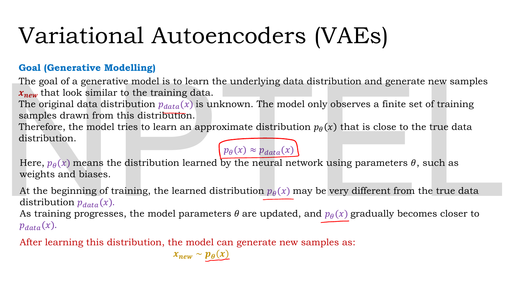
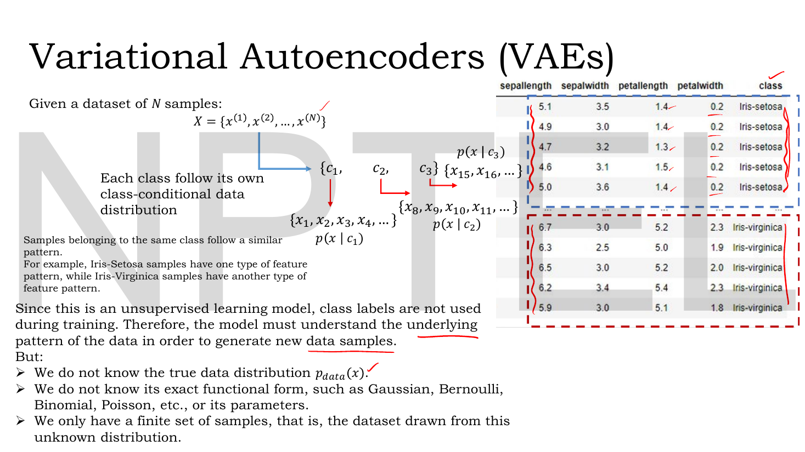
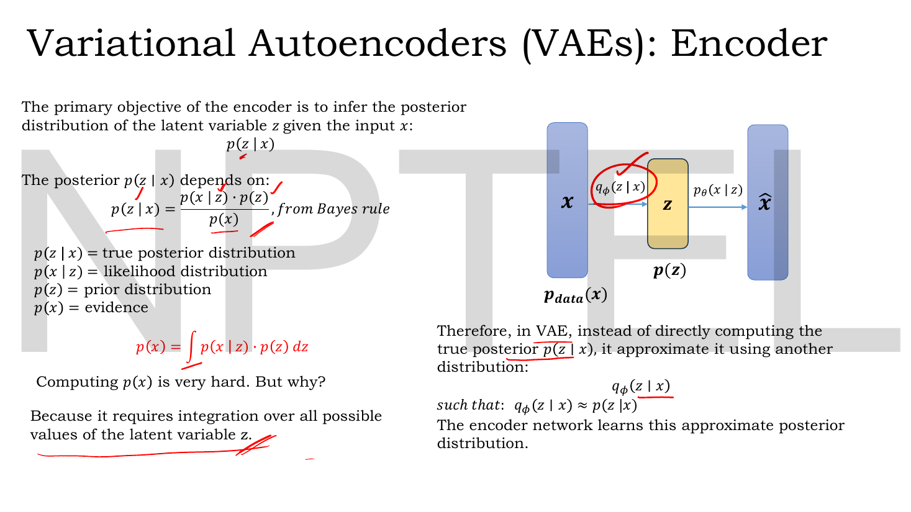

# Lec 21 — Introduction to VAE and the Encoder

> **Source:** `Lec 21.pdf` (12 pages) · **Week 3** · **Playlist:** Lec 21
> **Prereqs:** [Lec 10 — Introduction to Autoencoders](10-autoencoder-intro.md), [Lec 16 — Numerical Example, Limitations of AE](16-ae-numerical-and-limits.md), [Lec 19 — KL Divergence, Part A](19-kl-divergence-a.md), [Lec 20 — KL Divergence, Part B](20-kl-divergence-b.md)
> **Feeds into:** [Lec 22 — Probabilistic Decoder, ELBO, VAE Loss](22-elbo-and-vae-loss.md), [Lec 23 — The Reparameterization Trick](23-reparameterization.md), [Lec 24 — VAE Numerical Example](24-vae-numerical.md), [Lec 26 — Disentanglement and β-VAE](26-beta-vae.md)

## Why this lecture exists

Lec 16 ended with a verdict: an autoencoder reconstructs, it does not generate. Feed it a latent vector it has never seen and you get garbage, because nothing in its training ever told the latent space what shape to be. This lecture names the fix in one move — **stop emitting a point, emit a distribution** — and then builds the encoder that does it.

The deck's own one-line statement of the motive is worth memorising: *"Autoencoder learned reconstruction. VAE is introduced because we want generation."* Everything in this chapter follows from taking that seriously. If you want to sample new data, you need a latent space you can sample from, which means you need a known distribution over latents, which means the encoder must produce distributions rather than codes. The lecture stops at the point where you discover that the distribution you actually want is impossible to compute; [Lec 22](22-elbo-and-vae-loss.md) picks up there.

## The ideas

> **Notation note.** The deck writes plain $x$ and $z$ for what are vectors; this book writes $\mathbf{x}$ and $\mathbf{z}$ (CONTRACT §3). The deck also writes $\mathcal{N}(0,1)$ for the prior on each latent coordinate, which in this book's convention means mean $0$ and **variance** $1$ — the same thing, since $\sigma^2 = \sigma = 1$ here, but the convention matters the moment the numbers stop being 1.

### What a generative model is actually asked to do


*Fig. — Three facts stacked. The true $p_{\text{data}}(\mathbf{x})$ is unknown, the model learns an approximation $p_\theta(\mathbf{x})$, and generation is then a single act of **sampling** from the learned distribution. Notice the arrow of the whole course is in the last line: $\mathbf{x}_{\text{new}} \sim p_\theta(\mathbf{x})$. Page 5.*

A generative model has exactly one job: **learn the distribution the training data came from, then draw new points from it.** Spelled out:

1. There is a true data distribution $p_{\text{data}}(\mathbf{x})$ — the thing that decides which images are plausible digits and which are noise. You never see it.
2. You see $N$ samples drawn from it, $\mathcal{D} = \{\mathbf{x}^{(1)}, \mathbf{x}^{(2)}, \ldots, \mathbf{x}^{(N)}\}$. That is all you get.
3. You build a neural network with parameters $\theta$ (its weights and biases) that defines a distribution $p_\theta(\mathbf{x})$, and you train $\theta$ so that

$$p_\theta(\mathbf{x}) \approx p_{\text{data}}(\mathbf{x})$$

4. Early in training $p_\theta$ is wildly wrong. As $\theta$ is updated it moves closer. When it is close enough, you generate by sampling:

$$\mathbf{x}_{\text{new}} \sim p_\theta(\mathbf{x})$$

The symbol $\sim$ is read "is drawn from". It is not an approximation sign and not an equality — it means *roll the dice according to this distribution*. Step 4 is the one an autoencoder cannot perform, and it is why this entire week exists.

### The data has structure nobody labels for you


*Fig. — The reason generative modelling is hard, in one picture. The data really does split into class-conditional distributions $p(\mathbf{x}\mid c_k)$, but training is **unsupervised** — the `class` column on the right is not shown to the model. The structure must be discovered, not told. Page 4.*

The deck's example is the Iris dataset. Samples of the same class share a feature pattern: every Iris-setosa row has petal length around $1.4$, every Iris-virginica row around $5.2$. Formally, each class $c_k$ has its own **class-conditional distribution** $p(\mathbf{x}\mid c_k)$, and the full data distribution is a mixture of them.

The catch the slide underlines in red: *"Since this is an unsupervised learning model, class labels are not used during training. Therefore, the model must understand the underlying pattern of the data in order to generate new data samples."*

And then the three obstacles, which the deck lists as bullets and which are worth keeping as a checklist:

- You do **not** know $p_{\text{data}}(\mathbf{x})$.
- You do **not** know its functional form — Gaussian? Bernoulli? Binomial? Poisson? — nor its parameters.
- You only have a **finite** sample drawn from it.

So you cannot write $p_{\text{data}}$ down and you cannot fit a textbook density to it. What you can do is build a flexible neural network and push its implied distribution toward the data. That is the VAE's plan.

### Why the plain autoencoder fails here

[Lec 16](16-ae-numerical-and-limits.md) argued this properly and owns it; three sentences to connect the wires. A trained autoencoder's encoder is a **deterministic function**: one input gives one code, always the same code. The training loss only ever cares about the *composition* encoder-then-decoder, so nothing constrains where in latent space the codes land — they can be scattered anywhere, at any scale, with arbitrary empty gaps between them, and the loss will not notice.

That is fatal for step 4 above. To generate you must pick a $\mathbf{z}$ without having an $\mathbf{x}$ to encode, which means sampling from *some* distribution over latent space. But you have no idea what distribution the training codes form, and if you guess one you will land in the gaps, where the decoder has never been trained and produces nonsense.

The VAE's answer has two halves, and you should hold both from the start:

| Problem | VAE's fix | Owner |
|---|---|---|
| Codes form an unknown distribution you cannot sample | **Declare** the latent distribution in advance — the prior $p(\mathbf{z})$ — and force the encoder toward it | this lecture (the declaration), [Lec 22](22-elbo-and-vae-loss.md) (the forcing) |
| One input maps to one isolated point, leaving gaps | Map each input to a **spread of points**, so neighbouring inputs' spreads overlap and fill the space | this lecture |

### Two spaces, and the two mappings between them


*Fig. — The architectural summary of the whole VAE. Two spaces (data and latent), two distributions on them ($p_{\text{data}}(\mathbf{x})$ and $p(\mathbf{z})$), two probabilistic mappings between them ($q_\phi$ going right, $p_\theta$ going left). Notice the mappings are labelled on the arrows of the diagram, so you can read off which direction each one travels. Page 6.*

The deck sets up **two distributions**:

1. **Data-space distribution** $p_{\text{data}}(\mathbf{x})$ — the unknown distribution of the observed samples.
2. **Latent-space distribution** $p(\mathbf{z})$ — the distribution of the compressed representation.

$\mathbf{x}$ and $\mathbf{z}$ live in different spaces with different dimensionality and different structure, so you need machinery to travel between them. The deck is specific that this machinery must be *probabilistic*, i.e. it maps a point to a distribution rather than to a point.

**Two key probabilistic mappings in a VAE:**

| | Name on the deck | Symbol | Direction | Reads as |
|---|---|---|---|---|
| 1 | Approximate posterior (**encoder**) | $q_\phi(\mathbf{z}\mid\mathbf{x})$ | data → latent | the probability of latent $\mathbf{z}$ given data sample $\mathbf{x}$ |
| 2 | Likelihood (**decoder**) | $p_\theta(\mathbf{x}\mid\mathbf{z})$ | latent → data | the probability of generating data $\mathbf{x}$ given latent $\mathbf{z}$ |

Two subscripts, two networks. $\phi$ is the encoder network's weights and biases, $\theta$ is the decoder's. They are trained together but they are different parameters, and an exam will absolutely test whether you know which is which.

The decoder is named here and taught in full by [Lec 22](22-elbo-and-vae-loss.md). This chapter is the encoder's.

### The posterior you want, and why you cannot have it


*Fig. — The pivot of the lecture. The quantity the encoder wants, $p(\mathbf{z}\mid\mathbf{x})$, is perfectly well defined by Bayes' rule — and the denominator of that rule is an integral over every possible latent vector, which no neural network can evaluate. The red underlining is the lecturer's; he means it. Page 7.*

The encoder's **primary objective**, stated on the slide, is to infer the posterior distribution of the latent variable given the input:

$$p(\mathbf{z}\mid\mathbf{x})$$

Read aloud: *given that I have observed this particular data point, what is the distribution of latent codes that could have produced it?* By **Bayes' rule**,

$$p(\mathbf{z}\mid\mathbf{x}) = \frac{p(\mathbf{x}\mid\mathbf{z})\,p(\mathbf{z})}{p(\mathbf{x})}$$

with the four pieces named exactly as the deck names them:

| Piece | Name | What it is |
|---|---|---|
| $p(\mathbf{z}\mid\mathbf{x})$ | **true posterior** | what we want: latents given data |
| $p(\mathbf{x}\mid\mathbf{z})$ | **likelihood** | the decoder: data given latents |
| $p(\mathbf{z})$ | **prior** | our declared belief about latents before seeing data |
| $p(\mathbf{x})$ | **evidence** | the probability of the data under the model, all latents considered |

Three of those four you can get at. The fourth is the wall. The evidence is

$$p(\mathbf{x}) = \int p(\mathbf{x}\mid\mathbf{z})\,p(\mathbf{z})\,d\mathbf{z}$$

**Say this in words before you accept the symbols.** $\int \cdots d\mathbf{z}$ means "add up the following quantity over *every possible value* of $\mathbf{z}$, with $\mathbf{z}$ varying continuously". The quantity being added up is "how likely this $\mathbf{z}$ is a priori" ($p(\mathbf{z})$) times "how likely this $\mathbf{z}$ is to produce the $\mathbf{x}$ I actually saw" ($p(\mathbf{x}\mid\mathbf{z})$). So $p(\mathbf{x})$ is the total probability of producing $\mathbf{x}$, summed over every route through the latent space that could have produced it.

The deck's own answer to its own question — *"Computing $p(\mathbf{x})$ is very hard. But why?"* — is: *"Because it requires integration over all possible values of the latent variable $\mathbf{z}$."*

That is not a statement about effort. There is no closed form, because $p(\mathbf{x}\mid\mathbf{z})$ is a neural network — an arbitrary nonlinear function with millions of parameters — and nobody can integrate a neural network analytically. And there is no brute-force escape either: $\mathbf{z}$ is typically 20 to 200 dimensional, so a numerical grid costs (points per axis)$^{\text{dimensions}}$ evaluations. N5 puts a number on that.

Because $p(\mathbf{x})$ is intractable, $p(\mathbf{z}\mid\mathbf{x})$ is intractable. So the deck makes the move that gives the method its name:

> *"Therefore, in VAE, instead of directly computing the true posterior $p(\mathbf{z}\mid\mathbf{x})$, it approximates it using another distribution $q_\phi(\mathbf{z}\mid\mathbf{x})$, such that $q_\phi(\mathbf{z}\mid\mathbf{x}) \approx p(\mathbf{z}\mid\mathbf{x})$. The encoder network learns this approximate posterior distribution."*

**This is where this lecture stops.** You now know what $q_\phi$ is for. *How* to train $q_\phi$ to be a good approximation — and what "good" even means numerically — requires the ELBO, which is entirely [Lec 22](22-elbo-and-vae-loss.md)'s.

### The latent variable is a vector, and the prior is standard normal

![Slide: z = [z_1,...,z_d]; a 100-feature input encoded to 25 dimensions; the prior p(z_i) = N(0,1) highlighted in yellow as "Prior probability", with the claims that Gaussian is simple and sampling is easy](../assets/pages/lec21/p-08.png)
*Fig. — Two separate claims that are easy to merge by mistake. The latent is a **vector** of $d$ coordinates (left, top), and the prior on each coordinate is **chosen** — not learned, not measured — to be standard normal (left, bottom). "This enforces a well-structured and continuous latent space" is the purpose of the choice. Page 8.*

The latent variable is not a single number:

$$\mathbf{z} = [z_1, z_2, \ldots, z_d]$$

Each $z_i$ is a **latent dimension** (the deck also says "latent variable" for a single coordinate, which is loose; the vector is what gets passed to the decoder). The deck's example: an input with 100 features encoded down to 25, so $\mathbf{z} = [z_1, \ldots, z_{25}]$.

Now the key design decision. We want a *meaningful* latent representation, but we do not know what structure the latent space should have. So we do not discover it — **we impose it**. The deck:

$$p(z_i) = \mathcal{N}(0, 1) \qquad \text{(prior probability)}$$

Every latent coordinate is declared to be standard normal before training begins: mean $0$, **variance** $1$. Stacking the $d$ coordinates and assuming they are independent gives the joint prior $p(\mathbf{z}) = \mathcal{N}(\mathbf{0}, \mathbf{I})$ — the deck does not write this but [Lec 22](22-elbo-and-vae-loss.md)'s page 5 does.

Three reasons, two of them the deck's and one implicit:

- **It enforces a well-structured and continuous latent space.** If every input's code is pushed toward the same unit-scale blob centred at the origin, the codes cannot drift apart into isolated islands. The gaps that killed the autoencoder get filled.
- **Gaussian is simple and mathematically convenient**, and **sampling becomes easy** — `np.random.randn(d)` and you have a valid latent vector, with no knowledge of the training set required. That is step 4 of generation, finally available.
- Implicitly: a Gaussian prior against a Gaussian encoder gives a KL divergence with a **closed form** — an exact algebraic expression in $\mu$ and $\sigma^2$, derived in [Lec 22](22-elbo-and-vae-loss.md) — so the training signal is a formula rather than a sampling estimate.

**The prior is a choice, not a fact.** Nothing about the data says the latent space is standard normal. We make it standard normal by penalising the encoder when it is not. That penalty is the second half of [Lec 22](22-elbo-and-vae-loss.md)'s loss.

### The probabilistic encoder: a distribution per input


*Fig. — The chapter's central slide. A general distribution over $\mathbf{z}$ would need infinitely many numbers to describe; a **Gaussian** needs two per dimension, which is a number of outputs a neural network can produce. The red handwriting at bottom-left is the lecturer sketching $q_\phi(\mathbf{z}\mid\mathbf{x})$ and $p(\mathbf{z})$ side by side — the comparison the KL term will make. Page 9.*

Here is the move that defines the VAE's encoder.

**Step 1 — the encoder outputs a distribution, not a code.** Where an autoencoder's encoder computed $\mathbf{h} = g(\mathbf{W}_e\mathbf{x})$ and handed that vector to the decoder, a VAE's encoder outputs the *parameters of a distribution* $q_\phi(\mathbf{z}\mid\mathbf{x})$ over latent vectors. Input $\mathbf{x}$, and what comes out is a probability cloud of plausible codes.

**Step 2 — restrict that distribution to be Gaussian.** The deck: *"Instead of allowing this distribution to be any complex distribution, we assume it to be Gaussian."*

$$q_\phi(\mathbf{z}\mid\mathbf{x}) = \mathcal{N}\big(\mu_\phi(\mathbf{x}),\ \sigma^2_\phi(\mathbf{x})\big)$$

This is an assumption, imposed for tractability, exactly as tied weights were in [Lec 11](11-reconstruction-loss.md). It costs you expressiveness — the true posterior may well be skewed or multi-modal, and a Gaussian cannot be — and it buys you everything else.

**Step 3 — count the outputs.** *"A Gaussian distribution can be represented using only two parameters: $\mu$ and $\sigma^2$. So the encoder only needs to output $\mu_\phi(\mathbf{x})$, $\sigma^2_\phi(\mathbf{x})$. That makes the model easier to train."* Both are **functions of $\mathbf{x}$** — a different input gives a different mean and a different spread. That subscript-$\phi$-of-$\mathbf{x}$ notation is doing real work; do not read $\mu$ as a fixed constant.

**Step 4 — then sampling is available.** Once the encoder has produced $\mu_\phi(\mathbf{x})$ and $\sigma^2_\phi(\mathbf{x})$ you draw

$$\mathbf{z} \sim \mathcal{N}\big(\mu_\phi(\mathbf{x}),\ \sigma^2_\phi(\mathbf{x})\big)$$

and *that* is what the decoder receives. Encode the same image twice and you get two different latent vectors. This is the single biggest behavioural difference from an autoencoder.

**Step 5 — why Gaussian and not something else.** The deck gives the honest reason: *"The prior $p(\mathbf{z})$ serves as a reference distribution for $q_\phi(\mathbf{z}\mid\mathbf{x})$ … So choosing $q_\phi(\mathbf{z}\mid\mathbf{x})$ also as Gaussian makes it easier to compare $q_\phi(\mathbf{z}\mid\mathbf{x})$ with $p(\mathbf{z})$."* Both distributions Gaussian means the comparison between them has a closed form.

And the comparison is named, in bold, at the bottom of the slide. The deck asks *"Who ensures both distributions are Gaussian?"* and answers:

$$D_{\mathrm{KL}}\big(q_\phi(\mathbf{z}\mid\mathbf{x})\,\big\|\,p(\mathbf{z})\big)$$

*"KL divergence term ensures that the learned encoder distribution remains close to this prior."* KL divergence itself is [Lec 19](19-kl-divergence-a.md)'s, and where this term sits inside the training objective is [Lec 22](22-elbo-and-vae-loss.md)'s. Note only that it appears here, as the answer to "what stops the encoder ignoring the prior".

### Why the network emits $\log\sigma^2$ and not $\sigma$

The deck's page 10 shows the encoder producing a **log-variance vector** $\log\sigma^2$ and then converting, $\sigma_i^2 = \exp(\log\sigma_i^2)$. It never says why. This is examinable and the reasoning is short, so learn it.

**Reason 1 — range. A variance must be positive; a neural network output is not.** The last layer of the variance head is an affine map $\mathbf{W}\mathbf{h} + \mathbf{b}$, whose output can be any real number: $-4.1$, $0$, $+900$. A variance of $-4.1$ is meaningless, and a standard deviation of $\sqrt{-4.1}$ does not exist. You therefore need a function that takes *any* real number and returns a *strictly positive* one. That function is $\exp$:

$$\sigma_i^2 = \exp(s_i), \qquad s_i \in (-\infty, \infty) \ \Longrightarrow\ \sigma_i^2 \in (0, \infty)$$

Interpret the raw output $s_i$ as $\log\sigma_i^2$ and the constraint enforces itself. No clamping, no penalty, no special case — the parameterisation is unconstrained and every value the network can emit is legal.

The alternatives are all worse. A ReLU head gives exactly $0$ for every negative pre-activation, and a variance of exactly zero is a degenerate distribution — plus $\log 0 = -\infty$, which appears directly in the KL formula and takes the loss to `nan`. A softplus head is positive and is occasionally used, but it does not give the second property:

**Reason 2 — numerical stability and scale.** Variances span many orders of magnitude; a well-trained VAE routinely has $\sigma^2$ between $10^{-4}$ and $1$. On a **linear** scale those are all crushed into a sliver near zero, so a gradient step of a given size is enormous for a small variance and negligible for a large one. On a **log** scale they are spread evenly: $\log\sigma^2$ ranging over $[-9, 0]$ is a comfortable range for a network to produce, and equal steps in $\log\sigma^2$ are equal *multiplicative* steps in $\sigma^2$. Learning a quantity that varies multiplicatively is far better behaved in its logarithm.

**Reason 3 — the loss is already written in $\log\sigma^2$.** The Gaussian-to-Gaussian KL (see [Lec 22](22-elbo-and-vae-loss.md) page 8) contains the term $-\log\sigma^2$ explicitly. If the network emits $\log\sigma^2$ directly, that term is read off with no function call and no risk of taking the log of a numerically-zero variance.

| The network emits | Then | Legal for every output? | Stable? |
|---|---|---|---|
| $\sigma$ | use directly | no — $\sigma<0$ is invalid | no |
| $\sigma^2$ | use directly | no — $\sigma^2<0$ is invalid | no |
| $\sigma^2$ via ReLU | $\max(s,0)$ | yes but $\sigma^2=0$ allowed | no — $\log 0 = -\infty$ |
| $\log\sigma^2$ | $\sigma^2 = e^{s}$, $\sigma = e^{s/2}$ | **yes, always $>0$** | **yes** |

Memorise the two conversions in both directions, because numerical questions run both ways:

$$\sigma^2 = \exp(\log\sigma^2), \qquad \sigma = \exp\!\big(\tfrac{1}{2}\log\sigma^2\big), \qquad \log\sigma^2 = 2\log\sigma$$

### The encoder's output layer, concretely

![Slide: an Input box feeding an Encoder trapezoid that splits into a green mu vector and a green log-sigma² vector, both feeding a Latent Space block of size 5; on the right, mu = [0.5, −0.2, 1.0, 0.3, −0.5], log σ² = [−1.386, −2.303, −0.693, −1.833, −1.386], converted to σ² = [0.25, 0.10, 0.50, 0.16, 0.25], the five Gaussians listed, and the sampled z = [0.65, −0.10, 0.80, 0.42, −0.70]](../assets/pages/lec21/p-10.png)
*Fig. — The lecture's one fully worked example, and the slide to re-read the night before the exam. Notice the encoder trapezoid **forks into two heads**, not one, and that the latent dimension 5 means ten output numbers — five means and five log-variances. The handwritten `z₁ z₂ z₃ z₄ z₅` boxes at the centre-right are the lecturer counting the latent slots. Page 10.*

The architecture, read off the diagram left to right:

```
                    ┌──────────────────────┐
                    │  μ  = [μ₁ … μ_d]     │  d outputs
  x ──► Encoder ────┤                      ├──► z ~ N(μ, σ²)  ──► Decoder
   (shared trunk)   │ logσ² = [logσ²₁ … ]  │  d outputs
                    └──────────────────────┘
```

One shared trunk of hidden layers, then **two parallel linear heads** of $d$ units each. Total $2d$ numbers out of the encoder for a $d$-dimensional latent. For the deck's $d = 5$: ten numbers.

The deck's numbers, with the arithmetic done in N1:

| $i$ | $\mu_i$ | $\log\sigma_i^2$ | $\sigma_i^2$ | $\sigma_i$ | $z_i \sim$ |
|---|---|---|---|---|---|
| 1 | $0.5$ | $-1.386$ | $0.25$ | $0.50$ | $\mathcal{N}(0.5,\ 0.25)$ |
| 2 | $-0.2$ | $-2.303$ | $0.10$ | $0.3162$ | $\mathcal{N}(-0.2,\ 0.10)$ |
| 3 | $1.0$ | $-0.693$ | $0.50$ | $0.7071$ | $\mathcal{N}(1.0,\ 0.50)$ |
| 4 | $0.3$ | $-1.833$ | $0.16$ | $0.40$ | $\mathcal{N}(0.3,\ 0.16)$ |
| 5 | $-0.5$ | $-1.386$ | $0.25$ | $0.50$ | $\mathcal{N}(-0.5,\ 0.25)$ |

Then *"now sample one value from each Gaussian distribution"*, giving the deck's

$$\mathbf{z} = [0.65,\ -0.10,\ 0.80,\ 0.42,\ -0.70]$$

**Read the second column of that table carefully: $\mathcal{N}(0.5, 0.25)$ means variance $0.25$ and standard deviation $0.5$.** The deck writes it this way too, and the single commonest arithmetic error in VAE numericals is treating the second argument as a standard deviation. The notation in this book is always $\mathcal{N}(\mu, \sigma^2)$.

Note also that the five coordinates are sampled **independently** — one draw per dimension from that dimension's own Gaussian. That is the **diagonal covariance** assumption: $\sigma^2_\phi(\mathbf{x})$ is a vector of $d$ variances, not a $d\times d$ matrix, and the encoder cannot represent correlations between latent coordinates. The deck never says this out loud, but every formula on it assumes it.

Finally, the sampling in step 4 is what makes the next lecture-and-a-half necessary. Drawing a random number is not a differentiable operation, so gradients cannot flow from the decoder back through the sample into $\phi$. [Lec 23](23-reparameterization.md) fixes exactly this and owns it completely.

## Worked numericals

### N1. The slide's log-variance conversion (page 10)

**Given:** $\log\sigma^2 = [-1.386,\ -2.303,\ -0.693,\ -1.833,\ -1.386]$.
**Find:** $\sigma^2$ and $\sigma$ for each latent dimension; check against the slide's $\sigma^2 = [0.25, 0.10, 0.50, 0.16, 0.25]$.

1. Apply $\sigma_i^2 = \exp(\log\sigma_i^2)$ to each entry:

| $i$ | $\log\sigma_i^2$ | $\exp(\cdot)$ | slide says | $\sigma_i = \sqrt{\sigma_i^2}$ |
|---|---|---|---|---|
| 1 | $-1.386$ | $0.250074$ | $0.25$ | $0.50007$ |
| 2 | $-2.303$ | $0.099959$ | $0.10$ | $0.31616$ |
| 3 | $-0.693$ | $0.500074$ | $0.50$ | $0.70716$ |
| 4 | $-1.833$ | $0.159933$ | $0.16$ | $0.39992$ |
| 5 | $-1.386$ | $0.250074$ | $0.25$ | $0.50007$ |

2. Check the inverse direction, which is how the slide's numbers were constructed: $\log(0.25) = -1.386294$, $\log(0.10) = -2.302585$, $\log(0.50) = -0.693147$, $\log(0.16) = -1.832581$. The deck rounded each to three decimals.

**Answer:** $\sigma^2 = [0.2501,\ 0.1000,\ 0.5001,\ 0.1599,\ 0.2501]$ and $\sigma = [0.5001,\ 0.3162,\ 0.7072,\ 0.3999,\ 0.5001]$. **The slide's arithmetic is correct** to the precision it quotes; the tiny residuals are purely the three-decimal rounding of the log-variances.

### N2. Is the slide's sampled $\mathbf{z}$ plausible?

**Given:** the five Gaussians from N1 and the deck's sampled $\mathbf{z} = [0.65, -0.10, 0.80, 0.42, -0.70]$.
**Find:** how many standard deviations each sampled value sits from its own mean, and whether the draw is believable.

1. The standardised score of a value $z_i$ under $\mathcal{N}(\mu_i, \sigma_i^2)$ is $(z_i - \mu_i)/\sigma_i$.
2. Dimension by dimension:

| $i$ | $z_i$ | $\mu_i$ | $\sigma_i$ | $(z_i-\mu_i)/\sigma_i$ |
|---|---|---|---|---|
| 1 | $0.65$ | $0.5$ | $0.5001$ | $(0.15)/(0.5001) = 0.300$ |
| 2 | $-0.10$ | $-0.2$ | $0.3162$ | $(0.10)/(0.3162) = 0.316$ |
| 3 | $0.80$ | $1.0$ | $0.7072$ | $(-0.20)/(0.7072) = -0.283$ |
| 4 | $0.42$ | $0.3$ | $0.3999$ | $(0.12)/(0.3999) = 0.300$ |
| 5 | $-0.70$ | $-0.5$ | $0.5001$ | $(-0.20)/(0.5001) = -0.400$ |

3. Every score lies in $[-0.4, 0.32]$, comfortably inside one standard deviation.

**Answer:** scores $[0.300,\ 0.316,\ -0.283,\ 0.300,\ -0.400]$ — all well within $\pm1\sigma$, so the draw is entirely plausible (about 68% of draws fall within $\pm1\sigma$). Note dimension 3: the *largest* deviation in raw units ($-0.20$) is the *smallest* in standardised units, because that dimension has the widest spread. **Raw distance from the mean tells you nothing until you divide by $\sigma$.**

### N3. The failure mode a variance head would have

**Given:** an encoder whose final variance layer emits the raw values $s = [-9.0,\ -4.0,\ 0.0,\ 2.0,\ 7.0]$ — ordinary outputs for an affine layer.
**Find:** the resulting variances if these are read as (a) $\sigma^2$ directly, (b) $\mathrm{ReLU}(s)$, (c) $\log\sigma^2$.

1. **(a) read as $\sigma^2$:** $\sigma^2 = [-9.0, -4.0, 0.0, 2.0, 7.0]$. Three of the five are invalid; $\sigma_1 = \sqrt{-9}$ does not exist. The model is broken on 60% of its own outputs.
2. **(b) ReLU:** $\sigma^2 = [0, 0, 0, 2, 7]$. All non-negative, but three dimensions have variance exactly $0$. The KL term needs $\log\sigma^2 = \log 0 = -\infty$, so the loss is `-inf` and the gradients are `nan`.
3. **(c) read as $\log\sigma^2$:** $\sigma^2 = [e^{-9}, e^{-4}, e^{0}, e^{2}, e^{7}] = [0.000123,\ 0.018316,\ 1.0,\ 7.389,\ 1096.63]$. Every entry strictly positive, nothing invalid, nothing infinite.

**Answer:** only (c) is usable. The log-variance parameterisation turns the whole real line into the whole positive half-line, so the constraint $\sigma^2 > 0$ costs nothing and can never be violated — and it does so while spanning seven orders of magnitude ($1.2\times10^{-4}$ to $1.1\times10^{3}$) from inputs of modest size.

### N4. Sizing the encoder's two heads

**Given:** input dimension $n = 100$, a shared encoder trunk ending in a hidden layer of width $H = 128$, and latent dimension $d = 25$ (the deck's $100 \to 25$).
**Find:** the number of outputs the encoder produces, and the parameters in the two heads.

1. Outputs: $d$ means plus $d$ log-variances $= 25 + 25 = \mathbf{50}$ numbers. (Not 25.)
2. Each head is a linear layer $128 \to 25$: weights $128\times25 = 3200$, biases $25$, total $3225$.
3. Two heads: $2 \times 3225 = 6450$ parameters.
4. Compare the equivalent *autoencoder* bottleneck, a single $128\to25$ layer: $3225$ parameters.

**Answer:** 50 output units and $6450$ head parameters, exactly double the autoencoder's $3225$. The entire architectural cost of going probabilistic is **one extra head** — $3225$ parameters on a network with hundreds of thousands. The expensive part of the VAE is the loss function, not the architecture.

### N5. How intractable is "intractable"?

**Given:** $p(\mathbf{x}) = \int p(\mathbf{x}\mid\mathbf{z})p(\mathbf{z})\,d\mathbf{z}$ with latent dimension $d = 25$, approximated by a grid of $10$ points along each latent axis.
**Find:** the number of decoder forward passes needed for **one** data point, and the time at $10^9$ passes per second.

1. A grid with $10$ points per axis in $d$ dimensions has $10^d$ cells.
2. $d = 25 \Rightarrow 10^{25}$ decoder evaluations, each for a single $\mathbf{x}$.
3. At $10^{9}$ evaluations per second: $10^{25}/10^{9} = 10^{16}$ seconds.
4. $10^{16}$ s $\div\ (3.156\times10^{7}$ s per year$) \approx 3.2\times10^{8}$ years.

**Answer:** about $3\times10^{8}$ years — 300 million — per data point, per training step, for a coarse 10-point grid. And 10 points per axis would be a hopeless approximation anyway. "Intractable" is not shorthand for "slow"; the brute-force route is not off by a factor you can engineer away. This is why the course spends a whole lecture on a *bound* instead.

### N6. Where does a latent coordinate actually land?

**Given:** latent dimension 1 of the deck's example, $z_1 \sim \mathcal{N}(0.5,\ 0.25)$, and dimension 2, $z_2 \sim \mathcal{N}(-0.2,\ 0.10)$.
**Find:** the central 95% interval for each, and comment on their overlap with the prior $\mathcal{N}(0,1)$.

1. For a Gaussian, 95% of the mass lies within $\mu \pm 1.96\sigma$.
2. Dimension 1: $\sigma_1 = \sqrt{0.25} = 0.5$, so the interval is $0.5 \pm 1.96(0.5) = 0.5 \pm 0.98 = [-0.48,\ 1.48]$.
3. Dimension 2: $\sigma_2 = \sqrt{0.10} = 0.3162$, so $-0.2 \pm 1.96(0.3162) = -0.2 \pm 0.6198 = [-0.82,\ 0.42]$.
4. The prior's own 95% interval is $0 \pm 1.96(1) = [-1.96,\ 1.96]$.

**Answer:** $z_1 \in [-0.48,\ 1.48]$ and $z_2 \in [-0.82,\ 0.42]$ with 95% probability. Both encoder intervals are **much narrower than the prior's** $[-1.96, 1.96]$ — the encoder has shrunk its variances to $0.25$ and $0.10$ against the prior's $1$. That is the encoder preferring precise reconstruction over matching the prior, and it is exactly the disagreement the KL term exists to penalise. [Lec 22](22-elbo-and-vae-loss.md)'s N2 puts a number on how much it costs.

## Code

The encoder's two heads, the log-variance conversion, and a direct demonstration of why no other parameterisation works.

```python
import numpy as np

# --- The deck's page-10 encoder output. Latent dimension d = 5.
mu      = np.array([ 0.500, -0.200,  1.000,  0.300, -0.500])
log_var = np.array([-1.386, -2.303, -0.693, -1.833, -1.386])

var = np.exp(log_var)            # sigma^2 = exp(log sigma^2): always strictly positive
sd  = np.sqrt(var)
print("sigma^2 =", np.round(var, 4))
print("sigma   =", np.round(sd, 4))

# The deck's sampled latent vector, scored in standard deviations from its own mean.
z = np.array([0.65, -0.10, 0.80, 0.42, -0.70])
print("z-score =", np.round((z - mu) / sd, 3))

# --- Why a log-variance head rather than a variance head.
raw = np.array([-9.0, -4.0, 0.0, 2.0, 7.0])      # anything a linear layer may emit
print("\nexp(raw)     =", np.round(np.exp(raw), 8))   # every entry > 0, no clamping
print("smallest     =", np.exp(raw).min(), " largest =", np.exp(raw).max())

# A head emitting sigma^2 directly must be forced positive somehow. ReLU gives exact zeros:
relu_var = np.maximum(raw, 0.0)
print("relu(raw)    =", relu_var)
with np.errstate(divide='ignore'):
    print("log of that  =", np.log(relu_var))      # -inf: the KL term is now undefined
```

```
sigma^2 = [0.2501 0.1    0.5001 0.1599 0.2501]
sigma   = [0.5001 0.3162 0.7072 0.3999 0.5001]
z-score = [ 0.3    0.316 -0.283  0.3   -0.4  ]

exp(raw)     = [1.23410000e-04 1.83156400e-02 1.00000000e+00 7.38905610e+00
 1.09663316e+03]
smallest     = 0.00012340980408667956  largest = 1096.6331584284585
relu(raw)    = [0. 0. 0. 2. 7.]
log of that  = [      -inf       -inf       -inf 0.69314718 1.94591015]
```

Three readings. The first block reproduces the slide exactly. The second shows the log-variance head mapping five unremarkable network outputs onto variances spanning seven orders of magnitude, all strictly positive — that is the range argument, made concrete. The third is the failure: a ReLU'd variance head produces exact zeros, whose logarithm is $-\infty$, and that $-\infty$ feeds straight into the KL term of the loss. One `-inf` poisons the entire batch's gradient.

## Exam pack

### Must-memorise

| Item | Exactly this |
|---|---|
| Generative goal | $p_\theta(\mathbf{x}) \approx p_{\text{data}}(\mathbf{x})$, then $\mathbf{x}_{\text{new}} \sim p_\theta(\mathbf{x})$ |
| Encoder (approximate posterior) | $q_\phi(\mathbf{z}\mid\mathbf{x})$ — parameters $\phi$ |
| Decoder (likelihood) | $p_\theta(\mathbf{x}\mid\mathbf{z})$ — parameters $\theta$ |
| Bayes' rule for the posterior | $p(\mathbf{z}\mid\mathbf{x}) = \dfrac{p(\mathbf{x}\mid\mathbf{z})\,p(\mathbf{z})}{p(\mathbf{x})}$ |
| The evidence | $p(\mathbf{x}) = \displaystyle\int p(\mathbf{x}\mid\mathbf{z})\,p(\mathbf{z})\,d\mathbf{z}$ |
| Why it is intractable | integration over **all possible values** of $\mathbf{z}$ |
| The VAE's response | learn $q_\phi(\mathbf{z}\mid\mathbf{x}) \approx p(\mathbf{z}\mid\mathbf{x})$ |
| Encoder's assumed family | $q_\phi(\mathbf{z}\mid\mathbf{x}) = \mathcal{N}\big(\mu_\phi(\mathbf{x}),\ \sigma^2_\phi(\mathbf{x})\big)$ |
| Prior | $p(z_i) = \mathcal{N}(0,1)$, jointly $p(\mathbf{z}) = \mathcal{N}(\mathbf{0},\mathbf{I})$ |
| Encoder outputs | $\mu_\phi(\mathbf{x})$ and $\log\sigma^2_\phi(\mathbf{x})$ — **$2d$ numbers for latent dim $d$** |
| Variance recovery | $\sigma^2 = \exp(\log\sigma^2)$, $\ \sigma = \exp(\tfrac12\log\sigma^2)$ |
| Sampling the latent | $\mathbf{z} \sim \mathcal{N}\big(\mu_\phi(\mathbf{x}),\ \sigma^2_\phi(\mathbf{x})\big)$ |
| What keeps $q_\phi$ near the prior | $D_{\mathrm{KL}}\big(q_\phi(\mathbf{z}\mid\mathbf{x})\,\|\,p(\mathbf{z})\big)$ |
| The four Bayes names | posterior / likelihood / prior / evidence |

### Numbers worth knowing

| Quantity | Value |
|---|---|
| Deck's running latent dimension | $d = 5$ |
| Deck's compression example | 100 features $\to$ 25 latent dimensions |
| Encoder outputs for $d=5$ | 10 (five $\mu$, five $\log\sigma^2$) |
| Deck's $\mu$ | $[0.5,\ -0.2,\ 1.0,\ 0.3,\ -0.5]$ |
| Deck's $\log\sigma^2$ | $[-1.386,\ -2.303,\ -0.693,\ -1.833,\ -1.386]$ |
| Deck's $\sigma^2$ | $[0.25,\ 0.10,\ 0.50,\ 0.16,\ 0.25]$ |
| Corresponding $\sigma$ | $[0.50,\ 0.316,\ 0.707,\ 0.400,\ 0.50]$ |
| Deck's sampled $\mathbf{z}$ | $[0.65,\ -0.10,\ 0.80,\ 0.42,\ -0.70]$ |
| $\log\sigma^2$ for $\sigma^2=1$ | $0$ (the prior's value) |
| $\log 0.25 / \log 0.10 / \log 0.50 / \log 0.16$ | $-1.3863 / -2.3026 / -0.6931 / -1.8326$ |
| Gaussian 95% half-width | $1.96\sigma$ |
| Prior's 95% interval | $[-1.96,\ 1.96]$ |

### Likely MCQ traps

- **$\mathcal{N}(0.5, 0.25)$ read as standard deviation $0.25$.** The second argument is the **variance**. $\mathcal{N}(0.5,0.25)$ has $\sigma = 0.5$. Every VAE numerical in this course hinges on this; getting it wrong squares or square-roots your answer.
- **"The encoder outputs $\mathbf{z}$."** It does not. It outputs $\mu_\phi(\mathbf{x})$ and $\log\sigma^2_\phi(\mathbf{x})$; $\mathbf{z}$ is then **sampled** from the Gaussian they define. $2d$ numbers out, $d$ numbers sampled.
- **"The encoder outputs $\sigma$."** It outputs $\log\sigma^2$. If a question gives you $-1.386$ and asks for the standard deviation, the answer is $\exp(-1.386/2) = 0.5$, not $\exp(-1.386) = 0.25$ and not $-1.386$.
- **Swapping $\phi$ and $\theta$.** $\phi$ = encoder, $q$; $\theta$ = decoder, $p$. Mnemonic: $q$ for **q**uery-the-latent (encoder), $p$ for **p**roduce-the-data (decoder).
- **Confusing the prior $p(\mathbf{z})$ with the posterior $p(\mathbf{z}\mid\mathbf{x})$ with the approximate posterior $q_\phi(\mathbf{z}\mid\mathbf{x})$.** Three different objects: the prior is chosen and fixed at $\mathcal{N}(\mathbf{0},\mathbf{I})$; the true posterior is intractable and never computed; $q_\phi$ is what the encoder learns, as a stand-in for the second.
- **"$p(\mathbf{x})$ is hard because the dataset is large."** No — it is hard because of the **integral over all $\mathbf{z}$**, for a *single* $\mathbf{x}$. Dataset size is irrelevant to the difficulty.
- **Thinking the prior is estimated from the data.** It is **declared** before training, $\mathcal{N}(0,1)$ per dimension, for structural and computational convenience. Nothing measures it.
- **"$\sigma^2_\phi(\mathbf{x})$ is a covariance matrix."** It is a vector of $d$ variances — a **diagonal** covariance. The encoder cannot represent correlation between latent dimensions.
- **"VAE is just an autoencoder with noise added."** The noise is not decoration; the encoder emits distribution *parameters*, and the loss ([Lec 22](22-elbo-and-vae-loss.md)) contains a term that exists only because of them.
- **Reading $\mu_\phi(\mathbf{x})$ as a learned constant.** It is a *function of the input* computed by the network — different $\mathbf{x}$, different $\mu$.

### Self-test

1. State the two things a generative model must do, in order, and which one an autoencoder cannot do.
2. Write Bayes' rule for $p(\mathbf{z}\mid\mathbf{x})$ and name all four quantities in it.
3. Why is $p(\mathbf{x})$ intractable? Answer in one sentence that mentions $\mathbf{z}$.
4. An encoder has latent dimension 16. How many numbers does its output layer produce, and what are they?
5. The encoder emits $\log\sigma^2 = -4.605$ for one dimension. Give $\sigma^2$ and $\sigma$.
6. Give two distinct reasons the network emits $\log\sigma^2$ rather than $\sigma^2$.
7. $z_3 \sim \mathcal{N}(1.0, 0.50)$ and a sample of $0.80$ is drawn. How many standard deviations from the mean is that?
8. What is the prior in a standard VAE, and is it learned or chosen?
9. Why is $q_\phi(\mathbf{z}\mid\mathbf{x})$ assumed Gaussian rather than left arbitrary? Give the deck's reason.
10. Which quantity does the deck name as the thing that keeps $q_\phi(\mathbf{z}\mid\mathbf{x})$ close to $p(\mathbf{z})$?

<details><summary>Answers</summary>

1. (i) Learn a distribution $p_\theta(\mathbf{x})$ close to $p_{\text{data}}(\mathbf{x})$; (ii) **sample** new data $\mathbf{x}_{\text{new}} \sim p_\theta(\mathbf{x})$. The autoencoder cannot do (ii): it has no distribution over latents to sample from, so any $\mathbf{z}$ you invent is likely to land in a region the decoder never saw. See [Lec 16](16-ae-numerical-and-limits.md).
2. $p(\mathbf{z}\mid\mathbf{x}) = p(\mathbf{x}\mid\mathbf{z})p(\mathbf{z})/p(\mathbf{x})$. Left side: the **true posterior**. $p(\mathbf{x}\mid\mathbf{z})$: the **likelihood**. $p(\mathbf{z})$: the **prior**. $p(\mathbf{x})$: the **evidence**.
3. Because $p(\mathbf{x}) = \int p(\mathbf{x}\mid\mathbf{z})p(\mathbf{z})\,d\mathbf{z}$ requires integrating over **every possible value of the latent variable $\mathbf{z}$**, and the integrand is a neural network, so there is neither a closed form nor a feasible numerical grid (N5: $\sim10^{25}$ evaluations at $d=25$).
4. $2 \times 16 = \mathbf{32}$ numbers: 16 means $\mu_\phi(\mathbf{x})$ and 16 log-variances $\log\sigma^2_\phi(\mathbf{x})$.
5. $\sigma^2 = \exp(-4.605) = 0.01$; $\sigma = \exp(-4.605/2) = \exp(-2.3025) = 0.1$.
6. (i) **Range** — a linear layer outputs any real number, but a variance must be positive; $\exp$ maps $(-\infty,\infty)$ onto $(0,\infty)$ so the constraint can never be violated. (ii) **Stability/scale** — variances span orders of magnitude, which is a multiplicative range; learning them in log space makes equal gradient steps equal multiplicative changes, and avoids $\log 0 = -\infty$ in the KL term. (A third: the KL formula is written in terms of $\log\sigma^2$ already.)
7. $\sigma_3 = \sqrt{0.50} = 0.7071$, so $(0.80-1.00)/0.7071 = -0.283$ — about $0.28$ standard deviations *below* the mean.
8. $p(z_i) = \mathcal{N}(0,1)$ per dimension, jointly $\mathcal{N}(\mathbf{0},\mathbf{I})$. It is **chosen**, fixed before training, because it gives a well-structured continuous latent space that is trivial to sample from.
9. A Gaussian is described by just two parameters per dimension, so the encoder only has to emit $2d$ numbers — the deck's "that makes the model easier to train" — and because the prior is also Gaussian, **comparing $q_\phi$ with $p(\mathbf{z})$ becomes easy** (a closed-form KL).
10. The KL divergence $D_{\mathrm{KL}}\big(q_\phi(\mathbf{z}\mid\mathbf{x})\,\|\,p(\mathbf{z})\big)$ — see [Lec 19](19-kl-divergence-a.md) for the divergence itself and [Lec 22](22-elbo-and-vae-loss.md) for where it sits in the loss.

</details>

## Beyond the slides

**Gap: the deck never says the covariance is diagonal.**
**Why it matters:** writing $q_\phi(\mathbf{z}\mid\mathbf{x}) = \mathcal{N}(\mu_\phi(\mathbf{x}), \sigma^2_\phi(\mathbf{x}))$ with $\sigma^2$ a *vector* silently assumes the $d$ latent coordinates are independent given $\mathbf{x}$ — a diagonal covariance matrix. Three consequences you are examinable on: the encoder emits $2d$ numbers rather than $d + d(d+1)/2$; the KL term decomposes into a **sum of $d$ independent one-dimensional KLs** (which is why [Lec 22](22-elbo-and-vae-loss.md)'s closed form has a $\sum_j$); and the approximate posterior provably cannot capture correlated latent structure, one of the standard explanations for VAE blurriness.

**Gap: "the encoder learns the approximate posterior" sounds like one posterior is learned.**
**Why it matters:** there is a *different* posterior for every data point, and a VAE does not fit each one separately. It trains **one network** that maps any $\mathbf{x}$ to its posterior's parameters — the technique is called **amortised inference**, and the word "amortised" is the reason a VAE scales to a million images while classical variational inference does not. It also explains a real failure: because one network must serve all inputs, $q_\phi$ is never quite the best Gaussian for any single $\mathbf{x}$, and the shortfall ("the amortisation gap") shows up as a looser ELBO.

**Gap: the deck says a distribution over codes gives a "well-structured and continuous latent space" but never says why spreading helps.**
**Why it matters:** the mechanism is overlap. Because each input is encoded to a *region*, and the KL term stops those regions shrinking to points, nearby inputs' regions intersect — and the decoder is trained on samples from the intersection. Every point in the overlap must decode to something plausible for *both* inputs, which is precisely what makes [Lec 28](28-latent-interpolation.md)'s interpolation work and what an autoencoder's isolated points cannot deliver.

**Gap: no word on what $\sigma_\phi(\mathbf{x})$ means once the model is trained.**
**Why it matters:** it is the encoder's **uncertainty** about that specific input. An ambiguous digit gets a wide posterior, a clean prototypical one a narrow posterior, and dimensions the decoder ignores get $\sigma^2 \to 1$ with $\mu \to 0$ — i.e. they collapse back to the prior and carry no information. Reading the per-dimension $\sigma^2$ of a trained VAE is the standard diagnostic for **posterior collapse** and for counting how many latent dimensions are actually in use; it is also the measurement [Lec 26](26-beta-vae.md)'s $\beta$ directly manipulates.

**Gap: the deck asserts the integral is "very hard" without quantifying it.**
**Why it matters:** students often assume intractable means "a big compute bill", and so expect that a bigger GPU or a clever quadrature rule would fix it. N5 shows the brute-force grid costs $\sim10^{25}$ decoder passes per data point at a modest latent dimension of 25 — hundreds of millions of years. The whole of [Lec 22](22-elbo-and-vae-loss.md) is a response to that specific number, and knowing the magnitude makes the ELBO feel inevitable rather than arbitrary.

## Cut from the slides

Pages 1, 2, 11 and 12 are the course title card, the one-line agenda, the next-session preview and the thank-you; nothing is lost. Page 3 is two sentences of motivation ("Autoencoder learned reconstruction. VAE is introduced because we want generation") which are quoted in *Why this lecture exists* rather than embedded as a figure. The Iris table on page 4 is reproduced as a figure but its individual measurements are not tabulated here, since the dataset is illustrative and not examinable — the examinable content is the three bullets about what you do *not* know. The architecture strip ($\mathbf{x} \to q_\phi \to \mathbf{z} \to p_\theta \to \hat{\mathbf{x}}$ over $p(\mathbf{z})$) repeats identically on pages 6, 7 and 8; it is embedded once per page only where that page adds something new to it. The lecturer's handwritten annotations — the red ticks, the circled $q_\phi(\mathbf{z}\mid\mathbf{x})$ on page 7, the two-Gaussian sketch on page 9, the five boxed latent slots on page 10 — are carried into the prose and captions as emphasis rather than transcribed separately. Everything else on pages 3 through 10 is reproduced in full, and the decoder's definition from page 6 is deliberately left at one line because [Lec 22](22-elbo-and-vae-loss.md) owns it.
