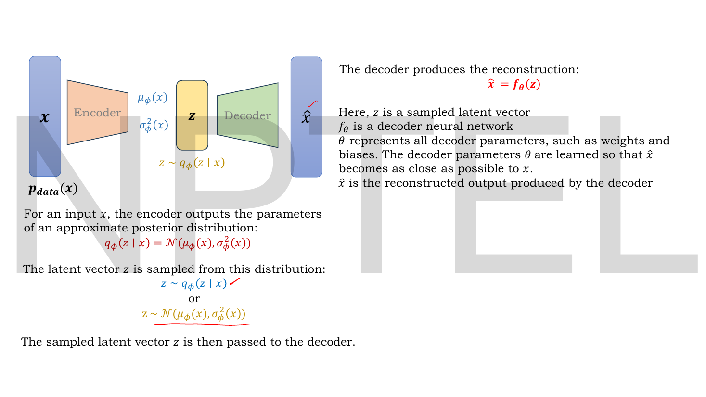
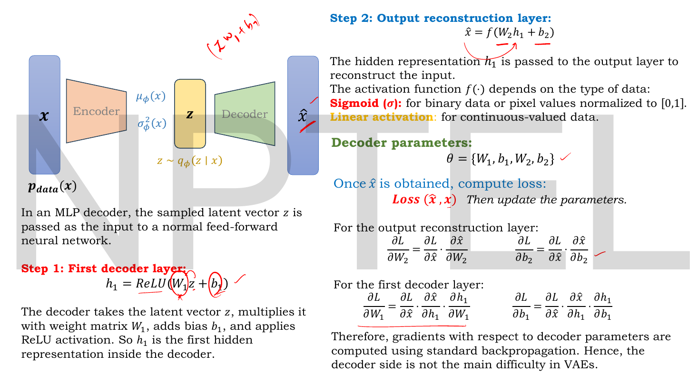
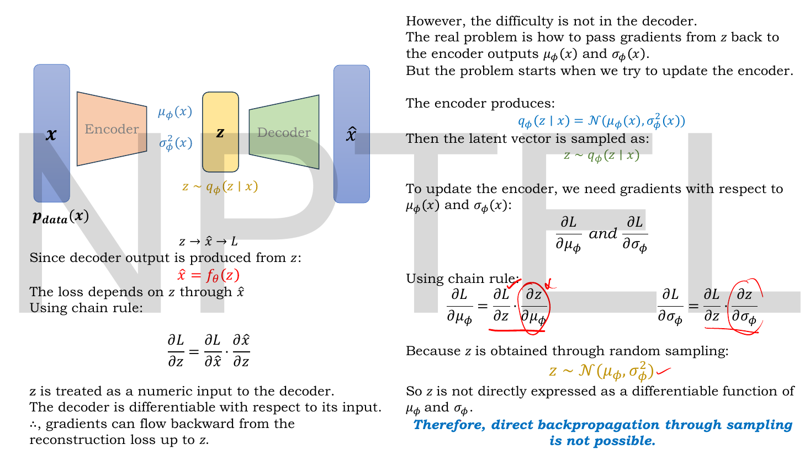
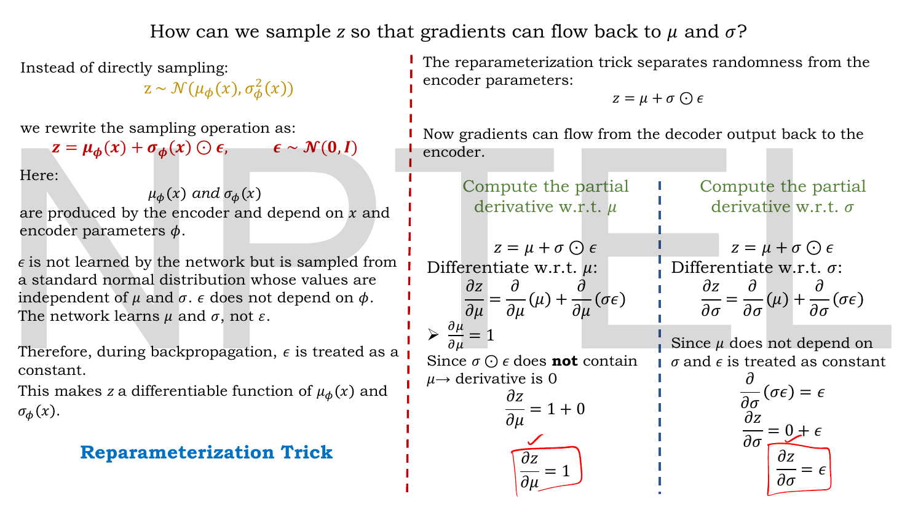
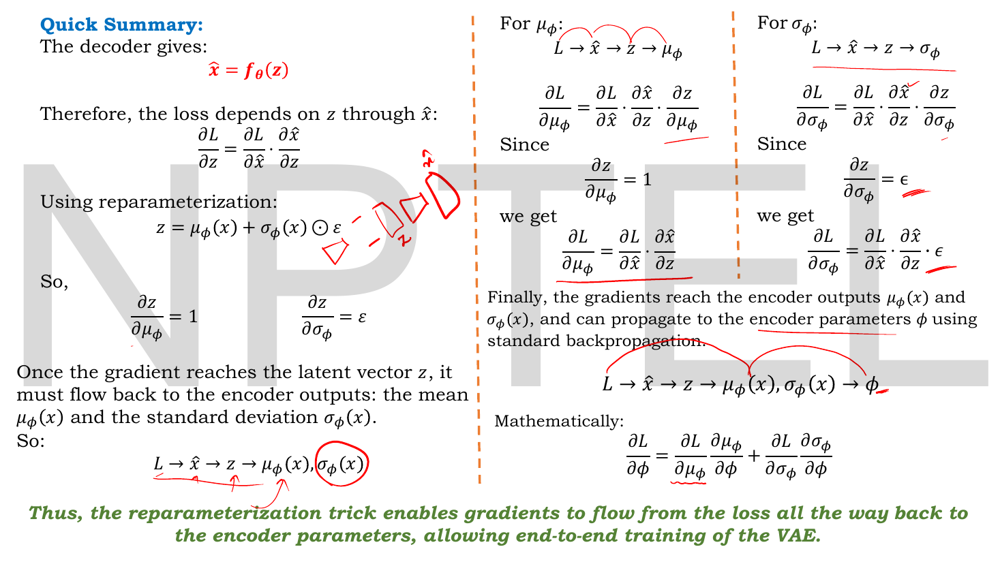
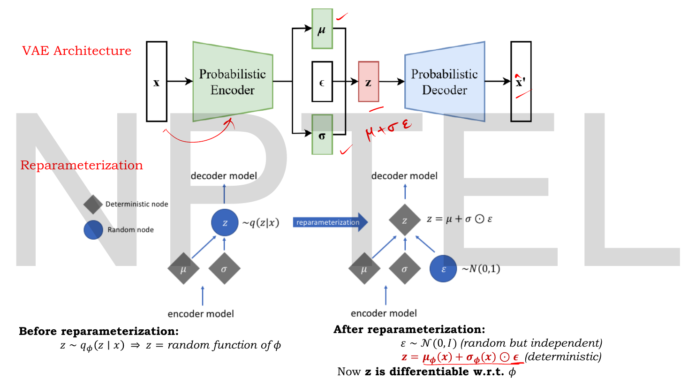

# Lec 23 — The Reparameterization Trick

> **Source:** `Lec 23.pdf` (11 pages) · **Week 3** · **Playlist:** Lec 23
> **Prereqs:** [Lec 19 — KL Divergence — Part A](19-kl-divergence-a.md), [Lec 21 — Introduction to VAE and the Encoder](21-vae-encoder.md), [Lec 22 — Probabilistic Decoder, ELBO, VAE Loss](22-elbo-and-vae-loss.md)
> **Feeds into:** [Lec 24 — VAE Numerical Example](24-vae-numerical.md), [Lec 26 — Disentanglement and β-VAE](26-beta-vae.md), [Lec 27 — Conditional VAE](27-conditional-vae.md), [Lec 46 — DDPM Forward Process](46-ddpm-forward.md)

## Why this lecture exists

[Lec 22](22-elbo-and-vae-loss.md) finished the VAE's loss function, and the model looked ready to train. It is not. There is a sampling step buried in the middle of the forward pass — the latent vector $\mathbf{z}$ is *drawn* from $q_\phi(\mathbf{z}\mid\mathbf{x})$ — and backpropagation cannot cross it. Gradients flow happily from the loss back to $\mathbf{z}$, and then they stop, because $\mathbf{z}$ was produced by a random number generator rather than by an arithmetic expression in $\mu$ and $\sigma$. The encoder would never receive a gradient and would never learn.

This lecture fixes it with one line of algebra: $\mathbf{z} = \mu + \sigma \odot \epsilon$. The randomness is pushed out into a parameter-free variable $\epsilon$, and $\mu$ and $\sigma$ are left on an ordinary differentiable path. That rewrite is what makes the VAE trainable at all, and it reappears in diffusion models in Week 7. It is the single most examinable idea in Week 3.

## The ideas

### Where the VAE stands before this lecture

![VAE loss slide: L(x) = −E_q[log p(x|z)] + KL(q‖p), with the reconstruction branch labelled MSE/BCE and the regularisation branch labelled with the closed-form Gaussian KL](../assets/pages/lec23/p-03.png)
*Fig. — The deck's recap, and the pivot. Both loss terms are fine. The sentence underneath is the problem: "Since sampling is a random operation, Randomness breaks gradient flow, making backpropagation impossible." Page 3.*

The loss from [Lec 22](22-elbo-and-vae-loss.md), in this deck's own handwriting:

$$\mathcal{L}(\mathbf{x}) = -\mathbb{E}_{q_\phi(\mathbf{z}\mid\mathbf{x})}\big[\log p_\theta(\mathbf{x}\mid\mathbf{z})\big] + D_{\mathrm{KL}}\big(q_\phi(\mathbf{z}\mid\mathbf{x})\,\|\,p(\mathbf{z})\big)$$

with the reconstruction term computed as MSE for continuous data or BCE for binary data ([Lec 11](11-reconstruction-loss.md)), and the regularisation term available in closed form because both distributions are Gaussian:

$$\mathcal{L}_{\mathrm{KL}} = \tfrac{1}{2}\big[\mu^2 + \sigma^2 - \log\sigma^2 - 1\big]$$

> **Deck notation.** The slides write the loss as $L(x)$ and the divergence as $KL(q \,\|\, p)$; this book writes $\mathcal{L}$ and $D_{\mathrm{KL}}(q\,\|\,p)$ (CONTRACT §3). The slides also write $\phi$ in a font that renders as $\varnothing$ — it is $\phi$, the encoder parameters, every time. The closed form above is stated *per latent dimension*; the sum over $j$ is restored in [Lec 24](24-vae-numerical.md). And the $\log$ in it is the **natural** log — base matters, because [Lec 20](20-kl-divergence-b.md)'s discrete KL example is worked in base 2 and [Lec 14](14-sparse-ae.md)'s sparsity KL in base 10.
>
> **No slide in this course derives that closed form.** This one says only "When both distributions are Gaussian, the KL divergence has a closed-form expression", and [Lec 24](24-vae-numerical.md)'s page 12 substitutes numbers into it without proof. [Lec 19](19-kl-divergence-a.md) owns KL's general definition and non-negativity; [Lec 20](20-kl-divergence-b.md)'s deck is wholly discrete. The derivation is supplied as beyond-the-slides content in [Lec 22](22-elbo-and-vae-loss.md), and [Lec 24](24-vae-numerical.md) restates the formula in full with every term named. Memorise it from either.

The encoder gives you the parameters of a distribution, not a vector:

$$q_\phi(\mathbf{z}\mid\mathbf{x}) = \mathcal{N}\big(\mu_\phi(\mathbf{x}),\, \sigma^2_\phi(\mathbf{x})\big), \qquad \mathbf{z} \sim q_\phi(\mathbf{z}\mid\mathbf{x})$$

That $\sim$ is the whole lecture. It is not an equals sign and it is not a function call. It is a *draw*.


*Fig. — The pipeline as the deck draws it. Notice the box in the middle is labelled $\mathbf{z} \sim q_\phi(\mathbf{z}\mid\mathbf{x})$, not $\mathbf{z} = $ something. Everything to the right of that box is ordinary arithmetic; everything to the left is about to lose its gradient. Page 4.*

### The decoder side is fine — and the deck proves it first

Before showing you the problem, the lecturer deliberately shows you something that *works*, so the contrast is sharp.


*Fig. — Every derivative on this slide is a routine chain rule, because every operation between $\mathbf{z}$ and $\mathcal{L}$ is deterministic. The closing line is the setup for the next slide: "the decoder side is not the main difficulty in VAEs." Page 5.*

The decoder is a plain MLP taking $\mathbf{z}$ as input:

$$\mathbf{h}_1 = \mathrm{ReLU}(\mathbf{W}_1\mathbf{z} + \mathbf{b}_1), \qquad \hat{\mathbf{x}} = f(\mathbf{W}_2\mathbf{h}_1 + \mathbf{b}_2)$$

with $f$ a sigmoid for binary or $[0,1]$-normalised data and linear for continuous data — the rule from [Lec 11](11-reconstruction-loss.md), unchanged. The decoder parameters are $\theta = \{\mathbf{W}_1, \mathbf{b}_1, \mathbf{W}_2, \mathbf{b}_2\}$, and the gradients are what you would write for any MLP:

$$\frac{\partial\mathcal{L}}{\partial \mathbf{W}_2} = \frac{\partial\mathcal{L}}{\partial\hat{\mathbf{x}}}\cdot\frac{\partial\hat{\mathbf{x}}}{\partial\mathbf{W}_2}, \qquad \frac{\partial\mathcal{L}}{\partial \mathbf{W}_1} = \frac{\partial\mathcal{L}}{\partial\hat{\mathbf{x}}}\cdot\frac{\partial\hat{\mathbf{x}}}{\partial\mathbf{h}_1}\cdot\frac{\partial\mathbf{h}_1}{\partial\mathbf{W}_1}$$

Nothing is unusual here. **$\theta$ trains by standard backpropagation whether or not you fix the sampling problem.** The breakage is entirely on the encoder's side, $\phi$.

### The problem: a gradient with nowhere to go


*Fig. — The two columns are the same chain rule, one factor apart. The left column's last factor exists; the right column's circled factors $\partial z/\partial\mu_\phi$ and $\partial z/\partial\sigma_\phi$ do not. Page 6.*

Trace the gradient backwards and watch where it dies.

**Step 1 — loss to $\mathbf{z}$: fine.** The loss depends on $\mathbf{z}$ only through $\hat{\mathbf{x}} = f_\theta(\mathbf{z})$, and the decoder is differentiable with respect to its input:

$$\frac{\partial\mathcal{L}}{\partial\mathbf{z}} = \frac{\partial\mathcal{L}}{\partial\hat{\mathbf{x}}}\cdot\frac{\partial\hat{\mathbf{x}}}{\partial\mathbf{z}}$$

The deck's phrasing is exact and worth keeping: "$\mathbf{z}$ is treated as a **numeric input** to the decoder." Once $\mathbf{z}$ is a number, the decoder does not care where it came from.

**Step 2 — $\mathbf{z}$ to $\mu_\phi$ and $\sigma_\phi$: impossible.** To update the encoder you need

$$\frac{\partial\mathcal{L}}{\partial\mu_\phi} = \frac{\partial\mathcal{L}}{\partial\mathbf{z}}\cdot\boxed{\frac{\partial\mathbf{z}}{\partial\mu_\phi}}, \qquad \frac{\partial\mathcal{L}}{\partial\sigma_\phi} = \frac{\partial\mathcal{L}}{\partial\mathbf{z}}\cdot\boxed{\frac{\partial\mathbf{z}}{\partial\sigma_\phi}}$$

and the boxed factors are the ones the lecturer circles in red. **They do not exist**, because the only statement relating $\mathbf{z}$ to $\mu_\phi$ is

$$\mathbf{z} \sim \mathcal{N}(\mu_\phi, \sigma^2_\phi)$$

and you cannot differentiate a $\sim$. A derivative $\partial\mathbf{z}/\partial\mu_\phi$ asks: *if I nudge $\mu_\phi$ by $\delta$, by how much does $\mathbf{z}$ change?* With a sampler in the middle the honest answer is **"I have no idea — run it again and you get a different $\mathbf{z}$ anyway."** Nudge $\mu_\phi$ from $0.5$ to $0.501$ and a fresh draw might come back $-1.3$ instead of $0.7$; the change is dominated by the dice, not by the nudge. There is no local, deterministic relationship to linearise.

Make this concrete. Think of the forward pass as a wire carrying a number. Everywhere else in the network the wire is a function — feed it the same input twice, get the same output twice, and the derivative is the slope of that function. At the sampling node the wire is cut and a random number generator is soldered in. Gradients travelling backwards arrive at the cut and have no next edge to take. **The deck's verdict: "Therefore, direct backpropagation through sampling is not possible."**

So the encoder parameters $\phi$ receive no gradient, never update from their initialisation, and the model never learns to encode anything.

### The fix: move the randomness out of the path


*Fig. — The whole trick on one slide. Left: the rewrite and why $\epsilon$ counts as a constant. Right: the two derivatives falling out in two lines each. The two red boxes at the bottom are the lecture. Page 7.*

**The reparameterization trick.** Replace the draw with an arithmetic expression:

$$\boxed{\;\mathbf{z} = \mu_\phi(\mathbf{x}) + \sigma_\phi(\mathbf{x}) \odot \epsilon, \qquad \epsilon \sim \mathcal{N}(\mathbf{0}, \mathbf{I})\;}$$

Here $\odot$ is elementwise multiplication (the latent is a vector, and each dimension has its own $\mu$, $\sigma$ and $\epsilon$).

Read the two sides carefully, because the whole argument is in the bookkeeping:

| Quantity | Depends on $\phi$? | Random? | Role in backprop |
|---|---|---|---|
| $\mu_\phi(\mathbf{x})$ | yes — encoder output | no | on the differentiable path |
| $\sigma_\phi(\mathbf{x})$ | yes — encoder output | no | on the differentiable path |
| $\epsilon$ | **no** — drawn from $\mathcal{N}(\mathbf{0},\mathbf{I})$ | yes | **treated as a constant** |
| $\mathbf{z}$ | yes, differentiably | yes, inherited from $\epsilon$ | ordinary node |

The deck says it plainly: "$\epsilon$ is not learned by the network... $\epsilon$ does not depend on $\phi$. The network learns $\mu$ and $\sigma$, not $\epsilon$. Therefore, during backpropagation, $\epsilon$ is treated as a constant."

The sampling still happens — the model is still stochastic, $\mathbf{z}$ is still random. What changed is *where* the randomness enters. It now enters as an **input to the graph**, exactly like $\mathbf{x}$ does, instead of as an operation **inside** the graph. And a network has never needed to differentiate with respect to its inputs.

### Is it still the right distribution?

The trick is worthless if $\mu + \sigma\epsilon$ is not actually distributed $\mathcal{N}(\mu,\sigma^2)$. The deck asserts this; here is the check, which is the obvious short-answer exam question.

Start from $\epsilon \sim \mathcal{N}(0,1)$, so $\mathbb{E}[\epsilon] = 0$ and $\mathrm{Var}(\epsilon) = 1$. Let $z = \mu + \sigma\epsilon$ for fixed $\mu$ and $\sigma > 0$.

**Mean.** Expectation is linear, and $\mu,\sigma$ are constants with respect to the draw:

$$\mathbb{E}[z] = \mathbb{E}[\mu + \sigma\epsilon] = \mu + \sigma\,\mathbb{E}[\epsilon] = \mu + \sigma\cdot 0 = \mu \;\checkmark$$

**Variance.** Adding a constant shifts a distribution without spreading it, so it does not change the variance; multiplying by a constant scales the variance by that constant *squared*:

$$\mathrm{Var}(z) = \mathrm{Var}(\mu + \sigma\epsilon) = \sigma^2\,\mathrm{Var}(\epsilon) = \sigma^2 \cdot 1 = \sigma^2 \;\checkmark$$

**Shape.** An affine function $a + b\epsilon$ of a Gaussian is Gaussian — the Gaussian family is closed under shift and scale. So $z$ is not merely a variable with the right mean and variance; it is exactly $\mathcal{N}(\mu, \sigma^2)$.

Those three facts together are the proof. The Code section verifies them empirically on 200,000 draws.

> This is the same identity behind the $z$-score you have met in statistics, read backwards. Standardising says: if $z \sim \mathcal{N}(\mu,\sigma^2)$ then $(z-\mu)/\sigma \sim \mathcal{N}(0,1)$. Reparameterizing just solves that for $z$.

### The two gradients that now exist

With $\mathbf{z} = \mu + \sigma \odot \epsilon$ an actual equation, differentiate it. $\epsilon$ is a constant, so this is first-week calculus.

**With respect to $\mu$:**

$$\frac{\partial z}{\partial\mu} = \frac{\partial}{\partial\mu}(\mu) + \frac{\partial}{\partial\mu}(\sigma\epsilon) = 1 + 0 = \boxed{1}$$

The first term is the derivative of $\mu$ with respect to itself. The second term contains no $\mu$ at all, so it is zero.

**With respect to $\sigma$:**

$$\frac{\partial z}{\partial\sigma} = \frac{\partial}{\partial\sigma}(\mu) + \frac{\partial}{\partial\sigma}(\sigma\epsilon) = 0 + \epsilon = \boxed{\epsilon}$$

The first term contains no $\sigma$, so it is zero. The second is $\epsilon$ times the derivative of $\sigma$ with respect to itself.

These are the two red-boxed results on page 7 and they carry a lot of exam weight. Two readings worth having:

- $\partial z/\partial\mu = 1$ means **the gradient reaching $\mathbf{z}$ passes through to $\mu$ completely untouched.** $\mu$ is a pure pass-through for gradient.
- $\partial z/\partial\sigma = \epsilon$ means **the gradient reaching $\sigma$ is scaled by whichever noise value you happened to draw.** It can be large, small, or *negative*. The gradient on $\sigma$ is therefore noisy in a way the gradient on $\mu$ is not — a real property of VAE training, not an artefact.

### Pushing the gradient all the way back to $\phi$


*Fig. — The payoff. Substituting the two boxed derivatives collapses each chain by one factor: the $\mu$ chain loses its last factor entirely (multiply by 1) and the $\sigma$ chain picks up a bare $\epsilon$. The bottom line sums both branches into $\partial\mathcal{L}/\partial\phi$. Page 8.*

The full chain, as the deck lays it out:

$$\mathcal{L} \;\to\; \hat{\mathbf{x}} \;\to\; \mathbf{z} \;\to\; \mu_\phi(\mathbf{x}),\, \sigma_\phi(\mathbf{x}) \;\to\; \phi$$

For the mean branch:

$$\frac{\partial\mathcal{L}}{\partial\mu_\phi} = \frac{\partial\mathcal{L}}{\partial\hat{\mathbf{x}}}\cdot\frac{\partial\hat{\mathbf{x}}}{\partial\mathbf{z}}\cdot\frac{\partial\mathbf{z}}{\partial\mu_\phi} = \frac{\partial\mathcal{L}}{\partial\hat{\mathbf{x}}}\cdot\frac{\partial\hat{\mathbf{x}}}{\partial\mathbf{z}}$$

For the standard-deviation branch:

$$\frac{\partial\mathcal{L}}{\partial\sigma_\phi} = \frac{\partial\mathcal{L}}{\partial\hat{\mathbf{x}}}\cdot\frac{\partial\hat{\mathbf{x}}}{\partial\mathbf{z}}\cdot\frac{\partial\mathbf{z}}{\partial\sigma_\phi} = \frac{\partial\mathcal{L}}{\partial\hat{\mathbf{x}}}\cdot\frac{\partial\hat{\mathbf{x}}}{\partial\mathbf{z}}\cdot\epsilon$$

The two branches differ by exactly one factor of $\epsilon$. Then both feed into the encoder weights:

$$\frac{\partial\mathcal{L}}{\partial\phi} = \frac{\partial\mathcal{L}}{\partial\mu_\phi}\frac{\partial\mu_\phi}{\partial\phi} + \frac{\partial\mathcal{L}}{\partial\sigma_\phi}\frac{\partial\sigma_\phi}{\partial\phi}$$

The sum is there because $\phi$ influences the loss along **two** routes — through the mean head and through the variance head — and when a parameter affects an output by several routes, the total derivative is the sum over routes. $\partial\mu_\phi/\partial\phi$ and $\partial\sigma_\phi/\partial\phi$ are then ordinary MLP gradients, no different from the decoder's.

> **One thing the deck leaves out, and it matters.** This chain accounts only for the *reconstruction* half of the loss. The KL term $D_{\mathrm{KL}}$ depends on $\mu_\phi$ and $\sigma_\phi$ **directly**, not through $\mathbf{z}$, so each encoder output actually receives gradient from two places. The complete expression is $\dfrac{\partial\mathcal{L}}{\partial\mu_\phi} = \underbrace{\dfrac{\partial\mathcal{L}_{\text{rec}}}{\partial\mathbf{z}}}_{\text{through the decoder}} + \underbrace{\mu_\phi}_{\text{from the KL}}$. [Lec 24](24-vae-numerical.md) computes both branches with real numbers; see also *Beyond the slides* below.

### The computation graph, before and after


*Fig. — The single picture to memorise. Grey diamond = deterministic node, blue circle = random node. **Before:** the random node sits **in** the path from the encoder to the decoder, so the path is broken. **After:** the random node $\epsilon$ sits **beside** the path, feeding in from the side, and every node on the encoder→decoder route is now deterministic. Nothing else changed. Page 9.*

The deck's own summary lines:

| | Before reparameterization | After reparameterization |
|---|---|---|
| Latent | $\mathbf{z} \sim q_\phi(\mathbf{z}\mid\mathbf{x})$ | $\mathbf{z} = \mu_\phi(\mathbf{x}) + \sigma_\phi(\mathbf{x})\odot\epsilon$ |
| $\mathbf{z}$ is | a *random function* of $\phi$ | a *deterministic* function of $\phi$ and $\epsilon$ |
| Random node | $\mathbf{z}$ itself, on the path | $\epsilon$, off the path |
| Differentiable w.r.t. $\phi$? | **no** | **yes** |
| Encoder trainable? | no | yes |

If the deck's rendering of the graph is hard to read, here is the same thing in ASCII — worth being able to draw from memory in an exam:

```
BEFORE                                  AFTER
                                        
   decoder                                 decoder
      ^                                       ^
      |                                       |
   ((  z  ))  <- RANDOM node              [   z   ]  <- deterministic
    ^     ^      in the path               ^  ^  ^      z = mu + sigma * eps
    |     |                                |  |  |
 [ mu ] [sigma]                       [ mu ][sigma] ((eps))  <- RANDOM node
    ^     ^                                ^  ^           ~ N(0, I)
    |     |                                |  |            BESIDE the path
   encoder (phi)                          encoder (phi)

 gradient from the decoder reaches       gradient flows decoder -> z -> mu, sigma
 z and STOPS: no edge leads out          -> phi. eps has no parameters, so
 of a random node.                       nothing needs to flow into it.
```

### Sampling the same distribution many times

A point the deck makes on its [Lec 24](24-vae-numerical.md) slides but which belongs here: for one fixed input $\mathbf{x}$, the encoder produces **one** distribution $q_\phi(\mathbf{z}\mid\mathbf{x})$, and different draws of $\epsilon$ give different $\mathbf{z}$ from that same distribution. So the trick does not reduce the stochasticity; it reorganises it. In training you normally draw a single $\epsilon$ per sample per step — one Monte-Carlo sample of the expectation $\mathbb{E}_{q_\phi}[\cdot]$ — and rely on the many steps of SGD to average things out.

Two consequences worth holding on to:

- **$\epsilon = \mathbf{0}$ gives $\mathbf{z} = \mu$.** This is how a trained VAE is run deterministically at test time when you want the "most likely" reconstruction.
- The *same* $\mathbf{x}$ gives a *different* $\hat{\mathbf{x}}$ on every forward pass during training. That is intended: it forces the decoder to map a whole neighbourhood of the latent space to plausible outputs, which is precisely what makes the latent space continuous enough to interpolate in ([Lec 28](28-latent-interpolation.md)).

## Worked numericals

The slides for this lecture contain **no worked numbers at all** — it is a purely algebraic deck. All five numericals below are mine, built to drill the exact algebra the slides state.

### N1. Forward through the trick, from the encoder's raw outputs

**Given:** a 2-dimensional latent. The encoder emits $\mu = [1.2,\ -0.4]$ and $\log\sigma^2 = [0.6,\ -1.0]$ (natural log, as everywhere in this course). The noise draw is $\epsilon = [0.8,\ -1.5]$.
**Find:** $\sigma$ and $\mathbf{z}$.

1. Convert log-variance to variance. $\sigma_1^2 = e^{0.6} = 1.822119$, $\sigma_2^2 = e^{-1.0} = 0.367879$.
2. Convert variance to standard deviation. $\sigma_1 = \sqrt{1.822119} = 1.349859$, $\sigma_2 = \sqrt{0.367879} = 0.606531$.
   (Equivalently and more directly, $\sigma = e^{\frac12\log\sigma^2}$: $e^{0.3} = 1.349859$ and $e^{-0.5} = 0.606531$.)
3. Apply $z_j = \mu_j + \sigma_j\epsilon_j$:
   - $z_1 = 1.2 + 1.349859 \times 0.8 = 1.2 + 1.079887 = 2.279887$
   - $z_2 = -0.4 + 0.606531 \times (-1.5) = -0.4 - 0.909796 = -1.309796$

**Answer:** $\sigma = [1.3499,\ 0.6065]$ and $\mathbf{z} = [2.2799,\ -1.3098]$.

The step everyone drops is step 2. The encoder's head outputs $\log\sigma^2$, the formula wants $\sigma$, and the bridge is $\sigma = e^{(\log\sigma^2)/2}$ — **a square root, not just an exponential.** Using $e^{0.6} = 1.822$ as $\sigma_1$ would give $z_1 = 2.658$, a classic wrong-but-plausible MCQ option.

### N2. The same $\mu,\sigma$, three different $\epsilon$

**Given:** $\mu = [1.2,\ -0.4]$, $\sigma = [1.3499,\ 0.6065]$ from N1.
**Find:** $\mathbf{z}$ for $\epsilon = [0,0]$, $\epsilon = [1,1]$ and $\epsilon = [-2, 0.5]$.

| $\epsilon$ | $z_1 = 1.2 + 1.3499\,\epsilon_1$ | $z_2 = -0.4 + 0.6065\,\epsilon_2$ | $\mathbf{z}$ |
|---|---|---|---|
| $[0,\,0]$ | $1.2 + 0 = 1.2$ | $-0.4 + 0 = -0.4$ | $[1.2,\ -0.4]$ |
| $[1,\,1]$ | $1.2 + 1.3499 = 2.5499$ | $-0.4 + 0.6065 = 0.2065$ | $[2.5499,\ 0.2065]$ |
| $[-2,\,0.5]$ | $1.2 - 2.6998 = -1.4998$ | $-0.4 + 0.3033 = -0.0967$ | $[-1.4998,\ -0.0967]$ |

**Answer:** $[1.2, -0.4]$, $[2.5499, 0.2065]$, $[-1.4998, -0.0967]$.

Row 1 is the one to memorise: **$\epsilon = \mathbf{0}$ returns $\mathbf{z} = \mu$ exactly**, the deterministic test-time pass. Row 3 shows $\mathbf{z}$ landing on the opposite side of the mean from $\mu$ — one draw of $\epsilon$ can flip the sign of a latent coordinate, which is exactly why $\partial z/\partial\sigma = \epsilon$ can be negative.

### N3. The gradients, with real numbers in them

**Given:** the decoder sends back $\dfrac{\partial\mathcal{L}}{\partial\mathbf{z}} = [-0.40,\ 0.25]$. The draw was $\epsilon = [0.8,\ -1.5]$ as in N1.
**Find:** $\partial\mathcal{L}/\partial\mu$ and $\partial\mathcal{L}/\partial\sigma$ along the reconstruction path, and the resulting gradient-descent update for $\mu$ with $\eta = 0.1$.

1. Local derivatives: $\partial z_j/\partial\mu_j = 1$ for both $j$; $\partial z_j/\partial\sigma_j = \epsilon_j$, so $[0.8, -1.5]$.
2. Mean branch, $\dfrac{\partial\mathcal{L}}{\partial\mu_j} = \dfrac{\partial\mathcal{L}}{\partial z_j}\times 1$:
   $$\partial\mathcal{L}/\partial\mu = [-0.40 \times 1,\ \ 0.25 \times 1] = [-0.40,\ 0.25]$$
3. Scale branch, $\dfrac{\partial\mathcal{L}}{\partial\sigma_j} = \dfrac{\partial\mathcal{L}}{\partial z_j}\times \epsilon_j$:
   - $-0.40 \times 0.8 = -0.32$
   - $0.25 \times (-1.5) = -0.375$
   $$\partial\mathcal{L}/\partial\sigma = [-0.32,\ -0.375]$$
4. Update $\mu \leftarrow \mu - \eta\,\partial\mathcal{L}/\partial\mu$ with $\mu = [1.2, -0.4]$:
   - $\mu_1 = 1.2 - 0.1(-0.40) = 1.2 + 0.04 = 1.24$
   - $\mu_2 = -0.4 - 0.1(0.25) = -0.4 - 0.025 = -0.425$

**Answer:** $\partial\mathcal{L}/\partial\mu = [-0.40,\ 0.25]$ (identical to $\partial\mathcal{L}/\partial\mathbf{z}$), $\partial\mathcal{L}/\partial\sigma = [-0.32,\ -0.375]$, and $\mu$ moves to $[1.24,\ -0.425]$.

Look at coordinate 2. The gradient on $z_2$ was **positive** ($+0.25$) but the gradient on $\sigma_2$ is **negative** ($-0.375$), because $\epsilon_2$ was negative and flipped the sign. That sign flip is the whole content of $\partial z/\partial\sigma = \epsilon$, and it is a favourite exam question.

### N4. Verifying the distribution by hand

**Given:** $\mu = 3$, $\sigma = 2$, and $\epsilon \sim \mathcal{N}(0,1)$. Let $z = \mu + \sigma\epsilon$.
**Find:** $\mathbb{E}[z]$, $\mathrm{Var}(z)$, and $P(z > 3)$.

1. $\mathbb{E}[z] = \mathbb{E}[3 + 2\epsilon] = 3 + 2\mathbb{E}[\epsilon] = 3 + 2(0) = 3$.
2. $\mathrm{Var}(z) = \mathrm{Var}(3 + 2\epsilon) = 2^2\,\mathrm{Var}(\epsilon) = 4(1) = 4$. So $\sigma_z = 2$.
3. $z > 3 \iff 3 + 2\epsilon > 3 \iff 2\epsilon > 0 \iff \epsilon > 0$, and $P(\epsilon > 0) = 0.5$ by symmetry of $\mathcal{N}(0,1)$.

**Answer:** $z \sim \mathcal{N}(3, 4)$ exactly — mean $3$, **variance** $4$, standard deviation $2$ — and $P(z>3) = 0.5$.

Watch the notation trap built into this answer. The distribution is $\mathcal{N}(3, 4)$ because the second slot is the **variance** (CONTRACT §3). Writing $\mathcal{N}(3,2)$ would mean variance 2, i.e. $\sigma = 1.414$ — a different distribution.

### N5. Why the trick is not just a convenience — a variance comparison

There *is* an alternative way to get a gradient through a sampler (the score-function or REINFORCE estimator, $\nabla_\mu\mathbb{E}[f] = \mathbb{E}[f(z)\nabla_\mu\log q(z)]$). It is unbiased, so why does nobody use it for VAEs? Variance.

**Given:** $q = \mathcal{N}(\mu, 1)$ with $\mu = 1$, and $f(z) = z^2$. The true gradient is $\dfrac{d}{d\mu}\mathbb{E}[z^2] = \dfrac{d}{d\mu}(\mu^2 + 1) = 2\mu = 2$.
**Find:** the variance of each one-sample estimator of that gradient.

1. **Reparameterized.** $z = \mu + \epsilon$, so the estimator is $\dfrac{d}{d\mu}(\mu+\epsilon)^2 = 2(\mu+\epsilon) = 2 + 2\epsilon$.
   Mean $= 2$. Variance $= 4\,\mathrm{Var}(\epsilon) = \mathbf{4}$.
2. **Score function.** For $\mathcal{N}(\mu,1)$, $\nabla_\mu\log q(z) = z - \mu = \epsilon$, so the estimator is $z^2\epsilon = (1+\epsilon)^2\epsilon = \epsilon + 2\epsilon^2 + \epsilon^3$.
   Mean $= 0 + 2(1) + 0 = 2$ (unbiased, same as above).
   For the variance use the standard-normal moments $\mathbb{E}[\epsilon^2]=1$, $\mathbb{E}[\epsilon^4]=3$, $\mathbb{E}[\epsilon^6]=15$, odd moments $=0$:
   $$\mathbb{E}[(\epsilon + 2\epsilon^2 + \epsilon^3)^2] = \mathbb{E}[\epsilon^2] + 6\mathbb{E}[\epsilon^4] + \mathbb{E}[\epsilon^6] = 1 + 18 + 15 = 34$$
   Variance $= 34 - 2^2 = \mathbf{30}$.

**Answer:** both estimators are unbiased with mean $2$, but the variances are $4$ and $30$ — the score-function estimator is **7.5× noisier** on this toy problem, and the gap grows with latent dimension. A 2-million-sample simulation gives $3.997$ and $29.84$, confirming both. That variance reduction, not merely "it works", is why the reparameterization trick is the one everybody uses.

## Code

Four claims from the slides, checked against PyTorch autograd: that direct sampling has no gradient, that reparameterized sampling does, that the two derivatives are exactly $1$ and $\epsilon$, and that the rewritten draw has the right distribution.

```python
import torch

torch.manual_seed(0)
mu    = torch.tensor([0.043, 0.551], requires_grad=True)
sigma = torch.tensor([1.442, 1.163], requires_grad=True)

# --- (1) direct sampling: the gradient path is severed
z_direct = torch.normal(mu.detach(), sigma.detach())   # what a sampler actually does
print("z (direct sampling) =", z_direct.numpy().round(4),
      "| requires_grad =", z_direct.requires_grad)

# --- (2) reparameterized sampling: eps is a CONSTANT, mu and sigma are on the path
eps = torch.randn(2)                      # eps ~ N(0, I), no parameters
z   = mu + sigma * eps                    # z = mu + sigma (*) eps
print("eps                =", eps.numpy().round(4))
print("z (reparameterized)=", z.detach().numpy().round(4),
      "| requires_grad =", z.requires_grad)

# --- (3) the two Jacobians the slides derive, read straight off autograd
J_mu  = torch.autograd.grad(z.sum(), mu,    retain_graph=True)[0]
J_sig = torch.autograd.grad(z.sum(), sigma, retain_graph=True)[0]
print("dz/dmu    =", J_mu.numpy().round(4), " (slide: 1)")
print("dz/dsigma =", J_sig.numpy().round(4), " (slide: eps)")

# --- (4) same distribution? mean and variance of 200000 reparameterized draws
E = torch.randn(200000, 2)
Z = mu.detach() + sigma.detach() * E
print("empirical mean =", Z.mean(0).numpy().round(4), " target mu      =", mu.detach().numpy())
print("empirical var  =", Z.var(0).numpy().round(4),  " target sigma^2 =",
      (sigma.detach()**2).numpy().round(4))
```

```
z (direct sampling) = [2.2651 0.2097] | requires_grad = False
eps                = [-2.1788  0.5684]
z (reparameterized)= [-3.0988  1.2121] | requires_grad = True
dz/dmu    = [1. 1.]  (slide: 1)
dz/dsigma = [-2.1788  0.5684]  (slide: eps)
empirical mean = [0.0412 0.5515]  target mu      = [0.043 0.551]
empirical var  = [2.0846 1.3516]  target sigma^2 = [2.0794 1.3526]
```

Four readings. **(1)** `requires_grad = False` on the directly-sampled tensor is the broken graph, printed: autograd has recorded no path from `z_direct` back to `mu`, so calling `.backward()` on anything downstream would leave `mu.grad` as `None`. **(2)** The identical quantity, computed by the rewrite, comes back with `requires_grad = True`. **(3)** Autograd reports $\partial z/\partial\mu = [1,1]$ and $\partial z/\partial\sigma = [-2.1788, 0.5684]$, which is *exactly the printed $\epsilon$* — the deck's two boxed results, confirmed by a library that knows nothing about the slides. Note the first entry of $\partial z/\partial\sigma$ is negative. **(4)** 200,000 draws recover $\mu$ to three decimals and $\sigma^2$ to two, so the rewrite really is sampling $\mathcal{N}(\mu,\sigma^2)$.

$\mu$ and $\sigma$ here are the encoder outputs computed in [Lec 24](24-vae-numerical.md), so you can carry these numbers straight into that chapter.

## Exam pack

### Must-memorise

| Item | Exactly this |
|---|---|
| The trick | $\mathbf{z} = \mu_\phi(\mathbf{x}) + \sigma_\phi(\mathbf{x}) \odot \epsilon$ |
| The noise | $\epsilon \sim \mathcal{N}(\mathbf{0}, \mathbf{I})$, parameter-free, **treated as a constant** in backprop |
| What it replaces | $\mathbf{z} \sim q_\phi(\mathbf{z}\mid\mathbf{x}) = \mathcal{N}(\mu_\phi(\mathbf{x}), \sigma^2_\phi(\mathbf{x}))$ |
| Derivative w.r.t. mean | $\dfrac{\partial z}{\partial\mu} = 1$ |
| Derivative w.r.t. std | $\dfrac{\partial z}{\partial\sigma} = \epsilon$ |
| Why it is needed | sampling is a random operation; $\mathbf{z}$ is not a differentiable function of $\mu_\phi,\sigma_\phi$, so backprop cannot pass the sampling node |
| Loss-to-latent chain | $\dfrac{\partial\mathcal{L}}{\partial\mathbf{z}} = \dfrac{\partial\mathcal{L}}{\partial\hat{\mathbf{x}}}\cdot\dfrac{\partial\hat{\mathbf{x}}}{\partial\mathbf{z}}$ (works even *without* the trick) |
| Mean branch | $\dfrac{\partial\mathcal{L}}{\partial\mu_\phi} = \dfrac{\partial\mathcal{L}}{\partial\hat{\mathbf{x}}}\cdot\dfrac{\partial\hat{\mathbf{x}}}{\partial\mathbf{z}}$ |
| Scale branch | $\dfrac{\partial\mathcal{L}}{\partial\sigma_\phi} = \dfrac{\partial\mathcal{L}}{\partial\hat{\mathbf{x}}}\cdot\dfrac{\partial\hat{\mathbf{x}}}{\partial\mathbf{z}}\cdot\epsilon$ |
| Into the encoder weights | $\dfrac{\partial\mathcal{L}}{\partial\phi} = \dfrac{\partial\mathcal{L}}{\partial\mu_\phi}\dfrac{\partial\mu_\phi}{\partial\phi} + \dfrac{\partial\mathcal{L}}{\partial\sigma_\phi}\dfrac{\partial\sigma_\phi}{\partial\phi}$ |
| Distribution check | $\mathbb{E}[z] = \mu$, $\mathrm{Var}(z) = \sigma^2$, affine-of-Gaussian is Gaussian |
| log-variance to $\sigma$ | $\sigma = e^{\frac{1}{2}\log\sigma^2} = \sqrt{e^{\log\sigma^2}}$ |
| Graph language | before: random node **in** the path; after: random node **beside** the path |

### Numbers worth knowing

| Quantity | Value |
|---|---|
| $\partial z/\partial\mu$ | $1$ — always, for every dimension, for every draw |
| $\partial z/\partial\sigma$ | $\epsilon$ — the actual sampled value, sign and all |
| $\mathbb{E}[\epsilon]$, $\mathrm{Var}(\epsilon)$ | $0$ and $1$ |
| $\mathbf{z}$ when $\epsilon = \mathbf{0}$ | exactly $\mu$ |
| Fraction of $\epsilon$ draws in $[-1,1]$ | $\approx 68\%$; in $[-2,2]$, $\approx 95\%$ |
| Gradient-estimator variance, N5 toy problem | reparameterized $4$, score-function $30$ (7.5×) |
| Decoder parameters receiving gradient without the trick | all of $\theta$ — the decoder was never broken |
| Encoder parameters receiving gradient without the trick | none |
| Monte-Carlo samples of $\epsilon$ per step, in practice | 1 |
| Deck pages that contain arithmetic | 0 |

### Likely MCQ traps

- **"The reparameterization trick removes randomness from the VAE."** It does not. $\mathbf{z}$ is still random — $\epsilon$ is still drawn fresh every forward pass. The trick *relocates* the randomness from an operation inside the graph to an input of the graph. The correct phrasing is "separates the randomness from the parameters".
- **"It is needed so the decoder can be trained."** No — the decoder parameters $\theta$ train fine either way; page 5 exists specifically to establish this. The trick is needed for the **encoder** parameters $\phi$.
- **$\partial z/\partial\sigma = 1$ or $\sigma$ or $\mu$.** It is $\epsilon$. And $\partial z/\partial\mu$ is $1$, not $\epsilon$. Swapping these two is the most likely wrong option on the paper.
- **Forgetting the half.** The encoder emits $\log\sigma^2$, and $\sigma = e^{(\log\sigma^2)/2}$. Using $e^{\log\sigma^2}$ gives you the **variance** and inflates $\mathbf{z}$. With $\log\sigma^2 = 0.6$: correct $\sigma = 1.3499$, wrong $1.8221$.
- **$\mathcal{N}(\mu,\sigma)$ vs $\mathcal{N}(\mu,\sigma^2)$.** The second argument is the variance throughout this course. $z = 3 + 2\epsilon$ is $\mathcal{N}(3,4)$, not $\mathcal{N}(3,2)$.
- **"$\epsilon$ is learned / $\epsilon$ depends on $\phi$ / $\epsilon$ gets a gradient."** None of these. $\epsilon$ has no parameters and is held constant during the backward pass, exactly like the input $\mathbf{x}$.
- **Thinking $\epsilon$ is drawn once and reused.** A fresh $\epsilon$ per sample per forward pass. Reusing one fixed $\epsilon$ would make the model deterministic and collapse it toward a plain autoencoder.
- **"Gradients cannot reach $\mathbf{z}$ without the trick."** They can. $\partial\mathcal{L}/\partial\mathbf{z}$ exists and is computable, because the decoder is differentiable in its input. The break is strictly *after* $\mathbf{z}$, going backwards.
- **Confusing $\odot$ with a matrix product.** $\sigma \odot \epsilon$ is elementwise. For a $k$-dimensional latent it is $k$ independent scalar multiplications, not a $k\times k$ matrix acting on a vector.
- **Reading $\partial\mathcal{L}/\partial\phi$ as a single chain.** It is a **sum of two** chains, one through $\mu_\phi$ and one through $\sigma_\phi$, because $\phi$ reaches the loss by two routes.

### Self-test

1. State the reparameterization trick in one equation, and say which symbol carries the randomness.
2. Why can backpropagation not pass through $\mathbf{z} \sim \mathcal{N}(\mu_\phi, \sigma^2_\phi)$? Answer in terms of what a derivative *is*.
3. Give $\partial z/\partial\mu$ and $\partial z/\partial\sigma$, and say which one can be negative.
4. Prove that $z = \mu + \sigma\epsilon$ with $\epsilon\sim\mathcal{N}(0,1)$ has mean $\mu$ and variance $\sigma^2$.
5. An encoder emits $\mu = 0.5$ and $\log\sigma^2 = -0.4$. A draw gives $\epsilon = 1.2$. Compute $\mathbf{z}$.
6. The decoder returns $\partial\mathcal{L}/\partial z = 0.6$ and the draw was $\epsilon = -0.5$. Give $\partial\mathcal{L}/\partial\mu$ and $\partial\mathcal{L}/\partial\sigma$ along the reconstruction path.
7. Without the trick, which parameters still train and which do not?
8. Write the full expression for $\partial\mathcal{L}/\partial\phi$ and explain why it has two terms.
9. In the before/after computation-graph diagram, what moves, and what is the symbolic difference between a diamond and a circle?
10. You set $\epsilon = 0$ permanently. What model do you now have, and what breaks?

<details><summary>Answers</summary>

1. $\mathbf{z} = \mu_\phi(\mathbf{x}) + \sigma_\phi(\mathbf{x}) \odot \epsilon$ with $\epsilon \sim \mathcal{N}(\mathbf{0},\mathbf{I})$. The randomness is carried entirely by $\epsilon$, which has no parameters.
2. A derivative $\partial\mathbf{z}/\partial\mu_\phi$ measures how much $\mathbf{z}$ changes for an infinitesimal change in $\mu_\phi$. When $\mathbf{z}$ is produced by a sampler, there is no such deterministic relationship — re-running with the same $\mu_\phi$ gives a different $\mathbf{z}$ — so there is no local slope to compute. The deck: "$\mathbf{z}$ is not directly expressed as a differentiable function of $\mu_\phi$ and $\sigma_\phi$."
3. $\partial z/\partial\mu = 1$ and $\partial z/\partial\sigma = \epsilon$. Only $\partial z/\partial\sigma$ can be negative, since $\epsilon$ is a standard-normal draw.
4. $\mathbb{E}[z] = \mathbb{E}[\mu] + \sigma\mathbb{E}[\epsilon] = \mu + \sigma(0) = \mu$ by linearity. $\mathrm{Var}(z) = \mathrm{Var}(\mu + \sigma\epsilon) = \sigma^2\mathrm{Var}(\epsilon) = \sigma^2(1) = \sigma^2$, since adding a constant does not change variance and scaling by $\sigma$ scales variance by $\sigma^2$. Shape is Gaussian because an affine map of a Gaussian is Gaussian.
5. $\sigma = e^{-0.4/2} = e^{-0.2} = 0.818731$. $z = 0.5 + 0.818731 \times 1.2 = 0.5 + 0.982477 = \mathbf{1.482477}$.
6. $\partial\mathcal{L}/\partial\mu = 0.6 \times 1 = \mathbf{0.6}$. $\partial\mathcal{L}/\partial\sigma = 0.6 \times (-0.5) = \mathbf{-0.3}$ — note the sign flip.
7. The decoder parameters $\theta = \{\mathbf{W}_1,\mathbf{b}_1,\mathbf{W}_2,\mathbf{b}_2\}$ still train by ordinary backprop. The encoder parameters $\phi$ receive no gradient at all and stay at their initialisation.
8. $\dfrac{\partial\mathcal{L}}{\partial\phi} = \dfrac{\partial\mathcal{L}}{\partial\mu_\phi}\dfrac{\partial\mu_\phi}{\partial\phi} + \dfrac{\partial\mathcal{L}}{\partial\sigma_\phi}\dfrac{\partial\sigma_\phi}{\partial\phi}$. Two terms because $\phi$ affects the loss along two separate routes — the mean head and the variance head — and total derivatives sum over routes.
9. The **random node** moves: before, it is $\mathbf{z}$ itself, sitting on the encoder→decoder path; after, it is $\epsilon$, sitting beside the path and feeding in. A diamond is a deterministic node, a circle is a random node. After the rewrite, every node on the path is a diamond.
10. You have a plain deterministic autoencoder whose bottleneck is $\mu$ — the $\sigma$ head stops receiving reconstruction gradient entirely (since $\partial z/\partial\sigma = \epsilon = 0$), so it is driven only by the KL term and collapses toward $\sigma = 1$ without ever being tested. The latent space stops being smoothed by noise, so interpolation and sampling from the prior degrade. ($\epsilon = 0$ is fine at *test* time; it is fatal during training.)

</details>

## Beyond the slides

**Gap: the deck's chain rule covers only the reconstruction half of the loss.**
**Why it matters:** pages 6–8 route every gradient as $\mathcal{L} \to \hat{\mathbf{x}} \to \mathbf{z} \to \mu_\phi,\sigma_\phi$. But the KL term depends on $\mu_\phi$ and $\sigma_\phi$ **directly**, with no $\mathbf{z}$ in between, so each encoder output gets gradient from two sources. From the closed form $\tfrac12\sum_j(\mu_j^2 + \sigma_j^2 - \log\sigma_j^2 - 1)$ these are $\partial\mathcal{L}_{\mathrm{KL}}/\partial\mu_j = \mu_j$ and $\partial\mathcal{L}_{\mathrm{KL}}/\partial(\log\sigma_j^2) = \tfrac12(\sigma_j^2 - 1)$. A question asking for the *complete* $\partial\mathcal{L}/\partial\mu_\phi$ wants both terms; [Lec 24](24-vae-numerical.md) computes them numerically.

**Gap: $\sigma$ versus $\log\sigma^2$ is never reconciled.**
**Why it matters:** the deck writes the trick with $\sigma$ but, by [Lec 21](21-vae-encoder.md) and the next deck, the encoder's second head emits $\log\sigma^2$. Every real implementation therefore computes `std = torch.exp(0.5 * logvar)` and then `z = mu + std * eps`. Two reasons for the log-variance parameterisation: it lets the head output any real number while $\sigma$ stays strictly positive (no activation needed, and no risk of a negative standard deviation), and it keeps the KL term numerically well behaved. Half of all VAE arithmetic errors live in the missing factor of $\tfrac12$.

**Gap: the deck shows the trick for a Gaussian only, and never says when it is available.**
**Why it matters:** reparameterization works for any distribution you can write as a deterministic transform of parameter-free noise — the *location–scale* families. Gaussian, uniform, Laplace, exponential: all fine. **Categorical and Bernoulli latents are not**, because no smooth deterministic function of continuous noise produces a discrete sample. That is why discrete VAEs need Gumbel-Softmax or the score-function estimator instead, and it is the real boundary of the technique.

**Gap: no mention that a single $\epsilon$ per step is a Monte-Carlo estimate.**
**Why it matters:** the reconstruction term is an *expectation* $\mathbb{E}_{q_\phi}[\log p_\theta(\mathbf{x}\mid\mathbf{z})]$. Drawing one $\epsilon$ approximates that expectation with a single sample, which is a wildly high-variance estimate of the expectation but a perfectly usable *unbiased* gradient when averaged over a minibatch and thousands of steps. Understanding this stops the natural worry "surely one random draw cannot be enough" — it is enough in the same way one minibatch is enough for the full-dataset gradient.

**Gap: the same trick is the backbone of diffusion models, and nothing says so.**
**Why it matters:** [Lec 46](46-ddpm-forward.md) writes the forward diffusion jump as $\mathbf{x}_t = \sqrt{\bar\alpha_t}\,\mathbf{x}_0 + \sqrt{1-\bar\alpha_t}\,\epsilon$ with $\epsilon\sim\mathcal{N}(\mathbf{0},\mathbf{I})$. That is literally $\mu + \sigma\odot\epsilon$ with $\mu = \sqrt{\bar\alpha_t}\mathbf{x}_0$ and $\sigma = \sqrt{1-\bar\alpha_t}$ — the same identity, used for the same reason. Recognising it there saves you re-learning it in Week 7. The vision companion derives the same step at [`30-elbo-and-reparameterization.md`](../../GenAIforCV/notes/week-08/30-elbo-and-reparameterization.md); this deck's distinctive contribution is the explicit two-column derivation of $\partial z/\partial\mu$ and $\partial z/\partial\sigma$, which the companion states without proof.

## Cut from the slides

Pages 1, 2, 10 and 11 are the course title card, a one-bullet session overview, the next-session preview ("Understand VAE working using a numerical example (full forward pass)") and the thank-you; the preview is reflected in the *Feeds into* line instead. Pages 4, 5 and 6 repeat the same encoder–decoder schematic three times with different annotations; it is embedded twice — once for the pipeline and once for the broken chain rule — and the third instance's content is carried in prose. Page 3's recap of the ELBO-derived loss is quoted but not re-derived, because [Lec 22](22-elbo-and-vae-loss.md) owns that derivation, and the closed-form Gaussian KL on that page is quoted only, because [Lec 19](19-kl-divergence-a.md) owns KL. Page 5's decoder MLP is summarised rather than expanded, since it is standard backpropagation and exists on the slide purely as contrast. The lecturer's handwritten marginalia — the circled $\partial z/\partial\mu_\phi$ and $\partial z/\partial\sigma_\phi$ on page 6, the boxed results on page 7, the $\mu + \sigma\epsilon$ scrawled over the architecture on page 9 — are reproduced as emphasis in the prose. Everything else on pages 3 through 9 is reproduced in full.
