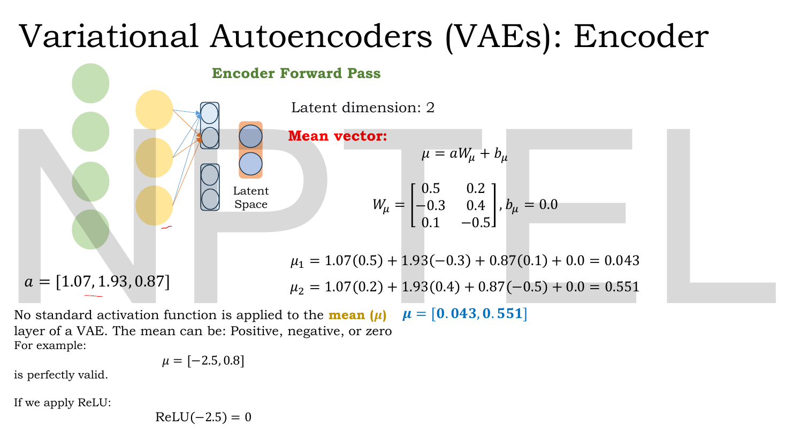
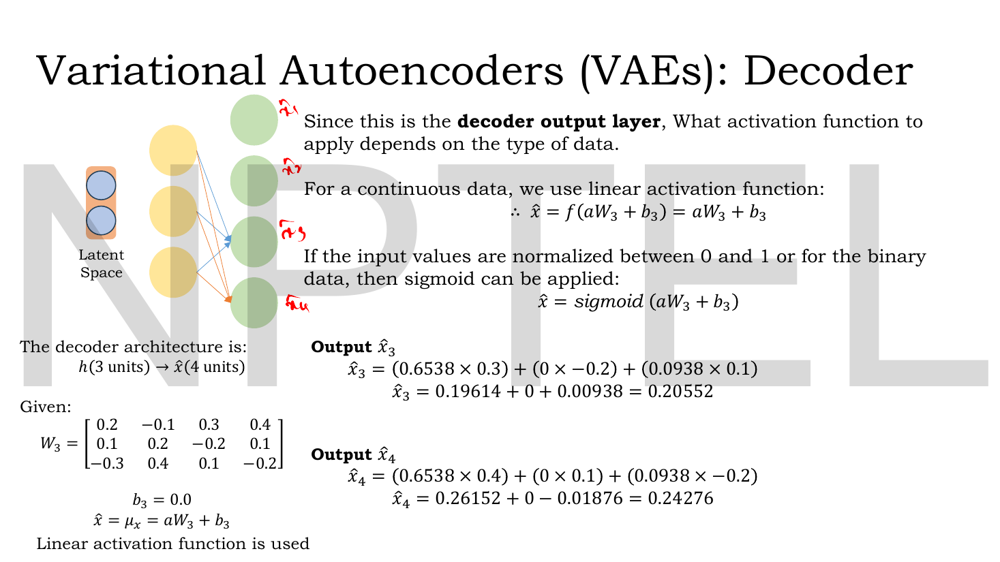
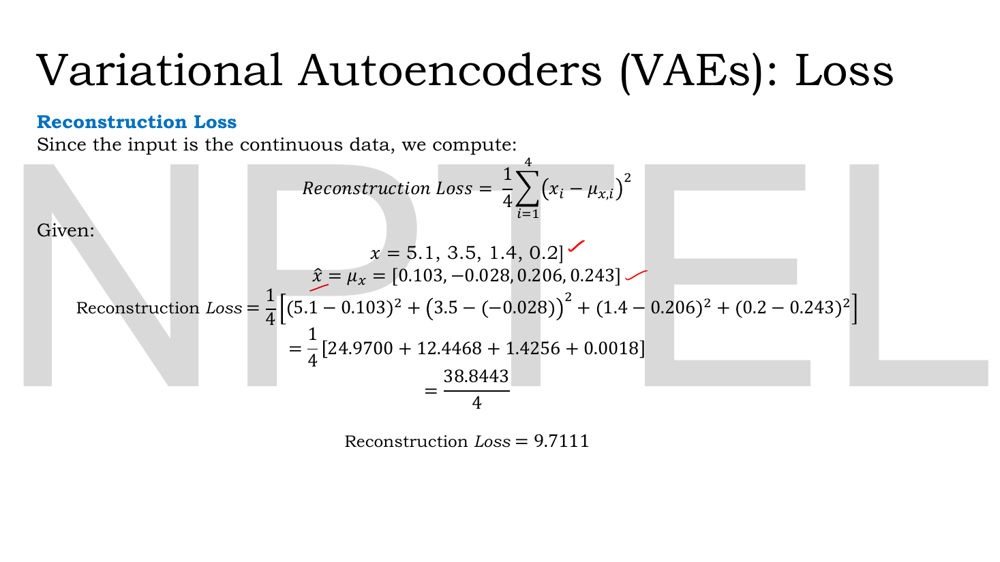
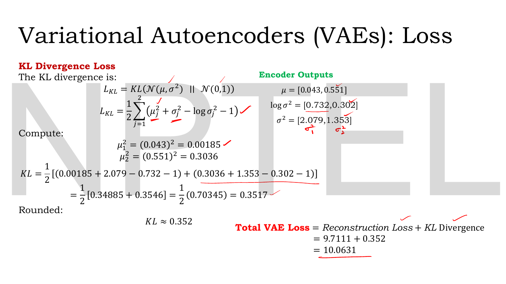

# Lec 24 — VAE Numerical Example

> **Source:** `Lec 24.pdf` (14 pages) · **Week 3** · **Playlist:** Lec 24
> **Prereqs:** [Lec 19 — KL Divergence — Part A](19-kl-divergence-a.md), [Lec 21 — Introduction to VAE and the Encoder](21-vae-encoder.md), [Lec 22 — Probabilistic Decoder, ELBO, VAE Loss](22-elbo-and-vae-loss.md), [Lec 23 — The Reparameterization Trick](23-reparameterization.md)
> **Feeds into:** [Lec 26 — Disentanglement and β-VAE](26-beta-vae.md), [Lec 27 — Conditional VAE](27-conditional-vae.md), [Lec 28 — Latent Space Interpolation](28-latent-interpolation.md)

## Why this lecture exists

Weeks 2 and 3 have built the VAE one abstraction at a time: a probabilistic encoder, an intractable posterior, an ELBO, a two-term loss, a trick to get gradients past a sampler. Nothing so far has produced a number.

This lecture pushes one real input — a four-feature vector — through a complete VAE with explicit weight matrices, and computes every intermediate value to four or five decimal places: the hidden activations, $\mu$, $\log\sigma^2$, $\sigma$, three different reparameterized samples $\mathbf{z}$, the decoder's hidden layer, the reconstruction $\hat{\mathbf{x}}$, the reconstruction loss, the KL term and the total. It is the most directly examinable deck in Week 3, because an NPTEL numerical question is almost certainly one slice of exactly this pipeline. The slides stop at the loss value; this chapter carries it one step further and takes a gradient step, which is what the loss was for.

## The ideas

### The network the deck builds

Everything that follows uses one fixed architecture and one fixed set of weights. Fix them in your head now, because every number depends on them.

```
   x            a            mu, log sigma^2        z          a_dec        xhat
 (4 units) -> (3 units) ->   (2 units each)   -> (2 units) -> (3 units) -> (4 units)
             ReLU            NO activation        mu+sigma*eps   ReLU       linear
             W1 (4x3)        W_mu (3x2)                         W2 (2x3)   W3 (3x4)
             b1 = 0.1        W_sigma (3x2)                      b2 = 0.1   b3 = 0.0
                             b_mu = b_sigma = 0
```

The input is $\mathbf{x} = [5.1,\ 3.5,\ 1.4,\ 0.2]$ — the first sample of the Iris dataset, though the deck never says so. The latent dimension is $2$.

> **Deck convention worth flagging: the biases are single shared scalars, not vectors.** The slide writes "Let Bias $(b_1) = 0.1$" and adds that same $0.1$ to all three hidden units; $b_2 = 0.1$ is likewise added to all three decoder hidden units, and $b_\mu = b_\sigma = b_3 = 0$. A conventional layer has **one bias per neuron**, so a real 4→3 layer carries 3 bias parameters, not 1. This is the same unconventional choice [Lec 16](16-ae-numerical-and-limits.md)'s deck makes. It changes nothing about the arithmetic here (adding the same constant everywhere is legal), but it changes the parameter count — see N10 — and an exam question asking "how many learnable parameters?" could key on either reading.

### Stage 1 — the encoder's hidden layer

![Encoder forward-pass slide: input x = [5.1,3.5,1.4,0.2], W1 (4×3), bias 0.1, three hidden pre-activations h1=1.07, h2=1.93, h3=0.87, and ReLU leaving a = [1.07,1.93,0.87]](../assets/pages/lec24/p-03.png)
*Fig. — The first layer, worked term by term. Notice the bias $0.1$ appearing as a fifth summand in each line, and that ReLU changes nothing because all three pre-activations happen to be positive. Page 3.*

$$\mathbf{h} = \mathbf{x}\mathbf{W}_1 + b_1, \qquad a_i = \mathrm{ReLU}(h_i) = \max(0, h_i)$$

with

$$\mathbf{W}_1 = \begin{bmatrix} 0.1 & -0.2 & 0.3 \\ 0.4 & 0.5 & -0.6 \\ -0.7 & 0.8 & 0.9 \\ 0.2 & -0.1 & 0.4 \end{bmatrix}, \quad b_1 = 0.1$$

The column of $\mathbf{W}_1$ you use is the column of the hidden unit you are computing. Worked in N1; the result is $\mathbf{a} = [1.07,\ 1.93,\ 0.87]$.

ReLU is a free pass here — all three values are positive — but do not let that lull you. On the decoder's hidden layer it will zero a unit out, and the zero propagates.

### Stage 2 — two heads, no activation


*Fig. — The mean head. The bottom-left argument is the examinable bit: a mean of $-2.5$ is perfectly valid, and ReLU would destroy it. Page 4.*

$$\mu = \mathbf{a}\mathbf{W}_\mu + b_\mu, \qquad \mathbf{W}_\mu = \begin{bmatrix} 0.5 & 0.2 \\ -0.3 & 0.4 \\ 0.1 & -0.5\end{bmatrix}, \quad b_\mu = 0$$

![Log-variance slide: log(σ²) = aW_σ + b_σ, giving [0.732, 0.302], then σ² = e^{log σ²} = [2.079, 1.353] and σ = [1.442, 1.163]](../assets/pages/lec24/p-05.png)
*Fig. — The log-variance head and the two conversions that follow it. Read the bottom-right block as a chain: log-variance → variance (exponentiate) → standard deviation (square-root). Page 5.*

$$\log\sigma^2 = \mathbf{a}\mathbf{W}_\sigma + b_\sigma, \qquad \mathbf{W}_\sigma = \begin{bmatrix} -0.2 & 0.3 \\ 0.4 & -0.1 \\ 0.2 & 0.2\end{bmatrix}, \quad b_\sigma = 0$$

**Neither head has an activation function.** The deck gives the reason explicitly for the mean — "The mean can be: Positive, negative, or zero", and ReLU$(-2.5) = 0$ would silently delete a valid mean — and then says "Similarly" for the log-variance head. The log-variance reason is the stronger one: $\log\sigma^2$ must be free to be negative (that is how you get $\sigma^2 < 1$), and the exponential downstream guarantees $\sigma^2 > 0$ whatever the head emits. That is the whole point of parameterising the variance in log space.

Then the two conversions, both **natural log / natural exponential**:

$$\sigma^2 = e^{\log\sigma^2}, \qquad \sigma = \sqrt{\sigma^2} = e^{\frac{1}{2}\log\sigma^2}$$

Worked in N2: $\mu = [0.043,\ 0.551]$, $\log\sigma^2 = [0.732,\ 0.302]$, $\sigma^2 = [2.079,\ 1.353]$, $\sigma = [1.442,\ 1.163]$.

### Stage 3 — reparameterized sampling

![Sampling slide: z₁ = μ₁ + σ₁ε₁ and z₂ = μ₂ + σ₂ε₂ worked for three different ε draws — [0.5,−0.2] giving z=[0.764,0.318], [0,0] giving z=[0.043,0.551], and [0.6,−0.4] giving z=[0.908,0.086] — beside a table of z¹…zⁿ](../assets/pages/lec24/p-06.png)
*Fig. — One encoder output, three latent vectors. The middle column ($\epsilon = [0,0]$) returns $\mathbf{z} = \mu$ exactly, which is the deterministic test-time pass. The table on the right makes the point that this could go on forever: "For the same input $\mathbf{x}$, the encoder produces one distribution $q_\phi(\mathbf{z}\mid\mathbf{x})$. Different values of $\epsilon$ give different sampled latent vectors $\mathbf{z}$ from this same distribution." Page 6.*

$$z_j = \mu_j + \sigma_j\epsilon_j, \qquad \epsilon \sim \mathcal{N}(0, 1)$$

This is the trick from [Lec 23](23-reparameterization.md), applied. Three draws are worked; the rest of the lecture carries $\mathbf{z}^{(1)} = [0.764,\ 0.318]$ forward, which came from $\epsilon^{(1)} = [0.5,\ -0.2]$.

> **Deck slip, harmless but worth knowing.** Page 6 writes $\epsilon = \mathcal{N}(0,1)$ with an equals sign where it means $\epsilon \sim \mathcal{N}(0,1)$. A sample is not a distribution. The same page is also inconsistent about ordering: it introduces $\epsilon^{(2)}$ and $\epsilon^{(3)}$ in the left and middle columns before $\epsilon^{(1)}$ in the right.

### Stage 4 — the decoder

![Decoder hidden-layer slide: z = [0.764, 0.318] through W2 (2×3) with bias 0.1, giving h = [0.6538, −0.1738, 0.0938] and ReLU output a = [0.6538, 0, 0.0938]](../assets/pages/lec24/p-07.png)
*Fig. — Here ReLU bites. $h_2 = -0.1738$ is negative, so $a_2 = 0$ and the middle decoder unit contributes nothing to any output. Carry that zero forward — it is why the second row of $\mathbf{W}_3$ never appears in the next two slides. Page 7.*

$$\mathbf{h}_{\text{dec}} = \mathbf{z}\mathbf{W}_2 + b_2, \quad \mathbf{W}_2 = \begin{bmatrix} 0.6 & -0.4 & 0.2 \\ 0.3 & 0.1 & -0.5 \end{bmatrix}, \quad b_2 = 0.1$$

![Decoder output slide: the activation rule (linear for continuous, sigmoid for [0,1] or binary), W3 (3×4), b3 = 0, and x̂₁ = 0.10262, x̂₂ = −0.02786](../assets/pages/lec24/p-08.png)
*Fig. — The output layer's activation is chosen by the data type, exactly the rule from [Lec 11](11-reconstruction-loss.md). This data is continuous, so the activation is linear, and the handwritten $f(0.10262) = 0.10262$ in the margin is the lecturer making the point that a linear activation does nothing at all. Page 8.*


*Fig. — The remaining two outputs. The $(0 \times \cdot)$ term in every line is the dead ReLU unit from page 7. Page 9.*

$$\hat{\mathbf{x}} = f(\mathbf{a}_{\text{dec}}\mathbf{W}_3 + b_3), \qquad \mathbf{W}_3 = \begin{bmatrix} 0.2 & -0.1 & 0.3 & 0.4 \\ 0.1 & 0.2 & -0.2 & 0.1 \\ -0.3 & 0.4 & 0.1 & -0.2\end{bmatrix}, \quad b_3 = 0$$

The deck's activation rule, restated: **linear** $f(a) = a$ for continuous data, **sigmoid** for binary data or pixel values normalised to $[0,1]$. Here the data is continuous (centimetres), so $\hat{\mathbf{x}} = \mathbf{a}_{\text{dec}}\mathbf{W}_3 + b_3$ with nothing on top.

![Final reconstruction slide: x̂ = [0.10262, −0.02786, 0.20552, 0.24276] rounded to [0.103, −0.028, 0.206, 0.243], identified as μ_x, beside the original x = [5.1, 3.5, 1.4, 0.2], with the note that reconstruction is poor because weights are randomly initialised](../assets/pages/lec24/p-10.png)
*Fig. — The two vectors side by side, and they are nowhere near each other. The purple line at the bottom is the deck pre-empting the obvious objection: "The reconstruction is poor because the weights and biases are randomly initialized." Page 10.*

**$\hat{\mathbf{x}}$ is the mean of the output distribution, not a sample from it.** The slide makes this distinction carefully, and it is a likely short-answer question:

| | Statement |
|---|---|
| Theoretically | $\mathbf{x}_{\text{reconstructed}} \sim p_\theta(\mathbf{x}\mid\mathbf{z})$ — the reconstruction is itself a draw |
| In practice | $\mathbf{x}_{\text{reconstructed}} \approx \mu_x$ — you take the mean of that distribution and call it the reconstruction |
| So | $\hat{\mathbf{x}} = \mu_x = [0.103,\ -0.028,\ 0.206,\ 0.243]$ |

The decoder is *probabilistic* in principle — it defines $p_\theta(\mathbf{x}\mid\mathbf{z})$ — but you never actually sample from it at the output, because adding output noise would only make the reconstruction worse without changing the loss. The sampling that matters all happens at the latent, as [Lec 22](22-elbo-and-vae-loss.md) sets up.

> Note the deck rounds $\hat{\mathbf{x}}$ from 5 decimals to 3 **before** computing the loss. Every number from here on carries that rounding; working from the unrounded $\hat{\mathbf{x}}$ gives a reconstruction loss of $9.7121$ rather than $9.7111$. Both are "right"; the deck's is the one to reproduce.

### Stage 5 — the reconstruction loss


*Fig. — The deck divides by $4$, the number of **features**, not by a number of samples — there is only one sample here. So this is a per-feature mean squared error. Page 11.*

$$\mathcal{L}_{\text{rec}} = \frac{1}{d}\sum_{i=1}^{d}\big(x_i - \mu_{x,i}\big)^2, \qquad d = 4$$

This is MSE, chosen because the input is continuous — the rule [Lec 11](11-reconstruction-loss.md) owns. Worked in N5; the answer is $9.7111$ (squared centimetres, no logs involved, so no log base to worry about).

### Stage 6 — the KL term, in closed form


*Fig. — The whole regularisation term on one slide, including the summation over $j = 1, 2$ that page 3 of [Lec 23](23-reparameterization.md) omitted. The bottom-right line is the headline result of the lecture. Page 12.*

The VAE's regulariser is the divergence from the encoder's distribution to the prior:

$$\mathcal{L}_{\mathrm{KL}} = D_{\mathrm{KL}}\big(q_\phi(\mathbf{z}\mid\mathbf{x})\,\big\|\,p(\mathbf{z})\big) = D_{\mathrm{KL}}\big(\mathcal{N}(\mu,\sigma^2)\,\big\|\,\mathcal{N}(0,1)\big)$$

and because both arguments are Gaussian it has a **closed form** — a formula you evaluate directly, with no integral and no sampling. For a $k$-dimensional diagonal Gaussian against a standard normal prior:

$$\boxed{\;D_{\mathrm{KL}}\big(\mathcal{N}(\mu,\sigma^2)\,\|\,\mathcal{N}(0,\mathbf{I})\big) = \frac{1}{2}\sum_{j=1}^{k}\Big(\mu_j^2 + \sigma_j^2 - \log\sigma_j^2 - 1\Big)\;}$$

which is the same thing as the form you will see written with the signs flipped out front:

$$= -\frac{1}{2}\sum_{j=1}^{k}\Big(1 + \log\sigma_j^2 - \mu_j^2 - \sigma_j^2\Big)$$

Term by term, because every one of them can be the thing an MCQ changes:

| Term | What it is | What it penalises | Zero when |
|---|---|---|---|
| $\mu_j^2$ | squared mean of latent dimension $j$ | the code drifting away from the origin | $\mu_j = 0$ |
| $\sigma_j^2$ | variance of latent dimension $j$ | the code being too spread out | — |
| $-\log\sigma_j^2$ | minus the **natural** log of that variance | the code collapsing to a point ($\sigma_j \to 0$ sends this to $+\infty$) | $\sigma_j^2 = 1$ |
| $-1$ | constant | — | — |
| $\tfrac12$ | overall factor | — | — |
| $\sum_j$ | over latent dimensions | — | — |

The $\sigma_j^2 - \log\sigma_j^2 - 1$ group is the whole balancing act: it is $\geq 0$ for all $\sigma_j^2 > 0$ and equals exactly $0$ at $\sigma_j^2 = 1$. Together with $\mu_j^2 \geq 0$, that gives $D_{\mathrm{KL}} \geq 0$ with equality only when $\mu_j = 0$ and $\sigma_j^2 = 1$ for every $j$ — i.e. when $q_\phi(\mathbf{z}\mid\mathbf{x})$ *is* the prior. Non-negativity is the property [Lec 19](19-kl-divergence-a.md) establishes in general; here you can see it directly in the algebra.

> **$\log$ here is the natural log, base $e$.** This matters more in this course than in most. [Lec 20](20-kl-divergence-b.md)'s deck works a discrete KL in **base 2** and reports **bits**; [Lec 14](14-sparse-ae.md)'s sparsity KL is worked in **base 10**. Those are different conventions in different chapters, and they are all defensible — KL is only defined up to a choice of base. But the Gaussian closed form as used here, and the exponential $\sigma^2 = e^{\log\sigma^2}$ feeding it, only cohere in nats. Evaluate $-\log_{10}\sigma_1^2$ instead of $-\ln\sigma_1^2$ here and you get $0.6441$ instead of $0.3517$ — see N7.

> **No deck in this course derives this formula — every slide that uses it quotes it.** [Lec 23](23-reparameterization.md) page 3 says only "when both distributions are Gaussian, the KL divergence has a closed-form expression"; this deck's page 12 writes it down and starts substituting. [Lec 19](19-kl-divergence-a.md) owns KL's definition, non-negativity and asymmetry from the *general* definition, and [Lec 20](20-kl-divergence-b.md)'s deck is entirely discrete — two weather outcomes, base 2, bits — so neither reaches the Gaussian case. The derivation that fills the gap is [Lec 22](22-elbo-and-vae-loss.md)'s, written as beyond-the-slides content there; a sketch is also in *Beyond the slides* below so this chapter stands alone. **The formula is stated here in full because the arithmetic that follows is unusable without it — do not go hunting for it mid-exam.**
>
> **Index notation.** This book writes the latent dimension count $k$ here and $d$ in [Lec 22](22-elbo-and-vae-loss.md); they are the same thing. In *this* chapter $d = 4$ is reserved for the **input feature count** in the reconstruction loss, and the latent is $k = 2$. Keep the two sums apart: reconstruction runs over $d$ features, KL runs over $k$ latent dimensions.

### Stage 7 — the total

$$\mathcal{L} = \mathcal{L}_{\text{rec}} + \mathcal{L}_{\mathrm{KL}} = 9.7111 + 0.352 = 10.0631$$

Two observations the deck does not make, both examinable.

**The reconstruction term dominates by about 28:1 here.** That ratio is not a universal constant — it is an artefact of untrained weights producing a terrible reconstruction while $\mu$ and $\sigma$ happen to start near the prior. As training proceeds the reconstruction term falls fast and the two terms come closer together. The whole of [Lec 26](26-beta-vae.md) is about deliberately re-weighting this ratio.

**The two terms are reduced differently.** The reconstruction is a **mean** over the 4 features ($\div 4$); the KL is a **sum** over the 2 latent dimensions (no $\div 2$). That inconsistency is real, it is in the deck, and it changes the balance between the terms — see N9. Most reference implementations sum both.

## Worked numericals

**The slides are one continuous worked example spanning pages 3–12**, containing nine distinct arithmetic blocks and about twenty-seven individual scalar computations. N1–N6 reproduce all of them in order; **every slide value was recomputed independently and every one matched** (details in each answer line). N7–N10 are mine, filling the gaps the deck leaves — most importantly the gradient step, which the deck never takes.

### N1. Encoder hidden layer (slides, page 3)

**Given:** $\mathbf{x} = [5.1,\ 3.5,\ 1.4,\ 0.2]$, $\mathbf{W}_1$ as above, shared bias $b_1 = 0.1$.
**Find:** $\mathbf{h}$ and $\mathbf{a} = \mathrm{ReLU}(\mathbf{h})$.

1. Hidden unit 1 — use column 1 of $\mathbf{W}_1$, namely $[0.1, 0.4, -0.7, 0.2]$:
   $$h_1 = (5.1)(0.1) + (3.5)(0.4) + (1.4)(-0.7) + (0.2)(0.2) + 0.1$$
   $$= 0.51 + 1.40 - 0.98 + 0.04 + 0.10 = 1.07$$
2. Hidden unit 2 — column 2, $[-0.2, 0.5, 0.8, -0.1]$:
   $$h_2 = -1.02 + 1.75 + 1.12 - 0.02 + 0.10 = 1.93$$
3. Hidden unit 3 — column 3, $[0.3, -0.6, 0.9, 0.4]$:
   $$h_3 = 1.53 - 2.10 + 1.26 + 0.08 + 0.10 = 0.87$$
4. ReLU: $a_i = \max(0, h_i)$. All three are positive, so nothing is clipped.

**Answer:** $\mathbf{h} = [1.07,\ 1.93,\ 0.87]$ and $\mathbf{a} = [1.07,\ 1.93,\ 0.87]$. **Matches the slide exactly.**

### N2. The two latent heads and the conversions (slides, pages 4–5)

**Given:** $\mathbf{a} = [1.07,\ 1.93,\ 0.87]$, $\mathbf{W}_\mu$ and $\mathbf{W}_\sigma$ as above, $b_\mu = b_\sigma = 0$.
**Find:** $\mu$, $\log\sigma^2$, $\sigma^2$, $\sigma$.

1. Mean, dimension 1 — column 1 of $\mathbf{W}_\mu$ is $[0.5, -0.3, 0.1]$:
   $$\mu_1 = (1.07)(0.5) + (1.93)(-0.3) + (0.87)(0.1) + 0 = 0.535 - 0.579 + 0.087 = 0.043$$
2. Mean, dimension 2 — column 2 is $[0.2, 0.4, -0.5]$:
   $$\mu_2 = 0.214 + 0.772 - 0.435 = 0.551$$
3. Log-variance, dimension 1 — column 1 of $\mathbf{W}_\sigma$ is $[-0.2, 0.4, 0.2]$:
   $$\log\sigma_1^2 = -0.214 + 0.772 + 0.174 = 0.732$$
4. Log-variance, dimension 2 — column 2 is $[0.3, -0.1, 0.2]$:
   $$\log\sigma_2^2 = 0.321 - 0.193 + 0.174 = 0.302$$
5. Variance, exponentiating with base $e$:
   $$\sigma_1^2 = e^{0.732} = 2.079222 \approx 2.079, \qquad \sigma_2^2 = e^{0.302} = 1.352569 \approx 1.353$$
6. Standard deviation, square-rooting:
   $$\sigma_1 = \sqrt{2.079222} = 1.441955 \approx 1.442, \qquad \sigma_2 = \sqrt{1.352569} = 1.162997 \approx 1.163$$

**Answer:** $\mu = [0.043,\ 0.551]$, $\log\sigma^2 = [0.732,\ 0.302]$, $\sigma^2 = [2.079,\ 1.353]$, $\sigma = [1.442,\ 1.163]$. **All six match the slide**, to the three decimals it prints.

Step 6 is the one students skip. $\sigma_1 \neq 2.079$; the variance is $2.079$ and the standard deviation is its square root. The one-line shortcut is $\sigma = e^{\frac12\log\sigma^2} = e^{0.366} = 1.441955$.

### N3. Three reparameterized samples (slides, page 6)

**Given:** $\mu = [0.043,\ 0.551]$, $\sigma = [1.442,\ 1.163]$, and three noise draws.
**Find:** $\mathbf{z}$ for each, using $z_j = \mu_j + \sigma_j\epsilon_j$.

1. $\epsilon^{(1)} = [0.5,\ -0.2]$:
   - $z_1 = 0.043 + (1.442)(0.5) = 0.043 + 0.721 = 0.764$
   - $z_2 = 0.551 + (1.163)(-0.2) = 0.551 - 0.2326 = 0.3184 \approx 0.318$
2. $\epsilon^{(2)} = [0,\ 0]$:
   - $z_1 = 0.043 + 0 = 0.043$, $z_2 = 0.551 + 0 = 0.551$
3. $\epsilon^{(3)} = [0.6,\ -0.4]$:
   - $z_1 = 0.043 + (1.442)(0.6) = 0.043 + 0.8652 = 0.9082 \approx 0.908$
   - $z_2 = 0.551 + (1.163)(-0.4) = 0.551 - 0.4652 = 0.0858 \approx 0.086$

**Answer:** $\mathbf{z}^{(1)} = [0.764,\ 0.318]$, $\mathbf{z}^{(2)} = [0.043,\ 0.551]$, $\mathbf{z}^{(3)} = [0.908,\ 0.086]$. **All three match the slide.** (The slide rounds $0.2326$ to $0.233$ mid-line and still lands on $0.318$; so do we.)

$\mathbf{z}^{(2)} = \mu$ exactly, because $\epsilon = 0$ kills the noise term. The rest of the lecture uses $\mathbf{z}^{(1)}$.

### N4. The decoder, all the way to $\hat{\mathbf{x}}$ (slides, pages 7–9)

**Given:** $\mathbf{z} = [0.764,\ 0.318]$, $\mathbf{W}_2$, $b_2 = 0.1$, $\mathbf{W}_3$, $b_3 = 0$, linear output activation.
**Find:** $\mathbf{a}_{\text{dec}}$ and $\hat{\mathbf{x}}$.

1. Decoder hidden pre-activations, $\mathbf{h} = \mathbf{z}\mathbf{W}_2 + b_2$:
   - $h_1 = (0.764)(0.6) + (0.318)(0.3) + 0.1 = 0.4584 + 0.0954 + 0.1 = 0.6538$
   - $h_2 = (0.764)(-0.4) + (0.318)(0.1) + 0.1 = -0.3056 + 0.0318 + 0.1 = -0.1738$
   - $h_3 = (0.764)(0.2) + (0.318)(-0.5) + 0.1 = 0.1528 - 0.1590 + 0.1 = 0.0938$
2. ReLU: $a_1 = 0.6538$, $a_2 = \max(0, -0.1738) = \mathbf{0}$, $a_3 = 0.0938$. So $\mathbf{a}_{\text{dec}} = [0.6538,\ 0,\ 0.0938]$.
3. Outputs, $\hat{x}_i = \sum_k a_k \mathbf{W}_3[k,i]$. Every middle term vanishes because $a_2 = 0$:
   - $\hat{x}_1 = (0.6538)(0.2) + (0)(0.1) + (0.0938)(-0.3) = 0.13076 + 0 - 0.02814 = 0.10262$
   - $\hat{x}_2 = (0.6538)(-0.1) + (0)(0.2) + (0.0938)(0.4) = -0.06538 + 0 + 0.03752 = -0.02786$
   - $\hat{x}_3 = (0.6538)(0.3) + (0)(-0.2) + (0.0938)(0.1) = 0.19614 + 0 + 0.00938 = 0.20552$
   - $\hat{x}_4 = (0.6538)(0.4) + (0)(0.1) + (0.0938)(-0.2) = 0.26152 + 0 - 0.01876 = 0.24276$
4. Linear activation, so $f(\cdot)$ is the identity and these are final.

**Answer:** $\hat{\mathbf{x}} = [0.10262,\ -0.02786,\ 0.20552,\ 0.24276]$, rounded by the deck to $[0.103,\ -0.028,\ 0.206,\ 0.243]$. **All seven values match the slide.**

Note $\hat{x}_2$ is negative. With a linear output that is allowed; with a sigmoid output it would be impossible, which is the point of the activation rule.

### N5. Reconstruction loss (slides, page 11)

**Given:** $\mathbf{x} = [5.1,\ 3.5,\ 1.4,\ 0.2]$, $\hat{\mathbf{x}} = \mu_x = [0.103,\ -0.028,\ 0.206,\ 0.243]$, $d = 4$.
**Find:** $\mathcal{L}_{\text{rec}} = \frac{1}{4}\sum_{i=1}^{4}(x_i - \mu_{x,i})^2$.

1. Residuals, feature by feature. Watch the sign on feature 2 — subtracting a negative:

| $i$ | $x_i$ | $\mu_{x,i}$ | $x_i - \mu_{x,i}$ | squared |
|---|---|---|---|---|
| 1 | $5.1$ | $0.103$ | $4.997$ | $24.970009$ |
| 2 | $3.5$ | $-0.028$ | $3.5 - (-0.028) = 3.528$ | $12.446784$ |
| 3 | $1.4$ | $0.206$ | $1.194$ | $1.425636$ |
| 4 | $0.2$ | $0.243$ | $-0.043$ | $0.001849$ |

2. Sum: $24.970009 + 12.446784 + 1.425636 + 0.001849 = 38.844278$.
3. Divide by $d = 4$: $38.844278 / 4 = 9.7110695$.

**Answer:** $\mathcal{L}_{\text{rec}} = 9.7111$ (squared centimetres; no logarithm involved). **Matches the slide**, whose intermediate values $24.9700$, $12.4468$, $1.4256$, $0.0018$, $38.8443$ are all four-decimal roundings of mine.

Feature 1 alone contributes $64\%$ of the total. That is MSE's character: it is dominated by the single worst feature, because the error is squared.

### N6. KL divergence and the total loss (slides, page 12)

**Given:** $\mu = [0.043,\ 0.551]$, $\log\sigma^2 = [0.732,\ 0.302]$, $\sigma^2 = [2.079,\ 1.353]$, prior $p(\mathbf{z}) = \mathcal{N}(0,1)$ per dimension, $k = 2$. **Natural log throughout.**
**Find:** $\mathcal{L}_{\mathrm{KL}}$ and the total VAE loss.

1. Squared means: $\mu_1^2 = 0.043^2 = 0.001849 \approx 0.00185$; $\mu_2^2 = 0.551^2 = 0.303601 \approx 0.3036$.
2. Dimension 1 bracket, $\mu_1^2 + \sigma_1^2 - \log\sigma_1^2 - 1$:
   $$0.00185 + 2.079 - 0.732 - 1 = 0.34885$$
3. Dimension 2 bracket, $\mu_2^2 + \sigma_2^2 - \log\sigma_2^2 - 1$:
   $$0.3036 + 1.353 - 0.302 - 1 = 0.35460$$
4. Sum and halve:
   $$\mathcal{L}_{\mathrm{KL}} = \tfrac12(0.34885 + 0.35460) = \tfrac12(0.70345) = 0.351725$$
5. Total:
   $$\mathcal{L} = 9.7111 + 0.352 = 10.0631$$

**Answer:** $\mathcal{L}_{\mathrm{KL}} = 0.3517 \approx 0.352$ **nats**, total VAE loss $= 10.0631$. **Both match the slide.** (Carrying full precision instead of the slide's rounded $\sigma^2$ gives $\mathcal{L}_{\mathrm{KL}} = 0.351623$ and a total of $10.0637$ — a fourth-decimal difference, not an error.)

Sanity check: $\mathcal{L}_{\mathrm{KL}} > 0$, as KL must be. Both brackets are individually positive too, which they must be, since each is $\mu_j^2 + (\sigma_j^2 - \log\sigma_j^2 - 1)$ and both groups are non-negative.

### N7. The log-base trap, priced

**Given:** the same encoder outputs as N6.
**Find:** what you get if you evaluate the $\log\sigma_j^2$ term in base 10 instead of base $e$, and whether it could pass as an answer.

1. $\log_{10}(2.079) = 0.317977$ and $\log_{10}(1.353) = 0.131258$. (Both are the natural logs divided by $\ln 10 = 2.302585$.)
2. Dimension 1: $0.00185 + 2.079 - 0.317977 - 1 = 0.762873$.
3. Dimension 2: $0.3036 + 1.353 - 0.131258 - 1 = 0.525342$.
4. Halve the sum: $\tfrac12(1.288215) = 0.644108$.

**Answer:** $0.6441$ instead of $0.3517$ — **$1.83\times$ too big**, and the total becomes $10.3552$ instead of $10.0631$. It is not a factor of $2.303$ off, so you cannot spot it by eye, which is exactly what makes it a good distractor. **Always use natural log in the Gaussian closed form**, because the $\sigma^2 = e^{\log\sigma^2}$ conversion that produced $\sigma^2$ is base-$e$ too; mixing bases breaks the identity.

A second, uglier version of the same mistake: substituting $\sigma$ where the formula wants $\sigma^2$. Using $\sigma = [1.442, 1.163]$ in place of $\sigma^2$ gives $\tfrac12[(0.00185 + 1.442 - 0.732 - 1) + (0.3036 + 1.163 - 0.302 - 1)] = -0.0618$. **A negative KL is impossible** — if your answer is negative, you made this substitution.

### N8. One gradient step on the decoder's output weights

The deck computes the loss and stops. A loss exists to be differentiated, so take one step. This uses the chain from [Lec 23](23-reparameterization.md).

**Given:** $\mathcal{L}_{\text{rec}} = \frac14\sum_i (x_i - \hat{x}_i)^2$, $\mathbf{a}_{\text{dec}} = [0.6538,\ 0,\ 0.0938]$, $\hat{\mathbf{x}} = [0.103, -0.028, 0.206, 0.243]$, learning rate $\eta = 0.01$.
**Find:** $\partial\mathcal{L}/\partial\mathbf{W}_3$, the update to $\mathbf{W}_3[1,1]$, and the loss afterwards.

1. Differentiate the loss w.r.t. each output. With $\mathcal{L} = \frac14\sum(x_i - \hat{x}_i)^2$:
   $$\frac{\partial\mathcal{L}}{\partial\hat{x}_i} = \frac{1}{4}\cdot 2(x_i - \hat{x}_i)\cdot(-1) = -\frac{1}{2}(x_i - \hat{x}_i)$$
   $$\frac{\partial\mathcal{L}}{\partial\hat{\mathbf{x}}} = -\tfrac12[4.997,\ 3.528,\ 1.194,\ -0.043] = [-2.4985,\ -1.7640,\ -0.5970,\ 0.0215]$$
2. The output layer is linear, $\hat{x}_i = \sum_k a_k W_3[k,i]$, so $\partial\hat{x}_i/\partial W_3[k,i] = a_k$ and
   $$\frac{\partial\mathcal{L}}{\partial W_3[k,i]} = a_k \cdot \frac{\partial\mathcal{L}}{\partial\hat{x}_i}$$
3. Take the top-left entry, $k=1$, $i=1$:
   $$\frac{\partial\mathcal{L}}{\partial W_3[1,1]} = (0.6538)(-2.4985) = -1.633519$$
4. Gradient descent, $W \leftarrow W - \eta\,\partial\mathcal{L}/\partial W$:
   $$W_3[1,1] = 0.2 - (0.01)(-1.633519) = 0.2 + 0.016335 = 0.216335$$
5. Updating the whole of $\mathbf{W}_3$ the same way and re-running the decoder gives $\hat{\mathbf{x}} = [0.1135,\ -0.0202,\ 0.2081,\ 0.2427]$ and $\mathcal{L}_{\text{rec}} = 9.6697$.

**Answer:** $\partial\mathcal{L}/\partial W_3[1,1] = -1.6335$, so $W_3[1,1]$ rises from $0.2$ to $0.216335$, and one step drops the reconstruction loss from $9.7111$ to $9.6697$. The gradient is *negative*, so the weight *increases* — correct, because $\hat{x}_1 = 0.103$ is far below $x_1 = 5.1$ and the model needs a bigger output.

Note row 2 of $\mathbf{W}_3$ gets gradient **zero** everywhere, because $a_2 = 0$ from the dead ReLU unit. A dead unit blocks learning for every weight leaving it.

### N9. The complete gradient on $\mu$ — both branches

The reparameterization trick exists so that $\mu$ and $\sigma$ get gradients. Here is $\partial\mathcal{L}/\partial\mu$ with **both** contributions, which neither deck writes down.

**Given:** everything from N4–N6, plus $\epsilon = [0.5,\ -0.2]$.
**Find:** $\partial\mathcal{L}/\partial\mu$ and $\partial\mathcal{L}_{\mathrm{KL}}/\partial\log\sigma^2$.

1. From N8, $\partial\mathcal{L}_{\text{rec}}/\partial\hat{\mathbf{x}} = [-2.4985,\ -1.7640,\ -0.5970,\ 0.0215]$.
2. Back through $\mathbf{W}_3$: $\dfrac{\partial\mathcal{L}}{\partial a_k} = \sum_i W_3[k,i]\,\dfrac{\partial\mathcal{L}}{\partial\hat{x}_i}$.
   - $k=1$: $(0.2)(-2.4985) + (-0.1)(-1.7640) + (0.3)(-0.5970) + (0.4)(0.0215) = -0.4938$
   - $k=2$: $(0.1)(-2.4985) + (0.2)(-1.7640) + (-0.2)(-0.5970) + (0.1)(0.0215) = -0.4811$
   - $k=3$: $(-0.3)(-2.4985) + (0.4)(-1.7640) + (0.1)(-0.5970) + (-0.2)(0.0215) = -0.0201$
3. Back through ReLU: multiply by $1$ where $h_k > 0$ and by $0$ where $h_k \leq 0$. The mask is $[1, 0, 1]$, so $\partial\mathcal{L}/\partial\mathbf{h}_{\text{dec}} = [-0.4938,\ 0,\ -0.0201]$.
4. Back through $\mathbf{W}_2$: $\dfrac{\partial\mathcal{L}}{\partial z_j} = \sum_k W_2[j,k]\,\dfrac{\partial\mathcal{L}}{\partial h_k}$.
   - $j=1$: $(0.6)(-0.4938) + (-0.4)(0) + (0.2)(-0.0201) = -0.29628 - 0.00402 = -0.30030$
   - $j=2$: $(0.3)(-0.4938) + (0.1)(0) + (-0.5)(-0.0201) = -0.14814 + 0.01005 = -0.13809$
5. Through the reparameterization, $\partial z_j/\partial\mu_j = 1$, so the reconstruction branch passes straight through: $\partial\mathcal{L}_{\text{rec}}/\partial\mu = [-0.30030,\ -0.13809]$.
6. The KL branch is direct, no $\mathbf{z}$ involved. From $\mathcal{L}_{\mathrm{KL}} = \frac12\sum_j(\mu_j^2 + \sigma_j^2 - \log\sigma_j^2 - 1)$:
   $$\frac{\partial\mathcal{L}_{\mathrm{KL}}}{\partial\mu_j} = \tfrac12 \cdot 2\mu_j = \mu_j = [0.043,\ 0.551]$$
7. Add the branches:
   - $\partial\mathcal{L}/\partial\mu_1 = -0.30030 + 0.043 = -0.25730$
   - $\partial\mathcal{L}/\partial\mu_2 = -0.13809 + 0.551 = \phantom{-}0.41291$
8. And for the log-variance head, writing $s_j = \log\sigma_j^2$ so $\sigma_j^2 = e^{s_j}$:
   $$\frac{\partial\mathcal{L}_{\mathrm{KL}}}{\partial s_j} = \tfrac12(e^{s_j} - 1) = \tfrac12(\sigma_j^2 - 1) = [\tfrac12(1.079),\ \tfrac12(0.353)] = [0.5395,\ 0.1765]$$

**Answer:** $\partial\mathcal{L}/\partial\mu = [-0.2573,\ 0.4129]$ and $\partial\mathcal{L}_{\mathrm{KL}}/\partial\log\sigma^2 = [0.5395,\ 0.1765]$.

Dimension 2 is the interesting one: the reconstruction wants $\mu_2$ to **increase** (gradient $-0.138$) while the KL wants it to **decrease** toward zero (gradient $+0.551$), and the KL wins, so $\mu_2$ falls. That tug-of-war, in two numbers, is the entire VAE objective.

### N10. Parameter count, both bias conventions

**Given:** the architecture $4 \to 3 \to (2+2) \to 2 \to 3 \to 4$ from this deck.
**Find:** the number of learnable parameters, under the deck's shared-scalar bias and under the conventional one-bias-per-neuron.

1. Weight matrices, unchanged either way: $\mathbf{W}_1$ is $4\times3 = 12$; $\mathbf{W}_\mu$ is $3\times2 = 6$; $\mathbf{W}_\sigma$ is $3\times2 = 6$; $\mathbf{W}_2$ is $2\times3 = 6$; $\mathbf{W}_3$ is $3\times4 = 12$. Total $= 42$.
2. **Deck convention**, one scalar bias per layer: $1 + 1 + 1 + 1 + 1 = 5$. Grand total $42 + 5 = \mathbf{47}$.
3. **Conventional**, one bias per output neuron: $3 + 2 + 2 + 3 + 4 = 14$. Grand total $42 + 14 = \mathbf{56}$.

**Answer:** $47$ under the deck's reading, $56$ under the standard one. The $\mathbf{z}$ layer contributes no parameters of its own — $\mathbf{z} = \mu + \sigma\odot\epsilon$ is pure arithmetic — which is itself a likely MCQ.

### N11. The reduction convention, priced

**Given:** the same $\hat{\mathbf{x}}$ and encoder outputs, but the reconstruction summed over features rather than averaged — the convention most PyTorch VAE implementations use.
**Find:** the total loss, and the ratio of the two terms, under each convention.

1. Deck's convention: $\mathcal{L}_{\text{rec}} = 38.8443/4 = 9.7111$, $\mathcal{L}_{\mathrm{KL}} = 0.3517$, total $= 10.0628$ (the slide's $10.0631$ uses its rounded $0.352$), ratio $= 27.6 : 1$.
2. Sum convention: $\mathcal{L}_{\text{rec}} = 38.8443$, $\mathcal{L}_{\mathrm{KL}} = 0.3517$ (unchanged — it was already a sum), total $= 39.1960$, ratio $= 110.4 : 1$.

**Answer:** $10.063$ versus $39.196$ — the same model, the same forward pass, a loss four times larger, and the KL's relative weight cut by a factor of $4$. **The reduction convention is not cosmetic: it silently rescales the KL term**, which is the same knob [Lec 26](26-beta-vae.md) turns deliberately with $\beta$. If a question gives a total loss that does not match yours, check this before checking your arithmetic.

## Code

The whole deck in 30 lines, plus the gradient step it never takes. Every printed value is a slide value.

```python
import numpy as np

x   = np.array([5.1, 3.5, 1.4, 0.2])                      # one Iris sample
W1  = np.array([[0.1,-0.2,0.3],[0.4,0.5,-0.6],[-0.7,0.8,0.9],[0.2,-0.1,0.4]]); b1 = 0.1
Wmu = np.array([[0.5,0.2],[-0.3,0.4],[0.1,-0.5]])
Ws  = np.array([[-0.2,0.3],[0.4,-0.1],[0.2,0.2]])
W2  = np.array([[0.6,-0.4,0.2],[0.3,0.1,-0.5]]);          b2 = 0.1
W3  = np.array([[0.2,-0.1,0.3,0.4],[0.1,0.2,-0.2,0.1],[-0.3,0.4,0.1,-0.2]]); b3 = 0.0

# ---------- encoder ----------
a      = np.maximum(0, x @ W1 + b1)                       # ReLU hidden layer
mu     = a @ Wmu                                          # NO activation
logvar = a @ Ws                                           # NO activation
var, sd = np.exp(logvar), np.exp(0.5*logvar)
print("a =", a, " mu =", mu.round(3), " logvar =", logvar.round(3), " sigma =", sd.round(3))

# ---------- reparameterization (eps FIXED to the slide's draw) ----------
eps = np.array([0.5, -0.2])
z   = mu + sd * eps
print("z =", z.round(3))

# ---------- decoder ----------
hd = z @ W2 + b2
ad = np.maximum(0, hd)                                    # ReLU, kills unit 2
xh = ad @ W3 + b3                                         # linear output
print("h_dec =", hd.round(4), " a_dec =", ad.round(4), " xhat =", xh.round(5))

# ---------- loss ----------
rec = np.mean((x - xh)**2)                                # deck divides by d = 4
kl  = 0.5*np.sum(mu**2 + var - logvar - 1)                # natural log
print("recon = %.4f   KL = %.4f   total = %.4f" % (rec, kl, rec+kl))

# ---------- one gradient step on W3 ----------
dxh = -2.0/len(x) * (x - xh)                              # dL_rec/dxhat
gW3 = np.outer(ad, dxh)                                   # dL_rec/dW3
W3_new = W3 - 0.01 * gW3                                  # eta = 0.01
print("dL/dW3[0,0] = %.4f -> W3[0,0]: %.4f -> %.6f" % (gW3[0,0], W3[0,0], W3_new[0,0]))
xh_new = ad @ W3_new + b3
print("recon after one step = %.4f  (was %.4f)" % (np.mean((x-xh_new)**2), rec))
```

```
a = [1.07 1.93 0.87]  mu = [0.043 0.551]  logvar = [0.732 0.302]  sigma = [1.442 1.163]
z = [0.764 0.318]
h_dec = [ 0.6539 -0.1738  0.0936]  a_dec = [0.6539 0.     0.0936]  xhat = [ 0.1027  -0.02795  0.20553  0.24284]
recon = 9.7120   KL = 0.3516   total = 10.0636
dL/dW3[0,0] = -1.6339 -> W3[0,0]: 0.2000 -> 0.216339
recon after one step = 9.6697  (was 9.7120)
```

Every line reproduces the deck: $\mathbf{a} = [1.07, 1.93, 0.87]$, $\mu = [0.043, 0.551]$, $\log\sigma^2 = [0.732, 0.302]$, $\sigma = [1.442, 1.163]$, $\mathbf{z} = [0.764, 0.318]$, the dead ReLU unit, $\hat{\mathbf{x}} \approx [0.103, -0.028, 0.206, 0.243]$, and a total of $10.064$ against the slide's $10.0631$. The tiny gap is entirely the deck's mid-calculation rounding — it rounds $\mathbf{z}$ to three decimals before the decoder and $\hat{\mathbf{x}}$ to three before the loss, while NumPy carries full precision throughout. **Reproduce the deck's numbers in the exam; the difference is in the fourth decimal and no option will turn on it.**

The last two lines are the step the lecture leaves out. `np.outer(ad, dxh)` is the whole gradient of a linear layer: outer product of what came in with what came back. One step at $\eta = 0.01$ buys you $0.042$ of loss — slow, which is why training runs for thousands of epochs.

## Exam pack

### Must-memorise

| Item | Exactly this |
|---|---|
| Encoder hidden layer | $\mathbf{a} = \mathrm{ReLU}(\mathbf{x}\mathbf{W}_1 + b_1)$ |
| Mean head | $\mu = \mathbf{a}\mathbf{W}_\mu + b_\mu$, **no activation** |
| Log-variance head | $\log\sigma^2 = \mathbf{a}\mathbf{W}_\sigma + b_\sigma$, **no activation** |
| Variance | $\sigma^2 = e^{\log\sigma^2}$ (base $e$) |
| Standard deviation | $\sigma = \sqrt{\sigma^2} = e^{\frac12\log\sigma^2}$ |
| Reparameterization | $z_j = \mu_j + \sigma_j\epsilon_j$, $\epsilon\sim\mathcal{N}(0,1)$ |
| Decoder hidden | $\mathbf{a}_{\text{dec}} = \mathrm{ReLU}(\mathbf{z}\mathbf{W}_2 + b_2)$ |
| Decoder output | $\hat{\mathbf{x}} = f(\mathbf{a}_{\text{dec}}\mathbf{W}_3 + b_3)$; $f$ linear for continuous, sigmoid for binary/$[0,1]$ |
| What $\hat{\mathbf{x}}$ is | the **mean** $\mu_x$ of $p_\theta(\mathbf{x}\mid\mathbf{z})$, not a draw from it |
| Reconstruction loss (this deck) | $\mathcal{L}_{\text{rec}} = \dfrac{1}{d}\sum_{i=1}^{d}(x_i - \mu_{x,i})^2$ |
| **Gaussian KL, closed form** | $D_{\mathrm{KL}}(\mathcal{N}(\mu,\sigma^2)\|\mathcal{N}(0,\mathbf{I})) = \dfrac12\sum_{j=1}^{k}\big(\mu_j^2 + \sigma_j^2 - \log\sigma_j^2 - 1\big)$ |
| Same formula, flipped | $= -\dfrac12\sum_{j=1}^{k}\big(1 + \log\sigma_j^2 - \mu_j^2 - \sigma_j^2\big)$ |
| Log base in that formula | **natural log, nats** |
| KL is zero when | $\mu_j = 0$ and $\sigma_j^2 = 1$ for every $j$ — i.e. $q_\phi$ equals the prior |
| Total | $\mathcal{L} = \mathcal{L}_{\text{rec}} + \mathcal{L}_{\mathrm{KL}}$ |
| $\partial\mathcal{L}_{\mathrm{KL}}/\partial\mu_j$ | $\mu_j$ |
| $\partial\mathcal{L}_{\mathrm{KL}}/\partial(\log\sigma_j^2)$ | $\tfrac12(\sigma_j^2 - 1)$ |

### Numbers worth knowing

| Quantity | Value |
|---|---|
| Input | $\mathbf{x} = [5.1,\ 3.5,\ 1.4,\ 0.2]$ (Iris sample 1) |
| Architecture | $4 \to 3 \to (\mu:2,\ \log\sigma^2:2) \to \mathbf{z}:2 \to 3 \to 4$ |
| Encoder hidden | $\mathbf{h} = \mathbf{a} = [1.07,\ 1.93,\ 0.87]$ (ReLU inactive) |
| Mean | $\mu = [0.043,\ 0.551]$ |
| Log-variance | $\log\sigma^2 = [0.732,\ 0.302]$ |
| Variance | $\sigma^2 = [2.079,\ 1.353]$ |
| Std deviation | $\sigma = [1.442,\ 1.163]$ |
| $\epsilon^{(1)}$, $\mathbf{z}^{(1)}$ | $[0.5,\ -0.2]$ → $[0.764,\ 0.318]$ |
| $\epsilon^{(2)}$, $\mathbf{z}^{(2)}$ | $[0,\ 0]$ → $[0.043,\ 0.551]$ = $\mu$ |
| $\epsilon^{(3)}$, $\mathbf{z}^{(3)}$ | $[0.6,\ -0.4]$ → $[0.908,\ 0.086]$ |
| Decoder hidden pre-activation | $[0.6538,\ -0.1738,\ 0.0938]$ |
| Decoder hidden after ReLU | $[0.6538,\ \mathbf{0},\ 0.0938]$ — unit 2 is dead |
| Reconstruction | $\hat{\mathbf{x}} = [0.10262,\ -0.02786,\ 0.20552,\ 0.24276] \to [0.103,\ -0.028,\ 0.206,\ 0.243]$ |
| Squared errors | $24.9700,\ 12.4468,\ 1.4256,\ 0.0018$; sum $38.8443$ |
| **Reconstruction loss** | $\mathbf{9.7111}$ |
| KL per dimension | $0.34885$ and $0.35460$; sum $0.70345$ |
| **KL divergence** | $\mathbf{0.3517 \approx 0.352}$ nats |
| **Total VAE loss** | $\mathbf{10.0631}$ |
| Same KL in base 10 (wrong) | $0.6441$ |
| Loss with sum-reduction instead of mean | $39.1960$ |
| Learnable parameters | $47$ (deck's shared scalar bias) / $56$ (one bias per neuron) |
| $\partial\mathcal{L}/\partial W_3[1,1]$ at $\eta=0.01$ | $-1.6335$, so $0.2 \to 0.216335$ |

### Likely MCQ traps

- **Applying an activation to the $\mu$ or $\log\sigma^2$ head.** Neither has one. ReLU on $\mu$ would clamp every negative mean to zero (the deck's own example: $\mathrm{ReLU}(-2.5) = 0$); on $\log\sigma^2$ it would forbid $\sigma^2 < 1$ entirely. **The only activations in this network are the two ReLUs on the hidden layers and the output layer's data-dependent choice.**
- **Treating $e^{\log\sigma^2}$ as $\sigma$.** It is $\sigma^2$. Here $\sigma_1^2 = 2.079$ but $\sigma_1 = 1.442$. Using $2.079$ in $z = \mu + \sigma\epsilon$ gives $z_1 = 1.083$ instead of $0.764$.
- **Putting $\sigma$ into the KL formula where $\sigma^2$ belongs.** You get $-0.0618$. **KL can never be negative** — that is the tell.
- **Using $\log_{10}$ or $\log_2$ in the Gaussian KL.** Base 10 gives $0.6441$ instead of $0.3517$. Base 2 gives something else again. [Lec 20](20-kl-divergence-b.md)'s discrete worked example genuinely uses base 2 and reports bits; that is a different question and a different convention. **In the Gaussian closed form, nats.**
- **Forgetting the $\tfrac12$ in front of the KL sum.** Gives $0.70345$ instead of $0.3517$ — exactly double, and a very plausible-looking option.
- **Summing the KL over the wrong index.** The sum runs over **latent dimensions** ($k = 2$), not over input features ($d = 4$).
- **Dividing the reconstruction loss by the wrong number.** This deck divides by $d = 4$, the feature count, because there is one sample. A batch of $m$ samples would also average over $m$. And many implementations sum rather than average — see N11, which changes the total from $10.06$ to $39.20$.
- **Missing the dead ReLU unit.** $h_2 = -0.1738 < 0$, so $a_2 = 0$ and the second row of $\mathbf{W}_3$ is multiplied by zero in all four outputs. Including it gives four wrong $\hat{x}$ values at once.
- **Sign error on $x_2 - \hat{x}_2$.** $\hat{x}_2 = -0.028$ is negative, so $3.5 - (-0.028) = 3.528$, not $3.472$. That single slip changes the loss from $9.7111$ to $9.6126$.
- **"The reconstruction is bad, so the model is wrong."** The deck answers this itself: the weights are randomly initialised and the model has not been trained. The arithmetic is correct; the model is simply untrained.
- **"$\hat{\mathbf{x}}$ is sampled from $p_\theta(\mathbf{x}\mid\mathbf{z})$."** In theory yes, in practice no — you take the mean, $\hat{\mathbf{x}} = \mu_x$. Only the *latent* is sampled.
- **Counting parameters for the $\mathbf{z}$ layer.** There are none. $\mathbf{z} = \mu + \sigma\odot\epsilon$ has no weights and no biases.

### Self-test

1. The encoder outputs $\log\sigma^2 = [0.732,\ 0.302]$. Give $\sigma^2$ and $\sigma$, stating the log base you used.
2. Why does the mean head have no activation function? Give the deck's own counterexample.
3. With $\mu = [0.043,\ 0.551]$ and $\sigma = [1.442,\ 1.163]$, compute $\mathbf{z}$ for $\epsilon = [-1,\ 1]$.
4. Compute the decoder's hidden layer from $\mathbf{z} = [0.764,\ 0.318]$ and say which unit dies.
5. State the closed-form Gaussian KL in full, name every term, and say what makes it zero.
6. Compute the KL for $\mu = [0,\ 0]$, $\sigma^2 = [1,\ 1]$. Then for $\mu = [0,\ 0]$, $\sigma^2 = [4,\ 4]$.
7. Given $\mathbf{x} = [5.1, 3.5, 1.4, 0.2]$ and $\hat{\mathbf{x}} = [0.103, -0.028, 0.206, 0.243]$, compute the reconstruction loss using this deck's reduction, and again using a sum.
8. Why can $\hat{x}_2$ be negative here but not in a VAE trained on MNIST?
9. Give $\partial\mathcal{L}_{\mathrm{KL}}/\partial\mu_j$ and $\partial\mathcal{L}_{\mathrm{KL}}/\partial(\log\sigma_j^2)$, and evaluate both for this deck's encoder outputs.
10. How many learnable parameters does this network have? State your bias convention.
11. A classmate reports a KL of $-0.0618$. What did they do wrong, and how do you know without redoing their arithmetic?

<details><summary>Answers</summary>

1. **Natural log / base $e$.** $\sigma^2 = e^{0.732} = 2.079$ and $e^{0.302} = 1.353$. $\sigma = \sqrt{2.079} = 1.442$ and $\sqrt{1.353} = 1.163$.
2. Because a mean may legitimately be positive, negative or zero, and any squashing or rectifying activation would restrict that range. The deck's example: $\mu = [-2.5,\ 0.8]$ is perfectly valid, but $\mathrm{ReLU}(-2.5) = 0$ would destroy it. (The same argument applies with more force to $\log\sigma^2$, which must be free to be negative so that $\sigma^2$ can be below 1.)
3. $z_1 = 0.043 + 1.442(-1) = -1.399$; $z_2 = 0.551 + 1.163(1) = 1.714$. So $\mathbf{z} = [-1.399,\ 1.714]$.
4. $h_1 = 0.4584+0.0954+0.1 = 0.6538$; $h_2 = -0.3056+0.0318+0.1 = -0.1738$; $h_3 = 0.1528-0.1590+0.1 = 0.0938$. **Unit 2 dies** — $\mathrm{ReLU}(-0.1738) = 0$ — so $\mathbf{a}_{\text{dec}} = [0.6538,\ 0,\ 0.0938]$.
5. $D_{\mathrm{KL}}(\mathcal{N}(\mu,\sigma^2)\|\mathcal{N}(0,\mathbf{I})) = \frac12\sum_{j=1}^{k}(\mu_j^2 + \sigma_j^2 - \log\sigma_j^2 - 1)$, natural log. $\mu_j^2$ penalises the mean being away from the origin; $\sigma_j^2$ penalises excess spread; $-\log\sigma_j^2$ penalises collapse to a point (it $\to +\infty$ as $\sigma_j\to 0$); $-1$ is the constant that makes the $\sigma$ group vanish at $\sigma_j^2 = 1$; $\frac12$ scales the whole thing; the sum runs over the $k$ **latent dimensions**. It is zero exactly when $\mu_j = 0$ and $\sigma_j^2 = 1$ for every $j$, i.e. when the posterior equals the prior.
6. First: each bracket is $0 + 1 - \ln 1 - 1 = 0 + 1 - 0 - 1 = 0$, so $\mathrm{KL} = 0$. Second: each bracket is $0 + 4 - \ln 4 - 1 = 4 - 1.386294 - 1 = 1.613706$; $\mathrm{KL} = \frac12(2 \times 1.613706) = \mathbf{1.6137}$ nats.
7. Squared errors $24.970009 + 12.446784 + 1.425636 + 0.001849 = 38.844278$. Deck's reduction (mean over $d=4$): $\mathbf{9.7111}$. Sum reduction: $\mathbf{38.8443}$.
8. Because this decoder uses a **linear** output activation, which can emit any real number. MNIST pixels are normalised to $[0,1]$, so that decoder would use a **sigmoid** output, whose range is $(0,1)$ — a negative reconstruction would be impossible. The activation is chosen by the data type ([Lec 11](11-reconstruction-loss.md)).
9. $\partial\mathcal{L}_{\mathrm{KL}}/\partial\mu_j = \mu_j$, giving $[0.043,\ 0.551]$. $\partial\mathcal{L}_{\mathrm{KL}}/\partial(\log\sigma_j^2) = \frac12(\sigma_j^2 - 1)$, giving $\frac12(1.079) = 0.5395$ and $\frac12(0.353) = 0.1765$.
10. Weights: $12 + 6 + 6 + 6 + 12 = 42$. **Deck's convention** (one shared scalar bias per layer): $+5 = \mathbf{47}$. **Conventional** (one bias per neuron): $+3+2+2+3+4 = +14 = \mathbf{56}$. The $\mathbf{z}$ layer adds none.
11. They substituted $\sigma$ where the formula wants $\sigma^2$ — $[1.442, 1.163]$ instead of $[2.079, 1.353]$. You know without recomputing because **KL divergence is non-negative by construction** ([Lec 19](19-kl-divergence-a.md)), so any negative value is a mechanical error, not a close call.

</details>

## Beyond the slides

**Gap: no deck in this course derives the Gaussian closed-form KL — every slide that uses it quotes it.**
**Why it matters:** [Lec 19](19-kl-divergence-a.md) gives the general definition, [Lec 20](20-kl-divergence-b.md)'s deck is wholly discrete (two weather outcomes, base 2, bits), and both Lec 23 and Lec 24 simply write the Gaussian formula down. [Lec 22](22-elbo-and-vae-loss.md) supplies the full derivation off its own bat; here is the shape of it, so that this chapter's arithmetic stands on something rather than on magic. Start from $D_{\mathrm{KL}}(q\|p) = \mathbb{E}_q[\log q - \log p]$. For one dimension with $q = \mathcal{N}(\mu,\sigma^2)$ and $p = \mathcal{N}(0,1)$, substitute the Gaussian log-densities $\log q(z) = -\tfrac12\log(2\pi\sigma^2) - \tfrac{(z-\mu)^2}{2\sigma^2}$ and $\log p(z) = -\tfrac12\log(2\pi) - \tfrac{z^2}{2}$. The $\log 2\pi$ terms cancel, leaving $\mathbb{E}_q\big[-\tfrac12\log\sigma^2 - \tfrac{(z-\mu)^2}{2\sigma^2} + \tfrac{z^2}{2}\big]$. Then use $\mathbb{E}_q[(z-\mu)^2] = \sigma^2$ (so the middle term is $\tfrac12$) and $\mathbb{E}_q[z^2] = \mu^2 + \sigma^2$ (so the last is $\tfrac{\mu^2+\sigma^2}{2}$), giving $\tfrac12(\mu^2 + \sigma^2 - \log\sigma^2 - 1)$. Sum over independent dimensions. The $-1$ you have to memorise is just the $-\tfrac12$ from the middle term doubled.

**Gap: the deck never takes a gradient step, so the loss has no visible purpose.**
**Why it matters:** a loss value on its own tells you nothing — $10.0631$ is neither good nor bad. What matters is that it is differentiable and that the derivative points somewhere useful. N8 and N9 and the Code section supply that step, and they also make the reparameterization trick pay off visibly: $\partial\mathcal{L}/\partial\mu_2$ is the sum of a reconstruction pull of $-0.138$ and a KL pull of $+0.551$, which is the VAE's two-term objective reduced to a single number you can watch fight.

**Gap: the deck computes three $\mathbf{z}$ samples and then quietly uses only one.**
**Why it matters:** this is the single-sample Monte-Carlo estimate of $\mathbb{E}_{q_\phi}[\log p_\theta(\mathbf{x}\mid\mathbf{z})]$, and the deck never names it. Worth checking what the other draws would have given: $\epsilon = [0,0]$ (i.e. $\mathbf{z} = \mu$) yields $\hat{\mathbf{x}} = [0.0720, -0.0015, 0.0598, 0.1302]$ and a reconstruction loss of $9.8356$ — **worse** than the noisy draw's $9.7111$. The mean of the posterior is not guaranteed to be the best reconstruction in an untrained net, and the loss you actually optimise is an average over draws, not the loss at $\mu$.

**Gap: $\epsilon$ is presented as given, with no word on where it comes from at inference time.**
**Why it matters:** during training $\epsilon$ is drawn fresh every forward pass. At test time you have two modes and they do different things: set $\epsilon = 0$ to get the deterministic reconstruction $\hat{\mathbf{x}}$ from $\mathbf{z} = \mu$, or **ignore the encoder entirely** and draw $\mathbf{z} \sim \mathcal{N}(0,\mathbf{I})$ from the prior to *generate* a new sample. The second is what makes a VAE generative, and it only works because the KL term has been pushing $q_\phi(\mathbf{z}\mid\mathbf{x})$ toward the prior all through training — the one job the term from page 12 is doing. [Lec 28](28-latent-interpolation.md) picks this up.

**Gap: this is a single sample, and nothing says what changes for a batch.**
**Why it matters:** with $m$ samples, both terms acquire an average over the batch: $\mathcal{L} = \frac1m\sum_{i=1}^{m}\big[\mathcal{L}_{\text{rec}}^{(i)} + \mathcal{L}_{\mathrm{KL}}^{(i)}\big]$. Each sample has its **own** $\mu^{(i)}$, $\sigma^{(i)}$ and $\epsilon^{(i)}$ — a common misconception is that the KL term compares the whole batch's aggregate distribution against the prior, which it does not. Per-sample posteriors, per-sample KLs, then average.

**Gap: the companion vision course's VAE worked example differs in its reduction.**
**Why it matters:** [`29-autoencoders-to-vae.md`](../../GenAIforCV/notes/week-08/29-autoencoders-to-vae.md) and [`30-elbo-and-reparameterization.md`](../../GenAIforCV/notes/week-08/30-elbo-and-reparameterization.md) present the same VAE loss but follow the standard implementation in **summing** the reconstruction over features rather than averaging. The formula is identical; the number is not — $38.8443$ versus $9.7111$ on this very example, as N11 shows. **This deck's $\div d$ is what an NPTEL question on this course will expect.**

## Cut from the slides

Pages 1, 2, 13 and 14 are the course title card, a one-bullet session overview, the next-session preview ("In week 4 (1st session): Hands-on implementation of Variational Autoencoders") and the thank-you; the preview is reflected in the *Feeds into* line instead. Pages 8 and 9 are the same slide with different outputs filled in, so both are embedded but the shared explanatory text — the linear-versus-sigmoid activation rule, which [Lec 11](11-reconstruction-loss.md) owns — is stated once. The network diagrams in the left margin of pages 3 through 10 are the same schematic redrawn with different layers highlighted; they are carried by the ASCII architecture sketch at the top of *The ideas* rather than described eight times. The $z^1 \ldots z^n$ table on page 6 is reproduced as prose, since its three filled rows are exactly the three samples worked beside it. The theoretical aside on page 10 — that $\mathbf{x}_{\text{reconstructed}} \sim p_\theta(\mathbf{x}\mid\mathbf{z})$ in principle but $\approx \mu_x$ in practice — is kept in full, because it is the deck's only probabilistic-decoder content and it is examinable; the underlying decoder theory belongs to [Lec 22](22-elbo-and-vae-loss.md). The lecturer's handwritten annotations — the `max(0, 1.07)` workings on page 3, the circled $\mu_1 + \sigma_1\epsilon_1$ on page 6, the circled $\mathbf{W}_2$ rows on page 7, the $f(0.10262) = 0.10262$ and $f(-0.02786) = -0.02786$ on page 8, and the $\sigma_1^2$ / $\sigma_2^2$ labels on page 12 — are reproduced as emphasis in the prose. Every numerical value on pages 3 through 12 is reproduced and independently verified above.
