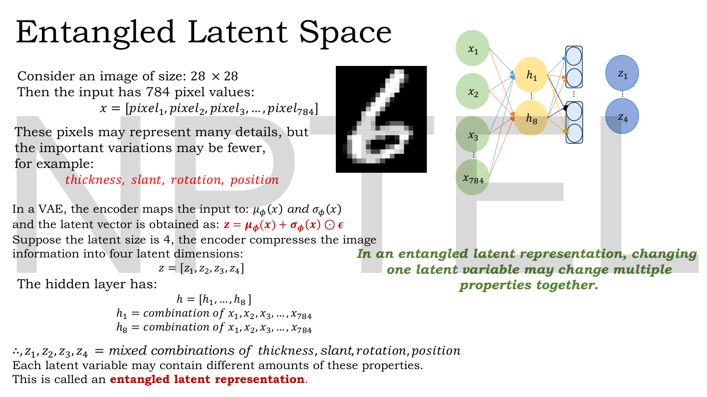
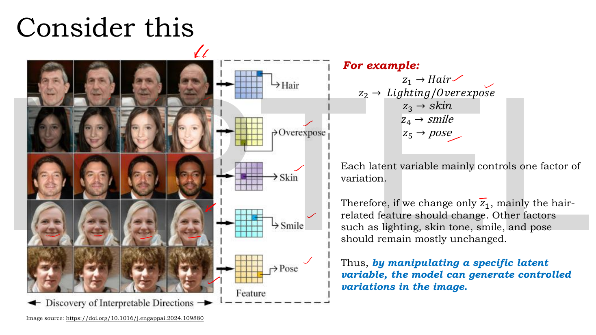
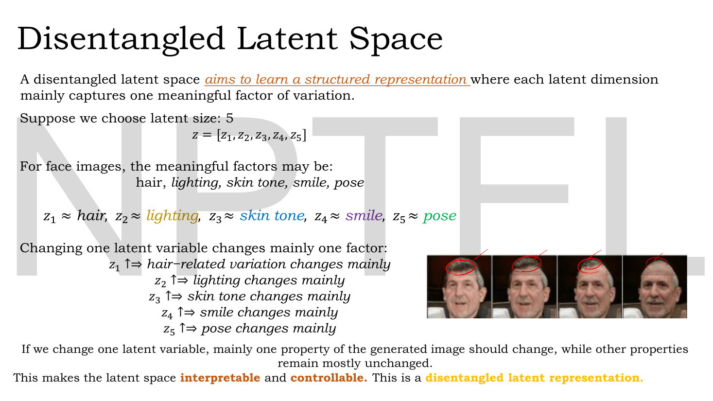
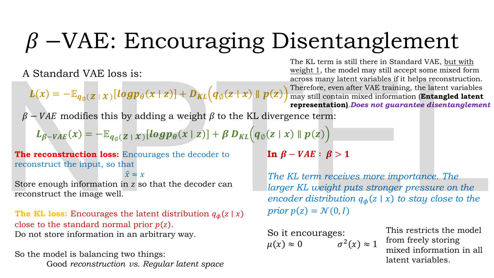
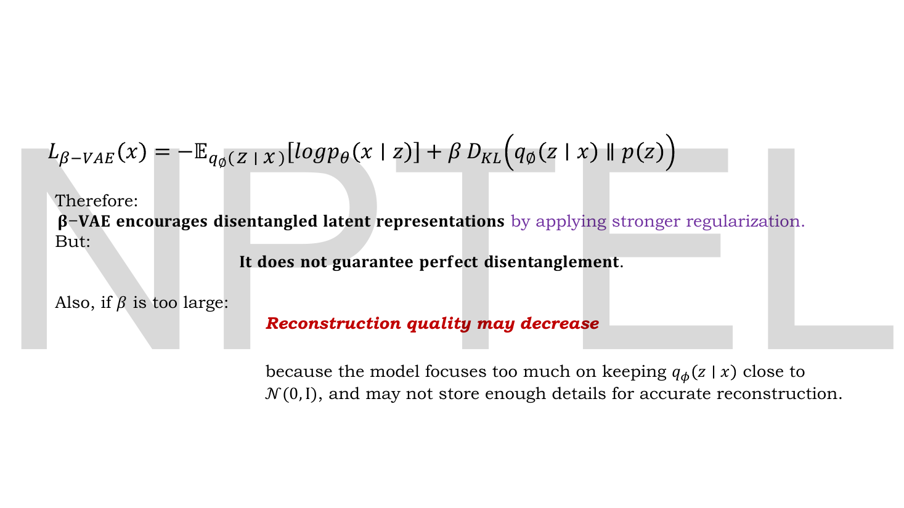
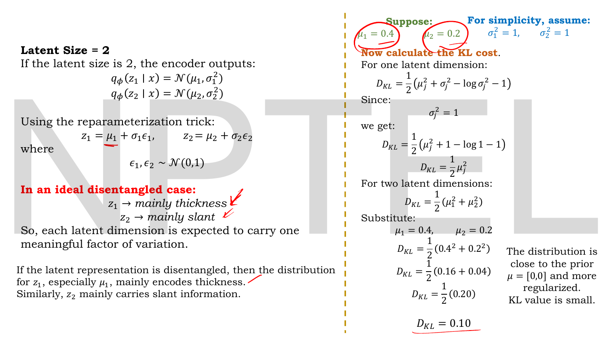
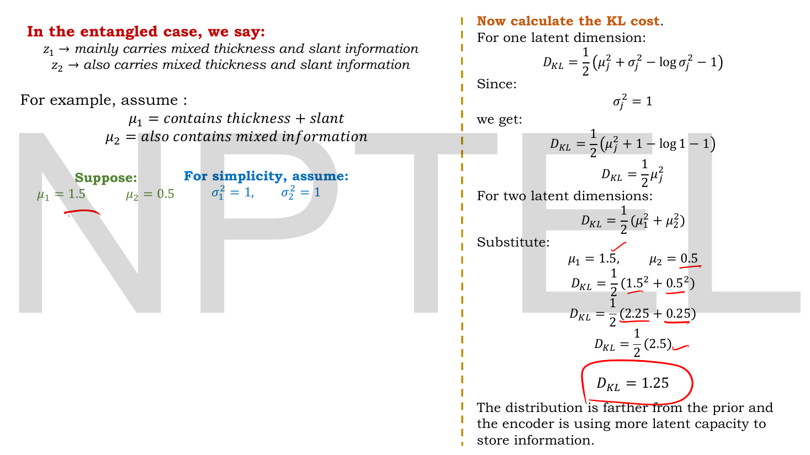
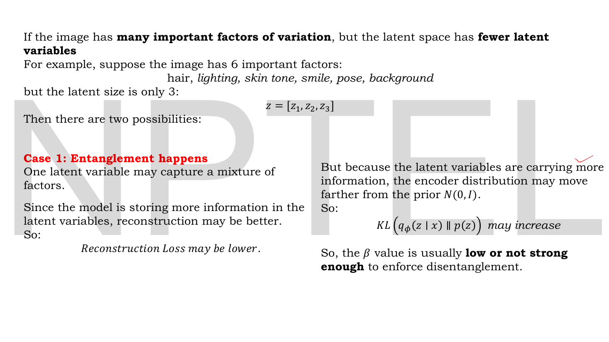
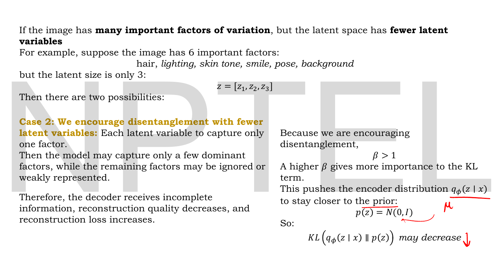
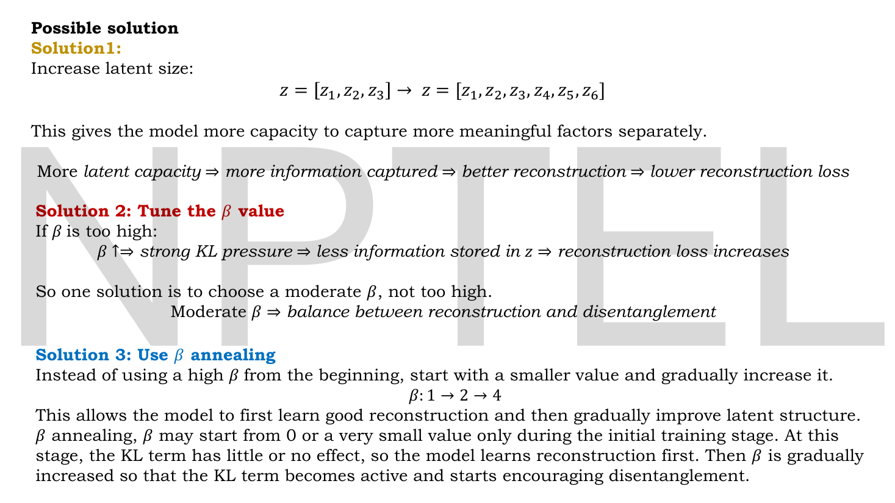

# Lec 26 — Disentanglement and β-VAE

> **Source:** `Lec 26.pdf` (16 pages) · **Week 4** · **Playlist:** Lec 26
> **Prereqs:** [Lec 19 — KL Divergence Part A](19-kl-divergence-a.md), [Lec 21 — Introduction to VAE and the Encoder](21-vae-encoder.md), [Lec 22 — Probabilistic Decoder, ELBO, VAE Loss](22-elbo-and-vae-loss.md), [Lec 23 — Reparameterization Trick](23-reparameterization.md)
> **Feeds into:** [Lec 27 — Conditional VAE](27-conditional-vae.md), [Lec 28 — Latent Space Interpolation](28-latent-interpolation.md), [Lec 41 — StyleGAN](41-stylegan.md)

## Why this lecture exists

[Lec 22](22-elbo-and-vae-loss.md) gave you a VAE that reconstructs well and samples legally. It never promised the latent vector would be *readable*. Train a VAE on MNIST with a 4-dimensional code and you get four numbers that jointly determine the digit — but no single one of them is "thickness" or "slant". Each is a smear of everything.

That costs you control. If you want a generative model you can steer — thicker stroke, same digit; more smile, same face — you need the code's axes to line up with the factors a human would name. This lecture names the failure (**entanglement**), names the goal (**disentanglement**), and gives you the one-character fix: put a weight $\beta$ in front of the KL term. Everything else about the VAE stays exactly as it was. The rest of the lecture is about what that one character costs you.

## The ideas

### What the latent vector actually contains


*Fig. — Follow the arrows and the conclusion is forced. Every $h_j$ is a combination of **all 784** pixels; every $z_i$ is a combination of all the $h_j$. Nothing anywhere in the architecture or the loss says "keep thickness out of $z_2$". Page 4.*

Start concrete, because the deck does. A $28\times28$ image is

$$\mathbf{x} = [\,\text{pixel}_1, \text{pixel}_2, \ldots, \text{pixel}_{784}\,]$$

784 numbers. But the lecturer's point is that the 784 numbers are not 784 *independent* things. Across a dataset of handwritten digits, the real variation is much smaller: **thickness, slant, rotation, position**. Four knobs, roughly, plus the digit identity itself. That is why a 4-dimensional code can work at all.

Now follow what the encoder does with them. The hidden layer is

$$h_1 = \text{combination of } x_1, x_2, \ldots, x_{784}, \qquad \ldots \qquad h_8 = \text{combination of } x_1, x_2, \ldots, x_{784}$$

and the latent is a combination of those. So

$$z_1, z_2, z_3, z_4 = \text{mixed combinations of thickness, slant, rotation, position}$$

**Entanglement** is exactly this: each latent variable carries some of several human-meaningful factors, in amounts nobody chose. The deck's one-line test, quoted:

> *In an entangled latent representation, changing one latent variable may change multiple properties together.*

Make that concrete. Suppose $z_2$ happens to encode $0.7\times$slant $+\ 0.3\times$thickness. Nudge $z_2$ from $0.4$ to $0.9$ and the generated digit leans *and* gets fatter. You cannot ask for one without the other, because no axis of the latent space corresponds to one alone.

Note what is **not** the problem. The model reconstructs fine. The latent space is fine for sampling. Entanglement is a failure of *interpretability and control*, not of fit.

### What disentanglement would look like


*Fig. — Read each **row** left to right: one latent coordinate is being swept while the other four are held fixed. Row 1 changes hair and leaves the face alone; row 5 changes head pose and leaves hair alone. That row-wise independence is the entire definition of disentanglement, shown rather than stated. Page 5.*


*Fig. — The word doing all the work is **mainly**. Not "only": the deck never claims a clean separation, just a dominant one. Page 6.*

A **disentangled latent space** is one where each latent dimension mainly captures one meaningful factor of variation. The deck's face example, with latent size 5:

$$\mathbf{z} = [z_1, z_2, z_3, z_4, z_5], \qquad z_1 \approx \text{hair},\ z_2 \approx \text{lighting},\ z_3 \approx \text{skin tone},\ z_4 \approx \text{smile},\ z_5 \approx \text{pose}$$

and then the property that matters:

| Change | Result |
|---|---|
| $z_1 \uparrow$ | hair-related variation changes mainly |
| $z_2 \uparrow$ | lighting changes mainly |
| $z_3 \uparrow$ | skin tone changes mainly |
| $z_4 \uparrow$ | smile changes mainly |
| $z_5 \uparrow$ | pose changes mainly |

The deck's summary: this makes the latent space **interpretable** and **controllable**. Interpretable because you can put a name on an axis; controllable because, in the deck's words, *by manipulating a specific latent variable, the model can generate controlled variations in the image*.

> **Disentanglement is a property of the latent space, not of the images.** The same trained decoder, the same image quality, the same sampling procedure. The only thing that changed is *which direction in $\mathbb{R}^k$ does what*. This is also why it is hard to measure — see *Beyond the slides*.

### Why the plain VAE does not give you this for free


*Fig. — The two boxed equations differ by exactly one symbol. Note the right-hand margin: the standard VAE **has** a KL term already, "but with weight 1" — that parenthesis is the whole lecture. Page 7.*

The standard VAE loss, in this deck's notation (it writes $L(x)$; this book writes $\mathcal{L}$):

$$\mathcal{L}(\mathbf{x}) = -\,\mathbb{E}_{q_\phi(\mathbf{z}\mid\mathbf{x})}\!\left[\log p_\theta(\mathbf{x}\mid\mathbf{z})\right] \;+\; D_{\mathrm{KL}}\!\left(q_\phi(\mathbf{z}\mid\mathbf{x})\,\|\,p(\mathbf{z})\right)$$

Two terms, pulling in opposite directions ([Lec 22](22-elbo-and-vae-loss.md) owns the derivation; [Lec 19](19-kl-divergence-a.md) owns $D_{\mathrm{KL}}$):

- **The reconstruction loss** wants $\hat{\mathbf{x}} \approx \mathbf{x}$. It says: *store enough information in $\mathbf{z}$ that the decoder can rebuild the image.*
- **The KL loss** wants $q_\phi(\mathbf{z}\mid\mathbf{x})$ close to the prior $p(\mathbf{z}) = \mathcal{N}(\mathbf{0}, \mathbf{I})$. It says: *do not store information in an arbitrary way.*

So the model is already balancing **good reconstruction vs. regular latent space**. The deck's diagnosis of why that is not enough is precise and worth memorising:

> The KL term is still there in Standard VAE, **but with weight 1**, the model may still accept some mixed form across many latent variables if it helps reconstruction. Therefore, even after VAE training, the latent variables may still contain mixed information (**entangled latent representation**). *Does not guarantee disentanglement.*

In other words: at weight 1, the exchange rate between "one more nat of KL" and "one less nat of reconstruction error" is 1:1, and mixing factors across dimensions is often a *good trade* at that price. Raise the price and the trade stops being worth it.

### The β-VAE objective

$$\boxed{\;\mathcal{L}_{\beta\text{-VAE}}(\mathbf{x}) = -\,\mathbb{E}_{q_\phi(\mathbf{z}\mid\mathbf{x})}\!\left[\log p_\theta(\mathbf{x}\mid\mathbf{z})\right] \;+\; \beta\, D_{\mathrm{KL}}\!\left(q_\phi(\mathbf{z}\mid\mathbf{x})\,\|\,p(\mathbf{z})\right)\;}$$

That is the entire modification. One scalar hyperparameter $\beta$ multiplying the KL term. Everything else — the encoder, the decoder, the reparameterization trick, the prior, the reconstruction loss — is unchanged from [Lec 21](21-vae-encoder.md)–[Lec 23](23-reparameterization.md).

**The identity you must not lose marks on:**

$$\beta = 1 \;\Longleftrightarrow\; \text{the plain VAE of Lec 22, exactly}$$

Substitute $\beta = 1$ and the second equation becomes the first, symbol for symbol. The β-VAE is not a different model; it is a *family* of models with the VAE sitting at $\beta=1$. An exam question phrased "for what value of $\beta$ does the β-VAE reduce to a standard VAE?" has the answer $\boxed{1}$, and "β-VAE with $\beta=1$ is a standard VAE" is a true statement.

**What $\beta > 1$ does,** in the deck's words: the KL term receives more importance; the larger KL weight puts stronger pressure on the encoder distribution $q_\phi(\mathbf{z}\mid\mathbf{x})$ to stay close to the prior $p(\mathbf{z}) = \mathcal{N}(\mathbf{0},\mathbf{I})$. Concretely it encourages

$$\mu(\mathbf{x}) \approx 0, \qquad \sigma^2(\mathbf{x}) \approx 1$$

for every input. The deck's gloss: *this restricts the model from freely storing mixed information in all latent variables.*

That last sentence is the causal chain and it is worth slowing down for, because the link from "stay near the prior" to "one factor per axis" is not obvious:

```
 beta UP
   -> KL term is expensive
   -> each latent dim must keep mu near 0 and sigma^2 near 1
   -> the TOTAL information the code may carry is squeezed
   -> the model must spend its small budget on the factors that
      reduce reconstruction error the most, one per axis,
      instead of smearing many factors across every axis
   -> axes become (more) interpretable
```

The prior $\mathcal{N}(\mathbf{0},\mathbf{I})$ has **independent** coordinates. Pushing $q_\phi$ toward it is pushing the latent coordinates toward independence — and independent coordinates carrying distinct factors is what disentanglement *is*. That is the mechanism.

### What it costs


*Fig. — The two "but" lines are more examinable than the headline. β-VAE **encourages**; it does not **guarantee**. And a large $\beta$ is paid for in blur. Page 8.*

Three claims, all examinable, all stated flatly on the slide:

1. **β-VAE encourages disentangled latent representations** by applying stronger regularisation.
2. **It does not guarantee perfect disentanglement.** No value of $\beta$ makes disentanglement certain.
3. **If $\beta$ is too large, reconstruction quality may decrease**, "because the model focuses too much on keeping $q_\phi(\mathbf{z}\mid\mathbf{x})$ close to $\mathcal{N}(\mathbf{0},\mathbf{I})$, and may not store enough details for accurate reconstruction."

So the trade-off, in one table — memorise this:

| | $\beta < 1$ | $\beta = 1$ | $\beta > 1$ |
|---|---|---|---|
| Model | weakly-regularised VAE | **plain VAE (Lec 22)** | **β-VAE** |
| KL pressure | weaker than standard | standard | stronger |
| Latent space | less prior-like, more informative | the usual compromise | tightly prior-like |
| Disentanglement | worse | not guaranteed | encouraged, still not guaranteed |
| Reconstruction | sharper | baseline | **blurrier / more detail lost** |
| Limit case | $\beta \to 0$: a plain autoencoder's objective | — | $\beta \to \infty$: $q_\phi \to p(\mathbf{z})$, $\mathbf{z}$ carries nothing, decoder outputs the dataset mean |

The two limits are worth holding in mind as sanity anchors. At $\beta = 0$ the KL term vanishes and you are left with pure reconstruction — which is the autoencoder of [Lec 10](10-autoencoder-intro.md), with all of its generative defects back ([Lec 16](16-ae-numerical-and-limits.md)). At $\beta \to \infty$ the encoder is forced to output $\mathcal{N}(0,1)$ regardless of input, the code becomes pure noise, and the decoder can do no better than emit the average training image. **Both extremes are useless, in opposite ways.** $\beta$ is a dial between two failure modes.

### Reading disentanglement off the KL number

The deck's cleverest move: it makes the abstract idea *measurable* using arithmetic you already have. With a diagonal Gaussian encoder and a standard normal prior, the KL has a closed form, one term per latent dimension $j$ (derived in [Lec 22](22-elbo-and-vae-loss.md); reproduced here because the lecture uses it on three slides):

$$D_{\mathrm{KL}} = \frac{1}{2}\sum_j \left(\mu_j^2 + \sigma_j^2 - \log \sigma_j^2 - 1\right)$$

The deck then sets $\sigma_j^2 = 1$ "for simplicity" everywhere, which kills two of the four terms, since $\log 1 = 0$:

$$D_{\mathrm{KL}} = \frac{1}{2}\sum_j\left(\mu_j^2 + 1 - 0 - 1\right) = \frac{1}{2}\sum_j \mu_j^2$$

**The KL cost is half the squared length of the mean vector.** So "how far has the encoder pushed this input's code away from the origin?" *is* the KL, under this simplification.


*Fig. — The **disentangled** case. Two factors, two latent dimensions, one each. Small means, small KL: $D_{\mathrm{KL}} = 0.10$. The lecturer's circles mark the two inputs to the arithmetic. Page 9.*


*Fig. — The **entangled** case, same two-dimensional latent, same $\sigma_j^2 = 1$, same formula. Only the means changed, and the KL jumped from 0.10 to 1.25. The deck's reading: "the distribution is farther from the prior and the encoder is using more latent capacity to store information." Page 11.*

The deck works this three times, with the same latent size 2 and the same $\sigma_1^2 = \sigma_2^2 = 1$, varying only the means:

| Case | $\mu_1$ | $\mu_2$ | $D_{\mathrm{KL}}$ | Deck's reading | Page |
|---|---|---|---|---|---|
| Ideal, disentangled | $0.4$ | $0.2$ | $0.10$ | close to the prior, more regularised, KL small | 9 |
| Entangled | $0.8$ | $0.6$ | $0.50$ | farther from the prior, more latent capacity used | 10 |
| Entangled, stronger | $1.5$ | $0.5$ | $1.25$ | farther still | 11 |

All three are reproduced step by step in *Worked numericals*, and all three of my computations agree with the slides.

> **Be careful what this table proves.** A large KL means the encoder is storing a lot of information far from the prior. That is *correlated* with entanglement in the deck's story, but it is not a disentanglement metric — a perfectly disentangled code with large-amplitude factors would also score a large KL. The deck is using KL as an *illustration of the pressure*, not as a measurement of the property. Treat the three numbers as showing "what the $\beta$ multiplier is multiplying", which is exactly how an exam will use them.

### The capacity problem: when there are more factors than dimensions


*Fig. — Case 1, the $\beta$-too-small branch. Six factors crammed into three dimensions: each dimension must carry two, reconstruction is good, KL climbs. Page 12.*


*Fig. — Case 2, the $\beta$-too-large branch, identical setup. One factor per dimension means three of the six factors are simply **dropped**; the decoder gets incomplete information and reconstruction degrades. The lecturer's red "$\mu$" annotation points at the pressure driving $\mu$ toward the prior. Page 13.*

This pair of slides is the sharpest thing in the lecture and it is easy to skim past. The setup: an image with **6 important factors** — hair, lighting, skin tone, smile, pose, background — but a latent of size only **3**, $\mathbf{z} = [z_1, z_2, z_3]$. Six things, three slots. Something has to give, and there are exactly two ways it can:

| | **Case 1: entanglement happens** | **Case 2: disentanglement is enforced** |
|---|---|---|
| What each $z_j$ does | captures a *mixture* of factors | captures *one* factor only |
| Factors represented | all 6, smeared | ~3 dominant ones; the rest ignored or weak |
| Information in $\mathbf{z}$ | more | less |
| Reconstruction loss | **may be lower** (better reconstruction) | **increases** (decoder gets incomplete information) |
| $D_{\mathrm{KL}}(q_\phi \| p)$ | **may increase** (farther from the prior) | **may decrease** (pushed toward the prior) |
| What $\beta$ was | low, or not strong enough | $\beta > 1$ |

Read the two loss columns against each other and the trade-off stops being a slogan. The *same architecture on the same data* gives you lower reconstruction loss and higher KL in one regime, and higher reconstruction loss and lower KL in the other. $\beta$ is the knob that selects the regime. **Neither column is "the right answer"** — which one you want depends on whether you are building a model to reconstruct or a model to control.

Note also what Case 2 reveals: with fewer latent dimensions than factors, disentanglement is not merely expensive, it is *lossy by construction*. Three axes cannot each own one of six factors without three factors going unowned.

### The three fixes


*Fig. — Three remedies for the Case-1/Case-2 squeeze, in increasing order of cleverness. Note Solution 3's two descriptions of the schedule: the headline says $\beta: 1 \to 2 \to 4$, the paragraph says $\beta$ "may start from 0 or a very small value". Both are annealing; the second is the more common practice. Page 14.*

**Solution 1 — increase the latent size.**

$$\mathbf{z} = [z_1, z_2, z_3] \;\longrightarrow\; \mathbf{z} = [z_1, z_2, z_3, z_4, z_5, z_6]$$

If six factors will not fit in three slots, provide six slots. The deck's chain, verbatim:

> More *latent capacity* $\Rightarrow$ more information captured $\Rightarrow$ better reconstruction $\Rightarrow$ lower reconstruction loss

This directly relieves the Case-2 squeeze: now each dimension *can* own one factor without any factor being dropped. The unstated cost is that a wider latent is also easier to leave partly unused or redundant, and you have to pick the number 6 somehow.

**Solution 2 — tune $\beta$.** If $\beta$ is too high:

> $\beta \uparrow \Rightarrow$ strong KL pressure $\Rightarrow$ less information stored in $\mathbf{z}$ $\Rightarrow$ reconstruction loss increases

so choose a **moderate** $\beta$ — "not too high":

> moderate $\beta$ $\Rightarrow$ balance between reconstruction and disentanglement

**Solution 3 — $\beta$ annealing.** Instead of a high $\beta$ from the first epoch, start small and raise it:

$$\beta:\ 1 \;\to\; 2 \;\to\; 4$$

The reason, in the deck's own words: *this allows the model to first learn good reconstruction and then gradually improve latent structure.* $\beta$ may start at 0 or a very small value during the initial training stage, so the KL term has little or no effect and the model learns to reconstruct first; then $\beta$ is raised so the KL term becomes active and starts encouraging disentanglement.

Why this is better than a fixed moderate $\beta$ rather than just a hedge: a high $\beta$ at initialisation is applied to a decoder that cannot yet reconstruct anything, so the cheapest way to reduce the loss is to zero out the code entirely — the encoder collapses to $q_\phi = p(\mathbf{z})$ and never recovers, because a useless code gives the decoder no gradient signal to learn from. Annealing lets the decoder become useful *before* the squeeze arrives. (This failure mode has a name, *posterior collapse*; the deck does not use it. See *Beyond the slides*.)

> **$\beta$ annealing is not learning-rate annealing.** Learning rates go *down* over training ([Lec 03](03-optimizers-a.md)/[Lec 04](04-optimizers-b.md)). $\beta$ goes **up**. Opposite direction, unrelated quantity — an easy MCQ trap.

## Worked numericals

The deck contains **three** fully worked numerical examples, on pages 9, 10 and 11. All three are reproduced below as N1–N3; my arithmetic agrees with the slide in every case. N4–N6 are mine.

Every one of them uses the same closed form, so write it down once:

$$D_{\mathrm{KL}}\!\left(\mathcal{N}(\mu_j, \sigma_j^2)\,\|\,\mathcal{N}(0,1)\right) = \frac{1}{2}\left(\mu_j^2 + \sigma_j^2 - \log\sigma_j^2 - 1\right)$$

and sum over the latent dimensions $j$.

### N1. The deck's disentangled case (page 9)

**Given:** latent size 2. $q_\phi(z_1\mid\mathbf{x}) = \mathcal{N}(\mu_1, \sigma_1^2)$ and $q_\phi(z_2\mid\mathbf{x}) = \mathcal{N}(\mu_2, \sigma_2^2)$, with $\mu_1 = 0.4$, $\mu_2 = 0.2$, and $\sigma_1^2 = \sigma_2^2 = 1$ for simplicity. In the ideal disentangled case $z_1 \to$ mainly thickness, $z_2 \to$ mainly slant.
**Find:** the total KL cost.

1. One dimension, general form: $D_{\mathrm{KL}} = \tfrac{1}{2}\left(\mu_j^2 + \sigma_j^2 - \log\sigma_j^2 - 1\right)$.
2. Substitute $\sigma_j^2 = 1$, so $\log\sigma_j^2 = \log 1 = 0$: $\;D_{\mathrm{KL}} = \tfrac{1}{2}\left(\mu_j^2 + 1 - 0 - 1\right) = \tfrac{1}{2}\mu_j^2$.
3. Two dimensions: $D_{\mathrm{KL}} = \tfrac{1}{2}\left(\mu_1^2 + \mu_2^2\right)$.
4. Substitute: $\tfrac{1}{2}\left(0.4^2 + 0.2^2\right) = \tfrac{1}{2}(0.16 + 0.04) = \tfrac{1}{2}(0.20)$.

**Answer:** $D_{\mathrm{KL}} = 0.10$. **Matches the slide.** The deck's reading: the distribution is close to the prior $\mu = [0,0]$ and more regularised; the KL value is small.

### N2. The deck's entangled case (page 10)

**Given:** the same latent size 2 and the same $\sigma_1^2 = \sigma_2^2 = 1$, but now $z_1$ and $z_2$ *both* carry mixed thickness-and-slant information: $\mu_1 = 0.8$, $\mu_2 = 0.6$.
**Find:** the total KL cost.

1. $\sigma_j^2 = 1$ again, so again $D_{\mathrm{KL}} = \tfrac{1}{2}(\mu_1^2 + \mu_2^2)$.
2. $0.8^2 = 0.64$ and $0.6^2 = 0.36$.
3. $\tfrac{1}{2}(0.64 + 0.36) = \tfrac{1}{2}(1.00)$.

**Answer:** $D_{\mathrm{KL}} = 0.50$. **Matches the slide.** Five times N1's cost, from the same architecture, purely because the encoder pushed the means farther out. The deck: "the distribution is farther from the prior and the encoder is using more latent capacity to store information."

### N3. The deck's stronger-entanglement case (page 11)

**Given:** identical setup, $\mu_1 = 1.5$, $\mu_2 = 0.5$, $\sigma_1^2 = \sigma_2^2 = 1$.
**Find:** the total KL cost.

1. $1.5^2 = 2.25$, $\;0.5^2 = 0.25$.
2. $\tfrac{1}{2}(2.25 + 0.25) = \tfrac{1}{2}(2.5)$.

**Answer:** $D_{\mathrm{KL}} = 1.25$. **Matches the slide.**

Notice how the cost scales. Going from $\mu_1 = 0.8$ to $\mu_1 = 1.5$ while $\mu_2$ *falls* from $0.6$ to $0.5$ still raises the KL from $0.50$ to $1.25$ — because the penalty is **quadratic** in $\mu$. Doubling a mean quadruples its contribution. This is why the KL term bites so hard once the encoder starts pushing codes far from the origin, and it is the single most likely numerical MCQ from this deck.

### N4. What $\beta$ actually selects between two trained models

The deck never multiplies a KL by a $\beta$ on a slide. Do it, because this is where $\beta$ stops being decorative.

**Given:** two models trained on the same data.
- Model A (trained at $\beta=1$): reconstruction term $20.0$ nats, $D_{\mathrm{KL}} = 1.20$.
- Model B (trained at $\beta=4$): reconstruction term $21.0$ nats, $D_{\mathrm{KL}} = 0.40$.

**Find:** which model each objective prefers.

1. Under $\beta = 1$: $\;\mathcal{L}_A = 20.0 + 1\times 1.20 = 21.20$; $\;\mathcal{L}_B = 21.0 + 1\times 0.40 = 21.40$.
2. $21.20 < 21.40$, so the $\beta=1$ objective prefers **A**.
3. Under $\beta = 4$: $\;\mathcal{L}_A = 20.0 + 4\times 1.20 = 20.0 + 4.80 = 24.80$; $\;\mathcal{L}_B = 21.0 + 4\times 0.40 = 21.0 + 1.60 = 22.60$.
4. $22.60 < 24.80$, so the $\beta=4$ objective prefers **B**.

**Answer:** A wins at $\beta=1$ ($21.20$ vs $21.40$), B wins at $\beta=4$ ($22.60$ vs $24.80$). The *data did not change and the models did not change* — only the exchange rate did. B pays $1.0$ extra nat of reconstruction error to save $0.80$ of KL, which is a bad deal at $\beta=1$ ($0.80 < 1.0$) and a good one at $\beta=4$ ($3.20 > 1.0$). **That arithmetic is the whole of what $\beta$ does.**

### N5. The $\sigma^2 = 1$ shortcut is a shortcut

The deck assumes $\sigma_j^2 = 1$ on all three of its examples. A real encoder outputs a $\sigma^2$ per dimension per input, and the two dropped terms come back.

**Given:** latent size 2, $\mu_1 = 0.4$, $\sigma_1^2 = 0.25$; $\mu_2 = 0.2$, $\sigma_2^2 = 4$. (Same means as N1.)
**Find:** the true KL, and the error you make by using the deck's shortcut.

1. Dimension 1: $\;\tfrac{1}{2}\left(0.4^2 + 0.25 - \log 0.25 - 1\right)$. With $\log 0.25 = -1.386294$, the bracket is $0.16 + 0.25 + 1.386294 - 1 = 0.796294$. Half: $0.398147$.
2. Dimension 2: $\;\tfrac{1}{2}\left(0.2^2 + 4 - \log 4 - 1\right)$. With $\log 4 = 1.386294$, the bracket is $0.04 + 4 - 1.386294 - 1 = 1.653706$. Half: $0.826853$.
3. Sum: $0.398147 + 0.826853 = 1.225000$. (The two log terms cancel exactly here, since $\log 0.25 = -\log 4$, so the total is simply $\tfrac{1}{2}(0.16+0.25-1+0.04+4-1) = \tfrac{1}{2}(2.45)$.)
4. The deck's shortcut would give $\tfrac{1}{2}(0.4^2 + 0.2^2) = 0.10$.

**Answer:** the true KL is $1.225$; the $\sigma^2=1$ shortcut gives $0.10$ — **wrong by a factor of 12**. The shortcut is only valid when $\sigma_j^2 = 1$ *exactly*. If a question gives you any $\sigma^2 \neq 1$, you must use the full four-term formula.

A useful fact falls out: with $\mu = 0$, the per-dimension KL is $\tfrac{1}{2}(\sigma^2 - \log\sigma^2 - 1)$, which is $0$ at $\sigma^2 = 1$ and positive everywhere else. Both an over-confident encoder ($\sigma^2 = 0.25$) and an under-confident one ($\sigma^2 = 4$) are penalised.

### N6. A $\beta$-annealing schedule, and why you cannot compare the losses

**Given:** training with the deck's schedule $\beta: 1 \to 2 \to 4$. Measured at the end of each stage:

| Stage | $\beta$ | reconstruction | $D_{\mathrm{KL}}$ |
|---|---|---|---|
| 1 | $1$ | $18.0$ | $1.50$ |
| 2 | $2$ | $19.2$ | $0.90$ |
| 3 | $4$ | $21.0$ | $0.45$ |

**Find:** the total objective at each stage, and whether training is "getting worse".

1. Stage 1: $\mathcal{L} = 18.0 + 1\times 1.50 = 19.50$.
2. Stage 2: $\mathcal{L} = 19.2 + 2\times 0.90 = 19.2 + 1.80 = 21.00$.
3. Stage 3: $\mathcal{L} = 21.0 + 4\times 0.45 = 21.0 + 1.80 = 22.80$.

**Answer:** $19.50 \to 21.00 \to 22.80$ — the reported loss **rises monotonically**, and this is completely normal. You changed the objective function between stages, so the three numbers are not on the same scale. The thing that is actually improving is visible in the components: the KL fell $1.50 \to 0.90 \to 0.45$ (latent tightening toward the prior) at a cost of $3.0$ nats of reconstruction ($18.0 \to 21.0$). **Never compare β-VAE losses across different $\beta$;** compare the two terms separately.

## Code

The deck's three examples differ only in two numbers, so putting them in a loop makes the pattern visible: the KL is quadratic in $\mu$, and $\beta$ is a plain multiplier sitting outside it.

```python
import numpy as np

def kl_per_dim(mu, var):
    """Closed-form D_KL( N(mu, var) || N(0,1) ), one latent dimension."""
    return 0.5 * (mu**2 + var - np.log(var) - 1.0)

# --- the deck's three cases, all with sigma^2 = 1 in every dimension
cases = {"disentangled (p-9)": np.array([0.4, 0.2]),
         "entangled    (p-10)": np.array([0.8, 0.6]),
         "entangled+   (p-11)": np.array([1.5, 0.5])}
for name, mu in cases.items():
    kl = kl_per_dim(mu, np.ones_like(mu)).sum()
    print(f"{name}  mu={mu}  D_KL={kl:.4f}")

# --- what beta does to the SAME encoder output
recon = 20.0                       # nats, held fixed
print("\nbeta   KL=0.10   KL=0.50   KL=1.25")
for beta in (0.0, 1.0, 2.0, 4.0, 10.0):
    row = [recon + beta * k for k in (0.10, 0.50, 1.25)]
    print(f"{beta:4.1f}  {row[0]:8.2f}  {row[1]:8.2f}  {row[2]:8.2f}")

# --- the shortcut the deck uses is only valid when sigma^2 = 1
mu  = np.array([0.4, 0.2])
var = np.array([0.25, 4.0])
print("\nmu^2/2 shortcut     :", (0.5 * mu**2).sum())
print("full formula        :", kl_per_dim(mu, var).sum())
```

```
disentangled (p-9)  mu=[0.4 0.2]  D_KL=0.1000
entangled    (p-10)  mu=[0.8 0.6]  D_KL=0.5000
entangled+   (p-11)  mu=[1.5 0.5]  D_KL=1.2500

beta   KL=0.10   KL=0.50   KL=1.25
 0.0     20.00     20.00     20.00
 1.0     20.10     20.50     21.25
 2.0     20.20     21.00     22.50
 4.0     20.40     22.00     25.00
10.0     21.00     25.00     32.50

mu^2/2 shortcut     : 0.10000000000000002
full formula        : 1.2249999999999999
```

Three readings. The first block reproduces all three slide answers exactly. The second shows that at $\beta = 0$ every column is identical — the model is blind to the latent's regularity, which is precisely the autoencoder of [Lec 16](16-ae-numerical-and-limits.md). And at $\beta = 10$ the entangled code costs $12.5$ nats of penalty against the disentangled code's $1.0$: a gap of $11.5$ nats, which no plausible reconstruction gain can cover. The third block is N5 — the deck's shortcut off by 12×.

## Exam pack

### Must-memorise

| Item | Exactly this |
|---|---|
| Standard VAE loss | $\mathcal{L}(\mathbf{x}) = -\mathbb{E}_{q_\phi(\mathbf{z}\mid\mathbf{x})}[\log p_\theta(\mathbf{x}\mid\mathbf{z})] + D_{\mathrm{KL}}(q_\phi(\mathbf{z}\mid\mathbf{x})\,\|\,p(\mathbf{z}))$ |
| β-VAE loss | $\mathcal{L}_{\beta\text{-VAE}}(\mathbf{x}) = -\mathbb{E}_{q_\phi(\mathbf{z}\mid\mathbf{x})}[\log p_\theta(\mathbf{x}\mid\mathbf{z})] + \boldsymbol{\beta}\, D_{\mathrm{KL}}(q_\phi(\mathbf{z}\mid\mathbf{x})\,\|\,p(\mathbf{z}))$ |
| What changed | **only** a scalar weight on the KL term |
| $\beta = 1$ | **the standard VAE, exactly** |
| $\beta > 1$ | β-VAE: stronger KL pressure, encourages disentanglement |
| Entangled representation | changing one latent variable may change **multiple** properties together |
| Disentangled representation | each latent dimension **mainly** captures one meaningful factor of variation |
| Disentangled space is | **interpretable** and **controllable** |
| $\beta$ too large $\Rightarrow$ | **reconstruction quality may decrease** |
| β-VAE guarantees | nothing — it *encourages*, does **not guarantee** perfect disentanglement |
| What $\beta\uparrow$ encourages | $\mu(\mathbf{x}) \approx 0$, $\sigma^2(\mathbf{x}) \approx 1$ |
| Prior | $p(\mathbf{z}) = \mathcal{N}(\mathbf{0}, \mathbf{I})$ |
| Per-dim KL | $\frac{1}{2}\left(\mu_j^2 + \sigma_j^2 - \log\sigma_j^2 - 1\right)$ |
| Per-dim KL when $\sigma_j^2 = 1$ | $\frac{1}{2}\mu_j^2$ |
| The three fixes | 1. increase latent size · 2. tune $\beta$ (moderate) · 3. $\beta$ annealing |
| $\beta$ annealing direction | **up**: $\beta: 1 \to 2 \to 4$ (or from 0) |

### Numbers worth knowing

| Quantity | Value |
|---|---|
| Deck's disentangled case | $\mu = [0.4, 0.2]$, $\sigma^2 = [1,1]$ → $D_{\mathrm{KL}} = \mathbf{0.10}$ |
| Deck's entangled case | $\mu = [0.8, 0.6]$, $\sigma^2 = [1,1]$ → $D_{\mathrm{KL}} = \mathbf{0.50}$ |
| Deck's stronger entangled case | $\mu = [1.5, 0.5]$, $\sigma^2 = [1,1]$ → $D_{\mathrm{KL}} = \mathbf{1.25}$ |
| MNIST input size in the deck | $28\times28 = 784$ pixels |
| Deck's MNIST hidden / latent sizes | 8 hidden, 4 latent |
| Deck's MNIST factors | thickness, slant, rotation, position |
| Deck's face latent size | 5 |
| Deck's face factors | hair, lighting, skin tone, smile, pose |
| Deck's capacity-squeeze example | **6** factors, latent size **3** |
| Solution 1's latent growth | $3 \to 6$ |
| Deck's annealing schedule | $\beta: 1 \to 2 \to 4$ |
| $\beta$ for a plain VAE | $1$ |
| $\beta$ that deletes the KL term | $0$ |

### Likely MCQ traps

- **"β-VAE has an extra term in the loss."** It does **not**. It has the *same two terms*; one of them carries a coefficient. Count the terms: two, before and after.
- **"$\beta = 0$ gives the standard VAE."** No — $\beta = \mathbf{1}$ gives the standard VAE. $\beta = 0$ deletes the KL term entirely and leaves a plain autoencoder's objective. This is the single most likely MCQ in the chapter.
- **"$\beta$ multiplies the reconstruction term."** It multiplies the **KL** term. (Dividing the reconstruction term by $\beta$ is proportional and so gives the same minimiser, but the deck's and every exam's form puts $\beta$ on the KL.)
- **"Larger $\beta$ improves reconstruction because it regularises."** Backwards. Larger $\beta$ **degrades** reconstruction — the slide says so in red. It buys disentanglement *with* reconstruction quality.
- **"β-VAE guarantees a disentangled latent space."** It does not. The deck says in bold: "It does not guarantee perfect disentanglement."
- **Confusing entanglement with poor reconstruction.** An entangled VAE can reconstruct *better* than a disentangled one (deck page 12, Case 1: "Reconstruction Loss may be lower"). Entanglement is a failure of interpretability, not of fit.
- **Using $\tfrac{1}{2}\mu^2$ when $\sigma^2 \neq 1$.** That shortcut needs $\sigma_j^2 = 1$. N5 shows it off by 12×. Check the given variances before reaching for it.
- **$\mathcal{N}(\mu,\sigma)$ vs $\mathcal{N}(\mu,\sigma^2)$.** This course always writes **variance** second. If a question gives $\sigma = 2$, the variance is $4$ and $\log\sigma^2 = \log 4$, not $\log 2$.
- **"$\beta$ annealing decreases $\beta$ over training."** It **increases** it. Learning rates anneal down; $\beta$ anneals up.
- **Treating KL as a disentanglement score.** A small KL means the posterior is near the prior. It does not certify that axis $j$ owns factor $j$. The deck uses it to show the *pressure*, not to measure the property.
- **"Increasing the latent size disentangles the code."** It only removes the *capacity* obstruction (Case 2's forced dropping of factors). On its own, with $\beta = 1$, a wider latent is just a wider entangled latent.

### Self-test

1. Write the β-VAE loss and state exactly what distinguishes it from the standard VAE loss.
2. For what value of $\beta$ is a β-VAE identical to a plain VAE? What happens at $\beta = 0$?
3. Define an entangled latent representation in one sentence, then a disentangled one.
4. Latent size 2, $\mu_1 = 0.8$, $\mu_2 = 0.6$, $\sigma_1^2 = \sigma_2^2 = 1$. Compute $D_{\mathrm{KL}}$.
5. Same question with $\mu_1 = 1.5$, $\mu_2 = 0.5$. Why did the answer more than double when $\mu_2$ went *down*?
6. An image has 6 meaningful factors but the latent size is 3. Describe both outcomes the deck identifies, with what happens to the reconstruction loss and the KL in each.
7. A team raises $\beta$ from 1 to 8 and reports that their total loss went up. Is the training broken?
8. State the three solutions the deck gives for the capacity squeeze, and what each one fixes.
9. Latent size 2, $\mu = [0.6, 0]$, $\sigma^2 = [1, 0.5]$. Compute $D_{\mathrm{KL}}$.
10. Why does pushing $q_\phi(\mathbf{z}\mid\mathbf{x})$ toward $\mathcal{N}(\mathbf{0},\mathbf{I})$ have anything to do with disentanglement?

<details><summary>Answers</summary>

1. $\mathcal{L}_{\beta\text{-VAE}}(\mathbf{x}) = -\mathbb{E}_{q_\phi(\mathbf{z}\mid\mathbf{x})}[\log p_\theta(\mathbf{x}\mid\mathbf{z})] + \beta D_{\mathrm{KL}}(q_\phi(\mathbf{z}\mid\mathbf{x})\,\|\,p(\mathbf{z}))$. The *only* difference is the scalar $\beta$ multiplying the KL term — same two terms, same encoder, same decoder, same reparameterization trick.
2. $\beta = 1$. At $\beta = 0$ the KL term vanishes and the objective is pure reconstruction — a plain autoencoder, with all of [Lec 16](16-ae-numerical-and-limits.md)'s generative defects back (no prior, holes in the latent space).
3. Entangled: changing one latent variable may change multiple properties of the output together, because each latent carries a mixture of factors. Disentangled: each latent dimension mainly captures one meaningful factor of variation, so changing it mainly changes that one property.
4. $\tfrac{1}{2}(0.64 + 0.36) = \tfrac{1}{2}(1.00) = \mathbf{0.50}$.
5. $\tfrac{1}{2}(2.25 + 0.25) = \tfrac{1}{2}(2.5) = \mathbf{1.25}$. The penalty is **quadratic** in $\mu$: $\mu_1$ rising $0.8 \to 1.5$ adds $2.25 - 0.64 = 1.61$ to the bracket, while $\mu_2$ falling $0.6 \to 0.5$ removes only $0.36 - 0.25 = 0.11$.
6. **Case 1 (entanglement, $\beta$ low or not strong enough):** each latent captures a mixture, more information is stored, so reconstruction loss *may be lower* but the encoder distribution moves farther from the prior and KL *may increase*. **Case 2 (disentanglement enforced, $\beta > 1$):** each latent captures one factor, so only ~3 dominant factors are kept and the rest are ignored; the decoder gets incomplete information, reconstruction loss *increases*, and KL *may decrease*.
7. No. Raising $\beta$ changes the objective function, so losses before and after are on different scales and are not comparable — see N6, where $19.50 \to 21.00 \to 22.80$ is healthy annealing. Judge the two components separately: did the KL fall, and by how much reconstruction did you pay?
8. (1) **Increase the latent size** — fixes the capacity shortage so each factor can own an axis without any being dropped. (2) **Tune $\beta$ to a moderate value** — fixes over-regularisation, balancing reconstruction against disentanglement. (3) **$\beta$ annealing** ($\beta: 1 \to 2 \to 4$, or starting near 0) — lets the model learn reconstruction first and tighten the latent later.
9. Dimension 1: $\tfrac{1}{2}(0.36 + 1 - \log 1 - 1) = \tfrac{1}{2}(0.36) = 0.18$. Dimension 2: $\tfrac{1}{2}(0 + 0.5 - \log 0.5 - 1) = \tfrac{1}{2}(0.5 + 0.693147 - 1) = \tfrac{1}{2}(0.193147) = 0.096574$. Total $= \mathbf{0.2766}$ (4 d.p.). Note dimension 2 costs something despite $\mu = 0$, because $\sigma^2 \neq 1$.
10. Because $\mathcal{N}(\mathbf{0},\mathbf{I})$ has **independent** coordinates with a fixed, equal scale. Pressure toward it is pressure toward latent coordinates that are independent of one another and individually limited in how much they may carry. With the total information budget squeezed, the cheapest way for the model to keep reconstruction error down is to let each axis specialise on one high-value factor rather than smear several across every axis. That is the mechanism; it is a tendency, not a guarantee.

</details>

## Beyond the slides

**Gap: the deck covers no disentanglement *metric*.**
**Why it matters:** every claim in the lecture — "more disentangled", "mainly one factor" — is made by eye, from a grid of faces. The literature has numeric scores (the original β-VAE metric, MIG, SAP, FactorVAE score), all of which need *ground-truth factor labels* on the dataset, which is why they are demonstrated on synthetic sets like dSprites rather than CelebA. The practical consequence for you: on real data there is usually no way to prove disentanglement, so $\beta$ is tuned by looking at latent traversals. If an exam asks "how is disentanglement measured in this lecture?", the honest answer is *visually, by traversing one latent at a time* — the ownership map reserved metrics for this chapter, and the deck simply does not have them.

**Gap: the deck gives no concrete value for $\beta$.**
**Why it matters:** it says "$\beta > 1$", "moderate", and the schedule $1 \to 2 \to 4$, and leaves it there. In practice the useful range depends on how the reconstruction term is reduced — $\beta = 4$ against a *summed* 784-pixel reconstruction loss is a far weaker pressure than $\beta = 4$ against a *mean-per-pixel* one, because the two reconstruction terms differ by a factor of 784. The original β-VAE paper normalises by latent and input dimension for exactly this reason. **If a question gives you $\beta$ without saying whether the reconstruction loss is summed or averaged, the number alone is not interpretable.**

**Gap: "reconstruction quality may decrease" has an extreme form with a name the deck never uses.**
**Why it matters:** **posterior collapse** is when $q_\phi(\mathbf{z}\mid\mathbf{x})$ becomes equal to $p(\mathbf{z})$ for every $\mathbf{x}$ — the encoder ignores the input, the KL term hits its minimum of exactly 0, and the decoder, receiving pure noise, learns to output the dataset mean. Reconstruction does not merely degrade; the latent variable stops being used at all. This is the real reason Solution 3 ($\beta$ annealing) exists, and it is a standard exam-adjacent term. Collapse can affect individual dimensions too: a 10-dimensional latent at high $\beta$ commonly ends with 3 active dimensions and 7 collapsed ones, which is Case 2 happening automatically.

**Gap: $\beta$-VAE is presented as the only way to get disentanglement.**
**Why it matters:** two things the deck's framing would not predict. First, you do not need $\beta$ at all if you have labels — [Lec 27](27-conditional-vae.md)'s conditional VAE gets controllable generation by *supplying* the factor as an input $\mathbf{y}$ rather than hoping an axis learns it. β-VAE is the unsupervised route; cVAE is the supervised one, and they solve overlapping problems. Second, there is a theoretical result (Locatello et al., 2019) that **unsupervised disentanglement is impossible without inductive biases** — for any disentangled representation there is an entangled one producing an identical data distribution, so no purely unsupervised objective can single out the "right" axes. That is the formal version of the deck's "does not guarantee".

**Gap: nothing is said about where disentanglement shows up later in this course.**
**Why it matters:** [Lec 41](41-stylegan.md)'s StyleGAN is built around exactly this idea — its mapping network exists to turn an entangled $\mathcal{Z}$ into a less entangled $\mathcal{W}$, for the same reason β-VAE adds a $\beta$: so that moving along one direction changes one attribute. Reading Lec 41 having understood this chapter is much easier. The vocabulary (factor of variation, interpretable direction, latent traversal) is shared.

## Cut from the slides

Pages 1, 2, 3, 15 and 16 are the title, the Week 4 outline, the session overview, the next-session preview and the thank-you; they carry no content beyond telling you that Week 4 is β-VAE, cVAE and interpolation plus a hands-on session. **Page 10 is embedded only in summary and not as a figure, because it is a near-exact duplicate of page 11** — identical layout, identical prose, identical formula, with only the two means changed ($0.8, 0.6$ versus $1.5, 0.5$); its arithmetic is reproduced in full as N2. The face photographs on pages 5 and 6 come from a published figure (DOI 10.1016/j.engappai.2024.109880) which the deck credits; I have described what to look at rather than re-explaining the source paper's method of discovering interpretable directions, which is not this course's material. The reparameterization expression $\mathbf{z} = \mu_\phi(\mathbf{x}) + \sigma_\phi(\mathbf{x})\odot\epsilon$ appears on pages 4 and 9 and is used but not re-derived — it belongs to [Lec 23](23-reparameterization.md). Likewise the closed-form Gaussian KL is quoted, not derived; [Lec 19](19-kl-divergence-a.md) owns $D_{\mathrm{KL}}$ and [Lec 22](22-elbo-and-vae-loss.md) owns the VAE's use of it. Everything else on pages 4 through 14 is reproduced.
