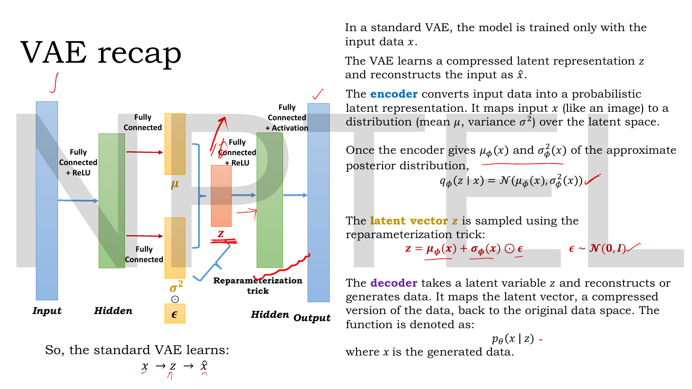
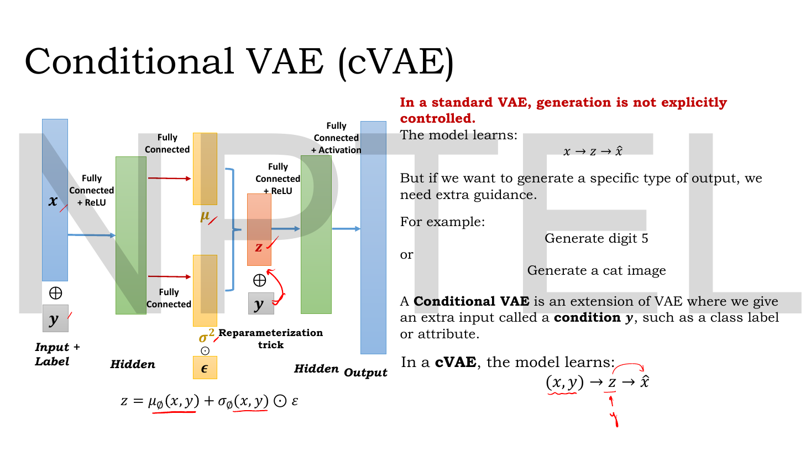
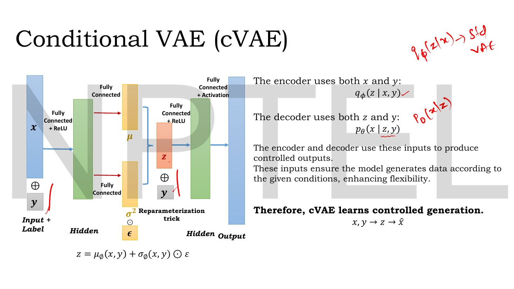
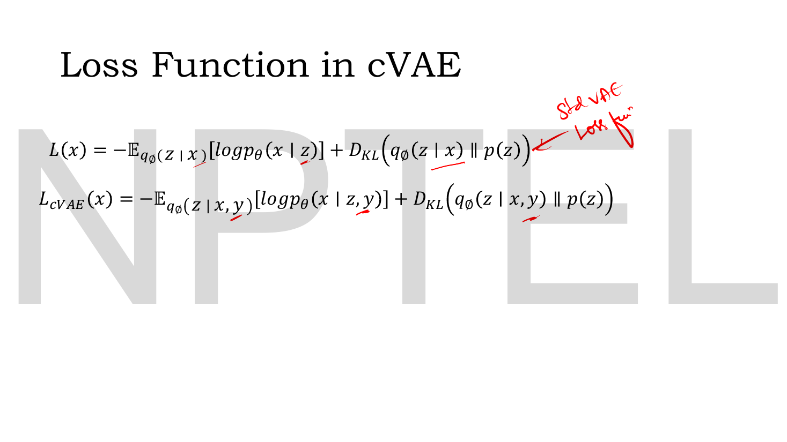
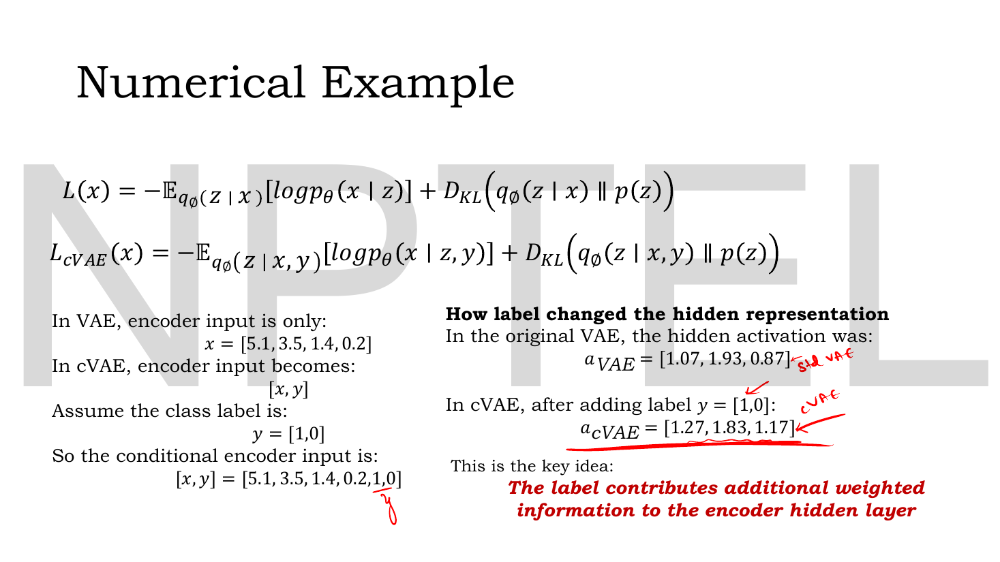
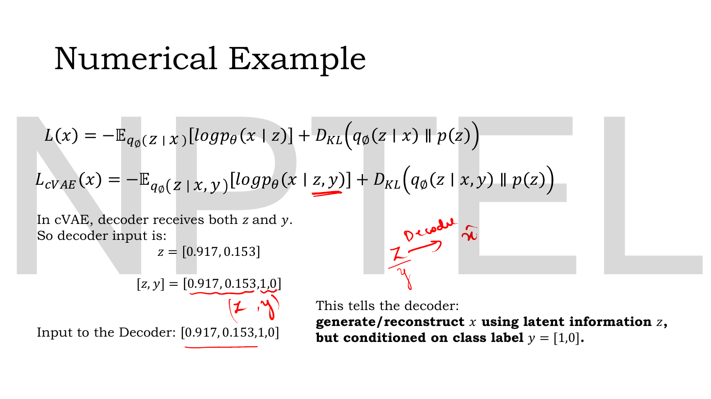
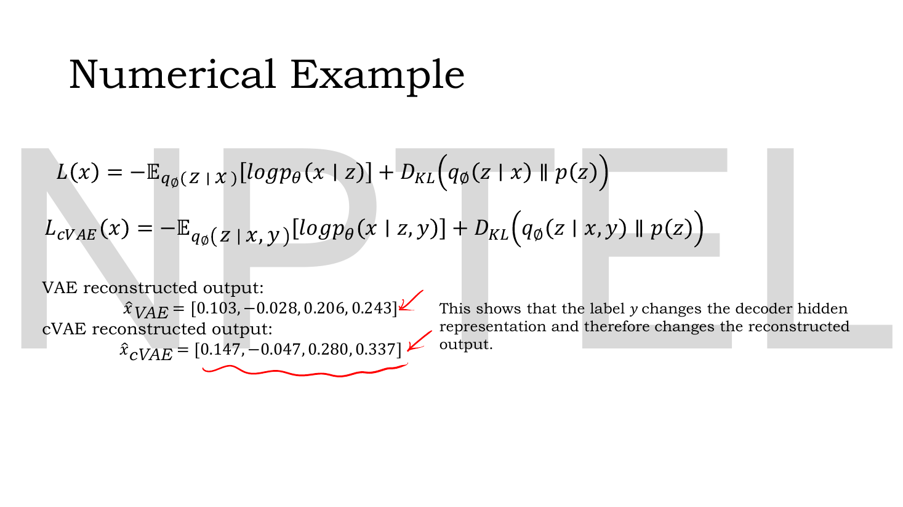

# Lec 27 — Conditional VAE

> **Source:** `Lec 27.pdf` (11 pages) · **Week 4** · **Playlist:** Lec 27
> **Prereqs:** [Lec 21 — Introduction to VAE and the Encoder](21-vae-encoder.md), [Lec 22 — Probabilistic Decoder, ELBO, VAE Loss](22-elbo-and-vae-loss.md), [Lec 23 — Reparameterization Trick](23-reparameterization.md), [Lec 26 — Disentanglement and β-VAE](26-beta-vae.md)
> **Feeds into:** [Lec 28 — Latent Space Interpolation](28-latent-interpolation.md), [Lec 38 — Conditional GAN](38-conditional-gan.md), [Lec 51 — Classifier-Free Diffusion](51-classifier-free-guidance.md)

## Why this lecture exists

A trained VAE can generate digits. It cannot generate a **5**. Sample $\mathbf{z} \sim \mathcal{N}(\mathbf{0},\mathbf{I})$, decode it, and you get whatever that region of the latent space happens to mean — a 3, a 9, something in between. You have a generator with no steering wheel.

[Lec 26](26-beta-vae.md) attacked this by hoping a latent axis would learn to mean something, and paid for it in reconstruction quality. This lecture takes the direct route: if you already know the label at training time, **give it to the model**. Feed the label into the encoder alongside the image, and into the decoder alongside the latent. At generation time you choose the label, and the decoder must honour it.

The architectural change is a concatenation. The mathematical change is adding $\mathbf{y}$ to the conditioning bar of every distribution in the loss. That really is all of it, and readers consistently expect something harder.

## The ideas

### Where the plain VAE stops


*Fig. — The baseline, unchanged since [Lec 23](23-reparameterization.md). The only thing to fix in your mind before the next slide: **nothing but $\mathbf{x}$ enters this diagram**, and nothing but $\mathbf{z}$ enters the decoder. Page 3.*

The standard VAE, in one line of the deck's own shorthand:

$$\mathbf{x} \;\to\; \mathbf{z} \;\to\; \hat{\mathbf{x}}$$

with the encoder $q_\phi(\mathbf{z}\mid\mathbf{x}) = \mathcal{N}\!\left(\mu_\phi(\mathbf{x}), \sigma^2_\phi(\mathbf{x})\right)$, the sample $\mathbf{z} = \mu_\phi(\mathbf{x}) + \sigma_\phi(\mathbf{x}) \odot \epsilon$ with $\epsilon \sim \mathcal{N}(\mathbf{0},\mathbf{I})$, and the decoder $p_\theta(\mathbf{x}\mid\mathbf{z})$. All of that is owned by [Lec 21](21-vae-encoder.md)–[Lec 23](23-reparameterization.md) and is not re-derived here.

The deck's complaint, in red on page 4:

> **In a standard VAE, generation is not explicitly controlled.**

The model is trained only on $\mathbf{x}$. It never saw a label, so there is no handle anywhere in the architecture that corresponds to "digit 5" or "cat". If you want to *generate a specific type of output*, the deck says, you need extra guidance:

- *Generate digit 5*
- *Generate a cat image*

Neither is expressible. You can sample until something looks like a 5, but that is rejection sampling by eye, not control.

### The fix: condition on a label


*Fig. — Compare this diagram against page 3's pixel for pixel. **Two $\oplus$ symbols are new, and nothing else is.** One below the input block ("Input + Label"), one just after the latent $\mathbf{z}$ and before the decoder's first hidden layer. Page 4.*

A **conditional VAE (cVAE)** is a VAE given an extra input called a **condition** $\mathbf{y}$ — a class label or an attribute. The model now learns

$$(\mathbf{x}, \mathbf{y}) \;\to\; \mathbf{z} \;\to\; \hat{\mathbf{x}}$$

and the reparameterised sample becomes

$$\mathbf{z} = \mu_\phi(\mathbf{x}, \mathbf{y}) + \sigma_\phi(\mathbf{x}, \mathbf{y}) \odot \epsilon$$

Read that carefully: the $\epsilon$ and the $\odot$ are untouched. The reparameterization trick is **identical**; only the two functions producing $\mu$ and $\sigma$ now take a second argument.


*Fig. — The two equations that are the whole lecture. The lecturer's handwriting in the top corner writes out the standard VAE's $q_\phi(\mathbf{z}\mid\mathbf{x})$ and $p_\theta(\mathbf{x}\mid\mathbf{z})$ next to them, so you can see the single added symbol in each. Page 5.*

**Both** networks are conditioned, and this is the point the exam will test:

$$\text{encoder: } \; q_\phi(\mathbf{z}\mid\mathbf{x}, \mathbf{y}) \qquad\qquad \text{decoder: } \; p_\theta(\mathbf{x}\mid\mathbf{z}, \mathbf{y})$$

| | Plain VAE | Conditional VAE |
|---|---|---|
| Encoder sees | $\mathbf{x}$ | $\mathbf{x}$ **and** $\mathbf{y}$ |
| Encoder distribution | $q_\phi(\mathbf{z}\mid\mathbf{x})$ | $q_\phi(\mathbf{z}\mid\mathbf{x},\mathbf{y})$ |
| Decoder sees | $\mathbf{z}$ | $\mathbf{z}$ **and** $\mathbf{y}$ |
| Decoder distribution | $p_\theta(\mathbf{x}\mid\mathbf{z})$ | $p_\theta(\mathbf{x}\mid\mathbf{z},\mathbf{y})$ |
| Prior | $p(\mathbf{z})$ | $p(\mathbf{z})$ — **unchanged** |
| Learns | $\mathbf{x} \to \mathbf{z} \to \hat{\mathbf{x}}$ | $(\mathbf{x},\mathbf{y}) \to \mathbf{z} \to \hat{\mathbf{x}}$ |
| Generation | uncontrolled | **controlled** |

The deck's conclusion, in bold: *the encoder and decoder use these inputs to produce controlled outputs. These inputs ensure the model generates data according to the given conditions, enhancing flexibility. Therefore, cVAE learns controlled generation.*

**Why the decoder must be conditioned too.** Conditioning only the encoder would be useless: at generation time there is no encoder in the loop at all. You sample $\mathbf{z}$ from the prior and call the decoder. If the decoder never sees $\mathbf{y}$, nothing you do can steer it. Conditioning only the *decoder* is less obviously wrong and is in fact a working (if weaker) model — but then the encoder must infer the class from $\mathbf{x}$ alone and waste latent capacity re-encoding information you were about to hand over for free. Conditioning both is the deck's design and the standard one.

### How $\mathbf{y}$ actually enters: concatenation

The $\oplus$ on the diagram is **concatenation**, not addition. The label is a separate block of numbers glued onto the end of an existing vector, and the first weight matrix of the following layer simply gets taller to match.

```
ENCODER INPUT                         DECODER INPUT
 plain VAE:  [ x1 x2 x3 x4 ]           plain VAE:  [ z1 z2 ]
 cVAE:       [ x1 x2 x3 x4 | y1 y2 ]   cVAE:       [ z1 z2 | y1 y2 ]
              \__ D_x = 4 __/ \_ D_y=2 /            \_ D_z=2 _/ \_D_y=2/
              concatenated:  length 6               concatenated: length 4
```

The label is almost always **one-hot**: for a 10-class problem, $\mathbf{y}$ is a length-10 vector of zeros with a single 1 in the position of the class. The deck's example uses a 2-class one-hot, $\mathbf{y} = [1, 0]$.

The arithmetic consequence, which is where the exam's numerical will live: if the encoder's first layer was $D_x \times D_h$, it becomes $(D_x + D_y) \times D_h$. The extra rows are a weight block $\mathbf{W}_y$ that the one-hot vector selects a single row from. So the effect of the label on the hidden layer is:

$$\mathbf{a}_{\text{cVAE}} = \underbrace{\mathbf{x}\mathbf{W}_x + \mathbf{b}}_{\mathbf{a}_{\text{VAE}}} \;+\; \mathbf{y}\mathbf{W}_y$$

A one-hot $\mathbf{y}$ makes $\mathbf{y}\mathbf{W}_y$ equal to exactly one row of $\mathbf{W}_y$ — **a learned, class-specific bias added to every hidden unit.** That is the mechanism in one sentence, and it is why the deck's slide says *the label contributes additional weighted information to the encoder hidden layer*.

### The loss: every distribution gains a $\mathbf{y}$


*Fig. — The deck stacks the two losses so the diff is visual. Three $\mathbf{y}$'s were inserted — in the expectation's subscript, inside the decoder's log, and inside the KL's first argument — and nothing was added, removed or reweighted. Page 6.*

The standard VAE loss ([Lec 22](22-elbo-and-vae-loss.md)):

$$\mathcal{L}(\mathbf{x}) = -\,\mathbb{E}_{q_\phi(\mathbf{z}\mid\mathbf{x})}\!\left[\log p_\theta(\mathbf{x}\mid\mathbf{z})\right] + D_{\mathrm{KL}}\!\left(q_\phi(\mathbf{z}\mid\mathbf{x})\,\|\,p(\mathbf{z})\right)$$

The cVAE loss:

$$\boxed{\;\mathcal{L}_{\text{cVAE}}(\mathbf{x}) = -\,\mathbb{E}_{q_\phi(\mathbf{z}\mid\mathbf{x},\mathbf{y})}\!\left[\log p_\theta(\mathbf{x}\mid\mathbf{z},\mathbf{y})\right] + D_{\mathrm{KL}}\!\left(q_\phi(\mathbf{z}\mid\mathbf{x},\mathbf{y})\,\|\,p(\mathbf{z})\right)\;}$$

**Say this out loud, because readers over-think it: the loss barely changes.** Line them up:

| Piece | VAE | cVAE | Changed? |
|---|---|---|---|
| Number of terms | 2 | 2 | no |
| Sign of each term | $-\mathbb{E}[\cdot]$, $+D_{\mathrm{KL}}$ | same | no |
| Expectation taken under | $q_\phi(\mathbf{z}\mid\mathbf{x})$ | $q_\phi(\mathbf{z}\mid\mathbf{x},\mathbf{y})$ | **$\mathbf{y}$ added** |
| Reconstruction likelihood | $\log p_\theta(\mathbf{x}\mid\mathbf{z})$ | $\log p_\theta(\mathbf{x}\mid\mathbf{z},\mathbf{y})$ | **$\mathbf{y}$ added** |
| KL's first argument | $q_\phi(\mathbf{z}\mid\mathbf{x})$ | $q_\phi(\mathbf{z}\mid\mathbf{x},\mathbf{y})$ | **$\mathbf{y}$ added** |
| KL's second argument (the prior) | $p(\mathbf{z})$ | $p(\mathbf{z})$ | **no** |
| Any new term | — | — | **none** |
| Any new hyperparameter | — | — | **none** |

Two consequences you should be able to state cold.

**The prior is still unconditional.** It is $p(\mathbf{z})$, not $p(\mathbf{z}\mid\mathbf{y})$. The deck writes $p(\mathbf{z})$ in the cVAE's KL term and it is not a typo. This is what makes generation work: at test time you sample $\mathbf{z} \sim \mathcal{N}(\mathbf{0},\mathbf{I})$ *without reference to the label*, then hand $(\mathbf{z}, \mathbf{y})$ to the decoder. The latent space is shared across all classes, and $\mathbf{y}$ selects what the decoder does with it. (A conditional prior $p(\mathbf{z}\mid\mathbf{y})$ is a legitimate variant but is **not** what this deck teaches.)

**The computation is unchanged.** The Gaussian KL still evaluates to $\frac{1}{2}\sum_j(\mu_j^2 + \sigma_j^2 - \log\sigma_j^2 - 1)$, because the prior is still $\mathcal{N}(\mathbf{0},\mathbf{I})$ and $q_\phi$ is still a diagonal Gaussian — it is just that $\mu$ and $\sigma^2$ were computed from $(\mathbf{x},\mathbf{y})$ rather than from $\mathbf{x}$. The reconstruction term is still MSE or BCE by [Lec 11](11-reconstruction-loss.md)'s rule. **You already know how to compute every piece of the cVAE loss.** There is nothing new to learn here, which is exactly the point.

### Generating on demand

The payoff, which the deck states but does not draw: at test time you drop the encoder entirely.

```
  choose a label  y  = one-hot("5")
  draw a latent   z  ~ N(0, I)          <- the SAME prior for every class
  decode             x_hat = decoder([z | y])
```

Change $\mathbf{y}$ and keep $\mathbf{z}$: you get *the same style of handwriting applied to a different digit*. Change $\mathbf{z}$ and keep $\mathbf{y}$: you get *different handwritings of the same digit*. That factorisation — $\mathbf{y}$ carries the class, $\mathbf{z}$ carries everything else — is the whole value of the model, and the *Code* section demonstrates it numerically.

It also explains a subtlety about what $\mathbf{z}$ learns. In a plain VAE the latent must encode "which digit this is" because nothing else can. In a cVAE the label supplies that for free, so the latent is freed to spend its capacity on style, stroke, slant — the within-class variation. **Conditioning does not just add control; it changes what the latent means.** This is the cVAE's quiet relationship to [Lec 26](26-beta-vae.md): β-VAE *hopes* an axis learns the class, cVAE *removes the need* for any axis to.

> **Forward pointer.** [Lec 38](38-conditional-gan.md) does the same trick to a GAN — label fed to both the generator and the discriminator — and [Lec 51](51-classifier-free-guidance.md) does it to a diffusion model. The pattern "condition both halves on $\mathbf{y}$, change nothing else" recurs three times in this course. Learn it once here.

## Worked numericals

The deck contains **one** numerical example, worked across pages 7, 8 and 9: a four-feature input, a 2-class one-hot label, through the encoder's hidden layer, the decoder's input, and out to the reconstruction. It is reproduced as N1–N3. A caveat the contract requires me to state plainly: **the deck never publishes the weight matrices**, so its printed activations cannot be recomputed from first principles — only checked for internal consistency, which I do, and which they pass. N4–N6 are mine and are fully self-contained.

### N1. The deck's conditional encoder input and hidden layer (page 7)


*Fig. — The left column is the concatenation; the right column is its effect. Subtract the two activation vectors and you recover exactly the row of $\mathbf{W}_y$ that the one-hot selected. The lecturer's red underline marks the two appended label entries. Page 7.*

**Given:** input $\mathbf{x} = [5.1, 3.5, 1.4, 0.2]$ and class label $\mathbf{y} = [1, 0]$. In the original VAE the encoder's hidden activation was $\mathbf{a}_{\text{VAE}} = [1.07, 1.93, 0.87]$; in the cVAE it is $\mathbf{a}_{\text{cVAE}} = [1.27, 1.83, 1.17]$.
**Find:** the conditional encoder input, and what the label contributed to each hidden unit.

1. Plain VAE encoder input: $\mathbf{x} = [5.1, 3.5, 1.4, 0.2]$ — length 4.
2. cVAE encoder input: the concatenation $[\mathbf{x}, \mathbf{y}] = [5.1,\ 3.5,\ 1.4,\ 0.2,\ 1,\ 0]$ — length $4 + 2 = \mathbf{6}$.
3. The label's contribution to the hidden layer is the difference of the two activations, since the $\mathbf{x}$-half of the computation is identical:
   - unit 1: $1.27 - 1.07 = +0.20$
   - unit 2: $1.83 - 1.93 = -0.10$
   - unit 3: $1.17 - 0.87 = +0.30$

**Answer:** encoder input $[5.1, 3.5, 1.4, 0.2, 1, 0]$, length 6; the label shifted the hidden layer by $[+0.20,\ -0.10,\ +0.30]$.

That shift vector *is* the first row of the label weight block $\mathbf{W}_y$, selected by the one-hot $\mathbf{y} = [1,0]$:

$$\mathbf{y}\mathbf{W}_y = [1,0]\begin{bmatrix} 0.20 & -0.10 & 0.30 \\ \ast & \ast & \ast \end{bmatrix} = [0.20,\ -0.10,\ 0.30]$$

So the deck's two printed activation vectors are **consistent with each other** under $\mathbf{a}_{\text{cVAE}} = \mathbf{a}_{\text{VAE}} + \mathbf{y}\mathbf{W}_y$, which is what conditioning by concatenation predicts. The deck's own conclusion: *the label contributes additional weighted information to the encoder hidden layer.* Note the shift is **not uniform and not all positive** — unit 2 went *down*. The label is not a brightness knob; it is a learned per-unit offset.

### N2. The deck's conditional decoder input (page 8)


*Fig. — The same concatenation, second occurrence. The lecturer's sketch on the right, "$\mathbf{z}$ and $\mathbf{y}$ → Decoder → $\hat{x}$", is the generation-time picture: both arrows feed the decoder. Page 8.*

**Given:** the latent sample $\mathbf{z} = [0.917, 0.153]$ and the same label $\mathbf{y} = [1,0]$.
**Find:** what the decoder receives.

1. Plain VAE decoder input: $\mathbf{z} = [0.917, 0.153]$ — length 2.
2. cVAE decoder input: $[\mathbf{z}, \mathbf{y}] = [0.917,\ 0.153,\ 1,\ 0]$ — length $2 + 2 = \mathbf{4}$.

**Answer:** $[0.917,\ 0.153,\ 1,\ 0]$. **Matches the slide.** The deck's gloss: this tells the decoder *generate/reconstruct $\mathbf{x}$ using latent information $\mathbf{z}$, but conditioned on class label $\mathbf{y} = [1,0]$.*

Trivial arithmetic, but the dimension bookkeeping is a standard MCQ. Latent size 2 plus a 2-class one-hot gives a decoder input of 4, so the decoder's first weight matrix is $4 \times D_h$, not $2 \times D_h$.

### N3. The deck's reconstruction comparison (page 9)


*Fig. — The end of the chain. Note the negative second component in **both** vectors: the decoder's output activation is linear, so by [Lec 11](11-reconstruction-loss.md)'s rule the reconstruction loss here is MSE. The deck never says so. Page 9.*

**Given:** $\hat{\mathbf{x}}_{\text{VAE}} = [0.103,\ -0.028,\ 0.206,\ 0.243]$ and $\hat{\mathbf{x}}_{\text{cVAE}} = [0.147,\ -0.047,\ 0.280,\ 0.337]$.
**Find:** the effect of the label on the output, feature by feature.

1. Differences $\hat{x}_{\text{cVAE},j} - \hat{x}_{\text{VAE},j}$:
   - $0.147 - 0.103 = +0.044$
   - $-0.047 - (-0.028) = -0.019$
   - $0.280 - 0.206 = +0.074$
   - $0.337 - 0.243 = +0.094$
2. Difference vector: $[+0.044,\ -0.019,\ +0.074,\ +0.094]$.

**Answer:** the label moved every output feature, by $[+0.044, -0.019, +0.074, +0.094]$. **Consistent with the slide**, which states only that the outputs differ. The deck's conclusion: *the label $\mathbf{y}$ changes the decoder hidden representation and therefore changes the reconstructed output.*

Two things to notice. The shift is much smaller at the output ($\sim 0.05$) than at the encoder hidden layer ($\sim 0.2$) — unsurprising for an untrained network with small weights, where a perturbation attenuates through each layer. And the signs do **not** match N1's $[+,-,+]$ pattern, which is correct: the decoder has its own independent label weights $\mathbf{W}_{dy}$, unrelated to the encoder's.

> **A slide defect worth noting:** $\hat{x}_2$ is **negative** in both reconstructions ($-0.028$, $-0.047$). That is only legal if the decoder's output activation is **linear**. These are not probabilities and this is not a sigmoid output — so by [Lec 11](11-reconstruction-loss.md)'s rule the reconstruction term here must be **MSE**, not BCE. The deck never says so. Also note $\mathbf{x} = [5.1, 3.5, 1.4, 0.2]$ is the first sample of the Iris dataset (a setosa), which is real-valued and continuous — consistent with a linear output, and a useful mnemonic for which loss branch applies.

### N4. A full conditional encoder forward pass, with the weights written down

The deck's numbers cannot be recomputed. Here is the same mechanism where they can.

**Given:** input $\mathbf{x} = [0.5,\ 0.2]$, label $\mathbf{y} = [0,\ 1]$ (class 2 of 2), hidden size 2, ReLU hidden activation, and

$$\mathbf{W}_x = \begin{bmatrix} 1.0 & -0.5 \\ 0.4 & 0.8\end{bmatrix}, \qquad \mathbf{W}_y = \begin{bmatrix} 0.3 & 0.1 \\ -0.2 & 0.6\end{bmatrix}, \qquad \mathbf{b} = [0.1,\ 0.0]$$

**Find:** the hidden activation with and without conditioning.

1. **Plain VAE** pre-activation $\mathbf{a}_{\text{VAE}} = \mathbf{x}\mathbf{W}_x + \mathbf{b}$:
   - unit 1: $0.5(1.0) + 0.2(0.4) + 0.1 = 0.5 + 0.08 + 0.1 = 0.68$
   - unit 2: $0.5(-0.5) + 0.2(0.8) + 0.0 = -0.25 + 0.16 = -0.09$
   - $\mathbf{a}_{\text{VAE}} = [0.68,\ -0.09]$
2. **The label's contribution** $\mathbf{y}\mathbf{W}_y$ with $\mathbf{y}=[0,1]$ — this picks row 2 of $\mathbf{W}_y$: $[-0.2,\ 0.6]$.
3. **cVAE** pre-activation: $\mathbf{a}_{\text{cVAE}} = [0.68 - 0.2,\ -0.09 + 0.6] = [0.48,\ 0.51]$.
4. Apply ReLU:
   - VAE: $\mathrm{ReLU}([0.68, -0.09]) = [0.68,\ \mathbf{0}]$
   - cVAE: $\mathrm{ReLU}([0.48, 0.51]) = [0.48,\ 0.51]$

**Answer:** $\mathbf{h}_{\text{VAE}} = [0.68,\ 0]$ and $\mathbf{h}_{\text{cVAE}} = [0.48,\ 0.51]$.

The label did more than nudge a number: hidden unit 2 was **dead** in the plain VAE (negative pre-activation, zeroed by ReLU) and is **alive** in the cVAE. Conditioning can change which units participate at all, which is why a cVAE is strictly more expressive than a VAE with the same width.

### N5. What conditioning costs in parameters

**Given:** the deck's dimensions — input $D_x = 4$, label $D_y = 2$, encoder hidden $D_h = 3$, latent $D_z = 2$, decoder hidden $D_h = 3$.
**Find:** the extra learnable parameters introduced by conditioning.

1. Encoder first layer, plain VAE: $D_x \times D_h + D_h = 4\times3 + 3 = 12 + 3 = 15$.
2. Encoder first layer, cVAE: $(D_x + D_y)\times D_h + D_h = 6\times3 + 3 = 18 + 3 = 21$.
3. Encoder increase: $21 - 15 = 6$, which is $D_y \times D_h = 2\times3$. The biases are unchanged.
4. Decoder first layer, plain VAE: $D_z \times D_h + D_h = 2\times3 + 3 = 9$.
5. Decoder first layer, cVAE: $(D_z + D_y)\times D_h + D_h = 4\times3+3 = 15$.
6. Decoder increase: $15 - 9 = 6 = D_y \times D_h$.

**Answer:** $6 + 6 = \mathbf{12}$ extra parameters, $D_y \times D_h$ in each of the two networks. Every other layer is untouched. For a 10-class MNIST cVAE with $D_h = 400$ the cost is $2 \times 10 \times 400 = 8{,}000$ parameters — negligible against the $784\times400 \approx 314{,}000$ of the input layer alone. **Conditioning is close to free.** That is a large part of why this trick is everywhere.

### N6. The cVAE loss on numbers

**Given:** the deck's sample $\mathbf{x} = [5.1, 3.5, 1.4, 0.2]$, its cVAE reconstruction $\hat{\mathbf{x}}_{\text{cVAE}} = [0.147, -0.047, 0.280, 0.337]$, and encoder outputs $\mu = [0.9,\ 0.2]$ with $\sigma^2 = [1,\ 1]$. Real-valued data, so the reconstruction term is squared error ([Lec 11](11-reconstruction-loss.md)).
**Find:** the total cVAE loss.

1. Residuals $x_j - \hat{x}_j$: $\;4.953,\ 3.547,\ 1.120,\ -0.137$.
2. Squares: $24.532209,\ 12.581209,\ 1.254400,\ 0.018769$.
3. Reconstruction term: $24.532209 + 12.581209 + 1.254400 + 0.018769 = 38.386587$.
4. KL term, with $\sigma_j^2 = 1$ so $\log\sigma_j^2 = 0$: $\;\frac{1}{2}(\mu_1^2 + \mu_2^2) = \frac{1}{2}(0.81 + 0.04) = \frac{1}{2}(0.85) = 0.425$.
5. Total: $38.386587 + 0.425$.

**Answer:** $\mathcal{L}_{\text{cVAE}} = 38.8116$ (4 d.p.), of which the KL is $0.425$ — about **1.1%**. The network is untrained, so reconstruction dominates completely.

**The point of this numerical is what you did not have to do.** Every step above is identical to the plain VAE calculation of [Lec 24](24-vae-numerical.md). The label changed *which* $\hat{\mathbf{x}}$, $\mu$ and $\sigma^2$ you were handed; it changed nothing about how you combine them. If an exam gives you a cVAE loss to compute, compute it exactly as you would a VAE's.

## Code

The claim worth making concrete is the one the deck asserts but never demonstrates: **freeze $\mathbf{z}$, change $\mathbf{y}$, and the output changes.** That is controlled generation in four lines.

```python
import numpy as np
np.random.seed(0)

D_X, D_Y, D_H, D_Z = 4, 2, 3, 2          # input, label, hidden, latent

# --- ONE encoder, used two ways. The cVAE's weight matrix is just taller:
#     it has D_Y extra rows, one per label dimension.
W_x = np.array([[ 0.20, 0.10,  0.05],     # 4 x 3  (shared by both models)
                [ 0.05, 0.30, -0.10],
                [-0.10, 0.20,  0.40],
                [ 0.30, 0.10,  0.25]])
W_y = np.array([[ 0.20,-0.10,  0.30],     # 2 x 3  (exists ONLY in the cVAE)
                [-0.40, 0.25, -0.15]])
b   = np.array([0.0, 0.0, 0.0])

x = np.array([5.1, 3.5, 1.4, 0.2])        # the deck's sample (Iris, setosa)
y = np.array([1.0, 0.0])                  # one-hot class label

a_vae  = x @ W_x + b                          # plain VAE: encoder sees x only
a_cvae = np.concatenate([x, y]) @ np.vstack([W_x, W_y]) + b   # cVAE: sees [x, y]
print("a_VAE  =", np.round(a_vae , 3))
print("a_cVAE =", np.round(a_cvae, 3))
print("shift  =", np.round(a_cvae - a_vae, 3), " == row of W_y picked by the one-hot")

# --- controlled generation: FREEZE z, sweep the label, watch the output move
W_dz = np.array([[0.6, -0.2, 0.4, 0.1],   # 2 x 4   decoder, latent part
                 [0.1,  0.5, 0.2, 0.3]])
W_dy = np.array([[0.5,  0.0,-0.3, 0.2],   # 2 x 4   decoder, label part
                 [-0.2, 0.4, 0.1,-0.1]])
z = np.array([0.917, 0.153])              # the deck's latent, held FIXED
for lab in (np.array([1.,0.]), np.array([0.,1.])):
    x_hat = np.concatenate([z, lab]) @ np.vstack([W_dz, W_dy])
    print(f"y={lab}  ->  x_hat =", np.round(x_hat, 3))
```

```
a_VAE  = [1.115 1.86  0.515]
a_cVAE = [1.315 1.76  0.815]
shift  = [ 0.2 -0.1  0.3]  == row of W_y picked by the one-hot
y=[1. 0.]  ->  x_hat = [ 1.066 -0.107  0.097  0.338]
y=[0. 1.]  ->  x_hat = [0.366 0.293 0.497 0.038]
```

Three readings. First, `shift` is **exactly** $[0.2, -0.1, 0.3]$ — the shift N1 extracted from the deck's two printed activation vectors. I chose $\mathbf{W}_y$'s first row to be that vector, and concatenation reproduces the deck's behaviour exactly; this is the structural check that the deck's numbers are internally consistent. (`a_VAE` itself differs from the deck's $[1.07, 1.93, 0.87]$ because the deck never publishes $\mathbf{W}_x$ — only the *difference* is recoverable.)

Second, note how the cVAE encoder is implemented: `np.vstack([W_x, W_y])` is a single $(4+2)\times3$ matrix. There is no second network, no gating, no special layer — **the cVAE encoder is one matrix multiplication, as the plain VAE's was.**

Third, the last block is the whole point of the lecture. The latent $\mathbf{z}$ is byte-for-byte identical in both lines, and the reconstruction is completely different. In a plain VAE that is impossible: $\mathbf{z}$ fixed means $\hat{\mathbf{x}}$ fixed. You now have a second, discrete handle on the output, and you choose it.

## Exam pack

### Must-memorise

| Item | Exactly this |
|---|---|
| cVAE encoder | $q_\phi(\mathbf{z}\mid\mathbf{x}, \mathbf{y})$ |
| cVAE decoder | $p_\theta(\mathbf{x}\mid\mathbf{z}, \mathbf{y})$ |
| cVAE prior | $p(\mathbf{z})$ — **not** $p(\mathbf{z}\mid\mathbf{y})$ |
| What cVAE learns | $(\mathbf{x},\mathbf{y}) \to \mathbf{z} \to \hat{\mathbf{x}}$ |
| What plain VAE learns | $\mathbf{x} \to \mathbf{z} \to \hat{\mathbf{x}}$ |
| Reparameterization in a cVAE | $\mathbf{z} = \mu_\phi(\mathbf{x},\mathbf{y}) + \sigma_\phi(\mathbf{x},\mathbf{y}) \odot \epsilon$, $\;\epsilon\sim\mathcal{N}(\mathbf{0},\mathbf{I})$ |
| VAE loss | $\mathcal{L}(\mathbf{x}) = -\mathbb{E}_{q_\phi(\mathbf{z}\mid\mathbf{x})}[\log p_\theta(\mathbf{x}\mid\mathbf{z})] + D_{\mathrm{KL}}(q_\phi(\mathbf{z}\mid\mathbf{x})\,\|\,p(\mathbf{z}))$ |
| **cVAE loss** | $\mathcal{L}_{\text{cVAE}}(\mathbf{x}) = -\mathbb{E}_{q_\phi(\mathbf{z}\mid\mathbf{x},\mathbf{y})}[\log p_\theta(\mathbf{x}\mid\mathbf{z},\mathbf{y})] + D_{\mathrm{KL}}(q_\phi(\mathbf{z}\mid\mathbf{x},\mathbf{y})\,\|\,p(\mathbf{z}))$ |
| What changed in the loss | **only** $\mathbf{y}$ added to three conditioning bars; no new term, no new hyperparameter |
| How $\mathbf{y}$ enters | **concatenation** ($\oplus$) at two places: with $\mathbf{x}$ at the encoder, with $\mathbf{z}$ at the decoder |
| What $\mathbf{y}$ is | a condition — a class label or attribute, usually **one-hot** |
| What cVAE buys | **controlled generation** — ask for digit 5, get digit 5 |
| Encoder input length | $D_x + D_y$ |
| Decoder input length | $D_z + D_y$ |
| Extra parameters | $D_y \times D_h$ in each network |

### Numbers worth knowing

| Quantity | Value |
|---|---|
| Deck's input | $\mathbf{x} = [5.1, 3.5, 1.4, 0.2]$ (4 features; the first Iris sample) |
| Deck's label | $\mathbf{y} = [1, 0]$ (2-class one-hot) |
| Deck's conditional encoder input | $[5.1, 3.5, 1.4, 0.2, 1, 0]$ — length **6** |
| Deck's VAE hidden activation | $\mathbf{a}_{\text{VAE}} = [1.07, 1.93, 0.87]$ |
| Deck's cVAE hidden activation | $\mathbf{a}_{\text{cVAE}} = [1.27, 1.83, 1.17]$ |
| Label's hidden-layer shift | $[+0.20, -0.10, +0.30]$ |
| Deck's latent | $\mathbf{z} = [0.917, 0.153]$ — length 2 |
| Deck's conditional decoder input | $[0.917, 0.153, 1, 0]$ — length **4** |
| Deck's VAE reconstruction | $[0.103, -0.028, 0.206, 0.243]$ |
| Deck's cVAE reconstruction | $[0.147, -0.047, 0.280, 0.337]$ |
| Output shift from the label | $[+0.044, -0.019, +0.074, +0.094]$ |
| Extra params for that network | 12 total (6 encoder + 6 decoder) |

### Likely MCQ traps

- **"The cVAE conditions only the decoder."** Both. $q_\phi(\mathbf{z}\mid\mathbf{x},\mathbf{y})$ *and* $p_\theta(\mathbf{x}\mid\mathbf{z},\mathbf{y})$. The deck gives them on one slide, side by side.
- **"The cVAE adds a term to the loss."** It does not. Two terms before, two terms after. Only the conditioning bars gained a $\mathbf{y}$.
- **"The prior becomes $p(\mathbf{z}\mid\mathbf{y})$."** It stays $p(\mathbf{z}) = \mathcal{N}(\mathbf{0},\mathbf{I})$ in this deck. A conditional prior exists as a variant but is not taught here, and sampling in the cVAE deliberately does not depend on the label.
- **"The label is added to $\mathbf{x}$."** It is **concatenated**, not summed. $\oplus$ on the slide means concatenation — the vectors do not even have the same length.
- **Forgetting the label at generation time.** The decoder's input is $[\mathbf{z}, \mathbf{y}]$. Passing only $\mathbf{z}$ is a shape error, and conceptually it is asking for control while withholding the instruction.
- **"The reparameterization trick changes."** $\mathbf{z} = \mu + \sigma\odot\epsilon$ exactly as in [Lec 23](23-reparameterization.md). Only the arguments of $\mu(\cdot)$ and $\sigma(\cdot)$ grew.
- **Dimension arithmetic.** A cVAE with $D_z = 20$ on 10-class MNIST has a decoder *input* of $20 + 10 = 30$, not 20. The **latent** is still 20.
- **"A cVAE is a β-VAE with labels."** No relation. β-VAE reweights the KL; cVAE adds an input. They are orthogonal and can be combined (a conditional β-VAE is just both changes at once).
- **"cVAE guarantees disentanglement."** It guarantees *control over the conditioned attribute only*. Everything $\mathbf{y}$ does not name is still entangled inside $\mathbf{z}$.
- **Confusing cVAE with the conditional GAN.** Same idea, different base model. The cGAN is [Lec 38](38-conditional-gan.md) and conditions the generator and the **discriminator**; the cVAE conditions the encoder and the **decoder**.

### Self-test

1. Write the cVAE loss in full, and name every difference from the standard VAE loss.
2. Which two networks are conditioned, and what would break if you conditioned only the encoder?
3. $D_x = 784$, 10-class one-hot label, $D_z = 16$. Give the length of the encoder input and of the decoder input.
4. $\mathbf{x} = [5.1, 3.5, 1.4, 0.2]$, $\mathbf{y} = [1,0]$, $\mathbf{z} = [0.917, 0.153]$. Write the two concatenated vectors the deck forms.
5. In a cVAE, is the prior $p(\mathbf{z})$ or $p(\mathbf{z}\mid\mathbf{y})$ in this deck, and why does the answer matter at generation time?
6. A plain VAE's hidden activation is $[1.07, 1.93, 0.87]$ and the cVAE's is $[1.27, 1.83, 1.17]$ on the same input. What exactly accounts for the difference, and what does it tell you about $\mathbf{W}_y$?
7. With $D_y = 10$ and $D_h = 500$ in both networks, how many extra parameters does conditioning cost?
8. You freeze $\mathbf{z}$ and change $\mathbf{y}$ from "3" to "8". What should happen, and what does that tell you about what $\mathbf{z}$ has learned to carry?
9. A reconstruction contains the value $-0.047$. What does that tell you about the decoder's output activation and therefore the reconstruction loss?
10. Compute the KL term for a cVAE whose encoder outputs $\mu = [0.9, 0.2]$, $\sigma^2 = [1,1]$. How does the calculation differ from a plain VAE's?

<details><summary>Answers</summary>

1. $\mathcal{L}_{\text{cVAE}}(\mathbf{x}) = -\mathbb{E}_{q_\phi(\mathbf{z}\mid\mathbf{x},\mathbf{y})}[\log p_\theta(\mathbf{x}\mid\mathbf{z},\mathbf{y})] + D_{\mathrm{KL}}(q_\phi(\mathbf{z}\mid\mathbf{x},\mathbf{y})\,\|\,p(\mathbf{z}))$. Differences: $\mathbf{y}$ appears in the expectation's subscript, in the decoder likelihood, and in the KL's first argument. The prior is unchanged, the number of terms is unchanged, the signs are unchanged, and there is no new hyperparameter.
2. Encoder **and** decoder. Conditioning only the encoder is useless, because at generation time the encoder is not run at all — you sample $\mathbf{z}$ from the prior and call the decoder, which would never see $\mathbf{y}$ and so could not be steered.
3. Encoder input $784 + 10 = \mathbf{794}$; decoder input $16 + 10 = \mathbf{26}$. The latent itself is still 16.
4. $[\mathbf{x},\mathbf{y}] = [5.1, 3.5, 1.4, 0.2, 1, 0]$ (length 6) and $[\mathbf{z},\mathbf{y}] = [0.917, 0.153, 1, 0]$ (length 4).
5. $p(\mathbf{z})$ — unconditional, $\mathcal{N}(\mathbf{0},\mathbf{I})$. It matters because generation then draws $\mathbf{z}$ the same way for every class; the latent space is shared and $\mathbf{y}$ alone selects the class. You never need a per-class sampler.
6. The difference $[+0.20, -0.10, +0.30]$ is $\mathbf{y}\mathbf{W}_y$ — with $\mathbf{y}=[1,0]$ one-hot, that is exactly the **first row** of the label weight block. It tells you $\mathbf{W}_y$'s first row is $[0.20, -0.10, 0.30]$, and more generally that a one-hot label acts as a learned per-class bias added to every hidden unit. Note it is not uniform in sign.
7. $D_y \times D_h$ per network $= 10 \times 500 = 5{,}000$ each, so $\mathbf{10{,}000}$ total. Biases are unchanged.
8. The output should become an 8 in the same handwriting style as the 3 was. That tells you $\mathbf{y}$ carries the class and $\mathbf{z}$ has been freed to carry only the within-class variation — stroke, slant, thickness — because the model never needed to spend latent capacity on identity.
9. A negative reconstruction cannot come from a sigmoid, so the output activation is **linear** — and by [Lec 11](11-reconstruction-loss.md)'s rule linear output means the reconstruction term is **MSE**, not BCE. (Consistent with the deck's data being real-valued Iris measurements.)
10. $\frac{1}{2}(0.9^2 + 0.2^2) = \frac{1}{2}(0.81+0.04) = \frac{1}{2}(0.85) = \mathbf{0.425}$. It differs **not at all** from the plain VAE calculation — the prior is still $\mathcal{N}(\mathbf{0},\mathbf{I})$ and $q_\phi$ is still a diagonal Gaussian. The only difference is upstream: $\mu$ and $\sigma^2$ were computed from $(\mathbf{x},\mathbf{y})$ instead of $\mathbf{x}$.

</details>

## Beyond the slides

**Gap: the deck never shows the generation procedure, only the reconstruction one.**
**Why it matters:** every slide runs $\mathbf{x}$ in and $\hat{\mathbf{x}}$ out, which is *reconstruction* — and reconstruction is not what you built a cVAE for. The generation loop is: choose $\mathbf{y}$, draw $\mathbf{z} \sim \mathcal{N}(\mathbf{0},\mathbf{I})$, decode $[\mathbf{z},\mathbf{y}]$. **No encoder, no input image.** A question asking "how do you generate a specific digit with a cVAE?" wants those three steps, and nothing on the slides states them in order.

**Gap: nothing is said about what happens if the label is wrong or unseen.**
**Why it matters:** a cVAE learns $p(\mathbf{x}\mid\mathbf{z},\mathbf{y})$ only on the $(\mathbf{x},\mathbf{y})$ pairs it was trained on. Supply a label the model never saw, or a label inconsistent with how you intend to use $\mathbf{z}$, and you get an off-distribution output with no error raised. There is also a practical failure mode the deck's framing invites: if the label is highly predictive and the reconstruction is easy, the model can learn to ignore $\mathbf{z}$ entirely and decode from $\mathbf{y}$ alone — a conditional version of posterior collapse. The symptom is that varying $\mathbf{z}$ stops changing the output.

**Gap: one-hot is assumed but never named, and the alternatives are not mentioned.**
**Why it matters:** one-hot is the right default for a handful of mutually exclusive classes, and it is what makes the "$\mathbf{y}\mathbf{W}_y$ selects one row" reading exact. It does not scale: 10,000 classes means a 10,000-wide input. Real conditional models use a learned **embedding** — a lookup table mapping each class to a dense vector of, say, 64 dimensions — which is mathematically identical to one-hot-times-a-matrix but stored and computed efficiently. For non-categorical conditions (a text prompt, a segmentation mask, a continuous attribute) you feed the encoded condition the same way. This is the route from here to [Lec 52](52-stable-diffusion.md)'s CLIP text conditioning.

**Gap: concatenation is presented as *the* way to condition.**
**Why it matters:** it is the simplest and the one to state in an exam, but for image decoders, concatenating a label to a flat vector before a stack of convolutions is a weak signal — it is injected once, at the bottom, and can be washed out. Stronger alternatives inject the condition at *every* layer: conditional batch norm, FiLM (per-channel scale and shift from $\mathbf{y}$), and the AdaIN of [Lec 41](41-stylegan.md), which is exactly this idea applied to style. If an exam asks only *how* the label enters, say concatenation; if it asks for weaknesses, this is the one.

**Gap: no comparison against the β-VAE just taught.**
**Why it matters:** the two lectures solve overlapping problems with opposite assumptions, and the comparison is the obvious synthesis question for Week 4:

| | β-VAE ([Lec 26](26-beta-vae.md)) | cVAE (here) |
|---|---|---|
| Needs labels? | **no** (unsupervised) | **yes**, at training time |
| What it changes | a weight $\beta$ on the KL term | an extra input $\mathbf{y}$ to both networks |
| Control you get | over whatever axes happened to emerge | over exactly the attribute you labelled |
| Reconstruction cost | yes — higher $\beta$ blurs | essentially none |
| Guarantees | none ("does not guarantee") | control over the conditioned attribute |

## Cut from the slides

Pages 1, 2, 10 and 11 are the title, the session overview, the next-session preview and the thank-you. Page 3 is a VAE recap — the encoder/decoder diagram, $q_\phi(\mathbf{z}\mid\mathbf{x})$, the reparameterization trick and $p_\theta(\mathbf{x}\mid\mathbf{z})$ — all of which is owned by [Lec 21](21-vae-encoder.md)–[Lec 23](23-reparameterization.md); it is embedded as the before-picture and compressed to one line of prose rather than re-taught, per CONTRACT §6. Pages 4 and 5 share the same network diagram with different annotations, so the figure appears twice deliberately, once for the motivation and once for the two conditional distributions. The lecturer's handwritten marginalia on pages 5, 6, 7 and 8 — "Std VAE", "cVAE", the circled $\mathbf{y}$, the arrow sketching $\mathbf{z}$ and $\mathbf{y}$ into the decoder — restate the printed content and are rendered as emphasis in the prose. The conditional **GAN**, which applies this identical idea to a different model family, belongs to [Lec 38](38-conditional-gan.md) and gets only the forward pointer above. Everything on pages 4 through 9 is reproduced.
