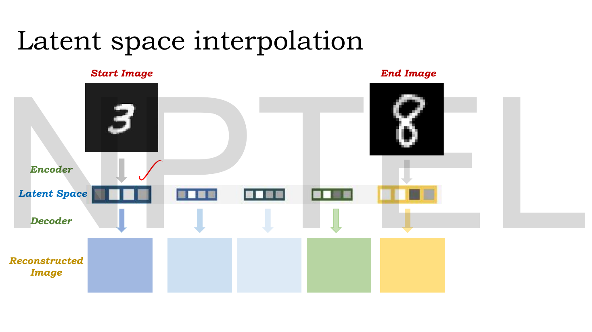
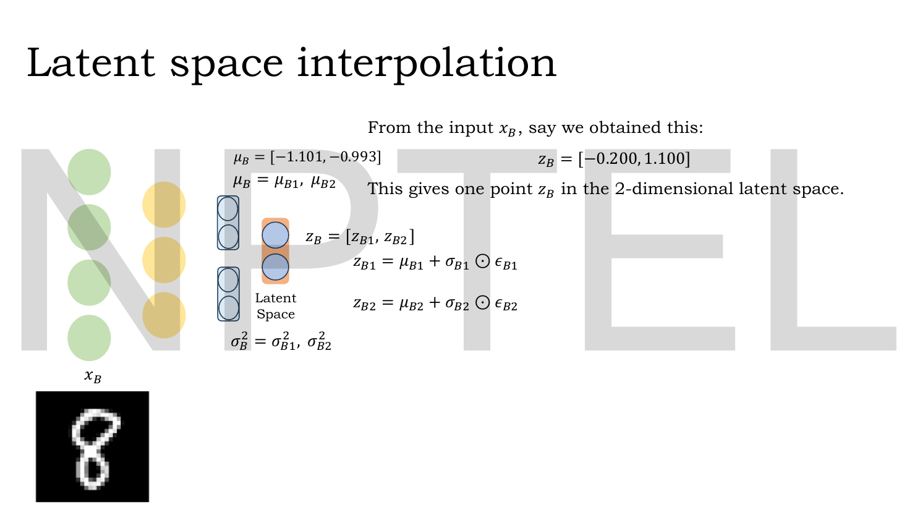
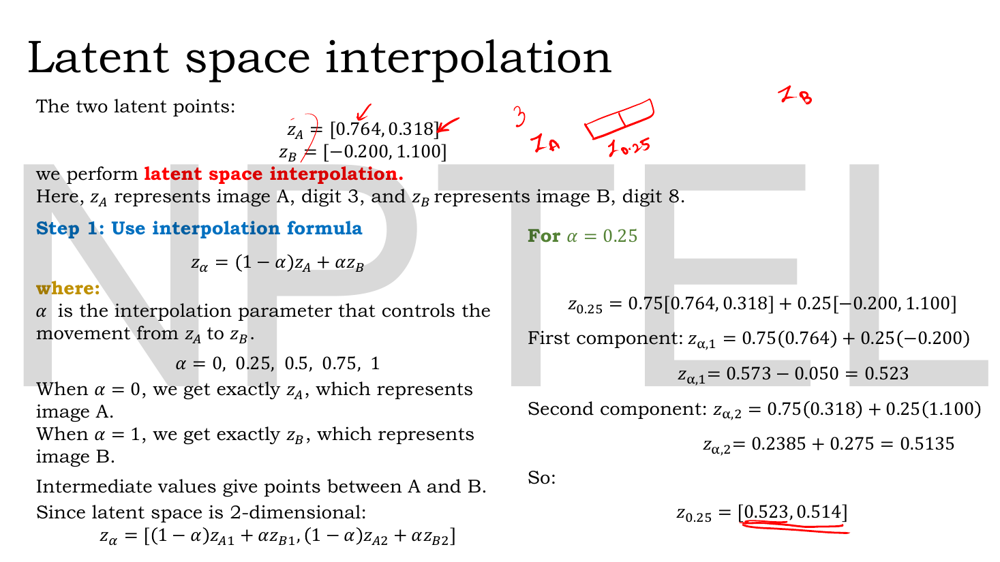
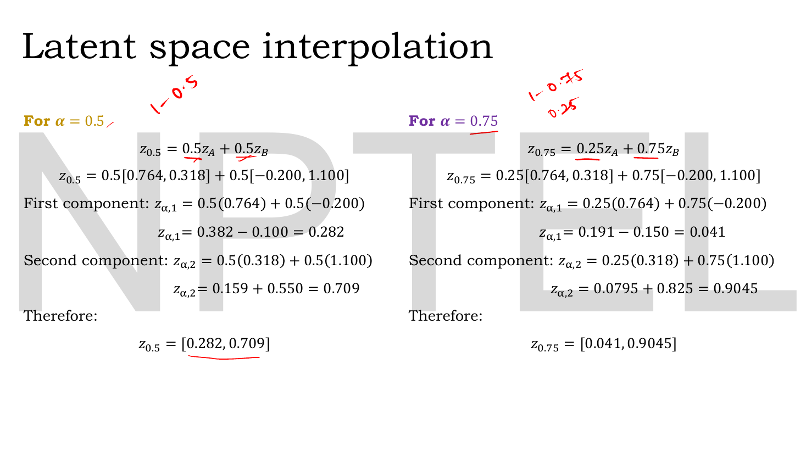
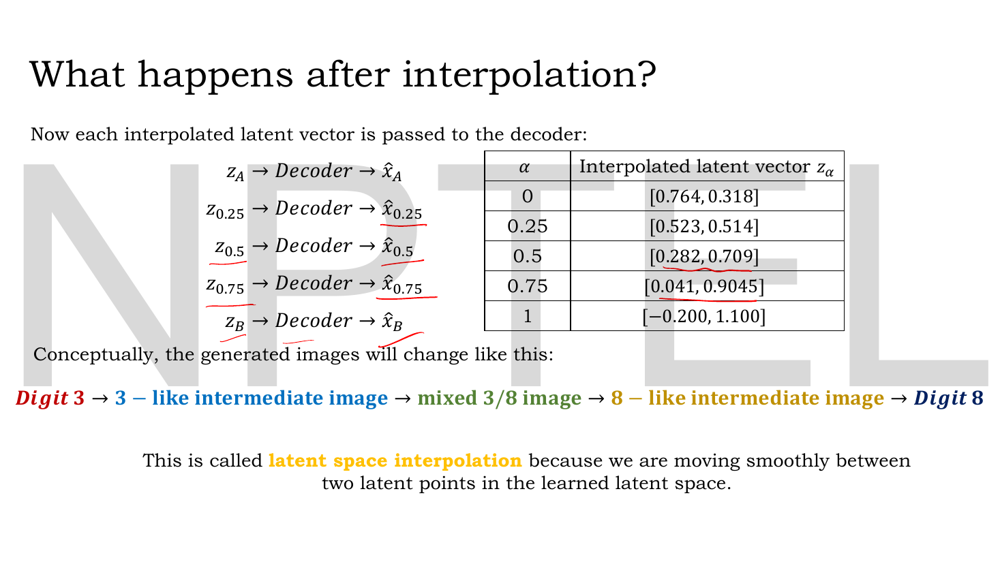
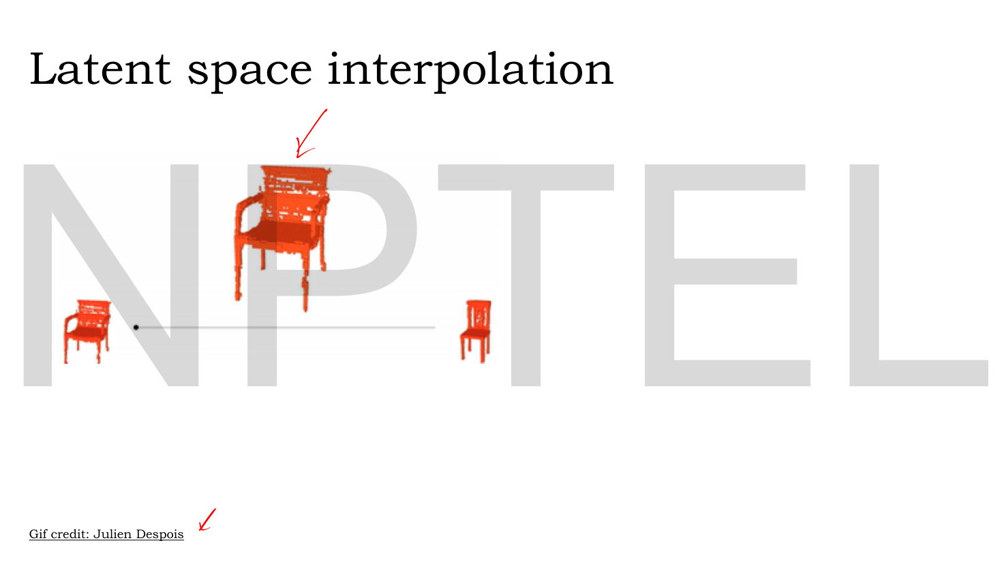

# Lec 28 — Latent Space Interpolation

> **Source:** `Lec 28.pdf` (11 pages) · **Week 4** · **Playlist:** Lec 28
> **Prereqs:** [Lec 16 — Numerical Example, Limitations of AE](16-ae-numerical-and-limits.md), [Lec 19 — KL Divergence Part A](19-kl-divergence-a.md), [Lec 21 — Introduction to VAE and the Encoder](21-vae-encoder.md), [Lec 23 — Reparameterization Trick](23-reparameterization.md), [Lec 26 — Disentanglement and β-VAE](26-beta-vae.md)
> **Feeds into:** [Lec 31 — Motivation for GANs](31-gan-motivation.md), [Lec 41 — StyleGAN](41-stylegan.md)

## Why this lecture exists

Take two images, encode them to two points in the latent space, walk in a straight line from one point to the other, and decode every point you pass through. If the model is any good you get a smooth morph: a 3 that bends and closes until it is an 8, with every frame a plausible digit.

That walk is the single most convincing demonstration that a VAE learned *structure* rather than a lookup table. It is also the experiment a plain autoencoder fails. [Lec 16](16-ae-numerical-and-limits.md) told you an autoencoder's latent space has holes — regions no training code ever occupied, where the decoder was never trained and will output noise. This lecture completes that argument from the other side: the VAE's KL term is what fills the holes, and interpolation is how you see that it worked. The arithmetic itself is a weighted average and takes one line.

## The ideas

### The experiment


*Fig. — The whole lecture as a picture. Two real images are encoded (the outer two latent vectors); the three in between were **never encoded from anything** — they are constructed by arithmetic. Every one of the five is then decoded. The claim being tested is that the middle three decode to something sensible. Page 3.*

The procedure has three steps and the deck spends the lecture on step 2:

1. **Encode** two real inputs $\mathbf{x}_A$ and $\mathbf{x}_B$ to latent points $\mathbf{z}_A$ and $\mathbf{z}_B$.
2. **Interpolate** — build a sequence of latent vectors lying on the straight line between them.
3. **Decode** every one of them, including the manufactured middles.

Steps 1 and 3 use the trained VAE exactly as [Lec 21](21-vae-encoder.md)–[Lec 23](23-reparameterization.md) built it. Step 2 is new and is where the content is.

### Getting the two endpoints


*Fig. — The latent size here is **2**, which is why the lecture can print its latent vectors. Note the two-stage structure: the encoder outputs $\mu_A$ and $\sigma^2_A$, and $\mathbf{z}_A$ is a **sample** drawn using them, so $\mathbf{z}_A \neq \mu_A$. Page 4.*


*Fig. — The second endpoint, built identically. Page 5.*

For each input the encoder emits a mean and a variance per latent dimension, and the latent vector is drawn with the reparameterization trick ([Lec 23](23-reparameterization.md)):

$$z_{A1} = \mu_{A1} + \sigma_{A1}\odot\epsilon_{A1}, \qquad z_{A2} = \mu_{A2} + \sigma_{A2}\odot\epsilon_{A2}$$

giving the deck's two points:

$$\mathbf{z}_A = [0.764,\ 0.318] \quad (\text{digit } 3), \qquad \mathbf{z}_B = [-0.200,\ 1.100] \quad (\text{digit } 8)$$

Two numbers each. That is the entire representation of an image, which is the whole reason this is worth doing.

> **Two things about these endpoints the deck does not flag.**
> First, $\mathbf{z}$ is a *sample*, not the mean: $\mu_A = [0.043, 0.551]$ but $\mathbf{z}_A = [0.764, 0.318]$. Encode the same image twice and you get two different $\mathbf{z}$. In practice people interpolate between the **means** $\mu_A$ and $\mu_B$ precisely to avoid this, since the mean is deterministic and sits at the centre of the posterior. The deck interpolates between samples; either is defensible, but know which you are doing.
> Second, these particular numbers do not hang together. $\mu_B = [-1.101, -0.993]$ and $\mathbf{z}_B = [-0.200, 1.100]$ differ by $[0.901, 2.093]$ in the second coordinate — a $2\sigma$ draw if $\sigma = 1$, and $\mathbf{z}_B$ is suspiciously round ($-0.200$, $1.100$) while $\mu_B$ is not. The $\sigma^2$ values are never given, so this cannot be checked. **Treat $\mathbf{z}_A$ and $\mathbf{z}_B$ as given data for the arithmetic;** the exam will.

### The interpolation formula


*Fig. — Left column: the formula and its two endpoint checks. Right column: the first worked case, one component at a time. The lecturer's sketch at the top right draws the line with $\mathbf{z}_A$ at one end, $\mathbf{z}_B$ at the other and $\mathbf{z}_{0.25}$ a quarter of the way along. Page 6.*

$$\boxed{\;\mathbf{z}_\alpha = (1-\alpha)\,\mathbf{z}_A + \alpha\,\mathbf{z}_B\;}$$

$\alpha$ is the **interpolation parameter** and it controls the movement from $\mathbf{z}_A$ to $\mathbf{z}_B$. The deck uses the grid

$$\alpha = 0,\ 0.25,\ 0.5,\ 0.75,\ 1$$

(Other texts write this with $\lambda$ or $t$ instead of $\alpha$; this deck says $\alpha$, so that is what an exam will show. The symbol is unrelated to the $\alpha$ this course uses for the AdaGrad accumulator in [Lec 04](04-optimizers-b.md).)

The two endpoint checks are the first thing to verify and the easiest marks in the chapter:

- $\alpha = 0$: $\;\mathbf{z}_0 = 1\cdot\mathbf{z}_A + 0\cdot\mathbf{z}_B = \mathbf{z}_A$ — **exactly image A**.
- $\alpha = 1$: $\;\mathbf{z}_1 = 0\cdot\mathbf{z}_A + 1\cdot\mathbf{z}_B = \mathbf{z}_B$ — **exactly image B**.

Intermediate values give points between A and B. Note the direction: $\alpha$ is the weight on the **destination** $\mathbf{z}_B$. Getting this backwards is the commonest error here, and it flips every answer.

Since the latent is 2-dimensional, written out per component:

$$\mathbf{z}_\alpha = \big[\,(1-\alpha)z_{A1} + \alpha z_{B1},\;\; (1-\alpha)z_{A2} + \alpha z_{B2}\,\big]$$

The formula is a **convex combination**: both coefficients are non-negative and they sum to $(1-\alpha) + \alpha = 1$. That is what keeps the result on the segment between the two points rather than outside it. Pick $\alpha = 1.5$ or $\alpha = -0.5$ and the coefficients still sum to 1 but one is negative — you are now **extrapolating**, shooting past an endpoint along the same line. The deck does not do this; it is a real and useful operation and it is noted in *Beyond the slides*.


*Fig. — The lecturer's red annotations above each heading, "$1-0.5$" and "$1-0.75 \to 0.25$", are there because that subtraction is where students drop marks. The weight on $\mathbf{z}_A$ is $1-\alpha$, **not** $\alpha$. Page 7.*

### The path, and decoding it


*Fig. — The deck's own results table, and the claim it supports. Check the first and last rows against $\mathbf{z}_A$ and $\mathbf{z}_B$ — they are identical, which is the $\alpha=0$ and $\alpha=1$ check done for you. Page 8.*

| $\alpha$ | $\mathbf{z}_\alpha$ | decodes to |
|---|---|---|
| $0$ | $[0.764,\ 0.318]$ | digit 3 |
| $0.25$ | $[0.523,\ 0.514]$ | a 3-like intermediate image |
| $0.5$ | $[0.282,\ 0.709]$ | a mixed 3/8 image |
| $0.75$ | $[0.041,\ 0.9045]$ | an 8-like intermediate image |
| $1$ | $[-0.200,\ 1.100]$ | digit 8 |

Every one of the five vectors is handed to the decoder, $\mathbf{z}_\alpha \to \text{Decoder} \to \hat{\mathbf{x}}_\alpha$, and the deck's summary of the result is:

$$\text{Digit }3 \;\to\; \text{3-like intermediate} \;\to\; \text{mixed 3/8} \;\to\; \text{8-like intermediate} \;\to\; \text{Digit }8$$

This is called **latent space interpolation** because you are moving smoothly between two points in the *learned latent space* — not between the two images. Interpolating the images directly, pixel by pixel, would give you a ghostly double-exposure with a faint 3 and a faint 8 superimposed; it would not give you a digit. **The whole point is that the morph happens in the latent space, where the model has learned what varies.**


*Fig. — The same operation on 3-D shapes rather than digits: the armchair's arms shrink and vanish continuously as you walk the line. The point is that nothing in the method is specific to images — only to having a trained decoder over a continuous latent space. Page 9.*

### Why this works for a VAE and fails for an autoencoder

**This is the idea the lecture is for, and the deck never states it.** It shows that interpolation works; it never explains why it should, and it never says that the same experiment on an autoencoder produces garbage. You own this argument, and an exam question on "why can a VAE interpolate?" is answered entirely from here.

Start from what [Lec 16](16-ae-numerical-and-limits.md) established about the plain autoencoder. Training minimises reconstruction error on $N$ training points. The result is a decoder and a **finite cloud** of codes $\{\mathbf{z}^{(1)}, \ldots, \mathbf{z}^{(N)}\}$ — one per training point, and nothing else. The loss says nothing about any other point in $\mathbb{R}^k$, so the decoder's behaviour there is *undefined by the objective*: whatever the network happens to extrapolate to, which is arbitrary. The cloud can be any shape at all — two blobs with a canyon between them, a crescent, a coiled curve — and the gaps between its parts are the **holes** of Lec 16.

Now interpolate in that space. The midpoint of two codes is a straight-line average, and nothing stops that average from landing in a hole:

```
  AE latent space                      VAE latent space
  (reconstruction loss only)           (reconstruction + KL)

     ***        HOLE       ***            * * * * * * * *
    *****   <-- midpoint    ***          * * * * * * * * *
     ***      lands here    ***          * * *  mid  * * *
        zA                   zB          * * * * * * * * *
                                            zA        zB
   codes clump wherever is              KL pulls every q_phi(z|x)
   convenient; between the              toward N(0,I), so the codes
   clumps the decoder was               overlap and fill the region:
   never trained -> noise               the midpoint is a place the
                                        decoder HAS seen -> plausible
```

The VAE changes this in two reinforcing ways, both of them consequences of the KL term $D_{\mathrm{KL}}(q_\phi(\mathbf{z}\mid\mathbf{x})\,\|\,p(\mathbf{z}))$ ([Lec 19](19-kl-divergence-a.md) owns the divergence; [Lec 22](22-elbo-and-vae-loss.md) owns its role in the loss):

**1. Each input maps to a *region*, not a point.** The encoder outputs a distribution $\mathcal{N}(\mu_\phi(\mathbf{x}), \sigma^2_\phi(\mathbf{x}))$, and a fresh $\mathbf{z}$ is sampled from it every time that input is seen during training. The decoder is therefore trained to reconstruct $\mathbf{x}$ from an entire *neighbourhood* of codes, not from one point. The KL term, by penalising $\sigma^2$ shrinking toward 0, keeps those neighbourhoods from collapsing to points. **Local continuity:** nearby codes must decode to similar outputs, because during training they were all required to decode to the *same* output.

**2. The neighbourhoods are pushed together, so they overlap and cover.** The KL pulls every $q_\phi(\mathbf{z}\mid\mathbf{x})$ toward the *same* prior $\mathcal{N}(\mathbf{0},\mathbf{I})$. Every input's region is dragged toward the origin at unit scale, so the regions pile into one connected blob instead of scattering. Between any two codes that the model actually uses, there is now training-time coverage. **Global density:** there are no large unvisited gaps inside the occupied region.

Local continuity plus global density is exactly what interpolation requires. Take a point on the segment between $\mathbf{z}_A$ and $\mathbf{z}_B$: it lies inside a region the decoder was trained on, so it decodes to something plausible (density), and its output is close to that of its neighbours, so the sequence of frames changes smoothly rather than jumping (continuity).

The comparison, which is the examinable form:

| | Plain autoencoder ([Lec 10](10-autoencoder-intro.md), [Lec 16](16-ae-numerical-and-limits.md)) | VAE ([Lec 21](21-vae-encoder.md)–[Lec 23](23-reparameterization.md)) |
|---|---|---|
| Loss | reconstruction only | reconstruction **+ KL** |
| Encoder output | a point $\mathbf{z}$ | a distribution $\mathcal{N}(\mu_\phi(\mathbf{x}), \sigma^2_\phi(\mathbf{x}))$ |
| What the decoder was trained on | $N$ isolated points | overlapping regions covering the prior's mass |
| Latent space | holes, arbitrary shape, no prior | **continuous and dense**, shaped like $\mathcal{N}(\mathbf{0},\mathbf{I})$ |
| Decode a midpoint | undefined region → **noise / garbage** | trained region → **plausible sample** |
| Can you sample new data? | no (what distribution?) | yes, $\mathbf{z}\sim p(\mathbf{z})$ |
| Interpolation | **fails** — abrupt, meaningless frames | **works** — smooth, plausible morph |

One nuance, so you do not overstate it in an answer. An autoencoder's interpolation is not *always* garbage — if the two codes happen to sit close together in a well-covered patch, the midpoint may decode fine. The VAE's advantage is that it holds *reliably, everywhere*, by construction, rather than by luck. And the VAE's guarantee is only as good as its KL term: in a β-VAE with $\beta \to 0$ you are back to the autoencoder's holes, which is the connection back to [Lec 26](26-beta-vae.md). **The $\beta$ dial of the last lecture is, among other things, a dial on how interpolable the latent space is.**

This also makes precise what Lec 16 meant by "an autoencoder is not generative". Generating means decoding a latent you did not get from an encoder. Interpolation is the mildest possible version of that — you are decoding a point surrounded on both sides by real codes — and the autoencoder already fails it.

## Worked numericals

The deck works the interpolation formula **three** times, for $\alpha = 0.25$ (page 6), $\alpha = 0.5$ and $\alpha = 0.75$ (page 7). All three are reproduced as N1–N3 and my arithmetic matches the slides in every case. N4–N6 are mine.

Throughout: $\mathbf{z}_A = [0.764,\ 0.318]$, $\mathbf{z}_B = [-0.200,\ 1.100]$, and $\mathbf{z}_\alpha = (1-\alpha)\mathbf{z}_A + \alpha\mathbf{z}_B$.

### N1. The deck's $\alpha = 0.25$ (page 6)

**Given:** $\mathbf{z}_A = [0.764, 0.318]$, $\mathbf{z}_B = [-0.200, 1.100]$, $\alpha = 0.25$.
**Find:** $\mathbf{z}_{0.25}$.

1. Weights: $1 - \alpha = 0.75$ on $\mathbf{z}_A$, $\alpha = 0.25$ on $\mathbf{z}_B$.
2. $\mathbf{z}_{0.25} = 0.75[0.764, 0.318] + 0.25[-0.200, 1.100]$.
3. First component: $0.75(0.764) + 0.25(-0.200) = 0.573 - 0.050 = 0.523$.
4. Second component: $0.75(0.318) + 0.25(1.100) = 0.2385 + 0.275 = 0.5135$.

**Answer:** $\mathbf{z}_{0.25} = [0.523,\ 0.5135]$. **Matches the slide**, which rounds the second component to $0.514$ in its results table. (If an MCQ offers both $0.5135$ and $0.514$, they are the same answer at different precision.)

### N2. The deck's $\alpha = 0.5$ (page 7)

**Given:** the same two points, $\alpha = 0.5$.
**Find:** $\mathbf{z}_{0.5}$.

1. Weights: $1 - 0.5 = 0.5$ and $0.5$ — the plain midpoint.
2. First component: $0.5(0.764) + 0.5(-0.200) = 0.382 - 0.100 = 0.282$.
3. Second component: $0.5(0.318) + 0.5(1.100) = 0.159 + 0.550 = 0.709$.

**Answer:** $\mathbf{z}_{0.5} = [0.282,\ 0.709]$. **Matches the slide.** This is the frame the deck labels "mixed 3/8".

### N3. The deck's $\alpha = 0.75$ (page 7)

**Given:** the same two points, $\alpha = 0.75$.
**Find:** $\mathbf{z}_{0.75}$.

1. Weights: $1 - 0.75 = 0.25$ on $\mathbf{z}_A$, $0.75$ on $\mathbf{z}_B$. **Note the swap** relative to N1.
2. First component: $0.25(0.764) + 0.75(-0.200) = 0.191 - 0.150 = 0.041$.
3. Second component: $0.25(0.318) + 0.75(1.100) = 0.0795 + 0.825 = 0.9045$.

**Answer:** $\mathbf{z}_{0.75} = [0.041,\ 0.9045]$. **Matches the slide.**

Compare N1 and N3 side by side and you can see the symmetry: the weights $(0.75, 0.25)$ became $(0.25, 0.75)$, and $\mathbf{z}_{0.75}$ is much closer to $\mathbf{z}_B$ than to $\mathbf{z}_A$, as it should be.

### N4. The endpoint checks, and the step size

**Given:** the same two points and the deck's full grid $\alpha \in \{0, 0.25, 0.5, 0.75, 1\}$.
**Find:** $\mathbf{z}_0$, $\mathbf{z}_1$, and the Euclidean distance between consecutive points on the path.

1. $\alpha = 0$: $\mathbf{z}_0 = 1\cdot[0.764, 0.318] + 0\cdot[-0.200, 1.100] = [0.764, 0.318] = \mathbf{z}_A$ ✓
2. $\alpha = 1$: $\mathbf{z}_1 = 0\cdot[0.764, 0.318] + 1\cdot[-0.200, 1.100] = [-0.200, 1.100] = \mathbf{z}_B$ ✓
3. Displacement: $\mathbf{z}_B - \mathbf{z}_A = [-0.200 - 0.764,\ 1.100 - 0.318] = [-0.964,\ 0.782]$.
4. Its length: $\sqrt{(-0.964)^2 + 0.782^2} = \sqrt{0.929296 + 0.611524} = \sqrt{1.540820} = 1.241298$.
5. Four equal steps of $\Delta\alpha = 0.25$, and since $\mathbf{z}_{\alpha+\Delta} - \mathbf{z}_\alpha = \Delta(\mathbf{z}_B - \mathbf{z}_A)$, each step has length $0.25 \times 1.241298 = 0.310324$.
6. Spot-check with N1: $\mathbf{z}_{0.25} - \mathbf{z}_0 = [0.523 - 0.764,\ 0.5135 - 0.318] = [-0.241,\ 0.1955]$, length $\sqrt{0.058081 + 0.038220} = \sqrt{0.096301} = 0.310324$ ✓

**Answer:** the endpoints are recovered exactly, and all four steps have identical length $0.310324$. **An evenly spaced $\alpha$ grid gives evenly spaced latent points** — because the map $\alpha \mapsto \mathbf{z}_\alpha$ is linear. That is why people use a uniform $\alpha$ grid for morph videos: constant latent speed. It is *not* a guarantee of constant visual speed, since the decoder is nonlinear.

### N5. Interpolating between the means instead

**Given:** the deck also prints $\mu_A = [0.043,\ 0.551]$ and $\mu_B = [-1.101,\ -0.993]$.
**Find:** the midpoint of the *mean* path, and how far it is from the midpoint of the *sample* path.

1. $\mu_{0.5} = 0.5[0.043, 0.551] + 0.5[-1.101, -0.993]$.
2. First component: $0.0215 + (-0.5505) = -0.529$.
3. Second component: $0.2755 + (-0.4965) = -0.221$.
4. The sample-path midpoint was $\mathbf{z}_{0.5} = [0.282, 0.709]$ (N2).
5. Difference: $[-0.529 - 0.282,\ -0.221 - 0.709] = [-0.811,\ -0.930]$, length $\sqrt{0.657721 + 0.864900} = \sqrt{1.522621} = 1.233946$.

**Answer:** $\mu_{0.5} = [-0.529,\ -0.221]$, which is $1.2339$ away from the sample midpoint — a distance comparable to the entire length of the sample path ($1.2413$). **The two choices land in completely different parts of the latent space**, and would decode to different images. This is why "interpolate between $\mu_A$ and $\mu_B$" versus "interpolate between sampled $\mathbf{z}_A$ and $\mathbf{z}_B$" is a decision you have to make consciously. The deck interpolates samples; most implementations interpolate means, because the mean is deterministic and reproducible.

### N6. Why the midpoint is "too small", and the slerp fix

The deck does not mention this, and it is the one real defect of straight-line interpolation.

**Given:** $\mathbf{z}_A = [0.764, 0.318]$, $\mathbf{z}_B = [-0.200, 1.100]$ and the midpoint $\mathbf{z}_{0.5} = [0.282, 0.709]$ from N2.
**Find:** the three vector lengths, and the midpoint produced by spherical interpolation instead.

1. $\lVert\mathbf{z}_A\rVert = \sqrt{0.583696 + 0.101124} = \sqrt{0.684820} = 0.827539$.
2. $\lVert\mathbf{z}_B\rVert = \sqrt{0.040000 + 1.210000} = \sqrt{1.250000} = 1.118034$.
3. $\lVert\mathbf{z}_{0.5}\rVert = \sqrt{0.079524 + 0.502681} = \sqrt{0.582205} = 0.763024$.
4. Average endpoint length: $(0.827539 + 1.118034)/2 = 0.972787$. The midpoint is $0.763024$, i.e. $100(1 - 0.763024/0.972787) = 21.6\%$ **shorter**.
5. **Spherical linear interpolation (slerp)** fixes this by rotating rather than averaging. The angle between the two vectors:
   - $\mathbf{z}_A\cdot\mathbf{z}_B = 0.764(-0.200) + 0.318(1.100) = -0.1528 + 0.3498 = 0.1970$.
   - $\cos\Omega = 0.1970/(0.827539 \times 1.118034) = 0.1970/0.925223 = 0.212923$, so $\Omega = 1.356231$ rad $= 77.71°$, and $\sin\Omega = 0.977069$.
   - $\mathbf{z}_\alpha^{\text{slerp}} = \dfrac{\sin((1-\alpha)\Omega)}{\sin\Omega}\mathbf{z}_A + \dfrac{\sin(\alpha\Omega)}{\sin\Omega}\mathbf{z}_B$. At $\alpha=0.5$ both coefficients equal $\sin(0.678115)/0.977069 = 0.627414/0.977069 = 0.642049$.
   - $\mathbf{z}_{0.5}^{\text{slerp}} = 0.642049([0.764, 0.318] + [-0.200, 1.100]) = 0.642049[0.564, 1.418] = [0.362116,\ 0.910426]$.
6. Its length: $\sqrt{0.131128 + 0.828876} = \sqrt{0.960004} = 0.979797$ — within $0.7\%$ of the endpoint average instead of $21.6\%$ short.

**Answer:** the straight-line midpoint has length $0.7630$, which is $21.6\%$ below the endpoint average $0.9728$; the slerp midpoint is $[0.3621,\ 0.9104]$ with length $0.9798$. The reason this matters: under the prior $\mathcal{N}(\mathbf{0},\mathbf{I})$, typical samples have $\lVert\mathbf{z}\rVert \approx \sqrt{k}$, so a midpoint that is systematically short is *atypical* of the prior — a latent the decoder rarely saw. In 2 dimensions the effect is cosmetic; the *Code* section shows it converges to a $29.3\%$ shortfall as the latent width grows, which is why slerp is standard practice for high-dimensional latents.

## Code

Two things worth making concrete: that the path really is evenly spaced, and that the norm problem of N6 does not go away in higher dimensions.

```python
import numpy as np

z_A = np.array([0.764, 0.318])     # encoded digit 3   (deck, page 4)
z_B = np.array([-0.200, 1.100])    # encoded digit 8   (deck, page 5)

def lerp(a):  return (1 - a) * z_A + a * z_B

print(" alpha        z_alpha              step from previous")
prev = None
for a in (0.0, 0.25, 0.5, 0.75, 1.0):
    z = lerp(a)
    step = "-" if prev is None else f"{np.linalg.norm(z - prev):.6f}"
    print(f" {a:4.2f}   [{z[0]:7.4f}, {z[1]:7.4f}]      {step}")
    prev = z
print("||z_B - z_A|| =", round(float(np.linalg.norm(z_B - z_A)), 6),
      "  /4 =", round(float(np.linalg.norm(z_B - z_A) / 4), 6))

# --- the norm problem: a linear midpoint is SHORTER than its endpoints
nA, nB, nM = (np.linalg.norm(v) for v in (z_A, z_B, lerp(0.5)))
print(f"\n||z_A||={nA:.4f}  ||z_B||={nB:.4f}  ||mid||={nM:.4f}"
      f"   -> {100*(1 - nM/((nA+nB)/2)):.1f}% short of the endpoint average")

# --- and it gets worse as the latent gets wider (why slerp exists)
rng = np.random.default_rng(0)
print("\n  d    E||z||   E||midpoint||   shortfall")
for d in (2, 8, 64, 256):
    a, b = rng.standard_normal((2, 20000, d))
    e_end = np.linalg.norm(a, axis=1).mean()
    e_mid = np.linalg.norm(0.5 * (a + b), axis=1).mean()
    print(f"{d:4d}   {e_end:7.3f}   {e_mid:11.3f}   {100*(1-e_mid/e_end):8.1f}%")
```

```
 alpha        z_alpha              step from previous
 0.00   [ 0.7640,  0.3180]      -
 0.25   [ 0.5230,  0.5135]      0.310324
 0.50   [ 0.2820,  0.7090]      0.310324
 0.75   [ 0.0410,  0.9045]      0.310324
 1.00   [-0.2000,  1.1000]      0.310324
||z_B - z_A|| = 1.241298   /4 = 0.310324

||z_A||=0.8275  ||z_B||=1.1180  ||mid||=0.7630   -> 21.6% short of the endpoint average

  d    E||z||   E||midpoint||   shortfall
   2     1.256         0.889       29.2%
   8     2.748         1.944       29.3%
  64     7.963         5.632       29.3%
 256    15.975        11.298       29.3%
```

The first block reproduces all three of the deck's answers (and the two endpoints) exactly, and confirms N4: four identical steps of $0.310324$.

The last block is the general statement of N6. Average two independent standard normal vectors and the result has expected length $1/\sqrt{2} \approx 0.707$ times a typical sample's — a $29.3\%$ shortfall, *independent of dimension*. (The $21.6\%$ measured on the deck's two specific vectors is just this effect for one particular pair that happens to point in similar directions.) The consequence: linear midpoints are systematically closer to the origin than real codes are, so they sit in a part of the latent space the decoder saw less often. At $d=2$ you will not notice; at $d=256$ it produces visibly washed-out middle frames, and slerp is the standard fix.

## Exam pack

### Must-memorise

| Item | Exactly this |
|---|---|
| Interpolation formula | $\mathbf{z}_\alpha = (1-\alpha)\mathbf{z}_A + \alpha\mathbf{z}_B$ |
| Per-component form | $\mathbf{z}_\alpha = [(1-\alpha)z_{A1} + \alpha z_{B1},\ (1-\alpha)z_{A2} + \alpha z_{B2}]$ |
| $\alpha = 0$ gives | $\mathbf{z}_A$ — **exactly image A** |
| $\alpha = 1$ gives | $\mathbf{z}_B$ — **exactly image B** |
| $\alpha$ weights | $\alpha$ on the **destination** $\mathbf{z}_B$, $(1-\alpha)$ on the source $\mathbf{z}_A$ |
| Deck's $\alpha$ grid | $0,\ 0.25,\ 0.5,\ 0.75,\ 1$ |
| The three steps | encode both inputs → interpolate the latents → decode every $\mathbf{z}_\alpha$ |
| Why a VAE can do this | the **KL term** pulls every $q_\phi(\mathbf{z}\mid\mathbf{x})$ toward $p(\mathbf{z})$, making the latent space **continuous and dense** |
| Why an AE cannot | reconstruction-only loss leaves **holes**; a midpoint can land where the decoder was never trained → garbage |
| What makes it an interpolation | $(1-\alpha) + \alpha = 1$, both non-negative — a **convex combination** |
| $\alpha < 0$ or $\alpha > 1$ | **extrapolation**, not interpolation |
| What is interpolated | the **latent vectors**, never the pixels |

### Numbers worth knowing

| Quantity | Value |
|---|---|
| Deck's latent size | $2$ |
| $\mathbf{z}_A$ (digit 3) | $[0.764,\ 0.318]$ |
| $\mathbf{z}_B$ (digit 8) | $[-0.200,\ 1.100]$ |
| $\mu_A$, $\mu_B$ | $[0.043,\ 0.551]$, $[-1.101,\ -0.993]$ |
| $\mathbf{z}_{0.25}$ | $[0.523,\ 0.5135]$ (table rounds to $0.514$) |
| $\mathbf{z}_{0.5}$ | $[0.282,\ 0.709]$ |
| $\mathbf{z}_{0.75}$ | $[0.041,\ 0.9045]$ |
| $\lVert\mathbf{z}_B - \mathbf{z}_A\rVert$ | $1.2413$ |
| Step length on the deck's grid | $0.3103$ |
| Midpoint norm shortfall (deck's pair) | $21.6\%$ |
| Midpoint norm shortfall (random Gaussians, any $d$) | $29.3\%$, i.e. a factor $1/\sqrt{2}$ |
| Deck's morph sequence | 3 → 3-like → mixed 3/8 → 8-like → 8 |

### Likely MCQ traps

- **Swapping the weights.** $\alpha$ multiplies $\mathbf{z}_B$. At $\alpha = 0.75$ the answer is near $\mathbf{z}_B$, not near $\mathbf{z}_A$. Sanity-check every answer against "does this sit on the right side of the midpoint?"
- **"$\alpha = 0$ gives the midpoint" / "$\alpha=0$ gives image B".** $\alpha = 0$ gives image **A**, exactly. $\alpha=1$ gives image **B**, exactly.
- **"Interpolation works in any autoencoder."** It does **not**, reliably. Without the KL term there is no pressure for the latent space to be continuous or dense, so midpoints can fall in holes and decode to noise. This is the chapter's central discrimination.
- **Attributing it to the bottleneck, the reconstruction loss, or the reparameterization trick.** The property comes from the **KL term** pulling $q_\phi$ toward the prior. An autoencoder has a bottleneck and a reconstruction loss too, and it still cannot interpolate. (The reparameterization trick is how gradients get through the sampling step — [Lec 23](23-reparameterization.md) — not why the space is dense.)
- **Interpolating the images instead of the latents.** Pixel-space averaging gives a double exposure, not a morph. The latent space is where the model has learned what varies.
- **"$\mathbf{z}_A$ equals $\mu_A$."** $\mathbf{z}$ is a *sample*: $\mathbf{z}_A = \mu_A + \sigma_A\odot\epsilon_A$. The deck's own numbers make this unmissable — $\mu_A = [0.043, 0.551]$ but $\mathbf{z}_A = [0.764, 0.318]$.
- **$0.5135$ vs $0.514$.** The deck's working gives $0.5135$ and its results table prints $0.514$. Same number, rounded.
- **Assuming equal $\alpha$ steps mean equal *visual* change.** The latent steps are exactly equal (N4), but the decoder is nonlinear, so the images do not change at a constant perceptual rate.
- **"More interpolation steps give a better morph."** More steps give a *smoother video*. They do not improve the path, which is fixed by the two endpoints.
- **Confusing $\alpha$ here with $\alpha$ elsewhere.** In this deck $\alpha$ is the interpolation parameter. In [Lec 04](04-optimizers-b.md) it is the AdaGrad accumulator, and in [Lec 46](46-ddpm-forward.md) it is $\alpha_t = 1-\beta_t$ in the diffusion schedule. Three unrelated quantities.

### Self-test

1. State the interpolation formula and say which latent vector $\alpha$ weights.
2. $\mathbf{z}_A = [0.764, 0.318]$, $\mathbf{z}_B = [-0.200, 1.100]$. Compute $\mathbf{z}_{0.5}$.
3. Compute $\mathbf{z}_{0.75}$ for the same pair, showing both components.
4. Why can a VAE interpolate smoothly when a plain autoencoder cannot? Name the specific term in the loss that is responsible and give the two properties it creates.
5. What would you see if you decoded the midpoint of two codes from a trained plain autoencoder?
6. Give $\mathbf{z}_\alpha$ at $\alpha = 0$ and $\alpha = 1$ and say what each decodes to.
7. For the deck's two endpoints, what is the Euclidean distance between consecutive points on the $\alpha$ grid $\{0, 0.25, 0.5, 0.75, 1\}$?
8. A colleague interpolates the two *images* pixel by pixel instead of the latents. What do they get, and why is it different?
9. Compute $\mathbf{z}_{0.2}$ for $\mathbf{z}_A = [2, -1]$ and $\mathbf{z}_B = [-3, 4]$.
10. What is $\mathbf{z}_{1.5}$ for the deck's pair, and what is this operation called?

<details><summary>Answers</summary>

1. $\mathbf{z}_\alpha = (1-\alpha)\mathbf{z}_A + \alpha\mathbf{z}_B$. $\alpha$ weights the **destination** $\mathbf{z}_B$; $(1-\alpha)$ weights the source $\mathbf{z}_A$.
2. $0.5(0.764) + 0.5(-0.200) = 0.382 - 0.100 = 0.282$; $0.5(0.318)+0.5(1.100) = 0.159+0.550 = 0.709$. $\mathbf{z}_{0.5} = \mathbf{[0.282,\ 0.709]}$.
3. $0.25(0.764) + 0.75(-0.200) = 0.191 - 0.150 = 0.041$; $0.25(0.318) + 0.75(1.100) = 0.0795 + 0.825 = 0.9045$. $\mathbf{z}_{0.75} = \mathbf{[0.041,\ 0.9045]}$.
4. The **KL term** $D_{\mathrm{KL}}(q_\phi(\mathbf{z}\mid\mathbf{x})\,\|\,p(\mathbf{z}))$. It creates (i) **local continuity** — each input maps to a *region* rather than a point, and the decoder is trained to reconstruct that input from any code in the region, so nearby codes decode to similar outputs; and (ii) **global density** — every input's region is pulled toward the same prior $\mathcal{N}(\mathbf{0},\mathbf{I})$, so the regions overlap and fill the space with no large gaps. A plain autoencoder has reconstruction loss only, so it produces $N$ isolated codes with **holes** between them.
5. Potentially noise or garbage — an image that is not a plausible member of the data distribution. The midpoint may lie in a hole where no training code ever landed, so the decoder's behaviour there was never constrained by the loss. It can happen to work if the two codes are close inside a well-covered patch; the point is that the VAE makes it work *reliably*.
6. $\mathbf{z}_0 = \mathbf{z}_A = [0.764, 0.318]$, which decodes to the digit **3**. $\mathbf{z}_1 = \mathbf{z}_B = [-0.200, 1.100]$, which decodes to the digit **8**.
7. $\lVert\mathbf{z}_B-\mathbf{z}_A\rVert = \sqrt{(-0.964)^2+0.782^2} = \sqrt{1.540820} = 1.241298$; divided by 4 equal steps, $\mathbf{0.310324}$ each. All four steps are identical because $\alpha \mapsto \mathbf{z}_\alpha$ is linear.
8. A ghostly double exposure — a faint 3 superimposed on a faint 8, which is not a digit. Different because pixel space has no learned structure: averaging two images averages brightness values independently. The latent space encodes *what varies* across the data, so moving through it moves between plausible digits.
9. $(1-0.2)=0.8$: $0.8(2) + 0.2(-3) = 1.6 - 0.6 = 1.0$; $0.8(-1) + 0.2(4) = -0.8 + 0.8 = 0.0$. $\mathbf{z}_{0.2} = \mathbf{[1.0,\ 0.0]}$.
10. $(1-1.5) = -0.5$: $-0.5(0.764) + 1.5(-0.200) = -0.382 - 0.300 = -0.682$; $-0.5(0.318)+1.5(1.100) = -0.159 + 1.650 = 1.491$. $\mathbf{z}_{1.5} = [-0.682,\ 1.491]$. This is **extrapolation** — one coefficient is negative, so the point lies beyond $\mathbf{z}_B$ on the same line rather than between the endpoints. It often produces an exaggerated version of the A→B change, and it is less reliable because it leaves the region between the two codes.

</details>

## Beyond the slides

**Gap: the deck shows that interpolation works and never says why, or that an autoencoder fails it.**
**Why it matters:** this is the examinable idea and it is entirely absent from the slides, which is why it is taught as owned content above. The short version to have memorised: **the KL term makes the latent space continuous and dense; a plain AE's has holes.** If you read the deck alone you would come away thinking interpolation is a property of *any* encoder-decoder model.

**Gap: slerp is never mentioned.**
**Why it matters:** linear interpolation between two standard-normal vectors produces midpoints that are a factor $1/\sqrt{2}$ too short — $29.3\%$, independent of dimension, as the *Code* section measures. Under $\mathcal{N}(\mathbf{0},\mathbf{I})$ in $k$ dimensions, almost all probability mass sits in a thin shell at radius $\approx\sqrt{k}$, so short midpoints are *atypical latents*, and the decoder produces washed-out or blurry middle frames. **Spherical linear interpolation**

$$\mathbf{z}_\alpha^{\text{slerp}} = \frac{\sin((1-\alpha)\Omega)}{\sin\Omega}\mathbf{z}_A + \frac{\sin(\alpha\Omega)}{\sin\Omega}\mathbf{z}_B, \qquad \Omega = \arccos\frac{\mathbf{z}_A\cdot\mathbf{z}_B}{\lVert\mathbf{z}_A\rVert\lVert\mathbf{z}_B\rVert}$$

rotates along the arc instead, preserving the norm, and is what every GAN and diffusion demo actually uses. N6 works it on the deck's numbers. Note it reduces to linear interpolation as $\Omega\to0$, and that at $\alpha=0$ and $\alpha=1$ it still returns the endpoints exactly.

**Gap: latent arithmetic is not mentioned, only latent *interpolation*.**
**Why it matters:** the same linear structure supports the famous "king − man + woman ≈ queen" style of vector arithmetic, transplanted from word embeddings ([Lec 54](54-nlp-foundations.md)) to images. Encode a set of smiling faces and a set of neutral faces, average each set, and the difference

$$\mathbf{v}_{\text{smile}} = \overline{\mathbf{z}}_{\text{smiling}} - \overline{\mathbf{z}}_{\text{neutral}}$$

is a direction you can add to *any* face's code to make it smile. Concretely, with $\mathbf{z}_{\text{smiling woman}} = [1.2, 0.4]$, $\mathbf{z}_{\text{neutral woman}} = [0.3, 0.5]$ and $\mathbf{z}_{\text{neutral man}} = [-0.8, 1.1]$:

$$\mathbf{z}_{\text{smiling man}} \approx [1.2,0.4] - [0.3,0.5] + [-0.8,1.1] = [0.1,\ 1.0]$$

Averaging over many faces rather than using one pair is what makes it reliable. This works *better* in a disentangled space, which is the direct payoff of [Lec 26](26-beta-vae.md) and the thing [Lec 41](41-stylegan.md)'s $\mathcal{W}$ space is engineered to provide — and it is the same operation as interpolation, since $\mathbf{z}_\alpha = \mathbf{z}_A + \alpha(\mathbf{z}_B - \mathbf{z}_A)$ is "start at A and add $\alpha$ of the A→B direction".

**Gap: the deck never says the morph passes through *invalid* digits, and in general it does.**
**Why it matters:** a VAE's latent space is continuous, which means the path from a 3 to an 8 must pass through codes that decode to things that are neither. The deck's own sequence admits this — "mixed 3/8 image" is not a digit. Continuity *guarantees* this: you cannot move continuously between two discrete classes without passing through the space between them. So "every point decodes to something plausible" means **plausible as an image from this model**, not **a valid member of a class**. A clean exam answer distinguishes the two.

**Gap: nothing about how interpolation quality is used as a diagnostic.**
**Why it matters:** in practice, interpolation is run as a *test*, not a product. Blurry or abruptly-jumping middle frames tell you something specific: abrupt jumps mean the latent space still has gaps (too little KL pressure, $\beta$ too low); uniformly blurry frames mean the posterior has collapsed toward the prior and the latent carries too little information ($\beta$ too high, [Lec 26](26-beta-vae.md)). The morph is a free visual readout of exactly the trade-off the previous lecture was about.

## Cut from the slides

Pages 1, 2, 10 and 11 are the title, the session overview, the next-session preview (hands-on VAE implementation) and the thank-you. Pages 4 and 5 are structurally identical — the same encoder diagram and the same reparameterization equations, differing only in which input and which numbers — so both are embedded but the construction is explained once. The deck's three worked cases sit on pages 6 and 7 and are reproduced in full as N1–N3; page 8's results table restates their answers and is embedded for the decoded-sequence claim it carries. Page 9 is a 3-D chair morph credited to Julien Despois, embedded to show the method is not image-specific; the underlying 3-D point-cloud model is not this course's material and is not described. The reparameterization trick appears on pages 4 and 5 and is used but not re-derived — it belongs to [Lec 23](23-reparameterization.md), as the probabilistic encoder belongs to [Lec 21](21-vae-encoder.md) and $D_{\mathrm{KL}}$ to [Lec 19](19-kl-divergence-a.md). The deck's $\alpha$ has been kept as the deck writes it rather than renamed. Everything on pages 3 through 9 is reproduced.
