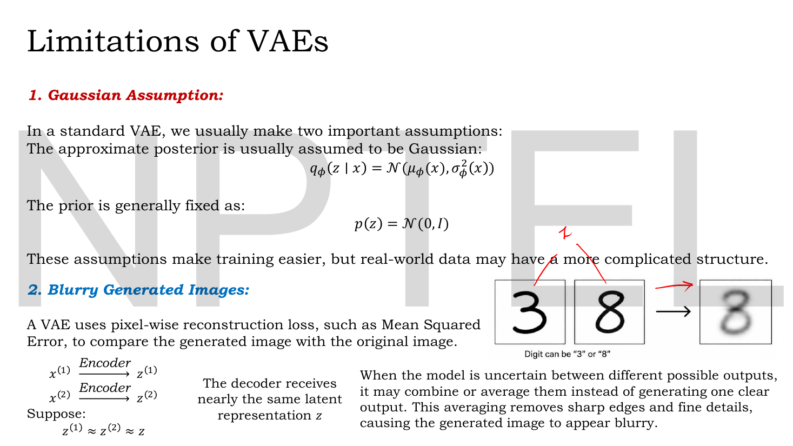
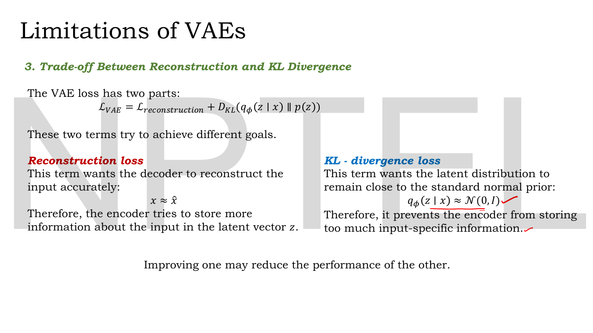
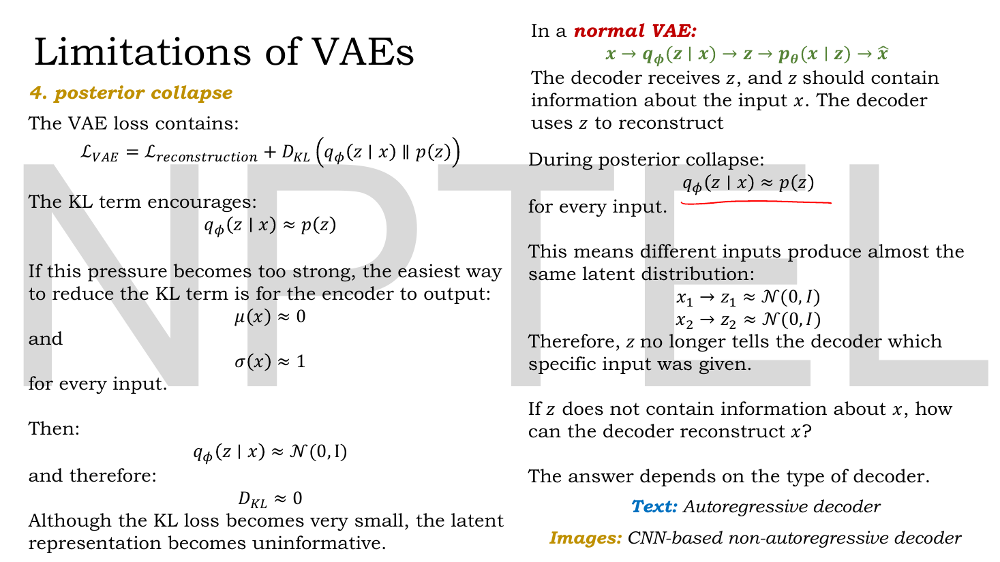
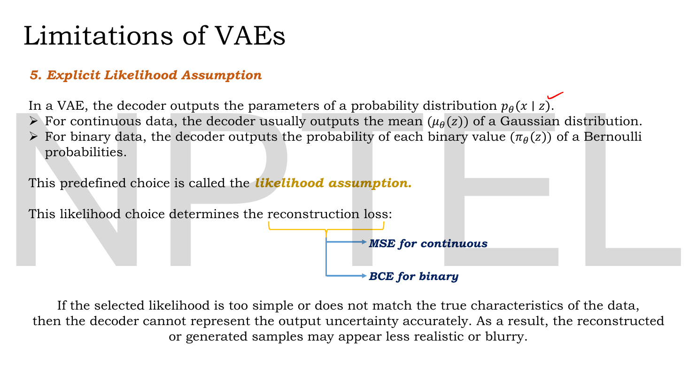
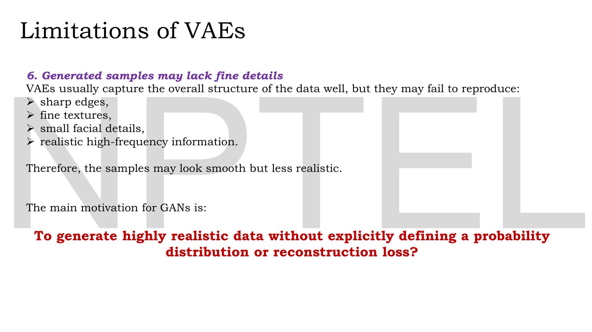
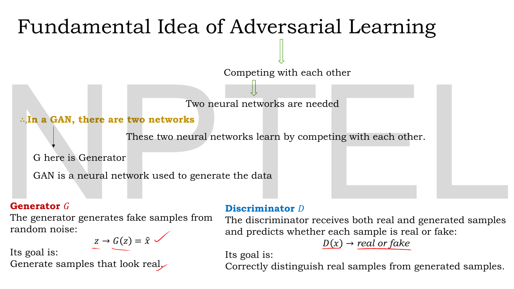
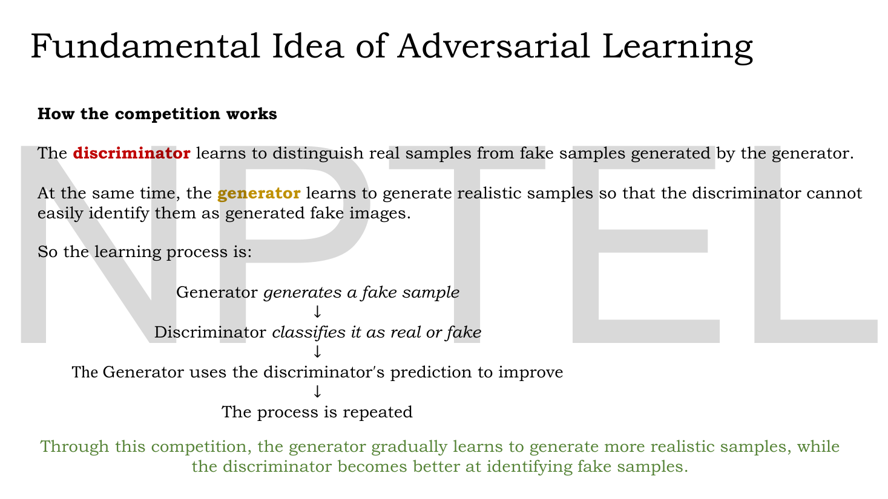

# Lec 31 — Motivation for GANs

> **Source:** `Lec 31.pdf` (12 pages) · **Week 5** · **Playlist:** Lec 31
> **Prereqs:** [Lec 11 — Reconstruction Loss (MSE, BCE)](11-reconstruction-loss.md), [Lec 19 — KL Divergence — Part A](19-kl-divergence-a.md), [Lec 22 — Probabilistic Decoder, ELBO, VAE Loss](22-elbo-and-vae-loss.md)
> **Feeds into:** [Lec 32 — GAN Architecture](32-gan-architecture.md), [Lec 33 — GAN Objective and Loss Functions](33-gan-objective.md), [Lec 34 — GAN Convergence and Nash Equilibrium](34-gan-convergence.md)

## Why this lecture exists

You have just built a generative model that works: the VAE encodes, samples, decodes, and its latent space interpolates smoothly. Then you look at what it draws: the faces are soft, the digits smudged, the textures gone. The samples are *plausible* and *unconvincing* at once.

This lecture is the diagnosis. The lecturer lists six things a VAE does badly, most of them trace to one choice: a VAE is trained to maximise an explicitly chosen likelihood, evaluated pixel by pixel, and that objective rewards hedging. Where the model is unsure, the cheapest answer is the average of the possibilities — and the average of several sharp images is a blurry image. The lecture then asks the question the GAN arc answers: can you generate realistic data *without* writing down a probability distribution or a reconstruction loss at all? The answer: let a second network invent the loss.

## The ideas

### Notation, and one symbol this deck reuses

The deck writes $z$, $x$, $\hat{x}$ as plain italics; per CONTRACT §3 these are $\mathbf{z}$, $\mathbf{x}$, $\hat{\mathbf{x}}$ here — vectors every time. The deck writes the prior as $p(z) = \mathcal{N}(0, I)$, which in our convention is $p(\mathbf{z}) = \mathcal{N}(\mathbf{0}, \mathbf{I})$: mean zero, **covariance** the identity, so variance 1 per dimension. The generator is $G$ and the discriminator is $D$ from here to Lec 42.

### The six limitations of the VAE

The deck numbers them, and so do we, because an MCQ asking "which of the following is *not* listed as a limitation of VAEs" is cheap to set.


*Fig. — The three thumbnails at the right are the whole lecture in one picture: a 3, an 8, and the smeared thing you get when the decoder cannot decide. The caption under them reads "Digit can be '3' or '8'". Page 4.*

**1. The Gaussian assumption.** A standard VAE makes two choices before it sees any data: the approximate posterior is Gaussian,

$$q_\phi(\mathbf{z}\mid\mathbf{x}) = \mathcal{N}\big(\mu_\phi(\mathbf{x}),\, \sigma^2_\phi(\mathbf{x})\big)$$

and the prior is fixed at $p(\mathbf{z}) = \mathcal{N}(\mathbf{0},\mathbf{I})$. The deck's comment: "these assumptions make training easier, but real-world data may have a more complicated structure." A Gaussian is unimodal and symmetric. If the true posterior over codes for a given image has two separated bumps — this could be a 3 or an 8 — a single Gaussian cannot represent that, and will sit between them.

**2. Blurry generated images.** The headline. The deck's statement: a VAE uses a *pixel-wise* reconstruction loss such as MSE to compare the generated image with the original. Its illustration is two inputs with nearly identical codes,

$$\mathbf{x}^{(1)} \xrightarrow{\ \text{Encoder}\ } \mathbf{z}^{(1)}, \qquad \mathbf{x}^{(2)} \xrightarrow{\ \text{Encoder}\ } \mathbf{z}^{(2)}, \qquad \mathbf{z}^{(1)} \approx \mathbf{z}^{(2)} \approx \mathbf{z}$$

so "the decoder receives nearly the same latent representation $\mathbf{z}$". It must emit one image. The deck concludes: "When the model is uncertain between different possible outputs, it may combine or average them instead of generating one clear output. This averaging removes sharp edges and fine details, causing the generated image to appear blurry."

That is the *what*. The deck never gives the *why*, and the why is a two-line argument you should be able to produce on demand. It gets its own section below.


*Fig. — Two columns pulling in opposite directions, and the single line at the bottom that matters: "Improving one may reduce the performance of the other." Page 5.*

**3. The trade-off between reconstruction and KL.** The VAE loss is a sum of two terms with incompatible wishes:

$$\mathcal{L}_{\text{VAE}} = \mathcal{L}_{\text{reconstruction}} + D_{\mathrm{KL}}\big(q_\phi(\mathbf{z}\mid\mathbf{x})\,\|\,p(\mathbf{z})\big)$$

The reconstruction term wants $\mathbf{x} \approx \hat{\mathbf{x}}$, so it pushes the encoder to **store more information** about the input in $\mathbf{z}$. The KL term wants $q_\phi(\mathbf{z}\mid\mathbf{x}) \approx \mathcal{N}(\mathbf{0},\mathbf{I})$, so it **prevents the encoder from storing too much input-specific information**. One objective, two terms, opposite pressures. The optimiser minimises the *sum*, and the sum has no idea that you personally care about sharpness. ([Lec 22](22-elbo-and-vae-loss.md) derives the two terms; [Lec 26](26-beta-vae.md) turns the trade-off into a knob.)


*Fig. — The failure is written as an equation chain: $\mu(\mathbf{x})\to 0$, $\sigma(\mathbf{x})\to 1$, therefore $D_{\mathrm{KL}}\to 0$ — the loss looks excellent and the model has learned nothing. Page 6.*

**4. Posterior collapse.** Take limitation 3 to its extreme. The KL term is minimised exactly when the encoder ignores its input: output $\mu(\mathbf{x}) \approx 0$ and $\sigma(\mathbf{x}) \approx 1$ **for every input**. Then $q_\phi(\mathbf{z}\mid\mathbf{x}) \approx \mathcal{N}(\mathbf{0},\mathbf{I})$, so $D_{\mathrm{KL}} \approx 0$ — a free win on half the loss. The deck spells out the consequence: two different inputs now produce the same latent distribution,

$$\mathbf{x}_1 \to \mathbf{z}_1 \approx \mathcal{N}(\mathbf{0},\mathbf{I}), \qquad \mathbf{x}_2 \to \mathbf{z}_2 \approx \mathcal{N}(\mathbf{0},\mathbf{I})$$

so "$\mathbf{z}$ no longer tells the decoder which specific input was given". The deck then asks the sharp follow-up — if $\mathbf{z}$ carries no information, how does the decoder reconstruct $\mathbf{x}$ at all? — and answers: it depends on the decoder. A **text** decoder is usually *autoregressive*, so it can predict each token from the previous tokens and needs $\mathbf{z}$ hardly at all; that is why posterior collapse is a famous problem for text VAEs. An **image** decoder is usually a *CNN-based non-autoregressive* decoder with no such side channel, so it cannot ignore $\mathbf{z}$ entirely and collapse is milder. N4 below puts a number on how much the optimiser saves by collapsing.

**5. The explicit likelihood assumption.** This is the limitation that names the whole fix. In a VAE the decoder does not output an image; it outputs the **parameters of a probability distribution** $p_\theta(\mathbf{x}\mid\mathbf{z})$:

| Data | Decoder emits | Distribution | Forced reconstruction loss |
|---|---|---|---|
| continuous | the mean $\mu_\theta(\mathbf{z})$ | Gaussian | MSE |
| binary | the probability $\pi_\theta(\mathbf{z})$ | Bernoulli | BCE |

The deck calls this predefined choice the **likelihood assumption**, and the arrow diagram on the slide makes the chain explicit: *the likelihood choice determines the reconstruction loss.* You pick a family of distributions before training; that pick becomes your loss function; your loss function becomes the definition of "realistic". The deck's closing sentence: "If the selected likelihood is too simple or does not match the true characteristics of the data, then the decoder cannot represent the output uncertainty accurately. As a result, the reconstructed or generated samples may appear less realistic or blurry." ([Lec 11](11-reconstruction-loss.md) owns the MSE-vs-BCE discrimination; this slide is where the choice is revealed to be a *modelling assumption*, not a free decision.)


*Fig. — Read the yellow bracket as a causal arrow, not a menu: you do not choose the loss, you choose the likelihood and the loss follows. Page 7.*

**6. Generated samples may lack fine details.** The deck's list of what a VAE captures well versus what it misses:

| VAEs usually get | VAEs usually fail on |
|---|---|
| the overall structure of the data | sharp edges |
| global shape and layout | fine textures |
| coarse colour and tone | small facial details |
| | realistic high-frequency information |

"Therefore, the samples may look smooth but less realistic." Smooth is the giveaway word: an image's sharpness lives in its high spatial frequencies, and averaging is a low-pass filter.

### Why a pixel-wise likelihood blurs — the argument the deck omits

Everything above hangs on one claim: *when uncertain, the model averages*. Here is why it must.

Suppose the decoder has received a code $\mathbf{z}$ and, given that code, the true image could still be either $\mathbf{x}_A$ or $\mathbf{x}_B$, each with probability $\tfrac12$. The decoder emits one image $\hat{\mathbf{x}}$ and is scored by the **expected** reconstruction loss — expected, because training averages the loss over the data. For a single pixel $x$ with squared error:

$$\mathbb{E}_{p(x\mid\mathbf{z})}\big[(x - \hat{x})^2\big]$$

Expand the square and write $m = \mathbb{E}[x]$:

$$\mathbb{E}\big[(x - \hat{x})^2\big] = \mathbb{E}\big[(x - m)^2\big] + (m - \hat{x})^2 = \operatorname{Var}(x) + (m - \hat{x})^2$$

The first term does not contain $\hat{x}$ at all. The second is a square, so it is minimised at $\hat{x} = m$ and nowhere else. **The squared-error-optimal output is the conditional mean**, and the loss you are stuck with even then is the conditional *variance*. So:

- The model does not average because it is lazy or under-trained. Averaging is the **exact optimum** of the objective it was given.
- The penalty for committing is explicit. Guessing $\mathbf{x}_A$ when the truth is a coin flip costs $\operatorname{Var} + (m - x_A)^2$; hedging costs $\operatorname{Var}$ alone. In the two-outcome binary case that is a factor of exactly 2 (N1, N2).
- This is not an MSE quirk. Under BCE the optimum is also the conditional mean — the Bernoulli mean — and the irreducible loss is the conditional *entropy*. Any **pixel-wise** likelihood scores each pixel independently against the truth, and every such loss rewards the hedge. N3 shows both at once.

And the average of two sharp images is not a third sharp image. A pixel that is black in $\mathbf{x}_A$ and white in $\mathbf{x}_B$ comes out mid-grey. Edges, which are exactly the pixels where the two possibilities disagree, turn into ramps. That is the blur.

> **The one-sentence version, worth memorising.** A VAE's reconstruction term is an expectation over a pixel-wise likelihood; the minimiser of an expected pixel-wise loss is the per-pixel average of the plausible outputs; the average of several sharp images is blurry. Therefore the VAE's own objective *prefers* blurry samples.

Notice what this argument does **not** blame. Not the network's capacity, not the optimiser, not the amount of data. Making the decoder bigger makes it better at computing the average. The problem is the objective, so the fix has to change the objective.

### The question the lecture ends on


*Fig. — The red line is the thesis statement of the next eleven lectures. Note both halves of it: no explicit probability distribution **and** no reconstruction loss. Page 8.*

> **To generate highly realistic data without explicitly defining a probability distribution or reconstruction loss?**

Parse it in two pieces, because each half kills one limitation.

*Without explicitly defining a probability distribution* kills limitations 1 and 5. A GAN never writes down $p_g(\mathbf{x})$. It defines the model as a **sampling procedure** — draw noise, push it through a network — and that is all. Such a model is called an **implicit** generative model: you can draw from it, but you cannot ask it for the probability of a given image. The Gaussian posterior, the fixed prior over codes, the Bernoulli-or-Gaussian decoder all vanish because there is no density to parameterise.

*Without a reconstruction loss* kills limitations 2, 3, 4 and 6. There is nothing to reconstruct — no encoder, no pairing of an output with a particular input, no per-pixel comparison. The KL term has nothing to balance against, so the trade-off and the collapse go with it.

What replaces the loss? Another network, trained alongside, whose job is to notice anything that looks wrong. That is the adversarial idea.

### The forger and the detective

Before any mathematics, the picture. This analogy is not on the slides; it is the standard framing of the original GAN paper and it is the fastest way into the next three lectures.

A **forger** wants to pass counterfeit notes. A **detective** at the bank wants to catch them. Neither starts out good at the job.

- The forger prints something crude. The detective, who sees real notes every day, spots it instantly — "the paper is wrong".
- The forger learns only one thing from the exchange: *caught, and the paper was the tell*. So the next batch has better paper.
- Now the detective's old test fails. Pressed to keep catching forgeries, she learns a finer test — the watermark.
- The forger adapts again. The watermark improves. And so on, through the serial numbers, the ink, the thread.

Three features of this story are the whole of GAN training, and all three survive into the maths.

| In the story | In the GAN |
|---|---|
| The forger never sees a real banknote; he only hears the verdict | $G$ never touches the training data. It sees only its own noise and the gradient coming back through $D$ |
| The detective's test is not written down in advance; it gets *learned*, and it gets harder | The loss function is not hand-designed. $D$ **is** the loss, and it is re-fitted every step |
| Neither can improve without the other improving | The useful signal exists only while both are mediocre in a matched way |

The second row is the point of the whole exercise. A VAE's loss is a fixed formula, so a model can satisfy it perfectly and still look wrong to you. A GAN's loss is a trained classifier: the moment the generator finds a cheap trick — say, uniform grey blobs — the discriminator learns to detect that trick, the trick stops paying, and the generator must find something better. **The loss adapts to the generator's current weaknesses.** Blurriness in particular is trivially detectable: real photographs have sharp edges, blurry fakes do not, and a convolutional classifier picks that up in a handful of epochs. So a generator trained against a discriminator is punished for exactly the failure mode a pixel-wise likelihood rewards.

The price is paid elsewhere. Nothing in the adversarial setup requires the generator to cover *all* of the data — producing one perfectly convincing note over and over would fool the detective forever. That failure is called **mode collapse**, and [Lec 34](34-gan-convergence.md) owns it.

### The fundamental idea of adversarial learning, as the deck states it


*Fig. — The lecturer's red ticks mark the two definitions he wants you to carry: $\mathbf{z} \to G(\mathbf{z}) = \hat{\mathbf{x}}$ on the left, $D(\mathbf{x}) \to$ real or fake on the right. Page 9.*

The deck builds it top-down as a chain of necessities. Competing with each other $\Rightarrow$ two neural networks are needed $\Rightarrow$ in a GAN, there are two networks. "These two neural networks learn by competing with each other." And a one-line definition worth keeping: **a GAN is a neural network used to generate the data.**

**Generator $G$.** "The generator generates fake samples from random noise":

$$\mathbf{z} \longrightarrow G(\mathbf{z}) = \hat{\mathbf{x}}$$

Its goal, in the deck's words: *generate samples that look real.*

**Discriminator $D$.** "The discriminator receives both real and generated samples and predicts whether each sample is real or fake":

$$D(\mathbf{x}) \longrightarrow \text{real or fake}$$

Its goal: *correctly distinguish real samples from generated samples.*

Two things to register now and keep for [Lec 32](32-gan-architecture.md). The generator's input is **noise**, not data — there is no encoder anywhere in a GAN, which is the single biggest structural difference from a VAE. And the discriminator is a plain binary classifier; everything you know about binary classifiers applies to it unchanged.


*Fig. — The loop at the level of intuition. Step 3 is the one to stare at: the generator's only teacher is the discriminator's verdict. Page 10.*

The deck's four-step cycle:

```
Generator  generates a fake sample
           ↓
Discriminator  classifies it as real or fake
           ↓
The Generator uses the discriminator's prediction to improve
           ↓
The process is repeated
```

and the closing claim in green: "Through this competition, the generator gradually learns to generate more realistic samples, while the discriminator becomes better at identifying fake samples."

This is deliberately loose. It does not say which network is frozen when, how many steps each gets, or what labels the batches carry — [Lec 32](32-gan-architecture.md) answers all three, and getting them in the wrong order is the commonest mistake in the arc. It also does not say what "improve" means numerically; that is [Lec 33](33-gan-objective.md)'s minimax objective.

### VAE against GAN, at the level this lecture reaches

| | VAE | GAN |
|---|---|---|
| Density over $\mathbf{x}$ | **explicit** — you parameterise $p_\theta(\mathbf{x}\mid\mathbf{z})$ | **implicit** — never written down |
| Input to the generative half | a code $\mathbf{z}$ from the encoder, or from the prior | noise $\mathbf{z}$ from the prior only |
| Encoder | yes, $q_\phi(\mathbf{z}\mid\mathbf{x})$ | **none** |
| Training signal | a fixed formula (MSE or BCE) plus a KL term | a second network, re-trained every step |
| Sees real data | the whole model does | **only $D$ does** |
| Typical failure | blurry but diverse | sharp but may miss modes ([Lec 34](34-gan-convergence.md)) |
| Can score a new image's likelihood | yes (via the ELBO bound) | no |

The last row is a real cost, not a technicality: because a GAN has no density, you cannot compute a likelihood for held-out data, which is why GAN evaluation needs sample-based metrics instead.

### Where DCGAN sits

The Week 5 outline slide (page 2) lists "Introduction to DCGAN" after the loss lectures. **DCGAN** — Deep Convolutional GAN — is the recipe that makes the plain GAN of Lec 32–34 actually train on images: convolutions and transposed convolutions instead of fully-connected layers, batch normalisation, no pooling, and LeakyReLU in the discriminator. Its lecture has no slides in the source material; [Lec 38](38-conditional-gan.md) carries the flag and the orienting paragraph.

## Worked numericals

**The slides for this lecture contain no worked numerical examples** — it is the one motivation lecture in the arc and it carries no arithmetic at all. The five below are built to make the blur argument, the KL trade-off and the collapse concrete, because the argument is the examinable content and an exam can only test it with numbers.

### N1. The blur is the exact optimum — one pixel

**Given:** a single pixel that, for the code the decoder received, is $1$ with probability $0.5$ and $0$ with probability $0.5$. The decoder must emit one value $\hat{x}$.
**Find:** the expected squared error for $\hat{x} = 0$, $\hat{x} = 1$ and $\hat{x} = 0.5$, and the minimiser.

1. $\hat{x} = 0$: $\ \mathbb{E}[(x-0)^2] = 0.5(0-0)^2 + 0.5(1-0)^2 = 0 + 0.5 = 0.5$.
2. $\hat{x} = 1$: $\ \mathbb{E}[(x-1)^2] = 0.5(0-1)^2 + 0.5(1-1)^2 = 0.5 + 0 = 0.5$.
3. $\hat{x} = 0.5$: $\ \mathbb{E}[(x-0.5)^2] = 0.5(0.25) + 0.5(0.25) = 0.25$.
4. Check against the identity: the minimiser is $m = \mathbb{E}[x] = 0.5$ and the minimum is $\operatorname{Var}(x) = 0.5 \times 0.5 = 0.25$. ✓

**Answer:** the committed guesses each score $0.5$; the mid-grey hedge scores $0.25$ — **exactly half**. The optimum is $\hat{x}=0.5$, a pixel that is neither black nor white.

### N2. The same thing on a four-pixel "digit"

**Given:** the decoder is 50/50 between two binary patterns $\mathbf{x}_A = [1,0,1,0]$ and $\mathbf{x}_B = [0,1,0,1]$.
**Find:** the expected sum of squared errors for committing to $\mathbf{x}_A$ and for emitting the average, and the same under BCE.

1. Average: $\tfrac12(\mathbf{x}_A + \mathbf{x}_B) = [0.5,0.5,0.5,0.5]$.
2. SSE of the average: every pixel contributes $0.25$ under either outcome, so $\mathbb{E}[\text{SSE}] = 4 \times 0.25 = 1.00$.
3. SSE of committing to $\mathbf{x}_A$: $0$ if $\mathbf{x}_A$ is true, $4 \times 1 = 4$ if $\mathbf{x}_B$ is true. $\mathbb{E} = 0.5(0) + 0.5(4) = 2.00$.
4. BCE of the average: each pixel costs $-\log 0.5 = 0.693147$ whichever outcome occurs, so $\mathbb{E}[\text{BCE}] = 4 \times 0.693147 = 2.7726$ nats.
5. BCE of committing to $\mathbf{x}_A$: when $\mathbf{x}_B$ is true all four pixels are maximally wrong, $-\log 0 = +\infty$. With the standard clamp $\varepsilon = 10^{-7}$, each costs $-\log(10^{-7}) = 16.118$, so $\mathbb{E} = 0.5(0) + 0.5(4 \times 16.118) = 32.24$ nats.

**Answer:** blur $1.00$ against sharp $2.00$ under MSE (a factor of 2), and blur $2.77$ against sharp $32.24$ under BCE. **Both losses prefer the blur, and BCE prefers it far more aggressively** — the model is not merely permitted to hedge, it is forced to.

### N3. Unequal probabilities: the optimum under both losses

**Given:** a pixel that is $1$ with probability $p = 0.7$ and $0$ with probability $0.3$.
**Find:** the MSE-optimal output and its loss, the BCE-optimal output and its loss, and the cost of committing to $\hat{x} = 1$.

1. MSE optimum is the mean: $\hat{x}^\star = \mathbb{E}[x] = 0.7$.
2. Its value: $0.7(1-0.7)^2 + 0.3(0-0.7)^2 = 0.7(0.09) + 0.3(0.49) = 0.063 + 0.147 = 0.210$. This equals $\operatorname{Var}(x) = p(1-p) = 0.7 \times 0.3 = 0.21$. ✓
3. BCE optimum is also $0.7$ (the Bernoulli mean), and its value is the entropy:
$$-\big[0.7\log 0.7 + 0.3\log 0.3\big] = 0.7(0.356675) + 0.3(1.203973) = 0.249672 + 0.361192 = 0.610864$$
4. Committing to $\hat{x} = 1$: MSE $= 0.7(0) + 0.3(1) = 0.300$; BCE $= 0.7(0) + 0.3\big(-\log(10^{-7})\big) = 0.3 \times 16.118 = 4.835$ nats (and $+\infty$ without the clamp).

**Answer:** $\hat{x}^\star = 0.7$ under both losses, costing $0.210$ (MSE) and $0.6109$ nats (BCE). Committing costs $0.300$ and $4.835$. The optimal output is a grey pixel at 70% intensity — **an intensity the real data never takes**. That is the precise sense in which a VAE sample is not a sample from the data: it is a *summary* of several.

### N4. How much the optimiser saves by collapsing the posterior

**Given:** a 20-dimensional latent. In each dimension the Gaussian KL to the standard normal prior is
$$D_{\mathrm{KL}}\big(\mathcal{N}(\mu,\sigma^2)\,\|\,\mathcal{N}(0,1)\big) = \tfrac12\big(\mu^2 + \sigma^2 - 1 - \log\sigma^2\big)$$
(the closed form from [Lec 22](22-elbo-and-vae-loss.md)). Compare an *informative* encoder with $\mu = 2$, $\sigma = 0.5$ in every dimension against a *collapsed* encoder with $\mu = 0$, $\sigma = 1$.
**Find:** the KL saving from collapsing.

1. Collapsed: $\tfrac12(0 + 1 - 1 - \log 1) = \tfrac12(0) = 0$ nats per dimension.
2. Informative: $\sigma^2 = 0.25$, $\log 0.25 = -1.386294$.
$$\tfrac12\big(4 + 0.25 - 1 + 1.386294\big) = \tfrac12(4.636294) = 2.318147 \ \text{nats per dimension}$$
3. Over 20 dimensions: $20 \times 2.318147 = 46.363$ nats.

**Answer:** collapsing buys **46.36 nats** off the loss, every sample, for free. If making $\mathbf{z}$ informative improves the reconstruction term by less than that, the optimiser will collapse the posterior — and it is *correct* to, because the total is what it minimises. This is limitation 4 as arithmetic.

### N5. The reconstruction–KL trade-off decides, and it may choose the blur

**Given:** three settings of the same VAE, with the loss terms in nats per image.

| Setting | $\mathcal{L}_{\text{reconstruction}}$ | $D_{\mathrm{KL}}$ | How the samples look |
|---|---|---|---|
| A | 120.0 | 15.0 | moderately sharp |
| B | 100.0 | 40.0 | sharpest |
| C | 128.0 | 5.0 | blurriest |

**Find:** which setting the optimiser selects.

1. A: $120.0 + 15.0 = 135.0$.
2. B: $100.0 + 40.0 = 140.0$.
3. C: $128.0 + 5.0 = 133.0$.

**Answer:** the optimiser picks **C at 133.0 nats** — the blurriest of the three — because it minimises the sum and nothing in the sum measures sharpness. B has the best reconstruction by 28 nats and loses by 7. This is why limitation 3 is listed as a limitation rather than a tuning detail: the objective is not a proxy for what you want, it is a *different* quantity that happens to correlate with it.

## Code

The deck asserts that averaging produces blur. Twenty lines make it a table of numbers — and show that the blur is the *winner* under both of the losses Lec 11 gave you.

```python
import numpy as np

# Two equally plausible 4x4 "digits": a vertical stroke and a horizontal stroke.
A = np.zeros((4, 4)); A[:, 1] = 1.0           # vertical bar
B = np.zeros((4, 4)); B[1, :] = 1.0           # horizontal bar
EPS = 1e-7                                    # the clamp every BCE implementation uses

def scores(xhat):
    """Expected pixel-wise loss when the true image is A or B with prob 0.5 each."""
    sse = 0.5 * np.sum((A - xhat) ** 2) + 0.5 * np.sum((B - xhat) ** 2)
    p = np.clip(xhat, EPS, 1 - EPS)
    bce_one = lambda x: -np.sum(x * np.log(p) + (1 - x) * np.log(1 - p))
    bce = 0.5 * bce_one(A) + 0.5 * bce_one(B)
    grey = np.mean((xhat > 0.01) & (xhat < 0.99))      # fraction of non-committed pixels
    return sse, bce, grey

print(f"{'decoder output':<18}{'E[SSE]':>9}{'E[BCE]':>11}{'grey px':>9}")
for name, xhat in [("commit to A", A), ("commit to B", B), ("average (A+B)/2", 0.5*(A+B))]:
    sse, bce, grey = scores(xhat)
    print(f"{name:<18}{sse:9.3f}{bce:11.3f}{grey:9.1%}")

print("\nthe loss-optimal output, printed as pixel intensities:")
print(0.5 * (A + B))
```

```
decoder output       E[SSE]     E[BCE]  grey px
commit to A           3.000     48.354     0.0%
commit to B           3.000     48.354     0.0%
average (A+B)/2       1.500      4.159    37.5%

the loss-optimal output, printed as pixel intensities:
[[0.  0.5 0.  0. ]
 [0.5 1.  0.5 0.5]
 [0.  0.5 0.  0. ]
 [0.  0.5 0.  0. ]]
```

Read the numbers, then read the picture. The two sharp, *correct* images each score $3.000$; the thing that is not an image at all scores $1.500$ — again exactly half, because the two patterns disagree on six pixels and each disagreement costs $1$ when you commit and $0.25$ when you hedge ($6 \times 1 \times 0.5 = 3$ against $6 \times 0.25 = 1.5$). Under BCE the gap is a factor of $48.354/4.159 = 11.6$. And the winning output has **37.5% of its pixels at an intensity that appears in neither training image**. A model trained to minimise this will converge to that grey smear and will be right to.

## Exam pack

### Must-memorise

| Item | Exactly this |
|---|---|
| Limitation 1 | Gaussian assumption: $q_\phi(\mathbf{z}\mid\mathbf{x}) = \mathcal{N}(\mu_\phi(\mathbf{x}), \sigma^2_\phi(\mathbf{x}))$, prior fixed at $p(\mathbf{z}) = \mathcal{N}(\mathbf{0},\mathbf{I})$ |
| Limitation 2 | Blurry generated images, caused by a **pixel-wise** reconstruction loss averaging plausible outputs |
| Limitation 3 | Trade-off: "Improving one may reduce the performance of the other" |
| Limitation 4 | Posterior collapse: $\mu(\mathbf{x})\to 0$, $\sigma(\mathbf{x})\to 1$, so $q_\phi(\mathbf{z}\mid\mathbf{x})\approx p(\mathbf{z})$ and $D_{\mathrm{KL}}\approx 0$ |
| Limitation 5 | Explicit **likelihood assumption**: Gaussian ⇒ MSE, Bernoulli ⇒ BCE |
| Limitation 6 | Samples lack sharp edges, fine textures, small facial details, high-frequency information |
| VAE loss | $\mathcal{L}_{\text{VAE}} = \mathcal{L}_{\text{reconstruction}} + D_{\mathrm{KL}}(q_\phi(\mathbf{z}\mid\mathbf{x})\,\|\,p(\mathbf{z}))$ |
| The blur theorem | $\arg\min_{\hat{x}}\ \mathbb{E}[(x-\hat{x})^2] = \mathbb{E}[x]$, with minimum $\operatorname{Var}(x)$ |
| The motivation | "To generate highly realistic data without explicitly defining a probability distribution or reconstruction loss" |
| Generator | $\mathbf{z} \to G(\mathbf{z}) = \hat{\mathbf{x}}$; goal: generate samples that look real |
| Discriminator | $D(\mathbf{x}) \to$ real or fake; goal: correctly distinguish real from generated |
| GAN, one line | two neural networks that learn by **competing with each other** |
| Collapse by decoder type | text ⇒ autoregressive decoder (collapse is easy); images ⇒ CNN non-autoregressive decoder |

### Numbers worth knowing

| Quantity | Value |
|---|---|
| Limitations of VAEs listed on this deck | **6** |
| Networks in a GAN | **2** |
| Steps in the deck's competition loop | **4** (generate → classify → improve → repeat) |
| MSE of committing vs hedging, two equally likely binary outcomes | $0.5$ vs $0.25$ — a factor of **2** |
| Irreducible MSE at the optimum | $\operatorname{Var}(x)$; for a binary pixel, $p(1-p)$ |
| Irreducible BCE at the optimum | the entropy; for $p=0.7$, $0.6109$ nats |
| $-\log 0.5$ | $0.693147$ nats |
| KL of a collapsed dimension, $\mu=0,\sigma=1$ | $0$ |
| KL of $\mathcal{N}(2, 0.5^2)$ against $\mathcal{N}(0,1)$ | $2.3181$ nats; $\times 20$ dims $= 46.36$ |
| Standard BCE clamp | $\varepsilon = 10^{-7}$, so $-\log\varepsilon = 16.118$ |
| Gaussian KL closed form | $\tfrac12(\mu^2 + \sigma^2 - 1 - \log\sigma^2)$ |

### Likely MCQ traps

- **"VAEs are blurry because the network is too small / under-trained."** No. Blur is the *optimum* of the objective, not a failure to reach it. A bigger decoder computes the average more accurately. Any option blaming capacity, data volume or epochs is wrong; the correct option blames the pixel-wise reconstruction loss.
- **"Blur is an MSE problem; use BCE instead."** Both are pixel-wise likelihoods and both are minimised by the conditional mean. N2 shows BCE preferring the blur by a *larger* margin than MSE. The fix is to stop using a per-pixel loss, not to swap which one.
- **"The KL term causes the blur."** The KL term causes limitations 3 and 4. The blur (limitation 2) is the reconstruction term's doing. They are listed separately on the deck for a reason.
- **Posterior collapse vs mode collapse.** *Posterior* collapse is a **VAE** failure: the encoder stops using $\mathbf{z}$, $D_{\mathrm{KL}}\to 0$. *Mode* collapse is a **GAN** failure: the generator emits only a few kinds of sample ([Lec 34](34-gan-convergence.md)). Different models, different mechanisms, deliberately similar names.
- **"A GAN's generator learns from the real images."** It never sees one. Only $D$ touches $p_{\text{data}}$; $G$ sees noise and a gradient. This is the single most asked structural question in the arc.
- **"The likelihood assumption is the choice of loss function."** Reverse the arrow. You assume a likelihood (Gaussian / Bernoulli); the loss (MSE / BCE) follows from it. The deck draws the arrow that way on page 7.
- **Confusing "implicit" with "no distribution".** A GAN does have an implied distribution $p_g$ — that is what [Lec 33](33-gan-objective.md) compares to $p_{\text{data}}$. What it lacks is a *tractable, explicit* formula you can evaluate. "A GAN has no probability distribution" is wrong; "a GAN does not explicitly define one" is right.
- **"The discriminator is the loss function" read too literally.** $D$ *supplies* the training signal, but $D$'s own outputs are fed into an ordinary loss. The point is that the signal is **learned and non-stationary**, not that there is no formula anywhere.
- **The Gaussian written as $\mathcal{N}(\mu, \sigma)$.** The deck writes $\mathcal{N}(\mu_\phi(\mathbf{x}), \sigma^2_\phi(\mathbf{x}))$ — the second argument is the **variance**. Reading it as a standard deviation changes every KL number.

### Self-test

1. List the six limitations of VAEs in the order the deck gives them.
2. A decoder is equally unsure between two images. Prove that the squared-error-optimal output is their average, and state the loss you are left with.
3. Why does switching from MSE to BCE not fix blurriness?
4. State the deck's motivating question for GANs, and say which limitations each half of it addresses.
5. In posterior collapse, what does the encoder output, and what happens to each of the two loss terms?
6. A latent dimension has $\mu = 1.5$, $\sigma = 0.8$. Compute its KL to $\mathcal{N}(0,1)$, and the saving from collapsing it.
7. What does the generator see during training, and what does the discriminator see?
8. Why is "the loss function is learned" the key property of adversarial training?
9. A pixel is 1 with probability 0.4. Give the MSE-optimal output, its expected squared error, and the BCE-optimal output.
10. Which is an explicit and which an implicit generative model, and what can you do with one that you cannot with the other?

<details><summary>Answers</summary>

1. (1) Gaussian assumption, (2) blurry generated images, (3) trade-off between reconstruction and KL divergence, (4) posterior collapse, (5) explicit likelihood assumption, (6) generated samples may lack fine details.
2. $\mathbb{E}[(x-\hat{x})^2] = \operatorname{Var}(x) + (\mathbb{E}[x]-\hat{x})^2$; only the second term depends on $\hat{x}$ and it is a square, so the minimiser is $\hat{x} = \mathbb{E}[x]$ — the average. The residual loss is $\operatorname{Var}(x)$, which no amount of training removes.
3. Because BCE is also a pixel-wise likelihood, and its optimum is also the conditional mean (the Bernoulli mean). N2: with two equally likely patterns, BCE scores the blur at 2.77 nats and the sharp commitment at 32.24 — it prefers the blur more strongly than MSE does.
4. "To generate highly realistic data without explicitly defining a probability distribution or reconstruction loss?" *No explicit distribution* removes limitations 1 and 5; *no reconstruction loss* removes 2, 3, 4 and 6.
5. The encoder outputs $\mu(\mathbf{x}) \approx 0$ and $\sigma(\mathbf{x}) \approx 1$ for **every** input, so $q_\phi(\mathbf{z}\mid\mathbf{x}) \approx \mathcal{N}(\mathbf{0},\mathbf{I})$ and $D_{\mathrm{KL}} \approx 0$. The KL term becomes excellent; the reconstruction term suffers, because $\mathbf{z}$ no longer identifies the input.
6. $\sigma^2 = 0.64$, $\log 0.64 = -0.446287$. $\tfrac12(2.25 + 0.64 - 1 + 0.446287) = \tfrac12(2.336287) = \mathbf{1.1681}$ nats. Collapsing that dimension gives KL $=0$, so the saving is $1.1681$ nats.
7. $G$ sees only noise $\mathbf{z}$ drawn from the prior, and the gradient that returns through $D$. It never sees a real sample. $D$ sees both: real samples from the training set and fake samples from $G$.
8. Because a fixed loss can be satisfied by a model that still looks wrong — the blur is a fixed loss's optimum. A learned loss re-targets itself at whatever the generator is currently doing badly, so cheap tricks stop paying as soon as the discriminator notices them.
9. MSE-optimal $\hat{x} = 0.4$; expected squared error $= p(1-p) = 0.4 \times 0.6 = \mathbf{0.24}$. BCE-optimal is also $0.4$ (minimum value $-[0.4\log 0.4 + 0.6\log 0.6] = 0.6730$ nats).
10. The VAE is explicit — it parameterises $p_\theta(\mathbf{x}\mid\mathbf{z})$, so you can score a held-out image (via the ELBO). The GAN is implicit — you can only draw samples, not evaluate a density, which is why GANs are judged by sample-based metrics.

</details>

## Beyond the slides

**Gap: the deck states that uncertainty causes averaging but never proves that averaging is optimal.**
**Why it matters:** without the proof the claim sounds like a quirk of a particular implementation, and the reader is left thinking a better VAE would fix it. The identity $\mathbb{E}[(x-\hat{x})^2] = \operatorname{Var}(x) + (\mathbb{E}[x]-\hat{x})^2$ is the whole motivation for the GAN arc in one line, and it transfers: the same argument explains why an $L_1$ reconstruction loss gives the conditional *median* (which is why Pix2Pix in [Lec 39](39-pix2pix.md) uses $L_1$ rather than $L_2$ — the median of several sharp images is one of them, so $L_1$ blurs less).

**Gap: the deck never names the implicit/explicit distinction, though the motivating question is exactly that distinction.**
**Why it matters:** "without explicitly defining a probability distribution" is the standard definition of an **implicit generative model**, and it has a consequence the deck never states — you cannot compute a likelihood for a GAN, so you cannot report test-set log-likelihood, cannot do likelihood-based model selection, and cannot detect out-of-distribution inputs with it. This is why GAN papers report FID and Inception Score instead. Diffusion models ([Lec 44](44-diffusion-intro.md)) go back to an explicit likelihood and recover those abilities.

**Gap: the deck lists six limitations without saying which the GAN actually fixes.**
**Why it matters:** a GAN removes 1, 2, 3, 4 and 6 by construction — there is no posterior, no KL term and no reconstruction loss. It does nothing about diversity, and in fact makes it *worse*: the adversarial objective is perfectly satisfied by a generator that produces one convincing sample forever. That is **mode collapse**, and the honest summary of this lecture is "a GAN trades the VAE's blur for the GAN's missing modes". [Lec 34](34-gan-convergence.md) owns it; a diffusion model is the thing that gets both.

**Gap: the blur argument is specific to *pixel-wise* likelihoods, which the deck says once and does not exploit.**
**Why it matters:** the fix is not necessarily adversarial. A VAE with a *perceptual* or *learned* likelihood — compare feature maps rather than pixels — is noticeably sharp, and VQ-VAE-2 and the VAE inside Stable Diffusion ([Lec 52](52-stable-diffusion.md)) are exactly that. So the real lesson is "pixel-wise likelihoods blur", not "VAEs blur". An exam option phrased as "VAEs are inherently blurry" is defensible from this deck but false in general.

**Gap: no mention of where the adversarial idea comes from, or that the analogy is part of the original statement.**
**Why it matters:** GANs are Goodfellow et al., 2014, and the counterfeiter-versus-police framing is in that paper's own abstract. Knowing the date orders the arc for you: GAN (2014) → DCGAN (2015) → Conditional GAN and Pix2Pix (2016) → CycleGAN (2017) → StyleGAN (2018–19), which is precisely the order of [Lec 38](38-conditional-gan.md) through [Lec 42](42-stylegan2.md).

## Cut from the slides

Pages 1, 2, 3, 11 and 12 carry no teachable content: the title card, the Week 5 outline, the session overview, the next-session preview and the thank-you. The outline on page 2 is the only one worth keeping a trace of, and it is reflected here in the DCGAN note and in the "Feeds into" links. Everything on pages 4 through 10 is reproduced — all six limitations with the deck's own wording for each headline claim, the $\mathbf{x}^{(1)}, \mathbf{x}^{(2)} \to \mathbf{z}$ sketch, the text-versus-image decoder split under posterior collapse, the likelihood-to-loss branch, both network definitions and the four-step competition loop. The lecturer's red ticks on pages 5, 6, 7 and 9 mark $q_\phi(\mathbf{z}\mid\mathbf{x}) \approx \mathcal{N}(\mathbf{0},\mathbf{I})$, $\mathbf{z} \to G(\mathbf{z}) = \hat{\mathbf{x}}$ and $D(\mathbf{x}) \to$ real or fake; those are reproduced as emphasis in the prose rather than as marginal notes. Two things here are **not** on the slides and are marked as such where they appear: the proof that the conditional mean minimises expected squared error, and the forger/detective analogy. Mode collapse is named once as the price of the trade and left entirely to [Lec 34](34-gan-convergence.md).
