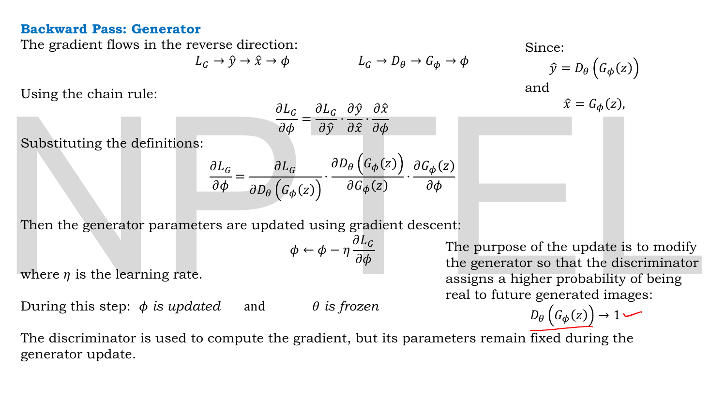
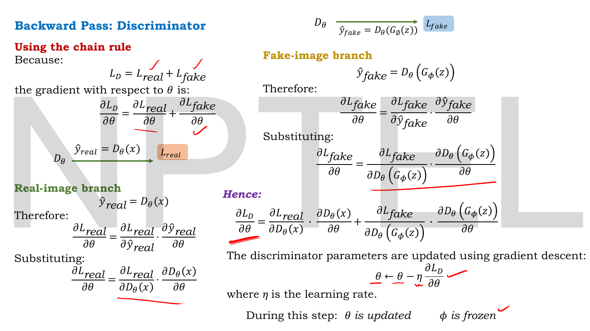
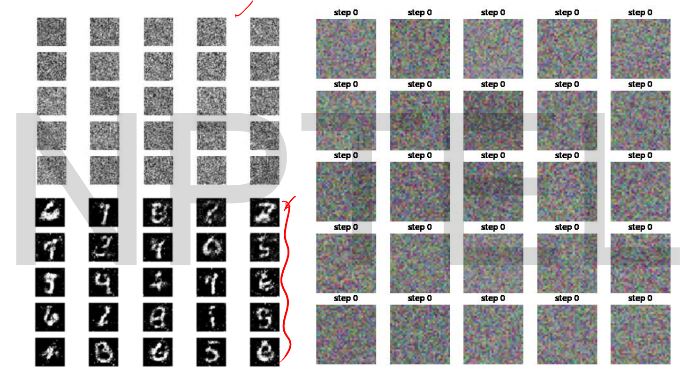
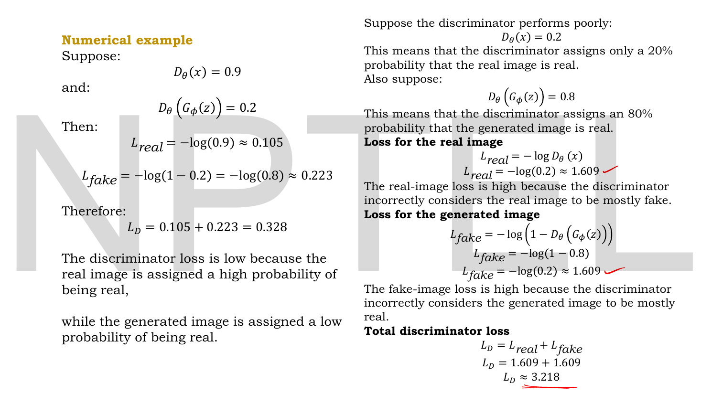

# Lec 32 — GAN Architecture

> **Source:** `Lec 32.pdf` (13 pages) · **Week 5** · **Playlist:** Lec 32
> **Prereqs:** [Lec 31 — Motivation for GANs](31-gan-motivation.md), [Lec 11 — Reconstruction Loss (MSE, BCE)](11-reconstruction-loss.md), [Lec 03 — Optimizers — Part A](03-optimizers-a.md)
> **Feeds into:** [Lec 33 — GAN Objective and Loss Functions](33-gan-objective.md), [Lec 34 — GAN Convergence and Nash Equilibrium](34-gan-convergence.md), [Lec 38 — Conditional GAN](38-conditional-gan.md)

## Why this lecture exists

[Lec 31](31-gan-motivation.md) left you with a slogan — two networks compete, one forges, one detects — and a four-step loop too loose to implement. This lecture turns it into wiring.

Three questions have to be answered before a GAN is a program rather than an analogy. What exactly does each network take in and emit? Where does the input to the generator come from, given that there is no encoder anywhere? And when both networks share a computation graph, which parameters move on which step? The third is where readers go wrong, because the same forward pass — noise, generator, fake image, discriminator, probability — is run in both halves of the training loop, with different things frozen and *different labels on the identical image*. Get the freezing or the labels backwards and the model trains itself into the ground. This chapter spells the loop out line by line.

## The ideas

### Notation, and a symbol clash worth noticing now

The deck gives each network its own parameter vector and keeps them apart throughout:

| Deck | Meaning | Written here |
|---|---|---|
| $G_\phi$, $\phi$ | the generator and **its** parameters | $G$, $\phi$ |
| $D_\theta$, $\theta$ | the discriminator and **its** parameters | $D$, $\theta$ |
| $z \sim \mathcal{N}(0, I)$, $z\in\mathbb{R}^d$ | the noise vector and its prior | $\mathbf{z} \sim \mathcal{N}(\mathbf{0}, \mathbf{I})$, $\mathbf{z}\in\mathbb{R}^d$ |
| $x \sim p_{data}(x)$ | a real training sample | $\mathbf{x} \sim p_{\text{data}}$ |
| $\hat{y}$ | the discriminator's scalar output | $\hat{y}$ |

**The clash:** in the VAE chapters, $\theta$ labelled the *generative* half (the decoder $p_\theta(\mathbf{x}\mid\mathbf{z})$) and $\phi$ the *inference* half (the encoder $q_\phi(\mathbf{z}\mid\mathbf{x})$). This deck uses them the other way round — $\phi$ generates, $\theta$ discriminates. Both conventions appear in the literature. Keep the deck's, because the exam is set from the deck, but never infer a role from the letter alone. ([Lec 42](42-stylegan2.md) and the conditional-GAN chapters keep this deck's assignment.)

One rendering note: the slides sometimes print the phi in $G_\phi$ with a slashed glyph that reads as $\emptyset$ (e.g. "$G_\emptyset$" on pages 3 and 6). It is $\phi$ throughout; there is no empty set in a GAN.

### Two networks, two jobs, two parameter sets

| | Generator $G$ | Discriminator $D$ |
|---|---|---|
| **Takes in** | a noise vector $\mathbf{z}\in\mathbb{R}^d$ | one sample — real or generated |
| **Emits** | a sample $G(\mathbf{z}) = \hat{\mathbf{x}}$, the same shape as a real one | one scalar $\hat{y}\in(0,1)$: the probability the input is **real** |
| **Parameters** | $\phi$ | $\theta$ |
| **Output layer** | tanh or sigmoid (to match the data's range) | a single sigmoid unit |
| **Trained toward** | $D(G(\mathbf{z})) \to 1$ | $D(\mathbf{x}) \to 1$ and $D(G(\mathbf{z})) \to 0$ |
| **Sees real data?** | **never** | always, half of every batch |
| **Kind of network** | a decoder-shaped net: small input, large output | an ordinary binary classifier |

Everything else in this chapter is a consequence of this table.

### The generator and its noise


*Fig. — The padlock on the discriminator is the slide's most important mark: "Gradient passes through $D_\theta$, but $\theta$ is not updated." Note also the dashed blue line, which is the *only* thing that returns to the generator — there is no path from a real image to $\phi$ anywhere on this diagram. Page 3.*

$$\mathbf{z} \in \mathbb{R}^d, \qquad \mathbf{z} \sim \mathcal{N}(\mathbf{0}, \mathbf{I}), \qquad G(\mathbf{z}) = \hat{\mathbf{x}}$$

Three things the slide states and one it implies.

**The prior is fixed and is never learned.** $\mathcal{N}(\mathbf{0},\mathbf{I})$ is standard normal in $d$ dimensions — mean zero, variance 1 per dimension, dimensions independent. Compare the VAE, where an entire loss term (the KL) existed to drag the *encoder's* output toward this same prior. A GAN has no encoder, so there is nothing to drag: you simply draw from $\mathcal{N}(\mathbf{0},\mathbf{I})$ with `np.random.randn` and feed it in. That one structural difference deletes the KL term, the trade-off and posterior collapse together.

**Why have a prior at all?** Because the generator is a deterministic function. $G$ is an ordinary feed-forward network: given the same input it returns the same output forever. The randomness that makes the outputs *varied* has to enter somewhere, and $\mathbf{z}$ is the only place it can. $G$ is best read as a map that reshapes a simple, known distribution in $\mathbb{R}^d$ into a complicated, unknown one in image space. That induced distribution is what we call $p_g$ — and notice you can sample from it trivially and cannot write it down, which is exactly the "implicit model" of [Lec 31](31-gan-motivation.md).

**Nothing requires the prior to be Gaussian.** Uniform on $[-1,1]^d$ is also common. All that is needed is a distribution you can sample cheaply. The deck uses $\mathcal{N}(\mathbf{0},\mathbf{I})$ throughout and so should you in an exam.

**The output must match the data's shape exactly.** The slide labels it: "Generated image size is same as the real image." It has to be — the discriminator has one input port and must accept either kind of sample without knowing which it got. For $28\times28$ grayscale MNIST, $G$ maps $\mathbb{R}^{100} \to \mathbb{R}^{784}$; a typical $d$ is 100, and $d \ll 784$ is the usual relationship, which is why $G$ has the shape of a decoder.

### The discriminator

$$D(\mathbf{x}) = \hat{y} \in (0,1)$$

The slide's phrasing: "The discriminator produces a probability between 0 and 1." $\hat{y}$ is the probability that the input is **real**, so $\hat{y}$ near 1 means "I believe this one", $\hat{y}$ near 0 means "fake". The deck's worked instance: $D(G(\mathbf{z})) = 0.2$ means "the discriminator assigns only a 20% probability that the generated image is real. Therefore, it considers the image mostly fake."

There is nothing exotic here. $D$ is a binary classifier with a sigmoid output unit, trained on labelled data, exactly as in Week 1. The two unusual features are that half its training set is manufactured fresh every step by another network, and that its *gradients*, not its predictions, are the product you actually want.

### What each network sees

This is the structural fact to carry out of the lecture, and it follows directly from the two diagrams.

- **$D$ sees both distributions.** Real samples $\mathbf{x} \sim p_{\text{data}}$ drawn from the training set, and fakes $G(\mathbf{z})$. It is told which is which.
- **$G$ sees neither the training set nor the labels.** Its inputs are noise vectors. Its only information about what real data looks like arrives as a gradient, computed by differentiating $D$'s verdict and propagated backwards through $D$ into $\phi$. The generator learns about reality entirely second-hand.

A consequence worth stating: a GAN cannot overfit by copying a training image in the way an autoencoder can, because the generator has no training image to copy. It can only reproduce whatever structure $D$ has learned to insist on.

### The alternating training loop — the centrepiece

One *iteration* of GAN training is two separate optimisation steps on two separate objectives. They are not simultaneous, they do not share an optimiser, and their order matters.


*Fig. — The discriminator step. Two inputs, two targets, one update. Compare with page 3: the dashed "updated" arrow now points at $D$ instead of $G$, and the dataset cylinder — absent from page 3 entirely — has appeared. Page 6.*

```
repeat until done:

  ── STEP A : TRAIN THE DISCRIMINATOR ──────────────────────────
     φ is FROZEN.  θ is trainable.
     (do this k times; k = 1 in the standard recipe)

     1. draw a minibatch of m real samples   x ~ p_data        label = 1
     2. draw a minibatch of m noise vectors  z ~ N(0, I)
     3. make the fakes                       x̂ = G(z)          label = 0
     4. forward both batches through D   ->  ŷ_real , ŷ_fake
     5. L_D = L_real + L_fake
     6. backprop, then  θ ← θ − η ∂L_D/∂θ        ◄── ONLY θ moves

  ── STEP B : TRAIN THE GENERATOR ──────────────────────────────
     θ is FROZEN.  φ is trainable.

     7. draw a FRESH minibatch of m noise vectors z ~ N(0, I)
     8. make the fakes                       x̂ = G(z)          label = 1  ◄── FLIPPED
     9. forward through D                ->  ŷ = D(G(z))
    10. L_G from that ŷ
    11. backprop THROUGH D into G, then  φ ← φ − η ∂L_G/∂φ     ◄── ONLY φ moves
```

Five points about this, in descending order of how often they are got wrong.

**1. The same fake image carries label 0 in Step A and label 1 in Step B.** Nothing about the image changes. In Step A the discriminator is told "this is a fake, learn to say 0". In Step B the generator is told "pretend it is real, and change yourself until $D$ agrees". The deck writes the targets explicitly on both slides: $y_{\text{real}} = 1$ and $y_{\text{fake}} = 0$ for the discriminator step, and "Generator's desired target: $y = 1$" for the generator step. **The label flip is the competition.** There is no other mechanism.

**2. "Frozen" means *not updated*, not *not differentiated*.** This is the padlock on page 3, and the deck is unusually careful about it: "Gradient passes through $D_\theta$, but $\theta$ is not updated." In Step B the gradient has to travel all the way back through the discriminator to reach the generated image and then the generator's weights — $D$ is the only thing that knows what "looks real" means, so removing it from the graph would leave no signal at all. You compute every gradient in $D$ and then throw away the ones for $\theta$. The deck restates it at the end of page 5: "The discriminator is used to compute the gradient, but its parameters remain fixed during the generator update."

**3. In Step A, the generator is a fixture, not a participant.** Page 8: "The generator is used only to produce the fake image $\hat{x}_{\text{fake}} = G(\mathbf{z})$, but during discriminator training $\phi$ is frozen. Therefore, the gradient is not used to update the generator parameters." In code this is the `.detach()` on the fake batch — it saves the backward pass through $G$ entirely, so Step A is cheaper than Step B.

**4. $D$ sees $2m$ samples per step, $G$ sees $m$.** Step A runs two forward passes through $D$ — one real batch, one fake. Step B runs one. Many implementations also draw a *fresh* noise batch in Step B rather than reusing Step A's; either works, and reusing saves one sampling call but couples the two updates.

**5. $k$, the number of $D$-steps per $G$-step, is a hyperparameter the deck never names.** The original GAN paper treats it as a tuning knob and uses $k=1$ in its experiments; $k=1$ remains the default, and $k>1$ is reached for when the discriminator is being overwhelmed. The intuition is that the generator's gradient is only meaningful if $D$ is a reasonably good classifier *of the generator's current output* — a stale discriminator gives directions to a landscape that has moved.

### The gradient paths

The deck draws both backward passes as chain-rule chains. You are not asked to do matrix calculus; what you *are* asked is which quantities sit on the path, and in what order.


*Fig. — Read the two chains at the top as the same journey written twice: in terms of quantities ($\mathcal{L}_G \to \hat{y} \to \hat{x} \to \phi$) and in terms of modules ($\mathcal{L}_G \to D_\theta \to G_\phi \to \phi$). The discriminator is a *waypoint* on the generator's gradient path. Page 5.*

**Generator (Step B).** Forward: $\mathbf{z} \to G(\mathbf{z}) \to D \to \hat{y} = D(G(\mathbf{z})) \to \mathcal{L}_G$. Backward, by the chain rule:

$$\frac{\partial \mathcal{L}_G}{\partial \phi} = \frac{\partial \mathcal{L}_G}{\partial \hat{y}} \cdot \frac{\partial \hat{y}}{\partial \hat{\mathbf{x}}} \cdot \frac{\partial \hat{\mathbf{x}}}{\partial \phi}$$

The middle factor $\partial\hat{y}/\partial\hat{\mathbf{x}}$ is "how much would $D$'s verdict change if this pixel changed" — it is produced by the discriminator and is the entire content of the training signal. Then

$$\phi \leftarrow \phi - \eta\,\frac{\partial \mathcal{L}_G}{\partial \phi}$$

with $\eta$ the learning rate. The deck's statement of what the update is *for*: "to modify the generator so that the discriminator assigns a higher probability of being real to future generated images: $D(G(\mathbf{z})) \to 1$."


*Fig. — Two branches, one sum. Because $\mathcal{L}_D = \mathcal{L}_{\text{real}} + \mathcal{L}_{\text{fake}}$ the gradients simply add, which is why an implementation may backprop the two halves separately and let the optimiser accumulate them. Page 9.*

**Discriminator (Step A).** The loss is a sum of two pieces, so its gradient is a sum of two branches:

$$\frac{\partial \mathcal{L}_D}{\partial \theta} = \frac{\partial \mathcal{L}_{\text{real}}}{\partial \theta} + \frac{\partial \mathcal{L}_{\text{fake}}}{\partial \theta}$$

the real branch travelling $\mathcal{L}_{\text{real}} \to D(\mathbf{x}) \to \theta$ and the fake branch $\mathcal{L}_{\text{fake}} \to D(G(\mathbf{z})) \to \theta$, then

$$\theta \leftarrow \theta - \eta\,\frac{\partial \mathcal{L}_D}{\partial \theta}, \qquad \text{with } \phi \text{ frozen.}$$

Both updates are plain gradient descent as written. In practice both networks are trained with Adam ([Lec 04](04-optimizers-b.md)) and usually with the *same* learning rate, though separate optimiser objects — one per parameter set, which is the mechanism that implements the freezing.

> **Scope note.** Pages 4, 7 and 8 of this deck derive the loss terms themselves — $\mathcal{L}_G$, $\mathcal{L}_{\text{real}}$, $\mathcal{L}_{\text{fake}}$ and $\mathcal{L}_D = \mathcal{L}_{\text{real}} + \mathcal{L}_{\text{fake}}$ — from the BCE formula. **[Lec 33](33-gan-objective.md) owns that derivation**, repeats these same slides, and goes on to the expectation form and the minimax objective. Nothing is lost by reading them there. What is used below is only the arithmetic, so that this deck's three worked numericals can be reproduced: for one real sample $\mathcal{L}_{\text{real}} = -\log D(\mathbf{x})$, for one fake $\mathcal{L}_{\text{fake}} = -\log(1 - D(G(\mathbf{z})))$, and for the generator $\mathcal{L}_G = -\log D(G(\mathbf{z}))$. In words — and words are all this chapter claims — **$D$ is trained to output 1 for real samples and 0 for fake ones; $G$ is trained to make $D$ output 1 for fakes.**

### What a GAN does not have

Checking off what is *absent* is the fastest way to see the architecture, because every absence removes one of [Lec 31](31-gan-motivation.md)'s six limitations.

| In a VAE | In a GAN |
|---|---|
| an encoder $q_\phi(\mathbf{z}\mid\mathbf{x})$ | nothing maps data to codes |
| a reconstruction term comparing $\hat{\mathbf{x}}$ to a *specific* $\mathbf{x}$ | fakes are never paired with any real sample |
| a KL term pulling the posterior to the prior | the prior is sampled from directly; no pull needed |
| a likelihood $p_\theta(\mathbf{x}\mid\mathbf{z})$ chosen in advance | no density anywhere |
| one network, one loss | two networks, two losses, two optimisers |
| a loss that is a fixed formula | a loss that is a network being retrained every step |

The fifth row is why so much GAN code looks unfamiliar: there are two `optimizer.step()` calls per iteration and they must not see each other's gradients.

### What the output looks like


*Fig. — The left pair is the same generator before and after training: at initialisation $G$ maps $\mathcal{N}(\mathbf{0},\mathbf{I})$ to noise, and after training the same architecture maps it to digits. Nothing about $G$ changed except $\phi$. The right grid is the colour case at step 0, for contrast. Page 11.*

The untrained generator is not broken — it is doing exactly what an untrained network does, mapping its input to something arbitrary. What the loop supplies is a *direction* for $\phi$, one minibatch at a time, and the direction comes from a classifier that is itself improving. The digits in the lower-left grid are still speckled, which is the honest state of a plain fully-connected GAN on MNIST; the convolutional recipe that cleans this up is **DCGAN** — Deep Convolutional GAN, which replaces the dense layers with transposed convolutions in $G$ and strided convolutions in $D$, adds batch normalisation, and drops pooling. Its own lecture (Lec 35) has no slides in the source material; [Lec 38](38-conditional-gan.md) carries that flag.

## Worked numericals

**The slides contain three worked numerical examples** — one on page 4 ($\mathcal{L}_G$) and two side by side on page 10 ($\mathcal{L}_D$ for a good and a bad discriminator). All three are reproduced below and all three check out, with one rounding caveat noted in N2 and N3. N4–N6 are added.

Throughout, $\log$ is the natural log. Useful values: $\log 0.9 = -0.105361$, $\log 0.8 = -0.223144$, $\log 0.7 = -0.356675$, $\log 0.5 = -0.693147$, $\log 0.3 = -1.203973$, $\log 0.2 = -1.609438$.

### N1. The generator's loss when the discriminator is not fooled (slide, page 4)

**Given:** during a Step B update, the discriminator returns $\hat{y} = D(G(\mathbf{z})) = 0.2$. The generator's desired target is $y = 1$.
**Find:** $\mathcal{L}_G$.

1. With target $y=1$, the generator's per-sample loss reduces to $\mathcal{L}_G = -\log \hat{y}$.
2. Substitute: $\mathcal{L}_G = -\log(0.2)$.
3. $\log 0.2 = \log 2 - \log 10 = 0.693147 - 2.302585 = -1.609438$.

**Answer:** $\mathcal{L}_G = 1.6094$, which the slide gives as $\approx 1.609$. **Matches.** The slide's reading: "The generator loss is high because the discriminator confidently identifies the generated image as fake." Note the direction — a *low* $D(G(\mathbf{z}))$ means a *high* generator loss, which is the whole point of the flipped label.

### N2. A discriminator that is doing its job (slide, page 10, left)


*Fig. — The two columns are the same formula applied to a competent discriminator and an incompetent one. Notice the right column's symmetry: both errors are 20%-confident in the wrong direction, so both losses are the same number. Page 10.*

**Given:** $D(\mathbf{x}) = 0.9$ on a real sample and $D(G(\mathbf{z})) = 0.2$ on a fake.
**Find:** $\mathcal{L}_{\text{real}}$, $\mathcal{L}_{\text{fake}}$ and $\mathcal{L}_D$.

1. $\mathcal{L}_{\text{real}} = -\log D(\mathbf{x}) = -\log(0.9) = 0.105361$.
2. $\mathcal{L}_{\text{fake}} = -\log\big(1 - D(G(\mathbf{z}))\big) = -\log(1 - 0.2) = -\log(0.8) = 0.223144$.
3. $\mathcal{L}_D = \mathcal{L}_{\text{real}} + \mathcal{L}_{\text{fake}} = 0.105361 + 0.223144 = 0.328505$.

**Answer:** $\mathcal{L}_D = 0.3285$. The slide prints $0.105 + 0.223 = 0.328$. **The components match; the total is the slide's rounded parts added, so it reads $0.328$ where the exact value rounds to $0.329$.** Harmless here, but if an MCQ offers both, $0.329$ is the correct three-decimal answer and $0.328$ is the slide's. The slide's reading is right either way: the loss is low "because the real image is assigned a high probability of being real, while the generated image is assigned a low probability of being real."

### N3. A discriminator that has it exactly backwards (slide, page 10, right)

**Given:** $D(\mathbf{x}) = 0.2$ — it thinks a real image is 20% likely to be real — and $D(G(\mathbf{z})) = 0.8$ — it thinks a fake is 80% likely to be real.
**Find:** $\mathcal{L}_{\text{real}}$, $\mathcal{L}_{\text{fake}}$ and $\mathcal{L}_D$.

1. $\mathcal{L}_{\text{real}} = -\log(0.2) = 1.609438$.
2. $\mathcal{L}_{\text{fake}} = -\log(1 - 0.8) = -\log(0.2) = 1.609438$.
3. $\mathcal{L}_D = 1.609438 + 1.609438 = 3.218876$.

**Answer:** $\mathcal{L}_D = 3.2189$. The slide prints $1.609 + 1.609 = 3.218$; the exact value rounds to $3.219$. **Components match; same round-then-add discrepancy as N2.** Compare against N2: the same two network outputs, swapped between the two inputs, take the loss from $0.33$ to $3.22$ — **a factor of 9.8**. This is the slide's point: $\mathcal{L}_D$ is a direct readout of how confused the discriminator is.

### N4. One number, two losses — the label flip made concrete

**Given:** a particular generated image for which $D(G(\mathbf{z})) = 0.3$, evaluated once in Step A and once in Step B.
**Find:** its contribution to $\mathcal{L}_D$ in Step A, and to $\mathcal{L}_G$ in Step B.

1. Step A, the fake carries label $0$: $\ \mathcal{L}_{\text{fake}} = -\log(1 - 0.3) = -\log(0.7) = 0.356675$.
2. Step B, the same fake carries label $1$: $\ \mathcal{L}_G = -\log(0.3) = 1.203973$.
3. Ratio: $1.203973 / 0.356675 = 3.38$.

**Answer:** $0.3567$ in Step A and $1.2040$ in Step B — **the same image, the same network output, two different losses**, because the target changed. In Step A this number is small, so $D$ is nearly content and barely updates; in Step B it is large, so $G$ is strongly pushed. A single scalar $\hat{y}$ is being read in two opposite directions, and that is the whole of the adversarial mechanism.

### N5. The equilibrium numbers

**Given:** the generator has become perfect, in the sense that $D$ can do no better than guessing: $D(\mathbf{x}) = D(G(\mathbf{z})) = 0.5$ for every input.
**Find:** $\mathcal{L}_D$ and $\mathcal{L}_G$.

1. $\mathcal{L}_{\text{real}} = -\log(0.5) = 0.693147$.
2. $\mathcal{L}_{\text{fake}} = -\log(1 - 0.5) = -\log(0.5) = 0.693147$.
3. $\mathcal{L}_D = 0.693147 + 0.693147 = 1.386294 = 2\log 2$.
4. $\mathcal{L}_G = -\log(0.5) = 0.693147 = \log 2$.

**Answer:** $\mathcal{L}_D = 1.3863$ and $\mathcal{L}_G = 0.6931$. **Memorise both.** They are the single most examinable pair of numbers in the GAN arc: a training curve where $\mathcal{L}_D$ settles near $1.39$ and $\mathcal{L}_G$ near $0.69$ is the healthy one, and these are precisely the values the Code section converges to. (*Why* this configuration is the equilibrium, and in what sense it is optimal, is [Lec 34](34-gan-convergence.md)'s.)

### N6. Shapes, parameters and forward passes for an MNIST GAN

**Given:** $d = 100$, images $28\times28\times1 = 784$, batch size $m = 64$. The generator is a dense net $100 \to 256 \to 512 \to 784$; the discriminator is $784 \to 512 \to 256 \to 1$. Every layer has a bias.
**Find:** the parameter count of each network, and the per-iteration workload.

1. Generator weights and biases:
 $100\times256 + 256 = 25{,}600 + 256 = 25{,}856$;
 $256\times512 + 512 = 131{,}072 + 512 = 131{,}584$;
 $512\times784 + 784 = 401{,}408 + 784 = 402{,}192$.
2. Generator total: $25{,}856 + 131{,}584 + 402{,}192 = 559{,}632$.
3. Discriminator weights and biases:
 $784\times512 + 512 = 401{,}408 + 512 = 401{,}920$;
 $512\times256 + 256 = 131{,}072 + 256 = 131{,}328$;
 $256\times1 + 1 = 257$.
4. Discriminator total: $401{,}920 + 131{,}328 + 257 = 533{,}505$.
5. Per iteration: Step A draws $64$ real and $64$ noise vectors and pushes $128$ samples through $D$; Step B draws $64$ fresh noise vectors and pushes $64$ through $G$ and then through $D$.

**Answer:** $\phi$ has $559{,}632$ parameters, $\theta$ has $533{,}505$. Per full iteration $D$ performs $192$ sample-forward-passes and $G$ performs $128$ (64 in Step A, 64 in Step B), and **two** optimiser steps occur — one touching only $\theta$, one touching only $\phi$. Note how close the two counts are: a roughly balanced pair of networks is the usual starting point, because a discriminator that is far stronger than the generator saturates and stops producing useful gradients.

## Code

The loop above, with every freeze and every label made explicit, in a GAN small enough to read. The data is one-dimensional: real samples are drawn from $\mathcal{N}(4, 0.5^2)$, the generator is a single learnable shift $G(z) = 0.5z + b$, and the discriminator is a logistic unit $D(x) = \sigma(wx + c)$. The gradient expressions come from the losses [Lec 33](33-gan-objective.md) derives; what to watch here is the *structure* — which lines touch $\theta$, which touch $\phi$, and where the label flips.

```python
import numpy as np
rng = np.random.default_rng(0)
sig = lambda u: 1.0 / (1.0 + np.exp(-u))

b       = 0.0                 # generator  phi = (b,):  G(z) = 0.5*z + b   (one learnable shift)
w, c    = 0.0, 0.0            # discriminator theta = (w, c):  D(x) = sigmoid(w*x + c)
eta, m  = 0.03, 512           # learning rate, batch size

for step in range(4801):
    # ---- STEP A: train D.  phi is FROZEN. Real batch -> label 1, fake batch -> label 0.
    xr = rng.normal(4.0, 0.5, m)                 # x ~ p_data,  label 1
    xf = 0.5 * rng.normal(0, 1, m) + b           # G(z),        label 0  (detached: no grad to b)
    pr, pf = sig(w * xr + c), sig(w * xf + c)
    w -= eta * np.mean(-(1 - pr) * xr + pf * xf) # only theta moves in this step
    c -= eta * np.mean(-(1 - pr) + pf)

    # ---- STEP B: train G.  theta is FROZEN. The same kind of fake now carries label 1.
    z  = rng.normal(0, 1, m)
    xf = 0.5 * z + b
    pf = sig(w * xf + c)                         # the gradient flows THROUGH D ...
    b -= eta * np.mean(-(1 - pf) * w)            # ... but w and c are never updated here

    if step % 800 == 0:
        L_D = -np.log(pr).mean() - np.log(1 - pf).mean()
        print(f"step {step:4d}  b={b:5.2f}  D(real)={pr.mean():.3f}  "
              f"D(fake)={pf.mean():.3f}  L_D={L_D:.3f}  L_G={-np.log(pf).mean():.3f}")

print(f"\ntarget mean = 4.00   |   generator learned b = {b:.2f}")
```

```
step    0  b= 0.00  D(real)=0.500  D(fake)=0.500  L_D=1.387  L_G=0.692
step  800  b= 5.87  D(real)=0.403  D(fake)=0.412  L_D=1.442  L_G=0.886
step 1600  b= 3.12  D(real)=0.546  D(fake)=0.576  L_D=1.466  L_G=0.552
step 2400  b= 4.49  D(real)=0.465  D(fake)=0.477  L_D=1.416  L_G=0.740
step 3200  b= 3.82  D(real)=0.509  D(fake)=0.514  L_D=1.398  L_G=0.666
step 4000  b= 4.05  D(real)=0.496  D(fake)=0.497  L_D=1.389  L_G=0.699
step 4800  b= 4.03  D(real)=0.499  D(fake)=0.497  L_D=1.382  L_G=0.699

target mean = 4.00   |   generator learned b = 4.03
```

Four things to read off. The generator finds the data without ever being shown it — `b` reaches $4.03$ against a target of $4.00$, and the only term in its update is `-(1 - pf) * w`, which contains no real sample at all. The losses land on N5's equilibrium values, $\mathcal{L}_D \to 1.386$ and $\mathcal{L}_G \to 0.693$, with $D$ reduced to coin-flipping on both inputs. The approach **oscillates** — `b` overshoots to $5.87$, falls back to $3.12$, and spirals in — which is not a bug in the code but the normal behaviour of two players chasing each other, and the reason [Lec 34](34-gan-convergence.md) is a whole lecture. And the freezing is visible as a code property, not a comment: `w` and `c` are assigned only in the Step A block, `b` only in the Step B block, while `w` is *read* in Step B because the signal has to come through the discriminator.

## Exam pack

### Must-memorise

| Item | Exactly this |
|---|---|
| Generator map | $G: \mathbf{z} \mapsto \hat{\mathbf{x}}$, with $\mathbf{z}\in\mathbb{R}^d$, $\mathbf{z}\sim\mathcal{N}(\mathbf{0},\mathbf{I})$ |
| Discriminator map | $D: \text{sample} \mapsto \hat{y}\in(0,1)$, the probability the input is **real** |
| Output-shape rule | "Generated image size is same as the real image" |
| Real data | $\mathbf{x} \sim p_{\text{data}}(\mathbf{x})$; the generator's induced distribution is $p_g$ |
| Step A | train $D$: real → label 1, fake → label 0; **$\phi$ frozen, $\theta$ updated** |
| Step B | train $G$: fake → label **1**; **$\theta$ frozen, $\phi$ updated** |
| Discriminator loss, structure | $\mathcal{L}_D = \mathcal{L}_{\text{real}} + \mathcal{L}_{\text{fake}}$ (derivation: [Lec 33](33-gan-objective.md)) |
| Discriminator targets | $D(\mathbf{x}) \to 1$ and $D(G(\mathbf{z})) \to 0$ |
| Generator target | $D(G(\mathbf{z})) \to 1$ |
| Generator update | $\phi \leftarrow \phi - \eta\,\partial \mathcal{L}_G/\partial\phi$ |
| Discriminator update | $\theta \leftarrow \theta - \eta\,\partial \mathcal{L}_D/\partial\theta$ |
| Generator gradient path | $\mathcal{L}_G \to \hat{y} \to \hat{\mathbf{x}} \to \phi$, i.e. $\mathcal{L}_G \to D_\theta \to G_\phi \to \phi$ |
| Discriminator gradient split | $\partial \mathcal{L}_D/\partial\theta = \partial \mathcal{L}_{\text{real}}/\partial\theta + \partial \mathcal{L}_{\text{fake}}/\partial\theta$ |
| The padlock rule | gradient passes **through** $D$ in Step B, but $\theta$ is not updated |
| Structural absence | a GAN has **no encoder** — nothing maps $\mathbf{x}$ to $\mathbf{z}$ |

### Numbers worth knowing

| Quantity | Value |
|---|---|
| Networks / losses / optimisers per GAN | 2 / 2 / 2 |
| Optimiser steps per training iteration | 2 (one for $\theta$, one for $\phi$) |
| Labels: real batch, fake batch in Step A | 1, 0 |
| Label on the fake batch in Step B | **1** |
| $D$-steps per $G$-step, standard recipe | $k = 1$ (a hyperparameter; not on the deck) |
| Typical noise dimension $d$ | 100 |
| Deck's example: $\mathcal{L}_G$ at $D(G(\mathbf{z}))=0.2$ | $1.609$ |
| Deck's good-$D$ case | $0.105 + 0.223 = 0.3285$ (slide prints $0.328$) |
| Deck's bad-$D$ case | $1.609 + 1.609 = 3.2189$ (slide prints $3.218$) |
| **Equilibrium $\mathcal{L}_D$** | $2\log 2 = 1.3863$ |
| **Equilibrium $\mathcal{L}_G$** | $\log 2 = 0.6931$ |
| Equilibrium $D$ output | $0.5$ on everything |
| Samples through $D$ per Step A, batch $m$ | $2m$ |
| MNIST GAN parameter counts (N6) | $G$: 559,632 · $D$: 533,505 |

### Likely MCQ traps

- **"Both networks are updated in the same step."** They are not. Two separate backward passes and two separate optimiser steps, each touching exactly one parameter set. A question offering "simultaneously" or "jointly" is testing this.
- **"Freezing the discriminator means the gradient does not pass through it."** The opposite. The gradient *must* pass through $D$ in Step B — $D$ is where the training signal is manufactured. Only the *update* to $\theta$ is withheld. This is the deck's padlock annotation and the most-missed detail on the slide.
- **Getting the label on the fake batch backwards.** In Step A the fake is labelled $0$; in Step B the *same* fake is labelled $1$. Any option that uses label 0 when training the generator is wrong — with label 0 the generator would be optimising to look *more* fake.
- **"The generator sees real images."** Never. It sees noise and a gradient. The dataset cylinder appears on the discriminator-training slide (page 6) and is absent from the generator-training slide (page 3) — the deck is making this point with its diagrams.
- **"$D(\mathbf{x})$ is the probability the sample is fake."** It is the probability the sample is **real**. $D(G(\mathbf{z})) = 0.2$ means "mostly fake", in the deck's own words. Reading it the other way flips every loss number in the lecture.
- **Confusing $\theta$ with $\phi$.** On this deck $\phi$ is the **generator** and $\theta$ the **discriminator** — the reverse of the VAE chapters' usage, where $\theta$ was the decoder. An MCQ that says "$\theta$ is frozen" is talking about the *generator's* step.
- **Thinking the generator needs an encoder or a latent-space match.** There is no $q(\mathbf{z}\mid\mathbf{x})$, no reconstruction, no pairing of a specific $\mathbf{z}$ with a specific $\mathbf{x}$, and therefore no KL term. If an option mentions reconstruction loss in a vanilla GAN, it is wrong. (Pix2Pix in [Lec 39](39-pix2pix.md) *adds* one — but that is a different model.)
- **"The prior over $\mathbf{z}$ is learned."** It is fixed, and you sample from it directly. Only the VAE had to *push* a distribution toward the prior.
- **Adding rounded intermediates.** The slide's $0.328$ and $3.218$ come from summing values already rounded to three decimals; the exact totals are $0.3285$ and $3.2189$, which round to $0.329$ and $3.219$. Carry full precision and round once.
- **Reading a falling $\mathcal{L}_D$ as progress.** $\mathcal{L}_D \to 0$ means the discriminator is winning easily, which usually means the generator has stopped improving. The healthy target is $\mathcal{L}_D \approx 1.386$, i.e. $D$ guessing.

### Self-test

1. State precisely what $G$ takes as input and what it emits, and the same for $D$.
2. Write the two steps of one training iteration, naming which parameter set is frozen and which labels each batch carries.
3. The same generated image appears in Step A and Step B. What label does it carry in each, and why?
4. "The discriminator is frozen during generator training." What exactly is frozen, and what is not?
5. $D(\mathbf{x}) = 0.6$ and $D(G(\mathbf{z})) = 0.35$. Compute $\mathcal{L}_{\text{real}}$, $\mathcal{L}_{\text{fake}}$ and $\mathcal{L}_D$.
6. What values do $\mathcal{L}_D$ and $\mathcal{L}_G$ take when $D$ outputs 0.5 everywhere? What does that state mean?
7. Why does a GAN need a noise input at all, given that $G$ is a deterministic network?
8. Name three components a VAE has that a GAN does not, and say which VAE limitation each removal addresses.
9. With batch size $m=32$, how many samples pass through $D$ in one full training iteration, and how many optimiser steps occur?
10. A training run shows $\mathcal{L}_D$ falling steadily toward 0 while $\mathcal{L}_G$ climbs. Is this good? What is happening?

<details><summary>Answers</summary>

1. $G$ takes a noise vector $\mathbf{z}\in\mathbb{R}^d$ drawn from $\mathcal{N}(\mathbf{0},\mathbf{I})$ and emits a sample $G(\mathbf{z}) = \hat{\mathbf{x}}$ of exactly the same shape as a real one. $D$ takes one sample (real or generated) and emits a single scalar $\hat{y}\in(0,1)$, the probability that the input is real.
2. **Step A** — train $D$: draw a real batch (label 1) and a fake batch from $G$ (label 0), compute $\mathcal{L}_D = \mathcal{L}_{\text{real}} + \mathcal{L}_{\text{fake}}$, update $\theta$ only; $\phi$ frozen. **Step B** — train $G$: draw fresh noise, make fakes, label them **1**, compute $\mathcal{L}_G$, backprop through $D$ and update $\phi$ only; $\theta$ frozen.
3. Label $0$ in Step A, label $1$ in Step B. In Step A the discriminator is being taught to recognise it as fake; in Step B the generator is being pushed to change until the discriminator calls it real. The flip *is* the competition.
4. The *parameter update* is frozen: $\theta$ is not changed. The *computation* is not frozen — gradients are computed through every layer of $D$, because that is the only route from the loss back to $\phi$. Only $D$'s own parameter gradients are discarded.
5. $\mathcal{L}_{\text{real}} = -\log 0.6 = 0.510826$; $\mathcal{L}_{\text{fake}} = -\log(1-0.35) = -\log 0.65 = 0.430783$; $\mathcal{L}_D = \mathbf{0.9416}$.
6. $\mathcal{L}_D = 2\log 2 = 1.3863$ and $\mathcal{L}_G = \log 2 = 0.6931$. It means $D$ cannot distinguish real from generated at all — it is guessing — which is the equilibrium the training is aiming at.
7. Because $G$ is a deterministic function: the same input always gives the same output. Without a random input it could only ever produce one image. $\mathbf{z}$ is where all the variety enters; $G$ reshapes the simple distribution $\mathcal{N}(\mathbf{0},\mathbf{I})$ into the complicated distribution $p_g$ over images.
8. (i) An **encoder** $q_\phi(\mathbf{z}\mid\mathbf{x})$ — removing it removes posterior collapse. (ii) A **reconstruction term** comparing $\hat{\mathbf{x}}$ with a specific $\mathbf{x}$ — removing it removes the blur and the missing fine detail. (iii) An **explicit likelihood** $p_\theta(\mathbf{x}\mid\mathbf{z})$ and the **KL term** — removing them removes the Gaussian/likelihood assumptions and the reconstruction–KL trade-off.
9. Step A pushes $32$ real $+\ 32$ fake $= 64$ through $D$; Step B pushes $32$ more. Total $\mathbf{96}$ samples through $D$, and $\mathbf{2}$ optimiser steps (one on $\theta$, one on $\phi$).
10. No. $\mathcal{L}_D \to 0$ means the discriminator separates real from fake perfectly, so $D(G(\mathbf{z}))$ is near 0 and the generator's signal is weak or vanishing while its loss grows. The discriminator has overpowered the generator; the remedies are fewer $D$-steps, a weaker $D$, or a lower $D$ learning rate. The healthy picture is $\mathcal{L}_D$ hovering near $1.386$.

</details>

## Beyond the slides

**Gap: the deck never states $k$, the number of discriminator steps per generator step.**
**Why it matters:** it is the first knob anyone turns when a GAN will not train, and an exam can ask for it by name. The original formulation makes $k$ an explicit hyperparameter of the algorithm and uses $k=1$; raising it keeps $D$ near-optimal for the *current* $G$, which makes the generator's gradient more trustworthy but risks $D$ winning outright. The deck's diagrams show one of each, implying $k=1$ without saying so.

**Gap: the deck shows gradient *descent* updates but says nothing about which optimiser is used in practice.**
**Why it matters:** plain SGD is almost never used for GANs. Adam ([Lec 04](04-optimizers-b.md)) with $\beta_1$ lowered from the usual $0.9$ to $0.5$ is the standard GAN recipe, because the high-momentum default makes the oscillation visible in the Code section much worse. Crucially there are **two optimiser objects**, each constructed over one parameter set — that is the implementation of "frozen", and it is what the padlock on page 3 actually looks like in code.

**Gap: the deck does not say what activations either network uses.**
**Why it matters:** the generator's output activation is forced by the data's range, exactly as in [Lec 11](11-reconstruction-loss.md) — tanh if images are scaled to $[-1,1]$, sigmoid if to $[0,1]$ — and the real data must be scaled to match or the discriminator can separate the two distributions on range alone, which is an instant, silent failure. The discriminator's output is a single sigmoid. [Lec 02](02-activations-and-losses.md)'s activation-to-architecture table already assigns sigmoid-or-tanh to the GAN generator and sigmoid to the GAN discriminator.

**Gap: nothing is said about numerical stability, though the loss is a log of a sigmoid.**
**Why it matters:** $-\log D(\mathbf{x})$ blows up to $+\infty$ when $D$ saturates to exactly 0 in floating point, and a confident discriminator saturates routinely. Every real implementation uses a fused logits form (`BCEWithLogitsLoss` in PyTorch) rather than taking a log of a sigmoid's output, for the same reason [Lec 11](11-reconstruction-loss.md) clamps BCE at $\varepsilon = 10^{-7}$. A GAN that returns `nan` in its first few hundred steps is almost always this.

**Gap: the deck's architecture is implicitly fully-connected, and that is not what anyone builds.**
**Why it matters:** the sample grid on page 11 shows the speckled digits a dense GAN actually produces. The convolutional recipe (**DCGAN** — transposed convolutions in $G$, strided convolutions in $D$, batch norm in both, no pooling, LeakyReLU in $D$) is what makes GANs work on images, and the transposed-convolution machinery it needs is already taught in [Lec 12](12-autoencoder-types.md), including the checkerboard artefact that DCGAN generators are prone to. Lec 35's slides are missing from the source material; [Lec 38](38-conditional-gan.md) owns that flag.

## Cut from the slides

Pages 1, 2, 12 and 13 are the title card, the session overview, the next-session preview and the thank-you. Pages 4, 7 and 8 derive the loss terms from BCE — $\mathcal{L}_G = -\log D(G(\mathbf{z}))$ on page 4, $\mathcal{L}_{\text{real}} = -\log D(\mathbf{x})$ and $\mathcal{L}_{\text{fake}} = -\log(1 - D(G(\mathbf{z})))$ on page 7, and $\mathcal{L}_D = \mathcal{L}_{\text{real}} + \mathcal{L}_{\text{fake}}$ on page 8 — and these are deliberately **not** taught here: [Lec 33](33-gan-objective.md) owns the GAN objective and its own deck repeats all three derivations slide for slide before going on to the expectation and minimax forms, so nothing is lost. Their *results* appear here only as the arithmetic needed for N1–N5, which CONTRACT §2 requires be reproduced. Page 8's lower half and page 9 are the same discriminator backward pass drawn twice, at two levels of detail; only page 9 is embedded, with page 8's two-branch split carried in the prose. The chain-rule expansions on pages 5 and 9 are stated in their quantity-level form and not expanded into per-layer derivatives, which the reader has not met and the exam will not ask for. Everything else on pages 3, 5, 6, 9, 10 and 11 is reproduced in full, including both desired-target annotations, the padlock note, the "generated image size is same as the real image" rule and the lecturer's red underlining of $D(G(\mathbf{z})) \to 1$ and "$\phi$ is frozen".
