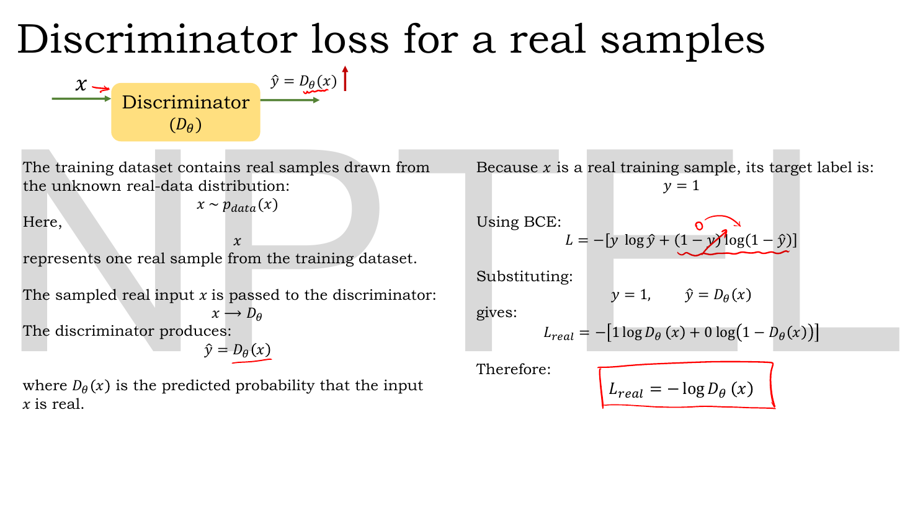
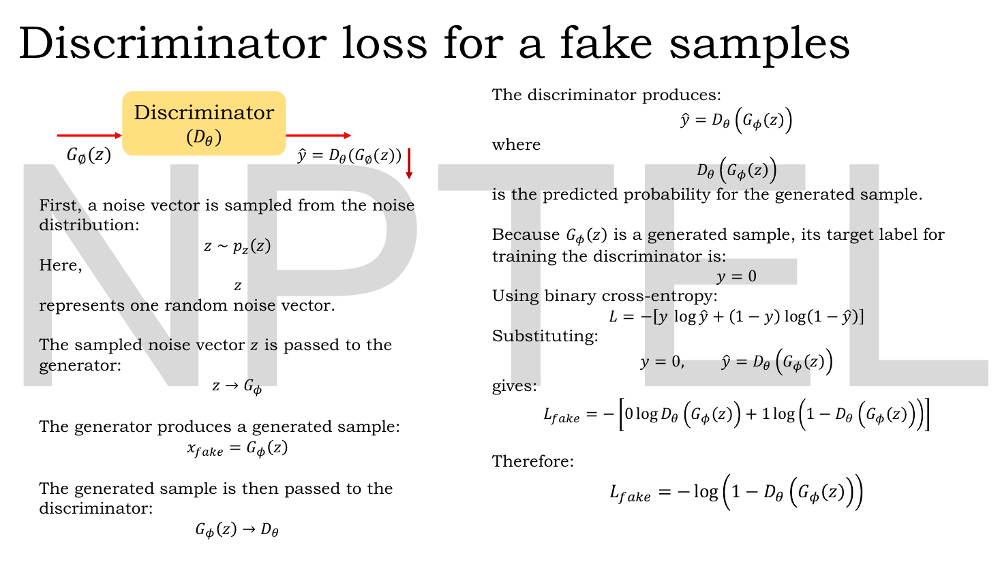
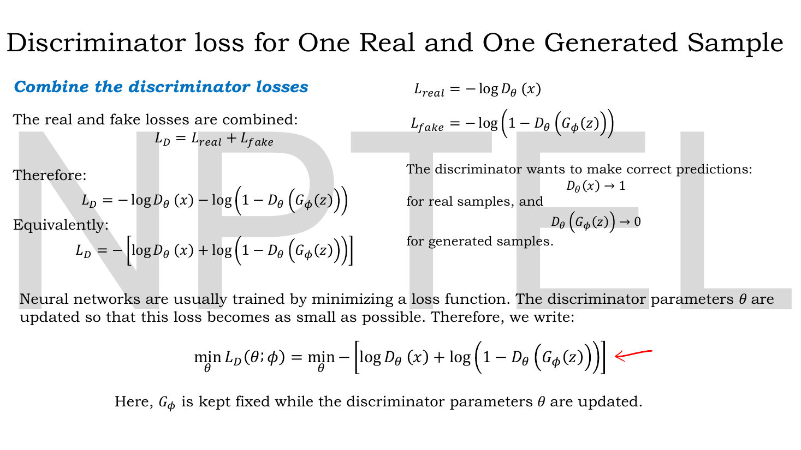
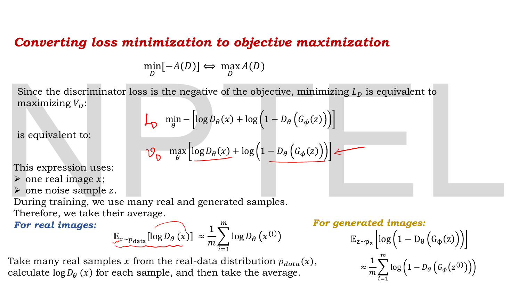
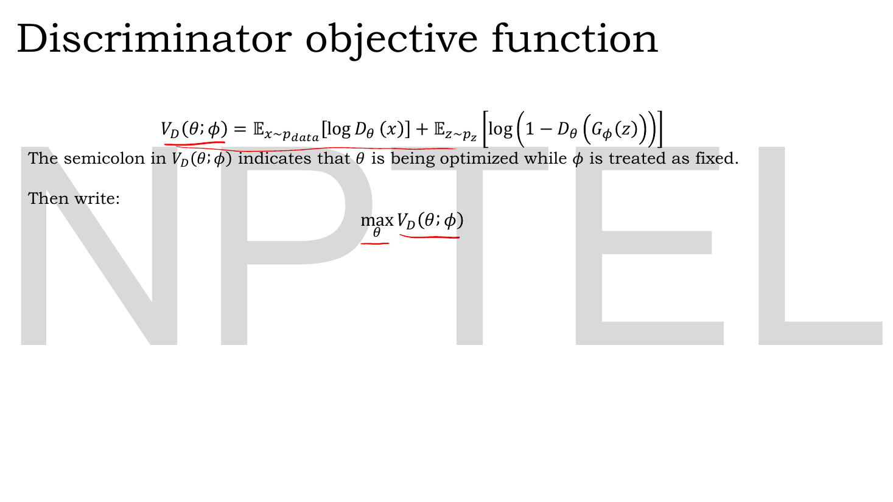
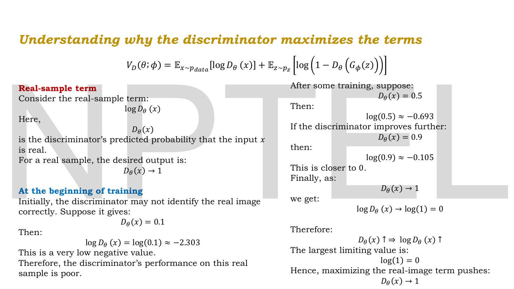
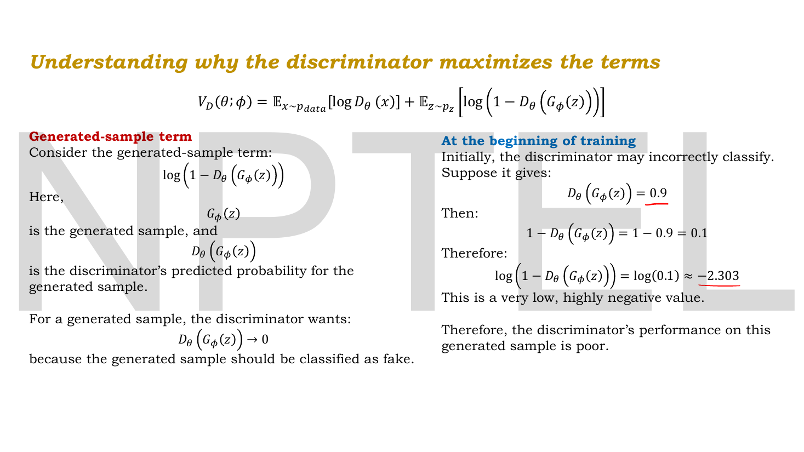
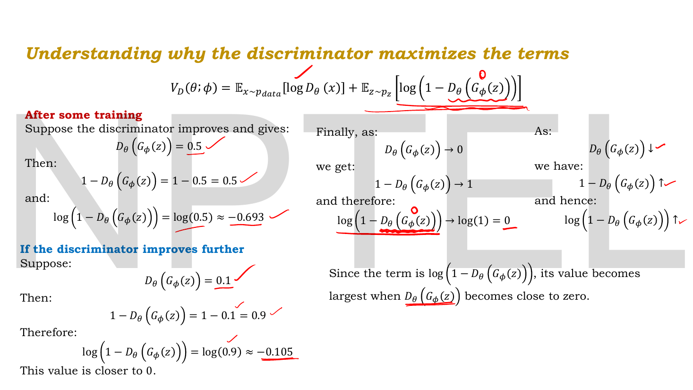
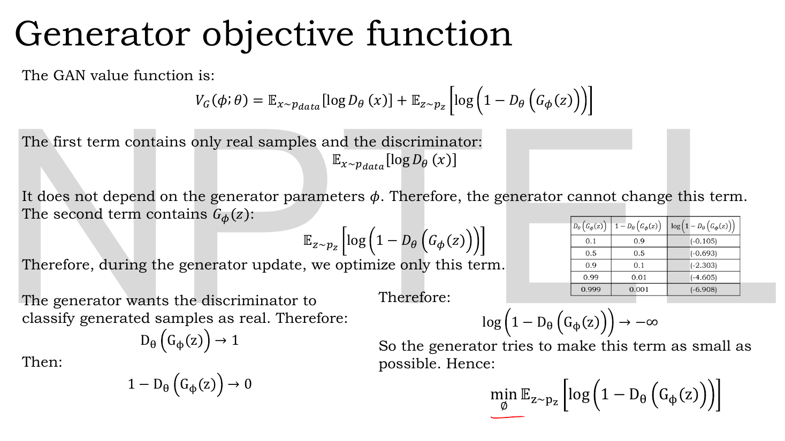
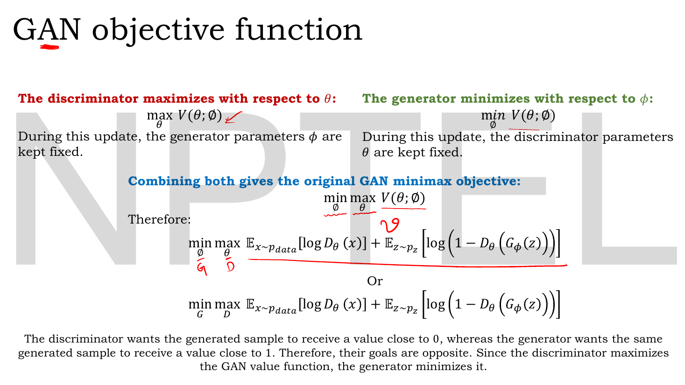

# Lec 33 — GAN Objective and Loss Functions

> **Source:** `Lec 33.pdf` (14 pages) · **Week 5** · **Playlist:** Lec 33
> **Prereqs:** [Lec 02 — Activation and Loss Functions](02-activations-and-losses.md), [Lec 11 — Reconstruction Loss (MSE, BCE)](11-reconstruction-loss.md), [Lec 32 — GAN Architecture](32-gan-architecture.md)
> **Feeds into:** [Lec 34 — GAN Convergence and Nash Equilibrium](34-gan-convergence.md), [Lec 38 — Conditional GAN](38-conditional-gan.md), [Lec 39 — Pix2Pix GAN](39-pix2pix.md), [Lec 40 — CycleGAN](40-cyclegan.md), [Lec 41 — StyleGAN](41-stylegan.md), [Lec 42 — StyleGAN 2](42-stylegan2.md)

## Why this lecture exists

[Lec 32](32-gan-architecture.md) gave you two networks and a training loop: a generator that turns noise into a sample, a discriminator that scores samples as real or fake, and an alternating schedule that updates one while the other is frozen. What it did not give you is the number each network is actually trying to move. "Fool the discriminator" is a slogan, not a gradient.

This lecture turns the slogan into one equation. It builds that equation the honest way — from binary cross-entropy on a single real sample, then a single fake sample, then both together, then averaged into expectations — and arrives at the minimax value function that the whole rest of the GAN arc modifies. [Lec 34](34-gan-convergence.md), [Lec 38](38-conditional-gan.md), [Lec 39](39-pix2pix.md), [Lec 40](40-cyclegan.md), [Lec 41](41-stylegan.md) and [Lec 42](42-stylegan2.md) all state *their own* loss and link back here for the base.

**This chapter owns the GAN objective for the whole book.**

## The ideas

### The one equation

Here it is first, in the form the exam will print it:

$$\boxed{\;\min_G \max_D V(D,G) = \mathbb{E}_{\mathbf{x}\sim p_{\text{data}}}\big[\log D(\mathbf{x})\big] + \mathbb{E}_{\mathbf{z}\sim p_{\mathbf{z}}}\big[\log\big(1 - D(G(\mathbf{z}))\big)\big]\;}$$

Before doing anything with it, **read it out loud**, piece by piece. Every symbol is doing a job and none of them is decoration.

| Piece | Says |
|---|---|
| $\mathbf{x}\sim p_{\text{data}}$ | draw a **real** sample from the training distribution |
| $D(\mathbf{x})$ | the discriminator's output on it: a number in $(0,1)$, read as "probability this is real" |
| $\log D(\mathbf{x})$ | the log of that number. It is $\le 0$, equal to $0$ only when $D(\mathbf{x}) = 1$ |
| $\mathbb{E}_{\mathbf{x}\sim p_{\text{data}}}[\cdot]$ | average it over many real samples |
| $\mathbf{z}\sim p_{\mathbf{z}}$ | draw a **noise** vector from the prior (in practice $\mathcal{N}(\mathbf{0},\mathbf{I})$ or $\mathcal{U}(-1,1)$) |
| $G(\mathbf{z})$ | push it through the generator — a **fake** sample |
| $D(G(\mathbf{z}))$ | the discriminator's "probability this is real" on that fake |
| $1 - D(G(\mathbf{z}))$ | the discriminator's "probability this is **fake**" |
| $\log(1-D(G(\mathbf{z})))$ | its log. Also $\le 0$, equal to $0$ only when $D(G(\mathbf{z})) = 0$ |
| $\mathbb{E}_{\mathbf{z}\sim p_{\mathbf{z}}}[\cdot]$ | average over many noise draws |
| $V(D,G)$ | the sum of the two averages — the **value function** of the game |
| $\max_D$ | $D$ picks its weights to make $V$ as **large** as possible |
| $\min_G$ | $G$ picks its weights to make $V$ as **small** as possible |

Both terms are logs of probabilities, so both are $\le 0$, so **$V \le 0$ always**. Its ceiling is $0$, hit only by a discriminator that is perfectly right about everything.

**What $\max_D$ wants.** $D$ can only push $V$ up by pushing both terms toward $0$. Term one goes to $0$ when $D(\mathbf{x}) \to 1$: *call real things real*. Term two goes to $0$ when $D(G(\mathbf{z})) \to 0$: *call fake things fake*. Maximising $V$ is therefore exactly "classify correctly", and nothing else.

**What $\min_G$ wants.** $G$ cannot touch the first term — no $G$ appears in it. The only thing $G$ controls is $D(G(\mathbf{z}))$, and it makes $V$ smaller by making $\log(1-D(G(\mathbf{z})))$ as negative as possible, i.e. by driving $D(G(\mathbf{z})) \to 1$: *make the discriminator call your fakes real*. As $D(G(\mathbf{z})) \to 1$ that term $\to -\infty$, so $G$'s half of the objective is unbounded below.

The two players want the identical quantity $D(G(\mathbf{z}))$ pushed in opposite directions — $D$ toward $0$, $G$ toward $1$. That direct conflict on one shared number is what makes this a **minimax** problem rather than two ordinary trainings running side by side.

> **Notation.** The deck writes the networks with their parameters attached: $D_\theta$ for the discriminator, $G_\phi$ for the generator, and $V(\theta;\phi)$ for the value function, "the semicolon indicating that $\theta$ is being optimized while $\phi$ is treated as fixed." That is a useful habit and I keep it when quoting the slides, but per CONTRACT §3 the book's standing symbols are plain $G$, $D$, $\mathbf{z}$, $p_{\text{data}}$ and $p_g$. The deck's final slide writes both forms side by side, $\min_\phi\max_\theta$ and $\min_G\max_D$, and annotates $\phi \to G$, $\theta \to D$ in the lecturer's own hand — so both are fair game in an exam.

### It is binary cross-entropy, twice

Now where that equation comes from. The deck builds it from the bottom up, and the construction is worth following line by line because it demystifies the whole thing: **there is no new loss function in a GAN.** It is [Lec 02](02-activations-and-losses.md)'s binary cross-entropy, applied twice with different labels.

Recall BCE for one sample with true label $y$ and predicted probability $\hat y$ — the same formula [Lec 11](11-reconstruction-loss.md) used per pixel for a binary autoencoder:

$$\mathcal{L} = -\big[y\log\hat y + (1-y)\log(1-\hat y)\big]$$

Two terms, of which exactly one is ever live, because $y$ is $0$ or $1$. That switch is the whole trick.


*Fig. — The real branch. Set $y=1$ and the $(1-y)$ term dies — the lecturer has circled the surviving 0 in red. What is left, boxed, is $\mathcal{L}_{\text{real}} = -\log D(\mathbf{x})$. Page 3.*

**Real samples carry label $y = 1$.** A real sample $\mathbf{x} \sim p_{\text{data}}$ goes into $D$, which emits $\hat y = D(\mathbf{x})$, "the predicted probability that the input $\mathbf{x}$ is real". Substituting $y=1$:

$$\mathcal{L}_{\text{real}} = -\big[1\cdot\log D(\mathbf{x}) + 0\cdot\log(1-D(\mathbf{x}))\big] = -\log D(\mathbf{x})$$


*Fig. — The fake branch. Same formula, label flipped to $y=0$, so now the **first** term dies and $\mathcal{L}_{\text{fake}} = -\log(1 - D(G(\mathbf{z})))$. Note the full chain on the left: $\mathbf{z}\sim p_{\mathbf{z}} \to G \to \mathbf{x}_{\text{fake}} \to D$. Page 4.*

**Fake samples carry label $y = 0$.** Draw $\mathbf{z} \sim p_{\mathbf{z}}$, push it through $G$ to get $\mathbf{x}_{\text{fake}} = G(\mathbf{z})$, push *that* through $D$ to get $\hat y = D(G(\mathbf{z}))$. Substituting $y = 0$:

$$\mathcal{L}_{\text{fake}} = -\big[0\cdot\log D(G(\mathbf{z})) + 1\cdot\log(1 - D(G(\mathbf{z})))\big] = -\log\big(1 - D(G(\mathbf{z}))\big)$$

That is the entire derivation. **Real labelled 1, fake labelled 0, ordinary BCE, nothing else.** A GAN discriminator is a two-class classifier trained the way you would train any two-class classifier; the only unusual thing is where half its training data comes from.


*Fig. — Addition, then a sign. The two per-sample losses are summed into $\mathcal{L}_D$, the bracketed form is pulled out, and the last line writes it as a minimisation over $\theta$ with the red arrow pointing at the result. The closing sentence is the one to hold on to: "$G_\phi$ is kept fixed while the discriminator parameters $\theta$ are updated." Page 5.*

### Combining the two branches

A discriminator update sees one real sample *and* one fake sample, so its loss is the sum:

$$\mathcal{L}_D = \mathcal{L}_{\text{real}} + \mathcal{L}_{\text{fake}} = -\log D(\mathbf{x}) - \log\big(1-D(G(\mathbf{z}))\big)$$

or, factoring the minus out,

$$\mathcal{L}_D = -\Big[\log D(\mathbf{x}) + \log\big(1-D(G(\mathbf{z}))\big)\Big]$$

Networks are trained by *minimising* a loss, so the discriminator step is

$$\min_\theta \mathcal{L}_D(\theta;\phi) = \min_\theta -\Big[\log D_\theta(\mathbf{x}) + \log\big(1-D_\theta(G_\phi(\mathbf{z}))\big)\Big]$$

with $G_\phi$ frozen. The deck restates what $D$ is after in plain words: $D(\mathbf{x}) \to 1$ for real samples, $D(G(\mathbf{z})) \to 0$ for generated ones.

### From "minimise a loss" to "maximise a value"


*Fig. — Two moves on one slide. Top: dropping the minus sign turns the minimisation into a maximisation, with the lecturer writing $\mathcal{L}_D$ beside the first line and $V_D$ beside the second. Bottom: one sample becomes many, and the batch mean $\frac1m\sum$ is written as the expectation $\mathbb{E}$. Both arrows in red. Page 6.*

The deck's pivot is a one-line identity:

$$\min_D\big[-A(D)\big] \iff \max_D A(D)$$

Minimising the negative of something is the same optimisation problem as maximising the thing. (Same argmax; the optimal *values* differ by a sign — see the trap list.) So the discriminator's step can equally be written

$$\max_\theta \Big[\log D_\theta(\mathbf{x}) + \log\big(1-D_\theta(G_\phi(\mathbf{z}))\big)\Big]$$

and the bracket — the thing being maximised rather than the loss being minimised — is the **value function**.

The second move is averaging. Everything so far used one real image and one noise sample. Real training uses a minibatch of $m$ of each, so take the mean, and write the mean as an expectation:

$$\mathbb{E}_{\mathbf{x}\sim p_{\text{data}}}\big[\log D(\mathbf{x})\big] \;\approx\; \frac{1}{m}\sum_{i=1}^{m}\log D\big(\mathbf{x}^{(i)}\big)$$

$$\mathbb{E}_{\mathbf{z}\sim p_{\mathbf{z}}}\Big[\log\big(1-D(G(\mathbf{z}))\big)\Big] \;\approx\; \frac{1}{m}\sum_{i=1}^{m}\log\Big(1-D\big(G(\mathbf{z}^{(i)})\big)\Big)$$

The $\approx$ is doing real work and is worth naming: the expectation is over the *true* distributions, which you never have; the minibatch mean is a **Monte Carlo estimate** of it, unbiased but noisy. Every GAN gradient you ever compute is this approximation.


*Fig. — The discriminator's half, named. Note the semicolon convention: in $V_D(\theta;\phi)$, $\theta$ is being optimised and $\phi$ is held fixed. The lecturer has underlined $\max_\theta V_D(\theta;\phi)$. Page 7.*

$$V_D(\theta;\phi) = \mathbb{E}_{\mathbf{x}\sim p_{\text{data}}}\big[\log D_\theta(\mathbf{x})\big] + \mathbb{E}_{\mathbf{z}\sim p_{\mathbf{z}}}\Big[\log\big(1-D_\theta(G_\phi(\mathbf{z}))\big)\Big], \qquad \max_\theta V_D(\theta;\phi)$$

### Reading the two terms as thermometers

The deck spends three slides on why maximising each term does what you want, entirely through arithmetic. It is the most exam-predictive material in the lecture, because every number on those slides is a one-line natural-log evaluation an MCQ can key on.


*Fig. — The real-sample term as a thermometer. Read the four values down the page: a discriminator that gives a real image $0.1$ scores $-2.303$; at $0.5$ it scores $-0.693$; at $0.9$, $-0.105$; in the limit $D(\mathbf{x})\to1$ it scores exactly $0$. **The largest possible value of this term is $\log 1 = 0$** — so maximising it pushes $D(\mathbf{x})\to1$. Page 8.*

| $D(\mathbf{x})$ | $\log D(\mathbf{x})$ | reading |
|---|---|---|
| $0.1$ | $-2.303$ | badly wrong on a real image |
| $0.5$ | $-0.693$ | no opinion |
| $0.9$ | $-0.105$ | nearly right |
| $\to 1$ | $\to 0$ | the ceiling |


*Fig. — The fake-sample term at the start of training, when $D$ is still bad: it calls a fake image real with probability $0.9$, so $1-D(G(\mathbf{z})) = 0.1$ and the term is $-2.303$ — "a very low, highly negative value". Page 9.*


*Fig. — The same term as $D$ learns. Every tick is the lecturer checking an arithmetic step. The right-hand column states the rule in general: as $D(G(\mathbf{z}))\downarrow$, $1-D(G(\mathbf{z}))\uparrow$, so $\log(1-D(G(\mathbf{z})))\uparrow$. The closing sentence — "its value becomes largest when $D(G(\mathbf{z}))$ becomes close to zero" — is the whole point. Page 10.*

| $D(G(\mathbf{z}))$ | $1-D(G(\mathbf{z}))$ | $\log(1-D(G(\mathbf{z})))$ | reading |
|---|---|---|---|
| $0.9$ | $0.1$ | $-2.303$ | fooled |
| $0.5$ | $0.5$ | $-0.693$ | no opinion |
| $0.1$ | $0.9$ | $-0.105$ | not fooled |
| $\to 0$ | $\to 1$ | $\to 0$ | the ceiling |

Both terms are maximised at $0$, and both reach $0$ only when $D$ is perfectly, confidently right. So $\max_D V$ is a complicated way of writing "train a good classifier".

### The generator's half


*Fig. — The generator's slide. The argument on the left: the first term "does not depend on the generator parameters $\phi$. Therefore, the generator cannot change this term." The small table on the right is the lecture's densest numerical object — five rows running $D(G(\mathbf{z}))$ from $0.1$ up to $0.999$ and watching $\log(1-D(G(\mathbf{z})))$ fall from $-0.105$ to $-6.908$. Page 11.*

Two observations and the generator's objective falls out.

**The first term is a constant as far as $G$ is concerned.** $\mathbb{E}_{p_{\text{data}}}[\log D(\mathbf{x})]$ contains real data and the discriminator and nothing else. Differentiate it with respect to $\phi$ and you get exactly zero. So during a generator update only the second term matters.

**The generator wants $D(G(\mathbf{z})) \to 1$.** It wants its fakes called real. Then $1-D(G(\mathbf{z})) \to 0$ and $\log(1-D(G(\mathbf{z}))) \to -\infty$. Since smaller is what $G$ is chasing:

$$\min_\phi\; \mathbb{E}_{\mathbf{z}\sim p_{\mathbf{z}}}\Big[\log\big(1-D_\theta(G_\phi(\mathbf{z}))\big)\Big]$$

The deck's table makes the $-\infty$ concrete. Reproduced exactly as printed:

| $D(G(\mathbf{z}))$ | $1 - D(G(\mathbf{z}))$ | $\log(1-D(G(\mathbf{z})))$ |
|---|---|---|
| $0.1$ | $0.9$ | $-0.105$ |
| $0.5$ | $0.5$ | $-0.693$ |
| $0.9$ | $0.1$ | $-2.303$ |
| $0.99$ | $0.01$ | $-4.605$ |
| $0.999$ | $0.001$ | $-6.908$ |

All five are correct natural logarithms (verified in N3). Notice the shape: going from $0.9$ to $0.99$ costs another $2.3$, and $0.99$ to $0.999$ another $2.3$. Each extra nine of confidence is worth a fixed $\log 10 = 2.303$ — this term is linear in the number of nines, which is exactly why it diverges so slowly and why it has no floor.

### The full minimax


*Fig. — The destination. Two half-problems on one value function become one two-player problem. The lecturer has written $G$ under $\min_\phi$ and $D$ under $\max_\theta$ in red, which is the translation to the form every textbook prints. The closing sentence names the conflict: the discriminator wants a generated sample scored near $0$, the generator wants the **same** sample scored near $1$. Page 12.*

Put the halves together. $D$ maximises over $\theta$ with $\phi$ frozen; $G$ minimises over $\phi$ with $\theta$ frozen; one shared $V$:

$$\min_\phi \max_\theta V(\theta;\phi) \qquad\text{or}\qquad \min_G\max_D\; \mathbb{E}_{\mathbf{x}\sim p_{\text{data}}}\big[\log D(\mathbf{x})\big] + \mathbb{E}_{\mathbf{z}\sim p_{\mathbf{z}}}\big[\log(1-D(G(\mathbf{z})))\big]$$

**Order matters in the notation but not in the implementation.** Written strictly, $\min_G\max_D$ means "for each $G$, let $D$ be fully optimised, then pick the $G$ that minimises the resulting value" — an inner maximisation nested inside an outer minimisation. Nobody does that; you cannot afford to retrain $D$ to convergence inside every generator step. In practice you alternate single gradient steps, which is a *heuristic* for the nested problem, not the nested problem itself. [Lec 34](34-gan-convergence.md) is about what that substitution costs you.

Three values of $V$ worth memorising, because they bracket the whole game:

| Situation | $V$ |
|---|---|
| $D$ perfect ($D(\mathbf{x})=1$, $D(G(\mathbf{z}))=0$) | $0$ — the maximum $V$ can ever take |
| $D$ at $0.5$ on everything (convergence) | $\log\tfrac12 + \log\tfrac12 = -\log 4 = -1.3863$ nats |
| $D$ completely fooled ($D(G(\mathbf{z}))\to1$) | $\to -\infty$ |

That middle row is the global optimum of the minimax problem, and [Lec 34](34-gan-convergence.md) proves it.

### Why the generator loss saturates, and what to use instead

**This is the single most likely exam question in the lecture and the deck does not mention it at all.** Everything in this subsection is owned content.

The problem is with $\min_G \log(1-D(G(\mathbf{z})))$ at the moment it is needed most: the *start* of training, when $G$ is terrible and $D$ confidently calls every fake a fake, so $D(G(\mathbf{z})) \approx 0$.

**Where the gradient actually comes from.** $D$ is a classifier, so its last layer is a sigmoid ([Lec 02](02-activations-and-losses.md) — sigmoid is the GAN discriminator's output activation). Write $a$ for the discriminator's pre-activation score (its **logit**) on the fake sample, so $D(G(\mathbf{z})) = \sigma(a)$. Backprop into $G$'s weights goes through $a$, so the gradient that matters is $\partial/\partial a$. Use $\sigma'(a) = \sigma(a)(1-\sigma(a))$ and write $D$ for $\sigma(a)$:

**Saturating (minimax) loss**, the one on the slide:

$$\frac{\partial}{\partial a}\log\big(1-\sigma(a)\big) = \frac{-\sigma'(a)}{1-\sigma(a)} = \frac{-\sigma(a)\,(1-\sigma(a))}{1-\sigma(a)} = -\sigma(a) = -D(G(\mathbf{z}))$$

**Non-saturating loss**, maximise $\log D(G(\mathbf{z}))$ — equivalently minimise $-\log\sigma(a)$:

$$\frac{\partial}{\partial a}\Big[-\log \sigma(a)\Big] = \frac{-\sigma'(a)}{\sigma(a)} = \frac{-\sigma(a)(1-\sigma(a))}{\sigma(a)} = -\big(1-\sigma(a)\big) = D(G(\mathbf{z})) - 1$$

Now read both at $D(G(\mathbf{z})) \to 0$, which is where training starts:

- saturating gradient magnitude $= D(G(\mathbf{z})) \to \mathbf{0}$
- non-saturating gradient magnitude $= 1 - D(G(\mathbf{z})) \to \mathbf{1}$

**The saturating loss hands the generator a gradient of zero exactly when the generator is at its worst.** That is the pathology, stated precisely. The ratio of the two gradient magnitudes is

$$\frac{1 - D(G(\mathbf{z}))}{D(G(\mathbf{z}))}$$

which is $99$ at $D(G(\mathbf{z}))=0.01$ and $999$ at $0.001$. At $D(G(\mathbf{z}))=0.5$ the ratio is exactly $1$ — the two losses give identical gradients — and for $D(G(\mathbf{z})) > 0.5$ the saturating loss is actually the *stronger* of the two. The fix only matters on the side of the game where you are losing, which is the side you start on.

**The two curves**, plotted against $D(G(\mathbf{z}))$ on the horizontal axis. Both are quantities $G$ minimises:

```
  3.0 |                                                          
  2.6 |   nn                        n = non-saturating,  -log D(G(z))
  2.3 |     nn                      s = saturating,   log(1 - D(G(z)))
  1.9 |       nnn                                                
  1.6 |          nnnn                                            
  1.2 |              nnnnnn                                      
  0.9 |                    nnnnnnnnn                             
  0.5 |                             nnnnnnnnnnnn                 
  0.2 |                                         nnnnnnnnnnnnnnnnn
 -0.2 |sssssssssssssssss                                         
 -0.5 |                 ssssssssssss                             
 -0.9 |                             sssssssss                    
 -1.2 |                                      ssssss              
 -1.6 |                                            ssss          
 -1.9 |                                                sss       
 -2.3 |                                                   ss     
 -2.6 |                                                     ss   
      +----------------------------------------------------------
       0  <-- G is losing here      D(G(z))      G is winning --> 1
```

Look at the left-hand edge, where training begins. The `s` curve is almost flat there — $\log(1-D) \approx -D$ for small $D$, a nearly horizontal line hugging zero, so there is nothing for an optimiser to descend. The `n` curve is climbing steeply off the top of the plot — $-\log D \to \infty$ as $D\to0$ — so it has a huge gradient precisely there. Now look at the right-hand edge, where $G$ is already winning: the roles reverse, `s` plunges steeply and `n` flattens out. The saturating loss puts its effort where it is not needed.

**The non-saturating generator loss**, then:

$$\boxed{\;\max_G\; \mathbb{E}_{\mathbf{z}\sim p_{\mathbf{z}}}\big[\log D(G(\mathbf{z}))\big] \quad\Longleftrightarrow\quad \min_G\; \mathbb{E}_{\mathbf{z}\sim p_{\mathbf{z}}}\big[-\log D(G(\mathbf{z}))\big]\;}$$

**And notice what it is.** $-\log D(G(\mathbf{z}))$ is BCE on a fake sample with the label set to $y = \mathbf{1}$. The generator trains on its own fakes *lying about the label* — telling the loss function "these are real" and letting the error signal that produces push its weights. That is why every GAN implementation you will ever read has a line like `loss_G = bce(D(fake), ones_like(...))`. It is not a different kind of loss; it is the same BCE with the label flipped.

| | Saturating / minimax | Non-saturating / heuristic |
|---|---|---|
| Generator optimises | $\min_G \log(1-D(G(\mathbf{z})))$ | $\max_G \log D(G(\mathbf{z}))$ |
| As a BCE | fake labelled $0$, sign flipped | fake labelled $\mathbf{1}$ |
| $\partial/\partial a$ magnitude | $D(G(\mathbf{z}))$ | $1 - D(G(\mathbf{z}))$ |
| Gradient when $G$ is bad ($D\!\to\!0$) | $\to 0$ — **vanishes** | $\to 1$ — strong |
| Gradient when $G$ is good ($D\!\to\!1$) | $\to 1$ — strong | $\to 0$ — vanishes |
| On the slides? | yes, pages 11–12 | **no** |
| Used in practice? | essentially never | always |
| Same optimum? | yes, $p_g = p_{\text{data}}$ | yes |
| Same objective? | **no** — only the minimax form is the Jensen–Shannon one ([Lec 34](34-gan-convergence.md)) | |

That last row is the subtle bit and it is worth one sentence. The two losses have the same fixed point but are not the same function, so the clean theory — the $-\log 4$ optimum, the Jensen–Shannon reading — is proved for the *saturating* form while the *non-saturating* form is what you run. The gap between the GAN you can analyse and the GAN you can train is a real one, and it opens right here.

### Who is frozen when

The objective is one equation but it is optimised in two alternating halves. [Lec 32](32-gan-architecture.md) owns the loop; this is just the loss bookkeeping that goes with it.

| | Discriminator step | Generator step |
|---|---|---|
| Updating | $\theta$ (i.e. $D$) | $\phi$ (i.e. $G$) |
| Frozen | $\phi$ | $\theta$ |
| Direction | **maximise** $V$ (or minimise $\mathcal{L}_D$) | **minimise** $V$ (or minimise $-\log D(G(\mathbf{z}))$) |
| Needs real data? | yes, for the first term | no — the first term is constant in $\phi$ |
| Gradient flows through $G$? | no (fakes are detached) | yes, back through $D$ and then into $G$ |

One practical consequence worth stating because it bites everyone: during the generator step the gradient still has to *travel through* the discriminator to reach $G$, even though $D$'s weights are not updated. $D$ is a frozen conduit, not an absent one. If you detach the fake samples during the generator step — the thing you correctly do during the *discriminator* step — the generator receives no gradient at all and silently never trains.

## Worked numericals

The slides contain **three** blocks of worked arithmetic — page 8 (the real-sample term), pages 9–10 (the generated-sample term), and page 11's five-row table — totalling fourteen individually computed values. All fourteen are reproduced below and all fourteen are correct. Every logarithm in this chapter is a **natural logarithm**, which matches the deck.

### N1. The deck's real-sample term, every value checked

**Given:** the real-sample term $\log D(\mathbf{x})$, evaluated at the four discriminator outputs on page 8.
**Find:** each value in nats, and the direction maximisation pushes.

1. $D(\mathbf{x}) = 0.1$: $\ \ln 0.1 = -2.302585$. Slide prints $\approx -2.303$. ✓
2. $D(\mathbf{x}) = 0.5$: $\ \ln 0.5 = -0.693147$. Slide prints $\approx -0.693$. ✓
3. $D(\mathbf{x}) = 0.9$: $\ \ln 0.9 = -0.105361$. Slide prints $\approx -0.105$. ✓
4. $D(\mathbf{x}) \to 1$: $\ \ln 1 = 0$ exactly. Slide prints $0$. ✓

The sequence $-2.303 \to -0.693 \to -0.105 \to 0$ is monotonically increasing, so maximising $\log D(\mathbf{x})$ drives $D(\mathbf{x}) \to 1$.

**Answer:** $-2.303$, $-0.693$, $-0.105$, $0$ nats. All four match the slide. The term's maximum is $0$, attained only in the limit $D(\mathbf{x}) = 1$.

### N2. The deck's generated-sample term, every value checked

**Given:** the generated-sample term $\log(1-D(G(\mathbf{z})))$ at the four values on pages 9 and 10.
**Find:** each value, via the intermediate $1-D(G(\mathbf{z}))$.

| $D(G(\mathbf{z}))$ | $1 - D(G(\mathbf{z}))$ | $\ln(1-D(G(\mathbf{z})))$ | slide | match |
|---|---|---|---|---|
| $0.9$ | $0.1$ | $-2.302585$ | $-2.303$ | ✓ |
| $0.5$ | $0.5$ | $-0.693147$ | $-0.693$ | ✓ |
| $0.1$ | $0.9$ | $-0.105361$ | $-0.105$ | ✓ |
| $\to 0$ | $\to 1$ | $0$ | $\log 1 = 0$ | ✓ |

**Answer:** all four match. Mirror-image of N1: here the term rises toward $0$ as $D(G(\mathbf{z}))$ **falls**, so maximising it drives $D(G(\mathbf{z})) \to 0$. The two terms want opposite things from $D$'s output *because they are fed opposite inputs* — the same "be right" instruction in both cases.

### N3. The deck's page-11 table, and the non-saturating loss beside it

This is the assignment's side-by-side. The first three columns are the deck's table, verified; the rest is owned.

**Given:** $D(G(\mathbf{z}))$ at the deck's five values, plus $0.3$ added for the mid-range.
**Find:** the saturating generator term, the non-saturating generator loss, and both gradients with respect to the discriminator's logit $a$.

Recall from *The ideas*: $\big|\partial_a \log(1-\sigma(a))\big| = D(G(\mathbf{z}))$ and $\big|\partial_a(-\log\sigma(a))\big| = 1-D(G(\mathbf{z}))$.

| $D(G(\mathbf{z}))$ | $1-D$ | **sat** $\log(1-D)$ | slide | **non-sat** $-\log D$ | $\lvert g_{\text{sat}}\rvert$ | $\lvert g_{\text{ns}}\rvert$ | ratio |
|---|---|---|---|---|---|---|---|
| $0.001$ | $0.999$ | $-0.001001$ | — | $6.907755$ | $0.001$ | $0.999$ | $999.0$ |
| $0.01$ | $0.99$ | $-0.010050$ | — | $4.605170$ | $0.010$ | $0.990$ | $99.0$ |
| $0.1$ | $0.9$ | $-0.105361$ | $-0.105$ ✓ | $2.302585$ | $0.100$ | $0.900$ | $9.0$ |
| $0.3$ | $0.7$ | $-0.356675$ | — | $1.203973$ | $0.300$ | $0.700$ | $2.333$ |
| $0.5$ | $0.5$ | $-0.693147$ | $-0.693$ ✓ | $0.693147$ | $0.500$ | $0.500$ | $1.000$ |
| $0.9$ | $0.1$ | $-2.302585$ | $-2.303$ ✓ | $0.105361$ | $0.900$ | $0.100$ | $0.111$ |
| $0.99$ | $0.01$ | $-4.605170$ | $-4.605$ ✓ | $0.010050$ | $0.990$ | $0.010$ | $0.010$ |
| $0.999$ | $0.001$ | $-6.907755$ | $-6.908$ ✓ | $0.001001$ | $0.999$ | $0.001$ | $0.001$ |

**Answer:** all five slide values are correct to three decimals. The ratio column is the examinable part: at $D(G(\mathbf{z}))=0.01$ — an ordinary state at the start of training — the non-saturating loss delivers a gradient **99 times larger** than the minimax loss. The crossover is exactly at $D(G(\mathbf{z})) = 0.5$, where the ratio is $1$.

Notice also the diagonal symmetry: the saturating column read downward is the non-saturating column read upward, negated. $\log(1-D)$ at $D$ equals $-(-\log D')$ at $D' = 1-D$. The two losses are reflections of each other about $D = 0.5$.

### N4. One real sample and one fake sample, all four quantities

**Given:** a discriminator that outputs $D(\mathbf{x}) = 0.85$ on a real image and $D(G(\mathbf{z})) = 0.30$ on a fake one.
**Find:** $\mathcal{L}_{\text{real}}$, $\mathcal{L}_{\text{fake}}$, $\mathcal{L}_D$, $V$, the saturating generator term and the non-saturating generator loss.

1. $\mathcal{L}_{\text{real}} = -\ln D(\mathbf{x}) = -\ln 0.85 = 0.162519$
2. $\mathcal{L}_{\text{fake}} = -\ln(1 - 0.30) = -\ln 0.70 = 0.356675$
3. $\mathcal{L}_D = 0.162519 + 0.356675 = 0.519194$
4. $V = -\mathcal{L}_D = -0.519194$ (the value function is always the negative of the discriminator loss)
5. Saturating generator term: $\ln(1 - 0.30) = \ln 0.70 = -0.356675$, which $G$ tries to make more negative
6. Non-saturating generator loss: $-\ln D(G(\mathbf{z})) = -\ln 0.30 = 1.203973$, which $G$ tries to make smaller

**Answer:** $\mathcal{L}_{\text{real}} = 0.1625$, $\mathcal{L}_{\text{fake}} = 0.3567$, $\mathcal{L}_D = 0.5192$, $V = -0.5192$, saturating term $= -0.3567$, non-saturating loss $= 1.2040$ — **all in nats**.

Two readings. The fake sample contributes more than twice the loss of the real one, so this discriminator is weaker at spotting fakes than at confirming reals — the gradient will mostly fix that. And the generator's two possible loss values, $-0.3567$ and $1.2040$, are not comparable in magnitude at all (they are not even the same sign); only their *gradients* are comparable, which is the entire reason the swap is legitimate.

### N5. A minibatch of four, as the expectations are really computed

**Given:** $m = 4$. Real-sample outputs $D(\mathbf{x}^{(i)}) = 0.9,\, 0.8,\, 0.7,\, 0.95$. Fake-sample outputs $D(G(\mathbf{z}^{(i)})) = 0.2,\, 0.3,\, 0.1,\, 0.25$.
**Find:** both Monte Carlo expectations, $V_D$, $\mathcal{L}_D$, and the generator's non-saturating loss.

1. Real term, $\frac14\sum\ln D(\mathbf{x}^{(i)})$. The four logs: $\ln 0.9 = -0.105361$, $\ln 0.8 = -0.223144$, $\ln 0.7 = -0.356675$, $\ln 0.95 = -0.051293$.
 Sum $= -0.736473$; divided by 4: $\ -0.184118$.
2. Fake term, $\frac14\sum\ln(1-D(G(\mathbf{z}^{(i)})))$. The arguments are $0.8,\,0.7,\,0.9,\,0.75$, giving $-0.223144$, $-0.356675$, $-0.105361$, $-0.287682$.
 Sum $= -0.972861$; divided by 4: $\ -0.243215$.
3. $V_D = -0.184118 + (-0.243215) = -0.427333$.
4. $\mathcal{L}_D = -V_D = 0.427333$.
5. Non-saturating generator loss, $\frac14\sum -\ln D(G(\mathbf{z}^{(i)}))$: $1.609438 + 1.203973 + 2.302585 + 1.386294 = 6.502290$; divided by 4: $1.625573$.

**Answer:** $\mathbb{E}[\log D(\mathbf{x})] \approx -0.1841$, $\mathbb{E}[\log(1-D(G(\mathbf{z})))] \approx -0.2432$, $V_D = -0.4273$, $\mathcal{L}_D = 0.4273$, generator non-saturating loss $= 1.6256$ — **all nats**.

Sanity check against the bracket: $V_D = -0.4273$ sits between $0$ (perfect $D$) and $-1.3863$ (useless $D$), closer to the perfect end, which is right for a discriminator that is reliably correct but not certain.

### N6. What the discriminator's loss would be at each of the three landmark states

**Given:** the three bracketing situations from *The ideas*.
**Find:** $V$ and $\mathcal{L}_D$ for each, in nats, bits and $\log_{10}$.

1. **Perfect $D$:** $D(\mathbf{x}) = 1$, $D(G(\mathbf{z})) = 0$. $V = \ln 1 + \ln 1 = 0 + 0 = 0$, so $\mathcal{L}_D = 0$. Base-independent: $0$ is $0$ in every base.
2. **Converged GAN:** $D = 0.5$ on everything. $V = \ln 0.5 + \ln 0.5 = -0.693147 - 0.693147 = -1.386294$, so $\mathcal{L}_D = +1.386294$.
 - in nats: $-\ln 4 = -1.3863$
 - in bits: $-\log_2 4 = -2$ exactly
 - in $\log_{10}$: $-\log_{10}4 = -0.6021$
3. **Fully fooled $D$:** $D(G(\mathbf{z})) \to 1$. Then $\ln(1 - D(G(\mathbf{z}))) \to -\infty$, so $V \to -\infty$ and $\mathcal{L}_D \to +\infty$.

**Answer:** $V \in (-\infty,\, 0]$, with the converged value $-\log 4 = \mathbf{-1.3863}$ **nats** ($= -2$ bits $= -0.6021$ in $\log_{10}$). Equivalently $\mathcal{L}_D$ ranges over $[0, \infty)$ with converged value $+1.3863$ nats.

> **State the base.** This course mixes bases across decks (errata batch 4), and $-\log 4$ is the number most likely to appear in an option list. If you see $-2$ as an option it is the same answer in **bits**; if you see $-0.602$ it is $\log_{10}$. The deck's own arithmetic on pages 8–11 is unambiguously natural log — $\log 0.1 \approx -2.303$ settles it, since $\log_{10} 0.1$ would be exactly $-1$.

## Code

The gradient argument in *The ideas* is the thing a reader is most likely to take on trust, so here it is computed. The script evaluates both generator losses and both of their gradients with respect to the discriminator's logit, across a sweep from "generator losing badly" to "generator winning".

```python
import numpy as np

def sigmoid(a): return 1.0 / (1.0 + np.exp(-a))

# The discriminator's raw score (logit) on a batch of FAKE samples.
# Very negative = D is confident the sample is fake = the generator is losing.
logits = np.array([-7.0, -4.6, -2.2, -0.85, 0.0, 2.2])
D = sigmoid(logits)                       # D(G(z))

sat    = np.log(1.0 - D)                  # minimax term:   G MINIMISES this
nonsat = -np.log(D)                       # heuristic loss: G MINIMISES this

# Gradients with respect to the discriminator's logit a -- the quantity
# backprop actually carries back into G's weights:
#   d/da [ log(1 - sigma(a)) ] = -sigma(a)     = -D
#   d/da [ -log sigma(a)     ] = -(1 - sigma(a)) = D - 1
g_sat    = -D
g_nonsat = D - 1.0

hdr = f"{'D(G(z))':>9}{'sat term':>10}{'nonsat L':>10}{'|g_sat|':>9}{'|g_ns|':>8}{'ratio':>9}"
print(hdr); print('-' * len(hdr))
for d, s, n, gs, gn in zip(D, sat, nonsat, g_sat, g_nonsat):
    print(f"{d:9.4f}{s:10.4f}{n:10.4f}{abs(gs):9.4f}{abs(gn):8.4f}{abs(gn)/abs(gs):9.2f}")

# The discriminator's own loss on one real + one fake sample
Dx, Dgz = 0.85, 0.30
print("\nL_real =", round(-np.log(Dx), 6),
      " L_fake =", round(-np.log(1 - Dgz), 6),
      " L_D =", round(-np.log(Dx) - np.log(1 - Dgz), 6))
print("V_D    =", round(np.log(Dx) + np.log(1 - Dgz), 6), "(always <= 0)")
```

```
  D(G(z))  sat term  nonsat L  |g_sat|  |g_ns|    ratio
-------------------------------------------------------
   0.0009   -0.0009    7.0009   0.0009  0.9991  1096.63
   0.0100   -0.0100    4.6100   0.0100  0.9900    99.48
   0.0998   -0.1051    2.3051   0.0998  0.9002     9.03
   0.2994   -0.3559    1.2059   0.2994  0.7006     2.34
   0.5000   -0.6931    0.6931   0.5000  0.5000     1.00
   0.9002   -2.3051    0.1051   0.9002  0.0998     0.11

L_real = 0.162519  L_fake = 0.356675  L_D = 0.519194
V_D    = -0.519194 (always <= 0)
```

Read the first row. The discriminator has given this fake a logit of $-7$, so it is $99.91\%$ sure the sample is fake. The minimax loss responds with a gradient of magnitude $0.0009$; the non-saturating loss responds with $0.9991$ — **a thousand times stronger on the identical sample**. That first row is what the start of GAN training looks like, and it is why nobody trains the published minimax form. Rows four to six show the effect reversing once the generator is doing well, which is exactly when you no longer need the help. The last two lines reproduce N4.

## Exam pack

### Must-memorise

| Item | Exactly this |
|---|---|
| **The GAN objective** | $\min_G\max_D V(D,G) = \mathbb{E}_{\mathbf{x}\sim p_{\text{data}}}[\log D(\mathbf{x})] + \mathbb{E}_{\mathbf{z}\sim p_{\mathbf{z}}}[\log(1-D(G(\mathbf{z})))]$ |
| Deck's parameterised form | $\min_\phi\max_\theta V(\theta;\phi)$, with $\theta \to D$, $\phi \to G$ |
| Per-sample BCE | $\mathcal{L} = -[y\log\hat y + (1-y)\log(1-\hat y)]$ |
| Real-sample loss | $\mathcal{L}_{\text{real}} = -\log D(\mathbf{x})$ — from $y=1$ |
| Fake-sample loss | $\mathcal{L}_{\text{fake}} = -\log(1-D(G(\mathbf{z})))$ — from $y=0$ |
| Discriminator loss | $\mathcal{L}_D = \mathcal{L}_{\text{real}} + \mathcal{L}_{\text{fake}} = -[\log D(\mathbf{x}) + \log(1-D(G(\mathbf{z})))]$ |
| Loss ↔ value | $V = -\mathcal{L}_D$; $\ \min_D[-A] \iff \max_D A$ |
| Discriminator step | $\max_\theta V_D(\theta;\phi)$, $\phi$ frozen |
| Generator step (minimax) | $\min_\phi \mathbb{E}_{\mathbf{z}}[\log(1-D(G(\mathbf{z})))]$, $\theta$ frozen |
| **Generator step (non-saturating)** | $\max_G \mathbb{E}_{\mathbf{z}}[\log D(G(\mathbf{z}))]$ — BCE with the fake labelled **1** |
| Saturating gradient (w.r.t. $D$'s logit) | magnitude $= D(G(\mathbf{z}))$ |
| Non-saturating gradient | magnitude $= 1 - D(G(\mathbf{z}))$ |
| What $\max_D$ wants | $D(\mathbf{x})\to1$ **and** $D(G(\mathbf{z}))\to0$ |
| What $\min_G$ wants | $D(G(\mathbf{z}))\to1$; the first term is constant in $\phi$ |
| Monte Carlo form | $\mathbb{E}_{p_{\text{data}}}[\log D(\mathbf{x})] \approx \frac1m\sum_{i=1}^m \log D(\mathbf{x}^{(i)})$ |

### Numbers worth knowing

| Quantity | Value |
|---|---|
| $\log 0.1$ | $-2.303$ nats (deck, pages 8–11) |
| $\log 0.5$ | $-0.693$ nats |
| $\log 0.9$ | $-0.105$ nats |
| $\log 0.01$ | $-4.605$ nats |
| $\log 0.001$ | $-6.908$ nats |
| Maximum possible $V$ | $0$, at a perfect discriminator |
| $V$ at convergence ($D \equiv \tfrac12$) | $-\log 4 = -1.3863$ nats $= -2$ bits $= -0.6021$ in $\log_{10}$ |
| Minimum possible $V$ | $-\infty$ |
| $\mathcal{L}_D$ range | $[0, +\infty)$; $1.3863$ nats at convergence |
| Gradient ratio non-sat : sat | $(1-D(G(\mathbf{z})))/D(G(\mathbf{z}))$ |
| … at $D(G(\mathbf{z})) = 0.01$ | $99\times$ |
| … at $D(G(\mathbf{z})) = 0.001$ | $999\times$ |
| … at $D(G(\mathbf{z})) = 0.5$ | $1\times$ — the crossover |
| Cost of one extra "nine" of generator confidence | a constant $\log 10 = 2.303$ |
| Label on real samples / on fakes (for $D$) | $1$ / $0$ |
| Label on fakes during the **generator** step | $1$ |

### Likely MCQ traps

- **Swapping $\min$ and $\max$.** It is $\min_G \max_D$ — the **discriminator maximises**, the **generator minimises**. A paraphrase that says "the generator maximises the value function" is wrong; the generator maximises $\log D(G(\mathbf{z}))$, which is a *different* expression (the non-saturating loss). Check which quantity, not just which word.
- **Thinking the generator optimises both terms.** $\mathbb{E}_{p_{\text{data}}}[\log D(\mathbf{x})]$ has no $\phi$ in it. Its derivative with respect to the generator's parameters is exactly zero. The generator sees only the second term.
- **Confusing $\mathcal{L}_D$ with $V$.** They differ by a sign: $V = -\mathcal{L}_D$. If a question gives $D(\mathbf{x}) = 0.85$ and $D(G(\mathbf{z})) = 0.30$ and asks for "the discriminator loss", the answer is $+0.5192$; if it asks for "the value function", $-0.5192$. Both will be in the options.
- **Reading $\min[-A] \iff \max A$ as "the values are equal".** The *argmax* is the same; the optimal values are negatives of each other. The deck's $\iff$ is between two optimisation problems, not two numbers.
- **"The generator's loss is $\log(1-D(G(\mathbf{z})))$, so maximising it fools $D$."** No — $G$ **minimises** that term. Driving $D(G(\mathbf{z}))\to1$ sends $\log(1-D(G(\mathbf{z})))\to-\infty$, which is minimising.
- **Getting the saturation backwards.** The minimax generator loss vanishes when the **generator is bad** ($D(G(\mathbf{z}))\to0$), not when it is good. "Gradient dies exactly when you most need it" is the memorable form.
- **Thinking the non-saturating loss is just the minimax loss with a sign flipped.** It is a different function: $-\log D$ versus $\log(1-D)$. They coincide in gradient only at $D = 0.5$.
- **Treating the two generator losses as having the same theory.** Only the saturating form gives the Jensen–Shannon / $-\log 4$ result ([Lec 34](34-gan-convergence.md)). They share a fixed point, not an objective.
- **$\theta$ and $\phi$ swap meaning between the VAE arc and the GAN arc.** In the VAE chapters $\theta$ was the *generative* decoder $p_\theta(\mathbf{x}\mid\mathbf{z})$ and $\phi$ the encoder $q_\phi(\mathbf{z}\mid\mathbf{x})$ ([Lec 21](21-vae-encoder.md)–[Lec 23](23-reparameterization.md)). Here it is the **opposite**: $\phi$ is the **generator**, $\theta$ is the **discriminator**. So the network that plays the generative role carries $\theta$ in one half of this course and $\phi$ in the other. Read the subscript off the deck in front of you, never from memory.
- **Log base.** The deck is natural log throughout: $\log 0.1 \approx -2.303$ proves it, since $\log_{10}0.1 = -1$ exactly. If your answer is off by a factor of $2.303$ you used base 10; off by a factor of $1.443$, base 2.
- **Forgetting $D$ outputs a probability, not a class.** $D(\mathbf{x}) \in (0,1)$ because the output layer is a sigmoid ([Lec 02](02-activations-and-losses.md)). A question that says "the discriminator outputs 1 for real" is describing the *target*, not the output.
- **Assuming the sum $\mathcal{L}_{\text{real}} + \mathcal{L}_{\text{fake}}$ should be averaged by 2.** The deck sums, and so does the standard formulation. Some implementations halve it; that only rescales the learning rate.
- **Confusing "the generator's label is 1" with "the generator relabels the training data".** Nothing in the dataset changes. Only the loss call during the generator step uses target $1$ on its own fakes.

### Self-test

1. Write the GAN value function and state, in one sentence each, what $\max_D$ and $\min_G$ are each trying to do to it.
2. Starting from BCE, derive $\mathcal{L}_{\text{real}}$ and $\mathcal{L}_{\text{fake}}$, naming the label used in each.
3. A discriminator outputs $D(\mathbf{x}) = 0.6$ on a real image and $D(G(\mathbf{z})) = 0.4$ on a fake. Compute $\mathcal{L}_{\text{real}}$, $\mathcal{L}_{\text{fake}}$, $\mathcal{L}_D$ and $V$, in nats.
4. Why can the generator ignore the term $\mathbb{E}_{\mathbf{x}\sim p_{\text{data}}}[\log D(\mathbf{x})]$ entirely?
5. Show that $\partial/\partial a\,\big[\log(1-\sigma(a))\big] = -\sigma(a)$, and explain in one sentence why that is a problem.
6. State the non-saturating generator loss and say what label it corresponds to in a BCE call.
7. At what value of $D(G(\mathbf{z}))$ do the saturating and non-saturating losses produce gradients of equal magnitude? What is the ratio at $D(G(\mathbf{z})) = 0.01$?
8. What is the largest value $V$ can take, and at what discriminator? What value does it take when $D$ outputs $0.5$ everywhere?
9. During a generator update, is the discriminator's gradient computed? Are its weights changed?
10. The deck's page-11 table shows $\log(1-D(G(\mathbf{z})))$ dropping by about $2.3$ each time $D(G(\mathbf{z}))$ gains a nine. Why exactly $2.3$?

<details><summary>Answers</summary>

1. $\min_G\max_D V(D,G) = \mathbb{E}_{\mathbf{x}\sim p_{\text{data}}}[\log D(\mathbf{x})] + \mathbb{E}_{\mathbf{z}\sim p_{\mathbf{z}}}[\log(1-D(G(\mathbf{z})))]$. $\max_D$: push both terms up toward their shared ceiling of $0$, i.e. make $D(\mathbf{x})\to1$ and $D(G(\mathbf{z}))\to0$ — classify correctly. $\min_G$: push the second term down toward $-\infty$ by making $D(G(\mathbf{z}))\to1$ — get its fakes misclassified as real.
2. BCE is $\mathcal{L} = -[y\log\hat y + (1-y)\log(1-\hat y)]$. Real sample: label $y=1$, $\hat y = D(\mathbf{x})$, the $(1-y)$ term vanishes, leaving $\mathcal{L}_{\text{real}} = -\log D(\mathbf{x})$. Fake sample: label $y=0$, $\hat y = D(G(\mathbf{z}))$, the $y$ term vanishes, leaving $\mathcal{L}_{\text{fake}} = -\log(1-D(G(\mathbf{z})))$.
3. $\mathcal{L}_{\text{real}} = -\ln 0.6 = 0.510826$. $\mathcal{L}_{\text{fake}} = -\ln(1-0.4) = -\ln 0.6 = 0.510826$. $\mathcal{L}_D = 1.021651$ nats. $V = -1.021651$ nats. (The two happen to be equal here because $1 - 0.4 = 0.6$; that symmetry is a common exam construction.)
4. Because no generator parameter $\phi$ appears anywhere in it — it involves only real data and the discriminator — so $\partial/\partial\phi$ of that term is identically zero. It is a constant during the generator step.
5. $\partial_a \log(1-\sigma(a)) = \dfrac{-\sigma'(a)}{1-\sigma(a)} = \dfrac{-\sigma(a)(1-\sigma(a))}{1-\sigma(a)} = -\sigma(a) = -D(G(\mathbf{z}))$. The problem: at the start of training $D$ confidently rejects fakes, so $D(G(\mathbf{z}))\approx0$, so the gradient is $\approx 0$ — the generator gets no learning signal exactly when it is worst.
6. $\max_G\mathbb{E}_{\mathbf{z}}[\log D(G(\mathbf{z}))]$, equivalently $\min_G\mathbb{E}_{\mathbf{z}}[-\log D(G(\mathbf{z}))]$. That is BCE on the fake samples with target label $y = 1$ — the generator tells the loss its fakes are real.
7. At $D(G(\mathbf{z})) = 0.5$, where $D = 1-D$. At $D(G(\mathbf{z})) = 0.01$ the ratio $(1-D)/D = 0.99/0.01 = 99$, so the non-saturating gradient is 99 times larger.
8. Maximum $V = 0$, at a perfect discriminator ($D(\mathbf{x})=1$ and $D(G(\mathbf{z}))=0$), since both terms are logs of probabilities and so cannot exceed $\log 1 = 0$. At $D \equiv 0.5$: $V = \ln 0.5 + \ln 0.5 = -\log 4 = -1.3863$ nats ($=-2$ bits).
9. The gradient **is** computed through the discriminator — it has to be, because that is the only path from the loss back to $G$'s weights — but the discriminator's weights are **not** updated. $D$ acts as a frozen conduit. (Detaching the fakes here, as you correctly do in the *discriminator* step, would leave $G$ with no gradient at all.)
10. Each extra nine divides $1 - D(G(\mathbf{z}))$ by exactly $10$, and $\log$ of a tenfold decrease is a fixed subtraction of $\ln 10 = 2.3026$ nats. The term is linear in the number of nines.

</details>

## Beyond the slides

**Gap: the deck never mentions the non-saturating generator loss.**
**Why it matters:** it teaches $\min_G\log(1-D(G(\mathbf{z})))$ as *the* generator objective, and that form has a gradient of magnitude $D(G(\mathbf{z}))$, which is near zero at initialisation. A reader following the deck literally would implement a GAN that cannot start training. Every real implementation — the original paper's own experiments included — maximises $\log D(G(\mathbf{z}))$ instead. The derivation, the two curves, the gradient table and the 99× number are all in *The ideas* and N3 because this is owned content and an all-but-guaranteed exam question.

**Gap: no statement of what the objective is optimal at.**
**Why it matters:** the whole lecture builds a quantity and never says what value it takes at the solution, or what the solution is. Both are in [Lec 34](34-gan-convergence.md): the optimal discriminator is $D^*(\mathbf{x}) = p_{\text{data}}(\mathbf{x})/(p_{\text{data}}(\mathbf{x})+p_g(\mathbf{x}))$, the optimum is $p_g = p_{\text{data}}$, and the value there is $-\log 4$. Reading this lecture alone leaves you able to compute the objective but unable to say what minimising it achieves. It is also where the link to [Lec 19](19-kl-divergence-a.md)'s divergences lives.

**Gap: the deck writes $V_G(\phi;\theta)$ on page 11 for the *whole* value function, including the term the generator cannot touch.**
**Why it matters:** a symbol subscripted $G$ that contains a term with no $G$ in it invites the mistake of thinking the generator optimises both halves. The slide then immediately corrects itself in prose ("the generator cannot change this term"), but the notation and the words disagree for a paragraph. Treat $V_D$, $V_G$ and $V$ on pages 7, 11 and 12 as three names for the *same* function $V(\theta;\phi)$; the subscript only records which argument is being moved.

**Gap: nothing about numerical stability, and the formulas as printed are the unstable ones.**
**Why it matters:** $\log D(\mathbf{x})$ with a saturated sigmoid gives $\log 0 = -\infty$ and a `nan` loss — the same failure [Lec 11](11-reconstruction-loss.md) flagged for autoencoder BCE, for the same reason. Real code never computes the sigmoid and then the log; it uses a fused log-sigmoid on the logits (`BCEWithLogitsLoss` in PyTorch, `from_logits=True` in Keras), which is both stable and gives exactly the $\partial/\partial a$ gradients derived above. If a GAN returns `nan` on step 1, this is why.

**Gap: no mention of one-sided label smoothing, which changes the objective slightly and is standard practice.**
**Why it matters:** replacing the real label $1$ with $0.9$ in the discriminator's BCE turns $\mathcal{L}_{\text{real}} = -\log D(\mathbf{x})$ into $-[0.9\log D(\mathbf{x}) + 0.1\log(1-D(\mathbf{x}))]$, which is minimised at $D(\mathbf{x}) = 0.9$ rather than $1$. This caps the discriminator's confidence, which keeps $\log D$ off its flat region and keeps gradients alive for the generator. It is "one-sided" because the fake label is left at $0$ — smoothing that one too would reward the generator for producing samples the discriminator is *unsure* about rather than confident about. It belongs to the same family of fixes as the non-saturating loss and shows up in [Lec 41](41-stylegan.md)-era training recipes.

## Cut from the slides

Pages 1, 2, 13 and 14 are the title, the three-bullet session overview, the "Next Session: GAN Convergence and Equilibrium" preview and the thank-you; none carries content. Everything on pages 3 through 12 is reproduced here, including all fourteen computed logarithm values and the five-row table on page 11, each independently verified (N1, N2, N3 — all fourteen matched). The lecturer's handwritten annotations are folded into the prose rather than described separately: the circled $0$ on page 3 marking the dying BCE term, the ticks beside every arithmetic line on page 10, the $\mathcal{L}_D$ and $V_D$ labels pencilled beside the two lines of page 6, the underlining of $\max_\theta V_D(\theta;\phi)$ on page 7, and the $G$ and $D$ written under $\min_\phi$ and $\max_\theta$ on page 12. The deck's parameter-subscripted notation $D_\theta$, $G_\phi$, $V(\theta;\phi)$ is kept wherever a slide is quoted and translated to the book's plain $D$, $G$, $V(D,G)$ elsewhere, per CONTRACT §3; both appear on page 12 itself, so both are exam-legal. Page 3's title reads "Discriminator loss for a real samples" — a typo, silently corrected. The training loop itself (how many $D$ steps per $G$ step, what order, batch construction) belongs to [Lec 32](32-gan-architecture.md) and is only summarised here as the freeze-table; the optimal discriminator, the $-\log 4$ optimum and the Jensen–Shannon reading belong to [Lec 34](34-gan-convergence.md) and are named but not derived.
