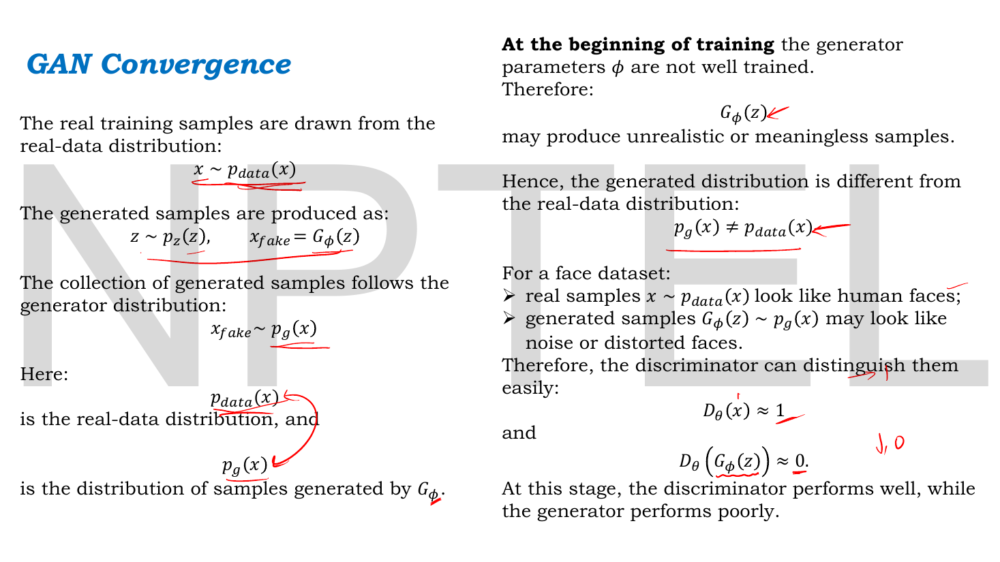
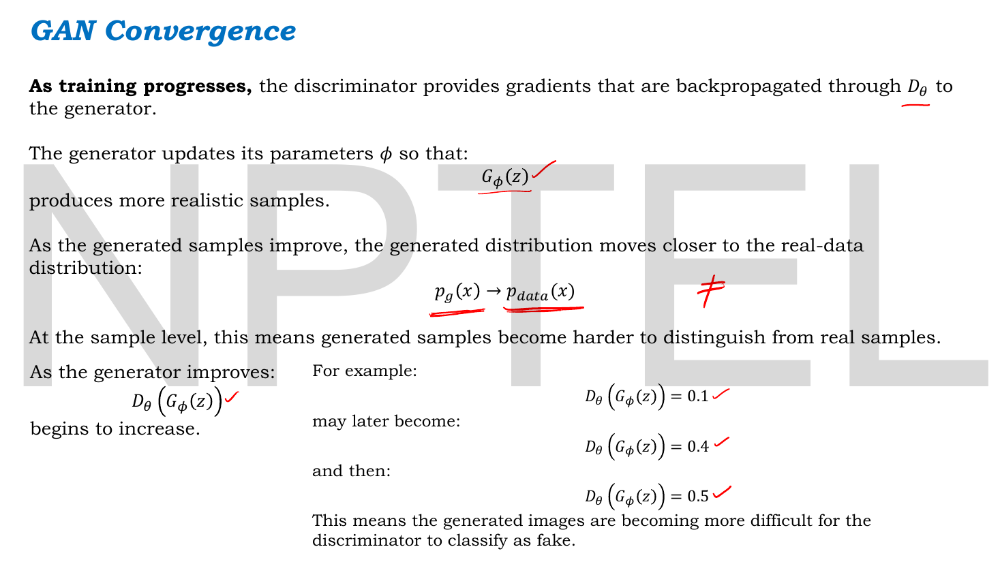
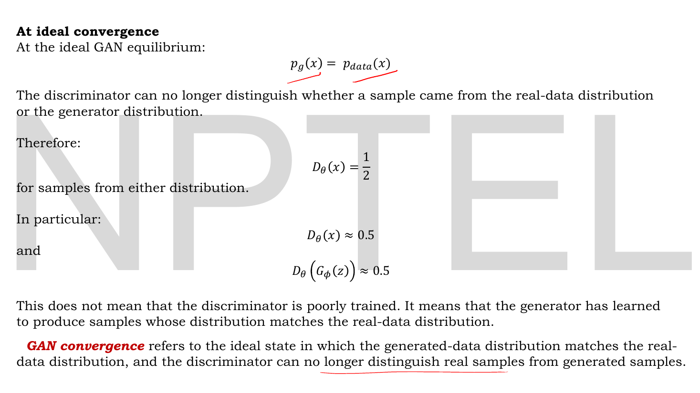
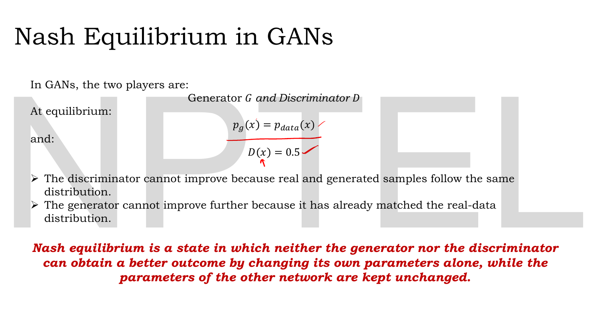

# Lec 34 — GAN Convergence and Nash Equilibrium

> **Source:** `Lec 34.pdf` (8 pages) · **Week 5** · **Playlist:** Lec 34
> **Prereqs:** [Lec 19 — KL Divergence, Part A](19-kl-divergence-a.md), [Lec 32 — GAN Architecture](32-gan-architecture.md), [Lec 33 — GAN Objective and Loss Functions](33-gan-objective.md)
> **Feeds into:** [Lec 38 — Conditional GAN](38-conditional-gan.md), [Lec 39 — Pix2Pix GAN](39-pix2pix.md), [Lec 40 — CycleGAN](40-cyclegan.md), [Lec 41 — StyleGAN](41-stylegan.md), [Lec 42 — StyleGAN 2](42-stylegan2.md)

## Why this lecture exists

[Lec 33](33-gan-objective.md) left you with a quantity to optimise and no idea what optimising it achieves. You can compute $V(D,G)$ for any pair of networks, but you cannot yet say which pair is the right answer, what value $V$ takes there, or whether gradient descent will ever find it.

This lecture answers all three, and the third answer is uncomfortable. The solution is $p_g = p_{\text{data}}$ with the discriminator reduced to coin-flipping at $D = \tfrac12$ everywhere. The value there is $-\log 4$. And the solution is a **saddle point** of a two-player game rather than the minimum of anything, which is why GAN training oscillates, why the loss curve tells you nothing, and why the generator can collapse onto a single output and stay there. This chapter owns the optimal discriminator, the Nash-equilibrium framing, **mode collapse** and **training instability** for the whole book.

## The ideas

### What "convergence" means for two networks


*Fig. — The two distributions, named. Real samples come from $p_{\text{data}}$; the collection of everything $G$ can output is itself a distribution, $p_g$. **Convergence is a statement about these two distributions, not about either network's weights.** The right column is the state at initialisation: $p_g \neq p_{\text{data}}$, so $D(\mathbf{x})\approx1$ and $D(G(\mathbf{z}))\approx0$ — the lecturer has written the arrows and the "0" in red. Page 3.*

Two distributions are in play, and the whole lecture is about the gap between them.

- $p_{\text{data}}(\mathbf{x})$ — the **real-data distribution**. Unknown, never written down; you only ever see samples from it (your training set).
- $p_g(\mathbf{x})$ — the **generator distribution**. Also never written down. It is what you get if you draw $\mathbf{z}\sim p_{\mathbf{z}}$ and report $G(\mathbf{z})$: the generator induces a distribution over outputs by pushing the noise prior through itself.

The deck's face-dataset example makes it concrete: real samples look like human faces; at the start, $G(\mathbf{z})$ looks like noise or distorted faces. So $p_g \neq p_{\text{data}}$, the two are easy to tell apart, and the discriminator does well — $D(\mathbf{x})\approx1$, $D(G(\mathbf{z}))\approx0$. "At this stage, the discriminator performs well, while the generator performs poorly."


*Fig. — The movement. The generator's only source of information is gradients routed **back through** the discriminator — the deck is explicit about this. As $G$ improves, $p_g$ moves toward $p_{\text{data}}$ and the discriminator's score on fakes climbs: $0.1 \to 0.4 \to 0.5$. Note where that sequence stops. It does not run on to $0.9$. Page 4.*

As training proceeds, the generator gets its gradient from the discriminator, $p_g(\mathbf{x}) \to p_{\text{data}}(\mathbf{x})$, and generated samples "become harder to distinguish from real samples". The deck tracks this through the discriminator's output on fakes: $D(G(\mathbf{z})) = 0.1$, then $0.4$, then $0.5$.


*Fig. — The destination, and the lecture's key number. At $p_g = p_{\text{data}}$ the discriminator outputs $\tfrac12$ **for samples from either distribution** — note the slide says $D_\theta(\mathbf{x}) = \frac12$, not $\approx$. The sentence that stops the commonest misreading: "This does not mean that the discriminator is poorly trained. It means that the generator has learned to produce samples whose distribution matches the real-data distribution." Page 5.*

> **GAN convergence** refers to the ideal state in which the generated-data distribution matches the real-data distribution, and the discriminator can no longer distinguish real samples from generated samples.

That is the deck's definition, and it fixes the number everything else hangs on:

$$\boxed{\;p_g = p_{\text{data}} \quad\Longrightarrow\quad D^*(\mathbf{x}) = \tfrac{1}{2} \ \text{ for every } \mathbf{x}\;}$$

**$D^* = \tfrac12$ is the single most examinable number in the GAN arc.** Read it correctly: it is not a broken discriminator, it is an *optimal* discriminator facing a problem with no signal in it. If two urns contain identical mixtures, the best possible guesser still guesses at chance. The discriminator has not got worse; the question has got harder, and it has got harder because the generator won.

### Deriving the optimal discriminator

The deck asserts $D = \tfrac12$ at convergence without proof. The proof is one line of calculus and it generalises to every intermediate state, which makes it far more useful than the single number. This subsection is owned content.

**Step 1 — write $V$ as a single integral over $\mathbf{x}$.** From [Lec 33](33-gan-objective.md):

$$V(D,G) = \int_{\mathbf{x}} p_{\text{data}}(\mathbf{x})\log D(\mathbf{x})\,d\mathbf{x} \;+\; \int_{\mathbf{z}} p_{\mathbf{z}}(\mathbf{z})\log\big(1-D(G(\mathbf{z}))\big)\,d\mathbf{z}$$

The second integral averages over noise vectors. But every noise vector produces an output $G(\mathbf{z})$, and the distribution of those outputs *is* $p_g$ — that is the definition of $p_g$. So averaging over $\mathbf{z}$ and evaluating at $G(\mathbf{z})$ is the same as averaging over $\mathbf{x}$ drawn from $p_g$. Rewriting:

$$V(D,G) = \int_{\mathbf{x}} \Big[\, p_{\text{data}}(\mathbf{x})\log D(\mathbf{x}) + p_g(\mathbf{x})\log\big(1-D(\mathbf{x})\big) \,\Big]\,d\mathbf{x}$$

Both terms now sit under one integral, evaluated at the same $\mathbf{x}$.

**Step 2 — maximise pointwise.** Here is the move that makes this tractable. $D$ is an arbitrary function, free to return whatever it likes at each $\mathbf{x}$ independently. So to maximise the integral, maximise the *integrand* separately at every $\mathbf{x}$. Fix a point, write $a = p_{\text{data}}(\mathbf{x})$, $b = p_g(\mathbf{x})$ and $y = D(\mathbf{x})$, and the problem is

$$\max_{y\in(0,1)} \; f(y) = a\log y + b\log(1-y)$$

**Step 3 — differentiate.** $\dfrac{d}{dy}\log y = \dfrac1y$ and $\dfrac{d}{dy}\log(1-y) = \dfrac{-1}{1-y}$ (chain rule, inner derivative $-1$). So

$$f'(y) = \frac{a}{y} - \frac{b}{1-y}$$

Set $f'(y) = 0$:

$$\frac{a}{y} = \frac{b}{1-y} \;\Longrightarrow\; a(1-y) = by \;\Longrightarrow\; a = ay + by = y(a+b) \;\Longrightarrow\; y = \frac{a}{a+b}$$

**Step 4 — confirm it is a maximum, not a minimum.**

$$f''(y) = -\frac{a}{y^2} - \frac{b}{(1-y)^2} < 0 \quad\text{for all } y\in(0,1),\ a,b > 0$$

Strictly negative everywhere, so $f$ is concave and the stationary point is the unique maximum. Substituting back:

$$\boxed{\;D^*(\mathbf{x}) = \frac{p_{\text{data}}(\mathbf{x})}{p_{\text{data}}(\mathbf{x}) + p_g(\mathbf{x})}\;}$$

**This is the best discriminator that could possibly exist** for a given generator — not the one you trained, the one you would get with infinite capacity and infinite time. Read it as a proportion: *of all the probability mass sitting at $\mathbf{x}$, what fraction came from the real data?* That is literally all a perfect discriminator can know.

Three corollaries, each examinable:

| Situation | $D^*(\mathbf{x})$ |
|---|---|
| $p_g(\mathbf{x}) = 0$ (generator never produces this) | $\dfrac{a}{a+0} = 1$ |
| $p_g(\mathbf{x}) = p_{\text{data}}(\mathbf{x})$ | $\dfrac{a}{2a} = \tfrac12$ |
| $p_{\text{data}}(\mathbf{x}) = 0$ (real data never looks like this) | $\dfrac{0}{0+b} = 0$ |

The middle row, holding at **every** $\mathbf{x}$, is exactly the deck's claim on page 5. It is now proved rather than asserted, and you get the whole intermediate range for free: $D^*$ depends only on the ratio $r = p_g/p_{\text{data}}$, via $D^* = 1/(1+r)$.

> **Note:** $D^*$ is undefined where both densities are zero. That does not matter — no sample, real or generated, ever lands there, so the integrand is zero regardless of what $D$ returns.

### The global optimum: $-\log 4$ and Jensen–Shannon

Now substitute $D^*$ back into $V$ and ask which generator is best. Call the result $C(G)$ — the value of the game once the discriminator has played optimally:

$$C(G) = V(D^*, G) = \mathbb{E}_{\mathbf{x}\sim p_{\text{data}}}\!\left[\log\frac{p_{\text{data}}}{p_{\text{data}}+p_g}\right] + \mathbb{E}_{\mathbf{x}\sim p_g}\!\left[\log\frac{p_g}{p_{\text{data}}+p_g}\right]$$

**At $p_g = p_{\text{data}}$** both fractions are $\tfrac12$, so

$$C(G) = \log\tfrac12 + \log\tfrac12 = -\log 2 - \log 2 = -\log 4 = -1.3863 \ \text{nats}$$

**Is that the best possible?** Yes, and the proof is a rearrangement. Write $M = \tfrac{1}{2}(p_{\text{data}} + p_g)$ for the **mixture** of the two distributions. Then $p_{\text{data}} + p_g = 2M$, so each fraction carries a factor of $\tfrac12$ that can be pulled out of the log:

$$\log\frac{p_{\text{data}}}{p_{\text{data}}+p_g} = \log\frac{p_{\text{data}}}{2M} = -\log 2 + \log\frac{p_{\text{data}}}{M}$$

and likewise for the other term. Taking expectations, each $\log(p/M)$ term averaged under its own $p$ is a KL divergence — [Lec 19](19-kl-divergence-a.md) owns that definition and this chapter does not restate it:

$$C(G) = -\log 4 + D_{\mathrm{KL}}\!\big(p_{\text{data}}\,\|\,M\big) + D_{\mathrm{KL}}\!\big(p_g\,\|\,M\big)$$

The two KL terms, halved and added, are the **Jensen–Shannon divergence** $\mathrm{JSD}(p_{\text{data}}\,\|\,p_g)$ — the symmetric, bounded relative of KL that [Lec 19](19-kl-divergence-a.md) names in its *Beyond the slides*. So:

$$\boxed{\;C(G) = -\log 4 + 2\,\mathrm{JSD}\big(p_{\text{data}}\,\|\,p_g\big)\;}$$

JSD is non-negative and zero only when its two arguments are equal. Therefore $C(G) \ge -\log 4$ always, with equality **if and only if** $p_g = p_{\text{data}}$. That is the whole theorem:

> **Training a GAN with the minimax objective is minimising the Jensen–Shannon divergence between $p_g$ and $p_{\text{data}}$**, and the global optimum is $p_g = p_{\text{data}}$, where $D^* \equiv \tfrac12$ and $V = -\log 4$.

Bases, because this course mixes them (errata batch 4): $-\log 4 = -1.3863$ **nats**, $= -2$ **bits** exactly, $= -0.6021$ in $\log_{10}$. The $-2$ bits reading is the prettiest — at the optimum each of the two terms costs exactly one bit, the cost of a fair coin flip.

Two warnings. The deck shows none of this — not $D^*$, not $-\log 4$, not JSD. And the result is proved for the *saturating* minimax generator loss; the **non-saturating** loss everyone actually runs ([Lec 33](33-gan-objective.md)) shares the fixed point but is not JSD minimisation. The theory and the practice agree on the answer and disagree on the question.

### Nash equilibrium, and why it is a saddle point


*Fig. — The definition slide, and the only page in the deck that names the game-theoretic framing. Both bullets are "cannot improve" statements, which is precisely what equilibrium means — not "is doing well", but "has no unilateral move left". Page 6.*

> **Nash equilibrium** is a state in which neither the generator nor the discriminator can obtain a better outcome by changing its own parameters alone, while the parameters of the other network are kept unchanged.

That is the deck's definition, word for word, and the phrase doing all the work is **alone**. A Nash equilibrium is stable against *unilateral* deviation only. Nobody claims the pair is jointly optimal, or that any quantity is minimised; only that neither player, moving by itself, gains.

**The GAN as a two-player game.** Formally a game needs players, strategies and payoffs:

| | Generator | Discriminator |
|---|---|---|
| Strategy | its weights $\phi$ (equivalently, the distribution $p_g$) | its weights $\theta$ (equivalently, the function $D$) |
| Payoff | $-V(D,G)$ | $+V(D,G)$ |
| Goal | minimise $V$ | maximise $V$ |

The payoffs sum to zero for every pair of strategies, which makes this a **zero-sum game**: one player's gain is exactly the other's loss. There is nothing for them to cooperate about.

At the equilibrium, the deck's two bullets say it plainly. The discriminator cannot improve because real and generated samples now follow the same distribution — there is no information left to exploit, and we proved above that $\tfrac12$ is the *optimal* response, not a lazy one. The generator cannot improve because it has already matched $p_{\text{data}}$, and $C(G)$ is at its floor of $-\log 4$.

**Why it is a saddle point and not a minimum.** This is the part that explains everything that goes wrong, and it is owned content.

Stand at the equilibrium $(G^*, D^*)$ and look in two different directions:

```
   Move D, hold G fixed              Move G, hold D fixed
         V                                  V
         |      ___ * ___                   |  \           /
         |    /         \                   |   \         /
         |   /           \                  |    \__ * __/
         +--------------------- D           +--------------------- G

     V is at a MAXIMUM here              V is at a MINIMUM here
```

$V$ curves *downward* along $D$'s axes and *upward* along $G$'s axes. A point that is a maximum in some directions and a minimum in others is a **saddle point** — think of the seat of a horse saddle, or a mountain pass: lowest point along the ridge, highest point along the trail.

Everything you know about training neural networks assumes you are walking downhill on a single surface toward a minimum. Here there is no single surface to walk down. The two players descend *different* functions that happen to be negatives of each other, and their steps interfere. Nothing is monotonically decreasing, so nothing converges in the ordinary sense.

**The canonical demonstration.** Strip the GAN down to the simplest possible saddle: $V(u,v) = uv$, where $G$ controls $u$ and minimises, $D$ controls $v$ and maximises. The Nash equilibrium is obviously $(0,0)$ — neither player gains by moving alone from there. Now run simultaneous gradient steps with learning rate $\eta$:

$$u \leftarrow u - \eta\,\frac{\partial V}{\partial u} = u - \eta v, \qquad v \leftarrow v + \eta\,\frac{\partial V}{\partial v} = v + \eta u$$

Track the squared distance from the equilibrium:

$$u'^2 + v'^2 = (u - \eta v)^2 + (v + \eta u)^2 = u^2 - 2\eta uv + \eta^2 v^2 + v^2 + 2\eta uv + \eta^2 u^2 = (1+\eta^2)\big(u^2+v^2\big)$$

The cross terms cancel exactly, and the distance from the equilibrium is **multiplied by $(1+\eta^2)$ at every single step**. Not "may fail to converge" — provably spirals outward, for every positive learning rate, from every starting point except the equilibrium itself. Shrinking $\eta$ slows the divergence but never reverses it. N6 and the Code section run the iteration.

That one identity is the mathematical core of GAN training instability. Simultaneous gradient descent-ascent, the natural algorithm, is the *wrong* algorithm for a saddle point.

### The loss curve is not a progress bar

An immediate and practically important consequence. In ordinary supervised training you watch the loss fall and read it as progress. In a GAN you cannot.

$\mathcal{L}_D$ falling means the discriminator is winning, which means the generator is losing. $\mathcal{L}_D$ rising means the generator is winning. At the ideal equilibrium $\mathcal{L}_D$ sits at $\log 4 = 1.3863$ nats and stays there, and the generator's non-saturating loss sits at $-\log\tfrac12 = 0.6931$ nats. A GAN that has converged shows **flat, mediocre losses** — the worst-looking training curve in deep learning is the one you want.

| What you see | What it means |
|---|---|
| $\mathcal{L}_D \to 0$ | $D$ is crushing $G$. Generator gradients dying ([Lec 33](33-gan-objective.md)'s saturation). |
| $\mathcal{L}_D$ large and climbing | $G$ is crushing $D$. Usually a prelude to mode collapse. |
| $\mathcal{L}_D \approx 1.386$, $\mathcal{L}_G \approx 0.693$, both flat | the textbook equilibrium — this is success |
| Both losses oscillating with no trend | normal. Judge by samples, not by curves. |

Because losses are uninformative, GAN progress is measured on *samples*: visual inspection, and quantitative scores like Fréchet Inception Distance. This is a direct consequence of GANs being **implicit** models — they give you a sampler, never a likelihood — which is why held-out log-likelihood, the standard yardstick for a VAE, is simply unavailable here.

### Mode collapse

The headline failure of GAN training, named as a motivation back in [Lec 01](01-intro-generative-ai.md) and diagnosed information-theoretically in [Lec 19](19-kl-divergence-a.md). **This chapter owns it.** The deck does not mention it.

**What it is.** The generator maps many different noise vectors $\mathbf{z}$ to the same output, or to a tiny set of outputs. $p_g$ puts all its mass on one region of $p_{\text{data}}$ and abandons the rest. The samples that survive may be excellent — sharp, realistic, individually indistinguishable from real data — and the model is still broken, because a generative model that produces one perfect face forever has learned nothing about the distribution of faces.

```
   noise space                 output space (p_data has three modes)

   HEALTHY GENERATOR
     z1  ------------------->   (o)
     z2  ------------------->          (o)
     z3  ------------------->                 (o)        all three covered

   COLLAPSED GENERATOR
     z1  ---\
     z2  -----+------------->          (o)               modes 1 and 3 abandoned
     z3  ---/
```

Two degrees of it. **Complete mode collapse**: essentially one output regardless of $\mathbf{z}$. **Partial mode collapse**, far commoner: the generator covers two of ten digit classes, or produces faces of one apparent age and ethnicity. Partial collapse is the one that slips past you, because the samples look fine until you count them.

**Why it happens.** Four reasons, each worth understanding separately.

1. **Nothing in the objective rewards diversity.** Look at what the generator optimises: $\mathbb{E}_{\mathbf{z}}[\log D(G(\mathbf{z}))]$. It is an average of a *per-sample* score. A generator that maps every $\mathbf{z}$ to the single output $\mathbf{x}^\star$ that currently fools $D$ best achieves the maximum possible value of that average. **Collapse is not a bug in the optimiser; it is a legitimate solution to the objective as the generator sees it.** The only thing that forbids it is the discriminator eventually noticing, which brings us to —

2. **The $\min\max$ / $\max\min$ swap.** Written as $\min_G\max_D V$, the discriminator is fully optimised for each $G$, and such a $D$ would immediately assign $\mathbf{x}^\star$ a low score and kill the collapse. Real training alternates single steps, which is closer to $\max_D\min_G$ — and under *that* ordering the generator's best move really is to dump everything on the current argmax. Collapse is what you get when the generator gets ahead of the discriminator.

3. **Mode hopping.** The discriminator is not stupid; after a few hundred steps it learns to reject $\mathbf{x}^\star$. The generator then abandons it and collapses onto a *different* single output $\mathbf{x}^{\star\star}$. The two chase each other around the modes of $p_{\text{data}}$, never settling. This is why mode collapse and oscillation are usually the same pathology seen at different timescales.

4. **The objective's mode-seeking character.** [Lec 19](19-kl-divergence-a.md) showed that one direction of KL is *mode-seeking* — it prefers a model that fits one mode sharply over one that smears across all of them. The non-saturating generator loss behaves this way, which is also the reason GAN samples are sharper than VAE samples ([Lec 31](31-gan-motivation.md)): sharpness and mode coverage are the two ends of the same trade. Lec 19's remark that an objective can have "a precise information-theoretic signature" for this failure is exactly this point.

**How it is detected.** You cannot see it in the loss; you have to look for it.

- **Sample grid from fixed $\mathbf{z}$.** Draw 64 noise vectors once, keep them, and regenerate the grid every few epochs. Near-duplicate tiles — or a grid that changes wholesale between epochs — are the signature.
- **Latent interpolation.** Walk a straight line from $\mathbf{z}_1$ to $\mathbf{z}_2$ ([Lec 28](28-latent-interpolation.md) owns this technique). A healthy generator gives a smooth morph; a collapsed one gives a long flat stretch and then a jump.
- **Class histogram (the quantitative one).** On a labelled dataset, generate several thousand samples, classify them with a separately-trained classifier, and compare the class frequencies against uniform. Report the **entropy** of that histogram, or its exponential, the **perplexity** — the effective number of modes. N5 works this out.
- **Birthday-paradox test.** Sample $n$ images and look for near-duplicate pairs. If duplicates appear at around $n \approx \sqrt{N}$, the generator's effective support is about $N$ distinct images.
- **Precision/recall for generative models.** Precision = are the samples realistic; recall = do they cover the data. Mode collapse is high precision with low recall, and it is invisible to any single-number score that mixes the two.

**How it is mitigated.** No fix is complete; these are the standard ones.

| Technique | What it changes |
|---|---|
| **Minibatch discrimination** / **minibatch standard deviation** | Lets $D$ see statistics *across* a batch, not one sample at a time. Lack of variety becomes a detectable feature, so collapse stops fooling $D$. Used in StyleGAN ([Lec 41](41-stylegan.md)). |
| **Feature matching** | $G$ is trained to match the *expected intermediate activations* of $D$ on real data, instead of maximising $D$'s output. Harder to satisfy with one sample. |
| **Unrolled GANs** | $G$ differentiates through $k$ simulated future $D$ updates, so it anticipates being caught and stops collapsing. |
| **Historical averaging / replay buffer** | $D$ is shown old generated samples, so a mode the generator abandoned cannot be safely revisited later. Damps hopping. |
| **One-sided label smoothing** (real label $0.9$) | Caps $D$'s confidence, keeps gradients alive, reduces the overshoot that triggers collapse ([Lec 33](33-gan-objective.md)). |
| **Wasserstein GAN / WGAN-GP** | Replaces the JS objective with the Earth-Mover distance, which keeps giving useful gradients even when $p_g$ and $p_{\text{data}}$ barely overlap. The most principled fix. |
| **Conditional GAN** | Conditioning both networks on a class label forces the generator to produce *this* class when asked, so it cannot abandon classes. [Lec 38](38-conditional-gan.md). |
| **Two time-scale update rule (TTUR)** | Different learning rates for $D$ and $G$ (typically $D$ faster), to stop either running away. |

### Training instability

Mode collapse is one failure mode; here are the rest, with the knob for each.

**Oscillation.** The direct consequence of the saddle: the pair orbits the equilibrium instead of settling. Symptomatically, losses swing with no trend, and the character of the samples shifts from epoch to epoch. The $uv$ analysis above shows this is intrinsic to simultaneous gradient steps, not a tuning failure.

**The discriminator winning too fast.** If $D$ becomes near-perfect, $D(G(\mathbf{z}))\to0$ and the minimax generator gradient vanishes ([Lec 33](33-gan-objective.md)). The non-saturating loss keeps the gradient's *magnitude* alive, but when $D$ is perfect the direction it points is nearly useless too, because a saturated classifier's decision surface carries almost no local information about how to improve. "A perfect discriminator is a dead discriminator" — a GAN needs its adversary to be *imperfect but improving*.

**Disjoint supports.** The deep reason the above happens. Real images lie on a low-dimensional manifold inside pixel space, and so do generated ones, and two low-dimensional manifolds in a high-dimensional space generically do not overlap. When the supports are disjoint, a perfect discriminator exists, the Jensen–Shannon divergence is pinned at its maximum $\log 2$ regardless of how close the two manifolds are, and its gradient is **zero**. JSD cannot tell "nearly touching" from "far apart". This is the formal case against the GAN objective and the formal case for WGAN; it is why adding instance noise to both real and fake inputs of $D$ (artificially fattening the supports until they overlap) is a real and effective trick.

**Balance between $G$ and $D$.** The practical levers:

| Symptom | Likely cause | Knob |
|---|---|---|
| $\mathcal{L}_D \to 0$, $G$ stuck | $D$ too strong | fewer $D$ steps, lower $D$ learning rate, label smoothing, instance noise, weaken $D$'s capacity |
| $D(G(\mathbf{z}))\to1$, samples degrade | $G$ too strong | more $D$ steps per $G$ step, raise $D$'s learning rate |
| Samples near-identical | mode collapse | minibatch discrimination, WGAN-GP, conditioning |
| Loss spikes to `nan` | $\log 0$ from a saturated sigmoid | fused log-sigmoid on logits ([Lec 33](33-gan-objective.md)) |
| Samples oscillate between two looks | mode hopping | replay buffer, historical averaging, TTUR |

The original GAN paper used $k$ discriminator steps per generator step and reported $k=1$ working best; everything since has mostly moved the balance into the learning rates instead. The DCGAN recipe's $\text{Adam}(\eta = 2\times10^{-4},\ \beta_1 = 0.5)$ — a lowered first-moment decay, deliberately shortening the optimiser's memory in a game where the landscape moves under you — is still the default starting point. (See [Lec 04](04-optimizers-b.md) for Adam itself; note errata batch 1, that this course's decks teach Adam without bias correction.)

## Worked numericals

**The slides contain no worked arithmetic at all.** Page 4 lists $D(G(\mathbf{z})) = 0.1 \to 0.4 \to 0.5$ as an illustrative progression with nothing computed, and page 5 states $D = \tfrac12$ as a conclusion. There is therefore nothing of the lecturer's to verify in this deck; all six numericals below are constructed. All logarithms are **natural**.

### N1. The optimal discriminator at a single point

**Given:** at some particular $\mathbf{x}$, the real-data density is $p_{\text{data}}(\mathbf{x}) = 0.30$ and the generator density is $p_g(\mathbf{x}) = 0.10$.
**Find:** $D^*(\mathbf{x})$, $1-D^*(\mathbf{x})$, and the same if the two densities were swapped.

1. $D^*(\mathbf{x}) = \dfrac{p_{\text{data}}}{p_{\text{data}}+p_g} = \dfrac{0.30}{0.30+0.10} = \dfrac{0.30}{0.40} = 0.75$
2. $1 - D^*(\mathbf{x}) = \dfrac{p_g}{p_{\text{data}}+p_g} = \dfrac{0.10}{0.40} = 0.25$ — note this is the mirror formula, which is a useful check.
3. Swapped ($p_{\text{data}} = 0.10$, $p_g = 0.30$): $D^* = 0.10/0.40 = 0.25$.

**Answer:** $D^*(\mathbf{x}) = 0.75$, $1-D^* = 0.25$; swapping the densities gives $D^* = 0.25$. The generator is producing this kind of sample three times too rarely, and the optimal discriminator reports exactly that as a 3:1 odds judgement.

### N2. $D^*$ as the generator improves

**Given:** hold $p_{\text{data}}(\mathbf{x}) = 1.0$ at some point and let the generator's density there climb from $0$ to $2.0$.
**Find:** $D^*(\mathbf{x})$ at each stage, using $D^* = 1/(1+r)$ with $r = p_g/p_{\text{data}}$.

| $p_g(\mathbf{x})$ | $r$ | $D^*(\mathbf{x}) = 1/(1+r)$ |
|---|---|---|
| $0$ | $0$ | $1.000$ — never generated, certainly real |
| $0.10$ | $0.10$ | $1/1.1 = 0.909$ |
| $0.25$ | $0.25$ | $1/1.25 = 0.800$ |
| $0.50$ | $0.50$ | $1/1.5 = 0.667$ |
| $0.75$ | $0.75$ | $1/1.75 = 0.571$ |
| $\mathbf{1.00}$ | $\mathbf{1.00}$ | $\mathbf{0.500}$ — **convergence** |
| $2.00$ | $2.00$ | $1/3 = 0.333$ — over-produced |

**Answer:** $D^*$ falls monotonically from $1$ to $\tfrac12$ as $p_g$ rises to meet $p_{\text{data}}$, reaching exactly $\mathbf{0.500}$ when they match. It keeps falling past $\tfrac12$ if the generator *over*-produces that sample — so $D^* < \tfrac12$ at a point is a signal that $p_g$ exceeds $p_{\text{data}}$ there, not that the discriminator is broken.

### N3. Confirming that $D^*$ really maximises the integrand

**Given:** at a point, $a = p_{\text{data}}(\mathbf{x}) = 0.8$ and $b = p_g(\mathbf{x}) = 0.5$. The integrand is $f(y) = a\log y + b\log(1-y)$.
**Find:** $f$ at several candidate values of $y$, and confirm the maximum sits at $y = a/(a+b)$.

The predicted optimum: $y^* = 0.8/(0.8+0.5) = 0.8/1.3 = 0.615385$.

| $y$ | $0.8\ln y$ | $0.5\ln(1-y)$ | $f(y)$ |
|---|---|---|---|
| $0.30$ | $0.8(-1.203973) = -0.963178$ | $0.5(-0.356675) = -0.178337$ | $-1.141516$ |
| $0.50$ | $0.8(-0.693147) = -0.554518$ | $0.5(-0.693147) = -0.346574$ | $-0.901091$ |
| $\mathbf{0.615385}$ | $0.8(-0.485508) = -0.388406$ | $0.5(-0.955511) = -0.477756$ | $\mathbf{-0.866162}$ |
| $0.70$ | $0.8(-0.356675) = -0.285340$ | $0.5(-1.203973) = -0.601986$ | $-0.887326$ |
| $0.80$ | $0.8(-0.223144) = -0.178515$ | $0.5(-1.609438) = -0.804719$ | $-0.983234$ |

**Answer:** $f$ peaks at $y = 0.6154$ with $f = -0.8662$ nats, exactly where $a/(a+b)$ predicted, and falls away on both sides. A discriminator that got greedy and output $0.8$ on this point would score $-0.983$ — **worse** than the lazy $0.5$, which scores $-0.901$. Over-confidence costs the discriminator more than indecision does.

### N4. The game's value for a generator that has not converged

**Given:** a two-outcome world. $p_{\text{data}} = [0.8,\ 0.2]$, $p_g = [0.5,\ 0.5]$.
**Find:** $D^*$ at both outcomes, $C(G) = V(D^*,G)$, the Jensen–Shannon divergence, and the check $C(G) = -\log 4 + 2\,\mathrm{JSD}$.

1. $D^*(x_1) = \dfrac{0.8}{0.8+0.5} = \dfrac{0.8}{1.3} = 0.615385$; $\ D^*(x_2) = \dfrac{0.2}{0.2+0.5} = \dfrac{0.2}{0.7} = 0.285714$.
2. $1-D^*$: $\ 0.5/1.3 = 0.384615$ and $0.5/0.7 = 0.714286$.
3. First term, $\sum_x p_{\text{data}}(x)\ln D^*(x)$:
 $0.8(-0.485508) + 0.2(-1.252763) = -0.388406 - 0.250553 = -0.638959$
4. Second term, $\sum_x p_g(x)\ln(1-D^*(x))$:
 $0.5(-0.955511) + 0.5(-0.336472) = -0.477756 - 0.168236 = -0.645992$
5. $C(G) = -0.638959 - 0.645992 = -1.284951$
6. Now the check. $M = \tfrac12(p_{\text{data}}+p_g) = [0.65,\ 0.35]$.
 $D_{\mathrm{KL}}(p_{\text{data}}\|M) = 0.8\ln\frac{0.8}{0.65} + 0.2\ln\frac{0.2}{0.35} = 0.8(0.207639) + 0.2(-0.559616) = 0.166111 - 0.111923 = 0.054188$
 $D_{\mathrm{KL}}(p_g\|M) = 0.5\ln\frac{0.5}{0.65} + 0.5\ln\frac{0.5}{0.35} = 0.5(-0.262364) + 0.5(0.356675) = -0.131182 + 0.178337 = 0.047155$
 $\mathrm{JSD} = \tfrac12(0.054188 + 0.047155) = \tfrac12(0.101343) = 0.050672$
7. $-\log 4 + 2\,\mathrm{JSD} = -1.386294 + 0.101343 = -1.284951$ ✓

**Answer:** $C(G) = \mathbf{-1.284951}$ **nats**, and $\mathrm{JSD} = 0.050672$ nats. The identity $C(G) = -\log 4 + 2\,\mathrm{JSD}$ holds to six decimal places. This generator sits $0.1013$ nats above the optimum of $-1.3863$; closing that gap entirely is what training is for.

### N5. Detecting mode collapse with a class histogram

**Given:** 1000 samples from a generator trained on MNIST, classified by a separately-trained digit classifier. Counts by class: $[5, 12, 8, 910, 9, 11, 7, 14, 16, 8]$.
**Find:** the entropy of the class distribution and the effective number of modes, against the ideal.

1. Convert to probabilities: $p_3 = 0.910$, and the other nine range from $0.005$ to $0.016$. (They sum to $1.000$.)
2. Entropy $H = -\sum_k p_k\ln p_k$. The dominant term is $-0.910\ln 0.910 = -0.910(-0.094311) = 0.085823$; the nine small classes contribute $0.026492 + 0.053074 + 0.038627 + 0.042395 + 0.049608 + 0.034733 + 0.059762 + 0.066163 + 0.038627 = 0.409481$.
3. $H = 0.085823 + 0.409481 = 0.495302$ nats $= 0.7146$ bits.
4. Effective number of modes (perplexity) $= e^{H} = e^{0.495302} = 1.641$.
5. Ideal: a generator matching MNIST's near-uniform class balance would give $H = \ln 10 = 2.302585$ nats and perplexity $10.0$.

**Answer:** $H = \mathbf{0.4953}$ **nats** ($0.7146$ bits), effective modes $= \mathbf{1.64}$ out of $10$. The generator has collapsed onto the digit 3. Note that every individual sample might be a flawless 3 — per-sample quality metrics would report success. Only the histogram catches it.

### N6. Gradient descent-ascent spiralling out of a saddle

**Given:** $V(u,v) = uv$, with $G$ minimising over $u$ and $D$ maximising over $v$. Nash equilibrium at $(0,0)$. Start at $(u_0,v_0) = (1,0)$, learning rate $\eta = 0.1$, simultaneous updates $u \leftarrow u - \eta v$ and $v \leftarrow v + \eta u$ (both using the *old* values).
**Find:** the first five iterates and the squared distance from the equilibrium at each.

| step | $u$ | $v$ | $u^2+v^2$ | $(1+\eta^2)^k = 1.01^k$ |
|---|---|---|---|---|
| 0 | $1.0000$ | $0.0000$ | $1.000000$ | $1.000000$ |
| 1 | $1 - 0.1(0) = 1.0000$ | $0 + 0.1(1) = 0.1000$ | $1.010000$ | $1.010000$ |
| 2 | $1 - 0.1(0.1) = 0.9900$ | $0.1 + 0.1(1) = 0.2000$ | $1.020100$ | $1.020100$ |
| 3 | $0.99 - 0.1(0.2) = 0.9700$ | $0.2 + 0.1(0.99) = 0.2990$ | $1.030301$ | $1.030301$ |
| 4 | $0.97 - 0.1(0.299) = 0.9401$ | $0.299 + 0.1(0.97) = 0.3960$ | $1.040604$ | $1.040604$ |
| 5 | $0.9401 - 0.1(0.396) = 0.9005$ | $0.396 + 0.1(0.9401) = 0.4900$ | $1.051010$ | $1.051010$ |

**Answer:** the squared distance is $(1.01)^k$ exactly at every step — the iterates spiral **away** from the Nash equilibrium, forever, for any $\eta > 0$. After 1000 steps the distance has grown by a factor of $1.01^{500} \approx 145$. Halving $\eta$ to $0.05$ gives a growth factor of $1.0025$ per step, which is slower but still outward. **There is no learning rate that makes simultaneous gradient descent-ascent converge on this saddle.** That is the clearest statement of why GAN training is hard.

## Code

Three things worth seeing run: that $D^*$ crosses $\tfrac12$ exactly where the two densities cross, that $C(G) = -\log 4 + 2\,\mathrm{JSD}$ is an identity and not an approximation, and that the saddle really does repel.

```python
import numpy as np

# ---- 1. The optimal discriminator for two 1-D Gaussians ---------------------
def gauss(x, mu, var): return np.exp(-(x - mu)**2 / (2*var)) / np.sqrt(2*np.pi*var)

x  = np.array([-2.0, -1.0, 0.0, 1.0, 2.0, 3.0])
pd = gauss(x, mu=0.0, var=1.0)      # p_data = N(0, 1)
pg = gauss(x, mu=1.0, var=1.0)      # p_g    = N(1, 1), generator still off
Ds = pd / (pd + pg)                 # D*(x) = p_data / (p_data + p_g)
print("  x    p_data     p_g      D*(x)")
for xi, a, b, d in zip(x, pd, pg, Ds):
    print(f"{xi:5.1f}  {a:7.4f}  {b:7.4f}  {d:7.4f}")
print("D* = 0.5 exactly where the two densities cross, at x = 0.5\n")

# ---- 2. C(G) = -log 4 + 2*JSD, checked on a two-outcome example -------------
pd2 = np.array([0.8, 0.2]);  pg2 = np.array([0.5, 0.5])
Ds2 = pd2 / (pd2 + pg2)
C   = np.sum(pd2*np.log(Ds2)) + np.sum(pg2*np.log(1 - Ds2))
M   = (pd2 + pg2) / 2
JSD = 0.5*np.sum(pd2*np.log(pd2/M)) + 0.5*np.sum(pg2*np.log(pg2/M))
print("C(G)             =", round(C, 6))
print("-log 4 + 2*JSD   =", round(-np.log(4) + 2*JSD, 6), " (JSD =", round(JSD, 6), "nats)")
print("global optimum   =", round(-np.log(4), 6), "nats, reached only when p_g == p_data\n")

# ---- 3. Why a saddle point defeats gradient descent: V(u,v) = u*v ----------
u, v, eta = 1.0, 0.0, 0.1          # the Nash equilibrium is (0, 0)
print("step      u        v     u^2+v^2")
for k in range(1, 6):
    u, v = u - eta*v, v + eta*u    # G descends in u, D ascends in v
    print(f"{k:4d}  {u:7.4f}  {v:7.4f}   {u*u + v*v:.6f}")
print("radius^2 grows by exactly (1 + eta^2) every step -- it spirals OUT")
```

```
  x    p_data     p_g      D*(x)
 -2.0   0.0540   0.0044   0.9241
 -1.0   0.2420   0.0540   0.8176
  0.0   0.3989   0.2420   0.6225
  1.0   0.2420   0.3989   0.3775
  2.0   0.0540   0.2420   0.1824
  3.0   0.0044   0.0540   0.0759
D* = 0.5 exactly where the two densities cross, at x = 0.5

C(G)             = -1.284951
-log 4 + 2*JSD   = -1.284951  (JSD = 0.050672 nats)
global optimum   = -1.386294 nats, reached only when p_g == p_data

step      u        v     u^2+v^2
   1   1.0000   0.1000   1.010000
   2   0.9900   0.2000   1.020100
   3   0.9700   0.2990   1.030301
   4   0.9401   0.3960   1.040604
   5   0.9005   0.4900   1.051010
```

Three readings. The first block shows $D^*$ sliding smoothly from $0.92$ down to $0.08$ as you move from territory only the real data occupies to territory only the generator occupies, passing through $0.5$ where the Gaussians cross — the optimal discriminator is a soft, continuous judgement, never a hard decision. The second block confirms the identity to all printed digits. The third reproduces N6 and is the one to remember: the radius grows by exactly $1\%$ per step, the cross terms having cancelled, and no choice of $\eta$ changes the sign of that.

## Exam pack

### Must-memorise

| Item | Exactly this |
|---|---|
| **Optimal discriminator** | $D^*(\mathbf{x}) = \dfrac{p_{\text{data}}(\mathbf{x})}{p_{\text{data}}(\mathbf{x}) + p_g(\mathbf{x})}$ |
| Derived by maximising | $f(y) = a\log y + b\log(1-y)$, $\ f'(y) = \frac{a}{y}-\frac{b}{1-y} = 0 \Rightarrow y = \frac{a}{a+b}$ |
| Second-order check | $f''(y) = -\frac{a}{y^2}-\frac{b}{(1-y)^2} < 0$ — concave, so it is a maximum |
| **At convergence** | $p_g = p_{\text{data}} \Rightarrow D^*(\mathbf{x}) = \tfrac12$ for every $\mathbf{x}$ |
| **Global optimum value** | $C(G) = V(D^*,G) = -\log 4 = -1.3863$ nats $= -2$ bits |
| Objective in divergence form | $C(G) = -\log 4 + 2\,\mathrm{JSD}(p_{\text{data}}\,\|\,p_g)$ |
| What a GAN minimises | the **Jensen–Shannon divergence** between $p_g$ and $p_{\text{data}}$ |
| $D^*$ from the ratio | $D^* = \dfrac{1}{1+r}$, $\ r = p_g/p_{\text{data}}$ |
| **Nash equilibrium (deck)** | neither network can obtain a better outcome by changing its own parameters **alone**, with the other's fixed |
| Game type | zero-sum: $D$'s payoff $+V$, $G$'s payoff $-V$ |
| Geometry of the solution | a **saddle point** — maximum along $D$'s axes, minimum along $G$'s |
| Saddle instability | for $V=uv$, simultaneous steps give $u'^2+v'^2 = (1+\eta^2)(u^2+v^2)$ |
| **Mode collapse** | $G$ maps many $\mathbf{z}$ to one (or few) outputs; $p_g$ covers part of $p_{\text{data}}$ |
| Deck's convergence definition | $p_g$ matches $p_{\text{data}}$ and $D$ can no longer distinguish real from generated |

### Numbers worth knowing

| Quantity | Value |
|---|---|
| $D^*$ at convergence | $\mathbf{0.5}$ — the arc's most examinable number |
| $V$ at convergence | $-\log 4 = -1.3863$ nats $=-2$ bits $=-0.6021$ in $\log_{10}$ |
| $\mathcal{L}_D$ at convergence | $+\log 4 = 1.3863$ nats |
| Generator non-saturating loss at convergence | $-\log 0.5 = 0.6931$ nats |
| $V$ at a perfect discriminator | $0$ (the ceiling) |
| $D^*$ where $p_g = 0$ | $1$ |
| $D^*$ where $p_{\text{data}} = 0$ | $0$ |
| $D^*$ at $p_g = 3\,p_{\text{data}}$ | $0.25$ |
| $D^*$ at $p_g = \tfrac13 p_{\text{data}}$ | $0.75$ |
| JSD range | $[0,\ \log 2]$ nats, i.e. $[0, 0.693]$; $\log 2$ when supports are disjoint |
| Deck's $D(G(\mathbf{z}))$ progression (page 4) | $0.1 \to 0.4 \to 0.5$ |
| Saddle divergence rate ($V=uv$) | squared distance $\times (1+\eta^2)$ per step |
| N4's non-converged example | $C(G) = -1.2850$ nats, $\mathrm{JSD} = 0.0507$ nats |
| N5's collapsed generator | $H = 0.4953$ nats, $1.64$ effective modes of $10$ |

### Likely MCQ traps

- **"$D = 0.5$ means the discriminator is badly trained."** The exact opposite. At $p_g = p_{\text{data}}$, $\tfrac12$ is the *provably optimal* output — the derivation gives it as the argmax. The deck says so in one sentence; the proof is in *The ideas*.
- **Writing $D^* = p_g/(p_{\text{data}}+p_g)$.** That is $1 - D^*$, the probability of *fake*. The numerator must be $p_{\text{data}}$, because $D$ outputs the probability the input is **real**.
- **Confusing the optimum value $-\log 4$ with $-\log 2$.** It is $-\log 4 = -1.3863$ nats, because *two* terms each contribute $\log\frac12$. $-\log 2 = -0.6931$ is one term's worth, and also happens to be JSD's maximum — two different quantities, adjacent numbers, both in the option list.
- **Saying a GAN minimises the KL divergence.** It minimises **Jensen–Shannon**, which is the symmetrised, bounded combination $\tfrac12 D_{\mathrm{KL}}(p_{\text{data}}\|M)+\tfrac12 D_{\mathrm{KL}}(p_g\|M)$ with $M$ the mixture. ([Lec 19](19-kl-divergence-a.md) owns KL.)
- **Calling the equilibrium a minimum of the loss.** It is a **saddle point** of $V$ — maximum in $D$, minimum in $G$. This is the reason ordinary gradient descent does not reliably reach it, and the reason the question "is the GAN loss decreasing?" is malformed.
- **Reading a falling $\mathcal{L}_D$ as progress.** Falling $\mathcal{L}_D$ means $D$ is winning, i.e. $G$ is losing. A converged GAN shows $\mathcal{L}_D$ parked at $1.386$ nats.
- **"Mode collapse means the samples look bad."** They often look *excellent*. Mode collapse is a failure of **diversity**, not of fidelity, and is invisible to any per-sample quality check.
- **Confusing mode collapse with *posterior* collapse.** Both names are live in this book and they are different failures of different models. **Posterior collapse** ([Lec 31](31-gan-motivation.md) owns it) is a *VAE* pathology: the encoder's $q_\phi(\mathbf{z}\mid\mathbf{x})$ falls back to the prior, the latent carries no information, and the decoder ignores it. **Mode collapse** is a *GAN* pathology: the generator's outputs lose diversity. One is the latent going dead; the other is the output distribution going narrow.
- **Confusing mode collapse with overfitting.** Overfitting memorises the training set (many distinct outputs, all copied). Mode collapse produces few distinct outputs, which need not appear in the training set at all.
- **Thinking the generator's collapse violates its objective.** It satisfies it: $\mathbb{E}_{\mathbf{z}}[\log D(G(\mathbf{z}))]$ is maximised by mapping every $\mathbf{z}$ to the single best-fooling output. Nothing in the loss asks for variety.
- **Claiming a small enough learning rate fixes the oscillation.** For $V=uv$, every $\eta>0$ gives growth factor $1+\eta^2 > 1$. Smaller $\eta$ slows divergence; it never reverses it.
- **Treating the deck's $D(G(\mathbf{z})): 0.1 \to 0.4 \to 0.5$ as heading toward $1$.** It stops at $0.5$. The generator's success condition is the discriminator being *uncertain*, not the discriminator being *wrong*.
- **Assuming $p_g$ is something you can write down.** Neither $p_g$ nor $p_{\text{data}}$ is ever available. $D^*$ is a statement about an idealised discriminator; you train an approximation to it with a finite network on finite samples.
- **Log base.** $-\log 4$ is $-1.3863$ in nats, $-2$ in bits, $-0.6021$ in $\log_{10}$. State which (errata batch 4).

### Self-test

1. State the optimal discriminator and derive it, showing the derivative and the second-derivative check.
2. What is $D^*(\mathbf{x})$ when $p_g = p_{\text{data}}$, and why is that *not* evidence of a weak discriminator?
3. Compute $D^*(\mathbf{x})$ for $p_{\text{data}}(\mathbf{x}) = 0.6$, $p_g(\mathbf{x}) = 0.2$.
4. What is the global optimum value of the GAN value function, in nats and in bits? Which configuration attains it?
5. Write $C(G)$ in terms of $-\log 4$ and a divergence, and say which divergence.
6. Give the deck's definition of Nash equilibrium and identify the word that carries the meaning.
7. Why is the GAN equilibrium a saddle point rather than a minimum, and what does that do to gradient descent?
8. For $V(u,v) = uv$ with simultaneous steps of size $\eta$, what happens to $u^2+v^2$ each step? Show it.
9. Define mode collapse, give two ways to detect it, and give two mitigations.
10. A GAN's discriminator loss falls steadily toward zero over 50 epochs. Is this good? What is happening, and what would you change?

<details><summary>Answers</summary>

1. $D^*(\mathbf{x}) = \dfrac{p_{\text{data}}(\mathbf{x})}{p_{\text{data}}(\mathbf{x})+p_g(\mathbf{x})}$. Rewrite $V$ as a single integral $\int [a\log y + b\log(1-y)]\,d\mathbf{x}$ with $a = p_{\text{data}}(\mathbf{x})$, $b=p_g(\mathbf{x})$, $y = D(\mathbf{x})$, and maximise the integrand pointwise. $f'(y) = \frac{a}{y}-\frac{b}{1-y} = 0 \Rightarrow a(1-y) = by \Rightarrow y = \frac{a}{a+b}$. $f''(y) = -\frac{a}{y^2}-\frac{b}{(1-y)^2} < 0$, so it is a maximum.
2. $D^* = \tfrac12$ everywhere. It is optimal, not weak: when the two distributions are identical there is no information in the sample about its origin, so chance is the best any function could do. The derivation returns $\tfrac12$ as the argmax, not as a fallback.
3. $0.6/(0.6+0.2) = 0.6/0.8 = \mathbf{0.75}$.
4. $-\log 4 = -1.3863$ nats $= -2$ bits. Attained when $p_g = p_{\text{data}}$, where $D^* \equiv \tfrac12$.
5. $C(G) = -\log 4 + 2\,\mathrm{JSD}(p_{\text{data}}\|p_g)$ — the **Jensen–Shannon** divergence. Since $\mathrm{JSD}\ge0$ with equality iff the arguments match, $-\log4$ is the floor and $p_g = p_{\text{data}}$ is the unique minimiser.
6. "A state in which neither the generator nor the discriminator can obtain a better outcome by changing its own parameters **alone**, while the parameters of the other network are kept unchanged." The word is *alone*: stability is against unilateral deviation only, which is a much weaker claim than joint optimality.
7. $V$ is maximised along the discriminator's parameter directions and minimised along the generator's, so the solution is a maximum in some directions and a minimum in others — a saddle. Gradient descent assumes a single surface with a downhill direction; here the two players descend functions that are negatives of each other, their updates interfere, and the iterates orbit or spiral rather than settle. No quantity decreases monotonically, so there is no convergence criterion to watch.
8. It is multiplied by $(1+\eta^2)$ — it grows. $(u-\eta v)^2+(v+\eta u)^2 = u^2 - 2\eta uv + \eta^2v^2 + v^2 + 2\eta uv + \eta^2u^2 = (1+\eta^2)(u^2+v^2)$; the cross terms cancel exactly.
9. **Definition:** the generator maps many (or all) noise vectors to the same small set of outputs, so $p_g$ concentrates on part of $p_{\text{data}}$ and abandons the rest. **Detection:** a fixed-$\mathbf{z}$ sample grid showing near-duplicates; a class histogram of several thousand classified samples whose entropy or perplexity is far below uniform (N5 gives 1.64 effective modes of 10); latent interpolation that jumps rather than morphs; the birthday-paradox duplicate test; low recall in precision/recall. **Mitigation:** minibatch discrimination (let $D$ see batch statistics), WGAN-GP (replace JS with the Earth-Mover distance), feature matching, unrolled GANs, conditioning on a class label ([Lec 38](38-conditional-gan.md)), historical averaging, one-sided label smoothing.
10. Not good. $\mathcal{L}_D \to 0$ means the discriminator is winning decisively, so $D(G(\mathbf{z}))\to0$ and the generator's gradient is dying (the saturation of [Lec 33](33-gan-objective.md); the non-saturating loss preserves its magnitude but not its usefulness). A healthy GAN parks $\mathcal{L}_D$ near $\log 4 = 1.386$ nats. Fixes: weaken $D$ (lower its learning rate, fewer $D$ steps per $G$ step, less capacity), apply one-sided label smoothing so $D$ cannot reach full confidence, add instance noise to $D$'s inputs so the supports overlap, or switch to a WGAN-GP objective.

</details>

## Beyond the slides

**Gap: the deck asserts $D = \tfrac12$ at convergence and never derives $D^*$.**
**Why it matters:** the derivation is three lines and worth far more than the single number, because it gives you $D^*$ at *every* stage of training, not just at the end. It explains why $D^*$ falls through $0.9, 0.8, 0.667$ as $p_g$ rises to meet $p_{\text{data}}$ (N2), why a value below $\tfrac12$ means the generator is over-producing that kind of sample, and why over-confidence actively costs the discriminator (N3). It is also a standard exam derivation. Supplied in full in *The ideas*.

**Gap: no mention of the global optimum $-\log 4$ or the Jensen–Shannon reading.**
**Why it matters:** without them, "the GAN converges" is a story about two networks rather than a statement about distributions. With them you can say exactly what a GAN *is*: a procedure for minimising $\mathrm{JSD}(p_{\text{data}}\,\|\,p_g)$ using samples only, with no density ever evaluated. It also explains the deepest instability — because JSD is pinned at $\log 2$ whenever the two supports are disjoint, its gradient is zero there, which is the formal reason a GAN can stall when the generator is far from the data, and the formal motivation for Wasserstein GANs. (Note: [Lec 19](19-kl-divergence-a.md)'s *Beyond the slides* forward-references [Lec 33](33-gan-objective.md) for this result; it lives here, since it requires $D^*$, which this chapter owns.)

**Gap: Nash equilibrium is defined but never connected to the geometry or to why training fails.**
**Why it matters:** the deck's definition slide could describe any equilibrium in any game. The GAN-specific content is that the equilibrium is a **saddle point** of a zero-sum game, and that simultaneous gradient descent-ascent provably *diverges* from a saddle — exactly, by a factor of $(1+\eta^2)$ per step on the canonical example, for every learning rate. Without that, a reader has no explanation for oscillation, no reason to distrust the loss curve, and no idea why GANs need the pile of tricks they need.

**Gap: mode collapse and training instability are absent entirely.**
**Why it matters:** these are the two things anyone who touches a GAN actually encounters, and together they are why GANs were displaced by diffusion models in Week 7. Both are written as owned content above: what mode collapse is, why the objective *permits* it rather than merely failing to prevent it, the five detection methods, the eight mitigations, and the symptom-to-knob table for instability. [Lec 01](01-intro-generative-ai.md) and [Lec 19](19-kl-divergence-a.md) both point forward to this chapter for mode collapse; this is where it is paid off.

**Gap: Lec 35, "Introduction to DCGAN", has no slides at all.**


*Fig. — The only trace of Lec 35 in the entire source material. This deck promises DCGAN as the next session; the course then supplies no slides for it. Embedded here as the documentary evidence for the gap. Page 7.*

**Why it matters:** DCGAN is the bridge between the fully-connected toy GAN of Lec 32–34 and every conditional variant from [Lec 38](38-conditional-gan.md) onward, and this deck's own final slide promises it. Here is the orienting paragraph. **The Deep Convolutional GAN (DCGAN, Radford et al. 2015) changes nothing about the objective — the loss is exactly [Lec 33](33-gan-objective.md)'s — and everything about the architecture.** The discriminator becomes a convolutional classifier ([Lec 05](05-cnn-a.md)) that downsamples with **strided convolutions instead of pooling layers**, so the network learns its own downsampling rather than having it imposed. The generator runs the same stack in reverse: a noise vector $\mathbf{z}$ (typically 100-dimensional) is projected and reshaped into a small deep feature map, then upsampled by **transposed convolutions** ([Lec 12](12-autoencoder-types.md) owns transposed convolution — do not re-derive it) until it reaches full image resolution. **Batch normalisation** is applied in both networks (but not on the generator's output layer or the discriminator's input layer, where it destabilises training), **ReLU** is used throughout the generator with **tanh** on its output, and **LeakyReLU** with slope $0.2$ throughout the discriminator. There are **no fully-connected hidden layers** and **no pooling**. The training recipe that came with it — Adam with $\eta = 2\times10^{-4}$ and $\beta_1 = 0.5$ — is still the default. DCGAN is also where latent-space arithmetic on GANs was first demonstrated (the "smiling woman − neutral woman + neutral man" vector), the GAN counterpart of [Lec 28](28-latent-interpolation.md)'s VAE interpolation. **None of this is on the slides** — the course provides no deck for Lec 35, and the gap is genuine rather than an omission in these notes. [Lec 38](38-conditional-gan.md) carries the formal flag.

## Cut from the slides

This is the shortest deck in the GAN arc: of its 8 pages, 1 is the title, 2 the one-line session overview, 7 the "Next Session: Introduction to DCGAN" preview and 8 the thank-you, leaving **four content pages** (3–6), all four of which are embedded and reproduced in full above — including the deck's own definitions of GAN convergence and Nash equilibrium, quoted verbatim, and the $D(G(\mathbf{z})): 0.1 \to 0.4 \to 0.5$ progression on page 4. The lecturer's handwritten annotations (the underlines under $p_{\text{data}}$ and $p_g$ on page 3, the "$\downarrow 0$" beside $D_\theta(G_\phi(\mathbf{z}))$, the crossed-out $\neq$ on page 4 marking the moment the inequality becomes an equality, the ticks beside each of the three $D(G(\mathbf{z}))$ values, and the arrow under $D(x)=0.5$ on page 6) are folded into the prose rather than listed. Page 7 is embedded despite being a preview slide, because it is the only documentary evidence that DCGAN was promised and the only pointer to the missing Lec 35.

Nothing from the deck was dropped. The reverse is the story here: four content pages generated a chapter, because everything load-bearing — the optimal discriminator, the $-\log 4$ optimum, the Jensen–Shannon reading, the saddle-point geometry, mode collapse and training instability — is absent from the slides and owned by this chapter. The value function itself, its BCE construction and the saturating-versus-non-saturating generator loss belong to [Lec 33](33-gan-objective.md) and are used here without re-derivation; KL divergence belongs to [Lec 19](19-kl-divergence-a.md) and is cited, not restated; the training loop belongs to [Lec 32](32-gan-architecture.md); transposed convolution, needed for the DCGAN paragraph, belongs to [Lec 12](12-autoencoder-types.md).
