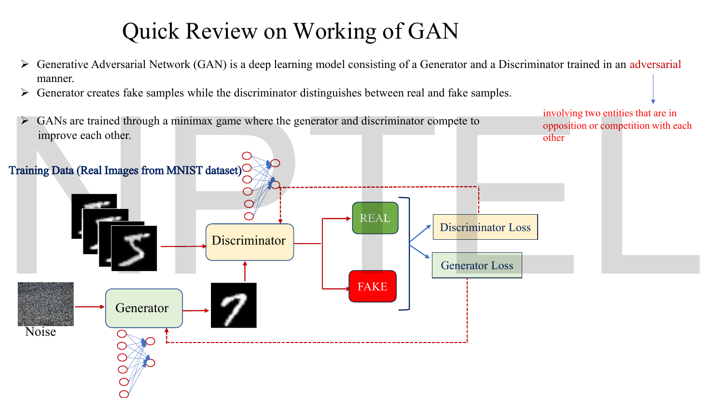
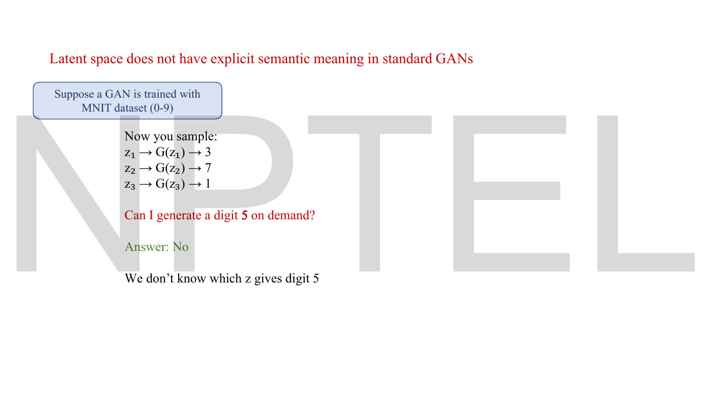
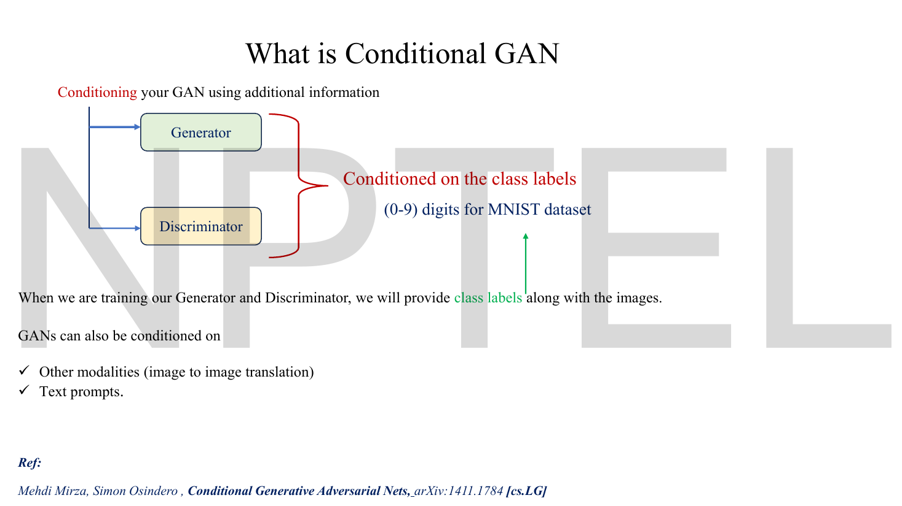
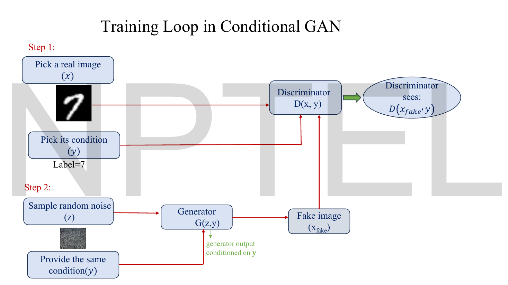
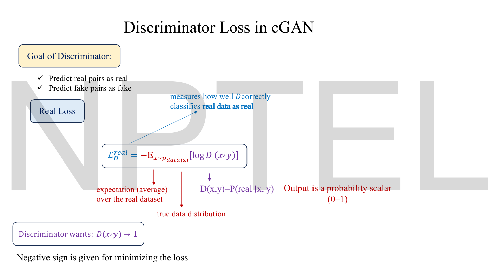
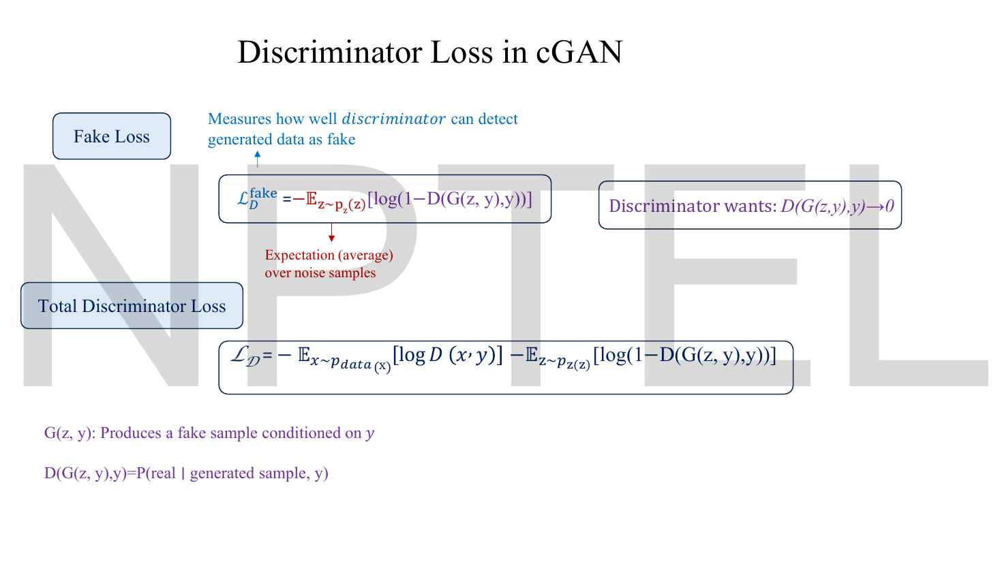
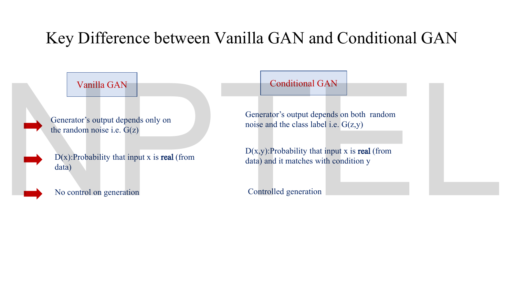
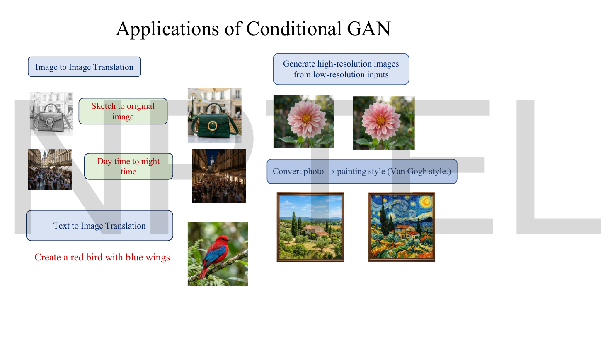

# Lec 38 — Conditional GAN

> **Source:** `Lec 38.pdf` (18 pages) · **Week 6** · **Playlist:** Lec 38
> **Prereqs:** [Lec 32 — GAN Architecture](32-gan-architecture.md), [Lec 33 — GAN Objective and Loss Functions](33-gan-objective.md), [Lec 34 — GAN Convergence and Nash Equilibrium](34-gan-convergence.md), [Lec 27 — Conditional VAE](27-conditional-vae.md)
> **Feeds into:** [Lec 39 — Pix2Pix GAN](39-pix2pix.md), [Lec 40 — CycleGAN](40-cyclegan.md), [Lec 50 — Classifier-Guided Diffusion](50-classifier-guidance.md), [Lec 51 — Classifier-Free Diffusion](51-classifier-free-guidance.md)

## Why this lecture exists

A GAN trained on MNIST will hand you beautiful digits. It will not hand you a *seven*. You draw $\mathbf{z}$, you get whatever that particular $\mathbf{z}$ happens to decode to, and nothing in the model tells you which $\mathbf{z}$ produces which digit. For a lab demo that is charming; for anything useful it is fatal.

The fix is almost embarrassingly small: feed the class label into the network alongside the noise. The lecture's real content is the part that is *not* obvious — that the label must go into the **discriminator** as well, or the generator is never penalised for ignoring it. Everything in Week 6 is built on this one modification. Pix2Pix, CycleGAN and classifier-free guidance are all conditional generation wearing different clothes.

## The ideas

### Where we are: the vanilla GAN in one slide


*Fig. — The architecture you already have. Notice what the discriminator receives: one image, and nothing else. It answers exactly one question — real or fake. That single input port is the thing this lecture changes. Page 3.*

Two networks, trained **adversarially** — the deck's own gloss on that word is "involving two entities that are in opposition or competition with each other". $G$ turns noise into fake samples; $D$ separates real from fake; the two losses push in opposite directions. The minimax objective behind this is derived in [Lec 33](33-gan-objective.md) and the question of whether it converges is [Lec 34](34-gan-convergence.md)'s. This lecture takes both as given and changes only what each network *sees*.

### What the noise vector actually is

![Slide defining latent space and the noise vector z, showing a column vector [0.6, 0.5, 0.1, ..., 0.7] drawn from a standard normal, with the warning "But no control on what gets generated"](../assets/pages/lec38/p-04.png)
*Fig. — The deck's definition of the latent vector, and the red sentence at the bottom right that motivates the whole lecture. Page 4.*

**Latent space** is the deck's term for an abstract, usually lower-dimensional representation of the data that captures its essential features. The noise vector $\mathbf{z}$ is just a point in that space. Each of its components is drawn independently from a Gaussian with mean 0 and variance 1:

$$\mathbf{z} \sim \mathcal{N}(0, 1)$$

component-wise, so a 100-dimensional $\mathbf{z}$ is 100 independent standard-normal draws. (The deck writes `Z ~ N(0,1)` and spells out "Mean = 0, Variance = 1" in words — a useful clarity, because per CONTRACT §3 the second argument of $\mathcal{N}$ is always the *variance*, and some textbooks write the standard deviation there instead.)

The generator is then a deterministic map from this vector to a structured output: random in, image out. And that is precisely the problem.

### The problem, stated as a question you cannot answer


*Fig. — The cleanest statement of the limitation in the whole deck. The latent space of a standard GAN has **no explicit semantic meaning**: no coordinate means "digit", no region is labelled "5". Page 5.*

Train a GAN on MNIST's ten digit classes. Sample three noise vectors and you get a 3, a 7 and a 1 — all excellent digits, none of them requested. Ask for a 5 and the honest answer is: *we do not know which $\mathbf{z}$ gives a 5*. You could search for one by trial and error, but there is no map, and the next time you retrain the model the map changes.

Page 6 re-draws the same architecture purely to label what is missing — "Generator produces digits but without control over which digit is generated" — and restates the vanilla objective in words: $D$ maximises the probability of correctly identifying real and fake, $G$ maximises the probability of $D$ making a mistake. Its conclusion is the lecture's thesis in one line: **conditional GANs enable controlled and guided data generation**.

### The fix: hand the label to both networks


*Fig. — Look at the arrow on the left: one source of conditioning information, **two** destinations. That fork is the entire idea of the lecture, and the reason the architecture works. Page 7.*

A **conditional GAN (cGAN)** is a GAN in which both networks receive extra information $\mathbf{y}$ alongside their usual input. The deck's phrasing: "When we are training our Generator and Discriminator, we will provide class labels along with the images."

$$G(\mathbf{z}, \mathbf{y}) \quad\text{instead of}\quad G(\mathbf{z}), \qquad\qquad D(\mathbf{x}, \mathbf{y}) \quad\text{instead of}\quad D(\mathbf{x})$$

> **Notation.** The deck writes the condition as a plain italic $y$ throughout. Per CONTRACT §3 a vector is bold, and the condition is a vector in every practical implementation (a one-hot code, an embedding, or a whole image), so this chapter writes $\mathbf{y}$. Where a formula is quoted from a slide the deck's own letter is preserved. $\mathbf{y}$ here is a **condition**, not a target — in [Lec 39](39-pix2pix.md) the same letter means the target image, which is a genuine trap.

The condition does not have to be a class label. The deck lists two further possibilities explicitly: **other modalities** (an image, giving image-to-image translation) and **text prompts**. Everything downstream of this lecture is a choice of what to put in $\mathbf{y}$.

The reference is Mehdi Mirza and Simon Osindero, *Conditional Generative Adversarial Nets*, arXiv:1411.1784.

### How the label actually enters each network

The deck draws the conditioning as an arrow and never opens the box. Since you are reading these notes instead of the lecture, here is what is inside — and be aware this part is **not on the slides**, though it is routinely examined.

The condition has to be turned into numbers and merged with the existing input. Three mechanisms cover essentially all implementations.

**1. One-hot concatenation** — the textbook method, and what Mirza and Osindero did. Encode the label as a one-hot vector of length $K$ (for MNIST, $K = 10$, so "7" becomes $[0,0,0,0,0,0,0,1,0,0]$) and glue it onto the input vector:

$$G:\ [\mathbf{z};\mathbf{y}] \in \mathbb{R}^{100+10} = \mathbb{R}^{110}, \qquad D:\ [\mathbf{x};\mathbf{y}] \in \mathbb{R}^{784+10} = \mathbb{R}^{794}$$

Nothing else about the networks changes; only the first layer gets wider. N4 counts exactly how many extra parameters that costs.

**2. Label embedding** — instead of a one-hot vector, learn a dense vector per class. A lookup table of shape $K \times d$ maps each integer label to a trainable $d$-dimensional vector, which is then concatenated (or multiplied element-wise into $\mathbf{z}$). This is cheaper than one-hot when $K$ is large — a one-hot over 1,000 ImageNet classes is a 1,000-wide input, where a 128-dimensional embedding is not — and it lets similar classes learn similar codes.

**3. Spatial concatenation (for convolutional networks)** — a convolutional $D$ cannot take a flat 10-vector; its input is a tensor $H \times W \times C$. So the label is **broadcast into extra channels**: build $K$ planes of size $H\times W$, set the plane for the true class to all ones and the rest to all zeros, and stack them onto the image. A $28\times28\times1$ MNIST image conditioned on 10 classes becomes a $28\times28\times11$ tensor. N5 counts that cost.

```
one-hot concatenation (MLP)        spatial concatenation (CNN)

 z (100) ──┐                        image  28x28x1  ──┐
           ├─► [110] ─► G              label plane for class 7      ├─► 28x28x11 ─► D
 y (10)  ──┘                        9 zero planes     ──┘
                                    (one 28x28 plane per class)
```

In every case the merge happens **at the input**, and in every case it happens in *both* networks. Which brings us to the part readers get wrong.

### Why conditioning the discriminator is the part that matters

Suppose you condition only $G$. The generator takes $(\mathbf{z}, \mathbf{y})$; the discriminator takes the bare image $\mathbf{x}$ and answers "real or fake" as before. Now ask what happens when $G$ is asked for a 3 and produces a flawless 7.

$D$ sees a flawless 7. A flawless 7 is exactly what the real data looks like. So $D$ says *real*, the generator's loss is near zero, and **nothing in the entire training signal has told the generator it answered the wrong question.** The label is an input that the generator is free to ignore, and a network given a free input will ignore it, because ignoring it costs nothing.

The cure is to make $D$ judge **realism and label-consistency jointly**. Give $D$ the pair $(\mathbf{x}, \mathbf{y})$ and define its output as a *conditional* probability — the deck's own definition, on page 11:

$$D(\mathbf{x},\mathbf{y}) = P(\text{real} \mid \mathbf{x}, \mathbf{y})$$

Read that carefully. It is not "is this image real". It is "is this *pair* a real pair" — the image genuinely drawn from the data **and** genuinely carrying label $\mathbf{y}$. A perfect 7 presented with the label "3" is not a pair that ever occurs in the training set, so a well-trained $D$ scores it near 0, the generator's loss $-\log D(G(\mathbf{z},\mathbf{y}),\mathbf{y})$ is huge, and the gradient tells $G$ exactly what it did wrong. N2 and the Code section put numbers on this: the mismatched sample costs the generator **0.051 nats** under an unconditional $D$ and **3.22 nats** under a conditional one, a factor of 63.

The deck says the same thing twice, in two lists, and both are worth memorising verbatim.


*Fig. — The two "learns two things" lists are the examinable core of the lecture. Both networks acquire a second job, and it is the same second job seen from opposite sides: label-consistency. Page 10.*

> **The discriminator learns two things:** (1) does the image match the condition? (2) is it real?
> **The generator learns two things:** (1) given label $\mathbf{y}$, generate an image that looks real, **AND** (2) matches $\mathbf{y}$.

### The training loop


*Fig. — The word to notice is **same**: "Provide the same condition $y$". The real image, the generated image and the discriminator all share one label on any given step. Page 9.*

Five steps, as the deck lays them out:

1. **Pick a real image** $\mathbf{x}$ from the dataset.
2. **Pick its condition** $\mathbf{y}$ — the label that image actually carries (the slide's example: Label = 7). Sample noise $\mathbf{z}$, hand $G$ *the same* $\mathbf{y}$, and let it produce $\mathbf{x}_{\text{fake}} = G(\mathbf{z},\mathbf{y})$.
3. **Train the discriminator** so that $D(\mathbf{x},\mathbf{y}) \to 1$ and $D(G(\mathbf{z},\mathbf{y}),\mathbf{y}) \to 0$.
4. **Train the generator** so that $D(G(\mathbf{z},\mathbf{y}),\mathbf{y}) \to 1$.
5. **Repeat.** $G$ improves image quality, $D$ improves detection, and "eventually generator learns to produce realistic, label-consistent samples".

Page 8 draws the same loop as a wiring diagram, and two of its annotations are worth lifting out. A thin line runs from the "Class label (Y)" box to the generator **and**, along the bottom of the slide, back up into the discriminator — one label, two destinations, again. And the discriminator's input is marked **50:50**: each of its batches is half real images and half generated ones.

The step ordering is the same as the vanilla GAN's — $D$ first, then $G$, alternating — so nothing you learned in [Lec 32](32-gan-architecture.md) about the training loop is invalidated. The only edit is that $\mathbf{y}$ rides along everywhere.

### The discriminator loss, term by term


*Fig. — Every symbol is labelled. The bottom line — "Negative sign is given for minimizing the loss" — is the deck explaining why a maximisation problem is written as a minimisation. Page 11.*

$D$ has two goals: predict real pairs as real, predict fake pairs as fake. One term each.

**Real loss.** $D$ wants $D(\mathbf{x},\mathbf{y}) \to 1$, so it wants $\log D(\mathbf{x},\mathbf{y})$ as large as possible, i.e. as close to $\log 1 = 0$ as possible. Since $D(\mathbf{x},\mathbf{y}) \in (0,1)$ the log is negative, so negating it gives a positive quantity to *minimise*:

$$\mathcal{L}_D^{\text{real}} = -\,\mathbb{E}_{\mathbf{x}\sim p_{\text{data}}(\mathbf{x})}\big[\log D(\mathbf{x},\mathbf{y})\big]$$


*Fig. — The bottom two purple lines define the two pieces of notation the rest of the lecture leans on: $G(\mathbf{z},\mathbf{y})$ produces a fake sample conditioned on $\mathbf{y}$, and $D(G(\mathbf{z},\mathbf{y}),\mathbf{y}) = P(\text{real} \mid \text{generated sample}, \mathbf{y})$. Page 12.*

**Fake loss.** $D$ wants $D(G(\mathbf{z},\mathbf{y}),\mathbf{y}) \to 0$, so it wants $1 - D(\cdot)$ near 1:

$$\mathcal{L}_D^{\text{fake}} = -\,\mathbb{E}_{\mathbf{z}\sim p_\mathbf{z}(\mathbf{z})}\big[\log\big(1 - D(G(\mathbf{z},\mathbf{y}),\mathbf{y})\big)\big]$$

**Total:**

$$\mathcal{L}_{\mathcal{D}} = -\,\mathbb{E}_{\mathbf{x}\sim p_{\text{data}}(\mathbf{x})}\big[\log D(\mathbf{x},\mathbf{y})\big] \;-\; \mathbb{E}_{\mathbf{z}\sim p_\mathbf{z}(\mathbf{z})}\big[\log\big(1 - D(G(\mathbf{z},\mathbf{y}),\mathbf{y})\big)\big]$$

This is the ordinary GAN discriminator loss from [Lec 33](33-gan-objective.md) with $\mathbf{y}$ inserted into every call to $D$ and $G$. It is also, term for term, the binary cross-entropy of [Lec 11](11-reconstruction-loss.md) with targets 1 for real pairs and 0 for fake pairs — which is why GAN losses are always reported in **nats**, natural log being the convention in this course.

### The generator loss, and why the deck gives you two of them

![Slide "Generator Loss in cGAN": the standard generator loss E[log(1 - D(G(z,y),y))] marked with "But vanishing gradient problem occurs if this generator loss is taken", beside the practical non-saturating loss -E[log D(G(z,y),y)]](../assets/pages/lec38/p-13.png)
*Fig. — Two formulas, and the deck is explicit about which one you actually implement. The red note names the reason: vanishing gradients. Page 13.*

**Standard (saturating) generator loss**, the one that falls straight out of the minimax game:

$$\mathcal{L}_G = \mathbb{E}_{\mathbf{z},\mathbf{y}}\big[\log\big(1 - D(G(\mathbf{z},\mathbf{y}),\mathbf{y})\big)\big]$$

Early in training $G$ is bad, $D$ confidently says fake, $D(G(\mathbf{z},\mathbf{y}),\mathbf{y}) \approx 0$, and $\log(1-\cdot) \approx \log 1 = 0$ — the loss is flat exactly where the generator needs the steepest push. The deck's phrase: "vanishing gradient problem occurs if this generator loss is taken."

**Practical non-saturating generator loss**, the one everyone implements:

$$\mathcal{L}_G = -\,\mathbb{E}_{\mathbf{z}\sim p(\mathbf{z})}\big[\log D(G(\mathbf{z},\mathbf{y}),\mathbf{y})\big]$$

Now a confidently-rejected sample gives $-\log(\text{small})$, which is large, with a large gradient. N6 quantifies the gap: at $D = 0.05$ the non-saturating loss delivers **19 times** the gradient magnitude. The reason this substitution is legitimate — both losses share the same optimum, they differ only in gradient scale — belongs to [Lec 33](33-gan-objective.md); here just note that the conditional version inherits it unchanged.

### The objective function

![Slide "Objective function in cGAN": min over G, max over D of V(D,G) = E[log D(x,y)] + E[log(1 - D(G(z,y)))], with coloured arrows annotating each piece](../assets/pages/lec38/p-14.png)
*Fig. — The familiar minimax value function with $\mathbf{y}$ threaded through it. Check the second term against page 12 before you memorise this slide — see the warning below. Page 14.*

$$\min_G \max_D V(D,G) = \mathbb{E}_{\mathbf{x}\sim p_{\text{data}}(\mathbf{x})}\big[\log D(\mathbf{x},\mathbf{y})\big] + \mathbb{E}_{\mathbf{z}\sim p_\mathbf{z}(\mathbf{z})}\big[\log\big(1 - D(G(\mathbf{z},\mathbf{y}),\mathbf{y})\big)\big]$$

$D$ maximises (it wants to tell the pairs apart), $G$ minimises (it wants $D$ to fail). The deck's annotations: the first term "encourages the discriminator to classify real samples correctly", the second "pushes the generator to produce samples that the discriminator classifies as real".

> **Slide defect, page 14.** The printed second term is $\log(1 - D(G(z,y)))$ — $D$ is given the generated image but **not** the label. That contradicts page 12, which correctly writes $D(G(z,y),y)$, and it contradicts the entire point of the lecture. It is a typo, not a variant: an objective in which $D$ never sees $\mathbf{y}$ is a vanilla GAN with a decorative input. Write the second argument. The display above restores it.

Compare to the base objective in [Lec 33](33-gan-objective.md) and the edit is purely mechanical: every $D(\cdot)$ becomes $D(\cdot,\mathbf{y})$ and every $G(\mathbf{z})$ becomes $G(\mathbf{z},\mathbf{y})$. No new term, no new hyperparameter, no new loss function. The entire cGAN is a change of function signature.

### Vanilla GAN versus conditional GAN


*Fig. — The deck's own three-row comparison. Row 2 is the one that gets asked: $D(\mathbf{x},\mathbf{y})$ is the probability that $\mathbf{x}$ is real **and** matches condition $\mathbf{y}$ — one scalar carrying two judgements. Page 15.*

| | Vanilla GAN | Conditional GAN |
|---|---|---|
| **Generator input** | noise only, $G(\mathbf{z})$ | noise **and** class label, $G(\mathbf{z},\mathbf{y})$ |
| **Discriminator input** | the image, $D(\mathbf{x})$ | the image **and** the label, $D(\mathbf{x},\mathbf{y})$ |
| **$D$'s output means** | $P(\text{real})$ | $P(\text{real} \mid \mathbf{x},\mathbf{y})$ — real **and** label-consistent |
| **Control over output** | none | controlled, guided generation |
| **Objective** | $\mathbb{E}[\log D(\mathbf{x})] + \mathbb{E}[\log(1-D(G(\mathbf{z})))]$ | the same with $\mathbf{y}$ in every argument |
| **Sampling a specific class** | impossible — you cannot find the right $\mathbf{z}$ | set $\mathbf{y}$, draw any $\mathbf{z}$ |

Note the last row's consequence: in a cGAN, $\mathbf{z}$ still controls the *variation within* a class (which 7 you get — stroke width, slant) and $\mathbf{y}$ controls *which class*. The two inputs have cleanly separated jobs, which is the first appearance in this course of an idea that [Lec 41](41-stylegan.md) builds an entire architecture around.

### The same idea you have already seen, in a different model

You met conditioning once before. The **conditional VAE** of [Lec 27](27-conditional-vae.md) appends the label to the encoder's input *and* to the decoder's input, so that the decoder learns $p_\theta(\mathbf{x}\mid\mathbf{z},\mathbf{y})$. Structurally it is the identical move — condition both halves of the model, not one — applied to a different base model.

| | Conditional VAE ([Lec 27](27-conditional-vae.md)) | Conditional GAN (here) |
|---|---|---|
| **Base model** | VAE | GAN |
| **Label goes into** | encoder and decoder | generator and discriminator |
| **Trained by** | maximising a conditional ELBO | the conditional minimax game |
| **Why both halves** | so the latent code need not encode the class | so the critic can punish label mismatch |
| **Typical sample quality** | blurrier | sharper |

The *reasons* differ, and that is the examinable part. In the CVAE, conditioning the encoder frees the latent code from having to store the class. In the cGAN, conditioning the discriminator is the only thing that creates a gradient punishing label mismatch at all. Same surgery, different motive.

### What conditioning buys you


*Fig. — Four application families, all of them the same architecture with a different $\mathbf{y}$: an image, a text prompt, a low-resolution image, a style identifier. The top-left pair is literally next lecture's content. Page 16.*

The deck lists:

- **Image-to-image translation** — sketch → finished photograph, daytime → night-time. $\mathbf{y}$ is an entire image. This is [Lec 39](39-pix2pix.md).
- **Text-to-image translation** — "create a red bird with blue wings". $\mathbf{y}$ is an encoded sentence.
- **Super-resolution** — generate a high-resolution image from a low-resolution input. $\mathbf{y}$ is the small image.
- **Style transfer** — photograph → Van Gogh. $\mathbf{y}$ is the content image, the style is in the training data.

## Worked numericals

**The slides contain no worked arithmetic at all** — Lec 38 is entirely conceptual and diagrammatic. All six numericals below are constructed, using the deck's own formulas and its MNIST running example. Natural logs throughout; where a number can plausibly be asked in bits it is given in both.

### N1. The discriminator loss on a mini-batch

**Given:** a batch of two real pairs scoring $D(\mathbf{x},\mathbf{y}) = 0.9$ and $0.8$, and two fake pairs scoring $D(G(\mathbf{z},\mathbf{y}),\mathbf{y}) = 0.3$ and $0.2$.
**Find:** $\mathcal{L}_{\mathcal{D}}$.

1. Real term, $-\frac{1}{2}\sum \log D$:
   $-\ln 0.9 = 0.105361$, $\ -\ln 0.8 = 0.223144$.
   $\mathcal{L}_D^{\text{real}} = \tfrac12(0.105361 + 0.223144) = \tfrac12(0.328505) = 0.164252$.
2. Fake term, $-\frac{1}{2}\sum \log(1-D)$:
   $-\ln(1-0.3) = -\ln 0.7 = 0.356675$, $\ -\ln(1-0.2) = -\ln 0.8 = 0.223144$.
   $\mathcal{L}_D^{\text{fake}} = \tfrac12(0.356675 + 0.223144) = \tfrac12(0.579819) = 0.289909$.
3. Total: $0.164252 + 0.289909$.

**Answer:** $\mathcal{L}_{\mathcal{D}} = 0.454161$ **nats** (natural log), equivalently $0.4542/\ln 2 = 0.655216$ **bits**. Note the fake term is the larger one: $D$ is doing a worse job rejecting fakes than accepting reals, so most of the gradient this step goes into the fake branch.

### N2. The trap: a perfect "7" delivered when a "3" was asked for

**Given:** $G$ is asked for class 3 and emits a flawless 7. An **unconditional** discriminator scores the image $D(\mathbf{x}) = 0.95$ (it looks completely real, because it is a completely plausible digit). A **conditional** discriminator scores the pair $D(\mathbf{x}, \mathbf{y}{=}3) = 0.04$ (that image never carries that label in the data).
**Find:** the non-saturating generator loss $-\log D$ in each case, and the ratio.

1. Unconditional: $-\ln 0.95 = 0.051293$ nats.
2. Conditional: $-\ln 0.04 = 3.218876$ nats.
3. Ratio: $3.218876 / 0.051293 = 62.75$.

**Answer:** $0.0513$ nats against $3.2189$ nats — the conditional discriminator imposes **62.75 times** the penalty (natural log; in bits, $0.0740$ against $4.6439$, the same ratio). With only $G$ conditioned, the generator pays essentially nothing for ignoring the label, which is why it learns to ignore it.

### N3. The value of the game at equilibrium

**Given:** training has converged. By [Lec 34](34-gan-convergence.md)'s result, at the Nash equilibrium $p_g = p_{\text{data}}$ and the optimal discriminator outputs $D(\mathbf{x},\mathbf{y}) = \tfrac12$ on every input, real or fake.
**Find:** $V(D,G)$ and $\mathcal{L}_{\mathcal{D}}$ at that point.

1. First term: $\mathbb{E}[\log \tfrac12] = \ln 0.5 = -0.693147$.
2. Second term: $\mathbb{E}[\log(1-\tfrac12)] = \ln 0.5 = -0.693147$.
3. $V(D,G) = -0.693147 - 0.693147 = -1.386294$.
4. $\mathcal{L}_{\mathcal{D}} = -V = +1.386294$.

**Answer:** $V(D,G) = -1.386294$ nats $= -2\ln 2$ exactly, which is $-2.000$ **bits**. The discriminator loss at equilibrium is $+1.3863$ nats $= 2$ bits. This is the single most quotable number in the GAN arc, and the base matters: the same quantity is $-2$ in bits and $-1.386$ in nats. Conditioning does not change it — the equilibrium value is identical for vanilla and conditional GANs.

### N4. What one-hot conditioning costs, in parameters

**Given:** MNIST. $\mathbf{z}$ has 100 dimensions, images are $784$ values flattened, there are $K=10$ classes one-hot encoded, and the first hidden layer of each network has 256 units with a bias per unit.
**Find:** the first-layer parameter count of $G$ and $D$, conditional versus unconditional, and the total extra cost.

1. Unconditional $G$: input 100 → $100 \times 256 = 25{,}600$ weights $+\ 256$ biases $= 25{,}856$.
2. Conditional $G$: input $100 + 10 = 110$ → $110 \times 256 = 28{,}160 + 256 = 28{,}416$.
3. Unconditional $D$: input 784 → $784\times256 = 200{,}704 + 256 = 200{,}960$.
4. Conditional $D$: input $784 + 10 = 794$ → $794 \times 256 = 203{,}264 + 256 = 203{,}520$.
5. Extra: $(28{,}416 - 25{,}856) + (203{,}520 - 200{,}960) = 2{,}560 + 2{,}560$.

**Answer:** $5{,}120$ extra parameters in total — $2{,}560$ in each network, which is $K \times 256 = 10\times256$ either way. Against a typical few-million-parameter GAN this is under a tenth of a percent. **Conditioning is close to free.**

### N5. The same conditioning for a convolutional discriminator

**Given:** a convolutional $D$ whose input is a $28\times28\times1$ MNIST image and whose first layer has $F = 64$ filters of size $K = 4\times4$. The label is supplied as 10 extra $28\times28$ channel planes (one per class, the true class all-ones, the rest all-zeros).
**Find:** the first-layer weight count with and without conditioning.

1. Unconditional: input depth $C_{\text{in}} = 1$. Weights $= 4\times4\times1\times64 = 16 \times 64 = 1{,}024$.
2. Conditional: input depth $C_{\text{in}} = 1 + 10 = 11$. Weights $= 4\times4\times11\times64 = 16\times11\times64 = 11{,}264$.
3. Extra: $11{,}264 - 1{,}024 = 10{,}240$.

**Answer:** $1{,}024 \to 11{,}264$ weights, an extra $10{,}240$ — an **11-fold** increase in that one layer. The multi-channel convolution rule ([Lec 05](05-cnn-a.md): a filter spans the *full* input depth) is what makes spatial conditioning more expensive than vector concatenation. A cheaper alternative is to embed the label to a single plane rather than $K$ planes, giving $C_{\text{in}} = 2$ and only $1{,}024$ extra weights.

### N6. Why the non-saturating generator loss is used

**Given:** early in training the discriminator confidently rejects the generator's output: $D(G(\mathbf{z},\mathbf{y}),\mathbf{y}) = 0.05$. Write $u = D(G(\mathbf{z},\mathbf{y}),\mathbf{y})$.
**Find:** both generator losses and the magnitude of each one's derivative with respect to $u$.

1. Saturating: $\mathcal{L}_G = \log(1-u) = \ln 0.95 = -0.051293$. Derivative $\dfrac{d}{du}\log(1-u) = \dfrac{-1}{1-u} = \dfrac{-1}{0.95}$, magnitude $1.0526$.
2. Non-saturating: $\mathcal{L}_G = -\log u = -\ln 0.05 = 2.995732$. Derivative $\dfrac{d}{du}(-\log u) = \dfrac{-1}{u} = \dfrac{-1}{0.05}$, magnitude $20.0$.
3. Ratio: $20.0 / 1.0526 = 19.0$.

**Answer:** the non-saturating loss is $2.9957$ nats against the saturating form's $-0.0513$, and its gradient is **19× larger** at this operating point. As $D \to 0$ the ratio grows without bound: the saturating loss flattens to zero slope exactly when the generator is worst, which is the vanishing-gradient problem the deck names on page 13.

## Code

The deck asserts that $D$ must see the label but never demonstrates what breaks if it does not. Thirty lines of NumPy settle it. Two discriminators are trained on the same toy data — one sees $(\mathbf{x},\mathbf{y})$, one sees only $\mathbf{x}$ — and both are then shown a *perfectly realistic image carrying the wrong label*, which is exactly the failure mode conditioning exists to catch.

```python
import numpy as np
rng = np.random.default_rng(0)
sig = lambda a: 1.0 / (1.0 + np.exp(-a))

# Two classes of 2-D "image": class 0 lives near (1,0), class 1 near (0,1).
sample = lambda c, n: np.array([[1., 0.], [0., 1.]])[c] + 0.05 * rng.standard_normal((n, 2))
onehot = lambda y: np.eye(2)[y]

n = 4000
y    = rng.integers(0, 2, n)
real = sample(y, n)            # image that MATCHES its label
mism = sample(1 - y, n)        # equally realistic image, WRONG label
X    = np.vstack([real, mism])
C    = np.vstack([onehot(y), onehot(y)])
T    = np.r_[np.ones(n), np.zeros(n)]          # target: 1 = real pair, 0 = fake pair

def train_D(F, h=16, epochs=3000, eta=0.5):    # one hidden ReLU layer, then a sigmoid
    W1 = 0.5 * rng.standard_normal((F.shape[1], h)); b1 = np.zeros(h)
    W2 = 0.5 * rng.standard_normal(h);              b2 = 0.0
    for _ in range(epochs):
        H = np.maximum(0, F @ W1 + b1); p = sig(H @ W2 + b2)
        g = (p - T) / len(T)                        # dBCE/d(logit)
        gH = np.outer(g, W2) * (H > 0)
        W2 -= eta * H.T @ g; b2 -= eta * g.sum()
        W1 -= eta * F.T @ gH; b1 -= eta * gH.sum(0)
    return lambda f: sig(np.maximum(0, f @ W1 + b1) @ W2 + b2)

D_cond   = train_D(np.hstack([X, C]))          # D(x, y) -- sees image AND label
D_uncond = train_D(X)                          # D(x)    -- sees image only

probe = np.hstack([sample(0, 1), onehot(np.array([1]))])   # flawless class-0 image, asked for class 1
pc, pu = D_cond(probe)[0], D_uncond(probe[:, :2])[0]
print("conditional   D(x,y) = %.4f   ->  generator loss -ln D = %.4f nats" % (pc, -np.log(pc)))
print("unconditional D(x)   = %.4f   ->  generator loss -ln D = %.4f nats" % (pu, -np.log(pu)))
```

```
conditional   D(x,y) = 0.0002   ->  generator loss -ln D = 8.5326 nats
unconditional D(x)   = 0.4909   ->  generator loss -ln D = 0.7115 nats
```

Read the second line first. The unconditional discriminator returns **0.4909** — a coin flip. It is not broken; it is *correct*. The image it was shown is a genuine, perfectly typical class-0 image, indistinguishable from training data, so there is nothing for an image-only critic to object to. It cannot see the crime, because the crime is not in the image.

The conditional discriminator returns **0.0002** and charges the generator **8.53 nats** against the unconditional **0.71** — a factor of 12 on this toy problem, and far larger on real data. That gradient is the only mechanism by which a cGAN ever learns to respect its label. Remove it and $\mathbf{y}$ becomes an input the generator is paid nothing to read.

One caveat worth noticing in the code: `train_D` uses a hidden layer, not a bare logistic regression. A linear model on $[\mathbf{x};\mathbf{y}]$ cannot represent "matches" at all — matching is an *interaction* between image and label, and a linear model has no interaction terms. Conditioning by concatenation only works because the layers above the input are non-linear.

## Exam pack

### Must-memorise

| Item | Exactly this |
|---|---|
| Generator | $G(\mathbf{z},\mathbf{y})$ — noise **and** condition |
| Discriminator | $D(\mathbf{x},\mathbf{y})$ — sample **and** condition |
| What $D$ outputs | $D(\mathbf{x},\mathbf{y}) = P(\text{real}\mid \mathbf{x},\mathbf{y})$, a scalar in $(0,1)$ |
| Noise distribution | $\mathbf{z}\sim\mathcal{N}(0,1)$ component-wise, mean 0, **variance** 1 |
| $D$'s targets | $D(\mathbf{x},\mathbf{y})\to1$ and $D(G(\mathbf{z},\mathbf{y}),\mathbf{y})\to0$ |
| $G$'s target | $D(G(\mathbf{z},\mathbf{y}),\mathbf{y})\to1$ |
| Real loss | $\mathcal{L}_D^{\text{real}} = -\mathbb{E}_{\mathbf{x}\sim p_{\text{data}}}[\log D(\mathbf{x},\mathbf{y})]$ |
| Fake loss | $\mathcal{L}_D^{\text{fake}} = -\mathbb{E}_{\mathbf{z}\sim p_\mathbf{z}}[\log(1-D(G(\mathbf{z},\mathbf{y}),\mathbf{y}))]$ |
| Total $D$ loss | $\mathcal{L}_{\mathcal{D}} = \mathcal{L}_D^{\text{real}} + \mathcal{L}_D^{\text{fake}}$ |
| Saturating $G$ loss | $\mathcal{L}_G = \mathbb{E}[\log(1-D(G(\mathbf{z},\mathbf{y}),\mathbf{y}))]$ — vanishing gradient |
| Non-saturating $G$ loss | $\mathcal{L}_G = -\mathbb{E}[\log D(G(\mathbf{z},\mathbf{y}),\mathbf{y})]$ — what you implement |
| cGAN objective | $\min_G\max_D V = \mathbb{E}_{p_{\text{data}}}[\log D(\mathbf{x},\mathbf{y})] + \mathbb{E}_{p_\mathbf{z}}[\log(1-D(G(\mathbf{z},\mathbf{y}),\mathbf{y}))]$ |
| $D$ learns two things | does the image match the condition? · is it real? |
| $G$ learns two things | looks real · matches $\mathbf{y}$ |
| Original paper | Mirza & Osindero, *Conditional Generative Adversarial Nets*, arXiv:1411.1784 |

### Numbers worth knowing

| Quantity | Value |
|---|---|
| Deck's running dataset | MNIST, $K = 10$ classes, digits 0–9 |
| Typical latent dimension (deck's example) | 100 — "100 dimensions, 100 random numbers" |
| $\mathbf{z}$'s distribution | $\mathcal{N}(0,1)$: mean 0, variance 1 |
| $D$'s output range | $(0,1)$, a probability scalar |
| Discriminator batch composition | 50:50 real to generated (page 8) |
| $V(D,G)$ at equilibrium | $-2\ln 2 = -1.3863$ nats $= -2$ bits |
| $\mathcal{L}_{\mathcal{D}}$ at equilibrium | $+1.3863$ nats $= +2$ bits |
| $D$ at equilibrium | $\tfrac12$ on every input |
| One-hot MNIST condition | 10 extra input units to $G$ **and** to $D$ |
| Extra parameters, $100{+}10\to256$ MLP (N4) | 2,560 per network, 5,120 total |
| Spatial conditioning, $4\times4\times64$ first conv (N5) | $1{,}024 \to 11{,}264$ weights |
| $G$ loss on a mismatched sample (N2) | 0.0513 nats unconditional vs 3.2189 nats conditional |
| Non-saturating gradient advantage at $D=0.05$ (N6) | 19× |

### Likely MCQ traps

- **"Only the generator needs the label."** The headline trap, and the reason this lecture exists. If $D$ sees only $\mathbf{x}$, a perfectly realistic 7 produced on request for a 3 scores as *real*, the generator's loss is ~0.05 nats instead of ~3.2, and $\mathbf{y}$ becomes a free input that $G$ learns to ignore. **Both networks are conditioned.** Any option saying "cGAN conditions the generator" and stopping there is wrong.
- **Misreading $D(\mathbf{x},\mathbf{y})$ as "probability the image is real".** It is $P(\text{real}\mid\mathbf{x},\mathbf{y})$ — the probability that this image–label *pair* is a genuine pair. One scalar, two judgements: realism and label-consistency.
- **Thinking cGAN adds a new loss term.** It does not. No classification loss, no auxiliary head, no $\lambda$. Every formula is the vanilla GAN's with $\mathbf{y}$ added as an argument. (That is what distinguishes a cGAN from an ACGAN, which *does* add a classification head — see *Beyond the slides*. [Lec 39](39-pix2pix.md)'s Pix2Pix is the first model in this course to add a genuinely new term.)
- **Believing $\mathbf{z}$ can be dropped once you have $\mathbf{y}$.** Then $G$ is a deterministic function of the label and produces exactly one image per class. $\mathbf{y}$ selects the class; $\mathbf{z}$ supplies the variation within it. Both are needed.
- **Confusing the two generator losses.** $\mathbb{E}[\log(1-D(\cdot))]$ is the *minimax/saturating* form, with the vanishing-gradient problem. $-\mathbb{E}[\log D(\cdot)]$ is the *non-saturating/practical* form. The deck prints both on page 13 and tells you which is used.
- **Copying page 14's objective verbatim.** Its second term omits the label inside $D$. Page 12 has it right. The objective must read $D(G(\mathbf{z},\mathbf{y}),\mathbf{y})$.
- **Assuming the label must be a class.** The deck explicitly lists other modalities (images) and text prompts. $\mathbf{y}$ is any side information.
- **Log-base confusion.** Natural logs throughout this book. The equilibrium value is $-1.386$ nats but $-2.000$ bits; an option of exactly $-2$ is a bits answer, not a mistake. Per errata batch 4, always state the base.
- **"The latent space of a vanilla GAN is semantically organised, you just need to search it."** The deck's page 5 is categorical: it has *no explicit semantic meaning*. Interpolation produces smooth transitions ([Lec 28](28-latent-interpolation.md)) but no coordinate corresponds to a nameable attribute.
- **Mixing up the two meanings of $y$ across lectures.** In Lec 38 $\mathbf{y}$ is the *condition* (the class label). In [Lec 39](39-pix2pix.md) $y$ is the *target image* and $x$ is the condition. Read the lecture, not the letter.

### Self-test

1. Write the cGAN objective $\min_G\max_D V(D,G)$ in full, with every argument.
2. A cGAN is trained with the label fed only to $G$. Describe precisely what goes wrong and why the gradient cannot fix it.
3. What does $D(\mathbf{x},\mathbf{y})$ output, stated as a conditional probability?
4. On MNIST with a 100-dimensional $\mathbf{z}$, one-hot labels and a first hidden layer of 256 units in each network, how many parameters does conditioning add in total?
5. $D$ scores two real pairs at 0.95 and 0.85 and two fake pairs at 0.10 and 0.25. Compute $\mathcal{L}_{\mathcal{D}}$ in nats.
6. State the saturating and non-saturating generator losses and say which one you implement, with the reason.
7. A trained cGAN is converged. What is $V(D,G)$, in nats and in bits?
8. Name three ways the label can be merged into a convolutional discriminator's input.
9. In one sentence each, give the reason a conditional VAE conditions its encoder and the reason a conditional GAN conditions its discriminator.
10. If you fix $\mathbf{y}$ and draw two different noise vectors, what varies between the two outputs?

<details><summary>Answers</summary>

1. $\min_G\max_D V(D,G) = \mathbb{E}_{\mathbf{x}\sim p_{\text{data}}(\mathbf{x})}[\log D(\mathbf{x},\mathbf{y})] + \mathbb{E}_{\mathbf{z}\sim p_\mathbf{z}(\mathbf{z})}[\log(1 - D(G(\mathbf{z},\mathbf{y}),\mathbf{y}))]$. The label appears inside **both** $D$ calls and inside $G$.
2. $D$ then judges realism only. A realistic image carrying the wrong label is scored *real*, so the generator's loss is near zero ($-\ln 0.95 = 0.0513$ nats rather than $-\ln 0.04 = 3.2189$). There is no term in the objective whose value depends on whether the output matches $\mathbf{y}$, so the gradient with respect to the label pathway carries no corrective signal and $G$ learns to ignore $\mathbf{y}$.
3. $D(\mathbf{x},\mathbf{y}) = P(\text{real}\mid\mathbf{x},\mathbf{y})$ — the probability that the *pair* is genuine: the image is from $p_{\text{data}}$ **and** it matches condition $\mathbf{y}$.
4. $10\times256 = 2{,}560$ in $G$ and $2{,}560$ in $D$, so **5,120** in total (biases unchanged).
5. Real: $-\frac12(\ln 0.95 + \ln 0.85) = \frac12(0.051293 + 0.162519) = 0.106906$. Fake: $-\frac12(\ln 0.90 + \ln 0.75) = \frac12(0.105361 + 0.287682) = 0.196521$. Total $= \mathbf{0.303427}$ nats $(= 0.4378$ bits$)$.
6. Saturating: $\mathcal{L}_G = \mathbb{E}[\log(1-D(G(\mathbf{z},\mathbf{y}),\mathbf{y}))]$. Non-saturating: $\mathcal{L}_G = -\mathbb{E}[\log D(G(\mathbf{z},\mathbf{y}),\mathbf{y})]$. You implement the **non-saturating** one: when $D$ confidently rejects, the saturating loss flattens (gradient magnitude $1/(1-D) \approx 1.05$ at $D=0.05$) while the non-saturating one stays steep ($1/D = 20$), a 19× difference exactly where the generator needs the push.
7. $D = \tfrac12$ everywhere, so $V = \ln\tfrac12 + \ln\tfrac12 = -1.3863$ **nats**, which is $-2.000$ **bits**.
8. (i) Broadcast a one-hot label into $K$ extra $H\times W$ channel planes and concatenate on the depth axis; (ii) learn a label embedding, project it to one or a few planes, and concatenate those; (iii) inject the embedding into intermediate layers rather than the input (conditional batch-norm, or the projection discriminator) — not on the slides, but standard practice.
9. CVAE: conditioning the encoder means the latent code does not have to spend capacity encoding the class, so $\mathbf{z}$ carries only style. cGAN: conditioning the discriminator is the only thing that makes label mismatch cost the generator anything, so without it the label is ignored.
10. The *variation within* the class — stroke thickness, slant, shape of a particular 7 — while the class itself stays fixed by $\mathbf{y}$.

</details>

## Beyond the slides

**Gap: Lec 35, "Introduction to DCGAN", has no slides anywhere in the source material.**
**Why it matters:** this is not a Colab session that was delivered live. Twelve of the thirteen missing lecture numbers in this course (7, 8, 9, 17, 18, 25, 29, 30, 36, 37, 43, 58) are *Practical Exercise* or *Introduction to Google Colab* hands-on sessions with no deck, so nothing is lost there. **Lec 35 is the exception: a genuine content lecture whose deck is absent from what the course provided.** Every architecture in Week 6 silently assumes it, so here is the orienting treatment, flagged clearly as not-on-the-slides.

The **DCGAN** (Deep Convolutional GAN, Radford, Metz & Chintala, 2015) is the vanilla GAN of [Lec 32](32-gan-architecture.md) with both networks rebuilt from fully-connected layers into convolutional ones. That is the whole idea; the contribution was a set of architectural rules that made adversarial training on images stable for the first time.

The **generator** starts from the noise vector $\mathbf{z}$, projects and reshapes it into a small deep tensor (classically $4\times4\times1024$), and then *upsamples* repeatedly — $4\times4 \to 8\times8 \to 16\times16 \to 32\times32 \to 64\times64$ — each step halving the channel count while doubling the spatial size. The upsampling is done with **transposed convolution**, which [Lec 12](12-autoencoder-types.md) owns completely (including $O = I + K - 1$, the $G_1{+}G_2{+}G_3{+}G_4$ construction, and the checkerboard artefact); go there for the mechanics, they are not re-derived here. The **discriminator** is the mirror image: ordinary **strided convolution** downsamples $64\times64 \to 32\times32 \to \cdots \to 4\times4$ while channels grow, ending in a single sigmoid output.

The rules that made it work, which is what an exam question will key on:

| Rule | Where | Why |
|---|---|---|
| **No pooling layers at all** | both | the network learns its own downsampling (strided conv in $D$) and upsampling (transposed conv in $G$) instead of a fixed, non-learnable operation |
| **Batch normalisation** | most layers of both | stabilises training and stops all samples collapsing to one point; **omitted** on $G$'s output layer and $D$'s input layer, where it causes oscillation |
| **ReLU** | $G$'s hidden layers | standard, and it keeps activations sparse |
| **tanh** | $G$'s output layer | bounds output to $[-1,1]$, which is why DCGAN images are scaled to $[-1,1]$ rather than $[0,1]$ |
| **LeakyReLU** (slope 0.2) | all of $D$ | a plain ReLU zeroes the gradient for every negative pre-activation, starving $G$ of signal; the small negative slope keeps gradients flowing |
| **No fully-connected hidden layers** | both | the architecture is all-convolutional apart from the first projection in $G$ |

Trained with Adam at $\eta = 0.0002$ and $\beta_1 = 0.5$ — the same settings [Lec 39](39-pix2pix.md) prints on its page 15, inherited directly from this paper. The activation choices match the architecture table in [Lec 02](02-activations-and-losses.md): ReLU family for CNN/GAN hidden layers, sigmoid for the GAN discriminator's output, tanh for the generator's.

Why you need it: a cGAN is almost always a *conditional DCGAN*, Pix2Pix's U-Net generator and PatchGAN discriminator are both DCGAN-style convolutional stacks, and "which activation does the DCGAN generator use at its output?" is a textbook MCQ. Without Lec 35's deck you would meet none of this.

**Gap: the deck never shows how $\mathbf{y}$ is physically merged into either network.**
**Why it matters:** it draws an arrow. An exam asking "how is the class label supplied to the generator?" expects *concatenate the one-hot (or embedded) label to the noise vector*, and for a convolutional discriminator, *broadcast it into extra channels*. Both are reconstructed in *The ideas* above with parameter counts in N4 and N5. There is a subtlety the arrow hides: concatenation only works if non-linear layers follow, because "image matches label" is an interaction term that no linear layer can represent — demonstrated in the Code section.

**Gap: cGAN is presented as the only way to get class control, with no mention of the alternatives.**
**Why it matters:** two near neighbours are routinely offered as MCQ distractors. **ACGAN** (auxiliary classifier GAN) gives $D$ a second output head that predicts the class, and adds a classification loss to both objectives — so unlike a cGAN it *does* introduce a new loss term, and its $D$ takes only $\mathbf{x}$. **The projection discriminator** merges the label embedding by an inner product with $D$'s penultimate features rather than concatenating at the input, and is what modern large conditional GANs use. Knowing that "cGAN adds no new loss term" distinguishes it cleanly from ACGAN.

**Gap: nothing is said about what conditioning does to mode collapse.**
**Why it matters:** [Lec 34](34-gan-convergence.md) owns mode collapse, but conditioning interacts with it in a way worth one line. A vanilla GAN can collapse onto one digit and still score well. A cGAN cannot collapse *across* classes, because $D$ sees the label and would instantly reject every sample for nine of the ten labels. It can still collapse *within* a class — producing one stereotyped 7 for every $\mathbf{z}$ — which is the failure mode to watch for. Conditioning partially mitigates mode collapse; it does not cure it.

**Gap: the deck's page 17 is a bare "Summary" title with no summary on it.**
**Why it matters:** if you were watching the video you would hear the recap; reading the slides you get nothing. The *Must-memorise* table above is this chapter's replacement, and the three things that would have been on it are: both networks are conditioned, $D$ judges realism and label-consistency jointly, and the objective is unchanged apart from its arguments.

## Cut from the slides

Pages 1, 2, 17 and 18 are the title, the contents list, an empty "Summary" divider and the next-session pointer; nothing was lost. Three slides are near-duplicates of others and are quoted rather than embedded, to stay inside the figure budget: page 6 re-draws page 3's GAN diagram with motivational annotations (both annotations are reproduced in the prose), and page 8 re-draws the training loop that pages 9 and 10 give in step form (its two informative marks, the label's fork into both networks and the 50:50 batch composition, are stated in the text). Page 4's definition of latent space is compressed to two sentences, since [Lec 28](28-latent-interpolation.md) owns latent-space structure and [Lec 21](21-vae-encoder.md) owns the probabilistic reading of it. Page 16's five application images are summarised as a bulleted list rather than described individually; the sketch-to-photo and day-to-night pairs reappear as content in [Lec 39](39-pix2pix.md). The minimax objective itself is stated but not re-derived — [Lec 33](33-gan-objective.md) owns the derivation, and the optimal-discriminator and Nash-equilibrium results used in N3 belong to [Lec 34](34-gan-convergence.md). The deck's typo on page 14 (a missing $y$ argument) is corrected in the text with the error documented rather than silently fixed. Everything else on pages 3 through 16 is reproduced in full.
