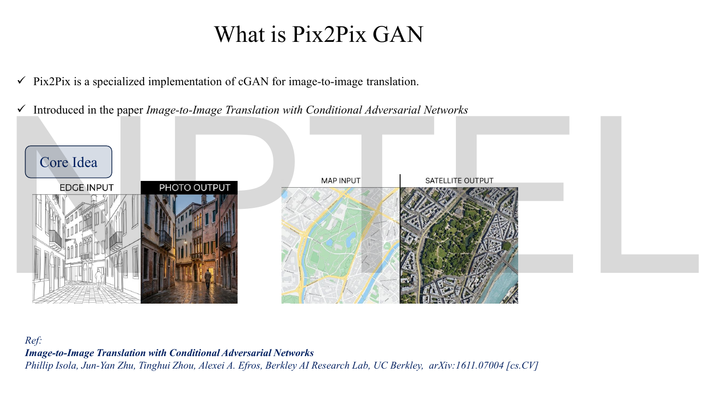
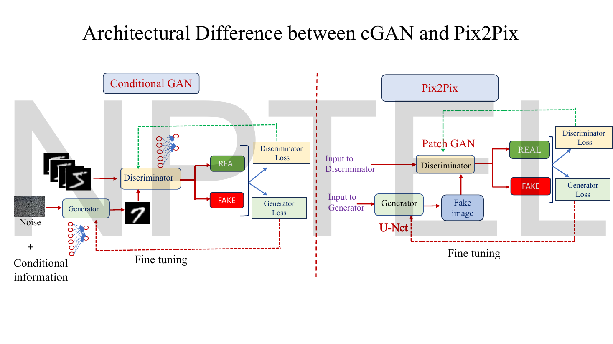
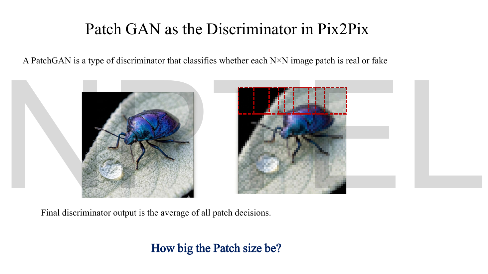
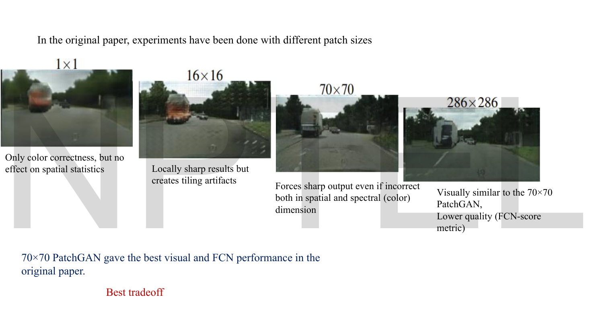
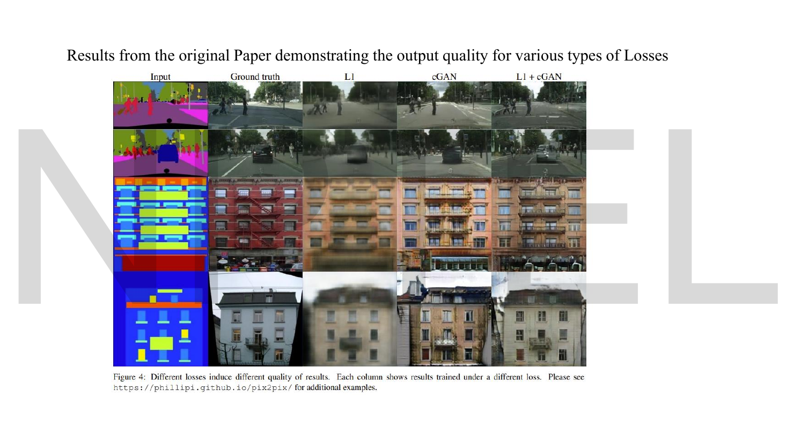

# Lec 39 — Image-to-Image Translation: Pix2Pix GAN

> **Source:** `Lec 39.pdf` (17 pages) · **Week 6** · **Playlist:** Lec 39
> **Prereqs:** [Lec 38 — Conditional GAN](38-conditional-gan.md), [Lec 33 — GAN Objective and Loss Functions](33-gan-objective.md), [Lec 11 — Reconstruction Loss (MSE, BCE)](11-reconstruction-loss.md), [Lec 05 — Convolutional Neural Network — Part A](05-cnn-a.md)
> **Feeds into:** [Lec 40 — CycleGAN](40-cyclegan.md), [Lec 49 — U-Net for Denoising](49-unet.md), [Lec 52 — Stable Diffusion](52-stable-diffusion.md)

## Why this lecture exists

[Lec 38](38-conditional-gan.md) left you with a generator that takes a condition. It also left the condition abstract: a ten-way class label on MNIST. This lecture makes the condition an entire image, and the output an entire image — sketch to photograph, map to satellite view, segmentation mask to street scene.

Two things break when you do that. A generator built as an encoder–decoder throws away the spatial detail that an image-to-image task needs preserved, and a discriminator that returns one verdict for a whole $256\times256$ image is both enormous and bad at local texture. Pix2Pix fixes the first with a **U-Net** and the second with a **PatchGAN**, then adds an $L_1$ term to the generator's loss to pin the output to the ground truth. Each of those three choices is separately examinable.

## The ideas

### What Pix2Pix is


*Fig. — The two canonical examples. Notice both pairs are **registered**: the photograph's windows sit exactly where the sketch's windows sit, pixel for pixel. That alignment is not decorative; it is the dataset requirement that defines the method. Page 3.*

The deck's definition, verbatim: **Pix2Pix is a specialized implementation of cGAN for image-to-image translation.** It comes from *Image-to-Image Translation with Conditional Adversarial Networks* — Phillip Isola, Jun-Yan Zhu, Tinghui Zhou and Alexei A. Efros, Berkeley AI Research, arXiv:1611.07004.

So the structure is inherited wholesale from [Lec 38](38-conditional-gan.md). The condition $\mathbf{y}$ of that lecture is simply replaced by a source image.

> **Notation warning — this is the single most dangerous letter in Week 6.** In Lec 38, $\mathbf{y}$ was the *condition* (the class label). In Lec 39's deck, $x$ is the **input / source image** (the condition) and $y$ is the **target image** (the ground-truth output). The letters have swapped roles. The deck writes $D(x,y)$ for the real pair and $D(x, G(x))$ for the fake pair, so $D$'s first argument is the condition in both lectures — but the second argument has changed from "the condition" to "the thing being judged". Read the equation in front of you, never the letter from memory. This chapter follows the deck's Lec 39 convention, with $\mathbf{x}$ the source image and $\mathbf{y}$ the target.

### "Paired" is the load-bearing word


*Fig. — The red text at the bottom is the definition you memorise. "Paired" is the word doing all the work, and it is also the word that creates the problem [Lec 40](40-cyclegan.md) exists to solve. Page 4.*

Pix2Pix trains on a dataset of **aligned pairs** $\{(\mathbf{x}^{(i)}, \mathbf{y}^{(i)})\}$: for every input image there is a corresponding target image showing the *same scene*, pixel-registered, with the transformation already applied. Sketch #1 must come with the photograph of exactly that building. Map tile #1 must come with the satellite image of exactly that tile.

That requirement is severe. It is satisfiable for:

- **Maps ↔ satellite** — both already exist for the same coordinates.
- **Edges ↔ photo** — run an edge detector on the photo and you have manufactured the pair for free.
- **Day ↔ night** — fix a camera and wait.
- **Segmentation mask ↔ street scene** — the mask comes from the dataset's own annotations.
- **Low-res ↔ high-res** — downsample the high-res image to manufacture its partner.
- **Black-and-white ↔ colour** — desaturate.

It is not satisfiable for the cases you most want. There is no photograph of a horse and the *same horse* as a zebra. There is no photograph of a Parisian street and the Monet painting *of that exact street from that exact angle*. For those you need unpaired translation, which is [Lec 40](40-cyclegan.md)'s **CycleGAN** — that chapter owns the full paired-versus-unpaired contrast table, so this chapter stops at planting the flag: **if you cannot build aligned pairs, Pix2Pix is unusable, and the reason is the $L_1$ term below, which compares the output against a specific ground-truth image pixel by pixel.**

The deck's own framing of how Pix2Pix sits inside cGAN:

| | Conditional GAN ([Lec 38](38-conditional-gan.md)) | Pix2Pix (here) |
|---|---|---|
| **Scope** | generic conditional generation framework | one specific task |
| **Condition can be** | labels, text, images, anything | an image, always |
| **Output** | a sample from the conditioned class | an image aligned with the input |
| **Data needed** | images with labels | images in **aligned pairs** |

### What actually changes


*Fig. — Put the two diagrams side by side and three differences stand out: the noise box has vanished from the right-hand diagram, the generator is labelled **U-Net**, and the discriminator is labelled **Patch GAN**. Page 6.*

Three changes, and the deck labels all three on this one slide:

1. **The generator is a U-Net**, not a plain encoder–decoder.
2. **The discriminator is a PatchGAN**, not a whole-image classifier.
3. **The generator's loss gains an $L_1$ term** weighted by $\lambda$.

There is also a fourth change the deck shows but never states: **the noise vector is gone**. The left diagram has a "Noise" box; the right one does not, and every Pix2Pix formula on the slides writes $G(x)$, never $G(x,z)$. That is faithful to the original paper and has consequences — see *Beyond the slides*.

### The U-Net generator


*Fig. — The horizontal grey arrows are the entire point. Each one copies a full-resolution feature map from the encoder straight across to the matching decoder level, bypassing the bottleneck. Read the legend: conv 3×3 + ReLU, max pool 2×2 down, up-conv 2×2 up, conv 1×1 at the output. Page 7.*

A **U-Net** is an encoder–decoder with **skip connections** between mirrored levels. Three parts, in the deck's words:

- **Encoder (contracting path)** — "extracts features". Repeated convolutions with downsampling; spatial size shrinks, channel depth grows.
- **Bottleneck** — "compresses representation". The narrowest, deepest point.
- **Decoder (expanding path)** — "reconstructs image". Repeated upsampling back to the input resolution.

So far that is an ordinary convolutional autoencoder, the architecture of [Lec 12](12-autoencoder-types.md) (which owns transposed convolution and the upsampling arc — the `up-conv 2×2` in the legend is exactly that operation, and it is not re-derived here).

**Why the skips are necessary.** In a classification network, throwing away spatial detail is the *goal*: you want "there is a cat", not "there is a whisker at pixel (113, 207)". In image-to-image translation it is a catastrophe. A sketch and its photograph share their entire geometry — every edge, every window frame, every outline is in the same place in both. All of that information must survive the trip to the output, and a bottleneck that compresses a $256\times256$ image into a $1\times1\times512$ vector has destroyed it.

The skip connection routes around the bottleneck. At each decoder level, the feature map arriving from below (semantically rich, spatially coarse) is **concatenated** with the feature map copied across from the encoder at the same resolution (spatially precise, semantically shallow). The decoder gets both. The deck's sentence: "Skip connections help preserve low-level spatial details lost during encoding."

```
   256x256  ──────────── copy ────────────►  concat  ─► 256x256   output
      │                                          ▲
   128x128  ──────────── copy ────────────►  concat
      │                                          ▲
     64x64  ──────────── copy ────────────►  concat
      │                                          ▲
      ...        bottleneck  1x1x512         ...
      └──────────────────►──────────────────────┘
   encoder (contracting)              decoder (expanding)
```

A useful way to see it: the bottleneck answers *what* the image should become, and the skips supply *where* everything goes. Without the skips the output has the right content in approximately the right place; with them the output is pixel-registered with the input.

> **You will meet this architecture again.** [Lec 49](49-unet.md) uses a U-Net as the denoising network inside a diffusion model, for the identical reason: the output must be the same size as the input and spatially aligned with it. The skip connections there do the same job. Lec 49 owns the time-step-embedding machinery that a diffusion U-Net adds; what you need here is just encoder + bottleneck + decoder + skips.

### The PatchGAN discriminator


*Fig. — The red dashed boxes are the unit of judgement. Instead of one verdict for the image, the discriminator returns one verdict per patch and averages them. Page 8.*

A **PatchGAN** is a discriminator that classifies whether each $N\times N$ image patch is real or fake, rather than scoring the whole image. The deck states the output rule explicitly: **the final discriminator output is the average of all patch decisions.**

Mechanically, it is a *fully convolutional* network with no dense layer at the end. Convolve, convolve, convolve, and emit a grid of logits instead of a single number. Each cell of that grid is a decision about the region of the input its receptive field covers. For Pix2Pix's standard configuration a $256\times256$ input yields a $30\times30$ grid of decisions, each with a $70\times70$ receptive field — N3 derives both numbers from [Lec 05](05-cnn-a.md)'s output-size formula.

Three things this buys you:

- **Far fewer parameters.** The expensive part of a conventional image classifier is the dense layer that follows the last convolution. Deleting it saves an order of magnitude (N4: 492,032 parameters versus 8,192 for the output stage).
- **Sharper local texture.** A verdict per patch forces every region of the output to be locally convincing. A whole-image verdict can be satisfied by an image that is globally plausible and locally mushy.
- **Resolution independence.** A fully convolutional discriminator can be run on an image of any size — the grid just gets bigger. The same trained PatchGAN works on $256\times256$ and $512\times512$.

The cost: a $70\times70$ patch cannot see global structure. It cannot tell you that the left half of the image is daylight and the right half is night. That is acceptable precisely because the $L_1$ term below is enforcing global correctness, leaving the discriminator free to specialise in local realism. **The division of labour between the two loss terms is the design.**

### How big should the patch be?


*Fig. — Four experiments from the paper. The $1\times1$ image is washed out, the $16\times16$ shows tiling artefacts, the $70\times70$ and $286\times286$ look similar — and the biggest one is **worse** by the quantitative metric. More context is not monotonically better. Page 9.*

The deck reproduces the original paper's ablation:

| Patch size | What it does | Verdict |
|---|---|---|
| $1\times1$ ("PixelGAN") | "Only color correctness, but no effect on spatial statistics" | each pixel judged alone, so nothing enforces texture |
| $16\times16$ | "Locally sharp results but creates tiling artifacts" | too little context; patch boundaries become visible |
| $70\times70$ | "Forces sharp output even if incorrect, both in spatial and spectral (color) dimension" | **best visual and FCN performance — the best tradeoff** |
| $286\times286$ | "Visually similar to the 70×70 PatchGAN, lower quality (FCN-score metric)" | full-image; more parameters, harder to train, no gain |

$286\times286$ exceeds the $256\times256$ input, so it *is* a whole-image discriminator. The deck's note that it scores *lower* on the FCN metric despite looking similar is the examinable detail: **70×70 is the answer, and the whole-image discriminator is not just equal-but-expensive, it is measurably worse.**

The **FCN-score** named here is the paper's quantitative metric: run a pre-trained segmentation network on the generated image and check how well its predicted labels match the input mask. A good translation should still be segmentable.

### The training phase


*Fig. — Follow the "+" sign next to Fake B: the discriminator never sees a generated image alone. It always sees the **pair** (Real A, Fake B) or the pair (Real A, Real B). Page 10.*

The deck's problem statement: *I have a sketch of a scenery (A). I want a painting of this same sketch (B) — Target Image.*

Per training step:

1. Take an aligned pair: **Real A** (the sketch, $\mathbf{x}$) and **Real B** (the painting, $\mathbf{y}$).
2. $G$ maps Real A to **Fake B** $= G(\mathbf{x})$.
3. $D$ is shown the real pair $(\mathbf{x}, \mathbf{y})$ and must output *real*; then the fake pair $(\mathbf{x}, G(\mathbf{x}))$ and must output *fake*.
4. The adversarial signal is binary cross-entropy ([Lec 11](11-reconstruction-loss.md)) over the patch grid.

This is exactly Lec 38's loop, with the class label replaced by the source image. $D$'s job is still the joint one: *is this a real image, and does it correspond to this input?* An output that is a beautiful painting of a different street is a fake pair, and $D$ exists to say so.

### The generator loss: adversarial **plus** $\lambda L_1$


*Fig. — The red line at the bottom is the formula to memorise, and the green box on the left is where $\lambda = 100$ is printed. The grey annotation matters too: "During Training the discriminator gets the real target image as well". Page 11.*


*Fig. — Both formulas in one place, with the deck's reason for $\lambda = 100$: it "gives strong weight to pixel similarity". Note the deck writes $G(x)$ — no noise argument anywhere. Page 12.*

Two terms.

**The adversarial (conditional GAN) term** — the Lec 38 objective with the source image as the condition:

$$\mathcal{L}_{\text{cGAN}}(G,D) = \mathbb{E}_{\mathbf{x},\mathbf{y}}\big[\log D(\mathbf{x},\mathbf{y})\big] + \mathbb{E}_{\mathbf{x},\mathbf{y}}\big[\log\big(1 - D(\mathbf{x}, G(\mathbf{x}))\big)\big]$$

**The reconstruction term** — mean absolute error between the generated image and the ground-truth target:

$$\mathcal{L}_{L1}(G) = \mathbb{E}_{\mathbf{x},\mathbf{y}}\big[\lVert \mathbf{y} - G(\mathbf{x})\rVert_1\big]$$

where $\lVert\cdot\rVert_1$ sums the absolute differences over every pixel and channel. The deck's gloss: it "ensures the generated image is pixel-wise close to the target."

**Total generator loss = binary cross-entropy loss + $\lambda\,L_1$ loss**, with $\lambda = 100$ in the original paper, chosen "to strongly emphasize L1 reconstruction loss".

That $\lambda = 100$ is not a tie-breaker, it is a declaration of priority. N2 computes the split on realistic numbers: the $L_1$ term carries about **92%** of the generator's total loss. Pix2Pix is, numerically, a reconstruction model with an adversarial garnish — and the garnish is what makes it sharp.

The two terms have cleanly separated jobs, which is worth stating as a table because it is the cleanest MCQ answer available:

| Term | Enforces | What it gets wrong alone |
|---|---|---|
| $\lambda\mathcal{L}_{L1}$ | the output is the *correct* image — right content, right colours, right global layout | blurry: it averages over everything the input leaves ambiguous |
| $\mathcal{L}_{\text{cGAN}}$ | the output *looks like a real image* — sharp edges, plausible texture | hallucinating: sharp and convincing but not necessarily the right scene |


*Fig. — The experimental proof of the table above. The **L1** column is recognisably correct and completely blurry. The **cGAN** column is sharp but the colours drift and artefacts appear. The **L1 + cGAN** column is both. Page 13.*

### Why $L_1$ and not $L_2$

The deck names the loss "Mean Absolute error Loss (L1 Loss)" and asserts it; it never says why $L_1$ rather than the MSE you have used since [Lec 11](11-reconstruction-loss.md). Here is the reason, and it is one of the most reliably examined facts in this lecture.

**Both blur. $L_1$ blurs less.**

The blur comes from ambiguity. Given one sketch, many paintings are defensible — this window could be lit or dark, this wall ochre or terracotta. The training data contains that spread. A pixel-wise loss cannot output a distribution; it must commit to one number, and it commits to whichever number minimises the expected loss over the possibilities.

- **Minimising squared error gives you the conditional *mean*.** The mean of "dark" and "bright" is grey. The mean of ochre and terracotta is mud. The averaged value is often a value no plausible target ever takes — and across a whole image, averaging is exactly what blur *is*.
- **Minimising absolute error gives you the conditional *median*.** The median is an actual observed value: if two-thirds of the plausible targets say 0.1, the median is 0.1, not 0.37. The output commits to one of the real options instead of splitting the difference.

N1 works this through on three numbers, and the Code section minimises both losses numerically to show the median and the mean falling out.

The second half of the argument is about **outliers**. Squared error punishes a residual of 0.2 four times as hard as a residual of 0.1; absolute error punishes it twice as hard. So $L_2$ will happily sacrifice ten pixels of crispness to shave one large error, dragging everything toward the safe average. $L_1$'s penalty is linear, so it has no such incentive. N5 shows the weighting: the same single large residual takes 40% of the $L_1$ total but 57% of the $L_2$ total.

| | $L_1$ (MAE) | $L_2$ (MSE) |
|---|---|---|
| **Formula** | $\lVert\mathbf{y}-G(\mathbf{x})\rVert_1$ | $\lVert\mathbf{y}-G(\mathbf{x})\rVert_2^2$ |
| **Optimal point estimate** | conditional **median** | conditional **mean** |
| **Outlier sensitivity** | linear | quadratic |
| **Effect on output** | **blurs less**, edges survive | blurs more, edges smear |
| **Gradient magnitude** | constant ($\pm1$) | proportional to the error |
| **Used by** | Pix2Pix | plain autoencoders ([Lec 11](11-reconstruction-loss.md)) |

A caveat worth keeping honest: $L_1$ *still* blurs. That is why the adversarial term is there at all. The paper's own framing is that $L_1$ gets the low frequencies right and the PatchGAN gets the high frequencies right, which is also the reason the discriminator only needs a $70\times70$ window.

### The discriminator loss


*Fig. — The two side annotations name the operation precisely: "sigmoid cross entropy between all 1s and real images" and "between all 0s and fake images". **All 1s**, plural — the target is a grid of ones, one per patch. Page 14.*

$$\mathcal{L}_{\text{real}} = -\,\mathbb{E}_{\mathbf{x},\mathbf{y}}\big[\log D(\mathbf{x},\mathbf{y})\big], \qquad \mathcal{L}_{\text{fake}} = -\,\mathbb{E}_{\mathbf{x},\mathbf{y}}\big[\log\big(1-D(\mathbf{x},G(\mathbf{x}))\big)\big]$$

$$\mathcal{L}_{\mathcal{D}} = \mathcal{L}_{\text{real}} + \mathcal{L}_{\text{fake}}$$

Identical in form to [Lec 38](38-conditional-gan.md)'s, with the class label replaced by the source image. The only genuinely new detail is the plural in the deck's annotation: because the PatchGAN emits a $30\times30$ grid, the cross-entropy target is a $30\times30$ array of ones (or zeros), and the loss is their mean. N6 computes one such mean.

Note also that the generator's adversarial term compares $D(\mathbf{x},G(\mathbf{x}))$ against **all 1s** — the deck says so on page 11: "All labels are 1... So BCE compares fake outputs against label 1." That is the non-saturating form of [Lec 38](38-conditional-gan.md), implemented the usual way: reuse the BCE routine, flip the target.

### The full objective, and the training recipe


*Fig. — Every hyperparameter you could be asked for is on this one slide, plus the complete objective at the bottom. The red line — the discriminator is discarded at inference — is the detail readers forget. Page 15.*

$$G^{*} = \arg\min_G \max_D\ \mathcal{L}_{\text{cGAN}}(G,D) + \lambda\,\mathcal{L}_{L1}(G)$$

Read the structure carefully. The $\min_G\max_D$ applies to the adversarial term — $D$ maximises it, $G$ minimises it. The $L_1$ term involves only $G$, so $D$ has nothing to say about it; it is minimised by $G$ alone. That asymmetry is why the deck can write $\lambda\mathcal{L}_{L1}(G)$ with a single argument.

Training details, all from page 15:

| Setting | Value |
|---|---|
| Update order | one gradient-descent step on $D$, then one on $G$, alternating |
| Optimiser | **Adam** |
| Learning rate | $\eta = 0.0002$ |
| $\beta_1$, $\beta_2$ | $0.5$ and $0.999$ |
| Batch size | 1–10 |
| $\lambda$ | 100 |
| At inference | **the discriminator is not used** |

The last row generalises to every GAN: $D$ is scaffolding. Once trained, you deploy $G$ alone, and it is a plain feed-forward network — one pass, no sampling loop, no iteration. (That speed is the comparison [Lec 44](44-diffusion-intro.md) makes when it introduces diffusion, which needs hundreds of passes.)

Two notes on the optimiser. $\beta_1 = 0.5$ rather than the usual 0.9 is inherited from the DCGAN paper and is standard for adversarial training — a shorter momentum memory helps when the loss surface is moving under you because your opponent is also learning. And per errata batch 1, [Lec 04](04-optimizers-b.md) owns Adam and teaches it *without* the bias correction that this configuration assumes; do not re-derive it here, link there.

### What Pix2Pix cannot do

The $L_1$ term compares $G(\mathbf{x})$ against a specific ground-truth $\mathbf{y}$. No $\mathbf{y}$, no $L_1$ term, no Pix2Pix. Every strength of this model — the sharpness, the pixel-registration, the stability of training at $\lambda = 100$ — is bought with that one dataset requirement.

So the open question at the end of this lecture is: *what do you do when the pairs do not exist?* Horses and zebras, photographs and Monets, summer and winter photographs of a landscape. You have two **unpaired collections** and no correspondence between them. The deck's closing slide answers with one phrase: **Next Session: Cycle GAN.** [Lec 40](40-cyclegan.md) owns that story, including the paired-versus-unpaired contrast table; what you should carry into it is the precise reason the $L_1$ term cannot survive the move.

## Worked numericals

**The slides contain no worked arithmetic** — Lec 39 is architectural and qualitative, and the only figures it prints are hyperparameters ($\lambda = 100$, $\eta = 0.0002$, $\beta_1 = 0.5$, patch sizes 1/16/70/286). All six numericals are constructed from the deck's own configuration. Natural logs throughout; bases are stated on every log answer.

### N1. Why $L_1$ blurs less, on three numbers

**Given:** one output pixel whose correct value is genuinely ambiguous. Across the training pairs that match this input context, the target takes the value $0.1$ twice and $0.9$ once: $\{0.1, 0.1, 0.9\}$.
**Find:** the value $a$ that a pure $L_2$ loss drives the generator to, the value a pure $L_1$ loss drives it to, and each loss at each value.

1. The $L_2$-optimal $a$ is the **mean**: $a_2 = (0.1+0.1+0.9)/3 = 1.1/3 = 0.366667$.
2. The $L_1$-optimal $a$ is the **median**: sorted $\{0.1, 0.1, 0.9\}$, middle element $a_1 = 0.1$.
3. $L_1$ cost at $a=0.1$: $|0.1-0.1| + |0.1-0.1| + |0.9-0.1| = 0 + 0 + 0.8 = 0.8$.
4. $L_1$ cost at $a=0.366667$: $0.266667 + 0.266667 + 0.533333 = 1.066667$. Larger, so $L_1$ does prefer the median.
5. $L_2$ cost at $a=0.366667$: $(0.266667)^2\times2 + (0.533333)^2 = 0.142222 + 0.284444 = 0.426667$.
6. $L_2$ cost at $a=0.1$: $0 + 0 + (0.8)^2 = 0.64$. Larger, so $L_2$ does prefer the mean.

**Answer:** $L_1$ outputs $\mathbf{0.100}$, a value the target actually takes. $L_2$ outputs $\mathbf{0.367}$, a value the target **never** takes — a grey splitting the difference between dark and bright. Repeat that over a million pixels and the $L_2$ image is the blurry one. This is the whole argument for $L_1$ in Pix2Pix, in six lines of arithmetic.

### N2. The generator's total loss, and what $\lambda = 100$ really means

**Given:** at some training step the generator's adversarial term is $\mathcal{L}_{\text{cGAN}} = 0.6931$ nats (the discriminator is at chance, $D = 0.5$, so $-\ln 0.5 = 0.693147$) and the mean absolute error between $G(\mathbf{x})$ and $\mathbf{y}$ is $0.08$ per pixel on images scaled to $[0,1]$. $\lambda = 100$.
**Find:** the total generator loss and the share contributed by each term.

1. $L_1$ contribution: $\lambda \times \text{MAE} = 100 \times 0.08 = 8.0$.
2. Total: $0.6931 + 8.0 = 8.6931$.
3. $L_1$ share: $8.0 / 8.6931 = 0.9203$.
4. Adversarial share: $0.6931 / 8.6931 = 0.0797$.

**Answer:** total $= \mathbf{8.6931}$ (the adversarial part in nats, natural log; the $L_1$ part is in pixel units, so the sum is a weighted objective, not a quantity with one unit). The $L_1$ term supplies **92.0%** of the loss and the adversarial term **8.0%**. Pix2Pix is dominated by reconstruction; the adversarial term is a sharpening correction, not an equal partner. Drop $\lambda$ to 1 and the shares reverse to 10.4% / 89.6%, and the output drifts off-target.

### N3. The $70\times70$ PatchGAN, derived

**Given:** the Pix2Pix discriminator is five convolutional layers, all with kernel $K = 4$ and padding $P = 1$. The first three use stride $S = 2$; the last two use stride $S = 1$. The input is $256\times256$.
**Find:** the size of the output decision grid, and the receptive field of one cell of that grid.

Use [Lec 05](05-cnn-a.md)'s output-size formula, $O = \left\lfloor \dfrac{I + 2P - K}{S} \right\rfloor + 1$.

1. Layer 1 ($S{=}2$): $\lfloor(256 + 2 - 4)/2\rfloor + 1 = \lfloor 254/2\rfloor + 1 = 127 + 1 = 128$.
2. Layer 2 ($S{=}2$): $\lfloor(128 + 2 - 4)/2\rfloor + 1 = 63 + 1 = 64$.
3. Layer 3 ($S{=}2$): $\lfloor(64 + 2 - 4)/2\rfloor + 1 = 31 + 1 = 32$.
4. Layer 4 ($S{=}1$): $(32 + 2 - 4)/1 + 1 = 30 + 1 = 31$.
5. Layer 5 ($S{=}1$): $(31 + 2 - 4)/1 + 1 = 29 + 1 = 30$.
6. Receptive field, walking backwards from one output cell with $r \leftarrow (r-1)S + K$, starting at $r = 1$:
   layer 5: $(1-1)\cdot1 + 4 = 4$; layer 4: $(4-1)\cdot1 + 4 = 7$; layer 3: $(7-1)\cdot2 + 4 = 16$; layer 2: $(16-1)\cdot2 + 4 = 34$; layer 1: $(34-1)\cdot2 + 4 = 70$.

**Answer:** the discriminator outputs a $\mathbf{30\times30}$ grid $= \mathbf{900}$ independent patch decisions, each seeing a $\mathbf{70\times70}$ region of the input. *That* is where the name "70×70 PatchGAN" comes from — it is not a patch you cut out and feed in, it is the receptive field of a fully convolutional network, computed exactly as above.

### N4. What deleting the dense layer saves

**Given:** the same discriminator, with channel widths $6 \to 64 \to 128 \to 256 \to 512 \to 1$ (the input has 6 channels because the source and target RGB images are concatenated). All kernels $4\times4$. Compare the fully convolutional output stage against replacing it with a flatten-and-dense whole-image head on the $31\times31\times512$ feature map.
**Find:** the convolutional weight counts, and the saving.

1. Layer 1: $4\times4\times6\times64 = 16\times384 = 6{,}144$.
2. Layer 2: $4\times4\times64\times128 = 16\times8{,}192 = 131{,}072$.
3. Layer 3: $4\times4\times128\times256 = 16\times32{,}768 = 524{,}288$.
4. Layer 4: $4\times4\times256\times512 = 16\times131{,}072 = 2{,}097{,}152$.
5. Patch output layer: $4\times4\times512\times1 = 8{,}192$.
6. Total PatchGAN weights: $6{,}144 + 131{,}072 + 524{,}288 + 2{,}097{,}152 + 8{,}192 = 2{,}766{,}848$.
7. A whole-image head instead: flatten $31\times31\times512 = 961\times512 = 492{,}032$ values, dense to one output $\Rightarrow 492{,}032$ weights.
8. Ratio: $492{,}032 / 8{,}192 = 60.06$.

**Answer:** the patch output stage costs $\mathbf{8{,}192}$ weights where a whole-image dense head costs $\mathbf{492{,}032}$ — **60× more, for one layer**, and it would also lock the discriminator to a single input resolution. Total PatchGAN: $\mathbf{2{,}766{,}848}$ weights (biases excluded; adding one per output channel gives 961 more).

### N5. $L_1$ versus $L_2$ on a $2\times2$ patch

**Given:** target $\mathbf{y} = \begin{bmatrix}0.2 & 0.4\\ 0.6 & 0.8\end{bmatrix}$ and generated $G(\mathbf{x}) = \begin{bmatrix}0.3 & 0.3\\ 0.5 & 1.0\end{bmatrix}$, with $\lambda = 100$.
**Find:** the MAE, the $\lambda L_1$ contribution, the MSE, and the share of each total taken by the single largest residual.

1. Absolute residuals: $|0.2-0.3| = 0.1$, $|0.4-0.3| = 0.1$, $|0.6-0.5| = 0.1$, $|0.8-1.0| = 0.2$.
2. Sum $= 0.1+0.1+0.1+0.2 = 0.5$; MAE $= 0.5/4 = 0.125$.
3. $\lambda L_1$ contribution $= 100 \times 0.125 = 12.5$.
4. Squared residuals: $0.01,\ 0.01,\ 0.01,\ 0.04$. Sum $= 0.07$; MSE $= 0.07/4 = 0.0175$.
5. Share of the largest residual under $L_1$: $0.2/0.5 = 40.0\%$.
6. Share under $L_2$: $0.04/0.07 = 57.14\%$.

**Answer:** MAE $= \mathbf{0.125}$, $\lambda L_1 = \mathbf{12.5}$, MSE $= \mathbf{0.0175}$. The one bad pixel accounts for **40%** of the $L_1$ objective but **57.1%** of the $L_2$ objective. Under $L_2$ the optimiser will trade away three good pixels to improve that one; under $L_1$ it will not. Multiply across an image and $L_2$'s outlier-chasing is the mechanism by which it smears edges.

### N6. Averaging a grid of patch decisions

**Given:** a real pair is passed through the $30\times30$ PatchGAN of N3, giving 900 patch scores. 800 of them read $0.9$ and 100 read $0.2$. The target is "real", i.e. all ones.
**Find:** $\mathcal{L}_{\text{real}}$, the mean binary cross-entropy over the grid.

1. For target 1, the BCE of a single patch is $-\log D$ ([Lec 11](11-reconstruction-loss.md): only one term is live).
2. $-\ln 0.9 = 0.1053605$; $\ -\ln 0.2 = 1.6094379$.
3. Confident patches: $800 \times 0.1053605 = 84.288413$.
4. Doubtful patches: $100 \times 1.6094379 = 160.943791$.
5. Sum $= 245.232204$; divide by 900.

**Answer:** $\mathcal{L}_{\text{real}} = 0.272480$ **nats** (natural log), equivalently $0.272480/\ln 2 = 0.393106$ **bits**. Notice the asymmetry: the 100 doubtful patches are only 11% of the grid but contribute $160.94/245.23 = 65.6\%$ of the loss. A PatchGAN concentrates its gradient on the few regions that look wrong, which is exactly the behaviour you want from a local critic — and the reason it sharpens local texture rather than nudging the whole image.

## Code

The deck asserts that $L_1$ is used "to strongly emphasize reconstruction" but never explains why not $L_2$, and never shows where $70\times70$ comes from. Both are a few lines of NumPy. The first block minimises each loss by brute force over a grid of candidate outputs; the second reproduces N3's convolution arithmetic.

```python
import numpy as np

# ---- 1. Why L1 blurs less --------------------------------------------------
# One pixel whose correct value is genuinely ambiguous: the training pairs say
# this pixel is 0.1 two-thirds of the time and 0.9 one-third of the time.
targets = np.array([0.1, 0.1, 0.9])
grid    = np.linspace(0.0, 1.0, 1001)
l1 = np.array([np.abs(targets - a).sum() for a in grid])
l2 = np.array([((targets - a) ** 2).sum() for a in grid])
print("L1 minimiser = %.3f  (the MEDIAN)" % grid[l1.argmin()])
print("L2 minimiser = %.3f  (the MEAN  -- a grey that occurs in no target)" % grid[l2.argmin()])

# ---- 2. The 70x70 PatchGAN, from Lec 05's output-size formula ---------------
# Pix2Pix discriminator: C64-C128-C256 stride 2, then C512 and the output map
# stride 1; every kernel 4x4 with padding 1.
k, s, size = [4, 4, 4, 4, 4], [2, 2, 2, 1, 1], 256
for ki, si in zip(k, s):
    size = (size + 2 * 1 - ki) // si + 1
print("output decision grid:", size, "x", size, "=", size * size, "patch scores")

rf = 1                                      # walk the layers backwards
for ki, si in zip(reversed(k), reversed(s)):
    rf = (rf - 1) * si + ki
print("receptive field of ONE score:", rf, "x", rf, "pixels")

# ---- 3. The generator's combined objective, lambda = 100 --------------------
bce, mae = 0.6931, 0.08
print("total G loss = %.4f + 100 x %.2f = %.4f nats  (L1 share %.1f%%)"
      % (bce, mae, bce + 100 * mae, 100 * mae / (bce + 100 * mae) * 100))
```

```
L1 minimiser = 0.100  (the MEDIAN)
L2 minimiser = 0.367  (the MEAN  -- a grey that occurs in no target)
output decision grid: 30 x 30 = 900 patch scores
receptive field of ONE score: 70 x 70 pixels
total G loss = 0.6931 + 100 x 0.08 = 8.6931 nats  (L1 share 92.0%)
```

Three readings. The first pair of lines is the blur argument with nothing hidden: handed identical evidence, $L_1$ picks a value that actually occurs and $L_2$ invents one that does not. The middle block shows that "70×70 PatchGAN" is a *derived* quantity — nobody chose a patch size, they chose a stack of convolutions and the receptive field came out at 70. And the last line is the honest accounting of $\lambda = 100$: the adversarial term is 8% of the generator's objective.

One thing to notice in the second block: the backward recurrence $r \leftarrow (r-1)S + K$ is the inverse of [Lec 05](05-cnn-a.md)'s forward formula $O = \lfloor (I+2P-K)/S\rfloor + 1$ with padding dropped. Stride compounds multiplicatively going backwards, which is why three stride-2 layers turn a 7-pixel window into a 70-pixel one.

## Exam pack

### Must-memorise

| Item | Exactly this |
|---|---|
| What Pix2Pix is | a specialised cGAN for **paired** image-to-image translation |
| Paper | Isola, Zhu, Zhou & Efros, *Image-to-Image Translation with Conditional Adversarial Networks*, arXiv:1611.07004 |
| Generator | **U-Net** — encoder (contracting) + bottleneck + decoder (expanding) + **skip connections** |
| What skips do | "preserve low-level spatial details lost during encoding" |
| Discriminator | **PatchGAN** — classifies whether each $N\times N$ patch is real or fake |
| PatchGAN output rule | the final output is the **average of all patch decisions** |
| Best patch size | $70\times70$ — best visual and FCN performance, best tradeoff |
| Adversarial term | $\mathcal{L}_{\text{cGAN}}(G,D) = \mathbb{E}_{\mathbf{x},\mathbf{y}}[\log D(\mathbf{x},\mathbf{y})] + \mathbb{E}_{\mathbf{x},\mathbf{y}}[\log(1-D(\mathbf{x},G(\mathbf{x})))]$ |
| Reconstruction term | $\mathcal{L}_{L1}(G) = \mathbb{E}_{\mathbf{x},\mathbf{y}}[\lVert\mathbf{y} - G(\mathbf{x})\rVert_1]$ |
| Total generator loss | binary cross-entropy loss $+\ \lambda\,L_1$ loss |
| Full objective | $G^{*} = \arg\min_G\max_D\ \mathcal{L}_{\text{cGAN}}(G,D) + \lambda\mathcal{L}_{L1}(G)$ |
| Why $L_1$ not $L_2$ | $L_1$ → conditional **median**, $L_2$ → conditional **mean**; averaging is blur, so $L_1$ blurs less |
| At inference | the **discriminator is not used** |

### Numbers worth knowing

| Quantity | Value |
|---|---|
| $\lambda$ | **100** (original paper, "to strongly emphasize L1") |
| Patch sizes tested | $1\times1$, $16\times16$, **$70\times70$**, $286\times286$ |
| $1\times1$ result | colour correctness only, no effect on spatial statistics |
| $16\times16$ result | locally sharp, **tiling artefacts** |
| $286\times286$ result | visually like $70\times70$ but **lower FCN score** |
| Optimiser | Adam |
| Learning rate | $\eta = 0.0002$ |
| $\beta_1$ / $\beta_2$ | $0.5$ / $0.999$ |
| Batch size | 1–10 |
| Update order | one $D$ step, then one $G$ step, alternating |
| PatchGAN decision grid, $256\times256$ input (N3) | $30\times30 = 900$ decisions |
| PatchGAN total conv weights (N4) | 2,766,848 |
| Patch head vs dense head (N4) | 8,192 vs 492,032 — 60× |
| $L_1$ share of generator loss at $\lambda=100$ (N2) | ≈ 92% |

### Likely MCQ traps

- **Forgetting that Pix2Pix needs *paired* data.** The defining constraint. Pix2Pix cannot be trained on two unpaired collections, because the $L_1$ term requires a specific ground-truth image to compare against. Unpaired translation is [Lec 40](40-cyclegan.md)'s CycleGAN.
- **"$L_2$ would work just as well."** No: squared error converges to the conditional *mean* of the plausible outputs, and an average of plausible images is a blurry image. $L_1$ converges to the *median*, an actually-occurring value. N1 shows 0.367 (invented) against 0.100 (real).
- **Thinking the $L_1$ term replaces the adversarial term.** It supplements it. The paper's own ablation (page 13) shows $L_1$ alone is blurry, cGAN alone is sharp-but-wrong, and only the sum is both.
- **Thinking the PatchGAN cuts the image into patches and feeds them in separately.** It does not. It is one fully convolutional pass; the "patches" are the *receptive fields* of the output grid's cells. The $70$ in "70×70" is a computed receptive field (N3), not a crop size.
- **"PatchGAN is better because it sees the whole image."** The opposite — it deliberately sees only a local window, leaving global correctness to the $L_1$ term. The whole-image $286\times286$ variant scored *worse*.
- **Confusing the U-Net's skip connections with ResNet's residual connections.** U-Net skips **concatenate** encoder features onto decoder features at matching resolutions, across the network. ResNet adds an identity shortcut *within* a block. Different operation, different purpose.
- **Dropping $\lambda$, or putting it on the wrong term.** $\lambda$ multiplies the $L_1$ term only: $\mathcal{L}_{\text{cGAN}} + \lambda\mathcal{L}_{L1}$, with $\lambda = 100$. It is not on the adversarial term and it is not 0.01.
- **The $x$/$y$ swap between Lec 38 and Lec 39.** Here $x$ is the input/source image and $y$ is the *target* image, so $D(x,y)$ is the real pair. In [Lec 38](38-conditional-gan.md), $y$ was the condition. $D$'s first argument is the condition in both.
- **Expecting a noise vector.** Pix2Pix's generator is written $G(x)$ throughout the deck — no $\mathbf{z}$. Randomness is supplied only by dropout at test time, which is why its outputs are nearly deterministic. See *Beyond the slides*.
- **Thinking the discriminator is needed at deployment.** Page 15 is explicit: at inference $D$ is discarded and you run $G$ in a single forward pass.
- **Base confusion in a loss number.** All the log-based figures here are nats. $\mathcal{L}_{\text{real}} = 0.2725$ nats is $0.3931$ bits (N6), and $-\ln 0.5 = 0.6931$ nats is exactly $1$ bit. Per errata batch 4, state the base.

### Self-test

1. Give the full Pix2Pix objective, including $\lambda$, and say which network minimises which part of it.
2. Why does Pix2Pix need paired data, and which specific term in the loss creates the requirement?
3. State what a skip connection carries in a U-Net, and what fails without one.
4. What is a PatchGAN, and how is its single output number produced from the grid?
5. The paper tested four patch sizes. Name them and give the deck's verdict on each.
6. A generator's adversarial term is $0.6931$ nats and its MAE is $0.05$ with $\lambda = 100$. Give the total and the $L_1$ share.
7. In one sentence, why does $L_1$ produce less blur than $L_2$?
8. A $512\times512$ image is fed to the five-layer PatchGAN of N3. What size is the decision grid, and what is the receptive field of one cell?
9. State Pix2Pix's optimiser and all three of its hyperparameters as printed on the slide.
10. You have 1,000 photographs of horses and 1,000 of zebras, with no correspondence between them. Can you train Pix2Pix? Why, and what would you use instead?

<details><summary>Answers</summary>

1. $G^{*} = \arg\min_G\max_D \mathcal{L}_{\text{cGAN}}(G,D) + \lambda\mathcal{L}_{L1}(G)$ with $\lambda = 100$. $D$ maximises the adversarial term; $G$ minimises the adversarial term **and** the $L_1$ term. $D$ plays no part in the $L_1$ term, which is why it is written with $G$ as its only argument.
2. Because $\mathcal{L}_{L1}(G) = \mathbb{E}[\lVert\mathbf{y}-G(\mathbf{x})\rVert_1]$ compares the generated image against a specific ground-truth target $\mathbf{y}$, pixel by pixel. Without an aligned $\mathbf{y}$ for each $\mathbf{x}$ the term is undefined. (The adversarial term alone would survive, but on its own it only enforces realism, not correspondence.)
3. It copies a feature map from an encoder level directly across to the decoder level of the same spatial resolution, where it is concatenated. It carries low-level spatial detail — edges, outlines, exact positions — that the bottleneck destroys. Without skips the output has roughly the right content but is not pixel-registered with the input, and fine structure is lost.
4. A discriminator that classifies each $N\times N$ patch of the image as real or fake rather than scoring the whole image; it is fully convolutional and emits a grid of logits. The final output is the **average of all patch decisions**.
5. $1\times1$ — only colour correctness, no effect on spatial statistics. $16\times16$ — locally sharp but creates tiling artefacts. $70\times70$ — forces sharp output in both spatial and spectral (colour) dimensions; best visual and FCN performance, the best tradeoff. $286\times286$ — visually similar to $70\times70$ but lower quality on the FCN-score metric.
6. $L_1$ contribution $= 100\times0.05 = 5.0$; total $= 0.6931 + 5.0 = \mathbf{5.6931}$; $L_1$ share $= 5.0/5.6931 = \mathbf{87.8\%}$ (adversarial term in nats).
7. Because minimising absolute error converges to the conditional **median** of the plausible targets — an actually-occurring value — whereas minimising squared error converges to the conditional **mean**, and averaging several plausible images together *is* blur.
8. Grid: $512\to256\to128\to64\to63\to62$, so a $\mathbf{62\times62}$ grid (3,844 decisions). The receptive field is unchanged at $\mathbf{70\times70}$ — it depends only on the kernels and strides, not on the input size. That resolution-independence is a direct consequence of there being no dense layer.
9. **Adam**, learning rate $\eta = 0.0002$, $\beta_1 = 0.5$, $\beta_2 = 0.999$ (batch size 1–10, one $D$ step then one $G$ step).
10. **No.** Pix2Pix needs aligned pairs and there is no photograph of a given horse rendered as the same zebra, so the $L_1$ term has no target. Use **CycleGAN** ([Lec 40](40-cyclegan.md)), which replaces the pixel-wise reconstruction term with a cycle-consistency constraint between two generators.

</details>

## Beyond the slides

**Gap: the deck shows the noise box disappearing but never says that Pix2Pix has no $\mathbf{z}$.**
**Why it matters:** every formula on these slides writes $G(x)$, not $G(x,\mathbf{z})$, and page 6's diagram quietly drops the noise input. This is faithful to the paper, and deliberate: the authors found that a generator given both a conditioning image and noise simply learns to ignore the noise, because the $L_1$ term at $\lambda=100$ rewards committing to the single best reconstruction. Noise is instead injected as **dropout, applied at test time as well as training time**. The consequence is that Pix2Pix is close to a deterministic function — run it twice on the same sketch and you get nearly the same painting. It models $p(\mathbf{y}\mid\mathbf{x})$ as a point, not a distribution. This is a known limitation and an easy exam distinguisher against a plain cGAN, which *is* stochastic in $\mathbf{z}$.

**Gap: "PatchGAN" is named but its mechanism is never derived, so $70\times70$ looks arbitrary.**
**Why it matters:** readers assume the image is diced into $70\times70$ tiles that are fed in one at a time. It is not: the discriminator is a single fully convolutional pass over the whole image, and 70 is the *receptive field* of each cell in its $30\times30$ output grid, computed in N3 from kernels and strides alone. Two consequences follow immediately and are both examinable. The patch size is not a hyperparameter you set — you change it by changing the layer stack. And because there is no dense layer, the same trained discriminator runs on any input resolution (N3's self-test question 8).

**Gap: the deck gives no reason for $L_1$ over $L_2$, which is the most-asked "why" in this lecture.**
**Why it matters:** "Pix2Pix uses MAE" is a fact worth one mark; "because minimising MAE yields the conditional median rather than the mean, and averaging plausible outputs is precisely what blur is" is the reasoning the exam actually probes. N1 and the Code section supply it on concrete numbers. The companion half of the argument — that $L_1$ handles the *low* frequencies while the PatchGAN handles the *high* frequencies, which is why a local discriminator suffices — is also absent from the slides and explains why the two terms are not redundant.

**Gap: nothing is said about how the pair is presented to the discriminator.**
**Why it matters:** "$D(\mathbf{x},\mathbf{y})$" hides an implementation detail that N4's parameter count depends on. The source and target images are **concatenated along the channel axis** before the first convolution: two RGB images give a $256\times256\times6$ input tensor. That is why N4's first layer has $C_{\text{in}} = 6$. It is the same spatial-concatenation trick [Lec 38](38-conditional-gan.md) uses to feed a class label to a convolutional discriminator, with an image in place of the label planes — and it is the mechanism by which $D$ can judge *correspondence* rather than just realism.

**Gap: page 16 is a bare "Summary" title with nothing on it.**
**Why it matters:** the deck ends without a recap, so the three facts that would have been there are worth stating plainly: Pix2Pix is a cGAN conditioned on an image and requires paired data; the generator is a U-Net and the discriminator a $70\times70$ PatchGAN; the objective is adversarial loss plus $\lambda = 100$ times $L_1$.

## Cut from the slides

Pages 1, 2, 16 and 17 are the title, the contents list (which contains a typo, "satndard"), an empty "Summary" divider and the next-session pointer. Page 5, "Community Usage of Pix2Pix", is a gallery of eight third-party applications reproduced from the paper — edges2cats, background removal, palette generation, sketch-to-portrait, sketch-to-Pokémon, pose transfer, #fotogenerator — which is motivational rather than examinable, so it is compressed into the list of paired tasks in *The ideas* and not embedded. Pages 11 and 12 overlap heavily on the generator loss; both are embedded because page 11 is where $\lambda = 100$ is printed and page 12 is where the two formulas appear together. The U-Net's layer-by-layer channel widths, visible in small type on page 7's diagram, are not tabulated — [Lec 49](49-unet.md) owns the architecture in detail and this chapter teaches only what Pix2Pix needs from it. Transposed convolution (the `up-conv 2×2` in page 7's legend) is referenced, not re-derived; [Lec 12](12-autoencoder-types.md) owns it per errata batch 2. The paired-versus-unpaired contrast is set up but not tabulated, because [Lec 40](40-cyclegan.md) owns that comparison. Everything else on pages 3, 4 and 6 through 15 is reproduced in full.
