# Lec 42 — StyleGAN 2

> **Source:** `Lec 42.pdf` (20 pages) · **Week 6** · **Playlist:** Lec 42
> **Prereqs:** [Lec 41 — StyleGAN](41-stylegan.md), [Lec 34 — GAN Convergence and Nash Equilibrium](34-gan-convergence.md), [Lec 05 — Convolutional Neural Network — Part A](05-cnn-a.md)
> **Feeds into:** [Lec 44 — Introduction to Diffusion Models](44-diffusion-intro.md), [Lec 49 — U-Net for Denoising](49-unet.md)

## Why this lecture exists

StyleGAN produced the best faces anyone had seen, and every single one of them had a bubble in it. Not always visible in the final image — but look at the activations inside the generator and the blob is there, in every feature map, from the 64×64 stage onward. The deck's own words: *"It is a systemic problem that plagues all StyleGAN images."*

This lecture is a forensic exercise. It takes two specific visual defects — the **water-droplet artefact** and the **phase artefact** — traces each back to a named architectural choice, and replaces that choice. The droplet traces to AdaIN; the fix is weight demodulation. The phase artefact traces to progressive growing; the fix is a fixed-size network with skip and residual connections. Nothing else about StyleGAN changes. That is what makes it worth studying: it is the clearest worked example in the course of *diagnosing* a generative model rather than scaling it.

## The ideas

### What you are allowed to assume

Everything about StyleGAN 1 — the mapping network $f$, the intermediate latent space $\mathcal{W}$, the per-layer style vector $\mathbf{w}$, AdaIN, the learned constant $4\times4\times512$ input, the noise inputs $B$, and progressive growing — belongs to [Lec 41](41-stylegan.md). This chapter owns only the **faults and their fixes**.

Page 4 reproduces the StyleGAN generator diagram purely as a crime scene. Follow one branch of it: `Conv 3×3` → add noise `B` → `AdaIN`. That AdaIN box is the defendant. The slide's red annotation is the key forensic fact and you should memorise it: *"The artifact begins to appear around $64\times64$ resolution and becomes progressively stronger at higher resolutions."*

One notation warning before anything else. The deck uses $w$ for **two different things**: $\mathbf{w} \in \mathcal{W}$ is the style vector from the mapping network, and $w_{ijk}$ is a scalar **convolution weight**. They are unrelated. This chapter writes the style vector bold, $\mathbf{w}$, and convolution weights as plain indexed scalars, $w_{ijk}$, per CONTRACT §3.

### The two artefacts, named

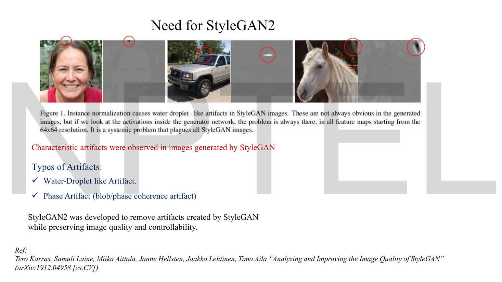
*Fig. — Look at the pairs, not the photos. The left image of each pair looks fine; the right one is an internal activation map, and the red circle marks a blob that is present in **every** such map from $64\times64$ up. The droplet is usually hidden in the output and always present inside. Page 3.*

| Artefact | What you see | Root cause (this lecture's verdict) | Fix |
|---|---|---|---|
| **Water-droplet artefact** | a small bright blob, like a drop of water on a lens; always present in internal feature maps from $64\times64$ upward | **AdaIN's instance normalisation** | remove AdaIN; use **weight modulation + demodulation** |
| **Phase artefact** (blob / phase-coherence artefact) | details such as teeth or eyes stay locked to the camera while the face rotates, then jump | **progressive growing** | remove progressive growing; **skip connections** in $G$, **residual connections** in $D$ |

The deck's one-line mission statement: *"StyleGAN2 was developed to remove artifacts created by StyleGAN while preserving image quality and controllability."* Preserving controllability matters — it would be easy to kill the droplet by deleting the style mechanism, and that would also delete the thing StyleGAN was for.

### Diagnosis 1 — why AdaIN creates a droplet

This is the heart of the lecture, and it is a cause-and-effect chain with four links. Walk it slowly.

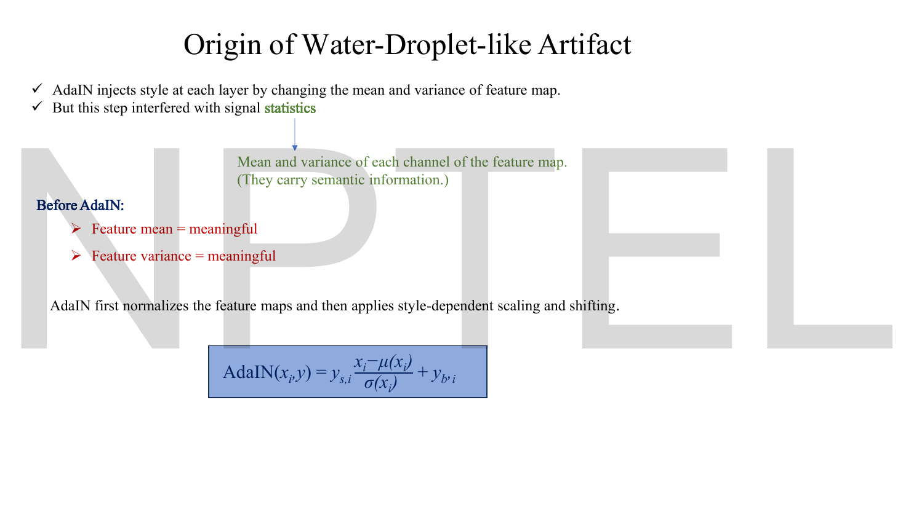
*Fig. — The two red lines are the premise of the whole diagnosis: **before** AdaIN, the per-channel mean and variance are meaningful — they carry semantic information. AdaIN then overwrites them. Page 5.*

**Link 1 — the feature statistics carry information.** Each channel of a feature map has a mean and a variance. The deck is explicit that these are not bookkeeping: *"They carry semantic information."* How bright a channel is, and how much it varies across the image, is part of what that channel is saying.

**Link 2 — AdaIN deletes them.** AdaIN first normalises each channel to zero mean and unit variance, then rescales and reshifts using the style. Restating the deck's formula once (its definition and derivation are [Lec 41](41-stylegan.md)'s):

$$\text{AdaIN}(x_i, \mathbf{y}) = y_{s,i}\,\frac{x_i - \mu(x_i)}{\sigma(x_i)} + y_{b,i}$$

Here $x_i$ is channel $i$ of the feature map, $\mu(x_i)$ and $\sigma(x_i)$ are that channel's own mean and standard deviation over the spatial positions, and $y_{s,i}, y_{b,i}$ are the style's scale and bias for that channel. The point for us is the fraction. After dividing by $\sigma(x_i)$ the channel has standard deviation exactly 1, **whatever it had before**. The original magnitude is gone. The only magnitude that survives into the next layer is $y_{s,i}$, which the style dictates.

So the generator has lost a degree of freedom it wants. It would like to say "this channel should come out weak relative to its own content" — and AdaIN forbids it.

**Link 3 — the generator finds a loophole.**

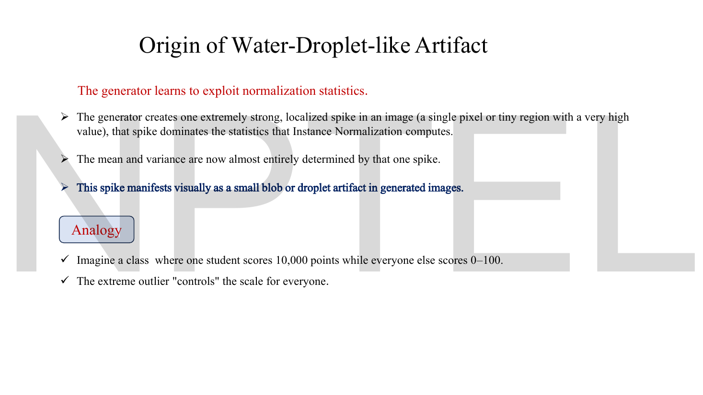
*Fig. — The mechanism in the generator's own terms. The verb that matters is **exploit**: nothing forced this, the adversarial objective rewarded it. The analogy at the bottom is the lecturer's and it is exactly right — one outlier controls the scale for everybody. Page 6.*

The deck's three bullets, which you should be able to recite:

1. The generator creates **one extremely strong, localised spike** — a single pixel or tiny region with a very high value — and that spike dominates the statistics instance normalisation computes.
2. The mean and variance are now **almost entirely determined by that one spike**.
3. That spike **manifests visually as a small blob or droplet**.

Why does that help the generator? Because $\sigma(x_i)$ is now huge. Dividing by a huge $\sigma$ crushes *all the real content* of the channel into a tiny band around zero — and then $y_{s,i}$ scales that band back up by whatever factor the style asks for. The spike is a **gain control that AdaIN cannot see**. The generator has smuggled the magnitude information past the normaliser by hiding it in the denominator.

N2 below puts numbers on this. The short version: in the deck's own classroom analogy, nine students scoring 0 to 100 plus one scoring 10,000 come out of normalisation squeezed into a band **92 times narrower** than if the outlier were absent. The outlier did not just skew the scale — it *is* the scale.

**Link 4 — it starts at 64×64.** The deck twice notes the artefact appears around $64\times64$ and strengthens at higher resolutions. The reason is capacity: at $4\times4$ there are 16 spatial positions and a spike would cost you 1/16 of the image, which the discriminator notices. At $64\times64$ there are 4,096, so one sacrificed pixel costs 0.024% of the image — cheap enough that the gain-control benefit outweighs the realism penalty.

> **State the diagnosis as one sentence and you have the exam answer:** *AdaIN normalises each channel to fixed statistics, destroying the magnitude information the generator needs, so the generator manufactures a localised spike that dominates those statistics and thereby regains control of the scale — and that spike is the droplet.*

### Fix 1 — weight modulation and demodulation

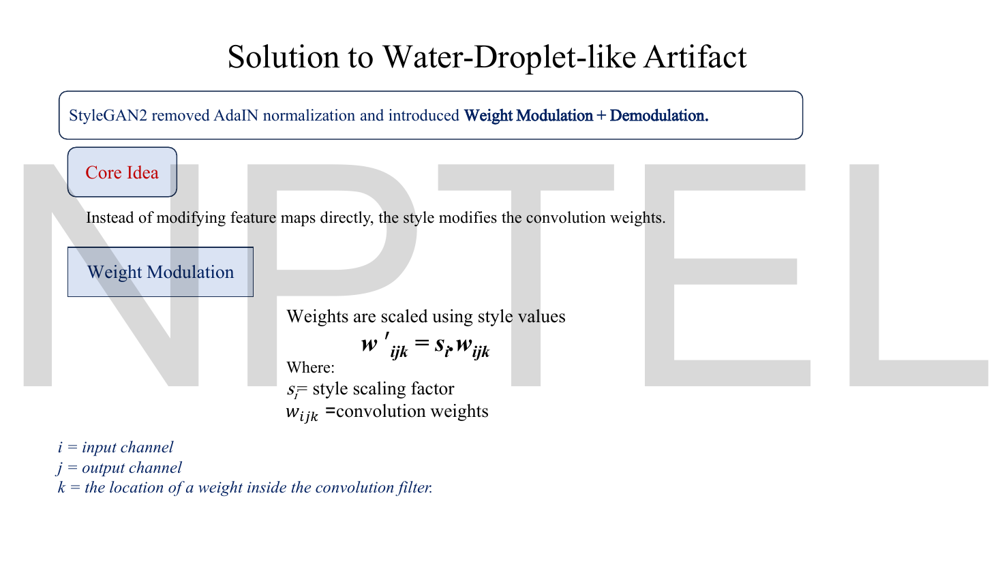
*Fig. — The core idea in one line: **the style modifies the convolution weights, not the feature maps**. Memorise the index convention in italics at the bottom — $i$ input channel, $j$ output channel, $k$ position inside the filter. Page 7.*

The replacement is built on an observation about linear operators. Scaling the *input* of a convolution by $s_i$ and scaling the convolution's *weights* for input channel $i$ by $s_i$ produce the identical output. So instead of touching the activations at all, fold the style into the weights.

**Weight modulation.** For a convolution with weights $w_{ijk}$ — input channel $i$, output channel $j$, position $k$ inside the filter:

$$w'_{ijk} = s_i \cdot w_{ijk}$$

$s_i$ is the **style scaling factor** for input channel $i$, produced by an affine transformation of $\mathbf{w} \in \mathcal{W}$ exactly as the `A` box did in StyleGAN 1. Note that $s$ is indexed by the *input* channel, so one style value rescales a whole slice of the weight tensor.

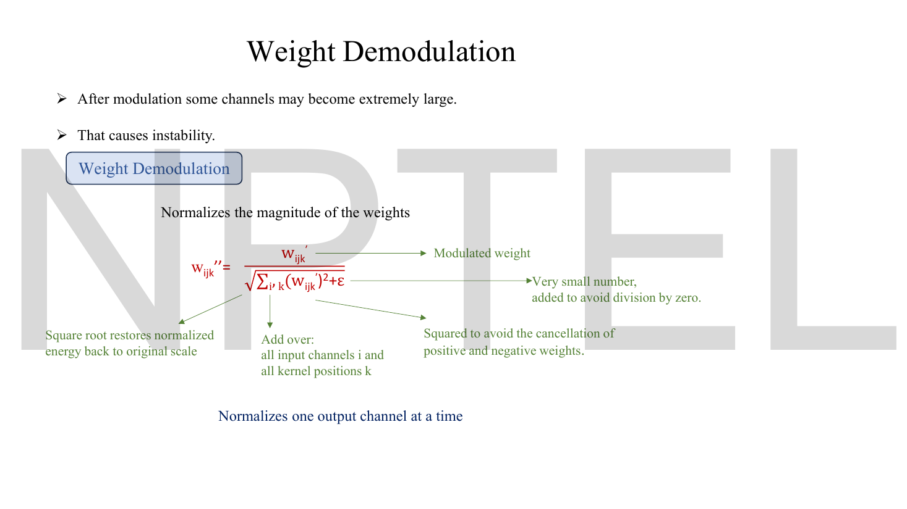
*Fig. — Read the four green arrows; the exam questions are in them. The sum runs over $i$ and $k$ but **not** $j$, which is what "normalizes one output channel at a time" means. Page 8.*

**Weight demodulation.** Modulation alone is unstable — the deck: *"After modulation some channels may become extremely large. That causes instability."* So renormalise:

$$w''_{ijk} = \frac{w'_{ijk}}{\sqrt{\sum_{i,k} (w'_{ijk})^2 + \epsilon}}$$

Every piece of that expression is annotated on the slide, and each annotation is a potential MCQ:

| Piece | The deck's reason |
|---|---|
| sum over $i$ **and** $k$ | "Add over all input channels $i$ and all kernel positions $k$" — everything that feeds one output channel |
| sum **not** over $j$ | "Normalizes one output channel at a time" — each output channel gets its own denominator |
| the squaring | "Squared to avoid the cancellation of positive and negative weights" |
| the square root | "Square root restores normalized energy back to original scale" — undoes the squaring's change of units |
| $+\,\epsilon$ | "Very small number, added to avoid division by zero" |

**Why this reproduces AdaIN's effect.** Suppose the inputs to the convolution are independent with unit variance. Then the output's variance is the sum of the squared weights — so dividing the weights by $\sqrt{\sum_{i,k}(w'_{ijk})^2}$ makes the output's standard deviation exactly 1. That is the *same statistical outcome* instance normalisation was buying, obtained without ever looking at the actual activations. N4 verifies this to four decimal places.

And now the loophole is sealed. A spike in the feature map no longer changes anything, because the normalising constant is computed from the **weights** — which are the same for every image in the batch and have no idea a spike exists. There is nothing to exploit.

| | AdaIN (StyleGAN 1) | Weight demodulation (StyleGAN 2) |
|---|---|---|
| What is normalised | the activations (feature map) | the convolution weights |
| Depends on the actual data? | **yes** — on $\mu(x_i)$, $\sigma(x_i)$ of this image | **no** — on the weights only |
| Statistics used | true, measured, per-image | assumed (unit-variance independent inputs) |
| Exploitable by a spike? | **yes** — this is the droplet | no |
| Computed per | input channel, per image | output channel, per layer |
| Removes the mean too? | yes (subtracts $\mu$) | **no** — only the scale is handled |

That last row is a real difference and a good discriminator: AdaIN centres *and* scales; demodulation only scales. StyleGAN 2 handles the shift with ordinary learned biases instead.

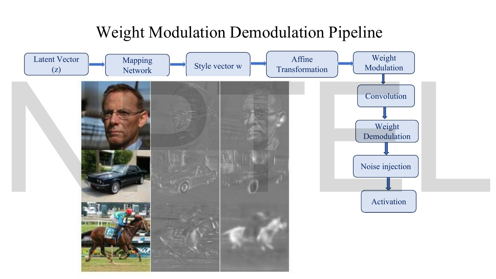
*Fig. — The revised block, in order. Notice where demodulation sits: **after** the convolution in the diagram's flow, because in practice you fold it into the weights before convolving and the two orderings are equivalent. Notice also what survives from StyleGAN 1 unchanged — the mapping network, the affine transform, the noise injection, the activation. Only the AdaIN box was swapped. Page 9.*

### Diagnosis 2 — why progressive growing creates a phase artefact

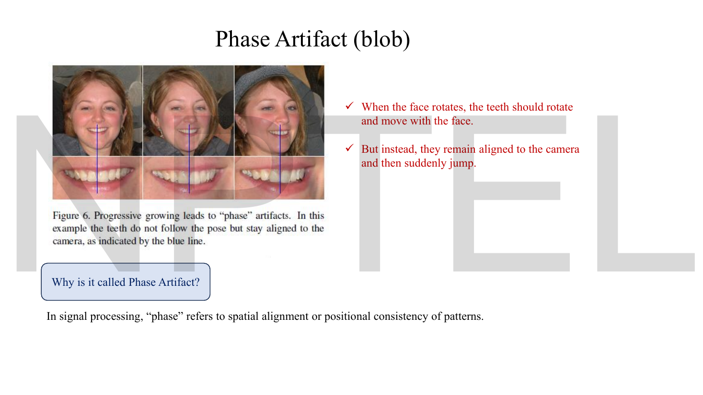
*Fig. — The blue line is the whole evidence. The head turns through three poses; the teeth do not turn with it. They stay aligned to the camera and then snap. Page 10.*

The deck's definition is worth taking literally: *"In signal processing, 'phase' refers to spatial alignment or positional consistency of patterns."* A phase artefact is therefore a **positional** failure, not a texture failure. The teeth are rendered perfectly; they are rendered in the wrong place. The same defect is what makes StyleGAN video flicker, and is sometimes called "texture sticking" — a texture that belongs to the object stays glued to the screen instead.

Page 11 defines the vocabulary you need, over a leaf photograph with a pixel grid laid on it:

| Region | The deck's definition |
|---|---|
| **Low-frequency** | neighbouring pixels are similar · changes are small and gradual · the image is smooth |
| **High-frequency** | neighbouring pixels change sharply · large jumps occur between adjacent pixels · sharp edges, fine texture, detailed patterns |

and states the cause in one bullet: under progressive growing, layers are **"forced to generate fine details too early beyond their spatial resolution capability."**

The causal chain:

1. Progressive growing trains at $4\times4$ first, then inserts an $8\times8$ block, then $16\times16$, and so on. At each stage **the current resolution is temporarily the final output** and is judged by the discriminator as a finished image.
2. So the $64\times64$ layer must, for a while, produce a convincing *complete* image on its own — including high-frequency detail like teeth.
3. But $64\times64$ does not have the spatial precision for that. The deck: *"one pixel covers a large image region."*
4. To fake detail it cannot resolve, the layer learns **position-dependent** features — it memorises "teeth go here, at this pixel" rather than "teeth go wherever the mouth is".
5. Those features are then inherited by every later stage, and the position-lock is baked in permanently.

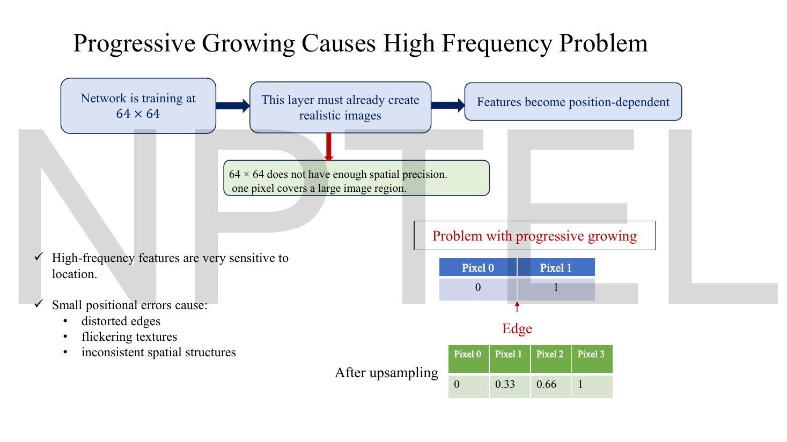
*Fig. — The small table bottom right is the lecture's only piece of arithmetic, and it is the point of the whole slide: a crisp edge between a 0 pixel and a 1 pixel becomes a four-pixel **ramp** after upsampling. The edge has been smeared across two extra pixels and its location is now ambiguous. Reproduced and checked in N1. Page 12.*

The deck lists what positional error costs you: **distorted edges, flickering textures, inconsistent spatial structures**. All three are symptoms of the same thing — high-frequency features are extremely sensitive to location, so a small positional error that would be invisible in a smooth region is catastrophic at an edge.

### Fix 2 — a fixed architecture, with skip and residual connections


*Fig. — The left/right contrast is the single most examinable slide in the lecture. Left, StyleGAN: Stage 1 is $4\times4$ only, Stage 2 inserts an $8\times8$ block, Stage 3 inserts $16\times16$ — "architecture changes continuously". Right, StyleGAN2: all resolutions $4\times4$ through $1024\times1024$ exist **from the first training iteration**, no new layers are ever inserted — "architecture is fixed". Page 13.*

Three changes, in the deck's order:

1. **Kept the architecture fixed.** The whole $4\times4 \to 8\times8 \to \cdots \to 1024\times1024$ stack exists from iteration one. No layer is ever inserted mid-training, so no intermediate resolution is ever asked to be a finished image.
2. **Skip connections in the generator.**
3. **Residual connections in the discriminator.**

Points 2 and 3 are not cosmetic. Removing progressive growing removes the thing that made the networks trainable in the first place, so something has to replace it.

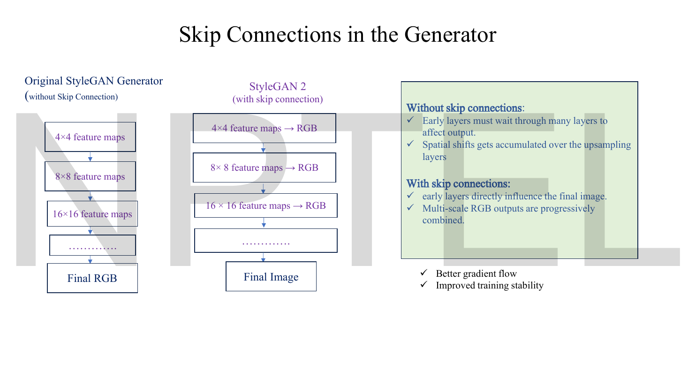
*Fig. — The structural difference: in StyleGAN 1 only the last block touches RGB; in StyleGAN 2 **every** resolution emits an RGB image and they are summed into the output. The green box gives the two reasons — without skips, early layers must "wait through many layers to affect output", and **spatial shifts get accumulated over the upsampling layers**. That second bullet is the phase-artefact link. Page 14.*

**Generator skip connections.** Each resolution produces its own RGB image; these multi-scale RGB outputs are progressively combined. Two consequences the deck names: *"early layers directly influence the final image"*, and better gradient flow / improved training stability. The phase-relevant one is the accumulation argument — if a $16\times16$ feature has a half-pixel positional error and must pass through six more upsampling stages to reach the output, that error compounds. A direct route to the output means the error is seen and corrected immediately.

Note this is **not** progressive growing in disguise. Progressive growing changed the *network* over time; skip connections are a fixed topology present from iteration one. The superficial resemblance — multiple resolutions contributing to the output — is exactly the trap an exam will set.

**Discriminator residual connections.** The argument runs through network depth:

Page 16 states the cost of the fix. Under progressive growing the discriminator *started* shallow, because it only ever saw small images — it climbed $4\times4 \to 8\times8 \to 16\times16 \to 32\times32 \to \cdots \to 1024\times1024$ alongside the generator, and the deck notes it "initially handled only small images" and "required a shallow network". Remove growing and, in the deck's red box, *"the discriminator initially only has to process large image ($1024\times1024$)"* — so it must be deep on iteration one.

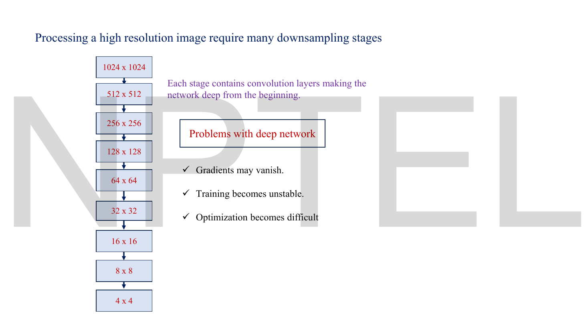
*Fig. — Count the boxes: nine resolution levels, eight downsampling stages, and "each stage contains convolution layers", so the network is deep from the beginning. The three red problems are the generic deep-network ones, arriving here for a new reason — they are the *cost* of fixing the phase artefact. Page 17.*

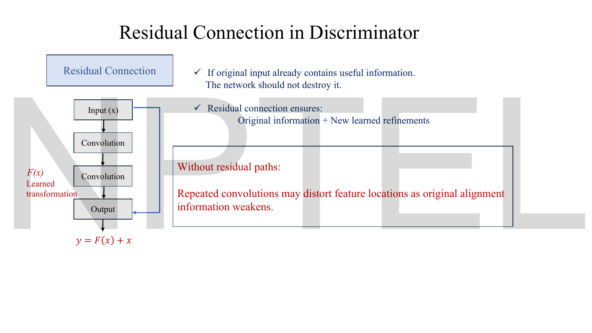
*Fig. — The residual block and its equation. The red box is the phase-specific argument, distinct from the usual gradient one: without a bypass, **repeated convolutions distort feature locations as the original alignment information weakens**. Page 18.*

$$y = F(x) + x$$

$F(x)$ is the learned transformation; $x$ arrives unchanged alongside it. The deck's framing is information-preservation, not gradients: *"If original input already contains useful information, the network should not destroy it"*, so the residual connection guarantees **original information + new learned refinements**. For phase specifically, the bypass carries the *un-resampled* spatial alignment forward, so positional information cannot be slowly washed out by a stack of convolutions.

And then the logic closes: *"A stronger and spatially stable discriminator forces the generator to produce properly aligned image features."* The generator is not told to fix its phase; it is fixed by making the referee able to notice.

### What changed, StyleGAN 1 → StyleGAN 2

This is the table to walk into the exam with.

| Component | StyleGAN 1 | StyleGAN 2 | Why it changed |
|---|---|---|---|
| Mapping network $f$, 8 FC layers | yes | **unchanged** | it was never the problem |
| $\mathcal{W}$ space, style vector $\mathbf{w}$ | yes | **unchanged** | controllability must be preserved |
| Affine transform `A` per layer | yes | **unchanged** | still how $\mathbf{w}$ reaches each block |
| Style injection mechanism | **AdaIN** on activations | **weight modulation + demodulation** on weights | AdaIN's per-channel normalisation was exploitable → droplet |
| Mean subtraction | yes, inside AdaIN | **dropped**; ordinary biases instead | only the scale needed normalising |
| Noise injection `B` | yes | **unchanged** (moved outside the style block) | stochastic detail still wanted |
| Training schedule | **progressive growing**, layers inserted in stages | **fixed architecture** from iteration 1 | growing forced early layers to fake high frequencies → phase artefact |
| Generator output path | final block only → RGB | **every resolution → RGB, summed** (skip connections) | early layers need a direct route; stops shift accumulation |
| Discriminator topology | plain, shallow at first | **residual**, $y = F(x)+x$, deep from the start | full resolution from iteration 1 makes it deep; residuals preserve alignment and gradients |
| Latent-space smoothness | not regularised | **path-length regularisation** (not on these slides — see *Beyond the slides*) | smooth $\mathcal{W}\to$ image maps correlate with quality |

## Worked numericals

The slides contain exactly **one** worked numerical: the four-pixel upsampling table on page 12. It is N1, and my arithmetic agrees with it to the precision shown, with one rounding quibble. N2–N6 are constructed to make the lecture's claims computable.

### N1. The slide's own upsampling example (page 12)

**Given:** a two-pixel edge at low resolution, Pixel 0 $= 0$, Pixel 1 $= 1$. Upsample $2\times$ with linear interpolation to four pixels.
**Find:** the four output values, and what happened to the edge.

1. Four output samples span the same interval as the original two, so the output positions sit at fractions $0, \tfrac13, \tfrac23, 1$ of the way from the first source pixel to the second.
2. Linear interpolation: $\text{out}_m = 0 + \frac{m}{3}(1-0) = \frac{m}{3}$ for $m = 0,1,2,3$.
3. $\frac{0}{3}=0$; $\frac{1}{3}=0.3333$; $\frac{2}{3}=0.6667$; $\frac{3}{3}=1$.

**Answer:** $[0,\ 0.3333,\ 0.6667,\ 1]$ — matching the slide's $[0,\ 0.33,\ 0.66,\ 1]$.

> **Slide quibble:** the deck prints $0.66$ for $\tfrac23$. Correctly rounded to two decimals that is $\mathbf{0.67}$; $0.66$ is truncation, not rounding. The physics of the slide is unaffected, but if an MCQ offers both, $0.67$ is the right answer for "2 d.p.".

The interpretation is the examinable part. Before upsampling, the edge was a **single step** between two adjacent pixels — its location was exact. After upsampling it is a **ramp spread over four pixels** with no single location. The sharp, high-frequency event has been replaced by a gradual one, and any later layer that wants a crisp edge there must invent it — which is exactly what "layers forced to generate fine details beyond their spatial resolution capability" means.

### N2. The deck's classroom analogy, as arithmetic

**Given:** page 6's analogy. Nine "ordinary" values spread evenly over 0 to 100 — $\{0, 12.5, 25, 37.5, 50, 62.5, 75, 87.5, 100\}$ — and one outlier at $10{,}000$. Treat these ten numbers as one channel of a feature map.
**Find:** what instance normalisation does to the nine ordinary values, with and without the outlier present.

1. **Without the outlier.** Mean $= 50$. Variance $= \frac{1}{9}\sum(x-50)^2$; the deviations are $\pm50, \pm37.5, \pm25, \pm12.5, 0$, giving $\frac{2(2500+1406.25+625+156.25)}{9} = \frac{2(4687.5)}{9} = 1041.667$, so $\sigma = 32.2749$.
2. Normalised, the nine values run from $\frac{0-50}{32.2749} = -1.5492$ to $\frac{100-50}{32.2749} = +1.5492$. **Spread $= 3.0984$.**
3. **With the outlier.** Mean $= \frac{450 + 10000}{10} = 1045$.
4. Variance $= \frac{1}{10}\big[\sum_{\text{nine}}(x-1045)^2 + (10000-1045)^2\big]$. The nine contribute $8{,}911{,}406.25$ and the outlier contributes $8955^2 = 80{,}192{,}025$, total $89{,}103{,}431.25$; divided by 10 gives $8{,}910{,}343.1$, so $\sigma = 2985.157$.
5. Normalised, the nine now run from $\frac{0-1045}{2985.157} = -0.3501$ to $\frac{100-1045}{2985.157} = -0.3166$. **Spread $= 0.03350$.**
6. Compression factor: $3.0984 / 0.03350$.

**Answer:** the nine real values are squeezed into a band **92.5 times narrower** by the presence of a single outlier, while the outlier itself lands at $+3.000$. The outlier has consumed essentially the entire variance budget that normalisation hands out.

This is the droplet in one calculation. The generator does not want a bright dot; it wants the other 4,095 pixels of that channel to leave the normaliser quietly, and a spike is the only lever instance normalisation leaves it.

### N3. Weight modulation and demodulation, end to end

**Given:** one output channel $j$ of a convolution with $2$ input channels and a $1\times2$ kernel (so $i \in \{1,2\}$, $k \in \{1,2\}$, four weights):

$$w_{ijk} = \begin{bmatrix} 0.3 & -0.4 \\ 0.8 & 0.6 \end{bmatrix} \quad \text{(row } = i,\ \text{column } = k)$$

and style scales $s_1 = 2.0$, $s_2 = 1.0$. Take $\epsilon = 10^{-8}$.
**Find:** $w'_{ijk}$ and $w''_{ijk}$.

1. **Modulate**, $w'_{ijk} = s_i w_{ijk}$ — row 1 doubles, row 2 unchanged:
$$w' = \begin{bmatrix} 0.6 & -0.8 \\ 0.8 & 0.6 \end{bmatrix}$$
2. **Sum of squares over $i$ and $k$** (all four entries, because they all feed output channel $j$):
$$\textstyle\sum_{i,k}(w'_{ijk})^2 = 0.36 + 0.64 + 0.64 + 0.36 = 2.00$$
3. **Denominator:** $\sqrt{2.00 + 10^{-8}} = 1.414214$.
4. **Demodulate**, dividing every entry by $1.414214$:
$$w'' = \begin{bmatrix} 0.424264 & -0.565685 \\ 0.565685 & 0.424264 \end{bmatrix}$$
5. **Check:** $0.424264^2 = 0.18$ and $0.565685^2 = 0.32$, so $\sum_{i,k}(w''_{ijk})^2 = 2(0.18 + 0.32) = 1.000000$. ✓

**Answer:** $w'' = [[0.4243, -0.5657],[0.5657, 0.4243]]$, with squared weights summing to exactly 1.

Two things to notice. The *unmodulated* weights had $\sum w^2 = 0.09+0.16+0.64+0.36 = 1.25$, so they were never unit-energy to begin with — demodulation normalises the modulated weights, not the style. And $\epsilon = 10^{-8}$ changed nothing here; it exists only for the case where a style drives every weight of an output channel to near zero.

### N4. Does demodulation actually reproduce AdaIN's effect?

**Given:** the same $w, w', w''$ as N3, and a convolution input whose four contributing values are independent with mean 0 and variance 1.
**Find:** the standard deviation of the output under each of the three weight sets.

1. For independent unit-variance inputs $x_m$ and weights $a_m$, $\operatorname{Var}\big(\sum_m a_m x_m\big) = \sum_m a_m^2$ — the cross terms vanish because the inputs are independent.
2. Original weights: $\sqrt{1.25} = 1.1180$.
3. Modulated weights: $\sqrt{2.00} = 1.4142$ — the style has made this channel **41% hotter** than before. Stack forty such layers and you are off by $1.4142^{40} \approx 1.1\times10^{6}$. *"After modulation some channels may become extremely large. That causes instability."*
4. Demodulated weights: $\sqrt{1.000000} = 1.0000$.

**Answer:** $1.1180$, $1.4142$, $1.0000$. Demodulation delivers unit output standard deviation exactly, which is what AdaIN's $\frac{x_i - \mu}{\sigma}$ delivered — **but computed from the weights, so no feature-map spike can influence it.** The Monte-Carlo check in the Code section lands on $0.9991$, $1.0002$ and $0.9995$ for three different styles, confirming the algebra.

### N5. How deep must the discriminator be once progressive growing is gone?

**Given:** page 17's column, $1024\times1024$ down to $4\times4$, halving each side at every stage.
**Find:** the number of resolution levels and downsampling stages, and the earliest training iteration at which the full depth is active, under each training scheme.

1. Resolutions: $1024, 512, 256, 128, 64, 32, 16, 8, 4$ — count them: **9 levels**.
2. Downsampling stages = levels $-\,1 = 8$. Check: $\log_2(1024/4) = \log_2 256 = 8$. ✓
3. The deck says "each stage contains convolution layers"; at the StyleGAN 2 paper's two convolutions per level that is $9\times2 = 18$ convolution layers minimum, before the final classifier.
4. **With progressive growing:** at iteration 1 only the $4\times4$ level exists — 1 level, 0 downsampling stages, "a shallow network".
5. **Without progressive growing:** all 9 levels and all 8 downsampling stages are active at **iteration 1**.

**Answer:** 9 levels, 8 downsampling stages, $\geq$ 18 convolution layers, live from iteration 1 instead of being phased in. That jump from depth-1 to depth-18 on the very first step is precisely why residual connections became mandatory — it is the deck's "gradients may vanish / training becomes unstable / optimization becomes difficult" box, caused by the fix for a different problem.

### N6. Path-length regularisation on a toy generator (beyond the slides)

The deck does not cover this; it is the third of StyleGAN 2's headline contributions and it is on the syllabus for this chapter, so here it is with numbers. See *Beyond the slides* for the full statement.

**Given:** a toy generator $g(\mathbf{w}) = (w_1^3,\ w_2)$ mapping a 2-D latent to a 2-D "image". Probe it at $w_1 = 0.5, 1.0, 2.0$ by stepping a distance $\epsilon = 0.01$ in the $w_1$ direction.
**Find:** the local stretch $\ell = \lVert g(\mathbf{w}+\epsilon\hat{\mathbf{d}}) - g(\mathbf{w})\rVert / \epsilon$ at each point, and the path-length penalty $\mathbb{E}[(\ell - a)^2]$ where $a$ is the running mean of $\ell$.

1. Exact local stretch is $\frac{d}{dw_1}w_1^3 = 3w_1^2$: at $w_1 = 0.5$, $3(0.25) = 0.75$; at $1.0$, $3$; at $2.0$, $3(4) = 12$.
2. Finite-difference check with $\epsilon = 0.01$: $0.7651$, $3.0301$, $12.0601$ — agreeing with 1 to the first decimal, the discrepancy being the step size.
3. **Ratio of largest to smallest stretch: $12/0.75 = 16$.** The same-sized nudge in $\mathcal{W}$ moves the image sixteen times further in one region than another. That is exactly the "latent interpolation produces jumps" complaint from [Lec 28](28-latent-interpolation.md).
4. Running mean $a = \frac{0.75+3+12}{3} = 5.25$.
5. Penalties: $(0.75-5.25)^2 = 20.25$; $(3-5.25)^2 = 5.0625$; $(12-5.25)^2 = 45.5625$.
6. Mean penalty $= \frac{20.25+5.0625+45.5625}{3} = \frac{70.875}{3}$.

**Answer:** penalty $= 23.625$, driven overwhelmingly by the $w_1 = 2$ region. Gradient descent on this term pushes the stretch toward a common value — a generator in which equal steps in $\mathcal{W}$ cause equal-sized changes in the image, everywhere. A perfectly uniform generator ($\ell = a$ at every point) scores **0**.

## Code

The two central claims of the lecture — *a spike lets the generator cheat instance normalisation*, and *demodulated weights deliver unit output variance for any style* — are both checkable in twenty lines.

```python
import numpy as np
rng = np.random.default_rng(0)

# ---------- 1. Why a spike lets the generator cheat instance normalisation ----------
def instance_norm(c):                        # per-channel: zero mean, unit variance
    return (c - c.mean()) / c.std()

base   = rng.normal(0, 1, size=(8, 8))       # the real content of one feature-map channel
spiked = base.copy(); spiked[3, 4] = 200.0   # ONE pixel given a huge value

n_clean, n_spiked = instance_norm(base), instance_norm(spiked)
mask = np.ones_like(base, bool); mask[3, 4] = False   # measure the CONTENT only

a, b = n_clean[mask].std(), n_spiked[mask].std()
print("content std after normalisation, no spike :", round(a, 4))
print("content std after normalisation, w/ spike :", round(b, 4))
print("attenuation the one spike bought          :", round(a / b, 1), "x")

# ---------- 2. Weight modulation + demodulation ----------
w = np.array([[0.3, -0.4],                   # [input channel i, kernel tap k]
              [0.8,  0.6]])

def conv_out_std(W, n=400_000):              # iid unit-variance input into the conv
    X = rng.normal(0, 1, size=(n, W.size))
    return (X @ W.ravel()).std()

print("\n style s     sum(w')^2   std(out) modulated   std(out) demodulated")
for s in ([1.0, 1.0], [2.0, 1.0], [5.0, 0.2]):
    lab = str(s)
    s = np.asarray(s)
    w_mod   = w * s[:, None]                               # w'_ijk  = s_i * w_ijk
    w_demod = w_mod / np.sqrt((w_mod**2).sum() + 1e-8)     # w''_ijk
    print(f" {lab:<11} {(w_mod**2).sum():>7.4f}"
          f"      {conv_out_std(w_mod):>8.4f}              {conv_out_std(w_demod):>8.4f}")
```

```
content std after normalisation, no spike : 1.0053
content std after normalisation, w/ spike : 0.0369
attenuation the one spike bought          : 27.2 x

 style s     sum(w')^2   std(out) modulated   std(out) demodulated
 [1.0, 1.0]   1.2500        1.1174                0.9991
 [2.0, 1.0]   2.0000        1.4140                1.0002
 [5.0, 0.2]   6.2900        2.5015                0.9995
```

Read both blocks carefully.

**Block 1** is the droplet. The channel's real content comes out of normalisation with standard deviation $1.0053$ when it is alone, and $0.0369$ when a single pixel out of 64 is set to 200 — a **27× attenuation that the generator chose and the normaliser cannot see**. It is a free gain knob, and the price is one visible bright dot. (N2's figure is 92× because its outlier is relatively larger; the factor scales with the spike, which is why the generator makes the spike as large as it can get away with.)

**Block 2** is the fix. The third column is the modulated-only output: $1.1174$, $1.4140$, $2.5015$ — drifting with the style, and the drift compounds layer after layer. The fourth column is after demodulation: $0.9991$, $1.0002$, $0.9995$ for three wildly different styles. Unit variance, every time, **and the numbers come from the weights, so nothing a spike does to a feature map can change them.** That one property is the entire reason the droplet disappears.

## Exam pack

### Must-memorise

| Item | Exactly this |
|---|---|
| The two StyleGAN artefacts | water-droplet artefact · phase artefact (blob / phase-coherence artefact) |
| Droplet's cause | AdaIN's **instance normalisation** |
| Droplet's mechanism | generator makes one strong localised spike that dominates the normalisation statistics |
| Where the droplet appears | **all feature maps from $64\times64$ resolution upward**, systemic to every StyleGAN image |
| Droplet's fix | remove AdaIN; **weight modulation + demodulation** |
| Core idea of the fix | "the style modifies the **convolution weights**", not the feature maps |
| Weight modulation | $w'_{ijk} = s_i \cdot w_{ijk}$ |
| Weight demodulation | $w''_{ijk} = \dfrac{w'_{ijk}}{\sqrt{\sum_{i,k}(w'_{ijk})^2 + \epsilon}}$ |
| Index convention | $i$ = input channel · $j$ = output channel · $k$ = position inside the filter |
| What the sum runs over | $i$ and $k$ — **not** $j$; "normalizes one output channel at a time" |
| AdaIN (for the contrast only) | $\text{AdaIN}(x_i,\mathbf{y}) = y_{s,i}\frac{x_i-\mu(x_i)}{\sigma(x_i)} + y_{b,i}$ |
| Phase artefact's cause | **progressive growing** |
| "Phase", defined | signal-processing term for spatial alignment / positional consistency of patterns |
| Phase artefact's fix | remove progressive growing; fixed architecture; **skip connections in $G$**, **residual connections in $D$** |
| Residual block | $y = F(x) + x$ |
| Why residual, per the deck | original information + new learned refinements; without it "repeated convolutions may distort feature locations" |
| Why skip, per the deck | early layers directly influence the final image; spatial shifts stop accumulating over upsampling |
| StyleGAN 2 pipeline order | $\mathbf{z}$ → mapping network → $\mathbf{w}$ → affine transform → weight modulation → convolution → weight demodulation → noise injection → activation |
| The paper | Karras, Laine, Aittala, Hellsten, Lehtinen, Aila, *Analyzing and Improving the Image Quality of StyleGAN*, arXiv:1912.04958 |

### Numbers worth knowing

| Quantity | Value |
|---|---|
| Resolution where the droplet starts | $64\times64$ |
| Deck's outlier analogy | one student 10,000, everyone else 0–100 |
| That analogy's compression factor (N2) | $\mathbf{92.5\times}$ narrower band for the ordinary values |
| Slide's upsampled edge (p-12) | $0,\ 0.33,\ 0.66,\ 1$ — exactly $0,\ \tfrac13,\ \tfrac23,\ 1$ |
| $\tfrac23$ to 2 d.p. | $0.67$ (the slide prints $0.66$) |
| N3 modulated weight energy $\sum(w')^2$ | $2.00$, so denominator $=\sqrt2 = 1.4142$ |
| Output std, modulated only / demodulated | $1.4142$ / $1.0000$ |
| StyleGAN 2 resolution range | $4\times4 \to 1024\times1024$ |
| Resolution levels in that range | **9** |
| Downsampling stages | **8** $= \log_2(1024/4)$ |
| $\epsilon$ in the demodulation denominator | a very small constant, $\sim10^{-8}$, to avoid dividing by zero |
| Progressive growing stages (deck's list) | Stage 1 $4\times4$ · Stage 2 inserts $8\times8$ · Stage 3 inserts $16\times16$ · … |
| StyleGAN 2 architecture-change count during training | **zero** — no layers inserted after iteration 1 |
| N6 toy path-length stretch ratio | $16\times$ (12 against 0.75); penalty $23.625$ |

### Likely MCQ traps

- **"Weight demodulation normalises the feature maps."** It does not — that is the thing it replaced. It normalises **weights**, which is why no spike in the data can influence it. Any option containing "activations", "feature map statistics" or "per-image" is describing AdaIN.
- **Summing over the wrong indices.** The demodulation denominator sums over $i$ (input channels) and $k$ (kernel positions), **not** over $j$. Including $j$ would normalise all output channels together and destroy the per-channel scaling. The slide's own gloss is the mnemonic: *normalizes one output channel at a time*.
- **Confusing $\mathbf{w}$ with $w_{ijk}$.** The style vector and the convolution weight share a letter and nothing else.
- **Assuming the droplet is a rendering bug or an upsampling artefact.** It is a *learned strategy*. The generator is rewarded for it. The deck's verb is "exploit".
- **"StyleGAN 2 removed the mapping network / $\mathcal{W}$ space / noise injection."** All three survive untouched. Only AdaIN and progressive growing were removed.
- **Attributing the phase artefact to AdaIN, or the droplet to progressive growing.** Two artefacts, two causes, two fixes — and the exam will cross them. Droplet ↔ AdaIN ↔ demodulation. Phase ↔ progressive growing ↔ fixed architecture + skip/residual.
- **"Skip connections in the generator are progressive growing by another name."** No. Progressive growing *inserts layers during training*; skip connections are a fixed topology active from iteration 1. The deck's contrast is "architecture changes continuously" vs "architecture is fixed".
- **Putting residual connections in the generator and skip connections in the discriminator.** The deck is specific: **skip** in $G$, **residual** in $D$. ($y = F(x)+x$ is the discriminator's.)
- **Thinking removing progressive growing made training easier.** It made it *harder* — the discriminator must be deep from iteration 1, which is why residual connections were needed. The deck's "problems with deep network" box exists only because of the fix.
- **Reading "phase" as colour phase or Fourier phase of the image.** Here it means **spatial alignment / positional consistency**, per the deck's own definition.
- **Forgetting the $+\epsilon$.** It is inside the square root, not outside, and it exists only to prevent division by zero.
- **Rounding $\tfrac23$ as the slide does.** $0.6\overline{6} \to 0.67$ at 2 d.p.

### Self-test

1. Name both StyleGAN artefacts that StyleGAN 2 was built to remove, and give each one's root cause.
2. Explain in three steps why AdaIN causes the generator to produce a bright spike.
3. Write the weight-modulation and weight-demodulation formulas, defining every index.
4. Why does the demodulation sum run over $i$ and $k$ but not $j$?
5. A convolution's weights for one output channel, after modulation, are $[0.6,\ 0.8,\ 0.0,\ 0.0]$. Give the demodulated weights (take $\epsilon$ negligible) and the resulting output standard deviation for independent unit-variance inputs.
6. Give one capability AdaIN has that weight demodulation does not.
7. Define "phase" as this lecture uses the word, and describe the artefact with the deck's teeth example.
8. Why does progressive growing force a layer to learn position-dependent features?
9. State the StyleGAN 2 generator block in pipeline order from $\mathbf{z}$ to the activation.
10. Removing progressive growing created a new problem. What was it, and what two architectural devices solved it?
11. A latent step of size $0.01$ moves the output by $0.0075$ in one region of $\mathcal{W}$ and by $0.12$ in another. What is the stretch ratio, and which StyleGAN 2 contribution targets it?

<details><summary>Answers</summary>

1. **Water-droplet artefact** — caused by AdaIN's instance normalisation. **Phase artefact** (blob / phase-coherence) — caused by progressive growing.
2. (i) AdaIN divides each channel by its own standard deviation, destroying the magnitude information the generator wants to control. (ii) The generator creates one extremely strong localised spike, which then dominates the mean and variance that instance normalisation computes. (iii) Dividing by that inflated $\sigma$ crushes the real content into a narrow band which the style's $y_{s,i}$ then rescales — the spike is a hidden gain control. The spike itself shows up as the droplet.
3. $w'_{ijk} = s_i w_{ijk}$ and $w''_{ijk} = w'_{ijk}\big/\sqrt{\sum_{i,k}(w'_{ijk})^2 + \epsilon}$, with $i$ = input channel, $j$ = output channel, $k$ = position inside the convolution filter, $s_i$ = style scaling factor for input channel $i$, $\epsilon$ a tiny constant preventing division by zero.
4. Because the quantity being normalised is the output variance of **one** output channel $j$, and that variance is the sum of squared weights over everything feeding it — all input channels $i$ and all kernel positions $k$. Each output channel therefore gets its own denominator. Summing over $j$ too would tie all output channels to a single scale.
5. $\sum (w')^2 = 0.36 + 0.64 = 1.00$, so the denominator is $1$ and $w'' = [0.6,\ 0.8,\ 0,\ 0]$ unchanged. Output standard deviation $=\sqrt{1.00} = 1.0$. (This is the case where modulation happened to land on unit energy already.)
6. AdaIN subtracts the mean, so it controls the channel's **shift** as well as its scale; demodulation only controls the scale. StyleGAN 2 handles the shift with ordinary learned biases instead.
7. "Phase" is the signal-processing term for spatial alignment or positional consistency of patterns. In the deck's example the head rotates through three poses while the teeth stay aligned to the camera — rendered correctly but in the wrong place — and then suddenly jump.
8. Under progressive growing each intermediate resolution temporarily acts as the final output and is judged as a finished image. A $64\times64$ layer therefore has to produce convincing high-frequency detail that $64\times64$ cannot spatially resolve ("one pixel covers a large image region"), so it fakes it by memorising where the detail goes rather than what it is attached to — position-dependent features. Later stages inherit the lock.
9. $\mathbf{z}$ → mapping network → style vector $\mathbf{w}$ → affine transformation → weight modulation → convolution → weight demodulation → noise injection → activation.
10. The discriminator had to process full $1024\times1024$ images from the very first iteration, so it had to be deep from the start — bringing vanishing gradients, unstable training and difficult optimisation. Solved by **skip connections in the generator** (every resolution emits RGB, summed into the output) and **residual connections in the discriminator** ($y = F(x)+x$).
11. $0.12/0.0075 = 16\times$. **Path-length regularisation**, which penalises $(\ell - a)^2$ where $\ell$ is the local stretch and $a$ is its running mean, driving the stretch toward a single constant everywhere in $\mathcal{W}$. (Not on these slides — see *Beyond the slides*.)

</details>

## Beyond the slides

**Gap: path-length regularisation is completely absent from this deck.**
**Why it matters:** it is the third of StyleGAN 2's three headline contributions, it is named in this chapter's syllabus, and a question about it is perfectly fair game. The idea: take a latent $\mathbf{w}$, nudge it by a tiny random direction, and measure how far the image moves. Call that local stretch $\ell$. A *good* generator has the same $\ell$ everywhere — equal steps in $\mathcal{W}$ cause equal-sized image changes. The regulariser is

$$\mathcal{L}_{\text{PL}} = \mathbb{E}_{\mathbf{w},\,\hat{\mathbf{d}}}\big[(\ell - a)^2\big]$$

where $a$ is an exponential running average of $\ell$ over training — so the target is *learned*, not fixed, and the penalty only asks for **uniformity**, not any particular scale. The empirical finding that motivated it is the quotable one: generators with smoother $\mathcal{W}\to$ image maps score better on image quality, so smoothness is used as a free extra training signal. The practical bonuses are that a near-uniform map is far easier to invert (projecting a real photo into $\mathcal{W}$), and that [Lec 28](28-latent-interpolation.md)'s interpolations stop jumping. N6 works the arithmetic. The metric it is named after, **perceptual path length (PPL)**, is the same quantity averaged over $\mathcal{W}$ and is StyleGAN 2's reported smoothness score.

**Gap: the deck never states that demodulation's unit-variance guarantee rests on an assumption.**
**Why it matters:** the derivation in N4 needs the inputs to the convolution to be **independent and unit-variance**. Real feature maps are neither — adjacent pixels in an image are strongly correlated. So demodulation is a *statistical approximation* where AdaIN was an exact measurement. That is the trade StyleGAN 2 makes: slightly less accurate normalisation, in exchange for a normalisation that cannot be gamed by the data. Knowing the assumption is what lets you answer "why is demodulation not simply better than AdaIN in every respect?"

**Gap: lazy regularisation is not mentioned.**
**Why it matters:** both the path-length term and the discriminator's R1 gradient penalty are expensive, so StyleGAN 2 evaluates them only every 16 (generator) or 4 (discriminator) minibatches rather than every step — "lazy regularisation" — with essentially no quality loss. It is a standard trick now and explains why reported StyleGAN 2 training costs are lower than you would expect from the loss description. It also connects to [Lec 34](34-gan-convergence.md): the R1 penalty is one of the standard stabilisers for the two-player game.

**Gap: no numbers are given for whether any of this worked.**
**Why it matters:** the deck asserts improvement and shows pictures. The paper's measured result on FFHQ faces is FID $4.40 \to 2.84$ and perceptual path length $212 \to 145$ — both substantial, and both achieved while the architecture got *simpler*. More importantly for exam reasoning: the droplet's disappearance is verified not by looking at outputs but by looking at **internal activations**, which is where the deck said the problem always lived.

**Gap: StyleGAN 2 did not actually fix texture sticking.**
**Why it matters:** this deck presents the skip/residual fix as closing the phase story, and for still images it largely does. But the defect returns the moment you animate — move a StyleGAN 2 latent smoothly and hair and skin texture still cling to screen coordinates. That residue is what **StyleGAN 3** (*Alias-Free GAN*, 2021) was built for, by treating every layer as a continuous signal and filtering properly before every resampling step. If a question asks "which StyleGAN version eliminated texture sticking", the answer is 3, not 2.

## Cut from the slides

Pages 1, 2, 19 and 20 are the title, the contents list, a bare "Summary" divider carrying no content, and the "Next Session: Diffusion Models" card; nothing was lost. Page 15 ("Residual Connections in the Discriminator", the *Core Idea* slide) and page 18 (the residual block diagram) overlap heavily, so page 18 is embedded and page 15's three-bullet definition of phase artefacts — "small spatial misalignments, texture drifting, features tied to pixel phases" — is folded into the prose, along with its closing claim that a spatially stable discriminator forces the generator into alignment. Page 9's three sample images and their feature maps are shown for the pipeline diagram only; the pictures illustrate nothing the text does not say. The deck's figure-reference captions (its Figure 1 and Figure 6, reproduced from the StyleGAN 2 paper) are quoted where they carry information and otherwise dropped. Page 11's leaf photograph is included because the low/high-frequency definitions beside it are examinable vocabulary. Everything else on pages 3 through 18 is reproduced. The one thing the deck never mentions — path-length regularisation — is supplied in *Beyond the slides* rather than silently omitted, because this chapter's syllabus claims it.
