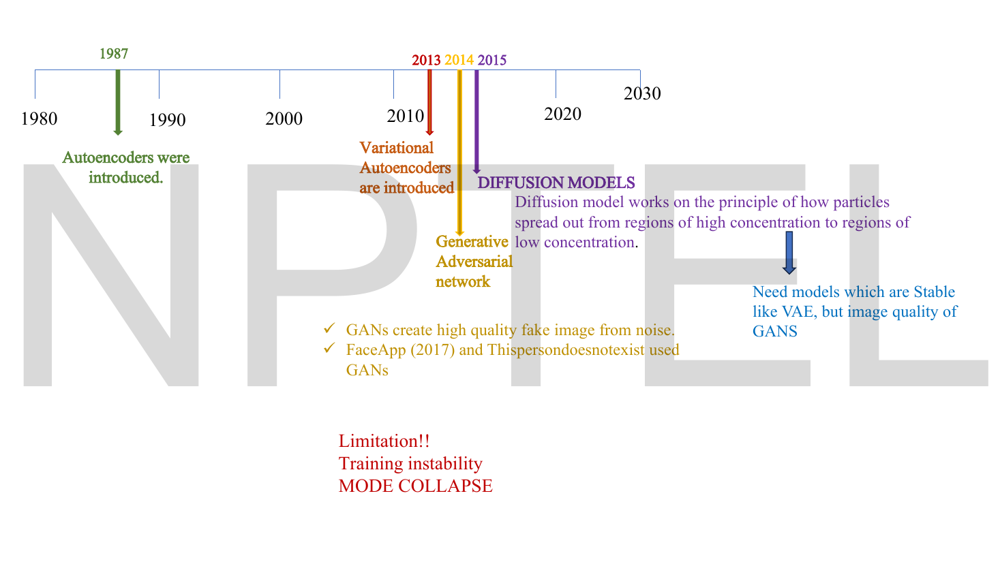

# Lec 44 — Introduction to Diffusion Models

> **Source:** `Lec 44.pdf` (18 pages) · **Week 7** · **Playlist:** Lec 44
> **Prereqs:** [Lec 13 — Denoising Autoencoders](13-denoising-ae.md), [Lec 21 — Introduction to VAE and the Encoder](21-vae-encoder.md), [Lec 34 — GAN Convergence and Nash Equilibrium](34-gan-convergence.md)
> **Feeds into:** [Lec 45 — Mathematics of Diffusion Models](45-diffusion-math.md), [Lec 46 — DDPM Forward Process](46-ddpm-forward.md), [Lec 47 — DDPM Reverse Process](47-ddpm-reverse.md), [Lec 49 — U-Net for Denoising](49-unet.md)

## Why this lecture exists

You have already built a diffusion model. In [Lec 13](13-denoising-ae.md) you took a clean image, deliberately corrupted it with noise, and trained a network to restore it. Corrupt, then restore. That is the entire idea of diffusion — the only thing Week 7 adds is a **schedule**: instead of one fixed noise level, you corrupt across a thousand of them, from barely-touched to pure static, and train one network to undo any single step.

That sounds like more work for the same result. It is not, and the reason is the thread running through this whole lecture. Undoing *all* the corruption at once is a hard problem that no architecture solves cleanly — it is what makes autoencoder outputs bland and VAE outputs blurry. Undoing a 3% perturbation is nearly trivial. Diffusion buys quality by replacing one impossible step with a thousand easy ones, and in doing so it throws away the adversarial game entirely: there is no discriminator, no two-player equilibrium, and therefore no mode collapse.

## The ideas

### Where diffusion comes from: Lec 13, with a schedule

This connection is not on the slides, and it is the single most useful thing you can carry into Week 7.

A **denoising autoencoder** ([Lec 13](13-denoising-ae.md)) is trained like this: take a clean $\mathbf{x}$, corrupt it to $\tilde{\mathbf{x}}$ with noise of some fixed size, and train the network to output $\mathbf{x}$ from $\tilde{\mathbf{x}}$. One corruption level, one restoration.

A **denoising diffusion probabilistic model** is trained like this: take a clean $\mathbf{x}_0$, pick a random timestep $t$, corrupt it to $\mathbf{x}_t$ with the amount of noise that timestep calls for, and train the network to undo *that* step — with $t$ given to the network as an input so it knows how much noise it is facing.

| | Denoising AE (Lec 13) | DDPM (Week 7) |
|---|---|---|
| Corruption | one fixed noise level | a **schedule** of levels, $t = 1 \ldots T$ |
| Network input | $\tilde{\mathbf{x}}$ | $\mathbf{x}_t$ **and** $t$ |
| Trained to recover | the clean image, in one shot | the previous step — equivalently, the noise that was added |
| Used for | denoising, representation learning | **generation**: start from pure noise, step down to $t=0$ |
| Generative? | no — you have nothing to feed it | **yes** — $\mathbf{x}_T$ is just a Gaussian sample you can draw freely |

That last row is the whole trick. A denoising autoencoder is not generative because you cannot invent an input for it — you need a corrupted *real* image to start from. A diffusion model is generative because if the corruption is run long enough, the end state stops depending on the image at all: it is pure Gaussian noise, which you can draw from a random number generator for free. The forward process is a one-way bridge from "the data distribution, which I cannot sample" to "a standard Gaussian, which I can".

The Code section measures the price of *not* having a schedule: a denoiser trained at one noise level is nearly 11× worse than a noise-aware one when the noise level it meets is off by a factor of 8.

### The timeline the deck tells


*Fig. — Act one. Note the self-contradiction on the slide: the blue box says autoencoders are "used for image generation", the red text says they "cannot generate realistic new images". Both are on the deck. The resolution is [Lec 16](16-ae-numerical-and-limits.md)'s: an AE reconstructs, it does not generate. Page 4.*

The deck frames Week 7 as the fourth act of a story you have been reading since Week 2. Each act exists because the previous one failed at something specific.

| Year | Model | What it gave | The deck's stated limitation |
|---|---|---|---|
| 1987 | **Autoencoders** | reconstruct input from a compressed latent; denoising, anomaly detection, feature extraction | *"Traditional autoencoders cannot generate realistic new images"* |
| 2013 | **VAEs** | store the latent as a probability distribution (mean and variance of a Gaussian), so you can sample it → **can** generate new images | *"Often generated images are blurry"* |
| 2014 | **GANs** | *"create high quality fake image from noise"*; FaceApp (2017), thispersondoesnotexist | *"Training instability"* and **mode collapse** |
| 2015 | **Diffusion models** | the principle of particles spreading from high to low concentration | — |


*Fig. — The slide that states the entire motivation in one blue sentence: **"Need models which are Stable like VAE, but image quality of GANs."** If you memorise one line from this lecture, memorise that one. Page 6.*

Those two failure modes are the ones you must be able to name on demand:

- **VAE → blurry.** The VAE's reconstruction term averages over everything the latent code is consistent with, and the average of many plausible sharp images is a blurry one. (The deeper cause is that the VAE minimises the *reverse* KL, which is mode-seeking — see [Lec 19](19-kl-divergence-a.md).)
- **GAN → unstable, mode-collapsed.** Two networks chasing each other need not converge, and a generator that finds one output the discriminator cannot reject has no incentive to find a second. Both are [Lec 34](34-gan-convergence.md)'s, in full; do not re-derive them.

Diffusion's pitch is that it has neither problem, because it has neither mechanism. There is no averaging over a compressed bottleneck, and there is no opponent.

### The physics the name comes from


*Fig. — The source of the name, and a genuinely good intuition pump. Watch the ink: structured at first, uniformly pink at the end. Crucially, the *forward* direction is easy and automatic; the *reverse* — reassembling the drop — is the hard thing a model has to learn. Page 7.*

The 2015 move was to connect machine learning with **nonequilibrium thermodynamics**: the physics of how ink spreads in water, or perfume in air. The deck's one-sentence gloss: *"Diffusion model works on the principle of how particles spread out from regions of high concentration to regions of low concentration."*

Take the analogy seriously, because the mapping is exact in the places that matter:

| Ink in water | Diffusion model |
|---|---|
| the concentrated drop at $t=0$ | the clean image $\mathbf{x}_0$ |
| a uniformly pink glass at $t=T$ | pure Gaussian noise $\mathbf{x}_T$ |
| spreading happens on its own, no effort | the forward process is **fixed and known** — no learning |
| un-spreading never happens on its own | the reverse process must be **learned** |
| concentration changes over space *and time* | $p_t(\mathbf{x})$, a probability that depends on $t$ |

The deck's reference is Sohl-Dickstein et al., *Deep Unsupervised Learning using Nonequilibrium Thermodynamics*, arXiv:1503.03585.

### Generation as navigating a landscape


*Fig. — The mental model for the whole of Week 7. Every point on the floor is a candidate image — in reality one axis per pixel channel, here two for drawing. The height is how likely that image is under the data distribution. Real images sit on narrow, tall peaks; noise sits on the vast flat plain in between. Page 8.*

Think of every possible image as a point in a very high-dimensional space — one axis per pixel channel, so a $256\times256$ colour image lives in a space of $256\times256\times3 = 196{,}608$ dimensions. The deck draws two axes and asks you to extrapolate.

Over that space sits a probability $p(\mathbf{x})$: high where images look real, essentially zero everywhere else. **Generating an image is finding a point of high probability.** The peaks are narrow and the plain is enormous, which is why random pixels never look like anything.


*Fig. — The two reasons the obvious approach fails, and the requirement they imply. Left: you cannot climb a landscape you cannot see. Right: memorising this particular landscape does not generalise. The compass is the answer — not a map, an instrument that works anywhere. Page 9.*

Two obstacles, both on page 9:

1. **The landscape is unknown.** You have samples from $p(\mathbf{x})$ — your training images — not the function itself. You cannot evaluate it, so you cannot climb it.
2. **Memorising does not generalise.** *"Learning to navigate your house doesn't mean you can navigate another house."* A model that has memorised where the training images sit has learned nothing transferable.

So the deck states the requirement: *"We need a model which has general navigational abilities anywhere. It should be able to make a local decision at each step moving towards the region of higher probability compared to its current position."*

Read that twice. **Local decision. Each step. Higher probability than where you are now.** It is a compass, not a map — and it is a precise description of what a trained diffusion model is. Each denoising step takes the current point and nudges it uphill. A thousand such nudges, starting from a random point on the plain, arrive at a peak.

### Time-varying probability


*Fig. — The deck's only genuinely new notation, and it is small: the probability of an image acquires a time index. Page 10.*

The one piece of machinery the lecture adds:

$$p_t(\mathbf{x}) = p(\mathbf{x} \mid t)$$

the **probability of data $\mathbf{x}$ at time $t$**. Not a new kind of probability — just an ordinary conditional probability, of the "P(A and B)" family, where the condition happens to be a timestep. The deck flags it as *"a new concept in machine learning"* and credits physics, "where time dependent fields are common".

Why you need it: the landscape is not one landscape. At $t=0$ it is the sharp, spiky data distribution. At $t=T$ it has been smoothed completely flat into a single broad Gaussian hill. In between is a sequence of progressively gentler landscapes — and a gentle landscape is easy to climb. Diffusion generates by climbing the easy late landscape first and handing the result to a slightly harder one, over and over.

### Why diffusion was introduced: the tractable/expressive trap


*Fig. — The formal version of the motivation. Learn the definition of **tractable** verbatim — three bullets — because it is the most quotable definition in the lecture. Page 11.*

The deck gives a textbook dichotomy. Every generative model before 2015 sat on one horn or the other:

- **Tractable but not expressive.** A model is **tractable** if you can easily (i) compute probabilities $p(\mathbf{x})$, (ii) train the model — optimise its parameters, and (iii) sample from it to generate data. A simple Gaussian is all three. It also *"cannot model complex real-world data (images, speech)"*.
- **Expressive but intractable.** Flexible enough for images, but then you *"can't evaluate how good it is, train it efficiently, generate high-quality samples efficiently"*.


*Fig. — The resolution, and the most important slide in the deck. The sentence in the blue box is the thesis: **diffusion models solve this by breaking a hard problem into many easy steps**. Note the asymmetry below it — the forward process is *known and fixed*, the reverse process is *learned*. Page 12.*

The resolution is a classic engineering move: refuse the dichotomy by changing the problem. We want a model that is **both highly flexible and computationally tractable**, and we get it by *breaking a hard problem into many easy steps*.

**Forward process — known, fixed, not learned.**

- Gradually add noise to the data.
- Convert complex data into a simple Gaussian.
- $\mathbf{x}_0 \to \mathbf{x}_1 \to \mathbf{x}_2 \to \cdots \to \mathbf{x}_T \sim \mathcal{N}(\mathbf{0}, \mathbf{I})$
- *"This is easy and tractable."*

**Reverse process — learned.**

- Learn to reverse the noise step by step.
- $\mathbf{x}_T \to \mathbf{x}_{T-1} \to \cdots \to \mathbf{x}_0$
- *"Each denoising step becomes easier to learn."*

> **The single most examinable fact in this lecture: the forward process has no parameters.** Nothing in it is learned. It is a fixed recipe you could run in three lines of NumPy. All the learning lives in the reverse process. The deck says this twice — "known, fixed" on page 12, and *"In Forward process only noise is added · In Reverse process the actual learning happens"* on page 14.

The quantities that make the forward process concrete — the noise schedule $\beta_t$, the shorthand $\alpha_t = 1-\beta_t$, the cumulative product $\bar\alpha_t = \prod_{s\le t}\alpha_s$, and the closed form that jumps straight from $\mathbf{x}_0$ to any $\mathbf{x}_t$ — appear nowhere in this deck. They are [Lec 46](46-ddpm-forward.md)'s, with the Markov/schedule framing set up by [Lec 45](45-diffusion-math.md). What you should carry forward is only the *shape* of what is coming:

| Coming in Week 7 | Owner | What it will be |
|---|---|---|
| $\beta_t$ — the noise schedule | [Lec 45](45-diffusion-math.md) | how much noise step $t$ adds; small and increasing with $t$ |
| $\alpha_t = 1-\beta_t$, $\bar\alpha_t = \prod_{s\le t}\alpha_s$ | [Lec 46](46-ddpm-forward.md) | bookkeeping that lets you skip to any $t$ in one shot |
| $q(\mathbf{x}_t \mid \mathbf{x}_{t-1})$ | [Lec 46](46-ddpm-forward.md) | the forward step, written as a Gaussian |
| $p_\theta(\mathbf{x}_{t-1} \mid \mathbf{x}_t)$ | [Lec 47](47-ddpm-reverse.md) | the learned reverse step; $\theta$ is the only parameter set anywhere |
| the noise-prediction loss | [Lec 47](47-ddpm-reverse.md) | predict the noise, score it with MSE |
| the U-Net that does the predicting | [Lec 49](49-unet.md) | the architecture, with its timestep embedding |

### The forward and reverse processes, pictured


*Fig. — The deck's crispest definition pair: an **image is a signal with all of structured information**; **noise is unstructured data**. Forward diffusion is therefore the systematic destruction of structure, ending at a distribution so featureless you can sample it with a random number generator. Page 13.*

The deck's own definition, worth having verbatim: *"Diffusion models are a type of generative AI that generate images, audio, and video from random noise. A controlled process gradually transforms structured data into noise. The model then learns the reverse denoising process."*

Note **audio and video**, not just images. The mechanism cares only that your data is a tensor you can add Gaussian noise to.


*Fig. — Two strips and one sentence. The sentence is the lecture in miniature: **learning $p(\mathbf{x})$ directly is hard, learning $p(\mathbf{x}_{t-1}\mid\mathbf{x}_t)$ is much easier.** Compare the two strips frame by frame — they are the same four pictures in opposite orders, but one direction is a fixed recipe and the other is a trained network. Page 14.*

$$\underbrace{p(\mathbf{x})}_{\text{hard}} \quad\text{vs.}\quad \underbrace{p(\mathbf{x}_{t-1}\mid \mathbf{x}_t)}_{\text{easy}}$$

Why is the conditional easier? Because the two images differ by only a small amount of noise. $\mathbf{x}_{t-1}$ is almost $\mathbf{x}_t$. The network is not asked "what does a dog look like?" — it is asked "this is a dog with 31% noise on it; what would it look like with 30%?" N3 puts the per-step change at about 3% of the signal for a 1000-step schedule. Almost any network can learn a 3% correction.

### The training and inference pipelines


*Fig. — Both loops, end to end. The box to stare at is the fourth training box: the network **predicts the added noise**, not the clean image. The loss then compares true noise against predicted noise. Page 15.*

**Training**, six steps, in the deck's order:

1. Take a real image $\mathbf{x}_0$.
2. Add noise to get $\mathbf{x}_t$.
3. Give the noisy image to the neural network.
4. The network **predicts the added noise**.
5. Compute the denoising loss between true and predicted noise.
6. Update the weights.

**Inference (sampling)**, three steps:

1. Generation starts from pure random noise, $\mathbf{x}_T \sim \mathcal{N}(\mathbf{0}, \mathbf{I})$.
2. The trained model repeatedly denoises: $\mathbf{x}_T \to \mathbf{x}_{T-1} \to \mathbf{x}_{T-2} \to \cdots \to \mathbf{x}_0$.
3. Repeated denoising gradually generates a realistic image.

Three observations that an exam can key on.

**The network predicts the noise, not the image.** This is counter-intuitive and it is on the slide. It is equivalent to predicting the clean image (if you know $\mathbf{x}_t$ and the noise, you can recover $\mathbf{x}_0$), but it is better conditioned: the noise is unit-scale at every $t$, whereas $\mathbf{x}_0$'s scale varies wildly across the schedule. [Lec 47](47-ddpm-reverse.md) owns the objective.

**Training is non-sequential; sampling is sequential.** Training picks a random $t$ each time and jumps straight there — no loop, fully parallel across a minibatch. Sampling must walk every step from $T$ down to 0, in order, because step $t-1$ needs the output of step $t$. This asymmetry is why diffusion models train comfortably and sample slowly.

**One network serves all timesteps.** There are not $T$ models. There is one, conditioned on $t$, which is exactly the "noise-aware denoiser" the Code section shows a plain denoising autoencoder cannot be.

**Compare the training loop to a GAN's and the stability claim becomes obvious:**

| | GAN ([Lec 32](32-gan-architecture.md), [Lec 33](33-gan-objective.md)) | Diffusion |
|---|---|---|
| Networks trained | **two**, $G$ and $D$ | **one** |
| Objective | minimax — a two-player game | a plain regression loss on noise |
| What "converged" means | a Nash equilibrium ([Lec 34](34-gan-convergence.md)) | a minimum of one loss, like any supervised model |
| Can one network overpower the other? | yes — the central instability | no second network exists |
| Mode collapse possible? | **yes** | **no mechanism for it** |
| Target during training | moving — $D$ changes every step | **fixed** — true noise is known exactly |
| Passes to generate one image | 1 | $T$ (typically 1000) |

The decisive row is "target during training". A GAN's generator chases a discriminator that is itself learning, so the thing it is optimising against moves. A diffusion model's target is the noise it added two lines ago — it is *known exactly*, stored, and compared against. That makes training a diffusion model an ordinary supervised regression problem, with all the boring reliability that implies.

**On diversity.** Mode collapse is the GAN failure where the generator wins by producing a small set of outputs instead of covering the data ([Lec 34](34-gan-convergence.md) owns it). The structural reason diffusion is immune: every training image must be reconstructible from its own noised version, so the loss is evaluated on **every** sample in the dataset. A diffusion model that ignored a whole class of images would simply have a large loss on those images. A GAN generator that ignores a class pays nothing, as long as what it does produce fools $D$. N2 prices the difference.

### Markov chains


*Fig. — The last content slide, and the bridge to [Lec 45](45-diffusion-math.md). Snakes and Ladders is the right analogy: your next square depends on the square you are on and the die, and not at all on how you got there. Page 16.*

A **Markov chain** describes a system that transitions between different situations, called **states**. Its defining property, in the deck's words: *"Probability of moving to the next state depends only on the current state and not on the sequence of states that came before it."*

$$P(\mathbf{x}_t \mid \mathbf{x}_{t-1}, \mathbf{x}_{t-2}, \ldots, \mathbf{x}_0) = P(\mathbf{x}_t \mid \mathbf{x}_{t-1})$$

*"To generate $\mathbf{x}_t$, only $\mathbf{x}_{t-1}$ is needed."* And the punchline: **both** the forward noising process and the reverse denoising process are modelled as Markov chains.

Why this matters enough to be the lecture's closing slide: the Markov property is what makes the thousand-step chain *tractable*. A joint distribution over $\mathbf{x}_0, \ldots, \mathbf{x}_{1000}$ with arbitrary dependencies is hopeless. Under the Markov property it factorises into a product of a thousand simple one-step terms, each of which is a Gaussian you can write down. Every piece of algebra in [Lec 45](45-diffusion-math.md), [Lec 46](46-ddpm-forward.md) and [Lec 47](47-ddpm-reverse.md) rests on this one assumption. It is also what justifies the "local decision at each step" compass from page 9 — a model that only ever looks at where it is now is *exactly* a Markov-chain sampler.

N1 works a small Markov chain by hand so the property is a calculation and not a slogan.

## Worked numericals

**The slides contain no worked numerical examples at all.** There is no arithmetic anywhere in Lec 44's 18 pages — it is a wholly conceptual lecture. All five numericals below are constructed to make its claims computable, and each is tied to a specific slide.

### N1. The Markov property, computed (page 16)

**Given:** a three-state Markov chain with transition matrix $\mathbf{P}$, where $P_{ab}$ is the probability of moving from state $a$ to state $b$:

$$\mathbf{P} = \begin{bmatrix} 0.1 & 0.6 & 0.3 \\ 0.2 & 0.2 & 0.6 \\ 0.7 & 0.1 & 0.2 \end{bmatrix}$$

**Find:** (a) the probability of the path $S_0 \to S_1 \to S_2 \to S_0$; (b) the distribution two steps after starting at $S_0$; (c) whether knowing the chain *began* at $S_0$ changes the one-step prediction from $S_2$.

1. **Sanity check.** Each row must sum to 1: $0.1+0.6+0.3 = 1$; $0.2+0.2+0.6 = 1$; $0.7+0.1+0.2 = 1$. ✓
2. **(a)** The Markov property turns a joint probability into a product of one-step terms:
$$P(S_1, S_2, S_0 \mid S_0) = P(S_1\mid S_0)\,P(S_2\mid S_1)\,P(S_0\mid S_2) = 0.6 \times 0.6 \times 0.7$$
$0.6 \times 0.6 = 0.36$; $0.36 \times 0.7 = 0.252$.
3. **(b)** Starting distribution $[1, 0, 0]$. After one step it is row 0 of $\mathbf{P}$: $[0.1, 0.6, 0.3]$. After two steps, mix the rows with those weights:
   - to $S_0$: $0.1(0.1) + 0.6(0.2) + 0.3(0.7) = 0.01 + 0.12 + 0.21 = 0.34$
   - to $S_1$: $0.1(0.6) + 0.6(0.2) + 0.3(0.1) = 0.06 + 0.12 + 0.03 = 0.21$
   - to $S_2$: $0.1(0.3) + 0.6(0.6) + 0.3(0.2) = 0.03 + 0.36 + 0.06 = 0.45$
   Check: $0.34+0.21+0.45 = 1.00$. ✓
4. **(c)** $P(\text{next}\mid S_2, S_1, S_0) = P(\text{next}\mid S_2) = [0.7, 0.1, 0.2]$, identical to $P(\text{next}\mid S_2)$ alone. The history contributes nothing.

**Answer:** (a) $0.252$; (b) $[0.34,\ 0.21,\ 0.45]$; (c) no — the prediction is $[0.7, 0.1, 0.2]$ either way.

Step 2 is the point. Without the Markov property, a 1000-step diffusion chain would require a joint distribution over 1001 images with every dependency intact. With it, the chain is a **product of 1000 one-step factors**, each of which is a Gaussian. That factorisation is the whole reason Week 7's mathematics is writable.

### N2. Pricing mode collapse (page 6)

**Given:** a dataset with 10 equally likely modes, so $p_{\text{data}}(k) = 0.1$ for $k = 1,\ldots,10$. A mode-collapsed GAN produces only 3 of them, uniformly: $p_g = [\tfrac13, \tfrac13, \tfrac13, 0,\ldots,0]$. A diffusion model produces all 10 but slightly unevenly: $p_g = [0.12, 0.12, 0.10, 0.10, 0.10, 0.10, 0.09, 0.09, 0.09, 0.09]$.
**Find:** $D_{\mathrm{KL}}(p_g \,\|\, p_{\text{data}})$ for each, in nats and in bits.

1. **GAN.** Only the three live modes contribute (terms with $p_g = 0$ contribute 0):
$$D_{\mathrm{KL}} = 3 \times \tfrac13 \ln\!\frac{1/3}{1/10} = \ln\!\frac{10}{3} = \ln 3.3333$$
2. $\ln 3.3333 = 1.203973$ nats. In bits: $1.203973 / \ln 2 = 1.203973/0.693147 = 1.736966$.
3. **Diffusion.** Check the distribution sums to 1: $2(0.12) + 4(0.10) + 4(0.09) = 0.24 + 0.40 + 0.36 = 1.00$. ✓
4. Term by term: two modes give $0.12\ln(1.2) = 0.12(0.182322) = 0.021879$ each; four give $0.10\ln(1.0) = 0$; four give $0.09\ln(0.9) = 0.09(-0.105361) = -0.009482$ each.
$$D_{\mathrm{KL}} = 2(0.021879) + 0 + 4(-0.009482) = 0.043757 - 0.037930 = 0.005827$$
5. In bits: $0.005827/0.693147 = 0.008407$.

**Answer:** GAN $D_{\mathrm{KL}} = \mathbf{1.2040}$ **nats** $=\mathbf{1.7370}$ **bits**. Diffusion $D_{\mathrm{KL}} = \mathbf{0.005827}$ **nats** $= \mathbf{0.008407}$ **bits**. The mode-collapsed GAN is **207 times** further from the data distribution by this measure.

Two warnings. First, **state the base** — this course mixes natural logs ([Lec 19](19-kl-divergence-a.md)) and $\log_2$/bits ([Lec 20](20-kl-divergence-b.md)), and the two answers differ by $\ln 2 = 0.6931$. Natural log is this book's default. Second, this is the **reverse** KL, $D_{\mathrm{KL}}(p_g\|p_{\text{data}})$. The forward direction $D_{\mathrm{KL}}(p_{\text{data}}\|p_g)$ is $+\infty$ for the collapsed GAN, because $p_{\text{data}}$ puts mass on seven modes where $p_g$ is exactly zero — the support problem from [Lec 19](19-kl-divergence-a.md). An infinite forward KL *is* mode collapse, stated in one number.

### N3. Why a thousand steps instead of one (page 12)

**Given:** a unit-variance signal (image pixels normalised so $\operatorname{Var}(\mathbf{x}_0)=1$). You wish to destroy it completely, reaching a total added-noise variance of $1.0$. Independent noise variances add.
**Find:** the per-step corruption, as a fraction of the signal, for $T = 1$, $T = 10$ and $T = 1000$ steps.

1. Total noise variance is fixed at $1.0$. Split equally over $T$ steps: per-step variance $v = 1/T$.
2. Per-step standard deviation is $\sqrt{v}$, and since the signal has standard deviation 1, that number *is* the fractional change per step.

| $T$ | per-step variance $v = 1/T$ | per-step std $\sqrt{v}$ | change per step | total variance $vT$ |
|---|---|---|---|---|
| 1 | $1.000$ | $1.0000$ | **100%** | $1.000$ |
| 10 | $0.100$ | $0.3162$ | **31.6%** | $1.000$ |
| 1000 | $0.001$ | $0.0316$ | **3.16%** | $1.000$ |

3. All three reach the same destination. They differ only in how big a single step is.

**Answer:** with $T=1000$ each step perturbs the signal by about **3.16%**; with $T=1$ the single step perturbs it by **100%**.

This is the deck's "many easy steps" claim as a number. Reversing a 3.16% perturbation is a small, almost-linear correction — a network can learn it well. Reversing a 100% perturbation is the problem that makes VAE outputs blurry, because the network has nothing left to work from and hedges by outputting an average. Note the key fact that makes this free: **the total corruption is unchanged**. Diffusion does not corrupt less; it corrupts in smaller instalments.

(The actual DDPM forward process also *shrinks* the signal at each step so that the chain lands exactly on $\mathcal{N}(\mathbf{0},\mathbf{I})$ rather than drifting to ever-larger variance. That rescaling is [Lec 46](46-ddpm-forward.md)'s; it changes the bookkeeping, not this conclusion.)

### N4. What sequential sampling costs (page 15)

**Given:** $T = 1000$ denoising steps, one network evaluation per step, at 15 ms per evaluation. A GAN generates in one generator pass, also 15 ms.
**Find:** wall-clock time per image for each, and per 1000 images.

1. Diffusion, one image: $1000 \times 15\,\text{ms} = 15{,}000\,\text{ms} = 15.0$ s.
2. GAN, one image: $1 \times 15\,\text{ms} = 0.015$ s.
3. Ratio: $15.0/0.015 = 1000\times$ — exactly $T$, since the per-pass cost cancels.
4. Per 1000 images: diffusion $15{,}000$ s $= 4$ h $10$ min; GAN $15$ s.

**Answer:** $15.0$ s against $0.015$ s per image, a factor of **1000** — the number of timesteps. For 1000 images that is **4 h 10 min against 15 s**.

This is the honest cost of diffusion's stability, and it is the one row of the comparison table where GANs still win outright. It is also why so much later work (DDIM, distillation, latent diffusion — [Lec 52](52-stable-diffusion.md), [Lec 53](53-reverse-diffusion-handson.md)) is about reducing $T$ or shrinking what each step operates on. Note that **training** does not pay this cost: training samples one random $t$ per image, so a training step is one network pass, not a thousand.

### N5. Reading $p_t(\mathbf{x}) = p(\mathbf{x}\mid t)$ off a table (page 10)

**Given:** a cartoon with one "image" axis taking three values $A$ (realistic), $B$ (half-noised), $C$ (pure noise), and three timesteps. The joint probability $p(\mathbf{x}, t)$, with each timestep equally likely:

| | $t = 0$ | $t = 5$ | $t = 10$ |
|---|---|---|---|
| $A$ | $0.30$ | $0.10$ | $0.02$ |
| $B$ | $0.03$ | $0.20$ | $0.08$ |
| $C$ | $0.00$ | $0.03$ | $0.24$ |

**Find:** $p_t(\mathbf{x})$ for each $t$, and confirm it drifts from data-like to noise-like.

1. Each column's total is $p(t)$: $t=0$: $0.30+0.03+0.00 = 0.33$; $t=5$: $0.10+0.20+0.03 = 0.33$; $t=10$: $0.02+0.08+0.24 = 0.34$. Grand total $1.00$. ✓
2. Conditional probability: $p(\mathbf{x}\mid t) = p(\mathbf{x},t)/p(t)$ — divide each column by its own total.
3. $t=0$: $[0.30, 0.03, 0.00]/0.33 = [0.909,\ 0.091,\ 0.000]$.
4. $t=5$: $[0.10, 0.20, 0.03]/0.33 = [0.303,\ 0.606,\ 0.091]$.
5. $t=10$: $[0.02, 0.08, 0.24]/0.34 = [0.059,\ 0.235,\ 0.706]$.

**Answer:**

| $p_t(\mathbf{x})$ | $A$ realistic | $B$ half-noised | $C$ pure noise |
|---|---|---|---|
| $t=0$ | $0.909$ | $0.091$ | $0.000$ |
| $t=5$ | $0.303$ | $0.606$ | $0.091$ |
| $t=10$ | $0.059$ | $0.235$ | $0.706$ |

Each row sums to 1. The mass marches from $A$ to $C$ as $t$ grows, which is exactly what "the landscape flattens and becomes Gaussian" means. And notice what the reverse process has to do: turn row $t=10$ back into row $t=0$, one row at a time. Note also that $p_t(\mathbf{x})$ is an ordinary conditional probability — the only new thing about it is that the condition is a clock.

## Code

The deck claims diffusion needs a *schedule* of noise levels where [Lec 13](13-denoising-ae.md) used one. This measures the cost of having only one, which is the clearest justification for the whole of Week 7.

For a unit-variance signal corrupted by noise of standard deviation $\sigma$, the best possible linear denoiser multiplies by $1/(1+\sigma^2)$ — shrink hard when the noise is loud, barely at all when it is quiet. A denoising autoencoder trained at one $\sigma$ learns one such gain and is stuck with it.

```python
import numpy as np
rng = np.random.default_rng(0)

# A toy "image": unit-variance signal. Corrupt with Gaussian noise of std sigma.
x0 = rng.normal(0, 1, size=200_000)

# The BEST possible linear denoiser at noise level sigma multiplies by 1/(1+sigma^2).
# A Lec-13 denoising autoencoder is trained at ONE sigma, so it learns ONE gain.
def best_gain(sig):      return 1.0 / (1.0 + sig**2)
def mse(gain, sig):
    x_noisy = x0 + rng.normal(0, sig, size=x0.size)
    return float(np.mean((gain * x_noisy - x0) ** 2))

g_train = best_gain(0.5)                       # DAE trained at sigma = 0.5
print(f"DAE trained at sigma=0.5 learns gain {g_train:.4f}\n")
print(" sigma   best gain   MSE of fixed DAE   MSE of noise-aware   penalty")
for sig in [0.25, 0.5, 1.0, 2.0, 4.0]:
    m_fixed = mse(g_train, sig)
    m_aware = mse(best_gain(sig), sig)
    print(f" {sig:>5}   {best_gain(sig):>9.4f}   {m_fixed:>16.4f}"
          f"   {m_aware:>18.4f}   {m_fixed/m_aware:>7.2f}x")

# Why MANY small steps: per-step corruption is tiny even though the total is complete.
print("\n per-step noise var   per-step std   steps   total noise var")
for v, T in [(1.0, 1), (0.1, 10), (0.001, 1000)]:
    print(f" {v:>18}   {np.sqrt(v):>12.4f}   {T:>5}   {v*T:>15.3f}")
```

```
DAE trained at sigma=0.5 learns gain 0.8000

 sigma   best gain   MSE of fixed DAE   MSE of noise-aware   penalty
  0.25      0.9412             0.0804               0.0590      1.36x
   0.5      0.8000             0.1996               0.2006      1.00x
   1.0      0.5000             0.6770               0.5000      1.35x
   2.0      0.2000             2.6022               0.8019      3.25x
   4.0      0.0588            10.2812               0.9441     10.89x

 per-step noise var   per-step std   steps   total noise var
                1.0         1.0000       1             1.000
                0.1         0.3162      10             1.000
              0.001         0.0316    1000             1.000
```

Read the `penalty` column downward. At the noise level it was trained on ($\sigma = 0.5$) the fixed denoiser is optimal, penalty $1.00\times$ — of course. Move away in either direction and it degrades, and at $\sigma = 4$ it is **10.89× worse** than a denoiser that knows the noise level. Worse than that: its MSE of $10.28$ is larger than the signal's own variance of $1.0$, meaning the fixed denoiser is *worse than outputting zeros*. It amplifies noise it was never told about.

That is the entire argument for conditioning the network on $t$. A diffusion sampler walks through every noise level from $\sigma \approx \infty$ down to $\sigma \approx 0$, so a denoiser tuned to one level would be badly wrong for almost the whole trajectory. [Lec 49](49-unet.md)'s timestep embedding is the mechanism that fixes it.

The second block is N3: three schedules, identical total corruption, per-step corruption shrinking from 100% to 3.16%. Same destination, radically different difficulty per step.

## Exam pack

### Must-memorise

| Item | Exactly this |
|---|---|
| The motivation, in the deck's words | *"Need models which are Stable like VAE, but image quality of GANs"* |
| Diffusion's physics origin | **nonequilibrium thermodynamics** (2015) — "how ink spreads in water or how perfume spreads in air" |
| The principle | particles spread from regions of **high concentration to low concentration** |
| Timeline | AE **1987** · VAE **2013** · GAN **2014** · diffusion **2015** |
| AE's limitation | cannot generate realistic new images |
| VAE's limitation | generated images are often **blurry** |
| GAN's limitations | **training instability** and **mode collapse** |
| **Tractable**, defined | can easily (i) compute $p(\mathbf{x})$, (ii) train the model, (iii) sample from it |
| The dichotomy | tractable but not expressive · expressive but intractable |
| Diffusion's resolution | *"breaking a hard problem into many easy steps"* — both flexible **and** tractable |
| Forward process | **known, fixed, not learned**; gradually add noise; complex data → simple Gaussian |
| Forward chain | $\mathbf{x}_0 \to \mathbf{x}_1 \to \cdots \to \mathbf{x}_T \sim \mathcal{N}(\mathbf{0},\mathbf{I})$ |
| Reverse process | **learned**; $\mathbf{x}_T \to \mathbf{x}_{T-1} \to \cdots \to \mathbf{x}_0$ |
| Where the learning is | *"In Forward process only noise is added. In Reverse process the actual learning happens."* |
| The core idea | learning $p(\mathbf{x})$ directly is hard; learning $p(\mathbf{x}_{t-1}\mid\mathbf{x}_t)$ is much easier |
| Time-varying probability | $p_t(\mathbf{x}) = p(\mathbf{x}\mid t)$ — probability of data $\mathbf{x}$ at time $t$ |
| Image vs noise | image = signal with all of structured information; noise = unstructured data |
| What the network predicts | **the added noise**, not the clean image |
| Training loop | real $\mathbf{x}_0$ → add noise → $\mathbf{x}_t$ → network → predict noise → loss vs true noise → update weights |
| Sampling loop | $\mathbf{x}_T\sim\mathcal{N}(\mathbf{0},\mathbf{I})$ → repeated denoising $\mathbf{x}_T\to\cdots\to\mathbf{x}_0$ |
| **Markov property** | $P(\mathbf{x}_t\mid \mathbf{x}_{t-1},\mathbf{x}_{t-2},\ldots,\mathbf{x}_0) = P(\mathbf{x}_t\mid\mathbf{x}_{t-1})$ |
| Markov in words | the next state depends only on the current state, not on the sequence before it |
| What is Markov | **both** the forward noising and the reverse denoising processes |
| The paper | Sohl-Dickstein et al., *Deep Unsupervised Learning using Nonequilibrium Thermodynamics*, arXiv:1503.03585 |

### Numbers worth knowing

| Quantity | Value |
|---|---|
| Autoencoders introduced | 1987 |
| VAEs introduced | 2013 |
| GANs introduced | 2014 (deck also cites FaceApp, 2017) |
| Diffusion models introduced | 2015 |
| Typical $T$ for DDPM | $1000$ timesteps |
| End state of the forward chain | $\mathbf{x}_T \sim \mathcal{N}(\mathbf{0},\mathbf{I})$ |
| Learnable parameters in the forward process | **zero** |
| Networks trained | **one** (vs a GAN's two) |
| Network passes to generate one image | $T$ (vs a GAN's 1) — a $1000\times$ gap, N4 |
| Network passes per training step | **1**, at one randomly chosen $t$ |
| Per-step corruption at $T=1000$ (N3) | $\sqrt{0.001} = 3.16\%$ of a unit-variance signal |
| Per-step corruption at $T=1$ | $100\%$ |
| KL of a 3-of-10 mode-collapsed GAN (N2) | $\ln(10/3) = 1.2040$ nats $= 1.7370$ bits |
| Forward KL of the same GAN | $+\infty$ (support problem) |
| Fixed-$\sigma$ denoiser penalty at $8\times$ its training noise | $10.89\times$ worse MSE |
| Image-space dimension, $256\times256$ RGB | $196{,}608$ |

### Likely MCQ traps

- **"The forward process is learned."** It is not. It has **no parameters**. The deck says "known, fixed" and "only noise is added". All learning is in the reverse process. This is the most likely single question from this lecture.
- **"The network predicts the clean image."** The slide says it **predicts the added noise**. The two are equivalent in principle, but the deck's wording — and DDPM's actual objective — is noise prediction.
- **"Diffusion avoids mode collapse because of a better loss function."** More precisely: it avoids mode collapse because there is **no adversarial game**. Mode collapse is a property of a two-player minimax equilibrium ([Lec 34](34-gan-convergence.md)); with one network and a fixed target there is no mechanism for it.
- **Confusing diffusion's stability claim with a speed claim.** Diffusion is more stable to *train* and far **slower** to *sample* — $T$ network passes instead of 1. It does not beat GANs on everything.
- **Thinking $p_t(\mathbf{x})$ is a new kind of probability.** It is an ordinary conditional, $p(\mathbf{x}\mid t)$. The deck calls it "a new concept in machine learning" because the *conditioning on time* is new, not the probability.
- **Stating the Markov property with the conditioning reversed or extended.** It is $P(\mathbf{x}_t \mid \mathbf{x}_{t-1},\ldots,\mathbf{x}_0) = P(\mathbf{x}_t\mid\mathbf{x}_{t-1})$. Any option that keeps $\mathbf{x}_{t-2}$ on the right-hand side is the violation, not the property.
- **"Only the forward process is a Markov chain."** The deck is explicit: **both** are.
- **Attributing blurriness to GANs and instability to VAEs.** They are the other way round: VAE → blurry, GAN → unstable + mode-collapsed.
- **Writing the end state as $\mathcal{N}(0,\sigma)$.** Per CONTRACT §3 the second argument is the **variance**, and here the end state is $\mathcal{N}(\mathbf{0},\mathbf{I})$ — zero mean vector, identity covariance.
- **Forgetting the log base in a KL answer.** $1.2040$ nats and $1.7370$ bits are the same quantity; this course uses natural logs by default but [Lec 20](20-kl-divergence-b.md) works in bits. Always say which.
- **"A denoising autoencoder is already a diffusion model."** It is the one-noise-level ancestor. Without a *schedule*, and without conditioning on $t$, you cannot start from pure noise — and the Code section shows a fixed-level denoiser fails badly off its training level.
- **Mixing up training's $t$ with sampling's $t$.** Training picks **one random** $t$ per image and jumps there directly. Sampling walks **every** $t$ from $T$ down to 0, in order.

### Self-test

1. Give the four models on the deck's timeline, their years, and the stated limitation of each of the first three.
2. Quote the deck's definition of a **tractable** model — all three abilities.
3. Which of the forward and reverse processes is learned? How many parameters does the other have?
4. State the core idea of diffusion as the comparison of two probabilities.
5. Write the Markov property. For the chain of N1 with $\mathbf{P}$ as given, compute $P(S_0 \to S_2 \to S_1)$.
6. What does $p_t(\mathbf{x})$ mean, and what kind of object is it?
7. Why does a diffusion model not suffer mode collapse? Answer in terms of the training setup, not the loss value.
8. A 1000-step schedule destroys a unit-variance signal completely. How much does each step change it, as a percentage?
9. Why is a denoising autoencoder not a generative model, while a diffusion model is — given that both are trained to remove noise?
10. Your diffusion model uses $T=500$ and a network pass takes 20 ms. How long to generate one image? How long for a GAN with the same per-pass cost?
11. During *training*, how many network passes does one image cost? Why is that different from sampling?

<details><summary>Answers</summary>

1. **Autoencoders, 1987** — cannot generate realistic new images. **VAEs, 2013** — generated images are often blurry. **GANs, 2014** — training instability and mode collapse. **Diffusion models, 2015** — the deck lists no limitation (the real one is sampling speed, N4).
2. A model is tractable if you can easily (i) compute probabilities $p(\mathbf{x})$, (ii) train the model — optimise its parameters, and (iii) sample from it to generate data.
3. The **reverse** process is learned. The forward process has **zero** learnable parameters — it is a fixed, known recipe for adding noise.
4. Learning $p(\mathbf{x})$ directly is hard; learning $p(\mathbf{x}_{t-1}\mid\mathbf{x}_t)$ is much easier, because consecutive states differ by only a small amount of noise.
5. $P(\mathbf{x}_t\mid\mathbf{x}_{t-1},\mathbf{x}_{t-2},\ldots,\mathbf{x}_0) = P(\mathbf{x}_t\mid\mathbf{x}_{t-1})$. The path probability is $P_{02}\,P_{21} = 0.3 \times 0.1 = \mathbf{0.03}$.
6. $p_t(\mathbf{x}) = p(\mathbf{x}\mid t)$, the probability of data $\mathbf{x}$ at time $t$. It is an ordinary conditional probability; the only novelty is that the condition is a timestep, giving a *time-varying* distribution that starts as the data distribution and ends as a Gaussian.
7. Because there is only one network and its target is fixed and known. Every training image is noised and must be restored, so the loss is evaluated on **every** sample — ignoring a mode means paying a large loss on it. A GAN generator pays nothing for ignoring a mode as long as what it does produce fools the discriminator, and that asymmetry only exists because there is a second, learning opponent.
8. Per-step noise variance $=1/1000 = 0.001$, so per-step standard deviation $=\sqrt{0.001} = 0.0316$, i.e. about **3.16%** of a unit-variance signal.
9. Because you cannot invent an input for a denoising autoencoder — it needs a corrupted *real* image to start from. A diffusion model's forward process runs long enough that the end state no longer depends on the image at all: it is pure $\mathcal{N}(\mathbf{0},\mathbf{I})$ noise, which you can draw for free. That sampleable starting point is what makes it generative.
10. Diffusion: $500 \times 20\,\text{ms} = 10{,}000\,\text{ms} = \mathbf{10}$ **s**. GAN: $1 \times 20\,\text{ms} = \mathbf{0.02}$ **s**. Ratio $500\times$, i.e. exactly $T$.
11. **One.** Training samples a single random $t$ per image and jumps straight to $\mathbf{x}_t$, so there is no loop and the whole minibatch runs in parallel. Sampling must be sequential because $\mathbf{x}_{t-1}$ cannot be computed until $\mathbf{x}_t$ exists.

</details>

## Beyond the slides

**Gap: the deck never says that diffusion is a VAE with a thousand layers and a frozen encoder.**
**Why it matters:** it makes the whole arc click. In a VAE ([Lec 21](21-vae-encoder.md), [Lec 22](22-elbo-and-vae-loss.md)) a *learned* encoder maps $\mathbf{x}$ to a latent $\mathbf{z}$ and a learned decoder maps back. In diffusion, the "encoder" is the forward noising process — **fixed, not learned** — the "latent" is $\mathbf{x}_T$, which has the *same dimensionality as the image* rather than being compressed, and the "decoder" is the reverse chain. No bottleneck means no information is discarded, which is the structural reason diffusion outputs are not blurry where VAE outputs are. The objective Week 7 arrives at is derived from an ELBO of exactly the kind [Lec 22](22-elbo-and-vae-loss.md) built.

**Gap: the deck says "add noise" without saying the signal is also shrunk.**
**Why it matters:** if you only ever added noise, the variance would grow without bound and you would never land on $\mathcal{N}(\mathbf{0},\mathbf{I})$ — you would land on $\mathcal{N}(\mathbf{0}, (1+T v)\mathbf{I})$. The real forward step scales the existing signal down as it adds noise, so total variance stays at 1 while the signal's share of it falls to zero. That rescaling is where $\alpha_t$ and $\bar\alpha_t$ come from, and it is [Lec 46](46-ddpm-forward.md)'s to derive. Knowing *that* it happens stops you being surprised by the square roots when they appear.

**Gap: the forward jump is the reparameterization trick, and nobody says so.**
**Why it matters:** [Lec 23](23-reparameterization.md)'s trick writes a sample as $\mu + \sigma \odot \epsilon$ — a deterministic function of the parameters plus scaled standard noise. The DDPM shortcut that jumps straight from $\mathbf{x}_0$ to any $\mathbf{x}_t$ has exactly that form. It is why training can pick a random $t$ and go there in one line instead of simulating $t$ steps, which is why training costs one network pass and not $t$ of them (self-test 11). [Lec 46](46-ddpm-forward.md) owns the algebra; the connection is worth carrying in now.

**Gap: no mention that sampling slowness is diffusion's real limitation.**
**Why it matters:** the deck lists a limitation for the AE, the VAE and the GAN, and none for diffusion. That is a gap, not a fact. N4 prices it at $1000\times$ a GAN. Essentially every development after DDPM — DDIM's step-skipping, latent diffusion ([Lec 52](52-stable-diffusion.md)), distillation into few-step samplers — exists to attack it. If an exam asks for diffusion's weakness, "slow sampling, $T$ sequential network passes" is the answer.

**Gap: "high probability region" is not quite right in high dimensions.**
**Why it matters:** page 8's landscape picture suggests generation means climbing to the highest peak. It does not — in 196,608 dimensions almost all of a distribution's *mass* sits in a thin shell away from the mode, so the single most probable point is typically not a realistic image at all (for a Gaussian it is the all-grey image). Generation means landing in the **typical set**, not at the peak. The picture is a good intuition pump and a bad literal model, and this is worth knowing before [Lec 50](50-classifier-guidance.md)/[Lec 51](51-classifier-free-guidance.md), where guidance scales deliberately trade typicality for mode-seeking sharpness.

## Cut from the slides

Pages 1, 2, 17 and 18 are the title, an acknowledgement crediting Julia Turc's YouTube explainer, a bare "Summary" divider carrying no content, and the "Next Session: Mathematics of Diffusion Model" card; nothing was lost. Page 5 is the VAE panel of the timeline and is folded into the timeline table rather than embedded, since its content is one row and its ship photographs illustrate nothing the text does not say — its substantive claims (VAEs store the internal representation as a probability distribution, representing the image by mean and variance of a latent Gaussian; limitation: blurry outputs) are all carried in the table and the prose. Page 4's application bullets for autoencoders (noise removal, anomaly detection, feature extraction) are compressed into one table cell because [Lec 10](10-autoencoder-intro.md) and [Lec 12](12-autoencoder-types.md) own that material. The deck's ink-in-water photograph appears on both page 7 and page 10; only page 7's is embedded, with page 10's shown for its $p_t(\mathbf{x})$ box. Everything else on pages 4 through 16 is reproduced in full.

Four defects in the deck are worth recording. Page 4 asserts in one box that autoencoders are "used for image generation" and in red text on the same slide that they "cannot generate realistic new images" — the second is correct, per [Lec 16](16-ae-numerical-and-limits.md). Page 12 writes the forward chain's terminus as a lowercase $\mathbf{x}_t$ while the reverse chain beside it starts from an uppercase $\mathbf{x}_T$; the capital is correct, since the chain's end is the fixed final timestep, not a running index. Page 16's Markov formula is mangled by the equation editor into $P(xt|xt-1, xt-2, \ldots x_0)$, with the subscripts rendered as subtractions and the state symbol as a two-letter juxtaposition; the intended statement is the standard one given above. And pages 13 and 15 render the Gaussian's comma as a raised apostrophe, $\mathcal{N}(0\,'\,I)$, which is a font defect for $\mathcal{N}(\mathbf{0},\mathbf{I})$ and nothing more.
