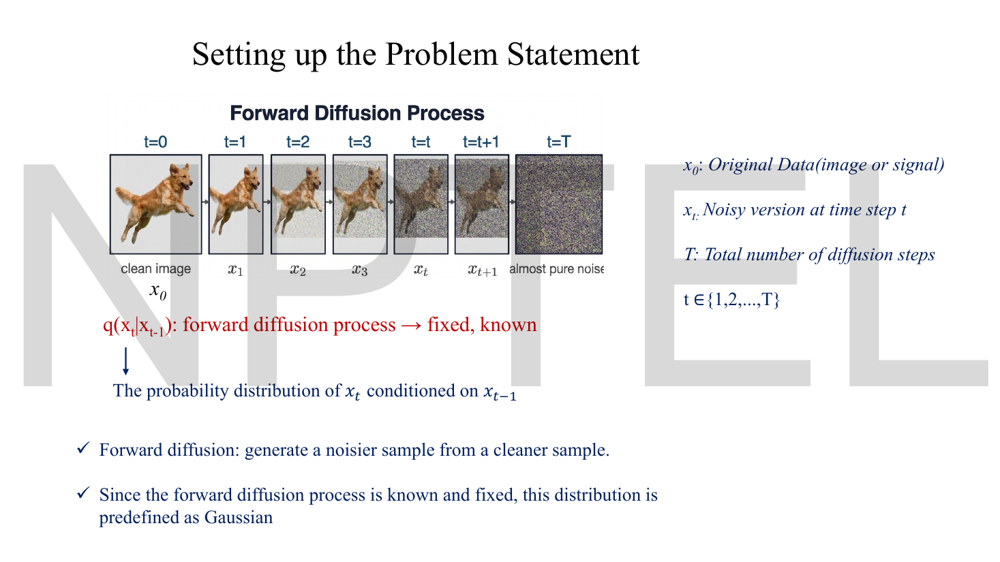
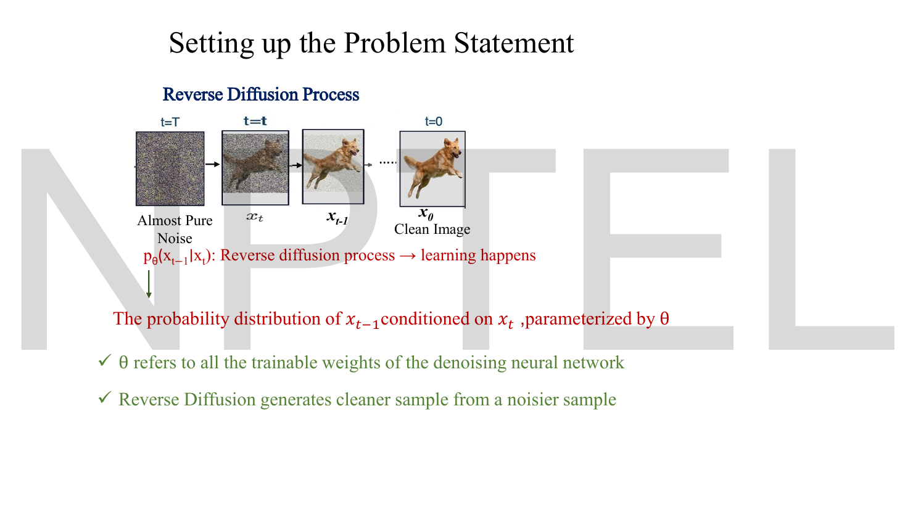
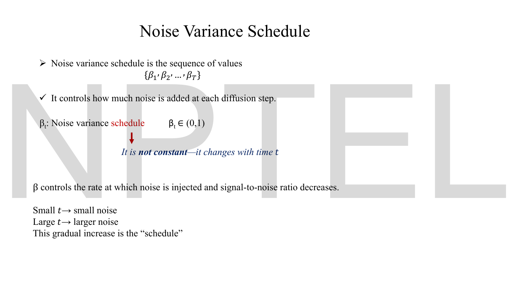
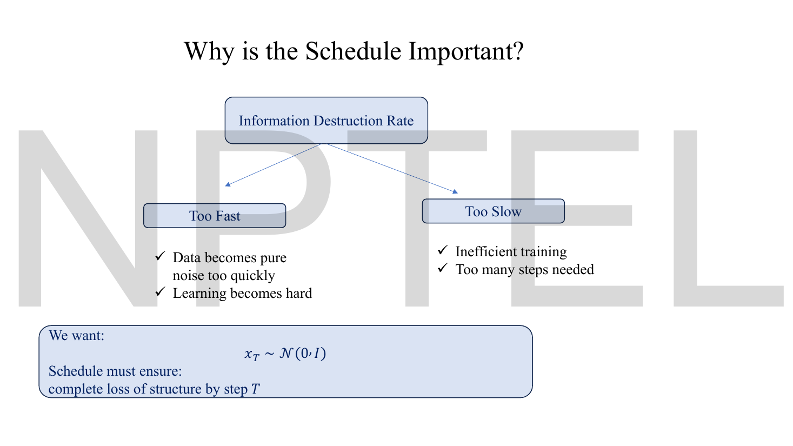
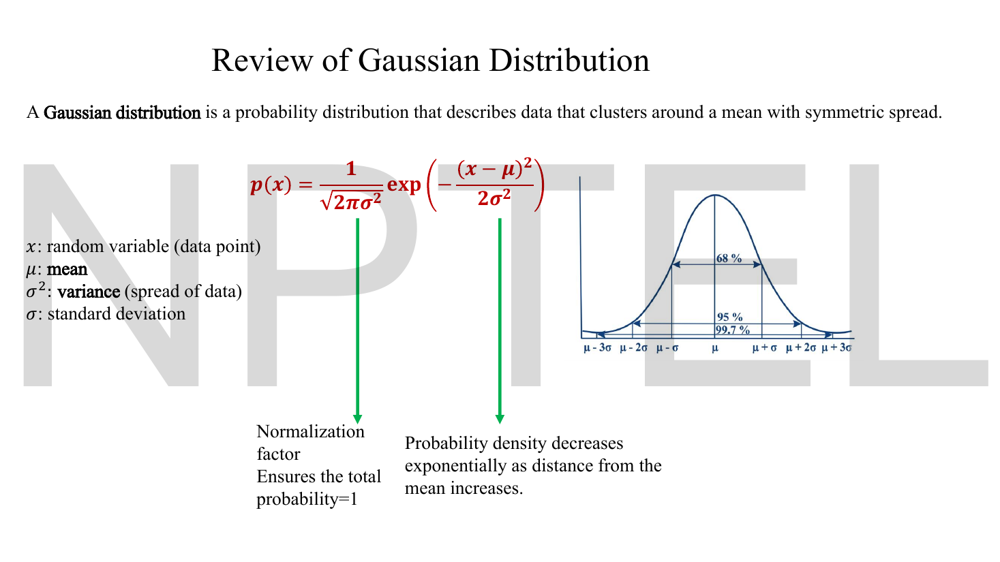
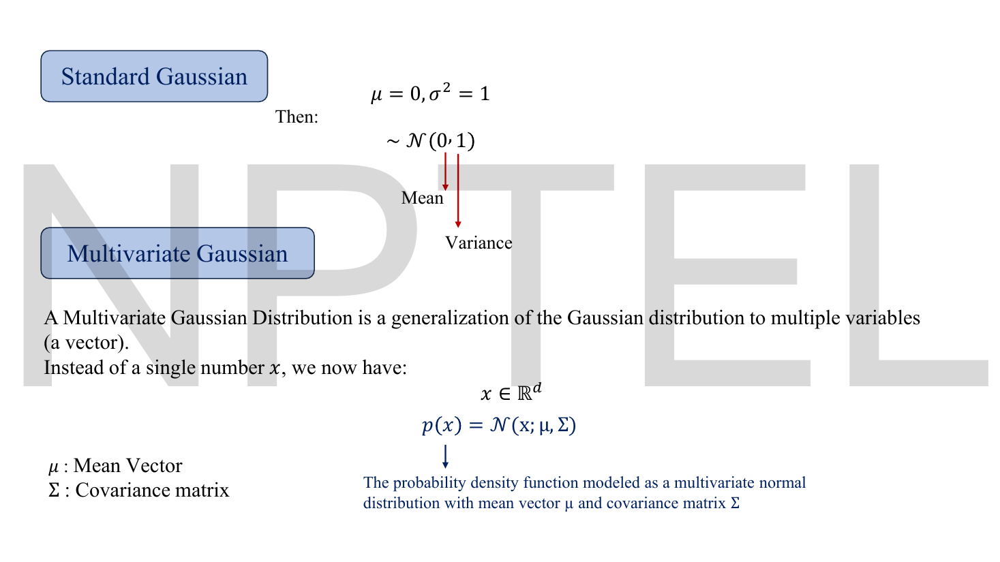
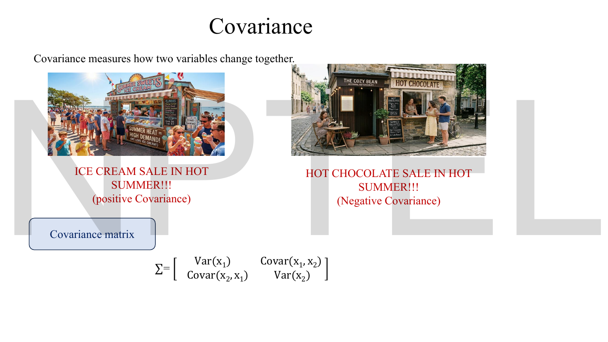
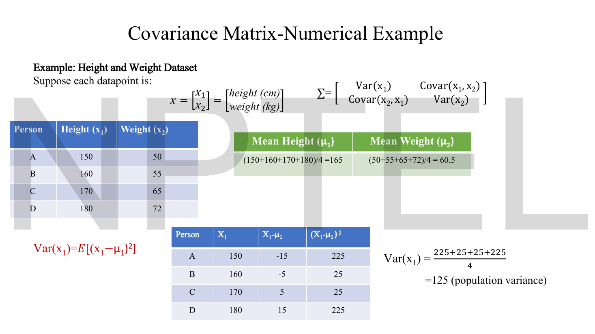
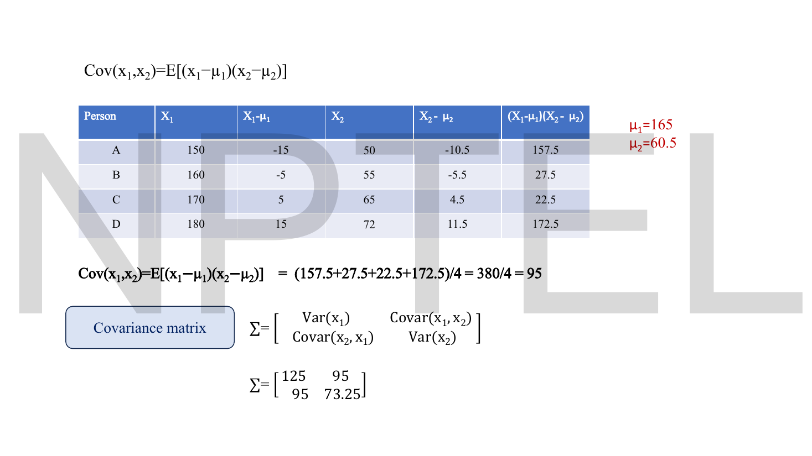

# Lec 45 — Mathematical Foundations of Diffusion Models

> **Source:** `Lec 45 .pdf` (13 pages) · **Week 7** · **Playlist:** Lec 45
> **Prereqs:** [Lec 44 — Introduction to Diffusion Models](44-diffusion-intro.md), [Lec 13 — Denoising Autoencoders](13-denoising-ae.md), [Lec 21 — Introduction to VAE and the Encoder](21-vae-encoder.md)
> **Feeds into:** [Lec 46 — DDPM Forward Process](46-ddpm-forward.md), [Lec 47 — DDPM Reverse Process](47-ddpm-reverse.md), [Lec 48 — Hands-on: Forward Diffusion](48-forward-diffusion-handson.md), [Lec 49 — U-Net for Denoising](49-unet.md)

## Why this lecture exists

[Lec 44](44-diffusion-intro.md) sold you the picture: destroy an image with noise step by step, then learn to walk the destruction backwards and you have a generator. The picture is not yet a model. Two things have to be nailed down before any of it can be written as code — *how much* noise enters at each step, and *what kind* of distribution the noise comes from.

This lecture supplies both. It names the sequence $\{\beta_1,\beta_2,\ldots,\beta_T\}$ that controls the noise injected per step, argues that getting that sequence wrong breaks training in two opposite ways, and then spends half its pages reviewing the Gaussian distribution — scalar, standard, and multivariate with a covariance matrix — because every single distribution in the next three lectures is Gaussian. It derives nothing about the chain itself. That is deliberate: [Lec 46](46-ddpm-forward.md) does the forward algebra, [Lec 47](47-ddpm-reverse.md) the reverse. This lecture is the vocabulary you need to read them.

## The ideas

### The two processes, and which one you actually learn


*Fig. — Read the labels on the right before the pictures. The deck fixes $\mathbf{x}_0$ = original data, $\mathbf{x}_t$ = the noisy version at step $t$, $T$ = total number of steps, $t \in \{1,2,\ldots,T\}$. The red line is the load-bearing one: $q(\mathbf{x}_t \mid \mathbf{x}_{t-1})$ is **fixed and known** — there are no learnable parameters anywhere in the forward direction. Page 2.*

Diffusion is two chains running in opposite directions over the same sequence of states $\mathbf{x}_0, \mathbf{x}_1, \ldots, \mathbf{x}_T$.

**Forward (diffusion / noising).** Start from real data $\mathbf{x}_0$ and generate a noisier sample from a cleaner one, $T$ times. The deck's phrasing: "forward diffusion: generate a noisier sample from a cleaner sample." The transition is written $q(\mathbf{x}_t \mid \mathbf{x}_{t-1})$ — the probability distribution of $\mathbf{x}_t$ conditioned on $\mathbf{x}_{t-1}$. Because we *design* this process ourselves, it is **fixed and known**, and the deck says it is "predefined as Gaussian". Nothing here is trained.

**Reverse (denoising / generation).** Start from almost pure noise and generate a cleaner sample from a noisier one, $T$ times, until you are back at something that looks like data. The transition is written $p_\theta(\mathbf{x}_{t-1} \mid \mathbf{x}_t)$ — the probability distribution of $\mathbf{x}_{t-1}$ conditioned on $\mathbf{x}_t$, **parameterized by $\theta$**. The deck is explicit about what $\theta$ is: "all the trainable weights of the denoising neural network."


*Fig. — "Learning happens" sits on the reverse arrow only. The whole training problem of a diffusion model is one conditional distribution, $p_\theta(\mathbf{x}_{t-1}\mid\mathbf{x}_t)$, and the forward process exists purely to manufacture training pairs for it. Page 3.*

| | Forward $q$ | Reverse $p_\theta$ |
|---|---|---|
| Direction | $\mathbf{x}_0 \to \mathbf{x}_T$ | $\mathbf{x}_T \to \mathbf{x}_0$ |
| Written | $q(\mathbf{x}_t \mid \mathbf{x}_{t-1})$ | $p_\theta(\mathbf{x}_{t-1} \mid \mathbf{x}_t)$ |
| Learned? | **No** — fixed and known | **Yes** — $\theta$ = network weights |
| Does what | adds noise | removes noise |
| Owned by | [Lec 46](46-ddpm-forward.md) | [Lec 47](47-ddpm-reverse.md) |

The single most common misreading is to think the forward process is "the encoder" and is trained like a VAE's. It is not. A VAE learns $q_\phi(\mathbf{z}\mid\mathbf{x})$ ([Lec 21](21-vae-encoder.md)); diffusion *fixes* its $q$ by hand and learns only the way back. That is why a diffusion model has no encoder network at all.

### The Markov chain, applied to the schedule

The **Markov property** — each state depends only on the one immediately before it, and the joint factorises into one-step terms — is [Lec 44](44-diffusion-intro.md)'s, taught there with a worked three-state chain. Take it as given and read what it buys the diffusion schedule.

For the forward process the property reads $q(\mathbf{x}_t \mid \mathbf{x}_{t-1},\ldots,\mathbf{x}_0) = q(\mathbf{x}_t \mid \mathbf{x}_{t-1})$, and it is true **by construction, not by discovery**. The recipe for $\mathbf{x}_t$ is literally "take $\mathbf{x}_{t-1}$, shrink it, add fresh independent noise", and fresh independent noise cannot remember anything about earlier states. Nothing has to be checked.

What that buys here, specifically:

1. **One number per step is enough to specify the whole chain.** Because the joint factorises, $q(\mathbf{x}_{1:T}\mid\mathbf{x}_0) = \prod_{t=1}^{T} q(\mathbf{x}_t\mid\mathbf{x}_{t-1})$, designing the forward process means designing $T$ independent one-step distributions — and each will turn out to need exactly one parameter, $\beta_t$. **The schedule $\{\beta_1,\ldots,\beta_T\}$ *is* the forward process.** That is why the rest of this chapter is about a sequence of $T$ numbers and nothing else.
2. **The per-step attenuation factors multiply.** Independence of the per-step noise is what will let the surviving-signal factors compose as a *product*, $\bar\alpha_t = \prod_s\alpha_s$, rather than in some messier way. A non-Markov chain would have no such clean accumulation and no closed form at all.
3. **The reverse can be modelled one step at a time too.** You never need a network that maps noise to an image in one jump; you need one that undoes a single small step, applied $T$ times.

The reverse chain has its own Markov assumption and its own joint factorisation, stated on the Lec 47 deck — see [Lec 47](47-ddpm-reverse.md), which owns them. This chapter owns the forward side's schedule.

### Shrink and add — the half of the story the slides omit

Every slide in this arc says the forward process **adds noise**. None of them says that it *simultaneously shrinks the signal*, and that omission will mislead you about where the chain ends up.

Taking the slides literally — repeatedly add noise to an image — the variance would grow at every step and $\mathbf{x}_T$ would be a Gaussian of enormous width, not the $\mathcal{N}(\mathbf{0},\mathbf{I})$ this deck's page 5 demands. The two cannot both be true. What actually happens at each step is a *pair* of operations:

$$\mathbf{x}_t \;=\; \underbrace{(\text{a factor slightly less than }1)\times\mathbf{x}_{t-1}}_{\text{shrink the signal}} \;+\; \underbrace{(\text{a small amount of fresh noise})}_{\text{add noise}}$$

and the two are balanced so that the total variance stays put. Over $t$ steps they compose into

$$\mathbf{x}_t = \sqrt{\bar\alpha_t}\,\mathbf{x}_0 + \sqrt{1-\bar\alpha_t}\,\epsilon$$

— signal coefficient shrinking toward 0, noise coefficient growing toward 1, and their **squares always summing to exactly 1**. That is why the chain converges to a standard normal instead of exploding: it is not accumulating noise on top of a fixed image, it is sliding a fixed budget of variance from signal into noise.

Hold that shape in mind through the schedule discussion below; [Lec 46](46-ddpm-forward.md) derives it, and shows exactly what goes wrong if you drop the shrinking factor.

### The noise variance schedule $\beta_t$


*Fig. — Three facts to lift off this slide verbatim: the schedule is a **sequence**, each $\beta_t$ lies strictly in $(0,1)$, and it is **not constant**. The last line names the object: the gradual increase *is* the schedule. Page 4.*

The **noise variance schedule** is the sequence of values

$$\{\beta_1, \beta_2, \ldots, \beta_T\}$$

and $\beta_t$ controls how much noise is added at diffusion step $t$. The deck's constraints:

- $\beta_t \in (0,1)$ — strictly between 0 and 1, open at both ends. $\beta_t = 0$ would add no noise at all; $\beta_t = 1$ would erase the signal in a single step.
- $\beta_t$ is **not constant**; it changes with $t$.
- Small $t$ → small noise; large $t$ → larger noise. The schedule *increases*.

The reason given on the slide for the increase is worth holding onto: "$\beta$ controls the rate at which noise is injected **and signal-to-noise ratio decreases**." Early in the chain the image is still mostly intact and a large perturbation would wipe out fine detail that the reverse model still has to learn to restore; late in the chain the image is already mostly noise and small steps achieve nothing. So you ramp.

Two derived symbols will be used constantly from the next chapter on. Both are definitions, so take them now:

$$\alpha_t \;=\; 1 - \beta_t, \qquad\qquad \bar\alpha_t \;=\; \prod_{s=1}^{t} \alpha_s \;=\; \alpha_1\alpha_2\cdots\alpha_t$$

$\alpha_t$ is the **signal retention factor** for one step — the fraction of variance that survives step $t$. $\bar\alpha_t$ ("alpha bar") is the running product, the fraction of the original signal variance surviving *all* $t$ steps. Since every $\alpha_s \in (0,1)$, the product shrinks monotonically, and a well-designed schedule drives $\bar\alpha_T$ to essentially zero. *Why* $\bar\alpha_t$ is the right quantity — and the algebra that makes it fall out of the chain — is [Lec 46](46-ddpm-forward.md)'s, and this deck introduces neither symbol. Here they are definitions only.

> **$\alpha$ collision — read once, then forget it.** Three different quantities in this book are called $\alpha$. [Lec 04](04-optimizers-b.md)'s $\alpha_t = \sum_i g_i^2$ is AdaGrad's squared-gradient accumulator. [Lec 28](28-latent-interpolation.md)'s $\alpha$ is the latent-interpolation mixing weight. **Here $\alpha_t = 1-\beta_t$ is a diffusion signal-retention factor and has nothing to do with either.** The subscript $t$ means a diffusion timestep in this arc and a training iteration in Lec 04. Read it off the context, never from memory.

### Why the schedule has to be designed, not guessed


*Fig. — The schedule is a single dial — information destruction rate — with a failure mode at each end. The box at the bottom is the hard constraint that pins the dial: whatever you choose, $\mathbf{x}_T$ must end up standard normal. Page 5.*

The schedule sets the **information destruction rate**, and both extremes are bad:

**Too fast.** Data becomes pure noise too quickly, and learning becomes hard. The reverse model is being asked to undo an enormous jump in one step — the conditional $p_\theta(\mathbf{x}_{t-1}\mid\mathbf{x}_t)$ stops being approximately Gaussian (see [Lec 47](47-ddpm-reverse.md)), and there is simply not enough information left in $\mathbf{x}_t$ to reconstruct $\mathbf{x}_{t-1}$.

**Too slow.** Training is inefficient and too many steps are needed. Every step costs a forward and backward pass through a large network, both in training and in sampling, so wasting steps on imperceptible noise increments is expensive for nothing.

And the hard constraint, in the deck's own box:

$$\mathbf{x}_T \sim \mathcal{N}(\mathbf{0}, \mathbf{I})$$

> "Schedule must ensure: complete loss of structure by step $T$."

This matters because *generation starts from $\mathbf{x}_T$*. At sampling time you have no data — you draw a fresh standard normal vector and run the reverse chain. If the forward process had not actually reached $\mathcal{N}(\mathbf{0},\mathbf{I})$ by step $T$, there would be a mismatch between the distribution the model was trained to denoise and the distribution you hand it at test time, and samples would degrade. The requirement $\bar\alpha_T \approx 0$ is this constraint written in the schedule's own terms.

**The two schedules you should be able to name.** The deck describes the *shape* (increasing) but never writes a formula. The two in common use:

| Schedule | Definition | Behaviour |
|---|---|---|
| **Linear** (DDPM, Ho et al. 2020) | $\beta_t$ spaced evenly from $\beta_1 = 10^{-4}$ to $\beta_T = 0.02$, $T = 1000$ | simple; destroys structure fast in the middle of the chain, and the last ~200 steps are nearly wasted |
| **Cosine** (Nichol & Dhariwal 2021) | define $\bar\alpha_t = \dfrac{f(t)}{f(0)}$ with $f(t) = \cos^2\!\Big(\dfrac{t/T + s}{1+s}\cdot\dfrac{\pi}{2}\Big)$, $s = 0.008$, then read $\beta_t = 1 - \bar\alpha_t/\bar\alpha_{t-1}$ | destroys information more evenly across the chain; spends far more steps at useful noise levels |

Notice the direction of definition in the cosine case: you specify $\bar\alpha_t$ first and derive $\beta_t$ from it, the opposite of the linear case. The Code section measures how differently the two behave at the level of *design*. Neither formula is on these slides — but both are on [Lec 48](48-forward-diffusion-handson.md)'s notebook, which **owns both schedules as implemented**, including the $\beta$ clamp at $0.999$ that the cosine schedule needs and the plots of the two curves. Go there for the implementation; this section is about why you need a schedule at all and what a bad one costs.

### Review of the Gaussian


*Fig. — The deck is scrupulous here in a way that matters for the exam: it writes $\sigma^2$ as **variance** and $\sigma$ as standard deviation, and the denominator inside the exponent is $2\sigma^2$, not $2\sigma$. Compare [Lec 01](01-intro-generative-ai.md) p-10, which wrote $N(\mu;\sigma)$ and caused the confusion this slide fixes. Page 6.*

A **Gaussian distribution** describes data that clusters around a mean with symmetric spread. Its density is

$$p(x) \;=\; \frac{1}{\sqrt{2\pi\sigma^2}}\,\exp\!\left(-\frac{(x-\mu)^2}{2\sigma^2}\right)$$

with $x$ the random variable, $\mu$ the **mean**, $\sigma^2$ the **variance** (spread), $\sigma$ the standard deviation. The deck annotates the two pieces:

- $\dfrac{1}{\sqrt{2\pi\sigma^2}}$ is the **normalization factor** — it ensures the total probability is 1. It does not change the shape, only the height.
- $\exp\!\big(-(x-\mu)^2/2\sigma^2\big)$ makes the **probability density decrease exponentially as distance from the mean increases**. The squared distance in the numerator is why the curve is symmetric about $\mu$.

The bell curve on the slide carries the 68 / 95 / 99.7 bands at $\mu\pm\sigma$, $\mu\pm2\sigma$, $\mu\pm3\sigma$ — the numbers an MCQ reaches for first.


*Fig. — The two red arrows are doing exam work. In $\mathcal{N}(0,1)$ the first slot is the mean and the **second slot is the variance**, not the standard deviation. CONTRACT §3 adopts exactly this convention and the whole diffusion arc depends on it. Page 7.*

**Standard Gaussian.** Set $\mu = 0$ and $\sigma^2 = 1$ and you get $\mathcal{N}(0,1)$. This is the distribution every $\epsilon$ in the next two chapters is drawn from, and the distribution $\mathbf{x}_T$ must converge to.

**Multivariate Gaussian.** Real data is not one number. Instead of a scalar $x$ you have a vector $\mathbf{x} \in \mathbb{R}^d$, and

$$p(\mathbf{x}) = \mathcal{N}(\mathbf{x};\boldsymbol{\mu},\boldsymbol{\Sigma})$$

with $\boldsymbol{\mu}$ a **mean vector** ($d$ numbers, one per dimension) and $\boldsymbol{\Sigma}$ a **covariance matrix** ($d\times d$). The deck's semicolon form $\mathcal{N}(\mathbf{x};\boldsymbol{\mu},\boldsymbol{\Sigma})$ means "the density *of* $\mathbf{x}$ *with parameters* $\boldsymbol{\mu},\boldsymbol{\Sigma}$" — it is the same object as $\mathcal{N}(\boldsymbol{\mu},\boldsymbol{\Sigma})$, just written to name the variable. Both forms appear on these decks; the comma is the parameter separator in both.

![Multivariate Gaussian motivation slide: in ML data is rarely a single variable — images are millions of pixels, embeddings are high-dimensional vectors — with the column vector x = [x_1 ... x_d] and the conclusion that the relationship between features is captured by covariance](../assets/pages/lec45/p-08.png)
*Fig. — The argument for going multivariate is dependence, not dimension. Pixels in an image are correlated and features in a dataset are related, so a product of $d$ independent 1-D Gaussians would be the wrong model in general. Page 8.*

### Covariance, and the covariance matrix


*Fig. — The sign is the whole idea. Hotter weather and ice-cream sales move together (positive); hotter weather and hot-chocolate sales move oppositely (negative). The matrix puts variances on the diagonal and covariances off it. Page 9.*

**Covariance measures how two variables change together.** For two dimensions the covariance matrix is

$$\boldsymbol{\Sigma} = \begin{bmatrix} \operatorname{Var}(x_1) & \operatorname{Cov}(x_1,x_2) \\ \operatorname{Cov}(x_2,x_1) & \operatorname{Var}(x_2)\end{bmatrix}$$

with, for a population of $n$ points,

$$\operatorname{Var}(x_1) = \mathbb{E}\big[(x_1-\mu_1)^2\big], \qquad \operatorname{Cov}(x_1,x_2) = \mathbb{E}\big[(x_1-\mu_1)(x_2-\mu_2)\big]$$

Three structural facts, all examinable:

- **The diagonal holds variances.** $\operatorname{Cov}(x_1,x_1) = \operatorname{Var}(x_1)$, so the variance is just the covariance of a variable with itself.
- **The matrix is symmetric.** $\operatorname{Cov}(x_1,x_2) = \operatorname{Cov}(x_2,x_1)$, because multiplication commutes. A $d$-dimensional covariance matrix has $d(d+1)/2$ distinct entries, not $d^2$.
- **Zero covariance means no (linear) relationship between the dimensions**, in the deck's words. A diagonal $\boldsymbol{\Sigma}$ therefore describes dimensions that vary independently of one another.

That last point is the one this whole review was built for. Every Gaussian in DDPM has covariance of the form $c\,\mathbf{I}$ — a scalar times the identity — which is diagonal with every diagonal entry equal. It says: the noise added to each pixel is independent of the noise added to every other pixel, and has the same variance everywhere. **Isotropic** is the word for it. That assumption is what lets a $256\times256\times3$ joint Gaussian be written down with a single number, and it is never stated explicitly on any slide in Week 7 — exactly the omission [Lec 22](22-elbo-and-vae-loss.md) flagged for the VAE's diagonal covariance.


*Fig. — The deck works the variance of height column by column. Note the divisor: it writes $(225+25+25+225)/4$ — dividing by $n=4$, and labels the result **population variance**. Dividing by $n-1$ would give 166.67. Page 10.*


*Fig. — The finished matrix. $\operatorname{Var}(x_2) = 73.25$ appears in the matrix without ever being computed on a slide — N1 below supplies the missing column. Page 11.*

## Worked numericals

### N1. The deck's covariance matrix, completed and verified

The deck works $\operatorname{Var}(x_1)$ and $\operatorname{Cov}(x_1,x_2)$ in full but drops $\operatorname{Var}(x_2) = 73.25$ into the final matrix without showing it. Here is the whole thing.

**Given:** four people, $\mathbf{x} = [\text{height (cm)}, \text{weight (kg)}]^\top$ —
A $(150, 50)$, B $(160, 55)$, C $(170, 65)$, D $(180, 72)$.
**Find:** $\mu_1, \mu_2$, the full covariance matrix $\boldsymbol{\Sigma}$, and the correlation.

1. Means.
$$\mu_1 = \frac{150+160+170+180}{4} = \frac{660}{4} = 165, \qquad \mu_2 = \frac{50+55+65+72}{4} = \frac{242}{4} = 60.5$$

2. $\operatorname{Var}(x_1)$. Deviations $-15, -5, 5, 15$; squares $225, 25, 25, 225$.
$$\operatorname{Var}(x_1) = \frac{225+25+25+225}{4} = \frac{500}{4} = 125$$

3. $\operatorname{Var}(x_2)$ — **not on the slide.** Deviations $50-60.5 = -10.5$, $55-60.5 = -5.5$, $65-60.5 = 4.5$, $72-60.5 = 11.5$; squares $110.25,\ 30.25,\ 20.25,\ 132.25$.
$$\operatorname{Var}(x_2) = \frac{110.25+30.25+20.25+132.25}{4} = \frac{293}{4} = 73.25 \ \checkmark$$

4. $\operatorname{Cov}(x_1,x_2)$. Pairwise products of the deviations:

| Person | $x_1-\mu_1$ | $x_2-\mu_2$ | product |
|---|---|---|---|
| A | $-15$ | $-10.5$ | $157.5$ |
| B | $-5$ | $-5.5$ | $27.5$ |
| C | $5$ | $4.5$ | $22.5$ |
| D | $15$ | $11.5$ | $172.5$ |

$$\operatorname{Cov}(x_1,x_2) = \frac{157.5+27.5+22.5+172.5}{4} = \frac{380}{4} = 95$$

5. Assemble, using symmetry for the off-diagonal.

**Answer:**
$$\boldsymbol{\Sigma} = \begin{bmatrix} 125 & 95 \\ 95 & 73.25\end{bmatrix}$$

Every figure on the slides reproduces exactly. Two things to add. The correlation is $95/\sqrt{125\times73.25} = 0.9928$ — these two features are almost perfectly dependent, which is exactly the situation a multivariate Gaussian exists to model and a product of independent 1-D Gaussians cannot. And the divisor matters: using the **sample** convention $n-1 = 3$ instead gives $\operatorname{Var}(x_1) = 166.67$, $\operatorname{Var}(x_2) = 97.67$, $\operatorname{Cov} = 126.67$. The deck says "population variance" and divides by $n$; follow the deck in an exam.

### N2. Gaussian density, and the variance-vs-$\sigma$ trap

**Given:** $x \sim \mathcal{N}(0, 4)$ — mean 0, **variance** 4, so $\sigma = 2$.
**Find:** $p(x=2)$, and what you would get if you misread the second slot as $\sigma$.

1. Normalization factor: $\dfrac{1}{\sqrt{2\pi\sigma^2}} = \dfrac{1}{\sqrt{2\pi\cdot 4}} = \dfrac{1}{\sqrt{25.1327}} = \dfrac{1}{5.01326} = 0.199471$.
2. Exponent: $-\dfrac{(2-0)^2}{2\cdot 4} = -\dfrac{4}{8} = -0.5$, and $e^{-0.5} = 0.606531$.
3. Multiply: $0.199471 \times 0.606531 = 0.120985$.

**Answer:** $p(2) = 0.12099$ (natural exponential; no logs taken, so no log base is involved).

Now the trap. Reading $\mathcal{N}(0,4)$ as "$\sigma = 4$" means $\sigma^2 = 16$, and the density becomes $\frac{1}{\sqrt{32\pi}}e^{-4/32} = 0.09974 \times 0.88250 = 0.08802$. That is **27% low**, and the shape of the error — a smaller number, not an obviously absurd one — is why this misreading survives into the answer sheet. The deck's p-7 arrows exist to prevent it: **second slot is variance**.

### N3. Reading the 68-95-99.7 bands at $\mathbf{x}_T$

**Given:** the schedule has done its job, so one coordinate of $\mathbf{x}_T$ is distributed $\mathcal{N}(0,1)$.
**Find:** the probability that this coordinate lands in $[-2,2]$, and in $[-1,3]$.

1. $[-2,2]$ is $\mu \pm 2\sigma$ with $\mu=0,\sigma=1$. Straight off the slide's bell curve: **95%** (more precisely 95.45%).
2. $[-1,3]$ is not symmetric. Split at the mean: $[-1,0]$ is half of the $\pm1\sigma$ band $= 68.27/2 = 34.13\%$; $[0,3]$ is half of the $\pm3\sigma$ band $= 99.73/2 = 49.87\%$.
3. Add: $34.13 + 49.87 = 84.00$.

**Answer:** $\approx 95.4\%$ and $\approx 84.0\%$. The second part is the usual exam shape — the bands are stated for symmetric intervals, and you halve and recombine for anything else.

### N4. Building the DDPM linear schedule

**Given:** the standard DDPM setting — $T = 1000$, $\beta_1 = 10^{-4}$, $\beta_T = 0.02$, evenly spaced.
**Find:** the step size, $\beta_t$ and $\alpha_t$ at $t = 1, 250, 500, 1000$, and a check that $\beta_t \in (0,1)$ throughout.

1. Step size: there are $T-1 = 999$ gaps, so
$$\Delta\beta = \frac{0.02 - 0.0001}{999} = \frac{0.0199}{999} = 1.99199\times10^{-5}$$

2. $\beta_t = \beta_1 + (t-1)\Delta\beta$:

| $t$ | $\beta_t$ | $\alpha_t = 1-\beta_t$ |
|---|---|---|
| 1 | $0.000100$ | $0.999900$ |
| 250 | $0.0001 + 249\Delta\beta = 0.005060$ | $0.994940$ |
| 500 | $0.0001 + 499\Delta\beta = 0.010040$ | $0.989960$ |
| 750 | $0.0001 + 749\Delta\beta = 0.015020$ | $0.984980$ |
| 1000 | $0.020000$ | $0.980000$ |

3. Range check: the smallest value is $\beta_1 = 10^{-4} > 0$ and the largest is $\beta_T = 0.02 < 1$. Both strict, so $\beta_t \in (0,1)$ for all $t$ as the deck requires.

**Answer:** $\Delta\beta = 1.992\times10^{-5}$; $\beta_{500} = 0.01004$, $\alpha_{500} = 0.98996$. Notice how small these are — even at the end of the chain, each individual step keeps 98% of the signal variance. The destruction is cumulative, not per-step.

### N5. How fast does structure die? A schedule-design calculation

This is the deck's "too fast / too slow" page turned into a number. It uses only the **definition** $\bar\alpha_t = \prod_{s=1}^{t}\alpha_s$; the reason $\bar\alpha_t$ is the right thing to track is [Lec 46](46-ddpm-forward.md)'s to prove.

**Given:** a *constant* schedule $\beta_t = \beta$ for all $t$, so $\bar\alpha_t = (1-\beta)^t$. "Structure destroyed" means $\bar\alpha_t < 0.01$ — less than 1% of the original signal variance left.
**Find:** the step at which that happens, for $\beta = 0.02$ and for $\beta = 0.2$.

1. Solve $(1-\beta)^t < 0.01$. Take natural logs of both sides; $\ln(1-\beta)$ is negative, so the inequality flips:
$$t > \frac{\ln 0.01}{\ln(1-\beta)}$$

2. $\beta = 0.02$: $\ln 0.01 = -4.60517$, $\ln 0.98 = -0.0202027$, so $t > 227.95$, i.e. $t = 228$.
 Check: $0.98^{227} = 0.010193$ (still above), $0.98^{228} = 0.0099895$ (below). ✓
3. $\beta = 0.2$: $\ln 0.8 = -0.223144$, so $t > 20.64$, i.e. $t = 21$.
 Check: $0.8^{20} = 0.011529$, $0.8^{21} = 0.0092234$. ✓

**Answer:** 228 steps at $\beta = 0.02$; **21 steps** at $\beta = 0.2$ (all logs natural; the ratio of two logs is base-independent, so $\log_{10}$ gives the same $t$).

That is the "too fast" failure made concrete. At $\beta = 0.2$ the image is gone after 21 steps, so if you ran $T=1000$, **979 of your 1000 steps would be the model learning to denoise pure noise into pure noise** — no gradient signal, enormous waste. At $\beta = 0.02$ you get a usable gradient across hundreds of steps. And at $\beta = 0.001$ you would need $t > 4601$ steps to destroy the image at all: "too slow", too many steps needed.

## Code

The deck argues qualitatively that the schedule matters. Here is the argument measured. Three schedules are built, and for each we track $\bar\alpha_t$ — the surviving fraction of signal variance — and ask when it falls below 1%.

```python
import numpy as np

T = 1000

# --- three candidate schedules, all with beta_t in (0,1) ---
lin  = np.linspace(1e-4, 0.02, T)              # DDPM's linear schedule
fast = np.linspace(1e-4, 0.20, T)              # "too fast"
# cosine schedule (Nichol & Dhariwal): define abar first, then read beta off it
s = 0.008
f = np.cos(((np.arange(T + 1) / T) + s) / (1 + s) * np.pi / 2) ** 2
abar_cos = f / f[0]
cos = np.clip(1 - abar_cos[1:] / abar_cos[:-1], 0, 0.999)

def abar(beta):                                 # abar_t = prod_{s<=t} (1 - beta_s)
    return np.cumprod(1.0 - beta)

print(" t     beta_lin   abar_lin   abar_fast  abar_cos")
for t in [1, 100, 300, 500, 700, 900, 1000]:
    i = t - 1
    print(f"{t:5d}  {lin[i]:9.6f}  {abar(lin)[i]:9.6f}  "
          f"{abar(fast)[i]:9.6f}  {abar(cos)[i]:9.6f}")

# How many steps before only 1% of the signal variance survives?
for name, beta in [("linear", lin), ("too fast", fast), ("cosine", cos)]:
    a = abar(beta)
    k = int(np.argmax(a < 0.01)) + 1 if (a < 0.01).any() else None
    print(f"{name:9s}: abar drops below 0.01 at t = {k},  abar_T = {a[-1]:.3e}")
```

```
 t     beta_lin   abar_lin   abar_fast  abar_cos
    1   0.000100   0.999900   0.999900   0.999959
  100   0.002072   0.897018   0.365227   0.972093
  300   0.006056   0.396420   0.000102   0.786911
  500   0.010040   0.078587   0.000000   0.493844
  700   0.014024   0.006966   0.000000   0.203121
  900   0.018008   0.000275   0.000000   0.024092
 1000   0.020000   0.000040   0.000000   0.000000
linear   : abar drops below 0.01 at t = 674,  abar_T = 4.036e-05
too fast : abar drops below 0.01 at t = 214,  abar_T = 2.091e-47
cosine   : abar drops below 0.01 at t = 936,  abar_T = 2.429e-09
```

Read the columns. The **too-fast** schedule is dead by $t = 214$ and then spends 786 steps at $\bar\alpha_t$ indistinguishable from zero — in floating point it reaches $10^{-47}$, which is not "more destroyed", it is just wasted compute. The **linear** schedule is the deck's intended behaviour: $\bar\alpha_{1000} = 4\times10^{-5}$, satisfying $\mathbf{x}_T \sim \mathcal{N}(\mathbf{0},\mathbf{I})$ to good accuracy, with the drop spread over roughly 700 steps. The **cosine** schedule holds signal much longer — it is still at $\bar\alpha = 0.49$ halfway through, where linear has fallen to 0.079 — and only crosses 1% at $t=936$. That is the point of it: more of the chain is spent at noise levels where the denoising task is neither trivial nor hopeless.

Also worth noticing: $\beta_t$ never exceeds 0.02 in the linear schedule, yet $\bar\alpha_t$ falls by four orders of magnitude. **Tiny per-step noise compounds into total destruction.** That compounding is precisely what the next chapter makes exact.

## Exam pack

### Must-memorise

| Item | Exactly this |
|---|---|
| Forward transition | $q(\mathbf{x}_t \mid \mathbf{x}_{t-1})$ — **fixed and known**, no parameters |
| Reverse transition | $p_\theta(\mathbf{x}_{t-1}\mid\mathbf{x}_t)$ — $\theta$ = weights of the denoising network |
| What is learned | **only** the reverse process |
| Noise variance schedule | $\{\beta_1,\beta_2,\ldots,\beta_T\}$, with $\beta_t \in (0,1)$, **not constant**, increasing |
| Signal retention (one step) | $\alpha_t = 1-\beta_t$ |
| Signal retention (cumulative) | $\bar\alpha_t = \prod_{s=1}^{t}\alpha_s$ |
| Forward Markov property (defined in [Lec 44](44-diffusion-intro.md)) | $q(\mathbf{x}_t\mid\mathbf{x}_{t-1},\ldots,\mathbf{x}_0) = q(\mathbf{x}_t\mid\mathbf{x}_{t-1})$ |
| Forward joint | $q(\mathbf{x}_{1:T}\mid\mathbf{x}_0) = \prod_{t=1}^{T}q(\mathbf{x}_t\mid\mathbf{x}_{t-1})$ |
| Terminal requirement | $\mathbf{x}_T \sim \mathcal{N}(\mathbf{0},\mathbf{I})$ |
| Gaussian density | $p(x) = \dfrac{1}{\sqrt{2\pi\sigma^2}}\exp\!\left(-\dfrac{(x-\mu)^2}{2\sigma^2}\right)$ |
| Standard Gaussian | $\mathcal{N}(0,1)$ — mean 0, **variance** 1 |
| Multivariate Gaussian | $p(\mathbf{x}) = \mathcal{N}(\mathbf{x};\boldsymbol{\mu},\boldsymbol{\Sigma})$, $\mathbf{x}\in\mathbb{R}^d$ |
| Variance | $\operatorname{Var}(x_1) = \mathbb{E}[(x_1-\mu_1)^2]$ |
| Covariance | $\operatorname{Cov}(x_1,x_2) = \mathbb{E}[(x_1-\mu_1)(x_2-\mu_2)]$ |
| Covariance matrix (2-D) | $\boldsymbol{\Sigma} = \begin{bmatrix}\operatorname{Var}(x_1) & \operatorname{Cov}(x_1,x_2)\\ \operatorname{Cov}(x_2,x_1) & \operatorname{Var}(x_2)\end{bmatrix}$ |
| Zero covariance means | no relationship between those dimensions |

### Numbers worth knowing

| Quantity | Value |
|---|---|
| Deck's covariance example, means | $\mu_1 = 165$ cm, $\mu_2 = 60.5$ kg |
| Its covariance matrix | $\begin{bmatrix}125 & 95\\ 95 & 73.25\end{bmatrix}$ |
| Same data, sample ($n-1$) convention | $\begin{bmatrix}166.67 & 126.67\\ 126.67 & 97.67\end{bmatrix}$ |
| Its correlation | $0.9928$ |
| Gaussian bands | $\mu\pm\sigma$: 68.3% · $\mu\pm2\sigma$: 95.4% · $\mu\pm3\sigma$: 99.7% |
| Peak density of $\mathcal{N}(0,1)$ | $1/\sqrt{2\pi} = 0.39894$ |
| DDPM linear schedule | $T = 1000$, $\beta_1 = 10^{-4}$, $\beta_T = 0.02$ |
| Its step size | $1.992\times10^{-5}$ |
| Its $\alpha_T$ | $0.98$ |
| Its $\bar\alpha_T$ | $4.04\times10^{-5}$ |
| Constant $\beta = 0.02$: steps to $\bar\alpha<0.01$ | 228 |
| Constant $\beta = 0.2$: steps to $\bar\alpha<0.01$ | 21 |
| $\beta_t$ range | strictly $(0,1)$ |
| Distinct entries in a $d\times d$ covariance matrix | $d(d+1)/2$ |

### Likely MCQ traps

- **"The forward process is trained."** It is not. It is *fixed and known* — the deck says so in red on page 2. Only $p_\theta$ has parameters. A question offering "both processes are learned" is testing exactly this.
- **$\mathcal{N}(\mu,\sigma)$ vs $\mathcal{N}(\mu,\sigma^2)$.** The second slot is the **variance**. $\mathcal{N}(0,4)$ has $\sigma = 2$, not 4. Misreading it changes $p(2)$ from 0.12099 to 0.08802 — plausible-looking, 27% wrong.
- **Confusing $\beta_t$ with $\alpha_t$.** $\beta_t$ is the noise added, $\alpha_t = 1-\beta_t$ is the signal kept. $\beta$ *increases* with $t$; $\alpha$ *decreases*. If a question says "the schedule increases", it is talking about $\beta$.
- **Confusing $\alpha_t$ with $\bar\alpha_t$.** $\alpha_t$ is one step; $\bar\alpha_t$ is the product over all steps up to $t$. $\alpha_{1000} = 0.98$ but $\bar\alpha_{1000} = 4\times10^{-5}$ — a difference of four orders of magnitude.
- **The $\alpha$ collision.** [Lec 04](04-optimizers-b.md)'s $\alpha_t$ is AdaGrad's gradient accumulator and [Lec 28](28-latent-interpolation.md)'s $\alpha$ is an interpolation weight. Three different $\alpha$s are live in this book. Check which chapter the question is from.
- **"$\beta_t$ can be 0 or 1."** The deck writes the open interval $(0,1)$. $\beta_t=0$ adds nothing; $\beta_t=1$ destroys the image in one step and makes $\alpha_t = 0$, which would zero $\bar\alpha_s$ for every $s \ge t$.
- **"Too fast is safer than too slow."** Both are failures, and the deck lists them symmetrically. Too fast makes *learning hard* (not just lossy); too slow makes training *inefficient*.
- **Population vs sample variance.** The deck divides by $n$ and says "population variance": 125, not 166.67. An option offering both is testing the divisor.
- **Covariance sign.** Positive covariance = move together (ice cream in summer); negative = move oppositely (hot chocolate in summer). The magnitude is not bounded, so "covariance of 95 means strong" is not a safe inference — *correlation* is the bounded version.
- **Thinking a diagonal $\boldsymbol{\Sigma}$ means the Gaussian is 1-D.** It is still $d$-dimensional; the dimensions are merely uncorrelated. $\beta_t\mathbf{I}$ is diagonal *and* isotropic — same variance in every dimension.

### Self-test

1. Which of the two diffusion processes carries learnable parameters, and what does $\theta$ denote?
2. The forward chain is Markov. Give the resulting factorisation of $q(\mathbf{x}_{1:T}\mid\mathbf{x}_0)$, and say what that factorisation implies about how many parameters the forward process needs.
3. Write down the range constraint the deck places on $\beta_t$, and say what happens at each endpoint.
4. Define $\alpha_t$ and $\bar\alpha_t$. If $\beta_1 = 0.1$ and $\beta_2 = 0.2$, compute both at $t=2$.
5. Name the two failure modes of a badly chosen schedule and the consequence of each.
6. A schedule is proposed with constant $\beta = 0.05$ and $T = 1000$. Roughly when is the data destroyed, and what is wrong with this choice?
7. Compute $p(x = 1)$ for $x\sim\mathcal{N}(1, 9)$.
8. For the deck's height/weight data, compute $\operatorname{Var}(x_2)$ from scratch.
9. Why must the forward process end at $\mathcal{N}(\mathbf{0},\mathbf{I})$ specifically, rather than at any sufficiently noisy distribution?
10. How many distinct numbers does a covariance matrix for 100-dimensional data contain, and how many if the covariance is $c\,\mathbf{I}$?

<details><summary>Answers</summary>

1. Only the **reverse** process $p_\theta(\mathbf{x}_{t-1}\mid\mathbf{x}_t)$. The deck: $\theta$ refers to all the trainable weights of the denoising neural network. The forward $q(\mathbf{x}_t\mid\mathbf{x}_{t-1})$ is fixed and known.
2. $q(\mathbf{x}_{1:T}\mid\mathbf{x}_0) = \prod_{t=1}^{T}q(\mathbf{x}_t\mid\mathbf{x}_{t-1})$ — a product of independent one-step terms. Each one-step term needs exactly one number, $\beta_t$, so the **entire** forward process is specified by the $T$-element schedule and nothing else.
3. $\beta_t \in (0,1)$, open at both ends. At $\beta_t = 0$ no noise is added and the step is wasted; at $\beta_t = 1$ the signal is annihilated in one step ($\alpha_t = 0$, so $\bar\alpha_s = 0$ for all $s\ge t$).
4. $\alpha_t = 1-\beta_t$; $\bar\alpha_t = \prod_{s=1}^{t}\alpha_s$. Here $\alpha_1 = 0.9$, $\alpha_2 = 0.8$, so $\bar\alpha_2 = 0.9\times0.8 = \mathbf{0.72}$.
5. **Too fast** — data becomes pure noise too quickly and learning becomes hard. **Too slow** — training is inefficient and too many steps are needed.
6. $\bar\alpha_t = 0.95^t$, and $0.95^t < 0.01$ at $t > \ln(0.01)/\ln(0.95) = 89.8$, so by step 90. With $T = 1000$ that wastes about 910 steps on pure noise — a "too fast" schedule in disguise, because what matters is $t$ relative to $T$, not $\beta$ in isolation.
7. At the mean, so the exponent is 0 and $p = 1/\sqrt{2\pi\cdot9} = 1/\sqrt{56.549} = 1/7.5199 = \mathbf{0.13298}$.
8. $\mu_2 = 60.5$; deviations $-10.5,-5.5,4.5,11.5$; squares $110.25, 30.25, 20.25, 132.25$; sum 293; $293/4 = \mathbf{73.25}$.
9. Because **generation starts there**. At sampling time you draw $\mathbf{x}_T$ from a distribution you choose, and the only distribution you can sample from with no data is a standard normal. If training ended somewhere else, the input to the reverse chain at test time would be off-distribution.
10. $100\times101/2 = \mathbf{5050}$ distinct entries in general. If $\boldsymbol{\Sigma} = c\,\mathbf{I}$ it is **one** number, $c$ — which is exactly why DDPM uses $\beta_t\mathbf{I}$.

</details>

## Beyond the slides

**Gap: the deck never writes a schedule formula, only the shape.**
**Why it matters:** "increasing from small to large" is not implementable. The standard answers are the **linear** schedule ($\beta_1 = 10^{-4}$ to $\beta_T = 0.02$ over $T=1000$) and the **cosine** schedule, which defines $\bar\alpha_t$ first and reads $\beta_t$ off it. The Code section shows they behave very differently — cosine is still at $\bar\alpha = 0.49$ where linear has reached 0.079. Any exam question that names a schedule will name one of these two.

**Gap: the word "Markov" never appears on this deck at all, although the chain it describes is one.**
**Why it matters:** the property is defined one lecture earlier, on [Lec 44](44-diffusion-intro.md)'s page 16 ("Introduction to Markov Chain"), and then disappears for a whole deck before resurfacing as a Lec 46 slide *title* and a Lec 47 definition. If you read Lec 45 in isolation you would never know that the schedule's design freedom — one number per step, no cross-step coupling — is a direct consequence of the Markov structure. That link is drawn in this chapter and nowhere on these slides.

**Gap: nothing says the covariance is isotropic, though every formula assumes it.**
**Why it matters:** DDPM's forward covariance is $\beta_t\mathbf{I}$ — a scalar times the identity. That is a far stronger assumption than "diagonal": it says every pixel gets noise of the *same* variance, independently. It is what reduces a joint Gaussian over 196,608 dimensions to a single number per step. This is the same silent assumption [Lec 22](22-elbo-and-vae-loss.md) had to flag for the VAE, and it is the reason this deck's long covariance-matrix review ends in a matrix you will then never need in its general form.

**Gap: no signal-to-noise ratio is ever computed, although this deck names it.**
**Why it matters:** page 4 says $\beta$ controls the rate at which the signal-to-noise ratio decreases, and then the ratio is never defined — so the one sentence that tells you *what the schedule is for* is left dangling. It is $\mathrm{SNR}(t) = \bar\alpha_t/(1-\bar\alpha_t)$, it falls out of [Lec 46](46-ddpm-forward.md)'s closed form, and [Lec 48](48-forward-diffusion-handson.md) owns it and plots it for both schedules.

**Gap: $T$ is never given a value, and the cost of a large $T$ is never mentioned.**
**Why it matters:** DDPM uses $T = 1000$, and that number is the model's single biggest practical weakness — sampling requires 1000 sequential network evaluations, which is why a GAN generates an image in one forward pass and a DDPM takes a thousand. Every acceleration method in the rest of the arc (DDIM in [Lec 53](53-reverse-diffusion-handson.md), latent diffusion in [Lec 52](52-stable-diffusion.md)) exists to attack this number.

## Cut from the slides

Pages 1, 12 and 13 are the title card, a bare "Summary" card with no content on it, and the next-session pointer to DDPM's forward process; nothing was lost. Page 8's motivation for the multivariate Gaussian (images are millions of pixels, embeddings are high-dimensional, features are correlated) is compressed into two sentences and its figure retained, because the argument is short and the picture carries it. The ice-cream and hot-chocolate photographs on page 9 are kept as the figure but their captions are reduced to the positive/negative covariance point they illustrate. The deck's page 6 and page 7 overlap on the meaning of $\mu$ and $\sigma^2$; the definitions are given once. Pages 10 and 11 are one worked example split across two slides and are treated as one numerical (N1), with the missing $\operatorname{Var}(x_2)$ column supplied. Nothing on pages 2–11 is omitted.
