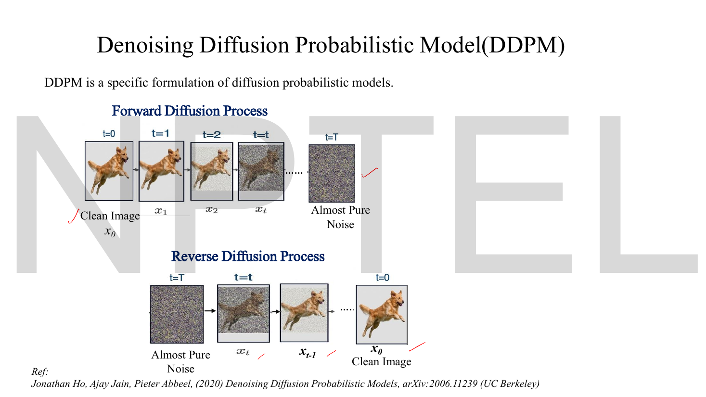
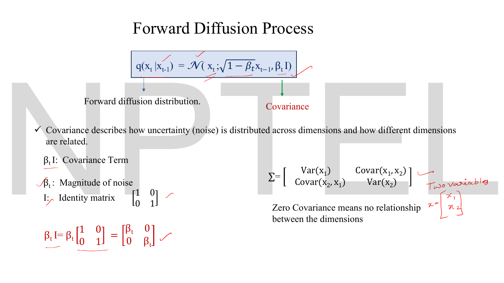
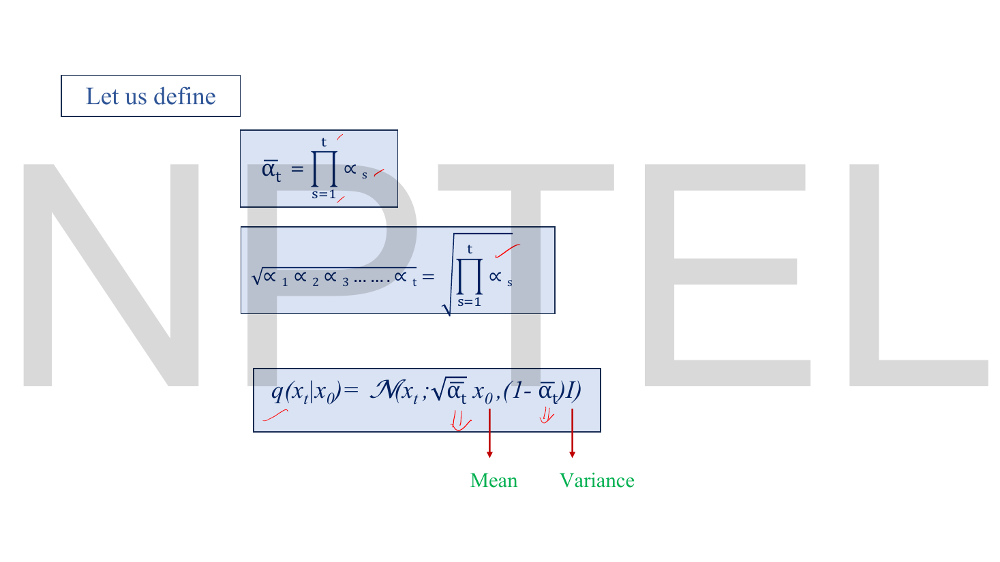

# Lec 46 — DDPM: The Forward Process

> **Source:** `Lec 46.pdf` (12 pages) · **Week 7** · **Playlist:** Lec 46
> **Prereqs:** [Lec 45 — Mathematical Foundations of Diffusion Models](45-diffusion-math.md), [Lec 23 — Reparameterization Trick](23-reparameterization.md), [Lec 13 — Denoising Autoencoders](13-denoising-ae.md)
> **Feeds into:** [Lec 47 — DDPM Reverse Process](47-ddpm-reverse.md), [Lec 48 — Hands-on: Forward Diffusion](48-forward-diffusion-handson.md), [Lec 49 — U-Net for Denoising](49-unet.md), [Lec 52 — Stable Diffusion](52-stable-diffusion.md)

## Why this lecture exists

[Lec 45](45-diffusion-math.md) gave you the schedule $\{\beta_t\}$ and the Gaussian vocabulary, and stopped. This lecture writes the forward process down as an equation and then does the one piece of algebra the whole method rests on.

The problem it solves is practical. Training a diffusion model means showing the network pairs $(\mathbf{x}_t, \epsilon)$ at *randomly chosen* timesteps. If the only way to reach $\mathbf{x}_{500}$ were to run 500 noising steps, every training example would cost 500 operations and training would be hopeless. This lecture proves you can jump straight from $\mathbf{x}_0$ to $\mathbf{x}_t$ for any $t$ in **one** step:

$$\mathbf{x}_t = \sqrt{\bar\alpha_t}\,\mathbf{x}_0 + \sqrt{1-\bar\alpha_t}\,\epsilon$$

The lecturer derives this by hand on the slides, by composing two Gaussians and watching their variances add. And when you see the final form, you should recognise it — it is $\mu + \sigma\epsilon$, the reparameterization trick from [Lec 23](23-reparameterization.md), wearing a diffusion hat.

## The ideas


*Fig. — The reference matters: DDPM is Ho, Jain & Abbeel (2020), UC Berkeley, and the deck says it is "a specific formulation of diffusion probabilistic models" — one choice among several, not the definition of diffusion. The ticks are the lecturer's. Page 3.*

### The one-step forward transition


*Fig. — Every word on the bottom two lines is load-bearing. $q(\mathbf{x}_t\mid\mathbf{x}_{t-1})$ is a **conditional probability**, and the thing it is conditional on is only the *immediately* previous image — that is the Markov structure named in the slide title, defined in [Lec 44](44-diffusion-intro.md) and applied to the schedule in [Lec 45](45-diffusion-math.md). Page 4.*

The forward process runs $t$ steps of noising, and "every step is more noisy than the previous step". One step is a draw from a Gaussian:

$$\boxed{\;q(\mathbf{x}_t \mid \mathbf{x}_{t-1}) \;=\; \mathcal{N}\!\big(\mathbf{x}_t;\ \sqrt{1-\beta_t}\,\mathbf{x}_{t-1},\ \beta_t\mathbf{I}\big)\;}$$

Read the two slots. The **mean** is $\sqrt{1-\beta_t}\,\mathbf{x}_{t-1}$ — a *shrunk copy of the previous image*. The **covariance** is $\beta_t\mathbf{I}$.


*Fig. — The lecturer multiplies $\beta_t$ into the identity by hand at the bottom left. The result is a diagonal matrix with $\beta_t$ in every diagonal slot and zeros off it — and the slide's own note says **zero covariance means no relationship between the dimensions**. Page 5.*

**What $\beta_t\mathbf{I}$ means, concretely.** $\mathbf{I}$ is the identity matrix, so

$$\beta_t\mathbf{I} = \beta_t\begin{bmatrix}1&0\\0&1\end{bmatrix} = \begin{bmatrix}\beta_t&0\\0&\beta_t\end{bmatrix}$$

(shown in 2-D on the slide; in general it is $d\times d$). Two readings, both examinable:

- **Off-diagonal zeros** — the noise added to pixel $i$ is independent of the noise added to pixel $j$. No dimension's noise is related to any other's.
- **Equal diagonal entries** — every dimension gets noise of the *same* variance $\beta_t$. This is called **isotropic** noise.

So $\beta_t$ is, in the deck's phrase, the "magnitude of noise", and a single scalar specifies the entire covariance of a distribution over hundreds of thousands of pixels. That is the whole reason the method is computable.

### Why the mean is *shrunk*: variance preservation


*Fig. — The lecturer circles $\mathbf{x}_{t-1}$ and writes "previous image" above it. The red question at the bottom is the one the next slide answers, and it is the best short-answer question in this chapter. Page 6.*

The deck poses it directly: **why scale the signal with $\sqrt{1-\beta_t}$?** Why not just add noise to the image as it stands?

This is the question [Lec 45](45-diffusion-math.md) flagged as the one every slide in the arc leaves out. The decks all say the forward process *adds noise*; none of them says in words that it *shrinks the signal at the same time*. Page 6 is the one slide that makes the shrinking visible — the mean is "a scaled version of the previous image" — and page 7 is where the lecturer proves why it has to be.

Rewrite using the Lec 45 definition $\alpha_t = 1-\beta_t$ (the lecturer boxes "Let $\alpha_t = 1-\beta_t$" and notes the inverse $\beta_t = 1-\alpha_t$ in the margin):

$$q(\mathbf{x}_t\mid\mathbf{x}_{t-1}) = \mathcal{N}\!\big(\mathbf{x}_t;\ \sqrt{\alpha_t}\,\mathbf{x}_{t-1},\ (1-\alpha_t)\mathbf{I}\big)$$

and write a *sample* from it rather than the distribution:

$$\mathbf{x}_t = \underbrace{\sqrt{\alpha_t}\,\mathbf{x}_{t-1}}_{\text{scaled signal strength}} + \underbrace{\sqrt{1-\alpha_t}\,\epsilon_t}_{\text{noise}}, \qquad \epsilon_t \sim \mathcal{N}(0,1)$$


*Fig. — The red handwriting on the right is the proof. The lecturer writes $\operatorname{Var}(a\epsilon_t) = a^2\operatorname{Var}(\epsilon_t)$ with $a = \sqrt{1-\alpha_t}$, so the noise contributes exactly $(1-\alpha_t)$ to the variance. Page 7.*

**The answer, in the deck's own calculation.** Suppose you did *not* scale, and wrote $\mathbf{x}_t = \mathbf{x}_{t-1} + \sqrt{1-\alpha_t}\,\epsilon_t$. Then

$$\operatorname{Var}(\mathbf{x}_t) = \operatorname{Var}(\mathbf{x}_{t-1}) + \operatorname{Var}\!\big(\sqrt{1-\alpha_t}\,\epsilon_t\big) = \operatorname{Var}(\mathbf{x}_{t-1}) + (1-\alpha_t)\operatorname{Var}(\epsilon_t) = \operatorname{Var}(\mathbf{x}_{t-1}) + (1-\alpha_t)$$

using $\operatorname{Var}(a\epsilon) = a^2\operatorname{Var}(\epsilon)$ and $\operatorname{Var}(\epsilon_t) = 1$. The deck's verdict: "**variance grows at every step**", and "after many steps the variance would become extremely large and the distribution would blow up."

With the scaling, the two contributions balance instead. If $\operatorname{Var}(\mathbf{x}_{t-1}) = 1$:

$$\operatorname{Var}(\mathbf{x}_t) = \alpha_t\cdot 1 + (1-\alpha_t) = 1$$

The variance is **preserved exactly**, step after step, which is why DDPM's forward process is called a *variance-preserving* diffusion. This is what makes the terminal condition $\mathbf{x}_T\sim\mathcal{N}(\mathbf{0},\mathbf{I})$ achievable: the variance was 1 at the start (on normalised data) and is still 1 at the end, while the mean has been multiplied down to nothing. Without the $\sqrt{\alpha_t}$ factor you would end at a Gaussian of enormous variance, which is not a distribution you can sample from at generation time.

### Two rules for combining Gaussians

The next derivation uses exactly two facts, and nothing else. State them once:

> **Rule 1 (scaling).** If $\epsilon \sim \mathcal{N}(0,1)$ and $a$ is a constant, then $a\epsilon \sim \mathcal{N}(0, a^2)$. Scaling a random variable by $a$ scales its *standard deviation* by $a$ and therefore its **variance by $a^2$**.
>
> **Rule 2 (adding independent Gaussians).** If $u\sim\mathcal{N}(0,\sigma_u^2)$ and $v\sim\mathcal{N}(0,\sigma_v^2)$ are **independent**, then $u+v \sim \mathcal{N}(0,\ \sigma_u^2+\sigma_v^2)$. **Variances add; standard deviations do not.**

Rule 2 needs the independence. In the forward chain $\epsilon_1, \epsilon_2, \ldots$ are drawn fresh at every step and never reused, so they are independent by construction — the same fact that makes the chain Markovian.

A standard-deviation-adding error here is the single easiest way to get the closed form wrong: $\sqrt{0.08} + \sqrt{0.20} = 0.7300$, but $\sqrt{0.08+0.20} = 0.5292$. Very different numbers.

### Composing two steps


*Fig. — The entire derivation, in the lecturer's hand. Follow the right-hand column downward: substitute, expand, label the three pieces, then add the two noise variances. The line $(\alpha_2 - \alpha_1\alpha_2 + 1 - \alpha_2)\mathbf{I} = (1-\bar\alpha_2)\mathbf{I}$ is where $\bar\alpha$ is born. Page 8.*

Write the first two steps:

$$\mathbf{x}_1 = \sqrt{\alpha_1}\,\mathbf{x}_0 + \sqrt{1-\alpha_1}\,\epsilon_1, \qquad \mathbf{x}_2 = \sqrt{\alpha_2}\,\mathbf{x}_1 + \sqrt{1-\alpha_2}\,\epsilon_2$$

**Step 1 — substitute $\mathbf{x}_1$ into $\mathbf{x}_2$.**

$$\mathbf{x}_2 = \sqrt{\alpha_2}\Big[\sqrt{\alpha_1}\,\mathbf{x}_0 + \sqrt{1-\alpha_1}\,\epsilon_1\Big] + \sqrt{1-\alpha_2}\,\epsilon_2$$

**Step 2 — multiply out.**

$$\mathbf{x}_2 = \underbrace{\sqrt{\alpha_1\alpha_2}\,\mathbf{x}_0}_{\text{contains original signal}} + \underbrace{\sqrt{\alpha_2(1-\alpha_1)}\,\epsilon_1}_{\text{Gaussian noise}} + \underbrace{\sqrt{1-\alpha_2}\,\epsilon_2}_{\text{Gaussian noise}}$$

(The lecturer labels those three pieces exactly so.) Note $\sqrt{\alpha_2}\cdot\sqrt{1-\alpha_1} = \sqrt{\alpha_2(1-\alpha_1)}$ — the square roots merge because both factors are non-negative.

**Step 3 — collapse the two noise terms into one.** Call their sum $\mathbf{z}$:

$$\mathbf{z} = \sqrt{\alpha_2(1-\alpha_1)}\,\epsilon_1 + \sqrt{1-\alpha_2}\,\epsilon_2$$

By Rule 1 the first term has variance $\alpha_2(1-\alpha_1)$ and the second has variance $(1-\alpha_2)$. $\epsilon_1$ and $\epsilon_2$ are independent, so by Rule 2 the variances **add**:

$$
\begin{aligned}
\operatorname{Var}(\mathbf{z}) &= \alpha_2(1-\alpha_1) + (1-\alpha_2) \\[4pt]
&= \alpha_2 - \alpha_1\alpha_2 + 1 - \alpha_2 && \text{(expand the bracket)} \\[4pt]
&= 1 - \alpha_1\alpha_2 && \text{($+\alpha_2$ and $-\alpha_2$ cancel)}
\end{aligned}
$$

That cancellation is the small miracle of the whole construction: **the $\alpha_2$ terms destroy each other, and what is left depends only on the product $\alpha_1\alpha_2$.** Both terms also have mean 0, so $\mathbf{z}\sim\mathcal{N}(0,\,1-\alpha_1\alpha_2)$ and can be rewritten as a single standard normal scaled up:

$$\mathbf{z} = \sqrt{1-\alpha_1\alpha_2}\,\epsilon, \qquad \epsilon\sim\mathcal{N}(0,1)$$

**Step 4 — name the product.** Define $\bar\alpha_2 = \alpha_1\alpha_2$ (the lecturer writes "let's consider $\bar\alpha_2 = \alpha_1\alpha_2$"). Then

$$\mathbf{x}_2 = \sqrt{\bar\alpha_2}\,\mathbf{x}_0 + \sqrt{1-\bar\alpha_2}\,\epsilon$$

Two steps have collapsed into one, with exactly the same *shape* as a single step. That shape-invariance is what lets the induction run.

> **Deck defect — page 8's final boxed line.** The lecturer's boxed result reads $x_2 = \bar\alpha_2 x_0 + (1-\bar\alpha_2)\mathbf{I}$. Both square roots have been dropped, and the identity matrix $\mathbf{I}$ appears where a *noise sample* $\epsilon$ belongs — the line mixes a sample with a covariance. The working immediately above it is correct; only the box is wrong. The correct line is $\mathbf{x}_2 = \sqrt{\bar\alpha_2}\,\mathbf{x}_0 + \sqrt{1-\bar\alpha_2}\,\epsilon$, and the correct *distribution* statement is $q(\mathbf{x}_2\mid\mathbf{x}_0) = \mathcal{N}(\mathbf{x}_2;\sqrt{\bar\alpha_2}\mathbf{x}_0, (1-\bar\alpha_2)\mathbf{I})$. Page 9 then states it correctly. Reproduce page 9, not the box.

### The general closed form


*Fig. — The destination. $\bar\alpha_t$ is defined as the running product, and $q(\mathbf{x}_t\mid\mathbf{x}_0)$ — note the conditioning on $\mathbf{x}_0$, not $\mathbf{x}_{t-1}$ — is a single Gaussian whose mean and variance both depend on $t$ only through $\bar\alpha_t$. Page 9.*

The two-step argument repeats verbatim. Suppose it holds at $t-1$, so $\mathbf{x}_{t-1} = \sqrt{\bar\alpha_{t-1}}\mathbf{x}_0 + \sqrt{1-\bar\alpha_{t-1}}\,\epsilon'$. Apply one more step:

$$
\begin{aligned}
\mathbf{x}_t &= \sqrt{\alpha_t}\,\mathbf{x}_{t-1} + \sqrt{1-\alpha_t}\,\epsilon_t \\[4pt]
&= \sqrt{\alpha_t}\Big[\sqrt{\bar\alpha_{t-1}}\,\mathbf{x}_0 + \sqrt{1-\bar\alpha_{t-1}}\,\epsilon'\Big] + \sqrt{1-\alpha_t}\,\epsilon_t \\[4pt]
&= \sqrt{\alpha_t\bar\alpha_{t-1}}\,\mathbf{x}_0 + \sqrt{\alpha_t(1-\bar\alpha_{t-1})}\,\epsilon' + \sqrt{1-\alpha_t}\,\epsilon_t
\end{aligned}
$$

The signal coefficient is $\sqrt{\alpha_t\bar\alpha_{t-1}} = \sqrt{\bar\alpha_t}$ by the definition of the product. The two noise variances add:

$$\alpha_t(1-\bar\alpha_{t-1}) + (1-\alpha_t) = \alpha_t - \alpha_t\bar\alpha_{t-1} + 1 - \alpha_t = 1 - \bar\alpha_t$$

— the same cancellation as before. So

$$\boxed{\;\mathbf{x}_t = \sqrt{\bar\alpha_t}\,\mathbf{x}_0 + \sqrt{1-\bar\alpha_t}\,\epsilon,\qquad \epsilon\sim\mathcal{N}(0,1),\qquad \bar\alpha_t = \prod_{s=1}^{t}\alpha_s\;}$$

or as a distribution,

$$q(\mathbf{x}_t\mid\mathbf{x}_0) = \mathcal{N}\!\big(\mathbf{x}_t;\ \sqrt{\bar\alpha_t}\,\mathbf{x}_0,\ (1-\bar\alpha_t)\mathbf{I}\big)$$

Three things to read off it:

- **The coefficients square to 1.** $(\sqrt{\bar\alpha_t})^2 + (\sqrt{1-\bar\alpha_t})^2 = \bar\alpha_t + (1-\bar\alpha_t) = 1$. So $\bar\alpha_t$ is literally the *fraction of the variance that is still signal*, and $1-\bar\alpha_t$ the fraction that is noise. They are a budget that always sums to one — variance preservation again.
- **$\bar\alpha_t\to 0$ drives $\mathbf{x}_t\to\epsilon$.** When $\bar\alpha_t$ is negligible the signal coefficient vanishes and the noise coefficient goes to 1, leaving $\mathbf{x}_T\approx\epsilon\sim\mathcal{N}(\mathbf{0},\mathbf{I})$ — exactly the terminal condition [Lec 45](45-diffusion-math.md) demanded.
- **$\epsilon$ is a *single* draw, not a sum you have to track.** All $t$ of the original per-step noises have been absorbed into one standard normal vector. This is what makes training possible: you draw one $\epsilon$, build $\mathbf{x}_t$, and that same $\epsilon$ is the regression target.

> **A subtlety the slides skip.** The $\epsilon$ in the closed form is *not* the same random variable as any individual $\epsilon_t$, and it is not their sum either. It is the single standard normal that has the same distribution as the accumulated noise. That is why the closed form reproduces the right distribution of $\mathbf{x}_t$ but will not reproduce a *particular* trajectory you generated step by step — see N4, where the stepwise run and the one-shot formula agree in distribution but the implied $\epsilon$ is a different number.

### This closed form **is** the reparameterization trick


*Fig. — The deck names it outright. Left: the generic trick. Right: the payoff, in the lecturer's words — "without reparameterization, $x_0\to x_1\to x_2\to\cdots\to x_t$ requires simulating $t$ diffusion steps; with reparameterization, $x_t$ can be obtained directly in one step for any random timestep $t$." Page 10.*

You already know this trick. [Lec 23](23-reparameterization.md) derived it for the VAE: to sample $\mathbf{z}\sim\mathcal{N}(\mu,\sigma^2)$ you do not call a sampler on a distribution whose parameters you want gradients through — you write

$$\mathbf{z} = \mu + \sigma\odot\epsilon, \qquad \epsilon\sim\mathcal{N}(0,1)$$

so that all the randomness sits in an input $\epsilon$ that carries no parameters, and $\mu,\sigma$ sit in a deterministic, differentiable expression.

Now put the two side by side:

| | VAE, [Lec 23](23-reparameterization.md) | DDPM forward, here |
|---|---|---|
| Sample | $\mathbf{z} = \mu + \sigma\odot\epsilon$ | $\mathbf{x}_t = \sqrt{\bar\alpha_t}\,\mathbf{x}_0 + \sqrt{1-\bar\alpha_t}\,\epsilon$ |
| The $\mu$ | $\mu_\phi(\mathbf{x})$, output of the encoder | $\sqrt{\bar\alpha_t}\,\mathbf{x}_0$, a fixed multiple of the data |
| The $\sigma$ | $\sigma_\phi(\mathbf{x})$, output of the encoder | $\sqrt{1-\bar\alpha_t}$, a fixed schedule constant |
| The $\epsilon$ | $\mathcal{N}(0,1)$, fresh per sample | $\mathcal{N}(0,1)$, fresh per sample |
| Learned? | $\mu,\sigma$ are learned | **neither is learned** — both come from the schedule |

**They are the same equation.** $\sqrt{\bar\alpha_t}\mathbf{x}_0$ is $\mu$ and $\sqrt{1-\bar\alpha_t}$ is $\sigma$, and the trick's content — *split a Gaussian sample into a deterministic part and a parameter-free noise part* — is identical in both. The only difference is what the two parts are made of: in the VAE they are network outputs, here they are constants fixed by the schedule.

Why it buys something different in each place:

- **In the VAE**, the point was **gradients**. You cannot backpropagate through a sampling operation, so you move the randomness out of the path ([Lec 23](23-reparameterization.md) owns that argument; it is not repeated here).
- **In DDPM's forward process**, the point is **speed and random access**. There are no gradients to worry about — $q$ has no parameters. What you gain is the ability to produce a training example at any timestep $t$ in $O(1)$ work instead of $O(t)$, which is what makes the training loop in [Lec 47](47-ddpm-reverse.md) — *sample $t$ uniformly, build $\mathbf{x}_t$, predict $\epsilon$* — practical at all.

If one connection should survive this week, it is this one. It is the cleanest bridge from the VAE arc to the diffusion arc: the same three-symbol identity $\mu + \sigma\epsilon$, re-used for a completely different reason.

### Signal-to-noise ratio, in one line

The closed form hands you the quantity [Lec 45](45-diffusion-math.md)'s page 4 named but never defined. The two coefficients are amplitudes, so their squares are powers: $\bar\alpha_t$ is retained signal power and $1-\bar\alpha_t$ is injected noise power, giving $\mathrm{SNR}(t) = \bar\alpha_t/(1-\bar\alpha_t)$.

**[Lec 48](48-forward-diffusion-handson.md) owns SNR** — it is on that deck's own slides, plotted for both schedules, and that chapter works out what the curve means. It is quoted here only because the closed form is where the ratio comes from, and it appears as a column in N2 below.

## Worked numericals

The Lec 46 deck contains **no numerical example at all** — every derivation on it is symbolic. All six numericals below are constructed, and all arithmetic is independently verified.

### N1. The two-step composition, on numbers

**Given:** $\beta_1 = 0.1$, $\beta_2 = 0.2$.
**Find:** $\alpha_1,\alpha_2,\bar\alpha_2$; the two noise coefficients in the expanded form; and a check that their variances sum to $1-\bar\alpha_2$.

1. $\alpha_1 = 1-0.1 = 0.9$; $\alpha_2 = 1-0.2 = 0.8$.
2. $\bar\alpha_2 = \alpha_1\alpha_2 = 0.9\times0.8 = 0.72$, so $1-\bar\alpha_2 = 0.28$.
3. Expanded form: $\mathbf{x}_2 = \sqrt{0.72}\,\mathbf{x}_0 + \sqrt{\alpha_2(1-\alpha_1)}\,\epsilon_1 + \sqrt{1-\alpha_2}\,\epsilon_2$.
 - coefficient of $\epsilon_1$: $\sqrt{0.8\times0.1} = \sqrt{0.08} = 0.282843$, variance $0.08$;
 - coefficient of $\epsilon_2$: $\sqrt{0.2} = 0.447214$, variance $0.20$.
4. Add the **variances** (Rule 2): $0.08 + 0.20 = 0.28$.
5. Compare with $1-\bar\alpha_2 = 1 - 0.72 = 0.28$. ✓
6. So the single combined coefficient is $\sqrt{0.28} = 0.529150$, and $\sqrt{\bar\alpha_2} = \sqrt{0.72} = 0.848528$.

**Answer:** $\mathbf{x}_2 = 0.848528\,\mathbf{x}_0 + 0.529150\,\epsilon$, with $\epsilon\sim\mathcal{N}(0,1)$.

The trap is in step 4. Adding the *standard deviations* gives $0.282843 + 0.447214 = 0.730057$, against the correct $0.529150$ — 38% too large. Variances add; standard deviations never do.

### N2. A toy schedule end to end, showing $\bar\alpha_t\to 0$

**Given:** a deliberately aggressive linear schedule, $T = 10$, $\beta$ from $0.02$ to $0.40$ in equal steps (step size $0.38/9 = 0.042\overline{2}$).
**Find:** $\alpha_t$, $\bar\alpha_t$, the signal and noise coefficients, and the SNR at each step.

Each row: $\alpha_t = 1-\beta_t$; $\bar\alpha_t = \bar\alpha_{t-1}\alpha_t$; coefficients $\sqrt{\bar\alpha_t}$ and $\sqrt{1-\bar\alpha_t}$; $\mathrm{SNR} = \bar\alpha_t/(1-\bar\alpha_t)$.

| $t$ | $\beta_t$ | $\alpha_t$ | $\bar\alpha_t$ | $\sqrt{\bar\alpha_t}$ | $\sqrt{1-\bar\alpha_t}$ | SNR |
|---|---|---|---|---|---|---|
| 1 | 0.020000 | 0.980000 | 0.980000 | 0.989949 | 0.141421 | 49.000 |
| 2 | 0.062222 | 0.937778 | 0.919022 | 0.958656 | 0.284566 | 11.349 |
| 3 | 0.104444 | 0.895556 | 0.823035 | 0.907213 | 0.420672 | 4.651 |
| 4 | 0.146667 | 0.853333 | 0.702324 | 0.838047 | 0.545597 | 2.359 |
| 5 | 0.188889 | 0.811111 | 0.569662 | 0.754760 | 0.656001 | 1.324 |
| 6 | 0.231111 | 0.768889 | 0.438007 | 0.661821 | 0.749662 | 0.779 |
| 7 | 0.273333 | 0.726667 | 0.318285 | 0.564168 | 0.825660 | 0.467 |
| 8 | 0.315556 | 0.684444 | 0.217849 | 0.466742 | 0.884393 | 0.279 |
| 9 | 0.357778 | 0.642222 | 0.139907 | 0.374042 | 0.927412 | 0.163 |
| 10 | 0.400000 | 0.600000 | 0.083944 | 0.289731 | 0.957108 | 0.092 |

Spot-check row 3 by hand: $\beta_3 = 0.02 + 2\times0.042222 = 0.104444$, $\alpha_3 = 0.895556$, and $\bar\alpha_3 = 0.919022\times0.895556 = 0.823035$. ✓

**Answer:** $\bar\alpha_{10} = 0.08394$, so $\mathbf{x}_{10} = 0.2897\,\mathbf{x}_0 + 0.9571\,\epsilon$ — about 8% signal variance, 92% noise. The SNR crosses 1 between $t=5$ and $t=6$: that is where the image stops being a picture with noise on it and becomes noise with a picture in it.

Note $T=10$ is **not enough**. $\bar\alpha_{10} = 0.084$ still leaves visible structure; the deck's requirement is $\bar\alpha_T\approx 0$. That is the "too fast / too slow" trade-off from [Lec 45](45-diffusion-math.md) biting from the other side — this schedule is too *short*, not too gentle.

### N3. The real DDPM schedule

**Given:** $T = 1000$, $\beta_t$ linear from $10^{-4}$ to $0.02$ (the Lec 45 N4 schedule).
**Find:** $\bar\alpha_t$ and the signal/noise split at several $t$, and verify $\bar\alpha_T\to 0$.

| $t$ | $\beta_t$ | $\alpha_t$ | $\bar\alpha_t$ | $\sqrt{\bar\alpha_t}$ (signal) | $\sqrt{1-\bar\alpha_t}$ (noise) |
|---|---|---|---|---|---|
| 1 | 0.000100 | 0.999900 | $0.999900$ | 0.999950 | 0.010000 |
| 100 | 0.002072 | 0.997928 | $0.897018$ | 0.947110 | 0.320908 |
| 200 | 0.004064 | 0.995936 | $0.659039$ | 0.811812 | 0.583919 |
| 300 | 0.006056 | 0.993944 | $0.396420$ | 0.629619 | 0.776904 |
| 500 | 0.010040 | 0.989960 | $7.8587\times10^{-2}$ | 0.280334 | 0.959902 |
| 700 | 0.014024 | 0.985976 | $6.9661\times10^{-3}$ | 0.083463 | 0.996511 |
| 900 | 0.018008 | 0.981992 | $2.7521\times10^{-4}$ | 0.016589 | 0.999862 |
| 1000 | 0.020000 | 0.980000 | $4.0358\times10^{-5}$ | 0.006353 | 0.999980 |

**Answer:** $\bar\alpha_{1000} = 4.036\times10^{-5}$. The signal coefficient is $0.00635$ — the original image survives at six parts in a thousand — and the noise coefficient is $0.99998$. So $\mathbf{x}_T$ is standard normal to four decimal places, and the requirement $\mathbf{x}_T\sim\mathcal{N}(\mathbf{0},\mathbf{I})$ is met.

Read down the $\alpha_t$ column: **every single step keeps at least 98% of the variance**, yet after 1000 of them only 0.004% survives. The destruction is entirely a compounding effect. And read the SNR crossing: $\bar\alpha_{300} = 0.396$ gives $\mathrm{SNR} = 0.396/0.604 = 0.656 < 1$, while $\bar\alpha_{200} = 0.659$ gives $\mathrm{SNR} = 1.933 > 1$. $\mathrm{SNR}$ passes 1 between $t = 259$ (where $\bar\alpha_t = 0.5002$) and $t = 260$ (where it is $0.4976$) — the halfway point in *information* terms is about a quarter of the way through the chain, not at $t = 500$. [Lec 48](48-forward-diffusion-handson.md) plots the whole curve.

### N4. One jump vs. $t$ steps, on a single number

**Given:** a one-dimensional "image" $x_0 = 2.0$, schedule $\beta = (0.1, 0.2, 0.3)$, so $\alpha = (0.9, 0.8, 0.7)$. The three per-step noises happen to be drawn as $\epsilon_1 = 0.5$, $\epsilon_2 = -1.2$, $\epsilon_3 = 0.3$.
**Find:** $x_3$ the slow way; $\bar\alpha_3$; and what the closed form gives.

1. $x_1 = \sqrt{0.9}\,(2.0) + \sqrt{0.1}\,(0.5) = 0.948683\times2 + 0.316228\times0.5 = 1.897367 + 0.158114 = 2.055481$.
2. $x_2 = \sqrt{0.8}\,(2.055481) + \sqrt{0.2}\,(-1.2) = 0.894427\times2.055481 - 0.447214\times1.2 = 1.838479 - 0.536656 = 1.301823$.
3. $x_3 = \sqrt{0.7}\,(1.301823) + \sqrt{0.3}\,(0.3) = 0.836660\times1.301823 + 0.547723\times0.3 = 1.089204 + 0.164317 = 1.253521$.
4. Closed form: $\bar\alpha_3 = 0.9\times0.8\times0.7 = 0.504$, so $\sqrt{\bar\alpha_3} = 0.709930$ and $\sqrt{1-\bar\alpha_3} = \sqrt{0.496} = 0.704273$.
5. Which $\epsilon$ would the closed form need to land on the same $x_3$? Solve $1.253521 = 0.709930\times2 + 0.704273\,\epsilon$: $\epsilon = (1.253521 - 1.419859)/0.704273 = -0.23622$.

**Answer:** $x_3 = 1.2535$ by the slow route; the closed form reproduces it with the single effective noise $\epsilon = -0.2362$. Three operations became one.

This is the point the subtlety box made. The closed form does **not** let you recover the trajectory's individual $\epsilon_t$ — it gives you one equivalent $\epsilon$. And note $-0.2362 \neq$ any simple combination of $0.5, -1.2, 0.3$; it is whatever the composed Gaussian happened to produce. What is guaranteed is that over many draws, the *distributions* match exactly — the Code section verifies that to three decimal places on 200,000 samples.

### N5. The blow-up, if you forget to scale

**Given:** $\operatorname{Var}(\mathbf{x}_0) = 1$ (normalised data), the full DDPM schedule ($T=1000$, $\beta$ linear $10^{-4}\to0.02$), and the unscaled recursion $\mathbf{x}_t = \mathbf{x}_{t-1} + \sqrt{\beta_t}\,\epsilon_t$.
**Find:** $\operatorname{Var}(\mathbf{x}_T)$ with and without the $\sqrt{\alpha_t}$ factor.

1. **Unscaled.** $\operatorname{Var}(\mathbf{x}_t) = \operatorname{Var}(\mathbf{x}_{t-1}) + \beta_t$, so after $T$ steps $\operatorname{Var}(\mathbf{x}_T) = 1 + \sum_{t=1}^{T}\beta_t$.
2. The $\beta_t$ are an arithmetic sequence, so their sum is $T\times$(mean of first and last) $= 1000\times\frac{0.0001+0.02}{2} = 1000\times0.01005 = 10.05$.
3. $\operatorname{Var}(\mathbf{x}_T) = 1 + 10.05 = 11.05$, i.e. a standard deviation of $\sqrt{11.05} = 3.324$.
4. **Scaled.** $\operatorname{Var}(\mathbf{x}_t) = \alpha_t\operatorname{Var}(\mathbf{x}_{t-1}) + \beta_t = \alpha_t\cdot 1 + (1-\alpha_t) = 1$ at every step.

**Answer:** unscaled, the variance grows to $11.05$ ($\sigma = 3.32$) — a Gaussian more than three times too wide to be $\mathcal{N}(0,1)$. Scaled, it stays at exactly 1 for all $T$.

With a longer chain it is worse: the sum grows linearly in $T$, so $T = 10{,}000$ at the same $\beta$ range would give $\operatorname{Var}\approx 101$. That is the deck's "the distribution would blow up", priced. And the failure is fatal, not cosmetic: the reverse chain starts from $\mathcal{N}(\mathbf{0},\mathbf{I})$, so if the forward chain ends at $\mathcal{N}(\mathbf{0}, 11.05\,\mathbf{I})$ the model is handed an input unlike anything it trained on.

### N6. Reading the signal/noise budget

**Given:** $\bar\alpha_t = 0.36$.
**Find:** the signal and noise coefficients, their squares, the SNR, and the step's SNR in decibels.

1. Signal coefficient $\sqrt{0.36} = 0.6$; noise coefficient $\sqrt{1-0.36} = \sqrt{0.64} = 0.8$.
2. Check they are a variance budget: $0.6^2 + 0.8^2 = 0.36 + 0.64 = 1.00$. ✓
3. $\mathrm{SNR} = 0.36/0.64 = 0.5625$.
4. In decibels: $10\log_{10}(0.5625) = 10\times(-0.24988) = -2.499$ dB. (Base 10, by the definition of the decibel; everything else in this chapter is base-$e$ or base-free.)

**Answer:** $\mathbf{x}_t = 0.6\,\mathbf{x}_0 + 0.8\,\epsilon$, $\mathrm{SNR} = 0.5625$ ($-2.50$ dB) — past the crossover, so this sample is already more noise than signal.

The 0.6 / 0.8 pair is worth memorising as a sanity check: the coefficients always form a right triangle with hypotenuse 1, so if a question gives you one of them you get the other for free.

## Code

The derivation claims that $t$ sequential noising steps and one closed-form jump produce *the same distribution*. Here that claim is checked on 200,000 samples.

```python
import numpy as np
rng = np.random.default_rng(0)

T = 1000
beta  = np.linspace(1e-4, 0.02, T)
alpha = 1.0 - beta
abar  = np.cumprod(alpha)

x0 = 1.0                      # a one-pixel "image"
t  = 400                      # target timestep (1-indexed)

# --- route A: run the chain one step at a time, t times
xs = np.full(200000, x0)
for k in range(t):
    xs = np.sqrt(alpha[k]) * xs + np.sqrt(beta[k]) * rng.standard_normal(xs.shape)

# --- route B: one shot, x_t = sqrt(abar_t) x0 + sqrt(1 - abar_t) eps
eps = rng.standard_normal(200000)
xb  = np.sqrt(abar[t-1]) * x0 + np.sqrt(1 - abar[t-1]) * eps

print(f"t = {t}:  abar_t = {abar[t-1]:.6f}")
print(f"  predicted mean  sqrt(abar_t)*x0 = {np.sqrt(abar[t-1])*x0:.6f}")
print(f"  stepwise  mean = {xs.mean():.6f}   one-shot mean = {xb.mean():.6f}")
print(f"  predicted var   1 - abar_t      = {1 - abar[t-1]:.6f}")
print(f"  stepwise  var  = {xs.var():.6f}   one-shot var  = {xb.var():.6f}")

print("\n t      alpha_t    abar_t      sqrt(abar_t)  sqrt(1-abar_t)")
for t in [1, 100, 300, 500, 700, 1000]:
    i = t - 1
    print(f"{t:4d}  {alpha[i]:.6f}  {abar[i]:.3e}   {np.sqrt(abar[i]):.6f}      "
          f"{np.sqrt(1-abar[i]):.6f}")
```

```
t = 400:  abar_t = 0.195146
  predicted mean  sqrt(abar_t)*x0 = 0.441754
  stepwise  mean = 0.443125   one-shot mean = 0.444405
  predicted var   1 - abar_t      = 0.804854
  stepwise  var  = 0.802738   one-shot var  = 0.802081

 t      alpha_t    abar_t      sqrt(abar_t)  sqrt(1-abar_t)
   1  0.999900  9.999e-01   0.999950      0.010000
 100  0.997928  8.970e-01   0.947110      0.320908
 300  0.993944  3.964e-01   0.629619      0.776904
 500  0.989960  7.859e-02   0.280334      0.959902
 700  0.985976  6.966e-03   0.083463      0.996511
1000  0.980000  4.036e-05   0.006353      0.999980
```

The three means agree to within Monte-Carlo error (0.4418 predicted, 0.4431 and 0.4444 measured on 200k samples, where the standard error is about $0.9/\sqrt{200000} = 0.002$), and so do the three variances. **400 operations and 1 operation gave the same distribution**, which is exactly what the derivation promised.

The experiment above is the proof of this chapter's derivation. The Lec 48 notebook runs its own version of it, at $t=500$ with 20,000 samples and seed 42, and [Lec 48](48-forward-diffusion-handson.md) reports those printed figures — so you will meet this check twice, once as a proof and once as a reproduction of the deck's output. One implementation note for that chapter: `np.cumprod(alpha)` computes the whole $\bar\alpha$ array in one pass, and in practice it is precomputed once before training and then indexed — you never recompute a product inside the training loop.

## Exam pack

### Must-memorise

| Item | Exactly this |
|---|---|
| One-step forward | $q(\mathbf{x}_t\mid\mathbf{x}_{t-1}) = \mathcal{N}\big(\mathbf{x}_t;\ \sqrt{1-\beta_t}\,\mathbf{x}_{t-1},\ \beta_t\mathbf{I}\big)$ |
| Same, in $\alpha$ | $q(\mathbf{x}_t\mid\mathbf{x}_{t-1}) = \mathcal{N}\big(\mathbf{x}_t;\ \sqrt{\alpha_t}\,\mathbf{x}_{t-1},\ (1-\alpha_t)\mathbf{I}\big)$ |
| One-step sample | $\mathbf{x}_t = \sqrt{\alpha_t}\,\mathbf{x}_{t-1} + \sqrt{1-\alpha_t}\,\epsilon_t$, $\epsilon_t\sim\mathcal{N}(0,1)$ |
| Definitions | $\alpha_t = 1-\beta_t$, $\ \bar\alpha_t = \prod_{s=1}^{t}\alpha_s$ |
| **Closed form (sample)** | $\mathbf{x}_t = \sqrt{\bar\alpha_t}\,\mathbf{x}_0 + \sqrt{1-\bar\alpha_t}\,\epsilon$ |
| **Closed form (distribution)** | $q(\mathbf{x}_t\mid\mathbf{x}_0) = \mathcal{N}\big(\mathbf{x}_t;\ \sqrt{\bar\alpha_t}\,\mathbf{x}_0,\ (1-\bar\alpha_t)\mathbf{I}\big)$ |
| Rule 1 | $\epsilon\sim\mathcal{N}(0,1)\Rightarrow a\epsilon\sim\mathcal{N}(0,a^2)$ |
| Rule 2 | independent $u,v$: $\operatorname{Var}(u+v) = \operatorname{Var}(u)+\operatorname{Var}(v)$ |
| The cancellation | $\alpha_t(1-\bar\alpha_{t-1}) + (1-\alpha_t) = 1-\bar\alpha_t$ |
| Variance preservation | $\alpha_t\cdot 1 + (1-\alpha_t) = 1$ |
| Unscaled recursion blows up | $\operatorname{Var}(\mathbf{x}_t) = \operatorname{Var}(\mathbf{x}_{t-1}) + (1-\alpha_t)$ |
| Reparameterization | $\mathbf{z} = \mu + \sigma\odot\epsilon$ — see [Lec 23](23-reparameterization.md) |
| SNR (owned by [Lec 48](48-forward-diffusion-handson.md)) | $\mathrm{SNR}(t) = \bar\alpha_t/(1-\bar\alpha_t)$ |
| Covariance structure | $\beta_t\mathbf{I}$ — diagonal, equal entries, i.e. **isotropic** |

### Numbers worth knowing

| Quantity | Value |
|---|---|
| DDPM schedule | $T=1000$, $\beta_1 = 10^{-4}$, $\beta_T = 0.02$, linear |
| $\bar\alpha_{100}$ / $\bar\alpha_{300}$ / $\bar\alpha_{500}$ | $0.8970$ / $0.3964$ / $0.07859$ |
| $\bar\alpha_{1000}$ | $4.036\times10^{-5}$ |
| Signal coefficient at $t=1000$ | $\sqrt{\bar\alpha_T} = 0.00635$ |
| Noise coefficient at $t=1000$ | $0.99998$ |
| SNR crossover ($\bar\alpha_t = 0.5$) for that schedule | between $t = 259$ and $t = 260$ |
| $\sum_t\beta_t$ for that schedule | $10.05$ |
| Unscaled variance after 1000 steps | $11.05$ ($\sigma = 3.32$) |
| Scaled variance after any number of steps | $1$ |
| Toy example $\beta = (0.1,0.2)$ | $\bar\alpha_2 = 0.72$, coefficients $0.8485$ and $0.5292$ |
| Same, wrong (adding std devs) | $0.7301$ |
| Memorable budget pair | $\bar\alpha = 0.36 \Rightarrow 0.6\,\mathbf{x}_0 + 0.8\,\epsilon$ |

### Likely MCQ traps

- **Adding standard deviations instead of variances.** $\sqrt{0.08}+\sqrt{0.20} = 0.7301$; the right answer is $\sqrt{0.08+0.20} = 0.5292$. Rule 2 is about **variances**. This is the commonest arithmetic slip in the whole chapter.
- **$\sqrt{1-\beta_t}$ vs $1-\beta_t$ in the mean.** The mean is $\sqrt{1-\beta_t}\,\mathbf{x}_{t-1}$. The *variance* is $\beta_t$ un-rooted. Roots on the mean and on the sample's coefficients; no root inside the distribution's second slot.
- **$\mathcal{N}(\mu,\sigma)$ vs $\mathcal{N}(\mu,\sigma^2)$.** The second slot of every Gaussian in this book is a **variance**. $q(\mathbf{x}_t\mid\mathbf{x}_0)$ has variance $1-\bar\alpha_t$, so the coefficient on $\epsilon$ is $\sqrt{1-\bar\alpha_t}$.
- **Conditioning on the wrong thing.** $q(\mathbf{x}_t\mid\mathbf{x}_{t-1})$ uses $\beta_t$ and $\alpha_t$. $q(\mathbf{x}_t\mid\mathbf{x}_0)$ uses $\bar\alpha_t$. Swapping them is the single biggest formula error available.
- **$\alpha_t$ for $\bar\alpha_t$.** For the DDPM schedule $\alpha_{1000} = 0.98$ but $\bar\alpha_{1000} = 4\times10^{-5}$. An option offering 0.98 is testing whether you noticed the bar.
- **"The forward process is learned / has parameters."** $q$ has no parameters at all. Only $\theta$ in [Lec 47](47-ddpm-reverse.md)'s $p_\theta$ is learned.
- **"The reparameterization trick is needed here for gradients."** It is not. $q$ carries no gradients. Here the trick buys **$O(1)$ random access to any timestep**; in the VAE ([Lec 23](23-reparameterization.md)) it bought differentiability. Same equation, different payoff — and an exam may ask for either.
- **Thinking the closed-form $\epsilon$ equals $\epsilon_t$, or the sum of the $\epsilon_s$.** It is a single fresh standard normal with the same distribution as the accumulated noise, which is not the same object (N4).
- **Thinking $\beta_t\mathbf{I}$ means the pixels are identical.** It means their *noise* is independent and equally sized. Zero covariance, not zero difference.
- **The $\alpha$ collision.** [Lec 04](04-optimizers-b.md) uses $\alpha_t$ for AdaGrad's accumulator and [Lec 28](28-latent-interpolation.md) uses $\alpha$ for an interpolation weight. Here $\alpha_t = 1-\beta_t$ and is unrelated to both.
- **Page 8's boxed line.** The deck's hand-written box drops both square roots and writes $\mathbf{I}$ for $\epsilon$. If an option reproduces it, it is the distractor.

### Self-test

1. Write $q(\mathbf{x}_t\mid\mathbf{x}_{t-1})$ in full, naming the mean and the covariance, and say what $\beta_t\mathbf{I}$ asserts about the pixels.
2. Why is the mean $\sqrt{1-\beta_t}\,\mathbf{x}_{t-1}$ rather than $\mathbf{x}_{t-1}$? Show the variance calculation both ways.
3. With $\beta_1 = 0.2$ and $\beta_2 = 0.5$, compute $\bar\alpha_2$ and the two coefficients in $\mathbf{x}_2 = a\,\mathbf{x}_0 + b\,\epsilon$.
4. State the two rules used to compose two Gaussians, and which one requires independence.
5. Carry out the cancellation $\alpha_t(1-\bar\alpha_{t-1}) + (1-\alpha_t)$ and say which terms cancel.
6. What does the closed form buy you that stepwise simulation does not, and why is that *not* about gradients?
7. Given $\bar\alpha_t = 0.64$, what fraction of $\mathbf{x}_t$'s variance is signal, and what is the SNR?
8. A model uses the unscaled update $\mathbf{x}_t = \mathbf{x}_{t-1} + \sqrt{\beta_t}\epsilon_t$ with $\beta_t = 0.01$ for all $t$ and $T=500$, starting from unit variance. What is $\operatorname{Var}(\mathbf{x}_T)$, and why does that break generation?
9. Match the pieces: in $\mathbf{z} = \mu + \sigma\odot\epsilon$, what plays the role of $\mu$ and of $\sigma$ in the DDPM forward jump?
10. For the DDPM linear schedule, $\alpha_t\ge 0.98$ for every $t$, yet $\bar\alpha_{1000} = 4\times10^{-5}$. Explain the discrepancy in one sentence.

<details><summary>Answers</summary>

1. $q(\mathbf{x}_t\mid\mathbf{x}_{t-1}) = \mathcal{N}(\mathbf{x}_t;\sqrt{1-\beta_t}\,\mathbf{x}_{t-1},\ \beta_t\mathbf{I})$ — mean $\sqrt{1-\beta_t}\mathbf{x}_{t-1}$ (a shrunk copy of the previous image), covariance $\beta_t\mathbf{I}$. $\beta_t\mathbf{I}$ is diagonal with equal entries: the noise on each pixel is independent of every other pixel's and has the same variance $\beta_t$ everywhere (isotropic).
2. Unscaled: $\operatorname{Var}(\mathbf{x}_t) = \operatorname{Var}(\mathbf{x}_{t-1}) + \beta_t$, which grows without bound. Scaled: $\operatorname{Var}(\mathbf{x}_t) = (1-\beta_t)\operatorname{Var}(\mathbf{x}_{t-1}) + \beta_t = 1$ when $\operatorname{Var}(\mathbf{x}_{t-1}) = 1$. The scaling makes the process **variance-preserving**, which is what allows $\mathbf{x}_T\sim\mathcal{N}(\mathbf{0},\mathbf{I})$.
3. $\alpha_1 = 0.8$, $\alpha_2 = 0.5$, $\bar\alpha_2 = 0.40$. $a = \sqrt{0.40} = \mathbf{0.632456}$, $b = \sqrt{0.60} = \mathbf{0.774597}$. (Check: $0.4+0.6 = 1$.)
4. **Rule 1:** $a\epsilon\sim\mathcal{N}(0,a^2)$. **Rule 2:** variances of *independent* zero-mean Gaussians add. Rule 2 is the one requiring independence — and it holds because fresh noise is drawn at every step.
5. $\alpha_t - \alpha_t\bar\alpha_{t-1} + 1 - \alpha_t = 1 - \alpha_t\bar\alpha_{t-1} = 1-\bar\alpha_t$. The $+\alpha_t$ from expanding the bracket cancels the $-\alpha_t$ from $(1-\alpha_t)$.
6. **$O(1)$ random access to any timestep** — you can build a training example at a randomly chosen $t$ without simulating $t$ steps. It is not about gradients because $q$ has no parameters to differentiate; that was the VAE's reason ([Lec 23](23-reparameterization.md)).
7. Signal fraction $= \bar\alpha_t = \mathbf{0.64}$ (64%), noise fraction $0.36$. Coefficients $0.8$ and $0.6$. $\mathrm{SNR} = 0.64/0.36 = \mathbf{1.7\overline{7}}$.
8. $\operatorname{Var}(\mathbf{x}_T) = 1 + 500\times0.01 = \mathbf{6.0}$ ($\sigma = 2.449$). Generation starts by drawing $\mathbf{x}_T\sim\mathcal{N}(\mathbf{0},\mathbf{I})$, which has variance 1 — so the sampler would feed the network inputs 2.4× narrower than anything it saw in training.
9. $\mu \leftrightarrow \sqrt{\bar\alpha_t}\,\mathbf{x}_0$ and $\sigma \leftrightarrow \sqrt{1-\bar\alpha_t}$. Both are fixed by the schedule rather than produced by a network, which is the only structural difference from the VAE.
10. Because $\bar\alpha_t$ is a **product** of a thousand such factors, and $0.98^{1000}$ is astronomically small — tiny per-step attenuation compounds into total destruction.

</details>

## Beyond the slides

**Gap: "variance-preserving" is demonstrated but never named.**
**Why it matters:** DDPM's forward process is the **VP (variance-preserving)** SDE in the score-based literature, and its sibling is the **VE (variance-exploding)** formulation, which deliberately does *not* scale the signal and lets the variance grow — the thing this deck calls "blowing up". VE diffusion is a real, working family of models (Song & Ermon's NCSN); it simply pays for the growing variance elsewhere. The deck presents the unscaled version purely as an error. Knowing the name is worth a mark if the exam reaches for it.

**Gap: the deck gives no numerical example anywhere.**
**Why it matters:** the exam is MCQ *and numerical*, and this is the chapter where the numbers are easiest to set. Everything in N1–N6 is constructed. The two shapes you should be able to do under time pressure are "given $\beta_1,\beta_2$, find $\bar\alpha_2$ and the coefficients" and "given $\bar\alpha_t$, split the variance into signal and noise".

**Gap: nothing says how $t$ is chosen during training.**
**Why it matters:** the whole reason the closed form is valuable is that training draws $t\sim\mathrm{Uniform}\{1,\ldots,T\}$ *independently for every example in the batch*, so one batch covers many noise levels at once. Without the closed form, a batch of 128 examples at random timesteps would cost an average of 500 sequential noising steps each. [Lec 47](47-ddpm-reverse.md) states the training loop; this is why it is affordable.

**Gap: the closed form holds only because every $\epsilon_t$ is independent *and Gaussian*.**
**Why it matters:** Rule 2 as used here needs both. Independent non-Gaussian noises would still have additive variances, but their sum would not be Gaussian, and $q(\mathbf{x}_t\mid\mathbf{x}_0)$ would have no closed form. The Gaussian assumption on page 2 of [Lec 45](45-diffusion-math.md) is not an aesthetic choice — it is what makes the entire method tractable, because Gaussians are closed under scaling and addition.

**Gap: no mention of what happens on data that is not normalised.**
**Why it matters:** variance preservation holds at $\operatorname{Var}(\mathbf{x}_0) = 1$. In practice images are rescaled from $[0,255]$ to $[-1,1]$ before training precisely so that this is roughly true. Feed raw $[0,255]$ pixels and $\operatorname{Var}(\mathbf{x}_0)\approx 5000$, so $\bar\alpha_T\operatorname{Var}(\mathbf{x}_0)$ is no longer negligible against 1 and $\mathbf{x}_T$ is not standard normal. [Lec 48](48-forward-diffusion-handson.md) will do this rescaling in code.

## Cut from the slides

Pages 1, 2, 11 and 12 are the title, a one-line contents slide reading "Forward Diffusion Process", an empty "Summary" card and the pointer to the next session; nothing was lost. Page 3's forward/reverse strip duplicates [Lec 45](45-diffusion-math.md) pages 2–3 almost exactly and is kept only for the DDPM paper citation and because it is this deck's statement that DDPM is *one specific formulation*. Page 5's general covariance matrix $\boldsymbol{\Sigma}$ with `Var`/`Covar` entries and the "zero covariance means no relationship" note repeat [Lec 45](45-diffusion-math.md) page 9 and are compressed to the two readings of $\beta_t\mathbf{I}$ that this chapter actually needs. Pages 6 and 7 both restate the one-step distribution; it appears once here, with the $\alpha$ substitution and the "why scale" question folded together. Page 8's handwriting is transcribed into typeset algebra with the steps labelled, and its erroneous boxed conclusion is flagged rather than reproduced. The lecturer's marginal notes ($\alpha_t = 1-\beta_t$ and $\beta_t = 1-\alpha_t$ on page 7, "previous image" on page 6, "mean"/"covariance term" on page 10) are folded into the prose. Everything on pages 3–10 is otherwise reproduced.
