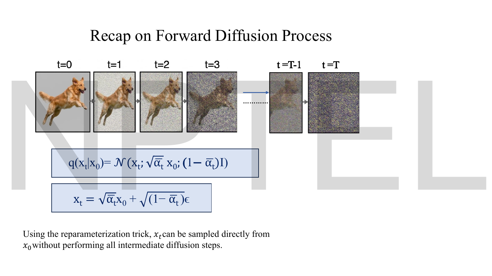
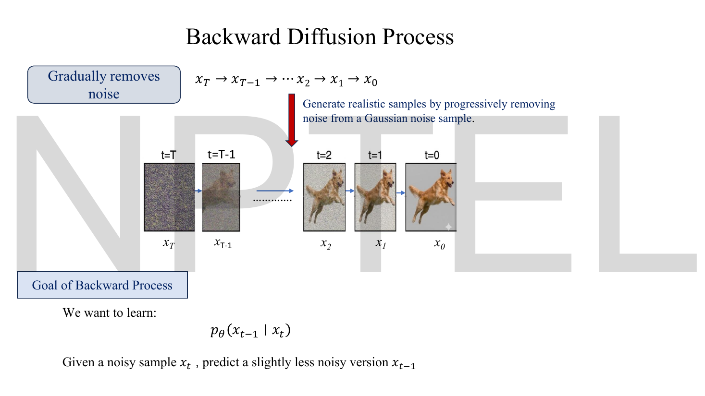
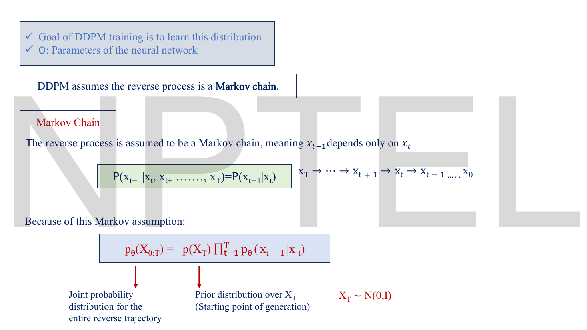
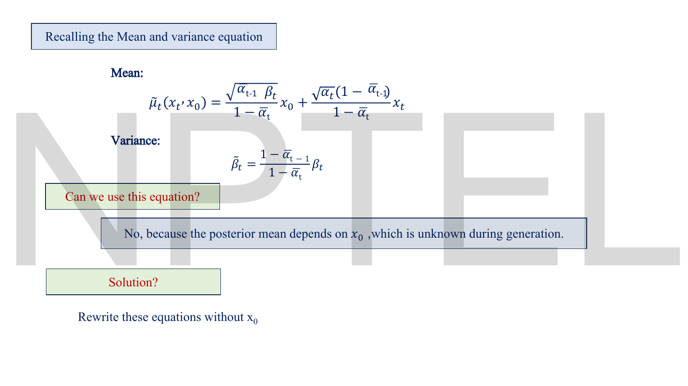
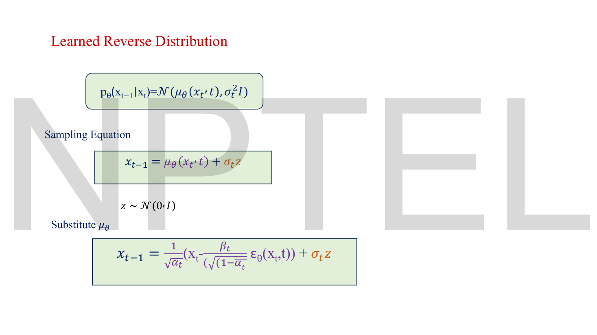

# Lec 47 — DDPM: The Reverse Process

> **Source:** `Lec 47.pdf` (13 pages) · **Week 7** · **Playlist:** Lec 47
> **Prereqs:** [Lec 46 — DDPM Forward Process](46-ddpm-forward.md), [Lec 45 — Mathematical Foundations of Diffusion Models](45-diffusion-math.md), [Lec 22 — Probabilistic Decoder, ELBO, VAE Loss](22-elbo-and-vae-loss.md), [Lec 11 — Reconstruction Loss (MSE, BCE)](11-reconstruction-loss.md)
> **Feeds into:** [Lec 49 — U-Net for Denoising](49-unet.md), [Lec 50 — Classifier-Guided Diffusion](50-classifier-guidance.md), [Lec 51 — Classifier-Free Diffusion](51-classifier-free-guidance.md), [Lec 52 — Stable Diffusion](52-stable-diffusion.md), [Lec 53 — Hands-on: Reverse Diffusion](53-reverse-diffusion-handson.md)

## Why this lecture exists

[Lec 46](46-ddpm-forward.md) finished the half of diffusion that requires no learning. You can now destroy an image in one operation and know the exact distribution of the result. None of that generates anything.

This lecture builds the generator. It asks what $p_\theta(\mathbf{x}_{t-1}\mid\mathbf{x}_t)$ should look like, discovers that the *exactly computable* answer depends on $\mathbf{x}_0$ — which is precisely the thing you do not have at generation time — and then performs the manoeuvre that makes DDPM work: rewrite the unknown $\mathbf{x}_0$ in terms of the noise that produced $\mathbf{x}_t$, and train a network to predict that noise instead. The target collapses from "an image" to "the $\epsilon$ you added", the loss collapses to a mean squared error, and generation becomes a loop you can write in six lines.

## The ideas


*Fig. — The deck opens by restating exactly the two equations [Lec 46](46-ddpm-forward.md) derived, because everything in this lecture is obtained by rearranging them. Note the typo: the deck separates mean from variance with a **semicolon** here, $\mathcal{N}(\mathbf{x}_t;\sqrt{\bar\alpha_t}\mathbf{x}_0;(1-\bar\alpha_t)\mathbf{I})$, where the second separator should be a comma. Page 2.*

### The goal, stated precisely


*Fig. — The deck's own summary of the task: "given a noisy sample $\mathbf{x}_t$, predict a slightly less noisy version $\mathbf{x}_{t-1}$." Not "predict the clean image" — one small step. Page 3.*

The reverse process **gradually removes noise**, running $\mathbf{x}_T \to \mathbf{x}_{T-1} \to \cdots \to \mathbf{x}_1 \to \mathbf{x}_0$, and generates realistic samples by progressively removing noise from a Gaussian noise sample. The object to be learned is one conditional distribution,

$$p_\theta(\mathbf{x}_{t-1}\mid\mathbf{x}_t)$$

the same network reused at every $t$ (with $t$ supplied as an input, which is what the time-step embedding in [Lec 49](49-unet.md) is for).

### The reverse chain is also Markov


*Fig. — The Markov property, restated for the **reverse** direction. [Lec 44](44-diffusion-intro.md) owns the property itself and [Lec 45](45-diffusion-math.md) applies it to the forward schedule; what is new here is that the *reverse* chain is **assumed** to be Markov too, and the joint at the bottom — which is what an ELBO would be taken over. Page 4.*

The deck's definition, verbatim: "the reverse process is assumed to be a Markov chain, meaning $\mathbf{x}_{t-1}$ depends only on $\mathbf{x}_t$":

$$P(\mathbf{x}_{t-1}\mid\mathbf{x}_t,\mathbf{x}_{t+1},\ldots,\mathbf{x}_T) = P(\mathbf{x}_{t-1}\mid\mathbf{x}_t)$$

and therefore the joint over the whole reverse trajectory factorises:

$$p_\theta(\mathbf{x}_{0:T}) = p(\mathbf{x}_T)\prod_{t=1}^{T}p_\theta(\mathbf{x}_{t-1}\mid\mathbf{x}_t), \qquad \mathbf{x}_T\sim\mathcal{N}(\mathbf{0},\mathbf{I})$$

Two named pieces: $p_\theta(\mathbf{x}_{0:T})$ is the **joint probability distribution for the entire reverse trajectory**, and $p(\mathbf{x}_T)$ is the **prior distribution over $\mathbf{x}_T$** — the starting point of generation. The prior is not learned; it is the standard normal that [Lec 45](45-diffusion-math.md)'s schedule constraint guaranteed the forward process would reach. Notice the asymmetry: the forward chain is conditioned on data and its "prior" is the data distribution; the reverse chain starts from pure noise and needs nothing.

> **This is an assumption, not a theorem.** The *true* reverse of a Markov chain is itself Markov, so that part is free. What is assumed is that each reverse step can be modelled by a simple parametric family — which brings us to the next question.

### Why the reverse steps are Gaussian

Nothing on these slides justifies modelling $p_\theta(\mathbf{x}_{t-1}\mid\mathbf{x}_t)$ as a Gaussian; the deck simply says it "can be modeled as" one. The justification matters, and it is short.

Bayes' rule relates the reverse step to the forward step you already know:

$$q(\mathbf{x}_{t-1}\mid\mathbf{x}_t) = \frac{q(\mathbf{x}_t\mid\mathbf{x}_{t-1})\,q(\mathbf{x}_{t-1})}{q(\mathbf{x}_t)}$$

The numerator's first factor is the forward Gaussian — known exactly. The second, $q(\mathbf{x}_{t-1})$, is the marginal distribution of all images at step $t-1$, which is some hideous unknown thing (it contains the data distribution). So the reverse step is *not* Gaussian in general.

But look at what $\beta_t$ being **small** does. $q(\mathbf{x}_t\mid\mathbf{x}_{t-1})$ is a narrow Gaussian — it has essentially all its mass within a few multiples of $\sqrt{\beta_t}$ of $\mathbf{x}_{t-1}$. Viewed as a function of $\mathbf{x}_{t-1}$ for fixed $\mathbf{x}_t$, it is a narrow bump. Over a region that narrow, the hideous factor $q(\mathbf{x}_{t-1})$ barely changes — it is approximately constant, or at worst approximately linear. A narrow Gaussian multiplied by something approximately constant is still approximately a Gaussian; the near-constant factor shifts the mean slightly and leaves the shape intact.

So:

> **When $\beta_t$ is small, $q(\mathbf{x}_{t-1}\mid\mathbf{x}_t)$ is approximately Gaussian, and the approximation improves as $\beta_t\to 0$.** (This is a classical result of Feller's; it is why diffusion models use $T=1000$ small steps rather than 10 large ones.)

That single fact is the hinge of the whole method, and it closes the loop with [Lec 45](45-diffusion-math.md)'s schedule page. "Too fast" is bad *because large $\beta_t$ breaks the Gaussian approximation*: a reverse step that has to undo a big jump genuinely is multi-modal — many different $\mathbf{x}_{t-1}$ could have produced the same $\mathbf{x}_t$ — and no Gaussian can represent that. Small steps are what buy you the right to use a Gaussian with a single mean.

### The posterior you *can* compute


*Fig. — The deck defines prior and posterior in words first. The green box is the key object: **under the forward process $q$, what is the distribution of $\mathbf{x}_{t-1}$ given both the current noisy state $\mathbf{x}_t$ and the original data $\mathbf{x}_0$?** The extra conditioning on $\mathbf{x}_0$ is what makes it tractable. Page 5.*

Condition on $\mathbf{x}_0$ as well, and the intractable marginal disappears. Bayes now reads

$$q(\mathbf{x}_{t-1}\mid\mathbf{x}_t,\mathbf{x}_0) = \frac{q(\mathbf{x}_t\mid\mathbf{x}_{t-1})\,q(\mathbf{x}_{t-1}\mid\mathbf{x}_0)}{q(\mathbf{x}_t\mid\mathbf{x}_0)}$$

(the Markov property lets us write $q(\mathbf{x}_t\mid\mathbf{x}_{t-1},\mathbf{x}_0) = q(\mathbf{x}_t\mid\mathbf{x}_{t-1})$). Every one of those three factors is a Gaussian you already have from [Lec 46](46-ddpm-forward.md). A ratio of Gaussians whose exponents are quadratics is a Gaussian, found by collecting the $\mathbf{x}_{t-1}^2$ and $\mathbf{x}_{t-1}$ terms and completing the square. The result:


*Fig. — Both the mean and variance are **pure schedule arithmetic** — no network anywhere. The closing line is the whole point: "This is Gaussian and can be computed exactly." Page 6.*

$$q(\mathbf{x}_{t-1}\mid\mathbf{x}_t,\mathbf{x}_0) = \mathcal{N}\!\big(\mathbf{x}_{t-1};\ \tilde\mu_t(\mathbf{x}_t,\mathbf{x}_0),\ \tilde\beta_t\mathbf{I}\big)$$

$$\tilde\mu_t(\mathbf{x}_t,\mathbf{x}_0) = \frac{\sqrt{\bar\alpha_{t-1}}\,\beta_t}{1-\bar\alpha_t}\,\mathbf{x}_0 \;+\; \frac{\sqrt{\alpha_t}\,(1-\bar\alpha_{t-1})}{1-\bar\alpha_t}\,\mathbf{x}_t, \qquad \tilde\beta_t = \frac{1-\bar\alpha_{t-1}}{1-\bar\alpha_t}\,\beta_t$$

Read the mean as a **weighted blend**: a pull toward the clean image $\mathbf{x}_0$ and a pull toward the current noisy state $\mathbf{x}_t$. Early in the chain (large $t$, $\bar\alpha_{t-1}$ tiny) the $\mathbf{x}_t$ weight dominates; late in the chain the $\mathbf{x}_0$ weight takes over. The weights do **not** sum to 1 in general — check N1, where they sum to 0.9855.

> **Deck defect — read the radical carefully.** On pages 6 and 8 the first coefficient is typeset so the square-root bar appears to stretch over $\bar\alpha_{t-1}\beta_t$ together. It should cover **$\bar\alpha_{t-1}$ only**: the coefficient is $\sqrt{\bar\alpha_{t-1}}\,\beta_t/(1-\bar\alpha_t)$. This is not a matter of taste — N1 computes $\tilde\mu_t$ both from this formula and from the deck's own page-9 noise form, and the two agree to 15 digits **only** under the correct reading. The radical-over-both reading gives 2.6777 against the correct 1.8301.

### The obstruction


*Fig. — The model family, written down. Both arguments of $\mu_\theta$ matter: the network sees the noisy image **and** the timestep. Page 7.*

So the learned reverse step is modelled as

$$p_\theta(\mathbf{x}_{t-1}\mid\mathbf{x}_t) = \mathcal{N}\!\big(\mathbf{x}_{t-1};\ \mu_\theta(\mathbf{x}_t,t),\ \Sigma_\theta(\mathbf{x}_t,t)\big)$$

and, in the deck's words, "the neural network must learn the mean and the covariance." Which raises the obvious question the next slide asks.


*Fig. — The pivot of the lecture, in one red line. The exactly-computable posterior is useless at generation time for exactly one reason, and the fix is stated as an instruction: **rewrite these equations without $\mathbf{x}_0$.** Page 8.*

**Can we just use $\tilde\mu_t$?** No — "because the posterior mean depends on $\mathbf{x}_0$, which is unknown during generation." At training time you have $\mathbf{x}_0$ (it is your data). At sampling time you start from noise and $\mathbf{x}_0$ is the thing you are trying to produce. A formula that needs the answer is not a generator.

### Eliminating $\mathbf{x}_0$: the noise-prediction reparameterization


*Fig. — Four lines, and the model is done. The third box is the result of substituting the second into $\tilde\mu_t$; the fourth is the entire modelling decision — swap the unknowable $\epsilon$ for a network output. Page 9.*

**Step 1 — invert the forward closed form.** From [Lec 46](46-ddpm-forward.md), $\mathbf{x}_t = \sqrt{\bar\alpha_t}\mathbf{x}_0 + \sqrt{1-\bar\alpha_t}\,\epsilon$. Solve for $\mathbf{x}_0$:

$$\mathbf{x}_0 = \frac{\mathbf{x}_t - \sqrt{1-\bar\alpha_t}\,\epsilon}{\sqrt{\bar\alpha_t}}$$

This is just rearranging — and it says something useful: **$\mathbf{x}_0$ and $\epsilon$ carry the same information once $\mathbf{x}_t$ is known.** Knowing either one gives you the other. That is the licence to swap the prediction target.

**Step 2 — substitute into $\tilde\mu_t$.** The slide prints only the answer; here is the work, because the cancellation is the same one from [Lec 46](46-ddpm-forward.md) and is worth seeing twice. Use $\bar\alpha_t = \bar\alpha_{t-1}\alpha_t$, hence $\dfrac{\sqrt{\bar\alpha_{t-1}}}{\sqrt{\bar\alpha_t}} = \dfrac{1}{\sqrt{\alpha_t}}$.

Collect the coefficient of $\mathbf{x}_t$:

$$
\begin{aligned}
\text{coef}(\mathbf{x}_t) &= \frac{\sqrt{\alpha_t}(1-\bar\alpha_{t-1})}{1-\bar\alpha_t} \;+\; \frac{\sqrt{\bar\alpha_{t-1}}\,\beta_t}{(1-\bar\alpha_t)\sqrt{\bar\alpha_t}} && \text{(second term from } \mathbf{x}_0\text{'s } \mathbf{x}_t \text{ part)}\\[4pt]
&= \frac{\sqrt{\alpha_t}(1-\bar\alpha_{t-1})}{1-\bar\alpha_t} + \frac{\beta_t}{(1-\bar\alpha_t)\sqrt{\alpha_t}} && \big(\sqrt{\bar\alpha_{t-1}}/\sqrt{\bar\alpha_t} = 1/\sqrt{\alpha_t}\big)\\[4pt]
&= \frac{\alpha_t(1-\bar\alpha_{t-1}) + \beta_t}{\sqrt{\alpha_t}\,(1-\bar\alpha_t)} && \text{(common denominator)}\\[4pt]
&= \frac{\alpha_t - \alpha_t\bar\alpha_{t-1} + 1 - \alpha_t}{\sqrt{\alpha_t}\,(1-\bar\alpha_t)} = \frac{1-\bar\alpha_t}{\sqrt{\alpha_t}\,(1-\bar\alpha_t)} = \frac{1}{\sqrt{\alpha_t}}
\end{aligned}
$$

The same $+\alpha_t / -\alpha_t$ cancellation as in the forward derivation, and the entire $(1-\bar\alpha_t)$ divides out. Now the coefficient of $\epsilon$:

$$\text{coef}(\epsilon) = -\frac{\sqrt{\bar\alpha_{t-1}}\,\beta_t}{1-\bar\alpha_t}\cdot\frac{\sqrt{1-\bar\alpha_t}}{\sqrt{\bar\alpha_t}} = -\frac{\beta_t\sqrt{1-\bar\alpha_t}}{\sqrt{\alpha_t}\,(1-\bar\alpha_t)} = -\frac{\beta_t}{\sqrt{\alpha_t}\sqrt{1-\bar\alpha_t}}$$

Putting them together:

$$\boxed{\;\tilde\mu_t = \frac{1}{\sqrt{\alpha_t}}\left(\mathbf{x}_t - \frac{\beta_t}{\sqrt{1-\bar\alpha_t}}\,\epsilon\right)\;}$$

which is exactly the deck's third box. **Every trace of $\mathbf{x}_0$ is gone.** The mean of the previous state is: take the current state, subtract a schedule-weighted multiple of the noise, and rescale by $1/\sqrt{\alpha_t}$.

**Step 3 — replace the true noise by a prediction.** $\epsilon$ is still unknown at generation time, but it is now the *only* unknown, and it is a quantity a network can estimate from $\mathbf{x}_t$ and $t$. The deck: "replace true noise by the noise predicted by the NN", $\epsilon \approx \epsilon_\theta(\mathbf{x}_t,t)$, giving

$$\mu_\theta(\mathbf{x}_t,t) = \frac{1}{\sqrt{\alpha_t}}\left(\mathbf{x}_t - \frac{\beta_t}{\sqrt{1-\bar\alpha_t}}\,\epsilon_\theta(\mathbf{x}_t,t)\right)$$

**Why predict $\epsilon$ rather than $\mu$ or $\mathbf{x}_0$?** All three are legal — they are related by invertible formulas, so a network predicting any one of them determines the other two. The reasons $\epsilon$ wins:

| Target | What the network must output | Problem |
|---|---|---|
| $\mu_\theta$ directly | a quantity whose scale is $1/\sqrt{\alpha_t}$ times the image and changes with $t$ | the output's scale varies across timesteps; harder to normalise |
| $\mathbf{x}_0$ | the clean image, from near-pure noise at large $t$ | at $t=T$ this is asking the network to hallucinate an entire image in one shot, and the regression target has enormous variance |
| **$\epsilon$** | a standard normal vector | **target is always $\mathcal{N}(\mathbf{0},\mathbf{I})$ — same scale at every $t$**, and the task is "spot the noise", which is local and easy |

The last row is the whole argument: $\epsilon$-prediction gives the network a target with a fixed, timestep-independent distribution, so one set of weights can serve all 1000 timesteps. It is also what makes the loss a plain MSE with no weighting, as the next section shows. In the literature this is called the **$\epsilon$-parameterization** or **noise prediction**, and it is empirically much better than $\mathbf{x}_0$-prediction at high noise levels.

### The sampling equation


*Fig. — The reparameterization trick again, for the third time this week: $\mathbf{x}_{t-1} = \mu_\theta + \sigma_t\mathbf{z}$ is $\mu + \sigma\epsilon$. Compare [Lec 46](46-ddpm-forward.md)'s forward jump and [Lec 23](23-reparameterization.md)'s original. Page 10.*

The deck fixes the covariance to $\sigma_t^2\mathbf{I}$ — a scalar, not learned — so

$$p_\theta(\mathbf{x}_{t-1}\mid\mathbf{x}_t) = \mathcal{N}\!\big(\mu_\theta(\mathbf{x}_t,t),\ \sigma_t^2\mathbf{I}\big)$$

and drawing from it is, by the reparameterization trick,

$$\mathbf{x}_{t-1} = \mu_\theta(\mathbf{x}_t,t) + \sigma_t\mathbf{z}, \qquad \mathbf{z}\sim\mathcal{N}(\mathbf{0},\mathbf{I})$$

Substituting $\mu_\theta$ gives the single update rule you implement:

$$\boxed{\;\mathbf{x}_{t-1} = \frac{1}{\sqrt{\alpha_t}}\left(\mathbf{x}_t - \frac{\beta_t}{\sqrt{1-\bar\alpha_t}}\,\epsilon_\theta(\mathbf{x}_t,t)\right) + \sigma_t\mathbf{z}\;}$$

> **The deck never says what $\sigma_t$ is.** It appears in three boxes on page 10 and is defined nowhere. DDPM gives two choices, both of which work: $\sigma_t^2 = \beta_t$, or $\sigma_t^2 = \tilde\beta_t = \frac{1-\bar\alpha_{t-1}}{1-\bar\alpha_t}\beta_t$ (the posterior variance from page 6). These are the upper and lower bounds on the reverse-step variance. N5 shows they are numerically almost identical except at the very start of the chain — at $t=100$ they differ by 2%, at $t=500$ by 0.1%. Either is a correct exam answer; $\sigma_t^2 = \beta_t$ is the simpler one to state.

**Why add noise back at all?** It looks perverse — you are denoising, and then you add noise. But $p_\theta(\mathbf{x}_{t-1}\mid\mathbf{x}_t)$ is a *distribution*, not a function, and generation means **sampling** from it. $\mu_\theta$ is only its mean. Drop $\sigma_t\mathbf{z}$ at every step and you are running a deterministic map from $\mathbf{x}_T$ to one point; all the diversity that makes diffusion beat GANs on mode coverage comes from the injected $\mathbf{z}$ at each of the $T$ steps. (A deterministic variant does exist and is called DDIM — see [Lec 53](53-reverse-diffusion-handson.md) — but it compensates elsewhere.)

### The sampling algorithm

Neither the noise-dropping rule at $t=1$ nor the loop structure is written anywhere on the deck. Both are standard and both are examinable.

1. **Draw the starting point.** $\mathbf{x}_T \sim \mathcal{N}(\mathbf{0},\mathbf{I})$ — same shape as the image you want. This is the prior $p(\mathbf{x}_T)$ from page 4; it uses no data and no network.
2. **For $t = T, T-1, \ldots, 2, 1$** (descending), do steps 3–5.
3. **Predict the noise.** $\hat\epsilon = \epsilon_\theta(\mathbf{x}_t, t)$ — one forward pass of the U-Net, which takes both the image and the timestep.
4. **Compute the mean.** $\mu = \dfrac{1}{\sqrt{\alpha_t}}\left(\mathbf{x}_t - \dfrac{\beta_t}{\sqrt{1-\bar\alpha_t}}\hat\epsilon\right)$.
5. **Sample.** If $t > 1$: draw $\mathbf{z}\sim\mathcal{N}(\mathbf{0},\mathbf{I})$ and set $\mathbf{x}_{t-1} = \mu + \sigma_t\mathbf{z}$. **If $t = 1$: set $\mathbf{x}_0 = \mu$, with no noise added.**
6. **Return $\mathbf{x}_0$.**

**Why the noise is dropped at $t=1$.** $\mathbf{x}_0$ is the final output — the image you hand to the user. There is no step after it to clean it up, so any noise you add at the last step stays in the picture forever. Adding $\sigma_1\mathbf{z}$ would make the returned image strictly noisier than the model's own best estimate, for no benefit: the diversity argument above is about *exploring different trajectories*, and at $t=1$ the trajectory is over. So the last step returns the mean, i.e. the mode of $p_\theta(\mathbf{x}_0\mid\mathbf{x}_1)$. The Code section measures the cost of getting this wrong.

Note the price: step 3 runs the network once, and the loop runs $T = 1000$ times. **Generating one image requires 1000 sequential forward passes**, against a GAN's one. This is diffusion's defining weakness and the target of everything in Week 8.

[Lec 53](53-reverse-diffusion-handson.md) implements this loop in tensors and measures what happens when the $t=1$ rule is broken; [Lec 49](49-unet.md) supplies the network that step 3 calls. Neither re-derives the update — this chapter owns it.

### Training, and the simplified objective


*Fig. — After all that derivation the loss is the simplest thing in the course: a mean squared error between two noise vectors. The three subscripts on the expectation are the three things averaged over — **images, noise levels, timesteps**. Page 11.*

$$\boxed{\;\mathcal{L}_{\text{simple}} = \mathbb{E}_{\mathbf{x}_0,\epsilon,t}\Big[\big\lVert\epsilon - \epsilon_\theta(\mathbf{x}_t,t)\big\rVert^2\Big]\;}$$

with $\epsilon$ the **true noise** and $\epsilon_\theta(\mathbf{x}_t,t)$ the **predicted noise**. The deck labels it "Mean Squared Error" and says the point is to train so the model performs well *on average* across all images, all noise levels and all timesteps.

Unpacking the expectation into a training step — this is where [Lec 46](46-ddpm-forward.md)'s closed form pays for itself:

1. Draw a real image $\mathbf{x}_0$ from the dataset.
2. Draw a timestep $t\sim\mathrm{Uniform}\{1,\ldots,T\}$ — *independently for every example in the batch*.
3. Draw $\epsilon\sim\mathcal{N}(\mathbf{0},\mathbf{I})$.
4. Build $\mathbf{x}_t = \sqrt{\bar\alpha_t}\mathbf{x}_0 + \sqrt{1-\bar\alpha_t}\,\epsilon$ in **one** operation.
5. Take a gradient step on $\lVert\epsilon - \epsilon_\theta(\mathbf{x}_t,t)\rVert^2$.

Steps 2 and 4 are only affordable because of the closed form. Without it, step 4 would cost $t$ sequential operations, averaging 500.

**Where this loss comes from.** $\mathcal{L}_{\text{simple}}$ is not the real objective; it is a simplification of one. The honest objective is the ELBO — the same evidence lower bound derived in [Lec 22](22-elbo-and-vae-loss.md), which owns it (and owns the closed-form Gaussian KL; neither is re-derived here). What is specific to diffusion is how the ELBO *decomposes* over the chain. Writing $-\log p_\theta(\mathbf{x}_0) \le \mathcal{L}_{\text{ELBO}}$ and splitting the product over $t$ gives three kinds of term:

$$\mathcal{L}_{\text{ELBO}} = \underbrace{D_{\mathrm{KL}}\big(q(\mathbf{x}_T\mid\mathbf{x}_0)\,\|\,p(\mathbf{x}_T)\big)}_{\mathcal{L}_T} \;+\; \sum_{t=2}^{T}\underbrace{D_{\mathrm{KL}}\big(q(\mathbf{x}_{t-1}\mid\mathbf{x}_t,\mathbf{x}_0)\,\|\,p_\theta(\mathbf{x}_{t-1}\mid\mathbf{x}_t)\big)}_{\mathcal{L}_{t-1}} \;-\; \underbrace{\log p_\theta(\mathbf{x}_0\mid\mathbf{x}_1)}_{\mathcal{L}_0}$$

(KL divergence itself is [Lec 19](19-kl-divergence-a.md)'s; its closed form for two Gaussians is [Lec 22](22-elbo-and-vae-loss.md)'s. Both are used here, neither re-derived.)

Three observations, all diffusion-specific:

- **$\mathcal{L}_T$ has no parameters.** $q(\mathbf{x}_T\mid\mathbf{x}_0)$ is fixed and $p(\mathbf{x}_T) = \mathcal{N}(\mathbf{0},\mathbf{I})$ is fixed, so this term is a constant and drops out of the gradient. It is also near zero when the schedule has done its job — which is exactly [Lec 45](45-diffusion-math.md)'s terminal requirement, now visible as a term in the loss.
- **Every $\mathcal{L}_{t-1}$ is a KL between two Gaussians**, the exactly-computable posterior from page 6 and the model from page 7. Because both have the same fixed variance, the Gaussian KL closed form collapses to a scaled squared difference of the *means*, $\frac{1}{2\sigma_t^2}\lVert\tilde\mu_t - \mu_\theta\rVert^2$. Substituting the two $\epsilon$-forms, the means differ only in the $\epsilon$ slot, and the whole thing becomes $\frac{\beta_t^2}{2\sigma_t^2\alpha_t(1-\bar\alpha_t)}\lVert\epsilon-\epsilon_\theta\rVert^2$.
- **$\mathcal{L}_{\text{simple}}$ is that, with the ugly coefficient set to 1.** Ho et al. found that dropping the per-timestep weight works better in practice: it up-weights the large-$t$ terms, where the harder denoising problems live, and makes the loss a single uniform MSE. That is the entire content of the word "simplified".

## Worked numericals

The Lec 47 deck contains **no numerical example** — it is wholly symbolic. All six below are constructed and independently verified. Throughout, the toy schedule is $\beta = (0.1, 0.2, 0.3)$, so $\alpha = (0.9, 0.8, 0.7)$ and $\bar\alpha = (0.9, 0.72, 0.504)$.

### N1. The posterior $q(\mathbf{x}_{t-1}\mid\mathbf{x}_t,\mathbf{x}_0)$, both ways

This is the numerical that settles the radical ambiguity on page 6.

**Given:** $t = 3$, $x_0 = 2.0$, and the noise that produced $x_3$ was $\epsilon = 0.4$.
**Find:** $x_3$, $\tilde\beta_3$, and $\tilde\mu_3$ computed (a) from the page-6 formula and (b) from the page-9 noise formula.

1. Build $x_3$ from the forward closed form: $\sqrt{\bar\alpha_3} = \sqrt{0.504} = 0.709930$, $\sqrt{1-\bar\alpha_3} = \sqrt{0.496} = 0.704273$.
$$x_3 = 0.709930\times 2.0 + 0.704273\times 0.4 = 1.419859 + 0.281709 = 1.701568$$

2. **Posterior variance.** $\tilde\beta_3 = \dfrac{1-\bar\alpha_2}{1-\bar\alpha_3}\beta_3 = \dfrac{1-0.72}{1-0.504}\times0.3 = \dfrac{0.28}{0.496}\times0.3 = 0.564516\times0.3 = 0.169355$.
 Standard deviation $\sqrt{0.169355} = 0.411527$. Compare $\beta_3 = 0.3$, $\sqrt{\beta_3} = 0.547723$ — the posterior is noticeably *tighter* than one forward step, because conditioning on $x_0$ tells you a lot.

3. **Posterior mean, route (a) — page 6.**
 - coefficient on $x_0$: $\dfrac{\sqrt{\bar\alpha_2}\,\beta_3}{1-\bar\alpha_3} = \dfrac{\sqrt{0.72}\times0.3}{0.496} = \dfrac{0.848528\times0.3}{0.496} = \dfrac{0.254558}{0.496} = 0.513223$
 - coefficient on $x_3$: $\dfrac{\sqrt{\alpha_3}(1-\bar\alpha_2)}{1-\bar\alpha_3} = \dfrac{0.836660\times0.28}{0.496} = \dfrac{0.234265}{0.496} = 0.472308$
 - (they sum to $0.985531$, **not** 1 — the mean is a weighted blend, not a convex combination)
$$\tilde\mu_3 = 0.513223\times2.0 + 0.472308\times1.701568 = 1.026445 + 0.803665 = 1.830110$$

4. **Posterior mean, route (b) — page 9.**
$$\tilde\mu_3 = \frac{1}{\sqrt{0.7}}\left(1.701568 - \frac{0.3}{\sqrt{0.496}}\times0.4\right) = 1.195229\times\big(1.701568 - 0.425971\times0.4\big)$$
$$= 1.195229\times(1.701568 - 0.170388) = 1.195229\times1.531180 = 1.830110$$

**Answer:** $\tilde\mu_3 = 1.830110$, $\tilde\beta_3 = 0.169355$. The two routes agree to 15 significant figures, which verifies both the substitution in §"Eliminating $\mathbf{x}_0$" and the correct reading of the radical. Reading the page-6 radical as $\sqrt{\bar\alpha_2\beta_3}$ instead gives $\tilde\mu_3 = 2.677689$ — a 46% error, and no longer consistent with page 9. **The radical covers $\bar\alpha_{t-1}$ only.**

### N2. One reverse step with an imperfect network

**Given:** the same state $x_3 = 1.701568$ at $t=3$. The network predicts $\epsilon_\theta = 0.3$ (the truth was $0.4$ — the network is slightly wrong, as it will be). Use $\sigma_t^2 = \beta_t$, and suppose the sampler draws $z = -0.5$.
**Find:** $\mu_\theta$, and the resulting $x_2$.

1. $\dfrac{\beta_3}{\sqrt{1-\bar\alpha_3}} = \dfrac{0.3}{0.704273} = 0.425971$.
2. $\mu_\theta = \dfrac{1}{\sqrt{0.7}}\big(1.701568 - 0.425971\times0.3\big) = 1.195229\times(1.701568 - 0.127791) = 1.195229\times1.573777 = 1.881023$.
3. $\sigma_3 = \sqrt{\beta_3} = \sqrt{0.3} = 0.547723$.
4. $x_2 = 1.881023 + 0.547723\times(-0.5) = 1.881023 - 0.273861 = 1.607162$.

**Answer:** $x_2 = 1.607162$.

Two readings. The network's $0.1$ error in $\epsilon$ propagated to $1.881023 - 1.830110 = 0.050913$ of error in the mean — an amplification factor of $0.425971\times1.195229 = 0.50913$, i.e. **$\beta_t/(\sqrt{\alpha_t}\sqrt{1-\bar\alpha_t})$**, which is small early in the chain and larger late. And had we used $\sigma_t^2 = \tilde\beta_3 = 0.169355$ instead, $\sigma_3 = 0.411527$ and $x_2 = 1.881023 - 0.205764 = 1.675259$ — a different sample from a different but equally valid sampler.

### N3. The simplified loss on one example

**Given:** a four-pixel image; the true noise was $\epsilon = [0.5, -1.2, 0.3, 0.8]$ and the network predicted $\epsilon_\theta = [0.4, -0.9, 0.1, 1.0]$.
**Find:** $\lVert\epsilon-\epsilon_\theta\rVert^2$, and the per-element mean.

1. Differences: $0.5-0.4 = 0.1$; $-1.2-(-0.9) = -0.3$; $0.3-0.1 = 0.2$; $0.8-1.0 = -0.2$.
2. Squares: $0.01,\ 0.09,\ 0.04,\ 0.04$.
3. Sum: $0.01+0.09+0.04+0.04 = 0.18$.
4. Mean over the 4 elements: $0.18/4 = 0.045$.

**Answer:** $\lVert\epsilon-\epsilon_\theta\rVert^2 = 0.18$ (squared-norm convention, as the deck writes it); $0.045$ if you also divide by the number of elements.

**This is the reduction-convention trap, and it has bitten this book before** — [Lec 24](24-vae-numerical.md) mixed a mean over features with a sum over latent dimensions in one total. The deck writes $\lVert\cdot\rVert^2$, which is a **sum** of squares. PyTorch's `mse_loss` defaults to `reduction='mean'`, which divides. For a single loss the constant is harmless (it rescales the learning rate), but mixing conventions inside one total is not. State which you used.

### N4. The noise-amplification coefficient across the chain

**Given:** the toy schedule.
**Find:** the two multipliers in the update rule at each $t$, and what they say about where errors hurt.

| $t$ | $\alpha_t$ | $\bar\alpha_t$ | $1/\sqrt{\alpha_t}$ | $\beta_t/\sqrt{1-\bar\alpha_t}$ |
|---|---|---|---|---|
| 1 | 0.9 | 0.900 | $1.054093$ | $0.1/\sqrt{0.1} = 0.316228$ |
| 2 | 0.8 | 0.720 | $1.118034$ | $0.2/\sqrt{0.28} = 0.377964$ |
| 3 | 0.7 | 0.504 | $1.195229$ | $0.3/\sqrt{0.496} = 0.425971$ |

**Answer:** both grow as $t$ grows. The $1/\sqrt{\alpha_t}$ factor re-inflates the signal that the forward step shrank; the second factor says how much of the predicted noise is subtracted off. Since errors in $\epsilon_\theta$ enter multiplied by $\frac{1}{\sqrt{\alpha_t}}\cdot\frac{\beta_t}{\sqrt{1-\bar\alpha_t}}$, an error at large $t$ costs more per step than one at small $t$ — but it also has more remaining steps to be corrected. That tension is why $\mathcal{L}_{\text{simple}}$'s uniform weighting (which up-weights large $t$ relative to the true ELBO) is the empirically better choice.

### N5. Which $\sigma_t$? The two choices, compared on the real schedule

**Given:** the DDPM linear schedule, $T=1000$, $\beta$ from $10^{-4}$ to $0.02$.
**Find:** $\beta_t$ and $\tilde\beta_t$ at several $t$, and their ratio.

Using $\tilde\beta_t = \frac{1-\bar\alpha_{t-1}}{1-\bar\alpha_t}\beta_t$:

| $t$ | $\beta_t$ | $\tilde\beta_t$ | $\tilde\beta_t/\beta_t$ | $\sqrt{\beta_t}$ | $\sqrt{\tilde\beta_t}$ |
|---|---|---|---|---|---|
| 2 | $0.000120$ | $0.0000546$ | $0.4547$ | $0.010951$ | $0.007385$ |
| 100 | $0.002072$ | $0.002035$ | $0.9819$ | $0.045520$ | $0.045106$ |
| 500 | $0.010040$ | $0.010031$ | $0.9991$ | $0.100200$ | $0.100157$ |
| 1000 | $0.020000$ | $0.020000$ | $1.0000$ | $0.141421$ | $0.141421$ |

**Answer:** the two choices are **indistinguishable beyond about $t=100$** — they agree to within 2% there and to within 0.1% by $t=500$. They differ substantially only at the very start of the chain, where $\bar\alpha_{t-1}\approx 1$ makes $\tilde\beta_t$ collapse toward zero. (At $t=1$, $\bar\alpha_0 = 1$ by the empty-product convention, so $\tilde\beta_1 = 0$ exactly — which is the posterior-variance view of why no noise is added at the last step.)

That last parenthesis is worth keeping: under $\sigma_t^2 = \tilde\beta_t$, the "drop the noise at $t=1$" rule is not a hack at all, it falls out of the formula — the noise term multiplies itself by zero. [Lec 53](53-reverse-diffusion-handson.md)'s notebook relies on exactly this, and also carries an explicit mask, which becomes load-bearing only if you switch to $\sigma_t^2 = \beta_t$.

### N6. A complete three-step reverse run

**Given:** start from $x_3 = 1.5$. Suppose the network outputs $\epsilon_\theta = 0.6$ at $t=3$, $-0.2$ at $t=2$, $0.1$ at $t=1$, and the sampler draws $z = 0.5$ at $t=3$ and $z = -1.0$ at $t=2$. Use $\sigma_t = \sqrt{\beta_t}$.
**Find:** $x_2$, $x_1$, $x_0$.

**$t=3$:** $\mu = 1.195229\times(1.5 - 0.425971\times0.6) = 1.195229\times(1.5 - 0.255583) = 1.195229\times1.244417 = 1.487363$.
 $t>1$, so add noise: $x_2 = 1.487363 + 0.547723\times0.5 = 1.487363 + 0.273861 = 1.761224$.

**$t=2$:** $1/\sqrt{0.8} = 1.118034$, $\beta_2/\sqrt{1-\bar\alpha_2} = 0.2/\sqrt{0.28} = 0.377964$.
 $\mu = 1.118034\times\big(1.761224 - 0.377964\times(-0.2)\big) = 1.118034\times(1.761224 + 0.075593) = 1.118034\times1.836817 = 2.053624$.
 $t>1$, so add noise: $x_1 = 2.053624 + \sqrt{0.2}\times(-1.0) = 2.053624 - 0.447214 = 1.606410$.

**$t=1$:** $1/\sqrt{0.9} = 1.054093$, $\beta_1/\sqrt{1-\bar\alpha_1} = 0.1/\sqrt{0.1} = 0.316228$.
 $\mu = 1.054093\times\big(1.606410 - 0.316228\times0.1\big) = 1.054093\times(1.606410 - 0.031623) = 1.054093\times1.574787 = 1.659972$.
 $t = 1$, so **no noise is added**: $x_0 = 1.659972$.

**Answer:** $x_3 = 1.5 \to x_2 = 1.761224 \to x_1 = 1.606410 \to x_0 = 1.659972$.

Notice the trajectory is not monotone — it goes up, down, then up. That is the injected $\mathbf{z}$ at work. Had you added $\sigma_1 z$ at the last step as well, with say $z = 1.3$, you would have returned $1.659972 + 0.316228\times1.3 = 2.071069$ — a 25% change in the final answer, with nothing downstream to repair it.

## Code

A diffusion model normally needs a trained U-Net before you can sample from it. There is one case where you do not: if the data is itself Gaussian, the **optimal** $\epsilon_\theta$ can be written in closed form, so the real DDPM sampling loop can be run with no training at all and checked against a known answer.

For $\mathbf{x}_0\sim\mathcal{N}(m,v)$ the ideal noise predictor is $\mathbb{E}[\epsilon\mid\mathbf{x}_t] = \sqrt{1-\bar\alpha_t}\,\dfrac{\mathbf{x}_t - \sqrt{\bar\alpha_t}\,m}{\bar\alpha_t v + (1-\bar\alpha_t)}$.

```python
import numpy as np
rng = np.random.default_rng(1)

T = 200
beta  = np.linspace(0.01, 0.05, T)
alpha = 1.0 - beta
abar  = np.cumprod(alpha)

# Toy data: x0 ~ N(3, 0.25).  For THIS data the optimal noise predictor is
# exact, so we can run the real DDPM sampler with no training at all.
m, v = 3.0, 0.25

def eps_star(xt, t):            # E[eps | x_t] for Gaussian data (the ideal eps_theta)
    ab = abar[t-1]
    return np.sqrt(1-ab) * (xt - np.sqrt(ab)*m) / (ab*v + (1-ab))

N = 200000
x = rng.standard_normal(N)                       # step 1: x_T ~ N(0, I)
for t in range(T, 0, -1):                        # step 2: loop t = T ... 1
    e  = eps_star(x, t)
    mu = (x - beta[t-1]/np.sqrt(1-abar[t-1]) * e) / np.sqrt(alpha[t-1])
    if t > 1:                                    # step 3: add sigma_t z, except at t = 1
        z = rng.standard_normal(N)
        x = mu + np.sqrt(beta[t-1]) * z
    else:
        x = mu

print(f"target   : mean = {m:.4f}  var = {v:.4f}  sd = {np.sqrt(v):.4f}")
print(f"generated: mean = {x.mean():.4f}  var = {x.var():.4f}  sd = {x.std():.4f}")

# What if you forget to drop the noise at t = 1?
x2 = mu + np.sqrt(beta[0]) * rng.standard_normal(N)
print(f"noise kept at t=1: var = {x2.var():.4f}  (adds beta_1 = {beta[0]:.4f})")
```

```
target   : mean = 3.0000  var = 0.2500  sd = 0.5000
generated: mean = 2.9997  var = 0.2454  sd = 0.4954
noise kept at t=1: var = 0.2555  (adds beta_1 = 0.0100)
```

The sampler started from $\mathcal{N}(0,1)$ — mean 0, variance 1 — and after 200 reverse steps produced mean $2.9997$ and variance $0.2454$ against the target's $3.0$ and $0.25$. **The algorithm on the slides, implemented literally, generates the right distribution.** The residual 2% variance shortfall is the discretisation error of using 200 steps rather than infinitely many; raise $T$ and it shrinks.

The last line prices the $t=1$ rule exactly: $0.2454 + 0.0100 = 0.2554$ predicted against $0.2555$ measured. Keeping the noise at the final step adds $\beta_1$ to the output variance and never removes it — here that is 4% of the total, and it is pure degradation that nothing downstream can repair. Also note what the loop *is*: six lines, one of which is a network call, repeated $T$ times. The entire generative model is that.

## Exam pack

### Must-memorise

| Item | Exactly this |
|---|---|
| Reverse Markov property | $P(\mathbf{x}_{t-1}\mid\mathbf{x}_t,\ldots,\mathbf{x}_T) = P(\mathbf{x}_{t-1}\mid\mathbf{x}_t)$ |
| Reverse joint | $p_\theta(\mathbf{x}_{0:T}) = p(\mathbf{x}_T)\prod_{t=1}^{T}p_\theta(\mathbf{x}_{t-1}\mid\mathbf{x}_t)$, $\ \mathbf{x}_T\sim\mathcal{N}(\mathbf{0},\mathbf{I})$ |
| Model family | $p_\theta(\mathbf{x}_{t-1}\mid\mathbf{x}_t) = \mathcal{N}\big(\mu_\theta(\mathbf{x}_t,t),\ \Sigma_\theta(\mathbf{x}_t,t)\big)$ |
| Tractable posterior | $q(\mathbf{x}_{t-1}\mid\mathbf{x}_t,\mathbf{x}_0) = \mathcal{N}\big(\tilde\mu_t(\mathbf{x}_t,\mathbf{x}_0),\ \tilde\beta_t\mathbf{I}\big)$ |
| Posterior mean | $\tilde\mu_t = \dfrac{\sqrt{\bar\alpha_{t-1}}\,\beta_t}{1-\bar\alpha_t}\mathbf{x}_0 + \dfrac{\sqrt{\alpha_t}(1-\bar\alpha_{t-1})}{1-\bar\alpha_t}\mathbf{x}_t$ |
| Posterior variance | $\tilde\beta_t = \dfrac{1-\bar\alpha_{t-1}}{1-\bar\alpha_t}\beta_t$ |
| Why it can't be used | it depends on $\mathbf{x}_0$, unknown during generation |
| Invert the forward form | $\mathbf{x}_0 = \dfrac{\mathbf{x}_t - \sqrt{1-\bar\alpha_t}\,\epsilon}{\sqrt{\bar\alpha_t}}$ |
| Mean without $\mathbf{x}_0$ | $\tilde\mu_t = \dfrac{1}{\sqrt{\alpha_t}}\left(\mathbf{x}_t - \dfrac{\beta_t}{\sqrt{1-\bar\alpha_t}}\epsilon\right)$ |
| Learned mean | $\mu_\theta = \dfrac{1}{\sqrt{\alpha_t}}\left(\mathbf{x}_t - \dfrac{\beta_t}{\sqrt{1-\bar\alpha_t}}\epsilon_\theta(\mathbf{x}_t,t)\right)$ |
| **Sampling equation** | $\mathbf{x}_{t-1} = \mu_\theta(\mathbf{x}_t,t) + \sigma_t\mathbf{z}$, $\ \mathbf{z}\sim\mathcal{N}(\mathbf{0},\mathbf{I})$ |
| $\sigma_t^2$ | $\beta_t$, or $\tilde\beta_t$ — the deck never says |
| Noise dropped at | $t=1$ (the final step returns $\mu_\theta$) |
| **Simplified loss** | $\mathcal{L}_{\text{simple}} = \mathbb{E}_{\mathbf{x}_0,\epsilon,t}\big[\lVert\epsilon-\epsilon_\theta(\mathbf{x}_t,t)\rVert^2\big]$ |
| Expectation is over | images $\mathbf{x}_0$, noise $\epsilon$, timesteps $t$ |
| Why Gaussian reverse steps | valid only because $\beta_t$ is small |
| ELBO terms | $\mathcal{L}_T$ (constant) $+ \sum\mathcal{L}_{t-1}$ (Gaussian KLs) $+\ \mathcal{L}_0$ |

### Numbers worth knowing

| Quantity | Value |
|---|---|
| Network evaluations to generate one image | $T$ = **1000** (sequential) |
| Toy schedule used throughout | $\beta = (0.1,0.2,0.3)$, $\alpha = (0.9,0.8,0.7)$, $\bar\alpha = (0.9,0.72,0.504)$ |
| N1: $\tilde\beta_3$ | $0.169355$ (vs $\beta_3 = 0.3$) — the posterior is tighter |
| N1: $\tilde\mu_3$ | $1.830110$, by both routes |
| N1: posterior mean weights | $0.513223$ and $0.472308$ — sum $0.9855$, **not 1** |
| Radical misread on p-6 gives | $2.677689$ instead of $1.830110$ |
| $\tilde\beta_t/\beta_t$ at $t = 100 / 500 / 1000$ | $0.982$ / $0.999$ / $1.000$ |
| $\tilde\beta_1$ | $0$ exactly ($\bar\alpha_0 = 1$) |
| N3: $\lVert\epsilon-\epsilon_\theta\rVert^2$ | $0.18$ sum, $0.045$ mean over 4 elements |
| Code: target vs generated | $\mathcal{N}(3, 0.25)$ vs mean $2.9997$, var $0.2454$ |
| Cost of keeping noise at $t=1$ | $+\beta_1$ on the output variance |

### Likely MCQ traps

- **"The reverse process is Gaussian because the forward process is."** Not by itself. The true reverse of a Gaussian diffusion is Gaussian **only in the limit of small $\beta_t$** — that approximation is *why* $T$ is large. With large steps the true reverse is multi-modal and no Gaussian fits.
- **Confusing $q(\mathbf{x}_{t-1}\mid\mathbf{x}_t,\mathbf{x}_0)$ with $p_\theta(\mathbf{x}_{t-1}\mid\mathbf{x}_t)$.** The first is the **exactly computable** posterior with no parameters; the second is the **learned** model. They have the same shape and different conditioning. The ELBO's middle terms are the KL between them.
- **"We use $\tilde\mu_t$ at sampling time."** We cannot — it needs $\mathbf{x}_0$. That is the entire reason $\epsilon$-prediction exists.
- **$\beta_t$ vs $\tilde\beta_t$.** $\beta_t$ is the *forward* step variance; $\tilde\beta_t = \frac{1-\bar\alpha_{t-1}}{1-\bar\alpha_t}\beta_t$ is the *posterior* variance, always $\le\beta_t$. On the toy schedule $\tilde\beta_3 = 0.1694$ against $\beta_3 = 0.3$.
- **The radical on page 6.** $\sqrt{\bar\alpha_{t-1}}\,\beta_t$, not $\sqrt{\bar\alpha_{t-1}\beta_t}$. The two differ by 46% on N1's numbers.
- **Omitting $\sigma_t\mathbf{z}$ from the sampling equation.** $\mu_\theta$ is the mean of a distribution; sampling requires the noise. Drop it everywhere and you lose all sample diversity.
- **Adding $\sigma_1\mathbf{z}$ at $t=1$.** The last step returns $\mu_\theta$ alone. Noise added there survives into the output and nothing removes it.
- **"The network predicts the clean image."** It predicts $\epsilon$. $\mathbf{x}_0$-prediction and $\mu$-prediction are legal alternatives, but DDPM's loss on the slides is $\lVert\epsilon - \epsilon_\theta\rVert^2$.
- **Thinking $\mathcal{L}_{\text{simple}}$ *is* the ELBO.** It is the ELBO with the per-timestep weight $\frac{\beta_t^2}{2\sigma_t^2\alpha_t(1-\bar\alpha_t)}$ set to 1. Related, not equal — and the simplification is empirical, not algebraic.
- **"Diffusion samples as fast as a GAN."** A GAN uses one forward pass; DDPM uses $T = 1000$ sequential passes. This is diffusion's defining cost.
- **Reduction convention on the loss.** $\lVert\cdot\rVert^2$ is a **sum** of squares (0.18 in N3); dividing by the element count gives 0.045. Say which.
- **$\Sigma_\theta$ vs $\sigma_t^2\mathbf{I}$.** Page 7 writes a learned $\Sigma_\theta(\mathbf{x}_t,t)$; page 10 immediately fixes it to a non-learned $\sigma_t^2\mathbf{I}$. DDPM as published does **not** learn the variance. (Later work does, which is why page 7's general form is written at all.)

### Self-test

1. State the reverse Markov assumption and the resulting factorisation of $p_\theta(\mathbf{x}_{0:T})$. What is $p(\mathbf{x}_T)$?
2. Why is the true reverse step $q(\mathbf{x}_{t-1}\mid\mathbf{x}_t)$ not Gaussian in general, and what makes it approximately Gaussian here?
3. Write $\tilde\mu_t(\mathbf{x}_t,\mathbf{x}_0)$ and $\tilde\beta_t$. Why can neither be used at sampling time?
4. Derive $\mathbf{x}_0$ in terms of $\mathbf{x}_t$ and $\epsilon$, and explain in one sentence why that licences predicting $\epsilon$ instead of $\mathbf{x}_0$.
5. Give three reasons the network predicts $\epsilon$ rather than $\mathbf{x}_0$.
6. Write the full sampling update for $\mathbf{x}_{t-1}$, and say what $\sigma_t$ may be set to.
7. Give the sampling algorithm as numbered steps, including the starting distribution and the $t=1$ special case.
8. With $\beta = (0.1,0.2,0.3)$, $x_3 = 1.5$ and $\epsilon_\theta = 0.6$, compute $\mu_\theta$ at $t=3$.
9. Write $\mathcal{L}_{\text{simple}}$ and name the three variables the expectation runs over. Where does it come from?
10. Compute $\tilde\beta_t$ for $t=2$ with $\beta = (0.1, 0.2)$, and compare it to $\beta_2$.
11. A student removes the $\sigma_t\mathbf{z}$ term from every step. What happens to the samples, and why?

<details><summary>Answers</summary>

1. $P(\mathbf{x}_{t-1}\mid\mathbf{x}_t,\mathbf{x}_{t+1},\ldots,\mathbf{x}_T) = P(\mathbf{x}_{t-1}\mid\mathbf{x}_t)$; hence $p_\theta(\mathbf{x}_{0:T}) = p(\mathbf{x}_T)\prod_{t=1}^{T}p_\theta(\mathbf{x}_{t-1}\mid\mathbf{x}_t)$. $p(\mathbf{x}_T) = \mathcal{N}(\mathbf{0},\mathbf{I})$ is the **prior** — the fixed, unlearned starting point of generation.
2. By Bayes, $q(\mathbf{x}_{t-1}\mid\mathbf{x}_t)\propto q(\mathbf{x}_t\mid\mathbf{x}_{t-1})q(\mathbf{x}_{t-1})$, and the marginal $q(\mathbf{x}_{t-1})$ is an arbitrary (data-shaped) distribution. But when $\beta_t$ is small the forward factor is a very narrow bump, over which the marginal is nearly constant, so the product is nearly Gaussian. The approximation improves as $\beta_t\to0$ — which is why $T$ is 1000.
3. $\tilde\mu_t = \frac{\sqrt{\bar\alpha_{t-1}}\beta_t}{1-\bar\alpha_t}\mathbf{x}_0 + \frac{\sqrt{\alpha_t}(1-\bar\alpha_{t-1})}{1-\bar\alpha_t}\mathbf{x}_t$, $\ \tilde\beta_t = \frac{1-\bar\alpha_{t-1}}{1-\bar\alpha_t}\beta_t$. $\tilde\beta_t$ *can* be used (it is pure schedule arithmetic); $\tilde\mu_t$ cannot, because it depends on $\mathbf{x}_0$, which is unknown during generation.
4. $\mathbf{x}_0 = (\mathbf{x}_t - \sqrt{1-\bar\alpha_t}\,\epsilon)/\sqrt{\bar\alpha_t}$. Given $\mathbf{x}_t$, knowing $\epsilon$ determines $\mathbf{x}_0$ and vice versa — they carry identical information, so predicting either is the same modelling problem.
5. (i) $\epsilon$'s target distribution is $\mathcal{N}(\mathbf{0},\mathbf{I})$ at **every** $t$, so one network with one output scale serves all timesteps; (ii) predicting $\mathbf{x}_0$ from near-pure noise at large $t$ is a huge-variance regression, effectively asking for a whole image in one shot; (iii) it makes the loss a plain unweighted MSE and empirically trains better.
6. $\mathbf{x}_{t-1} = \frac{1}{\sqrt{\alpha_t}}\left(\mathbf{x}_t - \frac{\beta_t}{\sqrt{1-\bar\alpha_t}}\epsilon_\theta(\mathbf{x}_t,t)\right) + \sigma_t\mathbf{z}$, $\mathbf{z}\sim\mathcal{N}(\mathbf{0},\mathbf{I})$. $\sigma_t^2 = \beta_t$ or $\sigma_t^2 = \tilde\beta_t$; both are used in practice and they coincide to within 0.1% past $t\approx500$.
7. (1) $\mathbf{x}_T\sim\mathcal{N}(\mathbf{0},\mathbf{I})$. (2) for $t = T$ down to $1$: (3) $\hat\epsilon = \epsilon_\theta(\mathbf{x}_t,t)$; (4) $\mu = \frac{1}{\sqrt{\alpha_t}}(\mathbf{x}_t - \frac{\beta_t}{\sqrt{1-\bar\alpha_t}}\hat\epsilon)$; (5) if $t>1$, $\mathbf{x}_{t-1} = \mu + \sigma_t\mathbf{z}$ with fresh $\mathbf{z}$; **if $t=1$, $\mathbf{x}_0 = \mu$**. (6) return $\mathbf{x}_0$.
8. $\bar\alpha_3 = 0.504$, $\beta_3/\sqrt{1-\bar\alpha_3} = 0.3/0.704273 = 0.425971$; $1/\sqrt{0.7} = 1.195229$. $\mu_\theta = 1.195229\times(1.5 - 0.255583) = 1.195229\times1.244417 = \mathbf{1.487363}$.
9. $\mathcal{L}_{\text{simple}} = \mathbb{E}_{\mathbf{x}_0,\epsilon,t}[\lVert\epsilon-\epsilon_\theta(\mathbf{x}_t,t)\rVert^2]$ — over **images, noise, timesteps**. It descends from the ELBO ([Lec 22](22-elbo-and-vae-loss.md)): the ELBO's middle terms are Gaussian KLs that reduce to weighted squared differences of means, which reduce to $\lVert\epsilon-\epsilon_\theta\rVert^2$ times a per-$t$ coefficient; setting that coefficient to 1 gives $\mathcal{L}_{\text{simple}}$.
10. $\bar\alpha_1 = 0.9$, $\bar\alpha_2 = 0.72$. $\tilde\beta_2 = \frac{1-0.9}{1-0.72}\times0.2 = \frac{0.1}{0.28}\times0.2 = 0.357143\times0.2 = \mathbf{0.071429}$, against $\beta_2 = 0.2$ — about **2.8× tighter**, because conditioning on $\mathbf{x}_0$ removes most of the uncertainty.
11. The sampler becomes a deterministic map from $\mathbf{x}_T$ to a single output. Sample diversity collapses toward the mean of the data distribution — you get one blurry average-looking image per starting noise direction rather than a varied set, because the per-step stochasticity that explores different plausible trajectories has been removed.

</details>

## Beyond the slides

**Gap: $\sigma_t$ is used three times on page 10 and never defined.**
**Why it matters:** you cannot implement the sampler without it. The two standard choices are $\sigma_t^2 = \beta_t$ and $\sigma_t^2 = \tilde\beta_t$, which Ho et al. showed are the upper and lower bounds on the true reverse variance and which give visually indistinguishable samples. N5 shows they agree to 0.1% beyond $t\approx500$. If an exam asks "what is $\sigma_t^2$", either is defensible; "it is learned" is not, because DDPM fixes it.

**Gap: the deck never says the noise term is dropped at $t=1$.**
**Why it matters:** it is a one-line change that visibly degrades output if you get it wrong — the Code section measures it at $+\beta_1$ on the output variance, 4% there. The principled version is that $\tilde\beta_1 = 0$ exactly (since $\bar\alpha_0 = 1$), so under the $\tilde\beta$ choice the rule is not a special case at all. Any implementation question will test this.

**Gap: the slides never state the generation cost.**
**Why it matters:** $T$ sequential network evaluations per image, and $T = 1000$ in DDPM. A GAN needs one. This single number is why Week 8 exists: latent diffusion ([Lec 52](52-stable-diffusion.md)) shrinks the per-step cost by working in a small latent space, and DDIM ([Lec 53](53-reverse-diffusion-handson.md)) shrinks the step count by making the sampler deterministic and skippable. Neither helps unless you know what is being fixed.

**Gap: the Gaussianity of the reverse step is assumed, never argued.**
**Why it matters:** it is the single assumption that connects the schedule design in [Lec 45](45-diffusion-math.md) to the model family here. "Too fast a schedule makes learning hard" is vague until you see that large $\beta_t$ makes the true reverse conditional multi-modal, which a unimodal Gaussian provably cannot fit. The smallness of $\beta_t$ is not a tuning preference; it is a correctness condition.

**Gap: $\mathcal{L}_{\text{simple}}$'s relationship to the ELBO is never mentioned at all.**
**Why it matters:** the deck presents the MSE as if it fell from the sky, and a reader who did the VAE arc will reasonably expect a KL term somewhere. The diffusion-specific decomposition above shows where it went: $\mathcal{L}_T$ is constant, the middle KLs between two Gaussians of equal variance collapse to squared mean differences by [Lec 22](22-elbo-and-vae-loss.md)'s closed form, and dropping the per-$t$ weight leaves a bare MSE. Without that chain, "diffusion has no KL term" looks like a contradiction of everything in Week 3.

**Gap: no guidance, no conditioning, no text.**
**Why it matters:** everything in this chapter generates an *unconditional* sample — a plausible image from the training distribution, with no way to ask for a particular one. The hooks for control are added in [Lec 50](50-classifier-guidance.md) and [Lec 51](51-classifier-free-guidance.md), both of which modify exactly one thing: the $\epsilon_\theta(\mathbf{x}_t,t)$ in the sampling equation. Knowing that the entire control surface of a diffusion model is that one term makes the guidance lectures much shorter.

## Cut from the slides

Pages 1, 12 and 13 are the title, an empty "Summary" card and the pointer to the U-Net session; nothing was lost. Page 2 is a verbatim recap of [Lec 46](46-ddpm-forward.md) pages 9–10 and is kept only as a figure, with its semicolon typo noted. Page 5's textbook definitions of "prior distribution" and "posterior distribution" are compressed into the sentence that introduces $q(\mathbf{x}_{t-1}\mid\mathbf{x}_t,\mathbf{x}_0)$, since the reader met both terms in [Lec 21](21-vae-encoder.md) and [Lec 22](22-elbo-and-vae-loss.md). Pages 6 and 8 print the same two formulas for $\tilde\mu_t$ and $\tilde\beta_t$; they appear once here, under page 6, and page 8 is kept for the "can we use this equation?" argument that is its real content. The general learned covariance $\Sigma_\theta(\mathbf{x}_t,t)$ from page 7 is stated and then immediately narrowed to page 10's $\sigma_t^2\mathbf{I}$, with the discrepancy flagged rather than silently resolved. The derivation of $q(\mathbf{x}_{t-1}\mid\mathbf{x}_t,\mathbf{x}_0)$ by completing the square is described in structure but not ground out, because the reader has no matrix calculus and the result is verified numerically in N1 instead; the substitution on page 9, which the deck also skips, is shown in full because it is pure algebra and is the step the whole model turns on. Everything on pages 2–11 is otherwise reproduced.
