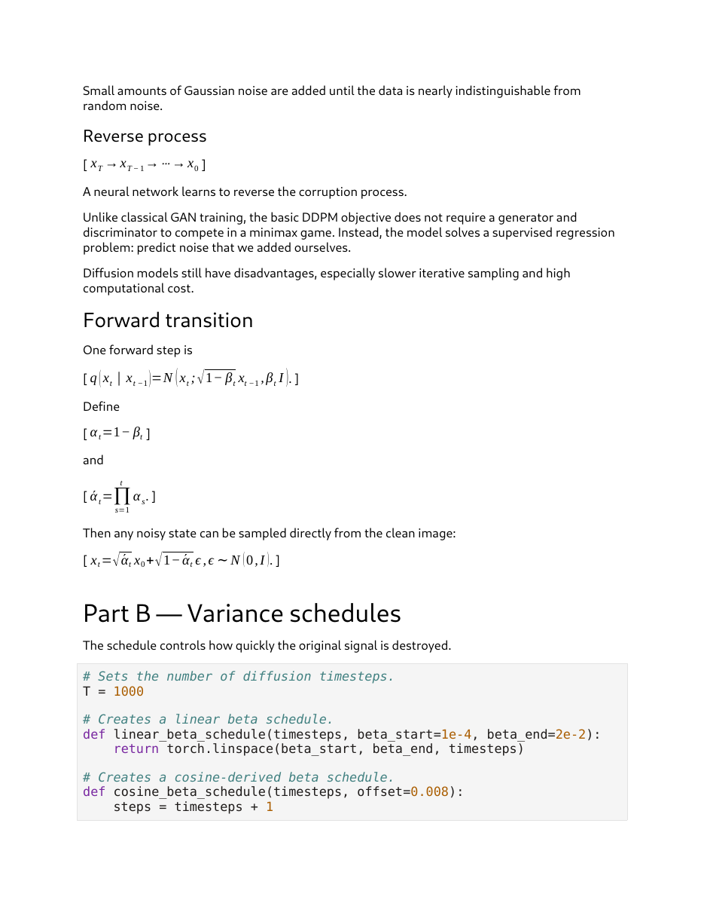
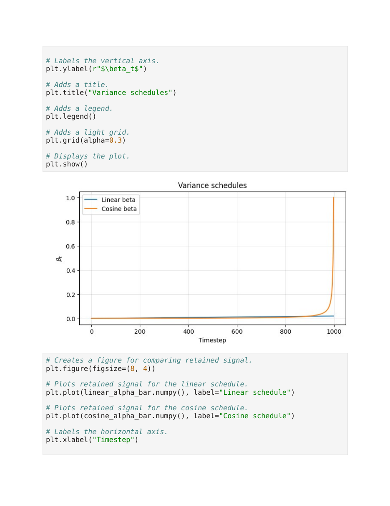
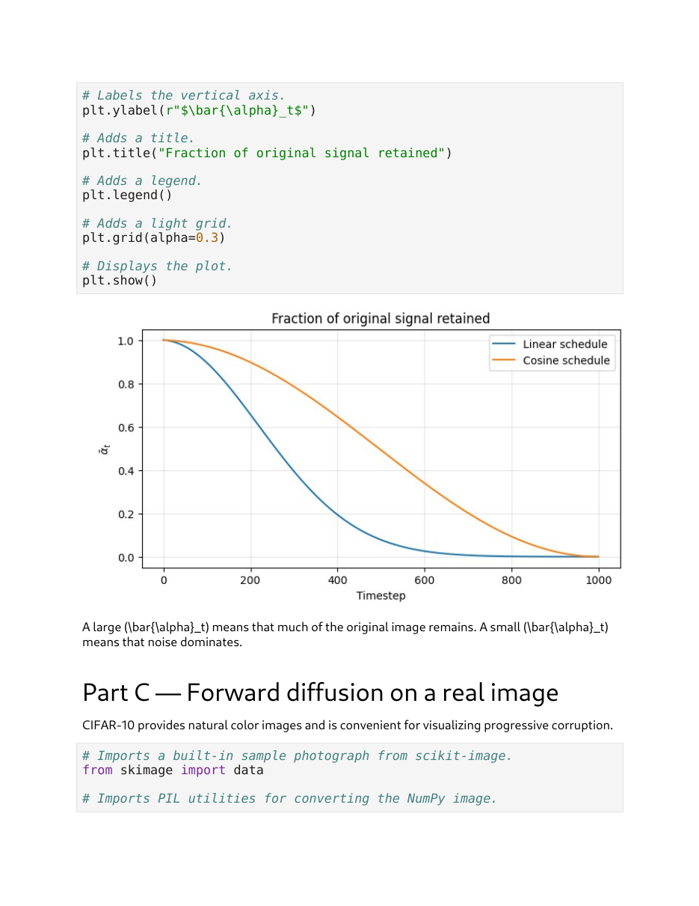
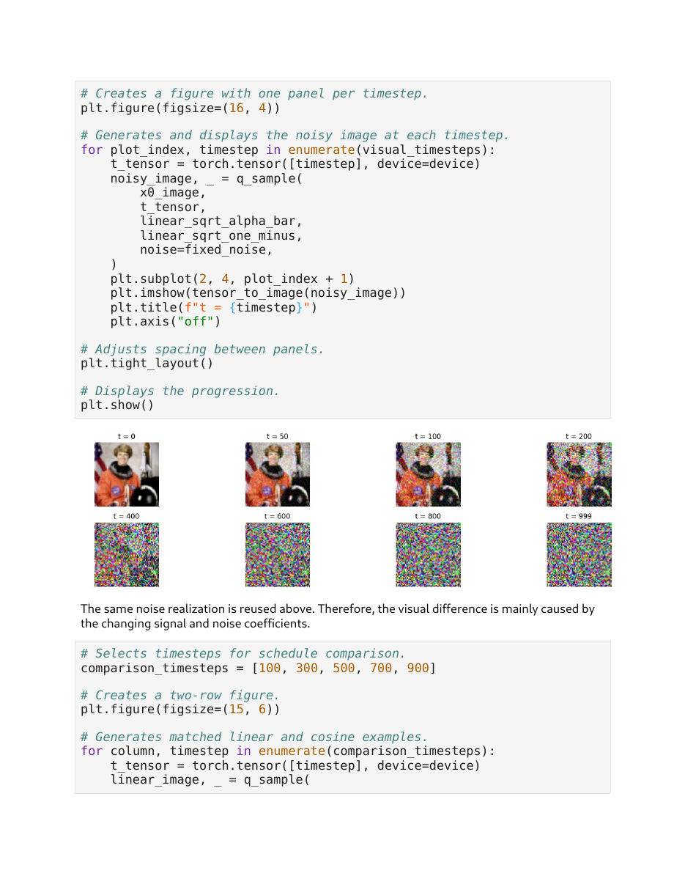
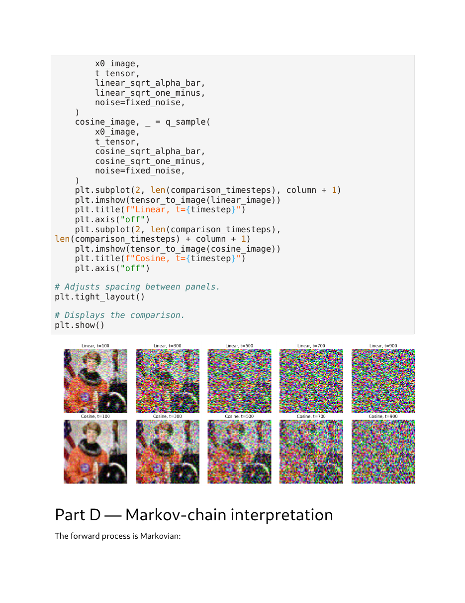
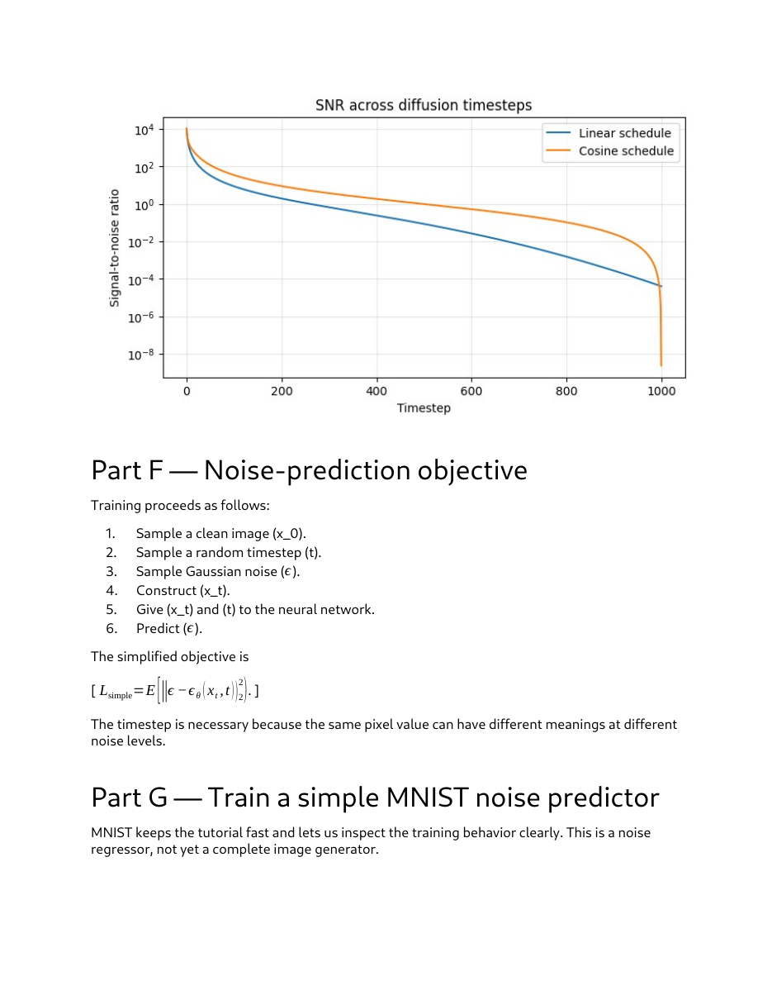
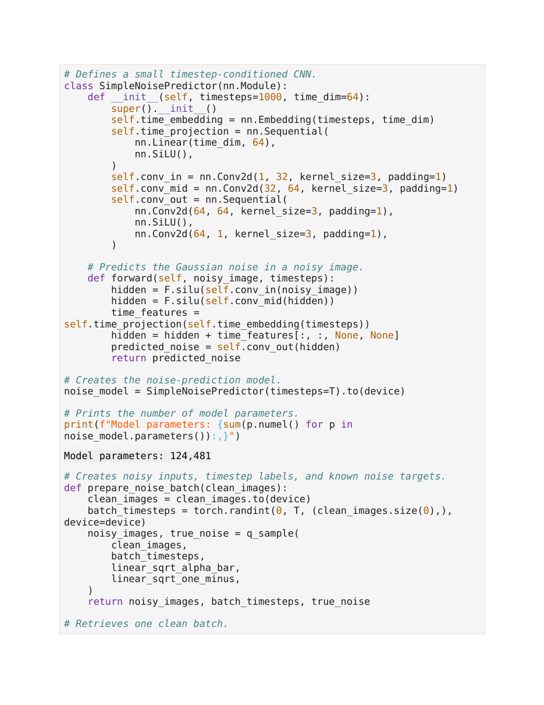
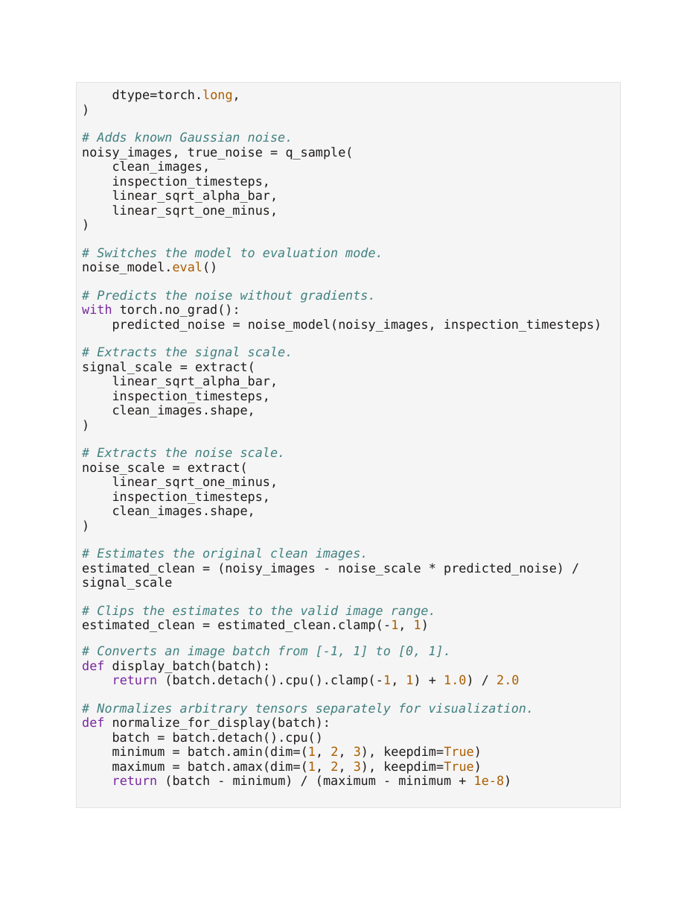
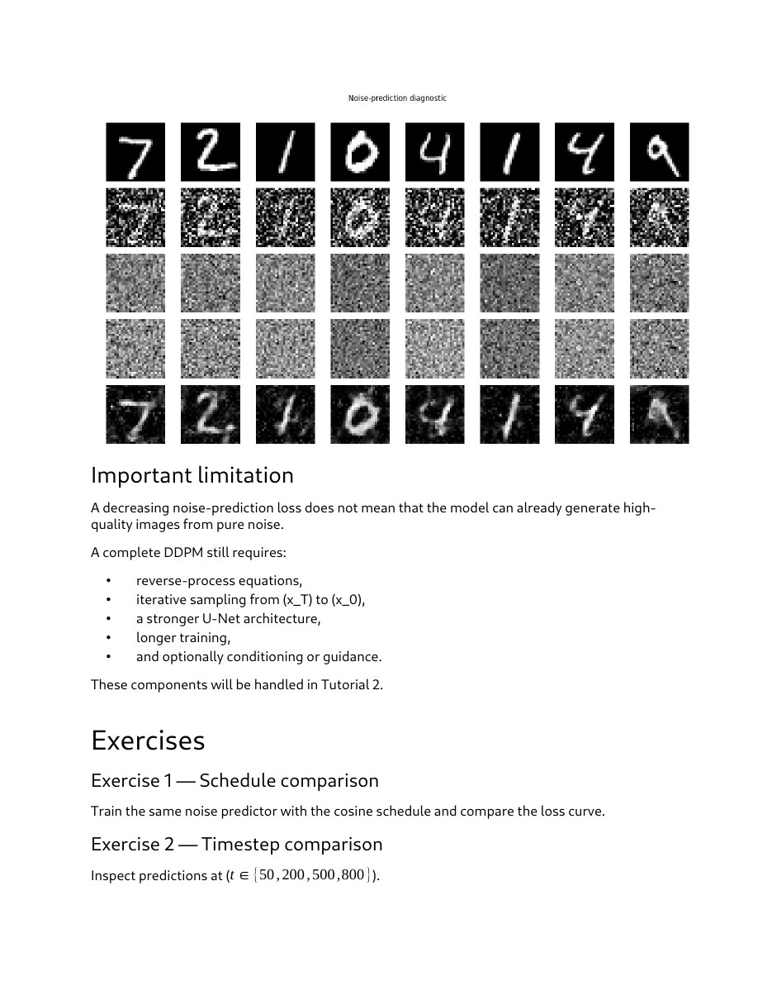

# Lec 48 — Hands-on: Forward Diffusion

> **Source:** `Lec 48.pdf` (26 pages) · **Week 7** · **Playlist:** Lec 48
> **Prereqs:** [Lec 44 — Introduction to Diffusion Models](44-diffusion-intro.md), [Lec 45 — Mathematics of Diffusion Models](45-diffusion-math.md), [Lec 46 — DDPM Forward Process](46-ddpm-forward.md), [Lec 23 — Reparameterization Trick](23-reparameterization.md)
> **Feeds into:** [Lec 47 — DDPM Reverse Process](47-ddpm-reverse.md), [Lec 49 — U-Net for Denoising](49-unet.md), [Lec 53 — Hands-on: Reverse Diffusion](53-reverse-diffusion-handson.md)

## Why this lecture exists

[Lec 46](46-ddpm-forward.md) proved that you can jump straight from a clean image to any noise level in one line of algebra. That proof leaves four practical questions unanswered: what numbers actually go into $\beta_t$, how you store the $\bar\alpha_t$ table so a training loop can index it, what a real image tensor looks like after the jump, and whether the one-shot formula really agrees with grinding the Markov chain forward step by step.

This session answers all four by running code. It is a Colab notebook — "Diffusion Tutorial 1" — not a slide deck, so every claim arrives as a printed number or a rendered image. It also builds a small timestep-conditioned CNN and trains it to predict the noise, which is the first time in the course you see the DDPM objective move a loss. It deliberately stops before reverse sampling; that is [Lec 53](53-reverse-diffusion-handson.md).

## The ideas

### This "lecture" is a notebook, and that changes how you read it

Pages 1–26 are a PDF export of a Google Colab notebook, split into Parts A–H plus six exercises and a summary. The exported LaTeX is broken throughout — display maths appears as `[ x_t = \sqrt{\bar\alpha_t} x_0 + ... ]` with literal square brackets, and page 6 leaks a raw `(\bar{\alpha}_t)` into the prose. Read past it. The deck also renders $\bar\alpha_t$ with an acute accent, $\acute\alpha_t$, a font defect; it means $\bar\alpha_t$ everywhere, and this chapter writes it the contract's way.

The learning objectives on page 1 are a usable exam checklist in themselves: interpret $\beta_t$, $\alpha_t$, $\bar\alpha_t$; compare linear and cosine schedules; explain why the forward process is Markovian; use the closed form for $q(\mathbf{x}_t\mid\mathbf{x}_0)$; read signal destruction across timesteps; state the noise-prediction objective; train and inspect a noise predictor.

### The schedule in practice: $T = 1000$, $\beta$ from $10^{-4}$ to $0.02$


*Fig. — The algebra you already own from [Lec 46](46-ddpm-forward.md), followed immediately by the three lines that turn it into numbers: `T = 1000`, `beta_start=1e-4`, `beta_end=2e-2`. Those are the DDPM paper's own defaults and the ones to memorise. Page 3.*

The whole schedule is one function call:

```
T = 1000
def linear_beta_schedule(timesteps, beta_start=1e-4, beta_end=2e-2):
    return torch.linspace(beta_start, beta_end, timesteps)
```

`torch.linspace(a, b, n)` produces $n$ values **inclusive of both endpoints**, so the spacing is $(b-a)/(n-1)$, not $(b-a)/n$:

$$\Delta\beta = \frac{0.02 - 0.0001}{999} = 1.991992\times10^{-5}$$

So $\beta_1 = 10^{-4}$, $\beta_2 = 1.19920\times10^{-4}$, $\beta_3 = 1.39840\times10^{-4}$, …, $\beta_{1000} = 0.02$. The variance added at the last step is **200 times** the variance added at the first.

**One indexing trap that runs through the entire notebook.** Python arrays are zero-based, so `linear_betas[0]` holds $\beta_1$ and `linear_betas[999]` holds $\beta_{1000}$. Everywhere the notebook writes `t = 0` it means the *first* diffusion step, not the clean image. The panel labelled "t = 0" in the trajectory figure is therefore $\mathbf{x}_1$, with $\sqrt{\bar\alpha} = 0.99995$ — visually identical to $\mathbf{x}_0$, which is why nobody notices. Keep the offset in mind when a question pairs a code index with a mathematical $t$.

### The cosine schedule, and why it exists

The second schedule is derived from $\bar\alpha_t$ directly rather than from $\beta_t$:

$$\bar\alpha_t^{\cos} = \frac{f(t)}{f(0)}, \qquad f(t) = \cos^2\!\left(\frac{t/T + s}{1+s}\cdot\frac{\pi}{2}\right), \qquad s = 0.008$$

and then the $\beta$ values are recovered by inverting $\bar\alpha_t = \bar\alpha_{t-1}\alpha_t$:

$$\beta_t = 1 - \frac{\bar\alpha_t}{\bar\alpha_{t-1}}, \qquad \text{clipped to } [10^{-4},\ 0.999]$$

The offset $s = 0.008$ stops $\beta_1$ from being exactly zero; the clip stops $\beta_T$ from being exactly 1. The notebook prints both ranges:

```
Linear beta range: 9.999999747378752e-05 to 0.019999999552965164
Cosine beta range: 9.999999747378752e-05 to 0.9990000128746033
```

Those ugly digits are float32 rounding of $10^{-4}$, $0.02$ and $0.999$ — not a bug, and worth recognising so you do not read them as meaningful. Notice what they tell you: **both schedules share the same floor ($10^{-4}$), but the cosine schedule's largest $\beta$ is $0.999$ against the linear schedule's $0.02$** — fifty times larger. The cosine schedule is gentle for a long time and then collapses the signal violently at the very end.


*Fig. — On this axis the linear schedule looks like a flat line because 0.02 is invisible next to the cosine spike. Do not conclude the linear $\beta$ is constant; it rises 200-fold. Page 5.*

### The precomputed table: four arrays, one per timestep

Every training step needs $\sqrt{\bar\alpha_t}$ and $\sqrt{1-\bar\alpha_t}$ for a *random* $t$. You never recompute them; you build four aligned length-$T$ tables once and index them:

```
def schedule_terms(betas):
    alphas = 1.0 - betas
    alpha_bar = torch.cumprod(alphas, dim=0)
    sqrt_alpha_bar = torch.sqrt(alpha_bar)
    sqrt_one_minus_alpha_bar = torch.sqrt(1.0 - alpha_bar)
    return alphas, alpha_bar, sqrt_alpha_bar, sqrt_one_minus_alpha_bar
```

`torch.cumprod` is the whole trick: $\bar\alpha_t = \prod_{s=1}^{t}\alpha_s$ is a cumulative product, so one pass over the array gives you all $T$ values. Here is the resulting table at the notebook's own checkpoints, both schedules (natural units; $\mathrm{SNR}$ is defined below):

| $t$ | $\beta_t$ (lin) | $\bar\alpha_t$ (lin) | $\sqrt{\bar\alpha_t}$ | $\sqrt{1-\bar\alpha_t}$ | $\mathrm{SNR}$ (lin) | $\bar\alpha_t$ (cos) | $\mathrm{SNR}$ (cos) |
|---|---|---|---|---|---|---|---|
| 1 | 0.000100 | 0.999900 | 0.999950 | 0.010001 | 9997 | 0.999900 | 9997 |
| 50 | 0.001076 | 0.971016 | 0.985401 | 0.170248 | 33.50 | 0.991626 | 118.4 |
| 100 | 0.002072 | 0.897018 | 0.947110 | 0.320908 | 8.710 | 0.971719 | 34.36 |
| 200 | 0.004064 | 0.659039 | 0.811812 | 0.583919 | 1.933 | 0.898361 | 8.839 |
| 400 | 0.008048 | 0.195146 | 0.441754 | 0.897136 | 0.2425 | 0.647229 | 1.835 |
| 500 | 0.010040 | 0.077797 | 0.278921 | 0.960314 | 0.08436 | 0.493654 | 0.9749 |
| 600 | 0.012032 | 0.025879 | 0.160871 | 0.986975 | 0.02657 | 0.340679 | 0.5167 |
| 800 | 0.016016 | 0.001532 | 0.039142 | 0.999234 | 0.001534 | 0.094009 | 0.1038 |
| 1000 | 0.020000 | 0.000040 | 0.006353 | 0.999980 | $4.04\times10^{-5}$ | $2.4\times10^{-9}$ | $2.4\times10^{-9}$ |


*Fig. — The single most informative plot in the notebook. The linear curve is already below 0.1 by $t \approx 500$, so **half the schedule is spent on data that is essentially pure noise**. The cosine curve spends its budget far more evenly. That waste is exactly what the cosine schedule was invented to fix. Page 6.*

The notebook's own gloss is the sentence to carry into the exam: *"A large $\bar\alpha_t$ means that much of the original image remains. A small $\bar\alpha_t$ means that noise dominates."*

### Applying the closed-form jump to a real image tensor

![Notebook code loading skimage's astronaut photograph, resizing to 64×64, ToTensor, then Lambda scaling [0,1] to [-1,1]; prints "Image shape: (1, 3, 64, 64)"](../assets/pages/lec48/p-07.png)
*Fig. — Three preprocessing steps and one printed shape. The `image * 2.0 - 1.0` line is not cosmetic: it is what makes $\mathcal{N}(\mathbf{0},\mathbf{I})$ the right terminal distribution. Page 7.*

The practical pipeline for turning a photograph into a $\mathbf{x}_0$ the forward process can eat:

1. **Resize** to $64\times64$ — keeps the demo fast.
2. **`ToTensor()`** — converts an $H\times W\times C$ uint8 PIL image to a $C\times H\times W$ float tensor in $[0,1]$, and reorders the axes.
3. **`Lambda(lambda image: image * 2.0 - 1.0)`** — rescales $[0,1] \to [-1,1]$.
4. **`unsqueeze(0)`** — adds the batch axis.

Final shape printed by the deck: **`(1, 3, 64, 64)`**, i.e. batch 1, 3 channels, $64\times64$ spatial.

**Why $[-1,1]$ and not $[0,1]$.** The forward process drives $\mathbf{x}_T$ toward $\mathcal{N}(\mathbf{0},\mathbf{I})$ — mean zero, unit variance. Data living in $[0,1]$ has mean around $+0.5$, so the terminal distribution would be mismatched and the model would have to learn a constant offset for free. Centring the data on zero with a half-width of 1 makes the data's own scale comparable to the noise's. Every image diffusion model does this, and every one of them undoes it for display:

```
def tensor_to_image(tensor):
    image = tensor.detach().cpu().clamp(-1, 1)
    image = (image + 1.0) / 2.0
    image = image.squeeze(0).permute(1, 2, 0).numpy()
    return image
```

Note the `clamp(-1, 1)` *before* rescaling. A noisy $\mathbf{x}_t$ routinely has values outside $[-1,1]$ — at $t=1000$ the standard deviation is 1.0, so about a third of pixels are out of range — and matplotlib would reject them.

### `extract`: the one utility that makes batched timesteps work

![Notebook page showing the clean 64x64 astronaut photograph, then the definitions of extract() and q_sample(), the list visual_timesteps = [0, 50, 100, 200, 400, 600, 800, 999], and fixed_noise](../assets/pages/lec48/p-08.png)
*Fig. — The clean $\mathbf{x}_0$ on top, and beneath it the two functions that do all the work. `q_sample` is six lines and contains the whole forward process. Page 8.*

The subtlest line in the notebook:

```
def extract(values, timesteps, target_shape):
    selected = values.to(timesteps.device)[timesteps]
    return selected.reshape(timesteps.shape[0], *((1,) * (len(target_shape) - 1)))
```

Each image in a batch gets its **own** random $t$, so `timesteps` is a vector of length $B$ and `values[timesteps]` is a vector of $B$ coefficients. To multiply a $(B,C,H,W)$ tensor by it you must reshape to $(B,1,1,1)$ and let broadcasting do the rest. That is all `extract` does, and it is why `q_sample` is three lines:

```
def q_sample(x0, timesteps, sqrt_alpha_bar, sqrt_one_minus_alpha_bar, noise=None):
    if noise is None:
        noise = torch.randn_like(x0)
    signal_scale = extract(sqrt_alpha_bar, timesteps, x0.shape)
    noise_scale  = extract(sqrt_one_minus_alpha_bar, timesteps, x0.shape)
    xt = signal_scale * x0 + noise_scale * noise
    return xt, noise
```

It returns `(xt, noise)` — both. The returned `noise` is the **training target**; you cannot throw it away.

### The corruption trajectory, with the noise held fixed


*Fig. — The deck's own caption is the point: "The same noise realization is reused above. Therefore, the visual difference is mainly caused by the changing signal and noise coefficients." Notice the image is already unrecognisable at $t=400$, where $\sqrt{\bar\alpha_t} = 0.4418$ — you lose a face long before you lose the last 0.44 of signal. Page 9.*

The visualisation loop uses `visual_timesteps = [0, 50, 100, 200, 400, 600, 800, 999]` and a single `fixed_noise = torch.randn_like(x0_image)` passed into every call. That is a deliberate experimental control: with $\epsilon$ held constant, every visual difference between panels is attributable to $\sqrt{\bar\alpha_t}$ and $\sqrt{1-\bar\alpha_t}$ alone. If you redrew the noise each time you could not tell schedule effects from sampling luck.


*Fig. — Read it column-wise. At $t = 500$ the linear row is pure static while the cosine row still shows an orange suit and a face — $\bar\alpha_{500}$ is 0.0778 linear against 0.4937 cosine, a **6.3-fold** difference in retained signal power. Page 10.*

### Iterative chain versus closed form: the Monte Carlo check

The forward process is Markovian — the notebook states it as

$$q(\mathbf{x}_t\mid\mathbf{x}_{t-1},\mathbf{x}_{t-2},\ldots,\mathbf{x}_0) = q(\mathbf{x}_t\mid\mathbf{x}_{t-1})$$

"Once $\mathbf{x}_{t-1}$ is known, generating $\mathbf{x}_t$ does not require the earlier states." One step is implemented exactly as the transition density says, with **standard deviation $\sqrt{\beta_t}$** because $\beta_t$ is the *variance*:

```
def q_step(x_previous, timestep, betas, alphas):
    beta_t  = betas[timestep]
    alpha_t = alphas[timestep]
    step_noise = torch.randn_like(x_previous)
    return torch.sqrt(alpha_t) * x_previous + torch.sqrt(beta_t) * step_noise
```

Running this $T$ times and photographing checkpoints reproduces the trajectory figure. But two different random procedures give two different pictures, so the notebook asks the sharper question: *do they agree in distribution?* It answers with 20,000 Monte Carlo samples of a single scalar $x_0 = 1.0$ at $t = 500$ — once by iterating 501 single steps, once by the closed form.

Theory says both should have mean $\sqrt{\bar\alpha_{501}}\cdot 1.0 = 0.278921$ and standard deviation $\sqrt{1-\bar\alpha_{501}} = 0.960314$. Both do, to within sampling error (N4 works this out). The notebook's own conclusion: *"The iterative and direct methods generally produce different individual samples because they use different random draws. They nevertheless represent the same marginal distribution."*

> **The deck's results table is unreadable as exported.** Page 13 prints the raw Colab DataFrame *metadata* JSON instead of the rendered table, and that JSON reports `min` and `max` per column, not the row order. You therefore cannot tell from the PDF which method produced which mean. Reproduced with the notebook's own seed (42): **iterative = 0.2914470136 / 0.9705528021; closed-form = 0.2794473469 / 0.9670186043.** All four digits-strings match the deck exactly; only their pairing was unrecoverable from the page.

### Signal-to-noise ratio


*Fig. — The cosine curve is **above** the linear one for essentially the whole schedule, then dives through it in the last few steps. That crossover is the clamp at $\beta = 0.999$ biting. An MCQ asking "which schedule has lower SNR at $t=900$?" wants *linear*; one asking about $t=1000$ wants *cosine*. Page 15.*

The notebook defines

$$\mathrm{SNR}(t) = \frac{\bar\alpha_t}{1-\bar\alpha_t}$$

and comments only that "early timesteps have high SNR, late timesteps have low SNR". It is worth seeing *why that is the right ratio*. In $\mathbf{x}_t = \sqrt{\bar\alpha_t}\,\mathbf{x}_0 + \sqrt{1-\bar\alpha_t}\,\epsilon$ the two coefficients are amplitudes; squaring them gives powers. So $\bar\alpha_t$ is the retained **signal power** and $1-\bar\alpha_t$ the injected **noise power**, and their ratio is the ordinary engineering SNR. Three consequences worth memorising:

- $\mathrm{SNR}(t) = 1$ exactly when $\bar\alpha_t = 0.5$. For the linear schedule that is $t = 259$ — **the signal is half gone by a quarter of the way through**.
- $\mathrm{SNR}$ spans about nine orders of magnitude ($10^{4}$ down to $4\times10^{-5}$), which is why the plot is `semilogy`.
- $\mathrm{SNR}$ is monotone decreasing, so it is a legitimate reparameterisation of $t$ — later models (and [Lec 52](52-stable-diffusion.md)'s samplers) index by SNR rather than by step number.

### The noise-prediction objective, as six executable steps

$$\mathcal{L}_{\text{simple}} = \mathbb{E}\!\left[\big\lVert \epsilon - \epsilon_\theta(\mathbf{x}_t, t)\big\rVert_2^2\right]$$

1. Sample a clean image $\mathbf{x}_0$ (one batch from the loader).
2. Sample a random timestep $t$ — `torch.randint(0, T, (B,))`, one per image.
3. Sample Gaussian noise $\epsilon$ — `torch.randn_like(x0)`.
4. Construct $\mathbf{x}_t$ — one `q_sample` call.
5. Give $\mathbf{x}_t$ **and** $t$ to the network.
6. Predict $\epsilon$, and score with MSE.

The deck's justification for step 5 is the sentence [Lec 49](49-unet.md) builds on: *"The timestep is necessary because the same pixel value can have different meanings at different noise levels."* A mid-grey pixel at $t=50$ is a grey pixel; at $t=900$ it is noise.

Note the enormous practical consequence of step 2: because $t$ is drawn at random and the closed form reaches any $t$ in one multiply, **training touches each example at exactly one noise level per epoch and never simulates the chain**. Without the closed form you would need $O(t)$ work per sample.

### The training run, with its real numbers

MNIST, subsetted to keep it fast: `train_subset_size = 12000`, `validation_subset_size = 2000`, batch sizes 128 (train, shuffled) and 256 (validation). $12000/128 = 93.75$, so the loader yields **94 batches** per epoch — the log confirms `batch 0/94` and `batch 50/94`.


*Fig. — Count the layers: `conv_in` 1→32, `conv_mid` 32→64, `conv_out` 64→64→1, every one $K=3$, $S=1$, $P=1$. There is no downsampling and no skip connection. **This is not a U-Net**, and the deck never says so. Page 18.*

```
Noisy image shape: (128, 1, 28, 28)
Timestep shape: (128,)
Noise target shape: (128, 1, 28, 28)
Initial batch MSE: 1.0008
```

**The initial MSE of 1.0008 is not luck.** An untrained network emits values near zero, and the target is $\epsilon \sim \mathcal{N}(0,1)$, so the expected squared error is $\mathbb{E}[\epsilon^2] = \operatorname{Var}(\epsilon) = 1$. **An MSE of 1.0 is the "predict nothing" baseline for any noise-prediction model**, and any reported loss should be read against it.

Optimiser `AdamW`, $\eta = 2\times10^{-3}$, gradient clipping at `max_norm=1.0`, 3 epochs on a T4 GPU:

| epoch | batch | training MSE | validation MSE |
|---|---|---|---|
| 1/3 | 0/94 | 0.9934 | — |
| 1/3 | 50/94 | 0.1942 | — |
| 1/3 | end | — | **0.1335** |
| 2/3 | 0/94 | 0.1423 | — |
| 2/3 | 50/94 | 0.0999 | — |
| 2/3 | end | — | **0.0879** |
| 3/3 | 0/94 | 0.0881 | — |
| 3/3 | 50/94 | 0.1025 | — |
| 3/3 | end | — | **0.0718** |

Total training time: **8.3 seconds**, over $3\times94 = 282$ optimisation steps.


*Fig. — The raw blue trace is jagged and the orange moving average is not. The deck explains why: "each batch uses different images, timesteps, and newly sampled Gaussian noise" — so batch loss is a noisy estimate of three independent random draws at once, and a batch that happened to draw mostly large $t$ is *harder*. Page 23.*

### Inspecting the prediction: the one-step clean estimate

Solve the closed form for $\mathbf{x}_0$ and substitute the network's guess $\hat\epsilon_\theta$:

$$\hat{\mathbf{x}}_0 = \frac{\mathbf{x}_t - \sqrt{1-\bar\alpha_t}\,\hat\epsilon_\theta(\mathbf{x}_t,t)}{\sqrt{\bar\alpha_t}}$$

This is algebra, not a new model. At `inspection_timestep = 300` the deck runs it on eight validation digits and shows five rows: clean image, noisy image, true added noise, predicted noise, one-step clean estimate.


*Fig. — Rows 3 and 4 (true vs predicted noise) look like the same grey static, which is the point — the model has learned *which* static was added. Row 5 recovers readable digits but grainy ones. Page 25.*

The deck's **Important limitation** block deserves quoting because it is a likely exam sentence: *"A decreasing noise-prediction loss does not mean that the model can already generate high-quality images from pure noise."* A complete DDPM still needs the reverse-process equations ([Lec 47](47-ddpm-reverse.md)), iterative sampling from $\mathbf{x}_T$ to $\mathbf{x}_0$ ([Lec 53](53-reverse-diffusion-handson.md)), a stronger U-Net ([Lec 49](49-unet.md)), longer training, and optionally guidance ([Lec 50](50-classifier-guidance.md), [Lec 51](51-classifier-free-guidance.md)).

Why one step is not enough: $\hat{\mathbf{x}}_0$ divides by $\sqrt{\bar\alpha_t}$, which is $0.0064$ at $t=1000$. Any error in $\hat\epsilon$ is amplified by $1/0.0064 \approx 157$. Iterative sampling takes many small, well-conditioned steps instead of one catastrophically ill-conditioned one.

## Worked numericals

### N1. Reproduce the deck's printed $\beta$ ranges

**Given:** `torch.linspace(1e-4, 2e-2, 1000)`, and the cosine schedule clipped to $[10^{-4}, 0.999]$.
**Find:** $\beta_1$, $\beta_2$, $\beta_{1000}$, the spacing, and the two printed ranges.

1. `linspace` with $n = 1000$ endpoints inclusive has spacing $\Delta = (0.02 - 0.0001)/(1000-1) = 0.0199/999$.
2. $0.0199/999 = 1.991992\times10^{-5}$.
3. $\beta_1 = 1.0\times10^{-4}$ (the start, exactly).
4. $\beta_2 = 10^{-4} + 1.991992\times10^{-5} = 1.1991992\times10^{-4}$.
5. $\beta_{1000} = 10^{-4} + 999\times1.991992\times10^{-5} = 10^{-4} + 0.0199 = 0.02$ (the end, exactly).
6. Cosine: the floor $10^{-4}$ binds at small $t$ (the unclipped value is below it) and the ceiling $0.999$ binds at $t = 1000$.

**Answer:** linear $\beta \in [1.0\times10^{-4},\ 0.02]$, spacing $1.991992\times10^{-5}$; cosine $\beta \in [1.0\times10^{-4},\ 0.999]$. The deck's `9.999999747378752e-05` and `0.019999999552965164` are the float32 representations of $10^{-4}$ and $0.02$; `0.9990000128746033` is float32 $0.999$. The *ratio* $\beta_{\max}^{\cos}/\beta_{\max}^{\text{lin}} = 0.999/0.02 = 49.95$.

### N2. $\bar\alpha_t$ by hand for the first three steps

**Given:** the linear schedule above.
**Find:** $\bar\alpha_1,\bar\alpha_2,\bar\alpha_3$ and the signal/noise coefficients at $t=3$.

1. $\alpha_1 = 1-10^{-4} = 0.9999$.
2. $\alpha_2 = 1 - 1.1991992\times10^{-4} = 0.99988008008$.
3. $\alpha_3 = 1 - 1.3983984\times10^{-4} = 0.99986016016$.
4. $\bar\alpha_1 = \alpha_1 = 0.9999$.
5. $\bar\alpha_2 = 0.9999 \times 0.99988008008 = 0.99978009207$.
6. $\bar\alpha_3 = 0.99978009207 \times 0.99986016016 = 0.99964028298$.
7. $\sqrt{\bar\alpha_3} = \sqrt{0.99964028298} = 0.99982013$.
8. $\sqrt{1-\bar\alpha_3} = \sqrt{3.5971702\times10^{-4}} = 0.01896621$.

**Answer:** $\bar\alpha_3 = 0.999640$, $\sqrt{\bar\alpha_3} = 0.999820$, $\sqrt{1-\bar\alpha_3} = 0.018966$. After three steps the image is 99.98% signal by amplitude. The schedule starts *extremely* gently — a useful sanity check that you have not confused $\beta$ with $\bar\alpha$.

### N3. The Monte Carlo experiment, and which row is which

**Given:** $x_0 = 1.0$ (a scalar), `target_timestep = 500`, `num_samples = 20000`, seed 42, linear schedule. The iterative arm runs `for timestep in range(501)`; the closed-form arm uses index 500.
**Find:** the theoretical mean and standard deviation, and whether the deck's four printed numbers are consistent.

1. Index 500 holds $\bar\alpha_{501}$. From `cumprod`: $\bar\alpha_{501} = 0.0777967$.
2. Theoretical mean $= \sqrt{\bar\alpha_{501}}\cdot x_0 = \sqrt{0.0777967} = 0.278921$.
3. Theoretical standard deviation $= \sqrt{1-\bar\alpha_{501}} = \sqrt{0.9222033} = 0.960314$.
4. Index check for the iterative arm: `range(501)` applies 501 single steps using $\alpha$ at indices $0\ldots500$, i.e. $\alpha_1\cdots\alpha_{501}$ — exactly the 501 factors in $\bar\alpha_{501}$. **The two arms are comparing the same $t$.**
5. Standard error of a mean over $n = 20000$ samples: $0.960314/\sqrt{20000} = 0.006790$.
6. Deck value $0.2794473$ sits $(0.2794473-0.278921)/0.006790 = +0.08$ standard errors from theory.
7. Deck value $0.2914470$ sits $(0.2914470-0.278921)/0.006790 = +1.84$ standard errors from theory.

**Answer:** theory gives mean $0.278921$ and standard deviation $0.960314$; both printed means ($0.279447$ and $0.291447$) lie within 2 standard errors, so the experiment **confirms the closed form**. Re-running the notebook's code with its own seed assigns iterative $\to 0.2914470136$ / $0.9705528021$ and closed-form $\to 0.2794473469$ / $0.9670186043$. The page-13 JSON gives only column minima and maxima, so the pairing is not recoverable from the PDF.

### N4. Parameter count of `SimpleNoisePredictor`

**Given:** `nn.Embedding(1000, 64)`; `Linear(64, 64)` + SiLU; `Conv2d(1, 32, 3, padding=1)`; `Conv2d(32, 64, 3, padding=1)`; then `Conv2d(64, 64, 3, padding=1)` + SiLU + `Conv2d(64, 1, 3, padding=1)`. Every conv has a bias.
**Find:** the total, and check it against the printed `124,481`.

A conv layer with $C_{in}$ input channels, $F$ filters and kernel $K$ has $C_{in}\cdot F\cdot K^2 + F$ parameters.

| Layer | Arithmetic | Parameters |
|---|---|---|
| `time_embedding` | $1000 \times 64$ | 64,000 |
| `time_projection` Linear | $64\times64 + 64$ | 4,160 |
| `conv_in` | $1\times32\times3^2 + 32 = 288+32$ | 320 |
| `conv_mid` | $32\times64\times3^2 + 64 = 18432+64$ | 18,496 |
| `conv_out[0]` | $64\times64\times3^2 + 64 = 36864+64$ | 36,928 |
| `conv_out[2]` | $64\times1\times3^2 + 1 = 576+1$ | 577 |

1. Sum: $64000 + 4160 = 68160$.
2. $68160 + 320 = 68480$.
3. $68480 + 18496 = 86976$.
4. $86976 + 36928 = 123904$.
5. $123904 + 577 = 124481$.

**Answer:** **124,481** parameters — matches the deck exactly. Note that **51.4%** of them ($64000/124481$) are the timestep embedding table, a lookup row per timestep. SiLU has no parameters.

### N5. SNR, and the half-signal timestep

**Given:** $\mathrm{SNR}(t) = \bar\alpha_t/(1-\bar\alpha_t)$, linear schedule.
**Find:** $\mathrm{SNR}$ at $t=100$ and $t=800$, the ratio between them, and the $t$ at which $\mathrm{SNR} = 1$.

1. $t=100$: $\bar\alpha_{100} = 0.897018$, so $\mathrm{SNR} = 0.897018/(1-0.897018) = 0.897018/0.102982 = 8.7105$.
2. $t=800$: $\bar\alpha_{800} = 0.001532$, so $\mathrm{SNR} = 0.001532/0.998468 = 1.5343\times10^{-3}$.
3. Ratio: $8.7105 / 1.5343\times10^{-3} = 5677$.
4. $\mathrm{SNR}=1 \iff \bar\alpha_t = 1-\bar\alpha_t \iff \bar\alpha_t = 0.5$. Scanning the table, $\bar\alpha_{259} = 0.500245$.
5. In decibels: $10\log_{10}(8.7105) = 9.40$ dB at $t=100$ against $10\log_{10}(1.5343\times10^{-3}) = -28.14$ dB at $t=800$.

**Answer:** $\mathrm{SNR}(100) = 8.71$, $\mathrm{SNR}(800) = 1.53\times10^{-3}$, a factor of **5,677**. $\mathrm{SNR}$ crosses 1 at **$t = 259$** — only 26% of the way through the schedule. (Decibel values are base-10 logs; the course's default elsewhere is the natural log.)

### N6. Linear versus cosine at the same timestep

**Given:** $t = 500$, the same $\mathbf{x}_0$ and the same $\epsilon$.
**Find:** the signal and noise amplitudes under both schedules, and the ratio of retained signal power.

1. Linear: $\bar\alpha_{500} = 0.077797$, so $\sqrt{\bar\alpha} = 0.278921$ and $\sqrt{1-\bar\alpha} = 0.960314$.
2. Cosine: $\bar\alpha_{500} = 0.493654$, so $\sqrt{\bar\alpha} = 0.702605$ and $\sqrt{1-\bar\alpha} = 0.711580$.
3. Signal-power ratio: $0.493654/0.077797 = 6.345$.
4. Signal-amplitude ratio: $0.702605/0.278921 = 2.519$.
5. Pixel with $x_0 = 0.6$ and $\epsilon = 1.2$: linear $x_t = 0.278921(0.6) + 0.960314(1.2) = 0.167353 + 1.152377 = 1.319730$; cosine $x_t = 0.702605(0.6) + 0.711580(1.2) = 0.421563 + 0.853896 = 1.275459$.
6. Signal's share of that pixel: linear $0.167353/1.319730 = 12.7\%$; cosine $0.421563/1.275459 = 33.1\%$.

**Answer:** at the identical timestep the cosine schedule retains **6.35×** the signal power and **2.52×** the signal amplitude. On the sample pixel the clean component contributes 12.7% of the value under the linear schedule against 33.1% under the cosine — which is exactly why the cosine row of the comparison figure still shows a face at $t=500$.

### N7. Batch arithmetic and the "predict nothing" baseline

**Given:** 12,000 training images, batch size 128, 3 epochs; targets $\epsilon\sim\mathcal{N}(0,1)$; final validation MSE 0.0718.
**Find:** the number of batches, the number of optimisation steps, the untrained MSE, and the fraction of noise variance the trained model explains.

1. Batches per epoch: $\lceil 12000/128 \rceil = \lceil 93.75 \rceil = 94$ (the last batch holds $12000 - 93\times128 = 96$ images).
2. Optimisation steps: $3 \times 94 = 282$.
3. Untrained expectation: the network outputs $\approx\mathbf{0}$, so $\mathbb{E}[(\epsilon-0)^2] = \operatorname{Var}(\epsilon) = 1$. The deck printed $1.0008$.
4. Fraction of variance left unexplained at the end: $0.0718/1 = 7.18\%$.
5. Fraction explained: $1 - 0.0718 = 0.9282$.

**Answer:** **94 batches**, **282 steps**, baseline MSE **1.0** (deck: 1.0008), and the trained model explains **92.8%** of the noise variance. Reading the final 0.0718 without the baseline of 1.0 tells you nothing; reading it against 1.0 tells you the model works.

## Code

The deck's notebook is hundreds of lines across eight parts. Distilled to its spine — build the schedule, read the table, apply the closed-form jump to a real image tensor — it is this:

```python
import torch

T = 1000                                        # the deck's number of diffusion steps
betas  = torch.linspace(1e-4, 0.02, T)          # linear schedule, beta_1 .. beta_T
alphas = 1.0 - betas                            # alpha_t = 1 - beta_t
abar   = torch.cumprod(alphas, dim=0)           # alpha_bar_t = prod_{s<=t} alpha_s
sqrt_ab, sqrt_1mab = torch.sqrt(abar), torch.sqrt(1.0 - abar)

print(f"beta_1 = {betas[0]:.6f}   beta_T = {betas[-1]:.6f}   step = {betas[1]-betas[0]:.3e}")
print(f"{'t':>5}{'beta_t':>12}{'abar_t':>12}{'sqrt(abar)':>12}{'sqrt(1-abar)':>14}{'SNR':>12}")
for t in [1, 50, 100, 200, 400, 600, 800, 1000]:
    i = t - 1                                   # array index i holds timestep t = i+1
    snr = abar[i] / (1.0 - abar[i])
    print(f"{t:5d}{betas[i]:12.6f}{abar[i]:12.6f}{sqrt_ab[i]:12.6f}{sqrt_1mab[i]:14.6f}{snr:12.4g}")

# Apply the closed-form jump to a real image tensor: batch 1, 3 channels, 64x64.
torch.manual_seed(0)
x0 = torch.rand(1, 3, 64, 64) * 2.0 - 1.0       # a stand-in image already scaled to [-1, 1]
eps = torch.randn_like(x0)                      # one fixed noise draw, reused at every t
print("\nx0 shape:", tuple(x0.shape), " x0 mean %.4f  std %.4f" % (x0.mean(), x0.std()))
for t in [50, 200, 500, 1000]:
    i = t - 1
    xt = sqrt_ab[i] * x0 + sqrt_1mab[i] * eps   # x_t = sqrt(abar) x0 + sqrt(1-abar) eps
    print(f"t={t:4d}  xt shape {tuple(xt.shape)}  mean {xt.mean():+.4f}  std {xt.std():.4f}"
          f"  signal {sqrt_ab[i]:.4f}  noise {sqrt_1mab[i]:.4f}")
```

```
beta_1 = 0.000100   beta_T = 0.020000   step = 1.992e-05
    t      beta_t      abar_t  sqrt(abar)  sqrt(1-abar)         SNR
    1    0.000100    0.999900    0.999950      0.010001        9997
   50    0.001076    0.971016    0.985401      0.170248        33.5
  100    0.002072    0.897018    0.947110      0.320908        8.71
  200    0.004064    0.659039    0.811812      0.583919       1.933
  400    0.008048    0.195146    0.441754      0.897136      0.2425
  600    0.012032    0.025879    0.160871      0.986975     0.02657
  800    0.016016    0.001532    0.039142      0.999234    0.001534
 1000    0.020000    0.000040    0.006353      0.999980   4.036e-05

x0 shape: (1, 3, 64, 64)  x0 mean 0.0031  std 0.5766
t=  50  xt shape (1, 3, 64, 64)  mean +0.0023  std 0.5936  signal 0.9854  noise 0.1702
t= 200  xt shape (1, 3, 64, 64)  mean -0.0000  std 0.7497  signal 0.8118  noise 0.5839
t= 500  xt shape (1, 3, 64, 64)  mean -0.0033  std 0.9749  signal 0.2803  noise 0.9599
t=1000  xt shape (1, 3, 64, 64)  mean -0.0043  std 1.0012  signal 0.0064  noise 1.0000
```

Three things to read off the output. The **shape never changes** — $(1,3,64,64)$ at every $t$, because the jump is an elementwise affine map, not a network. The **standard deviation of $\mathbf{x}_t$ climbs from 0.59 to 1.00**, converging on the unit variance of the target $\mathcal{N}(\mathbf{0},\mathbf{I})$, which is the whole design goal. And the **signal coefficient is still 0.44 at $t=400$** even though the deck's astronaut is already unrecognisable there — perceptual destruction runs far ahead of numerical destruction.

## Exam pack

### Must-memorise

| Item | Exactly this |
|---|---|
| Number of steps | $T = 1000$ |
| Linear schedule endpoints | $\beta_1 = 10^{-4}$, $\beta_T = 0.02$ |
| Linear spacing | $\Delta\beta = (0.02-10^{-4})/999 = 1.992\times10^{-5}$ |
| Cosine clip range | $[10^{-4},\ 0.999]$, offset $s = 0.008$ |
| $\alpha_t$ | $\alpha_t = 1 - \beta_t$ |
| $\bar\alpha_t$ | $\bar\alpha_t = \prod_{s=1}^{t}\alpha_s$ — `torch.cumprod` |
| The jump (owned by [Lec 46](46-ddpm-forward.md)) | $\mathbf{x}_t = \sqrt{\bar\alpha_t}\mathbf{x}_0 + \sqrt{1-\bar\alpha_t}\,\epsilon$ |
| One Markov step | $\mathbf{x}_t = \sqrt{\alpha_t}\mathbf{x}_{t-1} + \sqrt{\beta_t}\,\epsilon$ — std is $\sqrt{\beta_t}$ |
| Markov property | $q(\mathbf{x}_t\mid\mathbf{x}_{t-1},\ldots,\mathbf{x}_0) = q(\mathbf{x}_t\mid\mathbf{x}_{t-1})$ |
| Signal-to-noise ratio | $\mathrm{SNR}(t) = \dfrac{\bar\alpha_t}{1-\bar\alpha_t}$ |
| Simplified objective | $\mathcal{L}_{\text{simple}} = \mathbb{E}\big[\lVert\epsilon - \epsilon_\theta(\mathbf{x}_t,t)\rVert_2^2\big]$ |
| Data scaling | $[0,1] \to [-1,1]$ via `x * 2 - 1` |
| One-step clean estimate | $\hat{\mathbf{x}}_0 = \dfrac{\mathbf{x}_t - \sqrt{1-\bar\alpha_t}\,\hat\epsilon_\theta}{\sqrt{\bar\alpha_t}}$ |
| Six training steps | sample $\mathbf{x}_0$ → sample $t$ → sample $\epsilon$ → build $\mathbf{x}_t$ → feed $(\mathbf{x}_t, t)$ → predict $\epsilon$ |

### Numbers worth knowing

| Quantity | Value |
|---|---|
| $\beta_{1000}/\beta_1$ | $200$ |
| $\beta_{\max}^{\cos}/\beta_{\max}^{\text{lin}}$ | $0.999/0.02 = 49.95$ |
| $\bar\alpha_{100}$, linear / cosine | $0.8970$ / $0.9717$ |
| $\bar\alpha_{500}$, linear / cosine | $0.0778$ / $0.4937$ (ratio 6.35) |
| $\bar\alpha_{1000}$, linear | $4.04\times10^{-5}$ |
| $\sqrt{\bar\alpha_{500}}$ / $\sqrt{1-\bar\alpha_{500}}$, linear | $0.2789$ / $0.9603$ |
| $t$ at which $\mathrm{SNR}=1$ (linear) | $t = 259$ |
| $\mathrm{SNR}(1)$ / $\mathrm{SNR}(1000)$, linear | $9997$ / $4.04\times10^{-5}$ |
| Image tensor shape (astronaut) | $(1, 3, 64, 64)$ |
| MNIST batch shapes | $(128,1,28,28)$ noisy, $(128,)$ timesteps, $(128,1,28,28)$ target |
| Visualisation timesteps | $0, 50, 100, 200, 400, 600, 800, 999$ |
| Schedule-comparison timesteps | $100, 300, 500, 700, 900$ |
| Monte Carlo setup | $x_0 = 1.0$, $t = 500$, 20,000 samples |
| MC theory: mean / std | $0.2789$ / $0.9603$ |
| Model parameter count | $124{,}481$ (51% of it the embedding table) |
| Untrained MSE / final validation MSE | $1.0008$ / $0.0718$ |
| Train / validation subset, batch sizes | 12,000 / 2,000; 128 / 256 |
| Batches per epoch, total steps | 94, 282 |
| Epochs, optimiser, $\eta$, clip | 3, AdamW, $2\times10^{-3}$, `max_norm=1.0` |
| Training time | 8.3 s |
| Inspection timestep | 300 |
| Time-embedding dim in the toy model | 64 |

### Likely MCQ traps

- **$\beta_t$ is a variance, so the noise added in one step is scaled by $\sqrt{\beta_t}$, not $\beta_t$.** The code says `torch.sqrt(beta_t) * step_noise`. Anyone who writes $\mathbf{x}_t = \sqrt{\alpha_t}\mathbf{x}_{t-1} + \beta_t\epsilon$ has confused a variance with a standard deviation. Same trap as CONTRACT §3's $\mathcal{N}(\mu,\sigma^2)$ rule.
- **$\bar\alpha_t$ is a cumulative *product*, not a sum and not $1-\sum\beta_s$.** $\prod(1-\beta_s)$ and $1-\sum\beta_s$ agree only to first order; by $t=1000$ they differ enormously ($4.0\times10^{-5}$ against a negative number).
- **Linspace spacing is $(b-a)/(n-1)$, not $(b-a)/n$.** $(0.02-10^{-4})/1000 = 1.99\times10^{-5}$ looks almost identical to the right answer but gives $\beta_{1000} = 0.0199$, not $0.02$.
- **"The cosine schedule always destroys the signal more slowly."** True for essentially the whole range, but its $\beta$ is clipped at 0.999 so at $t=T$ it ends up with *lower* $\bar\alpha$ and lower SNR than linear ($2.4\times10^{-9}$ against $4.0\times10^{-5}$). The SNR curves cross.
- **Reading "t = 0" in the notebook as the clean image.** Array index 0 is $\beta_1$, so the first panel is $\mathbf{x}_1$ with $\sqrt{\bar\alpha}=0.99995$. Indistinguishable by eye, but an indexing question will punish it.
- **Thinking the iterative chain and the closed form give the same tensor.** They give the same *distribution*, not the same sample — the deck says so explicitly. Only if you forced the identical noise draws would the tensors coincide, and the chain draws $t$ independent noises while the closed form draws one.
- **Thinking `q_sample` needs a loop.** It does not. That is the entire point of the closed form: $O(1)$ work to reach any $t$.
- **Forgetting that `q_sample` must return the noise.** The returned $\epsilon$ *is* the regression target. A version that only returns `xt` cannot be trained against.
- **Treating the deck's `SimpleNoisePredictor` as a U-Net.** It has no downsampling, no upsampling and no skip connections — four convolutions at constant $28\times28$ resolution. The real architecture is [Lec 49](49-unet.md)'s.
- **Treating its `nn.Embedding(1000, 64)` as the sinusoidal time embedding.** It is a *learned lookup table* with one trainable row per timestep. [Lec 49](49-unet.md) teaches the sinusoidal formula, which is parameter-free and generalises between timesteps. The two decks disagree; know both.
- **Quoting the final MSE 0.0718 as "good" without the baseline.** The predict-zero baseline is 1.0, so 0.0718 means 92.8% of noise variance explained. A loss of 0.9 would mean the model learned almost nothing.
- **Assuming $[0,1]$ data is fine.** The terminal distribution is $\mathcal{N}(\mathbf{0},\mathbf{I})$; data must be centred on 0, hence `x * 2 - 1`.

### Self-test

1. State $\beta_1$, $\beta_T$, $T$ and the exact spacing of the deck's linear schedule.
2. Compute $\bar\alpha_2$ for that schedule, showing both $\alpha$ values.
3. The deck prints `Cosine beta range: 1e-04 to 0.999`. Where does each endpoint come from?
4. A tensor arrives as $(128, 1, 28, 28)$ and the timestep tensor as $(128,)$. What must `extract` do before the multiply, and why?
5. At $t = 500$ under the linear schedule, what fraction of an image's *power* is still signal? What about under the cosine schedule?
6. Why does the deck reuse a single `fixed_noise` across all eight trajectory panels?
7. The untrained model reports MSE 1.0008. Why is that number not a coincidence?
8. Give the one-step clean estimate $\hat{\mathbf{x}}_0$ and explain why it is unusable at large $t$.
9. 12,000 images, batch 128, 3 epochs. How many optimisation steps?
10. Name two ways the deck's `SimpleNoisePredictor` differs from the DDPM architecture of [Lec 49](49-unet.md).

<details><summary>Answers</summary>

1. $T = 1000$, $\beta_1 = 1\times10^{-4}$, $\beta_{1000} = 0.02$, spacing $(0.02-10^{-4})/999 = 1.991992\times10^{-5}$.
2. $\alpha_1 = 0.9999$; $\alpha_2 = 1 - 1.1991992\times10^{-4} = 0.99988008$. $\bar\alpha_2 = 0.9999\times0.99988008 = \mathbf{0.99978009}$.
3. The lower endpoint is the **clip floor** `torch.clamp(betas, 1e-4, 0.999)` — the unclipped cosine $\beta$ at small $t$ is below $10^{-4}$. The upper endpoint is the **clip ceiling**; unclipped, $\beta_T$ would approach 1 because $\bar\alpha_T^{\cos} \to 0$.
4. It must index the length-1000 coefficient table with the length-128 timestep vector and then reshape the result to $(128,1,1,1)$, so that broadcasting applies one scalar per image across all channels and pixels. Without the reshape the multiply fails or broadcasts along the wrong axis.
5. Signal power is $\bar\alpha_t$. Linear: $\mathbf{7.78\%}$. Cosine: $\mathbf{49.37\%}$ — 6.35× more.
6. To make the panels a **controlled experiment**. With $\epsilon$ held fixed, every difference between panels is caused by the changing coefficients $\sqrt{\bar\alpha_t}$ and $\sqrt{1-\bar\alpha_t}$ rather than by a different random draw. The deck states this below the figure.
7. An untrained network outputs approximately zero, and the target is $\epsilon\sim\mathcal{N}(0,1)$, so the expected squared error is $\operatorname{Var}(\epsilon) = 1$. It is the predict-nothing baseline.
8. $\hat{\mathbf{x}}_0 = (\mathbf{x}_t - \sqrt{1-\bar\alpha_t}\,\hat\epsilon_\theta)/\sqrt{\bar\alpha_t}$. At $t=1000$, $\sqrt{\bar\alpha_t} = 0.0064$, so the division amplifies any error in $\hat\epsilon$ about 157-fold. It is a diagnostic, not a sampler.
9. $\lceil 12000/128\rceil = 94$ batches per epoch, $\times 3 = \mathbf{282}$ steps.
10. Any two of: (a) no downsampling/upsampling — it runs at $28\times28$ throughout; (b) no skip connections; (c) no residual blocks; (d) no self-attention; (e) a *learned* `nn.Embedding` time conditioning rather than a sinusoidal embedding; (f) no group normalisation.

</details>

## Beyond the slides

**Gap: the notebook never says why $\beta_t$ must increase with $t$.**
**Why it matters:** a constant $\beta$ would work algebraically — $\bar\alpha_t = (1-\beta)^t$ still decays — but it would destroy the image's coarse structure as fast as its fine detail. The rising schedule corrupts gently while the image is still recognisable (so the model learns detailed denoising) and aggressively once only global structure remains (so the last steps cheaply reach $\mathcal{N}(\mathbf{0},\mathbf{I})$). The $\bar\alpha_t$ plot is the schedule's real design document; $\beta_t$ is just how it is parameterised.

**Gap: the cosine schedule is defined and plotted but never justified.**
**Why it matters:** the published motivation (Nichol & Dhariwal, 2021) is precisely the thing the $\bar\alpha$ plot shows — on $32\times32$ images the linear schedule drives $\bar\alpha$ below 0.05 by $t\approx550$, so **more than 40% of the schedule is spent training on inputs that are indistinguishable from pure noise and teach the model nothing**. The cosine schedule redistributes the budget. An exam question asking "why cosine?" wants *wasted timesteps at the end of the linear schedule*, not "it looks smoother".

**Gap: the deck's time conditioning contradicts [Lec 49](49-unet.md)'s.**
**Why it matters:** `nn.Embedding(1000, 64)` learns 64,000 free parameters, one row per timestep, with **no structure linking $t$ to $t+1$** — timestep 500 and timestep 501 are as unrelated as 500 and 1. Sinusoidal embeddings encode adjacency for free and cost nothing. The toy model gets away with it because $T$ is small and fixed; a model wanting to resample at unseen $t$ (DDIM, any continuous-time formulation) cannot. Know which deck says which.

**Gap: nothing explains why the deck's one-step estimate is grainy but legible.**
**Why it matters:** at $t = 300$, $\sqrt{\bar\alpha} = 0.6296$ and $\sqrt{1-\bar\alpha} = 0.7769$, so the error amplification factor $1/\sqrt{\bar\alpha}$ is only 1.59. A residual noise-prediction error of $\delta$ becomes $1.59\,\delta$ of pixel error — visible grain, not destruction. Pick $t = 800$ instead and the factor is 25.5 and the estimate collapses. **The inspection timestep was chosen to flatter the model**, and knowing that is worth a mark.

**Gap: no mention of the variance of the loss across timesteps.**
**Why it matters:** the jagged blue trace in the loss plot is not optimiser noise. Predicting $\epsilon$ at $t=10$ is nearly trivial (the image is almost clean, so the residual *is* the noise); at $t=990$ it is nearly impossible (the input is almost pure $\epsilon$, and predicting it exactly means memorising the draw). Uniform sampling of $t$ therefore mixes easy and hard problems in every batch. This is why real implementations use loss weighting or importance-sampled $t$ — and why a 30-batch moving average is the only honest way to read the curve.

## Cut from the slides

Pages 1 and 2 (title, objectives, imports, seeding and device selection) are compressed into the opening paragraphs; the `set_all_seeds(42)` helper, `Device: cuda` and `PyTorch version: 2.11.0+cu128` carry no exam content beyond the seed, which N3 uses. Part A's intuition pages (2–3) restate the forward/reverse framing owned by [Lec 44](44-diffusion-intro.md) and the transition algebra owned by [Lec 46](46-ddpm-forward.md), so they appear here only as the numbers that instantiate them. Every matplotlib styling line — `plt.figure`, `plt.xlabel`, `plt.legend`, `plt.grid(alpha=0.3)`, `plt.tight_layout` — is dropped; roughly a third of the notebook's code is plot furniture. The MNIST download progress bars on page 17, the `make_grid` display of clean digits, the `display_batch`/`normalize_for_display` helpers (pages 22, 24) and the full five-row plotting loop are summarised by the figures they produce. Page 13's raw DataFrame JSON is reduced to the four numbers it encodes, with the pairing resolved by re-running the code. The six exercises on pages 25–26 are not reproduced individually, but exercises 1, 2 and 3 (schedule comparison, timestep comparison, remove timestep conditioning) are answered in substance by N6, the $\bar\alpha$ table and the final MCQ trap respectively. Part C's prose claims the demo uses CIFAR-10; the code loads scikit-image's `astronaut` photograph instead, and that discrepancy is noted rather than reproduced. Nothing from Parts B, D, E, F, G or H is omitted.
