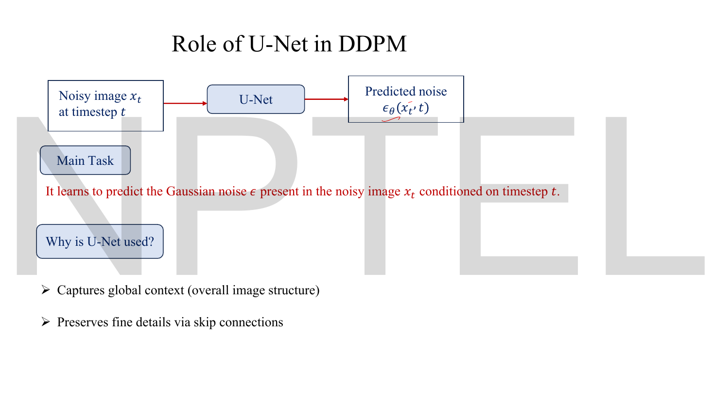
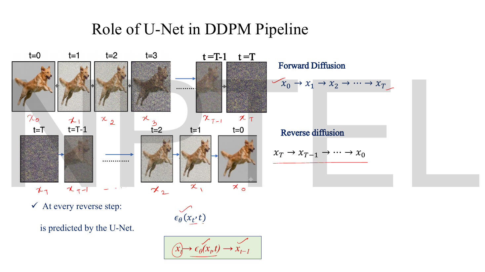
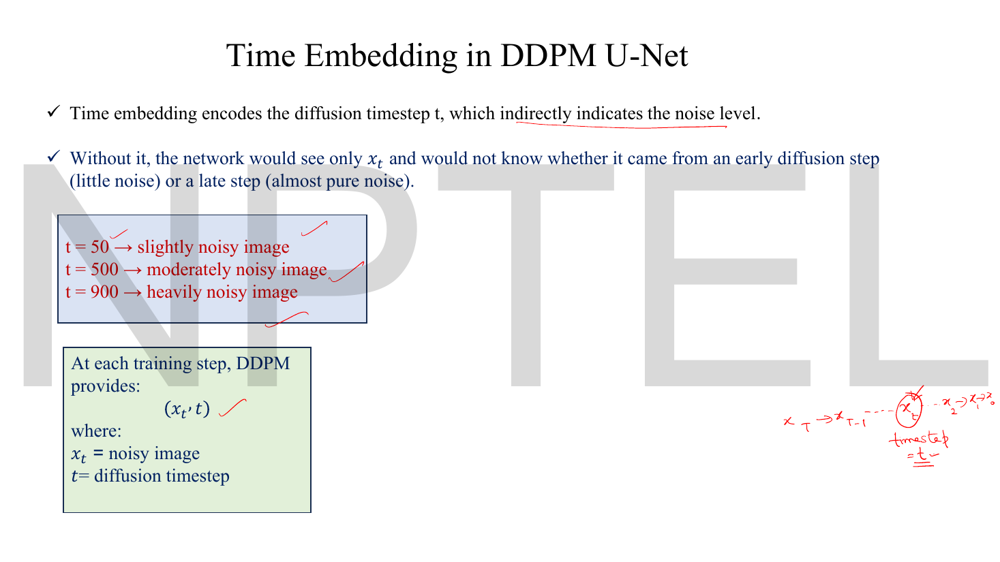
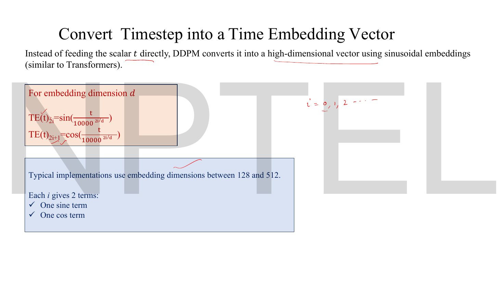
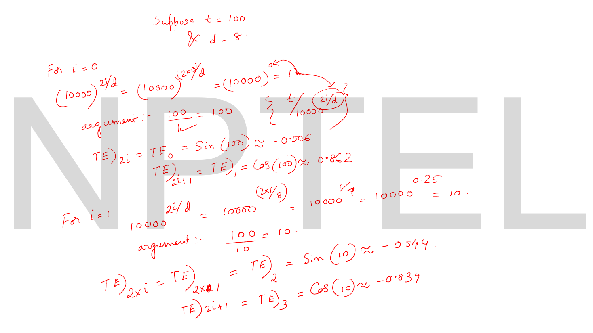
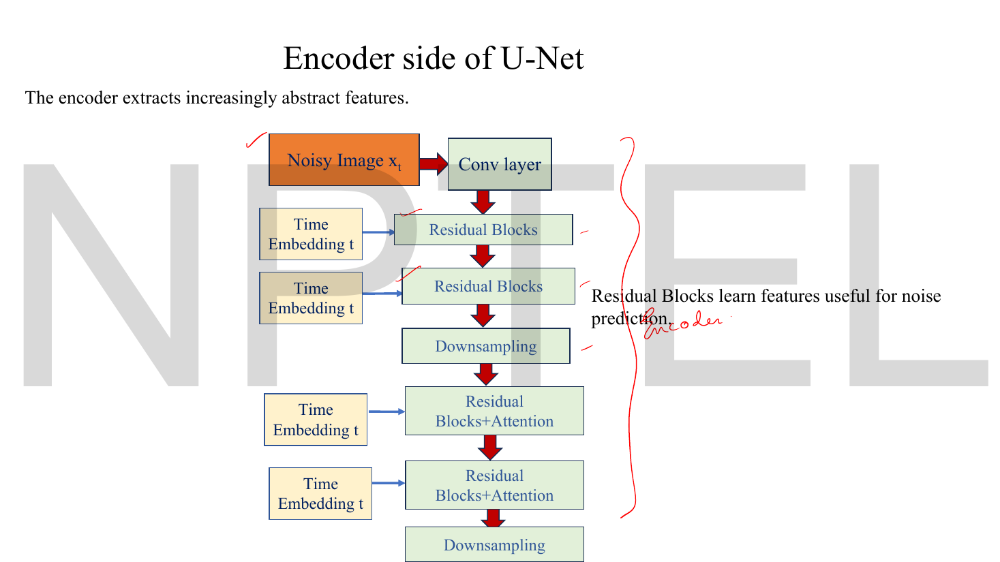
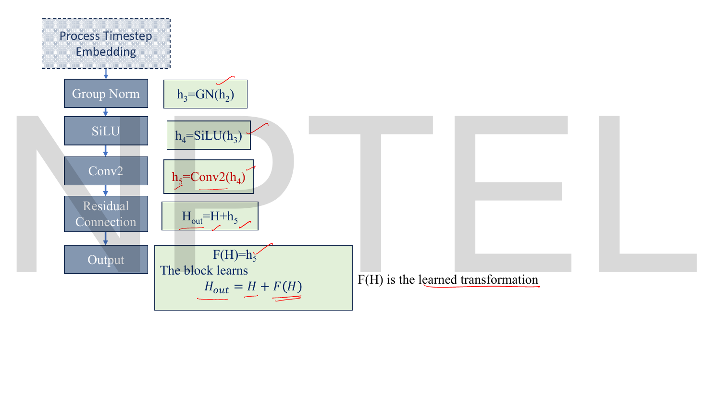
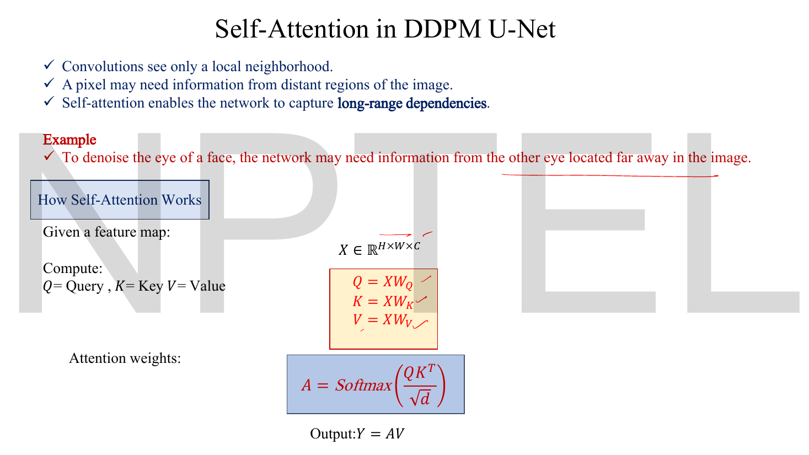

# Lec 49 — U-Net for Denoising

> **Source:** `Lec 49.pdf` (18 pages) · **Week 8** · **Playlist:** Lec 49
> **Prereqs:** [Lec 05 — Convolutional Neural Network, Part A](05-cnn-a.md), [Lec 12 — Types of Autoencoders](12-autoencoder-types.md), [Lec 42 — StyleGAN 2](42-stylegan2.md), [Lec 46 — DDPM Forward Process](46-ddpm-forward.md), [Lec 47 — DDPM Reverse Process](47-ddpm-reverse.md)
> **Feeds into:** [Lec 50 — Classifier-Guided Diffusion](50-classifier-guidance.md), [Lec 51 — Classifier-Free Diffusion](51-classifier-free-guidance.md), [Lec 52 — Stable Diffusion](52-stable-diffusion.md), [Lec 53 — Hands-on: Reverse Diffusion](53-reverse-diffusion-handson.md)

## Why this lecture exists

[Lec 47](47-ddpm-reverse.md) reduced the whole reverse process to one learned function: given a noisy image $\mathbf{x}_t$ and the timestep $t$, predict the noise $\epsilon$ that was added. [Lec 48](48-forward-diffusion-handson.md) trained a stand-in — four convolutions in a row — and got it working on MNIST. This lecture supplies the architecture that is actually used.

Two requirements fix the design. The output is a noise map, so it must be **exactly the same size and shape as the input**: $\epsilon_\theta(\mathbf{x}_t,t)$ lives in the same $H\times W\times C$ as $\mathbf{x}_t$. And one network must handle **every** noise level, so $t$ has to enter the computation. The U-Net answers the first with a contracting-then-expanding path tied together by skip connections; sinusoidal time embeddings injected into every block answer the second. Everything else here — residual blocks, group normalisation, self-attention — is in service of those two, and is owned elsewhere in this book.

## The ideas

### What the network is asked to do


*Fig. — The whole lecture in one line: $(\mathbf{x}_t, t) \to$ U-Net $\to \hat\epsilon$. The two bullets at the bottom are the deck's entire answer to "why a U-Net": global context, and fine detail preserved via skip connections. Page 3.*

The deck's statement of the task, in red on page 3: *"It learns to predict the Gaussian noise $\epsilon$ present in the noisy image $\mathbf{x}_t$ conditioned on timestep $t$."* And its two-line justification for choosing a U-Net:

- **Captures global context** (overall image structure) — that is what the contracting path buys.
- **Preserves fine details via skip connections** — that is what the expanding path would otherwise lose.


*Fig. — Where the U-Net sits in the pipeline. The boxed expression at the bottom, $\mathbf{x}_t \to \epsilon_\theta(\mathbf{x}_t,t) \to \mathbf{x}_{t-1}$, is one reverse step: the network is called **once per timestep**, so with $T=1000$ it runs 1000 times to produce one image. That is the "slow sampling" complaint about diffusion. Page 4.*

### Why the output must match the input, exactly

This is the constraint that rules out an ordinary classifier CNN. A ResNet or VGG ends in a pooled vector and a few dense layers; its output is a label, not a picture. Here the target is $\epsilon$, which has one value per pixel per channel. For a $3\times256\times256$ input the network must emit $3\times256\times256$ numbers, spatially aligned with the input — pixel $(i,j)$ of the output is the noise estimate for pixel $(i,j)$ of the input.

So the architecture must be **shape-preserving end to end**. A plain stack of same-padded convolutions does that (and is exactly what [Lec 48](48-forward-diffusion-handson.md)'s toy model is), but it has a fatal limitation: the receptive field grows by only $K-1 = 2$ pixels per $3\times3$ layer. To let a corner pixel influence the opposite corner of a $256\times256$ image you would need ~128 layers. Downsampling grows the receptive field geometrically instead — each stride-2 step doubles it. That is the "global context" bullet, made precise.

The price of downsampling is that you throw away spatial precision, and the noise map needs it back. Hence the U.

### The original U-Net, and what DDPM changed


*Fig. — The source figure, from the 2015 biomedical-segmentation paper. Read the small numbers: channels on top (1, 64, 128, 256, 512, 1024), spatial size down the left of each bar (572², 570², 568², 284², …). The green box at the lower left lists exactly what DDPM adds — **timestep embeddings, residual blocks, attention layers**. Page 5.*

The deck names the three regions:

| Region | Deck's name | What it does |
|---|---|---|
| Left arm | **Encoder (Contracting path)** | repeated conv + downsample: spatial size $\downarrow$, channels $\uparrow$ |
| Bottom | **Bottleneck** | the smallest, widest representation — maximum semantic abstraction |
| Right arm | **Decoder (Expanding path)** | repeated upsample + conv: spatial size $\uparrow$, channels $\downarrow$ |

and the grey horizontal arrows, labelled in the lecturer's handwriting, are the **skip connections**.

The original network's geometry is worth tracing once, because it is the cleanest possible exercise in [Lec 05](05-cnn-a.md)'s output-size formula. Its convolutions are $3\times3$ with **no padding** ($P = 0$), so each one loses 2 pixels per side; its pooling is $2\times2$ with $S = 2$, halving; its up-convolutions are $2\times2$ with $S=2$, doubling. That gives $572 \to 570 \to 568 \to [\text{pool}] \to 284 \to 282 \to 280 \to \ldots$ down to $28\times28$ at the bottleneck, and back up to $388\times388$. N1 works the whole chain.

> **The single most important difference for DDPM.** Because the original is unpadded, **its output ($388\times388$) is smaller than its input ($572\times572$)**. Segmentation can live with that — you tile the image. A denoiser cannot: $\epsilon_\theta$ must be the same shape as $\mathbf{x}_t$ or the loss $\lVert\epsilon-\epsilon_\theta\rVert^2$ is not even defined. **Every convolution in a DDPM U-Net is therefore same-padded** ($K=3$, $S=1$, $P=1$), so $H$ and $W$ are changed only by the explicit down/up-sampling steps. The deck shows the original figure without flagging this; it is a real gap and a clean exam discriminator.

### Skip connections: what is lost, and how it comes back

A downsampling step is lossy and irreversible. A $2\times2$ max-pool over $16\times16$ keeps 64 of 256 values and throws away *which* of the four positions each winner came from. Four stages of that, and the bottleneck knows "there is an eye, roughly here" but not where the eyelash boundary was to the pixel.

The decoder must nevertheless emit a pixel-exact noise map. It cannot invent the lost detail — so it is handed it back. At each resolution the decoder **concatenates** the encoder's feature map of the same spatial size onto its own upsampled feature map, along the channel axis:

$$\mathbf{h}_{\text{dec}}' = \operatorname{concat}\big(\text{Upsample}(\mathbf{h}_{\text{dec}}),\ \mathbf{h}_{\text{enc}}\big) \quad\Rightarrow\quad C_{\text{out}} = C_{\text{dec}} + C_{\text{enc}}$$

Three facts about this operation that MCQs key on:

1. **It is concatenation, not addition.** The deck's boxes say "Concatenate Skip Connection" in every decoder stage, and channel counts therefore *add*. When the upsampled decoder map and the encoder skip carry the same width — the usual case — **the channel count doubles at the join**: 128 + 128 = 256. (A residual connection *adds* tensors and leaves the channel count alone; that is [Lec 42](42-stylegan2.md)'s operation, inside each block. **Both kinds of skip are present in this architecture and they are not the same.**)
2. **Spatial sizes must match exactly.** In the original U-Net they do not — the encoder map is larger because of unpadded convolutions — so the figure's arrows say "copy and **crop**". With same-padding there is nothing to crop.
3. **The information that comes across is high-resolution and low-level**: edges, textures, exact boundaries. The information coming up from below is low-resolution and high-level: what the object is. The decoder gets both.

There is a second, quieter benefit: the skips give gradients a short path from the loss back to the early encoder layers, which is why deep U-Nets train at all.

### The timestep: one network, every noise level


*Fig. — The argument for time conditioning in two sentences and three examples. "Without it, the network would see only $\mathbf{x}_t$ and would not know whether it came from an early diffusion step (little noise) or a late step (almost pure noise)." Page 6.*

**Why one shared network across all $t$ is the right design.** You could in principle train 1000 separate denoisers, one per timestep. Three reasons nobody does:

- **Parameters.** A 35M-parameter U-Net × 1000 = 35 billion parameters to denoise $32\times32$ images.
- **Data.** Each network would see $1/1000$ of the training signal. The tasks at $t$ and $t+1$ are nearly identical, so splitting them wastes almost all the available supervision.
- **Smoothness.** $\bar\alpha_t$ varies continuously, so the optimal denoiser varies continuously. A single network conditioned on $t$ can *interpolate*; 1000 independent networks cannot share anything.

The cost is that the network must be told which problem it is solving, because **the input alone is ambiguous**. The deck's framing is exactly right: a mid-grey pixel is a grey pixel at $t=50$ and is noise at $t=900$, and $\mathbf{x}_t$ carries no marker of which. Formally, $\mathbf{x}_t$ has standard deviation $\approx 1$ for all large $t$ — the network cannot read the noise level off the statistics reliably enough.

### Sinusoidal time embedding


*Fig. — The same formula the Transformer uses for positional encoding ([Lec 57](57-transformer-encoder.md)), with position replaced by diffusion timestep. The handwritten "$i = 0, 1, 2 \cdots$" at the right is the index you sum over; it runs to $d/2 - 1$. Page 7.*

Instead of feeding the integer $t$ as a single number, DDPM expands it into a $d$-dimensional vector:

$$\mathrm{TE}(t)_{2i} = \sin\!\left(\frac{t}{10000^{2i/d}}\right), \qquad \mathrm{TE}(t)_{2i+1} = \cos\!\left(\frac{t}{10000^{2i/d}}\right), \qquad i = 0,1,\ldots,\tfrac{d}{2}-1$$

Each $i$ contributes **one sine and one cosine**, so $d/2$ values of $i$ fill $d$ slots. Typical $d$ is **128 to 512**.

**Why not just feed the scalar $t$?** Three reasons, none of which the deck states:

- A single input unit feeding a weight matrix gives the network one direction to move in; a 128-dimensional code gives it 128. Conditioning is far richer.
- The frequencies are **geometrically spaced**: $10000^{2i/d}$ runs from 1 up to nearly 10000, so $i=0$ oscillates once per $2\pi$ steps and the last $i$ barely completes a cycle over the whole schedule. Low-$i$ components distinguish neighbouring timesteps; high-$i$ components encode roughly where in the schedule you are. The vector is simultaneously a fine and a coarse clock.
- It is **parameter-free and defined for any real $t$** — including timesteps never seen in training, which DDIM and continuous-time samplers need. Contrast [Lec 48](48-forward-diffusion-handson.md)'s toy model, which uses a learned `nn.Embedding(1000, 64)` lookup table: 64,000 parameters, and nothing whatever connects row 500 to row 501. **The two decks disagree; the sinusoidal form is the DDPM paper's and is the one to quote.**


*Fig. — The lecturer's own arithmetic. Watch the two divisions: the denominator is $10000^{2i/d}$, which is $1$ for $i=0$ and $10$ for $i=1$, so the arguments are 100 and 10. All trigonometric arguments are **radians**. Page 9 continues the same working for $i=2$ and $i=3$, writes $\mathrm{TE}(100) = [-0.506,\ 0.862,\ -0.544,\ -0.839,\ \_,\ \_,\ \_,\ \_]$ with the last four components **left blank**, and annotates it "8 dimensional vector which is fed to the U-net architecture". N2 fills the blanks. Pages 8–9.*

### Injecting the embedding into every block


*Fig. — Count the yellow boxes. The time embedding is wired into **every** residual block separately, not fed in once at the input. That repetition is the whole conditioning mechanism. Page 10.*

A timestep embedding at the input would be diluted to nothing by the time it reached the bottleneck. So $\mathrm{TE}(t)$ is computed once and broadcast to every block, where each block has its own small linear layer to adapt it.


*Fig. — Ignore the left-hand column for a moment; it is the ordinary residual block that [Lec 42](42-stylegan2.md) owns. **The three green boxes on the right are this lecture's contribution**: $t \to \mathrm{TE}(t)$, then $\mathbf{b}_t = \mathbf{W}_t\mathrm{TE}(t)$, then the injection $\mathbf{h}_2 = \mathbf{h}_1 + \mathbf{b}_t$. Note the deck's shape key: $B$ batch, $C$ channels, $H\times W$ spatial. Page 14.*

Pages 14 and 15 walk through one residual block — $\mathrm{GN} \to \mathrm{SiLU} \to \mathrm{Conv}_1 \to \mathrm{GN} \to \mathrm{SiLU} \to \mathrm{Conv}_2$, closing with $\mathbf{H}_{\text{out}} = \mathbf{H} + F(\mathbf{H})$ where $F(\mathbf{H}) = \mathbf{h}_5$ is the learned transformation. **That identity is [Lec 42](42-stylegan2.md)'s**, derived there from information preservation; nothing is re-derived here. Two details of the deck's version are worth one line each: the activation is **SiLU**, $\mathrm{SiLU}(x) = x\,\sigma(x)$ — [Lec 02](02-activations-and-losses.md)'s page-6 table is where SiLU/Swish is mapped to diffusion models specifically — and the normalisation is **GroupNorm**, not BatchNorm, for the reason in *Beyond the slides*.

What **is** owned here is the second column, the one marked "Process Timestep Embedding":

$$t \to \mathrm{TE}(t), \qquad \mathbf{b}_t = \mathbf{W}_t\,\mathrm{TE}(t), \qquad \mathbf{h}_2 = \mathbf{h}_1 + \mathbf{b}_t$$

injected between $\mathrm{Conv}_1$ and the second normalisation. $\mathbf{W}_t$ is a **per-block** learned linear layer; the embedding $\mathrm{TE}(t)$ is shared across the whole network, but every block learns its own projection of it into its own channel count.

**How a vector adds to a feature map.** The deck writes $\mathbf{h}_2 = \mathbf{h}_1 + \mathbf{b}_t$ without saying how a length-$C$ vector adds to a $B\times C\times H\times W$ tensor. It is **broadcasting**: $\mathbf{b}_t$ is reshaped to $(B, C, 1, 1)$ and **one scalar is added to every pixel of each channel**. So the timestep acts as a per-channel, spatially uniform bias — it tells each feature detector how strongly to fire, globally, at this noise level. It cannot say anything about *where* in the image, which is correct: the noise level is a property of the whole image.


*Fig. — The closing identity, $\mathbf{H}_{\text{out}} = \mathbf{H} + F(\mathbf{H})$. This is the **residual** connection, taught in [Lec 42](42-stylegan2.md) — an addition, inside one block. It is **not** the U-Net skip connection, which is a concatenation across the whole U. Page 15.*

> **Two different "skips" in one architecture, and they are not the same operation.**
>
> | | Residual connection ([Lec 42](42-stylegan2.md)) | U-Net skip connection (owned here) |
> |---|---|---|
> | Operation | **addition**, $\mathbf{H} + F(\mathbf{H})$ | **concatenation** along the channel axis |
> | Span | two convolutions, inside one block | encoder level → matching decoder level, across the whole U |
> | Effect on channels | **unchanged** | **doubled** at the join (when the two arms are equal width) |
> | Purpose | let the block learn a correction, keep gradients flowing | hand back the spatial detail downsampling destroyed |
>
> Casual usage calls both of them "skip connections". An MCQ that says "the skip connection *adds*" is testing the residual one; one that asks for the channel count after a skip is testing the U-Net one. The deck's $\mathbf{H}_{\text{out}} = \mathbf{H} + \mathbf{h}_5$ is also only legal when $\mathbf{H}$ and $\mathbf{h}_5$ have the same channel count; when a block changes width, implementations insert a $1\times1$ convolution on the residual path, $\mathrm{Conv}_{1\times1}(\mathbf{H}) + \mathbf{h}_5$. The deck never mentions it.

### Self-attention at the low resolutions


*Fig. — The deck's example is the one to remember: "to denoise the eye of a face, the network may need information from the other eye located far away in the image." Convolution cannot do that in one layer; attention can. Page 16.*

The deck's three-bullet motivation: convolutions see only a local neighbourhood; a pixel may need information from distant regions; self-attention captures **long-range dependencies**. The mechanics are [Lec 57](57-transformer-encoder.md)'s and are not re-derived here — $\mathbf{Q} = \mathbf{X}\mathbf{W}_Q$, $\mathbf{K} = \mathbf{X}\mathbf{W}_K$, $\mathbf{V} = \mathbf{X}\mathbf{W}_V$, $\mathbf{A} = \mathrm{softmax}(\mathbf{Q}\mathbf{K}^\top/\sqrt{d_k})$, $\mathbf{Y} = \mathbf{A}\mathbf{V}$.

One thing the deck leaves out and you need: it writes $\mathbf{X}\in\mathbb{R}^{H\times W\times C}$ and then forms $\mathbf{X}\mathbf{W}_Q$, which is undefined for a rank-3 tensor. **The feature map is first flattened to $HW\times C$** — every spatial position becomes one token, with its $C$ channels as its feature vector — attention is applied, and the result is reshaped back to $H\times W\times C$. Nothing about the shape changes.

Flattening explains why attention appears only at the lower resolutions in the diagrams. The attention matrix is $HW\times HW$: at $32\times32$ that is $1024^2 = 1{,}048{,}576$ entries, at $16\times16$ it is $65{,}536$, at $8\times8$ only $4{,}096$. Cost grows with the **fourth power** of the side length. Notice in the encoder figure that the first two residual blocks have no attention and the pair after the first downsample do — attention is inserted once the map is small enough to afford it.

### The complete architecture


*Fig. — The assembled network. Trace the three dotted purple lines: they are the three skip connections, and each lands on a "Concatenate" box in the decoder. The topmost one bypasses the entire U — it carries the output of the very first convolution straight to the last block. Page 12.*


*Fig. — The decoder diagram reads **bottom to top** (the arrows point up). Note the order within each stage: **upsample first, then concatenate** — the skip is joined after the spatial sizes have been made to match. Page 11.*

Reading the deck's figures together, the forward pass is:

| Stage | Operation | Why |
|---|---|---|
| in | `Conv` $3\to C$ | lift the image into feature space; **save as skip $s_0$** |
| enc 1 | ResBlock × 2 | learn features at full resolution; **save as skip $s_1$** |
| | Downsample | halve $H,W$; double $C$ |
| enc 2 | ResBlock+Attention × 2 | features plus long-range mixing; **save as skip $s_2$** |
| | Downsample | halve again; double again |
| mid | ResBlock → Attention → ResBlock | the bottleneck: most abstract, most global |
| dec 2 | Upsample; concat $s_2$; ResBlock+Attention × 2 | restore resolution with detail handed back |
| dec 1 | Upsample; concat $s_1$; ResBlock × 2 | again |
| out | concat $s_0$; `Conv` $\to 3$ | project back to the input's channel count |

and the deck's own one-line summary, handwritten at the foot of page 11: $\mathbf{x}_t \to$ Encoder $\to$ Bottleneck $\to$ Decoder $\to \epsilon$.

**You have met this shape before.** [Lec 39](39-pix2pix.md)'s Pix2Pix generator is a U-Net with the same encoder–skip–decoder skeleton and the same argument for the skips. Three things differ here. Pix2Pix is trained **adversarially** against a PatchGAN discriminator plus an L1 term; this network is trained with plain MSE against a known noise target. Pix2Pix maps an input image to an output image in **one** forward pass; this one is called $T$ times to produce a single sample. And decisively, **Pix2Pix has no time conditioning at all** — it solves one fixed translation problem, whereas this network must solve 1000 related problems and is told which by $\mathrm{TE}(t)$. The time embedding is the one component of this architecture that has no Pix2Pix counterpart.

> **A geometric imprecision in the deck's figure.** The dotted skip arrows are drawn leaving from *below* each Downsample box, while the decoder concatenates *after* an Upsample. Taken literally the shapes cannot match — an $8\times8$ skip cannot be concatenated onto a $16\times16$ upsampled map. The consistent reading, and what every implementation does, is that the skip taps the wire **entering** the downsample, at the pre-downsample resolution. N3 works the geometry through on that reading and every shape agrees.

## Worked numericals

### N1. The original U-Net's spatial chain, end to end

**Given:** input $572\times572$; every convolution $K=3$, $S=1$, $P=0$, two per level; pooling $2\times2$, $S=2$; up-convolutions $2\times2$, $S=2$. (This is [Lec 05](05-cnn-a.md)'s formula $O = \lfloor (I - K + 2P)/S\rfloor + 1$.)
**Find:** every spatial size down and back up, and the output size.

1. Unpadded $3\times3$, $S=1$: $O = (I-3+0)/1 + 1 = I-2$. Each conv costs 2 pixels per side.
2. Pool: $O = (I-2)/2 + 1 = I/2$ for even $I$.
3. Up-conv $2\times2$, $S=2$: $O = 2I$.

| Level | after conv 1 | after conv 2 | after pool |
|---|---|---|---|
| 1 | $570$ | $568$ | $284$ |
| 2 | $282$ | $280$ | $140$ |
| 3 | $138$ | $136$ | $68$ |
| 4 | $66$ | $64$ | $32$ |
| bottleneck | $30$ | $28$ | — |

4. Up: $28\times2 = 56$; concatenate the cropped level-4 skip ($64 \to 56$); convs give $54$, then $52$.
5. Up: $52\times2 = 104$; crop level-3 skip $136 \to 104$; convs give $102$, then $100$.
6. Up: $100\times2 = 200$; crop level-2 skip $280 \to 200$; convs give $198$, then $196$.
7. Up: $196\times2 = 392$; crop level-1 skip $568 \to 392$; convs give $390$, then $388$.
8. Final $1\times1$ conv to 2 classes: $388\times388\times2$.

**Answer:** $572\times572 \to 388\times388$. Every intermediate value matches the numbers printed on the deck's figure (570, 568, 284, 282, 280, 140, 138, 136, 68, 66, 64, 32, 30, 28, 56, 54, 52, 104, 102, 100, 200, 198, 196, 392, 390, 388). The input is $(572/388)^2 = 2.17$ times larger in area than the output — which is why this exact network **cannot** be a DDPM denoiser, and why DDPM pads every convolution.

### N2. Completing the deck's time-embedding example

**Given:** $t = 100$, $d = 8$. The deck computes $i=0$ and $i=1$ and stops.
**Find:** all eight components of $\mathrm{TE}(100)$.

The denominator for index pair $i$ is $10000^{2i/8} = 10000^{i/4}$.

| $i$ | $10000^{2i/d}$ | argument $t/10000^{2i/d}$ | $\mathrm{TE}_{2i} = \sin$ | $\mathrm{TE}_{2i+1} = \cos$ |
|---|---|---|---|---|
| 0 | $10000^{0} = 1$ | $100/1 = 100$ | $\sin(100) = -0.5064$ | $\cos(100) = +0.8623$ |
| 1 | $10000^{0.25} = 10$ | $100/10 = 10$ | $\sin(10) = -0.5440$ | $\cos(10) = -0.8391$ |
| 2 | $10000^{0.50} = 100$ | $100/100 = 1$ | $\sin(1) = +0.8415$ | $\cos(1) = +0.5403$ |
| 3 | $10000^{0.75} = 1000$ | $100/1000 = 0.1$ | $\sin(0.1) = +0.0998$ | $\cos(0.1) = +0.9950$ |

1. Check the deck's two: $\sin(100\ \text{rad}) = -0.50637$ and $\cos(100) = 0.86232$ — the slide's $-0.506$ and $0.862$. ✓
2. $\sin(10) = -0.54402$, $\cos(10) = -0.83907$ — the slide's $-0.544$ and $-0.839$. ✓
3. $10000^{0.25}$: $10000 = 10^4$, so $10000^{1/4} = 10$. The slide's working shows exactly this.
4. The remaining four are computed the same way, in radians.

**Answer:** $\mathrm{TE}(100) = [-0.506,\ 0.862,\ -0.544,\ -0.839,\ 0.841,\ 0.540,\ 0.100,\ 0.995]$ — an **8-dimensional vector**, as the slide's margin note says. Both of the deck's computed values are correct. Notice the structure: as $i$ rises the argument shrinks by a factor of 10 each time, so the last pair is nearly $(\sin 0, \cos 0) = (0,1)$ — the high-$i$ components barely move between neighbouring timesteps, which is precisely the "coarse clock" behaviour.

### N3. Channel and spatial geometry of a DDPM U-Net

**Given:** input $\mathbf{x}_t$ of shape $32\times32\times3$; base width $C = 64$; three resolutions with channel multipliers $1,2,4$; all convolutions $K=3,S=1,P=1$; downsampling by stride-2 convolution; upsampling $\times2$ followed by a channel projection, so that each decoder arm meets its skip at equal width.
**Find:** $H\times W\times C$ at every stage, and the **concatenation width at each skip**.

1. `conv_in`: $K=3,S=1,P=1$ gives $O = (32-3+2)/1 + 1 = 32$. Output $32\times32\times64$. **Save $s_0 = 32\times32\times64$.**
2. Encoder level 1: two residual blocks at 64 channels, shape unchanged, $32\times32\times64$. **Save $s_1 = 32\times32\times64$.**
3. Downsample ($K=3,S=2,P=1$): $O = \lfloor(32-3+2)/2\rfloor + 1 = \lfloor 15.5\rfloor + 1 = 16$. Channels $64\to128$. Now $16\times16\times128$.
4. Encoder level 2: two ResBlock+Attention at 128, shape unchanged. **Save $s_2 = 16\times16\times128$.**
5. Downsample: $16 \to 8$, channels $128\to256$. Now $8\times8\times256$.
6. Bottleneck: ResBlock → Attention → ResBlock, all at $8\times8\times256$.
7. Upsample $\times2$ and project: $8\times8\times256 \to 16\times16\times128$.
8. **Concatenate $s_2$:** $128 + 128 = \mathbf{256}$ channels at $16\times16$ — **exactly double** the arriving width. Blocks reduce $256 \to 128$.
9. Upsample $\times2$ and project: $16\times16\times128 \to 32\times32\times64$.
10. **Concatenate $s_1$:** $64 + 64 = \mathbf{128}$ channels at $32\times32$ — **double** again. Blocks reduce $128 \to 64$.
11. **Concatenate $s_0$:** $64 + 64 = \mathbf{128}$ channels at $32\times32$ — **double** a third time.
12. `conv_out`: $128 \to 3$ channels, $K=3,S=1,P=1$, so $32\times32\times3$.

| Stage | $H\times W$ | $C$ in | $C$ after concat | $C$ out |
|---|---|---|---|---|
| `conv_in` | $32\times32$ | 3 | — | 64 |
| enc 1 | $32\times32$ | 64 | — | 64 |
| down 1 | $16\times16$ | 64 | — | 128 |
| enc 2 | $16\times16$ | 128 | — | 128 |
| down 2 | $8\times8$ | 128 | — | 256 |
| bottleneck | $8\times8$ | 256 | — | 256 |
| up 1 + concat $s_2$ | $16\times16$ | 128 | $128+128 = \mathbf{256}$ | 128 |
| up 2 + concat $s_1$ | $32\times32$ | 64 | $64+64 = \mathbf{128}$ | 64 |
| concat $s_0$ + `conv_out` | $32\times32$ | 64 | $64+64 = \mathbf{128}$ | 3 |

**Answer:** the concatenation widths are **256, 128 and 128 channels — each exactly twice the decoder's arriving width**; the output is $32\times32\times3$, **identical in shape to the input**, which is the architectural requirement. Spatial sizes run $32 \to 16 \to 8 \to 16 \to 32$; channel counts run $64 \to 128 \to 256 \to 128 \to 64 \to 3$.

Two riders. The doubling is only exact when the two arms are equal width; the general rule is always $C_{\text{out}} = C_{\text{dec}} + C_{\text{enc}}$, so an implementation that upsamples without projecting would concatenate $256+128 = 384$ here instead. And the total number of values at the bottleneck is $8\times8\times256 = 16{,}384$ against $32\times32\times3 = 3{,}072$ at the input — the "bottleneck" is **5.3× larger than the input**, exactly the overcomplete-latent situation flagged for convolutional autoencoders in [Lec 12](12-autoencoder-types.md). A U-Net's bottleneck narrows *spatially*, not in total capacity.

### N4. What time conditioning costs, per block

**Given:** a block with $C_{in} = C_{out} = 128$, two $3\times3$ convolutions with bias, two GroupNorms (8 groups), and the time projection $\mathbf{W}_t$ from $d = 256$ to 128 with bias. (The block's residual structure is [Lec 42](42-stylegan2.md)'s; what is counted here is what the timestep adds to it.)
**Find:** the total parameter count, and the share due to time conditioning.

A conv layer: $C_{in}\cdot F\cdot K^2 + F$. A GroupNorm: $2C$ (one scale and one shift per channel, regardless of group count). A Linear: $d_{in}\cdot d_{out} + d_{out}$.

| Component | Arithmetic | Parameters |
|---|---|---|
| GroupNorm 1 | $2\times128$ | 256 |
| Conv 1 | $128\times128\times9 + 128 = 147456 + 128$ | 147,584 |
| Time projection $\mathbf{W}_t$ | $256\times128 + 128 = 32768 + 128$ | 32,896 |
| GroupNorm 2 | $2\times128$ | 256 |
| Conv 2 | $128\times128\times9 + 128$ | 147,584 |

1. $256 + 147584 = 147840$.
2. $147840 + 32896 = 180736$.
3. $180736 + 256 = 180992$.
4. $180992 + 147584 = 328576$.
5. Time share: $32896/328576 = 0.1001$.

**Answer:** **328,576 parameters** per block, of which **10.0%** are the time projection. SiLU and the residual addition contribute none. If the block also changed channel width (say $64\to128$) it would need a $1\times1$ projection on the skip path, $64\times128 + 128 = 8{,}320$ more.

### N5. The cost of attention, by resolution

**Given:** self-attention applied to a feature map of side $r$ with $C$ channels, flattened to $N = r^2$ tokens.
**Find:** the size of the attention matrix at $r = 32, 16, 8$, and why attention is omitted at the top resolution.

1. Flatten: $\mathbf{X}$ becomes $N\times C$ with $N = r^2$.
2. $\mathbf{Q}\mathbf{K}^\top$ is $N\times N$, so it holds $N^2 = r^4$ entries.
3. $r=32$: $N = 1024$, $N^2 = 1{,}048{,}576$.
4. $r=16$: $N = 256$, $N^2 = 65{,}536$.
5. $r=8$: $N = 64$, $N^2 = 4{,}096$.
6. Ratio $32$ vs $16$: $1048576/65536 = 16$ — doubling the side multiplies the cost by **16**, since $r^4$.

**Answer:** $1{,}048{,}576$ / $65{,}536$ / $4{,}096$ entries. Attention is placed only at the lower resolutions because its memory and compute scale as $r^4$; at $256\times256$ the matrix would hold $4.3\times10^9$ entries, which is why [Lec 52](52-stable-diffusion.md) moves the whole U-Net into a compressed latent space instead.

### N6. Why a plain CNN cannot replace the U-Net

**Given:** a $256\times256$ image and a stack of $3\times3$, $S=1$, $P=1$ convolutions with no downsampling.
**Find:** the number of layers needed for one output pixel to depend on the whole image, and compare with a U-Net that downsamples four times.

1. Receptive field after $L$ layers of $3\times3$, stride 1: $R = 1 + L(K-1) = 1 + 2L$.
2. Need $R \ge 256$: $1 + 2L \ge 256 \Rightarrow L \ge 127.5 \Rightarrow L = 128$ layers.
3. With a downsample before each pair of convolutions, the receptive field in *input* pixels doubles per level. After $n$ levels, two $3\times3$ convs per level give roughly $R \approx 1 + 4(2^{n}-1)\cdot 1$ in input units; concretely, four downsamples put the bottleneck at $16\times16$, where a single $3\times3$ kernel already spans $3\times16 = 48$ input pixels, and a few blocks there cover the full field.
4. Cost comparison at full resolution: 128 layers of $64\times64\times9$ weights is $\approx 4.7$M parameters *and* 128 passes over $256\times256$ feature maps — a $256\times256\times64$ activation is 4.2M values held 128 times over.
5. The U-Net's deepest blocks run on $16\times16$ maps, $256$ times fewer positions.

**Answer:** **128 same-padded $3\times3$ layers** against roughly 4 downsampling levels. The U-Net gets a global receptive field for about $1/30$ of the depth, and does its most expensive work where the feature maps are smallest. Keeping the spatial precision is then the skip connections' job, which is exactly the division of labour the architecture encodes.

## Code

Build the network from the deck's own block diagram, push a $32\times32\times3$ noisy image through it with $t = 300$, and print the shape at every junction. The point of the exercise is the last line: the predicted noise comes out exactly the shape it went in.

```python
import math, torch, torch.nn as nn

def time_embedding(t, d):                        # the deck's sinusoidal formula, verbatim
    i = torch.arange(d // 2, dtype=torch.float32)
    arg = t / (10000.0 ** (2 * i / d))           # TE_2i = sin(arg), TE_2i+1 = cos(arg)
    return torch.stack([torch.sin(arg), torch.cos(arg)], dim=-1).flatten()

print("TE(100), d=8 :", [round(v, 3) for v in time_embedding(100.0, 8).tolist()])

class Block(nn.Module):                          # residual block (Lec 42) + the time injection (ours)
    def __init__(self, c_in, c_out, t_dim):
        super().__init__()
        self.n1, self.c1 = nn.GroupNorm(8, c_in),  nn.Conv2d(c_in, c_out, 3, padding=1)
        self.n2, self.c2 = nn.GroupNorm(8, c_out), nn.Conv2d(c_out, c_out, 3, padding=1)
        self.wt   = nn.Linear(t_dim, c_out)      # time projection b_t = W_t TE(t)
        self.skip = nn.Conv2d(c_in, c_out, 1) if c_in != c_out else nn.Identity()
    def forward(self, h, te):
        y = self.c1(torch.nn.functional.silu(self.n1(h)))
        y = y + self.wt(te)[:, :, None, None]    # broadcast one scalar per channel over H x W
        y = self.c2(torch.nn.functional.silu(self.n2(y)))
        return self.skip(h) + y                  # H_out = H + F(H)

x_t, te = torch.randn(1, 3, 32, 32), time_embedding(300.0, 64)[None, :]
conv_in = nn.Conv2d(3, 64, 3, padding=1)
e1, down1 = Block(64, 64, 64),   nn.Conv2d(64, 128, 3, stride=2, padding=1)
e2, down2 = Block(128, 128, 64), nn.Conv2d(128, 256, 3, stride=2, padding=1)
mid       = Block(256, 256, 64)
up   = nn.Upsample(scale_factor=2, mode="nearest")        # no transposed conv: see Lec 12
up1, d1 = nn.Conv2d(256, 128, 3, padding=1), Block(256, 128, 64)
up2, d2 = nn.Conv2d(128,  64, 3, padding=1), Block(128,  64, 64)
conv_out = nn.Conv2d(128, 3, 3, padding=1)

s0 = conv_in(x_t);                 print("conv_in  -> skip s0 ", tuple(s0.shape))
s1 = e1(s0, te);                   print("encoder level 1     ", tuple(s1.shape))
s2 = e2(down1(s1), te);            print("encoder level 2     ", tuple(s2.shape))
b  = mid(down2(s2), te);           print("bottleneck          ", tuple(b.shape))
h  = up1(up(b));                   print("upsample + project  ", tuple(h.shape))
h  = d1(torch.cat([h, s2], 1), te);print("concat s2 -> 128+128", (1, 256, 16, 16), "-> ", tuple(h.shape))
h  = up2(up(h));                   print("upsample + project  ", tuple(h.shape))
h  = d2(torch.cat([h, s1], 1), te);print("concat s1 ->  64+64 ", (1, 128, 32, 32), "-> ", tuple(h.shape))
eps = conv_out(torch.cat([h, s0], 1))
print("concat s0 + final conv -> predicted noise", tuple(eps.shape),
      " same shape as input:", eps.shape == x_t.shape)
```

```
TE(100), d=8 : [-0.506, 0.862, -0.544, -0.839, 0.841, 0.54, 0.1, 0.995]
conv_in  -> skip s0  (1, 64, 32, 32)
encoder level 1      (1, 64, 32, 32)
encoder level 2      (1, 128, 16, 16)
bottleneck           (1, 256, 8, 8)
upsample + project   (1, 128, 16, 16)
concat s2 -> 128+128 (1, 256, 16, 16) ->  (1, 128, 16, 16)
upsample + project   (1, 64, 32, 32)
concat s1 ->  64+64  (1, 128, 32, 32) ->  (1, 64, 32, 32)
concat s0 + final conv -> predicted noise (1, 3, 32, 32)  same shape as input: True
```

The first line reproduces the deck's handwritten $\mathrm{TE}(100)$ including the four components it left blank. The two `concat` lines are N3's doubling happening for real: $128 \to 256$ and $64 \to 128$, each join exactly twice the arriving width, each immediately reduced back by the block that follows. The residual arithmetic inside `Block` is [Lec 42](42-stylegan2.md)'s and is reproduced only so the script runs; the two lines that belong to *this* chapter are `self.wt` and the broadcast `+ self.wt(te)[:, :, None, None]`. Note also `nn.Upsample(mode="nearest")` followed by a plain convolution — the parameter-free upsampling route rather than transposed convolution, so there is no checkerboard artefact; [Lec 12](12-autoencoder-types.md) owns both methods and the artefact.

## Exam pack

### Must-memorise

| Item | Exactly this |
|---|---|
| What the U-Net computes | $\hat\epsilon = \epsilon_\theta(\mathbf{x}_t, t)$ |
| Shape requirement | output shape $=$ input shape, $H\times W\times C$ |
| Three regions | Encoder (contracting) · Bottleneck · Decoder (expanding) |
| Encoder trend | $H,W$ halve; $C$ doubles |
| Decoder trend | $H,W$ double; $C$ halves |
| U-Net skip (owned here) | **concatenation**, encoder → decoder, $C_{\text{out}} = C_{\text{dec}} + C_{\text{enc}}$; doubles at an equal-width join |
| Residual skip ([Lec 42](42-stylegan2.md)) | **addition**, inside a block, $\mathbf{H}_{\text{out}} = \mathbf{H} + F(\mathbf{H})$; channels unchanged |
| Decoder stage order | **upsample first, then concatenate**, then blocks |
| Why U-Net (deck's two reasons) | captures global context; preserves fine detail via skip connections |
| Sinusoidal time embedding | $\mathrm{TE}(t)_{2i} = \sin\!\big(t/10000^{2i/d}\big)$, $\mathrm{TE}(t)_{2i+1} = \cos\!\big(t/10000^{2i/d}\big)$ |
| Typical embedding dim | 128 to 512 |
| Time injection | $\mathbf{b}_t = \mathbf{W}_t\,\mathrm{TE}(t)$, then $\mathbf{h}_2 = \mathbf{h}_1 + \mathbf{b}_t$, broadcast over $H\times W$ |
| ResBlock order | GN → SiLU → Conv1 → $+\mathbf{b}_t$ → GN → SiLU → Conv2 → $+\mathbf{H}$ |
| Activation / normalisation | SiLU, $\mathrm{SiLU}(x)=x\sigma(x)$; GroupNorm |
| DDPM's three additions to the original U-Net | timestep embeddings · residual blocks · attention layers |
| Self-attention | $\mathbf{A} = \mathrm{softmax}(\mathbf{Q}\mathbf{K}^\top/\sqrt{d_k})$, $\mathbf{Y} = \mathbf{A}\mathbf{V}$, on $HW$ flattened tokens |
| Full path | $\mathbf{x}_t \to$ Encoder $\to$ Bottleneck $\to$ Decoder $\to \epsilon$ |

### Numbers worth knowing

| Quantity | Value |
|---|---|
| Original U-Net input → output | $572\times572 \to 388\times388$ |
| Its spatial chain (down) | $572,570,568 \mid 284,282,280 \mid 140,138,136 \mid 68,66,64 \mid 32,30,28$ |
| Its channel chain | $1 \to 64 \to 128 \to 256 \to 512 \to 1024$ |
| Pixels lost per unpadded $3\times3$ conv | 2 per side |
| Same-padded conv ($K=3,S=1,P=1$) | $O = I$ — the DDPM default |
| Stride-2 conv ($K=3,S=2,P=1$) | $O = \lceil I/2\rceil$ |
| $\mathrm{TE}(100)$, $d=8$ | $[-0.506, 0.862, -0.544, -0.839, 0.841, 0.540, 0.100, 0.995]$ |
| $10000^{2i/8}$ for $i = 0,1,2,3$ | $1, 10, 100, 1000$ |
| Example U-Net spatial chain ($32^2$ input) | $32 \to 16 \to 8 \to 16 \to 32$ |
| Its channel chain | $64 \to 128 \to 256 \to 128 \to 64 \to 3$ |
| Its concatenation widths | $256$, $128$, $128$ — each $2\times$ the arriving width |
| Block parameters ($C=128$, $d=256$) | 328,576, of which 32,896 (10.0%) is the time projection |
| Attention matrix at $32^2 / 16^2 / 8^2$ | $1{,}048{,}576$ / $65{,}536$ / $4{,}096$ |
| Attention cost scaling | $r^4$ in the side length |
| Plain-CNN depth for a global receptive field at $256^2$ | 128 layers |
| U-Net calls per generated image | $T$ (1000 for DDPM) |

### Likely MCQ traps

- **"Skip connections add the encoder features to the decoder features."** In a U-Net they **concatenate** — the deck's boxes read "Concatenate Skip Connection", and the channel count *doubles* at an equal-width join. Addition is the **residual** connection inside a block ([Lec 42](42-stylegan2.md)), which leaves the channel count alone. Both are called "skip connections" in speech; only one changes the width.
- **Getting the concatenation width wrong.** The rule is $C_{\text{out}} = C_{\text{dec}} + C_{\text{enc}}$, never $\max$ and never unchanged. Equal arms: $128+128 = 256$. Unequal arms: a 256-channel upsampled map with a 128-channel skip gives $384$.
- **"Concatenate, then upsample."** The deck's decoder diagram reads bottom-to-top as Upsample → Concatenate. You must match spatial sizes *before* joining the tensors.
- **Taking the original U-Net's $572 \to 388$ as the DDPM shape.** The original is unpadded and shrinks. A denoiser must preserve shape, so DDPM pads every convolution. If a question offers "the output is smaller than the input", it is testing this.
- **Confusing the U-Net bottleneck with an autoencoder bottleneck.** The U-Net's bottleneck is small *spatially* but wide in channels — in N3 it holds 16,384 values against a 3,072-value input, over five times more. Nothing is compressed in total. See [Lec 12](12-autoencoder-types.md)'s identical finding for convolutional autoencoders.
- **"The time embedding is fed in at the input."** It is injected into **every** residual block through that block's own learned $\mathbf{W}_t$. The encoder and decoder figures each show a separate Time Embedding box per block.
- **Mixing up the sine and cosine indices.** Even index $\to\sin$, odd index $\to\cos$, and the *pair* $(2i, 2i+1)$ shares one frequency $10000^{2i/d}$. For $d=8$ there are 4 frequencies and 8 components.
- **Computing $\sin$ and $\cos$ in degrees.** $\sin(100^\circ) = 0.985$; $\sin(100\ \text{rad}) = -0.506$. The deck's $-0.506$ settles it: **radians**.
- **Reading $10000^{2i/d}$ as $10000^{2i}/d$ or as $10000\cdot 2i/d$.** For $i=1,d=8$ the correct value is $10000^{0.25} = 10$.
- **"A separate network is trained for each timestep."** One shared network, conditioned on $t$. Separate networks would multiply parameters by $T$ and divide the training signal by $T$.
- **Thinking attention is applied at every resolution.** It is applied at the lower resolutions only; cost scales as $r^4$.
- **Forgetting the $1\times1$ projection when a residual block changes channels.** $\mathbf{H} + F(\mathbf{H})$ requires matching channel counts — the residual block's own problem, covered in [Lec 42](42-stylegan2.md).
- **Attributing transposed convolution to this lecture.** Upsampling, transposed convolution, $O = I + K - 1$ and the checkerboard artefact all belong to [Lec 12](12-autoencoder-types.md). The residual block belongs to [Lec 42](42-stylegan2.md). This chapter owns the **cross-U concatenation** and the **time embedding**, and nothing else.
- **Confusing this U-Net with [Lec 39](39-pix2pix.md)'s.** Pix2Pix uses a U-Net *generator* with the same encoder–skip–decoder shape, but it is trained adversarially with an L1 term, maps image→image once, and has **no time conditioning**. The DDPM U-Net is trained with plain MSE against a known noise target and is called $T$ times. The architecture is shared; the conditioning and the training signal are not.

### Self-test

1. Why must a diffusion denoiser's output have exactly the same shape as its input, and what does that rule out?
2. Give the deck's two stated reasons for choosing a U-Net.
3. A decoder stage upsamples a $256$-channel $8\times8$ map, projects it to 128 channels, and concatenates the matching $16\times16$ encoder skip of 128 channels. Give the shape after the concatenation — and the shape if the projection step were omitted.
4. Compute $\mathrm{TE}(100)_4$ and $\mathrm{TE}(100)_5$ for $d = 8$.
5. Distinguish the U-Net skip connection from the residual connection inside a block, on three axes.
6. State why one shared network across all $t$ beats 1000 per-timestep networks.
7. The deck writes $\mathbf{h}_2 = \mathbf{h}_1 + \mathbf{b}_t$ where $\mathbf{h}_1$ is $B\times C\times H\times W$ and $\mathbf{b}_t$ has length $C$. How does the addition work, and what does that imply about what the timestep can and cannot say?
8. The original U-Net turns $572\times572$ into $388\times388$. Why, and what does DDPM change?
9. Why is self-attention applied at $16\times16$ and $8\times8$ but not at $256\times256$? Give the scaling.
10. Name the three things DDPM adds to Ronneberger's U-Net, per the deck.

<details><summary>Answers</summary>

1. Because the target is $\epsilon$, which has one value per input element; the loss $\lVert\epsilon-\epsilon_\theta(\mathbf{x}_t,t)\rVert^2$ is otherwise undefined. It rules out any architecture ending in global pooling plus dense layers — i.e. every standard classifier CNN.
2. It **captures global context** (overall image structure) and **preserves fine details via skip connections**.
3. With the projection: $16\times16\times128$ upsampled, concatenated with $16\times16\times128$, gives $\mathbf{16\times16\times256}$ — **double**. Without it: $256+128 = \mathbf{16\times16\times384}$. The rule is always $C_{\text{dec}}+C_{\text{enc}}$.
4. $i=2$, so the denominator is $10000^{4/8} = 100$ and the argument is $100/100 = 1$ radian. $\mathrm{TE}_4 = \sin(1) = \mathbf{0.8415}$, $\mathrm{TE}_5 = \cos(1) = \mathbf{0.5403}$.
5. **Operation:** concatenation vs addition. **Span:** across the whole U (encoder level $\to$ matching decoder level) vs two convolutions inside one block. **Effect on channels:** sums them, $C_{\text{dec}}+C_{\text{enc}}$, doubling at an equal-width join, vs leaves them unchanged. (The residual one is [Lec 42](42-stylegan2.md)'s; the U-Net one is this chapter's.)
6. Parameters ($T\times$ the model size), data efficiency (each network would see $1/T$ of the supervision for nearly identical tasks), and smoothness — $\bar\alpha_t$ varies continuously so the optimal denoiser does too, and a conditioned network interpolates between timesteps while independent networks cannot share anything.
7. By **broadcasting**: $\mathbf{b}_t$ is reshaped to $(B,C,1,1)$ and one scalar is added to every spatial position of each channel. So the timestep supplies a per-channel, spatially uniform bias — it can tell each feature detector how strongly to respond at this noise level, but it cannot say anything location-specific. That is correct, because the noise level is a global property of the image.
8. Its $3\times3$ convolutions are **unpadded** ($P=0$), costing 2 pixels per side, 18 convolutions in total, plus the crops on the skips. DDPM uses **same padding** ($P=1$) everywhere, so only the explicit downsample/upsample steps change $H$ and $W$ and the output matches the input.
9. The feature map is flattened to $N = HW$ tokens and the attention matrix is $N\times N$, i.e. $r^4$ entries in the side length $r$. At $r=16$ that is 65,536; at $r=256$ it is $4.3\times10^9$. Doubling $r$ multiplies cost by 16.
10. **Timestep embeddings, residual blocks, and attention layers** (the green box on page 5).

</details>

## Beyond the slides

**Gap: the deck shows only one skip connection per resolution and never counts them.**
**Why it matters:** real DDPM implementations push **every** encoder block's output onto a stack and pop one per decoder block, so a U-Net with two blocks per level at three levels has 6–7 skips, not 3. Shape arithmetic in an exam will give you the skip list explicitly, but if you are reading code the stack discipline (last in, first out) is the thing to look for. The deck's figure is a legitimate simplification; the label "Simplified DDPM U-Net" admits as much.

**Gap: nothing explains why GroupNorm rather than BatchNorm.**
**Why it matters:** BatchNorm's statistics are computed over the batch, so they differ between training and inference and depend on batch size. Diffusion models train with small batches on large images and must behave identically at sampling time, when the "batch" may be a single image. GroupNorm normalises over channel groups within one sample, so it is batch-independent. This is one of the few architecture choices in diffusion that is genuinely forced, and it is the kind of "why this layer?" question an NPTEL paper likes.

**Gap: the deck never says the skip concatenation can be replaced by addition, and what is lost.**
**Why it matters:** a few architectures do add instead of concatenate, which keeps the channel count down and saves memory. It is strictly less expressive: concatenation lets the next convolution learn *separate* weights for the encoder features and the decoder features, whereas addition forces them to share a single weight per channel. Knowing the trade-off tells you why the extra memory is paid.

**Gap: the time embedding goes through an MLP in real implementations, not straight into the blocks.**
**Why it matters:** DDPM computes $\mathrm{TE}(t)$ once, then passes it through a two-layer MLP (Linear → SiLU → Linear) to a shared $4C$-dimensional vector, and *that* is what each block's $\mathbf{W}_t$ projects. The deck's $\mathbf{b}_t = \mathbf{W}_t\mathrm{TE}(t)$ compresses two stages into one. The deck's version is correct in spirit and is what to write in an exam; the MLP is why the shared embedding can be non-linear in $t$ rather than a fixed sinusoid.

**Gap: the deck gives the scale-and-shift conditioning only as an addition.**
**Why it matters:** better-performing variants (used in the guided-diffusion line that [Lec 50](50-classifier-guidance.md) and [Lec 51](51-classifier-free-guidance.md) draw on) make $\mathbf{W}_t$ emit *two* vectors and apply $\mathbf{h} \leftarrow (1+\gamma_t)\,\mathrm{GN}(\mathbf{h}) + \beta_t$ — a modulation of the normalisation rather than a bias. That is adaptive group normalisation, structurally the same idea as AdaIN in [Lec 41](41-stylegan.md). If a question offers "scale and shift" as a conditioning mechanism, it is not wrong, just a later refinement.

## Cut from the slides

Page 1 is the title card, page 2 the eight-item contents list (reproduced as this chapter's section order), and pages 17 and 18 are a bare "Summary" title slide with **no summary content on it** followed by the "Next Session: Classifier Guided Diffusion" card — nothing was lost. Page 13 is a pixel-identical repeat of page 12's complete-architecture diagram minus the coloured block labels, so only page 12 is embedded. Pages 8 and 9 are a single handwritten derivation split across two slides; both are shown because page 9 carries the conclusion and the "8 dimensional vector" annotation. The self-attention mechanics on page 16 ($\mathbf{Q},\mathbf{K},\mathbf{V}$, the softmax, the $\sqrt{d_k}$ scaling) are stated and applied but not derived — [Lec 57](57-transformer-encoder.md) owns self-attention for this book. Pages 14 and 15 are the deck's walk-through of a residual block; the $\mathbf{H}_{\text{out}} = \mathbf{H} + F(\mathbf{H})$ identity and its justification are **not** re-derived, because [Lec 42](42-stylegan2.md) owns residual blocks — only the timestep column of page 14 is taught in full here. Upsampling, transposed convolution and the checkerboard artefact are named only; [Lec 12](12-autoencoder-types.md) owns them. The output-size formula is used throughout N1 and N3 but belongs to [Lec 05](05-cnn-a.md). SiLU is written out once because the slide does; its catalogue entry and derivative belong to [Lec 02](02-activations-and-losses.md). The deck's encoder diagram (page 10) and the bottleneck/decoder pair (page 11) are reproduced in full; every box on them appears in the architecture table. The lecturer's red annotations — the "Skip Connections" label on page 5, the "Encoder" bracket on page 10, the "predicted noise" gloss on page 11 — are carried into the prose as emphasis rather than reproduced as marginalia.
