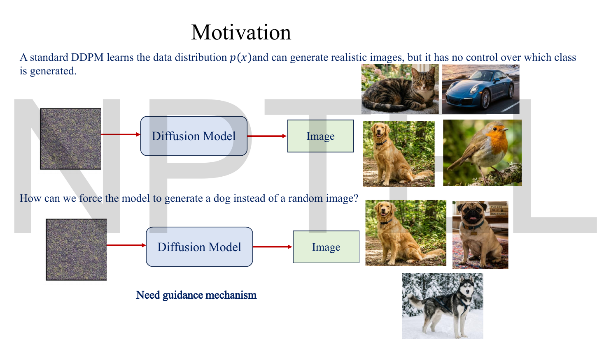
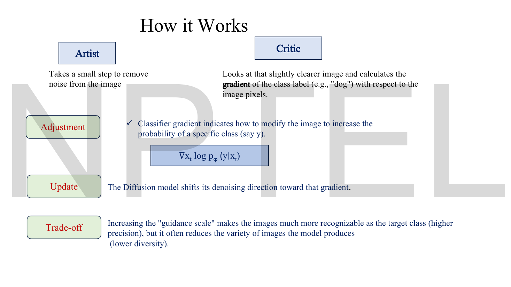
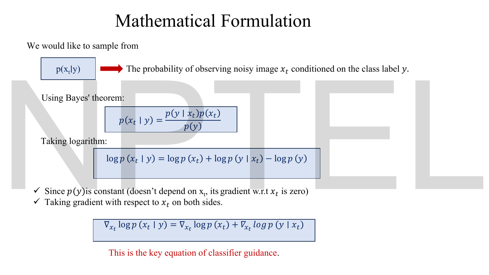
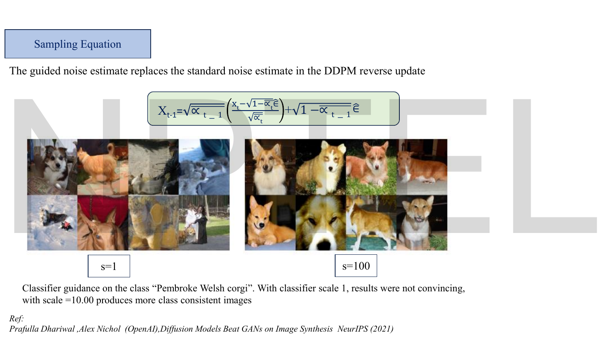
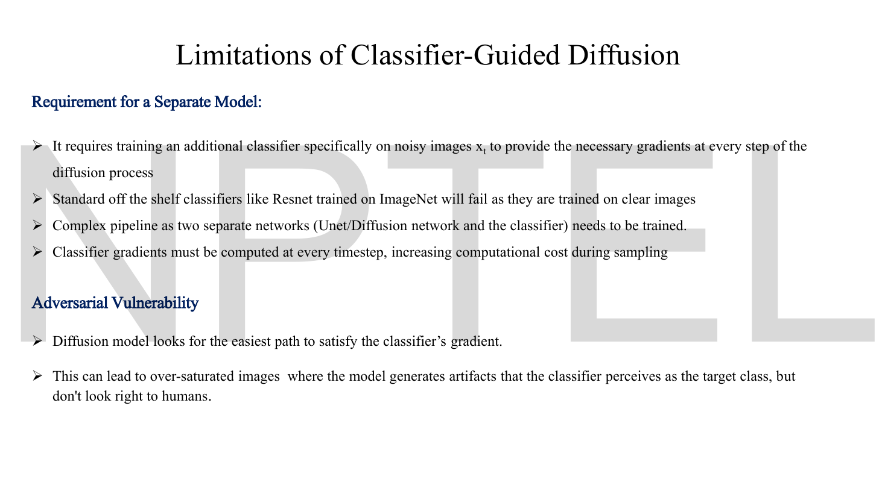

# Lec 50 — Classifier-Guided Diffusion

> **Source:** `Lec 50.pdf` (14 pages) · **Week 8** · **Playlist:** Lec 50
> **Prereqs:** [Lec 46 — DDPM Forward Process](46-ddpm-forward.md), [Lec 47 — DDPM Reverse Process](47-ddpm-reverse.md), [Lec 49 — U-Net for Denoising](49-unet.md), [Lec 19 — KL Divergence Part A](19-kl-divergence-a.md)
> **Feeds into:** [Lec 51 — Classifier-Free Diffusion Guidance](51-classifier-free-guidance.md), [Lec 52 — Stable Diffusion](52-stable-diffusion.md), [Lec 53 — Hands-on: Reverse Diffusion](53-reverse-diffusion-handson.md)

## Why this lecture exists

A trained DDPM is a machine that turns noise into *a* realistic image. Not *your* image. Feed it fresh Gaussian noise and you get a cat, or a car, or a bird — whatever the training set contained, sampled in proportion to how common it was. The model learned $p(\mathbf{x})$, the distribution of everything, and sampling from $p(\mathbf{x})$ is by definition sampling at random.

That is useless for the thing people actually want to do, which is ask for a dog and get a dog. This lecture adds the first steering mechanism: train a second network, a **classifier** that can read a *noisy* image and say which class it is, and at every reverse step push the denoising trajectory in the direction that makes that classifier more confident. One extra term in the score, one knob $s$ controlling how hard you push.

It works, and it is the method that first beat GANs on ImageNet. It is also clumsy enough that the next lecture deletes it.

## The ideas

### What the unconditional model actually gives you

Page 3 draws the problem twice. On top: noise → diffusion model → an image, and the image could be any of four things. Underneath: the same noise, the same model, and the demand that every output be a dog. Between the two rows the slide writes a three-word verdict — **"Need guidance mechanism"**.


*Fig. — The only difference between the two rows is what you want. Nothing in the trained model distinguishes them, which is exactly the problem: an unconditional DDPM has no input you can use to express a preference. Page 3.*

The deck's framing of the fix is an artist-and-critic metaphor, and it is worth keeping because it maps exactly onto the two networks:

| Component | Role on page 4 | What it actually is |
|---|---|---|
| **Diffusion model** | "an artist that knows how to denoise an image into something realistic, but does not know which class to generate" | the U-Net $\epsilon_\theta(\mathbf{x}_t, t)$ from [Lec 49](49-unet.md), trained as in [Lec 47](47-ddpm-reverse.md) |
| **Classifier** | "a critic which looks at the noisy image and predicts the probability of each class given a noisy image $\mathbf{x}_t$" | a separate network $p_\phi(y \mid \mathbf{x}_t)$ |

The slide adds in red: **"Classifier itself is a pretrained model."** Hold onto that sentence. It is the whole cost of the method, and §*Limitations* below is about nothing else.

> **Symbol warning.** This deck uses $\theta$ for the **diffusion model** and $\phi$ for the **classifier**. That is a third assignment of these two letters in this book: the VAE arc used $\theta$ = decoder, $\phi$ = encoder, and the GAN arc (errata batch 8) used $\phi$ = generator, $\theta$ = discriminator. Read $\theta$ and $\phi$ off the model in front of you, never from memory.

### The one-sentence mechanism


*Fig. — The four rows are the whole algorithm: the artist steps, the critic differentiates, the update bends the step toward that gradient, and the trade-off row already warns you that more steering means less variety. Page 5.*

Per reverse step:

1. The U-Net takes its usual small denoising step toward a slightly clearer $\mathbf{x}_t$.
2. The classifier looks at that slightly clearer image and computes $\nabla_{\mathbf{x}_t}\log p_\phi(y \mid \mathbf{x}_t)$ — the gradient of the log-probability of the *target* class with respect to the **image pixels**, not with respect to any weights.
3. The denoising direction is shifted toward that gradient.
4. A scale $s$ controls how far you shift. The slide states the consequence up front: raising $s$ makes images "much more recognizable as the target class (higher precision), but it often reduces the variety of images the model produces (lower diversity)."

Step 2 is the unusual one. Everywhere else in this course a gradient is taken with respect to *weights*, because you are training. Here the weights are frozen and you differentiate with respect to the **input**. The answer is an image-shaped object: a picture of which pixels to brighten and which to darken to make "dog" more probable. That is the GPS signal the deck's page 4 promises.

### The noisy classifier, and why it has to be noisy


*Fig. — Look at the three input images on the right: the same dog at three noise levels. All three must be classified correctly, by one network, because the sampler will consult it at every $t$. That requirement is what makes this classifier a bespoke model. Page 6.*

The classifier is written $p_\phi(y \mid \mathbf{x}_t)$ and the slide defines it in one line: "Probability that noisy image $\mathbf{x}_t$ belongs to class $y$."

Note the subscript $t$. The sampler walks $t = T, T-1, \ldots, 1$, and at $t = T$ the input is almost pure noise while at $t = 1$ it is almost a photograph. The classifier is queried at *every* one of those steps, so it must be accurate at every one of those noise levels. You therefore cannot download one. You train it yourself, on a dataset built by running the forward process of [Lec 46](46-ddpm-forward.md) over your images at randomly sampled $t$ and keeping the original label:

```text
for each training example (x_0, y):
    sample t ~ Uniform{1..T}
    sample eps ~ N(0, I)
    x_t = sqrt(alpha_bar_t) * x_0  +  sqrt(1 - alpha_bar_t) * eps     # Lec 46
    train the classifier on the pair (x_t with its t, y)
```

The classifier usually takes $t$ as a second input too, exactly as the U-Net does, because "is this a dog" is a very different question at $\bar\alpha_t = 0.99$ and at $\bar\alpha_t = 0.005$.

The deck's page 12 is blunt about the consequence: **"Standard off the shelf classifiers like ResNet trained on ImageNet will fail as they are trained on clear images."** A ResNet-50 shown $\mathbf{x}_{700}$ produces confident nonsense, and confident nonsense has a gradient, so the sampler happily follows it into garbage.

### The key equation: Bayes, then a logarithm, then a gradient


*Fig. — Three lines of school algebra and the whole method falls out. The only trick is noticing that $p(y)$ has no $\mathbf{x}_t$ in it, so it vanishes under $\nabla_{\mathbf{x}_t}$. Page 8.*

You want to sample from $p(\mathbf{x}_t \mid y)$ — "noisy images that are dogs" — but your model only knows $p(\mathbf{x}_t)$ — "noisy images". Bridge them with Bayes' rule:

$$p(\mathbf{x}_t \mid y) = \frac{p(y \mid \mathbf{x}_t)\,p(\mathbf{x}_t)}{p(y)}$$

Take natural logs, which turns the product into a sum and the quotient into a subtraction:

$$\log p(\mathbf{x}_t \mid y) = \log p(\mathbf{x}_t) + \log p(y \mid \mathbf{x}_t) - \log p(y)$$

Now differentiate both sides with respect to $\mathbf{x}_t$. The term $\log p(y)$ is the overall frequency of the class "dog" in the dataset — a fixed number like $0.001$. It contains no $\mathbf{x}_t$, so its derivative is exactly zero and it disappears:

$$\boxed{\ \nabla_{\mathbf{x}_t}\log p(\mathbf{x}_t \mid y) = \nabla_{\mathbf{x}_t}\log p(\mathbf{x}_t) + \nabla_{\mathbf{x}_t}\log p_\phi(y \mid \mathbf{x}_t)\ }$$

The slide labels this "the key equation of classifier guidance", and it deserves the label. In words:

> **conditional score = unconditional score + classifier gradient.**

A **score** here just means the gradient of a log-density with respect to the data — a vector field pointing uphill, toward where the data is dense. You already own the first term: your trained DDPM *is* a score model. The second term is a quantity a classifier can supply. Nothing else is needed.

### Converting the score into a noise prediction


*Fig. — The two annotations at the top are the cleanest statement of the split anywhere in Week 8: the left term buys you a **realistic image**, the right term buys you the **target class**. Remove either and you lose that property. Page 9.*

Your U-Net does not output a score; it outputs a noise estimate $\epsilon_\theta(\mathbf{x}_t,t)$. The deck supplies the conversion in a green box:

$$\nabla_{\mathbf{x}_t}\log p(\mathbf{x}_t) = -\frac{1}{\sqrt{1-\bar\alpha_t}}\,\epsilon_\theta(\mathbf{x}_t,t)$$

and glosses it as **"Score $=$ Constant $\times$ Noise Prediction"**. Where does it come from? From the forward process you already know. [Lec 46](46-ddpm-forward.md) gives $\mathbf{x}_t = \sqrt{\bar\alpha_t}\,\mathbf{x}_0 + \sqrt{1-\bar\alpha_t}\,\epsilon$, so conditioned on $\mathbf{x}_0$ the variable $\mathbf{x}_t$ is Gaussian with mean $\sqrt{\bar\alpha_t}\mathbf{x}_0$ and variance $(1-\bar\alpha_t)$. The gradient of a Gaussian log-density is $-(\mathbf{x}-\mu)/\sigma^2$, and $(\mathbf{x}_t - \sqrt{\bar\alpha_t}\mathbf{x}_0) = \sqrt{1-\bar\alpha_t}\,\epsilon$, so

$$\nabla_{\mathbf{x}_t}\log p = -\frac{\sqrt{1-\bar\alpha_t}\,\epsilon}{1-\bar\alpha_t} = -\frac{\epsilon}{\sqrt{1-\bar\alpha_t}}$$

and the network's job is to estimate that $\epsilon$. **The minus sign matters and is the commonest place to lose a mark**: more predicted noise means the sample sits further from the data, so the uphill direction is *minus* the noise.

The deck restates $\bar\alpha_t = \prod_{i=1}^{t}\alpha_i$ in a side box and glosses it as "the cumulative amount of original signal that remains after $t$ forward diffusion steps" — see [Lec 46](46-ddpm-forward.md), which owns it. Substituting gives the combined form:

$$\nabla_{\mathbf{x}_t}\log p(\mathbf{x}_t\mid y) = -\frac{1}{\sqrt{1-\bar\alpha_t}}\epsilon_\theta(\mathbf{x}_t,t) + \nabla_{\mathbf{x}_t}\log p_\phi(y\mid\mathbf{x}_t)$$

labelled "Old Noise" and "New gradient term", with the note that together they give "a new noise which is oriented towards a particular class".

### The guidance scale $s$, and the equation you will be asked for


*Fig. — Watch the algebra at the top: both sides get the same $-1/\sqrt{1-\bar\alpha_t}$ factor, so multiplying through by $-\sqrt{1-\bar\alpha_t}$ clears it and leaves an equation purely in noises. The grey box at the bottom is the examinable sentence. Page 10.*

Write the *conditional* score in the same noise form, by defining a guided noise estimate $\hat\epsilon(\mathbf{x}_t,t,y)$:

$$-\frac{1}{\sqrt{1-\bar\alpha_t}}\hat\epsilon(\mathbf{x}_t,t,y) = -\frac{1}{\sqrt{1-\bar\alpha_t}}\epsilon_\theta(\mathbf{x}_t,t) + \nabla_{\mathbf{x}_t}\log p_\phi(y\mid\mathbf{x}_t)$$

Multiply both sides by $-\sqrt{1-\bar\alpha_t}$. The first two terms lose their factor; the gradient term picks one up, with a sign flip:

$$\hat\epsilon(\mathbf{x}_t,t,y) = \epsilon_\theta(\mathbf{x}_t,t) - \sqrt{1-\bar\alpha_t}\;\nabla_{\mathbf{x}_t}\log p_\phi(y\mid\mathbf{x}_t)$$

Finally insert a free scalar $s$ in front of the gradient — nothing in the derivation asks for it, which is the point:

$$\boxed{\ \hat\epsilon(\mathbf{x}_t,t,y) = \epsilon_\theta(\mathbf{x}_t,t) - s\sqrt{1-\bar\alpha_t}\;\nabla_{\mathbf{x}_t}\log p_\phi(y\mid\mathbf{x}_t)\ }$$

This is **the classifier-guided noise prediction equation**, and $s$ is the **guidance scale**. Three readings of $s$ you should be able to give on demand:

- **$s = 0$** removes the gradient entirely and you are back to unconditional DDPM sampling. $s = 1$ is the mathematically "honest" value — the one Bayes' rule actually derived.
- **Mechanically**, $s$ multiplies the length of the push. Double $s$, double the displacement away from the unconditional noise estimate.
- **Distributionally**, $s$ is an exponent. Sampling with scale $s$ targets $p(\mathbf{x}_t)\,p_\phi(y\mid\mathbf{x}_t)^{s}$ rather than $p(\mathbf{x}_t)\,p_\phi(y\mid\mathbf{x}_t)$, because $s\nabla\log p = \nabla\log p^{s}$. Raising a probability vector to a power above 1 and renormalising *sharpens* it — N3 below does the arithmetic. That is the precise sense in which large $s$ destroys diversity: it is not a metaphor, it is exponentiation.

The deck's own summary, worth memorising verbatim: **"Small $s$: diverse but weak conditioning. Large $s$: strong conditioning but less diversity."**

### Where the guided noise is used


*Fig. — The two grids are the trade-off made visible. At low scale the "corgis" are a mess of half-formed animals and unrelated scenes; at high scale every tile is unmistakably a corgi, and they all look like the same corgi. Note the caption contradicts the right-hand label — see the defect note below. Page 11.*

The slide's instruction is one line: **"The guided noise estimate replaces the standard noise estimate in the DDPM reverse update."** Everything you learned in [Lec 47](47-ddpm-reverse.md) is unchanged; you substitute $\hat\epsilon$ wherever $\epsilon_\theta$ appeared. The update as printed is

$$\mathbf{x}_{t-1} = \sqrt{\bar\alpha_{t-1}}\left(\frac{\mathbf{x}_t - \sqrt{1-\bar\alpha_t}\,\hat\epsilon}{\sqrt{\bar\alpha_t}}\right) + \sqrt{1-\bar\alpha_{t-1}}\,\hat\epsilon$$

Read it as two pieces. The bracket is the model's current guess at the **clean** image, $\hat{\mathbf{x}}_0 = (\mathbf{x}_t - \sqrt{1-\bar\alpha_t}\,\hat\epsilon)/\sqrt{\bar\alpha_t}$ — just the forward equation of [Lec 46](46-ddpm-forward.md) rearranged. The update then re-noises that guess to level $t-1$: scale the clean guess by $\sqrt{\bar\alpha_{t-1}}$ and add $\sqrt{1-\bar\alpha_{t-1}}$ worth of noise. Guidance enters in both places.

> **Deck defect — this is the DDIM update, not the DDPM one.** The slide says "the DDPM reverse update", but the formula it prints re-noises with the *predicted* $\hat\epsilon$, not with a freshly drawn $\epsilon\sim\mathcal{N}(\mathbf{0},\mathbf{I})$. That makes it deterministic: the DDIM sampler at $\eta = 0$. The genuine DDPM update of [Lec 47](47-ddpm-reverse.md) adds $\sigma_t\mathbf{z}$ with $\mathbf{z}$ fresh. Both are legitimate samplers and both accept $\hat\epsilon$ in place of $\epsilon_\theta$; only the label is wrong. [Lec 53](53-reverse-diffusion-handson.md) compares the two.

### Limitations — the bill for the second network


*Fig. — Page 12 is the most important slide in the lecture for exam purposes, because Lec 51's page 3 reproduces its top half verbatim as that lecture's motivation. Every bullet here is a bullet classifier-free guidance deletes. Page 12.*

**Requirement for a separate model** — four bullets, all of them really one bullet:

1. You must train an additional classifier *specifically on noisy images* $\mathbf{x}_t$, so it can supply gradients at every step of the diffusion process.
2. Off-the-shelf classifiers (the slide names ResNet on ImageNet) **fail**, because they were trained on clear images.
3. The pipeline is complex: two separate networks — the U-Net and the classifier — must each be trained.
4. Classifier gradients must be computed at **every timestep**, raising the cost of sampling.

Items 1–3 are a *training-time* cost and item 4 is an *inference-time* cost; an MCQ may separate them. Item 4 is worse than it looks: a gradient with respect to the input needs a forward pass *and* a backward pass through the classifier, at each of $T$ steps.

**Adversarial vulnerability** — the subtler failure:

> "Diffusion model looks for the easiest path to satisfy the classifier's gradient. This can lead to over-saturated images where the model generates artifacts that the classifier perceives as the target class, but don't look right to humans."

This is the adversarial-example phenomenon running in reverse. An adversarial attack perturbs an image slightly so a classifier mislabels it; here the *sampler* is handed the classifier's gradient and told to climb it, so it finds exactly those cheap, high-confidence, perceptually wrong directions. The Code section below shows $\|\hat\epsilon\|$ growing from $0.85$ to $45.9$ as $s$ goes from 0 to 100 — the guided "noise" stops being noise-sized at all.

> **This is the hinge of Week 8.** The expensive, awkward thing is the second model. [Lec 51](51-classifier-free-guidance.md) asks: the diffusion U-Net is already a conditional model if you feed it a label — can we extract the same steering signal from it alone? The answer is yes, and the classifier disappears.

## Worked numericals

**The deck contains no worked arithmetic at all** — fourteen pages, zero numbers computed. All six below are constructed, with the deck's own equations and its $s=1$ / $s=100$ comparison as the anchors.

### N1. The score-to-noise constant

**Given:** a DDPM with $\bar\alpha_t = 0.5$ at the step in question, and a U-Net output $\epsilon_\theta(\mathbf{x}_t,t) = [0.30, -0.80]$ on a two-pixel toy image.
**Find:** the unconditional score $\nabla_{\mathbf{x}_t}\log p(\mathbf{x}_t)$.

1. The conversion factor is $-1/\sqrt{1-\bar\alpha_t}$. Here $1 - \bar\alpha_t = 1 - 0.5 = 0.5$.
2. $\sqrt{0.5} = 0.707107$, so $1/\sqrt{0.5} = 1.414214$.
3. Multiply the noise vector by $-1.414214$:
 $-1.414214 \times 0.30 = -0.424264$, and $-1.414214 \times (-0.80) = +1.131371$.

**Answer:** $\nabla_{\mathbf{x}_t}\log p(\mathbf{x}_t) = [-0.424264,\ 1.131371]$.

Sanity check the direction: pixel 1 was predicted to carry $+0.30$ of noise, so to raise the log-density you must move pixel 1 *down*. The score's first component is negative. Correct.

The constant swings hard across the schedule, which is worth a table:

| $\bar\alpha_t$ | $\sqrt{1-\bar\alpha_t}$ | $1/\sqrt{1-\bar\alpha_t}$ | regime |
|---|---|---|---|
| $0.9$ | $0.316228$ | $3.162278$ | early, nearly clean |
| $0.5$ | $0.707107$ | $1.414214$ | middle |
| $0.1$ | $0.948683$ | $1.054093$ | late, very noisy |
| $0.0047$ | $0.997647$ | $1.002358$ | $t \approx T$, nearly pure noise |

### N2. The classifier gradient for a linear softmax classifier

**Given:** a two-pixel noisy image $\mathbf{x}_t = [0.6,\ -0.2]$ and a three-class classifier $p_\phi(y\mid\mathbf{x}_t) = \mathrm{softmax}(\mathbf{W}\mathbf{x}_t)$ with no bias and
$$\mathbf{W} = \begin{bmatrix} 1 & 0 \\ 0 & 1 \\ -1 & -1 \end{bmatrix}$$
(row $k$ is the weight vector $\mathbf{w}_k$ of class $k$). The target class is $y = 1$ (the first row).
**Find:** $\nabla_{\mathbf{x}_t}\log p_\phi(y\mid\mathbf{x}_t)$.

1. Logits: $z_1 = 1(0.6) + 0(-0.2) = 0.6$; $z_2 = 0(0.6)+1(-0.2) = -0.2$; $z_3 = -1(0.6)-1(-0.2) = -0.4$.
2. Exponentiate: $e^{0.6} = 1.8221188$, $e^{-0.2} = 0.8187308$, $e^{-0.4} = 0.6703200$. Sum $= 3.3111696$.
3. Probabilities: $p_1 = 1.8221188/3.3111696 = 0.550295$, $p_2 = 0.247263$, $p_3 = 0.202442$. (Check: they sum to 1.000000.)
4. For a softmax over linear logits, $\log p_y = z_y - \log\sum_k e^{z_k}$, and differentiating in $\mathbf{x}_t$ gives
 $$\nabla_{\mathbf{x}_t}\log p_y = \mathbf{w}_y - \sum_k p_k \mathbf{w}_k$$
 — "my class's weight vector, minus the probability-weighted average of everyone's".
5. The average: $0.550295[1,0] + 0.247263[0,1] + 0.202442[-1,-1] = [0.550295-0.202442,\ 0.247263-0.202442] = [0.347853,\ 0.044821]$.
6. Subtract from $\mathbf{w}_1 = [1, 0]$: $[1 - 0.347853,\ 0 - 0.044821]$.

**Answer:** $\nabla_{\mathbf{x}_t}\log p_\phi(y{=}1\mid\mathbf{x}_t) = [0.652147,\ -0.044821]$.

Read it as an instruction to the sampler: raise pixel 1 substantially, lower pixel 2 slightly. That is the "GPS" of page 4, in numbers.

### N3. The guided noise estimate at four scales

**Given:** N1's $\bar\alpha_t = 0.5$ and $\epsilon_\theta = [0.30,-0.80]$, and N2's gradient $[0.652147,-0.044821]$.
**Find:** $\hat\epsilon$ for $s = 0, 1, 5, 10$, and its length each time.

1. The guided equation is $\hat\epsilon = \epsilon_\theta - s\sqrt{1-\bar\alpha_t}\,\nabla\log p_\phi$, and $\sqrt{1-\bar\alpha_t} = 0.707107$.
2. The unit displacement ($s=1$) is $0.707107 \times [0.652147,-0.044821] = [0.461138,\ -0.031693]$.
3. Scale it and subtract:

| $s$ | displacement $s\sqrt{1-\bar\alpha_t}\nabla$ | $\hat\epsilon$ | $\lVert\hat\epsilon\rVert$ |
|---|---|---|---|
| $0$ | $[0,\ 0]$ | $[0.300000,\ -0.800000]$ | $0.854400$ |
| $1$ | $[0.461138,\ -0.031693]$ | $[-0.161138,\ -0.768307]$ | $0.785023$ |
| $5$ | $[2.305689,\ -0.158467]$ | $[-2.005689,\ -0.641533]$ | $2.105791$ |
| $10$ | $[4.611379,\ -0.316934]$ | $[-4.311379,\ -0.483066]$ | $4.338357$ |

**Answer:** as tabulated. At $s=0$ you recover $\epsilon_\theta$ exactly; by $s=10$ the first component has been dragged from $+0.30$ to $-4.31$ and the vector is **5.1× longer** than the honest noise estimate.

That growth is the adversarial-vulnerability bullet of page 12, quantified. A true noise sample $\epsilon\sim\mathcal{N}(\mathbf{0},\mathbf{I})$ in two dimensions has expected length about $1.25$; a "noise estimate" of length 4.3 is not a plausible noise vector, so the reverse update is no longer undoing diffusion — it is dragging the sample off the data manifold toward whatever the classifier likes.

### N4. Why large $s$ costs diversity — the exponent view

**Given:** at some step the classifier's output over three classes is $p_\phi(\cdot\mid\mathbf{x}_t) = (0.50,\ 0.30,\ 0.20)$. Guidance with scale $s$ targets a density proportional to $p_\phi(y\mid\mathbf{x}_t)^{s}$.
**Find:** the effective class distribution at $s = 1, 2, 3, 10$.

1. $s=2$: raise each to the power 2 → $(0.2500,\ 0.0900,\ 0.0400)$, sum $0.3800$. Divide: $(0.657895,\ 0.236842,\ 0.105263)$.
2. $s=3$: $(0.125000,\ 0.027000,\ 0.008000)$, sum $0.160000$. Divide: $(0.781250,\ 0.168750,\ 0.050000)$.
3. $s=10$: $(0.50^{10}, 0.30^{10}, 0.20^{10}) = (9.7656\times10^{-4},\ 5.9049\times10^{-6},\ 1.024\times10^{-7})$, sum $9.8249\times10^{-4}$. Divide: $(0.993886,\ 0.006010,\ 0.000104)$.

| $s$ | effective distribution |
|---|---|
| $1$ | $(0.500000,\ 0.300000,\ 0.200000)$ |
| $2$ | $(0.657895,\ 0.236842,\ 0.105263)$ |
| $3$ | $(0.781250,\ 0.168750,\ 0.050000)$ |
| $10$ | $(0.993886,\ 0.006010,\ 0.000104)$ |

**Answer:** as tabulated. The top class climbs from 50% to 99.4%.

This is the exact mechanism behind "less diversity". Guidance does not add class information; it **sharpens** the information already there, by exponentiation. At $s \to \infty$ the distribution becomes a point mass and the model emits one image.

### N5. The cost of the classifier at sampling time

**Given:** $T = 1000$ reverse steps. One U-Net forward pass costs $1.00$ unit. The noisy classifier is one-tenth the size, so its forward pass costs $0.10$ units, and its backward pass (needed for the input gradient) costs about twice its forward pass, $0.20$ units.
**Find:** the per-image sampling cost with and without guidance, and the overhead.

1. Unguided: $1000 \times 1.00 = 1000$ units.
2. Guided, per step: $1.00$ (U-Net) $+\ 0.10$ (classifier forward) $+\ 0.20$ (classifier backward) $= 1.30$ units.
3. Guided total: $1000 \times 1.30 = 1300$ units.
4. Overhead: $(1300-1000)/1000 = 0.30$.

**Answer:** $1000$ vs $1300$ units — a **30% inference overhead**, on top of a whole extra training run. Note that the training cost is the headline complaint, not this; but page 12 lists both separately and an exam can ask for either.

### N6. One guided reverse step, end to end

**Given:** $\mathbf{x}_t = [0.6,-0.2]$, $\bar\alpha_t = 0.5$, $\bar\alpha_{t-1} = 0.6$, and the $s=1$ guided noise from N3, $\hat\epsilon = [-0.161138,\ -0.768307]$.
**Find:** $\mathbf{x}_{t-1}$ using the deck's page-11 update.

1. Predicted clean image: $\hat{\mathbf{x}}_0 = (\mathbf{x}_t - \sqrt{1-\bar\alpha_t}\,\hat\epsilon)/\sqrt{\bar\alpha_t}$.
 Numerator: $[0.6,-0.2] - 0.707107[-0.161138,-0.768307] = [0.6+0.113942,\ -0.2+0.543274] = [0.713942,\ 0.343274]$.
 Divide by $\sqrt{0.5} = 0.707107$: $\hat{\mathbf{x}}_0 = [1.009666,\ 0.485464]$.
2. Re-noise to level $t-1$: $\sqrt{\bar\alpha_{t-1}} = \sqrt{0.6} = 0.774597$ and $\sqrt{1-\bar\alpha_{t-1}} = \sqrt{0.4} = 0.632456$.
3. First term: $0.774597 \times [1.009666, 0.485464] = [0.782084,\ 0.376040]$.
4. Second term: $0.632456 \times [-0.161138,-0.768307] = [-0.101913,\ -0.485920]$.
5. Add: $[0.782084 - 0.101913,\ 0.376040 - 0.485920]$.

**Answer:** $\mathbf{x}_{t-1} = [0.680171,\ -0.109880]$.

Compare with the unguided step ($s=0$, $\hat\epsilon = \epsilon_\theta$), which gives $\hat{\mathbf{x}}_0 = [0.548528,\ 0.517157]$ and $\mathbf{x}_{t-1} = [0.614625,\ -0.105376]$. Look at the **predicted clean image**, not at $\mathbf{x}_{t-1}$: guidance moved $\hat{x}_{0,1}$ from $0.549$ to $1.010$, nearly doubling it, which is exactly the instruction N2's gradient gave ("raise pixel 1"). The visible change in $\mathbf{x}_{t-1}$ is much smaller, $0.6146 \to 0.6802$, because one step only advances $\bar\alpha$ from $0.5$ to $0.6$. **Guidance is not a single nudge; it compounds over the whole trajectory** — 999 more steps each push the same way. That is why even $s=1$ changes the output completely.

## Code

Fifty lines of NumPy reproduce every claim on pages 9–12: the gradient, the guided noise, the growth of $\|\hat\epsilon\|$, and the class probability rising as $s$ rises. No deep-learning framework is needed because a linear softmax has a closed-form input gradient (N2).

```python
import numpy as np

# A 2-D stand-in for a noisy image x_t, and a linear-softmax "noisy classifier"
# p_phi(y | x_t) = softmax(W x_t).  Target class y = 0 (0-indexed first row).
x_t = np.array([0.6, -0.2])
W   = np.array([[1., 0.], [0., 1.], [-1., -1.]])
y   = 0

def probs(x):
    z = W @ x
    e = np.exp(z - z.max())          # stable softmax
    return e / e.sum()

p = probs(x_t)
print("class probabilities p_phi(.|x_t) =", np.round(p, 4))

# input gradient of a linear softmax:  grad log p_y = w_y - sum_k p_k w_k
grad = W[y] - p @ W
print("grad_x log p_phi(y|x_t)          =", np.round(grad, 6))

# guided noise:  eps_hat = eps_theta - s * sqrt(1 - alpha_bar_t) * grad
alpha_bar_t = 0.5
eps_theta   = np.array([0.30, -0.80])
print(f"\n{'s':>4} {'eps_hat':>24} {'||eps_hat||':>12} {'p(y|x_0_hat)':>14}")
for s in [0, 1, 5, 10, 100]:
    eps_hat = eps_theta - s * np.sqrt(1 - alpha_bar_t) * grad
    # implied clean sample: x_0 = (x_t - sqrt(1-ab) * eps_hat) / sqrt(ab)
    x0 = (x_t - np.sqrt(1 - alpha_bar_t) * eps_hat) / np.sqrt(alpha_bar_t)
    print(f"{s:>4} {str(np.round(eps_hat, 4)):>24} {np.linalg.norm(eps_hat):>12.4f}"
          f" {probs(x0)[y]:>14.6f}")
```

```
class probabilities p_phi(.|x_t) = [0.5503 0.2473 0.2024]
grad_x log p_phi(y|x_t)          = [ 0.652147 -0.044821]

   s                  eps_hat  ||eps_hat||   p(y|x_0_hat)
   0              [ 0.3 -0.8]       0.8544       0.461220
   1        [-0.1611 -0.7683]       0.7850       0.597472
   5        [-2.0057 -0.6415]       2.1058       0.921854
  10        [-4.3114 -0.4831]       4.3384       0.993007
 100      [-45.8138   2.3693]      45.8750       1.000000
```

Three things to take from the output. **Guidance works**: the predicted clean image's class probability climbs $0.461 \to 0.597 \to 0.922 \to 0.993$ as $s$ rises. **It works by brute force**: $\|\hat\epsilon\|$ climbs from $0.85$ to $45.88$, i.e. the "noise estimate" becomes 54× larger than the model's own honest estimate — and vastly larger than any noise the forward process of [Lec 46](46-ddpm-forward.md) ever added. And **the last row is the adversarial failure mode on page 12**: at $s=100$ the classifier is certain, and the image it is certain about is a vector 45 units long in a space where the data lives within a couple of units of the origin. Certainty without realism is exactly the over-saturation complaint.

## Exam pack

### Must-memorise

| Item | Exactly this |
|---|---|
| The key equation | $\nabla_{\mathbf{x}_t}\log p(\mathbf{x}_t\mid y) = \nabla_{\mathbf{x}_t}\log p(\mathbf{x}_t) + \nabla_{\mathbf{x}_t}\log p_\phi(y\mid\mathbf{x}_t)$ |
| In words | conditional score $=$ unconditional score $+$ classifier gradient |
| Bayes step it comes from | $p(\mathbf{x}_t\mid y) = p(y\mid\mathbf{x}_t)p(\mathbf{x}_t)/p(y)$ |
| Why $p(y)$ drops out | it does not depend on $\mathbf{x}_t$, so $\nabla_{\mathbf{x}_t}\log p(y) = \mathbf{0}$ |
| Score ↔ noise | $\nabla_{\mathbf{x}_t}\log p(\mathbf{x}_t) = -\dfrac{1}{\sqrt{1-\bar\alpha_t}}\epsilon_\theta(\mathbf{x}_t,t)$ |
| Deck's gloss of it | Score $=$ Constant $\times$ Noise Prediction |
| **Guided noise prediction** | $\hat\epsilon(\mathbf{x}_t,t,y) = \epsilon_\theta(\mathbf{x}_t,t) - s\sqrt{1-\bar\alpha_t}\,\nabla_{\mathbf{x}_t}\log p_\phi(y\mid\mathbf{x}_t)$ |
| The classifier | $p_\phi(y\mid\mathbf{x}_t)$ — probability that the **noisy** image $\mathbf{x}_t$ belongs to class $y$ |
| Guidance scale | $s$; small $s$ = diverse but weak conditioning, large $s$ = strong conditioning but less diversity |
| $\bar\alpha_t$ | $\prod_{i=1}^{t}\alpha_i$ — cumulative signal surviving $t$ forward steps ([Lec 46](46-ddpm-forward.md)) |
| Sampling rule | the guided $\hat\epsilon$ **replaces** $\epsilon_\theta$ in the reverse update; nothing else changes |
| The two limitation headings | *Requirement for a Separate Model* · *Adversarial Vulnerability* |
| The paper | Dhariwal & Nichol, *Diffusion Models Beat GANs on Image Synthesis*, NeurIPS 2021 |

### Numbers worth knowing

| Quantity | Value |
|---|---|
| Deck's visual comparison | classifier guidance on "Pembroke Welsh corgi" at $s=1$ vs the label $s=100$ (caption says 10.00 — see traps) |
| $s$ that recovers unconditional DDPM | $s = 0$ |
| $s$ Bayes' rule actually derives | $s = 1$ |
| Score constant at $\bar\alpha_t = 0.5$ | $-1/\sqrt{0.5} = -1.414214$ |
| Score constant at $\bar\alpha_t = 0.9$ | $-3.162278$ |
| Effective class distribution, $p=(0.5,0.3,0.2)$, $s=3$ | $(0.78125,\ 0.16875,\ 0.05)$ |
| Same at $s=10$ | $(0.993886,\ 0.006010,\ 0.000104)$ |
| Networks that must be trained | **2** (U-Net + noisy classifier) |
| Extra passes per reverse step | 1 classifier forward + 1 classifier backward |
| N5's sampling overhead | 30% |
| N3: $\lVert\hat\epsilon\rVert$ at $s=0$ vs $s=10$ | $0.8544$ vs $4.3384$ |
| Code: $p(y\mid\hat{\mathbf{x}}_0)$ at $s=0,1,5,10$ | $0.461,\ 0.597,\ 0.922,\ 0.993$ |

### Likely MCQ traps

- **"The gradient is taken with respect to the classifier's weights."** No. It is $\nabla_{\mathbf{x}_t}$ — with respect to the **input pixels**. The classifier's weights are frozen; nothing is being trained at sampling time. This is the single most common misreading of the whole lecture.
- **Dropping the minus sign in the score–noise identity.** It is $-\epsilon_\theta/\sqrt{1-\bar\alpha_t}$. More predicted noise means lower density, so uphill is the opposite direction. Get this wrong and your guided sampler walks away from the data.
- **Putting $\sqrt{1-\bar\alpha_t}$ in the denominator of the guided noise equation.** The score has $1/\sqrt{1-\bar\alpha_t}$; the *noise* equation has $\sqrt{1-\bar\alpha_t}$ as a **multiplier**, because clearing the factor from both sides moves it. Final form: $\epsilon_\theta - s\sqrt{1-\bar\alpha_t}\nabla\log p_\phi$.
- **Thinking an ImageNet ResNet will do.** Page 12 names this explicitly: off-the-shelf classifiers are trained on *clear* images and fail on $\mathbf{x}_t$. The classifier must be retrained on noised data across the whole schedule.
- **"Larger $s$ gives better images."** It gives *more class-consistent* images and *less diverse* ones, and past some point it gives over-saturated adversarial artefacts. The deck's own words are "higher precision … lower diversity".
- **$\phi$ rendered as $\varnothing$.** Pages 9 and 10 print $p_\phi$ with a slashed-zero glyph that looks like the empty set $\varnothing$ — the same font defect flagged in Lec 22 and Lec 32. **Here it is genuinely dangerous**, because in [Lec 51](51-classifier-free-guidance.md) the symbol $\varnothing$ *does* mean something: the null token. On this deck it only ever means "classifier parameters".
- **Confusing the two ways $s$ is described.** Mechanically $s$ multiplies a displacement; distributionally $s$ is an **exponent** on $p_\phi(y\mid\mathbf{x}_t)$. Both are correct and describe the same operation.
- **Assuming guidance changes training.** It does not touch the DDPM's training at all. The diffusion model is trained unconditionally and exactly as in [Lec 47](47-ddpm-reverse.md); guidance is a *sampling-time* modification. (Classifier-free guidance, by contrast, changes **training** and not the sampler's structure — that inversion is the discrimination [Lec 51](51-classifier-free-guidance.md) owns.)
- **The page-11 label.** The right-hand grid is labelled $s=100$ but the caption underneath says "with scale $=10.00$". The source paper used scale 10.0. If an MCQ offers both, the figure in Dhariwal & Nichol is 1.0 vs 10.0.
- **Calling the page-11 formula the DDPM update.** As printed it is the DDIM (deterministic) update — it re-noises with $\hat\epsilon$ rather than a fresh $\mathcal{N}(\mathbf{0},\mathbf{I})$ draw.

### Self-test

1. State the key equation of classifier guidance and say in one sentence what each of its three terms buys you.
2. Why does $\log p(y)$ vanish when you take $\nabla_{\mathbf{x}_t}$?
3. A U-Net outputs $\epsilon_\theta = [0.2, -0.6]$ at a step where $\bar\alpha_t = 0.75$. Compute the unconditional score.
4. Using the same step, with $\nabla_{\mathbf{x}_t}\log p_\phi(y\mid\mathbf{x}_t) = [1.0, 0.5]$ and $s = 4$, compute $\hat\epsilon$.
5. Why can you not use a pretrained ImageNet classifier for $p_\phi$?
6. With respect to *what* is the classifier gradient taken, and what shape is the result?
7. A classifier gives $(0.6, 0.4)$ over two classes. What effective distribution does $s = 5$ target?
8. Name the two limitation headings on page 12, and give one bullet from each.
9. At $s = 0$, what does the guided sampler do?
10. Does classifier guidance change how the diffusion model is *trained*? Justify.

<details><summary>Answers</summary>

1. $\nabla_{\mathbf{x}_t}\log p(\mathbf{x}_t\mid y) = \nabla_{\mathbf{x}_t}\log p(\mathbf{x}_t) + \nabla_{\mathbf{x}_t}\log p_\phi(y\mid\mathbf{x}_t)$. Left side: the direction that makes a *class-$y$ noisy image* more probable. First right term (page 9's "REALISTIC IMAGE"): the unconditional score your DDPM already provides. Second right term ("TARGET CLASS"): the classifier gradient that supplies the class information.
2. Because $p(y)$ is the prior frequency of class $y$ — a constant with no $\mathbf{x}_t$ in it. The derivative of a constant is zero.
3. $1-\bar\alpha_t = 0.25$, $\sqrt{0.25} = 0.5$, so the factor is $-1/0.5 = -2$. Score $= -2[0.2,-0.6] = [-0.4,\ 1.2]$.
4. $\hat\epsilon = [0.2,-0.6] - 4(0.5)[1.0,0.5] = [0.2,-0.6] - [2.0,\ 1.0] = [-1.8,\ -1.6]$.
5. It was trained on clean images. The sampler queries the classifier on $\mathbf{x}_t$ at every noise level from nearly-pure-noise to nearly-clean; a clean-image classifier is wrong on most of that range, and its gradients then steer the sampler into nonsense.
6. With respect to the **input** $\mathbf{x}_t$ — the pixels — with the classifier's weights frozen. The result has the same shape as the image: one number per pixel.
7. $(0.6^5, 0.4^5) = (0.07776,\ 0.01024)$, sum $0.088$. Normalised: $(0.883636,\ 0.116364)$. A 60/40 split becomes 88/12.
8. *Requirement for a Separate Model* — e.g. "it requires training an additional classifier specifically on noisy images $\mathbf{x}_t$", or "classifier gradients must be computed at every timestep". *Adversarial Vulnerability* — e.g. "the diffusion model looks for the easiest path to satisfy the classifier's gradient", producing over-saturated images with artefacts the classifier reads as the class but humans do not.
9. Exactly unconditional DDPM sampling: $\hat\epsilon = \epsilon_\theta$, the gradient term is annihilated, and you get a random class.
10. No. The DDPM is trained unconditionally, unchanged from [Lec 47](47-ddpm-reverse.md); guidance is applied only at sampling time by substituting $\hat\epsilon$ for $\epsilon_\theta$. (The *classifier* needs its own separate training run — that is a different model, and it is the cost [Lec 51](51-classifier-free-guidance.md) removes.)

</details>

## Beyond the slides

**Gap: the deck never derives the score–noise identity, it asserts it.**
**Why it matters:** the identity $\nabla_{\mathbf{x}_t}\log p(\mathbf{x}_t) = -\epsilon_\theta/\sqrt{1-\bar\alpha_t}$ is the bridge between two whole literatures — DDPM's "predict the noise" and score matching's "predict the gradient of the log-density". The derivation above (Gaussian score $-(\mathbf{x}-\mu)/\sigma^2$, with $\mathbf{x}_t - \sqrt{\bar\alpha_t}\mathbf{x}_0 = \sqrt{1-\bar\alpha_t}\,\epsilon$ from [Lec 46](46-ddpm-forward.md)) takes two lines and makes the minus sign memorable instead of memorised. It is also the reason [Lec 13](13-denoising-ae.md)'s denoising autoencoder is the ancestor of this entire arc: a denoiser *is* a score estimator.

**Gap: the deck gives no actual values of $s$ beyond the two in its figure, and no guidance on choosing one.**
**Why it matters:** the original Dhariwal–Nichol work uses classifier scales in the range 1–10 for ImageNet, and the deck's page-11 label of 100 is almost certainly a typo for 10. More importantly, there is no "correct" $s$: it is a dial on a **fidelity–diversity curve**, and papers report it as such by plotting FID (which rewards diversity and gets *worse* with heavy guidance) against Inception Score or precision (which reward class-consistency and get *better*). If an exam asks "what happens to FID as $s$ increases", the answer is that it falls then rises — guidance helps up to a point and then over-sharpens.

**Gap: nothing says *where* in the U-Net the gradient is applied, and the slides contradict themselves.**
**Why it matters:** page 7's fourth bullet says "the gradient from the classifier is also given as input to the U-Net", and its diagram draws an arrow into the U-Net box. That is misleading. The gradient is **not** an input to the network — the U-Net's weights and inputs are untouched. It is added to the network's *output*, after the forward pass, in the $\hat\epsilon$ equation of page 10. The equation is correct; the diagram is a simplification. If a question offers "the classifier gradient is concatenated to the U-Net's input channels", that is false for classifier guidance (it *is* roughly what spatial conditioning does in [Lec 52](52-stable-diffusion.md), which is a different mechanism).

**Gap: guidance is presented only for class labels.**
**Why it matters:** nothing in the derivation requires $y$ to be a class. Any differentiable scorer $p_\phi(y\mid\mathbf{x}_t)$ works — a CLIP text-image similarity, an aesthetic predictor, a face-identity network. This generality is why guidance survived even after classifier-free guidance won: modern systems still bolt classifier-style gradients on for things no one wants to retrain the base model for. The structural requirement is only that the scorer be differentiable in $\mathbf{x}_t$ and valid on noisy inputs.

**Gap: no mention that guidance was what made diffusion beat GANs.**
**Why it matters:** the paper cited on pages 4 and 11 is titled *Diffusion Models Beat GANs on Image Synthesis*, and the claim in the title is only true **with** guidance. Unguided diffusion already beat GANs on diversity and mode coverage — the complaint [Lec 34](34-gan-convergence.md) records against GANs — but lost on per-sample fidelity. Guidance trades exactly the surplus (diversity) for exactly the deficit (fidelity), which is why one scalar knob was enough to flip the comparison. That framing makes the whole lecture one move in the GAN-versus-diffusion argument the course has been running since [Lec 44](44-diffusion-intro.md).

## Cut from the slides

Pages 1, 2, 13 and 14 are the title card, the contents list, a bare "Summary" title card with no summary on it, and the "Next Session: Classifier Free Guidance" card — nothing was lost. Page 4's artist/critic metaphor and page 5's four-row breakdown overlap heavily, so page 4 is compressed into the two-row table and only page 5 is embedded. Page 7 ("Sampling in Classifier-Guided Diffusion") restates page 5's loop with a diagram; its four bullets are folded into the prose and its one genuinely new claim — that the gradient is "given as input to the U-Net" — is corrected in *Beyond the slides* rather than reproduced, because taken literally it contradicts page 10. The deck's photograph grids on pages 3 and 11 are reproduced as figures; the individual animal photographs on page 3 carry no information beyond "these are different classes". Page 6's reverse-transition formula $p_\theta(\mathbf{x}_{t-1}\mid\mathbf{x}_t) = \mathcal{N}(\mu_\theta(\mathbf{x}_t,t), \Sigma_\theta(\mathbf{x}_t,t))$ — printed without the comma between its two arguments — is owned by [Lec 47](47-ddpm-reverse.md) and only referenced here. Everything else on pages 3 through 12 is reproduced in full.
