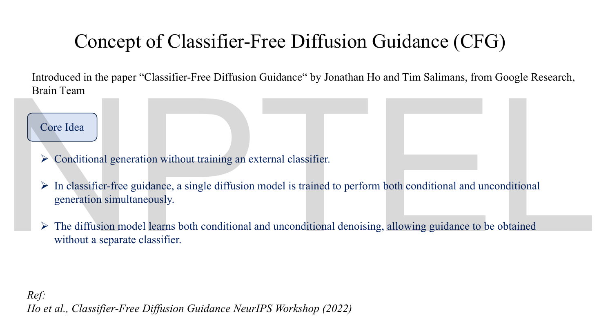
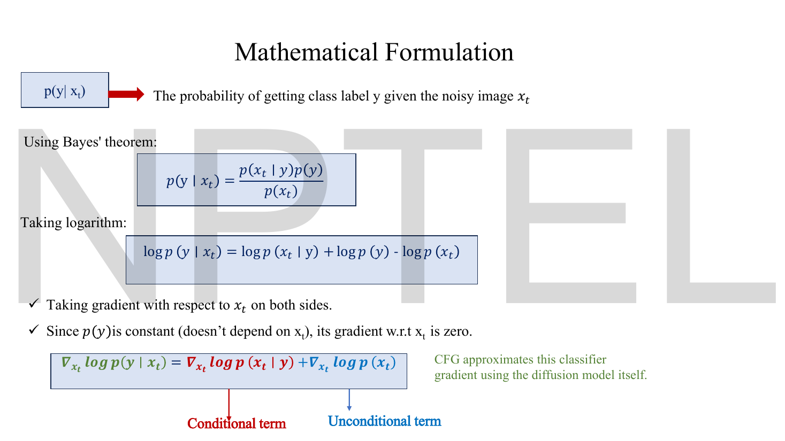
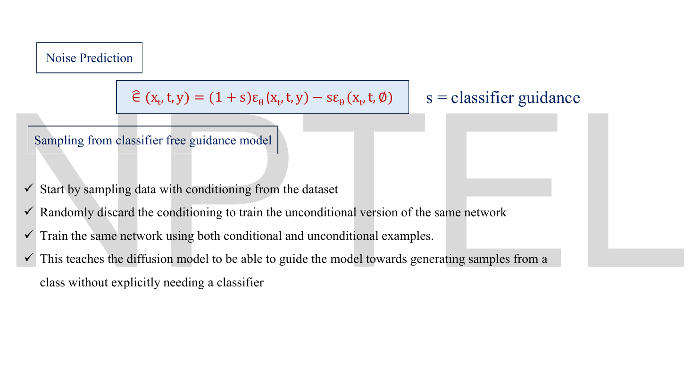

# Lec 51 — Classifier-Free Diffusion Guidance (CFG)

> **Source:** `Lec 51.pdf` (11 pages) · **Week 8** · **Playlist:** Lec 51
> **Prereqs:** [Lec 50 — Classifier-Guided Diffusion](50-classifier-guidance.md), [Lec 47 — DDPM Reverse Process](47-ddpm-reverse.md), [Lec 49 — U-Net for Denoising](49-unet.md)
> **Feeds into:** [Lec 52 — Stable Diffusion](52-stable-diffusion.md), [Lec 53 — Hands-on: Reverse Diffusion](53-reverse-diffusion-handson.md)

## Why this lecture exists

[Lec 50](50-classifier-guidance.md) bought you steering at the price of a second network — a classifier trained from scratch on noisy images at every point of the schedule, queried forward and backward at every reverse step. The slides of this lecture open by reprinting that bill, unchanged, as the motivation.

The fix is almost embarrassingly simple. The U-Net can already take a condition $y$ as an input; so train it to accept $y$ *and* to accept nothing, by randomly throwing the label away during training. Then at sampling time run it twice — once with the condition, once without — and **extrapolate** along the line from the unconditional prediction through the conditional one. The difference between the two outputs is the steering signal the classifier used to provide, and it comes free from a model you were training anyway.

This is the method that every text-to-image system you have used actually runs, which is why it gets its own lecture and its own comparison table.

## The ideas

### The bill, reprinted


*Fig. — Every word here is copied from [Lec 50](50-classifier-guidance.md)'s page 12. Treat the four bullets as a checklist: by the end of this lecture all four are gone. Page 3.*

The four complaints, in the deck's order:

1. An **additional classifier** must be trained, specifically on noisy images $\mathbf{x}_t$.
2. **Off-the-shelf classifiers fail** — a ResNet trained on ImageNet has only seen clear images.
3. The pipeline is **complex**: two separate networks to train.
4. Classifier gradients must be computed at **every timestep**, raising sampling cost.

Note what is *not* on the list. "Guidance doesn't work" is not a complaint; classifier guidance works fine. The objection is entirely about the second model.

### The core idea


*Fig. — The middle bullet is the whole lecture in one sentence: **one** diffusion model trained to do both jobs. Everything after this is bookkeeping. Page 4.*

The deck's three bullets:

- Conditional generation **without training an external classifier**.
- A **single diffusion model** is trained to perform both conditional and unconditional generation simultaneously.
- The model learns both conditional and unconditional denoising, so guidance can be obtained without a separate classifier.

The reference is Ho & Salimans, *Classifier-Free Diffusion Guidance*, NeurIPS Workshop 2021 (the deck prints 2022).

### Training one network to be two networks


*Fig. — One box, two arrows. The network is not two networks and does not have two heads; it is one network that sometimes receives a label and sometimes receives a placeholder. The green annotation at the bottom right defines $\varnothing$ as the null token, "the absence of conditioning information". Page 5.*

Start from an ordinary **conditional** diffusion model $\epsilon_\theta(\mathbf{x}_t, t, y)$ — the U-Net of [Lec 49](49-unet.md) with one extra input for the condition, exactly the way a conditional GAN takes a label ([Lec 38](38-conditional-gan.md)) or a conditional VAE does ([Lec 27](27-conditional-vae.md)). Train it with the usual noise-prediction loss of [Lec 47](47-ddpm-reverse.md). One change:

> **With a fixed probability $p_{\text{drop}}$ — the deck says "usually 10 to 20 percent" — replace the label with a special null token $\varnothing$ before the forward pass.**

That is it. The training loop:

```text
for each (x_0, y) in the batch:
    sample t ~ Uniform{1..T},  eps ~ N(0, I)
    x_t = sqrt(alpha_bar_t) * x_0 + sqrt(1 - alpha_bar_t) * eps      # Lec 46
    with probability p_drop:  c = NULL          # the null token  (unconditional)
    otherwise:                c = y             # the real label  (conditional)
    loss = || eps - eps_theta(x_t, t, c) ||^2                        # Lec 47
```

Because the same weights $\theta$ see both kinds of example, one network ends up holding two models:

| Call | Meaning | The deck's name |
|---|---|---|
| $\epsilon_\theta(\mathbf{x}_t, t, y)$ | noise prediction *given* the condition | conditional score |
| $\epsilon_\theta(\mathbf{x}_t, t, \varnothing)$ | noise prediction with the condition removed | unconditional score |

$\varnothing$ is a **learned embedding** like any other label's — a vector in the same conditioning space, which the network learns to read as "no instruction given". It is not a zero vector and not a masked-out input; it is one extra entry in the label table (or, for text, the embedding of the empty string).

The slide's own gloss on the dropout: *"$y$ is removed to make the model unconditional."*

> **Notation collision, and it is a nasty one.** This deck writes the null token as $\varnothing$ (and prints it as `ϕ`-shaped glyph in places). [Lec 50](50-classifier-guidance.md)'s pages 9–10 print the *classifier parameters* $\phi$ with a slashed glyph that looks identical. **In Lec 50 the symbol means "classifier weights"; in Lec 51 it means "no condition".** Different lectures, adjacent weeks, same-looking mark. Read it from the slot it sits in: inside $p_\phi(y\mid\mathbf{x}_t)$ it is a parameter subscript; inside $\epsilon_\theta(\mathbf{x}_t,t,\varnothing)$ it is an argument in the condition slot.

### The mathematical formulation, and the deck's sign error


*Fig. — Compare the second line with the boxed line at the bottom. The second line has a **minus** before $\log p(\mathbf{x}_t)$; the box has a **plus**. The box is wrong, and the minus is the entire mechanism of CFG. Page 6.*

This is the mirror image of [Lec 50](50-classifier-guidance.md)'s page 8. There, you wanted $p(\mathbf{x}_t\mid y)$ and had $p(\mathbf{x}_t)$. Here, you want the thing the classifier used to supply, $\nabla_{\mathbf{x}_t}\log p(y\mid\mathbf{x}_t)$, and you have both $p(\mathbf{x}_t\mid y)$ and $p(\mathbf{x}_t)$ from the one network. So invert Bayes the other way:

$$p(y\mid\mathbf{x}_t) = \frac{p(\mathbf{x}_t\mid y)\,p(y)}{p(\mathbf{x}_t)}$$

Take natural logs:

$$\log p(y\mid\mathbf{x}_t) = \log p(\mathbf{x}_t\mid y) + \log p(y) - \log p(\mathbf{x}_t)$$

and differentiate with respect to $\mathbf{x}_t$, killing $\log p(y)$ as before:

$$\boxed{\ \nabla_{\mathbf{x}_t}\log p(y\mid\mathbf{x}_t) = \nabla_{\mathbf{x}_t}\log p(\mathbf{x}_t\mid y) - \nabla_{\mathbf{x}_t}\log p(\mathbf{x}_t)\ }$$

> **Deck defect — page 6's boxed equation prints a $+$ where it must be a $-$.** The slide's own preceding line, $\log p(y\mid\mathbf{x}_t) = \log p(\mathbf{x}_t\mid y) + \log p(y) - \log p(\mathbf{x}_t)$, has the minus; the box then writes $\nabla\log p(y\mid\mathbf{x}_t) = \nabla\log p(\mathbf{x}_t\mid y) + \nabla\log p(\mathbf{x}_t)$. It is a transcription slip, but a load-bearing one: with a plus, the "guidance signal" would be the *sum* of the two scores, which is not a classifier gradient and not what the deck's own page-7 formula implements. **The minus is right.** Confirm it against page 7: the $\hat\epsilon$ equation there has $\epsilon_\theta(\cdot,y)$ and $-\epsilon_\theta(\cdot,\varnothing)$, i.e. a difference.

The slide's green note is the punchline: **"CFG approximates this classifier gradient using the diffusion model itself."** You never build a classifier. You *compute what the classifier would have said* from the difference of two noise predictions.

### From scores to the sampling formula

Use the score–noise identity owned by [Lec 50](50-classifier-guidance.md), $\nabla_{\mathbf{x}_t}\log p = -\epsilon/\sqrt{1-\bar\alpha_t}$, on each term. The common factor $-1/\sqrt{1-\bar\alpha_t}$ cancels from both sides of a difference, leaving the clean statement

$$\text{(implicit classifier gradient)} \ \propto\ \epsilon_\theta(\mathbf{x}_t,t,y) - \epsilon_\theta(\mathbf{x}_t,t,\varnothing)$$

Now substitute that into [Lec 50](50-classifier-guidance.md)'s guided-noise equation $\hat\epsilon = \epsilon_\theta - s\sqrt{1-\bar\alpha_t}\nabla\log p_\phi$, with the unconditional $\epsilon_\theta$ replaced by the *conditional* one, and you get the deck's result.


*Fig. — The coefficients $(1+s)$ and $-s$ always sum to exactly 1. That is not a coincidence: it is what makes this an **extrapolation along a line** rather than an arbitrary blend. Page 7.*

$$\boxed{\ \hat\epsilon(\mathbf{x}_t,t,y) = (1+s)\,\epsilon_\theta(\mathbf{x}_t,t,y) - s\,\epsilon_\theta(\mathbf{x}_t,t,\varnothing)\ }$$

The deck labels $s$ "classifier guidance"; read it as **guidance scale**, the same role $s$ played in [Lec 50](50-classifier-guidance.md).

**The equivalent form, and the one you will meet in code.** Set $w = 1+s$ and regroup:

$$\tilde\epsilon_\theta = \epsilon_\theta(\mathbf{x}_t,\varnothing) + w\big(\epsilon_\theta(\mathbf{x}_t,c) - \epsilon_\theta(\mathbf{x}_t,\varnothing)\big)$$

Expand it to check: $\epsilon_\varnothing + w\epsilon_c - w\epsilon_\varnothing = w\epsilon_c + (1-w)\epsilon_\varnothing$, and with $w = 1+s$ that is $(1+s)\epsilon_c - s\epsilon_\varnothing$. Identical.

This second form is the easier one to reason about, because it is plainly "start at the unconditional answer and walk $w$ steps along the vector pointing toward the conditional answer":

```text
         epsilon_uncond          epsilon_cond
              |                       |
   w = 0 -----●-----------------------●--------------►  w = 2, 3, 7.5 ...
                      w = 1                 extrapolation, past the data
```

Three values you must be able to state instantly:

| $w$ | $s = w-1$ | $\tilde\epsilon$ equals | Behaviour |
|---|---|---|---|
| $0$ | $-1$ | $\epsilon_\theta(\mathbf{x}_t,\varnothing)$ | **pure unconditional sampling** — the prompt is ignored |
| $1$ | $0$ | $\epsilon_\theta(\mathbf{x}_t,c)$ | **plain conditional sampling** — no guidance at all |
| $>1$ | $>0$ | extrapolated past $\epsilon_c$ | guidance proper: more prompt adherence, less diversity |

> **$w = 1$ means "guidance off", not "guidance on normal".** This trips people constantly, because $w=1$ *looks* like a neutral multiplier. It is: it is the value at which the extrapolation does nothing and you get the conditional model you trained. Guidance only begins at $w > 1$. Equivalently, the deck's $s = 0$ is "off".

Note what the extrapolation does geometrically. At $w > 1$ the result lies **outside** the segment between the two predictions — it is not an average of anything the model believes. That is why strong guidance produces over-saturated, over-contrasted images: you are asking for a noise estimate the network never produced for any input.

### Sampling

The deck's four bullets (page 7) describe training and sampling together:

- Start by sampling data with conditioning from the dataset.
- Randomly discard the conditioning to train the unconditional version of **the same network**.
- Train the same network using both conditional and unconditional examples.
- This teaches the diffusion model to guide itself toward a class **without explicitly needing a classifier**.

At sampling time the loop of [Lec 47](47-ddpm-reverse.md) is unchanged except that each step now costs **two** U-Net evaluations:

```text
for t = T, T-1, ..., 1:
    e_c = eps_theta(x_t, t, c)        # pass 1: with the prompt
    e_u = eps_theta(x_t, t, NULL)     # pass 2: with the null token
    e_hat = e_u + w * (e_c - e_u)     # extrapolate
    x_{t-1} = reverse_update(x_t, e_hat)     # Lec 47, unchanged
```

In practice the two passes are run as a single batch of size 2, so wall-clock cost is roughly one pass on a GPU with spare capacity and exactly two passes when memory-bound.


*Fig. — Three classes, two settings. The left grid is not *bad* — it is **diverse**: odd crops, cluttered scenes, animals half out of frame. The right grid is cleaner and also noticeably more uniform; the three corgis are nearly the same corgi in three poses. That uniformity is the price. Page 8.*

### The guidance scale is a $\beta$-VAE knob

[Lec 26](26-beta-vae.md) owns $\beta$ and the capacity/annealing arc. The shape of the trade-off there and here is the same, and seeing that is worth more than memorising either:

| | $\beta$-VAE ([Lec 26](26-beta-vae.md)) | CFG guidance scale |
|---|---|---|
| The objective | $\mathcal{L}_{\text{recon}} + \beta\,D_{\mathrm{KL}}$ | $\epsilon_\varnothing + w(\epsilon_c - \epsilon_\varnothing)$ |
| One scalar weights… | the KL term against reconstruction | the conditional direction against the unconditional base |
| Turning it **down** buys | sharp reconstructions, entangled latents | diversity, variety, weak prompt adherence |
| Turning it **up** buys | disentangled factors, blurry reconstructions | strong prompt adherence, collapsed variety, over-saturation |
| The neutral value | $\beta = 1$ (the plain VAE, [Lec 22](22-elbo-and-vae-loss.md)) | $w = 1$ (the plain conditional model) |
| Both extremes are useless | $\beta=0$ is an autoencoder; $\beta\to\infty$ is posterior collapse | $w=0$ ignores the prompt; $w\to\infty$ gives one saturated image |
| The practical answer | a moderate value, or **$\beta$ annealed 1 → 2 → 4** | a moderate value (deck: $s=3$, i.e. $w=4$; Stable Diffusion defaults to $w=7.5$), often on a schedule |

The structural identity is this: **in both cases a single scalar interpolates — and then extrapolates — between two objectives that pull in opposite directions, and the interesting behaviour is in the middle.** Lec 26's $\beta$ annealing *up* on the schedule 1 → 2 → 4 has a direct counterpart here in guidance schedules that start low (let the sample find a composition) and rise (lock in the prompt). If you understood why $\beta$ cannot simply be set to 100, you already understand why $w$ cannot either.

### The contrast table

This is the discrimination of Week 8. The deck's own version (page 9) has four rows; the table below keeps all four and fills in the rest.


*Fig. — The deck's four rows. Row 3 is the one to memorise verbatim: **classifier gradient** versus **conditional−unconditional difference**. Page 9.*

| | **Classifier guidance** ([Lec 50](50-classifier-guidance.md)) | **Classifier-free guidance** (this lecture) |
|---|---|---|
| **Separate classifier** | **YES** | **NO** |
| **Models that must be trained** | 2 — U-Net $\epsilon_\theta$ and classifier $p_\phi$ | **1** — the U-Net alone |
| **Extra training run** | yes: a noisy classifier over the whole schedule | none; one change inside the existing loop |
| **Noisy-classifier training** | **required** (off-the-shelf ResNets fail) | **not required** |
| **What the base model is** | **unconditional** $\epsilon_\theta(\mathbf{x}_t,t)$ | **conditional** $\epsilon_\theta(\mathbf{x}_t,t,c)$, trained with condition dropout |
| **Training-time change** | none to the diffusion model | drop the condition with probability $\approx 10$–20%, replace by $\varnothing$ |
| **Guidance score** | **classifier gradient** $\nabla_{\mathbf{x}_t}\log p_\phi(y\mid\mathbf{x}_t)$ | **conditional − unconditional difference** $\epsilon_\theta(\cdot,c)-\epsilon_\theta(\cdot,\varnothing)$ |
| **What is differentiated** | the classifier's log-probability, **w.r.t. the input pixels** | **nothing** — no gradient is taken at sampling time at all |
| **Sampling formula** | $\epsilon_\theta - s\sqrt{1-\bar\alpha_t}\,\nabla\log p_\phi$ | $(1+s)\epsilon_\theta(\cdot,c) - s\,\epsilon_\theta(\cdot,\varnothing)$ |
| **Sampling cost** | 1 U-Net pass **+ classifier forward and backward** | **two U-Net passes** |
| **Scale parameter** | $s$: length of the push along the classifier gradient; equivalently exponent on $p_\phi(y\mid\mathbf{x}_t)$ | $s$ (or $w=1+s$): how far to extrapolate past the conditional prediction |
| **Scale that turns guidance off** | $s=0$ → unconditional sampling | $s=0$, i.e. $w=1$ → plain conditional sampling ($w=0$ gives unconditional) |
| **Scale trade-off** | fidelity ↑, diversity ↓ | fidelity ↑, diversity ↓ — identical shape |
| **Conditioning type** | whatever the classifier can score: discrete classes | **anything the U-Net can take as input**: classes, text embeddings, images, layouts |
| **Characteristic failure** | adversarial over-saturation (the sampler games the classifier) | over-saturation too, but from extrapolation, not from an adversary |
| **Used by** | Dhariwal & Nichol's guided-diffusion (2021) | Stable Diffusion, Imagen, DALL·E 2, essentially everything since |

**Why CFG won — four reasons, in decreasing order of importance.**

1. **One model instead of two.** No separate architecture, dataset, or training run; no classifier to keep in sync with the diffusion model when either changes.
2. **It scales to conditions a classifier cannot score.** You cannot build a "classifier" over free-form text prompts — there is no finite label set to classify into. But you *can* feed a text embedding into a U-Net. This is the reason text-to-image exists at all, and the reason [Lec 52](52-stable-diffusion.md) uses CFG and not classifier guidance.
3. **No adversarial pathway.** There is no external critic for the sampler to game, so the characteristic "artefacts that fool the classifier but not a human" failure of [Lec 50](50-classifier-guidance.md) has no mechanism here.
4. **It is strictly simpler to implement**: one `if` statement in the training loop and one line at sampling time.

The one thing classifier guidance still has: you can bolt it onto a **frozen, already-trained** model, because it never touches the model's training. CFG requires that the dropout was done during training, so you cannot retrofit it.

## Worked numericals

**The deck contains no worked arithmetic** — eleven pages, no numbers computed. The one number it prints is $s = 3.0$ on page 8's figure. All six numericals below are constructed around the deck's own equations.

### N1. The CFG extrapolation across the whole range of $w$

**Given:** at some step the one network returns $\epsilon_\theta(\mathbf{x}_t,t,c) = [0.20,\ -0.50]$ with the prompt, and $\epsilon_\theta(\mathbf{x}_t,t,\varnothing) = [0.35,\ -0.20]$ with the null token.
**Find:** $\tilde\epsilon$ for $w = 0, 1, 2, 3, 4, 7.5$.

1. The guidance direction is the difference, $\epsilon_c - \epsilon_\varnothing = [0.20-0.35,\ -0.50-(-0.20)] = [-0.15,\ -0.30]$.
2. Apply $\tilde\epsilon = \epsilon_\varnothing + w(\epsilon_c-\epsilon_\varnothing)$ term by term.

| $w$ | $s=w-1$ | $w \times [-0.15,-0.30]$ | $\tilde\epsilon$ |
|---|---|---|---|
| $0$ | $-1$ | $[0,\ 0]$ | $[0.3500,\ -0.2000]$ |
| $1$ | $0$ | $[-0.15,\ -0.30]$ | $[0.2000,\ -0.5000]$ |
| $2$ | $1$ | $[-0.30,\ -0.60]$ | $[0.0500,\ -0.8000]$ |
| $3$ | $2$ | $[-0.45,\ -0.90]$ | $[-0.1000,\ -1.1000]$ |
| $4$ | $3$ | $[-0.60,\ -1.20]$ | $[-0.2500,\ -1.4000]$ |
| $7.5$ | $6.5$ | $[-1.125,\ -2.25]$ | $[-0.7750,\ -2.4500]$ |

**Answer:** as tabulated. Verify the two anchors: at $w=0$ you recover $\epsilon_\varnothing$ exactly, and at $w=1$ you recover $\epsilon_c$ exactly. Everything past $w=1$ is outside the segment joining the two — the second component runs from $-0.50$ at the conditional prediction all the way to $-2.45$, five times further out than the model ever predicted.

Cross-check one row against the deck's own form. At $w=4$, $(1+s)\epsilon_c - s\epsilon_\varnothing$ with $s=3$:
$4[0.20,-0.50] - 3[0.35,-0.20] = [0.80,-2.00] - [1.05,-0.60] = [-0.25,\ -1.40]$. Matches.

### N2. The $s$-versus-$w$ trap, priced

**Given:** the deck's page-8 figure is labelled $s = 3.0$.
**Find:** the guided noise it corresponds to, using N1's vectors, and what you would get by mistaking the label for $w$.

1. The deck's symbol is $s$ in $\hat\epsilon = (1+s)\epsilon_c - s\epsilon_\varnothing$, so $s=3.0$ means $w = 1+s = 4.0$.
2. Correct reading ($w=4$): $\tilde\epsilon = [-0.2500,\ -1.4000]$ (N1).
3. Mistaken reading ($w=3$): $\tilde\epsilon = [-0.1000,\ -1.1000]$.
4. Difference: $[-0.15,\ -0.30]$ — exactly one whole guidance step.

**Answer:** $[-0.2500,-1.4000]$ correctly, versus $[-0.1000,-1.1000]$ under the mistake; the error is one full unit of guidance. In magnitude, $\lVert[-0.15,-0.30]\rVert = 0.335410$ against $\lVert[-0.25,-1.40]\rVert = 1.422146$, so you are off by **24%** of the answer.

Both conventions are in live use. **Ho & Salimans and this deck write $(1+s)\epsilon_c - s\epsilon_\varnothing$; the `diffusers` library and every Stable Diffusion UI write $\epsilon_\varnothing + w(\epsilon_c-\epsilon_\varnothing)$ and call $w$ the "guidance scale".** Stable Diffusion's famous default of 7.5 is a $w$, which is $s = 6.5$ in this deck's symbols. Always check which letter the question uses: if $0$ is described as "unconditional", it is $w$; if $0$ is described as "no guidance / plain conditional", it is $s$.

### N3. Condition-dropout bookkeeping

**Given:** $p_{\text{drop}} = 0.10$ (the low end of the deck's "10 to 20 percent"), batch size 128, a dataset of 50,000 images, trained for 100 epochs.
**Find:** (a) expected null-token examples per batch; (b) the fraction of total gradient signal that is unconditional; (c) the probability that one particular image is *never* seen with its label dropped.

1. (a) Each example is dropped independently with probability $0.10$, so the expected count is $128 \times 0.10 = 12.8$ per batch.
2. (b) By the same argument, $10\%$ of all training examples across the run are unconditional. The network spends 90% of its capacity-hours on conditional denoising and 10% on unconditional.
3. (c) One image is seen 100 times (once per epoch). The probability it is never dropped is $0.9^{100}$.
 $\log_{10}(0.9^{100}) = 100\log_{10}0.9 = 100(-0.0457575) = -4.57575$, so $0.9^{100} = 10^{-4.57575} = 2.656\times10^{-5}$.

**Answer:** (a) $12.8$ examples per batch; (b) $10\%$ of the gradient signal; (c) $2.656\times10^{-5}$, about 1 image in 37,650 — so with 50,000 images roughly **1.3 images** in the whole dataset are never seen unconditionally. The dropout is thorough even at the low setting.

Note what $p_{\text{drop}}$ actually trades. Too low and the unconditional branch is undertrained, so $\epsilon_\varnothing$ is noisy and the difference $\epsilon_c - \epsilon_\varnothing$ is dominated by that noise. Too high and conditional performance suffers. 10–20% is the empirical sweet spot the deck quotes.

### N4. Sampling cost against both alternatives

**Given:** $T = 50$ reverse steps (a modern sampler). One U-Net pass $= 1.00$ unit. From [Lec 50](50-classifier-guidance.md)'s N5, the noisy classifier costs $0.10$ forward and $0.20$ backward.
**Find:** total sampling cost for plain conditional sampling, classifier guidance, and CFG; and CFG's overhead.

1. Plain conditional ($w=1$): $50 \times 1.00 = 50.0$ units.
2. Classifier guidance: $50 \times (1.00 + 0.10 + 0.20) = 50 \times 1.30 = 65.0$ units.
3. CFG: two U-Net passes per step, $50 \times 2.00 = 100.0$ units.
4. CFG overhead over plain conditional: $(100-50)/50 = 1.00$, i.e. **+100%**.

**Answer:** $50.0$ / $65.0$ / $100.0$ units. **CFG is the *most expensive* of the three at sampling time** — it roughly doubles inference cost, where classifier guidance added only ~30%.

This is the one row of the comparison table where classifier guidance wins, and it is worth being precise about it in an exam: CFG's advantage is entirely at **training** time (one model instead of two), and it pays for that with a **sampling**-time doubling. The deck's table says exactly this — "U-Net + Classifier" versus "Two U-Net Passes" — without drawing the conclusion.

### N5. The guided distribution, in closed form

**Given:** a toy world where both scores are known exactly. The unconditional density is $p(x) = \mathcal{N}(0,\ 1.5^2)$ and the conditional is $p(x\mid c) = \mathcal{N}(2,\ 1^2)$ (variance second, per CONTRACT §3).
**Find:** the mean and standard deviation of the distribution CFG actually samples from, for $w = 0,1,2,3,7.5$.

1. Guiding the score with weight $w$ is the same as sampling from $q(x) \propto p(x)^{1-w}\,p(x\mid c)^{w}$, because $\nabla\log q = (1-w)\nabla\log p + w\nabla\log p_c$, which is exactly $\nabla\log p + w(\nabla\log p_c - \nabla\log p)$.
2. A product of Gaussian powers is Gaussian. Precisions add: $\lambda(w) = \dfrac{1-w}{1.5^2} + \dfrac{w}{1^2} = \dfrac{1-w}{2.25} + w$.
3. The mean is the precision-weighted average: $\mu(w) = \dfrac{(1-w)\cdot 0/2.25 + w\cdot 2/1}{\lambda(w)} = \dfrac{2w}{\lambda(w)}$.
4. Evaluate. $w=3$: $\lambda = -2/2.25 + 3 = -0.888889 + 3 = 2.111111$; $\sigma = 1/\sqrt{2.111111} = 0.688247$; $\mu = 6/2.111111 = 2.842105$.
 $w=7.5$: $\lambda = -6.5/2.25 + 7.5 = -2.888889 + 7.5 = 4.611111$; $\sigma = 0.465692$; $\mu = 15/4.611111 = 3.253012$.

| $w$ | $\lambda(w)$ | $\mu(w)$ | $\sigma(w)$ |
|---|---|---|---|
| $0$ | $0.444444$ | $0.000000$ | $1.500000$ |
| $1$ | $1.000000$ | $2.000000$ | $1.000000$ |
| $2$ | $1.555556$ | $2.571429$ | $0.801784$ |
| $3$ | $2.111111$ | $2.842105$ | $0.688247$ |
| $7.5$ | $4.611111$ | $3.253012$ | $0.465692$ |

**Answer:** as tabulated, and the two columns say everything. $\sigma$ falls monotonically, $1.5 \to 0.47$ — **that is the diversity collapse, measured.** And $\mu$ runs *past* the conditional mean of $2.0$, reaching $3.25$ at $w=7.5$ — **that is over-saturation, measured**: the samples are not merely "very much class $c$", they are more extreme than any real class-$c$ example. The Code section reproduces both numbers by simulation.

### N6. When guidance breaks the distribution entirely

**Given:** the same setup but with a *broad* conditional, $p(x\mid c) = \mathcal{N}(2,\ 2^2)$, against $p(x)=\mathcal{N}(0,\ 1^2)$.
**Find:** the largest $w$ for which $q(x)\propto p^{1-w}p_c^{w}$ is still a valid probability distribution.

1. Precision: $\lambda(w) = (1-w)/1 + w/4 = 1 - w + 0.25w = 1 - 0.75w$.
2. A Gaussian needs $\lambda > 0$: $1 - 0.75w > 0 \Rightarrow w < 1/0.75$.
3. $1/0.75 = 1.3333$.

**Answer:** $w < 1.3\overline{3}$. At $w = 4/3$ the precision hits zero (infinite variance) and beyond it the "density" has *negative* precision — $e^{+\text{const}\cdot x^2}$, which integrates to infinity and is not a distribution at all.

This is not a toy pathology. It is why CFG is unstable at high scale whenever the condition makes the model *less* certain than the unconditional model does — ambiguous or out-of-distribution prompts, exactly the ones users complain about. The sampler does not error; it just drifts to extreme values and produces the burnt, hyper-contrasted images every Stable Diffusion user has seen at `guidance_scale=20`.

## Code

The deck asserts the fidelity–diversity trade-off and shows one picture of it. Thirty lines make it a measurement. The trick is to pick a world where both scores are known in closed form, so no network is needed: a Gaussian unconditional density and a Gaussian conditional one. Langevin dynamics then samples from whatever guided score you hand it, and you can compare the empirical mean and standard deviation against N5's closed form.

```python
import numpy as np

# Toy world: the prompt "a dog" is a Gaussian; the unconditional data (everything)
# is broader and centred elsewhere. Both scores are exact, so no network is needed.
mu_u, sd_u = 0.0, 1.5          # unconditional p(x)      = N(0,   1.5^2)
mu_c, sd_c = 2.0, 1.0          # conditional   p(x | c)  = N(2,   1.0^2)

score_u = lambda x: -(x - mu_u) / sd_u**2
score_c = lambda x: -(x - mu_c) / sd_c**2

def sample(w, n=40000, steps=4000, eta=0.02, seed=0):
    rng = np.random.default_rng(seed)
    x = rng.normal(0.0, 3.0, n)                  # start from broad noise
    for _ in range(steps):                       # Langevin on the GUIDED score
        g = score_u(x) + w * (score_c(x) - score_u(x))
        x += 0.5 * eta * g + np.sqrt(eta) * rng.normal(size=n)
    return x

print(f"{'w':>5} {'s=w-1':>6} {'mean':>8} {'std':>7}   closed form (mean, std)")
for w in [0.0, 1.0, 2.0, 3.0, 7.5]:
    x = sample(w)
    prec = (1 - w) / sd_u**2 + w / sd_c**2       # the guided density is Gaussian again
    m = ((1 - w) * mu_u / sd_u**2 + w * mu_c / sd_c**2) / prec
    print(f"{w:>5.1f} {w-1:>6.1f} {x.mean():>8.3f} {x.std():>7.3f}   ({m:.3f}, {1/np.sqrt(prec):.3f})")
```

```
    w  s=w-1     mean     std   closed form (mean, std)
  0.0   -1.0   -0.011   1.508   (0.000, 1.500)
  1.0    0.0    1.995   1.006   (2.000, 1.000)
  2.0    1.0    2.568   0.807   (2.571, 0.802)
  3.0    2.0    2.840   0.694   (2.842, 0.688)
  7.5    6.5    3.253   0.472   (3.253, 0.466)
```

Read the table downward and you have the entire lecture. **$w=0$**: mean $0$, std $1.5$ — the unconditional distribution, prompt ignored. **$w=1$**: mean $2$, std $1.0$ — exactly $p(x\mid c)$, the plain conditional model, *no guidance applied*. **$w>1$**: the std falls monotonically to $0.47$ (diversity collapse) while the mean climbs to $3.25$ (over-saturation — a third of the way again past the class centre, in a direction no training example occupied). Simulation and closed form agree to three decimals, which also confirms the algebra of N5.

Note the practical reading of the mean column: guidance does **not** make samples "more typical" of the class. It makes them *more extreme than the class*, by pushing away from whatever the unconditional model would have done. That is the correct mental model for why `guidance_scale=15` gives neon, over-contrasted pictures.

## Exam pack

### Must-memorise

| Item | Exactly this |
|---|---|
| **The CFG noise prediction** (deck's form) | $\hat\epsilon(\mathbf{x}_t,t,y) = (1+s)\,\epsilon_\theta(\mathbf{x}_t,t,y) - s\,\epsilon_\theta(\mathbf{x}_t,t,\varnothing)$ |
| **Equivalent form** (code's form) | $\tilde\epsilon_\theta = \epsilon_\theta(\mathbf{x}_t,\varnothing) + w\big(\epsilon_\theta(\mathbf{x}_t,c) - \epsilon_\theta(\mathbf{x}_t,\varnothing)\big)$ |
| Relation between them | $w = 1 + s$ |
| Core idea | **one** diffusion model trained to do conditional *and* unconditional generation simultaneously |
| The training trick | drop the condition with fixed probability (deck: **10 to 20 percent**) and replace it with the **null token $\varnothing$** |
| $\varnothing$ | the null token — "represents absence of conditioning information" |
| The Bayes identity | $\nabla_{\mathbf{x}_t}\log p(y\mid\mathbf{x}_t) = \nabla_{\mathbf{x}_t}\log p(\mathbf{x}_t\mid y) - \nabla_{\mathbf{x}_t}\log p(\mathbf{x}_t)$ (**minus**; the deck's box prints $+$) |
| The deck's one-liner | "CFG approximates this classifier gradient using the diffusion model itself" |
| Guidance score, the two cases | classifier guidance: **classifier gradient**; CFG: **conditional − unconditional difference** |
| Sampling cost, the two cases | classifier guidance: **U-Net + classifier**; CFG: **two U-Net passes** |
| $w=0$ | unconditional sampling |
| $w=1$ ($s=0$) | plain conditional sampling — **guidance off** |
| $w>1$ | guidance: fidelity ↑, diversity ↓ |
| The paper | Ho & Salimans, *Classifier-Free Diffusion Guidance*, NeurIPS Workshop |

### Numbers worth knowing

| Quantity | Value |
|---|---|
| Condition-dropout probability | **10 to 20 percent** (deck); ~10% is the usual default |
| Deck's figure scale | $s = 3.0$, i.e. $w = 4.0$ |
| Stable Diffusion's default guidance scale | $w = 7.5$ (so $s = 6.5$) |
| Models trained, classifier guidance vs CFG | 2 vs **1** |
| U-Net passes per reverse step, CFG | **2** |
| Sampling cost, 50 steps (N4) | plain 50.0 · classifier-guided 65.0 · CFG **100.0** units |
| CFG inference overhead over plain conditional | **+100%** |
| Coefficients in the deck's formula | $(1+s)$ and $-s$, summing to exactly $1$ |
| N1 at $w=4$ | $\tilde\epsilon = [-0.25,\ -1.40]$ |
| N5: $\sigma$ at $w=0$ vs $w=7.5$ | $1.500$ vs $0.466$ |
| N5: $\mu$ at $w=7.5$ against a conditional mean of 2.0 | $3.253$ — guidance overshoots |
| N3: expected nulls per 128-batch at $p_{\text{drop}}=0.1$ | $12.8$ |
| N3: $0.9^{100}$ | $2.656\times10^{-5}$ |

### Likely MCQ traps

- **"CFG trains two models — a conditional one and an unconditional one."** No. **One** network, one set of weights $\theta$, trained on a mixture of labelled and null-labelled examples. The two outputs come from two *calls*, not two models. This is the single most likely wrong option on the page.
- **"$w=1$ is standard guidance."** $w = 1$ is guidance **off** — it returns $\epsilon_\theta(\mathbf{x}_t,c)$ unchanged. $w=0$ is unconditional. Guidance begins at $w>1$.
- **Confusing $s$ with $w$.** $w = 1+s$. The deck's $s=3$ is the library's $w=4$. If a question quotes "guidance scale 7.5" it means $w$; if it quotes a formula $(1+s)\epsilon_c - s\epsilon_\varnothing$ it means $s$. N2 prices the error.
- **"CFG is cheaper at sampling time."** It is **more** expensive — two U-Net passes against one pass plus a smaller classifier's forward/backward. CFG's saving is at **training** time. Reading the deck's table row 4 as a win for CFG is the trap it sets.
- **Dropping the minus in the Bayes identity**, which page 6's box does. $\nabla\log p(y\mid\mathbf{x}_t) = \nabla\log p(\mathbf{x}_t\mid y) - \nabla\log p(\mathbf{x}_t)$. A *sum* of the two scores is not a guidance signal.
- **Thinking $\varnothing$ means "zeros".** It is a **learned embedding** of "no condition" — one extra entry in the conditioning table, trained like any label. For text models it is the embedding of the empty string.
- **$\varnothing$ versus $\phi$.** In [Lec 50](50-classifier-guidance.md) the slashed glyph is the classifier's parameters $\phi$; here it is the null token. Different meanings, near-identical marks, adjacent lectures.
- **"The coefficients $(1+s)$ and $-s$ are a weighted average."** They sum to 1 but one of them is negative, so it is an **extrapolation**, not an interpolation. The result lies outside the two predictions, which is precisely why it can over-saturate.
- **"Larger $w$ makes images more typical of the class."** It makes them *more extreme than* the class — N5's mean overshoots $2.0$ to reach $3.25$. More guidance is not more realism.
- **Assuming you can retrofit CFG to a trained unconditional model.** You cannot: the dropout must have happened during training. Classifier guidance *can* be retrofitted, which is its one remaining advantage.
- **Mixing up which lecture changes what.** Classifier guidance changes **sampling only** (the DDPM's training is untouched; the *classifier* is the extra training). CFG changes **training** (condition dropout) and then uses a sampler whose structure is unchanged except for running the network twice.

### Self-test

1. State the CFG noise-prediction formula in both conventions and give the relation between $s$ and $w$.
2. What exactly is dropped during training, how often, and what replaces it?
3. $\epsilon_\theta(\mathbf{x}_t,t,c) = [1.0,\ 0.4]$ and $\epsilon_\theta(\mathbf{x}_t,t,\varnothing) = [0.6,\ 0.8]$. Compute $\tilde\epsilon$ at $w = 2.5$.
4. The same pair, but the question says "guidance scale $s = 2.5$". Compute $\hat\epsilon$ now.
5. Why is CFG more expensive at sampling time than classifier guidance, and cheaper overall?
6. Correct the sign error on the deck's page 6 and say why the correct sign matters.
7. Give the deck's two-word answers for "guidance score" in each of the two methods.
8. In one sentence, what does the guidance scale trade off, and which earlier chapter's hyperparameter has the same shape?
9. Why can classifier guidance not be used for free-form text prompts?
10. A model is sampled at $w = 0$. What comes out, and why is the prompt irrelevant?

<details><summary>Answers</summary>

1. Deck: $\hat\epsilon = (1+s)\epsilon_\theta(\mathbf{x}_t,t,y) - s\,\epsilon_\theta(\mathbf{x}_t,t,\varnothing)$. Library: $\tilde\epsilon = \epsilon_\theta(\mathbf{x}_t,\varnothing) + w(\epsilon_\theta(\mathbf{x}_t,c)-\epsilon_\theta(\mathbf{x}_t,\varnothing))$. They are the same expression with $w = 1+s$.
2. The **condition** (class label or text embedding), with fixed probability — the deck says usually 10 to 20 percent — replaced by the **null token $\varnothing$**, a learned embedding meaning "no conditioning information".
3. Difference $= [1.0-0.6,\ 0.4-0.8] = [0.4,\ -0.4]$. $\tilde\epsilon = [0.6,0.8] + 2.5[0.4,-0.4] = [0.6+1.0,\ 0.8-1.0] = [1.6,\ -0.2]$.
4. $s=2.5$ means $w = 3.5$: $\tilde\epsilon = [0.6,0.8] + 3.5[0.4,-0.4] = [2.0,\ -0.6]$. (Check with the deck's form: $3.5[1.0,0.4] - 2.5[0.6,0.8] = [3.5,1.4]-[1.5,2.0] = [2.0,-0.6]$.) A full guidance step different from Q3.
5. At sampling time CFG needs **two full U-Net passes** per step, where classifier guidance needs one U-Net pass plus a much smaller classifier's forward and backward — about 2.00 units against 1.30 (N4). CFG is cheaper overall because it eliminates an entire extra **training run**: one model instead of two.
6. Correct: $\nabla_{\mathbf{x}_t}\log p(y\mid\mathbf{x}_t) = \nabla_{\mathbf{x}_t}\log p(\mathbf{x}_t\mid y) - \nabla_{\mathbf{x}_t}\log p(\mathbf{x}_t)$. It matters because the guidance signal *is* that difference: it becomes $\epsilon_\theta(\cdot,c)-\epsilon_\theta(\cdot,\varnothing)$, the quantity the page-7 formula actually uses. With a plus the two scores would add, which steers nowhere in particular.
7. Classifier guided: **classifier gradient**. Classifier-free: **conditional − unconditional difference**.
8. Fidelity (prompt adherence) against diversity — the identical shape to $\beta$ in [Lec 26](26-beta-vae.md)'s $\beta$-VAE, where one scalar weights disentanglement against reconstruction, with a neutral value at 1, useless extremes at both ends, and a benefit from annealing it upward.
9. Because a classifier needs a fixed, finite label set to produce $p_\phi(y\mid\mathbf{x}_t)$ over. Free-form text has no such set. A U-Net, by contrast, accepts a text *embedding* as an ordinary input, so CFG works on anything the network can be conditioned on — which is why [Lec 52](52-stable-diffusion.md) uses CFG.
10. $\tilde\epsilon = \epsilon_\theta(\mathbf{x}_t,\varnothing)$ — the null-token prediction. The conditional call's output is multiplied by $w=0$ and vanishes, so the network never uses the prompt and you get an unconditional sample.

</details>

## Beyond the slides

**Gap: the deck never says the guidance applies at every step and never discusses scheduling $w$.**
**Why it matters:** $w$ is a constant in the formula but nothing forces it to be. Guidance early in sampling (large $t$, nearly pure noise) decides the *composition*; guidance late (small $t$) decides *texture and colour*, and that is where over-saturation is produced. Schedules that keep $w$ low early and raise it late — or the reverse, which is more common in practice — give better fidelity at the same average scale. This is the direct analogue of [Lec 26](26-beta-vae.md)'s $\beta$ annealing on the schedule 1 → 2 → 4, and the same lesson applies: a hyperparameter that trades two objectives rarely wants a single constant value.

**Gap: the deck gives no account of *why* extrapolation beyond $w=1$ should help at all.**
**Why it matters:** $w=1$ is the mathematically correct conditional model — so why is $w=4$ better? Because the trained conditional model is not perfect: it under-uses the condition, since most of the loss can be driven down by generic denoising. Extrapolation amplifies the small conditional component the network did learn. N5 makes this exact: CFG samples from $p(x)^{1-w}p(x\mid c)^{w}$, which for $w>1$ is a **sharpened** version of the conditional. If an exam asks "what distribution does CFG sample from", that expression is the answer.

**Gap: negative prompting is never mentioned, and it is the same equation.**
**Why it matters:** every Stable Diffusion interface has a "negative prompt" field, and it is implemented by replacing $\epsilon_\theta(\mathbf{x}_t,\varnothing)$ with $\epsilon_\theta(\mathbf{x}_t,c^{-})$ for an unwanted condition $c^{-}$. The formula is unchanged: $\tilde\epsilon = \epsilon_{c^{-}} + w(\epsilon_c - \epsilon_{c^{-}})$ — extrapolate *away* from what you do not want and *toward* what you do. Understanding that the null token is just one choice of baseline makes the whole mechanism click.

**Gap: the deck's comparison table has no "why it won" row.**
**Why it matters:** an MCQ asking "why did CFG replace classifier guidance?" has four plausible-sounding options and only one correct emphasis. The answer is **no second model**, with **works for arbitrary conditions (especially text)** a close second. "It is faster at inference" is *false*. "It gives better image quality at the same scale" is not the argument the papers make either — the quality is comparable; the engineering is far simpler.

**Gap: nothing says what happens in the limit $w\to\infty$, or when the guided density stops existing.**
**Why it matters:** N6 shows that for conditions *broader* than the unconditional model, the guided density becomes improper past a finite $w$ — the implied variance goes negative. Real samplers do not detect this; they produce the burnt, saturated, high-contrast images users associate with high guidance. Knowing the failure has an algebraic cause, not an aesthetic one, is the difference between tuning blindly and tuning deliberately.

## Cut from the slides

Pages 1, 2, 10 and 11 are the title card, the contents list, a bare "Summary" title card with no summary on it, and the "Next Session: Stable Diffusion Model" card — nothing lost. Page 3 is reproduced verbatim from [Lec 50](50-classifier-guidance.md)'s page 12, so it is embedded as a figure here but its four bullets are given in compressed form rather than re-taught; the full treatment of why a noisy classifier is unavoidable lives in Lec 50. Page 6's intermediate Bayes lines are reproduced in full, including its sign error, which is corrected and flagged rather than repeated. Page 7's four "sampling" bullets in fact describe *training* (sample with conditioning, randomly discard it, train the same network on both) and duplicate page 5's content; they are quoted once and the genuine sampling loop is supplied as owned pseudocode, since the deck never writes one. Page 8's image grid is embedded; the individual photographs carry no information beyond the guided/unguided contrast. Page 9's four-row table is reproduced exactly inside the larger comparison table, with the deck's own wording preserved in the first four rows so that a question quoting the slide verbatim is still recognisable. Everything else on pages 3 through 9 is reproduced in full.
