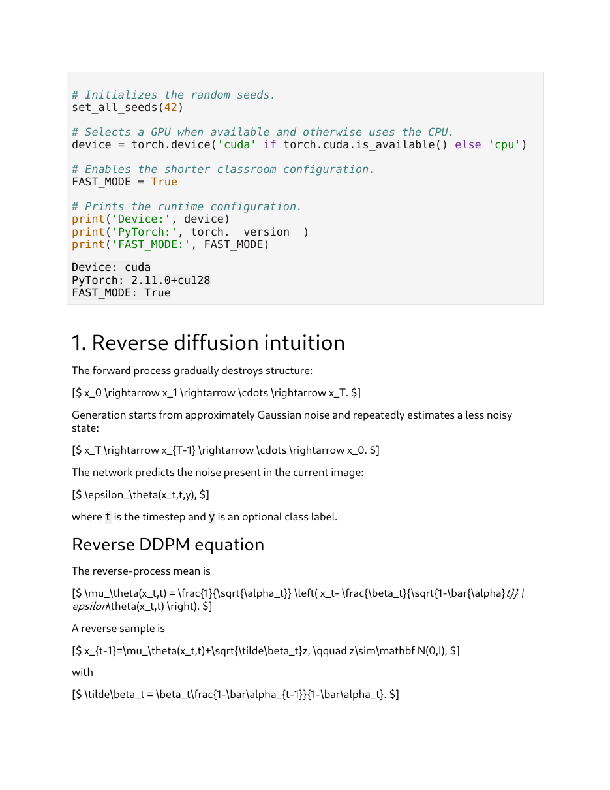
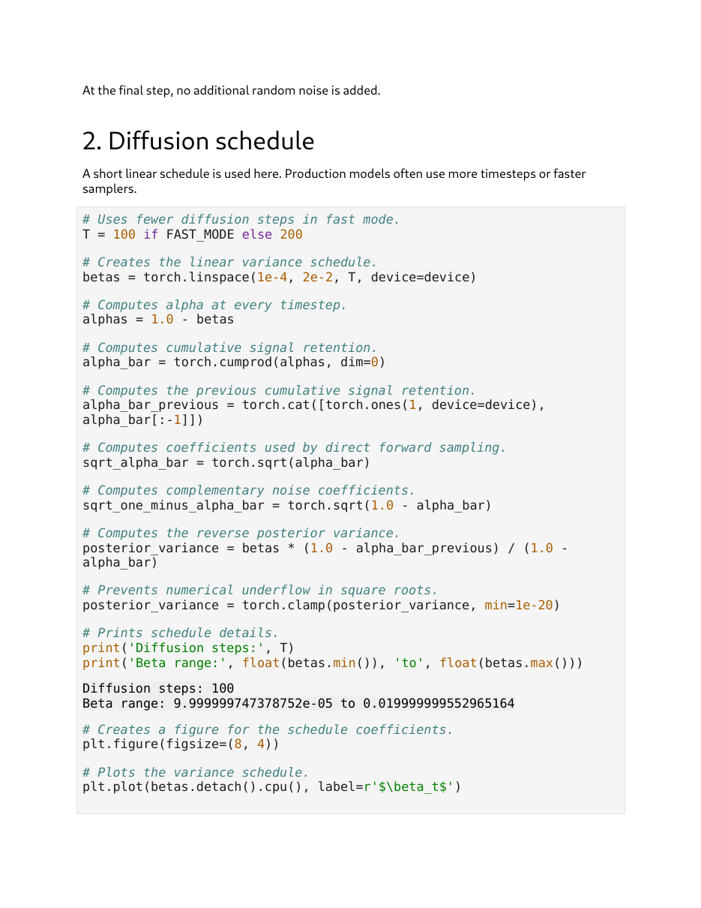
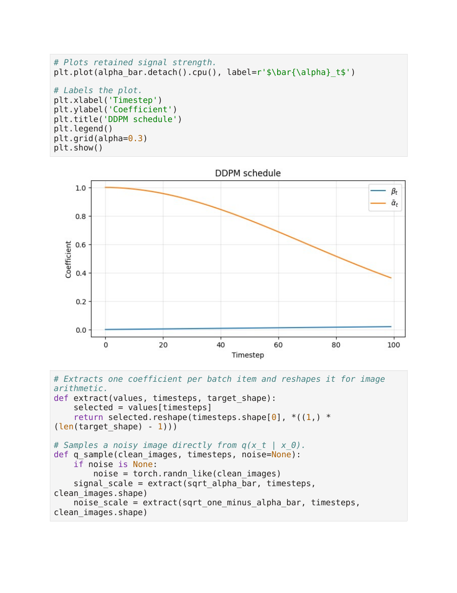
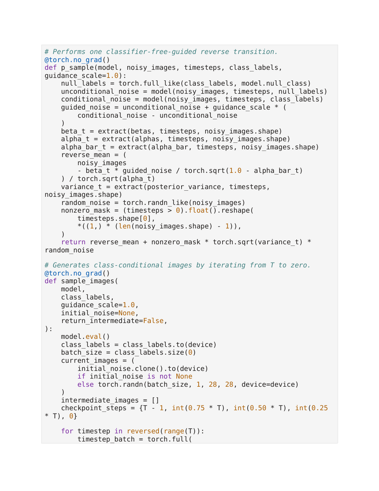
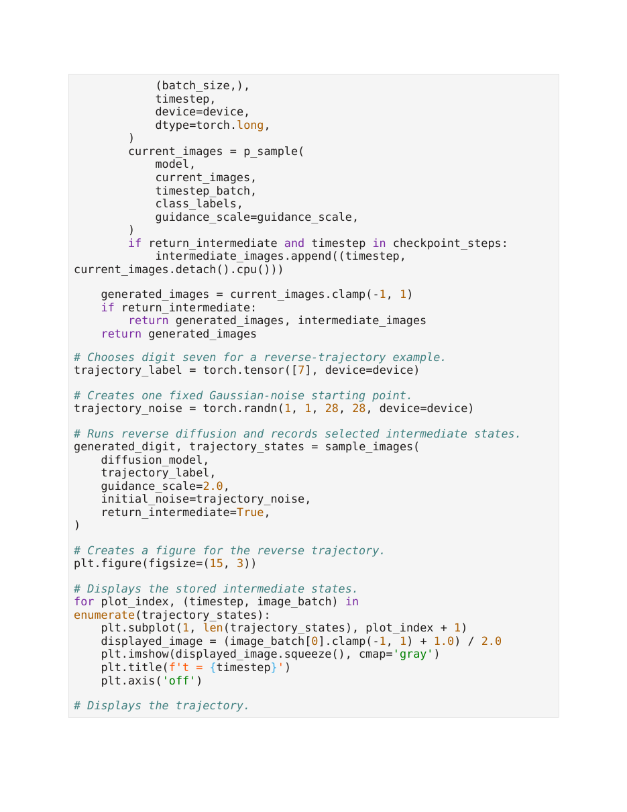
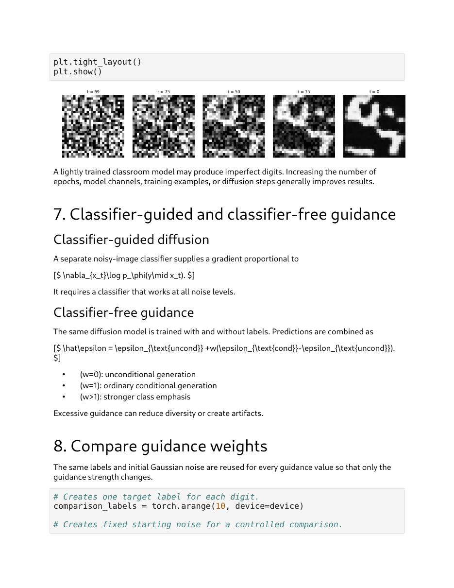
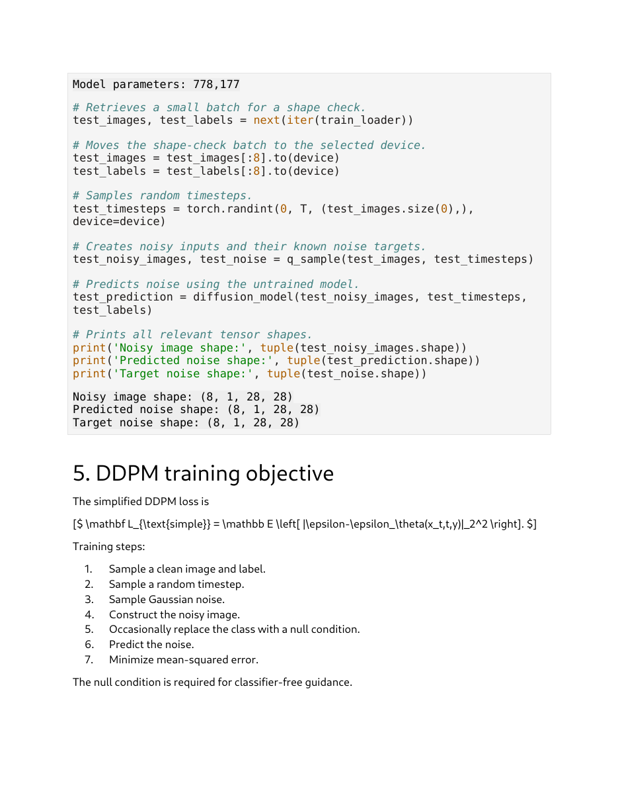
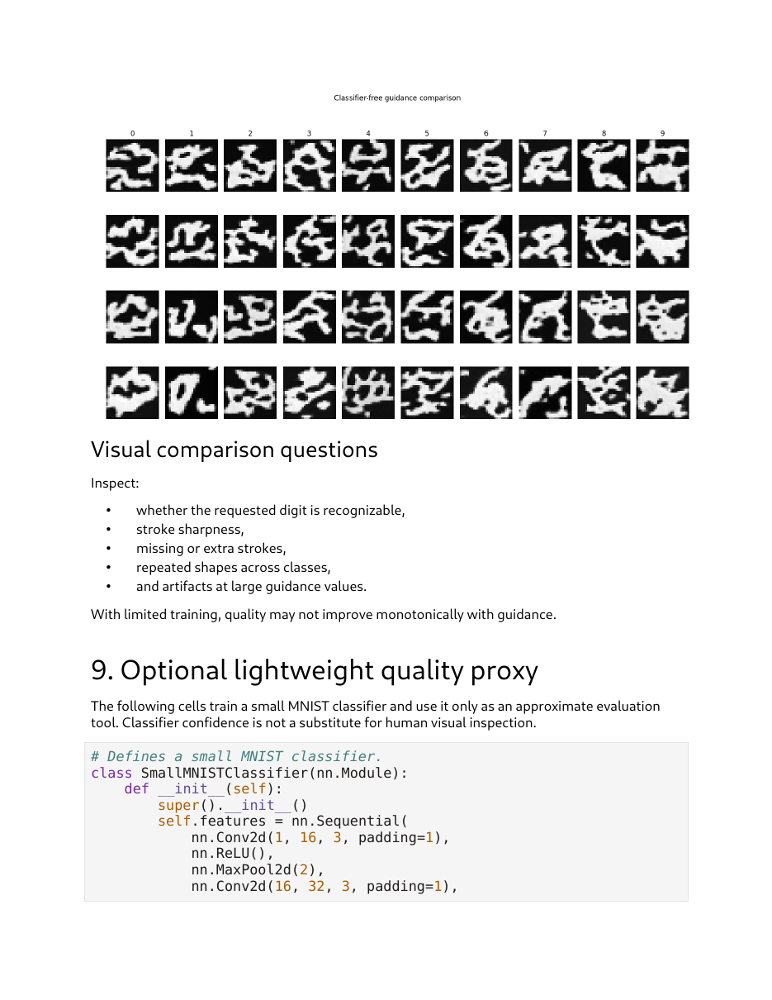
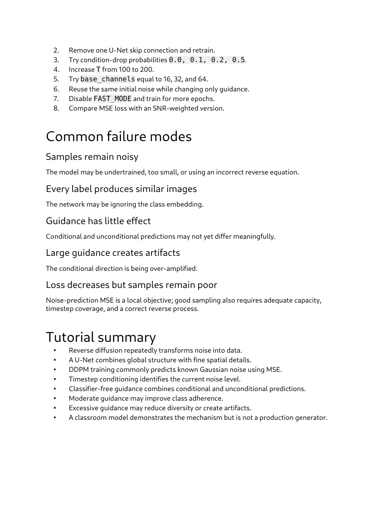

# Lec 53 — Hands-on: Reverse Diffusion

> **Source:** `Lec 53.pdf` (24 pages) · **Week 8** · **Playlist:** Lec 53
> **Prereqs:** [Lec 46 — DDPM Forward Process](46-ddpm-forward.md), [Lec 47 — DDPM Reverse Process](47-ddpm-reverse.md), [Lec 48 — Hands-on: Forward Diffusion](48-forward-diffusion-handson.md), [Lec 49 — U-Net for Denoising](49-unet.md), [Lec 51 — Classifier-Free Diffusion](51-classifier-free-guidance.md)
> **Feeds into:** [Lec 54 — Foundations of NLP](54-nlp-foundations.md)

## Why this lecture exists

[Lec 47](47-ddpm-reverse.md) gave you $p_\theta(\mathbf{x}_{t-1}\mid\mathbf{x}_t)$ and the noise-prediction objective. That is a *distribution*, written once. It is not yet a program. Turning it into a program raises questions the derivation never had to answer: which index does the loop run over, in which direction, what shape does $t$ have when a batch carries a different timestep per image, where exactly does the extra Gaussian $\mathbf{z}$ get added, and what do you do at the very last step where adding it would be wrong.

This lecture is the whole of Week 7 and Week 8 compiled into one Colab notebook: schedule, U-Net, training loop, sampler, guidance sweep. The sampler is the part that is genuinely new, and it is fifteen lines long. Everything else you have already met as mathematics. By the end you should be able to write `p_sample` from memory and say, for any line of it, which symbol in [Lec 47](47-ddpm-reverse.md)'s derivation it implements.

## The ideas

### What this deck actually is

It is not a slide deck. It is a printed Jupyter notebook — "NPTEL Generative AI — Diffusion Tutorial 2", subtitled *Reverse Diffusion, Small U-Net, DDPM Training, and Classifier-Free Guidance*. Twelve numbered sections, roughly 80% code, run on a Colab T4 GPU. The companion to [Lec 48](48-forward-diffusion-handson.md), which was Tutorial 1.

Two consequences for you as a reader. First, **every equation in this deck is broken**: the markdown cells' LaTeX never rendered, so the PDF prints raw source such as `[$ x_T \rightarrow x_{T-1} \rightarrow \cdots \rightarrow x_0. $]` instead of the formula. The mathematics is all correct — it is a rendering failure, not a content error — but you cannot read it off the page, so this chapter typesets it for you. Second, there is a global switch, `FAST_MODE = True`, that shrinks almost every number in the notebook. Which value of $T$, how many training images, how many epochs — all of them fork on it. The printed outputs are all the `FAST_MODE` branch.

| Knob | `FAST_MODE = True` (printed) | `FAST_MODE = False` |
|---|---|---|
| Diffusion steps $T$ | 100 | 200 |
| Training images | 12,000 | 30,000 |
| Validation images | 2,000 | 5,000 |
| Epochs | 4 (on GPU) | 8 (on GPU) |


*Fig. — Section 1. Notice every formula is printed as `[$ ... $]` source rather than as mathematics — the notebook's markdown cells never rendered when the PDF was exported. The content is right: this is $\mu_\theta$, the reverse sample, and $\tilde\beta_t$. Page 2.*

### The three equations the sampler implements

Transcribed into the notation of CONTRACT §3, with the deck's own symbols kept:

$$\mu_\theta(\mathbf{x}_t, t) \;=\; \frac{1}{\sqrt{\alpha_t}}\left(\mathbf{x}_t \;-\; \frac{\beta_t}{\sqrt{1-\bar\alpha_t}}\;\epsilon_\theta(\mathbf{x}_t, t, y)\right)$$

$$\mathbf{x}_{t-1} \;=\; \mu_\theta(\mathbf{x}_t,t) \;+\; \sqrt{\tilde\beta_t}\;\mathbf{z}, \qquad \mathbf{z}\sim\mathcal{N}(\mathbf{0},\mathbf{I})$$

$$\tilde\beta_t \;=\; \beta_t\,\frac{1-\bar\alpha_{t-1}}{1-\bar\alpha_t}$$

and the deck adds one sentence in plain prose that the equations do not contain: **"At the final step, no additional random noise is added."** That sentence is the single most examinable line in the deck, and §"Where the extra noise enters" below is about why.

[Lec 47](47-ddpm-reverse.md) derives all three. Do not re-derive them; recognise them. $y$ is the deck's optional class label, and $\epsilon_\theta(\mathbf{x}_t,t,y)$ is a network that takes three arguments — image, timestep, label.

### The schedule, as arrays

Everything the sampler needs is precomputed once into six tensors of length $T$. This is [Lec 46](46-ddpm-forward.md)'s algebra, stored.

```keras
T = 100 if FAST_MODE else 200
betas = torch.linspace(1e-4, 2e-2, T, device=device)
alphas = 1.0 - betas
alpha_bar = torch.cumprod(alphas, dim=0)
alpha_bar_previous = torch.cat([torch.ones(1, device=device), alpha_bar[:-1]])
sqrt_alpha_bar = torch.sqrt(alpha_bar)
sqrt_one_minus_alpha_bar = torch.sqrt(1.0 - alpha_bar)
posterior_variance = betas * (1.0 - alpha_bar_previous) / (1.0 - alpha_bar)
posterior_variance = torch.clamp(posterior_variance, min=1e-20)
```

Five things to read off it.

1. **The schedule is linear in $\beta$**, from $10^{-4}$ to $2\times10^{-2}$. The notebook prints `Beta range: 9.999999747378752e-05 to 0.019999999552965164` — those are float32's nearest representable values for $10^{-4}$ and $0.02$, not a typo. With $T = 100$ the spacing is $(0.02 - 0.0001)/99 = 2.0101\times10^{-4}$ per step.
2. **`alpha_bar` is a `cumprod`, not a `prod`** — it holds $\bar\alpha_t$ for *every* $t$ at once, because the sampler needs a different one at every iteration.
3. **`alpha_bar_previous` is `alpha_bar` shifted right with a 1 pushed in at the front.** That leading 1 encodes $\bar\alpha_{-1} \equiv 1$ (nothing has been destroyed before the process starts), and it is what makes $\tilde\beta$ vanish at the first index.
4. **`posterior_variance` is $\tilde\beta_t$, a length-$T$ array, not a scalar.** It is computed from the schedule alone — it does not depend on the data or the network. This is the "fixed variance" choice [Lec 47](47-ddpm-reverse.md) describes; the alternative is to let the network predict it, which this notebook does not do.
5. **The `clamp(min=1e-20)` is a square-root guard.** At index 0, $\tilde\beta_0 = \beta_0(1-1)/(1-\bar\alpha_0) = 0$ *exactly*, and `torch.sqrt` of a tensor that the autograd graph may later touch at 0 has infinite derivative. Clamping to $10^{-20}$ makes $\sqrt{\tilde\beta_0} = 10^{-10}$ — numerically zero, safely differentiable.


*Fig. — The entire schedule in eight lines. Notice `alpha_bar_previous` is built by concatenating a literal `1` onto the front of `alpha_bar[:-1]` — that shift is what makes $\tilde\beta_t$ reference $\bar\alpha_{t-1}$. Page 3.*


*Fig. — Read the orange curve's right-hand endpoint: $\bar\alpha_T \approx 0.36$, not $\approx 0$. The forward process has **not** reached noise after 100 steps. That single fact explains most of what goes wrong later; N3 prices it. Page 4.*

> **Indexing warning — the code is 0-based, the mathematics is 1-based.** Python's `betas[0]` is the deck's $\beta_1$, and the loop's last iteration is `t = 0`, which is the mathematics' $t = 1$ (the step that produces $\mathbf{x}_0$). The notebook's own figure titles say `t = 99 ... t = 0`. Throughout this chapter, a bare $t$ means the **code index**, $0 \le t \le T-1$. An exam question phrased in the mathematics' indexing will say $t = 1 \ldots T$.

### `extract` — the one piece of tensor plumbing you must understand

A batch of 8 images can carry 8 *different* timesteps. So $\beta_t$ is not a scalar in the code; it is one value per batch item, and it has to multiply a $(8,1,28,28)$ image tensor.

```keras
def extract(values, timesteps, target_shape):
    selected = values[timesteps]
    return selected.reshape(timesteps.shape[0], *((1,) * (len(target_shape) - 1)))
```

`values[timesteps]` is a *gather*: given `values` of shape $(T,)$ and `timesteps` of shape $(B,)$ holding integers, it returns shape $(B,)$ — the right schedule constant for each image. The `reshape` then pads it to $(B,1,1,1)$ so that NumPy/PyTorch broadcasting lines the batch axis up and replicates the scalar across channel, height and width.

Get this wrong and you get either a shape error or — far worse — a silent broadcast against the wrong axis. The `*((1,) * (len(target_shape) - 1))` idiom just means "as many trailing 1s as the target has non-batch dimensions", so the same helper works for $(B,1,28,28)$ images and for $(B,)$ scalars.

### One reverse step, in tensors

This is the chapter's centre of gravity. The deck's `p_sample` performs exactly one transition $\mathbf{x}_t \to \mathbf{x}_{t-1}$.

```keras
@torch.no_grad()
def p_sample(model, noisy_images, timesteps, class_labels, guidance_scale=1.0):
    null_labels = torch.full_like(class_labels, model.null_class)
    unconditional_noise = model(noisy_images, timesteps, null_labels)
    conditional_noise   = model(noisy_images, timesteps, class_labels)
    guided_noise = unconditional_noise + guidance_scale * (
        conditional_noise - unconditional_noise
    )
    beta_t      = extract(betas, timesteps, noisy_images.shape)
    alpha_t     = extract(alphas, timesteps, noisy_images.shape)
    alpha_bar_t = extract(alpha_bar, timesteps, noisy_images.shape)
    reverse_mean = (
        noisy_images
        - beta_t * guided_noise / torch.sqrt(1.0 - alpha_bar_t)
    ) / torch.sqrt(alpha_t)
    variance_t = extract(posterior_variance, timesteps, noisy_images.shape)
    random_noise = torch.randn_like(noisy_images)
    nonzero_mask = (timesteps > 0).float().reshape(
        timesteps.shape[0], *((1,) * (len(noisy_images.shape) - 1)),
    )
    return reverse_mean + nonzero_mask * torch.sqrt(variance_t) * random_noise
```

Line by line, against the mathematics:

| Code | Mathematics |
|---|---|
| `@torch.no_grad()` | sampling is inference; no graph is built, which roughly halves memory |
| two `model(...)` calls | $\epsilon_\theta(\mathbf{x}_t,t,\varnothing)$ and $\epsilon_\theta(\mathbf{x}_t,t,y)$ |
| `guided_noise` | $\hat\epsilon = \epsilon_{\text{uncond}} + w(\epsilon_{\text{cond}} - \epsilon_{\text{uncond}})$ |
| `reverse_mean` | $\mu_\theta = \dfrac{1}{\sqrt{\alpha_t}}\left(\mathbf{x}_t - \dfrac{\beta_t}{\sqrt{1-\bar\alpha_t}}\hat\epsilon\right)$ |
| `nonzero_mask * sqrt(variance_t) * random_noise` | $+\sqrt{\tilde\beta_t}\,\mathbf{z}$, suppressed at $t=0$ |

Three observations the deck does not make.

**The division by $\sqrt{\alpha_t}$ wraps the whole bracket.** In the code the `) / torch.sqrt(alpha_t)` sits outside the parenthesis that opened before `noisy_images`. Dividing only the $\beta_t$ term — an easy misreading, and an easy bug — gives a sampler that drifts to zero.

**Nothing in the step uses $\bar\alpha_{t-1}$ directly.** It enters only through the precomputed `posterior_variance`. So the step needs exactly three schedule lookups plus one variance lookup.

**The step is a contraction plus an injection.** $1/\sqrt{\alpha_t} > 1$, so the first factor slightly *expands* the image; the $-\beta_t\hat\epsilon/\sqrt{1-\bar\alpha_t}$ term removes a sliver of predicted noise; then fresh noise of standard deviation $\sqrt{\tilde\beta_t}$ is added back. At $t = 50$ with the deck's schedule the deterministic part moves a pixel by about $0.0065$ while the injected noise has standard deviation $0.0990$ — **fifteen times larger**. A single reverse step is almost entirely noise. The signal only accumulates because the drift is systematic and the noise is not. N2 works the arithmetic.


*Fig. — The core page of the whole lecture. Note the model is called **twice** before any schedule constant is looked up, and that `nonzero_mask` is built from `timesteps > 0` rather than from any property of the image. Page 16.*

### Where the extra noise enters, and why it is dropped at the last step

The term $\sqrt{\tilde\beta_t}\,\mathbf{z}$ is what makes the sampler a *sampler*. Without it you have a deterministic map from $\mathbf{x}_T$ to a single point, and since $\mu_\theta$ is a contraction toward the data's centre, that point is the same for almost every starting noise. The Code section below demonstrates this: with the noise term removed, 50,000 independent runs produce samples with standard deviation $0.0016$ against a target of $0.5$ — **the distribution collapses to its mean**. A diffusion model that forgets this line does not produce blurry images; it produces one image.

So why remove it at $t = 0$? Because $\mathbf{x}_0$ is supposed to *be* the image, not a noisy observation of it. The final step's output is what you show the user, and adding $\mathcal{N}(\mathbf{0}, \tilde\beta_0\mathbf{I})$ to it would simply re-corrupt the thing you spent 99 steps cleaning. Formally, the reverse chain's last transition is $p_\theta(\mathbf{x}_0\mid\mathbf{x}_1)$ and you report its mean, not a draw from it — the same reason you report $\mu$ rather than a sample when a VAE decoder is used for display.

**The notebook guards this twice, and only needs to once.**

- `nonzero_mask = (timesteps > 0).float()` zeroes the noise term wherever the batch item's timestep is 0.
- Independently, `posterior_variance[0]` is $\beta_0(1 - \bar\alpha_{-1})/(1-\bar\alpha_0) = \beta_0 \cdot 0 / (1-\bar\alpha_0) = 0$ **exactly**, because of that leading 1 in `alpha_bar_previous`. Even without the mask, $\sqrt{\tilde\beta_0} = 0$ and the noise term vanishes on its own.

So the mask is belt-and-braces. It becomes load-bearing only if you change the variance choice — for instance to the other DDPM option $\sigma_t^2 = \beta_t$, which does **not** vanish at $t=0$ ($\beta_0 = 10^{-4}$, so $\sigma_0 = 0.01$). Then the mask is the only thing stopping you from shipping a noisy image. The mask is also what lets a batch hold several different timesteps at once, which this notebook never does during sampling but does during training.

> **Exam phrasing.** "In the DDPM sampler, at which timestep is the stochastic term omitted?" — at the **final** step, i.e. the step that produces $\mathbf{x}_0$; code index $t=0$, mathematics index $t=1$. "Why?" — because the output is the reported sample and extra noise would re-corrupt it; equivalently because $\tilde\beta$ is zero there.

### Guidance, as two forward passes

[Lec 50](50-classifier-guidance.md) and [Lec 51](51-classifier-free-guidance.md) own the theory, including why classifier-free guidance replaced classifier guidance. What is yours here is the *cost*.

The deck's formula, typeset:

$$\hat\epsilon \;=\; \epsilon_{\text{uncond}} \;+\; w\,(\epsilon_{\text{cond}} - \epsilon_{\text{uncond}})$$

and its own reading of $w$: $w=0$ unconditional, $w=1$ ordinary conditional, $w>1$ stronger class emphasis. Equivalently $\hat\epsilon = (1-w)\epsilon_{\text{uncond}} + w\,\epsilon_{\text{cond}}$ — an extrapolation past the conditional prediction when $w>1$.

The implementation detail that costs you: **the model runs twice per reverse step, unconditionally**. `p_sample` computes both branches before it looks at `guidance_scale`, so even at $w = 0$ (where `conditional_noise` is multiplied by zero) and at $w = 1$ (where `unconditional_noise` cancels algebraically) you pay for both. One image at $T = 100$ therefore costs **200 U-Net forward passes**, not 100. N5 prices the whole guidance sweep.

The null class is a real embedding slot, not a flag. The U-Net declares `self.null_class = num_classes`, so with 10 MNIST digits the class embedding table is `nn.Embedding(11, 128)` — indices 0–9 for digits, index 10 for "no condition". During training, `prepare_training_batch` overwrites the label with that index for a random 10% of images (`drop_probability=0.1`), which is how one network learns both branches.

### The loop

```keras
for timestep in reversed(range(T)):
    timestep_batch = torch.full((batch_size,), timestep, device=device, dtype=torch.long)
    current_images = p_sample(model, current_images, timestep_batch,
                              class_labels, guidance_scale=guidance_scale)
    if return_intermediate and timestep in checkpoint_steps:
        intermediate_images.append((timestep, current_images.detach().cpu()))
generated_images = current_images.clamp(-1, 1)
```

Five things.

- **`reversed(range(T))`** gives $T-1, T-2, \ldots, 1, 0$. The forward process ran $0 \to T-1$; sampling runs it backwards. Writing `range(T)` by mistake runs the chain the wrong way and produces noise.
- **The starting point** is `torch.randn(batch_size, 1, 28, 28)` — pure $\mathcal{N}(\mathbf{0},\mathbf{I})$, one channel, MNIST's 28×28. Or a caller-supplied `initial_noise`, which is how the guidance comparison holds the noise fixed across $w$ so that only $w$ varies.
- **`torch.full((batch_size,), timestep)`** broadcasts the scalar timestep to the whole batch — the loop steps *all* images together, so `extract` always gathers the same constant here.
- **`checkpoint_steps = {T-1, int(0.75*T), int(0.50*T), int(0.25*T), 0}`** — with $T=100$ that is $\{99, 75, 50, 25, 0\}$, the five panels in the trajectory figure.
- **`clamp(-1, 1)` happens once, at the end.** Not inside the loop. Intermediate states are allowed to leave the data range; only the final image is forced back into it. Clamping every step is a real (and tempting) bug — it biases the chain.


*Fig. — The caller fixes `trajectory_noise = torch.randn(1,1,28,28)` **before** sampling and passes it in. Everything stochastic after that is the per-step $\mathbf{z}$; the starting point is held constant so the trajectory is reproducible. Page 17.*

### Assembling and displaying the generated image

MNIST was loaded with `transforms.Lambda(lambda image: image * 2.0 - 1.0)`, so the model's whole world is $[-1,1]$. Matplotlib wants $[0,1]$. Every display in the notebook therefore does the inverse map:

$$\text{display} = \frac{\text{clamp}(\mathbf{x}, -1, 1) + 1}{2}$$

written as `(image_batch[0].clamp(-1,1) + 1.0) / 2.0`. Three more conventions:

- `.squeeze()` drops the singleton channel axis so a $(1,28,28)$ tensor becomes $(28,28)$, which `imshow` accepts with `cmap='gray'`.
- `make_grid(images, nrow=10)` tiles a batch into one image; it returns a $(3,H,W)$ tensor, so the notebook follows it with `.permute(1,2,0)` to get matplotlib's $(H,W,3)$ ordering. The channel-order dance is the commonest source of a "why is my image transposed" bug.
- `.detach().cpu()` before plotting — tensors on the GPU and inside a graph cannot be handed to NumPy.


*Fig. — The deck's own honest caption: "A lightly trained classroom model may produce imperfect digits." The requested digit was a **7**; what emerges at $t=0$ is not one. Notice how little changes between $t=99$ and $t=75$ and how much changes between $t=25$ and $t=0$ — structure appears late, which is exactly what $\bar\alpha_t$'s curve predicts. Page 18.*

### The sampling cost, and reducing the step count

**Not on the slides beyond one clause** — the deck says only that "production models often use more timesteps or faster samplers", and sets an exercise to raise $T$ from 100 to 200. The arithmetic below is this chapter's.

A GAN generates an image with **one** generator forward pass. This sampler needs $T$ steps $\times$ 2 passes (guidance) $=200$. That is the deck's own "Many denoising calls" row, priced. Three standard remedies, in increasing order of cleverness:

1. **Batch the guidance.** Concatenate the conditional and unconditional inputs into one batch of $2B$ and call the model once per step. Same arithmetic, half the kernel launches.
2. **Skip timesteps.** Run the same trained model on a subsequence $\tau_1 < \tau_2 < \cdots < \tau_S$ of the original $T$, with $S \ll T$. The DDPM update is not valid on a skipped grid, because $\tilde\beta$ was derived for adjacent steps.
3. **DDIM.** Denoising Diffusion Implicit Models rewrite the update so that skipping is valid. Having predicted $\hat\epsilon$, first reconstruct the implied clean image by inverting [Lec 46](46-ddpm-forward.md)'s forward jump,
   $$\hat{\mathbf{x}}_0 = \frac{\mathbf{x}_t - \sqrt{1-\bar\alpha_t}\,\hat\epsilon}{\sqrt{\bar\alpha_t}}$$
   then re-noise it to the *next* level on your chosen grid:
   $$\mathbf{x}_{t-1} = \sqrt{\bar\alpha_{t-1}}\,\hat{\mathbf{x}}_0 + \sqrt{1-\bar\alpha_{t-1}}\,\hat\epsilon.$$
   There is **no $\mathbf{z}$ term at all** — DDIM is deterministic, so the same starting noise always yields the same image, and 20–50 steps typically suffice. The trade: less sample diversity for a fixed noise budget, because the only randomness left is $\mathbf{x}_T$.

The discrimination an exam will want: **DDPM is stochastic and needs adjacent steps; DDIM is deterministic and can skip.** Both reuse the same $\epsilon_\theta$ — DDIM is a different *sampler*, not a different *model*.

### What the deck's model actually achieved


*Fig. — The three tensors have **identical shape**. That is the whole architecture constraint on $\epsilon_\theta$: it is an image-to-image map, and the thing it outputs is compared against the noise you yourself drew. Step 5, "occasionally replace the class with a null condition", is the only step that is not plain DDPM. Page 11.*

The training objective, typeset from the deck's broken LaTeX:

$$\mathcal{L}_{\text{simple}} \;=\; \mathbb{E}\!\left[\;\lVert \epsilon - \epsilon_\theta(\mathbf{x}_t, t, y)\rVert_2^2\;\right]$$

owned by [Lec 47](47-ddpm-reverse.md). Training ran AdamW at $\eta = 2\times10^{-3}$ with gradient clipping at norm 1.0, four epochs over 94 batches of 128, in **19.9 seconds**. The loss:

| Epoch | first batch | mid | last logged | validation MSE |
|---|---|---|---|---|
| 1 | 1.0991 | 0.1480 | 0.1041 | 0.1071 |
| 2 | 0.1132 | 0.0842 | 0.0885 | 0.0854 |
| 3 | 0.0794 | 0.0843 | 0.0856 | 0.0748 |
| 4 | 0.0814 | 0.0695 | 0.0733 | 0.0721 |

Read it as the deck does not. The loss falls from 1.10 to 0.07 — a 93% reduction — and the samples are still unrecognisable. **A low noise-prediction MSE does not imply good samples.** The deck says as much in its failure-mode list ("Loss decreases but samples remain poor. Noise-prediction MSE is a local objective"), and it is the most useful sentence in the notebook. The reason: $\mathcal{L}_{\text{simple}}$ scores one-step denoising at a *random* timestep, whereas sampling composes 100 of them, so small per-step biases compound.

A useful reference point the deck omits: predicting $\hat\epsilon = \mathbf{0}$ regardless of input gives $\mathbb{E}\lVert\epsilon\rVert^2/d = 1.0$ under the mean-reduction `F.mse_loss` uses. So 1.0991 at initialisation is "no better than zero", and 0.0721 means the model explains about 93% of the noise variance.

The notebook then trains a throwaway CNN classifier (78.4% then 93.5% training accuracy over two epochs) as a *quality proxy*, and reports per-guidance metrics. Its `pd.DataFrame` printed as a mangled JSON schema dump instead of a table — another export failure — but the statistics are recoverable, and N6 recovers them. The headline: **target accuracy between 0.1 and 0.3**, i.e. 1 to 3 of 10 requested digits recognised. The deck's own disclaimer, "a classroom model demonstrates the mechanism but is not a production generator", is accurate.


*Fig. — The controlled experiment: identical labels, identical starting noise, only $w$ changes down the rows ($w = 0, 1, 2, 4$). The deck's point survives even though the digits do not — notice the blobs **do** change with $w$, so guidance is doing something; they just do not change into digits. Page 20.*

### Diffusion against GANs and VAEs

The deck closes with a comparison table. [Lec 44](44-diffusion-intro.md) owns the *why*; this is the deck's own wording, reproduced because it is exam-shaped.

| Property | Diffusion | GAN | VAE |
|---|---|---|---|
| Training signal | denoising regression | adversarial game | reconstruction + latent regularisation |
| Training stability | often comparatively stable | can be unstable | usually stable |
| Sampling speed | iterative and slower | usually one pass | usually one decoder pass |
| Mode coverage | often strong | mode collapse can occur | usually broad |
| Image sharpness | often very high | often very sharp | historically smoother |
| Main practical cost | many denoising calls | adversarial optimisation | reconstruction-quality trade-off |

The deck's own hedge — "these are broad tendencies rather than universal rules" — is worth carrying into an exam answer.

### Failure modes

The deck's closing diagnostic list, which is pure hands-on content and belongs to no other chapter.

| Symptom | The deck's diagnosis |
|---|---|
| Samples remain noisy | model undertrained, too small, **or using an incorrect reverse equation** |
| Every label produces similar images | the network is ignoring the class embedding |
| Guidance has little effect | conditional and unconditional predictions do not yet differ meaningfully |
| Large guidance creates artefacts | the conditional direction is being over-amplified |
| Loss decreases but samples stay poor | MSE is a local objective; sampling also needs capacity, timestep coverage and a correct reverse process |


*Fig. — Four of the five failures are diagnosed at the **sampler**, not the model. That is the lesson of the whole lecture: a correct $\epsilon_\theta$ wired into a wrong loop produces noise. Page 24.*

The deck also names three alternative training targets in one line — predict the clean image $\mathbf{x}_0$, predict a velocity $\mathbf{v}$, or weight the MSE by signal-to-noise ratio — and says the choice "depends on the model, data scale, sampler, and training setup". Worth recognising by name; nothing in this course develops them.

## Worked numericals

The deck contains **no hand-worked arithmetic at all** — it is a notebook, so every number is printed by code. All six of the following reproduce or verify numbers the deck prints, or compute quantities the deck's own code implies. Natural logs throughout; none of these involve a logarithm.

### N1. Rebuild the schedule by hand at the five checkpoint timesteps

**Given:** $T = 100$, $\beta$ linear from $10^{-4}$ to $2\times10^{-2}$ (code indices $0\ldots99$).
**Find:** $\beta_t$, $\alpha_t$, $\bar\alpha_t$, $\sqrt{\bar\alpha_t}$ and $\sqrt{\tilde\beta_t}$ at the deck's `checkpoint_steps` $\{99, 75, 50, 25, 0\}$.

1. **Spacing.** `linspace(a, b, T)` puts $T$ points *inclusive of both ends*, so the gap is $(b-a)/(T-1) = (0.02 - 0.0001)/99 = 2.01010\times10^{-4}$, and $\beta_t = 10^{-4} + t\cdot 2.01010\times10^{-4}$.
2. **Check index 0 and 1.** $\beta_0 = 0.0001$ and $\beta_1 = 0.0001 + 0.000201 = 0.000301$. ✓ against `Beta range` printing $10^{-4}$ as the minimum.
3. **$\alpha_t = 1-\beta_t$**, then $\bar\alpha_t = \prod_{s=0}^{t}\alpha_s$. Starting the product: $\bar\alpha_0 = 0.999900$, $\bar\alpha_1 = 0.999900\times0.999699 = 0.999599$, $\bar\alpha_2 = 0.999097$.
4. **$\tilde\beta_t = \beta_t(1-\bar\alpha_{t-1})/(1-\bar\alpha_t)$**, with $\bar\alpha_{-1} = 1$.

| $t$ | $\beta_t$ | $\alpha_t$ | $\bar\alpha_t$ | $\sqrt{\bar\alpha_t}$ | $\sqrt{1-\bar\alpha_t}$ | $\sqrt{\tilde\beta_t}$ |
|---|---|---|---|---|---|---|
| 99 | 0.020000 | 0.980000 | 0.363563 | 0.602962 | 0.797770 | 0.140595 |
| 75 | 0.015176 | 0.984824 | 0.557966 | 0.746971 | 0.664856 | 0.121986 |
| 50 | 0.010151 | 0.989850 | 0.769291 | 0.877093 | 0.480321 | 0.099012 |
| 25 | 0.005125 | 0.994875 | 0.934217 | 0.966549 | 0.256483 | 0.068922 |
| 0 | 0.000100 | 0.999900 | 0.999900 | 0.999950 | 0.010000 | **0** |

Worked example for $t=50$: $\beta_{50} = 0.0001 + 50(0.000201010) = 0.01015051$. $\bar\alpha_{49} = 0.777180$, $\bar\alpha_{50} = 0.769291$. Then $\tilde\beta_{50} = 0.01015051 \times (1-0.777180)/(1-0.769291) = 0.01015051 \times 0.222820/0.230709 = 0.01015051\times0.965806 = 0.0098034$, and $\sqrt{\tilde\beta_{50}} = 0.099012$.

**Answer:** as tabulated. The $\sqrt{\bar\alpha_t}$ column is the fraction of the original image still present at that step: 60.3% at $t=99$ falling to 99.995% at $t=0$ — read it bottom-up and it is how much signal the sampler has recovered when each trajectory panel was captured.

### N2. One complete reverse step

**Given:** code index $t=50$ with the deck's schedule, a single pixel at $x_t = 0.8$, a network prediction $\hat\epsilon = 0.5$, and a draw $z = -1.2$.
**Find:** $\mu_\theta$, the step's deterministic drift, and $x_{t-1}$.

1. Look up $\beta_{50} = 0.0101505$, $\alpha_{50} = 0.9898495$, $\bar\alpha_{50} = 0.7692913$.
2. $\sqrt{1-\bar\alpha_{50}} = \sqrt{0.2307087} = 0.4803214$.
3. Noise coefficient: $\dfrac{\beta_t}{\sqrt{1-\bar\alpha_t}} = \dfrac{0.0101505}{0.4803214} = 0.0211327$.
4. Subtract the predicted noise: $0.8 - 0.0211327\times0.5 = 0.8 - 0.0105664 = 0.7894336$.
5. Divide by $\sqrt{\alpha_{50}} = \sqrt{0.9898495} = 0.9949118$: $\mu_\theta = 0.7894336/0.9949118 = 0.7934710$.
6. Drift: $\mu_\theta - x_t = 0.7934710 - 0.8 = -0.0065290$.
7. Noise standard deviation: $\sqrt{\tilde\beta_{50}} = 0.0990122$ (from N1).
8. $x_{t-1} = 0.7934710 + 0.0990122\times(-1.2) = 0.7934710 - 0.1188147$.

**Answer:** $\mu_\theta = 0.79347$, $x_{49} = 0.67466$. The drift is $-0.00653$ while the injected noise contributed $-0.11881$ — the random term is **18 times larger** than the deterministic one on this draw, and $15.2\times$ larger in standard deviation ($0.0990$ against $0.00653$). One step barely denoises; one hundred steps do.

### N3. Does this schedule actually reach noise?

**Given:** the deck's $\beta$ endpoints held fixed at $10^{-4}$ and $2\times10^{-2}$.
**Find:** $\bar\alpha_T$ for $T = 100$, $200$ and the DDPM paper's $1000$, and the resulting mismatch at the start of sampling.

1. $\bar\alpha_T = \prod_{t}(1-\beta_t)$ over the whole linspace. Computing:

| $T$ | $\bar\alpha_T$ | $\sqrt{\bar\alpha_T}$ = signal left in $\mathbf{x}_T$ |
|---|---|---|
| 100 (`FAST_MODE`) | 0.363563 | 0.6030 |
| 200 | 0.132183 | 0.3636 |
| 1000 (standard DDPM) | $4.036\times10^{-5}$ | 0.0064 |

2. The sampler starts at $\mathbf{x}_T \sim \mathcal{N}(\mathbf{0},\mathbf{I})$. But the forward process says $\mathbf{x}_T \sim \mathcal{N}\!\left(\sqrt{\bar\alpha_T}\mathbf{x}_0,\ (1-\bar\alpha_T)\mathbf{I}\right)$.
3. At $T=100$ that is $\mathcal{N}(0.603\,\mathbf{x}_0,\ 0.636\,\mathbf{I})$ — per-pixel standard deviation $\sqrt{0.636}=0.798$, not 1, and a mean that still carries 60% of the original image.

**Answer:** at $T=100$ the forward process destroys only about 64% of the signal, so $\mathbf{x}_T$ is nowhere near $\mathcal{N}(\mathbf{0},\mathbf{I})$ and the sampler's starting distribution is **wrong**. The Code section measures the damage: on a problem where the network is exactly correct by construction, $T=100$ lands a sample mean of 1.749 against a target of 2.000 — a 12.5% bias with a *perfect* network. $T=1000$ lands 2.003. **The deck's blobby digits are at least partly a schedule bug, not a training bug**, and `FAST_MODE` is where it was introduced: shortening $T$ while keeping the $\beta$ endpoints breaks the terminal-noise assumption.

### N4. The U-Net's parameter count, verified

**Given:** `SmallConditionalUNet(num_classes=10, base_channels=32, condition_dimension=128)`.
**Find:** whether the printed `Model parameters: 778,177` is right, and where the parameters sit.

Conv parameters are $C_{\text{in}}\!\times\!C_{\text{out}}\!\times\!K^2 + C_{\text{out}}$ ([Lec 05](05-cnn-a.md) owns the formula); `nn.Linear(a,b)` is $ab+b$; `nn.GroupNorm(g,C)` is $2C$; `nn.Embedding(n,d)` is $nd$.

1. `input_projection = Conv2d(1, 32, 3, padding=1)`: $1\times32\times9 + 32 = 288+32 = \mathbf{320}$.
2. `class_embedding = Embedding(10+1, 128)`: $11\times128 = \mathbf{1408}$. **The $+1$ is the null class** — classifier-free guidance costs exactly 128 extra parameters.
3. `time_embedding`: the sinusoidal block has no parameters; the two `Linear(128,128)` layers give $2(128\times128+128) = 2\times16{,}512 = \mathbf{33{,}024}$.
4. `output_layer = [GroupNorm(8,32), SiLU, Conv2d(32,1,3,pad=1)]`: $64 + (32\times1\times9 + 1) = 64+289 = \mathbf{353}$.
5. Summing all twelve children (the four above plus six residual blocks, two strided-conv downsamples and two transposed-conv upsamples):

| block | parameters | | block | parameters |
|---|---|---|---|---|
| `time_embedding` | 33,024 | | `upsample_1` | 131,136 |
| `class_embedding` | 1,408 | | `decoder_block_1` | 127,616 |
| `input_projection` | 320 | | `upsample_2` | 32,800 |
| `encoder_block_1` | 22,752 | | `decoder_block_2` | 34,112 |
| `downsample_1` | 16,416 | | `output_layer` | 353 |
| `encoder_block_2` | 65,984 | | | |
| `downsample_2` | 65,600 | | | |
| `bottleneck` | 246,656 | | **total** | **778,177** |

**Answer:** 778,177 exactly as printed. Note where the mass is — the bottleneck (32%) and the first upsample (17%) hold half the model between them, because channel counts peak at $32\times4 = 128$ there. [Lec 49](49-unet.md) owns the architecture; this is only its arithmetic.

### N5. The cost of the guidance sweep

**Given:** $T = 100$; `p_sample` calls the model twice per step; the sweep runs `guidance_scales = [0.0, 1.0, 2.0, 4.0]` on `comparison_labels = torch.arange(10)`.
**Find:** total U-Net forward passes, and the comparison against a GAN.

1. Per reverse step: 2 passes (unconditional + conditional).
2. Per image-batch, per guidance value: $100 \times 2 = 200$ passes over a batch of 10.
3. Over four guidance values: $4\times200 = \mathbf{800}$ batched forward passes.
4. Counted per *image*: $800 \times 10 / 40 = 200$ passes per generated image, or $8000$ image-passes in total.
5. A GAN generates one image in **1** generator pass ([Lec 32](32-gan-architecture.md)).

**Answer:** 800 batched forward passes, 200 network evaluations per generated image — a **200×** sampling-cost penalty against a GAN, before the trajectory run (another 100 steps $\times$ 2) is counted. This is the arithmetic behind the deck's "Sampling speed: iterative and slower" row. Note also that at $w=0$ and $w=1$ half of this work is provably wasted: the formula reduces to one branch, but the code computes both unconditionally.

### N6. Recovering the quality table from a broken print

**Given:** the notebook's `pd.DataFrame(quality_rows)` printed as a schema dump instead of a table. The recoverable facts: four rows; the *target accuracy* column has $\text{std} = 0.0957427$, $\min = 0.1$, $\max = 0.3$, and only **3 distinct values** among 4 rows.
**Find:** the four accuracies.

1. Three distinct values with $\min=0.1$ and $\max=0.3$ and a plausible grid of $1/10$ means the set is $\{0.1, 0.2, 0.3\}$ with one of them repeated.
2. Test $\{0.1, 0.1, 0.2, 0.3\}$: mean $= 0.7/4 = 0.175$. Deviations $-0.075, -0.075, +0.025, +0.125$; squares $0.005625, 0.005625, 0.000625, 0.015625$; sum $= 0.0275$. Sample variance $= 0.0275/3 = 0.00916\overline{6}$; standard deviation $= 0.0957427$. ✓
3. Test $\{0.1, 0.2, 0.2, 0.3\}$: mean $0.2$, sum of squares $0.02$, variance $0.006\overline{6}$, sd $= 0.0816$. ✗
4. Test $\{0.1, 0.2, 0.3, 0.3\}$: mean $0.225$, sum of squares $0.0275$, sd $= 0.0957427$ — **also matches**, by symmetry.
5. Sanity check the guidance column the same way: $\{0, 1, 2, 4\}$ has mean $1.75$, squared deviations $3.0625+0.5625+0.0625+5.0625 = 8.75$, variance $8.75/3 = 2.91\overline{6}$, sd $= 1.7078251$ ✓ against the printed `1.707825127659933`. So the dump is pandas' default sample standard deviation ($n-1$).

**Answer:** the four target accuracies are $\{0.1,\,0.1,\,0.2,\,0.3\}$ or $\{0.1,\,0.2,\,0.3,\,0.3\}$ — the printed statistics cannot separate them. Either way the classifier recognised **1 to 3 of every 10** requested digits. Mean target probability ran $0.102$ to $0.233$ and mean maximum confidence $0.712$ to $0.777$: the proxy classifier is confident about something in each image, and that something is usually the wrong digit.

## Code

The deck's sampler cannot be run here — it needs a trained U-Net, a GPU and MNIST. So this strips the loop to its skeleton and swaps the network for an **oracle**: on Gaussian data the optimal noise predictor has a closed form, so $\epsilon_\theta$ can be *exactly* right with no training at all. Whatever error remains is the sampler's, not the model's — which is what makes N3's claim testable.

For $x_0 \sim \mathcal{N}(\mu, \sigma^2)$, the forward process gives $x_t \sim \mathcal{N}(\sqrt{\bar\alpha_t}\mu,\ \bar\alpha_t\sigma^2 + 1-\bar\alpha_t)$, and the optimal predictor is

$$\epsilon^*(x_t,t) = \sqrt{1-\bar\alpha_t}\;\frac{x_t - \sqrt{\bar\alpha_t}\,\mu}{\bar\alpha_t\sigma^2 + 1 - \bar\alpha_t}.$$

```python
import numpy as np
rng = np.random.default_rng(0)
MU_DATA, SD_DATA = 2.0, 0.5          # toy "dataset": x0 ~ N(2.0, 0.5^2)

def schedule(T):                      # the deck's linear schedule, 0-indexed
    beta  = np.linspace(1e-4, 2e-2, T)
    alpha = 1.0 - beta
    abar  = np.cumprod(alpha)
    abar_prev = np.concatenate([[1.0], abar[:-1]])
    post_var  = beta * (1.0 - abar_prev) / (1.0 - abar)   # beta-tilde_t
    return beta, alpha, abar, post_var

def sample(T, n=50000, add_noise=True):
    beta, alpha, abar, post_var = schedule(T)
    x = rng.standard_normal(n)                       # x_T ~ N(0, 1)
    for t in range(T - 1, -1, -1):                   # t = T-1 ... 0
        # the ORACLE noise predictor: exact for Gaussian data, no training needed
        var_t = abar[t] * SD_DATA**2 + (1.0 - abar[t])
        eps   = np.sqrt(1.0 - abar[t]) * (x - np.sqrt(abar[t]) * MU_DATA) / var_t
        # the reverse mean, exactly as in the deck's p_sample
        x = (x - beta[t] * eps / np.sqrt(1.0 - abar[t])) / np.sqrt(alpha[t])
        if add_noise and t > 0:                      # <-- dropped at the last step
            x = x + np.sqrt(post_var[t]) * rng.standard_normal(n)
    return x

for T in (100, 200, 1000):
    _, _, abar, _ = schedule(T)
    x = sample(T)
    print(f"T={T:5d}  abar_T={abar[-1]:.6f}   mean={x.mean():.4f}   sd={x.std():.4f}")

x = sample(1000, add_noise=False)                    # ablation: kill the z term
print(f"T= 1000  no extra noise at all   mean={x.mean():.4f}   sd={x.std():.4f}")
_, _, _, post_var = schedule(1000)
print(f"posterior variance at t=0: {post_var[0]:.1e}   (so step t=0 adds nothing anyway)")
print(f"target distribution        mean={MU_DATA:.4f}   sd={SD_DATA:.4f}")
```

```
T=  100  abar_T=0.363563   mean=1.7492   sd=0.5005
T=  200  abar_T=0.132183   mean=1.9271   sd=0.4919
T= 1000  abar_T=0.000040   mean=2.0028   sd=0.4948
T= 1000  no extra noise at all   mean=2.0000   sd=0.0016
posterior variance at t=0: 0.0e+00   (so step t=0 adds nothing anyway)
target distribution        mean=2.0000   sd=0.5000
```

Three readings, in order of importance.

**The ablation is the headline.** Remove the $\sqrt{\tilde\beta_t}\mathbf{z}$ term and the standard deviation collapses from $0.495$ to $0.0016$ — a factor of 300 — while the mean stays perfect. Every one of 50,000 runs converges to the same point. That is what a diffusion sampler without its stochastic term does: it is not a generator, it is a fixed-point iteration. Keep that term.

**The deck's $T=100$ is genuinely too short.** With a provably optimal network, $T=100$ misses the mean by 12.5% and $T=200$ by 3.6%, while the standard $T=1000$ is within 0.14%. The only difference between the three runs is $\bar\alpha_T$. N3 explains why.

**The final step needs no mask here.** `post_var[0]` prints as exactly `0.0e+00`, so even if the `t > 0` guard were deleted the last step would add $\sqrt{0}\cdot z = 0$. The deck's `nonzero_mask` is a second, independent guard — correct, and necessary only if you change the variance choice to $\sigma_t^2 = \beta_t$.

## Exam pack

### Must-memorise

| Item | Exactly this |
|---|---|
| Reverse mean | $\mu_\theta(\mathbf{x}_t,t) = \dfrac{1}{\sqrt{\alpha_t}}\left(\mathbf{x}_t - \dfrac{\beta_t}{\sqrt{1-\bar\alpha_t}}\epsilon_\theta(\mathbf{x}_t,t,y)\right)$ |
| Reverse sample | $\mathbf{x}_{t-1} = \mu_\theta(\mathbf{x}_t,t) + \sqrt{\tilde\beta_t}\,\mathbf{z}$, $\mathbf{z}\sim\mathcal{N}(\mathbf{0},\mathbf{I})$ |
| Posterior variance | $\tilde\beta_t = \beta_t\dfrac{1-\bar\alpha_{t-1}}{1-\bar\alpha_t}$, with $\bar\alpha_{-1}=1$ |
| Last step | **no extra noise is added**; equivalently $\tilde\beta$ is 0 there |
| Loop direction | $t = T-1, T-2, \ldots, 1, 0$ (`reversed(range(T))`) |
| Starting point | $\mathbf{x}_T \sim \mathcal{N}(\mathbf{0},\mathbf{I})$ |
| Training loss | $\mathcal{L}_{\text{simple}} = \mathbb{E}\big[\lVert\epsilon - \epsilon_\theta(\mathbf{x}_t,t,y)\rVert_2^2\big]$ |
| Classifier-free mix | $\hat\epsilon = \epsilon_{\text{uncond}} + w(\epsilon_{\text{cond}} - \epsilon_{\text{uncond}})$ |
| Null class index | `num_classes` — one extra embedding row |
| Display map | $(\text{clamp}(\mathbf{x},-1,1)+1)/2$ |
| DDIM step | $\hat{\mathbf{x}}_0 = \dfrac{\mathbf{x}_t - \sqrt{1-\bar\alpha_t}\hat\epsilon}{\sqrt{\bar\alpha_t}}$, then $\mathbf{x}_{t-1} = \sqrt{\bar\alpha_{t-1}}\hat{\mathbf{x}}_0 + \sqrt{1-\bar\alpha_{t-1}}\hat\epsilon$ — **no $\mathbf{z}$** |

### Numbers worth knowing

| Quantity | Value |
|---|---|
| $T$, `FAST_MODE` on / off | 100 / 200 |
| $\beta$ range | $10^{-4}$ to $2\times10^{-2}$, linear |
| $\beta$ spacing at $T=100$ | $2.0101\times10^{-4}$ |
| $\bar\alpha_T$ at $T = 100 / 200 / 1000$ | 0.3636 / 0.1322 / $4.04\times10^{-5}$ |
| Checkpoint timesteps | $\{99, 75, 50, 25, 0\}$ |
| $\sqrt{\tilde\beta_t}$ at $t = 99 / 50 / 0$ | 0.1406 / 0.0990 / 0 |
| Image tensor shape | $(8, 1, 28, 28)$ — noisy input, prediction and target all identical |
| U-Net parameters | **778,177** |
| Class-embedding table | $11\times128$ (10 digits + null) |
| Base channels / condition dim | 32 / 128 |
| Training set / batch size | 12,000 / 128 (val 2,000 / 256) |
| Optimiser | AdamW, $\eta = 2\times10^{-3}$, grad-norm clip 1.0 |
| Label-drop probability | 0.1 |
| Epochs / batches / wall time | 4 / 94 / 19.9 s |
| First and last training MSE | 1.0991 → 0.0733 (validation 0.1071 → 0.0721) |
| Guidance values swept | 0.0, 1.0, 2.0, 4.0 |
| Network calls per image (with CFG) | $2T = 200$ |
| Proxy-classifier accuracy on real data | 0.784 then 0.935 |
| Proxy accuracy on *generated* digits | 0.1 to 0.3 |

### Likely MCQ traps

- **"Noise is added at every reverse step."** No — it is omitted at the **final** step, the one producing $\mathbf{x}_0$. An option saying "at the first step" is wrong: the first reverse step is $t=T-1$, where $\tilde\beta$ is largest.
- **Dropping the noise term everywhere "to make sampling deterministic".** That is not DDIM; it is a broken DDPM. The Code section measures the result: standard deviation $0.0016$ instead of $0.5$ — every sample identical. DDIM gets determinism by *changing the update rule*, not by deleting a term from this one.
- **Reading $\epsilon_\theta$ as predicting the image.** It predicts the **noise**. The deck's shape check prints `Target noise shape` alongside `Predicted noise shape` for exactly this reason. Predicting $\mathbf{x}_0$ is a named *alternative* parameterisation, listed in the deck's section 10 and not used by it.
- **Confusing $\beta_t$ with $\tilde\beta_t$.** $\beta_t$ is the forward schedule; $\tilde\beta_t = \beta_t(1-\bar\alpha_{t-1})/(1-\bar\alpha_t)$ is the reverse posterior variance. They agree to within 1% at large $t$ ($\tilde\beta_{99}/\beta_{99} = 0.988$) but differ by a factor of 4 at $t=1$ ($0.249$) and by everything at $t=0$.
- **"$\bar\alpha$ is $\alpha$ averaged."** It is a cumulative **product**: $\bar\alpha_t = \prod_{s\le t}\alpha_s$. In code, `cumprod`, not `mean`.
- **Dividing only the noise term by $\sqrt{\alpha_t}$.** The $1/\sqrt{\alpha_t}$ factor multiplies the whole bracket, including $\mathbf{x}_t$.
- **Assuming lower training loss means better samples.** The deck cuts the loss by 93% and still produces blobs. Noise-prediction MSE is a one-step, random-timestep objective; sampling composes $T$ of them.
- **Thinking guidance costs nothing.** Classifier-free guidance **doubles** the forward passes per step, because the unconditional branch must be evaluated too — even at $w=0$ or $w=1$, where one branch is algebraically irrelevant.
- **Clamping inside the loop.** The clamp to $[-1,1]$ is applied **once**, after the loop. Clamping every step biases the chain toward the boundary.
- **Index confusion.** `reversed(range(T))` yields $T-1$ down to 0, not $T$ down to 1. The deck's figure titles ($t=99$) are code indices with $T=100$.
- **"Classifier-free guidance needs a separate classifier."** That is *classifier* guidance ([Lec 50](50-classifier-guidance.md)). Classifier-free uses one network trained with a null class ([Lec 51](51-classifier-free-guidance.md)) — here, embedding index 10.

### Self-test

1. Write `p_sample`'s five essential lines from memory, in order, and name the symbol each implements.
2. At which timestep is the stochastic term dropped, and give **two** independent reasons it vanishes in the deck's code.
3. With $T=100$ and the deck's schedule, compute $\sqrt{\tilde\beta_{50}}$ from $\beta_{50}=0.0101505$, $\bar\alpha_{49}=0.777180$, $\bar\alpha_{50}=0.769291$.
4. One pixel sits at $x_t = -0.4$ at code index $t=99$ ($\beta=0.02$, $\alpha=0.98$, $\bar\alpha=0.363563$). The network predicts $\hat\epsilon = -1.1$. Compute $\mu_\theta$.
5. Why does `alpha_bar_previous` start with a literal 1, and what would break without it?
6. A batch of 16 images is sampled with $T=200$ and classifier-free guidance. How many U-Net forward passes?
7. `extract` reshapes a gathered value to $(B,1,1,1)$. Why not leave it as $(B,)$?
8. The deck's model reaches validation MSE 0.0721 but produces unrecognisable digits. Give two distinct explanations the deck itself supports.
9. State one difference and one similarity between the DDPM and DDIM samplers.
10. The guidance comparison fixes `comparison_noise` once and reuses it for all four values of $w$. Why does that matter?

<details><summary>Answers</summary>

1. (i) predict the noise $\hat\epsilon$ — two model calls plus the guidance mix; (ii) look up $\beta_t,\alpha_t,\bar\alpha_t$ via `extract`; (iii) `reverse_mean = (x - beta_t*eps/sqrt(1-alpha_bar_t)) / sqrt(alpha_t)` $=\mu_\theta$; (iv) look up $\tilde\beta_t$ and draw $\mathbf{z}$; (v) return $\mu_\theta + \text{mask}\cdot\sqrt{\tilde\beta_t}\,\mathbf{z}$.
2. At the **final** step, code index $t=0$ (mathematics $t=1$), the one producing $\mathbf{x}_0$. Reason A: `nonzero_mask = (timesteps > 0).float()` multiplies the noise term by 0 there. Reason B: $\tilde\beta_0 = \beta_0(1-\bar\alpha_{-1})/(1-\bar\alpha_0) = 0$ exactly, because $\bar\alpha_{-1}$ is set to 1 — so the term is zero even without the mask.
3. $\tilde\beta_{50} = 0.0101505\times(1-0.777180)/(1-0.769291) = 0.0101505\times0.222820/0.230709 = 0.0101505\times0.965806 = 0.0098034$; $\sqrt{\cdot} = \mathbf{0.09901}$.
4. $\sqrt{1-\bar\alpha} = \sqrt{0.636437} = 0.797770$. Coefficient $0.02/0.797770 = 0.025070$. Bracket: $-0.4 - 0.025070\times(-1.1) = -0.4 + 0.027577 = -0.372423$. Divide by $\sqrt{0.98} = 0.989949$: $\mu_\theta = \mathbf{-0.37620}$.
5. It encodes $\bar\alpha_{-1}=1$ — before the process starts, no signal has been destroyed. Without it, `alpha_bar_previous[0]` would be $\bar\alpha_0$, giving $\tilde\beta_0 = \beta_0(1-\bar\alpha_0)/(1-\bar\alpha_0) = \beta_0 \ne 0$, so the final step would inject noise of standard deviation $\sqrt{10^{-4}} = 0.01$ into the delivered image, and the whole shift would be off by one.
6. $200\text{ steps}\times 2\text{ passes} = 400$ batched passes; $400\times16 = 6400$ image-level evaluations. Batch size does not change the step count.
7. So broadcasting aligns it against a $(B,1,28,28)$ image. A $(B,)$ tensor would broadcast against the *last* axis (width), silently multiplying a different schedule constant into each column.
8. (a) The objective is local: $\mathcal{L}_{\text{simple}}$ scores one-step denoising at a random $t$, while sampling composes 100 steps and compounds small biases. (b) Capacity and training budget — 778k parameters, 12,000 images, 4 epochs, 19.9 seconds. A third, from N3: $\bar\alpha_{100} = 0.364$, so sampling starts from the wrong distribution.
9. **Difference:** DDPM adds fresh noise at every step except the last and requires adjacent timesteps; DDIM has no noise term, is deterministic, and remains valid on a skipped subsequence (20–50 steps). **Similarity:** both use the same trained $\epsilon_\theta$ and the same $\bar\alpha$ schedule — they are different samplers for one model.
10. It makes the comparison controlled. Reverse diffusion is stochastic in both the start point and the per-step $\mathbf{z}$; fixing $\mathbf{x}_T$ removes the largest source of variation, so differences down a column are attributable to $w$ rather than to a different draw.

</details>

## Beyond the slides

**Gap: `FAST_MODE` breaks the terminal-noise assumption and the deck never says so.**
**Why it matters:** shortening $T$ from 1000 to 100 while keeping $\beta \in [10^{-4}, 2\times10^{-2}]$ leaves $\bar\alpha_T = 0.364$, so $\mathbf{x}_T$ retains 60% of the image's signal and is nothing like $\mathcal{N}(\mathbf{0},\mathbf{I})$ — yet that is what the sampler starts from. N3 and the Code section price it: with a *provably optimal* network the sampler is still 12.5% off. The correct fix when you shorten $T$ is to rescale the schedule (raise $\beta_{\max}$, or switch to a cosine schedule) so that $\bar\alpha_T \approx 0$. Students who run this notebook and conclude "diffusion models don't work" have hit this, not a conceptual problem.

**Gap: the deck shows no DDIM and no step-count reduction, yet names "faster samplers".**
**Why it matters:** sampling cost is the single most-cited practical drawback of diffusion (it is a row in the deck's own comparison table), and the standard remedy is a different sampler, not a different model. The $\hat{\mathbf{x}}_0$-then-re-noise form given in *The ideas* is worth knowing because it also explains how $\hat{\mathbf{x}}_0$ previews are produced in every image-generation UI, and because "DDIM is deterministic" is a one-line exam discriminator.

**Gap: the deck never states a baseline for the noise-prediction MSE.**
**Why it matters:** a loss of 0.0721 means nothing in isolation. Under `F.mse_loss`'s mean reduction, predicting $\hat\epsilon = \mathbf{0}$ scores exactly $1.0$, since $\epsilon\sim\mathcal{N}(\mathbf{0},\mathbf{I})$. So 1.0991 at step zero is a model that has learned nothing, and 0.0721 explains about 93% of the noise variance. Without that anchor, "the loss went down" is uninterpretable, and a question asking "what loss would an untrained model achieve?" has a clean answer.

**Gap: the guidance branches are computed even when one of them is irrelevant.**
**Why it matters:** at $w=1$ the formula collapses to $\epsilon_{\text{cond}}$ and at $w=0$ to $\epsilon_{\text{uncond}}$, yet `p_sample` evaluates both before reading `guidance_scale`. Half the sweep's 800 forward passes are therefore provably wasted. Real implementations either short-circuit on $w\in\{0,1\}$ or concatenate the two branches into a single batch of $2B$. It is the first optimisation anyone makes to this loop and it costs two lines.

**Gap: the whole notebook's mathematics is unreadable in the PDF.**
**Why it matters:** every markdown equation exported as raw LaTeX inside `[$ ... $]`. A student reading only the PDF sees `\mu_\theta(x_t,t) = \frac{1}{\sqrt{\alpha_t}}...` and no formula. The equations are all correct and are typeset in *The ideas* above. If an exam quotes "the reverse equation from the hands-on session", it means the one typeset there.

## Cut from the slides

Pages 1, 5 and 6 are imports, the MNIST download and a sample grid of training digits — standard setup, compressed into one table of the `FAST_MODE` knobs. Pages 7–10, the `SinusoidalTimeEmbedding`, `ConditionalResidualBlock` and `SmallConditionalUNet` definitions plus the ASCII block diagram, are the U-Net's architecture, which [Lec 49](49-unet.md) owns completely; only its parameter arithmetic is kept here (N4), because 778,177 is a number the deck prints. Page 12's `prepare_training_batch` and `evaluate_diffusion_loss` and pages 13–15's training loop belong to [Lec 47](47-ddpm-reverse.md)'s objective; the label-dropout line and the loss table are kept because they are the hands-on facts, and the training-curve plot is dropped as it adds nothing the table does not. The checkpoint `torch.save` block on page 15 is routine. Pages 21–23's throwaway MNIST classifier is reproduced only as the quality proxy it is — its architecture is a standard two-conv CNN that [Lec 05](05-cnn-a.md) and [Lec 06](06-cnn-b.md) cover — and page 22–23's mangled DataFrame dump is mined for its statistics in N6 rather than embedded. Section 7's definitions of classifier and classifier-free guidance are stated once and handed to [Lec 50](50-classifier-guidance.md) and [Lec 51](51-classifier-free-guidance.md). Section 10's three alternative parameterisations ($\mathbf{x}_0$, $\mathbf{v}$, SNR-weighted) are named and not developed, as the deck does. The eight student exercises on page 24 are folded into the failure-mode table and the traps. Everything in sections 1, 2, 6, 8 and 11 — the reverse equations, the schedule, the sampler, the guidance sweep and the three-way comparison — is reproduced in full.
