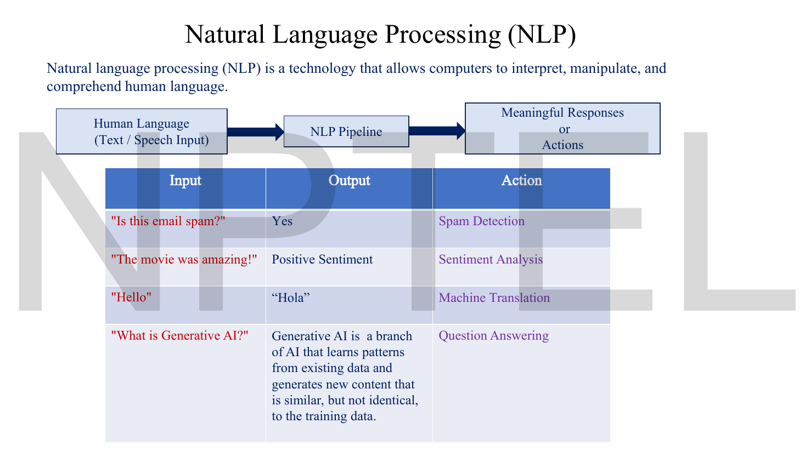
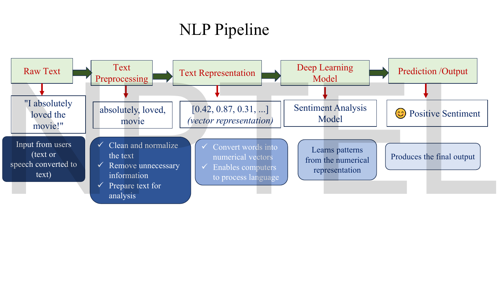
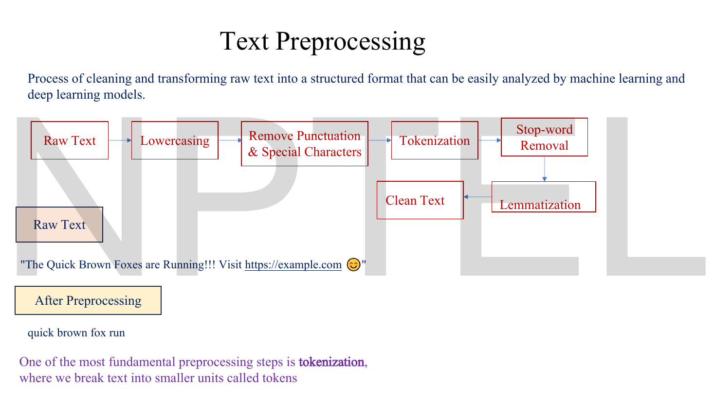
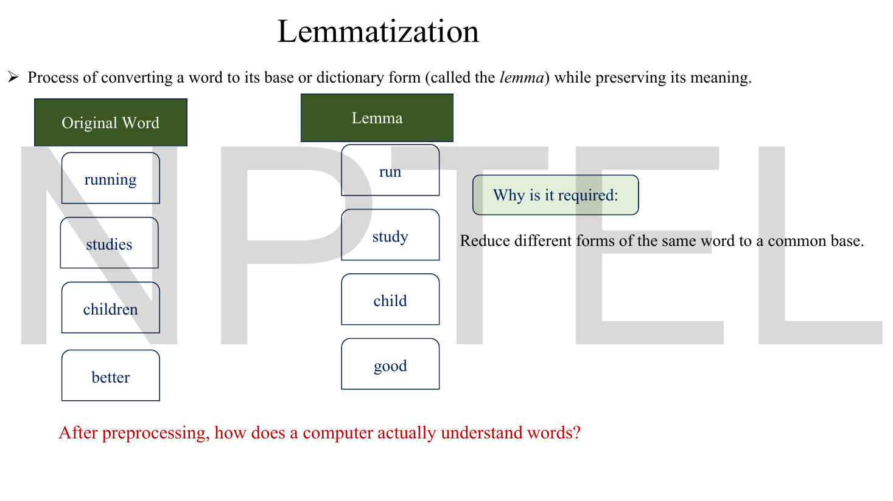
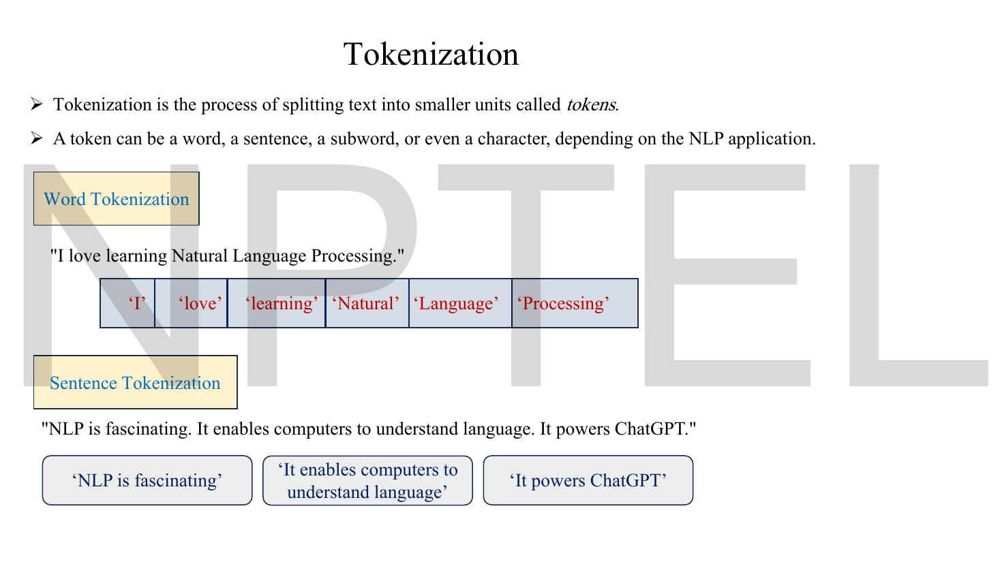
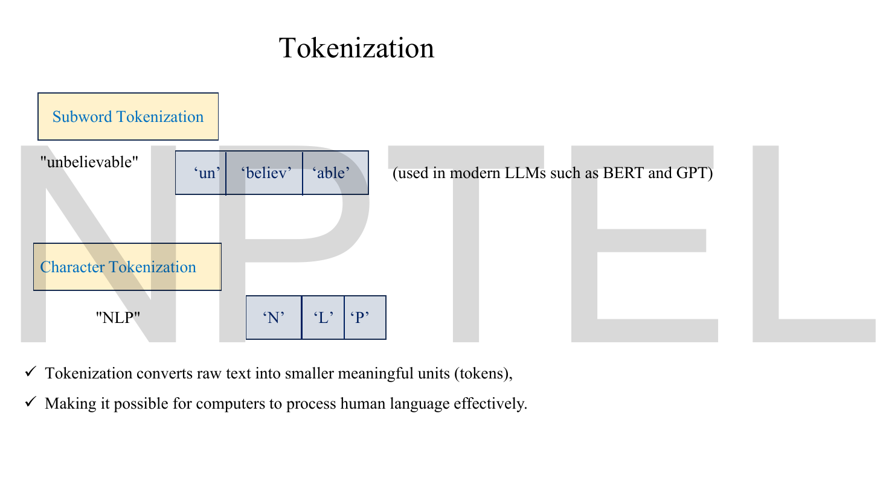
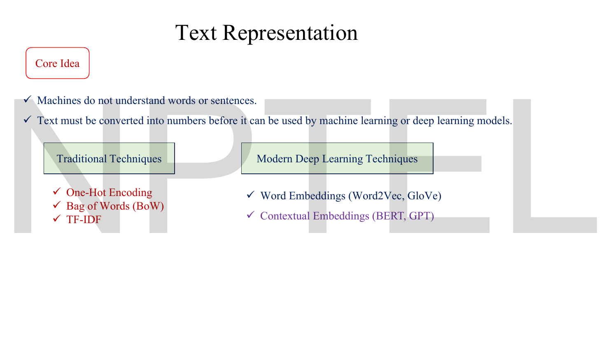
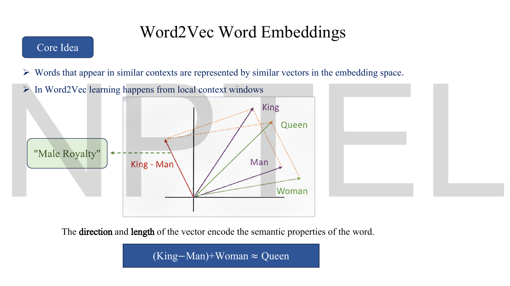
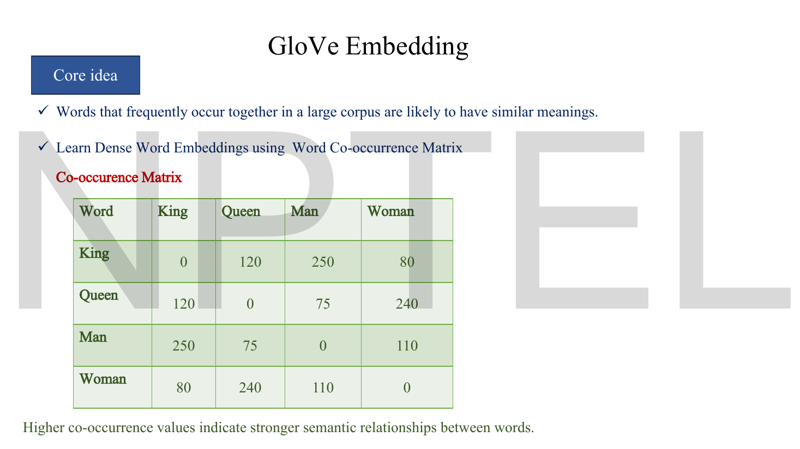
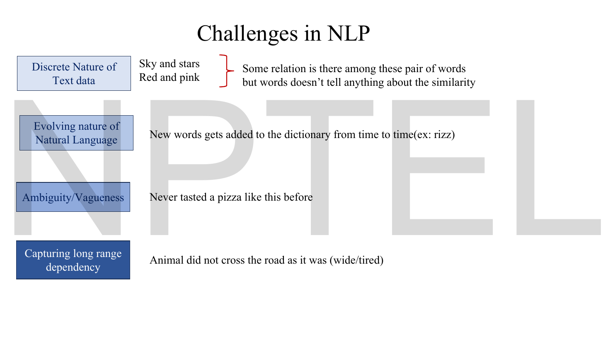

# Lec 54 — Foundations of NLP

> **Source:** `Lec 54.pdf` (16 pages) · **Week 9** · **Playlist:** Lec 54
> **Prereqs:** [Lec 01 — Introduction to Generative AI](01-intro-generative-ai.md), [Lec 10 — Introduction to Autoencoders](10-autoencoder-intro.md)
> **Feeds into:** [Lec 55 — RNNs and LSTM](55-rnn-lstm.md), [Lec 57 — Transformer Encoder](57-transformer-encoder.md), [Lec 60 — BERT](60-bert.md), [Lec 61 — GPT](61-gpt.md)

## Why this lecture exists

Eight weeks of this course have been about images. An image arrives as a grid of numbers; you can subtract two of them, interpolate between them, add Gaussian noise to them. Language arrives as *characters*. You cannot subtract "king" from "queen", you cannot add noise to "the", and there is no sense in which "cat" is 0.3 of the way from "dog" to "car".

Every architecture in the second half of the course — RNN, LSTM, Transformer, BERT, GPT — assumes its input is already a sequence of vectors. This lecture is the adapter that makes that true. It does two things: **tokenization**, which cuts a string into discrete units, and **embedding**, which maps each unit to a vector in $\mathbb{R}^d$ where arithmetic means something again. Everything after Week 9 is built on top of the output of this lecture, and if you are hazy about which step produces what, every later architecture diagram will be hard to read.

## The ideas

### The bridge from Weeks 1–8

Hold on to what transfers, because most of it does.

| Idea you already have | How it reappears in language |
|---|---|
| Encoder / decoder ([Lec 10](10-autoencoder-intro.md)) | unchanged — an encoder reads a sentence into a vector, a decoder writes one out ([Lec 59](59-transformer-decoder.md)) |
| A latent space with meaningful directions ([Lec 28](28-latent-interpolation.md)) | the **embedding space**; "King − Man + Woman ≈ Queen" is latent arithmetic |
| Cross-entropy loss ([Lec 02](02-activations-and-losses.md)) | unchanged — next-token prediction is a $\lvert V\rvert$-way classification |
| Conditioning on a label ([Lec 27](27-conditional-vae.md), [Lec 38](38-conditional-gan.md)) | conditioning on a *prompt* |
| Convolution's local receptive field ([Lec 05](05-cnn-a.md)) | an RNN's recurrence and attention's context window play the same role |

And what genuinely changes — three things, and all the difficulty is in them.

1. **The data is discrete.** A pixel is a real number; a word is a symbol from a finite set. You cannot take $\partial\mathcal{L}/\partial(\text{``cat''})$. Embeddings exist to restore differentiability: the symbol indexes a row of a learnable matrix, and the *row* has gradients.
2. **The data is sequential and variable-length.** Every MNIST image is 28×28. Sentences are not. Nothing in this course so far has had to handle a variable-length input.
3. **The vocabulary is open.** New words appear constantly — the deck's own example is *rizz*. A pixel value of 137 was always possible; a word you have never seen was not.

### What this lecturer means by NLP

> **Natural language processing (NLP) is a technology that allows computers to interpret, manipulate, and comprehend human language.**

The deck's frame is a three-box pipeline — human language (text or speech converted to text) → NLP pipeline → meaningful responses or actions — and it immediately grounds that in four input/output/action triples.

| Input | Output | Action |
|---|---|---|
| "Is this email spam?" | Yes | Spam detection |
| "The movie was amazing!" | Positive Sentiment | Sentiment analysis |
| "Hello" | "Hola" | Machine translation |
| "What is Generative AI?" | a paragraph of definition | Question answering |


*Fig. — Read the **Output** column as a taxonomy of output *types*, not of topics: a binary label, a class label, another sentence, a free-form paragraph. The architecture you need is decided by that column, not by the input. Page 3.*

That is this deck's task taxonomy, extended by its applications slide to six named uses: **chatbots, machine translation, sentiment analysis, spam detection, summarization, question answering**, under the rubric "whenever a computer processes, understands, or generates human language, NLP is at work". A tighter organising principle, which the deck leaves implicit but every later lecture assumes:

| Output shape | Tasks here | Model shape |
|---|---|---|
| one label per **sequence** | spam detection, sentiment analysis | encoder + classifier head → [Lec 60](60-bert.md) |
| one label per **token** | (not on this deck) part-of-speech, named entities | encoder + per-position head |
| a new **sequence** | translation, summarization, QA, chatbots | encoder–decoder or decoder-only → [Lec 59](59-transformer-decoder.md), [Lec 61](61-gpt.md) |

The companion course develops this three-way split with evaluation metrics and confusion matrices in `../../DLforNLP/notes/week-01/05-nlp-tasks-and-paradigms.md`; this lecturer gives the examples and moves on.

### The pipeline — this deck's spine

Five stages, and every one of the next nine lectures lives inside one of them.

$$\text{Raw text} \;\to\; \text{Text preprocessing} \;\to\; \text{Text representation} \;\to\; \text{Deep learning model} \;\to\; \text{Prediction / output}$$


*Fig. — The running example makes the handover concrete. Stage 2 outputs **tokens** (`absolutely, loved, movie`); stage 3 outputs **numbers** (`[0.42, 0.87, 0.31, ...]`). That boundary — symbols to vectors — is the only genuinely new idea in the lecture. Page 5.*

The deck's own gloss on each stage: preprocessing "cleans and normalises the text, removes unnecessary information, prepares text for analysis"; representation "converts words into numerical vectors, enables computers to process language"; the model "learns patterns from the numerical representation". Stages 1–3 are this chapter. Stage 4 is Lectures 55–61. Stage 5 is whatever head you bolt on.

### Text preprocessing: the deck's seven-box chain

> **Text preprocessing is the process of cleaning and transforming raw text into a structured format that can be easily analyzed by machine learning and deep learning models.**

The deck fixes an order, and **the order is examinable**:

```
Raw Text → Lowercasing → Remove Punctuation & Special Characters
         → Tokenization → Stop-word Removal → Lemmatization → Clean Text
```

Note where tokenization sits: **fourth, after punctuation removal**. That is the classical ordering, and it is not the only one in use — modern subword tokenizers run on raw bytes with no cleaning at all, so BERT and GPT do none of steps 2, 3, 5 or 6. Keep the deck's order for the exam and know that it describes pre-2018 NLP.


*Fig. — Audit the example against the chain above and it does not reconcile: nothing in the seven boxes removes a URL, and "visit" is not a stop word in any standard list. N5 works it through. Page 6.*

**Stop-word removal.** Stop words are "frequently occurring words like *the*, *is*, *are*, *of*, *and*" which "usually carry little semantic meaning and can often be removed to reduce noise in the text". The deck's example:

> "The students are learning Natural Language Processing." → "students learning Natural Language Processing"

Two words removed, *The* and *are*. Note the output keeps its capital letters even though lowercasing was supposed to happen two boxes earlier — the slide is illustrating one step in isolation, not running the pipeline.

**Lemmatization** is "the process of converting a word to its base or dictionary form (called the *lemma*) while preserving its meaning", in order to "reduce different forms of the same word to a common base". The deck's four pairs:

| Original | Lemma |
|---|---|
| running | run |
| studies | study |
| children | child |
| better | good |

The last two are the interesting ones. *children → child* and *better → good* are **irregular**: no suffix-stripping rule produces them, which is precisely the difference between lemmatization (dictionary lookup, linguistically correct) and **stemming** (crude suffix chopping — "studies" → "studi"). The deck never names stemming, but the contrast is the obvious exam question, so: *stemming is rule-based and may produce non-words; lemmatization is dictionary-based and always produces a real word.*

The slide then asks the hinge question of the whole lecture, in red: **"After preprocessing, how does a computer actually understand words?"**


*Fig. — "better → good" cannot be produced by any suffix rule; it requires a lexicon. That is the one-line case for lemmatization over stemming. Page 10.*

### Tokenization — four granularities

> **Tokenization is the process of splitting text into smaller units called *tokens*. A token can be a word, a sentence, a subword, or even a character, depending on the NLP application.**

This is the definition to memorise, and the four-way taxonomy is this deck's own organisation — the companion course goes straight to subwords.

**Word tokenization.** "I love learning Natural Language Processing." → `'I' 'love' 'learning' 'Natural' 'Language' 'Processing'` — six tokens; the full stop is dropped.

**Sentence tokenization.** "NLP is fascinating. It enables computers to understand language. It powers ChatGPT." → three tokens, each a whole sentence. This granularity is specific to this lecturer and is genuinely used — for summarization, retrieval chunking and sentence-level classification.

**Subword tokenization.** "unbelievable" → `'un' 'believ' 'able'`, with the deck's own annotation: **"used in modern LLMs such as BERT and GPT"**.

**Character tokenization.** "NLP" → `'N' 'L' 'P'`.


*Fig. — Count the boxes: six word-tokens from a seven-word string, because the period is discarded. Sentence tokenization splits on the periods instead of deleting them — the same character carries opposite meaning at the two granularities. Page 7.*


*Fig. — "believ" is not a word. Subword tokens are chosen by a frequency algorithm, not by a dictionary or by morphology, which is why the split lands one letter short of "believe". Page 8.*

**Why subwords won**, which the deck states as a fact and does not argue. The three granularities trade off against each other on exactly two axes:

| Granularity | Vocabulary size | Tokens per sentence | Unknown words |
|---|---|---|---|
| Character | ~100 | very many | **impossible** |
| Subword | ~30k–50k | moderate | **impossible** — falls back to pieces |
| Word | unbounded (100k+ and still growing) | fewest | **common** → `<UNK>` |

Word-level tokenization hits the deck's own "evolving nature of natural language" challenge head-on: *rizz* was not in your vocabulary when you trained, so it becomes an unknown token and all its information is lost. Character-level never has that problem but makes sequences five to ten times longer, which is expensive for every model in Weeks 9–10. Subwords sit in between: a fixed vocabulary that can still spell anything, because an unseen word decomposes into pieces that *are* in the vocabulary.

> **Compression, not omission (CONTRACT §5).** The *algorithm* that picks the subword inventory — byte-pair encoding, and its relatives WordPiece and SentencePiece — is taught in full, with a hand-run merge trace, at `../../DLforNLP/notes/week-01/02-text-processing-tokenization.md`. This deck names none of them. What *this* lecturer adds that the companion does not is sentence tokenization as a first-class granularity and the explicit four-way taxonomy. For this exam, memorise the four kinds and the one-line examples; for understanding, read the companion's BPE trace once. [Week 12](70-llm-generation-multimodal.md) returns to tokenizers and owns the *sampling* half of that topic, linking back here for tokenization itself.

### Why words have to become vectors at all

The deck's two-line case, which is the hinge of the lecture:

> **Machines do not understand words or sentences. Text must be converted into numbers before it can be used by machine learning or deep learning models.**

True but incomplete, and the deck's own *Challenges* slide supplies the missing half. Its first challenge is the **discrete nature of text data**, illustrated with two pairs — *Sky and stars*, *Red and pink* — and the comment: "some relation is there among these pair of words but words doesn't tell anything about the similarity".

That is the real argument. You could convert words to numbers trivially by assigning each one an integer ID, and it would be useless, because the IDs carry no similarity: *sky* = 4211 and *stars* = 9032 are no closer than *sky* and *toaster*. What you need is a representation in which **distance means something**. The whole of text representation is the search for that.

### The deck's representation taxonomy


*Fig. — Two columns, and the division is **sparse versus dense**. The left column produces vectors as long as the vocabulary, mostly zeros; the right produces short dense vectors that are learned. Contextual embeddings are a third stage the deck lists here and never returns to. Page 11.*

| | Traditional | Modern (deep learning) |
|---|---|---|
| Members | one-hot encoding, bag of words (BoW), TF-IDF | Word2Vec, GloVe; **contextual**: BERT, GPT |
| Vector length | $\lvert V\rvert$ (tens of thousands) | $d$, typically 50–300 (Word2Vec/GloVe) |
| Mostly | zeros | non-zero |
| Learned? | no — counted | yes — trained |
| Similar words get similar vectors? | **no** | **yes** |
| One vector per word, or per occurrence? | per word | per word (Word2Vec, GloVe); **per occurrence** (BERT, GPT) |

The deck names the three traditional techniques and defines none of them, which makes them a likely short-answer question. The one-sentence versions:

- **One-hot encoding** — a vector of length $\lvert V\rvert$, all zeros except a single 1 at the word's index. Any two different words are **orthogonal**, so every cosine similarity is exactly 0. This is the failure the challenge slide describes, made arithmetic (N3).
- **Bag of words (BoW)** — represent a *document* by the counts of each vocabulary word in it. Word order is discarded entirely; "dog bites man" and "man bites dog" are identical vectors.
- **TF-IDF** — BoW reweighted so that a term common to every document counts for nothing: $\text{tf-idf}(t,d) = \text{tf}(t,d)\cdot\ln\!\big(N/\text{df}(t)\big)$, with $N$ documents and $\text{df}(t)$ the number containing $t$. A word in all $N$ documents gets $\ln(1) = 0$ — so TF-IDF deletes stop words automatically, without a stop-word list. N4 computes it.

The last row of the table is the one that matters for Week 10. Word2Vec and GloVe give each word **one** vector, fixed for all time, so *bank* in "river bank" and "bank account" is the same vector. BERT and GPT give a different vector per occurrence, computed from the sentence — that is what *contextual* means, and it is why [Lec 60](60-bert.md) and [Lec 61](61-gpt.md) exist.

### Word2Vec — the distributional hypothesis

> **Words that appear in similar contexts are represented by similar vectors in the embedding space. In Word2Vec learning happens from local context windows.**

That first sentence is the **distributional hypothesis** and it is the single idea underneath every embedding method in the book. You do not need a dictionary to learn that *doctor* and *physician* are related; you only need to notice that the words around them are the same. "Local context window" means Word2Vec looks at a few words either side of the target — not the whole document.

The deck's claim about geometry: **"the direction and length of the vector encode the semantic properties of the word"**, and its headline equation:

$$(\text{King} - \text{Man}) + \text{Woman} \;\approx\; \text{Queen}$$


*Fig. — The parallelogram is the content: King→Queen and Man→Woman are the **same displacement**, so that displacement is the "gender" direction and subtracting it is a meaningful operation. Page 12.*

Two careful readings the slide invites but does not make.

**The label "Male Royalty" on $\text{King}-\text{Man}$ is loose.** Subtracting *Man* from *King* is what *removes* maleness; what is left is the royalty direction, gender-free. That is exactly why adding *Woman* back lands on *Queen* rather than on another male word. If $\text{King}-\text{Man}$ really were "male royalty", the analogy would not work. N2 makes this concrete with two-dimensional vectors.

**Length is doing less work than the slide implies.** Similarity between embeddings is almost always measured by **cosine**, which normalises length away entirely:

$$\cos(\mathbf{v}_a, \mathbf{v}_b) = \frac{\mathbf{v}_a\cdot\mathbf{v}_b}{\lVert\mathbf{v}_a\rVert\,\lVert\mathbf{v}_b\rVert}.$$

Vector norm does correlate with corpus frequency, but direction is what carries meaning. Write "direction and length" if the exam quotes the slide; understand that direction is the operative half.

> **Compression (CONTRACT §5).** The skip-gram and CBOW objectives, negative sampling, the $U(w)^{3/4}$ noise distribution and hierarchical softmax are all developed at `../../DLforNLP/notes/week-03/12-word2vec-skipgram.md` and `.../13-negative-sampling-glove.md`. This deck gives no objective function at all — it states the hypothesis, shows the analogy, and stops. For *this* exam, the hypothesis and the analogy are what is set.

### GloVe — counting instead of sliding a window

> **Words that frequently occur together in a large corpus are likely to have similar meanings. Learn dense word embeddings using a word co-occurrence matrix.**

The contrast with Word2Vec is the examinable point, and the deck draws it by construction: Word2Vec learns from *local context windows*, one at a time; GloVe builds a **global** co-occurrence matrix over the whole corpus first, then factorises it. Same hypothesis, opposite bookkeeping.

The deck's matrix:

| | King | Queen | Man | Woman |
|---|---|---|---|---|
| **King** | 0 | 120 | 250 | 80 |
| **Queen** | 120 | 0 | 75 | 240 |
| **Man** | 250 | 75 | 0 | 110 |
| **Woman** | 80 | 240 | 110 | 0 |

Entry $X_{ij}$ counts how often word $j$ appears in word $i$'s context. The matrix is **symmetric**, and its diagonal has been set to 0 (a word is not counted as its own context here).


*Fig. — The slide's closing claim — "higher co-occurrence values indicate stronger semantic relationships between words" — is **false on its own matrix** once you compute row similarities. N1 computes all six pairs and finds the ranking almost exactly reversed. Page 13.*

This is worth dwelling on, because it is the one place the deck can be shown to be wrong with arithmetic. The slide invites you to read a *pair's* count as a similarity. But the quantity that matters distributionally is not $X_{ij}$; it is how alike row $i$ and row $j$ are — because that is what "appear in similar contexts" means. On this matrix the two disagree completely. $X_{\text{Queen},\text{Man}} = 75$ is the **smallest** count in the table, yet $\cos(\text{Queen row}, \text{Man row}) = 0.7147$ is the **largest** similarity. N1 has the full table.

That is partly an artefact of a four-word toy matrix with a zeroed diagonal, and you should say so if asked. But the principle survives at full scale: *the* co-occurs enormously often with every noun and is similar to none of them. Raw counts need to be reweighted — by pointwise mutual information, or by GloVe's log-ratio objective and its frequency-weighting function — before they behave like similarity. The companion derives that reweighting at `../../DLforNLP/notes/week-03/11-word-representation.md` and the GloVe objective at `.../13-negative-sampling-glove.md`.

The other thing the matrix is not: **a co-occurrence matrix is not an embedding.** It is $\lvert V\rvert\times\lvert V\rvert$, sparse and huge. GloVe's output is a $\lvert V\rvert\times d$ dense matrix obtained by factorising it — the deck's phrase "learn dense word embeddings **using** a word co-occurrence matrix" is doing a lot of work in that one preposition.

### The four challenges this lecturer names


*Fig. — The last row is a pointer, not a complaint: "Animal did not cross the road as it was (wide/tired)" is the classic Winograd pair, and resolving *it* is exactly what attention does. Page 14.*

| Challenge | The deck's example | Where the course answers it |
|---|---|---|
| **Discrete nature of text data** | *Sky and stars*, *Red and pink* — related, but the words themselves say nothing about similarity | embeddings — this lecture |
| **Evolving nature of natural language** | new words enter the dictionary over time (*rizz*) | subword tokenization — this lecture |
| **Ambiguity / vagueness** | "Never tasted a pizza like this before" — praise or insult? | context, i.e. contextual embeddings → [Lec 60](60-bert.md) |
| **Capturing long-range dependency** | "Animal did not cross the road as it was (wide/tired)" — what does *it* refer to? | recurrence then attention → [Lec 55](55-rnn-lstm.md), [Lec 57](57-transformer-encoder.md) |

The fourth example is the sharpest thing on the deck. Swap one adjective and the referent of *it* flips: if the road was **wide** then *it* is the road; if the animal was **tired** then *it* is the animal. No amount of word-level preprocessing helps, because both sentences have almost identical token sets. Resolving it requires a model that lets *it* look back at both candidate nouns and weigh them — which is self-attention, and why Week 9 ends where it does.

## Worked numericals

**The deck contains no worked arithmetic at all.** Its only numbers are the GloVe co-occurrence matrix on page 13 and the illustrative vector `[0.42, 0.87, 0.31, ...]` on page 5. All six numericals below are constructed; N1 and N2 are built on the deck's own matrix, N5 audits the deck's own preprocessing example. Logarithms are natural throughout and the base is stated in every answer.

### N1. Cosine similarity on the deck's co-occurrence matrix

**Given:** the page-13 matrix, rows in the order King, Queen, Man, Woman.
**Find:** $\cos$ between every pair of **rows**, and whether it agrees with the slide's claim that higher counts mean stronger relationships.

1. Row norms. $\lVert\text{King}\rVert = \sqrt{0^2+120^2+250^2+80^2} = \sqrt{0+14{,}400+62{,}500+6{,}400} = \sqrt{83{,}300} = 288.617$.
   Similarly $\lVert\text{Queen}\rVert = \sqrt{77{,}625} = 278.613$, $\lVert\text{Man}\rVert = \sqrt{80{,}225} = 283.240$, $\lVert\text{Woman}\rVert = \sqrt{76{,}100} = 275.862$.
2. King · Queen $= 0(120) + 120(0) + 250(75) + 80(240) = 0 + 0 + 18{,}750 + 19{,}200 = 37{,}950$.
3. $\cos(\text{King},\text{Queen}) = 37{,}950/(288.617\times278.613) = 37{,}950/80{,}412.6 = 0.4719$.
4. Repeating for all six pairs:

| Pair | raw count $X_{ij}$ | dot product | cosine | rank by count | rank by cosine |
|---|---|---|---|---|---|
| King–Woman | 80 | 56,300 | **0.7071** | 5th | 2nd |
| Queen–Man | 75 | 56,400 | **0.7147** | 6th (lowest) | **1st** |
| Man–Woman | 110 | 38,000 | 0.4863 | 4th | 3rd |
| King–Queen | 120 | 37,950 | 0.4719 | 3rd | 4th |
| Queen–Woman | 240 | 17,850 | 0.2322 | 2nd | 5th |
| King–Man | 250 | 17,800 | **0.2177** | **1st (highest)** | 6th (lowest) |

**Answer:** the two orderings are **exactly reversed**. The highest count (King–Man, 250) gives the lowest row similarity (0.2177); the lowest count (Queen–Man, 75) gives the highest (0.7147). The slide's claim is therefore false as stated on its own data. The reason is structural: with a zeroed diagonal, a large $X_{ij}$ puts mass in *different* coordinates of rows $i$ and $j$ — King's mass sits in the Man column, Man's sits in the King column — so a strong pair contributes nothing to their dot product. Raw co-occurrence measures *association*; row cosine measures *distributional similarity*; they are different quantities and GloVe uses the second.

### N2. The analogy, on counts and on embeddings

**Given:** the same matrix, and separately a two-dimensional toy embedding with axes $[\text{royalty},\ \text{femaleness}]$: King $=[0.9,0.1]$, Queen $=[0.9,0.9]$, Man $=[0.1,0.1]$, Woman $=[0.1,0.9]$.
**Find:** whether $(\text{King}-\text{Man})+\text{Woman}\approx\text{Queen}$ holds in each.

**On the raw count rows:**

1. $\text{King} - \text{Man} = [0,120,250,80]-[250,75,0,110] = [-250,\,45,\,250,\,-30]$.
2. Add Woman: $[-250,45,250,-30]+[80,240,110,0] = [-170,\,285,\,360,\,-30]$.
3. Dot with the Queen row $[120,0,75,240]$: $(-170)(120) + 285(0) + 360(75) + (-30)(240) = -20{,}400 + 0 + 27{,}000 - 7{,}200 = -600$.
4. $\lVert[-170,285,360,-30]\rVert = \sqrt{28{,}900+81{,}225+129{,}600+900} = \sqrt{240{,}625} = 490.536$.
5. $\cos = -600/(490.536\times278.613) = \mathbf{-0.0044}$ — orthogonal to Queen. Checking the other three candidates: King 0.8603, Woman 0.6976, Man $-0.1758$. **The nearest word is King**, i.e. the analogy returns its own starting point.

**On the embeddings:**

6. $\text{King} - \text{Man} = [0.9-0.1,\ 0.1-0.1] = [0.8,\ 0.0]$ — pure royalty, the gender coordinate cancels exactly.
7. $+\ \text{Woman} = [0.8+0.1,\ 0.0+0.9] = [0.9,\ 0.9]$.
8. Queen $= [0.9, 0.9]$. $\cos = 1.0000$, distance 0.

**Answer:** the analogy **fails** on the raw co-occurrence matrix ($\cos = -0.0044$ with Queen, and King is nearer) and holds **exactly** in the dense embedding space ($\cos = 1$). This is the clearest possible statement of why Word2Vec and GloVe learn dense vectors instead of using counts directly, and of why "King − Man" is the *royalty* direction rather than the deck's "Male Royalty": the gender coordinate is annihilated by the subtraction, which is the only reason adding Woman back can land on a female word.

### N3. One-hot encoding — dimension, orthogonality and storage

**Given:** a vocabulary of $\lvert V\rvert = 50{,}000$ words; dense embeddings of dimension $d = 300$; float32 (4 bytes).
**Find:** the one-hot vector's length and sparsity, the cosine between any two distinct words, and the storage for the full lookup table under each scheme.

1. **Length** of a one-hot vector $= \lvert V\rvert = 50{,}000$. Exactly one entry is 1, so the fraction of non-zeros is $1/50{,}000 = 0.002\%$.
2. **Cosine between two distinct words.** Their 1s are at different indices, so the dot product is $\sum_i u_iv_i = 0$. Hence $\cos = 0/(1\times1) = \mathbf{0}$ for *every* pair of distinct words, and $1$ for a word with itself. There is no middle value — the representation cannot express "somewhat similar".
3. **One-hot table:** $50{,}000\times50{,}000\times4 = 1.0\times10^{10}$ bytes $= \mathbf{10\ \text{GB}}$.
4. **Dense table:** $50{,}000\times300\times4 = 6.0\times10^{7}$ bytes $= \mathbf{60\ \text{MB}}$.
5. Ratio $= \lvert V\rvert/d = 50{,}000/300 = \mathbf{166.7\times}$.

**Answer:** one-hot needs 50,000 dimensions per word, gives cosine 0 between every distinct pair, and costs 10 GB against the embedding's 60 MB — 167 times more memory to store strictly less information. The cosine result is the arithmetic form of the deck's "discrete nature of text data" challenge: *sky* and *stars* are exactly as similar as *sky* and *toaster*, namely not at all.

### N4. TF-IDF, and why it deletes stop words for free

The deck names TF-IDF and never defines it. Here it is on a three-document corpus.

**Given:**
$d_1$ = "the students are learning natural language processing" (7 tokens)
$d_2$ = "the students love the movie" (5 tokens)
$d_3$ = "the movie was amazing" (4 tokens)
with $\text{tf}(t,d) = \text{count}(t,d)/\lvert d\rvert$ and $\text{idf}(t) = \ln(N/\text{df}(t))$, $N=3$.
**Find:** the TF-IDF of every term in $d_3$.

1. Document frequencies: $\text{df}(\text{the}) = 3$ (all three), $\text{df}(\text{movie}) = 2$ ($d_2, d_3$), $\text{df}(\text{was}) = 1$, $\text{df}(\text{amazing}) = 1$.
2. IDFs, natural log: $\ln(3/3) = \ln 1 = 0$; $\ln(3/2) = 0.405465$; $\ln(3/1) = 1.098612$.
3. Every term in $d_3$ occurs once in a 4-token document, so $\text{tf} = 0.25$ for all four.
4. Multiply:

| term | tf | df | idf (nats) | tf-idf |
|---|---|---|---|---|
| the | 0.25 | 3 | 0.000000 | **0.000000** |
| movie | 0.25 | 2 | 0.405465 | 0.101366 |
| was | 0.25 | 1 | 1.098612 | 0.274653 |
| amazing | 0.25 | 1 | 1.098612 | 0.274653 |

**Answer:** $\text{tf-idf}(\text{the}, d_3) = \mathbf{0}$ exactly, in natural log. ("was" and "amazing" tie at 0.274653 nats; "movie" scores 0.101366.) A term appearing in **every** document gets $\ln(N/N) = \ln 1 = 0$ and is annihilated no matter how often it appears — so TF-IDF performs stop-word removal automatically, without needing the deck's stop-word list. Watch the base: in $\log_{10}$ the same three IDFs are $0$, $0.176091$ and $0.477121$, and the tf-idf values become 0, 0.044023 and 0.119280 — all smaller by the factor $\ln 10 = 2.302585$. The zero is the same in any base, which is the whole point.

### N5. Auditing the deck's preprocessing example

**Given:** page 6's raw text `"The Quick Brown Foxes are Running!!! Visit https://example.com 😊"` and its stated output `quick brown fox run`, against the deck's own seven-box chain.
**Find:** run the chain and compare token counts at each stage.

1. **Raw.** Splitting on whitespace: `The | Quick | Brown | Foxes | are | Running!!! | Visit | https://example.com | 😊` — **9 whitespace-separated units**.
2. **Lowercasing:** `the quick brown foxes are running!!! visit https://example.com 😊`.
3. **Remove punctuation and special characters.** The three exclamation marks and the emoji go. The URL's `:` and `/` are punctuation too, so it becomes `httpsexamplecom` — or, if you strip on punctuation boundaries, three fragments `https example com`.
4. **Tokenization** (word level): `the, quick, brown, foxes, are, running, visit, https, example, com` — **10 tokens** (or 8 if the URL collapsed to one string).
5. **Stop-word removal.** NLTK's English list contains *the* and *are*; it does **not** contain *visit*, *https*, *example* or *com*. Result: `quick, brown, foxes, running, visit, https, example, com` — **8 tokens**.
6. **Lemmatization:** `quick, brown, fox, running, visit, https, example, com`. Note *running* → *run* requires telling the lemmatizer the word is a **verb**; with the default noun assumption WordNet returns *running* unchanged.
7. **The deck's printed output** is `quick brown fox run` — **4 tokens**.

**Answer:** the chain as drawn yields 8 tokens, not 4. Four of the deck's eight are unaccounted for: *visit* is removed although no named step removes it (it is not a stop word), and the URL's three fragments disappear although no named step removes URLs. **The slide needs two steps it does not list — URL/noise removal, and a corpus-specific stop-word list — and it needs the lemmatizer's part-of-speech set to verb.** Reproduce the deck's answer in an exam; know the chain is incomplete.

### N6. The embedding matrix is a parameter count

**Given:** an embedding layer mapping $\lvert V\rvert$ token IDs to $d$-dimensional vectors.
**Find:** its parameter count, for three concrete settings, and what the layer actually computes.

1. The layer is a matrix $\mathbf{E} \in \mathbb{R}^{\lvert V\rvert\times d}$ with $\lvert V\rvert \cdot d$ learnable entries and **no bias**.
2. The forward pass is a *row lookup*: $\mathbf{v}_w = \mathbf{E}[w]$. Equivalently $\mathbf{v}_w = \mathbf{u}_w^\top\mathbf{E}$ where $\mathbf{u}_w$ is $w$'s one-hot vector — multiplying a one-hot vector by a matrix selects a row, which is exactly why an embedding layer is sometimes described as "a linear layer on one-hot input". Nobody implements it that way, because the lookup is $O(d)$ and the multiplication is $O(\lvert V\rvert d)$.
3. Counts:

| Setting | $\lvert V\rvert$ | $d$ | parameters |
|---|---|---|---|
| Word2Vec on a small corpus | 10,000 | 100 | 1,000,000 |
| GloVe, standard release | 400,000 | 300 | 120,000,000 |
| [Lec 53](53-reverse-diffusion-handson.md)'s class embedding | 11 | 128 | 1,408 |

**Answer:** $\lvert V\rvert\times d$ parameters, trained by gradient descent like any other weight matrix. The third row is the point of the table: the "class embedding" that conditions a diffusion U-Net on a digit is the *same object* as a word embedding — a learnable lookup table turning a discrete symbol into a vector. You have been using embeddings since Week 6 without the name. For a $\lvert V\rvert = 50{,}000$, $d = 300$ model, the embedding alone is 15 million parameters, often the largest single tensor in a small language model.

## Code

The deck's GloVe matrix is the only data in the lecture, so this runs the two claims against it: that a higher co-occurrence count means a stronger relationship (N1), and that the analogy works (N2). Then it does the same analogy in a dense space to show what the learned representation has to look like.

```python
import numpy as np

WORDS = ["King", "Queen", "Man", "Woman"]
# The deck's co-occurrence matrix, page 13. Symmetric, zero diagonal.
X = np.array([[  0, 120, 250,  80],
              [120,   0,  75, 240],
              [250,  75,   0, 110],
              [ 80, 240, 110,   0]], dtype=float)

def cos(u, v):
    return float(u @ v / (np.linalg.norm(u) * np.linalg.norm(v)))

print("pair          raw count   cosine of the two ROWS")
for i in range(4):
    for j in range(i + 1, 4):
        print(f"{WORDS[i]:>5s}-{WORDS[j]:<6s} {X[i, j]:7.0f}      {cos(X[i], X[j]):.4f}")

# The deck's analogy, run on the RAW counts.
v = X[0] - X[2] + X[3]                      # King - Man + Woman
print("\nKing - Man + Woman =", v)
print("  nearest row by cosine:",
      sorted(((round(cos(v, X[k]), 4), WORDS[k]) for k in range(4)), reverse=True))

# The same analogy in a 2-D DENSE space whose axes are [royalty, femaleness].
E = {"King": np.array([0.9, 0.1]), "Queen": np.array([0.9, 0.9]),
     "Man":  np.array([0.1, 0.1]), "Woman": np.array([0.1, 0.9])}
w = E["King"] - E["Man"] + E["Woman"]
print("\ndense: King - Man + Woman =", w, " Queen =", E["Queen"],
      " cosine =", round(cos(w, E["Queen"]), 4))
print("dense: King - Man =", E["King"] - E["Man"], "(pure royalty, gender cancels)")

# One-hot: every distinct pair is orthogonal, so similarity is unavailable.
V = 4
I = np.eye(V)
print("\none-hot cos(King, Queen) =", cos(I[0], I[1]),
      " | cos(King, King) =", cos(I[0], I[0]))
```

```
pair          raw count   cosine of the two ROWS
 King-Queen      120      0.4719
 King-Man        250      0.2177
 King-Woman       80      0.7071
Queen-Man         75      0.7147
Queen-Woman      240      0.2322
  Man-Woman      110      0.4863

King - Man + Woman = [-170.  285.  360.  -30.]
  nearest row by cosine: [(0.8603, 'King'), (0.6976, 'Woman'), (-0.0044, 'Queen'), (-0.1758, 'Man')]

dense: King - Man + Woman = [0.9 0.9]  Queen = [0.9 0.9]  cosine = 1.0
dense: King - Man = [0.8 0. ] (pure royalty, gender cancels)

one-hot cos(King, Queen) = 0.0  | cos(King, King) = 1.0
```

Three readings. The count column and the cosine column rank the six pairs in **opposite** order, so "higher co-occurrence ⇒ stronger relationship" does not survive contact with its own matrix. The analogy on raw counts returns **King** — its own input — with Queen sitting at cosine $-0.0044$, essentially orthogonal; in the dense space it is exact. And the one-hot line is the baseline the whole lecture is arguing against: every distinct pair scores exactly 0, every word scores exactly 1 with itself, and there is nothing in between.

## Exam pack

### Must-memorise

| Item | Exactly this |
|---|---|
| NLP, the deck's definition | a technology that allows computers to **interpret, manipulate and comprehend** human language |
| The pipeline | raw text → text preprocessing → text representation → deep learning model → prediction/output |
| Preprocessing chain | lowercasing → remove punctuation & special characters → tokenization → stop-word removal → lemmatization → clean text |
| Tokenization | splitting text into smaller units called **tokens** |
| The four granularities | word · sentence · subword · character |
| Subword tokenization is used by | **modern LLMs such as BERT and GPT** |
| Stop words | frequently occurring words (*the, is, are, of, and*) carrying little semantic meaning |
| Lemma | a word's base or dictionary form, meaning preserved |
| Traditional representations | one-hot encoding, bag of words, TF-IDF |
| Modern representations | Word2Vec, GloVe (static); BERT, GPT (contextual) |
| Word2Vec core idea | words in similar contexts get similar vectors; learning from **local context windows** |
| The analogy | $(\text{King}-\text{Man})+\text{Woman}\approx\text{Queen}$ |
| GloVe core idea | words frequently co-occurring in a large corpus likely share meaning; dense embeddings from a **word co-occurrence matrix** |
| TF-IDF | $\text{tf}(t,d)\cdot\ln(N/\text{df}(t))$ |
| Cosine similarity | $\cos(\mathbf{v}_a,\mathbf{v}_b) = \dfrac{\mathbf{v}_a\cdot\mathbf{v}_b}{\lVert\mathbf{v}_a\rVert\lVert\mathbf{v}_b\rVert}$ |
| The four challenges | discrete nature · evolving language · ambiguity/vagueness · long-range dependency |

### Numbers worth knowing

| Quantity | Value |
|---|---|
| Deck's word-tokenization example | 6 tokens from "I love learning Natural Language Processing." |
| Deck's sentence-tokenization example | 3 sentences |
| "unbelievable" at subword level | 3 tokens: un / believ / able |
| "NLP" at character level | 3 tokens |
| Deck's stop-word example | 7 words → 5 (removes *The*, *are*) |
| Deck's preprocessing example | printed as 4 tokens; the drawn chain yields 8 (N5) |
| Co-occurrence matrix entries | King–Man 250 · Queen–Woman 240 · King–Queen 120 · Man–Woman 110 · King–Woman 80 · Queen–Man 75 |
| Highest row cosine on that matrix | Queen–Man, 0.7147 (the **lowest** count) |
| Lowest row cosine | King–Man, 0.2177 (the **highest** count) |
| Analogy on raw counts | $\cos$ with Queen $= -0.0044$; nearest word is King (0.8603) |
| Cosine between distinct one-hot vectors | exactly 0 |
| Typical embedding dimension $d$ | 50–300 (Word2Vec, GloVe) |
| Typical subword vocabulary | 30k–50k |
| Character vocabulary | ~100 symbols |
| Embedding-layer parameters | $\lvert V\rvert \times d$, no bias |
| One-hot vs dense table, $\lvert V\rvert=50$k, $d=300$ | 10 GB vs 60 MB — $166.7\times$ |
| TF-IDF of a term in all $N$ documents | 0, in any log base |

### Likely MCQ traps

- **"Higher co-occurrence means more similar."** The deck says it; its own matrix refutes it. Co-occurrence counts measure *association between a pair*; distributional similarity is the cosine of two *rows*. On page 13's numbers the two rankings are exactly reversed (N1).
- **Confusing lemmatization with stemming.** Stemming chops suffixes by rule and may produce non-words ("studies" → "studi"); lemmatization uses a dictionary and always returns a real word, including irregulars ("better" → "good", "children" → "child"). The deck shows only lemmatization, and chose irregular examples on purpose.
- **Thinking a co-occurrence matrix *is* the embedding.** It is $\lvert V\rvert\times\lvert V\rvert$ and sparse. GloVe **factorises** it to get a $\lvert V\rvert\times d$ dense matrix. "Learn dense embeddings *using* a co-occurrence matrix."
- **Placing tokenization first in the pipeline.** In this deck it is **fourth** — after lowercasing and punctuation removal. (Modern subword tokenizers do invert this, but the exam is set from this slide.)
- **"One-hot encoding is a word embedding."** It is in the deck's *traditional* column: sparse, length $\lvert V\rvert$, not learned, and orthogonal between every distinct pair. An embedding is dense, short and learned.
- **Word2Vec vs GloVe.** Word2Vec learns from **local context windows**, one window at a time; GloVe builds a **global co-occurrence matrix** over the whole corpus first. Both rest on the distributional hypothesis. An option saying "Word2Vec uses a co-occurrence matrix" is the trap.
- **Static vs contextual embeddings.** Word2Vec and GloVe give one fixed vector per word type; BERT and GPT give a different vector per *occurrence*. The deck lists contextual embeddings under "modern deep learning techniques" alongside Word2Vec — they are not the same category.
- **Reading "King − Man" as "male royalty".** The slide's label. Subtracting *Man* removes maleness; the remainder is the gender-free royalty direction, which is the only reason adding *Woman* lands on *Queen* (N2).
- **Assuming the analogy works on counts.** It does not — on the deck's own matrix the result is nearest to **King**, with cosine $-0.0044$ to Queen. It works in learned dense space.
- **Forgetting TF-IDF's zero.** $\text{df}(t) = N$ gives $\ln(N/N) = 0$, so the whole product is 0 regardless of term frequency. Also watch the log base: $\log_{10}$ scales every non-zero IDF by $1/2.302585$.
- **Thinking subword tokenization has an out-of-vocabulary problem.** It does not — an unseen word decomposes into known pieces, in the worst case into single characters. **Word-level** tokenization is what needs `<UNK>`.
- **"Stop-word removal is always good."** It destroys negation (*not*, *no* are on many stop lists) and function words that carry syntax. Modern LLMs do no stop-word removal at all.

### Self-test

1. Name the five stages of the deck's NLP pipeline, in order, and say what crosses the boundary between stage 2 and stage 3.
2. Give the deck's four tokenization granularities with its own one example each.
3. Why can't you feed word IDs (integers) directly to a neural network and call it a representation?
4. Compute the cosine similarity between the King and Man rows of the deck's co-occurrence matrix, and say whether it supports the slide's closing claim.
5. A corpus has $N = 5$ documents. A term appears in all 5. What is its TF-IDF, and why?
6. State the difference between Word2Vec's and GloVe's core idea in one sentence each.
7. A vocabulary of 30,000 words is embedded in 256 dimensions. How many parameters does the embedding layer hold, and how many biases?
8. "Animal did not cross the road as it was tired." What does *it* refer to, and which of the deck's four challenges does the sentence illustrate?
9. Which preprocessing step turns *children* into *child*, and why can't a suffix-stripping rule do it?
10. What is the cosine similarity between the one-hot vectors of *sky* and *stars*? What does your answer say about the deck's first challenge?

<details><summary>Answers</summary>

1. Raw text → text preprocessing → text representation → deep learning model → prediction/output. Between stages 2 and 3 the data stops being **symbols (tokens)** and becomes **numbers (vectors)** — in the deck's example, `absolutely, loved, movie` becomes `[0.42, 0.87, 0.31, ...]`.
2. Word ("I love learning Natural Language Processing." → 6 tokens); sentence (a three-sentence string → 3 tokens); subword ("unbelievable" → un/believ/able, used in BERT and GPT); character ("NLP" → N/L/P).
3. Because integers carry a spurious order and no similarity: ID 4211 is not "closer in meaning" to 4212 than to 9032, yet arithmetic on the IDs would behave as if it were. You need a space where distance encodes meaning — the deck's "discrete nature of text data" challenge.
4. King $=[0,120,250,80]$, Man $=[250,75,0,110]$. Dot $= 0(250)+120(75)+250(0)+80(110) = 0+9{,}000+0+8{,}800 = 17{,}800$. Norms $288.617$ and $283.240$. $\cos = 17{,}800/81{,}751.5 = \mathbf{0.2177}$ — the **lowest** of all six pairs, even though King–Man has the **highest** count (250). It contradicts the slide.
5. $\text{idf} = \ln(5/5) = \ln 1 = 0$ in natural log (and 0 in any base), so $\text{tf-idf} = \text{tf}\times 0 = \mathbf{0}$. A term present in every document distinguishes nothing, so TF-IDF suppresses it — automatic stop-word removal.
6. **Word2Vec:** words appearing in similar contexts get similar vectors, learned from **local context windows**. **GloVe:** words that frequently co-occur across a **large corpus** likely share meaning, with dense embeddings learned from a global **word co-occurrence matrix**.
7. $30{,}000\times256 = \mathbf{7{,}680{,}000}$ parameters, and **zero** biases — an embedding layer is a lookup table, not an affine map.
8. *It* refers to the **animal** (an animal can be tired; a road cannot). The sentence illustrates **capturing long-range dependency** — and swapping *tired* for *wide* flips the referent to the road without changing almost any token, which is why word-level features cannot resolve it.
9. **Lemmatization**. *children* → *child* is an irregular plural; no suffix rule maps "-ren" to a singular, so it requires a dictionary lookup. Stemming would leave *children* (or mangle it); lemmatization returns a real word.
10. Exactly **0** — their 1s sit at different indices, so the dot product is 0. Every pair of distinct words scores 0, so one-hot encoding cannot express that *sky* and *stars* are related while *sky* and *toaster* are not. That is precisely the deck's "discrete nature of text data" challenge, and it is the reason the rest of this lecture exists.

</details>

## Beyond the slides

**Gap: the deck gives no mechanism for learning an embedding.**
**Why it matters:** it states the distributional hypothesis, draws the parallelogram and shows a co-occurrence matrix, but there is no objective function anywhere — not skip-gram, not CBOW, not GloVe's weighted least squares. A reader could finish this lecture thinking embeddings are assigned by hand. The mechanism that closes the gap is one sentence long: an embedding is a learnable $\lvert V\rvert\times d$ matrix trained by gradient descent on a task whose loss depends on which words appear near which, so words with interchangeable neighbourhoods are pushed to interchangeable rows. The derivations are at `../../DLforNLP/notes/week-03/12-word2vec-skipgram.md` and `.../13-negative-sampling-glove.md`; this exam is set from these slides, so know the hypothesis cold and the objective by name.

**Gap: the slide's "higher co-occurrence ⇒ stronger relationship" is wrong on its own data.**
**Why it matters:** it is the only factual claim in the deck that arithmetic can test, so it is a natural exam target, and the correct discrimination — pair *association* versus row *similarity* — is the conceptual core of distributional semantics. It is also why every real system reweights counts (PMI, PPMI, GloVe's log-ratio with its frequency cap) instead of using them raw: *the* co-occurs with everything and is similar to nothing.

**Gap: BoW and TF-IDF are named and never defined.**
**Why it matters:** "define TF-IDF" is a standard short-answer question and the deck gives you nothing to answer it with. N4 supplies the formula, a worked example and the stop-word consequence. Worth knowing alongside: BoW discards word order completely, so "dog bites man" and "man bites dog" are the same vector — the single clearest motivation for the sequence models that Week 9 goes on to teach.

**Gap: no mention of the out-of-vocabulary problem, although the deck raises its cause.**
**Why it matters:** the "evolving nature of natural language" challenge (*rizz*) *is* the OOV problem, and the deck never connects it to the tokenization slide two pages earlier that already solves it. The connection is the exam-worthy one: subword tokenization exists precisely so that a fixed vocabulary can spell a word it has never seen. Without it, every new word collapses to a single `<UNK>` token and all its information is lost.

**Gap: contextual embeddings appear in a bullet and are never explained.**
**Why it matters:** the deck's representation slide lists "Contextual Embeddings (BERT, GPT)" beside Word2Vec and GloVe as if they were variants, when they are a different kind of object: a vector per *occurrence* rather than per *word*. Static embeddings give *bank* one vector for "river bank" and "bank account"; contextual ones give two. That distinction is the whole reason [Lec 60](60-bert.md) and [Lec 61](61-gpt.md) exist, and it is also what makes the deck's "ambiguity/vagueness" challenge solvable.

## Cut from the slides

Page 1 is the title card, page 2 the contents list, page 15 a **bare "Summary" divider with no summary on it**, and page 16 the pointer to [Lec 55](55-rnn-lstm.md) — nothing lost. Page 4's applications hexagon (chatbots, translation, sentiment analysis, spam detection, summarization, question answering) is not embedded because every one of its six items is already in the page-3 table or in the task taxonomy built above it; its one substantive line, "whenever a computer processes, understands, or generates human language, NLP is at work", is quoted. Page 9's stop-word slide is summarised in prose rather than embedded, since the page-6 figure already shows stop-word removal in the chain and the page-9 example adds only two removed words. The Word2Vec objective, CBOW, skip-gram, negative sampling and GloVe's weighted least-squares loss are **not on these slides at all** and are deliberately not reconstructed here — they belong to the companion course (`../../DLforNLP/notes/week-03/`), and reconstructing them would misrepresent what this exam can ask. Byte-pair encoding is named in *The ideas* as the algorithm behind "subword" and linked, not derived, for the same reason. RNNs, LSTMs, attention and Transformers appear nowhere in this chapter: [Lec 55](55-rnn-lstm.md), [Lec 56](56-lstm-to-transformer.md) and [Lec 57](57-transformer-encoder.md) own them completely, and this deck's closing challenge slide is written as a pointer to them rather than as coverage. Everything on pages 3, 5, 6, 7, 8, 10, 11, 12, 13 and 14 is reproduced in full.
