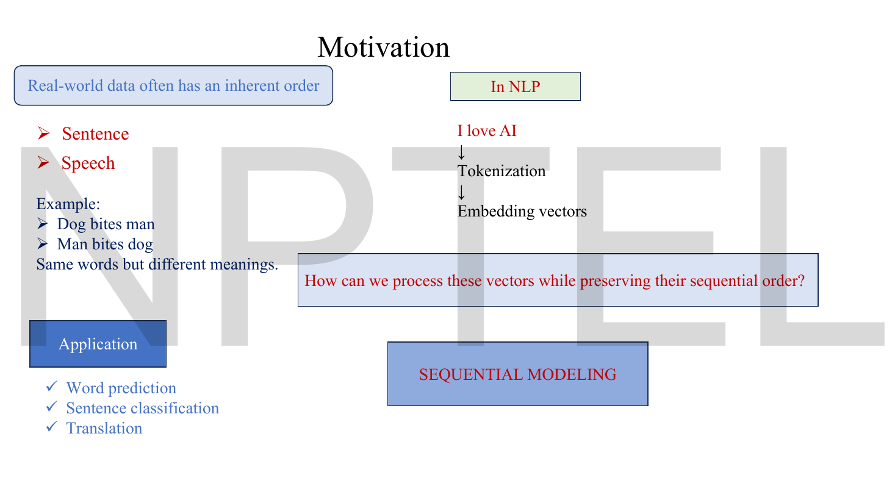
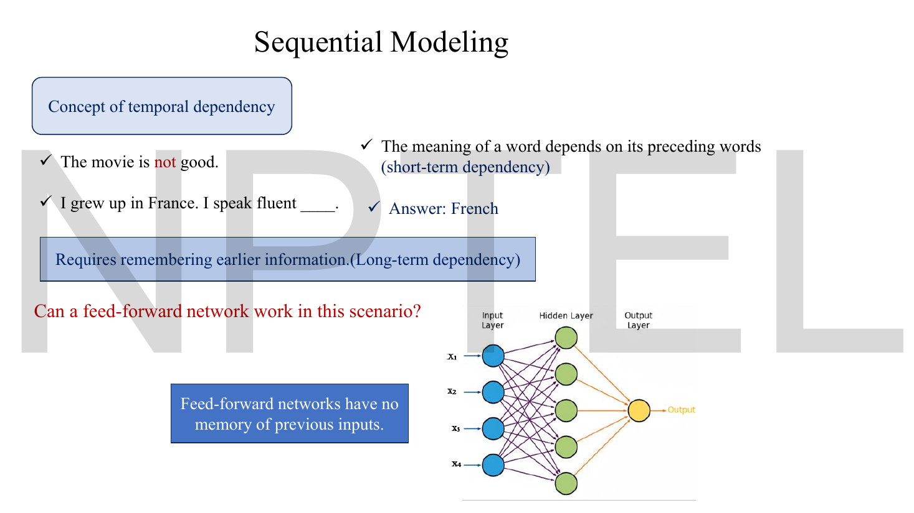
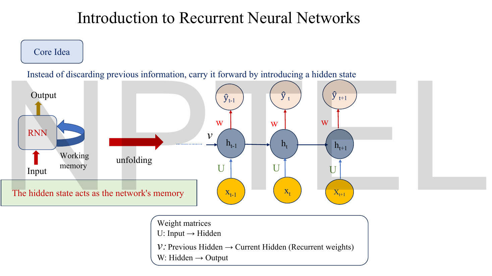
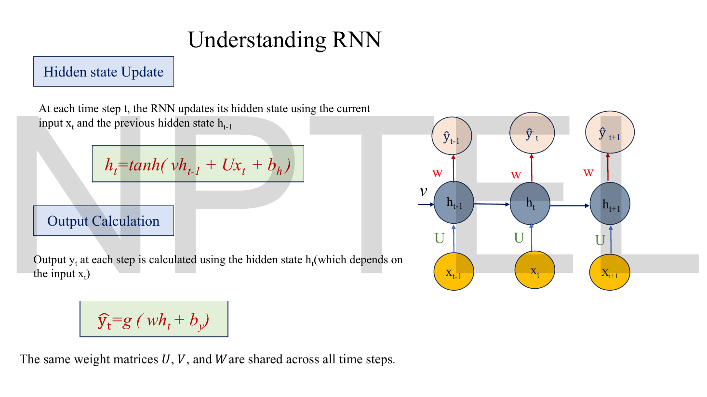
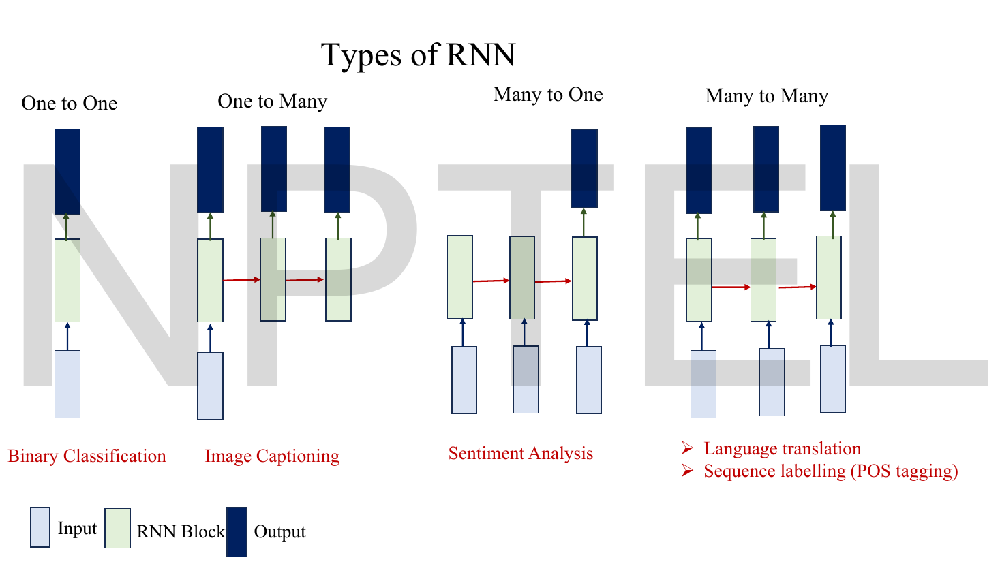
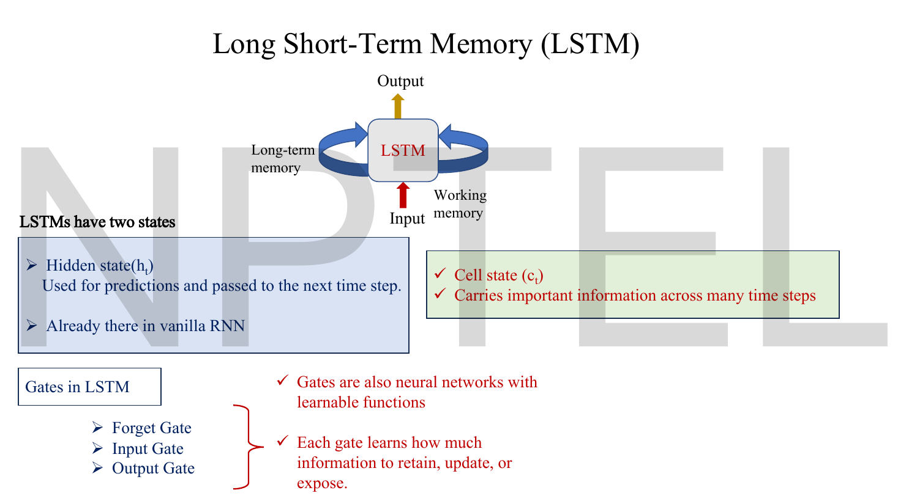
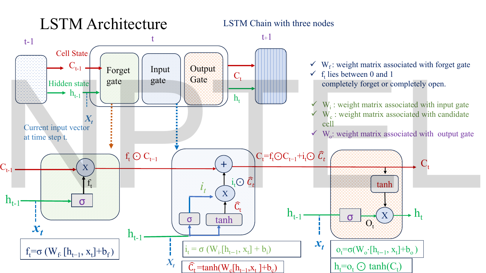

# Lec 55 — Sequential Modeling with RNNs and LSTMs

> **Source:** `Lec 55.pdf` (12 pages) · **Week 9** · **Playlist:** Lec 55
> **Prereqs:** [Lec 02 — Activation and Loss Functions](02-activations-and-losses.md), [Lec 54 — Foundations of NLP](54-nlp-foundations.md)
> **Feeds into:** [Lec 56 — From LSTMs to Transformers](56-lstm-to-transformer.md), [Lec 57 — Transformer Encoder](57-transformer-encoder.md), [Lec 59 — Transformer Decoder](59-transformer-decoder.md)

## Why this lecture exists

Lec 54 turned text into numbers: tokenize, embed, and you have a list of vectors. The list is the problem. "Dog bites man" and "Man bites dog" contain identical vectors and mean opposite things, so whatever consumes the list must care about its *order*. A feed-forward network does not — it sees a fixed-size input and has no memory of anything it processed before.

This lecture introduces the one architectural idea that fixes that: a **hidden state** that is written at every timestep and read at the next, so information flows forward through time. It then shows the price. The same hidden state that carries information also carries gradients, and because the identical weight matrix multiplies it at every step, the gradient is raised to a power. Long sequences make that power large, and a number raised to a large power either vanishes or explodes. The LSTM is the repair: a second state with a gated, mostly-additive update path, so the network can *choose* what to keep.

## The ideas

### Why order is not optional


*Fig. — The question in the pale blue box is the whole lecture: "How can we process these vectors while preserving their sequential order?" Notice the left column is a semantics argument and the right column is a pipeline argument, and they meet in the phrase SEQUENTIAL MODELING. Page 3.*

The deck's examples are worth keeping because an exam can key on them directly:

- **Sentence** and **speech** are the two named ordered data types.
- "Dog bites man" versus "Man bites dog" — *same words, different meanings*. Order carries meaning that the bag of embeddings cannot.
- The named applications are **word prediction**, **sentence classification** and **translation**. Those three map exactly onto the many-to-one / many-to-many split on page 7.

### Two kinds of temporal dependency


*Fig. — The two examples are deliberately different distances apart. "not" sits one word from "good"; "France" sits a full sentence from the blank. The dark blue box is the verdict on the diagram beside it. Page 4.*

The lecturer separates two cases, and the distinction drives everything that follows.

| | Example on the slide | What it needs |
|---|---|---|
| **Short-term dependency** | "The movie is **not** good." | The meaning of a word depends on its *preceding* words — a window of one or two is enough |
| **Long-term dependency** | "I grew up in **France**. I speak fluent ____." (answer: *French*) | Remembering earlier information across many intervening words |

Then the question: **can a feed-forward network do this?** The slide's answer is a single sentence worth memorising verbatim — **"Feed-forward networks have no memory of previous inputs."** Every input is processed independently; nothing from $\mathbf{x}_1$ survives to influence the processing of $\mathbf{x}_5$. You would have to fix the sequence length in advance, pad everything to it, and learn a separate weight for every (position, feature) pair — which is both wasteful and blind to the fact that the *same* word means the same thing in position 2 as in position 7.

### Recurrence: the hidden state as working memory


*Fig. — The left half is the model; the right half is the same model after **unfolding**. Notice the self-loop on the left becomes a horizontal arrow on the right, and the labels U, v and W repeat identically at every step — that repetition is weight sharing. Page 5.*

The core idea, in the deck's own words: **"Instead of discarding previous information, carry it forward by introducing a hidden state."** And the green box: **"The hidden state acts as the network's memory."**

A **recurrent neural network (RNN)** is a network with a loop. At every timestep it reads the current input *and* its own previous output state, and produces a new state. Written as a loop it is one small block. Written out across time — **unrolled**, or **unfolded**, the deck's word — it is a chain of identical blocks, one per timestep.

Three weight matrices appear, and this deck labels them in a way you must not skim past:

| Matrix | This deck's role |
|---|---|
| $\mathbf{U}$ | input → hidden |
| $\mathbf{V}$ | **previous hidden → current hidden** (the recurrent weights) |
| $\mathbf{W}$ | hidden → output |

> **Notation warning — this deck swaps $\mathbf{V}$ and $\mathbf{W}$ relative to the standard textbook.** Goodfellow's *Deep Learning* (and most courses built on it, including parts of `../../DLforNLP/`) uses $\mathbf{U}$ input-to-hidden, $\mathbf{W}$ **hidden-to-hidden**, $\mathbf{V}$ hidden-to-output. This deck uses $\mathbf{V}$ for the recurrent matrix and $\mathbf{W}$ for the output matrix — the opposite assignment for those two. **Answer this exam with the deck's convention**, but when an MCQ says "the recurrent weight matrix", read the surrounding equation rather than trusting the letter.

### Unrolling through time, and weight sharing


*Fig. — Two boxed equations and one sentence underneath them. The sentence — "The same weight matrices U, V and W are shared across all time steps" — is the examinable claim; the equations are just its consequence. Page 6.*

**Hidden state update.** At each timestep $t$ the RNN updates its state from the current input $\mathbf{x}_t$ and the previous state $\mathbf{h}_{t-1}$:

$$\mathbf{h}_t = \tanh\!\big(\mathbf{V}\mathbf{h}_{t-1} + \mathbf{U}\mathbf{x}_t + \mathbf{b}_h\big)$$

**Output.** The prediction at step $t$ is read off the state:

$$\hat{\mathbf{y}}_t = g\!\big(\mathbf{W}\mathbf{h}_t + \mathbf{b}_y\big)$$

where $g$ is whatever output activation the task demands — softmax for next-word prediction, sigmoid for binary sentiment, linear for regression. (The data-type-to-activation rule is [Lec 02](02-activations-and-losses.md)'s and [Lec 11](11-reconstruction-loss.md)'s; nothing changes here.)

Three things to extract.

**1. The recursion is the memory.** Substitute the definition into itself and $\mathbf{h}_3$ contains $\mathbf{h}_2$, which contains $\mathbf{h}_1$, which contains $\mathbf{x}_1$. Every input reaches every later state, through a chain of $\tanh$ and matrix multiplications. There is no separate memory store — the memory *is* $\mathbf{h}_t$.

**2. Unrolling is a drawing device, not a different model.** The unrolled chain for a 50-word sentence has 50 blocks, but there is still exactly one $\mathbf{U}$, one $\mathbf{V}$, one $\mathbf{W}$. Unrolling exists so you can see the computation graph that backpropagation must walk, which is where the name **backpropagation through time (BPTT)** comes from.

**3. Weight sharing has three consequences**, and all three are examinable:

- **Parameter count is independent of sequence length.** A 10-word and a 1000-word sentence cost exactly the same parameters (N2).
- **The network can handle variable-length input.** Nothing in the parameter set mentions $T$.
- **A pattern learned at position 3 transfers to position 40.** The same $\mathbf{U}$ processes both.

The non-obvious cost is that sharing also means the *same* matrix multiplies the gradient at every step on the way back, which is exactly what breaks it.

### Types of RNN


*Fig. — Count the blue input blocks and the dark output blocks in each column; that is the whole taxonomy. Notice many-to-many here is drawn **aligned** — one output per input, same length — which is why the slide's examples are translation and POS tagging rather than one of the two. Page 7.*

| Type | Inputs → outputs | The deck's application |
|---|---|---|
| **One to one** | 1 → 1 | Binary classification |
| **One to many** | 1 → many | Image captioning |
| **Many to one** | many → 1 | Sentiment analysis |
| **Many to many** | many → many | Language translation, sequence labelling (POS tagging) |

One-to-one has no recurrence at all — it is an ordinary feed-forward net drawn in this family for completeness. The red arrows (the recurrent connections) appear only from one-to-many onward.

> **A quiet imprecision worth knowing.** The slide groups *translation* and *POS tagging* under one "many to many" picture, but the picture it draws has one output per input, aligned in time. POS tagging really is that. Translation is not — "I love machine learning" (4 words) becomes "Ich liebe maschinelles Lernen" (4 words) by luck, and in general input and output lengths differ, which forces the **encoder–decoder** split that [Lec 56](56-lstm-to-transformer.md) opens with. The standard taxonomy splits these into *synchronous* many-to-many (aligned, POS tagging) and *asynchronous* many-to-many or **seq2seq** (unaligned, translation). If an MCQ offers "sequence-to-sequence" as a fifth type, it means the unaligned case.

### The limitation: vanishing and exploding gradients


*Fig. — Count the hops: "France" must survive eleven hidden states to reach the word "French". The purple annotation "Information gradually weakens" is the symptom; the two green boxes are the cause. Page 8.*

The deck's sentence: *"My brother live in France and I visit him every summer, which is why I understand French quite well."* Eleven states separate the evidence from the prediction. The verdict in red: **RNNs cannot handle long-term dependencies.** The stated reasons:

- **Vanishing gradient** — "Gradients vanish over long sequences, making it difficult to learn long-term dependencies."
- **Exploding gradient** — "When weights are large, the gradient explodes to infinity, making the network unstable."

The deck stops there. Here is *why*, because the mechanism is the examinable part and it is not on the slide.

#### Why it happens: the same Jacobian, raised to a power

To learn that "France" should influence the prediction at step 12, training must send a gradient from the loss at step 12 back to $\mathbf{h}_1$. That gradient travels through every intervening state, and the chain rule turns the journey into a *product*:

$$\frac{\partial \mathbf{h}_T}{\partial \mathbf{h}_1} \;=\; \prod_{t=2}^{T} \frac{\partial \mathbf{h}_t}{\partial \mathbf{h}_{t-1}}$$

Each factor comes straight from differentiating the update equation. With $\mathbf{a}_t = \mathbf{V}\mathbf{h}_{t-1} + \mathbf{U}\mathbf{x}_t + \mathbf{b}_h$ and $\mathbf{h}_t = \tanh(\mathbf{a}_t)$:

$$\frac{\partial \mathbf{h}_t}{\partial \mathbf{h}_{t-1}} \;=\; \underbrace{\operatorname{diag}\!\big(1 - \mathbf{h}_t^2\big)}_{\tanh'\!,\ \text{elementwise}} \cdot\, \mathbf{V}$$

In scalar form, which is all you need to pass the exam, the factor is $(1 - h_t^2)\,v$ and the whole path is

$$\frac{\partial h_T}{\partial h_1} = \prod_{t=2}^{T} (1 - h_t^2)\, v$$

Now read that product. **The same $v$ appears in every factor**, because of weight sharing. So the product behaves like $v^{T-1}$ times a product of activation derivatives. That is a geometric sequence, and geometric sequences have exactly two long-run behaviours:

| Per-step factor | Over $T$ steps | Name | Symptom |
|---|---|---|---|
| less than 1 | shrinks to 0 exponentially | **vanishing gradient** | early words get no learning signal; the model learns only short-range patterns |
| greater than 1 | grows without bound | **exploding gradient** | weights jump to huge values, loss becomes `nan` |
| exactly 1 | stays put | the knife-edge nobody lands on | — |

#### Where the activation derivative comes in

[Lec 02](02-activations-and-losses.md) established the two ceilings you need:

- $\sigma'(z) = \sigma(z)(1-\sigma(z))$ has a **maximum of $0.25$**, at $z = 0$.
- $\tanh'(z) = 1 - \tanh^2(z)$ has a **maximum of $1$**, at $z = 0$.

That is the entire reason this deck writes $\tanh$ and not $\sigma$ in the hidden-state update. With a sigmoid recurrence, even in the *best possible case* — every unit sitting exactly at $z=0$ — the gradient over $T$ steps is capped at $0.25^{T}$. Over just 20 steps that is $9.09\times10^{-13}$, and no recurrent weight can rescue it because the cap does not involve $\mathbf{V}$ at all. With $\tanh$ the cap is $1^T = 1$, so at least the activation is not guaranteeing failure; the recurrent weight gets a vote.

But $\tanh$ only *delays* the problem. Lec 02 also noted $\tanh'(8) = 4.5\times10^{-7}$ — worse than sigmoid at the same point. A saturated $\tanh$ unit kills the gradient just as dead; it simply takes a larger pre-activation to saturate it. N3 puts numbers on all of this.

> **The connection, stated once so you can reuse it:** the vanishing-gradient problem in a *deep* feed-forward network (Lec 02, multiplying derivatives across *layers*) and in an RNN (multiplying across *timesteps*) are the same arithmetic. The RNN case is strictly worse, because a deep network at least has a *different* weight matrix per layer, so the factors can partly cancel. An RNN multiplies by the identical $\mathbf{V}$ every time, so the errors compound in one direction.

#### What the fixes are

Not on the slides, but one is standard and cheap:

- **Exploding gradients are easy**: **gradient clipping**. Before the optimiser step, if the gradient's norm exceeds a threshold $\tau$, rescale it to $\tau$. Direction preserved, magnitude capped. This is a real, complete fix.
- **Vanishing gradients are hard**, because you cannot rescale a signal that has already been destroyed — the information is gone, not just small. That asymmetry is why the architecture had to change, and the deck's next red line is the answer: **Long Short term Memory**.

### LSTM: two states instead of one


*Fig. — The two coloured boxes are the whole idea: the blue state is the one the RNN already had, the green state is new. Notice the gates are described as "neural networks with learnable functions" — they are not hand-set hyperparameters. Page 9.*

The deck's framing: **"LSTMs have two states."**

| State | The deck says | In one phrase |
|---|---|---|
| **Hidden state $\mathbf{h}_t$** | "Used for predictions and passed to the next time step." / "Already there in vanilla RNN" | **working memory** — what the network is thinking about right now |
| **Cell state $\mathbf{C}_t$** | "Carries important information across many time steps" | **long-term memory** — the conveyor belt |

> **Notation, pinned.** This deck writes the cell state as lowercase $c_t$ on page 9 and as **capital $C_t$** on page 10 — it is inconsistent with itself. **This book uses capital $\mathbf{C}_t$ for the LSTM cell state throughout**, because lowercase $\mathbf{c}_t$ is reserved for the *attention context vector*, which arrives one lecture later in [Lec 56](56-lstm-to-transformer.md). The two are completely different objects and the collision is a real source of lost marks. Whenever you see a lowercase $c$ in Week 9, check whether it sits next to a forget gate (cell state) or next to $\alpha_{t,j}$ (context vector).

And the gates. The deck is explicit about what they are:

- **"Gates are also neural networks with learnable functions."** A gate is a small layer — weights, bias, sigmoid — trained by the same backpropagation as everything else.
- **"Each gate learns how much information to retain, update, or expose."** Retain is the forget gate, update is the input gate, expose is the output gate. That verb triple is the cleanest one-line summary of the three gates on the whole deck.

### The three gates and the cell-state update


*Fig. — The densest page in the lecture. Follow the **red** line left to right: it is the cell state, and it passes through exactly one multiplication and one addition on its way across the cell. That near-uninterrupted red path is why the LSTM works. The green line is the hidden state, which does get rebuilt from scratch every step. Page 10.*

Every gate has the same shape: concatenate the previous hidden state with the current input, multiply by a weight matrix, add a bias, squash. The deck writes the concatenation as $[\mathbf{h}_{t-1}, \mathbf{x}_t]$ — one long vector of length $d + n$ where $d$ is the hidden size and $n$ the input size.

#### Forget gate — what to throw away

$$\mathbf{f}_t = \sigma\!\big(\mathbf{W}_f \cdot [\mathbf{h}_{t-1}, \mathbf{x}_t] + \mathbf{b}_f\big)$$

**In words:** for each dimension of the old cell state, what fraction of it should survive into the new one? The deck's annotation is exact — **"$f_t$ lies between 0 and 1: completely forget or completely open."** The sigmoid is doing structural work here: a gate must be a *fraction*, and $(0,1)$ is the only range that makes elementwise multiplication read as "keep this much".

In the France example: when the sentence moves on to a new subject, the forget gate on the "current language topic" dimension drops toward 0 and that memory is cleared. While the topic persists, it stays near 1 and the memory passes through untouched.

#### Input gate and candidate cell — what to write

$$\mathbf{i}_t = \sigma\!\big(\mathbf{W}_i \cdot [\mathbf{h}_{t-1}, \mathbf{x}_t] + \mathbf{b}_i\big) \qquad\qquad \widehat{\mathbf{C}}_t = \tanh\!\big(\mathbf{W}_C \cdot [\mathbf{h}_{t-1}, \mathbf{x}_t] + \mathbf{b}_C\big)$$

**In words:** these are a pair and they do different jobs. $\widehat{\mathbf{C}}_t$, the **candidate cell state**, is *what* could be written — new content proposed from the current input, in $(-1,1)$ because it is a $\tanh$. $\mathbf{i}_t$ is *how much* of it to actually write, in $(0,1)$ because it is a gate.

This split — **content from a $\tanh$, amount from a $\sigma$** — is the single most reliable way to tell which equation is which on an exam. **Every gate is a sigmoid. Everything that is content is a $\tanh$.** There are three sigmoids ($\mathbf{f}, \mathbf{i}, \mathbf{o}$) and two $\tanh$s ($\widehat{\mathbf{C}}_t$, and the $\tanh(\mathbf{C}_t)$ in the output step).

#### The cell-state update

$$\boxed{\;\mathbf{C}_t = \mathbf{f}_t \odot \mathbf{C}_{t-1} + \mathbf{i}_t \odot \widehat{\mathbf{C}}_t\;}$$

$\odot$ is the **Hadamard product** — elementwise multiplication, so each dimension of the cell state is gated independently. This is the most important equation in the lecture. Read it as two decisions made per dimension:

- $\mathbf{f}_t \odot \mathbf{C}_{t-1}$ — **how much of the old memory to keep**
- $\mathbf{i}_t \odot \widehat{\mathbf{C}}_t$ — **how much new information to add**

and then **add them**. Not blend, not overwrite — *add*. An RNN's state is destroyed and rebuilt by a matrix multiplication and a $\tanh$ at every step. The LSTM's cell state is only ever scaled by $\mathbf{f}_t$ and added to. That is why the gradient survives: differentiating the update with respect to $\mathbf{C}_{t-1}$ gives

$$\frac{\partial \mathbf{C}_t}{\partial \mathbf{C}_{t-1}} = \operatorname{diag}(\mathbf{f}_t)$$

with **no weight matrix and no activation derivative in it**. Over $T$ steps the cell-state path contributes $\prod_t \mathbf{f}_t$. If the network learns to hold a forget gate near 1 on some dimension, the gradient on that dimension passes through essentially undamped for as long as it likes — the **constant error carousel**, and the reason "Long Short-Term Memory" is named for memory that is *short-term* (a working state) but *long*-lasting. N5 prices it: over 50 steps an RNN keeps $1.27\times10^{-20}$ of the gradient and an LSTM with $f = 0.95$ keeps $0.0769$ — a factor of $6.07\times10^{18}$.

#### Output gate — what to expose

$$\mathbf{o}_t = \sigma\!\big(\mathbf{W}_o \cdot [\mathbf{h}_{t-1}, \mathbf{x}_t] + \mathbf{b}_o\big) \qquad\qquad \mathbf{h}_t = \mathbf{o}_t \odot \tanh(\mathbf{C}_t)$$

**In words:** the cell state is the full long-term memory, and most of it is irrelevant to the prediction you have to make right now. The output gate decides which parts of it to *expose* as this step's hidden state. The $\tanh$ squashes the cell state back into $(-1,1)$ first, because $\mathbf{C}_t$ is a running sum and can drift well outside that range (in N4 it reaches $-1.0192$).

So $\mathbf{h}_t$ is a *filtered view* of $\mathbf{C}_t$, and $\mathbf{h}_t$ is what goes to the output layer and to the next step's gates. The cell state is never read directly by the prediction.

#### The whole cell, in order

```
        C_{t-1} ──────[× f_t]──────────[+ i_t ⊙ Ĉ_t]────────────► C_t
                         ▲                   ▲                      │
                         │                   │                   [tanh]
                      f_t│                i_t│  Ĉ_t                  │
                      (σ) │                (σ)│ (tanh)               ▼
                         └────────┬──────────┘                   [× o_t] ──► h_t
                                  │                                 ▲
        h_{t-1} ──┐               │                              o_t│ (σ)
                  ├──► [h_{t-1}, x_t]  ──────────────────────────────┘
        x_t ──────┘       (the shared input to all four)
```

Four weight matrices, four biases, one concatenated input, and a cell state that only ever gets multiplied and added.

| Gate | Equation | Range | Decides |
|---|---|---|---|
| Forget $\mathbf{f}_t$ | $\sigma(\mathbf{W}_f\cdot[\mathbf{h}_{t-1},\mathbf{x}_t]+\mathbf{b}_f)$ | $(0,1)$ | fraction of $\mathbf{C}_{t-1}$ to **retain** |
| Input $\mathbf{i}_t$ | $\sigma(\mathbf{W}_i\cdot[\mathbf{h}_{t-1},\mathbf{x}_t]+\mathbf{b}_i)$ | $(0,1)$ | fraction of $\widehat{\mathbf{C}}_t$ to **write** |
| Candidate $\widehat{\mathbf{C}}_t$ | $\tanh(\mathbf{W}_C\cdot[\mathbf{h}_{t-1},\mathbf{x}_t]+\mathbf{b}_C)$ | $(-1,1)$ | **what** the new content is (not a gate) |
| Output $\mathbf{o}_t$ | $\sigma(\mathbf{W}_o\cdot[\mathbf{h}_{t-1},\mathbf{x}_t]+\mathbf{b}_o)$ | $(0,1)$ | fraction of $\tanh(\mathbf{C}_t)$ to **expose** |

### What you already know from the NLP course

You have met RNNs and LSTMs in `../../DLforNLP/notes/week-04/16-rnn-language-models.md` and `../../DLforNLP/notes/week-04/20-gru-and-lstm.md`. What is genuinely the same: the update equations, the gate structure, BPTT. What this lecturer does differently, and what you should carry into *this* exam:

- **The $\mathbf{V}$ / $\mathbf{W}$ swap.** This deck's recurrent matrix is $\mathbf{V}$. The NLP course follows the Goodfellow convention. Same model, different letters.
- **No GRU anywhere.** This deck never mentions the Gated Recurrent Unit, its reset/update gates, or the 3-gate-versus-2-gate comparison. If a GRU appears as an MCQ distractor, it is from outside this deck — the NLP course covers it.
- **No bidirectional RNN** is named here either, though page 6 of the Lec 56 deck quietly draws one.
- **The deck's "retain, update, expose"** phrasing for the three gates is this lecturer's own and is more precise than the usual "forget, remember, output". Use it.

## Worked numericals

> **The Lec 55 deck contains no worked arithmetic at all.** Twelve pages, zero numbers computed. Every numerical below is constructed. The deck's own quantities — eleven hidden states between "France" and "French", $f_t \in (0,1)$ — are used as the anchors.

### N1. Unrolling a scalar RNN by hand, three timesteps

**Given:** a one-dimensional RNN with the deck's equation $h_t = \tanh(v h_{t-1} + U x_t + b_h)$ and $\hat{y}_t = g(W h_t + b_y)$. Parameters $v = 0.5$, $U = 1.0$, $b_h = 0$, $W = 2.0$, $b_y = 0$, $g = $ identity. Initial state $h_0 = 0$. Inputs $x_1 = 1.0$, $x_2 = -0.5$, $x_3 = 0.8$.
**Find:** $h_1, h_2, h_3$ and $\hat{y}_3$.

1. **$t=1$:** $a_1 = 0.5\times 0 + 1.0\times 1.0 + 0 = 1.000000$, so $h_1 = \tanh(1.000000) = 0.761594$.
2. **$t=2$:** $a_2 = 0.5\times 0.761594 + 1.0\times(-0.5) = 0.380797 - 0.5 = -0.119203$, so $h_2 = \tanh(-0.119203) = -0.118642$.
3. **$t=3$:** $a_3 = 0.5\times(-0.118642) + 1.0\times 0.8 = -0.059321 + 0.8 = 0.740679$, so $h_3 = \tanh(0.740679) = 0.629555$.
4. $\hat{y}_3 = 2.0 \times 0.629555 = 1.259110$.

**Answer:** $h_1 = 0.761594$, $h_2 = -0.118642$, $h_3 = 0.629555$, $\hat{y}_3 = 1.259110$.

Notice step 2. The input $x_2 = -0.5$ nearly cancels the carried-forward $0.380797$, driving the state almost to zero — and once $h_2 \approx 0$, its contribution to $h_3$ is only $-0.059$ against the input's $0.8$. One unfavourable input has almost erased the memory of $x_1$ after a single step. That is the vanishing problem happening in the *forward* pass.

### N2. Weight sharing, counted

**Given:** an RNN with input (embedding) dimension $n = 100$, hidden dimension $d = 64$, output dimension $K = 10$, run over sequences of $T = 50$ tokens.
**Find:** the parameter count, and how it compares with a feed-forward network given all 50 tokens at once.

1. $\mathbf{U}$ is $d\times n = 64\times100 = 6{,}400$.
2. $\mathbf{V}$ is $d\times d = 64\times64 = 4{,}096$.
3. $\mathbf{W}$ is $K\times d = 10\times64 = 640$.
4. Biases, one per unit: $\mathbf{b}_h$ has 64, $\mathbf{b}_y$ has 10.
5. Total $= 6{,}400 + 4{,}096 + 640 + 64 + 10 = \mathbf{11{,}210}$ — **and this does not depend on $T$.** Unrolled over 50 steps it is still 11,210, not $50\times$ anything.
6. The feed-forward alternative: flatten $50\times100 = 5{,}000$ inputs into one 64-unit hidden layer, then to 10 outputs. $5{,}000\times64 + 64 + 64\times10 + 10 = 320{,}000 + 64 + 640 + 10 = 320{,}714$.
7. Ratio: $320{,}714 / 11{,}210 = 28.61$.

**Answer:** **11,210 parameters, independent of sequence length**, against 320,714 for the flattened feed-forward network — **28.6× smaller**, and the RNN additionally accepts sequences of any length while the feed-forward net is locked to exactly 50.

> **Bias convention.** Per the book-wide ruling (errata batch 7), this lecturer elsewhere adds a *single shared scalar* bias to every unit in a layer. Under that reading the count is $6{,}400+4{,}096+640+1+1 = \mathbf{11{,}138}$. Lec 55 never shows a bias numerically, so both readings are live; **11,210 is the conventional answer** and the one to give unless the question states otherwise.

### N3. How fast the gradient dies

**Given:** the gradient path $\partial h_T/\partial h_1 = \prod_{t}(1-h_t^2)\,v$. Take a typical operating point where $|1-h_t^2| \approx 0.8$.
**Find:** the surviving fraction at $T = 10, 20, 50$ for a shrinking case $v = 0.5$ and a growing case $v = 1.5$ (with $|1-h_t^2|\approx 0.9$), and the hard ceiling if the activation were a sigmoid.

1. **Shrinking**, per-step factor $0.5\times0.8 = 0.4$:

| $T$ | $0.4^T$ |
|---|---|
| 10 | $1.0486\times10^{-4}$ |
| 20 | $1.0995\times10^{-8}$ |
| 50 | $1.2677\times10^{-20}$ |

2. **Growing**, per-step factor $1.5\times0.9 = 1.35$:

| $T$ | $1.35^T$ |
|---|---|
| 10 | $2.0107\times10^{1}$ |
| 20 | $4.0427\times10^{2}$ |
| 50 | $3.2862\times10^{6}$ |

3. **Sigmoid ceiling.** If the recurrence used $\sigma$ instead of $\tanh$, [Lec 02](02-activations-and-losses.md)'s result caps each activation derivative at $0.25$. Even with $v=1$ and every unit at its best point: $0.25^{10} = 9.5367\times10^{-7}$, $0.25^{20} = 9.0949\times10^{-13}$, $0.25^{50} = 7.8886\times10^{-31}$.

**Answer:** at $T=50$ the gradient is either $1.27\times10^{-20}$ or $3.29\times10^{6}$ — effectively zero or effectively infinity, from per-step factors of 0.4 and 1.35 that both look perfectly reasonable. **A sigmoid recurrence is capped at $0.25^{T}$ regardless of the weights**, which at $T=20$ is $9.09\times10^{-13}$: that cap alone is why $\tanh$ is in the deck's equation.

### N4. One LSTM timestep, in full

**Given:** a 3-dimensional LSTM. Previous cell state $\mathbf{C}_{t-1} = (0.8,\ -0.5,\ 0.3)$, where dimension 2 is holding "the topic is France" and dimension 3 is holding a stale value that should be cleared. The four pre-activations (that is, $\mathbf{W}\cdot[\mathbf{h}_{t-1},\mathbf{x}_t]+\mathbf{b}$ already computed) are:

| Pre-activation | Values |
|---|---|
| forget $\mathbf{z}_f$ | $2.0,\ 3.0,\ -2.0$ |
| input $\mathbf{z}_i$ | $-1.0,\ 1.5,\ 2.5$ |
| candidate $\mathbf{z}_C$ | $0.5,\ -0.8,\ 1.2$ |
| output $\mathbf{z}_o$ | $1.0,\ 0.0,\ -0.5$ |

**Find:** $\mathbf{f}_t$, $\mathbf{i}_t$, $\widehat{\mathbf{C}}_t$, $\mathbf{C}_t$, $\mathbf{o}_t$, $\mathbf{h}_t$.

1. **Forget gate**, $\sigma(z) = 1/(1+e^{-z})$:
   $\sigma(2.0) = 1/(1+0.135335) = 0.880797$;
   $\sigma(3.0) = 1/(1+0.049787) = 0.952574$;
   $\sigma(-2.0) = 1/(1+7.389056) = 0.119203$.
   $\mathbf{f}_t = (0.880797,\ 0.952574,\ 0.119203)$.
2. **Input gate:** $\sigma(-1.0) = 0.268941$; $\sigma(1.5) = 0.817574$; $\sigma(2.5) = 0.924142$.
   $\mathbf{i}_t = (0.268941,\ 0.817574,\ 0.924142)$.
3. **Candidate cell**, $\tanh$: $\tanh(0.5) = 0.462117$; $\tanh(-0.8) = -0.664037$; $\tanh(1.2) = 0.833655$.
   $\widehat{\mathbf{C}}_t = (0.462117,\ -0.664037,\ 0.833655)$.
4. **Keep term** $\mathbf{f}_t\odot\mathbf{C}_{t-1}$:
   $0.880797\times0.8 = 0.704638$;
   $0.952574\times(-0.5) = -0.476287$;
   $0.119203\times0.3 = 0.035761$.
5. **Write term** $\mathbf{i}_t\odot\widehat{\mathbf{C}}_t$:
   $0.268941\times0.462117 = 0.124282$;
   $0.817574\times(-0.664037) = -0.542899$;
   $0.924142\times0.833655 = 0.770416$.
6. **New cell state**, adding steps 4 and 5:
   $0.704638 + 0.124282 = 0.828920$;
   $-0.476287 - 0.542899 = -1.019187$;
   $0.035761 + 0.770416 = 0.806176$.
   $\mathbf{C}_t = (0.828920,\ -1.019187,\ 0.806176)$.
7. **Output gate:** $\sigma(1.0) = 0.731059$; $\sigma(0.0) = 0.500000$; $\sigma(-0.5) = 0.377541$.
8. **Squash the cell:** $\tanh(0.828920) = 0.679896$; $\tanh(-1.019187) = -0.769535$; $\tanh(0.806176) = 0.667475$.
9. **Hidden state** $\mathbf{h}_t = \mathbf{o}_t\odot\tanh(\mathbf{C}_t)$:
   $0.731059\times0.679896 = 0.497044$;
   $0.500000\times(-0.769535) = -0.384768$;
   $0.377541\times0.667475 = 0.251999$.

**Answer:** $\mathbf{C}_t = (0.828920,\ -1.019187,\ 0.806176)$ and $\mathbf{h}_t = (0.497044,\ -0.384768,\ 0.251999)$. All logs and exponentials natural; gates are dimensionless fractions.

**Read what happened, dimension by dimension — this is the examinable part.**

| Dim | $f$ | old value kept | new value written | result | Story |
|---|---|---|---|---|---|
| 1 | $0.8808$ | $0.8 \to 0.7046$ (88.1% survives) | $+0.1243$ (gate only 0.269, so a weak write) | $0.8289$ | memory **preserved**, lightly topped up |
| 2 | $0.9526$ | $-0.5 \to -0.4763$ (95.3% survives) | $-0.5429$ (gate 0.818 on content $-0.664$) | $-1.0192$ | memory **preserved and reinforced** — this is "France" being confirmed |
| 3 | $0.1192$ | $0.3 \to 0.0358$ (**88.1% destroyed**) | $+0.7704$ (gate 0.924, a strong write) | $0.8062$ | memory **erased and overwritten** with fresh content |

Dimension 3 is the whole point of the forget gate: a value of 0.3 is reduced to 0.0358, and the new content then dominates. Dimension 2 is the opposite: the old memory passes through almost untouched *and* gets added to. **The same cell, at the same timestep, kept one thing and threw another away** — which a vanilla RNN cannot do, because its single $\tanh$ rebuilds every dimension from the same matrix multiply.

One more reading. Note $\mathbf{h}_t$'s dimension 2 is $-0.3848$ while $\mathbf{C}_t$'s is $-1.0192$. The output gate sat at exactly $0.5$, so only half the (squashed) memory was exposed. **The cell state is holding more than the hidden state is showing.** That is the architecture working as designed.

### N5. The forget gate as a gradient highway

**Given:** the cell-state path contributes $\partial \mathbf{C}_T/\partial \mathbf{C}_0 = \prod_{t=1}^{T} \mathbf{f}_t$, with no weight matrix and no activation derivative. Compare against N3's RNN factor of $0.4$ per step.
**Find:** the surviving gradient over 50 steps for forget gates held at $1.0$, $0.95$ and $0.5$.

1. $f = 1.00$: $1.00^{50} = 1.000000$ — the gradient arrives **undiminished**. This is the constant error carousel.
2. $f = 0.95$: $\ln 0.95 = -0.051293$, $\times 50 = -2.564665$, $e^{-2.564665} = 7.6945\times10^{-2}$.
3. $f = 0.50$: $0.5^{50} = 8.8818\times10^{-16}$.
4. Against the RNN's $0.4^{50} = 1.2677\times10^{-20}$, the $f=0.95$ case is better by $7.6945\times10^{-2} / 1.2677\times10^{-20} = 6.0699\times10^{18}$.

**Answer:** $1.000$, $0.0769$ and $8.88\times10^{-16}$ respectively. An LSTM holding its forget gate at 0.95 retains **$6.07\times10^{18}$ times more gradient** over 50 steps than the RNN of N3.

The $f = 0.5$ row is the honest caveat and a favourite MCQ: **the LSTM does not eliminate vanishing gradients.** If the network learns a small forget gate, the gradient still dies — $8.88\times10^{-16}$ is no better than the RNN. What the LSTM provides is a *learnable* decay rate per dimension, where the RNN's decay is forced on it by $\mathbf{V}$ and the activation.

### N6. What the gates cost

**Given:** the same sizes as N2 — input $n = 100$, hidden $d = 64$, output $K = 10$. Each LSTM gate has a weight matrix of shape $d\times(d+n)$ (because the input is the concatenation $[\mathbf{h}_{t-1},\mathbf{x}_t]$) plus $d$ biases.
**Find:** the LSTM's parameter count and its ratio to the RNN's.

1. One gate: $d(d+n) + d = 64\times164 + 64 = 10{,}496 + 64 = 10{,}560$.
2. There are **four** such blocks — forget, input, candidate, output: $4\times10{,}560 = \mathbf{42{,}240}$.
   Equivalently $4d(d+n+1) = 4\times64\times165 = 42{,}240$.
3. The RNN's recurrent core is exactly one such block: $10{,}560$.
4. Ratio: $42{,}240 / 10{,}560 = \mathbf{4.0}$ exactly.
5. Adding the shared output layer ($640 + 10 = 650$) to both: LSTM $42{,}890$ versus RNN $11{,}210$.

**Answer:** **an LSTM costs exactly 4× the recurrent parameters of an RNN of the same width** — one block per gate plus one for the candidate. Memorise the factor 4; it is the cleanest MCQ in this lecture. (A GRU, not in this deck, costs 3× — two gates plus a candidate.)

## Code

Three things the deck asserts but never shows: that the gradient path really is a product, that a single LSTM step really does keep and discard simultaneously, and that the forget gate really is what controls gradient survival.

```python
import numpy as np
np.set_printoptions(precision=4, suppress=True)

sigmoid = lambda z: 1.0 / (1.0 + np.exp(-z))

# ---------- 1. a vanilla RNN unrolled, and the gradient path it creates
v, U, b_h = 0.5, 1.0, 0.0          # deck's symbols: v = recurrent, U = input
xs = [1.0, -0.5, 0.8]
h, jac = 0.0, 1.0                  # jac accumulates dh_t/dh_0
for t, x in enumerate(xs, 1):
    a = v * h + U * x + b_h
    h = np.tanh(a)
    jac *= (1 - h**2) * v          # d tanh/da = 1 - tanh^2 ; times v
    print(f"t={t}  a={a: .6f}  h_t={h: .6f}  dh_t/dh_0={jac: .6e}")

# how fast that product dies over a long sequence (typical |tanh'| ~ 0.8)
for T in (10, 20, 50):
    print(f"T={T:>3}: (0.5*0.8)^T = {(0.5*0.8)**T:.3e}   (1.5*0.9)^T = {(1.5*0.9)**T:.3e}")

# ---------- 2. one LSTM timestep, 3-dimensional cell state
C_prev = np.array([0.8, -0.5, 0.3])                 # dim2 = "the topic is France"
f = sigmoid(np.array([ 2.0, 3.0, -2.0]))            # forget gate
i = sigmoid(np.array([-1.0, 1.5,  2.5]))            # input gate
o = sigmoid(np.array([ 1.0, 0.0, -0.5]))            # output gate
C_hat = np.tanh(np.array([0.5, -0.8, 1.2]))         # candidate cell
C = f * C_prev + i * C_hat                          # the cell-state update
h_t = o * np.tanh(C)
print("f_t      =", f, "  <- fraction of C_{t-1} kept, per dimension")
print("kept     =", f * C_prev)
print("written  =", i * C_hat)
print("C_t      =", C)
print("h_t      =", h_t)

# ---------- 3. the forget gate IS the gradient highway
for g in (1.0, 0.95, 0.5):
    print(f"forget gate held at {g:>4}: dC_50/dC_0 = {g**50:.3e}")
```

```
t=1  a= 1.000000  h_t= 0.761594  dh_t/dh_0= 2.099872e-01
t=2  a=-0.119203  h_t=-0.118642  dh_t/dh_0= 1.035157e-01
t=3  a= 0.740679  h_t= 0.629555  dh_t/dh_0= 3.124415e-02
T= 10: (0.5*0.8)^T = 1.049e-04   (1.5*0.9)^T = 2.011e+01
T= 20: (0.5*0.8)^T = 1.100e-08   (1.5*0.9)^T = 4.043e+02
T= 50: (0.5*0.8)^T = 1.268e-20   (1.5*0.9)^T = 3.286e+06
f_t      = [0.8808 0.9526 0.1192]   <- fraction of C_{t-1} kept, per dimension
kept     = [ 0.7046 -0.4763  0.0358]
written  = [ 0.1243 -0.5429  0.7704]
C_t      = [ 0.8289 -1.0192  0.8062]
h_t      = [ 0.497  -0.3848  0.252 ]
forget gate held at  1.0: dC_50/dC_0 = 1.000e+00
forget gate held at 0.95: dC_50/dC_0 = 7.694e-02
forget gate held at  0.5: dC_50/dC_0 = 8.882e-16
```

Three readings. The first block shows the Jacobian product falling by about 7× over just **three** timesteps — and notice it fell most at $t=3$, where $h_3 = 0.6296$ pushed $1-h^2$ down to $0.6037$: the more confident the state, the harder it clamps the gradient. The second block is N3. The third is the entire argument for the LSTM in one line: the number multiplying the gradient is now a *gate value the network chose*, not a weight matrix it was stuck with.

## Exam pack

### Must-memorise

| Item | Exactly this |
|---|---|
| RNN hidden state | $\mathbf{h}_t = \tanh(\mathbf{V}\mathbf{h}_{t-1} + \mathbf{U}\mathbf{x}_t + \mathbf{b}_h)$ |
| RNN output | $\hat{\mathbf{y}}_t = g(\mathbf{W}\mathbf{h}_t + \mathbf{b}_y)$ |
| This deck's matrices | $\mathbf{U}$ input→hidden, $\mathbf{V}$ hidden→hidden, $\mathbf{W}$ hidden→output |
| Weight sharing | the same $\mathbf{U},\mathbf{V},\mathbf{W}$ at every timestep |
| Gradient path | $\partial\mathbf{h}_T/\partial\mathbf{h}_1 = \prod_t \operatorname{diag}(1-\mathbf{h}_t^2)\mathbf{V}$ |
| Forget gate | $\mathbf{f}_t = \sigma(\mathbf{W}_f\cdot[\mathbf{h}_{t-1},\mathbf{x}_t]+\mathbf{b}_f)$ |
| Input gate | $\mathbf{i}_t = \sigma(\mathbf{W}_i\cdot[\mathbf{h}_{t-1},\mathbf{x}_t]+\mathbf{b}_i)$ |
| Candidate cell | $\widehat{\mathbf{C}}_t = \tanh(\mathbf{W}_C\cdot[\mathbf{h}_{t-1},\mathbf{x}_t]+\mathbf{b}_C)$ |
| **Cell-state update** | $\mathbf{C}_t = \mathbf{f}_t\odot\mathbf{C}_{t-1} + \mathbf{i}_t\odot\widehat{\mathbf{C}}_t$ |
| Output gate | $\mathbf{o}_t = \sigma(\mathbf{W}_o\cdot[\mathbf{h}_{t-1},\mathbf{x}_t]+\mathbf{b}_o)$ |
| Hidden state out | $\mathbf{h}_t = \mathbf{o}_t\odot\tanh(\mathbf{C}_t)$ |
| Cell-state gradient | $\partial\mathbf{C}_t/\partial\mathbf{C}_{t-1} = \operatorname{diag}(\mathbf{f}_t)$ |
| Gate activations | three sigmoids $(\mathbf{f},\mathbf{i},\mathbf{o})$, two $\tanh$s (candidate, and the squash in $\mathbf{h}_t$) |
| The deck's gate verbs | **retain** (forget), **update** (input), **expose** (output) |
| Feed-forward verdict | "Feed-forward networks have no memory of previous inputs" |

### Numbers worth knowing

| Quantity | Value |
|---|---|
| Hops between "France" and "French" on page 8 | 11 hidden states |
| Range of any gate | $(0,1)$ — the deck: "completely forget or completely open" |
| Range of the candidate $\widehat{\mathbf{C}}_t$ | $(-1,1)$ |
| Max of $\sigma'$ | $0.25$, at $z=0$ (from [Lec 02](02-activations-and-losses.md)) |
| Max of $\tanh'$ | $1$, at $z=0$ |
| $\tanh'(8)$ | $4.5\times10^{-7}$ — worse than sigmoid at the same point |
| Sigmoid-recurrence ceiling at $T=20$ | $0.25^{20} = 9.09\times10^{-13}$ |
| RNN gradient at $T=50$, factor 0.4 | $1.27\times10^{-20}$ |
| RNN gradient at $T=50$, factor 1.35 | $3.29\times10^{6}$ |
| LSTM with $f=0.95$ at $T=50$ | $0.0769$ |
| Advantage of that LSTM over that RNN | $6.07\times10^{18}\times$ |
| LSTM parameters vs RNN, same width | **exactly 4×** |
| RNN params, $n{=}100$, $d{=}64$, $K{=}10$ | 11,210 (independent of $T$) |
| Same, as a flattened feed-forward net over $T{=}50$ | 320,714 — 28.6× more |
| Number of LSTM states | 2 ($\mathbf{h}_t$ and $\mathbf{C}_t$) |
| Number of LSTM gates | 3 (+1 candidate, which is **not** a gate) |
| N4's cell state | $\mathbf{C}_t = (0.8289,\ -1.0192,\ 0.8062)$ |
| N4's hidden state | $\mathbf{h}_t = (0.4970,\ -0.3848,\ 0.2520)$ |

### Likely MCQ traps

- **"The LSTM has four gates."** It has **three** gates — forget, input, output — plus a **candidate cell state** $\widehat{\mathbf{C}}_t$, which is content, not a gate. The giveaway: the candidate is a $\tanh$, and a gate must be a $\sigma$ so it can act as a fraction. There *are* four weight matrices, which is where the confusion starts.
- **Confusing $\mathbf{C}_t$ with $\mathbf{c}_t$.** In this book $\mathbf{C}_t$ (capital) is the LSTM **cell state** and $\mathbf{c}_t$ (lowercase) is the **attention context vector** of [Lec 56](56-lstm-to-transformer.md). This deck itself writes lowercase on page 9 and capital on page 10. They are different objects in different lectures.
- **Confusing $\mathbf{h}_t$ with $\mathbf{C}_t$.** The hidden state is what the output layer reads and what the next step's gates read; the cell state is the long-term memory that is *never* read directly by the prediction. $\mathbf{h}_t$ is a gated, squashed *view* of $\mathbf{C}_t$. In N4, $\mathbf{C}_t$'s second component is $-1.0192$ and $\mathbf{h}_t$'s is $-0.3848$.
- **Reading $\mathbf{V}$ as hidden-to-output.** In *this* deck $\mathbf{V}$ is the recurrent (hidden-to-hidden) matrix and $\mathbf{W}$ is hidden-to-output. Goodfellow and most textbooks say the opposite for those two letters. Read the equation, not the letter.
- **"Unrolling creates new weights."** It does not. Unrolling draws the same three matrices $T$ times. Parameter count is independent of $T$ — that is the point of weight sharing.
- **"LSTMs solve the vanishing gradient problem."** They *mitigate* it, by making the decay rate learnable per dimension. N5: with a forget gate at 0.5 the gradient still dies ($8.88\times10^{-16}$ over 50 steps). The correct phrasing is "allows gradients to flow over long distances when the network learns to keep the forget gate open".
- **"Gradient clipping fixes vanishing gradients."** It fixes **exploding** gradients only. You cannot rescale information that has already been destroyed.
- **Mixing up which gate uses which activation.** All three *gates* are sigmoid. The *candidate* and the *cell squash* are $\tanh$. An option showing $\mathbf{f}_t = \tanh(\cdots)$ is wrong on sight.
- **Thinking the cell-state update is a weighted average.** It is $\mathbf{f}\odot\mathbf{C}_{t-1} + \mathbf{i}\odot\widehat{\mathbf{C}}$ with $\mathbf{f}$ and $\mathbf{i}$ **independent**. They need not sum to 1. (The GRU — not in this deck — *does* couple them as $z$ and $1-z$; that is a different model.)
- **Attributing the vanishing gradient to the sequence being long rather than to the repeated multiplication.** Length is the exponent; the repeated Jacobian is the base. A long sequence with per-step factor exactly 1 would be fine.
- **"$\odot$ is a dot product."** It is the **Hadamard** (elementwise) product. A dot product would collapse the cell state to a scalar.
- **Calling one-to-one an RNN.** It has no recurrent connection at all; the deck includes it only to complete the grid.

### Self-test

1. Write the RNN hidden-state update and name all three weight matrices using *this deck's* convention.
2. Why can a feed-forward network not solve "I grew up in France… I speak fluent ____"?
3. An RNN has $n=50$, $d=32$, $K=5$. Give the parameter count. How does it change if $T$ goes from 20 to 200?
4. Derive $\partial h_t/\partial h_{t-1}$ for the scalar RNN and explain in one sentence why the product over $T$ steps vanishes or explodes.
5. State the three LSTM gates, their equations, and in five words each what they decide.
6. Given $\mathbf{C}_{t-1}=(1.0,\ 0.4)$, $\mathbf{f}_t=(0.9,\ 0.1)$, $\mathbf{i}_t=(0.2,\ 0.8)$, $\widehat{\mathbf{C}}_t=(0.5,\ -0.6)$, compute $\mathbf{C}_t$.
7. For that $\mathbf{C}_t$, with $\mathbf{o}_t = (0.6,\ 0.5)$, compute $\mathbf{h}_t$.
8. Which of the five LSTM equations uses $\tanh$, and why must the gates not?
9. An LSTM and an RNN both have $n=200$, $d=128$. How many times more recurrent parameters does the LSTM have, and why exactly that number?
10. Your RNN's loss becomes `nan` after 300 steps. Which problem is it, and what is the standard fix? What would you do if instead the loss simply plateaued and the model only ever used the last two words?

<details><summary>Answers</summary>

1. $\mathbf{h}_t = \tanh(\mathbf{V}\mathbf{h}_{t-1} + \mathbf{U}\mathbf{x}_t + \mathbf{b}_h)$. $\mathbf{U}$: input → hidden. $\mathbf{V}$: previous hidden → current hidden (**recurrent**). $\mathbf{W}$: hidden → output. (Goodfellow swaps $\mathbf{V}$ and $\mathbf{W}$.)
2. Because it has no memory of previous inputs — each input is processed independently, so nothing from the word "France" survives to influence the processing of the blank. It would also need a fixed input length and would learn a separate weight per position.
3. $\mathbf{U}: 32\times50 = 1{,}600$; $\mathbf{V}: 32\times32 = 1{,}024$; $\mathbf{W}: 5\times32 = 160$; biases $32 + 5 = 37$. Total **2,821**. It does **not** change with $T$ at all — weight sharing makes the count independent of sequence length.
4. $h_t = \tanh(vh_{t-1}+Ux_t+b)$, so $\partial h_t/\partial h_{t-1} = (1-h_t^2)\,v$. Over $T$ steps the chain rule multiplies $T-1$ such factors, and because weight sharing puts the **same** $v$ in every factor the product behaves like a geometric sequence — below 1 it decays to zero, above 1 it grows without bound.
5. **Forget** $\mathbf{f}_t=\sigma(\mathbf{W}_f\cdot[\mathbf{h}_{t-1},\mathbf{x}_t]+\mathbf{b}_f)$ — how much old memory to retain. **Input** $\mathbf{i}_t=\sigma(\mathbf{W}_i\cdot[\mathbf{h}_{t-1},\mathbf{x}_t]+\mathbf{b}_i)$ — how much new content to write. **Output** $\mathbf{o}_t=\sigma(\mathbf{W}_o\cdot[\mathbf{h}_{t-1},\mathbf{x}_t]+\mathbf{b}_o)$ — how much of the cell to expose.
6. $\mathbf{f}\odot\mathbf{C}_{t-1} = (0.9,\ 0.04)$; $\mathbf{i}\odot\widehat{\mathbf{C}} = (0.10,\ -0.48)$; sum $\mathbf{C}_t = (\mathbf{1.00},\ \mathbf{-0.44})$. Dimension 1 kept 90% of its memory; dimension 2 kept 10% and was overwritten.
7. $\tanh(1.00) = 0.761594$, $\tanh(-0.44) = -0.413644$. $\mathbf{h}_t = (0.6\times0.761594,\ 0.5\times(-0.413644)) = (\mathbf{0.456956},\ \mathbf{-0.206822})$.
8. The **candidate cell** $\widehat{\mathbf{C}}_t$ and the **squash inside the output step**, $\tanh(\mathbf{C}_t)$. The gates must be sigmoids because a gate is multiplied elementwise into another vector and must read as a *fraction kept* — that requires the range $(0,1)$. $\tanh$ would allow negative gates, which would flip signs rather than attenuate.
9. **Exactly 4×.** One gate block costs $d(d+n)+d = 128\times328+128 = 42{,}112$; the LSTM has four such blocks (forget, input, candidate, output) = **168,448** against the RNN's 42,112. The factor is 4 because the LSTM computes four affine maps of the same concatenated input $[\mathbf{h}_{t-1},\mathbf{x}_t]$ where the RNN computes one.
10. `nan` after growth is the **exploding gradient**; fix with **gradient clipping** (rescale the gradient to a maximum norm $\tau$). The plateau with only short-range dependence is the **vanishing gradient**, which clipping cannot fix — the information is destroyed, not merely large. The architectural fix is an LSTM (or a GRU), and beyond that, attention ([Lec 56](56-lstm-to-transformer.md)), which removes the chain entirely.

</details>

## Beyond the slides

**Gap: the deck asserts that gradients vanish but never shows the product that causes it.**
**Why it matters:** "vanishing gradient" as a phrase is memorisable and useless. The mechanism — the *same* Jacobian $\operatorname{diag}(1-\mathbf{h}_t^2)\mathbf{V}$ multiplied $T$ times, because weight sharing forces it — is what lets you answer "why is an LSTM better?" and "why does clipping fix one problem and not the other?". It is also the direct link back to [Lec 02](02-activations-and-losses.md)'s $0.25$ ceiling: the deep-network and the across-time versions of the problem are the same arithmetic, and the RNN's is worse because the factors cannot cancel.

**Gap: no fix for exploding gradients is named.**
**Why it matters:** gradient clipping is one line of code, universally used, and the obvious MCQ pairing for the deck's own "exploding gradient" box. Clip by global norm: if $\lVert\mathbf{g}\rVert > \tau$, replace $\mathbf{g}$ with $\tau\,\mathbf{g}/\lVert\mathbf{g}\rVert$. Typical $\tau$ is 1 or 5. Note it is *not* a fix for vanishing gradients, and an option claiming so is wrong.

**Gap: the LSTM's cell-state gradient is never differentiated, so "why it works" is left as an assertion.**
**Why it matters:** $\partial\mathbf{C}_t/\partial\mathbf{C}_{t-1} = \operatorname{diag}(\mathbf{f}_t)$ — no weight matrix, no activation derivative — is the one line that explains the architecture. It is why the update is additive rather than a fresh $\tanh$, and it is why the design is called the **constant error carousel** in the original Hochreiter–Schmidhuber paper. N5 prices it at $6.07\times10^{18}$.

**Gap: the forget gate's bias initialisation is not mentioned.**
**Why it matters:** in practice $\mathbf{b}_f$ is initialised to $+1$ (sometimes $+2$) so that $\sigma(1) = 0.731$ and the cell *starts out* remembering. With a zero init every gate starts at $0.5$ and the cell halves its memory every step — $0.5^{50} = 8.9\times10^{-16}$, exactly N5's failure row. One constant, a large difference in trainability.

**Gap: no GRU, and no mention that the original LSTM had no forget gate.**
**Why it matters:** the GRU (Cho et al., 2014) merges the cell and hidden states and couples the forget and input gates into one update gate $\mathbf{z}_t$, giving 3 weight blocks instead of 4 — 25% fewer parameters, usually comparable accuracy. It is standard MCQ material and this deck omits it; you have it in `../../DLforNLP/notes/week-04/20-gru-and-lstm.md`. Historical footnote worth the same breath: the 1997 LSTM had only input and output gates. The forget gate was added by Gers et al. in 1999 — the single most important of the three, and the one the deck's own page-10 diagram draws first.

**Gap: nothing is said about the computational cost of the sequential chain.**
**Why it matters:** the vanishing gradient is a *learning* problem; there is a second, independent *compute* problem. $\mathbf{h}_t$ cannot be computed until $\mathbf{h}_{t-1}$ exists, so a 1000-token sequence needs 1000 serial steps no matter how many GPUs you own. An LSTM does nothing about this — it is strictly more expensive per step than an RNN. That limitation, not the gradient, is what [Lec 56](56-lstm-to-transformer.md) opens with and what the Transformer actually removes.

## Cut from the slides

Pages 1, 2, 11 and 12 are the title, the contents list, a **bare "Summary" title card carrying no summary at all**, and the next-session pointer; their content is absorbed into the front matter and the closing links. Nothing else was dropped — every claim on pages 3 through 10 is reproduced, including the deck's exact wordings for the feed-forward verdict, the gate-range annotation and the "retain, update, expose" triple, which are quoted rather than paraphrased because they are the phrasings an exam is most likely to echo. The deck's lowercase $c_t$ on page 9 is silently translated to $\mathbf{C}_t$ per CONTRACT §3 and flagged once; the deck's own page 10 already uses the capital. Page 7's four-panel figure is embedded once rather than described panel by panel. The repeated unrolled-chain diagram on pages 5 and 6 is embedded twice because the two carry different annotations (weight-matrix roles on page 5, the equations on page 6). Everything in *Beyond the slides* — the Jacobian derivation, gradient clipping, the forget-gate bias init, the GRU, the sequential-compute cost — is genuinely absent from these twelve pages and is marked as such.
