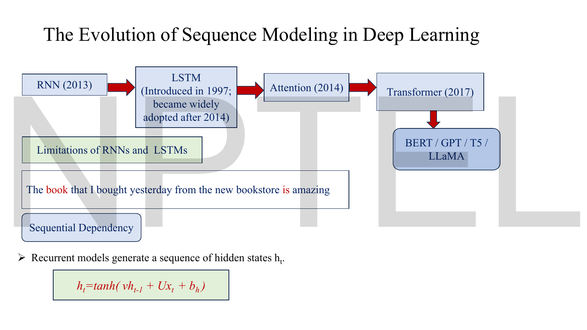
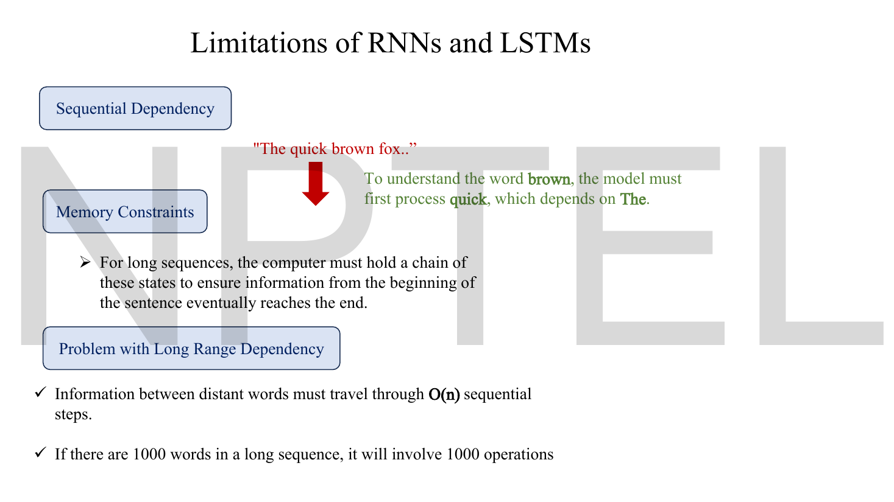
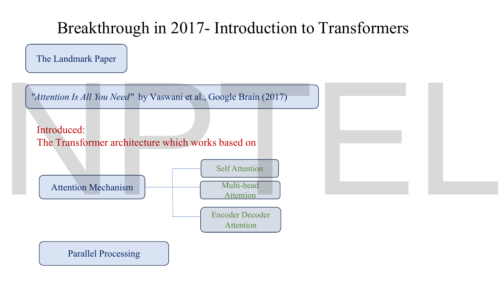

# Lec 56 — Evolution From LSTMs to Transformers

> **Source:** `Lec 56.pdf` (15 pages) · **Week 9** · **Playlist:** Lec 56
> **Prereqs:** [Lec 54 — Foundations of NLP](54-nlp-foundations.md), [Lec 55 — Sequential Modeling with RNNs and LSTMs](55-rnn-lstm.md)
> **Feeds into:** [Lec 57 — Transformer Encoder](57-transformer-encoder.md), [Lec 59 — Transformer Decoder](59-transformer-decoder.md), [Lec 60 — BERT](60-bert.md), [Lec 61 — GPT](61-gpt.md)

## Why this lecture exists

[Lec 55](55-rnn-lstm.md) left you with a working model and an unsolved problem. The LSTM's gates make long-range memory *possible*, but recurrence itself imposes two costs no amount of gating removes. First, $\mathbf{h}_t$ cannot be computed until $\mathbf{h}_{t-1}$ exists, so a 1000-token sentence needs 1000 steps in strict order — a dependency chain that no number of GPUs can shorten. Second, in a translation system the entire source sentence is squeezed into one fixed-width vector before the decoder sees a single word, and that vector is the same size for a five-word sentence and a five-hundred-word one.

This lecture names both costs and then introduces the idea that removes them: **attention**. Instead of forcing the decoder to work from one compressed summary, let it look back at *every* encoder state and weight them differently for every word it produces. That single change — a weighted sum instead of a bottleneck — is what the next three lectures are built on.

## The ideas

### The timeline the lecturer draws


*Fig. — Four boxes, four dates. Notice the LSTM box carries two dates, 1997 and 2014 — invention and adoption are a seventeen-year gap. Notice also that **attention predates the Transformer by three years**: attention was bolted onto RNNs first and only later became the whole architecture. Page 3.*

| Year | Model | What it added |
|---|---|---|
| 1997 / widely adopted after 2014 | **LSTM** | gated cell state, long-range memory |
| 2013 | **RNN** (the deck's date for its NLP adoption) | recurrence, the hidden state |
| **2014** | **Attention** | a weighted look back at *all* encoder states |
| **2017** | **Transformer** | attention as the whole model, recurrence removed |
| after 2017 | BERT, GPT, T5, LLaMA | pretraining at scale on top of the Transformer |

> **The dates on this slide are odd and you should know why.** The RNN box reads 2013, which is far later than the architecture's actual origin (Elman, 1990; the idea is older still) — the lecturer means the period when recurrent nets took over practical NLP, not their invention. The LSTM box correctly says 1997 (Hochreiter and Schmidhuber) with adoption after 2014. **The two dates that matter for an exam are 2014 for attention (Bahdanau et al.) and 2017 for the Transformer ("Attention Is All You Need").** The ordering RNN → LSTM → Attention → Transformer is the examinable sequence regardless of the exact years.

The slide also reprints the recurrence equation from [Lec 55](55-rnn-lstm.md) under the heading **Sequential Dependency**, with the sentence *"The **book** that I bought yesterday from the new bookstore **is** amazing."* The two bold words are eight tokens apart, and the verb's agreement depends on the noun. That is the dependency recurrence has to carry.

### What recurrence costs


*Fig. — Three separate complaints, often conflated. The first is about **ordering** (you cannot start word 3 before word 2), the second about **storage**, the third about **distance**. The line at the bottom is the one to quote: 1000 words means 1000 operations. Page 4.*

The deck's three limitations, each worth separating because the Transformer fixes them in different ways.

**1. Sequential dependency.** *"To understand the word **brown**, the model must first process **quick**, which depends on **The**."* This is not a statement about memory — it is a statement about **ordering**. The computation of $\mathbf{h}_3$ literally requires $\mathbf{h}_2$ as an input, so the three steps cannot be done simultaneously. This is what "**cannot be parallelised across time**" means, and it is the single most important sentence in the lecture.

Note carefully what *is* still parallel: the **batch** dimension. Sixty-four sentences can run through the same RNN at the same time. It is only the *time* dimension that is forced into a queue. A GPU with ten thousand cores running an RNN over a 1000-token sequence spends its life waiting, because the work available at any instant is one timestep wide.

**2. Memory constraints.** *"For long sequences, the computer must hold a chain of these states to ensure information from the beginning of the sentence eventually reaches the end."* Backpropagation through time cannot discard $\mathbf{h}_1 \ldots \mathbf{h}_{T-1}$ when it computes $\mathbf{h}_T$, because it will need them on the way back. Activation memory grows linearly with sequence length.

**3. Long-range dependency.** The deck's two bullets:

- *"Information between distant words must travel through **O(n)** sequential steps."*
- *"If there are **1000 words** in a long sequence, it will involve **1000 operations**."*

This is the **path length** between two positions. In an RNN, words 1 and 1000 are 999 hops apart, and every hop multiplies the signal by a Jacobian — the mechanism [Lec 55](55-rnn-lstm.md) derived. **Attention makes that path length 1**, which is the real reason it works, and the deck never quite says so. N4 and N5 put numbers on it.

> **Separate the two failures, because they have different fixes.** The *gradient* problem (information weakens over distance) is what the LSTM attacks, with partial success. The *parallelism* problem (steps must run in order) is one the LSTM makes strictly **worse**, since each step now computes four gates instead of one activation. Nothing recurrent can fix it; only removing recurrence can.

### The fixed-width bottleneck


*Fig. — Look at the bottom diagram and count the arrows between the two boxes: there is exactly **one**. Everything the decoder will ever know about the input has to fit through that single red arrow, which the lecturer calls the "thought vector" and labels "information about the input sequence in compressed form". Page 5.*

The classic **sequence-to-sequence** (seq2seq) design for translation has two recurrent networks:

- the **encoder** reads the source sentence and produces hidden states $\mathbf{h}_1,\ldots,\mathbf{h}_T$;
- the final state $\mathbf{h}_T$ — the deck's **thought vector**, also called the context vector in the literature — is handed to the **decoder**, which generates the target sentence one word at a time.

The decoder never sees $\mathbf{h}_1$ through $\mathbf{h}_{T-1}$. It sees one vector. So that vector must encode every noun, every tense, every clause boundary, every piece of word order in the source — and it is the same width whether the source was four words or four hundred. **That is the bottleneck.** N3 counts it: at hidden size 512, a five-word sentence gets 102.4 numbers per source word and a five-hundred-word document gets 1.02.

The slide's opening question is the pivot of the whole lecture:

> *"When predicting a word, do we really need every previous hidden state equally?"* — **Answer: No.** *"The model should assign greater importance to the most relevant words in the sequence."*

And the example sentence: *"The animal didn't cross the street because **it** was too tired."* Resolving *it* requires looking back specifically at *animal*, not at *street*, and not at the whole sentence blurred into one average. **Relevance is not uniform, so the summary should not be uniform either.** That is attention in one sentence.

### Attention: the decoder looks at everything, weighted


*Fig. — The densest page of the lecture. Every coloured line is one $\alpha_{t,j}$, and there is a complete set of them **per output word** — four fans of four. Notice the context boxes are numbered $C_1, C_2, C_3, C_4$: a **new** context vector is computed for every word the decoder produces, where the old design computed one and reused it. Page 6.*

The architecture on this slide is the **seq2seq model with attention** — the design Bahdanau, Cho and Bengio published in 2014, and the one the deck's own timeline dates to that year. It keeps the recurrent encoder and the recurrent decoder, and replaces the single arrow between them with a weighted connection to *every* encoder state.

Three objects, in the order you compute them.

**1. The attention weights $\alpha_{t,j}$.** The deck defines them exactly:

> *"$\alpha$ denotes the amount of attention to be paid to each hidden state."*
> *"$\alpha_{t,j}$ = attention weight assigned to the $j^{\text{th}}$ input word while generating the $t^{\text{th}}$ output word."*

Two indices, and getting them the right way round is examinable: **$t$ indexes the output, $j$ indexes the input.** So $\alpha_{3,1}$ is how much the third German word attends to the first English word.

**2. The normalisation.** The slide prints it as a boxed constraint:

$$\sum_{j=1}^{T}\alpha_{t,j} = 1$$

For each output step $t$, the weights over the $T$ source positions sum to 1. They are non-negative and they sum to one, so they form a **probability distribution over the source words** — a soft, differentiable choice of where to look. In practice they come from a **softmax** over unnormalised **alignment scores** $e_{t,j}$:

$$\alpha_{t,j} = \frac{\exp(e_{t,j})}{\sum_{k=1}^{T}\exp(e_{t,k})}$$

where $e_{t,j}$ measures how well source position $j$ matches what the decoder needs at step $t$. (Bahdanau computes $e_{t,j}$ with a small $\tanh$ network over the decoder's previous state and $\mathbf{h}_j$; the deck does not show the scoring function. The softmax formula itself is printed on this deck's page 11.)

**3. The context vector.** This is the payload, and the slide writes it five times — once per output word, then once in general:

$$\boxed{\;\mathbf{c}_t = \sum_{j=1}^{T}\alpha_{t,j}\,\mathbf{h}_j\;}$$

> **Notation, pinned.** The deck writes this as capital $C_t$. **This book writes the attention context vector as lowercase $\mathbf{c}_t$**, because capital $\mathbf{C}_t$ is already the LSTM **cell state** from [Lec 55](55-rnn-lstm.md) — and this lecturer uses a capital $C$ for *both*, in adjacent lectures of the same week. They are unrelated objects: $\mathbf{C}_t$ is memory inside one recurrent cell; $\mathbf{c}_t$ is a weighted average of encoder states computed fresh for each decoder step. Translate on sight.

Read the formula as what it is: a **weighted average of the encoder's hidden states**, with the weights chosen per output word. Because the $\alpha$ sum to 1, $\mathbf{c}_t$ is a convex combination — it lives inside the hull of the $\mathbf{h}_j$ and can never blow up. Two limiting cases are worth holding:

- If $\alpha_{t,j} = 1$ for one $j$ and 0 elsewhere, $\mathbf{c}_t = \mathbf{h}_j$ exactly — a hard pointer at one source word.
- If every $\alpha_{t,j} = 1/T$, $\mathbf{c}_t$ is the plain average of all states — attention has learned nothing and you are back to a blurred summary.

Real attention sits between these, and N6 measures where.

**What this buys, concretely:**

| | Plain seq2seq | seq2seq with attention |
|---|---|---|
| What the decoder receives | one vector, $\mathbf{h}_T$ | a fresh $\mathbf{c}_t$ at every step |
| Information available | $d$ numbers, for any $T$ | $T\times d$ numbers, growing with the input |
| Path from source word $j$ to output $t$ | $T - j$ recurrent hops | **1 weighted edge** |
| Alignment | implicit, unrecoverable | explicit — the $\alpha$ matrix is readable |

That last row is a real bonus the deck does not mention: because $\alpha_{t,j}$ is a number you can plot, attention gives you a **soft alignment matrix** between source and target words for free. Plot it for a translation and you can see which English word each German word came from. It is the first widely-used interpretability tool in deep NLP.

Two details on the slide's drawing, easy to miss and both examinable. The encoder blocks carry arrows in **both** directions — it is a **bidirectional** RNN, so each $\mathbf{h}_j$ summarises the source word *and both of its contexts*, not just what came before. And the decoder is fed its own previous output word (`<BOS>`, then *Ich*, then *liebe*, …) alongside the context vector: attention supplements the recurrent decoder, it does not replace it. **In this architecture recurrence is still present on both sides.** Removing it is the 2017 step, not the 2014 one.

### Where this lecture hands off


*Fig. — The blue banner at the top is the boundary. Everything above it is this chapter; everything below it — Query, Key, Value — is [Lec 57](57-transformer-encoder.md)'s. Notice the deck's own framing: self-attention is defined by **changing who attends to whom**, not by changing the mechanism. Page 7.*

The deck's banner states the distinction cleanly, and this is the one sentence of the handoff you should carry forward:

> *"In Encoder–Decoder attention, the attention mechanism is between the input words (from the Encoder) and the outputs (from the decoder)."*

Against which the core idea of **self-attention** is: *"Every word learns from every other word"* — the same weighted-sum machinery, but with the source and the target being **the same sequence**. The deck then introduces the three projections every token is mapped into, **Query (Q)**, **Key (K)** and **Value (V)**, and goes on across pages 8 to 11 to the scaled dot-product formula, multi-head attention, and masking.

**All of that is built in the next two chapters, not this one.** The division of labour for this book:

| Topic | Owner |
|---|---|
| Why recurrence had to go; attention's motivation; encoder–decoder attention and $\mathbf{c}_t$ | **Lec 56** (this chapter) |
| Self-attention, $\mathbf{Q}/\mathbf{K}/\mathbf{V}$, the scaled dot-product, $d_k$, multi-head attention with $h$ heads, positional encoding, the encoder block | **[Lec 57](57-transformer-encoder.md)** |
| Masked self-attention, cross-attention, the full encoder–decoder stack | **[Lec 59](59-transformer-decoder.md)** |

What you need from this chapter before turning to [Lec 57](57-transformer-encoder.md) is the shape of the idea, not its matrix form: **attention is a weighted sum of vectors, where the weights are a softmax over learned relevance scores and sum to 1.** $\mathbf{Q}$, $\mathbf{K}$ and $\mathbf{V}$ are the mechanism by which a Transformer computes those scores and those vectors from the sequence itself. $\mathbf{c}_t = \sum_j \alpha_{t,j}\mathbf{h}_j$ *is* $\text{softmax}(\cdot)\mathbf{V}$ with $\mathbf{V} = \mathbf{h}$ — the formula on page 8 is this formula, generalised. Hold that correspondence and Lec 57 will read as a refinement rather than a new subject.

### The breakthrough, and the comparison


*Fig. — Two claims, and the second is the one that gets undersold. The attention tree on the right is the mechanism; the lone box at the bottom left, **Parallel Processing**, is the payoff. Attention existed since 2014; what 2017 added was deleting recurrence so the whole sequence could be computed at once. Page 12.*

The landmark paper: **"Attention Is All You Need", Vaswani et al., Google Brain, 2017.** The title is a precise technical claim — not that attention helps, but that once you have attention you can throw the recurrence away entirely. The deck lists the three attention variants the architecture uses (self-attention, multi-head attention, encoder–decoder attention — all three built in [Lec 57](57-transformer-encoder.md) and [Lec 59](59-transformer-decoder.md)) and, separately, **parallel processing**.


*Fig. — Five rows, read them as pairs. The core-idea line above them is the whole lecture compressed: "Instead of reading one word after another, it looks at **all words simultaneously**." Every row below is a consequence of that one change. Page 13.*

| RNN / LSTM | Transformer |
|---|---|
| Reads sequentially | Reads all tokens together |
| Hidden states carry memory | Attention connects tokens directly |
| Difficult to parallelize | Highly parallelizable |
| Slow training for long sequences | Faster training |
| Long-distance information may weaken | Long-distance dependencies are handled effectively |

Learn this table in both directions — it is the most MCQ-shaped page in the deck. And notice the causal structure: rows 3 and 4 follow from row 1 (no ordering constraint means everything at once means faster), and row 5 follows from row 2 (a direct edge means path length 1 means no repeated Jacobian).

> **The honest asterisk the deck omits.** "Highly parallelizable" is about *training*. At generation time a Transformer still produces one token at a time, because token $t+1$ depends on token $t$ having been chosen — that is a property of autoregressive *decoding*, not of the architecture, and it is why [Lec 59](59-transformer-decoder.md) needs masking. There is also a cost the slide never names: attention compares every position with every other, which is $O(n^2)$ work and memory against the RNN's $O(n)$. The Transformer trades *sequential depth* for *parallel width*. It is the right trade on a GPU, and it is the reason context lengths were short for years.

### What the NLP course already gave you

Attention and seq2seq are covered in `../../DLforNLP/notes/week-04/18-seq2seq-and-attention.md`, and the Transformer in `../../DLforNLP/notes/week-05/21-intro-to-transformers.md`. The mechanics are the same; move through them fast. What is specific to *this* deck and this exam:

- **This lecturer's $\alpha_{t,j}$ index order** ($t$ = output, $j$ = input) and the boxed constraint $\sum_j \alpha_{t,j} = 1$, which page 6 states explicitly.
- **The "thought vector" name** for the single encoder summary. The NLP course calls it the context vector, which in this book is reserved for $\mathbf{c}_t$. Watch the clash.
- **The deck's date table** (2014 attention, 2017 Transformer) and its five-row comparison table on page 13, both of which read like exam questions already written.
- **No scoring function is given anywhere.** The NLP course derives Bahdanau's additive score and Luong's multiplicative one; this deck shows neither, so an exam from *these* slides can only ask about $\alpha$'s meaning, its normalisation, and the context sum — not about how $e_{t,j}$ is computed.

## Worked numericals

> **The Lec 56 deck contains no completed arithmetic.** Fifteen pages. It prints quantities that *look* like worked examples — four embedding vectors on page 8, a four-by-four attention-score matrix on page 11 — but never computes anything from them, and both belong to [Lec 57](57-transformer-encoder.md)/[Lec 59](59-transformer-decoder.md) territory in any case. Every numerical below is constructed from the deck's own objects: its translation example, its $\alpha$ definition and its context-vector formula. **All logarithms are natural; attention weights are dimensionless.**

### N1. Attention weights and the first context vector

**Given:** the deck's sentence *"I Love Machine Learning"*, encoded to $T=4$ hidden states (two-dimensional, so you can see them):

| $j$ | source word | $\mathbf{h}_j$ |
|---|---|---|
| 1 | I | $(1.0,\ 0.0)$ |
| 2 | Love | $(0.0,\ 1.0)$ |
| 3 | Machine | $(0.5,\ 0.5)$ |
| 4 | Learning | $(-1.0,\ 0.5)$ |

The decoder is producing its first word, *Ich*, and the alignment scores are $e_{1,j} = (2.0,\ 1.0,\ 0.5,\ 0.2)$.
**Find:** the attention weights $\alpha_{1,j}$, verify they sum to 1, and compute $\mathbf{c}_1$.

1. Exponentiate each score (natural base):
   $e^{2.0} = 7.389056$; $e^{1.0} = 2.718282$; $e^{0.5} = 1.648721$; $e^{0.2} = 1.221403$.
2. Sum: $7.389056 + 2.718282 + 1.648721 + 1.221403 = 12.977462$.
3. Divide:
   $\alpha_{1,1} = 7.389056/12.977462 = 0.569376$
   $\alpha_{1,2} = 2.718282/12.977462 = 0.209462$
   $\alpha_{1,3} = 1.648721/12.977462 = 0.127045$
   $\alpha_{1,4} = 1.221403/12.977462 = 0.094117$
4. Check: $0.569376+0.209462+0.127045+0.094117 = 1.000000$ ✓ — the deck's boxed constraint holds.
5. Weighted sum, first component:
   $0.569376(1.0) + 0.209462(0.0) + 0.127045(0.5) + 0.094117(-1.0)$
   $= 0.569376 + 0 + 0.063523 - 0.094117 = 0.538782$.
6. Second component:
   $0.569376(0.0) + 0.209462(1.0) + 0.127045(0.5) + 0.094117(0.5)$
   $= 0 + 0.209462 + 0.063523 + 0.047059 = 0.320044$.

**Answer:** $\boldsymbol{\alpha}_1 = (0.5694,\ 0.2095,\ 0.1270,\ 0.0941)$, summing to exactly 1, and $\mathbf{c}_1 = (0.5388,\ 0.3200)$. Natural base throughout; the weights are pure fractions.

Notice the gap: a score difference of $2.0 - 0.2 = 1.8$ became a weight ratio of $0.5694/0.0941 = 6.05$. The softmax is exponential, so **moderate score differences become large weight differences** — $e^{1.8} = 6.05$, exactly the ratio. That is how attention gets sharp.

### N2. The context vector moves between output words

**Given:** the same four encoder states, unchanged. The decoder is now producing its *second* word, *liebe* ("love"), with scores $e_{2,j} = (0.3,\ 2.5,\ 0.8,\ 0.4)$.
**Find:** $\boldsymbol{\alpha}_2$ and $\mathbf{c}_2$, and compare against N1.

1. Exponentiate: $e^{0.3} = 1.349859$; $e^{2.5} = 12.182494$; $e^{0.8} = 2.225541$; $e^{0.4} = 1.491825$.
2. Sum: $1.349859 + 12.182494 + 2.225541 + 1.491825 = 17.249718$.
3. Weights:
   $\alpha_{2,1} = 1.349859/17.249718 = 0.078254$
   $\alpha_{2,2} = 12.182494/17.249718 = 0.706243$
   $\alpha_{2,3} = 2.225541/17.249718 = 0.129019$
   $\alpha_{2,4} = 1.491825/17.249718 = 0.086484$
   Sum $= 1.000000$ ✓
4. First component: $0.078254(1.0) + 0.706243(0.0) + 0.129019(0.5) + 0.086484(-1.0) = 0.078254 + 0.064510 - 0.086484 = 0.056280$.
5. Second component: $0 + 0.706243 + 0.064510 + 0.043242 = 0.813995$.

**Answer:** $\boldsymbol{\alpha}_2 = (0.0783,\ 0.7062,\ 0.1290,\ 0.0865)$ and $\mathbf{c}_2 = (0.0563,\ 0.8140)$, against N1's $\mathbf{c}_1 = (0.5388,\ 0.3200)$.

This is the entire point of the architecture in two numbers. **Same encoder, same sentence, same hidden states — and the context vector moved from $(0.54, 0.32)$ to $(0.06, 0.81)$**, because the decoder's need changed. When generating *Ich* it looked mostly at *I* (weight 0.57); when generating *liebe* it looked mostly at *Love* (weight 0.71), and *I*'s weight collapsed from 0.57 to 0.08. A plain seq2seq would have handed the decoder the identical $\mathbf{h}_T$ both times.

### N3. The bottleneck, counted

**Given:** an encoder with hidden size $d = 512$. Plain seq2seq hands the decoder the single final state; attention exposes all $T$ states.
**Find:** how much information per source word each design provides, at $T = 5, 20, 100, 500$.

1. Plain seq2seq always supplies $d = 512$ numbers, independent of $T$. Per source word that is $512/T$:

| $T$ | numbers per source word (plain) | total numbers available (attention) | ratio |
|---|---|---|---|
| 5 | $512/5 = 102.40$ | $5\times512 = 2{,}560$ | $5\times$ |
| 20 | $512/20 = 25.60$ | $10{,}240$ | $20\times$ |
| 100 | $512/100 = 5.12$ | $51{,}200$ | $100\times$ |
| 500 | $512/500 = 1.02$ | $256{,}000$ | $500\times$ |

2. The attention column is $T\times d$, so the ratio between the two designs is exactly $T$.

**Answer:** the plain encoder's budget per source word is $512/T$ and **falls as $1/T$** — at $T = 500$ it is a single number per word, which cannot possibly encode a word's identity, position and role. Attention supplies $T$ times more raw information, and the advantage **grows with exactly the sentence length that was causing the problem.** That is why the attention/no-attention gap in BLEU score widens on long sentences and nearly vanishes on short ones.

### N4. The serial cost recurrence cannot escape

**Given:** the deck's claim that 1000 words means 1000 operations. Suppose one recurrent step costs 2 ms and a batch holds 64 sentences.
**Find:** the wall-clock cost of the time dimension, the available parallelism, and the path length between the first and last word.

1. An RNN over $T = 1000$ needs **1000 steps in strict order**: $1000 \times 2\ \text{ms} = 2000\ \text{ms} = 2$ seconds, and no amount of hardware shortens it, because step $t$ cannot start before step $t-1$ finishes.
2. Work available at any instant: 64 sentences $\times$ 1 timestep $= \mathbf{64}$ parallel units.
3. A model that processes all positions at once has $64 \times 1000 = \mathbf{64{,}000}$ parallel units and a serial depth of 1 layer instead of 1000 steps.
4. Parallelism ratio: $64{,}000/64 = \mathbf{1000\times}$, exactly $T$.
5. Path length from word 1 to word 1000: RNN $= 999$ hops; attention $= \mathbf{1}$ weighted edge.

**Answer:** the RNN's serial depth is $T = 1000$ and its instantaneous parallelism is 64; removing recurrence makes the serial depth 1 and the parallelism 64,000 — **a factor of $T$ in both directions.** The 2-second figure is the floor, not the cost: it is what the sequence costs *before* you count any arithmetic.

### N5. Why the path length is the real fix

**Given:** [Lec 55](55-rnn-lstm.md) established that each recurrent hop multiplies the signal by a Jacobian factor. Take an optimistic per-hop retention of $0.9$ — far better than N3 of Lec 55's $0.4$.
**Find:** the fraction of the signal from word 1 that reaches word $T$, at $T = 10$, $100$ and $1000$, and the same quantity under attention.

1. $T = 10$: $0.9^{9} = 0.387420$. About 39% survives — workable.
2. $T = 100$: $0.9^{99} = 2.9512\times10^{-5}$. Three parts in a hundred thousand.
3. $T = 1000$: $0.9^{999} = 1.9421\times10^{-46}$.
4. Under attention the decoder reads $\mathbf{h}_1$ through a **single weighted edge** of strength $\alpha_{t,1}$. The path involves one multiplication, not $T-1$: the surviving fraction is $\alpha_{t,1}$ itself, which in N1 was $0.5694$.

**Answer:** $0.3874$, $2.95\times10^{-5}$ and $1.94\times10^{-46}$ for a recurrent chain, against $\alpha_{t,1}$ — a number of order $0.1$ to $1$ — for attention, **at any distance whatsoever.** The decay is exponential in distance for recurrence and *constant* for attention, and that is the whole difference. It also tells you that attention's benefit is not "more capacity"; it is "no exponent".

### N6. How sharp is the attention? A one-number diagnostic

**Given:** $\boldsymbol{\alpha}_1$ and $\boldsymbol{\alpha}_2$ from N1 and N2. Because the weights are a probability distribution over source words, their **entropy** $H = -\sum_j \alpha_{t,j}\ln\alpha_{t,j}$ measures how spread out the attention is, and $e^{H}$ converts that to an *effective number of source words attended to*.
**Find:** $H$ and $e^{H}$ for both steps, and the uniform-attention baseline.

1. Uniform baseline over 4 words: every $\alpha = 0.25$, so $H = -4(0.25\ln 0.25) = \ln 4 = 1.386294$ nats and $e^{H} = 4.000$ — attention spread evenly over all four.
2. Step 1: terms $-\alpha\ln\alpha$ are
   $0.569376 \times 0.563207 = 0.320680$;
   $0.209462 \times 1.563216 = 0.327432$;
   $0.127045 \times 2.063217 = 0.262126$;
   $0.094117 \times 2.363216 = 0.222417$.
   $H(\boldsymbol{\alpha}_1) = 1.132654$ nats, $e^{H} = 3.1039$.
3. Step 2, the same computation gives $H(\boldsymbol{\alpha}_2) = 0.920903$ nats, $e^{H} = 2.5116$.

**Answer:** $H(\boldsymbol{\alpha}_1) = 1.1327$ nats (**effective sources 3.10 of 4**) and $H(\boldsymbol{\alpha}_2) = 0.9209$ nats (**effective sources 2.51 of 4**), against a uniform ceiling of $\ln 4 = 1.3863$ nats and 4.00. **Base matters: in bits these would be $1.6341$ and $1.3285$**, a factor of $\ln 2 = 0.6931$ different, so always state the base.

The second step is *sharper* — it has committed harder to a single source word, which matches N2's weight of 0.71 on *Love*. A fully trained attention head on a short sentence typically lands between 1.5 and 3 effective sources; one that stays near 4 has not learned to align, and one that drops to 1.0 has become a hard pointer.

## Code

The deck draws the $\alpha$ fans and prints the context formula but computes nothing. Twenty-five lines make the whole mechanism concrete, including the bottleneck and parallelism counts from N3 and N4. Nothing here touches $\mathbf{Q}/\mathbf{K}/\mathbf{V}$ — the scores are given, exactly as the deck leaves them.

```python
import numpy as np
np.set_printoptions(precision=4, suppress=True)

# Encoder hidden states for "I Love Machine Learning" (2-d, so you can see them)
H = np.array([[ 1.0, 0.0],      # h_1  "I"
              [ 0.0, 1.0],      # h_2  "Love"
              [ 0.5, 0.5],      # h_3  "Machine"
              [-1.0, 0.5]])     # h_4  "Learning"

def softmax(e):
    ex = np.exp(e - e.max())     # shift for numerical stability; answer unchanged
    return ex / ex.sum()

# Alignment scores e_{t,j}: how well source word j matches what the decoder
# wants at output step t.  (Bahdanau scores them with a small tanh network.)
scores = {"Ich":   np.array([2.0, 1.0, 0.5, 0.2]),
          "liebe": np.array([0.3, 2.5, 0.8, 0.4])}

for word, e in scores.items():
    alpha = softmax(e)
    c = alpha @ H                                   # c_t = sum_j alpha_{t,j} h_j
    ent = -(alpha * np.log(alpha)).sum()            # natural log -> nats
    print(f"generating {word:>6}: alpha = {alpha}  sum = {alpha.sum():.6f}")
    print(f"{'':>18} c_t   = {c}   effective sources = {np.exp(ent):.4f} of 4")

# --- the fixed-width bottleneck, counted
d = 512
for T in (5, 20, 100, 500):
    print(f"T={T:>3}: single thought vector gives {d/T:8.2f} numbers per source word; "
          f"attention exposes {T*d:>6} numbers ({T}x)")

# --- the serial cost recurrence cannot escape
for T in (10, 100, 1000):
    print(f"T={T:>4}: RNN sequential steps = {T:>4}, longest path word1->wordT = {T-1:>4}; "
          f"attention: 1 step, path 1, signal left after chain = {0.9**(T-1):.3e}")
```

```
generating    Ich: alpha = [0.5694 0.2095 0.127  0.0941]  sum = 1.000000
                   c_t   = [0.5388 0.32  ]   effective sources = 3.1039 of 4
generating  liebe: alpha = [0.0783 0.7062 0.129  0.0865]  sum = 1.000000
                   c_t   = [0.0563 0.814 ]   effective sources = 2.5116 of 4
T=  5: single thought vector gives   102.40 numbers per source word; attention exposes   2560 numbers (5x)
T= 20: single thought vector gives    25.60 numbers per source word; attention exposes  10240 numbers (20x)
T=100: single thought vector gives     5.12 numbers per source word; attention exposes  51200 numbers (100x)
T=500: single thought vector gives     1.02 numbers per source word; attention exposes 256000 numbers (500x)
T=  10: RNN sequential steps =   10, longest path word1->wordT =    9; attention: 1 step, path 1, signal left after chain = 3.874e-01
T= 100: RNN sequential steps =  100, longest path word1->wordT =   99; attention: 1 step, path 1, signal left after chain = 2.951e-05
T=1000: RNN sequential steps = 1000, longest path word1->wordT =  999; attention: 1 step, path 1, signal left after chain = 1.942e-46
```

Three readings. The `alpha @ H` on line 18 is the entire context-vector formula — a matrix-vector product is what "weighted sum of hidden states" means in code, and it is one line. The `e - e.max()` shift is the standard numerically-stable softmax: subtracting a constant from every score leaves the weights unchanged (the constant cancels top and bottom) but prevents `exp` from overflowing on large scores. And the last block is the argument: the rightmost column goes to $10^{-46}$ while attention's path stays at 1, which is why the 2017 paper could afford to delete recurrence rather than improve it.

## Exam pack

### Must-memorise

| Item | Exactly this |
|---|---|
| Attention weight meaning | $\alpha_{t,j}$ = attention paid to the $j$-th **input** word while generating the $t$-th **output** word |
| Normalisation | $\sum_{j=1}^{T}\alpha_{t,j} = 1$ for every output step $t$ |
| How the weights are formed | softmax over alignment scores, $\alpha_{t,j} = \exp(e_{t,j}) / \sum_k \exp(e_{t,k})$ |
| **Context vector** | $\mathbf{c}_t = \sum_{j=1}^{T}\alpha_{t,j}\,\mathbf{h}_j$ — a fresh one per output word |
| Softmax (deck's page 11) | $\sigma(\mathbf{z})_i = e^{z_i} / \sum_{j=1}^{K} e^{z_j}$ |
| The three limitations | sequential dependency · memory constraints · long-range dependency |
| Path length claim | information between distant words travels $O(n)$ sequential steps; 1000 words ⇒ 1000 operations |
| The bottleneck's name here | the **thought vector** — "information about the input sequence in compressed form" |
| Attention's motivating question | "do we really need every previous hidden state equally?" — **No** |
| The landmark paper | *Attention Is All You Need*, Vaswani et al., Google Brain, **2017** |
| Attention's own date | **2014** — three years before the Transformer |
| The core idea of the Transformer | "Instead of reading one word after another, it looks at all words simultaneously" |
| Self-attention, in one line | the same weighted-sum machinery with source = target; built in [Lec 57](57-transformer-encoder.md) |

### Numbers worth knowing

| Quantity | Value |
|---|---|
| Attention introduced | 2014 |
| Transformer introduced | 2017 |
| LSTM introduced / widely adopted | 1997 / after 2014 |
| Deck's date for the RNN box | 2013 |
| Deck's path-length example | 1000 words ⇒ 1000 sequential operations |
| Sum of attention weights, any step | exactly 1 |
| Number of context vectors drawn on page 6 | one per output word ($C_1 \ldots C_4$, plus the general $C_t$) |
| Information to the decoder, plain seq2seq | $d$ numbers, independent of $T$ |
| Information to the decoder, with attention | $T\times d$ numbers — ratio exactly $T$ |
| Per-source-word budget at $d{=}512$, $T{=}500$ | $1.02$ numbers |
| Path length word 1 → word 1000, RNN vs attention | 999 vs **1** |
| Parallel work units, batch 64, $T{=}1000$ | 64 (RNN) vs 64,000 (all-at-once) — $1000\times$ |
| Signal surviving 999 hops at 0.9 per hop | $1.94\times10^{-46}$ |
| N1 weights | $(0.5694,\ 0.2095,\ 0.1270,\ 0.0941)$, $\mathbf{c}_1 = (0.5388,\ 0.3200)$ |
| N2 weights | $(0.0783,\ 0.7062,\ 0.1290,\ 0.0865)$, $\mathbf{c}_2 = (0.0563,\ 0.8140)$ |
| Uniform-attention entropy over 4 words | $\ln 4 = 1.3863$ nats $= 2$ bits, effective sources 4.00 |
| Attention's compute cost (not on the slides) | $O(n^2)$ against the RNN's $O(n)$ |

### Likely MCQ traps

- **Reading $\alpha_{t,j}$ with the indices swapped.** $t$ is the **output** step, $j$ is the **input** position. $\alpha_{3,1}$ is the third output word attending to the first input word, not the reverse. The giveaway is the sum: it runs over $j$ to $T$, the *source* length.
- **Thinking attention produces one context vector for the whole sentence.** It produces **one per output word**. Page 6 draws $C_1, C_2, C_3, C_4$ precisely to make this unmissable. The *plain* seq2seq is the one with a single vector.
- **Confusing $\mathbf{c}_t$ with $\mathbf{C}_t$.** $\mathbf{c}_t$ (lowercase) is the attention context, a weighted average of encoder states. $\mathbf{C}_t$ (capital) is the LSTM **cell state** from [Lec 55](55-rnn-lstm.md). This lecturer writes a capital $C$ for both in consecutive lectures. Check what is being summed: $\sum_j \alpha_{t,j}\mathbf{h}_j$ is the context; $\mathbf{f}_t\odot\mathbf{C}_{t-1} + \mathbf{i}_t\odot\widehat{\mathbf{C}}_t$ is the cell state.
- **"Attention was introduced by the Transformer."** No — **2014 versus 2017**. Attention was bolted onto recurrent seq2seq models first and worked well there. The Transformer's contribution was removing the recurrence, which the paper's title says outright.
- **"The encoder–decoder with attention has no recurrence."** It is fully recurrent on both sides — page 6 draws a *bidirectional* RNN encoder and a recurrent decoder fed its own previous output. Attention replaces the single connecting arrow, nothing else.
- **Treating "vanishing gradients" and "cannot be parallelised" as the same complaint.** They are independent. LSTMs partly fix the first and make the second *worse* (four gates per step instead of one activation). Only removing recurrence fixes the second.
- **"Transformers are faster at everything."** Faster to **train**, because all positions compute at once. Generation is still one token at a time, and attention costs $O(n^2)$ in time and memory against the RNN's $O(n)$ — the trade is sequential depth for parallel width.
- **Assuming the attention weights are learned parameters.** They are **computed**, freshly, from the current decoder state and the encoder states, for every output word on every input. What is learned is the *scoring function* that produces $e_{t,j}$.
- **Forgetting the weights must sum to 1.** If an MCQ offers four weights summing to 1.3, it is wrong on arithmetic alone — no further reasoning needed.
- **Thinking $\mathbf{c}_t$ can exceed the range of the $\mathbf{h}_j$.** It is a convex combination (non-negative weights summing to 1), so it always lies inside their hull. A "context vector" larger than every hidden state is impossible.
- **Calling the single encoder summary the "context vector".** In *this* book that name is $\mathbf{c}_t$'s. The deck calls the single summary the **thought vector**; much of the literature calls it the context vector too, which is where the clash comes from.

### Self-test

1. State the three limitations of RNNs and LSTMs that this deck names, and say which of them an LSTM helps with.
2. Why can the time dimension of an RNN not be parallelised, when the batch dimension can?
3. Write the context-vector formula and define every symbol, including both indices of $\alpha$.
4. Encoder states are $\mathbf{h}_1 = (2,\ 0)$, $\mathbf{h}_2 = (0,\ 4)$, $\mathbf{h}_3 = (1,\ 1)$ with weights $\alpha_{t,\cdot} = (0.5,\ 0.2,\ 0.3)$. Compute $\mathbf{c}_t$. Check the weights first.
5. Alignment scores for three source words are $(1.0,\ 2.0,\ 0.0)$. Compute the attention weights.
6. In what year was attention introduced, and in what year the Transformer? Why does the gap matter?
7. An encoder has $d = 256$ and the source sentence has 128 words. How many numbers does the decoder get under plain seq2seq, and under attention?
8. Give one thing the page-13 comparison table claims about parallelisation, and one honest qualification it omits.
9. A classmate says "attention solves the vanishing gradient problem by making the gradient bigger". Correct them in one sentence.
10. Attention weights over 5 source words come out as $(0.2, 0.2, 0.2, 0.2, 0.2)$ after training. What has gone wrong, and what is the entropy in nats?

<details><summary>Answers</summary>

1. **Sequential dependency** (step $t$ needs step $t-1$, so no parallelism across time), **memory constraints** (the whole chain of states must be held), **long-range dependency** ($O(n)$ sequential hops between distant words, so information weakens). An LSTM helps meaningfully only with the third, and only partly; it does nothing for the first and makes it worse per step.
2. Because $\mathbf{h}_t = \tanh(\mathbf{V}\mathbf{h}_{t-1} + \mathbf{U}\mathbf{x}_t + \mathbf{b}_h)$ takes $\mathbf{h}_{t-1}$ as an *input* — a data dependency, so the steps must execute in order. Different sentences in a batch have no such dependency on each other, so they run simultaneously.
3. $\mathbf{c}_t = \sum_{j=1}^{T}\alpha_{t,j}\mathbf{h}_j$. $\mathbf{c}_t$ = the context vector for output step $t$; $T$ = source length; $\mathbf{h}_j$ = the encoder's hidden state at source position $j$; $\alpha_{t,j}$ = the attention weight given to **input** position $j$ while generating **output** word $t$, non-negative and summing to 1 over $j$.
4. Weights sum to $0.5+0.2+0.3 = 1.0$ ✓. First component $0.5(2)+0.2(0)+0.3(1) = 1.0+0+0.3 = 1.3$. Second $0.5(0)+0.2(4)+0.3(1) = 0+0.8+0.3 = 1.1$. $\mathbf{c}_t = (\mathbf{1.3},\ \mathbf{1.1})$.
5. $e^{1} = 2.718282$, $e^{2} = 7.389056$, $e^{0} = 1$; sum $= 11.107338$. Weights $= (0.244728,\ 0.665241,\ 0.090031)$, summing to 1.000000. Natural base.
6. **Attention 2014, Transformer 2017.** The gap matters because it shows attention is a separable idea that worked inside recurrent models first; the Transformer's contribution was the *removal of recurrence*, not the invention of attention — which is exactly what the title "Attention Is All You Need" claims.
7. Plain seq2seq: **256** numbers (the final state only), regardless of sentence length. With attention: $128\times256 = \mathbf{32{,}768}$ numbers — 128× more, exactly the sentence length.
8. Claim: the Transformer is "highly parallelizable" and gives "faster training", because it "reads all tokens together". Omission: that is **training-time** parallelism; autoregressive generation still emits one token at a time, and attention costs $O(n^2)$ time and memory against the RNN's $O(n)$.
9. Attention does not make the gradient bigger — it makes the **path shorter**: the connection from source word $j$ to output $t$ is a single weighted edge instead of a chain of $T-j$ Jacobian multiplications, so there is no exponent in the distance at all (N5: $1.94\times10^{-46}$ versus a weight of order 0.1–1).
10. Uniform weights mean the model has learned **nothing about alignment** — $\mathbf{c}_t$ is just the plain average of all encoder states, so attention has degenerated to the blurred summary it was meant to replace. Entropy $= -5(0.2\ln 0.2) = \ln 5 = \mathbf{1.6094}$ nats (2.3219 bits), the maximum possible for 5 options; effective sources $e^{1.6094} = 5.00$ of 5.

</details>

## Beyond the slides

**Gap: no scoring function for $e_{t,j}$ appears anywhere.**
**Why it matters:** the deck defines $\alpha_{t,j}$ and the context sum but never says where the raw scores come from, which leaves the mechanism half-specified. The two standard answers: **Bahdanau (additive) attention**, $e_{t,j} = \mathbf{v}_a^\top\tanh(\mathbf{W}_a\mathbf{s}_{t-1} + \mathbf{U}_a\mathbf{h}_j)$ — a tiny one-hidden-layer network scoring each pair — and **Luong (multiplicative) attention**, $e_{t,j} = \mathbf{s}_{t-1}^\top\mathbf{W}_a\mathbf{h}_j$, a bilinear form. The multiplicative form is cheaper and is the direct ancestor of what [Lec 57](57-transformer-encoder.md) builds. Derivations are in `../../DLforNLP/notes/week-04/18-seq2seq-and-attention.md`.

**Gap: the bidirectional encoder on page 6 is drawn but never named.**
**Why it matters:** those left-pointing arrows mean each $\mathbf{h}_j$ is the concatenation of a forward and a backward RNN state, so it summarises the word *and both of its contexts*. This doubles the hidden width and is the reason attention over $\mathbf{h}_j$ is a sensible thing to do — a forward-only $\mathbf{h}_j$ would know nothing about what follows word $j$. Bidirectionality is also the idea [Lec 60](60-bert.md) builds BERT on, so it is worth naming now.

**Gap: the deck never says what attention costs.**
**Why it matters:** "attention is better" is only half the story. Comparing every position with every other is $O(n^2)$ in both time and memory, against the RNN's $O(n)$. At $n = 1000$ that is a million pairwise scores per layer per head. This is why Transformer context windows were a few hundred tokens for years, why efficient-attention variants exist at all, and why the right framing is a **trade**: $O(n)$ sequential steps of $O(1)$ depth become $O(1)$ sequential steps of $O(n^2)$ parallel work. GPUs make that trade very favourable; it is not free.

**Gap: attention is presented as a fix for translation, with no mention that it is also an interpretability tool.**
**Why it matters:** the matrix of $\alpha_{t,j}$ values is a readable **soft alignment** between source and target. Plotting it was the original paper's headline figure and remains a standard diagnostic: diffuse weights mean the model has not learned to align (self-test 10), and a diagonal band in a translation task means it is tracking word order. It is the first interpretability signal in this course that comes for free with the forward pass.

**Gap: nothing is said about what is lost by removing recurrence.**
**Why it matters:** an RNN knows the order of its inputs because it *processes* them in order. A model that looks at all words simultaneously has no idea which word came first — attention is permutation-equivariant, so "Dog bites man" and "Man bites dog" would produce identical outputs. The fix is **positional encoding**, which is [Lec 57](57-transformer-encoder.md)'s. Knowing *why* it is needed before you meet it makes it far less arbitrary, and it closes the loop on [Lec 55](55-rnn-lstm.md)'s opening slide: order matters, and when you delete the mechanism that tracked it, you have to add it back by hand.

## Cut from the slides

Pages 1, 2, 14 and 15 are the title, the contents list, a **bare "Summary" title card with no summary on it**, and the next-session pointer; their content is in the front matter and the closing links. **Pages 8 through 11 are deliberately not taught here**, because they belong to other chapters by the ownership map: page 8 prints the four embedding vectors with $\mathbf{Q} = \mathbf{X}\mathbf{W}_Q$, $\mathbf{K} = \mathbf{X}\mathbf{W}_K$, $\mathbf{V} = \mathbf{X}\mathbf{W}_V$ and the scaled dot-product formula; page 9 is multi-head attention with its concat-and-project diagram and the Query/Key/Value question triple; pages 10 and 11 are masked self-attention with a four-by-four attention-score matrix shown before and after masking, plus the softmax definition. **Page 7's $\mathbf{Q}/\mathbf{K}/\mathbf{V}$ introduction is named here only as a forward pointer**, with the deck's encoder–decoder-versus-self-attention distinction preserved because it is the boundary itself. All of that construction is [Lec 57](57-transformer-encoder.md)'s (self-attention, Q/K/V, multi-head, positional encoding) and [Lec 59](59-transformer-decoder.md)'s (masking, cross-attention) — **the deck ranges well past where this chapter stops, and the overlap is flagged in this book's errata**. Page 11's softmax definition is reproduced in the exam pack because it is needed for $\alpha_{t,j}$, which *is* owned here. Everything on pages 3 through 7, 12 and 13 is reproduced in full, including the deck's exact wordings for the three limitations, the attention question-and-answer, the $\alpha$ definition and the five-row comparison table.
