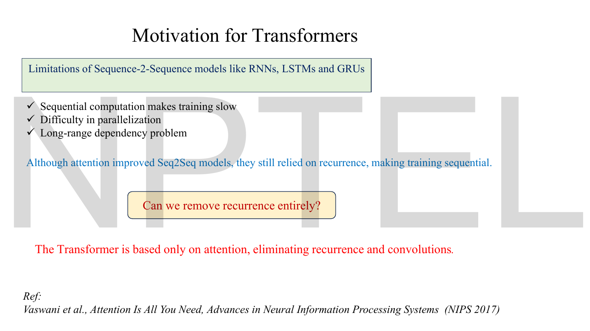
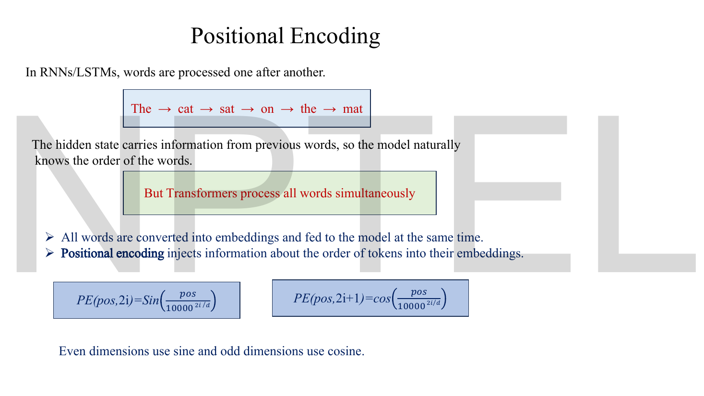
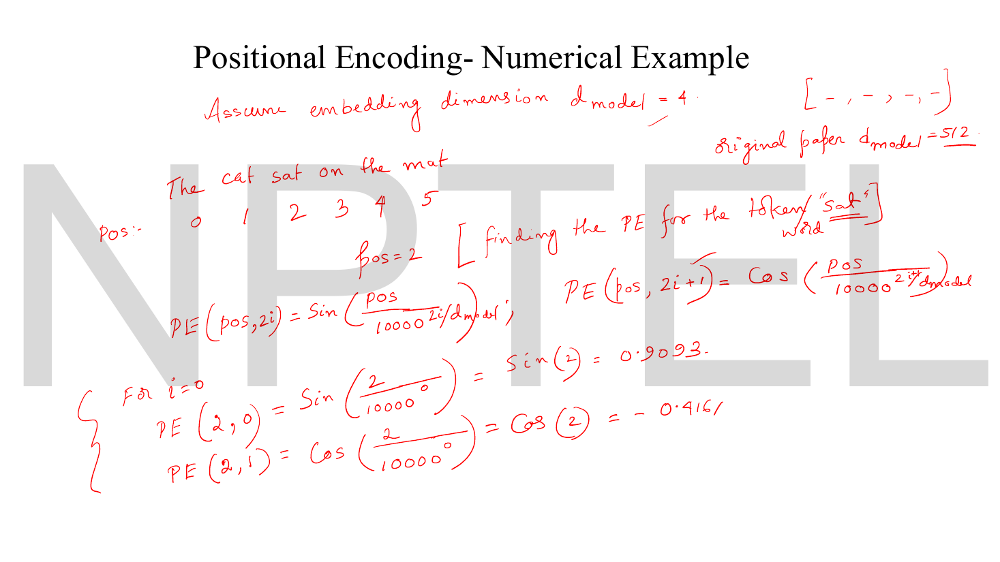
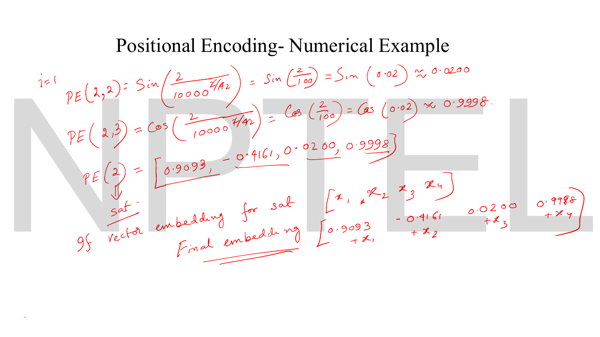
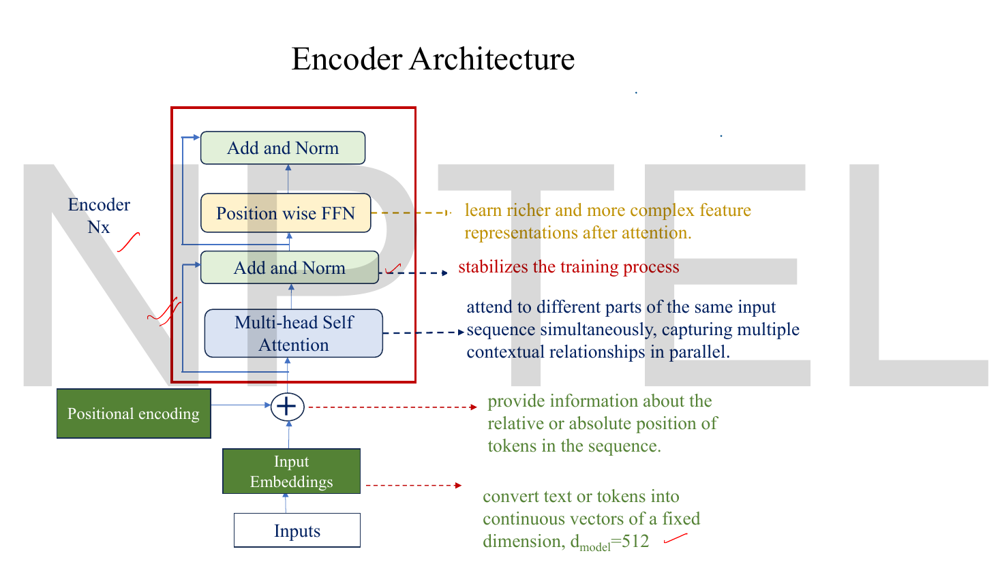
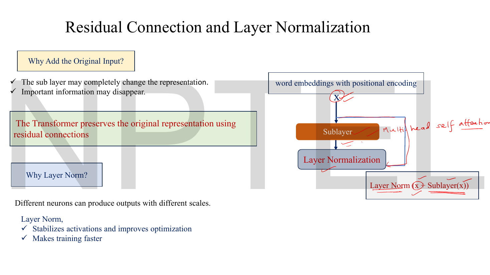
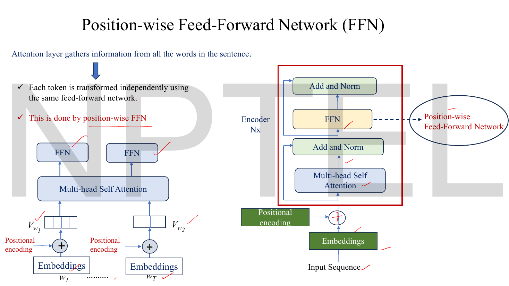
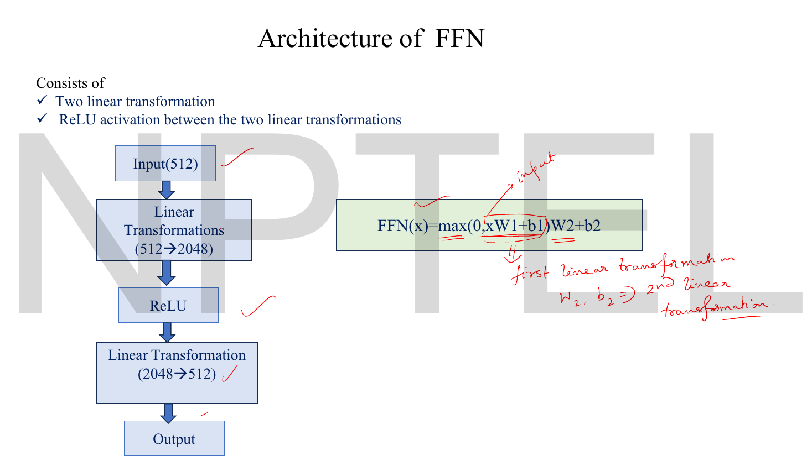
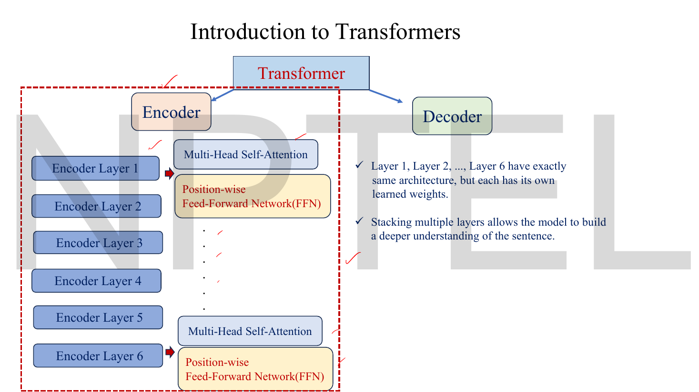
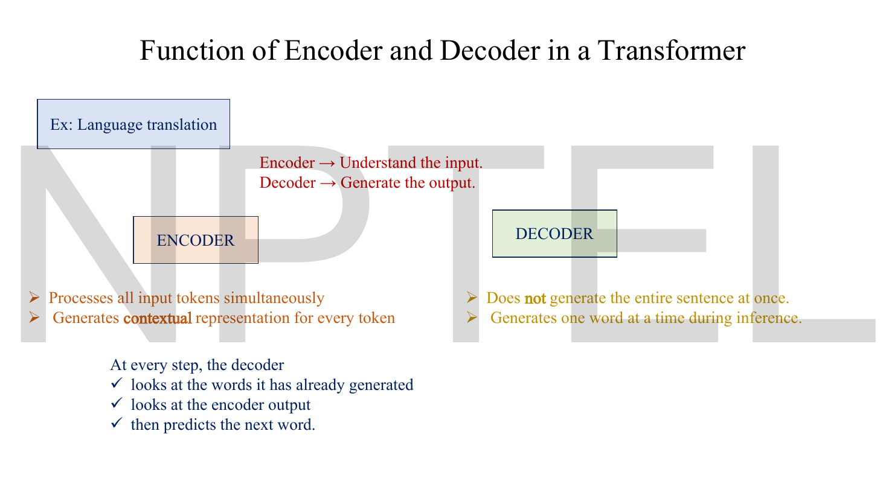

# Lec 57 — Transformer Encoder

> **Source:** `Lec 57.pdf` (14 pages) · **Week 9** · **Playlist:** Lec 57
> **Prereqs:** [Lec 54 — Foundations of NLP](54-nlp-foundations.md), [Lec 55 — RNNs and LSTM](55-rnn-lstm.md), [Lec 56 — From LSTMs to Transformers](56-lstm-to-transformer.md), [Lec 02 — Activation and Loss Functions](02-activations-and-losses.md), [Lec 42 — StyleGAN 2](42-stylegan2.md)
> **Feeds into:** [Lec 59 — Transformer Decoder](59-transformer-decoder.md), [Lec 60 — BERT](60-bert.md), [Lec 61 — GPT](61-gpt.md), [Lec 62 — Prompt Engineering Basics](62-prompt-engineering.md), [Lec 63 — Hands-on on LLM](63-llm-handson.md), [Lec 52 — Stable Diffusion](52-stable-diffusion.md)

## Why this lecture exists

[Lec 56](56-lstm-to-transformer.md) ended on a question the slides print in red: *can we remove recurrence entirely?* Recurrence is what makes an LSTM slow — token $t$ cannot be computed until token $t-1$ has been, so a 500-word sentence is 500 sequential steps no GPU can shorten, and information from word 1 must survive 499 hops to reach word 500.

This lecture builds the replacement. Every token gets a representation informed by every other token, and all of them are computed *at once*, by one matrix multiplication. The mechanism is self-attention; its moving parts are three learned projections called Query, Key and Value. Because the new operation is blind to word order, position has to be injected deliberately — the deck spends four of its ten content pages on exactly that. The result is the encoder block: attention, add and normalise, feed-forward, add and normalise, stacked six deep.

Everything in Weeks 10, 11 and 12 is this block, rearranged.

## The ideas

### What self-attention has to solve


*Fig. — The three complaints in the checklist are one complaint: sequential computation makes training slow, prevents parallelisation, and stretches long-range dependencies across many hops. Notice the blue line — attention had already been bolted onto Seq2Seq models, but those still "relied on recurrence, making training sequential". The contribution of the Transformer is deletion, not addition. Page 3.*

Fix the goal precisely, because the formula falls out of it.

You have $n$ tokens. Each arrives as a vector $\mathbf{x}_i \in \mathbb{R}^{d_{\text{model}}}$ — a row of an $n \times d_{\text{model}}$ matrix $\mathbf{X}$. You want to produce $n$ output vectors, where output $i$ is a *re-description of token $i$ in the light of all $n$ tokens*. In the sentence "the animal didn't cross the street because **it** was too tired", the vector for "it" should come out looking like "animal"; in "…because **it** was too wide", it should come out looking like "street". Same word, same input vector, different output — because the context differs.

Three requirements, which between them pin the design down:

1. **Every position must be able to read every position.** Not a window, not a chain — all $n$, in one step. That caps the path length between any two tokens at 1, where an RNN's is $O(n)$.
2. **The reading must be computed in parallel.** No step may wait for another. So the operation has to be expressible as matrix multiplications over the whole sequence at once.
3. **The mixing weights must be content-dependent.** A fixed averaging would give every token the same blurred context. How much token $i$ draws from token $j$ has to be a *learned function of what those two tokens are*.

Requirement 3 is the hard one, and it is what Query, Key and Value exist for.

### Query, Key, Value — what they mean before any formula

Think of a lookup in a dictionary, loosened so that it returns a blend instead of one entry.

| Role | The question it answers | Who owns it |
|---|---|---|
| **Query** $\mathbf{q}_i$ | "What am I looking for?" | the token doing the attending |
| **Key** $\mathbf{k}_j$ | "What do I advertise? What am I findable by?" | every token being looked at |
| **Value** $\mathbf{v}_j$ | "What do I actually contribute if chosen?" | every token being looked at |

A token broadcasts a key (an advertisement) and holds a value (its payload). A token searching emits a query. You compare the query against every key; wherever the match is strong you take a lot of that token's value, wherever it is weak you take a little. The output is a weighted sum of values, and the weights come from query–key similarity.

The Lec 56 deck states the three roles in exactly this interrogative form — *Query (What am I looking for?) · Key (What information do I contain?) · Value (What information should I pass?)* — and it is worth memorising in those words, because an MCQ will quote them.

Two things to get straight immediately.

**Key and Value are different things about the same token.** The key is what makes you *findable*; the value is what gets *transmitted*. They are deliberately decoupled, because the feature that makes a word a good match for a query ("I am a noun, I am animate") need not be the feature worth passing on ("I mean *animal*"). Collapsing $\mathbf{K}$ and $\mathbf{V}$ into one matrix is a real and common misunderstanding; it would force the matching criterion and the payload to be the same vector.

**"Self" means all three come from the same sequence.** In the encoder, the queries, the keys and the values are all projections of the *input* tokens. The sequence attends to itself. When the queries come from somewhere else — the decoder — you get cross-attention, which is [Lec 59](59-transformer-decoder.md)'s.

### Three learned linear projections of the same input

Here is the part that makes it concrete. $\mathbf{Q}$, $\mathbf{K}$ and $\mathbf{V}$ are not three different inputs. They are **three different linear views of one input**, produced by three weight matrices that are learned by backpropagation like any other weights:

$$\mathbf{Q} = \mathbf{X}\mathbf{W}^{Q}, \qquad \mathbf{K} = \mathbf{X}\mathbf{W}^{K}, \qquad \mathbf{V} = \mathbf{X}\mathbf{W}^{V}$$

Shapes, which you should write down every single time:

| Object | Shape | Meaning |
|---|---|---|
| $\mathbf{X}$ | $n \times d_{\text{model}}$ | $n$ tokens, each a $d_{\text{model}}$-vector |
| $\mathbf{W}^{Q}$ | $d_{\text{model}} \times d_k$ | learned |
| $\mathbf{W}^{K}$ | $d_{\text{model}} \times d_k$ | learned |
| $\mathbf{W}^{V}$ | $d_{\text{model}} \times d_v$ | learned |
| $\mathbf{Q}$ | $n \times d_k$ | one query per token |
| $\mathbf{K}$ | $n \times d_k$ | one key per token |
| $\mathbf{V}$ | $n \times d_v$ | one value per token |

$\mathbf{W}^{Q}$ and $\mathbf{W}^{K}$ **must** share the output width $d_k$, because a query and a key have to be dot-producted together. $\mathbf{W}^{V}$ need not — $d_v$ can differ in principle — but in the original Transformer, and in every implementation you will meet, $d_v = d_k$.

Note the convention: data on the **left**, weights on the **right**, so $\mathbf{W}$ is (in-dimension $\times$ out-dimension). This matches [Lec 11](11-reconstruction-loss.md)'s $\mathbf{H} = g(\mathbf{X}\mathbf{W}_e)$ and the Lec 56 deck's own $Q = XW_Q$, and is the opposite of [Lec 13](13-denoising-ae.md)'s $\mathbf{h} = g(\mathbf{W}\mathbf{x}+\mathbf{b})$. Both conventions are alive in this course — read the shapes off the equation in front of you, never from memory.

### Scaled dot-product attention

Now assemble it. For one query $\mathbf{q}_i$ and one key $\mathbf{k}_j$ the raw compatibility score is a dot product:

$$e_{ij} = \mathbf{q}_i \cdot \mathbf{k}_j$$

A dot product is large when two vectors point the same way, so "the query matches this key" is literally "these two vectors are aligned". Doing this for all pairs at once is one matrix multiplication, $\mathbf{Q}\mathbf{K}^\top$, of shape $(n \times d_k)(d_k \times n) = n \times n$.

Divide every score by $\sqrt{d_k}$ (next subsection explains why), then turn each **row** into a probability distribution with a softmax, and use those probabilities to average the values:

$$\boxed{\ \text{Attention}(\mathbf{Q},\mathbf{K},\mathbf{V}) = \text{softmax}\!\left(\frac{\mathbf{Q}\mathbf{K}^\top}{\sqrt{d_k}}\right)\mathbf{V}\ }$$

Written one token at a time, with $\alpha_{ij}$ the **attention weight** from query $i$ to key $j$:

$$\alpha_{ij} = \frac{\exp\!\big(\mathbf{q}_i\cdot\mathbf{k}_j/\sqrt{d_k}\big)}{\sum_{j'=1}^{n}\exp\!\big(\mathbf{q}_i\cdot\mathbf{k}_{j'}/\sqrt{d_k}\big)}, \qquad \mathbf{c}_i = \sum_{j=1}^{n}\alpha_{ij}\,\mathbf{v}_j$$

$\mathbf{c}_i$ is the **attention context** for token $i$ — the output vector, a convex combination of all $n$ value vectors. (CONTRACT §3 reserves $\mathbf{c}$ for exactly this. Do not confuse it with the LSTM cell state $\mathbf{C}_t$ of [Lec 55](55-rnn-lstm.md), which is capital and is a completely different object.)

The shape chain, end to end:

```
 X          (n × d_model)
 │
 ├── XW^Q → Q  (n × d_k)   ─┐
 ├── XW^K → K  (n × d_k)   ─┤  QKᵀ  → scores   (n × n)
 │                          │  ÷ √d_k
 │                          │  softmax by ROW  (n × n), each row sums to 1
 └── XW^V → V  (n × d_v) ───┘
                               α V  → output   (n × d_v)
```

Four facts to lock in.

- **The score matrix is $n \times n$, never $d \times d$.** Entry $(i,j)$ is "how much token $i$ attends to token $j$". Its size depends on the sentence length, not the embedding width — which is the whole reason attention costs $O(n^2)$.
- **Softmax is applied along rows**, i.e. across the keys, independently for each query. $\sum_j \alpha_{ij} = 1$ for every $i$. The columns do *not* sum to 1.
- **$\alpha_{ij} \ne \alpha_{ji}$ in general.** The matrix $\mathbf{Q}\mathbf{K}^\top$ is not symmetric, because $\mathbf{W}^Q \ne \mathbf{W}^K$. "The" may attend heavily to "cat" while "cat" ignores "the".
- **The output has $d_v$ columns, not $d_k$.** The values carry the payload; the keys only decided the weights.

### Why divide by $\sqrt{d_k}$ — the variance argument

This is a guaranteed exam question, and the right answer is statistical, not aesthetic.

Suppose the components of $\mathbf{q}$ and $\mathbf{k}$ are independent, with mean 0 and variance 1 — roughly what sensible initialisation gives you. Their dot product is

$$\mathbf{q}\cdot\mathbf{k} = \sum_{m=1}^{d_k} q_m k_m$$

Each term $q_m k_m$ has mean $\mathbb{E}[q_m]\mathbb{E}[k_m] = 0$ and variance $\mathbb{E}[q_m^2 k_m^2] = \mathbb{E}[q_m^2]\mathbb{E}[k_m^2] = 1\cdot 1 = 1$. The terms are independent, so variances add:

$$\mathbb{E}[\mathbf{q}\cdot\mathbf{k}] = 0, \qquad \text{Var}(\mathbf{q}\cdot\mathbf{k}) = d_k, \qquad \text{sd}(\mathbf{q}\cdot\mathbf{k}) = \sqrt{d_k}$$

**So the typical magnitude of a raw score grows like $\sqrt{d_k}$.** At $d_k = 64$ the scores are spread over roughly $\pm 16$; at $d_k = 512$, over roughly $\pm 45$.

Feed logits of that size to a softmax and it **saturates**: one weight goes to essentially 1, the rest to essentially 0. That is bad for two reasons, and only the second one is really fatal.

1. The attention becomes a hard selection instead of a soft blend, before the model has learned anything.
2. **The gradient dies.** The derivative of a softmax output with respect to its own logit is $p(1-p)$. At $p = 0.999665$ (which is what a logit gap of 8 gives) that derivative is $3.35\times10^{-4}$; at $p = 0.731$ (a logit gap of 1) it is $0.1966$ — **586 times larger**. In the saturated regime almost no gradient flows back into $\mathbf{W}^Q$ and $\mathbf{W}^K$, so they stop learning.

Dividing by $\sqrt{d_k}$ rescales a quantity of standard deviation $\sqrt{d_k}$ back to standard deviation 1:

$$\text{Var}\!\left(\frac{\mathbf{q}\cdot\mathbf{k}}{\sqrt{d_k}}\right) = \frac{d_k}{d_k} = 1$$

so the logits entering the softmax have unit scale **whatever $d_k$ you choose**. That is the entire argument. It is a *variance normalisation*, which is why the correction is $\sqrt{d_k}$ and not $d_k$ — you are dividing a standard deviation, not a variance.

> **The common wrong answers.** "To normalise the attention weights" — no, the softmax does that. "To keep the output bounded" — no, the output is already a convex combination of values. "$d_k$ is the model dimension" — no, $d_k = d_{\text{model}}/h$ per head, which at $h=8$ makes $\sqrt{d_k}=8$, not $\sqrt{512}\approx22.6$. See N3 and N4.

### Multi-head attention

One attention operation produces one set of weights $\alpha_{ij}$ — one opinion about which words relate to which. That is not enough. In "The scientist published the paper because she completed the experiment successfully", *paper* relates to *published*, *experiment* to *completed*, and *scientist* to *she* — three different relations, grammatical and referential, that a single $n \times n$ weight matrix has to express simultaneously and cannot.

**Multi-head attention runs $h$ independent attention operations in parallel**, each with its own $\mathbf{W}^Q, \mathbf{W}^K, \mathbf{W}^V$, and concatenates the results:

$$\text{head}_m = \text{Attention}\big(\mathbf{X}\mathbf{W}^{Q}_m,\ \mathbf{X}\mathbf{W}^{K}_m,\ \mathbf{X}\mathbf{W}^{V}_m\big)$$

$$\text{MultiHead}(\mathbf{X}) = \text{Concat}(\text{head}_1,\ldots,\text{head}_h)\,\mathbf{W}^{O}$$

The dimension bookkeeping is the examinable part, and it is designed so that multi-head costs the *same* as single-head:

$$\boxed{\ d_k = d_v = \frac{d_{\text{model}}}{h}\ }$$

Each head is *narrow*. With $d_{\text{model}} = 512$ and $h = 8$, every head works in 64 dimensions, not 512. Concatenating 8 heads of width 64 gives back $8 \times 64 = 512$, so the concatenation is $n \times d_{\text{model}}$ again and $\mathbf{W}^{O}$ is a square $d_{\text{model}} \times d_{\text{model}}$ mixing matrix.

| Object | Shape at $d_{\text{model}}=512$, $h=8$ |
|---|---|
| $\mathbf{W}^{Q}_m, \mathbf{W}^{K}_m, \mathbf{W}^{V}_m$ (one head) | $512 \times 64$ |
| $\text{head}_m$ | $n \times 64$ |
| Concat of 8 heads | $n \times 512$ |
| $\mathbf{W}^{O}$ | $512 \times 512$ |
| MultiHead output | $n \times 512$ |

Three consequences worth stating.

- **The heads are not sublayers.** Lec 59's p-7 is explicit about this and it is a favourite trap: *"These heads operate in parallel within a single attention sublayer; they are not separate sublayers."* Eight heads is one sublayer, not eight.
- **$\mathbf{W}^{O}$ is not decoration.** Without it, head $m$'s output would own dimensions $64m$ to $64m+63$ of the result forever, and the heads could never combine. $\mathbf{W}^{O}$ is what lets the block mix them.
- **Head counts:** 8 in the original Transformer, 16 in Transformer-Big (Lec 59 p-7). $h$ must divide $d_{\text{model}}$.

### Positional encoding — why a set-based operation needs position injected


*Fig. — The logic of the whole topic in one slide. An RNN's hidden state "carries information from previous words, so the model naturally knows the order"; a Transformer processes all words simultaneously, so it does not. The two blue boxes are the fix, and the line beneath them is the rule to memorise: even dimensions use sine, odd dimensions use cosine. Page 6.*

Look again at $\text{softmax}(\mathbf{Q}\mathbf{K}^\top/\sqrt{d_k})\mathbf{V}$ and ask where position appears. It does not. Permute the rows of $\mathbf{X}$ and every output row is permuted the same way, with identical contents — the operation is **permutation-equivariant**. To self-attention, "dog bites man" and "man bites dog" are the same bag of vectors. That is a catastrophe for language and it is the price of deleting recurrence: an RNN got word order for free from the order it consumed the words in.

So position is added to the embedding before the first block ever sees it:

$$\text{input to encoder} = \text{Embedding}(\text{token}) + \text{PE}(\text{pos})$$

**Added, not concatenated** — the big circled $+$ on pages 9 and 11. The positional vector is the same width $d_{\text{model}}$ as the embedding, and the two are summed element by element, so the sequence length and model width are unchanged.

The deck's scheme is the sinusoidal one from the original paper. With $pos$ the position index (starting at 0), $d = d_{\text{model}}$, and $i = 0, 1, \ldots, d/2 - 1$ indexing the *pairs* of dimensions:

$$\text{PE}(pos, 2i) = \sin\!\left(\frac{pos}{10000^{2i/d}}\right), \qquad \text{PE}(pos, 2i+1) = \cos\!\left(\frac{pos}{10000^{2i/d}}\right)$$

Read it as a clock face with $d/2$ hands. Hand $i$ turns at angular rate $1/10000^{2i/d}$; the *same* rate drives a sine (written into the even dimension $2i$) and a cosine (written into the odd dimension $2i+1$). Hand 0 has $i=0$, so its divisor is $10000^{0} = 1$ and it turns one radian per position — fast. The last hand has $2i/d \approx 1$, divisor $\approx 10000$, and creeps round at $10^{-4}$ radians per position — slow. Between them, wavelengths from $2\pi$ to $10000\cdot 2\pi$, so no two positions within any realistic sentence share a code.

Why sinusoids rather than, say, writing the integer $pos$ into the vector?

- **Bounded.** Every component lies in $[-1, 1]$, so adding PE never swamps the embedding. The raw integer $pos$ would reach 512 and drown it.
- **Parameter-free.** Nothing to learn, nothing to overfit.
- **Extrapolates.** $\text{PE}$ is defined for any $pos$, including lengths never seen in training.
- **Relative offsets are linear.** For a fixed offset $k$, $\text{PE}(pos+k)$ is a fixed linear function of $\text{PE}(pos)$ — it is just a rotation of each clock hand by a constant angle, via $\sin(a+b)$ and $\cos(a+b)$. So a linear layer can learn "attend 3 to the left" without being told what $pos$ is.


*Fig. — The lecturer's own worked example, and the one place in the deck where numbers appear. Notice the indexing first: "The cat sat on the mat" gets positions 0,1,2,3,4,5, so **sat is $pos = 2$, not position 3**. The note top-right records that the toy $d_{\text{model}} = 4$ stands in for the paper's 512. Page 7.*


*Fig. — The second half, and the payoff line: the four PE components are assembled into one vector and then **added component-wise** to the embedding of "sat", giving a final embedding whose entries read as 0.9093 plus $x_1$, and so on. That addition is the whole mechanism. Page 8.*

> **Slide slip, page 8.** The assembled vector is written correctly as 0.9093, −0.4161, 0.0200, 0.9998 — but one line below, in the final-embedding expression, the fourth component is written **0.9988**. The correct value is **0.9998** ($\cos 0.02$). It is a transcription slip, not a different calculation; N1 derives it. (0.9988 happens to be $\cos(0.05)$, the value for $pos = 5$ — so the digit swap lands on a real number from the same table, which makes it harder to spot.)

### The encoder block


*Fig. — The chapter's destination. Read the red box bottom to top: multi-head self-attention, Add and Norm, position-wise FFN, Add and Norm. The "Encoder Nx" label on the left means the whole red box repeats; the thin blue lines running round the outside of each sublayer are the residual connections. Note $d_{\text{model}} = 512$ written at bottom right. Page 9.*

The block is four operations, in this order, and the order is examinable:

$$\mathbf{Z} = \text{LayerNorm}\big(\mathbf{X} + \text{MultiHeadSelfAttention}(\mathbf{X})\big)$$
$$\mathbf{Y} = \text{LayerNorm}\big(\mathbf{Z} + \text{FFN}(\mathbf{Z})\big)$$

Every intermediate here is $n \times d_{\text{model}}$. The block is **shape-preserving**: in $n \times 512$, out $n \times 512$. That is what lets you stack it.


*Fig. — The deck's justification for the residual, in two lines: "the sub layer may completely change the representation" and "important information may disappear". The lecturer's handwriting circles the $x$ inside the final formula — that circled $x$ is the skip. Page 10.*

**Add — the residual connection.** The sublayer's output is added to its own input before normalising: $\mathbf{x} + \text{Sublayer}(\mathbf{x})$. The deck's reason is information preservation — attention is free to rewrite a token's representation completely, and the residual guarantees the original is still in there. The residual block itself is taught from scratch at [Lec 42](42-stylegan2.md) (p-18, $y = F(x) + x$), so use that chapter for the mechanism and the gradient-flow argument; here, just note two things. First, **the add requires identical shapes**, which is why every sublayer in the encoder is shape-preserving. Second, this is residual **addition**, not the U-Net's skip **concatenation** of [Lec 49](49-unet.md) — addition leaves the width at $d_{\text{model}}$, concatenation would double it. Both get called "skip connections"; they are not the same operation.

**Norm — layer normalisation.** The deck's reason: *"different neurons can produce outputs with different scales"*, and normalising "stabilizes activations and improves optimization" and "makes training faster". The operation, for one token's vector $\mathbf{z} \in \mathbb{R}^{d_{\text{model}}}$:

$$\mu = \frac{1}{d_{\text{model}}}\sum_{m=1}^{d_{\text{model}}} z_m, \qquad \sigma^2 = \frac{1}{d_{\text{model}}}\sum_{m=1}^{d_{\text{model}}} (z_m-\mu)^2$$

$$\text{LayerNorm}(\mathbf{z}) = \boldsymbol{\gamma} \odot \frac{\mathbf{z}-\mu}{\sqrt{\sigma^2+\epsilon}} + \boldsymbol{\beta}$$

with $\boldsymbol{\gamma}, \boldsymbol{\beta} \in \mathbb{R}^{d_{\text{model}}}$ learned and $\epsilon \approx 10^{-5}$ guarding against division by zero. **The statistics are computed across the features of one token** — not across the batch, and not across the sequence. That is the whole difference from batch normalisation, and it is why layer norm works with a batch size of 1, with variable sentence lengths, and identically at training and inference time. Batch norm would be a disaster here: sentences have different lengths, so "the mean over the batch at position 7" is computed from a different number of examples than "at position 3".

The deck's formula is the **post-norm** arrangement, $\text{LayerNorm}(x + \text{Sublayer}(x))$ — normalise after adding. Answer with that for this exam; see *Beyond the slides* for the pre-norm variant that modern implementations actually use.

### The position-wise feed-forward network


*Fig. — The division of labour, drawn. The multi-head self-attention box spans **both** tokens — it mixes across positions. The two FFN boxes above it are separate and do not touch — each token is transformed on its own. Attention moves information sideways; the FFN only moves it upward. Page 11.*

The attention sublayer mixes across positions but is, per position, only a weighted *average* of value vectors — a linear operation. Stack two of them and you still have something close to linear. The FFN supplies the non-linearity, and it applies to each token independently:

$$\text{FFN}(\mathbf{x}) = \max(0,\ \mathbf{x}\mathbf{W}_1 + \mathbf{b}_1)\mathbf{W}_2 + \mathbf{b}_2$$


*Fig. — Two linear transformations with a ReLU between them, and the width expanding 4× in the middle before contracting back. The lecturer's annotations label $\mathbf{W}_1,\mathbf{b}_1$ as the first transformation and $\mathbf{W}_2,\mathbf{b}_2$ as the second. The 512 → 2048 → 512 shape is worth memorising. Page 12.*

| Object | Shape |
|---|---|
| input $\mathbf{x}$ (one token) | $1 \times 512$ |
| $\mathbf{W}_1$ | $512 \times 2048$ |
| $\mathbf{b}_1$ | $2048$ |
| after ReLU | $1 \times 2048$ |
| $\mathbf{W}_2$ | $2048 \times 512$ |
| $\mathbf{b}_2$ | $512$ |
| output | $1 \times 512$ |

**"Position-wise" means the same $\mathbf{W}_1, \mathbf{W}_2$ are used at every position**, applied independently. It is not $n$ different networks; it is one network run $n$ times — equivalently, a $1\times1$ convolution along the sequence. In practice you apply it to the whole $n \times 512$ matrix at once and the arithmetic is identical.

The inner width $d_{\text{ff}} = 2048 = 4 \times d_{\text{model}}$. That 4× ratio is a convention you should know; it is also where most of the block's parameters live (N5). The activation is **ReLU** on this deck — [Lec 02](02-activations-and-losses.md) owns the activation catalogue, and its p-6 table maps GELU/GeGLU to Transformers and LLMs, which is what modern models actually use. For this exam, the Transformer encoder's FFN uses ReLU.

### Stacking


*Fig. — $N = 6$ identical encoder layers. The two bullets on the right are the point: the layers "have exactly same architecture, but each has its own learned weights", and stacking "allows the model to build a deeper understanding of the sentence". Same shape, different parameters — nothing is tied. Page 4.*


*Fig. — The division of labour between the two halves: encoder understands the input, decoder generates the output. The two encoder bullets are the examinable ones — **all tokens simultaneously**, and a **contextual** representation for every token. The decoder's "one word at a time during inference" is [Lec 59](59-transformer-decoder.md)'s subject. Page 5.*

Six layers, each with its own weights. The input to layer 1 is embedding + PE; the input to layer $\ell$ is the output of layer $\ell-1$. Positional encoding is added **once**, at the bottom, not at every layer. The encoder's final output is an $n \times d_{\text{model}}$ matrix of contextual token representations, and that matrix is what the decoder's cross-attention will read as its keys and values.

## Worked numericals

### N1. The deck's positional encoding for "sat" (pp. 7–8)

**Given:** sentence "The cat sat on the mat", $d_{\text{model}} = 4$, and the token "sat".
**Find:** $\text{PE}(pos)$ for that token, and the final embedding.

1. **Index the positions from 0.** The → 0, cat → 1, sat → 2, on → 3, the → 4, mat → 5. So $pos = 2$.
2. With $d = 4$ there are $d/2 = 2$ frequency pairs, so $i \in \{0, 1\}$, filling dimensions 0,1 (from $i=0$) and 2,3 (from $i=1$).
3. **$i = 0$.** Divisor $10000^{2\cdot 0/4} = 10000^{0} = 1$, so the angle is $2/1 = 2$ radians.
   - $\text{PE}(2,0) = \sin(2) = 0.909297$
   - $\text{PE}(2,1) = \cos(2) = -0.416147$
4. **$i = 1$.** Divisor $10000^{2\cdot 1/4} = 10000^{0.5} = 100$, so the angle is $2/100 = 0.02$ radians.
   - $\text{PE}(2,2) = \sin(0.02) = 0.0199987 \approx 0.0200$
   - $\text{PE}(2,3) = \cos(0.02) = 0.9998000 \approx 0.9998$
5. Assemble: $\text{PE}(2) = (0.9093,\ -0.4161,\ 0.0200,\ 0.9998)$.
6. Add to the word embedding $\mathbf{x} = (x_1, x_2, x_3, x_4)$ of "sat", component by component.

**Answer:** $\text{PE}(2) = (0.9093,\ -0.4161,\ 0.0200,\ 0.9998)$ and the final embedding is $(0.9093+x_1,\ -0.4161+x_2,\ 0.0200+x_3,\ 0.9998+x_4)$. **All four of the slide's values are correct.** The only defect is in the last line of page 8, where the fourth component is transcribed as 0.9988 instead of 0.9998 — carry 0.9998.

*Worth noticing:* the angle for $i=1$ is 0.02 radians, so small that $\sin \approx 0.02$ and $\cos \approx 1$. The high-$i$ dimensions barely move between adjacent positions; they are the slow hands that distinguish position 2 from position 2000. The low-$i$ dimensions swing a full radian per step and distinguish position 2 from position 3.

### N2. Self-attention end to end — 3 tokens, $d_{\text{model}} = 4$, $d_k = d_v = 2$

**Given:** three tokens with embeddings (already including PE) forming $\mathbf{X}$, rows in order "the", "cat", "sat":

$$\mathbf{X} = \begin{bmatrix} 1 & 0 & 1 & 0 \\ 0 & 1 & 0 & 1 \\ 1 & 1 & 0 & 0 \end{bmatrix}, \quad
\mathbf{W}^{Q} = \begin{bmatrix} 1 & 0 \\ 0 & 1 \\ 1 & 0 \\ 0 & 1 \end{bmatrix}, \quad
\mathbf{W}^{K} = \begin{bmatrix} 0 & 1 \\ 1 & 0 \\ 0 & 1 \\ 1 & 0 \end{bmatrix}, \quad
\mathbf{W}^{V} = \begin{bmatrix} 1 & 0 \\ 0 & 1 \\ 1 & 1 \\ 0 & 1 \end{bmatrix}$$

**Find:** the attention weights $\alpha_{ij}$ and the three output vectors $\mathbf{c}_i$.

1. **Project.** $\mathbf{X}$ is $3\times4$, each $\mathbf{W}$ is $4\times2$, so each product is $3\times2$.

   Row 1 of $\mathbf{Q}$: $(1,0,1,0)\mathbf{W}^Q$ = column 1 picks rows 1 and 3 of $\mathbf{W}^Q$ → $1+1 = 2$; column 2 → $0+0=0$. So $\mathbf{q}_1 = (2,0)$. Doing all three rows for all three matrices:

$$\mathbf{Q} = \begin{bmatrix} 2 & 0 \\ 0 & 2 \\ 1 & 1\end{bmatrix}, \qquad
\mathbf{K} = \begin{bmatrix} 0 & 2 \\ 2 & 0 \\ 1 & 1\end{bmatrix}, \qquad
\mathbf{V} = \begin{bmatrix} 2 & 1 \\ 0 & 2 \\ 1 & 1\end{bmatrix}$$

2. **Scores.** $\mathbf{Q}\mathbf{K}^\top$ is $(3\times2)(2\times3) = 3\times3$. Entry $(1,2) = \mathbf{q}_1\cdot\mathbf{k}_2 = (2,0)\cdot(2,0) = 4$; entry $(1,1) = (2,0)\cdot(0,2) = 0$; entry $(1,3) = (2,0)\cdot(1,1) = 2$. All nine:

$$\mathbf{Q}\mathbf{K}^\top = \begin{bmatrix} 0 & 4 & 2 \\ 4 & 0 & 2 \\ 2 & 2 & 2 \end{bmatrix}$$

3. **Scale.** $d_k = 2$, so divide by $\sqrt{2} = 1.414214$:

$$\frac{\mathbf{Q}\mathbf{K}^\top}{\sqrt{2}} = \begin{bmatrix} 0 & 2.828427 & 1.414214 \\ 2.828427 & 0 & 1.414214 \\ 1.414214 & 1.414214 & 1.414214 \end{bmatrix}$$

4. **Softmax, row 1.** Exponentials: $e^{0} = 1$, $e^{2.828427} = 16.918829$, $e^{1.414214} = 4.113250$. Sum $= 22.032079$.
   - $\alpha_{11} = 1/22.032079 = 0.045388$
   - $\alpha_{12} = 16.918829/22.032079 = 0.767918$
   - $\alpha_{13} = 4.113250/22.032079 = 0.186694$
   
   Check: $0.045388+0.767918+0.186694 = 1.000000$. ✓
   
5. **Row 2** is row 1 with the first two entries swapped (the score matrix is symmetric here by coincidence of this toy): $(0.767918,\ 0.045388,\ 0.186694)$.
6. **Row 3.** All three scaled scores are equal, so the exponentials are equal and the softmax is **uniform**: $(1/3, 1/3, 1/3)$.

$$\boldsymbol{\alpha} = \begin{bmatrix} 0.045388 & 0.767918 & 0.186694 \\ 0.767918 & 0.045388 & 0.186694 \\ 0.333333 & 0.333333 & 0.333333 \end{bmatrix}$$

7. **Multiply by $\mathbf{V}$.** $(3\times3)(3\times2) = 3\times2$.
   - $\mathbf{c}_1 = 0.045388(2,1) + 0.767918(0,2) + 0.186694(1,1)$
     $= (0.090776+0+0.186694,\ \ 0.045388+1.535836+0.186694) = (0.277470,\ 1.767918)$
   - $\mathbf{c}_2 = 0.767918(2,1) + 0.045388(0,2) + 0.186694(1,1)$
     $= (1.535836+0+0.186694,\ \ 0.767918+0.090776+0.186694) = (1.722530,\ 1.045388)$
   - $\mathbf{c}_3 = \tfrac13\big[(2,1)+(0,2)+(1,1)\big] = \tfrac13(3,4) = (1.000000,\ 1.333333)$

**Answer:**

$$\text{Attention}(\mathbf{Q},\mathbf{K},\mathbf{V}) = \begin{bmatrix} 0.277470 & 1.767918 \\ 1.722530 & 1.045388 \\ 1.000000 & 1.333333 \end{bmatrix} \quad (3 \times 2)$$

Three readings. Token 1 puts 76.8% of its weight on token 2 and only 4.5% on *itself* — self-attention does not privilege the diagonal. Token 3's query happens to be equidistant from all three keys, so it gets a flat average; a flat row is what "this token has no preference" looks like, and it is the output a model produces before it has learned anything. And the output is $3\times2$, not $3\times4$: it has the width of $\mathbf{V}$, which is why a real block needs $\mathbf{W}^{O}$ to get back to $d_{\text{model}}$.

### N3. What $\sqrt{d_k}$ buys you

**Given:** the row-1 raw scores from N2, $(0, 4, 2)$, with $d_k = 2$; and separately, two logits differing by 8 — the gap you expect at $d_k = 64$ without scaling.
**Find:** the attention weights with and without scaling, and the softmax gradient in each case.

1. **With scaling** (N2, step 4): $(0.045388,\ 0.767918,\ 0.186694)$.
2. **Without scaling**, softmax of $(0,4,2)$ directly: $e^0=1$, $e^4=54.598150$, $e^2=7.389056$; sum $=62.987206$.
   - $1/62.987206 = 0.015876$
   - $54.598150/62.987206 = 0.866813$
   - $7.389056/62.987206 = 0.117310$
   
   The largest weight rises from 0.768 to 0.867 — at $d_k=2$, mild.
3. **Now the realistic case.** At $d_k = 64$ the scores have standard deviation $\sqrt{64} = 8$, so a gap of 8 between the best and second-best key is ordinary. Softmax of $(8, 0)$:
   $e^{8} = 2980.958$, $e^{0}=1$, sum $=2981.958$; $p = 2980.958/2981.958 = 0.999665$.
4. **Gradient.** $\dfrac{\partial p}{\partial(\text{logit})} = p(1-p)$.
   - Unscaled, $p = 0.999665$: $p(1-p) = 0.999665 \times 0.000335 = 3.3524\times10^{-4}$.
   - Scaled, the gap becomes $8/\sqrt{64} = 1$, so $p = e^1/(e^1+1) = 2.718282/3.718282 = 0.731059$, and $p(1-p) = 0.731059 \times 0.268941 = 0.196612$.
5. Ratio: $0.196612 / 3.3524\times10^{-4} = 586.5$.

**Answer:** scaling by $\sqrt{d_k}$ leaves a gradient **586× larger** in this case. Without it the softmax is saturated at $p = 0.9997$ and essentially no gradient reaches $\mathbf{W}^{Q}$ or $\mathbf{W}^{K}$. Note that the damage grows with $d_k$ — at $d_k=2$ the unscaled weights are merely sharper, at $d_k=64$ they are frozen. *That* is why the correction is needed and why it is $\sqrt{d_k}$, matching the standard deviation.

### N4. Multi-head bookkeeping

**Given:** the original Transformer, $d_{\text{model}} = 512$, $h = 8$, sequence length $n = 10$.
**Find:** every shape in one multi-head self-attention sublayer, and the parameter count.

1. **Per-head width:** $d_k = d_v = d_{\text{model}}/h = 512/8 = 64$.
2. **Projections, one head:** $\mathbf{W}^{Q}_m, \mathbf{W}^{K}_m, \mathbf{W}^{V}_m$ each $512 \times 64$.
3. **Per head:** $\mathbf{Q}_m = \mathbf{X}\mathbf{W}^Q_m$ is $(10\times512)(512\times64) = 10\times64$. Same for $\mathbf{K}_m, \mathbf{V}_m$.
4. **Scores, one head:** $\mathbf{Q}_m\mathbf{K}_m^\top = (10\times64)(64\times10) = 10\times10$. Divided by $\sqrt{64} = 8$ — **not** $\sqrt{512}$.
5. **Head output:** $(10\times10)(10\times64) = 10\times64$.
6. **Concat 8 heads:** $10 \times (8\times64) = 10\times512$.
7. **Output projection:** $\mathbf{W}^{O}$ is $512\times512$, giving $(10\times512)(512\times512) = 10\times512$. Shape preserved. ✓
8. **Parameters.** Per head $3 \times 512 \times 64 = 98{,}304$. Across 8 heads: $8 \times 98{,}304 = 786{,}432$. Plus $\mathbf{W}^{O}$: $512^2 = 262{,}144$. Total $= 1{,}048{,}576$.

**Answer:** $d_k = 64$, scores are $10\times10$ per head, the sublayer is shape-preserving at $10\times512$, and it holds $1{,}048{,}576 = 4 \times 512^2 = 2^{20}$ parameters (ignoring biases; with biases, $4(512^2+512) = 1{,}050{,}624$).

The clean identity is worth memorising: **because $h \cdot d_k = d_{\text{model}}$, all $h$ heads together cost exactly the same as one full-width head**, and the sublayer's parameter count is always $4d_{\text{model}}^2$ regardless of $h$. Multi-head is free. It buys $h$ different relations at no extra cost; the only thing you spend is per-head width.

### N5. Parameters in one encoder block

**Given:** $d_{\text{model}} = 512$, $h = 8$, $d_{\text{ff}} = 2048$.
**Find:** parameters in one encoder layer, and in the six-layer encoder.

1. **Multi-head self-attention** (N4): $4 \times 512^2 = 1{,}048{,}576$.
2. **FFN:** $\mathbf{W}_1$ is $512\times2048 = 1{,}048{,}576$; $\mathbf{b}_1 = 2048$; $\mathbf{W}_2$ is $2048\times512 = 1{,}048{,}576$; $\mathbf{b}_2 = 512$. Total $= 2{,}099{,}712$.
3. **Layer norms:** two of them, each with $\boldsymbol{\gamma}$ and $\boldsymbol{\beta}$ of length 512, so $2 \times 2 \times 512 = 2{,}048$.
4. **One block:** $1{,}048{,}576 + 2{,}099{,}712 + 2{,}048 = 3{,}150{,}336$.
5. **Six blocks:** $6 \times 3{,}150{,}336 = 18{,}902{,}016$.

**Answer:** about **3.15 M parameters per encoder layer** and **18.9 M for the six-layer encoder** (biases on the attention projections would add $6\times2048 = 12{,}288$).

The split is the lesson: the FFN holds $2{,}099{,}712/3{,}150{,}336 = 66.6\%$ of the block, attention only 33.3%, and the two layer norms a rounding error at 0.065%. **Two thirds of a Transformer's non-embedding parameters are in the part that does not attend to anything.** That surprises most people, and it is why the FFN is the first thing targeted by efficiency work.

### N6. Add & Norm, worked

**Given:** token 3 from N2. Its input row is $\mathbf{x}_3 = (1,1,0,0)$. Suppose the attention sublayer's output for that token, after $\mathbf{W}^{O} = \begin{bmatrix}1&0&0&1\\0&1&1&0\end{bmatrix}$ maps $\mathbf{c}_3 = (1, 1.333333)$ back to $d_{\text{model}} = 4$, is $\mathbf{z}_3 = (1,\ 1.333333,\ 1.333333,\ 1)$.
**Find:** $\text{LayerNorm}(\mathbf{x}_3 + \mathbf{z}_3)$, with $\gamma = 1$, $\beta = 0$.

1. **Check the $\mathbf{W}^{O}$ step:** $(1\times2)(2\times4) = 1\times4$. Component 1 $= 1\cdot1 + 1.333333\cdot0 = 1$; component 2 $= 0 + 1.333333 = 1.333333$; component 3 $= 0 + 1.333333 = 1.333333$; component 4 $= 1 + 0 = 1$. ✓ Back to width 4, so the residual add is legal.
2. **Add:** $\mathbf{u} = (1,1,0,0) + (1, 1.333333, 1.333333, 1) = (2,\ 2.333333,\ 1.333333,\ 1)$.
3. **Mean over the 4 features of this one token:** $\mu = (2 + 2.333333 + 1.333333 + 1)/4 = 6.666667/4 = 1.666667$.
4. **Deviations:** $(0.333333,\ 0.666667,\ -0.333333,\ -0.666667)$.
5. **Variance:** $(0.111111 + 0.444444 + 0.111111 + 0.444444)/4 = 1.111111/4 = 0.277778$. So $\sigma = \sqrt{0.277778} = 0.527046$.
6. **Normalise** (taking $\epsilon$ as negligible): divide each deviation by 0.527046.
   - $0.333333/0.527046 = 0.632456$
   - $0.666667/0.527046 = 1.264911$
   - $-0.333333/0.527046 = -0.632456$
   - $-0.666667/0.527046 = -1.264911$

**Answer:** $\text{LayerNorm}(\mathbf{x}_3+\mathbf{z}_3) = (0.6325,\ 1.2649,\ -0.6325,\ -1.2649)$.

Sanity checks you can apply in an exam: the four outputs sum to 0 (mean zero), and their mean square is $(0.4+1.6+0.4+1.6)/4 = 1$ (unit variance). **The division was by 4, the number of features in this token — not by the batch size and not by the sequence length $n=3$.** With $\epsilon = 10^{-5}$ included the first entry becomes 0.632444; the difference is in the fifth decimal.

## Code

The deck shows no attention code — no code at all, in fact. Here is the whole encoder attention path in NumPy, reproducing N2 exactly and then demonstrating the variance argument of N3 empirically rather than by assertion.

```python
import numpy as np

def softmax(a):
    e = np.exp(a - a.max(axis=-1, keepdims=True))
    return e / e.sum(axis=-1, keepdims=True)

def attention(Q, K, V):
    d_k = Q.shape[-1]
    scores = Q @ K.T / np.sqrt(d_k)      # (n_q, n_k)
    alpha  = softmax(scores)             # rows sum to 1
    return alpha @ V, alpha              # (n_q, d_v), (n_q, n_k)

# --- the chapter's running example: 3 tokens, d_model = 4, d_k = d_v = 2
X  = np.array([[1., 0., 1., 0.],      # "the"
               [0., 1., 0., 1.],      # "cat"
               [1., 1., 0., 0.]])     # "sat"
W_Q = np.array([[1., 0.], [0., 1.], [1., 0.], [0., 1.]])
W_K = np.array([[0., 1.], [1., 0.], [0., 1.], [1., 0.]])
W_V = np.array([[1., 0.], [0., 1.], [1., 1.], [0., 1.]])

Q, K, V = X @ W_Q, X @ W_K, X @ W_V
print("shapes  X", X.shape, " Q", Q.shape, " K", K.shape, " V", V.shape)
print("raw scores QK^T =\n", Q @ K.T)
out, alpha = attention(Q, K, V)
print("alpha (rows sum to 1) =\n", np.round(alpha, 6))
print("row sums =", alpha.sum(axis=1))
print("output   =\n", np.round(out, 6))

# --- why divide by sqrt(d_k): the dot product's variance grows AS d_k
rng = np.random.default_rng(0)
for d_k in (2, 8, 64, 512):
    q = rng.standard_normal((20000, d_k)); k = rng.standard_normal((20000, d_k))
    dots = (q * k).sum(axis=1)
    print(f"d_k={d_k:4d}  var(q.k)={dots.var():8.2f}  var after /sqrt(d_k)={(dots/np.sqrt(d_k)).var():.3f}")

# --- what saturation costs you: softmax over two logits
for gap in (8.0, 1.0):
    p = softmax(np.array([gap, 0.0]))[0]
    print(f"logit gap {gap:4.1f} -> p={p:.6f},  d(softmax)/d(logit) = p(1-p) = {p*(1-p):.6f}")
```

```
shapes  X (3, 4)  Q (3, 2)  K (3, 2)  V (3, 2)
raw scores QK^T =
 [[0. 4. 2.]
 [4. 0. 2.]
 [2. 2. 2.]]
alpha (rows sum to 1) =
 [[0.045388 0.767918 0.186694]
 [0.767918 0.045388 0.186694]
 [0.333333 0.333333 0.333333]]
row sums = [1. 1. 1.]
output   =
 [[0.27747  1.767918]
 [1.72253  1.045388]
 [1.       1.333333]]
d_k=   2  var(q.k)=    2.01  var after /sqrt(d_k)=1.006
d_k=   8  var(q.k)=    8.04  var after /sqrt(d_k)=1.005
d_k=  64  var(q.k)=   64.26  var after /sqrt(d_k)=1.004
d_k= 512  var(q.k)=  508.23  var after /sqrt(d_k)=0.993
logit gap  8.0 -> p=0.999665,  d(softmax)/d(logit) = p(1-p) = 0.000335
logit gap  1.0 -> p=0.731059,  d(softmax)/d(logit) = p(1-p) = 0.196612
```

The middle block is the variance argument measured rather than argued: the empirical variance of $\mathbf{q}\cdot\mathbf{k}$ tracks $d_k$ across four orders of magnitude (2.01, 8.04, 64.26, 508.23 against 2, 8, 64, 512), and dividing by $\sqrt{d_k}$ returns it to 1.00 every time. The last block prices what that is worth: a 586-fold difference in the gradient that reaches $\mathbf{W}^{Q}$ and $\mathbf{W}^{K}$.

## Exam pack

### Must-memorise

| Item | Exactly this |
|---|---|
| Projections | $\mathbf{Q}=\mathbf{X}\mathbf{W}^{Q}$, $\mathbf{K}=\mathbf{X}\mathbf{W}^{K}$, $\mathbf{V}=\mathbf{X}\mathbf{W}^{V}$ |
| Scaled dot-product attention | $\text{Attention}(\mathbf{Q},\mathbf{K},\mathbf{V})=\text{softmax}\!\left(\frac{\mathbf{Q}\mathbf{K}^\top}{\sqrt{d_k}}\right)\mathbf{V}$ |
| One attention weight | $\alpha_{ij}=\dfrac{\exp(\mathbf{q}_i\cdot\mathbf{k}_j/\sqrt{d_k})}{\sum_{j'}\exp(\mathbf{q}_i\cdot\mathbf{k}_{j'}/\sqrt{d_k})}$ |
| One output | $\mathbf{c}_i=\sum_{j=1}^{n}\alpha_{ij}\mathbf{v}_j$ |
| Why $\sqrt{d_k}$ | $\text{Var}(\mathbf{q}\cdot\mathbf{k})=d_k$ for unit-variance components; dividing by $\sqrt{d_k}$ restores unit variance and keeps softmax out of saturation |
| Multi-head | $\text{Concat}(\text{head}_1,\ldots,\text{head}_h)\mathbf{W}^{O}$, $\text{head}_m=\text{Attention}(\mathbf{X}\mathbf{W}^{Q}_m,\mathbf{X}\mathbf{W}^{K}_m,\mathbf{X}\mathbf{W}^{V}_m)$ |
| Head width | $d_k=d_v=d_{\text{model}}/h$ |
| Positional encoding, even | $\text{PE}(pos,2i)=\sin\!\left(\dfrac{pos}{10000^{2i/d_{\text{model}}}}\right)$ |
| Positional encoding, odd | $\text{PE}(pos,2i+1)=\cos\!\left(\dfrac{pos}{10000^{2i/d_{\text{model}}}}\right)$ |
| How PE enters | **added** to the embedding, once, before layer 1 |
| Sublayer wrapper | $\text{LayerNorm}(\mathbf{x}+\text{Sublayer}(\mathbf{x}))$ |
| Layer norm | $\gamma\odot\dfrac{\mathbf{z}-\mu}{\sqrt{\sigma^2+\epsilon}}+\beta$, with $\mu,\sigma^2$ over the $d_{\text{model}}$ features of **one token** |
| FFN | $\text{FFN}(\mathbf{x})=\max(0,\mathbf{x}\mathbf{W}_1+\mathbf{b}_1)\mathbf{W}_2+\mathbf{b}_2$ |
| Encoder block order | self-attention → Add & Norm → FFN → Add & Norm |
| Q, K, V in one line each | Query = what I am looking for · Key = what I advertise · Value = what I contribute |

### Numbers worth knowing

| Quantity | Value |
|---|---|
| $d_{\text{model}}$, original Transformer | 512 |
| $d_{\text{ff}}$ (FFN inner width) | 2048, i.e. $4\times d_{\text{model}}$ |
| $h$, heads | 8 (16 in Transformer-Big) |
| $d_k = d_v$ at $h=8$ | 64, so the divisor is $\sqrt{64}=8$ |
| Encoder layers $N$ | 6, identical architecture, independent weights |
| PE base constant | 10000 |
| PE wavelengths | $2\pi$ up to $10000\cdot2\pi$ |
| Deck's PE example | $d_{\text{model}}=4$, "sat" at $pos=2$ → $(0.9093, -0.4161, 0.0200, 0.9998)$ |
| $\sin 2$, $\cos 2$ | $0.9093$, $-0.4161$ |
| $10000^{2i/d}$ at $i=1,d=4$ | $10000^{0.5}=100$ |
| Attention sublayer parameters | $4d_{\text{model}}^2 = 1{,}048{,}576$ at $d_{\text{model}}=512$ |
| FFN parameters | $2{,}099{,}712$ at 512/2048 |
| One encoder block | $3{,}150{,}336 \approx 3.15$ M |
| Six-layer encoder | $18{,}902{,}016 \approx 18.9$ M |
| FFN's share of a block | 66.6% |
| N2's $\boldsymbol{\alpha}$ row 1 | $(0.045388,\ 0.767918,\ 0.186694)$ |
| N2's output row 3 | $(1,\ 1.3333)$ — a uniform row gives the plain mean of $\mathbf{V}$ |
| Softmax gradient $p(1-p)$ at $p=0.9997$ vs $p=0.731$ | $3.35\times10^{-4}$ vs $0.1966$ — a factor of 586 |
| Attention cost | $O(n^2)$ in sequence length |

### Likely MCQ traps

- **"Divide by $d_k$" vs "divide by $\sqrt{d_k}$."** It is the square root, because you are matching a *standard deviation* ($\sqrt{d_k}$), not a variance ($d_k$). Dividing by $d_k$ would over-shrink the scores and flatten attention toward uniform.
- **"$d_k$ is $d_{\text{model}}$."** Only if $h = 1$. In multi-head, $d_k = d_{\text{model}}/h$, so at $d_{\text{model}}=512, h=8$ the divisor is $\sqrt{64}=8$, not $\sqrt{512}=22.63$. A numerical question that quietly gives you $h$ is testing exactly this.
- **Keys and Values being the same thing.** Three *separate* learned matrices. The key decides *how much*; the value decides *what*. $\mathbf{W}^Q$ and $\mathbf{W}^K$ must share width $d_k$; $\mathbf{W}^V$ need not.
- **Softmax over the wrong axis.** Rows (over keys, for each query). $\sum_j \alpha_{ij}=1$; the columns do not sum to 1.
- **Assuming $\alpha_{ij}=\alpha_{ji}$.** Attention is not symmetric. $\mathbf{Q}\mathbf{K}^\top$ is only symmetric if $\mathbf{W}^Q = \mathbf{W}^K$, which training does not arrange.
- **"$h$ heads means $h$ sublayers."** Lec 59 p-7 says the opposite in bold: the heads operate in parallel *within a single attention sublayer*.
- **"Multi-head costs $h$ times more."** It costs the same, because $d_k = d_{\text{model}}/h$. The attention sublayer has $4d_{\text{model}}^2$ parameters for any $h$.
- **Positional encoding concatenated rather than added.** Added, element-wise, and only once at the bottom of the stack — not at each of the 6 layers.
- **Positions indexed from 1.** The deck indexes from **0**, so "sat" in "The cat sat on the mat" is $pos=2$. Using $pos=3$ gives $\sin 3 = 0.1411$ and $\cos 3 = -0.9900$ — plausible-looking wrong options.
- **Sine on odd dimensions.** Even index → sine, odd index → cosine. And $i$ indexes the *pair*, so $i$ runs to $d_{\text{model}}/2 - 1$, not $d_{\text{model}}-1$.
- **Layer norm confused with batch norm.** Layer norm normalises across the features of one token; batch norm across the batch. Layer norm is unaffected by batch size and by sentence length.
- **The order inside the block.** Attention first, FFN second. An option that puts the FFN before attention, or drops a residual, is wrong.
- **Thinking the residual is a concatenation.** It is addition, so the width stays $d_{\text{model}}$. [Lec 49](49-unet.md)'s U-Net skip is concatenation and doubles the channel count — different operation, same nickname.
- **"The encoder generates text."** It does not. It produces one contextual vector per input token, all at once. Generation is the decoder's, [Lec 59](59-transformer-decoder.md).

### Self-test

1. Write the scaled dot-product attention formula and give the shape of every factor for $n$ tokens and head width $d_k$.
2. Explain, using variance, why the scores are divided by $\sqrt{d_k}$ and not by $d_k$ or $d_k^2$.
3. A model has $d_{\text{model}} = 768$ and $h = 12$. Give $d_k$, the divisor used inside the softmax, the shape of one head's score matrix for a 20-token sentence, and the shape of $\mathbf{W}^{O}$.
4. Compute the attention weights for one query with raw scores $(0, 2, 4)$ at $d_k = 4$.
5. Self-attention is permutation-equivariant. State what that means and what the Transformer does about it.
6. Compute $\text{PE}(1, 0)$ and $\text{PE}(1, 1)$ for $d_{\text{model}} = 4$.
7. Why are $\mathbf{K}$ and $\mathbf{V}$ separate matrices? Give a one-sentence functional reason.
8. How many parameters are in one encoder block at $d_{\text{model}}=512$, $h=8$, $d_{\text{ff}}=2048$, and what fraction is the FFN?
9. Layer-normalise the vector $(4, 0, 2, 2)$ with $\gamma=1,\beta=0$.
10. Why is a position-wise FFN needed at all, when attention already mixes information across the whole sentence?

<details><summary>Answers</summary>

1. $\text{Attention}(\mathbf{Q},\mathbf{K},\mathbf{V}) = \text{softmax}\!\left(\frac{\mathbf{Q}\mathbf{K}^\top}{\sqrt{d_k}}\right)\mathbf{V}$. $\mathbf{Q}: n\times d_k$; $\mathbf{K}: n\times d_k$ so $\mathbf{K}^\top: d_k\times n$; $\mathbf{Q}\mathbf{K}^\top: n\times n$; softmax leaves it $n\times n$; $\mathbf{V}: n\times d_v$; output $n\times d_v$.
2. If the components of $\mathbf{q}$ and $\mathbf{k}$ are independent with mean 0 and variance 1, then $\mathbf{q}\cdot\mathbf{k}=\sum_{m=1}^{d_k}q_mk_m$ has mean 0 and variance $d_k$ (each term has variance 1, and independent variances add). Its standard deviation is therefore $\sqrt{d_k}$, and dividing by $\sqrt{d_k}$ gives unit variance. Dividing by $d_k$ would shrink the standard deviation to $1/\sqrt{d_k}$ and flatten the softmax toward uniform; $d_k^2$ worse still. Unit-variance logits keep the softmax out of saturation, where the gradient $p(1-p)$ collapses.
3. $d_k = 768/12 = 64$; divisor $\sqrt{64}=8$; one head's score matrix is $20\times20$; $\mathbf{W}^{O}$ is $768\times768$.
4. Scale by $\sqrt4=2$: $(0, 1, 2)$. Exponentials $1,\ 2.718282,\ 7.389056$; sum $11.107338$. Weights $(0.090031,\ 0.244728,\ 0.665241)$, summing to 1.
5. Permuting the input rows permutes the output rows identically and changes nothing else — the operation sees a *set*, not a sequence, so "dog bites man" and "man bites dog" would produce the same (reordered) outputs. The fix is to add a positional encoding vector to each token embedding before the first encoder layer, which makes the inputs at different positions genuinely different vectors.
6. $i=0$: divisor $10000^0=1$, angle $1/1 = 1$. $\text{PE}(1,0)=\sin(1)=0.8415$, $\text{PE}(1,1)=\cos(1)=0.5403$.
7. Because the property that makes a token a good *match* for a query need not be the information worth *transmitting*: the key is the advertisement, the value is the payload, and decoupling them lets the model learn the two independently.
8. $4\times512^2 = 1{,}048{,}576$ (attention) $+\ 2{,}099{,}712$ (FFN) $+\ 2{,}048$ (two layer norms) $= 3{,}150{,}336$. The FFN is $2{,}099{,}712/3{,}150{,}336 = 66.6\%$.
9. Mean $=(4+0+2+2)/4=2$. Deviations $(2,-2,0,0)$. Variance $=(4+4+0+0)/4=2$, $\sigma=1.414214$. Output $(1.414214,\ -1.414214,\ 0,\ 0)$.
10. Because attention's per-token output is a *weighted average* of value vectors — a linear operation in $\mathbf{V}$. Stacking linear mixing on linear mixing adds no representational power. The FFN's ReLU is the non-linearity, and it is also where two thirds of the block's parameters (and thus most of its capacity) live. Attention moves information sideways between positions; the FFN transforms it in depth at each position.

</details>

## Beyond the slides

**Gap: this deck contains no self-attention, no Q/K/V, no attention formula, and no multi-head mechanics at all.**
**Why it matters:** read the contents page (p. 2) and you will see eight items, none of which is "self-attention". The Lec 57 deck covers motivation, the encoder/decoder division of labour, positional encoding, the block diagram, residual + layer norm, and the FFN — and that is all. The attention mechanism itself is taught on the **Lec 56** deck (its pp. 7–9 give $Q = XW_Q$, $K = XW_K$, $V = XW_V$, the Q/K/V interrogatives and the multi-head diagram), and the only place in the entire course where $\text{softmax}(\mathbf{Q}\mathbf{K}^\top/\sqrt{d_k})\mathbf{V}$ is printed beside the encoder story is **Lec 59 p-5**, inside a box about *cross*-attention. **No slide anywhere in this course derives or even mentions the $\sqrt{d_k}$ scaling's justification, works an attention numerical, or states $d_k = d_{\text{model}}/h$.** This chapter owns all of it per the ownership map, and everything in §"Scaled dot-product attention", §"Why divide by $\sqrt{d_k}$" and §"Multi-head attention" above, plus N2–N5, is written from scratch. A reader who studied only the slides would leave Week 9 able to draw the encoder box and unable to say what is inside it.

**Gap: the deck never says self-attention is permutation-equivariant, so the motivation for positional encoding is weaker than it should be.**
**Why it matters:** the slide's argument is "RNNs see words one at a time, Transformers see them all at once, so add position". True, but it does not show that the *attention operation itself* is blind to order. The sharp statement is: permuting the rows of $\mathbf{X}$ permutes the rows of $\text{softmax}(\mathbf{Q}\mathbf{K}^\top/\sqrt{d_k})\mathbf{V}$ identically and changes no values — because every row of $\mathbf{Q},\mathbf{K},\mathbf{V}$ is computed from its own token alone, and the softmax is over a sum that does not care about order. An exam that asks "what would happen without positional encoding?" wants *"the model could not distinguish two sentences that are anagrams of each other at the token level"*, not "it would be less accurate".

**Gap: post-norm versus pre-norm.**
**Why it matters:** the deck and the original paper put the normalisation *after* the addition, $\text{LayerNorm}(x + \text{Sublayer}(x))$. Essentially every Transformer trained since about 2019 — GPT-2 onward, so [Lec 61](61-gpt.md)'s subject — uses **pre-norm**, $x + \text{Sublayer}(\text{LayerNorm}(x))$, because post-norm needs a learning-rate warm-up schedule to train at depth while pre-norm does not. **Answer post-norm for this exam** (it is what the slide shows), but recognise the pre-norm formula if a question about modern LLMs offers it.

**Gap: the deck gives no cost for any of this.**
**Why it matters:** the $n\times n$ score matrix means attention is $O(n^2)$ in time and memory. For $n=1000$ that is a million entries *per head per layer*; at $h=8$ and $N=6$ in fp32 it is 192 MB just for the attention weights of a single sequence. This is the single reason context windows were small for years and the reason the whole "efficient Transformer" literature exists. [Lec 59](59-transformer-decoder.md) p-13 does list "Quadratic attention complexity $O(n^2)$" among the limitations — it is the only place the cost appears in this course.

**Gap: learned positional embeddings are never mentioned.**
**Why it matters:** sinusoidal PE is one choice; the alternative is a learned lookup table of position vectors, which is what BERT ([Lec 60](60-bert.md)) actually uses. Learned embeddings cannot extrapolate past the maximum training length (BERT's hard 512-token limit comes from exactly this), while sinusoids can. If a question contrasts BERT's positional handling with the original Transformer's, that is the contrast it wants. Modern LLMs use a third option, rotary embeddings, which rotate $\mathbf{q}$ and $\mathbf{k}$ rather than adding to $\mathbf{x}$ — out of scope here, but it explains why "positional encoding is added to the input" is not universally true.

## Cut from the slides

Pages 1, 2, 13 and 14 are the title, the contents list, a bare red "Summary" card with nothing on it, and the next-session pointer. The Summary card carries no summary — the lecturer delivers it verbally, a pattern already recorded for Lec 38, 39, 42 and 44 — so the Must-memorise table above is the replacement. Every content page (3 through 12) is reproduced: all ten are embedded as figures and all of their prose is taught. Page 4's observation that the six encoder layers share an architecture but not weights, and page 11's left-hand diagram showing attention spanning both tokens while the two FFN boxes stay separate, are the two places where I leaned on the figure rather than restating it in text. Page 5's decoder column is deliberately compressed to the single sentence the encoder story needs, because [Lec 59](59-transformer-decoder.md) owns it. Conversely, a very large amount here is *not* on these slides at all — the entire attention mechanism, as detailed in *Beyond the slides* — and is written as owned content under the book's ownership map. The companion courses cover the same architecture at `../../DLforNLP/notes/week-05/22-self-attention-and-multihead.md` and `../../GenAIforCV/notes/week-07/25-qkv-and-self-attention.md`; this chapter is written standalone regardless, because this lecturer's worked positional-encoding example, his $d_{\text{model}}=4$ toy and his post-norm diagram are what the exam is set from.
