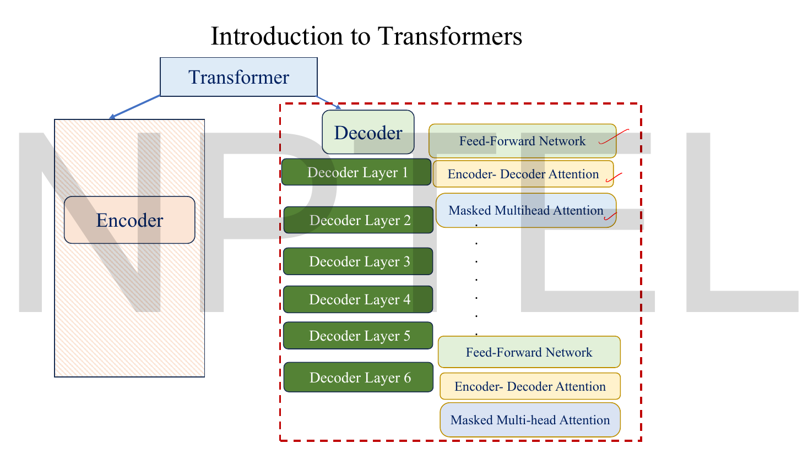
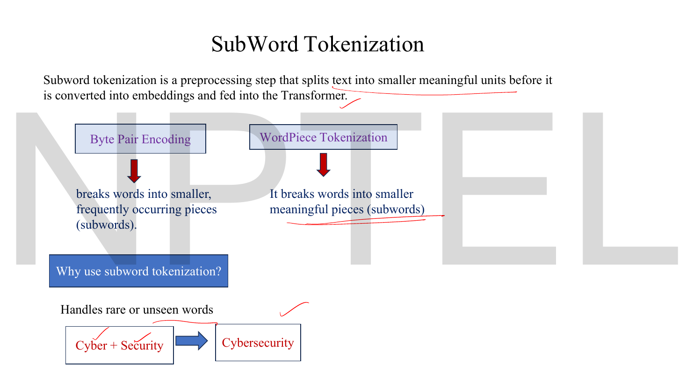
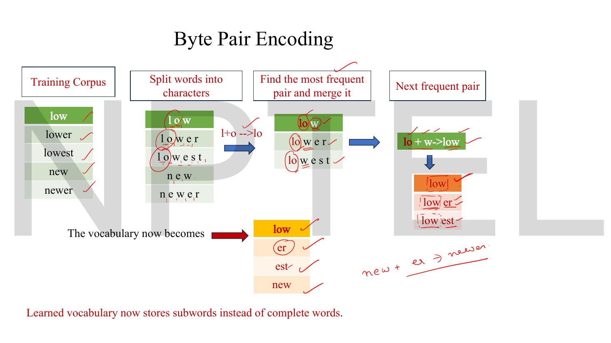
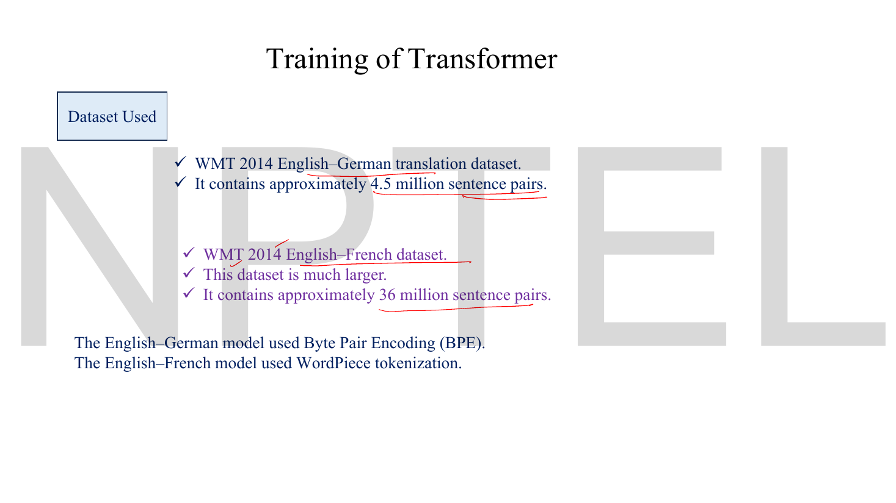

# Lec 59 — Transformer Decoder

> **Source:** `Lec 59.pdf` (15 pages) · **Week 10** · **Playlist:** Lec 59
> **Prereqs:** [Lec 54 — Foundations of NLP](54-nlp-foundations.md), [Lec 56 — From LSTMs to Transformers](56-lstm-to-transformer.md), [Lec 57 — Transformer Encoder](57-transformer-encoder.md)
> **Feeds into:** [Lec 60 — BERT](60-bert.md), [Lec 61 — GPT](61-gpt.md), [Lec 62 — Prompt Engineering Basics](62-prompt-engineering.md), [Lec 63 — Hands-on on LLM](63-llm-handson.md)

## Why this lecture exists

[Lec 57](57-transformer-encoder.md) built a machine that reads. Given $n$ tokens it returns $n$ contextual vectors, all at once, every token free to look at every other. That is exactly the wrong machine for writing. A generator emits one token at a time, and when it is deciding what word comes third it must not be allowed to look at the fourth — the fourth does not exist yet at inference, and if it is visible during training the model learns to copy the answer instead of predicting it.

So the decoder changes two things and keeps everything else. It **masks** its self-attention, so position $t$ sees only positions $1$ through $t$. And it adds a second attention sublayer, **cross-attention**, whose queries come from the decoder but whose keys and values come from the encoder — the join between reading and writing. Three sublayers instead of two, one new matrix of $-\infty$, and the architecture is complete.

## The ideas

### The decoder's two jobs


*Fig. — Six decoder layers, mirroring the encoder's six. Read the right-hand column bottom to top: **Masked Multihead Attention, then Encoder–Decoder Attention, then Feed-Forward Network**. The encoder on the left is hatched out because it is finished and frozen by the time the decoder runs. Page 3.*

The deck states the division of labour in one line each: **encoder → understand the input; decoder → generate the output.** The decoder's own responsibilities, from p-7, are two:

> ✓ Look at the words it has already generated (**Masked Self-Attention**).
> ✓ Attend to the encoder output through **Encoder–Decoder Attention**.

That is why the decoder needs three sublayers where the encoder needed two. The encoder has only one thing to look at — its own input — so one attention sublayer suffices. The decoder has two different things to look at, coming from two different places, and each needs its own attention sublayer.


*Fig. — The answer to "why an extra sublayer" is on the right; the blue box at the bottom answers a different and very examinable question. **8 heads in the original Transformer, 16 in Transformer-Big**, and — in the deck's own bold — those heads "operate in parallel within a **single attention sublayer**; they are **not** separate sublayers." Eight heads is one sublayer. Page 7.*

### Masked self-attention — the problem it solves

At inference the decoder has produced "Je suis un" and is predicting the fourth French word. Tokens 5, 6, 7 do not exist. There is nothing to mask — causality is enforced by reality.

Training is where the problem appears. Training uses **teacher forcing**: you feed the decoder the entire correct target sentence at once and ask it to predict, at every position simultaneously, the token that follows. This is what makes training fast — all $m$ target positions are processed in one parallel pass, exactly as the encoder processes its input. But it means the whole target sentence is sitting in the decoder's input matrix, so unmasked self-attention at position 3 would read position 4 — *which is the very token position 3 is being asked to predict*.

A model allowed to do that learns nothing. It achieves zero loss by copying the next token straight out of its own input, and then produces garbage at inference time when that token is absent. The gap between what the model saw in training and what it sees in deployment is total.

The fix: forbid every position from attending to any later position. The deck's phrasing on p-5 is *"Uses masking so that a token cannot attend to future tokens"*, and on p-4, *"ensures that each target token attends only to previously generated tokens"*.

### The mask as a matrix of $-\infty$

Attention itself is unchanged — [Lec 57](57-transformer-encoder.md) owns it. One operation is inserted between the scaling and the softmax:

$$\text{MaskedAttention}(\mathbf{Q},\mathbf{K},\mathbf{V}) = \text{softmax}\!\left(\frac{\mathbf{Q}\mathbf{K}^\top}{\sqrt{d_k}} + \mathbf{M}\right)\mathbf{V}$$

where $\mathbf{M}$ is an $n \times n$ **causal mask**, zero on and below the diagonal and $-\infty$ above it:

$$\mathbf{M} = \begin{bmatrix}
0 & -\infty & -\infty & -\infty \\
0 & 0 & -\infty & -\infty \\
0 & 0 & 0 & -\infty \\
0 & 0 & 0 & 0
\end{bmatrix} \qquad M_{ij} = \begin{cases} 0 & j \le i \\ -\infty & j > i\end{cases}$$

Read row $i$ as "what query $i$ may look at". Row 1 may look only at key 1. Row 2 at keys 1 and 2. Row 4 at everything. The mask is **lower-triangular-permissive**: zeros form a lower triangle including the diagonal, and the strictly upper triangle is $-\infty$. It depends only on the sequence length — it is not learned, has no parameters, and is identical in every layer and every head.

**What the softmax does with $-\infty$.** The softmax exponentiates, and

$$e^{-\infty} = 0$$

so every masked position contributes exactly 0 to the numerator *and* exactly 0 to the denominator. The remaining weights renormalise over the allowed keys alone and still sum to 1. A forbidden position does not receive a small weight; it receives **exactly zero**, and the surviving weights are a proper distribution over the past.

$$\alpha_{ij} = \begin{cases} \dfrac{\exp(e_{ij}/\sqrt{d_k})}{\sum_{j'\le i}\exp(e_{ij'}/\sqrt{d_k})} & j \le i \\[8pt] 0 & j > i\end{cases}$$

Consequences worth stating flatly:

- **Row 1 is always $(1, 0, 0, \ldots, 0)$.** The first token can attend only to itself, so its weight on itself is 1 whatever the scores are, and its output is exactly $\mathbf{v}_1$. The scores for row 1 are *irrelevant*. N1 shows this.
- **$\boldsymbol{\alpha}$ becomes lower triangular**, with zeros above the diagonal.
- **The last row is unmasked** — the final token sees everything, which is just the encoder's behaviour.
- **Masking does not reduce the computation.** You still build the full $n \times n$ score matrix and then throw half of it away. The cost stays $O(n^2)$.

> **Why $-\infty$ rather than deleting the entries, or zeroing the weights afterwards?** Because masking has to happen *before* the softmax for the renormalisation to be over the right set. Zeroing $\alpha_{ij}$ after a full softmax and then renormalising the row is algebraically the same thing — $\exp(e_{ij})/\sum_{j'\le i}\exp(e_{ij'})$ either way — but it is two passes instead of one, and it is easy to forget the renormalisation, which would leave the rows summing to less than 1. In code the $-\infty$ is usually a large negative constant such as $-10^{9}$, since $e^{-10^9}$ underflows to 0 in floating point anyway and avoids `inf − inf = nan` arithmetic.

### Cross-attention — the asymmetry is the whole mechanism


*Fig. — The most important slide in the deck, and the only place in the entire course where $\text{Attention}(\mathbf{Q},\mathbf{K},\mathbf{V}) = \text{softmax}(\mathbf{Q}\mathbf{K}^\top/\sqrt{d_k})\mathbf{V}$ is printed. The two bullets on the right are the examinable content, in the lecturer's underlining: **Queries (Q) come from the decoder. Keys (K) and Values (V) come from the encoder output.** Page 5.*

The second decoder sublayer is called **encoder–decoder attention** or **cross-attention**. The formula is identical to [Lec 57](57-transformer-encoder.md)'s — same softmax, same $\sqrt{d_k}$, same multi-head machinery. **Only the source of the three inputs changes**, and that one change is the entire mechanism:

$$\mathbf{Q} = \mathbf{Y}\mathbf{W}^{Q}, \qquad \mathbf{K} = \mathbf{H}_{\text{enc}}\mathbf{W}^{K}, \qquad \mathbf{V} = \mathbf{H}_{\text{enc}}\mathbf{W}^{V}$$

with $\mathbf{Y}$ the decoder's own running representation ($m \times d_{\text{model}}$, $m$ = target length so far) and $\mathbf{H}_{\text{enc}}$ the encoder's final output ($n \times d_{\text{model}}$, $n$ = source length).

| Sublayer | $\mathbf{Q}$ from | $\mathbf{K}, \mathbf{V}$ from | Masked? | Score matrix |
|---|---|---|---|---|
| Encoder self-attention | encoder input | encoder input | no | $n \times n$ |
| Decoder masked self-attention | decoder input | decoder input | **yes** | $m \times m$ |
| Decoder cross-attention | **decoder** | **encoder output** | no | $m \times n$ |

Read the Q/K/V metaphor of [Lec 57](57-transformer-encoder.md) onto it and it becomes obvious. The decoder, part-way through writing "Je suis un ___", asks a question: *"I need a noun describing the speaker — who has one?"* That question is the query, and it is about the French it is producing. The answers are advertised by the English source sentence: the encoder's output for "student" raises its hand (key), and what it hands over is its contextual meaning (value). **The decoder asks; the encoder answers.**

Three things follow immediately, and all three are exam material.

- **The score matrix is rectangular, $m \times n$.** Target length by source length. This is the first non-square attention matrix you have met, and it is the clean tell that you are looking at cross-attention. If a question shows you a $7\times11$ attention matrix, it is cross-attention between a 7-token output and an 11-token input.
- **Cross-attention is not masked.** The decoder may look at the *entire* source sentence, including its end, while generating its first output word. Nothing about causality applies — the source is given in full, and translation routinely needs the end of the sentence to choose the first word. Masking cross-attention would be a modelling error.
- **$\mathbf{K}$ and $\mathbf{V}$ are computed once.** The encoder runs once per input sentence; its output is fixed. During the $m$ sequential decoding steps, the cross-attention keys and values never change, which is why implementations cache them.

Every decoder layer has its own cross-attention sublayer with its own $\mathbf{W}^{K}, \mathbf{W}^{V}$, but all six read the *same* $\mathbf{H}_{\text{enc}}$ — the output of the top encoder layer. Encoder layer 3 does not feed decoder layer 3; the encoder stack finishes completely, and then all six decoder layers draw on its final output. The single arrow on the architecture diagram, fanning out to every decoder layer, is drawing exactly that.

### The decoder block


*Fig. — The complete decoder, bottom to top. Three sublayers, each wrapped in its own Add and Norm — count the gold boxes: **three**, where the encoder had two. Above the block sit two things the encoder has no equivalent of: a **Linear** layer that "maps the final output to the vocabulary space" and a **Softmax** that "converts raw scores into probabilities over the entire vocabulary". The deck's typo "Poaition-wise FFN" is on this page. Page 4.*

$$\mathbf{Z}_1 = \text{LayerNorm}\big(\mathbf{Y} + \text{MaskedMultiHeadSelfAttention}(\mathbf{Y})\big)$$
$$\mathbf{Z}_2 = \text{LayerNorm}\big(\mathbf{Z}_1 + \text{CrossAttention}(\mathbf{Z}_1,\ \mathbf{H}_{\text{enc}})\big)$$
$$\mathbf{Z}_3 = \text{LayerNorm}\big(\mathbf{Z}_2 + \text{FFN}(\mathbf{Z}_2)\big)$$

Everything in those three lines except the mask and the cross-attention's $\mathbf{K},\mathbf{V}$ source is [Lec 57](57-transformer-encoder.md)'s, unchanged: the same post-norm wrapper $\text{LayerNorm}(x + \text{Sublayer}(x))$, the same residual addition ([Lec 42](42-stylegan2.md) owns the residual block), the same position-wise $\text{FFN}(\mathbf{x}) = \max(0,\mathbf{x}\mathbf{W}_1+\mathbf{b}_1)\mathbf{W}_2+\mathbf{b}_2$ at $512 \to 2048 \to 512$, the same layer-norm statistics taken across the features of a single token. The decoder's input is likewise the output embedding plus the *same* sinusoidal positional encoding, added once at the bottom.

**The output head**, which the encoder does not have:

$$p(\text{next token}) = \text{softmax}\big(\mathbf{Z}_3^{(\text{top})}\mathbf{W}_{\text{vocab}}\big)$$

$\mathbf{W}_{\text{vocab}}$ is $d_{\text{model}} \times \lvert V\rvert$, so a $1 \times 512$ token vector becomes $1 \times \lvert V\rvert$ logits and then a probability distribution over the whole vocabulary. At $\lvert V\rvert = 37{,}000$ that single matrix holds $512 \times 37{,}000 = 18.9$ M parameters — as much as the entire six-layer encoder (see N4). This is why implementations usually *tie* it to the input embedding matrix.

### The full assembly


*Fig. — The whole model on one page. Trace the blue arrow: it leaves the **top** of the encoder stack and enters the decoder's middle sublayer only — not its bottom one, not its FFN. That single arrow is the cross-attention $\mathbf{K},\mathbf{V}$ feed and it is the only channel between the two halves. Note the encoder's middle box is labelled "MLP" here where page 4 of Lec 57 called it FFN; the lecturer's handwriting corrects it. Page 8.*

| | Encoder | Decoder |
|---|---|---|
| Layers | 6 | 6 |
| Sublayers per layer | 2 | 3 |
| Self-attention | unmasked | **masked** |
| Cross-attention | none | yes, $\mathbf{K},\mathbf{V}$ from encoder |
| FFN | yes | yes |
| Add & Norm per layer | 2 | 3 |
| Input | source embedding + PE | target embedding + PE |
| Output | $n \times d_{\text{model}}$ contextual vectors | probabilities over $\lvert V\rvert$, per position |
| Sees the whole sequence at once? | yes | yes in training, no at inference |

### Training is parallel; inference is not

This asymmetry is the single most misunderstood thing about decoders, and it is worth a paragraph of its own.

**In training**, teacher forcing gives the decoder the full gold target sentence. All $m$ positions go through the stack in **one** forward pass, and the mask is what makes that legitimate — position $t$'s output depends only on positions $\le t$, so computing all $m$ predictions simultaneously gives exactly the same numbers as computing them one at a time would. The loss is the cross-entropy of the predicted distribution against the true next token, summed over all $m$ positions, and it is computed in that one pass. This is precisely the speed-up over an LSTM that [Lec 56](56-lstm-to-transformer.md) promised.

**At inference** there is no gold sentence. The decoder emits token 1, appends it to its own input, runs the whole stack again to emit token 2, appends, runs again. Producing $m$ tokens takes $m$ sequential forward passes, and no masking trick can change that — it is causality, not an implementation detail. The deck's p-5 phrasing, *"takes the previously generated output tokens as input"*, is describing this loop.

So: **the mask buys parallel training, not parallel generation.** Transformers are fast to train and no faster than an RNN to sample from, token for token. That fact is why every LLM serving system you will meet is built around caching keys and values across decoding steps.

### Subword tokenization

The deck spends three pages on how text becomes tokens in the first place. [Lec 54](54-nlp-foundations.md) owns tokenization as a concept and its four granularities (word, sentence, subword, character); **this deck is the only place in the course that names and works the actual subword *algorithms***, so they are taught here.


*Fig. — The motivation in one example: a vocabulary holding "cyber" and "security" can spell "cybersecurity" without ever having seen it. That is the answer to the out-of-vocabulary problem — an unseen word decomposes into known pieces, in the worst case into single characters, so no `<UNK>` is ever needed. Page 9.*

**Byte Pair Encoding (BPE)** builds a vocabulary bottom-up by repeated merging:

1. Split every word in the training corpus into individual characters.
2. Count every adjacent pair of symbols across the corpus.
3. Merge the **most frequent** pair into one new symbol, and add it to the vocabulary.
4. Repeat from step 2 until the vocabulary reaches the target size.


*Fig. — The deck's worked merge trace. Follow the circles left to right: `l o w` → merge `l`+`o` → `lo w` → merge `lo`+`w` → `low`. The final vocabulary at bottom centre stores **subwords, not complete words** — low, er, est, new — and the lecturer's handwriting at bottom right spells out the payoff, `new + er → newer`: a word the vocabulary never stored, spelled from two pieces it did. N3 works the pair counts the slide omits. Page 10.*

**WordPiece** is the same shape of algorithm with one change, which the deck states in a boxed line and underlines twice:

> **WordPiece chooses merges based on likelihood, unlike BPE which [uses] frequency.**

BPE merges the pair that occurs most often. WordPiece merges the pair that most increases the likelihood of the training corpus under a unigram language model — which, in practice, means it prefers a pair whose joint count is high *relative to the product of its parts' counts*. A pair like `t` + `h` is very frequent but both pieces are individually ubiquitous, so merging it buys little; a pair like `##ing` is more informative. The scoring difference is the examinable one.


*Fig. — Notice the `##` prefix on the suffix tokens. That marker means "this piece continues the previous word rather than starting a new one", and it is how the tokenizer's output can be unambiguously glued back into text. Three words — Playing, Played, Player — cost four vocabulary entries instead of three whole words, and generalise to any `play`+suffix. Page 11.*

| | Byte Pair Encoding | WordPiece |
|---|---|---|
| Merge criterion | highest **frequency** | highest **likelihood** gain |
| Continuation marker | none in this deck | `##` prefix |
| Used by (this deck) | the English–German model | the English–French model |
| Used in practice | GPT-2, RoBERTa | BERT |

Both solve the same problem — a fixed finite vocabulary that can spell any word — and both make the embedding table a fixed size regardless of how language evolves.

### What the model was trained on


*Fig. — Four numbers worth memorising outright, because they are the kind an MCQ can ask verbatim: WMT 2014, English–German, **4.5 M** sentence pairs, BPE; English–French, **36 M** pairs, WordPiece. Page 12.*

### Advantages and limitations


*Fig. — The deck's closing audit. The advantages are the inverse of Lec 57 p-3's complaints about RNNs, item for item. The limitation to actually understand is the second one — **quadratic attention complexity $O(n^2)$** — which is the only place in this course the cost of the $n\times n$ score matrix is named. Page 13.*

| Advantages | Limitations |
|---|---|
| Parallel computation | High memory usage |
| Better long-range dependency modelling | **Quadratic attention complexity $O(n^2)$** |
| Highly scalable | Requires large datasets |
| State-of-the-art performance | Computationally expensive |
| Foundation of BERT, GPT, T5, Llama | |

The $O(n^2)$ entry deserves unpacking, because N5 prices it. Every attention sublayer builds an $n \times n$ matrix. Double the sequence length and you quadruple the time and the memory, in every head of every layer. That single fact is why context windows were measured in hundreds of tokens for years, and it is the premise of the entire efficient-attention literature (`../../DLforNLP/notes/week-05/25-efficient-transformers.md`).

The last advantage is the bridge to Week 10's remaining lectures. Take the encoder alone, train it to fill in blanked-out words, and you have **BERT** ([Lec 60](60-bert.md)). Take the decoder alone, delete its cross-attention sublayer because there is no encoder to attend to, and train it to predict the next token — and you have **GPT** ([Lec 61](61-gpt.md)), which is a stack of masked-self-attention + FFN blocks and nothing else. The masked self-attention you learned here is the *only* attention inside every modern LLM.

## Worked numericals

### N1. Masked self-attention, worked against the unmasked baseline

**Given:** exactly the setup of [Lec 57](57-transformer-encoder.md)'s N2 — three tokens, $d_{\text{model}}=4$, $d_k=d_v=2$ — whose scaled score matrix was

$$\frac{\mathbf{Q}\mathbf{K}^\top}{\sqrt{2}} = \begin{bmatrix} 0 & 2.828427 & 1.414214 \\ 2.828427 & 0 & 1.414214 \\ 1.414214 & 1.414214 & 1.414214 \end{bmatrix}, \qquad \mathbf{V} = \begin{bmatrix} 2 & 1 \\ 0 & 2 \\ 1 & 1\end{bmatrix}$$

**Find:** the attention weights and outputs with a causal mask applied, and the change from unmasked.

1. **Add the mask** — zeros on and below the diagonal, $-\infty$ above:

$$\frac{\mathbf{Q}\mathbf{K}^\top}{\sqrt{2}} + \mathbf{M} = \begin{bmatrix} 0 & -\infty & -\infty \\ 2.828427 & 0 & -\infty \\ 1.414214 & 1.414214 & 1.414214 \end{bmatrix}$$

2. **Row 1.** Only one live entry. $e^{0} = 1$, and the two masked entries give $e^{-\infty} = 0$. Sum $= 1$. So $\boldsymbol{\alpha}_1 = (1, 0, 0)$ — and notice the score $0$ never mattered; *any* number there would give the same row.
3. **Row 2.** Live entries $2.828427$ and $0$. $e^{2.828427} = 16.918829$, $e^{0} = 1$, third term 0. Sum $= 17.918829$.
   - $\alpha_{21} = 16.918829/17.918829 = 0.944193$
   - $\alpha_{22} = 1/17.918829 = 0.055807$
   - $\alpha_{23} = 0$
   
   Check: $0.944193 + 0.055807 = 1.000000$. ✓
4. **Row 3.** Nothing is masked; all three scores are equal, so the softmax is uniform: $(1/3, 1/3, 1/3)$ — identical to the unmasked case, as it must be for the last row.

$$\boldsymbol{\alpha}_{\text{masked}} = \begin{bmatrix} 1 & 0 & 0 \\ 0.944193 & 0.055807 & 0 \\ 0.333333 & 0.333333 & 0.333333\end{bmatrix} \quad \text{— lower triangular}$$

5. **Multiply by $\mathbf{V}$**, $(3\times3)(3\times2) = 3\times2$:
   - $\mathbf{c}_1 = 1\cdot(2,1) = (2.000000,\ 1.000000)$ — exactly $\mathbf{v}_1$.
   - $\mathbf{c}_2 = 0.944193(2,1) + 0.055807(0,2) = (1.888386,\ 0.944193+0.111614) = (1.888386,\ 1.055807)$
   - $\mathbf{c}_3 = \tfrac13[(2,1)+(0,2)+(1,1)] = (1.000000,\ 1.333333)$

**Answer:**

| Token | Unmasked output (Lec 57 N2) | Masked output |
|---|---|---|
| 1 | $(0.277470,\ 1.767918)$ | $(2.000000,\ 1.000000)$ |
| 2 | $(1.722530,\ 1.045388)$ | $(1.888386,\ 1.055807)$ |
| 3 | $(1.000000,\ 1.333333)$ | $(1.000000,\ 1.333333)$ |

Three things to take away. Token 1 changes completely — unmasked it put 76.8% of its weight on token 2, masked it has nowhere to look but itself. Token 2 changes moderately: it loses its 18.7% share of token 3 and redistributes it over tokens 1 and 2, which pushes $\alpha_{21}$ from 0.768 up to 0.944. **Token 3 is identical**, because the last row was never masked. In general the *earlier* a position is, the more masking changes it, and the final position is untouched.

### N2. Cross-attention with a rectangular score matrix

**Given:** an encoder output (the "memory") of 3 source tokens and a decoder state of 2 target tokens so far, with $d_{\text{model}}=4$, $d_k=d_v=2$:

$$\mathbf{H}_{\text{enc}} = \begin{bmatrix} 1&0&1&0 \\ 0&1&0&1 \\ 1&1&0&0\end{bmatrix}_{3\times4}, \qquad
\mathbf{Y} = \begin{bmatrix} 0&1&1&0 \\ 1&1&1&0 \end{bmatrix}_{2\times4}$$

with the same projection matrices as before: $\mathbf{W}^{Q}$ applied to $\mathbf{Y}$, and $\mathbf{W}^{K}, \mathbf{W}^{V}$ applied to $\mathbf{H}_{\text{enc}}$.

**Find:** the cross-attention weights and outputs, with every shape.

1. **Queries come from the decoder.** $\mathbf{Q} = \mathbf{Y}\mathbf{W}^{Q}$ is $(2\times4)(4\times2) = 2\times2$.
   - Row 1: $(0,1,1,0)\mathbf{W}^Q$ → column 1 sums rows 1,3 of $\mathbf{W}^Q$ weighted by $(0,1)$ → $0+1=1$; column 2 → $1+0=1$. So $\mathbf{q}_1 = (1,1)$.
   - Row 2: $(1,1,1,0)$ → column 1: $1+1 = 2$; column 2: $1+0 = 1$. So $\mathbf{q}_2 = (2,1)$.
2. **Keys and values come from the encoder** — these are exactly the $\mathbf{K}, \mathbf{V}$ of N1, both $3\times2$:

$$\mathbf{K} = \begin{bmatrix} 0&2\\2&0\\1&1\end{bmatrix}, \qquad \mathbf{V} = \begin{bmatrix} 2&1\\0&2\\1&1\end{bmatrix}$$

3. **Scores.** $\mathbf{Q}\mathbf{K}^\top$ is $(2\times2)(2\times3) = \mathbf{2\times3}$ — **rectangular**, target length by source length.
   - $\mathbf{q}_1 = (1,1)$: $\cdot(0,2)=2$; $\cdot(2,0)=2$; $\cdot(1,1)=2$ → $(2,2,2)$
   - $\mathbf{q}_2 = (2,1)$: $\cdot(0,2)=2$; $\cdot(2,0)=4$; $\cdot(1,1)=3$ → $(2,4,3)$
4. **Scale** by $\sqrt{d_k}=\sqrt2 = 1.414214$:
   - row 1: $(1.414214,\ 1.414214,\ 1.414214)$
   - row 2: $(1.414214,\ 2.828427,\ 2.121320)$
5. **Softmax, row 1.** All equal → uniform $(1/3, 1/3, 1/3)$.
6. **Softmax, row 2.** $e^{1.414214}=4.113250$, $e^{2.828427}=16.918829$, $e^{2.121320}=8.342145$. Sum $= 29.374224$.
   - $4.113250/29.374224 = 0.140029$
   - $16.918829/29.374224 = 0.575975$
   - $8.342145/29.374224 = 0.283995$
   
   Check: $0.140029+0.575975+0.283995 = 0.999999$. ✓
7. **Outputs**, $(2\times3)(3\times2) = 2\times2$:
   - $\mathbf{c}_1 = \tfrac13[(2,1)+(0,2)+(1,1)] = (1.000000,\ 1.333333)$
   - $\mathbf{c}_2 = 0.140029(2,1) + 0.575975(0,2) + 0.283995(1,1)$
     $= (0.280058 + 0 + 0.283995,\ \ 0.140029 + 1.151950 + 0.283995) = (0.564053,\ 1.575974)$

**Answer:**

$$\boldsymbol{\alpha}_{\text{cross}} = \begin{bmatrix} 0.333333 & 0.333333 & 0.333333 \\ 0.140029 & 0.575975 & 0.283995\end{bmatrix}_{2\times3}, \qquad
\text{output} = \begin{bmatrix} 1.000000 & 1.333333 \\ 0.564053 & 1.575974\end{bmatrix}_{2\times2}$$

The shape story is the lesson. Two queries, three keys, so the attention matrix is $2\times3$ and **its rows still sum to 1** — each *target* position distributes its attention over the three *source* positions. The output has one row per target token, not per source token. And nothing here is masked: target token 1 freely reads all three source tokens, including the last. If you try to apply a causal mask to a $2\times3$ matrix you will discover it has no meaningful diagonal — which is the structural reason cross-attention cannot be causal.

### N3. The deck's BPE merge trace, with the counts filled in

**Given:** the training corpus of p-10 — `low, lower, lowest, new, newer`, each appearing once.
**Find:** the first merges, with the pair frequencies the slide does not print.

1. **Split into characters.**

| Word | Symbols |
|---|---|
| low | `l o w` |
| lower | `l o w e r` |
| lowest | `l o w e s t` |
| new | `n e w` |
| newer | `n e w e r` |

2. **Count every adjacent pair** across the corpus:

| Pair | Count | Where |
|---|---|---|
| `l o` | **3** | low, lower, lowest |
| `o w` | **3** | low, lower, lowest |
| `w e` | 2 | lower, lowest |
| `e r` | 2 | lower, newer |
| `n e` | 2 | new, newer |
| `e w` | 2 | new, newer |
| `e s` | 1 | lowest |
| `s t` | 1 | lowest |

3. **Merge the most frequent.** `l o` and `o w` tie at 3; the deck takes `l`+`o` → `lo`, which the slide writes as `l+o --> lo`. Corpus becomes `lo w` / `lo w e r` / `lo w e s t` / `n e w` / `n e w e r`.
4. **Recount.** `lo w` is now 3 and is the unique maximum (`w e`, `e r`, `n e`, `e w` are all 2). Merge → `low`. This is the slide's second arrow, `lo + w -> low`.
5. **Corpus now:** `low` / `low e r` / `low e s t` / `n e w` / `n e w e r`. Continuing with the four-way tie at 2 — `e r`, `n e`, `e w`, `low e` — and resolving it produces the merges that give the slide's stated vocabulary.

**Answer:** the first two merges are `l`+`o` → `lo` (frequency 3) and `lo`+`w` → `low` (frequency 3), and the deck's final learned vocabulary is **`low`, `er`, `est`, `new`** — four subword units, not five whole words. The handwritten consequence on the slide: **`newer` = `new` + `er`**, two tokens, assembled from pieces, even though "newer" was never stored. The merge *count* (how many merges you perform) is the hyperparameter that sets the final vocabulary size; 30k–50k is typical.

*Caution for the exam:* the first merge is a genuine tie between `l o` and `o w` at count 3, and the deck resolves it by taking `l o`. Real implementations break ties deterministically (by first occurrence, or lexicographically); a question that constructs a tie is testing whether you noticed.

### N4. Parameters: decoder block versus encoder block, and the whole base model

**Given:** $d_{\text{model}}=512$, $h=8$, $d_{\text{ff}}=2048$, $N=6$ for each stack, shared vocabulary $\lvert V\rvert = 37{,}000$.
**Find:** parameters per decoder layer, per stack, and for the complete model.

1. **One multi-head attention sublayer** = $4d_{\text{model}}^2 = 4\times512^2 = 1{,}048{,}576$ ([Lec 57](57-transformer-encoder.md) N4). The decoder has **two** of them — masked self-attention and cross-attention — so $2{,}097{,}152$.
2. **FFN** = $512\times2048 + 2048 + 2048\times512 + 512 = 2{,}099{,}712$.
3. **Three layer norms** (one per sublayer) $= 3\times2\times512 = 3{,}072$, against the encoder's two at $2{,}048$.
4. **One decoder layer** $= 2{,}097{,}152 + 2{,}099{,}712 + 3{,}072 = 4{,}199{,}936$.
5. **Ratio to an encoder layer** ($3{,}150{,}336$): $4{,}199{,}936 / 3{,}150{,}336 = 1.333$. A decoder layer is exactly **one third heavier**, and the extra third is the cross-attention sublayer.
6. **Six decoder layers** $= 6 \times 4{,}199{,}936 = 25{,}199{,}616$.
7. **Six encoder layers** $= 6 \times 3{,}150{,}336 = 18{,}902{,}016$.
8. **Both stacks** $= 44{,}101{,}632$.
9. **Embedding / output matrix**, tied across input embedding, output embedding and the final linear projection: $37{,}000 \times 512 = 18{,}944{,}000$.

**Answer:** **4.20 M per decoder layer**, **25.2 M for the decoder stack**, **44.1 M for both stacks**, and **≈63.0 M for the whole base Transformer** including the tied embedding table — against the 65 M quoted in the original paper, the small remainder being biases and the layer norms after each stack.

Two readings. The decoder is the larger half (25.2 M against 18.9 M) purely because of the cross-attention sublayer. And the embedding table alone, at 18.9 M, is 30% of the model and is the same size as the entire encoder — which is why tying the input embedding to the output projection is standard rather than optional.

### N5. The cost of $O(n^2)$, and training versus inference passes

**Given:** the base model, $h=8$, $N=6$ layers, fp32 (4 bytes per number).
**Find:** the size of the attention weights at several sequence lengths, and the number of forward passes needed to train on versus generate a 10-token sentence.

1. **Entries in one attention matrix:**

| $n$ | $n^2$ | relative to $n=10$ |
|---|---|---|
| 10 | 100 | 1× |
| 100 | 10,000 | 100× |
| 1,000 | 1,000,000 | 10,000× |
| 10,000 | 100,000,000 | 1,000,000× |

   Ten times the sentence, a hundred times the attention.
2. **Memory for the attention weights of one sequence at $n=1000$**, across all heads and layers:
   $$1000 \times 1000 \times 8\ \text{heads} \times 6\ \text{layers} \times 4\ \text{bytes} = 1.92\times10^{8}\ \text{bytes} = 192\ \text{MB}$$
   For **one** sentence, for the attention weights **alone** — no embeddings, no FFN activations, no gradients, and this is the encoder only.
3. **Training passes for a 10-token target:** **1**. Teacher forcing plus the causal mask lets all 10 positions be scored in a single parallel pass.
4. **Inference passes for a 10-token output:** **10**. Each token must exist before the next can be conditioned on it.
5. **Ratio:** $10\times$ more passes at inference than training, for the same sentence — and it scales as $m$, so a 500-token generation is 500 sequential passes.

**Answer:** attention memory grows as $n^2$ — 192 MB of attention weights for a single 1000-token sequence in the base model — and a 10-token target costs **1 forward pass to train on but 10 to generate**. These are the two numbers behind the deck's "high memory usage" and "quadratic attention complexity $O(n^2)$" bullets, and behind the fact that masking makes *training* parallel and does nothing for *generation*.

## Code

The deck shows no code. The point worth demonstrating is not that masked attention runs — it is that masking actually delivers causality, which you can test: corrupt the last token and check that the earlier outputs do not move.

```python
import numpy as np

def softmax(a):
    e = np.exp(a - a.max(axis=-1, keepdims=True))
    return e / e.sum(axis=-1, keepdims=True)

def attention(Q, K, V, mask=None):
    scores = Q @ K.T / np.sqrt(Q.shape[-1])
    if mask is not None:
        scores = np.where(mask, scores, -np.inf)   # mask == True means "allowed"
    alpha = softmax(scores)
    return alpha @ V, alpha

def causal_mask(n):
    return np.tril(np.ones((n, n), dtype=bool))    # True on and below the diagonal

X   = np.array([[1., 0., 1., 0.], [0., 1., 0., 1.], [1., 1., 0., 0.]])
W_Q = np.array([[1., 0.], [0., 1.], [1., 0.], [0., 1.]])
W_K = np.array([[0., 1.], [1., 0.], [0., 1.], [1., 0.]])
W_V = np.array([[1., 0.], [0., 1.], [1., 1.], [0., 1.]])

print("causal mask (True = may attend):\n", causal_mask(3))
Q, K, V = X @ W_Q, X @ W_K, X @ W_V
out_m, a_m = attention(Q, K, V, mask=causal_mask(3))
print("masked alpha =\n", np.round(a_m, 6))
print("masked output =\n", np.round(out_m, 6))

# the point of the mask: row t must not change when tokens after t change
X2 = X.copy(); X2[2] = [9., -4., 7., 3.]          # scribble over the LAST token only
Q2, K2, V2 = X2 @ W_Q, X2 @ W_K, X2 @ W_V
out2, _ = attention(Q2, K2, V2, mask=causal_mask(3))
print("rows 0-1 unchanged after corrupting token 3?",
      np.allclose(out_m[:2], out2[:2]))
out_u, _ = attention(Q2, K2, V2)                   # same thing with NO mask
out_u0, _ = attention(Q, K, V)
print("rows 0-1 unchanged WITHOUT the mask?        ", np.allclose(out_u0[:2], out_u[:2]))

# cross-attention: Q from the decoder (2 tokens), K and V from the encoder (3 tokens)
Y = np.array([[0., 1., 1., 0.], [1., 1., 1., 0.]])
Qd = Y @ W_Q
out_x, a_x = attention(Qd, K, V)                   # K, V are the ENCODER's
print("cross shapes: Q", Qd.shape, "K", K.shape, "alpha", a_x.shape, "out", out_x.shape)
print("cross alpha =\n", np.round(a_x, 6))
print("cross output =\n", np.round(out_x, 6))
```

```
causal mask (True = may attend):
 [[ True False False]
 [ True  True False]
 [ True  True  True]]
masked alpha =
 [[1.       0.       0.      ]
 [0.944193 0.055807 0.      ]
 [0.333333 0.333333 0.333333]]
masked output =
 [[2.       1.      ]
 [1.888386 1.055807]
 [1.       1.333333]]
rows 0-1 unchanged after corrupting token 3? True
rows 0-1 unchanged WITHOUT the mask?         False
cross shapes: Q (2, 2) K (3, 2) alpha (2, 3) out (2, 2)
cross alpha =
 [[0.333333 0.333333 0.333333]
 [0.140029 0.575975 0.283995]]
cross output =
 [[1.       1.333333]
 [0.564054 1.575975]]
```

The two boolean lines are the whole argument for masking, measured. With the mask, replacing token 3 with arbitrary nonsense leaves the outputs for tokens 1 and 2 **bit-identical** — which is precisely the property that lets you train on all positions in one pass and still deploy one token at a time. Without the mask, the same edit changes them, and a model trained that way is reading its own answer sheet. Note also that $\boldsymbol{\alpha}$ comes out lower triangular with exact zeros (not small numbers) above the diagonal, and that the cross-attention block prints a $2\times3$ alpha from a $2\times2$ query and a $3\times2$ key — the rectangular shape that identifies cross-attention.

## Exam pack

### Must-memorise

| Item | Exactly this |
|---|---|
| Masked attention | $\text{softmax}\!\left(\dfrac{\mathbf{Q}\mathbf{K}^\top}{\sqrt{d_k}} + \mathbf{M}\right)\mathbf{V}$ |
| The mask | $M_{ij} = 0$ if $j\le i$, $-\infty$ if $j > i$ — strictly upper triangle is $-\infty$ |
| Why it works | $e^{-\infty}=0$, so masked weights are exactly 0 and the rest renormalise to sum to 1 |
| Resulting $\boldsymbol{\alpha}$ | lower triangular; row 1 is always $(1,0,\ldots,0)$; last row unmasked |
| Cross-attention sources | $\mathbf{Q}$ from the **decoder**; $\mathbf{K}$ and $\mathbf{V}$ from the **encoder output** |
| Cross-attention shape | $\mathbf{Q}: m\times d_k$, $\mathbf{K}: n\times d_k$ → scores $m \times n$ (rectangular) |
| Cross-attention masking | **none** — the whole source is visible |
| Decoder sublayers, in order | masked multi-head self-attention → Add & Norm → encoder–decoder attention → Add & Norm → position-wise FFN → Add & Norm |
| Output head | Linear ($d_{\text{model}}\times\lvert V\rvert$) then softmax over the vocabulary |
| Heads | 8 original, 16 Transformer-Big; all heads live in **one** sublayer |
| Training | teacher forcing, all $m$ positions in **1** parallel pass |
| Inference | $m$ sequential passes, one token each |
| BPE merge rule | merge the most **frequent** adjacent pair, repeat |
| WordPiece merge rule | merge the pair giving the greatest **likelihood** gain; `##` marks a continuation |
| Encoder vs decoder sublayer count | 2 vs 3 |

### Numbers worth knowing

| Quantity | Value |
|---|---|
| Decoder layers $N$ | 6 |
| Sublayers per decoder layer | 3 (encoder: 2) |
| Attention heads | 8 (16 in Transformer-Big) |
| WMT 2014 English–German | ~4.5 M sentence pairs, **BPE** |
| WMT 2014 English–French | ~36 M sentence pairs, **WordPiece** |
| Attention complexity | $O(n^2)$ |
| Masked self-attention score matrix | $m\times m$ |
| Cross-attention score matrix | $m\times n$ |
| One decoder layer at 512/8/2048 | $4{,}199{,}936 \approx 4.20$ M |
| Decoder stack (6 layers) | $25{,}199{,}616 \approx 25.2$ M |
| Encoder stack (6 layers) | $18{,}902{,}016 \approx 18.9$ M |
| Decoder layer ÷ encoder layer | exactly $4/3 = 1.333$ |
| Both stacks + tied $37\text{k}\times512$ embedding | $\approx 63.0$ M (paper: 65 M) |
| N1's masked $\boldsymbol{\alpha}$ row 2 | $(0.944193,\ 0.055807,\ 0)$ |
| N1's masked output, token 1 | $(2,\ 1)$ — exactly $\mathbf{v}_1$ |
| Attention weights, $n=1000$, 8 heads, 6 layers, fp32 | 192 MB per sequence |
| BPE first merge in the deck's corpus | `l`+`o`, frequency 3 |
| Deck's learned vocabulary | low, er, est, new |

### Likely MCQ traps

- **Reversing cross-attention's sources.** $\mathbf{Q}$ from the decoder, $\mathbf{K}$ and $\mathbf{V}$ from the encoder. The reverse would mean the *encoder* was asking questions about the output it has not seen. Mnemonic: **the one that is still being written asks the question**.
- **Masking cross-attention.** Only the decoder's *self*-attention is masked. The source sentence is given in full, so there is no future to hide, and the score matrix is not even square.
- **"The mask makes generation parallel."** It makes **training** parallel. Generating $m$ tokens still takes $m$ sequential passes.
- **Masking with $+\infty$, or zeroing the scores.** It is $-\infty$ (or a large negative number) added *before* the softmax. Setting a masked *score* to 0 would give it weight $e^0=1$ — a large weight, the opposite of the intent.
- **Masking after the softmax without renormalising.** Zeroing $\alpha_{ij}$ post-softmax leaves the row summing to less than 1. Done correctly (zero, then renormalise) it is algebraically identical to the $-\infty$ route, but the renormalisation is not optional.
- **"The decoder has two sublayers."** Three, and therefore three Add & Norm wrappers. The encoder has two of each.
- **"Encoder layer $k$ feeds decoder layer $k$."** No. The encoder stack completes, and its **final** output is read by the cross-attention of **every** decoder layer.
- **Thinking $\boldsymbol{\alpha}$ is upper triangular.** It is **lower** triangular: position $i$ attends to positions $\le i$, so the surviving entries are at $j \le i$, on and below the diagonal.
- **Forgetting that masking does not save computation.** You build the full $n\times n$ matrix then discard half of it. Still $O(n^2)$.
- **BPE versus WordPiece.** BPE merges on **frequency**; WordPiece on **likelihood**. In this deck: English–German used BPE, English–French used WordPiece. Reversing the pairing is the obvious distractor.
- **Thinking subword tokenization has an OOV problem.** It does not — an unseen word falls back through subwords to characters. Word-level tokenization is what needs `<UNK>` ([Lec 54](54-nlp-foundations.md)).
- **"GPT uses cross-attention."** It does not. A decoder-only model has no encoder to attend to, so that sublayer is deleted; what remains is masked self-attention plus FFN ([Lec 61](61-gpt.md)).
- **Confusing the mask with dropout or with padding.** The causal mask is deterministic, parameter-free and depends only on position. A *padding* mask is a different mask hiding `<pad>` positions; both can be applied at once.

### Self-test

1. Write the $4\times4$ causal mask and state the resulting shape of $\boldsymbol{\alpha}$.
2. Why is $e^{-\infty}=0$ the right behaviour, and what would $+\infty$ do instead?
3. In cross-attention, where do $\mathbf{Q}$, $\mathbf{K}$ and $\mathbf{V}$ come from, and what is the shape of the score matrix for a 7-token target and an 11-token source?
4. A decoder's masked self-attention gives row 3 the scaled scores $(1, 2, 0)$ before masking, in a 4-token sequence. Compute $\boldsymbol{\alpha}_3$.
5. Why can cross-attention not be causally masked?
6. How many forward passes does a 20-token target need, (a) in training, (b) at inference?
7. List the decoder's three sublayers in order, and say which of them the encoder lacks.
8. Give the parameter count of one decoder layer at $d_{\text{model}}=512$, $h=8$, $d_{\text{ff}}=2048$, and its ratio to an encoder layer.
9. State the one-line difference between BPE and WordPiece, and the dataset each was used on in this deck.
10. What does the attention matrix for the **first** decoder position look like, and why are its scores irrelevant?

<details><summary>Answers</summary>

1. Row $i$ has 0 in columns $1\ldots i$ and $-\infty$ in columns $i{+}1\ldots4$; i.e. zeros on and below the diagonal, $-\infty$ strictly above. $\boldsymbol{\alpha}$ comes out $4\times4$ and **lower triangular**, with exact zeros above the diagonal and each row summing to 1.
2. Softmax exponentiates, and $e^{-\infty}=0$, so a forbidden key contributes nothing to the numerator *or* the denominator — it gets exactly zero weight and the remaining weights renormalise to sum to 1. $+\infty$ would do the opposite: that one key would take all the weight.
3. $\mathbf{Q}$ from the decoder's current representation; $\mathbf{K}$ and $\mathbf{V}$ both from the encoder's final output. Scores are $7 \times 11$ (target $\times$ source).
4. Row 3 may attend to positions 1, 2, 3 only, so position 4 is masked out. Over $(1,2,0)$: $e^1 = 2.718282$, $e^2 = 7.389056$, $e^0 = 1$; sum $= 11.107338$. $\boldsymbol{\alpha}_3 = (0.244728,\ 0.665241,\ 0.090031,\ 0)$.
5. Because there is no future to hide — the entire source sentence is available before generation begins — and because the matrix is $m\times n$ with no meaningful diagonal to mask around. Translation frequently needs the end of the source to pick the first output word.
6. (a) **1** — teacher forcing plus the causal mask lets all 20 positions be computed in one parallel pass. (b) **20**, sequential, because each token must be generated before it can condition the next.
7. Masked multi-head self-attention → encoder–decoder (cross) attention → position-wise FFN, each wrapped in Add & Norm. The encoder lacks the **cross-attention** sublayer (and its self-attention is unmasked).
8. Two attention sublayers at $4\times512^2 = 1{,}048{,}576$ each $= 2{,}097{,}152$; FFN $= 2{,}099{,}712$; three layer norms $= 3{,}072$. Total $4{,}199{,}936$. An encoder layer is $3{,}150{,}336$, so the ratio is exactly $4/3 = 1.333$.
9. BPE merges the **most frequent** adjacent pair; WordPiece merges the pair that most improves the corpus **likelihood**. In this deck, English–German used BPE (~4.5 M pairs) and English–French used WordPiece (~36 M pairs).
10. It is $(1, 0, 0, \ldots, 0)$ — the first position may attend only to itself, so after masking there is exactly one live entry and the softmax of a single number is 1 regardless of its value. The output is therefore exactly $\mathbf{v}_1$, and the first row's raw scores can never affect anything.

</details>

## Beyond the slides

**Gap: the deck never draws the mask, never writes $-\infty$, and never shows masked attention arithmetic.**
**Why it matters:** p-5 says only *"Uses masking so that a token cannot attend to future tokens"* and p-4 adds *"ensures that each target token attends only to previously generated tokens"*. Nowhere in this course is the mask written as a matrix, nowhere is it added to the scores, and nowhere is $e^{-\infty}=0$ stated. A reader could finish Week 10 thinking masking is a vague policy rather than one upper-triangular matrix of $-\infty$ added before a softmax. The entire §"The mask as a matrix of $-\infty$", N1 and the Code section are written as owned content for that reason, and the causality test in the Code section is the demonstration the lecture needed.

**Gap: the deck never says *why* masking is needed in training when inference has no future tokens anyway.**
**Why it matters:** this is the actual exam-worthy insight and it is one sentence long — training uses teacher forcing, so the whole target sentence *is* present in the decoder's input, and without a mask position $t$ would read position $t{+}1$, which is the label it is being asked to predict. The deck's framing ("look at the words it has already generated") describes inference, where the constraint is automatic. Teacher forcing is not named anywhere in the deck.

**Gap: cross-attention's keys and values are computed once, and that is the basis of KV caching.**
**Why it matters:** the deck draws one arrow from encoder to decoder and leaves it there. In practice the encoder output is fixed for the whole generation, so the $m$ decoding steps recompute nothing on the encoder side; and the *self*-attention keys and values of already-generated tokens are likewise fixed, so they are cached too. KV caching turns $O(m^2)$ repeated work into $O(m)$ incremental work and is the single most important inference optimisation in every LLM serving stack. [Lec 63](63-llm-handson.md) will use libraries that do it invisibly.

**Gap: the deck never mentions how a token is actually *chosen* from the output distribution.**
**Why it matters:** p-4's softmax gives probabilities over the whole vocabulary; it does not say what to do with them. Greedy decoding (take the argmax), beam search, and temperature/top-$k$/top-$p$ sampling all start from the same distribution and give very different text, and the original Transformer's reported BLEU scores used **beam search with beam size 4 and length penalty 0.6**. This is a real gap in the course — [Lec 01](01-intro-generative-ai.md) p-11 was already flagged for conflating sampling with greedy decoding (errata batch 3) — and Week 12 owns the sampling half of the topic. For this exam, know that the decoder *emits a distribution* and that selecting from it is a separate, named step.

**Gap: decoder-only and encoder-only models are the ones that actually matter now.**
**Why it matters:** this deck teaches the full encoder–decoder because that is what the 2017 paper built for translation. Almost nothing you will use is shaped that way. **BERT** ([Lec 60](60-bert.md)) is the encoder stack alone with unmasked attention. **GPT** ([Lec 61](61-gpt.md)) and every modern LLM are the decoder stack alone with the cross-attention sublayer *deleted* — masked self-attention plus FFN, nothing else. Knowing which sublayer disappears in a decoder-only model, and that masked self-attention is the attention that survives in both of them, is the cleanest way to hold Week 10 together. The one place the encoder–decoder shape is still alive and worth knowing is image generation: Stable Diffusion's U-Net uses exactly this **cross**-attention, with $\mathbf{Q}$ from the image latents and $\mathbf{K},\mathbf{V}$ from the CLIP text encoder ([Lec 52](52-stable-diffusion.md)) — the same asymmetry, a different pair of modalities.

## Cut from the slides

Pages 1, 2, 14 and 15 are the title, the contents list, a bare red "Summary" card carrying no summary, and the pointer to [Lec 60](60-bert.md). The empty Summary card is now confirmed on Lec 38, 39, 42, 44, 54, 57 and here — this lecturer delivers summaries verbally, so the Must-memorise table is the replacement. Page 6 is reproduced only in one sentence and is not embedded as a figure, because it is a verbatim repeat of [Lec 57](57-transformer-encoder.md)'s pages 10 and 12: the same $\text{FFN}(x)=\max(0,xW_1+b_1)W_2+b_2$, the same "two linear transformations with a ReLU between", the same Sublayer → Layer Normalization diagram and the same $\text{LayerNorm}(x+\text{Sublayer}(x))$ box. Nothing on it is new and Lec 57 owns it, so per CONTRACT §6 it is linked rather than re-taught. Everything on pages 3, 4, 5, 7, 8, 9, 10, 11, 12 and 13 is reproduced and embedded. The deck's typo "Poaition-wise FFN" (p-4) and its "MLP" label on the encoder's FFN box (p-8, corrected by the lecturer in handwriting) are noted in the captions and otherwise silently normalised. Attention itself — Q/K/V, the softmax, the $\sqrt{d_k}$ scaling, multi-head — is deliberately not re-derived here; [Lec 57](57-transformer-encoder.md) owns it and this chapter teaches only what differs. The companion courses cover the same ground at `../../DLforNLP/notes/week-05/24-decoder-and-transformer-lm.md` and `../../GenAIforCV/notes/week-07/27-decoder-and-full-transformer.md`, and BPE in more depth at `../../DLforNLP/notes/week-01/02-text-processing-tokenization.md`; this chapter is written standalone regardless, because this lecturer's merge trace, his dataset figures and his three-sublayer diagram are what the exam is set from.
